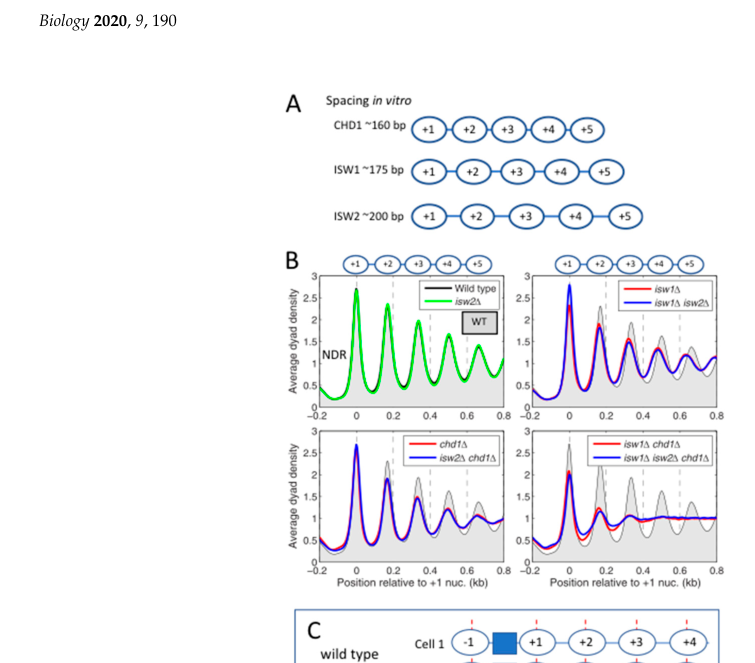
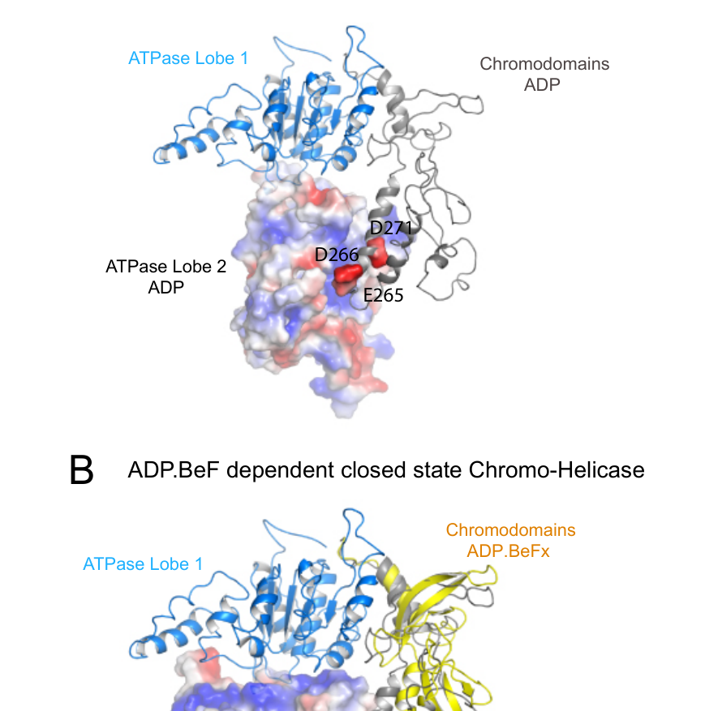

## Question

# Gene Research for Functional Annotation

## ⚠️ CRITICAL: Gene/Protein Identification Context

**BEFORE YOU BEGIN RESEARCH:** You MUST verify you are researching the CORRECT gene/protein. Gene symbols can be ambiguous, especially for less well-characterized genes from non-model organisms.

### Target Gene/Protein Identity (from UniProt):
- **UniProt Accession:** P32657
- **Protein Description:** RecName: Full=Chromo domain-containing protein 1; EC=3.6.4.- {ECO:0000269|PubMed:10811623, ECO:0000269|PubMed:17949749}; AltName: Full=ATP-dependent helicase CHD1;
- **Gene Information:** Name=CHD1; OrderedLocusNames=YER164W; ORFNames=SYGP-ORF4;
- **Organism (full):** Saccharomyces cerevisiae (strain ATCC 204508 / S288c) (Baker's yeast).
- **Protein Family:** Belongs to the SNF2/RAD54 helicase family. .
- **Key Domains:** Cdh1_DBD. (IPR041150); CHD1-2/Hrp3_HTH. (IPR056302); CHD1-like_C. (IPR025260); Chromo-like_dom_sf. (IPR016197); Chromo/chromo_shadow_dom. (IPR000953)

### MANDATORY VERIFICATION STEPS:

1. **Check if the gene symbol "CHD1" matches the protein description above**
2. **Verify the organism is correct:** Saccharomyces cerevisiae (strain ATCC 204508 / S288c) (Baker's yeast).
3. **Check if protein family/domains align with what you find in literature**
4. **If you find literature for a DIFFERENT gene with the same or similar symbol, STOP**

### If Gene Symbol is Ambiguous or You Cannot Find Relevant Literature:

**DO NOT PROCEED WITH RESEARCH ON A DIFFERENT GENE.** Instead:
- State clearly: "The gene symbol 'CHD1' is ambiguous or literature is limited for this specific protein"
- Explain what you found (e.g., "Found extensive literature on a different gene with the same symbol in a different organism")
- Describe the protein based ONLY on the UniProt information provided above
- Suggest that the protein function can be inferred from domain/family information

### Research Target:

Please provide a comprehensive research report on the gene **CHD1** (gene ID: CHD1, UniProt: P32657) in yeast.

The research report should be a detailed narrative explaining the function, biological processes, and localization of the gene product. Citations should be given for all claims.

You should prioritize authoritative reviews and primary scientific literature when conducting research. You can supplement
this with annotations you find in gene/protein databases, but these can be outdated or inaccurate.

We are specifically interested in the primary function of the gene - for enzymes, what reaction is catalyzed, and what is the substrate specificity? For transporters, what is the substrate? For structural proteins or adapters, what is the broader structural role? For signaling molecules, what is the role in the pathway.

We are interested in where in or outside the cell the gene product carries out its function.

We are also interested in the signaling or biochemical pathways in which the gene functions. We are less interested in broad pleiotropic effects, except where these elucidate the precise role.

Include evidence where possible. We are interested in both experimental evidence as well as inference from structure, evolution, or bioinformatic analysis. Precise studies should be prioritized over high-throughput, where available.

## Output

Question: You are an expert researcher providing comprehensive, well-cited information.

Provide detailed information focusing on:
1. Key concepts and definitions with current understanding
2. Recent developments and latest research (prioritize 2023-2024 sources)
3. Current applications and real-world implementations
4. Expert opinions and analysis from authoritative sources
5. Relevant statistics and data from recent studies

Format as a comprehensive research report with proper citations. Include URLs and publication dates where available.
Always prioritize recent, authoritative sources and provide specific citations for all major claims.

# Gene Research for Functional Annotation

## ⚠️ CRITICAL: Gene/Protein Identification Context

**BEFORE YOU BEGIN RESEARCH:** You MUST verify you are researching the CORRECT gene/protein. Gene symbols can be ambiguous, especially for less well-characterized genes from non-model organisms.

### Target Gene/Protein Identity (from UniProt):
- **UniProt Accession:** P32657
- **Protein Description:** RecName: Full=Chromo domain-containing protein 1; EC=3.6.4.- {ECO:0000269|PubMed:10811623, ECO:0000269|PubMed:17949749}; AltName: Full=ATP-dependent helicase CHD1;
- **Gene Information:** Name=CHD1; OrderedLocusNames=YER164W; ORFNames=SYGP-ORF4;
- **Organism (full):** Saccharomyces cerevisiae (strain ATCC 204508 / S288c) (Baker's yeast).
- **Protein Family:** Belongs to the SNF2/RAD54 helicase family. .
- **Key Domains:** Cdh1_DBD. (IPR041150); CHD1-2/Hrp3_HTH. (IPR056302); CHD1-like_C. (IPR025260); Chromo-like_dom_sf. (IPR016197); Chromo/chromo_shadow_dom. (IPR000953)

### MANDATORY VERIFICATION STEPS:

1. **Check if the gene symbol "CHD1" matches the protein description above**
2. **Verify the organism is correct:** Saccharomyces cerevisiae (strain ATCC 204508 / S288c) (Baker's yeast).
3. **Check if protein family/domains align with what you find in literature**
4. **If you find literature for a DIFFERENT gene with the same or similar symbol, STOP**

### If Gene Symbol is Ambiguous or You Cannot Find Relevant Literature:

**DO NOT PROCEED WITH RESEARCH ON A DIFFERENT GENE.** Instead:
- State clearly: "The gene symbol 'CHD1' is ambiguous or literature is limited for this specific protein"
- Explain what you found (e.g., "Found extensive literature on a different gene with the same symbol in a different organism")
- Describe the protein based ONLY on the UniProt information provided above
- Suggest that the protein function can be inferred from domain/family information

### Research Target:

Please provide a comprehensive research report on the gene **CHD1** (gene ID: CHD1, UniProt: P32657) in yeast.

The research report should be a detailed narrative explaining the function, biological processes, and localization of the gene product. Citations should be given for all claims.

You should prioritize authoritative reviews and primary scientific literature when conducting research. You can supplement
this with annotations you find in gene/protein databases, but these can be outdated or inaccurate.

We are specifically interested in the primary function of the gene - for enzymes, what reaction is catalyzed, and what is the substrate specificity? For transporters, what is the substrate? For structural proteins or adapters, what is the broader structural role? For signaling molecules, what is the role in the pathway.

We are interested in where in or outside the cell the gene product carries out its function.

We are also interested in the signaling or biochemical pathways in which the gene functions. We are less interested in broad pleiotropic effects, except where these elucidate the precise role.

Include evidence where possible. We are interested in both experimental evidence as well as inference from structure, evolution, or bioinformatic analysis. Precise studies should be prioritized over high-throughput, where available.

## Research Report: Functional Annotation of *Saccharomyces cerevisiae* **CHD1** (UniProt P32657; gene **CHD1/YER164W**)

### Executive summary
*Saccharomyces cerevisiae* CHD1 encodes **Chd1**, a conserved **SNF2-family ATP-dependent chromatin remodeller** that uses ATP hydrolysis to translocate nucleosomal DNA and thereby **slide and space nucleosomes**, particularly over **actively transcribed gene bodies**. Yeast Chd1 functions in **transcription-coupled chromatin reassembly/organization**, suppressing **cryptic internal transcription** and helping maintain proper **histone-modification domains** near 5′ gene ends; its action is coordinated with elongation factors and histone chaperones (notably **Paf1C/Rtf1** and **FACT**). Mechanistic understanding has been sharpened by structural biology (cryo-EM) and by 2023–2024 biophysical and sequencing-based assays that resolve stepwise and context-dependent sliding behaviors. (lee2017theatpdependentchromatin pages 1-2, sundaramoorthy2018structureofthe pages 1-5, park2023bidirectionalnucleosomesliding pages 1-2, murawska2011chdchromatinremodelers pages 6-7)

### Verification of correct gene/protein identity (disambiguation)
The evidence base summarized here is explicitly focused on **yeast Chd1** and matches the UniProt target: *S. cerevisiae* Chd1 is described as a chromodomain-helicase-DNA-binding remodeler with **tandem chromodomains**, a **bilobal Snf2-like ATPase motor**, and a **C-terminal DNA-binding module (SANT/SLIDE)**, consistent with UniProt P32657 annotations and the SNF2/RAD54 helicase-family assignment. The cryo-EM structure is specifically reported for **Chd1 from the yeast *Saccharomyces cerevisiae*** bound to a nucleosome. (sundaramoorthy2018structureofthe pages 1-5)

### 1) Key concepts and definitions (current understanding)

#### ATP-dependent chromatin remodeller (SNF2-family)
ATP-dependent chromatin remodellers are molecular motors that **hydrolyse ATP** to alter nucleosome position/structure and thereby regulate DNA accessibility. In yeast, Chd1 is classed among remodelers that can **slide nucleosomes** and generate **regular spacing** in nucleosomal arrays. (park2023bidirectionalnucleosomesliding pages 1-2, prajapati2020interplayamongatpdependent pages 1-3)

#### Nucleosome sliding vs spacing vs phasing
- **Sliding**: movement of a nucleosome along DNA, typically driven by a remodeller’s ATPase motor.
- **Spacing**: establishment of a characteristic **nucleosome repeat length** (distance between nucleosomes). 
- **Phasing**: alignment of nucleosomes relative to a genomic “barrier” (e.g., promoter-associated complexes), producing regularly positioned +1, +2, +3… nucleosomes across a population. 
A yeast-centric synthesis identifies CHD1 as one of the main enzymes shaping spacing, with distinct spacing outcomes compared with ISWI-family remodelers. (prajapati2020interplayamongatpdependent pages 5-8)

### 2) Molecular function and mechanism of Chd1 in budding yeast

#### Primary biochemical activity: ATP hydrolysis–driven nucleosome remodelling
Yeast Chd1 is a **monomeric, helicase-type ATPase chromatin remodeller** that engages nucleosomal DNA with its ATPase motor at **superhelix location 2 (SHL2), ~20 bp from the dyad**, and shifts DNA around the histone core through a stepwise translocation cycle, repositioning nucleosomes along DNA. (park2023bidirectionalnucleosomesliding pages 1-2)

#### Structural mechanism on the nucleosome (cryo-EM / structural biochemistry)
A cryo-EM structure of *S. cerevisiae* Chd1 bound to a nucleosome indicates that Chd1 can **detach/unwrap ~two turns of nucleosomal DNA** and binds in a catalytically poised configuration. The **SANT/SLIDE** DNA-binding region contacts detached/linker DNA while the ATPase engages at SHL2; chromodomain movements are linked to ATPase closure and catalysis. (sundaramoorthy2018structureofthe pages 1-5)

Complementary structural/biochemical analysis supports the importance of linker DNA engagement: Chd1 remodels in a state where its DNA-binding domain is positioned on linker DNA, and efficient repositioning depends on this DNA-binding region. (sundaramoorthy2018structureofthe pages 16-19)

#### Substrate context and specificity
Chd1 acts on **nucleosomes** (DNA wrapped on histone octamers) and is sensitive to extranucleosomal DNA context.

Quantitative and mechanistic observations include:
- Reported repositioning range: Chd1 can reposition nucleosomes **23–39 bp into a 54 bp linker** (contextualized relative to ISW1a/ISW2). (sundaramoorthy2018structureofthe pages 16-19)
- In vitro array spacing: CHD1 establishes **~160 bp** spacing, shorter than ISW1/INO80 (**~175 bp**) and ISW2 (**~200 bp**). (prajapati2020interplayamongatpdependent pages 5-8, prajapati2020interplayamongatpdependent media 42544443)

#### Sequence dependence and bidirectional sliding (2023 mechanistic advance)
A 2023 high-resolution sliding study using both Widom 601 and a natural *S. cerevisiae* +1 nucleosome sequence (SWH1) shows that although Chd1 action at one SHL2 site is unidirectional, nucleosome symmetry allows **back-and-forth (bi-directional) sliding** when the enzyme acts on either side. The work also shows that DNA perturbations (poly(dA:dT), mismatches, single-nucleotide insertions) become preferentially positioned about **one helical turn outside SHL2**, and modeling indicates strong phasing can favor **~10 bp shifts**. (park2023bidirectionalnucleosomesliding pages 1-2)

### 3) Biological roles in yeast: transcription-coupled chromatin organization

#### Localization: gene bodies/coding regions (not promoters)
Yeast Chd1 is associated with **transcribed gene bodies** rather than promoters and is enriched over coding regions of active genes. (murawska2011chdchromatinremodelers pages 6-7)

#### Recruitment and interaction network in elongation
Chd1 recruitment is linked to transcription elongation machinery:
- Genome-wide analyses indicate the **PAF1 complex (Paf1C)** is a key determinant of Chd1 recruitment to active genes, and Chd1 occupancy concords with **RNAPII Ser5-phosphorylated** patterns (an early elongation-associated form). (lee2017theatpdependentchromatin pages 1-2, lee2017theatpdependentchromatin pages 2-3)
- **Spt4** (DSIF component) modulates recruitment; **spt4Δ** increases Chd1 binding near transcription start sites, consistent with negative modulation of 5′ recruitment. (lee2017theatpdependentchromatin pages 2-3)
- Rtf1 (Paf1C subunit) is implicated in Chd1 recruitment by earlier gene-level evidence and review synthesis. (murawska2011chdchromatinremodelers pages 6-7)

**Direct interaction evidence (preprint; interpret cautiously):** a 2024/2025 bioRxiv preprint maps a **direct Rtf1–Chd1 interaction**: a short N-terminal region of Rtf1 (aa 1–30) interacts with the **Chd1 CHCT domain**, supported by yeast two-hybrid mapping and alanine-scan disruption of key residues. The authors propose this interaction helps distribute Chd1 across transcribed genes and influences nucleosome positioning and cryptic transcription. (tripplehorn2025adirectinteraction pages 23-26, tripplehorn2025adirectinteraction pages 1-5)

Upstream coupling to DSIF is supported by a peer-reviewed mechanistic study showing that in *S. cerevisiae* a domain of Rtf1 directly interacts with the Spt5 CTR and is required for proper Paf1C recruitment to active genes, consistent with an indirect path by which DSIF→Paf1C could shape Chd1 positioning. (mayekar2013therecruitmentof pages 1-2)

#### Functional cooperation/competition with other remodelers
Yeast chromatin organization reflects interplay among remodelers:
- ISW1 and CHD1 are described as **major nucleosome-spacing enzymes** that can compete to set nucleosome spacing; loss of both produces major disruption partly due to **close-packed dinucleosomes**. (prajapati2020interplayamongatpdependent pages 1-3)
- Genetic/functional synthesis indicates **cryptic transcription** and altered nucleosome spacing are exacerbated in **chd1 isw1 double mutants**, consistent with partially redundant roles in maintaining gene-body chromatin integrity. (murawska2011chdchromatinremodelers pages 6-7)

### 4) Effects on histone modification domains and RNA processing (quantitative genome-wide findings)

#### H3K4me3/H3K36me3 boundary maintenance
A genome-wide study reports that loss of CHD1 yields significantly aberrant H3K4me3/H3K36me3 patterns across **~half of the yeast genome**, predominantly within **~1 kb of transcription start sites**, with reciprocal changes between promoter-proximal (+1–+3) and more distal (+4–+6) nucleosomes. (lee2017theatpdependentchromatin pages 6-9)

Mechanistically, structural work suggests that Chd1-induced partial DNA unwrapping could alter display/accessibility of histone tail epitopes and thereby influence writer/eraser/reader enzymes, consistent with observed mark-boundary effects. (sundaramoorthy2018structureofthe pages 16-19)

#### Splicing/intron retention effects
CHD1 deletion is associated with altered co-transcriptional RNA processing:
- In one RNA-seq analysis, **35 introns** were significantly affected, with **28/35 (80%)** showing **lower intron retention** (improved splicing) in chd1Δ. (lee2017theatpdependentchromatin pages 6-9)
- Reanalysis with deeper RNA-seq indicated **94% of introns** show lower intron retention in chd1Δ, with stronger effects in ribosomal protein genes where Chd1 is highly enriched. (lee2017theatpdependentchromatin pages 6-9)
These data support a model in which Chd1 influences elongation-coupled chromatin state and thereby indirectly impacts splicing efficiency. (lee2017theatpdependentchromatin pages 6-9)

### 5) Regulation by histone modifications and nucleosome features

#### H2B ubiquitination
Structural/biochemical work indicates that **H2B K120 (yeast K123) ubiquitination** can **stimulate Chd1 activity ~2-fold** in vitro and is enriched in coding regions. The same work discusses an estimated **~10% occupancy** of the transiently unwrapped nucleosomal DNA state (baseline), and proposes that ubiquitin repositioning upon Chd1 binding stabilizes this unwrapped configuration, potentially enhancing DNA accessibility. (sundaramoorthy2018structureofthe pages 16-19)

#### H3K36me3 context
Mimicking H3K36 trimethylation (via alkylation) **modestly stimulates** Chd1 activity, but the structural state captured did not show a stable direct interaction of the H3K36 region with the chromodomains, suggesting either weak/transient recognition or a requirement for alternative conformations. (sundaramoorthy2018structureofthe pages 16-19)

### 6) Recent developments and expert synthesis (prioritizing 2023–2024)

#### 2023: High-resolution mapping of remodeler-driven sliding outcomes
The 2023 Slide-seq study provides a modern mechanistic picture of how Chd1 integrates intrinsic DNA features and ATP-driven remodeling, including a concrete explanation for how a nominally unidirectional motor can yield **bi-directional outcomes** through nucleosome symmetry and repeated engagement of SHL2 sites. (park2023bidirectionalnucleosomesliding pages 1-2)

#### 2024: Mechanistic consensus emerging from cryo-EM + single-molecule work (general; cross-species)
Two 2024 reviews summarize the field-wide shift toward a consensus “inside-the-box” translocation mechanism:
- A 2024 Biochemical Society Transactions review emphasizes that cryo-EM and single-molecule methods have only recently brought nucleosome-sliding mechanisms into focus and argues that CHD-family enzymes share a **central remodeling mechanism** with other remodelers, while auxiliary domains create family-specific behaviors. (reid2024howdoeschd4 pages 1-2)
- The same review synthesizes a stepwise model in which nucleotide-state changes in the RecA-like ATPase lobes produce **incremental tracking-strand shifts** and **burst-like DNA release**, and notes that comparable asymmetric stepping behaviors have been observed for multiple remodelers including CHD1 in related work (general, not yeast-specific). (reid2024howdoeschd4 pages 5-6)
- A 2024 biophysics-focused review highlights how cryo-EM and single-molecule FRET studies help explain apparent directional bias in remodeler action (including Chd1) as an emergent property of motor architecture plus **substrate asymmetry** (e.g., differential unwrapping propensity of the Widom 601 sequence). (klempahn2024chromatinremodelersa pages 2-5)

A high-level 2024 *Nature Reviews Genetics* synthesis (mammalian-focused) further underscores that structural/biochemical studies are increasingly defining how remodelers contact nucleosomes and other regulators; although not yeast-specific, it supports the broader interpretive framework for how remodeler specificity emerges from interaction surfaces and dynamic localization. (gourisankar2024contextspecificfunctionsof pages 1-3)

### 7) Current applications and real-world implementations

#### Yeast as a mechanistic model system
The most established “real-world implementation” of yeast CHD1 research is its use as a **model system for chromatin remodeling mechanisms** and for interpreting high-throughput chromatin maps. A yeast-focused review emphasizes yeast’s advantages (small genome, tractable mutants) for chromatin organization studies, including nucleosome spacing/phasing and remodeler competition models. (prajapati2020interplayamongatpdependent pages 5-8)

#### Practical implications for genomic assays and synthetic biology contexts (evidence-limited)
Chd1-dependent spacing/organization is directly relevant to:
- designing and interpreting MNase-seq/chemical mapping and nucleosome-repeat-length analyses (e.g., distinguishing remodeler-set spacing regimes), and
- conceptual engineering of transcriptional programs where chromatin reassembly and cryptic transcription suppression matter.
However, the retrieved literature does not establish a specific industrial/clinical deployment of yeast CHD1 itself; its application is primarily as a **foundational mechanistic tool and model**. (prajapati2020interplayamongatpdependent pages 5-8, murawska2011chdchromatinremodelers pages 6-7)

### Evidence-mapped summary table
The following table compiles key functional claims with quantitative values and source types.

| Functional aspect | Key findings | Evidence type | Primary source(s) with year, DOI URL |
|---|---|---|---|
| Target identity / domain architecture | The literature matches **Saccharomyces cerevisiae Chd1**, the ATP-dependent chromatin remodeler encoded by **CHD1/YER164W**. Core architecture reported for yeast Chd1: tandem chromodomains, bilobal Snf2-family ATPase motor, and C-terminal SANT/SLIDE DNA-binding region; reviews also describe CHD-family flanking regulatory domains. This aligns with UniProt P32657 annotation as a SNF2/RAD54-family chromodomain helicase DNA-binding protein. (sundaramoorthy2018structureofthe pages 1-5, murawska2011chdchromatinremodelers pages 6-7) | Structural, review | Farnung et al., 2017, Nature, https://doi.org/10.1038/nature24046; Murawska & Brehm, 2011, Transcription, https://doi.org/10.4161/trns.2.6.17840 |
| Primary biochemical activity | Chd1 is an **ATP-dependent chromatin remodeler** that repositions/slides nucleosomes and spaces nucleosomal arrays. Chd1 acts on nucleosomal DNA at **SHL2 (~20 bp from the dyad)** and can assemble/reposition nucleosomes into evenly spaced arrays. (park2023bidirectionalnucleosomesliding pages 1-2) | Biochemical, mechanistic | Park et al., 2023, Nucleic Acids Research, https://doi.org/10.1093/nar/gkad738 |
| In vitro spacing specificity | In comparative in vitro spacing assays, **CHD1 establishes the shortest average nucleosome spacing (~160 bp)**, compared with **~175 bp** for ISW1/INO80 and **~200 bp** for ISW2. Yeast average in vivo spacing is **~165 bp**. (prajapati2020interplayamongatpdependent pages 5-8, prajapati2020interplayamongatpdependent media 42544443) | Review of primary spacing assays | Prajapati et al., 2020, Biology, https://doi.org/10.3390/biology9080190 |
| Structural mechanism on nucleosomes | Cryo-EM of **S. cerevisiae** Chd1 bound to the nucleosome shows the ATPase at **SHL +2**, the SANT/SLIDE DNA-binding region contacting linker DNA near **SHL −7**, and Chd1 **detaching/unwrapping two turns of DNA** from the histone octamer. This provides a direct structural explanation for ATP-coupled remodeling. (sundaramoorthy2018structureofthe pages 1-5) | Structural | Farnung et al., 2017, Nature, https://doi.org/10.1038/nature24046; Sundaramoorthy et al., 2018, eLife, https://doi.org/10.1101/290874 |
| Repositioning range / linker dependence | Text summarizing yeast Chd1 remodeling reports that Chd1 can reposition nucleosomes **23–39 bp into a 54 bp linker**, similar to ISW1a/ISW2, supporting active engagement of extranucleosomal linker DNA by the DNA-binding domain. (sundaramoorthy2018structureofthe pages 16-19) | Structural discussion with prior biochemical reference | Sundaramoorthy et al., 2018, eLife, https://doi.org/10.1101/290874 |
| Sliding directionality | Chd1 translocates DNA **unidirectionally toward the dyad** from a single SHL2 site, but because nucleosomes have two symmetric SHL2 sites, the net outcome can be **back-and-forth/bidirectional sliding**. DNA perturbations tend to localize about **one helical turn (~10 bp)** outside SHL2, and strong phasing can favor **~10 bp shifts**. (park2023bidirectionalnucleosomesliding pages 1-2) | Biophysical, sequencing-based mechanistic study | Park et al., 2023, Nucleic Acids Research, https://doi.org/10.1093/nar/gkad738 |
| DNA-sequence sensitivity / substrate preference | On the Widom 601 sequence, Chd1 preferentially shifts the dyad toward the **TA-poor side**; introducing long **poly(dA:dT)** tracts on that side reverses the preferred sliding direction. Similar principles were observed using the natural **S. cerevisiae SWH1 +1 nucleosome** sequence. (park2023bidirectionalnucleosomesliding pages 1-2) | Biophysical, substrate preference | Park et al., 2023, Nucleic Acids Research, https://doi.org/10.1093/nar/gkad738 |
| Cellular localization / chromatin context | Yeast Chd1 is enriched in the **nucleus on transcribed gene bodies/coding regions**, rather than promoters, and is associated with **active transcription**. It tracks especially well with highly transcribed genes and with RNAPII Ser5-phosphorylated occupancy patterns. (murawska2011chdchromatinremodelers pages 6-7, lee2017theatpdependentchromatin pages 1-2) | Genome-wide, review | Lee et al., 2017, Nucleic Acids Research, https://doi.org/10.1093/nar/gkx636; Murawska & Brehm, 2011, Transcription, https://doi.org/10.4161/trns.2.6.17840 |
| Recruitment by elongation machinery | Recruitment is strongly linked to **transcription elongation factors**. Chd1 association decreases in **Rtf1/PAF1C** mutants, supporting recruitment by PAF1C; **Spt4** can oppose/promote redistribution near 5′ ends depending on context. Chd1 also interacts functionally with **FACT (Spt16-Pob3)** and transcription elongation machinery. (murawska2011chdchromatinremodelers pages 6-7, lee2017theatpdependentchromatin pages 1-2, lee2017theatpdependentchromatin pages 2-3) | Genome-wide, genetic, review | Lee et al., 2017, Nucleic Acids Research, https://doi.org/10.1093/nar/gkx636; Murawska & Brehm, 2011, Transcription, https://doi.org/10.4161/trns.2.6.17840 |
| Histone mark recognition / chromodomain function | In budding yeast, Chd1 contributes to maintaining **H3K4me3/H3K36me3 domain boundaries**, but Lee et al. report yeast Chd1 **does not directly bind H3K4me3** the way human CHD1 can. A **H3K36me3 mimic modestly stimulates** Chd1 activity, but the structural study did not support a stable direct H3K36-tail interaction in the captured state. (lee2017theatpdependentchromatin pages 1-2, sundaramoorthy2018structureofthe pages 16-19) | Genome-wide, structural/biochemical | Lee et al., 2017, Nucleic Acids Research, https://doi.org/10.1093/nar/gkx636; Sundaramoorthy et al., 2018, eLife, https://doi.org/10.1101/290874 |
| Modulation by H2B ubiquitination | **H2BK120/K123 ubiquitination stimulates Chd1 activity ~2-fold** in vitro. In the Chd1-bound unwrapped nucleosome, ubiquitin is repositioned toward DNA; the unwrapped nucleosome state is estimated to have **~10% occupancy** in the absence of stabilizing factors, and ubiquitin is proposed to stabilize this transiently unwrapped state. Chd1 mutants also show reduced H2B ubiquitination. (sundaramoorthy2018structureofthe pages 1-5, sundaramoorthy2018structureofthe pages 16-19) | Structural, biochemical | Sundaramoorthy et al., 2018, eLife, https://doi.org/10.1101/290874 |
| Role in transcription-coupled chromatin restoration | Chd1 is thought to help **re-establish nucleosome organization after RNA polymerase II passage**, maintaining chromatin structure over coding regions and preventing inappropriate exposure of internal promoter-like DNA. (lee2017theatpdependentchromatin pages 1-2, park2023bidirectionalnucleosomesliding pages 1-2, murawska2011chdchromatinremodelers pages 6-7) | Genome-wide, mechanistic review | Lee et al., 2017, Nucleic Acids Research, https://doi.org/10.1093/nar/gkx636; Murawska & Brehm, 2011, Transcription, https://doi.org/10.4161/trns.2.6.17840 |
| Cryptic transcription suppression | **chd1 mutants** show initiation from **cryptic internal promoters**; this defect is **strongly enhanced in chd1 isw1 double mutants**, indicating partially redundant roles of Chd1 and Isw1 in preserving coding-region chromatin integrity. (murawska2011chdchromatinremodelers pages 6-7, prajapati2020interplayamongatpdependent pages 1-3) | Genetic, review | Murawska & Brehm, 2011, Transcription, https://doi.org/10.4161/trns.2.6.17840; Prajapati et al., 2020, Biology, https://doi.org/10.3390/biology9080190 |
| Nucleosome organization phenotypes in mutants | Loss of both **ISW1 and CHD1** causes major chromatin disruption and formation of **close-packed dinucleosomes**. chd1Δ alone reduces phasing beyond the +1 nucleosome, whereas double loss causes much stronger disorganization, especially on highly transcribed genes. (tripplehorn2025adirectinteraction pages 1-5, prajapati2020interplayamongatpdependent pages 1-3) | Genetic, review | Prajapati et al., 2020, Biology, https://doi.org/10.3390/biology9080190 |
| Effects on histone modification domains | Loss of CHD1 causes widespread, reciprocal disruption of **H3K4me3** and **H3K36me3** near the 5′ ends of genes, concentrated within **~1 kb of the TSS** and affecting approximately **half of the yeast genome**. (lee2017theatpdependentchromatin pages 2-3, lee2017theatpdependentchromatin pages 6-9) | Genome-wide ChIP-seq / RNA-seq | Lee et al., 2017, Nucleic Acids Research, https://doi.org/10.1093/nar/gkx636 |
| Effects on intron retention / splicing-linked transcription | RNA-seq showed **35 introns** significantly affected in chd1Δ, with **28/35 (80%)** showing **lower intron retention** (improved splicing). Reanalysis with deeper RNA-seq found **94% of introns** had lower retention in chd1Δ, with the effect especially clear in ribosomal protein genes where Chd1 is enriched. (lee2017theatpdependentchromatin pages 6-9) | Genome-wide RNA-seq | Lee et al., 2017, Nucleic Acids Research, https://doi.org/10.1093/nar/gkx636 |
| Relationship with FACT / other partners | Chd1 functionally interacts with **FACT (Spt16-Pob3)**, **PAF1 complex/Rtf1**, and **Spt4-Spt5** elongation factors; these interactions place Chd1 in the transcription-coupled chromatin reassembly pathway rather than acting primarily by changing RNAPII processivity directly. (lee2017theatpdependentchromatin pages 1-2, sundaramoorthy2018structureofthe pages 1-5, murawska2011chdchromatinremodelers pages 6-7) | Genome-wide, structural context, review | Lee et al., 2017, Nucleic Acids Research, https://doi.org/10.1093/nar/gkx636; Sundaramoorthy et al., 2018, eLife, https://doi.org/10.1101/290874; Murawska & Brehm, 2011, Transcription, https://doi.org/10.4161/trns.2.6.17840 |

*Table: This table summarizes functional annotation evidence for Saccharomyces cerevisiae CHD1 (UniProt P32657), including biochemical activity, structural mechanism, recruitment, localization, mutant phenotypes, and key quantitative findings. It is useful as a compact evidence map linking specific claims to source types and DOI-resolved references.*

### Visual evidence: remodeler-specific nucleosome spacing
Prajapati et al. (2020) Figure 4 summarizes how different yeast remodelers generate distinct nucleosome spacing in vitro, including the short spacing attributed to CHD1.

(prajapati2020interplayamongatpdependent media 42544443)

### Limitations and evidence quality notes
- Several key yeast CHD1 functional conclusions are anchored in peer-reviewed primary studies and reviews (e.g., structural and genome-wide functional work). (sundaramoorthy2018structureofthe pages 1-5, lee2017theatpdependentchromatin pages 6-9, murawska2011chdchromatinremodelers pages 6-7)
- The most specific direct Rtf1–Chd1 interaction mapping available in this evidence set is from a **bioRxiv preprint (2024/2025)**; conclusions drawn from it should be considered provisional until peer-reviewed publication, but it is mechanistically consistent with earlier recruitment models. (tripplehorn2025adirectinteraction pages 23-26, tripplehorn2025adirectinteraction pages 1-5)

### Key references (with dates and URLs)
- Park S. et al. “Bi-directional nucleosome sliding by the Chd1 chromatin remodeler…” **Published online 20 Sep 2023**. *Nucleic Acids Research*. https://doi.org/10.1093/nar/gkad738 (park2023bidirectionalnucleosomesliding pages 1-2)
- Klempahn S. et al. “Chromatin remodelers: a concise introduction for biophysicists.” **Jun 2024**. *Biophysical Reviews*. https://doi.org/10.1007/s12551-024-01199-1 (klempahn2024chromatinremodelersa pages 2-5)
- Reid X.J. et al. “How does CHD4 slide nucleosomes?” **2 Sep 2024**. *Biochemical Society Transactions*. https://doi.org/10.1042/BST20230070 (reid2024howdoeschd4 pages 1-2)
- Lee Y. et al. “The ATP-dependent chromatin remodeler Chd1…” **Jul 2017**. *Nucleic Acids Research*. https://doi.org/10.1093/nar/gkx636 (lee2017theatpdependentchromatin pages 1-2)
- Sundaramoorthy R. et al. “Structure of the chromatin remodelling enzyme Chd1 bound to a ubiquitinylated nucleosome.” **Posted 30 Mar 2018** (preprint version in this corpus; eLife-associated). https://doi.org/10.1101/290874 (sundaramoorthy2018structureofthe pages 16-19)
- Prajapati H.K. et al. “Interplay among ATP-Dependent Chromatin Remodelers Determines Chromatin Organisation in Yeast.” **Jul 2020**. *Biology*. https://doi.org/10.3390/biology9080190 (prajapati2020interplayamongatpdependent pages 5-8)
- Murawska M. & Brehm A. “CHD chromatin remodelers and the transcription cycle.” **Nov 2011**. *Transcription*. https://doi.org/10.4161/trns.2.6.17840 (murawska2011chdchromatinremodelers pages 6-7)
- Mayekar M.K. et al. “The Recruitment of the *S. cerevisiae* Paf1 Complex…” **Aug 2013**. *Molecular and Cellular Biology*. https://doi.org/10.1128/mcb.00270-13 (mayekar2013therecruitmentof pages 1-2)

References

1. (lee2017theatpdependentchromatin pages 1-2): Yaelim Lee, Daechan Park, and Vishwanath R. Iyer. The atp-dependent chromatin remodeler chd1 is recruited by transcription elongation factors and maintains h3k4me3/h3k36me3 domains at actively transcribed and spliced genes. Nucleic Acids Research, 45:8646-8646, Jul 2017. URL: https://doi.org/10.1093/nar/gkx636, doi:10.1093/nar/gkx636. This article has 70 citations and is from a highest quality peer-reviewed journal.

2. (sundaramoorthy2018structureofthe pages 1-5): Ramasubramanian Sundaramoorthy, Amanda L. Hughes, Hassane El-Mkami, David Norman, and Tom Owen-Hughes. Structure of the chromatin remodelling enzyme chd1 bound to a ubiquitinylated nucleosome. eLife, Mar 2018. URL: https://doi.org/10.1101/290874, doi:10.1101/290874. This article has 100 citations and is from a domain leading peer-reviewed journal.

3. (park2023bidirectionalnucleosomesliding pages 1-2): Sangwoo Park, Giovanni B Brandani, Taekjip Ha, and Gregory D Bowman. Bi-directional nucleosome sliding by the chd1 chromatin remodeler integrates intrinsic sequence-dependent and atp-dependent nucleosome positioning. Nucleic Acids Research, 51:10326-10343, Sep 2023. URL: https://doi.org/10.1093/nar/gkad738, doi:10.1093/nar/gkad738. This article has 23 citations and is from a highest quality peer-reviewed journal.

4. (murawska2011chdchromatinremodelers pages 6-7): Magdalena Murawska and Alexander Brehm. Chd chromatin remodelers and the transcription cycle. Transcription, 2:244-253, Nov 2011. URL: https://doi.org/10.4161/trns.2.6.17840, doi:10.4161/trns.2.6.17840. This article has 162 citations and is from a peer-reviewed journal.

5. (prajapati2020interplayamongatpdependent pages 1-3): Hemant K. Prajapati, Josefina Ocampo, and David J. Clark. Interplay among atp-dependent chromatin remodelers determines chromatin organisation in yeast. Biology, 9:190, Jul 2020. URL: https://doi.org/10.3390/biology9080190, doi:10.3390/biology9080190. This article has 43 citations.

6. (prajapati2020interplayamongatpdependent pages 5-8): Hemant K. Prajapati, Josefina Ocampo, and David J. Clark. Interplay among atp-dependent chromatin remodelers determines chromatin organisation in yeast. Biology, 9:190, Jul 2020. URL: https://doi.org/10.3390/biology9080190, doi:10.3390/biology9080190. This article has 43 citations.

7. (sundaramoorthy2018structureofthe pages 16-19): Ramasubramanian Sundaramoorthy, Amanda L. Hughes, Hassane El-Mkami, David Norman, and Tom Owen-Hughes. Structure of the chromatin remodelling enzyme chd1 bound to a ubiquitinylated nucleosome. eLife, Mar 2018. URL: https://doi.org/10.1101/290874, doi:10.1101/290874. This article has 100 citations and is from a domain leading peer-reviewed journal.

8. (prajapati2020interplayamongatpdependent media 42544443): Hemant K. Prajapati, Josefina Ocampo, and David J. Clark. Interplay among atp-dependent chromatin remodelers determines chromatin organisation in yeast. Biology, 9:190, Jul 2020. URL: https://doi.org/10.3390/biology9080190, doi:10.3390/biology9080190. This article has 43 citations.

9. (lee2017theatpdependentchromatin pages 2-3): Yaelim Lee, Daechan Park, and Vishwanath R. Iyer. The atp-dependent chromatin remodeler chd1 is recruited by transcription elongation factors and maintains h3k4me3/h3k36me3 domains at actively transcribed and spliced genes. Nucleic Acids Research, 45:8646-8646, Jul 2017. URL: https://doi.org/10.1093/nar/gkx636, doi:10.1093/nar/gkx636. This article has 70 citations and is from a highest quality peer-reviewed journal.

10. (tripplehorn2025adirectinteraction pages 23-26): Sarah A. Tripplehorn, Margaret K. Shirra, Santana M. Lardo, Hannah G. Marvil, Sarah J. Hainer, and Karen M. Arndt. A direct interaction between the chd1 chct domain and rtf1 controls chd1 distribution and nucleosome positioning on active genes. bioRxiv, Dec 2025. URL: https://doi.org/10.1101/2024.12.06.627179, doi:10.1101/2024.12.06.627179. This article has 7 citations.

11. (tripplehorn2025adirectinteraction pages 1-5): Sarah A. Tripplehorn, Margaret K. Shirra, Santana M. Lardo, Hannah G. Marvil, Sarah J. Hainer, and Karen M. Arndt. A direct interaction between the chd1 chct domain and rtf1 controls chd1 distribution and nucleosome positioning on active genes. bioRxiv, Dec 2025. URL: https://doi.org/10.1101/2024.12.06.627179, doi:10.1101/2024.12.06.627179. This article has 7 citations.

12. (mayekar2013therecruitmentof pages 1-2): Manasi K. Mayekar, Richard G. Gardner, and Karen M. Arndt. The recruitment of the <i>saccharomyces cerevisiae</i> paf1 complex to active genes requires a domain of rtf1 that directly interacts with the spt4-spt5 complex. Molecular and Cellular Biology, 33:3259-3273, Aug 2013. URL: https://doi.org/10.1128/mcb.00270-13, doi:10.1128/mcb.00270-13. This article has 87 citations and is from a domain leading peer-reviewed journal.

13. (lee2017theatpdependentchromatin pages 6-9): Yaelim Lee, Daechan Park, and Vishwanath R. Iyer. The atp-dependent chromatin remodeler chd1 is recruited by transcription elongation factors and maintains h3k4me3/h3k36me3 domains at actively transcribed and spliced genes. Nucleic Acids Research, 45:8646-8646, Jul 2017. URL: https://doi.org/10.1093/nar/gkx636, doi:10.1093/nar/gkx636. This article has 70 citations and is from a highest quality peer-reviewed journal.

14. (reid2024howdoeschd4 pages 1-2): Xavier J. Reid, Yichen Zhong, and Joel P. Mackay. How does chd4 slide nucleosomes? Biochemical Society Transactions, 52:1995-2008, Sep 2024. URL: https://doi.org/10.1042/bst20230070, doi:10.1042/bst20230070. This article has 9 citations and is from a peer-reviewed journal.

15. (reid2024howdoeschd4 pages 5-6): Xavier J. Reid, Yichen Zhong, and Joel P. Mackay. How does chd4 slide nucleosomes? Biochemical Society Transactions, 52:1995-2008, Sep 2024. URL: https://doi.org/10.1042/bst20230070, doi:10.1042/bst20230070. This article has 9 citations and is from a peer-reviewed journal.

16. (klempahn2024chromatinremodelersa pages 2-5): Sophie Klempahn, Helmut Schiessel, and Ralf Blossey. Chromatin remodelers: a concise introduction for biophysicists. Biophysical reviews, 16 3:357-363, Jun 2024. URL: https://doi.org/10.1007/s12551-024-01199-1, doi:10.1007/s12551-024-01199-1. This article has 2 citations and is from a peer-reviewed journal.

17. (gourisankar2024contextspecificfunctionsof pages 1-3): Sai Gourisankar, Andrey Krokhotin, Wendy Wenderski, and Gerald R. Crabtree. Context-specific functions of chromatin remodellers in development and disease. Nature Reviews Genetics, 25:340-361, Nov 2024. URL: https://doi.org/10.1038/s41576-023-00666-x, doi:10.1038/s41576-023-00666-x. This article has 75 citations and is from a domain leading peer-reviewed journal.

## Artifacts

- [Edison artifact artifact-00](CHD1-deep-research-falcon_artifacts/artifact-00.md)

## Citations

1. sundaramoorthy2018structureofthe pages 1-5
2. prajapati2020interplayamongatpdependent pages 5-8
3. park2023bidirectionalnucleosomesliding pages 1-2
4. sundaramoorthy2018structureofthe pages 16-19
5. murawska2011chdchromatinremodelers pages 6-7
6. lee2017theatpdependentchromatin pages 2-3
7. mayekar2013therecruitmentof pages 1-2
8. prajapati2020interplayamongatpdependent pages 1-3
9. lee2017theatpdependentchromatin pages 6-9
10. klempahn2024chromatinremodelersa pages 2-5
11. gourisankar2024contextspecificfunctionsof pages 1-3
12. lee2017theatpdependentchromatin pages 1-2
13. tripplehorn2025adirectinteraction pages 23-26
14. tripplehorn2025adirectinteraction pages 1-5
15. https://doi.org/10.1038/nature24046;
16. https://doi.org/10.4161/trns.2.6.17840
17. https://doi.org/10.1093/nar/gkad738
18. https://doi.org/10.3390/biology9080190
19. https://doi.org/10.1101/290874
20. https://doi.org/10.1093/nar/gkx636;
21. https://doi.org/10.4161/trns.2.6.17840;
22. https://doi.org/10.1093/nar/gkx636
23. https://doi.org/10.1101/290874;
24. https://doi.org/10.1007/s12551-024-01199-1
25. https://doi.org/10.1042/BST20230070
26. https://doi.org/10.1128/mcb.00270-13
27. https://doi.org/10.1093/nar/gkx636,
28. https://doi.org/10.1101/290874,
29. https://doi.org/10.1093/nar/gkad738,
30. https://doi.org/10.4161/trns.2.6.17840,
31. https://doi.org/10.3390/biology9080190,
32. https://doi.org/10.1101/2024.12.06.627179,
33. https://doi.org/10.1128/mcb.00270-13,
34. https://doi.org/10.1042/bst20230070,
35. https://doi.org/10.1007/s12551-024-01199-1,
36. https://doi.org/10.1038/s41576-023-00666-x,