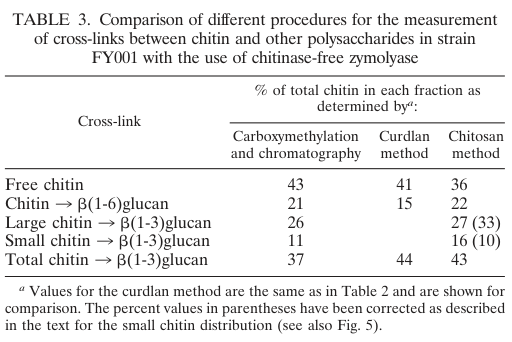

## Question

# Gene Research for Functional Annotation

## ⚠️ CRITICAL: Gene/Protein Identification Context

**BEFORE YOU BEGIN RESEARCH:** You MUST verify you are researching the CORRECT gene/protein. Gene symbols can be ambiguous, especially for less well-characterized genes from non-model organisms.

### Target Gene/Protein Identity (from UniProt):
- **UniProt Accession:** P53301
- **Protein Description:** RecName: Full=Congo red hypersensitive protein 1 {ECO:0000303|PubMed:10757808}; Includes: RecName: Full=Chitinase CRH1 {ECO:0000303|PubMed:23919454}; EC=3.2.1.14 {ECO:0000269|PubMed:23919454}; Includes: RecName: Full=Chitin transglycosylase CRH1 {ECO:0000303|PubMed:18694928}; EC=2.4.-.- {ECO:0000269|PubMed:18694928, ECO:0000269|PubMed:19734368, ECO:0000269|PubMed:23919454}; Flags: Precursor;
- **Gene Information:** Name=CRH1 {ECO:0000303|PubMed:10757808}; OrderedLocusNames=YGR189C; ORFNames=G7553;
- **Organism (full):** Saccharomyces cerevisiae (strain ATCC 204508 / S288c) (Baker's yeast).
- **Protein Family:** Belongs to the glycosyl hydrolase 16 family. CRH1
- **Key Domains:** Beta-glucanase-like. (IPR000757); CHR-like. (IPR017168); ConA-like_dom_sf. (IPR013320); Glycosyl_Hydrlase_16. (IPR050546); Glyco_hydro_16 (PF00722)

### MANDATORY VERIFICATION STEPS:

1. **Check if the gene symbol "CRH1" matches the protein description above**
2. **Verify the organism is correct:** Saccharomyces cerevisiae (strain ATCC 204508 / S288c) (Baker's yeast).
3. **Check if protein family/domains align with what you find in literature**
4. **If you find literature for a DIFFERENT gene with the same or similar symbol, STOP**

### If Gene Symbol is Ambiguous or You Cannot Find Relevant Literature:

**DO NOT PROCEED WITH RESEARCH ON A DIFFERENT GENE.** Instead:
- State clearly: "The gene symbol 'CRH1' is ambiguous or literature is limited for this specific protein"
- Explain what you found (e.g., "Found extensive literature on a different gene with the same symbol in a different organism")
- Describe the protein based ONLY on the UniProt information provided above
- Suggest that the protein function can be inferred from domain/family information

### Research Target:

Please provide a comprehensive research report on the gene **CRH1** (gene ID: CRH1, UniProt: P53301) in yeast.

The research report should be a detailed narrative explaining the function, biological processes, and localization of the gene product. Citations should be given for all claims.

You should prioritize authoritative reviews and primary scientific literature when conducting research. You can supplement
this with annotations you find in gene/protein databases, but these can be outdated or inaccurate.

We are specifically interested in the primary function of the gene - for enzymes, what reaction is catalyzed, and what is the substrate specificity? For transporters, what is the substrate? For structural proteins or adapters, what is the broader structural role? For signaling molecules, what is the role in the pathway.

We are interested in where in or outside the cell the gene product carries out its function.

We are also interested in the signaling or biochemical pathways in which the gene functions. We are less interested in broad pleiotropic effects, except where these elucidate the precise role.

Include evidence where possible. We are interested in both experimental evidence as well as inference from structure, evolution, or bioinformatic analysis. Precise studies should be prioritized over high-throughput, where available.

## Output

Question: You are an expert researcher providing comprehensive, well-cited information.

Provide detailed information focusing on:
1. Key concepts and definitions with current understanding
2. Recent developments and latest research (prioritize 2023-2024 sources)
3. Current applications and real-world implementations
4. Expert opinions and analysis from authoritative sources
5. Relevant statistics and data from recent studies

Format as a comprehensive research report with proper citations. Include URLs and publication dates where available.
Always prioritize recent, authoritative sources and provide specific citations for all major claims.

# Gene Research for Functional Annotation

## ⚠️ CRITICAL: Gene/Protein Identification Context

**BEFORE YOU BEGIN RESEARCH:** You MUST verify you are researching the CORRECT gene/protein. Gene symbols can be ambiguous, especially for less well-characterized genes from non-model organisms.

### Target Gene/Protein Identity (from UniProt):
- **UniProt Accession:** P53301
- **Protein Description:** RecName: Full=Congo red hypersensitive protein 1 {ECO:0000303|PubMed:10757808}; Includes: RecName: Full=Chitinase CRH1 {ECO:0000303|PubMed:23919454}; EC=3.2.1.14 {ECO:0000269|PubMed:23919454}; Includes: RecName: Full=Chitin transglycosylase CRH1 {ECO:0000303|PubMed:18694928}; EC=2.4.-.- {ECO:0000269|PubMed:18694928, ECO:0000269|PubMed:19734368, ECO:0000269|PubMed:23919454}; Flags: Precursor;
- **Gene Information:** Name=CRH1 {ECO:0000303|PubMed:10757808}; OrderedLocusNames=YGR189C; ORFNames=G7553;
- **Organism (full):** Saccharomyces cerevisiae (strain ATCC 204508 / S288c) (Baker's yeast).
- **Protein Family:** Belongs to the glycosyl hydrolase 16 family. CRH1
- **Key Domains:** Beta-glucanase-like. (IPR000757); CHR-like. (IPR017168); ConA-like_dom_sf. (IPR013320); Glycosyl_Hydrlase_16. (IPR050546); Glyco_hydro_16 (PF00722)

### MANDATORY VERIFICATION STEPS:

1. **Check if the gene symbol "CRH1" matches the protein description above**
2. **Verify the organism is correct:** Saccharomyces cerevisiae (strain ATCC 204508 / S288c) (Baker's yeast).
3. **Check if protein family/domains align with what you find in literature**
4. **If you find literature for a DIFFERENT gene with the same or similar symbol, STOP**

### If Gene Symbol is Ambiguous or You Cannot Find Relevant Literature:

**DO NOT PROCEED WITH RESEARCH ON A DIFFERENT GENE.** Instead:
- State clearly: "The gene symbol 'CRH1' is ambiguous or literature is limited for this specific protein"
- Explain what you found (e.g., "Found extensive literature on a different gene with the same symbol in a different organism")
- Describe the protein based ONLY on the UniProt information provided above
- Suggest that the protein function can be inferred from domain/family information

### Research Target:

Please provide a comprehensive research report on the gene **CRH1** (gene ID: CRH1, UniProt: P53301) in yeast.

The research report should be a detailed narrative explaining the function, biological processes, and localization of the gene product. Citations should be given for all claims.

You should prioritize authoritative reviews and primary scientific literature when conducting research. You can supplement
this with annotations you find in gene/protein databases, but these can be outdated or inaccurate.

We are specifically interested in the primary function of the gene - for enzymes, what reaction is catalyzed, and what is the substrate specificity? For transporters, what is the substrate? For structural proteins or adapters, what is the broader structural role? For signaling molecules, what is the role in the pathway.

We are interested in where in or outside the cell the gene product carries out its function.

We are also interested in the signaling or biochemical pathways in which the gene functions. We are less interested in broad pleiotropic effects, except where these elucidate the precise role.

Include evidence where possible. We are interested in both experimental evidence as well as inference from structure, evolution, or bioinformatic analysis. Precise studies should be prioritized over high-throughput, where available.

# Research report: *Saccharomyces cerevisiae* **CRH1** (YGR189C; UniProt P53301)

## 1. Target verification (gene/protein identity)
**CRH1** in this report refers specifically to *S. cerevisiae* S288c **YGR189C** (UniProt **P53301**), originally described as **Congo red hypersensitive protein 1** and a member of the fungal **Crh (Congo red hypersensitivity)** family of cell-wall enzymes. The defining molecular features—N-terminal secretion signal, Ser/Thr-rich region, predicted **GPI-anchor** signal, and **GH16** catalytic motif—were experimentally described for YGR189C/Crh1 and align with the UniProt entry. (rodriguezpena2000anovelfamily pages 3-5, rodriguezpena2000anovelfamily pages 7-9, teparic2013proteinsinvolvedin pages 3-5)

## 2. Key concepts and current understanding
### 2.1 Yeast cell-wall architecture and “cross-linking”
The *S. cerevisiae* cell wall is a composite polymer network whose mechanical strength depends not only on synthesis of individual polysaccharides (e.g., chitin and β-glucans) but also on **covalent cross-links** between them. In this context, “cross-linking” refers to enzymatic creation of covalent bonds that connect different wall polymers, reducing solubility of wall material and increasing rigidity. (teparic2013proteinsinvolvedin pages 12-13, teparic2013proteinsinvolvedin pages 3-5)

### 2.2 The Crh family and GH16 transglycosylases
Crh proteins are fungal GH16 enzymes implicated in wall remodeling via **transglycosylation** reactions. In *S. cerevisiae*, Crh1 and its paralog Crh2 are described as enzymes that **attach chitin to β-glucans**, thereby interconnecting wall polysaccharides at sites of growth and division. (teparic2013proteinsinvolvedin pages 12-13, cabib2007crh1pandcrh2p pages 1-2, cabib2009twonoveltechniques pages 6-7)

A central biochemical concept is that these enzymes favor **transfer** (transglycosylation) over net hydrolysis: a glycosidic bond in a donor substrate is cleaved and a new bond is formed to an acceptor polymer/oligosaccharide, effectively “grafting” one polysaccharide segment onto another. (omar2016investigatingtherole pages 41-45, fang2019mechanismsofredundancy pages 1-2)

## 3. Molecular/enzymatic function of Crh1
### 3.1 Primary reaction (in vivo cell wall chemistry)
Genetic and biochemical evidence demonstrates that **Crh1 and Crh2 are required to form chitin–glucan covalent complexes** in the *S. cerevisiae* wall. In particular, Cabib and colleagues showed that loss of **CRH1** or **CRH2** reduces chitin linked to **β(1→6)-glucan**, while the **crh1Δ crh2Δ** double mutant abolishes detectable chitin–β(1→6)-glucan linkage; overexpression of **CRH1** increases the chitin–β(1→6)-glucan complex. (cabib2007crh1pandcrh2p pages 1-2)

A subsequent study using multiple orthogonal analytical methods concluded that Crh1/Crh2 account for **all detectable chitin-containing cross-links**, attaching chitin not only to **β(1→6)-glucan** but also to **β(1→3)-glucan**. (cabib2009twonoveltechniques pages 1-2, cabib2009twonoveltechniques pages 6-7, cabib2009twonoveltechniques pages 7-10)

### 3.2 Donor/acceptor specificity and substrate constraints
Direct *S. cerevisiae* wall fractionation supports that chitin is partitioned into free and glucan-linked forms, consistent with transfer of chitin fragments to β-glucan acceptors. (cabib2009twonoveltechniques pages 6-7, cabib2009twonoveltechniques media 0f993bce)

Biochemical characterization summarized for the Crh family indicates:
- **Soluble chitin derivatives** (e.g., glycol-chitin) can act as **donors**.
- The enzyme can join the **reducing end of a chitin donor** to the **non-reducing end of an acceptor** oligosaccharide.
- Minimal acceptor length can be very short (reported as ~2 monomers in one summary), consistent with transfer onto short β-glucan oligosaccharides. (omar2016investigatingtherole pages 41-45)

High-impact structural/biochemical work on Crh transglycosylases in filamentous fungi provides a mechanistic model likely relevant to yeast Crh enzymes: donor binding spans multiple sugar subsites, acceptor binding is shorter, and the overall architecture helps explain efficient transglycosylation. This work also reports concrete length requirements (minimal donor length of five N-acetyl-chitooligosaccharide units and minimal acceptor length of two glucose units) and provides a structural basis for “acceptor promiscuity” (chitin–glucan and chitin–chitin transfer) observed across the family. (fang2019mechanismsofredundancy pages 1-2)

### 3.3 Catalytic residues and requirement of the GH16 motif
CRH1 contains the conserved GH16-like catalytic motif **DE(I/L)DXE**, homologous to motifs in bacterial endo-β-glucanases. A catalytic-site mutant allele (Crh1 with substitutions at key acidic residues) fails to complement Congo red sensitivity, implying that the predicted catalytic residues are essential for function in vivo. (rodriguezpena2000anovelfamily pages 5-6, rodriguezpena2000anovelfamily pages 9-10)

## 4. Cellular localization and where Crh1 acts
### 4.1 Cell-surface/cell-wall localization
Crh1 behaves as a **cell-wall protein**: it is reported to be covalently incorporated into the wall and releasable by glucanase (laminarinase), consistent with a GPI-anchored wall protein that becomes wall-integrated. (rodriguezpena2000anovelfamily pages 7-9)

### 4.2 Spatial enrichment at chitin-rich growth sites
Crh1-GFP localization studies show enrichment at **polarized growth sites**—bud emergence, the **mother–daughter neck**, and bud scars—where chitin is enriched; Crh1 also appears at mating-related structures and marks **spore envelopes** during sporulation. (rodriguezpena2000anovelfamily pages 7-9, rodriguezpena2000anovelfamily pages 9-10)

Cabib et al. further report that at elevated temperature (38°C) both Crh1 and Crh2 show increased and more broadly distributed cortical/lateral wall localization, consistent with stress-induced remodeling. (cabib2007crh1pandcrh2p pages 9-10)

## 5. Biological role in pathways and cell physiology
### 5.1 Role in cell wall integrity and morphogenesis
Crh1’s primary role is best described as **strengthening and organizing the wall** by creating **covalent chitin–β-glucan cross-links** at sites of growth and division. Review-level synthesis places Crh1/Crh2 among enzymes that interconnect wall polysaccharides, producing glucan fibrils and contributing to the structured wall network. (teparic2013proteinsinvolvedin pages 12-13, teparic2013proteinsinvolvedin pages 3-5)

### 5.2 Interaction with the cell integrity pathway (CWI signaling)
CRH1 is transcriptionally and/or protein-level induced by cell-wall stress conditions: shifting cells to **38°C** increases CRH1 expression via the **cell integrity pathway**, and this induction is abolished in an **slt2Δ** mutant, directly linking CRH1 to the CWI MAPK pathway. (cabib2007crh1pandcrh2p pages 10-12, cabib2007crh1pandcrh2p pages 1-2)

## 6. Phenotypes and quantitative data from key studies
### 6.1 Congo red / Calcofluor white hypersensitivity
CRH1 deletion causes sensitivity to cell-wall perturbing dyes **Congo red** and **Calcofluor white**, with stronger phenotypes in **crh1Δ crh2Δ** double mutants, consistent with partially redundant cross-linking functions. (rodriguezpena2000anovelfamily pages 3-5, rodriguezpena2000anovelfamily pages 9-10)

### 6.2 Effects on wall polymer solubility and cross-link distribution
Rodríguez-Peña et al. report increased **alkali-soluble glucan** in crh mutants, with the **crh1Δ crh2Δ** double mutant showing an increase that is “almost doubled” versus wild type, consistent with reduced cross-linking/insolubilization of glucan in the wall. (rodriguezpena2000anovelfamily pages 5-6)

Cabib (2009) reports quantitative partitioning of cell-wall chitin (wild type FY001) across three independent methods (carboxymethylation–chromatography; curdlan; chitosan), giving broadly concordant estimates:
- **Free chitin:** ~36–43% of total chitin
- **Chitin–β(1→6)-glucan:** ~15–22%
- **Total chitin–β(1→3)-glucan:** ~37–44%
The **crh1 crh2** double mutant shows **virtually all chitin as free**, i.e., loss of bound fractions. (cabib2009twonoveltechniques pages 6-7, cabib2009twonoveltechniques pages 1-2, cabib2009twonoveltechniques media 0f993bce)

The associated chromatographic/assay readouts are shown in Cabib (2009) figures (fractionation profiles and distributions), providing visual evidence that bound chitin peaks disappear in crh mutants. (cabib2009twonoveltechniques media c7aa73a2, cabib2009twonoveltechniques media 283cf6bf, cabib2009twonoveltechniques media d429ca82)

### 6.3 Expression statistics and cell-cycle regulation
Rodríguez-Peña et al. report that **CRH2** is expressed approximately **6-fold higher** than **CRH1** in vegetative cells, while **CRH1** expression increases approximately **2-fold** on galactose and **4–5-fold** transiently after release from pheromone arrest; CRH1 expression is cell-cycle regulated with peaks around **G1** and **M/G1**, aligning with functions at budding and septation. (rodriguezpena2000anovelfamily pages 5-6, rodriguezpena2000anovelfamily pages 9-10)

### 6.4 Overexpression phenotypes
Overexpression of **CRH2** confers strong Congo red resistance (reported as growth up to **200 mg/ml** Congo red under the described conditions), indicating dosage sensitivity consistent with a wall-strengthening enzyme. (rodriguezpena2000anovelfamily pages 5-6)

## 7. Recent developments (prioritizing 2023–2024)
### 7.1 Industrially relevant stress tolerance and wall remodeling (2023)
A 2023 evolutionary engineering study generating **2-phenylethanol-resistant** *S. cerevisiae* identified a missense variant **Crh1p.D223N** in the adapted strain. While causality was not proven, the authors note increased **lyticase resistance** in the evolved strain and discuss CRH1/CRH2 as chitin transglycosylases mediating chitin–β-glucan linkages, implicating wall remodeling as part of the tolerance phenotype. (Holyavkin et al., 2023-04, *Frontiers in Microbiology*, https://doi.org/10.3389/fmicb.2023.1148065) (holyavkin2023genomictranscriptomicand pages 8-9)

**Interpretation:** Because lyticase primarily targets β(1→3)-glucan, increased resistance is consistent with altered glucan accessibility/architecture and supports the idea that CRH1 sequence variants or regulatory changes can modulate wall robustness under industrially relevant solvent/toxin stress. However, the direct biochemical impact of D223N on Crh1 activity remains an open question. (holyavkin2023genomictranscriptomicand pages 8-9)

### 7.2 Updated conceptual framing of yeast wall organization (2024)
A 2024 review emphasizes the dynamic organization of the yeast wall and highlights remodeling enzymes—including Gas and **Crh-family** proteins—as important components shaping wall architecture through ongoing polysaccharide remodeling and noncovalent interactions. This reinforces the contemporary view that Crh-mediated cross-linking is one of several coordinated enzymatic activities controlling wall mechanics and adaptability. (Kalebina et al., 2024-02, *International Journal of Molecular Sciences*, https://doi.org/10.3390/ijms25052496) (teparic2013proteinsinvolvedin pages 3-5)

## 8. Current applications and real-world implementations
### 8.1 Industrial yeast engineering
CRH1 is not typically engineered as a primary metabolic gene, but its demonstrated role in wall strengthening and evidence from adaptive evolution suggest it can influence **process robustness** (e.g., enzyme-based cell lysis resistance). The 2023 evolved strain linking a CRH1 variant with lyticase resistance provides an example of CRH1 emerging as a candidate locus in industrial strain adaptation pipelines. (holyavkin2023genomictranscriptomicand pages 8-9)

### 8.2 Antifungal target relevance (family-level evidence)
While *S. cerevisiae* CRH1 itself is not an antifungal drug target in clinical settings, Crh-family enzymes are **fungal-specific** wall-assembly factors. Structural/biochemical work on Crh transglycosylases in pathogenic fungi supports the plausibility of **Crh inhibition** as an antifungal strategy by disrupting chitin–glucan (and potentially chitin–chitin) cross-linking and increasing sensitivity to wall stressors. This family-level mechanistic evidence informs how yeast Crh1 functions and why the enzymatic mechanism is of broad interest. (fang2019mechanismsofredundancy pages 1-2)

## 9. Expert synthesis and conclusions
1. **Primary function:** CRH1 encodes a GH16 **transglycosylase** that **covalently links chitin to β-glucans**, contributing to the mechanical integrity and proper architecture of the yeast cell wall. The strongest direct evidence is the abolishment of bound chitin fractions and chitin–β(1→6)glucan complexes in crh mutants, and increased complex formation upon CRH1 overexpression. (cabib2007crh1pandcrh2p pages 1-2, cabib2009twonoveltechniques pages 6-7, cabib2009twonoveltechniques pages 1-2)
2. **Substrate specificity:** In vivo, Crh1/Crh2 create both **chitin–β(1→6)glucan** and **chitin–β(1→3)glucan** linkages; family-level biochemical/structural work supports short acceptor requirements and a transglycosylation-favoring mechanism. (cabib2009twonoveltechniques pages 6-7, fang2019mechanismsofredundancy pages 1-2)
3. **Cellular site of action:** Crh1 is a secreted/GPI-linked wall protein enriched at **bud necks, bud scars, and other chitin-rich sites**, consistent with a role in building/reinforcing the wall during polarized growth and cytokinesis. (rodriguezpena2000anovelfamily pages 7-9, rodriguezpena2000anovelfamily pages 9-10)
4. **Pathway integration:** CRH1 is connected to the **cell integrity (CWI) pathway** via stress/temperature induction dependent on SLT2, linking cross-link formation to stress-adaptive remodeling. (cabib2007crh1pandcrh2p pages 10-12)
5. **Quantitative wall impact:** In wild type, a substantial fraction of wall chitin exists in **cross-linked** form (≈15–22% to β(1→6)-glucan and ≈37–44% to β(1→3)-glucan, method-dependent), and these linkages are essentially eliminated in **crh1 crh2** mutants. (cabib2009twonoveltechniques pages 6-7, cabib2009twonoveltechniques media 0f993bce)

## Summary table
The following table consolidates core functional annotation elements and supporting sources.

| Aspect | Key findings | Best supporting citations | Primary source (author year journal) and URL/date when available |
|---|---|---|---|
| Identity/domains | **CRH1 = YGR189C** in *Saccharomyces cerevisiae* encodes Congo red hypersensitive protein 1, a **GH16-family** cell-wall protein with an N-terminal secretion signal, Ser/Thr-rich region, conserved **DE(I/L)DXE** catalytic motif, and predicted **GPI-anchor** attachment sequence; these features match UniProt P53301 and support a cell-surface remodeling role. | (rodriguezpena2000anovelfamily pages 3-5, rodriguezpena2000anovelfamily pages 7-9, teparic2013proteinsinvolvedin pages 3-5) | Rodríguez-Peña et al. 2000, *Molecular and Cellular Biology* (May 2000). https://doi.org/10.1128/mcb.20.9.3245-3255.2000 |
| Enzymatic activity | CRH1 is experimentally supported as a **transglycosylase/transglycosylase-like enzyme** that forms covalent **chitin–glucan cross-links** in the yeast cell wall; catalytic residues in the conserved motif are required for function, and mutating them abolishes complementation of Congo red sensitivity. | (cabib2007crh1pandcrh2p pages 1-2, rodriguezpena2000anovelfamily pages 9-10, rodriguezpena2000anovelfamily pages 5-6) | Cabib et al. 2007, *Molecular Microbiology* (Feb 2007). https://doi.org/10.1111/j.1365-2958.2006.05565.x; Rodríguez-Peña et al. 2000, *MCB* (May 2000). https://doi.org/10.1128/mcb.20.9.3245-3255.2000 |
| Substrates/acceptors | Crh1/Crh2 transfer **short nascent chitin fragments** onto both **β(1→6)-glucan** and **β(1→3)-glucan**. In vitro family data indicate soluble chitin derivatives such as **glycol chitin** can serve as donors, with the donor reducing end joined to the acceptor non-reducing end and a minimal acceptor length of ~2 sugar residues. | (cabib2009twonoveltechniques pages 6-7, omar2016investigatingtherole pages 41-45, cabib2009twonoveltechniques pages 7-10) | Cabib 2009, *Eukaryotic Cell* (Nov 2009). https://doi.org/10.1128/EC.00228-09; summarized with biochemical details in later family analysis (omar2016investigatingtherole pages 41-45). |
| Cellular localization | Crh1 localizes to the **cell wall/cell cortex** at **polarized growth sites**, including the site of bud emergence, **mother–bud neck**, bud scars, mating projections, and spore envelope; localization overlaps with chitin-rich regions and supports direct participation in wall assembly. | (rodriguezpena2000anovelfamily pages 7-9, rodriguezpena2000anovelfamily pages 9-10, cabib2007crh1pandcrh2p pages 9-10) | Rodríguez-Peña et al. 2000, *MCB* (May 2000). https://doi.org/10.1128/mcb.20.9.3245-3255.2000; Cabib et al. 2007, *Molecular Microbiology* (Feb 2007). https://doi.org/10.1111/j.1365-2958.2006.05565.x |
| Regulation | **CRH1 expression is cell-cycle regulated** with peaks around **G1** and **M/G1**, rises transiently **4–5× after pheromone release**, and is induced at **38°C** through the **cell integrity pathway**; this heat induction is lost in **slt2Δ**, linking CRH1 to cell-wall stress signaling. | (rodriguezpena2000anovelfamily pages 9-10, rodriguezpena2000anovelfamily pages 5-6, cabib2007crh1pandcrh2p pages 10-12) | Rodríguez-Peña et al. 2000, *MCB* (May 2000). https://doi.org/10.1128/mcb.20.9.3245-3255.2000; Cabib et al. 2007, *Molecular Microbiology* (Feb 2007). https://doi.org/10.1111/j.1365-2958.2006.05565.x |
| Mutant phenotypes | **crh1Δ** cells are hypersensitive to **Congo red** and **Calcofluor white**; the **crh1Δ crh2Δ** double mutant is more severely affected, genetically aggravates **fks1Δ** and **gas1Δ** wall defects, and shows altered glucan organization rather than major changes in total chitin content. Catalytic-site mutants fail to complement these phenotypes. | (rodriguezpena2000anovelfamily pages 3-5, cabib2007crh1pandcrh2p pages 1-2, rodriguezpena2000anovelfamily pages 5-6, cabib2007crh1pandcrh2p pages 9-10) | Rodríguez-Peña et al. 2000, *MCB* (May 2000). https://doi.org/10.1128/mcb.20.9.3245-3255.2000; Cabib et al. 2007, *Molecular Microbiology* (Feb 2007). https://doi.org/10.1111/j.1365-2958.2006.05565.x |
| Quantitative cross-linking data | In wild type, total cell-wall chitin was estimated at roughly **36–43% free**, **15–22% linked to β(1→6)-glucan**, and **37–44% linked to β(1→3)-glucan** depending on assay. In **crh1 crh2** double mutants, **virtually all chitin is free**; other summaries report WT partitioning of **31% free, 44% β(1→3)-linked, 25% β(1→6)-linked**, and **~2×** higher alkali-soluble glucan in double mutants. | (cabib2009twonoveltechniques pages 6-7, omar2016investigatingtherole pages 41-45, cabib2009twonoveltechniques pages 1-2, cabib2009twonoveltechniques media 0f993bce) | Cabib 2009, *Eukaryotic Cell* (Nov 2009). https://doi.org/10.1128/EC.00228-09; summary/secondary extraction of values in later family overview (omar2016investigatingtherole pages 41-45). |
| Key methods | Functional assignment relied on **gene deletion/overexpression**, **catalytic-site mutagenesis**, **GFP/HA localization**, **laminarinase release from walls**, radiolabeling with **[^14C]-glucosamine/glucose**, **carboxymethylation**, selective **β(1→3)- and β(1→6)-glucanase** digestion, **Sephacryl S-300 chromatography**, and newer **curdlan-affinity** and **chitosan extraction** assays. These orthogonal methods converged on the same conclusion that Crh1/Crh2 generate all detectable chitin–glucan cross-links. | (cabib2007crh1pandcrh2p pages 1-2, cabib2009twonoveltechniques pages 6-7, cabib2009twonoveltechniques pages 1-2, cabib2007crh1pandcrh2p pages 10-12) | Cabib et al. 2007, *Molecular Microbiology* (Feb 2007). https://doi.org/10.1111/j.1365-2958.2006.05565.x; Cabib 2009, *Eukaryotic Cell* (Nov 2009). https://doi.org/10.1128/EC.00228-09 |

*Table: This table summarizes the core functional annotation of *S. cerevisiae* CRH1/YGR189C (UniProt P53301), including identity, enzymatic role, localization, regulation, mutant phenotypes, quantitative cross-linking data, and the key experiments that support those conclusions.*

## Key cited primary sources (with URLs and publication dates)
- Rodríguez-Peña JM, Cid VJ, Arroyo J, Nombela C. **“A novel family of cell wall-related proteins regulated differently during the yeast life cycle.”** *Molecular and Cellular Biology* (2000-05). https://doi.org/10.1128/mcb.20.9.3245-3255.2000 (rodriguezpena2000anovelfamily pages 3-5, rodriguezpena2000anovelfamily pages 7-9, rodriguezpena2000anovelfamily pages 5-6)
- Cabib E, Blanco N, Grau C, Rodríguez-Peña JM, Arroyo J. **“Crh1p and Crh2p are required for the cross-linking of chitin to β(1-6)glucan…”** *Molecular Microbiology* (2007-02). https://doi.org/10.1111/j.1365-2958.2006.05565.x (cabib2007crh1pandcrh2p pages 1-2, cabib2007crh1pandcrh2p pages 9-10, cabib2007crh1pandcrh2p pages 10-12)
- Cabib E. **“Two novel techniques… show that Crh1p and Crh2p attach chitin to both β(1-6)- and β(1-3)glucan…”** *Eukaryotic Cell* (2009-11). https://doi.org/10.1128/EC.00228-09 (cabib2009twonoveltechniques pages 6-7, cabib2009twonoveltechniques pages 1-2, cabib2009twonoveltechniques media 0f993bce)

## Key cited recent sources (2023–2024)
- Holyavkin C et al. **“Genomic, transcriptomic, and metabolic characterization of 2-Phenylethanol-resistant *Saccharomyces cerevisiae* obtained by evolutionary engineering.”** *Frontiers in Microbiology* (2023-04). https://doi.org/10.3389/fmicb.2023.1148065 (holyavkin2023genomictranscriptomicand pages 8-9)
- Kalebina TS et al. **“Importance of Non-Covalent Interactions in Yeast Cell Wall Molecular Organization.”** *International Journal of Molecular Sciences* (2024-02). https://doi.org/10.3390/ijms25052496 (teparic2013proteinsinvolvedin pages 3-5)

References

1. (rodriguezpena2000anovelfamily pages 3-5): José Manuel Rodríguez-Peña, Víctor J. Cid, Javier Arroyo, and César Nombela. A novel family of cell wall-related proteins regulated differently during the yeast life cycle. Molecular and Cellular Biology, 20:3245-3255, May 2000. URL: https://doi.org/10.1128/mcb.20.9.3245-3255.2000, doi:10.1128/mcb.20.9.3245-3255.2000. This article has 183 citations and is from a domain leading peer-reviewed journal.

2. (rodriguezpena2000anovelfamily pages 7-9): José Manuel Rodríguez-Peña, Víctor J. Cid, Javier Arroyo, and César Nombela. A novel family of cell wall-related proteins regulated differently during the yeast life cycle. Molecular and Cellular Biology, 20:3245-3255, May 2000. URL: https://doi.org/10.1128/mcb.20.9.3245-3255.2000, doi:10.1128/mcb.20.9.3245-3255.2000. This article has 183 citations and is from a domain leading peer-reviewed journal.

3. (teparic2013proteinsinvolvedin pages 3-5): R. Teparić and Vladimir Mrša. Proteins involved in building, maintaining and remodeling of yeast cell walls. Current Genetics, 59:171-185, Aug 2013. URL: https://doi.org/10.1007/s00294-013-0403-0, doi:10.1007/s00294-013-0403-0. This article has 70 citations and is from a peer-reviewed journal.

4. (teparic2013proteinsinvolvedin pages 12-13): R. Teparić and Vladimir Mrša. Proteins involved in building, maintaining and remodeling of yeast cell walls. Current Genetics, 59:171-185, Aug 2013. URL: https://doi.org/10.1007/s00294-013-0403-0, doi:10.1007/s00294-013-0403-0. This article has 70 citations and is from a peer-reviewed journal.

5. (cabib2007crh1pandcrh2p pages 1-2): Enrico Cabib, Noelia Blanco, Cecilia Grau, José Manuel Rodríguez‐Peña, and Javier Arroyo. Crh1p and crh2p are required for the cross‐linking of chitin to β(1‐6)glucan in the saccharomyces cerevisiae cell wall. Molecular Microbiology, 63:921-935, Feb 2007. URL: https://doi.org/10.1111/j.1365-2958.2006.05565.x, doi:10.1111/j.1365-2958.2006.05565.x. This article has 189 citations and is from a domain leading peer-reviewed journal.

6. (cabib2009twonoveltechniques pages 6-7): Enrico Cabib. Two novel techniques for determination of polysaccharide cross-links show that crh1p and crh2p attach chitin to both β(1-6)- and β(1-3)glucan in the <i>saccharomyces cerevisiae</i> cell wall. Nov 2009. URL: https://doi.org/10.1128/ec.00228-09, doi:10.1128/ec.00228-09. This article has 106 citations and is from a peer-reviewed journal.

7. (omar2016investigatingtherole pages 41-45): S Omar. Investigating the role of the crh gene family in magnaporthe oryzae on cell wall integrity and fungal virulence. Unknown journal, 2016.

8. (fang2019mechanismsofredundancy pages 1-2): Wenxia Fang, Ana Belén Sanz, Sergio Galan Bartual, Bin Wang, Andrew T. Ferenbach, Vladimír Farkaš, Ramon Hurtado-Guerrero, Javier Arroyo, and Daan M. F. van Aalten. Mechanisms of redundancy and specificity of the aspergillus fumigatus crh transglycosylases. Nature Communications, Apr 2019. URL: https://doi.org/10.1038/s41467-019-09674-0, doi:10.1038/s41467-019-09674-0. This article has 55 citations and is from a highest quality peer-reviewed journal.

9. (cabib2009twonoveltechniques pages 1-2): Enrico Cabib. Two novel techniques for determination of polysaccharide cross-links show that crh1p and crh2p attach chitin to both β(1-6)- and β(1-3)glucan in the <i>saccharomyces cerevisiae</i> cell wall. Nov 2009. URL: https://doi.org/10.1128/ec.00228-09, doi:10.1128/ec.00228-09. This article has 106 citations and is from a peer-reviewed journal.

10. (cabib2009twonoveltechniques pages 7-10): Enrico Cabib. Two novel techniques for determination of polysaccharide cross-links show that crh1p and crh2p attach chitin to both β(1-6)- and β(1-3)glucan in the <i>saccharomyces cerevisiae</i> cell wall. Nov 2009. URL: https://doi.org/10.1128/ec.00228-09, doi:10.1128/ec.00228-09. This article has 106 citations and is from a peer-reviewed journal.

11. (cabib2009twonoveltechniques media 0f993bce): Enrico Cabib. Two novel techniques for determination of polysaccharide cross-links show that crh1p and crh2p attach chitin to both β(1-6)- and β(1-3)glucan in the <i>saccharomyces cerevisiae</i> cell wall. Nov 2009. URL: https://doi.org/10.1128/ec.00228-09, doi:10.1128/ec.00228-09. This article has 106 citations and is from a peer-reviewed journal.

12. (rodriguezpena2000anovelfamily pages 5-6): José Manuel Rodríguez-Peña, Víctor J. Cid, Javier Arroyo, and César Nombela. A novel family of cell wall-related proteins regulated differently during the yeast life cycle. Molecular and Cellular Biology, 20:3245-3255, May 2000. URL: https://doi.org/10.1128/mcb.20.9.3245-3255.2000, doi:10.1128/mcb.20.9.3245-3255.2000. This article has 183 citations and is from a domain leading peer-reviewed journal.

13. (rodriguezpena2000anovelfamily pages 9-10): José Manuel Rodríguez-Peña, Víctor J. Cid, Javier Arroyo, and César Nombela. A novel family of cell wall-related proteins regulated differently during the yeast life cycle. Molecular and Cellular Biology, 20:3245-3255, May 2000. URL: https://doi.org/10.1128/mcb.20.9.3245-3255.2000, doi:10.1128/mcb.20.9.3245-3255.2000. This article has 183 citations and is from a domain leading peer-reviewed journal.

14. (cabib2007crh1pandcrh2p pages 9-10): Enrico Cabib, Noelia Blanco, Cecilia Grau, José Manuel Rodríguez‐Peña, and Javier Arroyo. Crh1p and crh2p are required for the cross‐linking of chitin to β(1‐6)glucan in the saccharomyces cerevisiae cell wall. Molecular Microbiology, 63:921-935, Feb 2007. URL: https://doi.org/10.1111/j.1365-2958.2006.05565.x, doi:10.1111/j.1365-2958.2006.05565.x. This article has 189 citations and is from a domain leading peer-reviewed journal.

15. (cabib2007crh1pandcrh2p pages 10-12): Enrico Cabib, Noelia Blanco, Cecilia Grau, José Manuel Rodríguez‐Peña, and Javier Arroyo. Crh1p and crh2p are required for the cross‐linking of chitin to β(1‐6)glucan in the saccharomyces cerevisiae cell wall. Molecular Microbiology, 63:921-935, Feb 2007. URL: https://doi.org/10.1111/j.1365-2958.2006.05565.x, doi:10.1111/j.1365-2958.2006.05565.x. This article has 189 citations and is from a domain leading peer-reviewed journal.

16. (cabib2009twonoveltechniques media c7aa73a2): Enrico Cabib. Two novel techniques for determination of polysaccharide cross-links show that crh1p and crh2p attach chitin to both β(1-6)- and β(1-3)glucan in the <i>saccharomyces cerevisiae</i> cell wall. Nov 2009. URL: https://doi.org/10.1128/ec.00228-09, doi:10.1128/ec.00228-09. This article has 106 citations and is from a peer-reviewed journal.

17. (cabib2009twonoveltechniques media 283cf6bf): Enrico Cabib. Two novel techniques for determination of polysaccharide cross-links show that crh1p and crh2p attach chitin to both β(1-6)- and β(1-3)glucan in the <i>saccharomyces cerevisiae</i> cell wall. Nov 2009. URL: https://doi.org/10.1128/ec.00228-09, doi:10.1128/ec.00228-09. This article has 106 citations and is from a peer-reviewed journal.

18. (cabib2009twonoveltechniques media d429ca82): Enrico Cabib. Two novel techniques for determination of polysaccharide cross-links show that crh1p and crh2p attach chitin to both β(1-6)- and β(1-3)glucan in the <i>saccharomyces cerevisiae</i> cell wall. Nov 2009. URL: https://doi.org/10.1128/ec.00228-09, doi:10.1128/ec.00228-09. This article has 106 citations and is from a peer-reviewed journal.

19. (holyavkin2023genomictranscriptomicand pages 8-9): Can Holyavkin, Burcu Turanlı-Yıldız, Ülkü Yılmaz, Ceren Alkım, Mevlüt Arslan, Alican Topaloğlu, Halil İbrahim Kısakesen, Gustavo de Billerbeck, Jean Marie François, and Z. Petek Çakar. Genomic, transcriptomic, and metabolic characterization of 2-phenylethanol-resistant saccharomyces cerevisiae obtained by evolutionary engineering. Frontiers in Microbiology, Apr 2023. URL: https://doi.org/10.3389/fmicb.2023.1148065, doi:10.3389/fmicb.2023.1148065. This article has 38 citations and is from a peer-reviewed journal.

## Artifacts

- [Edison artifact artifact-00](CRH1-deep-research-falcon_artifacts/artifact-00.md)

## Citations

1. omar2016investigatingtherole pages 41-45
2. fang2019mechanismsofredundancy pages 1-2
3. rodriguezpena2000anovelfamily pages 7-9
4. rodriguezpena2000anovelfamily pages 5-6
5. holyavkin2023genomictranscriptomicand pages 8-9
6. teparic2013proteinsinvolvedin pages 3-5
7. rodriguezpena2000anovelfamily pages 3-5
8. teparic2013proteinsinvolvedin pages 12-13
9. cabib2009twonoveltechniques pages 6-7
10. cabib2009twonoveltechniques pages 1-2
11. cabib2009twonoveltechniques pages 7-10
12. rodriguezpena2000anovelfamily pages 9-10
13. ^14C
14. https://doi.org/10.3389/fmicb.2023.1148065
15. https://doi.org/10.3390/ijms25052496
16. https://doi.org/10.1128/mcb.20.9.3245-3255.2000
17. https://doi.org/10.1111/j.1365-2958.2006.05565.x;
18. https://doi.org/10.1128/EC.00228-09;
19. https://doi.org/10.1128/mcb.20.9.3245-3255.2000;
20. https://doi.org/10.1111/j.1365-2958.2006.05565.x
21. https://doi.org/10.1128/EC.00228-09
22. https://doi.org/10.1128/mcb.20.9.3245-3255.2000,
23. https://doi.org/10.1007/s00294-013-0403-0,
24. https://doi.org/10.1111/j.1365-2958.2006.05565.x,
25. https://doi.org/10.1128/ec.00228-09,
26. https://doi.org/10.1038/s41467-019-09674-0,
27. https://doi.org/10.3389/fmicb.2023.1148065,