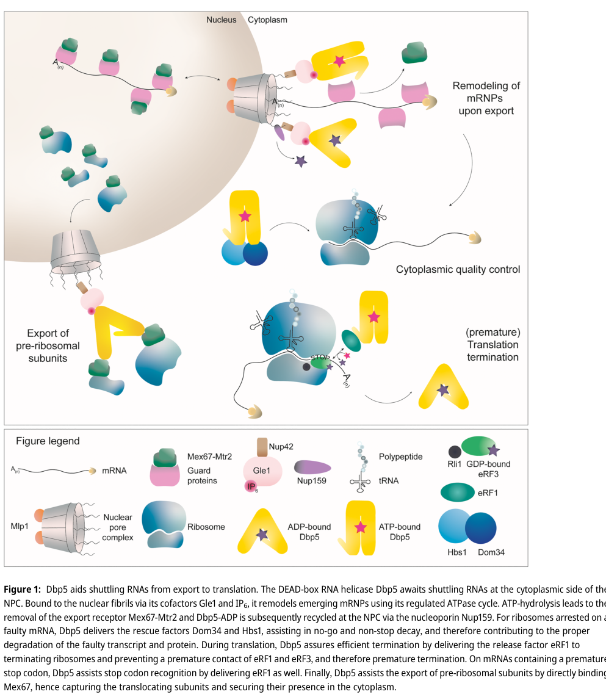

## Question

# Gene Research for Functional Annotation

## ⚠️ CRITICAL: Gene/Protein Identification Context

**BEFORE YOU BEGIN RESEARCH:** You MUST verify you are researching the CORRECT gene/protein. Gene symbols can be ambiguous, especially for less well-characterized genes from non-model organisms.

### Target Gene/Protein Identity (from UniProt):
- **UniProt Accession:** P20449
- **Protein Description:** RecName: Full=ATP-dependent RNA helicase DBP5; EC=3.6.4.13; AltName: Full=DEAD box protein 5; AltName: Full=Helicase CA5/6; AltName: Full=Ribonucleic acid-trafficking protein 8;
- **Gene Information:** Name=DBP5; Synonyms=RAT8; OrderedLocusNames=YOR046C;
- **Organism (full):** Saccharomyces cerevisiae (strain ATCC 204508 / S288c) (Baker's yeast).
- **Protein Family:** Belongs to the DEAD box helicase family. DDX19/DBP5
- **Key Domains:** DEAD/DEAH_box_helicase_dom. (IPR011545); Helicase_ATP-bd. (IPR014001); Helicase_C-like. (IPR001650); P-loop_NTPase. (IPR027417); RNA-helicase_DEAD-box_CS. (IPR000629)

### MANDATORY VERIFICATION STEPS:

1. **Check if the gene symbol "DBP5" matches the protein description above**
2. **Verify the organism is correct:** Saccharomyces cerevisiae (strain ATCC 204508 / S288c) (Baker's yeast).
3. **Check if protein family/domains align with what you find in literature**
4. **If you find literature for a DIFFERENT gene with the same or similar symbol, STOP**

### If Gene Symbol is Ambiguous or You Cannot Find Relevant Literature:

**DO NOT PROCEED WITH RESEARCH ON A DIFFERENT GENE.** Instead:
- State clearly: "The gene symbol 'DBP5' is ambiguous or literature is limited for this specific protein"
- Explain what you found (e.g., "Found extensive literature on a different gene with the same symbol in a different organism")
- Describe the protein based ONLY on the UniProt information provided above
- Suggest that the protein function can be inferred from domain/family information

### Research Target:

Please provide a comprehensive research report on the gene **DBP5** (gene ID: DBP5, UniProt: P20449) in yeast.

The research report should be a detailed narrative explaining the function, biological processes, and localization of the gene product. Citations should be given for all claims.

You should prioritize authoritative reviews and primary scientific literature when conducting research. You can supplement
this with annotations you find in gene/protein databases, but these can be outdated or inaccurate.

We are specifically interested in the primary function of the gene - for enzymes, what reaction is catalyzed, and what is the substrate specificity? For transporters, what is the substrate? For structural proteins or adapters, what is the broader structural role? For signaling molecules, what is the role in the pathway.

We are interested in where in or outside the cell the gene product carries out its function.

We are also interested in the signaling or biochemical pathways in which the gene functions. We are less interested in broad pleiotropic effects, except where these elucidate the precise role.

Include evidence where possible. We are interested in both experimental evidence as well as inference from structure, evolution, or bioinformatic analysis. Precise studies should be prioritized over high-throughput, where available.

## Output

Question: You are an expert researcher providing comprehensive, well-cited information.

Provide detailed information focusing on:
1. Key concepts and definitions with current understanding
2. Recent developments and latest research (prioritize 2023-2024 sources)
3. Current applications and real-world implementations
4. Expert opinions and analysis from authoritative sources
5. Relevant statistics and data from recent studies

Format as a comprehensive research report with proper citations. Include URLs and publication dates where available.
Always prioritize recent, authoritative sources and provide specific citations for all major claims.

# Gene Research for Functional Annotation

## ⚠️ CRITICAL: Gene/Protein Identification Context

**BEFORE YOU BEGIN RESEARCH:** You MUST verify you are researching the CORRECT gene/protein. Gene symbols can be ambiguous, especially for less well-characterized genes from non-model organisms.

### Target Gene/Protein Identity (from UniProt):
- **UniProt Accession:** P20449
- **Protein Description:** RecName: Full=ATP-dependent RNA helicase DBP5; EC=3.6.4.13; AltName: Full=DEAD box protein 5; AltName: Full=Helicase CA5/6; AltName: Full=Ribonucleic acid-trafficking protein 8;
- **Gene Information:** Name=DBP5; Synonyms=RAT8; OrderedLocusNames=YOR046C;
- **Organism (full):** Saccharomyces cerevisiae (strain ATCC 204508 / S288c) (Baker's yeast).
- **Protein Family:** Belongs to the DEAD box helicase family. DDX19/DBP5
- **Key Domains:** DEAD/DEAH_box_helicase_dom. (IPR011545); Helicase_ATP-bd. (IPR014001); Helicase_C-like. (IPR001650); P-loop_NTPase. (IPR027417); RNA-helicase_DEAD-box_CS. (IPR000629)

### MANDATORY VERIFICATION STEPS:

1. **Check if the gene symbol "DBP5" matches the protein description above**
2. **Verify the organism is correct:** Saccharomyces cerevisiae (strain ATCC 204508 / S288c) (Baker's yeast).
3. **Check if protein family/domains align with what you find in literature**
4. **If you find literature for a DIFFERENT gene with the same or similar symbol, STOP**

### If Gene Symbol is Ambiguous or You Cannot Find Relevant Literature:

**DO NOT PROCEED WITH RESEARCH ON A DIFFERENT GENE.** Instead:
- State clearly: "The gene symbol 'DBP5' is ambiguous or literature is limited for this specific protein"
- Explain what you found (e.g., "Found extensive literature on a different gene with the same symbol in a different organism")
- Describe the protein based ONLY on the UniProt information provided above
- Suggest that the protein function can be inferred from domain/family information

### Research Target:

Please provide a comprehensive research report on the gene **DBP5** (gene ID: DBP5, UniProt: P20449) in yeast.

The research report should be a detailed narrative explaining the function, biological processes, and localization of the gene product. Citations should be given for all claims.

You should prioritize authoritative reviews and primary scientific literature when conducting research. You can supplement
this with annotations you find in gene/protein databases, but these can be outdated or inaccurate.

We are specifically interested in the primary function of the gene - for enzymes, what reaction is catalyzed, and what is the substrate specificity? For transporters, what is the substrate? For structural proteins or adapters, what is the broader structural role? For signaling molecules, what is the role in the pathway.

We are interested in where in or outside the cell the gene product carries out its function.

We are also interested in the signaling or biochemical pathways in which the gene functions. We are less interested in broad pleiotropic effects, except where these elucidate the precise role.

Include evidence where possible. We are interested in both experimental evidence as well as inference from structure, evolution, or bioinformatic analysis. Precise studies should be prioritized over high-throughput, where available.

## Research Report: Functional Annotation of *Saccharomyces cerevisiae* **DBP5/RAT8** (UniProt P20449)

### 1) Target verification (critical disambiguation)
The literature summarized here is specifically for **Dbp5** (alias **Rat8**) from *Saccharomyces cerevisiae* (S288c), an essential **DEAD-box ATP-dependent RNA helicase/RNA-dependent ATPase** at the nuclear pore complex (NPC), orthologous to metazoan **DDX19**. Multiple sources explicitly describe **Dbp5/Rat8** as a conserved DEAD-box factor concentrated at the nuclear rim/NPC cytoplasmic face and required for RNA export and downstream gene-expression steps, consistent with UniProt **P20449** and the DDX19/Dbp5 family assignment (https://doi.org/10.1515/hsz-2023-0130; https://doi.org/10.1074/jbc.M109.082370; https://doi.org/10.1101/gad.2041611; https://doi.org/10.1101/gad.2040611; https://doi.org/10.7554/elife.89835). (querl2023thedeadboxrna pages 1-3, alcazarroman2010controlofmrna pages 1-2, hodge2011thedbp5cycle pages 9-10, noble2011thedbp5cycle pages 7-8, rajan2024gle1isrequired pages 10-12)

### 2) Key concepts and definitions (current understanding)

#### 2.1 DEAD-box ATPase / RNA helicase (what Dbp5 “does”)
Dbp5 is a DEAD-box RNA helicase-family protein whose core activity is **RNA-dependent ATP hydrolysis** coupled to **nucleotide-state–dependent conformational cycling**, enabling binding and remodeling of RNA–protein complexes (RNPs) rather than long-range processive duplex unwinding. In the export context, this remodeling function is often described as an **RNPase** activity acting on messenger RNPs at the NPC (querl2023thedeadboxrna pages 1-3, rajan2023investigatingarole pages 21-25).

#### 2.2 “mRNP remodeling” in the Dbp5 pathway
In the mRNA export field, “mRNP remodeling” refers to **localized restructuring/displacement of specific proteins from exported mRNA** at (or immediately after) NPC transit. The mechanistic focus is on Dbp5-driven removal of export-associated factors such as **Mex67–Mtr2** (major mRNA export receptor) and **Nab2** (poly(A) RNA-binding/export factor), thereby enforcing directionality and enabling cytoplasmic fate decisions (alcazarroman2010controlofmrna pages 1-2, querl2023thedeadboxrna pages 1-3, rajan2023investigatingarole pages 25-29, noble2011thedbp5cycle pages 7-8).

#### 2.3 Directionality of export (why remodeling matters)
mRNAs are exported by Mex67–Mtr2 interactions with NPC components. Directionality is established at the **cytoplasmic NPC face**, where Dbp5 activity promotes dissociation of export factors from the mRNP so that the particle **cannot re-enter the nucleus using the same export-binding interactions** (alcazarroman2010controlofmrna pages 1-2, querl2023thedeadboxrna pages 1-3, rajan2023investigatingarole pages 25-29).

### 3) Molecular function, reaction, and substrate specificity

#### 3.1 Enzymatic activity (reaction)
Dbp5 catalyzes **ATP hydrolysis (ATP → ADP + Pi)** in an RNA-dependent manner, with its remodeling function associated with conformational changes across its nucleotide cycle (rajan2023investigatingarole pages 21-25, noble2011thedbp5cycle pages 7-8).

Quantitative enzymology and substrate-response features reported in the retrieved sources include:
- **Basal ATPase rate** reported in summarized mechanistic literature: ~**0.04–0.14 s⁻¹**, with RNA stimulating the ATPase cycle approximately **6–20-fold** (rajan2023investigatingarole pages 21-25).
- RNA-binding is nucleotide-state sensitive; one cited assay summary reports **AMP-PNP-bound RNA Kd ~40 nM**, while RNA binding was not detectable with ADP in that context (rajan2023investigatingarole pages 21-25).
- Dbp5 shows a preference for ADP over ATP (reported as ~**0.4 mM** vs ~**4 mM** in a summarized mechanistic excerpt) (rajan2023investigatingarole pages 21-25).

#### 3.2 RNA substrates: ssRNA (mRNA-like) vs structured RNA (tRNA/dsRNA)
A key 2024 development is evidence that Dbp5 can directly bind structured RNAs and participate in their export regulation:
- Dbp5 binds tRNA in vitro with **Kd ~150 nM** (Phe tRNA) and **~130 nM** (mixed tRNA) (Rajan et al., eLife 2024-01, https://doi.org/10.7554/elife.89835). (rajan2024gle1isrequired pages 10-12)
- **tRNA (or dsRNA poly(I:C)) alone does not stimulate Dbp5 ATPase activity**, unlike a typical ssRNA activator (poly(A)). However, **tRNA/dsRNA synergizes with Gle1/InsP6 to fully activate Dbp5**, reaching ~**1.03 ± 0.04 ATP/s** (mixed tRNA with Gle1/InsP6) comparable to ssRNA activation (~**1.11 ± 0.07 ATP/s**) (rajan2024gle1isrequired pages 10-12).
- RNase T1 controls support that the Gle1/InsP6 + tRNA activation is attributable to structured RNA rather than ssRNA contamination (rajan2024gle1isrequired pages 10-12).

Interpretation: Dbp5 is best understood as an RNA-dependent ATPase whose productive hydrolysis is highly dependent on RNA topology and cofactor context; structured RNA can be a functional substrate *when* the NPC-anchored activation module (Gle1/InsP6) is present (rajan2024gle1isrequired pages 10-12, rajan2024gle1isrequired pages 12-14).

### 4) Cellular localization and pathway context

#### 4.1 Where Dbp5 acts
Dbp5 is enriched at the **nuclear rim** and is a key factor on the **cytoplasmic face/cytoplasmic fibrils of the NPC**, where terminal export remodeling is executed (querl2023thedeadboxrna pages 1-3, alcazarroman2010controlofmrna pages 1-2, hodge2011thedbp5cycle pages 9-10).

Dynamic behavior at NPCs is central to its mechanism:
- Dbp5 association with NPCs is highly dynamic, with **~0.8 s** average residence time reported by FRAP in yeast (Hodge et al., Genes & Dev. 2011-05, https://doi.org/10.1101/gad.2041611). (hodge2011thedbp5cycle pages 9-10)

#### 4.2 Timing relative to transport
Export remodeling by Dbp5 is proposed to occur at/after mRNP exit, consistent with rapid mRNP transit times:
- Reporter mRNP translocation through NPCs has been reported as **~0.2 s** and **<0.5 s** in live-cell imaging studies discussed in the mechanistic framework (hodge2011thedbp5cycle pages 9-10).
- A mechanistic synthesis excerpt additionally notes conceptual rates such as an NPC exporting an mRNP every **~2–6 s**, with transport lasting ~**0.2 s** (rajan2023investigatingarole pages 25-29).

### 5) Key interaction partners and regulatory cycle (Gle1–InsP6–Nup42–Nup159)

#### 5.1 Gle1 + inositol hexakisphosphate (InsP6/IP6): essential ATPase activation module
At the cytoplasmic NPC face, **Gle1** bound to **IP6** acts as a principal Dbp5 ATPase coactivator required for full potentiation of Dbp5 function during export and translation-linked processes:
- Alcázar-Román et al. (JBC 2010-05-28, https://doi.org/10.1074/jbc.M109.082370) describe Gle1 and IP6 as essential for mRNA export by **activating Dbp5 ATPase** and promoting localized mRNP remodeling and directionality; they also report that the same module is required for **proper translation termination** (alcazarroman2010controlofmrna pages 1-2).
- Mechanistic genetic analysis indicates the **Gle1–Dbp5 interaction is limiting/critical** for export; dominant-negative RNA-binding mutants inhibit export by competing for Gle1 (Hodge et al. 2011) (hodge2011thedbp5cycle pages 9-10).

#### 5.2 Nup42: enhancer/sensor coordinating Gle1 stimulation of Dbp5
Nup42’s key role is not simply Gle1 localization but **enhancement of Gle1-dependent stimulation** of the RNA-dependent Dbp5 ATPase:
- Adams et al. (Traffic 2017-10, https://doi.org/10.1111/tra.12526) report that Nup42/hNup42 enhances Gle1 stimulation of the RNA-dependent Dbp5/DDX19B ATPase, and that a **nup42-CTD/gle1-CTD/Dbp5 trimeric complex forms in the presence of IP6** (adams2017nup42andip6 pages 6-7).
- They identify a minimal Nup42 Gle1-binding peptide of **17 amino acids (residues 408–424)** and propose that Nup42 may couple Gle1–IP6 activation to the presence of **Mex67-bound mRNPs** (adams2017nup42andip6 pages 6-7).

#### 5.3 Nup159: docking/recycling module and nucleotide-cycle control
Nup159 tethers Dbp5 to the NPC cytoplasmic filaments and is central to **recycling** by promoting ADP release, enabling additional rounds of remodeling:
- Noble et al. (Genes & Dev. 2011-05, https://doi.org/10.1101/gad.2040611) conclude that “a primary role for Nup159 in the Dbp5 cycle is to facilitate ADP release,” and show that ADP binding alone is sufficient to drive in vitro remodeling of Nab2-RNPs under their assay conditions (noble2011thedbp5cycle pages 7-8).
- A mechanistic synthesis excerpt reports that Dbp5–Nup159 affinity is nucleotide dependent (weakened in ADP/ATP states), with cited in vitro values changing from ~**20 nM** to ~**0.6 μM** (Dbp5ADP) and ~**1 μM** (Dbp5ATP) (rajan2023investigatingarole pages 25-29).

### 6) Biological processes and phenotypes supported by evidence

#### 6.1 Canonical function: mRNA export and mRNP remodeling
Dbp5 is required for bulk mRNA export and acts at the NPC cytoplasmic face to remodel mRNPs by displacing export factors such as Mex67 and Nab2 (alcazarroman2010controlofmrna pages 1-2, querl2023thedeadboxrna pages 1-3, noble2011thedbp5cycle pages 7-8).

Dominant-negative and cycling mutants support a stepwise pathway:
- ATP binding is required for efficient NPC association, and RNA-binding–defective mutants can still localize at NPCs but inhibit export by sequestering Gle1 (hodge2011thedbp5cycle pages 9-10).
- Expression of a dominant-negative human analog (R372G) increases peripheral mRNP accumulation by ~**10-fold**, illustrating that interference with this step stalls mRNPs at/near NPCs (hodge2011thedbp5cycle pages 9-10).

#### 6.2 Translation termination (Dbp5 as a post-export gene-expression regulator)
A key expert synthesis from 2023 emphasizes that Dbp5 couples export to downstream translation control:
- Querl & Krebber (Biological Chemistry, published online 2023-07-13, https://doi.org/10.1515/hsz-2023-0130) review evidence that Dbp5 functions in **translation termination**, including a mechanistic model where Dbp5 delivers **eRF1** to terminating ribosomes and prevents premature eRF1–eRF3 interactions, thereby reducing readthrough (querl2023thedeadboxrna pages 1-3, querl2023thedeadboxrna media ccdac9cd).
- Alcázar-Román et al. (2010) explicitly state Dbp5, Gle1, and IP6 are required for proper translation termination in addition to mRNA export (alcazarroman2010controlofmrna pages 1-2).

#### 6.3 Cytoplasmic mRNA surveillance (NGD/NSD)
Querl & Krebber (2023) summarize a model in which Dbp5 contributes to no-go decay (NGD) and non-stop decay (NSD) by delivering rescue factors **Dom34/Hbs1** to stalled ribosomes; subsequent hydrolysis steps coordinate rescue and transcript clearance (querl2023thedeadboxrna pages 4-5, querl2023thedeadboxrna media ccdac9cd).

#### 6.4 tRNA export (2024 primary research)
Rajan et al. (eLife 2024-01) provide genetic and biochemical evidence that Dbp5 functions in tRNA export in a pathway parallel to canonical exporters:
- Dbp5 functions parallel to Los1 (and Gle1 supports pre-tRNA export), with a reported ~**five-fold** increase in a pre-tRNA processing intermediate/precursor ratio in **los1Δ gle1-4** compared with **los1Δ** after **4 h at 37°C** (rajan2024gle1isrequired pages 10-12, rajan2024gle1isrequired pages 12-14).
- They propose that tRNA binding without ATPase stimulation could allow Dbp5 to escort/hold structured RNA until reaching NPC-localized Gle1/InsP6 for activation (rajan2024gle1isrequired pages 10-12, rajan2024gle1isrequired pages 12-14).

#### 6.5 Pre-ribosomal subunit export
Recent synthesis also places Dbp5 in pre-ribosomal export, with a model distinct from canonical mRNA remodeling:
- Rajan et al. (2024) explicitly contrast mRNA/tRNA export (requiring Gle1/InsP6 activation and remodeling at NPCs) with pre-ribosomal export, where Dbp5 ATPase stimulation may be dispensable and export factors may persist on the particle post-export (rajan2024gle1isrequired pages 12-14).
- Querl & Krebber (2023) depict a model where Dbp5 binds Mex67 on pre-ribosomal particles in the cytoplasm, “capturing” translocating subunits (querl2023thedeadboxrna media ccdac9cd).

### 7) Recent developments and latest research (prioritizing 2023–2024)

#### 7.1 2023: Dbp5 as a multi-step gene-expression coupler
The 2023 minireview frames Dbp5 as a “master regulator” connecting mRNA export, translation termination, and quality control (Biological Chemistry, published online 2023-07-13, https://doi.org/10.1515/hsz-2023-0130). It provides an integrated conceptual model of Dbp5 at the NPC and on cytoplasmic ribosomes (querl2023thedeadboxrna pages 1-3, querl2023thedeadboxrna media ccdac9cd).

#### 7.2 2024: structured RNA activation and tRNA export mechanism
The 2024 eLife paper extends Dbp5 function beyond mRNA remodeling by demonstrating:
- direct tRNA binding (Kd ~130–150 nM),
- lack of ATPase stimulation by structured RNA alone,
- strong Gle1/InsP6-dependent synergy restoring full ATPase activity (~1 ATP/s),
- in vivo genetic evidence for a Los1-independent pathway requiring the regulated Dbp5 ATPase cycle (https://doi.org/10.7554/elife.89835). (rajan2024gle1isrequired pages 10-12, rajan2024gle1isrequired pages 12-14)

### 8) Current applications and real-world implementations
Dbp5 (and the conserved DDX19 module) is widely used as a **paradigm for spatially gated mRNP remodeling at the nuclear pore**, because it is one of the most mechanistically defined cases where an RNA-dependent ATPase is activated by NPC-localized cofactors (Gle1/InsP6) and recycled by a nucleoporin (Nup159) (alcazarroman2010controlofmrna pages 1-2, hodge2011thedbp5cycle pages 9-10, noble2011thedbp5cycle pages 7-8).

Practical research implementations supported by the cited sources include:
- **In vitro reconstitution/enzymology** of Dbp5 ATPase activation by defined RNAs and cofactors, including the structured-RNA synergy revealed in 2024 (rajan2024gle1isrequired pages 10-12).
- **Live-cell imaging / FRAP** to quantify Dbp5 NPC residence (~0.8 s) and relate it to export kinetics (hodge2011thedbp5cycle pages 9-10).
- **Genetic dissection** using dominant-negative mutants competing for Gle1 and synthetic interactions (hodge2011thedbp5cycle pages 9-10).

### 9) Expert opinions and authoritative analysis
- Querl & Krebber (2023) synthesize that Dbp5 couples multiple steps in gene expression—export, translation termination, and cytoplasmic mRNA quality control—emphasizing a systems-level view while still anchored in the Gle1/InsP6/Nup159-controlled enzymatic cycle at the NPC (querl2023thedeadboxrna pages 1-3, querl2023thedeadboxrna pages 4-5).
- Alcázar-Román et al. (2010) provide an authoritative mechanistic statement that Gle1–IP6 activation of Dbp5 is essential for directional export and also required for translation termination, implying the same cofactor module coordinates distinct downstream gene-expression checkpoints (alcazarroman2010controlofmrna pages 1-2).

### 10) Key statistics and data (recent and foundational)
A non-exhaustive quantitative summary (all values drawn from retrieved text excerpts) includes:
- **Dbp5 ATPase kinetics**: basal ~0.04–0.14 s⁻¹; RNA stimulation ~6–20× (rajan2023investigatingarole pages 21-25).
- **Structured RNA binding/activation (2024)**: tRNA Kd ~130–150 nM; Gle1/InsP6+tRNA ATPase ~1.03 ± 0.04 ATP/s; ssRNA (pA) with Gle1/InsP6 ~1.11 ± 0.07 ATP/s (rajan2024gle1isrequired pages 10-12).
- **NPC dynamics**: Dbp5 average NPC residence ~0.8 s (FRAP) (hodge2011thedbp5cycle pages 9-10).
- **Transport times discussed in mechanistic framework**: mRNP translocation ~0.2 s and <0.5 s (hodge2011thedbp5cycle pages 9-10).
- **Regulatory complex feature**: minimal Nup42 Gle1-binding peptide is 17 aa (408–424) (adams2017nup42andip6 pages 6-7).
- **Genetic/processing effect (2024)**: los1Δ gle1-4 shows ~5-fold increase in a pre-tRNA processing ratio relative to los1Δ alone after 4 h at 37°C (rajan2024gle1isrequired pages 10-12, rajan2024gle1isrequired pages 12-14).

### 11) Evidence map (table)
The following table consolidates Dbp5’s functional roles, partners, localization, quantitative data, and references.

| Biological role/process | Molecular function / mechanistic concept | Key partners/regulators | Cellular localization | Key quantitative data | Evidence type | Key reference with publication date and URL |
|---|---|---|---|---|---|---|
| **Identity / core enzymology** | Essential **DEAD-box ATPase/RNA helicase (RNPase)** that uses nucleotide-dependent conformational cycling to bind RNA and remodel RNA–protein complexes; ATP-bound state has higher RNA affinity than ADP-bound state, and ATP hydrolysis/conversion to ADP is linked to remodeling competence (rajan2023investigatingarole pages 21-25, hodge2011thedbp5cycle pages 9-10, noble2011thedbp5cycle pages 7-8) | ATP, RNA; regulated by **Gle1-InsP6** and **Nup159** (rajan2023investigatingarole pages 21-25, noble2011thedbp5cycle pages 7-8) | Nucleus, cytoplasm, prominent enrichment at **nuclear rim / cytoplasmic face of NPC** (querl2023thedeadboxrna pages 1-3, rajan2023investigatingarole pages 17-21) | Basal ATPase ~**0.04–0.14 s⁻¹**; RNA stimulation ~**6–20-fold**; Dbp5 favors **ADP ~0.4 mM** over **ATP ~4 mM**; AMP-PNP-bound RNA-binding **K\_d ~40 nM**; RNA binding not detectable with ADP in cited assay (rajan2023investigatingarole pages 21-25) | Biochemistry, structural inference, review | Querl & Krebber, **2023-07-13**, https://doi.org/10.1515/hsz-2023-0130 ; mechanistic synthesis from Rajan thesis excerpts **2023** (rajan2023investigatingarole pages 21-25) |
| **Bulk mRNA export / export directionality** | Dbp5 remodels emerging **mRNPs** at the cytoplasmic NPC face, removing export factors to prevent nuclear re-entry and enforce **one-way export**; remodeling includes displacement/removal of **Mex67-Mtr2** and **Nab2** from exported mRNPs (alcazarroman2010controlofmrna pages 1-2, querl2023thedeadboxrna pages 1-3, rajan2023investigatingarole pages 25-29, rajan2023investigatingarolea pages 25-29) | **Mex67-Mtr2, Nab2, Gle1, InsP6/IP6, Nup42, Nup159** (alcazarroman2010controlofmrna pages 1-2, querl2023thedeadboxrna pages 1-3, adams2017nup42andip6 pages 6-7) | **Cytoplasmic fibrils / cytoplasmic side of NPC** (alcazarroman2010controlofmrna pages 1-2, querl2023thedeadboxrna pages 1-3) | Reporter mRNP translocation through NPC reported as **~0.2 s** and **<0.5 s**; Dbp5 residence at NPC **~0.8 s** by FRAP; NPC exports an mRNP every **~2–6 s** (hodge2011thedbp5cycle pages 9-10, rajan2023investigatingarole pages 25-29) | Genetics, imaging, biochemistry, review | Hodge et al., **2011-05**, https://doi.org/10.1101/gad.2041611 ; Alcázar-Román et al., **2010-05-28**, https://doi.org/10.1074/jbc.M109.082370 ; Querl & Krebber, **2023-07-13**, https://doi.org/10.1515/hsz-2023-0130 |
| **mRNP remodeling reaction** | In this context, “mRNP remodeling” means **Dbp5-driven displacement/restructuring of mRNP components**, especially release of export adaptors from RNA; in vitro, **ADP-bound/conversion-to-ADP** states are remodeling-competent for **Nab2-RNP** remodeling (noble2011thedbp5cycle pages 7-8, rajan2023investigatingarole pages 25-29) | **Nab2**, RNA, nucleotide state; **Gle1-InsP6** promotes productive cycling (noble2011thedbp5cycle pages 7-8, rajan2023investigatingarole pages 21-25) | Cytoplasmic NPC face (rajan2024gle1isrequired pages 12-14, lari2019investigationofmrnp pages 154-157) | Initial Dbp5–ADP on-rate estimate in in vitro remodeling assay: **~7.3% of total ADP bound per min**; distinct Dbp5-ADP CD peak at **~260–270 nm** (noble2011thedbp5cycle pages 7-8) | In vitro biochemistry, biophysics | Noble et al., **2011-05**, https://doi.org/10.1101/gad.2040611 |
| **Gle1 / InsP6-dependent ATPase activation** | **Gle1 bound to InsP6/IP6** is the principal activator/coactivator of Dbp5 ATPase at the NPC; promotes ATP binding/stimulation and supports full potentiation required for mRNA export and translation termination (alcazarroman2010controlofmrna pages 1-2, hodge2011thedbp5cycle pages 9-10, noble2011thedbp5cycle pages 7-8) | **Gle1, InsP6/IP6**, RNA; coordinated by **Nup42** (alcazarroman2010controlofmrna pages 1-2, adams2017nup42andip6 pages 6-7) | Cytoplasmic side of NPC, where Gle1 localizes (alcazarroman2010controlofmrna pages 1-2) | In structured-RNA assays, Gle1/InsP6 raises Dbp5 ATPase to **1.03 ± 0.04 ATP/s** with mixed tRNA vs **1.11 ± 0.07 ATP/s** with ssRNA; with RNase T1-treated tRNA, activity remains **1.18 ± 0.19 ATP/s** (vs **1.19 ± 0.11 ATP/s** untreated), showing activation depends on structured RNA rather than ssRNA contamination (rajan2024gle1isrequired pages 10-12) | Biochemistry, genetics | Alcázar-Román et al., **2010-05-28**, https://doi.org/10.1074/jbc.M109.082370 ; Rajan et al., **2024-01**, https://doi.org/10.7554/elife.89835 |
| **Nup159-regulated nucleotide recycling** | **Nup159** tethers Dbp5 at NPC cytoplasmic filaments and primarily facilitates **ADP release / recycling** after remodeling; Nup159 binding is incompatible with RNA binding and helps reset the cycle (noble2011thedbp5cycle pages 7-8, hodge2011thedbp5cycle pages 9-10, rajan2023investigatingarole pages 25-29) | **Nup159**, Dbp5-ADP, Gle1 (interaction weakened by Nup159 in cited synthesis) (noble2011thedbp5cycle pages 7-8, rajan2023investigatingarole pages 25-29) | NPC cytoplasmic filaments (hodge2011thedbp5cycle pages 9-10, querl2023thedeadboxrna pages 1-3) | Dbp5–Nup159 affinity changes from about **~20 nM** to **~0.6 μM** for Dbp5-ADP and **~1 μM** for Dbp5-ATP in cited in vitro analyses; altered ADP-binding mutant bypasses Nup159 requirement (rajan2023investigatingarole pages 25-29, noble2011thedbp5cycle pages 7-8) | Biochemistry, genetics, FRAP/imaging | Noble et al., **2011-05**, https://doi.org/10.1101/gad.2040611 ; Hodge et al., **2011-05**, https://doi.org/10.1101/gad.2041611 |
| **Nup42 coordination of export remodeling** | **Nup42** does not primarily localize Gle1 but instead enhances **Gle1-mediated stimulation** of RNA-dependent Dbp5 ATPase; supports formation of a **Nup42-CTD/Gle1-CTD/Dbp5** regulatory complex and couples remodeling to Mex67-bound mRNPs (adams2017nup42andip6 pages 6-7) | **Nup42, Gle1, InsP6/IP6, Dbp5**, Mex67-bound mRNPs (adams2017nup42andip6 pages 6-7) | Cytoplasmic NPC face (adams2017nup42andip6 pages 6-7) | Minimal Gle1-binding peptide in Nup42 is **17 aa (residues 408–424)**; no direct soluble Nup42–Dbp5 interaction detected in cited assay (adams2017nup42andip6 pages 6-7) | Biochemistry, cell biology | Adams et al., **2017-10**, https://doi.org/10.1111/tra.12526 |
| **tRNA export (recent extension)** | Dbp5 directly binds **tRNA** but tRNA alone does **not** stimulate ATPase; instead, **tRNA + Gle1/InsP6** synergistically activates Dbp5, supporting a parallel Dbp5-dependent tRNA export pathway independent of Los1 (rajan2024gle1isrequired pages 10-12, rajan2024gle1isrequired pages 12-14, rajan2024gle1isrequired pages 21-22) | **tRNA, Gle1, InsP6/IP6**, Los1-independent pathway; not dependent on Los1/Msn5/Mex67 for Dbp5 recruitment to tRNA in vivo (rajan2024gle1isrequired pages 21-22, rajan2024gle1isrequired pages 12-14) | Likely exported through NPC with activation at cytoplasmic face (rajan2024gle1isrequired pages 10-12, rajan2024gle1isrequired pages 12-14) | tRNA-binding **K\_d ~150 nM** (Phe tRNA) and **~130 nM** (mixed tRNA); tRNA alone does not stimulate ATPase, whereas with Gle1/InsP6 ATPase reaches **1.03 ± 0.04 ATP/s**; **los1Δ gle1-4** causes **~5-fold** increase in pre-tRNA Ile UAU intermediate/precursor ratio after **4 h at 37°C** (rajan2024gle1isrequired pages 10-12, rajan2024gle1isrequired pages 12-14) | In vitro biochemistry, EMSA/fluorescence polarization, yeast genetics | Rajan et al., **2024-01**, https://doi.org/10.7554/elife.89835 |
| **Translation termination** | Dbp5 is required for efficient **translation termination**; model from yeast studies/review: Dbp5 delivers **eRF1** to terminating ribosomes and prevents premature eRF1–eRF3 association, thereby reducing readthrough (querl2023thedeadboxrna pages 1-3, querl2023thedeadboxrna media ccdac9cd, rajan2023investigatingarolea pages 34-38) | **eRF1, eRF3, Gle1, InsP6/IP6** (querl2023thedeadboxrna media ccdac9cd, rajan2023investigatingarolea pages 34-38) | Cytoplasm / translating ribosomes (querl2023thedeadboxrna pages 1-3, querl2023thedeadboxrna media ccdac9cd) | No direct kinetic constant in provided contexts; functional requirement supported by genetics and mechanistic review (querl2023thedeadboxrna pages 1-3, rajan2023investigatingarolea pages 34-38) | Genetics, review | Querl & Krebber, **2023-07-13**, https://doi.org/10.1515/hsz-2023-0130 ; Alcázar-Román et al., **2010-05-28**, https://doi.org/10.1074/jbc.M109.082370 |
| **Cytoplasmic mRNA surveillance (NGD/NSD)** | Proposed role in **no-go decay (NGD)** and **non-stop decay (NSD)** by delivering **Dom34/Hbs1** to stalled ribosomes; ATP/GTP hydrolysis steps then enable rescue and subunit splitting (querl2023thedeadboxrna pages 4-5, querl2023thedeadboxrna media ccdac9cd) | **Dom34, Hbs1, Rli1** (querl2023thedeadboxrna pages 4-5, querl2023thedeadboxrna media ccdac9cd) | Cytoplasm, stalled ribosomes (querl2023thedeadboxrna pages 4-5, querl2023thedeadboxrna media ccdac9cd) | No supported numeric kinetic constants in provided contexts (querl2023thedeadboxrna pages 4-5) | In vivo/in vitro binding studies summarized in review | Querl & Krebber, **2023-07-13**, https://doi.org/10.1515/hsz-2023-0130 |
| **Pre-ribosomal subunit export** | Dbp5 also contributes to **pre-ribosomal subunit export**; review model suggests direct **Mex67** binding captures translocating subunits in cytoplasm, and this role may be less dependent on canonical helicase remodeling than mRNA export (rajan2024gle1isrequired pages 12-14, querl2023thedeadboxrna media ccdac9cd, rajan2023investigatingarolea pages 106-108) | **Mex67**, pre-ribosomal particles (querl2023thedeadboxrna media ccdac9cd, rajan2023investigatingarolea pages 106-108) | Nuclear export route / cytoplasmic side of NPC (querl2023thedeadboxrna media ccdac9cd) | No quantitative values supported in provided contexts (rajan2024gle1isrequired pages 12-14, querl2023thedeadboxrna media ccdac9cd) | Review, prior genetics/cell biology summarized in review | Querl & Krebber, **2023-07-13**, https://doi.org/10.1515/hsz-2023-0130 |

*Table: This table summarizes the experimentally supported functions, mechanisms, partners, localization, and quantitative measurements for Saccharomyces cerevisiae Dbp5/Rat8 (UniProt P20449). It is useful as a compact evidence map linking Dbp5’s ATPase cycle to mRNA export, tRNA export, translation termination, and related RNA quality-control roles.*

### 12) Visual summary (figure evidence)
A schematic summarizing Dbp5’s roles across export, translation termination, and quality control is provided in Figure 1 of Querl & Krebber (2023) (querl2023thedeadboxrna media ccdac9cd).

### 13) Limitations and open questions (evidence-grounded)
1. **Mechanism of factor displacement**: While the ATP→ADP conformational transition is repeatedly implicated as remodeling-competent, the exact physical mechanism by which Dbp5 displaces specific mRNP proteins remains incompletely resolved in the sources retrieved here (querl2023thedeadboxrna pages 1-3, noble2011thedbp5cycle pages 7-8).
2. **Structured-RNA regulation beyond tRNA**: The 2024 data imply Dbp5 can be activated on structured RNA substrates in a Gle1/InsP6-dependent manner, motivating broader tests for other structured/non-canonical RNA substrates in vivo (rajan2024gle1isrequired pages 12-14).
3. **Nup42 coupling mechanism**: Adams et al. (2017) propose sensor/coupling roles and a trimeric complex model, but note they could not yet determine whether certain steps occur directly vs indirectly, highlighting an unresolved regulatory mechanism at the NPC (adams2017nup42andip6 pages 6-7).

---

## Reference list (with dates and URLs; see inline citations for evidence mapping)
- Querl L, Krebber H. *Biological Chemistry* **2023** (published online **2023-07-13**). https://doi.org/10.1515/hsz-2023-0130 (querl2023thedeadboxrna pages 1-3, querl2023thedeadboxrna pages 4-5, querl2023thedeadboxrna media ccdac9cd)
- Rajan AAN, Asada R, Montpetit B. *eLife* **2024-01**. https://doi.org/10.7554/elife.89835 (rajan2024gle1isrequired pages 10-12, rajan2024gle1isrequired pages 12-14)
- Alcázar-Román AR, Bolger TA, Wente SR. *J Biol Chem* **2010-05-28**. https://doi.org/10.1074/jbc.M109.082370 (alcazarroman2010controlofmrna pages 1-2)
- Hodge CA et al. *Genes & Development* **2011-05**. https://doi.org/10.1101/gad.2041611 (hodge2011thedbp5cycle pages 9-10)
- Noble KN et al. *Genes & Development* **2011-05**. https://doi.org/10.1101/gad.2040611 (noble2011thedbp5cycle pages 7-8)
- Adams RL et al. *Traffic* **2017-10**. https://doi.org/10.1111/tra.12526 (adams2017nup42andip6 pages 6-7)

References

1. (querl2023thedeadboxrna pages 1-3): Luisa Querl and Heike Krebber. The dead-box rna helicase dbp5 is a key protein that couples multiple steps in gene expression. Biological Chemistry, 404:845-850, Jul 2023. URL: https://doi.org/10.1515/hsz-2023-0130, doi:10.1515/hsz-2023-0130. This article has 7 citations and is from a peer-reviewed journal.

2. (alcazarroman2010controlofmrna pages 1-2): Abel R. Alcázar-Román, Timothy A. Bolger, and Susan R. Wente. Control of mrna export and translation termination by inositol hexakisphosphate requires specific interaction with gle1. Journal of Biological Chemistry, 285:16683-16692, May 2010. URL: https://doi.org/10.1074/jbc.m109.082370, doi:10.1074/jbc.m109.082370. This article has 95 citations and is from a domain leading peer-reviewed journal.

3. (hodge2011thedbp5cycle pages 9-10): Christine A. Hodge, Elizabeth J. Tran, Kristen N. Noble, Abel R. Alcazar-Roman, Rakefet Ben-Yishay, John J. Scarcelli, Andrew W. Folkmann, Yaron Shav-Tal, Susan R. Wente, and Charles N. Cole. The dbp5 cycle at the nuclear pore complex during mrna export i: <i>dbp5</i> mutants with defects in rna binding and atp hydrolysis define key steps for nup159 and gle1. Genes &amp; Development, 25:1052-1064, May 2011. URL: https://doi.org/10.1101/gad.2041611, doi:10.1101/gad.2041611. This article has 124 citations and is from a highest quality peer-reviewed journal.

4. (noble2011thedbp5cycle pages 7-8): Kristen N. Noble, Elizabeth J. Tran, Abel R. Alcázar-Román, Christine A. Hodge, Charles N. Cole, and Susan R. Wente. The dbp5 cycle at the nuclear pore complex during mrna export ii: nucleotide cycling and mrnp remodeling by dbp5 are controlled by nup159 and gle1. Genes & development, 25 10:1065-77, May 2011. URL: https://doi.org/10.1101/gad.2040611, doi:10.1101/gad.2040611. This article has 137 citations and is from a highest quality peer-reviewed journal.

5. (rajan2024gle1isrequired pages 10-12): Arvind Arul Nambi Rajan, Ryuta Asada, and Ben Montpetit. Gle1 is required for trna to stimulate dbp5 atpase activity in vitro and promote dbp5-mediated trna export in vivo in saccharomyces cerevisiae. eLife, Jan 2024. URL: https://doi.org/10.7554/elife.89835, doi:10.7554/elife.89835. This article has 1 citations and is from a domain leading peer-reviewed journal.

6. (rajan2023investigatingarole pages 21-25): A Arul Nambi Rajan. Investigating a role for the dead-box protein 5 (dbp5) in trna regulation. Unknown journal, 2023.

7. (rajan2023investigatingarole pages 25-29): A Arul Nambi Rajan. Investigating a role for the dead-box protein 5 (dbp5) in trna regulation. Unknown journal, 2023.

8. (rajan2024gle1isrequired pages 12-14): Arvind Arul Nambi Rajan, Ryuta Asada, and Ben Montpetit. Gle1 is required for trna to stimulate dbp5 atpase activity in vitro and promote dbp5-mediated trna export in vivo in saccharomyces cerevisiae. eLife, Jan 2024. URL: https://doi.org/10.7554/elife.89835, doi:10.7554/elife.89835. This article has 1 citations and is from a domain leading peer-reviewed journal.

9. (adams2017nup42andip6 pages 6-7): Rebecca L. Adams, Aaron C. Mason, Laura Glass, Aditi, and Susan R. Wente. Nup42 and <scp>ip6</scp> coordinate gle1 stimulation of dbp5/<scp>ddx19b</scp> for <scp>mrna</scp> export in yeast and human cells. Traffic, 18:776-790, Oct 2017. URL: https://doi.org/10.1111/tra.12526, doi:10.1111/tra.12526. This article has 56 citations and is from a peer-reviewed journal.

10. (querl2023thedeadboxrna media ccdac9cd): Luisa Querl and Heike Krebber. The dead-box rna helicase dbp5 is a key protein that couples multiple steps in gene expression. Biological Chemistry, 404:845-850, Jul 2023. URL: https://doi.org/10.1515/hsz-2023-0130, doi:10.1515/hsz-2023-0130. This article has 7 citations and is from a peer-reviewed journal.

11. (querl2023thedeadboxrna pages 4-5): Luisa Querl and Heike Krebber. The dead-box rna helicase dbp5 is a key protein that couples multiple steps in gene expression. Biological Chemistry, 404:845-850, Jul 2023. URL: https://doi.org/10.1515/hsz-2023-0130, doi:10.1515/hsz-2023-0130. This article has 7 citations and is from a peer-reviewed journal.

12. (rajan2023investigatingarole pages 17-21): A Arul Nambi Rajan. Investigating a role for the dead-box protein 5 (dbp5) in trna regulation. Unknown journal, 2023.

13. (rajan2023investigatingarolea pages 25-29): A Arul Nambi Rajan. Investigating a role for the dead-box protein 5 (dbp5) in trna regulation. Unknown journal, 2023.

14. (lari2019investigationofmrnp pages 154-157): Azra Lari. Investigation of mrnp export kinetics and gene expression regulation by the dead-box protein dbp5p in saccharomyces cerevisiae. Text, Jan 2019. URL: https://doi.org/10.7939/r3-4p4c-vj08, doi:10.7939/r3-4p4c-vj08. This article has 0 citations and is from a peer-reviewed journal.

15. (rajan2024gle1isrequired pages 21-22): Arvind Arul Nambi Rajan, Ryuta Asada, and Ben Montpetit. Gle1 is required for trna to stimulate dbp5 atpase activity in vitro and promote dbp5-mediated trna export in vivo in saccharomyces cerevisiae. eLife, Jan 2024. URL: https://doi.org/10.7554/elife.89835, doi:10.7554/elife.89835. This article has 1 citations and is from a domain leading peer-reviewed journal.

16. (rajan2023investigatingarolea pages 34-38): A Arul Nambi Rajan. Investigating a role for the dead-box protein 5 (dbp5) in trna regulation. Unknown journal, 2023.

17. (rajan2023investigatingarolea pages 106-108): A Arul Nambi Rajan. Investigating a role for the dead-box protein 5 (dbp5) in trna regulation. Unknown journal, 2023.

## Artifacts

- [Edison artifact artifact-00](DBP5-deep-research-falcon_artifacts/artifact-00.md)

## Citations

1. rajan2023investigatingarole pages 21-25
2. rajan2023investigatingarole pages 25-29
3. alcazarroman2010controlofmrna pages 1-2
4. querl2023thedeadboxrna pages 4-5
5. querl2023thedeadboxrna pages 1-3
6. rajan2023investigatingarole pages 17-21
7. rajan2023investigatingarolea pages 25-29
8. lari2019investigationofmrnp pages 154-157
9. rajan2023investigatingarolea pages 34-38
10. rajan2023investigatingarolea pages 106-108
11. https://doi.org/10.1515/hsz-2023-0130;
12. https://doi.org/10.1074/jbc.M109.082370;
13. https://doi.org/10.1101/gad.2041611;
14. https://doi.org/10.1101/gad.2040611;
15. https://doi.org/10.7554/elife.89835
16. https://doi.org/10.1101/gad.2041611
17. https://doi.org/10.1074/jbc.M109.082370
18. https://doi.org/10.1111/tra.12526
19. https://doi.org/10.1101/gad.2040611
20. https://doi.org/10.1515/hsz-2023-0130
21. https://doi.org/10.1515/hsz-2023-0130,
22. https://doi.org/10.1074/jbc.m109.082370,
23. https://doi.org/10.1101/gad.2041611,
24. https://doi.org/10.1101/gad.2040611,
25. https://doi.org/10.7554/elife.89835,
26. https://doi.org/10.1111/tra.12526,
27. https://doi.org/10.7939/r3-4p4c-vj08,