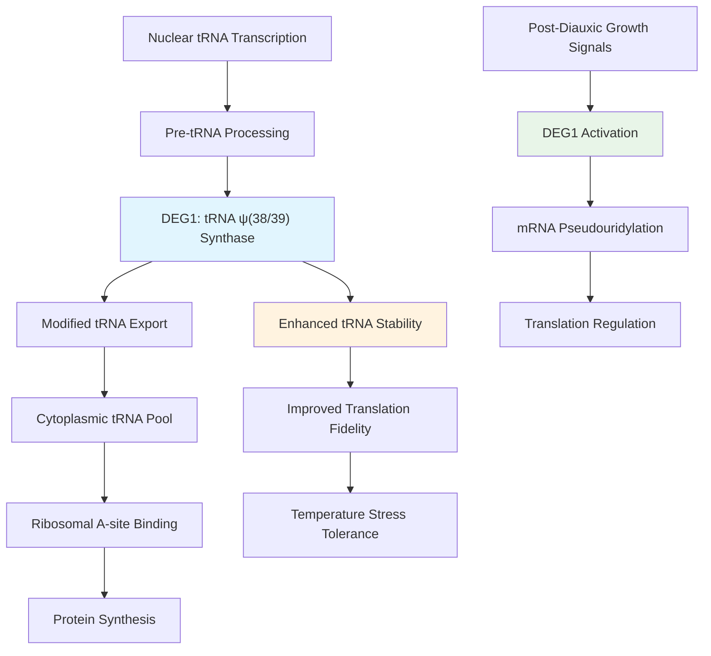

# Pathway Summary for DEG1

## Overview
DEG1 (also known as PUS3) functions as a highly specific tRNA pseudouridine(38/39) synthase that catalyzes the isomerization of uridine to pseudouridine at positions 38 and 39 in the anticodon loop of tRNAs [PMID:9430663]. Beyond its primary role in tRNA modification, DEG1 participates in mRNA pseudouridylation under specific growth conditions, expanding its regulatory scope to both translation fidelity and mRNA stability pathways [PMID:25192136]. The enzyme operates through a cofactor-independent mechanism using a conserved aspartate residue for nucleophilic attack, distinguishing it from other pseudouridine synthases in S. cerevisiae.

## Core tRNA Modification Pathway

DEG1 is an integral component of the tRNA pseudouridine modification network in S. cerevisiae. The enzyme specifically targets positions 38 and 39 in the anticodon loop, which are critical for tRNA structure stabilization and codon recognition accuracy [PMID:9430663]. This modification occurs during tRNA maturation in the nucleus, where DEG1 localizes to process nascent tRNA transcripts before their export to the cytoplasm.

The pseudouridine modifications introduced by DEG1 enhance tRNA thermal stability and maintain proper three-dimensional architecture necessary for ribosomal A-site binding. Loss of DEG1 function results in temperature-sensitive growth defects, particularly at 37°C, highlighting the importance of these modifications for cellular adaptation to stress conditions [PMID:9430663].

## Growth-Dependent mRNA Pseudouridylation

Recent discoveries have expanded DEG1's functional repertoire to include mRNA modification. Under post-diauxic growth conditions, DEG1 modifies approximately 20 mRNAs in a growth-phase dependent manner [PMID:25192136]. This secondary function represents a regulatory mechanism that may influence mRNA stability, translation efficiency, or stress response pathways during metabolic transitions.

The mRNA targets of DEG1 show increased pseudouridylation specifically during post-diauxic growth, suggesting a role in metabolic adaptation when cells transition from fermentative to respiratory metabolism. This temporal regulation indicates that DEG1 functions as both a constitutive tRNA modifier and an inducible mRNA regulator.

## RNA Processing and Quality Control Integration

DEG1 participates in the broader RNA processing network through its dual nuclear-cytoplasmic localization [PMID:9430663]. In the nucleus, it modifies nascent tRNA transcripts as part of the tRNA maturation process. In the cytoplasm, it may provide quality control functions by modifying improperly processed tRNAs or participating in mRNA surveillance pathways.

The enzyme's position-specific activity (targeting only positions 38/39) makes it a unique component of the pseudouridine synthase network, working in concert with other Pus enzymes that modify different tRNA positions. This coordinated modification ensures proper tRNA folding and function across all tRNA species.

## Pathway Diagram

## Cross-Pathway Integration and Regulation

DEG1 integrates with multiple cellular pathways beyond RNA modification. Its temperature-sensitive phenotype connects it to heat stress response pathways, where proper tRNA modification becomes critical for maintaining translation under elevated temperatures. The growth-phase dependent mRNA modification function links DEG1 to metabolic regulation and the diauxic shift response.

The enzyme's dual localization pattern (nuclear and cytoplasmic) allows it to function at different stages of RNA metabolism. Nuclear localization enables co-transcriptional tRNA modification during tRNA gene expression, while cytoplasmic presence may facilitate quality control of exported tRNAs or stress-induced mRNA modifications.

## Functional Consequences and Cellular Impact

Loss of DEG1 function disrupts tRNA structure at the anticodon loop, leading to reduced translation efficiency and temperature sensitivity. The absence of pseudouridine modifications at positions 38/39 specifically affects tRNA interactions with the ribosomal A-site, potentially causing codon misreading or reduced translation rates under stress conditions.

The mRNA modification function of DEG1 adds another layer of translational control, particularly during metabolic transitions. By modifying specific mRNAs during post-diauxic growth, DEG1 may help cells adapt their gene expression profile to respiratory metabolism and stress conditions.

## Research and Biotechnological Significance

DEG1 represents a model system for understanding position-specific RNA modification and its impact on cellular physiology. Its dual substrate specificity (tRNA and mRNA) makes it valuable for studying the evolution of RNA modification enzymes and their regulatory roles. The enzyme's cofactor-independent mechanism and precise positioning specificity provide insights into the structural requirements for pseudouridine formation.

In biotechnology applications, DEG1's specificity could be harnessed for targeted RNA modifications in engineered systems, particularly for enhancing tRNA function in heterologous expression systems or improving stress tolerance in industrial yeast strains.