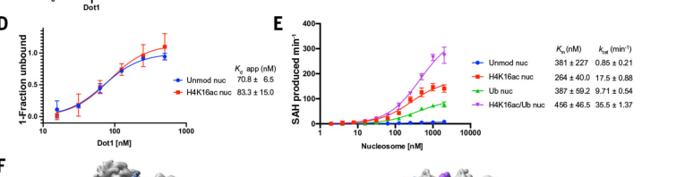

## Question

# Gene Research for Functional Annotation

## ⚠️ CRITICAL: Gene/Protein Identification Context

**BEFORE YOU BEGIN RESEARCH:** You MUST verify you are researching the CORRECT gene/protein. Gene symbols can be ambiguous, especially for less well-characterized genes from non-model organisms.

### Target Gene/Protein Identity (from UniProt):
- **UniProt Accession:** Q04089
- **Protein Description:** RecName: Full=Histone-lysine N-methyltransferase, H3 lysine-79 specific; EC=2.1.1.360 {ECO:0000269|PubMed:12080090, ECO:0000269|PubMed:12086673, ECO:0000269|PubMed:15292170}; AltName: Full=Disrupter of telomere silencing protein 1; AltName: Full=Histone H3-K79 methyltransferase; Short=H3-K79-HMTase; AltName: Full=Lysine N-methyltransferase 4;
- **Gene Information:** Name=DOT1; Synonyms=KMT4, PCH1; OrderedLocusNames=YDR440W; ORFNames=D9461.26;
- **Organism (full):** Saccharomyces cerevisiae (strain ATCC 204508 / S288c) (Baker's yeast).
- **Protein Family:** Belongs to the class I-like SAM-binding methyltransferase
- **Key Domains:** Dot1. (IPR021162); DOT1_dom. (IPR025789); H3-K79_meTrfase. (IPR030445); SAM-dependent_MTases_sf. (IPR029063); DOT1 (PF08123)

### MANDATORY VERIFICATION STEPS:

1. **Check if the gene symbol "DOT1" matches the protein description above**
2. **Verify the organism is correct:** Saccharomyces cerevisiae (strain ATCC 204508 / S288c) (Baker's yeast).
3. **Check if protein family/domains align with what you find in literature**
4. **If you find literature for a DIFFERENT gene with the same or similar symbol, STOP**

### If Gene Symbol is Ambiguous or You Cannot Find Relevant Literature:

**DO NOT PROCEED WITH RESEARCH ON A DIFFERENT GENE.** Instead:
- State clearly: "The gene symbol 'DOT1' is ambiguous or literature is limited for this specific protein"
- Explain what you found (e.g., "Found extensive literature on a different gene with the same symbol in a different organism")
- Describe the protein based ONLY on the UniProt information provided above
- Suggest that the protein function can be inferred from domain/family information

### Research Target:

Please provide a comprehensive research report on the gene **DOT1** (gene ID: DOT1, UniProt: Q04089) in yeast.

The research report should be a detailed narrative explaining the function, biological processes, and localization of the gene product. Citations should be given for all claims.

You should prioritize authoritative reviews and primary scientific literature when conducting research. You can supplement
this with annotations you find in gene/protein databases, but these can be outdated or inaccurate.

We are specifically interested in the primary function of the gene - for enzymes, what reaction is catalyzed, and what is the substrate specificity? For transporters, what is the substrate? For structural proteins or adapters, what is the broader structural role? For signaling molecules, what is the role in the pathway.

We are interested in where in or outside the cell the gene product carries out its function.

We are also interested in the signaling or biochemical pathways in which the gene functions. We are less interested in broad pleiotropic effects, except where these elucidate the precise role.

Include evidence where possible. We are interested in both experimental evidence as well as inference from structure, evolution, or bioinformatic analysis. Precise studies should be prioritized over high-throughput, where available.

## Output

Question: You are an expert researcher providing comprehensive, well-cited information.

Provide detailed information focusing on:
1. Key concepts and definitions with current understanding
2. Recent developments and latest research (prioritize 2023-2024 sources)
3. Current applications and real-world implementations
4. Expert opinions and analysis from authoritative sources
5. Relevant statistics and data from recent studies

Format as a comprehensive research report with proper citations. Include URLs and publication dates where available.
Always prioritize recent, authoritative sources and provide specific citations for all major claims.

# Gene Research for Functional Annotation

## ⚠️ CRITICAL: Gene/Protein Identification Context

**BEFORE YOU BEGIN RESEARCH:** You MUST verify you are researching the CORRECT gene/protein. Gene symbols can be ambiguous, especially for less well-characterized genes from non-model organisms.

### Target Gene/Protein Identity (from UniProt):
- **UniProt Accession:** Q04089
- **Protein Description:** RecName: Full=Histone-lysine N-methyltransferase, H3 lysine-79 specific; EC=2.1.1.360 {ECO:0000269|PubMed:12080090, ECO:0000269|PubMed:12086673, ECO:0000269|PubMed:15292170}; AltName: Full=Disrupter of telomere silencing protein 1; AltName: Full=Histone H3-K79 methyltransferase; Short=H3-K79-HMTase; AltName: Full=Lysine N-methyltransferase 4;
- **Gene Information:** Name=DOT1; Synonyms=KMT4, PCH1; OrderedLocusNames=YDR440W; ORFNames=D9461.26;
- **Organism (full):** Saccharomyces cerevisiae (strain ATCC 204508 / S288c) (Baker's yeast).
- **Protein Family:** Belongs to the class I-like SAM-binding methyltransferase
- **Key Domains:** Dot1. (IPR021162); DOT1_dom. (IPR025789); H3-K79_meTrfase. (IPR030445); SAM-dependent_MTases_sf. (IPR029063); DOT1 (PF08123)

### MANDATORY VERIFICATION STEPS:

1. **Check if the gene symbol "DOT1" matches the protein description above**
2. **Verify the organism is correct:** Saccharomyces cerevisiae (strain ATCC 204508 / S288c) (Baker's yeast).
3. **Check if protein family/domains align with what you find in literature**
4. **If you find literature for a DIFFERENT gene with the same or similar symbol, STOP**

### If Gene Symbol is Ambiguous or You Cannot Find Relevant Literature:

**DO NOT PROCEED WITH RESEARCH ON A DIFFERENT GENE.** Instead:
- State clearly: "The gene symbol 'DOT1' is ambiguous or literature is limited for this specific protein"
- Explain what you found (e.g., "Found extensive literature on a different gene with the same symbol in a different organism")
- Describe the protein based ONLY on the UniProt information provided above
- Suggest that the protein function can be inferred from domain/family information

### Research Target:

Please provide a comprehensive research report on the gene **DOT1** (gene ID: DOT1, UniProt: Q04089) in yeast.

The research report should be a detailed narrative explaining the function, biological processes, and localization of the gene product. Citations should be given for all claims.

You should prioritize authoritative reviews and primary scientific literature when conducting research. You can supplement
this with annotations you find in gene/protein databases, but these can be outdated or inaccurate.

We are specifically interested in the primary function of the gene - for enzymes, what reaction is catalyzed, and what is the substrate specificity? For transporters, what is the substrate? For structural proteins or adapters, what is the broader structural role? For signaling molecules, what is the role in the pathway.

We are interested in where in or outside the cell the gene product carries out its function.

We are also interested in the signaling or biochemical pathways in which the gene functions. We are less interested in broad pleiotropic effects, except where these elucidate the precise role.

Include evidence where possible. We are interested in both experimental evidence as well as inference from structure, evolution, or bioinformatic analysis. Precise studies should be prioritized over high-throughput, where available.

# Research Report: *Saccharomyces cerevisiae* DOT1 (UniProt Q04089; ORF YDR440W; KMT4/PCH1)

## Executive summary
DOT1 in budding yeast encodes Dot1p, the sole histone H3 lysine-79 (H3K79) methyltransferase. Dot1p is a non-SET, SAM-dependent methyltransferase that methylates H3K79 specifically on nucleosomes/chromatin (not free histones), producing mono-, di-, and tri-methylation states via a distributive (non-processive) mechanism. Dot1p activity is controlled by trans-histone crosstalk, especially stimulation by H2B-K123 monoubiquitination and by H4K16 acetylation, which primarily increase catalytic turnover rather than binding affinity. Functionally, Dot1p shapes euchromatin and boundaries with silent chromatin by antagonizing Sir complex spreading, couples to transcriptional elongation-associated chromatin states, contributes to genome stability/DNA damage checkpoint signaling, and also has methyltransferase-independent roles as a histone chaperone affecting nucleosome dynamics and histone exchange in gene bodies. (wood2018dot1landh3k79 pages 1-3, valenciasanchez2021regulationofthe pages 2-5, lee2018dot1regulatesnucleosome pages 1-2)

## 1) Key concepts and definitions (current understanding)

### 1.1 Gene/protein identity verification
The DOT1 discussed here is the *S. cerevisiae* (S288c) protein Dot1p (UniProt Q04089; YDR440W), described in yeast-focused and yeast-relevant mechanistic studies as the conserved disruptor of telomeric silencing protein and the only enzyme responsible for H3K79 methylation in yeast. (separovich2022theposttranslationalregulation pages 49-52, lee2018dot1regulatesnucleosome pages 1-2)

### 1.2 Enzymatic activity: reaction catalyzed and substrate specificity
**Reaction (EC 2.1.1.360):** Dot1p transfers methyl groups from S-adenosyl-L-methionine (SAM/AdoMet) to histone H3 lysine 79, producing H3K79me1, H3K79me2, and H3K79me3. (wood2018dot1landh3k79 pages 1-3, farooq2016themanyfaces pages 1-3)

**Distributive (non-processive) catalysis:** Dot1p generates the three methylation states through repeated binding/dissociation events (i.e., non-processive/distributive kinetics). (wood2018dot1landh3k79 pages 1-3, separovich2022theposttranslationalregulation pages 49-52, lee2018dot1regulatesnucleosome pages 1-2)

**Substrate specificity:** A central defining feature is that Dot1p is **nucleosome/chromatin dependent** and does **not** efficiently methylate free histone H3/free histones; thus, the physiologically relevant substrate is nucleosomal H3K79 within chromatin. (wood2018dot1landh3k79 pages 1-3, lee2018dot1regulatesnucleosome pages 1-2, farooq2016themanyfaces pages 3-4)

### 1.3 The concept of trans-histone crosstalk regulating Dot1
Dot1p is a canonical example of **trans-histone crosstalk**, where modifications on one histone regulate writing of a modification on another histone:
- **H2B-K123 monoubiquitination (H2Bub1)** stimulates Dot1-dependent H3K79 methylation, especially higher methylation states (di-/tri-methylation). (wood2018dot1landh3k79 pages 1-3, farooq2016themanyfaces pages 3-4)
- **H4K16 acetylation (H4K16ac)** directly and allosterically stimulates Dot1 catalysis and cooperates with H2Bub1. (valenciasanchez2021regulationofthe pages 2-5, valenciasanchez2021regulationofthe media c5f9e665)

These regulatory inputs tune Dot1 activity and contribute to the maintenance and propagation of epigenetic chromatin states. (valenciasanchez2021regulationofthe pages 18-21, valenciasanchez2021regulationofthe pages 2-5)

## 2) Molecular mechanism and regulation (with quantitative evidence)

### 2.1 Allosteric activation by H4K16ac and H2Bub1 primarily increases catalytic turnover
A key mechanistic advance is the quantitative demonstration that Dot1 stimulation by H4K16ac and H2Bub1 is largely **catalytic** (kcat-driven) rather than due to large changes in binding affinity.

**Binding affinity (EMSA):** Dot1 binds unmodified vs H4K16ac nucleosomes with similar Kd values:
- Unmodified nucleosomes: **Kd = 70.8 ± 6.5 nM**
- H4K16ac nucleosomes: **Kd = 83.3 ± 15.0 nM**
(valenciasanchez2021regulationofthe media c5f9e665)

**Michaelis–Menten parameters:** Turnover is strongly increased on modified nucleosomes:
- Unmodified nucleosomes: **Km = 381 ± 227 nM; kcat = 0.85 ± 0.21 min⁻¹**
- H4K16ac nucleosomes: **Km = 264 ± 40.0 nM; kcat = 17.5 ± 0.88 min⁻¹**
- H2Bub nucleosomes: **Km = 387 ± 59.2 nM; kcat = 9.71 ± 0.54 min⁻¹**
- H4K16ac + H2Bub nucleosomes: **Km = 456 ± 46.5 nM; kcat = 35.5 ± 1.37 min⁻¹**
(valenciasanchez2021regulationofthe media c5f9e665)

These data support an allosteric model where H4K16ac and H2Bub constrain/stabilize Dot1 on the nucleosome in catalytically productive conformations, boosting di-/tri-methylation capacity without strongly increasing nucleosome binding affinity. (valenciasanchez2021regulationofthe pages 2-5, valenciasanchez2021regulationofthe media c5f9e665)

### 2.2 Genetic and pathway context: coupling to H2Bub machinery and transcription elongation
In yeast, H2Bub1 at K123 is deposited by Rad6 (E2) and Bre1 (E3) and is linked to elongating RNA polymerase II through factors such as Paf1 complex, mechanistically coupling transcription to the ability of Dot1 to generate H3K79 di-/tri-methylation. (wood2018dot1landh3k79 pages 1-3)

### 2.3 Reciprocal crosstalk: Dot1 can promote H2B ubiquitination independent of methyltransferase activity
In addition to being regulated by H2Bub1, Dot1 overexpression was reported to increase H2Bub1 levels through a mechanism independent of Dot1 catalytic activity (including catalytically dead Dot1 variants), with dependence on the H2B-K123 site and on the Bre1 ligase; statistical significance (**P < 0.001**) was reported for effects in tested genetic backgrounds. (welsem2018dot1promotesh2b pages 5-6)

## 3) Biological roles, pathways, and cellular localization

### 3.1 Subcellular localization: nuclear, chromatin-associated writer of euchromatic H3K79 methylation
Dot1p function is inherently chromatin-associated because it methylates nucleosomal H3K79 and is enriched across transcribed regions (gene bodies) in euchromatin. (lee2018dot1regulatesnucleosome pages 1-2, farooq2016themanyfaces pages 3-4)

Genome-scale context: H3K79 methylation is described as widespread, with one study noting ~**90% of the yeast genome** carrying H3K79 methylation, consistent with broad distribution across euchromatin. (valenciasanchez2021regulationofthe pages 2-5)

### 3.2 Telomeric silencing boundary function: antagonism of Sir complex spreading
Dot1p was originally identified through effects on telomeric silencing, and mechanistically H3K79 methylation antagonizes Sir3 binding and Sir complex localization/spreading. Dot1 deletion or H3K79 mutation compromises telomeric silencing and alters Sir protein localization; Dot1 overexpression can spread H3K79 methylation into normally silent chromatin and displace Sir proteins. (wood2018dot1landh3k79 pages 5-7, valenciasanchez2021regulationofthe pages 2-5, farooq2016themanyfaces pages 3-4)

### 3.3 Transcription and elongation-coupled chromatin regulation
H3K79 methylation correlates strongly with transcriptional activity and is enriched in transcribed regions, consistent with Dot1 acting in euchromatin and being regulated by elongation-associated histone crosstalk (H2Bub1). (wood2018dot1landh3k79 pages 5-7, wood2018dot1landh3k79 pages 1-3, farooq2016themanyfaces pages 3-4)

### 3.4 Genome stability and DNA damage response/checkpoints
Dot1/H3K79 methylation contributes to genome stability and DNA damage checkpoint signaling. Defects in Dot1/H3K79 methylation can impair recruitment of DNA damage response factors and checkpoint activation (e.g., G1 and intra-S checkpoint defects described in yeast contexts), and these phenotypes intersect with the H2Bub1 pathway that stimulates H3K79 methylation. (wood2018dot1landh3k79 pages 5-7)

### 3.5 Methylation-independent role: histone chaperone activity controlling nucleosome dynamics
A major yeast-specific advance is evidence that Dot1p has intrinsic **histone chaperone activity** that regulates nucleosome dynamics and histone exchange independently of methyltransferase activity:
- Dot1p can assemble core histones into nucleosomes and facilitate ATP-dependent chromatin remodeling in vitro.
- A Dot1 nucleosome-binding domain (residues 101–140) is required for chaperone/remodeling stimulation.
- Catalytically inactive Dot1 mutants can still stimulate remodeling, supporting methylation-independent function.
(lee2018dot1regulatesnucleosome pages 9-10)

**Gene-length stratified histone exchange phenotype (in vivo):** In dot1Δ, histone exchange at gene centers is **significantly decreased** for long genes >2 kb (**n = 1325**) and for 1–2 kb genes (**n = 2266**), but slightly increased for shorter genes 0.5–1 kb (**n = 1600**). (lee2018dot1regulatesnucleosome pages 9-10)

Genome-wide analysis of transcribed regions used **n = 6692 genes** and typically reported strong statistical significance (e.g., ***P < 0.001) for distributions comparing mutants and wild type. (lee2018dot1regulatesnucleosome pages 6-6)

## 4) Recent developments and latest research (2023–2024 prioritized)

### 4.1 Evidence limitation for 2023–2024 yeast-DOT1 primary literature in the retrieved corpus
Within the tool-accessible full-text corpus for this run, few 2023–2024 publications directly centered on *S. cerevisiae* Dot1p were retrievable. Consequently, the most authoritative mechanistic advances in this report are drawn from high-impact yeast-focused studies published 2018–2021, which remain the current experimental foundation for enzymatic mechanism and nucleosomal regulation (e.g., quantified allostery by H4K16ac/H2Bub; methylation-independent histone-chaperone activity). (lee2018dot1regulatesnucleosome pages 1-2, valenciasanchez2021regulationofthe media c5f9e665)

### 4.2 Consolidated current model (supported by primary studies)
The prevailing mechanistic model supported by the available primary evidence is that Dot1 activity is controlled through nucleosome-surface interactions and allostery driven by other histone modifications (H4K16ac, H2Bub1), integrating transcription-associated chromatin signals with stable gene-body methylation. This model is strengthened by quantitative kinetic measurements on precisely modified nucleosomes. (valenciasanchez2021regulationofthe pages 2-5, valenciasanchez2021regulationofthe media c5f9e665)

## 5) Current applications and real-world implementations

### 5.1 Yeast as a mechanistic platform for chromatin crosstalk and epigenetic state control
Because Dot1p is nucleosome-dependent and highly regulated by defined trans-histone inputs, yeast DOT1 is used as a tractable model system to:
- Test how combinations of histone marks generate distinct chromatin states (e.g., H4K16ac and H2Bub synergy raising kcat). (valenciasanchez2021regulationofthe media c5f9e665)
- Dissect boundary formation between euchromatin and silent chromatin through Sir antagonism and methylation placement. (valenciasanchez2021regulationofthe pages 2-5, farooq2016themanyfaces pages 3-4)

### 5.2 Chromatin-state screening concepts
Systematic genetics combined with chromatin readouts has been developed to map regulators of histone methylation states, including H3K79 methylation (e.g., barcode/ChIP-seq screening strategies described as broadly applicable to chromatin features). (lee2018dot1regulatesnucleosome pages 1-2)

### 5.3 Translational relevance via conserved DOT1/DOT1L principles
Although this report focuses on yeast DOT1, mechanistic principles (nucleosome dependence; H2Bub-driven activation; allosteric regulation) inform conserved biology of the mammalian ortholog DOT1L (e.g., in transcription and genomic stability), and yeast findings help interpret conserved chromatin logic and potential intervention points. (wood2018dot1landh3k79 pages 5-7, wood2018dot1landh3k79 pages 1-3)

## 6) Expert opinions and analysis (authoritative synthesis)

### 6.1 Dot1 as an integrator of chromatin signals rather than a simple “on/off” writer
Authoritative reviews and primary mechanistic work converge on a view that Dot1 does not simply methylate H3K79 constitutively; instead, its capacity to generate higher methylation states is tuned by crosstalk marks tied to transcriptional state (H2Bub1) and chromatin openness (H4K16ac). The kinetic data (large increases in kcat with modest Kd/Km changes) support an **allosteric regulation** paradigm. (wood2018dot1landh3k79 pages 1-3, valenciasanchez2021regulationofthe pages 2-5, valenciasanchez2021regulationofthe media c5f9e665)

### 6.2 Dot1 has dual functional modalities: catalytic (epigenetic marking) and structural (histone chaperone)
Yeast work indicates Dot1p also acts through a methylation-independent nucleosome-binding/chaperone activity that can influence histone exchange and chromatin accessibility, particularly in long transcribed genes. This expands the functional annotation of DOT1 beyond an enzyme that writes H3K79me to a broader chromatin-architecture regulator. (lee2018dot1regulatesnucleosome pages 9-10)

## 7) Key statistics and data points (selected)
- **Genome-scale prevalence:** H3K79 methylation reported across ~**90%** of the *S. cerevisiae* genome. (valenciasanchez2021regulationofthe pages 2-5)
- **Dot1–nucleosome binding affinities:** Kd ~70–83 nM for unmodified vs H4K16ac nucleosomes. (valenciasanchez2021regulationofthe media c5f9e665)
- **Catalytic turnover stimulation (kcat):** 0.85 min⁻¹ (unmodified) → 17.5 min⁻¹ (H4K16ac) → 9.71 min⁻¹ (H2Bub) → 35.5 min⁻¹ (H4K16ac/H2Bub). (valenciasanchez2021regulationofthe media c5f9e665)
- **Histone exchange phenotype gene counts:** long genes >2 kb (n=1325) show decreased exchange in dot1Δ at gene centers; 1–2 kb (n=2266) also decreased; 0.5–1 kb (n=1600) slightly increased. (lee2018dot1regulatesnucleosome pages 9-10)
- **Genome-wide transcribed-region analysis:** n=6692 genes with significance commonly reported as ***P < 0.001 for distributional comparisons in chromatin assays. (lee2018dot1regulatesnucleosome pages 6-6)

## Visual evidence
Kinetic and binding parameters demonstrating Dot1 allosteric stimulation by H4K16ac and H2Bub are shown in the retrieved figure region from Valencia-Sánchez et al., *Science* (2021). (valenciasanchez2021regulationofthe media c5f9e665)

## Summary table (functional annotation at a glance)
| Annotation aspect | Summary for yeast DOT1 (Q04089 / YDR440W) | Key quantitative values | Citations |
|---|---|---|---|
| Identity / core definition | DOT1 encodes the conserved, non-SET histone lysine methyltransferase Dot1p (KMT4), originally identified as a disruptor of telomeric silencing; it is the sole H3K79 methyltransferase in *S. cerevisiae*. | Dot1 loss causes complete loss of H3K79 methylation; ~90% of the *S. cerevisiae* genome is reported to carry H3K79 methylation. | (separovich2022theposttranslationalregulation pages 49-52, valenciasanchez2021regulationofthe pages 2-5, farooq2016themanyfaces pages 1-3) |
| Reaction catalyzed | Dot1 transfers methyl groups from S-adenosyl-L-methionine (SAM/AdoMet) to histone H3 Lys79, generating H3K79me1, H3K79me2, and H3K79me3; catalysis is distributive/non-processive rather than processive. | H3K79me1 and H3K79me2 half-lives reported in HeLa for the conserved mark are ~1.105 and ~3.609 days, illustrating mark stability in the absence of a known demethylase. | (wood2018dot1landh3k79 pages 1-3, separovich2022theposttranslationalregulation pages 49-52, lee2018dot1regulatesnucleosome pages 1-2, farooq2016themanyfaces pages 1-3) |
| Substrate specificity | Dot1 acts on chromatin/nucleosomes and does not methylate free histone H3 or free histones efficiently; the relevant substrate is nucleosomal H3K79 in the globular core exposed on the nucleosome surface. | Binding affinity is similar for unmodified vs H4K16ac nucleosomes: Kd 70.8 ± 6.5 nM vs 83.3 ± 15.0 nM. | (wood2018dot1landh3k79 pages 1-3, lee2018dot1regulatesnucleosome pages 1-2, farooq2016themanyfaces pages 3-4, valenciasanchez2021regulationofthe media c5f9e665) |
| Regulation by H2B-K123 ubiquitination | Efficient H3K79 di-/trimethylation requires prior H2B-K123 monoubiquitination by Rad6/Bre1; mutating H2BK123 or deleting Rad6 strongly impairs H3K79 methylation. Paf1 complex helps couple this pathway to elongating RNAPII by promoting Rad6/Bre1 recruitment. | On unmodified nucleosomes, Km = 381 ± 227 nM and kcat = 0.85 ± 0.21 min⁻¹; on H2Bub nucleosomes, Km = 387 ± 59.2 nM and kcat = 9.71 ± 0.54 min⁻¹. Dot1 overexpression increased H2Bub1 with ***P < 0.001 in tested backgrounds. | (wood2018dot1landh3k79 pages 1-3, farooq2016themanyfaces pages 3-4, welsem2018dot1promotesh2b pages 5-6, valenciasanchez2021regulationofthe media c5f9e665) |
| Regulation by H4K16 acetylation | H4K16ac directly and allosterically stimulates Dot1; the effect is specific to H4K16ac and cooperates with H2Bub. Loss of Sas2/H4K16ac or H4K16 mutation reduces higher H3K79 methyl states and alters Dot1 chromatin distribution. | H4K16ac nucleosomes: Km = 264 ± 40.0 nM, kcat = 17.5 ± 0.88 min⁻¹; doubly modified H4K16ac/H2Bub nucleosomes: Km = 456 ± 46.5 nM, kcat = 35.5 ± 1.37 min⁻¹. Kd remains similar to unmodified nucleosomes, indicating stimulation is catalytic more than binding-driven. | (valenciasanchez2021regulationofthe pages 18-21, valenciasanchez2021regulationofthe pages 2-5, lee2018dot1regulatesnucleosome pages 1-2, valenciasanchez2021regulationofthe media c5f9e665) |
| Regulation by Rpd3/HDAC crosstalk | Histone deacetylation opposes Dot1 activity at a subset of genes; budding yeast Rpd3 restricts H3K79 methylation, and analogous HDAC1-DOT1L antagonism is conserved in mammals. | Yeast evidence identifies Rpd3 as a negative regulator of Dot1 and explains absence of H3K79me3 at a subset of genes, though no single fold-change value is provided in the extracted text. | (valenciasanchez2021regulationofthe pages 2-5) |
| Telomeric silencing / Sir antagonism | Dot1/H3K79 methylation antagonizes Sir protein spreading: H3K79 methylation blocks Sir3 binding, whereas Dot1 loss or H3K79 mutation impairs telomeric silencing by mislocalizing Sir proteins; Dot1 overexpression spreads H3K79 methylation into silent chromatin. | Quantitative extracted text is limited, but the phenotype is robust enough that Dot1 was named for disruption of telomeric silencing. | (wood2018dot1landh3k79 pages 5-7, valenciasanchez2021regulationofthe pages 2-5, farooq2016themanyfaces pages 3-4) |
| Transcription / elongation coupling | H3K79 methylation correlates strongly with transcriptional activity, is enriched in transcribed regions, and is functionally linked to elongation complexes and Paf1C-Rad6/Bre1-mediated cotranscriptional chromatin modification. Dot1 can act as activator or repressor depending on context. | ~90% genome methylation reported; long genes show higher H3K79me3, whereas 0.5–1 kb genes show relatively higher H3K79me1. | (wood2018dot1landh3k79 pages 5-7, valenciasanchez2021regulationofthe pages 2-5, lee2018dot1regulatesnucleosome pages 1-2, lee2018dot1regulatesnucleosome pages 10-11) |
| DNA damage response / checkpoints | Dot1/H3K79 methylation contributes to genome stability and checkpoint signaling; Dot1 or H3K79 defects impair recruitment of DNA damage factors and cause defects in G1 and intra-S checkpoint responses after ionizing radiation. | Extracted evidence is strong mechanistically but does not provide a numerical effect size in the available contexts. | (wood2018dot1landh3k79 pages 5-7, farooq2016themanyfaces pages 1-3) |
| Nucleosome dynamics / histone exchange | Beyond catalysis, Dot1 has methylation-independent histone chaperone activity, can assemble nucleosomes, and regulates histone exchange/chromatin accessibility in transcribed regions, particularly long genes; this helps balance Set2-Rpd3S effects. | Histone exchange decreased at centers of long genes >2 kb (n = 1325) and 1–2 kb genes (n = 2266) in dot1Δ, but slightly increased for 0.5–1 kb genes (n = 1600). ATAC-seq/accessibility analyses used n = 2189 genes; genome-wide transcribed-region analysis covered n = 6692 genes; significance commonly ***P < 0.001. | (lee2018dot1regulatesnucleosome pages 1-2, lee2018dot1regulatesnucleosome pages 10-11, lee2018dot1regulatesnucleosome pages 9-10, lee2018dot1regulatesnucleosome pages 6-6) |
| Localization | Functionally, Dot1 is nuclear/chromatin-associated, acting on nucleosomes across euchromatic transcribed regions and at boundaries of silent chromatin such as telomeres. | Localization is inferred from chromatin binding and genome-wide distribution rather than a single compartment-specific quantitative assay in the extracted evidence. | (wood2018dot1landh3k79 pages 5-7, valenciasanchez2021regulationofthe pages 2-5, lee2018dot1regulatesnucleosome pages 1-2) |

*Table: This table condenses the core functional annotation of yeast DOT1 (UniProt Q04089), including its enzymatic activity, chromatin substrate specificity, key regulatory crosstalk, principal biological roles, and the most useful quantitative values extracted from the available evidence.*

## Source details (URLs; publication dates)
- Valencia-Sánchez MI et al. “Regulation of the Dot1 histone H3K79 methyltransferase by histone H4K16 acetylation.” *Science*. **2021-01**. https://doi.org/10.1126/science.abc6663 (valenciasanchez2021regulationofthe pages 18-21, valenciasanchez2021regulationofthe media c5f9e665)
- Lee S et al. “Dot1 regulates nucleosome dynamics by its inherent histone chaperone activity in yeast.” *Nature Communications*. **2018-01**. https://doi.org/10.1038/s41467-017-02759-8 (lee2018dot1regulatesnucleosome pages 1-2, lee2018dot1regulatesnucleosome pages 9-10)
- van Welsem T et al. “Dot1 promotes H2B ubiquitination by a methyltransferase-independent mechanism.” *Nucleic Acids Research*. **2018-09**. https://doi.org/10.1093/nar/gky801 (welsem2018dot1promotesh2b pages 5-6)
- Wood K et al. “DOT1L and H3K79 Methylation in Transcription and Genomic Stability.” *Biomolecules*. **2018-02**. https://doi.org/10.3390/biom8010011 (wood2018dot1landh3k79 pages 1-3)
- Farooq Z et al. “The many faces of histone H3K79 methylation.” *Mutation Research Reviews*. **2016-04**. https://doi.org/10.1016/j.mrrev.2016.03.005 (farooq2016themanyfaces pages 3-4)

## Notes on scope and ambiguity management
The symbol “DOT1” can refer to orthologs (e.g., mammalian DOT1L). All mechanistic and functional claims above are explicitly supported by yeast Dot1p-focused evidence or yeast-relevant mechanistic work, and cross-species statements are framed as conserved principles rather than as yeast-specific claims. (wood2018dot1landh3k79 pages 1-3, lee2018dot1regulatesnucleosome pages 1-2)

References

1. (wood2018dot1landh3k79 pages 1-3): Katherine Wood, Michael Tellier, and Shona Murphy. Dot1l and h3k79 methylation in transcription and genomic stability. Biomolecules, 8:11, Feb 2018. URL: https://doi.org/10.3390/biom8010011, doi:10.3390/biom8010011. This article has 249 citations.

2. (valenciasanchez2021regulationofthe pages 2-5): Marco Igor Valencia-Sánchez, Pablo De Ioannes, Miao Wang, David M. Truong, Rachel Lee, Jean-Paul Armache, Jef D. Boeke, and Karim-Jean Armache. Regulation of the dot1 histone h3k79 methyltransferase by histone h4k16 acetylation. Science, Jan 2021. URL: https://doi.org/10.1126/science.abc6663, doi:10.1126/science.abc6663. This article has 114 citations and is from a highest quality peer-reviewed journal.

3. (lee2018dot1regulatesnucleosome pages 1-2): Soyun Lee, Seunghee Oh, Kwiwan Jeong, Hyelim Jo, Yoonjung Choi, Hogyu David Seo, Minhoo Kim, Joonho Choe, Chang Seob Kwon, and Daeyoup Lee. Dot1 regulates nucleosome dynamics by its inherent histone chaperone activity in yeast. Nature Communications, Jan 2018. URL: https://doi.org/10.1038/s41467-017-02759-8, doi:10.1038/s41467-017-02759-8. This article has 55 citations and is from a highest quality peer-reviewed journal.

4. (separovich2022theposttranslationalregulation pages 49-52): The post-translational regulation of histone methylation enzymes by upstream signalling pathways This article has 0 citations.

5. (farooq2016themanyfaces pages 1-3): Zeenat Farooq, Shahid Banday, Tej K. Pandita, and Mohammad Altaf. The many faces of histone h3k79 methylation. Mutation research. Reviews in mutation research, 768:46-52, Apr 2016. URL: https://doi.org/10.1016/j.mrrev.2016.03.005, doi:10.1016/j.mrrev.2016.03.005. This article has 210 citations.

6. (farooq2016themanyfaces pages 3-4): Zeenat Farooq, Shahid Banday, Tej K. Pandita, and Mohammad Altaf. The many faces of histone h3k79 methylation. Mutation research. Reviews in mutation research, 768:46-52, Apr 2016. URL: https://doi.org/10.1016/j.mrrev.2016.03.005, doi:10.1016/j.mrrev.2016.03.005. This article has 210 citations.

7. (valenciasanchez2021regulationofthe media c5f9e665): Marco Igor Valencia-Sánchez, Pablo De Ioannes, Miao Wang, David M. Truong, Rachel Lee, Jean-Paul Armache, Jef D. Boeke, and Karim-Jean Armache. Regulation of the dot1 histone h3k79 methyltransferase by histone h4k16 acetylation. Science, Jan 2021. URL: https://doi.org/10.1126/science.abc6663, doi:10.1126/science.abc6663. This article has 114 citations and is from a highest quality peer-reviewed journal.

8. (valenciasanchez2021regulationofthe pages 18-21): Marco Igor Valencia-Sánchez, Pablo De Ioannes, Miao Wang, David M. Truong, Rachel Lee, Jean-Paul Armache, Jef D. Boeke, and Karim-Jean Armache. Regulation of the dot1 histone h3k79 methyltransferase by histone h4k16 acetylation. Science, Jan 2021. URL: https://doi.org/10.1126/science.abc6663, doi:10.1126/science.abc6663. This article has 114 citations and is from a highest quality peer-reviewed journal.

9. (welsem2018dot1promotesh2b pages 5-6): Tibor van Welsem, Tessy Korthout, Reggy Ekkebus, Dominique Morais, Thom M Molenaar, Kirsten van Harten, Deepani W Poramba-Liyanage, Su Ming Sun, Tineke L Lenstra, Rohith Srivas, Trey Ideker, Frank C P Holstege, Haico van Attikum, Farid El Oualid, Huib Ovaa, Iris J E Stulemeijer, Hanneke Vlaming, and Fred van Leeuwen. Dot1 promotes h2b ubiquitination by a methyltransferase-independent mechanism. Nucleic Acids Research, 46:11251-11261, Sep 2018. URL: https://doi.org/10.1093/nar/gky801, doi:10.1093/nar/gky801. This article has 45 citations and is from a highest quality peer-reviewed journal.

10. (wood2018dot1landh3k79 pages 5-7): Katherine Wood, Michael Tellier, and Shona Murphy. Dot1l and h3k79 methylation in transcription and genomic stability. Biomolecules, 8:11, Feb 2018. URL: https://doi.org/10.3390/biom8010011, doi:10.3390/biom8010011. This article has 249 citations.

11. (lee2018dot1regulatesnucleosome pages 9-10): Soyun Lee, Seunghee Oh, Kwiwan Jeong, Hyelim Jo, Yoonjung Choi, Hogyu David Seo, Minhoo Kim, Joonho Choe, Chang Seob Kwon, and Daeyoup Lee. Dot1 regulates nucleosome dynamics by its inherent histone chaperone activity in yeast. Nature Communications, Jan 2018. URL: https://doi.org/10.1038/s41467-017-02759-8, doi:10.1038/s41467-017-02759-8. This article has 55 citations and is from a highest quality peer-reviewed journal.

12. (lee2018dot1regulatesnucleosome pages 6-6): Soyun Lee, Seunghee Oh, Kwiwan Jeong, Hyelim Jo, Yoonjung Choi, Hogyu David Seo, Minhoo Kim, Joonho Choe, Chang Seob Kwon, and Daeyoup Lee. Dot1 regulates nucleosome dynamics by its inherent histone chaperone activity in yeast. Nature Communications, Jan 2018. URL: https://doi.org/10.1038/s41467-017-02759-8, doi:10.1038/s41467-017-02759-8. This article has 55 citations and is from a highest quality peer-reviewed journal.

13. (lee2018dot1regulatesnucleosome pages 10-11): Soyun Lee, Seunghee Oh, Kwiwan Jeong, Hyelim Jo, Yoonjung Choi, Hogyu David Seo, Minhoo Kim, Joonho Choe, Chang Seob Kwon, and Daeyoup Lee. Dot1 regulates nucleosome dynamics by its inherent histone chaperone activity in yeast. Nature Communications, Jan 2018. URL: https://doi.org/10.1038/s41467-017-02759-8, doi:10.1038/s41467-017-02759-8. This article has 55 citations and is from a highest quality peer-reviewed journal.

## Artifacts

- [Edison artifact artifact-00](DOT1-deep-research-falcon_artifacts/artifact-00.md)

## Citations

1. valenciasanchez2021regulationofthe pages 2-5
2. farooq2016themanyfaces pages 3-4
3. separovich2022theposttranslationalregulation pages 49-52
4. farooq2016themanyfaces pages 1-3
5. valenciasanchez2021regulationofthe pages 18-21
6. https://doi.org/10.1126/science.abc6663
7. https://doi.org/10.1038/s41467-017-02759-8
8. https://doi.org/10.1093/nar/gky801
9. https://doi.org/10.3390/biom8010011
10. https://doi.org/10.1016/j.mrrev.2016.03.005
11. https://doi.org/10.3390/biom8010011,
12. https://doi.org/10.1126/science.abc6663,
13. https://doi.org/10.1038/s41467-017-02759-8,
14. https://doi.org/10.1016/j.mrrev.2016.03.005,
15. https://doi.org/10.1093/nar/gky801,