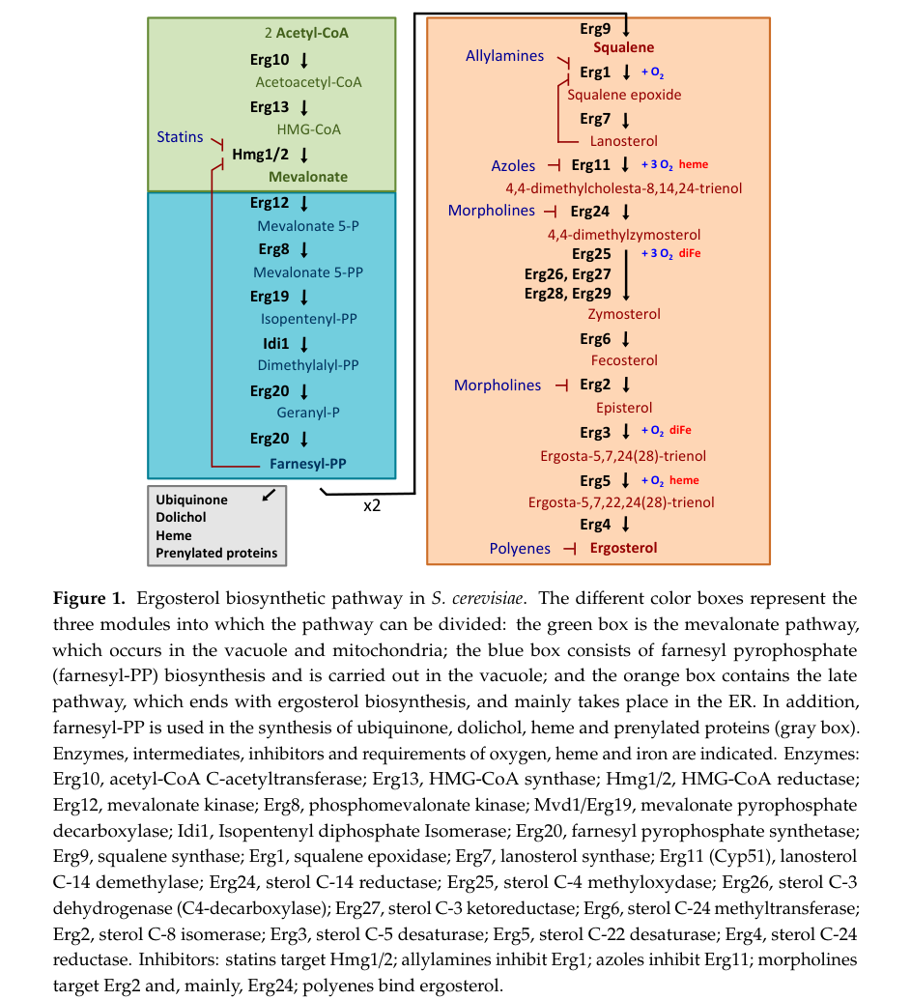

## Question

# Gene Research for Functional Annotation

## ⚠️ CRITICAL: Gene/Protein Identification Context

**BEFORE YOU BEGIN RESEARCH:** You MUST verify you are researching the CORRECT gene/protein. Gene symbols can be ambiguous, especially for less well-characterized genes from non-model organisms.

### Target Gene/Protein Identity (from UniProt):
- **UniProt Accession:** P32377
- **Protein Description:** RecName: Full=Diphosphomevalonate decarboxylase {ECO:0000303|PubMed:9244250}; EC=4.1.1.33 {ECO:0000269|PubMed:8626466}; AltName: Full=Ergosterol biosynthesis protein 19 {ECO:0000303|PubMed:9244250}; AltName: Full=Mevalonate pyrophosphate decarboxylase {ECO:0000303|PubMed:8626466}; Short=MPD {ECO:0000303|PubMed:8626466}; AltName: Full=Mevalonate-5-diphosphate decarboxylase {ECO:0000303|PubMed:11698677}; Short=MDD {ECO:0000303|PubMed:11698677}; Short=MDDase {ECO:0000303|PubMed:11698677};
- **Gene Information:** Name=MVD1 {ECO:0000303|PubMed:11698677}; Synonyms=ERG19 {ECO:0000303|PubMed:9244250}, MPD {ECO:0000303|PubMed:8626466}; OrderedLocusNames=YNR043W; ORFNames=N3427;
- **Organism (full):** Saccharomyces cerevisiae (strain ATCC 204508 / S288c) (Baker's yeast).
- **Protein Family:** Belongs to the diphosphomevalonate decarboxylase family.
- **Key Domains:** GHMP_kinase_C_sf. (IPR036554); Mev_decarb. (IPR005935); Mev_diP_decarb. (IPR029765); MVD-like_N. (IPR053859); Mvd1_C. (IPR041431)

### MANDATORY VERIFICATION STEPS:

1. **Check if the gene symbol "MVD1" matches the protein description above**
2. **Verify the organism is correct:** Saccharomyces cerevisiae (strain ATCC 204508 / S288c) (Baker's yeast).
3. **Check if protein family/domains align with what you find in literature**
4. **If you find literature for a DIFFERENT gene with the same or similar symbol, STOP**

### If Gene Symbol is Ambiguous or You Cannot Find Relevant Literature:

**DO NOT PROCEED WITH RESEARCH ON A DIFFERENT GENE.** Instead:
- State clearly: "The gene symbol 'MVD1' is ambiguous or literature is limited for this specific protein"
- Explain what you found (e.g., "Found extensive literature on a different gene with the same symbol in a different organism")
- Describe the protein based ONLY on the UniProt information provided above
- Suggest that the protein function can be inferred from domain/family information

### Research Target:

Please provide a comprehensive research report on the gene **MVD1** (gene ID: ERG19, UniProt: P32377) in yeast.

The research report should be a detailed narrative explaining the function, biological processes, and localization of the gene product. Citations should be given for all claims.

You should prioritize authoritative reviews and primary scientific literature when conducting research. You can supplement
this with annotations you find in gene/protein databases, but these can be outdated or inaccurate.

We are specifically interested in the primary function of the gene - for enzymes, what reaction is catalyzed, and what is the substrate specificity? For transporters, what is the substrate? For structural proteins or adapters, what is the broader structural role? For signaling molecules, what is the role in the pathway.

We are interested in where in or outside the cell the gene product carries out its function.

We are also interested in the signaling or biochemical pathways in which the gene functions. We are less interested in broad pleiotropic effects, except where these elucidate the precise role.

Include evidence where possible. We are interested in both experimental evidence as well as inference from structure, evolution, or bioinformatic analysis. Precise studies should be prioritized over high-throughput, where available.

## Output

Question: You are an expert researcher providing comprehensive, well-cited information.

Provide detailed information focusing on:
1. Key concepts and definitions with current understanding
2. Recent developments and latest research (prioritize 2023-2024 sources)
3. Current applications and real-world implementations
4. Expert opinions and analysis from authoritative sources
5. Relevant statistics and data from recent studies

Format as a comprehensive research report with proper citations. Include URLs and publication dates where available.
Always prioritize recent, authoritative sources and provide specific citations for all major claims.

# Gene Research for Functional Annotation

## ⚠️ CRITICAL: Gene/Protein Identification Context

**BEFORE YOU BEGIN RESEARCH:** You MUST verify you are researching the CORRECT gene/protein. Gene symbols can be ambiguous, especially for less well-characterized genes from non-model organisms.

### Target Gene/Protein Identity (from UniProt):
- **UniProt Accession:** P32377
- **Protein Description:** RecName: Full=Diphosphomevalonate decarboxylase {ECO:0000303|PubMed:9244250}; EC=4.1.1.33 {ECO:0000269|PubMed:8626466}; AltName: Full=Ergosterol biosynthesis protein 19 {ECO:0000303|PubMed:9244250}; AltName: Full=Mevalonate pyrophosphate decarboxylase {ECO:0000303|PubMed:8626466}; Short=MPD {ECO:0000303|PubMed:8626466}; AltName: Full=Mevalonate-5-diphosphate decarboxylase {ECO:0000303|PubMed:11698677}; Short=MDD {ECO:0000303|PubMed:11698677}; Short=MDDase {ECO:0000303|PubMed:11698677};
- **Gene Information:** Name=MVD1 {ECO:0000303|PubMed:11698677}; Synonyms=ERG19 {ECO:0000303|PubMed:9244250}, MPD {ECO:0000303|PubMed:8626466}; OrderedLocusNames=YNR043W; ORFNames=N3427;
- **Organism (full):** Saccharomyces cerevisiae (strain ATCC 204508 / S288c) (Baker's yeast).
- **Protein Family:** Belongs to the diphosphomevalonate decarboxylase family.
- **Key Domains:** GHMP_kinase_C_sf. (IPR036554); Mev_decarb. (IPR005935); Mev_diP_decarb. (IPR029765); MVD-like_N. (IPR053859); Mvd1_C. (IPR041431)

### MANDATORY VERIFICATION STEPS:

1. **Check if the gene symbol "MVD1" matches the protein description above**
2. **Verify the organism is correct:** Saccharomyces cerevisiae (strain ATCC 204508 / S288c) (Baker's yeast).
3. **Check if protein family/domains align with what you find in literature**
4. **If you find literature for a DIFFERENT gene with the same or similar symbol, STOP**

### If Gene Symbol is Ambiguous or You Cannot Find Relevant Literature:

**DO NOT PROCEED WITH RESEARCH ON A DIFFERENT GENE.** Instead:
- State clearly: "The gene symbol 'MVD1' is ambiguous or literature is limited for this specific protein"
- Explain what you found (e.g., "Found extensive literature on a different gene with the same symbol in a different organism")
- Describe the protein based ONLY on the UniProt information provided above
- Suggest that the protein function can be inferred from domain/family information

### Research Target:

Please provide a comprehensive research report on the gene **MVD1** (gene ID: ERG19, UniProt: P32377) in yeast.

The research report should be a detailed narrative explaining the function, biological processes, and localization of the gene product. Citations should be given for all claims.

You should prioritize authoritative reviews and primary scientific literature when conducting research. You can supplement
this with annotations you find in gene/protein databases, but these can be outdated or inaccurate.

We are specifically interested in the primary function of the gene - for enzymes, what reaction is catalyzed, and what is the substrate specificity? For transporters, what is the substrate? For structural proteins or adapters, what is the broader structural role? For signaling molecules, what is the role in the pathway.

We are interested in where in or outside the cell the gene product carries out its function.

We are also interested in the signaling or biochemical pathways in which the gene functions. We are less interested in broad pleiotropic effects, except where these elucidate the precise role.

Include evidence where possible. We are interested in both experimental evidence as well as inference from structure, evolution, or bioinformatic analysis. Precise studies should be prioritized over high-throughput, where available.

## Research report: *Saccharomyces cerevisiae* **MVD1 / ERG19** (UniProt **P32377**) — functional annotation

### Executive summary
*MVD1* (syn. *ERG19*) in *Saccharomyces cerevisiae* (S288c) encodes **mevalonate diphosphate (pyro)phosphate decarboxylase** (EC **4.1.1.33**), an **ATP-dependent, Mg2+-requiring decarboxylase** that converts **mevalonate-5-diphosphate (MVAPP; mevalonate pyrophosphate)** to **isopentenyl diphosphate (IPP)**, an essential universal isoprenoid precursor. Genetic evidence indicates *ERG19* is **essential for viability** in yeast, and the enzyme functions within the cytosolic mevalonate module upstream of ergosterol synthesis. (johnston2020thewide‐rangingphenotypes pages 1-5, cordier1999heterologousexpressionin pages 1-2)

### 1) Key concepts and definitions (current understanding)

#### 1.1 Gene/protein identity verification (critical disambiguation)
The literature retrieved here consistently maps **yeast ERG19/MVD1** to **mevalonate diphosphate decarboxylase** (EC 4.1.1.33), a mevalonate-pathway enzyme producing **IPP** from **mevalonate-5-diphosphate**. This matches the provided UniProt identity (P32377; baker’s yeast; diphosphomevalonate decarboxylase family). (johnston2020thewide‐rangingphenotypes pages 1-5, cordier1999heterologousexpressionin pages 1-2)

#### 1.2 Enzyme reaction and biochemical role
**Reaction (core functional annotation).** ERG19/MVD1 catalyzes the decarboxylation of **mevalonate diphosphate** to **IPP**. A key biochemical point is that the reaction is coupled to **ATP hydrolysis** and requires **Mg2+**. (cordier1999heterologousexpressionin pages 1-2)

A higher-level mechanistic framing from enzyme-family literature describes fungal MVD/MDD as an **ATP-dependent decarboxylase** that produces **IPP + CO2** with **ADP** as a product, and emphasizes Mg2+ dependence. (garay2026themevalonatepathway pages 12-13)

**Pathway placement.** In the canonical yeast mevalonate→ergosterol route, ERG19/MVD1 acts after the mevalonate phosphorylation steps (ERG12, ERG8) and before **Idi1** (IPP isomerization) and **Erg20** (prenyltransfer to GPP/FPP), thereby linking acetyl-CoA-derived mevalonate metabolism to sterol biosynthesis and broader isoprenoid supply. (johnston2020thewide‐rangingphenotypes pages 1-5)

#### 1.3 Mechanistic concepts (enzyme family-level)
MVD/MDD enzymes belong to the **GHMP kinase superfamily** and are described to catalyze decarboxylation via **ATP-dependent activation** of the MVAPP substrate (a transient **3-phospho-MVAPP** intermediate is proposed), after which decarboxylation/elimination yields the double bond of IPP. (garay2026themevalonatepathway pages 12-13)

*Important limitation:* the mechanistic details above are consistent with fungal/yeast MVD/MDD family context, but were not extracted here from a dedicated *S. cerevisiae* ERG19 structural/kinetic paper; therefore, yeast-specific residue-level conclusions should be treated as **inferred**, not directly demonstrated in the cited yeast experiments in this run. (garay2026themevalonatepathway pages 12-13)

### 2) Recent developments and latest research (prioritizing 2023–2024)

#### 2.1 2024 metabolic engineering study explicitly manipulating ERG19
A 2024 peer-reviewed metabolic engineering study (Microbial Cell Factories) constructed a yeast strain with **overexpression of the mevalonate pathway**, explicitly including **ERG19** (with ERG10, ERG13, ERG12, ERG8, and IDI) as part of an integrated mevalonate cassette used to increase precursor flux. Using this chassis and combinatorial downstream engineering, the authors report a **taxadiene titer of 528 mg/L** (shake-flask), emphasizing that pathway balance is critical for terpenoid production. (karaca2024metabolicengineeringof pages 2-4)

*Interpretation:* while ERG19 is not singled out as the sole control point in that work, its deliberate inclusion in the overexpression cassette reflects a contemporary design principle: **co-upregulation of the full precursor module**, not only the classic HMGR step, to support high-flux terpene biosynthesis. (karaca2024metabolicengineeringof pages 2-4)

#### 2.2 Recent work not directly captured in this run
Within the retrieved 2023–2024 corpus, tool-based extraction did not return additional ERG19-specific quantitative results beyond the taxadiene study above. This likely reflects a common reporting pattern in the field: many papers describe “overexpression of the MVA pathway” without always listing every ERG gene in the abstract/early pages. Therefore, the “latest research” section here is **representative but not exhaustive** for 2023–2024 ERG19-specific manipulations. (karaca2024metabolicengineeringof pages 2-4)

### 3) Current applications and real-world implementations

#### 3.1 Industrial biotechnology: terpene/isoprenoid precursor supply
ERG19/MVD1 generates **IPP**, a central precursor feeding prenyl diphosphates and downstream terpenoids. The 2024 taxadiene work provides a concrete implementation where **ERG19 is overexpressed** as part of a precursor-supply strategy enabling **hundreds of mg/L** production of a diterpene hydrocarbon (taxadiene). (karaca2024metabolicengineeringof pages 2-4)

#### 3.2 Antifungal target context
A 2025 antifungal-focused review situates ERG19/MVD1 in the conserved fungal mevalonate/sterol axis and notes essentiality/virulence relevance for *Candida albicans* using conditional expression strains. It further notes that several mevalonate-pathway proteins (including ERG19) have human homologs but are reported to share **<50% sequence identity** in this pathway context, supporting interest in selective targeting strategies. (gutierrezperez2025targetingfungallipid pages 3-4)

*Scope note:* this is not evidence that ERG19 itself is a validated drug target in the clinic; it is evidence that the pathway is biologically essential and considered a plausible target space. (gutierrezperez2025targetingfungallipid pages 3-4)

### 4) Expert opinions and authoritative analyses

#### 4.1 Ergosterol pathway modularity and cellular consequences
A detailed yeast-focused review emphasizes the modular nature of ergosterol biosynthesis and that the pathway is energetically expensive; within this framing, Mvd1/Erg19 is explicitly identified as the decarboxylase producing IPP from mevalonate-5-pyrophosphate, locating it in the cytoplasmic precursor module. (johnston2020thewide‐rangingphenotypes pages 1-5)

#### 4.2 Regulatory network controlling ERG genes (including ERG19)
A highly cited review of *S. cerevisiae* ergosterol regulation describes overlapping control mechanisms (transcriptional programs responding to sterol/heme/oxygen status). It identifies core regulators **Upc2/Ecm22** (sterol-responsive activators) and **Hap1/Rox1/Mot3** (heme/oxygen-linked activation and repression logic). Importantly for ERG19 specifically, it notes that early-module genes such as **ERG8, ERG13 and ERG19** “seem to be down-regulated” as oxygen decreases, indicating module-specific oxygen response behavior. (jorda2020regulationofergosterol pages 8-10)

### 5) Relevant statistics and data from recent studies

* **Taxadiene production (2024):** A strain with upstream mevalonate pathway overexpression including **ERG19** achieved **528 mg/L taxadiene** in shake-flask culture. (karaca2024metabolicengineeringof pages 2-4)

* **Energetic cost (review-level estimate):** Ergosterol biosynthesis is described as energetically costly (review estimate includes ≥24 ATP and 16 NADPH per ergosterol), emphasizing why flux control is tightly regulated and why precursor module engineering (including ERG19) can be impactful in cell factories. (johnston2020thewide‐rangingphenotypes pages 1-5)

### Subcellular localization and site of action

**Likely cytosolic enzyme in yeast.** ERG19/MVD1 is placed in the predominantly **cytoplasmic** “IPP/FPP-producing” module of sterol/isoprenoid biosynthesis, consistent with a soluble cytosolic enzyme supplying IPP for downstream isomerization (Idi1) and prenyltransfer (Erg20). (johnston2020thewide‐rangingphenotypes pages 1-5)

A broader fungal enzyme-family synthesis also describes MVD/MDD as a **cytosolic homodimer** (supporting a soluble cytosolic role), though this is not presented here as a yeast-specific localization experiment. (garay2026themevalonatepathway pages 12-13)

### Essentiality and phenotypes

**Essential gene in yeast.** Heterologous complementation experiments show an Arabidopsis MVD cDNA can complement a yeast thermosensitive MVD-deficient strain and rescue the lethal phenotype of an **ERG19 deletion**, supporting that native *ERG19* function is required for viability. (cordier1999heterologousexpressionin pages 1-2)

### Visual evidence: pathway placement
The pathway diagram below highlights the placement of Mvd1/Erg19 within the mevalonate/ergosterol network and its connection to IPP/DMAPP and FPP generation.

(johnston2020thewide‐rangingphenotypes media ecb8c4a3)

### Synthesis table (functional annotation at a glance)
| Annotation aspect | Summary for **S. cerevisiae MVD1/ERG19 (P32377)** | Evidence type / caveat | Key source(s) |
|---|---|---|---|
| Gene/protein identity | **MVD1/ERG19** encodes **mevalonate diphosphate decarboxylase** (also called mevalonate pyrophosphate decarboxylase; EC 4.1.1.33), the yeast enzyme in the classical mevalonate pathway that produces IPP. | Direct for yeast identity and pathway assignment. | Johnston 2020, Yeast, https://doi.org/10.1002/yea.3452 (johnston2020thewide‐rangingphenotypes pages 1-5); Cordier 1999, Plant Mol Biol, https://doi.org/10.1023/a:1006181720100 (cordier1999heterologousexpressionin pages 1-2) |
| Reaction catalyzed | Catalyzes the **ATP-dependent, Mg2+-requiring decarboxylation** of **mevalonate-5-diphosphate (MVAPP / mevalonate pyrophosphate)** to **isopentenyl diphosphate (IPP)**; reported products include **IPP, CO2, and ADP**, with ATP hydrolysis accompanying the reaction. | Reaction is direct from yeast/general MVD literature; ATP/ADP/CO2 and Mg2+ requirement are supported, but detailed stoichiometric wording comes partly from broader fungal/MVD context. | Cordier 1999, https://doi.org/10.1023/a:1006181720100 (cordier1999heterologousexpressionin pages 1-2); Garay et al. 2026 preprint, https://doi.org/10.20944/preprints202605.0182.v1 (garay2026themevalonatepathway pages 12-13) |
| Mechanistic understanding | MDD/MVD belongs to the **GHMP kinase superfamily** and proceeds via **ATP-dependent activation of the C3-hydroxyl** of MVAPP, forming a transient **3-phospho-MVAPP** intermediate that then decarboxylates/eliminates to generate the double bond of IPP. | Indirect for **S. cerevisiae specifically**; mechanism summarized from broader fungal/MVD structural literature, but consistent with yeast enzyme family assignment. | Garay et al. 2026 preprint, https://doi.org/10.20944/preprints202605.0182.v1 (garay2026themevalonatepathway pages 12-13) |
| Pathway role | Mvd1/Erg19 acts in the **second, IPP/FPP-producing module** of the mevalonate-to-ergosterol pathway, downstream of **Erg12** and **Erg8** and upstream of **Idi1** and **Erg20**; thus it links mevalonate activation to universal isoprenoid precursor formation and ultimately ergosterol synthesis. | Direct pathway placement in yeast. | Johnston 2020, https://doi.org/10.1002/yea.3452 (johnston2020thewide‐rangingphenotypes pages 1-5); Gutierrez-Perez & Cramer 2025, https://doi.org/10.1038/s44259-025-00093-4 (gutierrezperez2025targetingfungallipid pages 3-4) |
| Essentiality | **ERG19 is essential for viability** in yeast: plant MVD could rescue a lethal **ERG19 deletion**, implying loss of native ERG19 is lethal unless complemented. Broader fungal evidence also places MVD1/ERG19 among in vivo growth-essential mevalonate-pathway genes. | Direct for yeast essentiality from complementation; broader essential-growth context from fungal review is indirect for budding yeast. | Cordier 1999, https://doi.org/10.1023/a:1006181720100 (cordier1999heterologousexpressionin pages 1-2); Gutierrez-Perez & Cramer 2025, https://doi.org/10.1038/s44259-025-00093-4 (gutierrezperez2025targetingfungallipid pages 3-4) |
| Mutant / phenotype evidence | An **MVD-deficient thermosensitive yeast strain** (MN19-34) is complemented by Arabidopsis MVD, and complementation of ERG19 deletion supports an essential sterol/isoprenoid role; incomplete restoration of wild-type sterol levels in heterologous complementation suggests enzyme activity/compatibility can affect sterol output. | Direct but limited phenotype detail in available evidence. | Cordier 1999, https://doi.org/10.1023/a:1006181720100 (cordier1999heterologousexpressionin pages 1-2) |
| Cellular localization | The relevant mevalonate/IPP-producing enzymes, including the **second module**, are described as **predominantly cytoplasmic**, supporting **cytosolic localization** for Mvd1/Erg19 in yeast. Garay also describes fungal MDD as a **cytosolic homodimer**. | Yeast localization is inferred from pathway-compartment review rather than a dedicated localization experiment in the cited material. | Johnston 2020, https://doi.org/10.1002/yea.3452 (johnston2020thewide‐rangingphenotypes pages 1-5); Garay et al. 2026 preprint, https://doi.org/10.20944/preprints202605.0182.v1 (garay2026themevalonatepathway pages 12-13) |
| Oligomeric state | MVD/MDD is described as a **homodimer** in fungal/MVD structural context. | Indirect for this exact yeast protein in the available evidence set. | Garay et al. 2026 preprint, https://doi.org/10.20944/preprints202605.0182.v1 (garay2026themevalonatepathway pages 12-13) |
| Regulation | In fungi, **Upc2p and Ecm22p** are identified as major regulators of sterol-pathway gene expression under sterol depletion, and MDD expression is reported as primarily regulated through **sterol regulatory elements (SREs)**. More broadly, sterol synthesis in yeast is coordinated by **Upc2/Ecm22/Hap1/Rox1/Mot3**, though the available evidence does not show a direct ERG19-specific regulatory experiment for each factor. | Mixed: direct for general sterol-pathway regulatory framework; partially indirect for ERG19-specific transcriptional control. | Garay et al. 2026 preprint, https://doi.org/10.20944/preprints202605.0182.v1 (garay2026themevalonatepathway pages 12-13); Johnston 2020, https://doi.org/10.1002/yea.3452 (johnston2020thewide‐rangingphenotypes pages 1-5) |
| Applied/real-world relevance | Because ERG19/MVD1 supplies **IPP**, it is relevant to **metabolic engineering of isoprenoids/terpenoids** and is also discussed in the context of **fungal lipid/ergosterol pathway targeting** for antifungal development; fungal and human homologs are noted to share **<50% sequence identity** in this pathway context, supporting interest in selectivity. | Mostly indirect for specific engineering manipulations of ERG19 in 2023–2024, but direct for pathway relevance and antifungal-target context. | Gutierrez-Perez & Cramer 2025, https://doi.org/10.1038/s44259-025-00093-4 (gutierrezperez2025targetingfungallipid pages 3-4); Johnston 2020, https://doi.org/10.1002/yea.3452 (johnston2020thewide‐rangingphenotypes pages 1-5) |

*Table: This table compacts the key functional annotation points for Saccharomyces cerevisiae MVD1/ERG19, including reaction chemistry, pathway role, essentiality, localization, regulation, and source provenance. It highlights where evidence is direct for yeast versus inferred from broader fungal or enzyme-family context.*

### Limitations and evidence gaps (for transparency)
* Yeast ERG19/MVD1-specific **kinetic parameters**, **active-site residue validation**, and **direct subcellular localization experiments** were not retrieved in full-text form in this run; mechanistic statements are therefore drawn from enzyme-family/fungal syntheses and should be treated as inference where indicated. (garay2026themevalonatepathway pages 12-13)
* Recent (2023–2024) literature that mentions ERG19 implicitly within “overexpress the MVA pathway” strategies may exist but was not extractable from the retrieved text segments; the 2024 taxadiene paper provides a clear, explicit ERG19 manipulation and quantitative output. (karaca2024metabolicengineeringof pages 2-4)

### Key references (publication dates, URLs)
* Cordier H, Karst F, Bergès T. **1999-03**. *Plant Molecular Biology.* “Heterologous expression in *S. cerevisiae* of an *Arabidopsis* cDNA encoding mevalonate diphosphate decarboxylase.” https://doi.org/10.1023/a:1006181720100 (cordier1999heterologousexpressionin pages 1-2)
* Johnston EJ, Moses T, Rosser SJ. **2020-01**. *Yeast.* “The wide-ranging phenotypes of ergosterol biosynthesis mutants…” https://doi.org/10.1002/yea.3452 (johnston2020thewide‐rangingphenotypes pages 1-5)
* Jordá T, Puig S. **2020-07**. *Genes.* “Regulation of ergosterol biosynthesis in *S. cerevisiae*.” https://doi.org/10.3390/genes11070795 (jorda2020regulationofergosterol pages 8-10)
* Karaca H et al. **2024-09**. *Microbial Cell Factories.* “Metabolic engineering of *S. cerevisiae* for enhanced taxadiene production.” https://doi.org/10.1186/s12934-024-02512-z (karaca2024metabolicengineeringof pages 2-4)
* Gutierrez-Perez C, Cramer RA. **2025-04**. *npj Antimicrobials and Resistance.* “Targeting fungal lipid synthesis for antifungal drug development…” https://doi.org/10.1038/s44259-025-00093-4 (gutierrezperez2025targetingfungallipid pages 3-4)
* Garay AV et al. **2026-05 (preprint)**. “The Mevalonate Pathway: Characteristics, Innovations, Applications, and Challenges in Biotechnology.” https://doi.org/10.20944/preprints202605.0182.v1 (garay2026themevalonatepathway pages 12-13)

References

1. (johnston2020thewide‐rangingphenotypes pages 1-5): Emily J. Johnston, Tessa Moses, and Susan J. Rosser. The wide‐ranging phenotypes of ergosterol biosynthesis mutants, and implications for microbial cell factories. Yeast, 37:27-44, Jan 2020. URL: https://doi.org/10.1002/yea.3452, doi:10.1002/yea.3452. This article has 85 citations and is from a peer-reviewed journal.

2. (cordier1999heterologousexpressionin pages 1-2): Hélène Cordier, Francis Karst, and Thierry Bergès. Heterologous expression in saccharomyces cerevisiae of an arabidopsis thaliana cdna encoding mevalonate diphosphate decarboxylase. Plant Molecular Biology, 39:953-967, Mar 1999. URL: https://doi.org/10.1023/a:1006181720100, doi:10.1023/a:1006181720100. This article has 81 citations and is from a peer-reviewed journal.

3. (garay2026themevalonatepathway pages 12-13): Aisel Valle Garay, Cíntia Marques Coelho, Napoleão Fonseca Valadares, Leonardo Ferreira da Silva, Letícia Sousa Cabral, Matheus Castro Leitão, Luiza Cesca Piva, Janice Lisboa De Marco, Brenda Rabello de Camargo, Amanda Araújo Souza, Izadora Cristina Moreira de Oliveira, Matheus Ferroni Schwartz, Túlio Marcos Godoy de Andrade, Talita Souza Carmo, João Ricardo Moreira de Almeida, Fernando Araripe Gonçalves Torres, and Sonia Maria de Freitas. The mevalonate pathway: characteristics, innovations, applications, and challenges in biotechnology. Unknown journal, May 2026. URL: https://doi.org/10.20944/preprints202605.0182.v1, doi:10.20944/preprints202605.0182.v1.

4. (karaca2024metabolicengineeringof pages 2-4): Hulya Karaca, Murat Kaya, Handan Açelya Kapkac, Serkan Levent, Yusuf Ozkay, Secil Deniz Ozan, Jens Nielsen, and Anastasia Krivoruchko. Metabolic engineering of saccharomyces cerevisiae for enhanced taxadiene production. Microbial Cell Factories, Sep 2024. URL: https://doi.org/10.1186/s12934-024-02512-z, doi:10.1186/s12934-024-02512-z. This article has 20 citations and is from a peer-reviewed journal.

5. (gutierrezperez2025targetingfungallipid pages 3-4): Cecilia Gutierrez-Perez and Robert A. Cramer. Targeting fungal lipid synthesis for antifungal drug development and potentiation of contemporary antifungals. npj Antimicrobials and Resistance, Apr 2025. URL: https://doi.org/10.1038/s44259-025-00093-4, doi:10.1038/s44259-025-00093-4. This article has 22 citations and is from a peer-reviewed journal.

6. (jorda2020regulationofergosterol pages 8-10): Tania Jordá and Sergi Puig. Regulation of ergosterol biosynthesis in saccharomyces cerevisiae. Genes, 11:795, Jul 2020. URL: https://doi.org/10.3390/genes11070795, doi:10.3390/genes11070795. This article has 547 citations.

7. (johnston2020thewide‐rangingphenotypes media ecb8c4a3): Emily J. Johnston, Tessa Moses, and Susan J. Rosser. The wide‐ranging phenotypes of ergosterol biosynthesis mutants, and implications for microbial cell factories. Yeast, 37:27-44, Jan 2020. URL: https://doi.org/10.1002/yea.3452, doi:10.1002/yea.3452. This article has 85 citations and is from a peer-reviewed journal.

## Artifacts

- [Edison artifact artifact-00](ERG19-deep-research-falcon_artifacts/artifact-00.md)

## Citations

1. cordier1999heterologousexpressionin pages 1-2
2. garay2026themevalonatepathway pages 12-13
3. karaca2024metabolicengineeringof pages 2-4
4. gutierrezperez2025targetingfungallipid pages 3-4
5. jorda2020regulationofergosterol pages 8-10
6. https://doi.org/10.1002/yea.3452
7. https://doi.org/10.1023/a:1006181720100
8. https://doi.org/10.20944/preprints202605.0182.v1
9. https://doi.org/10.1038/s44259-025-00093-4
10. https://doi.org/10.3390/genes11070795
11. https://doi.org/10.1186/s12934-024-02512-z
12. https://doi.org/10.1002/yea.3452,
13. https://doi.org/10.1023/a:1006181720100,
14. https://doi.org/10.20944/preprints202605.0182.v1,
15. https://doi.org/10.1186/s12934-024-02512-z,
16. https://doi.org/10.1038/s44259-025-00093-4,
17. https://doi.org/10.3390/genes11070795,