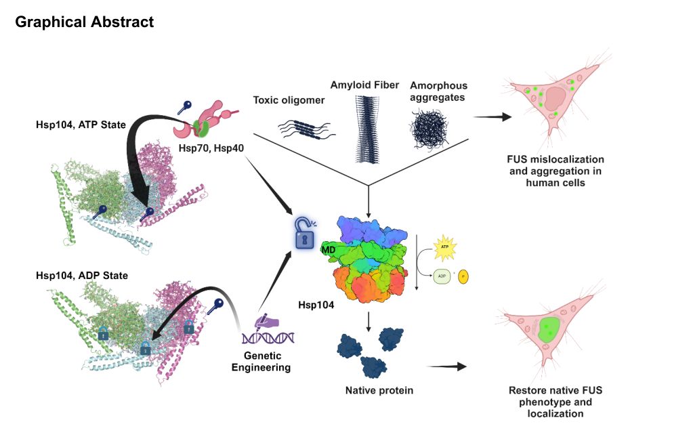

## Question

# Gene Research for Functional Annotation

## ⚠️ CRITICAL: Gene/Protein Identification Context

**BEFORE YOU BEGIN RESEARCH:** You MUST verify you are researching the CORRECT gene/protein. Gene symbols can be ambiguous, especially for less well-characterized genes from non-model organisms.

### Target Gene/Protein Identity (from UniProt):
- **UniProt Accession:** P31539
- **Protein Description:** RecName: Full=Heat shock protein 104; AltName: Full=Protein aggregation-remodeling factor HSP104;
- **Gene Information:** Name=HSP104; OrderedLocusNames=YLL026W; ORFNames=L0948;
- **Organism (full):** Saccharomyces cerevisiae (strain ATCC 204508 / S288c) (Baker's yeast).
- **Protein Family:** Belongs to the ClpA/ClpB family. .
- **Key Domains:** AAA+_ATPase. (IPR003593); ATPase_AAA_core. (IPR003959); Clp_ATPase_C. (IPR019489); Clp_N_dom_sf. (IPR036628); Clp_R_N. (IPR004176)

### MANDATORY VERIFICATION STEPS:

1. **Check if the gene symbol "HSP104" matches the protein description above**
2. **Verify the organism is correct:** Saccharomyces cerevisiae (strain ATCC 204508 / S288c) (Baker's yeast).
3. **Check if protein family/domains align with what you find in literature**
4. **If you find literature for a DIFFERENT gene with the same or similar symbol, STOP**

### If Gene Symbol is Ambiguous or You Cannot Find Relevant Literature:

**DO NOT PROCEED WITH RESEARCH ON A DIFFERENT GENE.** Instead:
- State clearly: "The gene symbol 'HSP104' is ambiguous or literature is limited for this specific protein"
- Explain what you found (e.g., "Found extensive literature on a different gene with the same symbol in a different organism")
- Describe the protein based ONLY on the UniProt information provided above
- Suggest that the protein function can be inferred from domain/family information

### Research Target:

Please provide a comprehensive research report on the gene **HSP104** (gene ID: HSP104, UniProt: P31539) in yeast.

The research report should be a detailed narrative explaining the function, biological processes, and localization of the gene product. Citations should be given for all claims.

You should prioritize authoritative reviews and primary scientific literature when conducting research. You can supplement
this with annotations you find in gene/protein databases, but these can be outdated or inaccurate.

We are specifically interested in the primary function of the gene - for enzymes, what reaction is catalyzed, and what is the substrate specificity? For transporters, what is the substrate? For structural proteins or adapters, what is the broader structural role? For signaling molecules, what is the role in the pathway.

We are interested in where in or outside the cell the gene product carries out its function.

We are also interested in the signaling or biochemical pathways in which the gene functions. We are less interested in broad pleiotropic effects, except where these elucidate the precise role.

Include evidence where possible. We are interested in both experimental evidence as well as inference from structure, evolution, or bioinformatic analysis. Precise studies should be prioritized over high-throughput, where available.

## Output

Question: You are an expert researcher providing comprehensive, well-cited information.

Provide detailed information focusing on:
1. Key concepts and definitions with current understanding
2. Recent developments and latest research (prioritize 2023-2024 sources)
3. Current applications and real-world implementations
4. Expert opinions and analysis from authoritative sources
5. Relevant statistics and data from recent studies

Format as a comprehensive research report with proper citations. Include URLs and publication dates where available.
Always prioritize recent, authoritative sources and provide specific citations for all major claims.

# Gene Research for Functional Annotation

## ⚠️ CRITICAL: Gene/Protein Identification Context

**BEFORE YOU BEGIN RESEARCH:** You MUST verify you are researching the CORRECT gene/protein. Gene symbols can be ambiguous, especially for less well-characterized genes from non-model organisms.

### Target Gene/Protein Identity (from UniProt):
- **UniProt Accession:** P31539
- **Protein Description:** RecName: Full=Heat shock protein 104; AltName: Full=Protein aggregation-remodeling factor HSP104;
- **Gene Information:** Name=HSP104; OrderedLocusNames=YLL026W; ORFNames=L0948;
- **Organism (full):** Saccharomyces cerevisiae (strain ATCC 204508 / S288c) (Baker's yeast).
- **Protein Family:** Belongs to the ClpA/ClpB family. .
- **Key Domains:** AAA+_ATPase. (IPR003593); ATPase_AAA_core. (IPR003959); Clp_ATPase_C. (IPR019489); Clp_N_dom_sf. (IPR036628); Clp_R_N. (IPR004176)

### MANDATORY VERIFICATION STEPS:

1. **Check if the gene symbol "HSP104" matches the protein description above**
2. **Verify the organism is correct:** Saccharomyces cerevisiae (strain ATCC 204508 / S288c) (Baker's yeast).
3. **Check if protein family/domains align with what you find in literature**
4. **If you find literature for a DIFFERENT gene with the same or similar symbol, STOP**

### If Gene Symbol is Ambiguous or You Cannot Find Relevant Literature:

**DO NOT PROCEED WITH RESEARCH ON A DIFFERENT GENE.** Instead:
- State clearly: "The gene symbol 'HSP104' is ambiguous or literature is limited for this specific protein"
- Explain what you found (e.g., "Found extensive literature on a different gene with the same symbol in a different organism")
- Describe the protein based ONLY on the UniProt information provided above
- Suggest that the protein function can be inferred from domain/family information

### Research Target:

Please provide a comprehensive research report on the gene **HSP104** (gene ID: HSP104, UniProt: P31539) in yeast.

The research report should be a detailed narrative explaining the function, biological processes, and localization of the gene product. Citations should be given for all claims.

You should prioritize authoritative reviews and primary scientific literature when conducting research. You can supplement
this with annotations you find in gene/protein databases, but these can be outdated or inaccurate.

We are specifically interested in the primary function of the gene - for enzymes, what reaction is catalyzed, and what is the substrate specificity? For transporters, what is the substrate? For structural proteins or adapters, what is the broader structural role? For signaling molecules, what is the role in the pathway.

We are interested in where in or outside the cell the gene product carries out its function.

We are also interested in the signaling or biochemical pathways in which the gene functions. We are less interested in broad pleiotropic effects, except where these elucidate the precise role.

Include evidence where possible. We are interested in both experimental evidence as well as inference from structure, evolution, or bioinformatic analysis. Precise studies should be prioritized over high-throughput, where available.

# Research Report: Functional Annotation of *Saccharomyces cerevisiae* HSP104 (UniProt P31539)

## 0) Target verification (mandatory disambiguation)
The literature synthesized below refers to the budding yeast *Saccharomyces cerevisiae* Hsp104, a cytosolic Hsp100/ClpB-family AAA+ ATPase (“heat shock protein 104”) that forms hexamers and functions as an ATP-dependent protein disaggregase, consistent with the UniProt entry P31539 description and domain architecture (two AAA+ nucleotide-binding domains separated by a regulatory middle domain). Foundational yeast genetics/biochemistry and prion studies specifically naming *S. cerevisiae* Hsp104 and its hallmark phenotypes (thermotolerance and [PSI+] prion maintenance/curing) match this identity. (lindquist1996heatshockprotein104 pages 1-2, glover1998hsp104hsp70and pages 2-4, lum2004evidenceforan pages 1-1, newnam1999antagonisticinteractionsbetween pages 1-2)

## 1) Key concepts & definitions (current understanding)
### 1.1 Hsp104 as a protein disaggregase (primary function)
Hsp104 is a member of the Hsp100/Clp family of oligomeric AAA+ ATPases that does not itself perform proteolysis but instead remodels aggregated proteins to enable their reactivation. A central conceptual distinction is that Hsp104 does not mainly *prevent* aggregation; rather, together with partner chaperones, it can *rescue previously aggregated proteins* and restore function. (glover1998hsp104hsp70and pages 1-2, glover1998hsp104hsp70and pages 2-4)

In vivo, Hsp104 is a major determinant of acquired thermotolerance: expression of Hsp104 is sufficient for thermotolerance, and Hsp104 promotes resolubilization and reactivation of proteins that have unfolded and aggregated after heat shock. (lindquist1996heatshockprotein104 pages 1-2)

### 1.2 Mechanism: AAA+ hexamer, central pore threading, and regulated activity
Mechanistically, yeast Hsp104 is a hexameric AAA+ ATPase with two nucleotide-binding domains (NBD1 and NBD2). A leading model—supported by mutagenesis of axial pore-loop elements—posits that Hsp104 extracts clients by ATP-driven unfolding and threading through an axial channel; integrity of the NBD2 pore-loop region (including the conserved GYVG-loop containing Tyr-662) is required for refolding/disaggregation function. (lum2004evidenceforan pages 1-1)

Modern structural/mechanistic descriptions extend this to a ratchet-like, pore-loop-mediated translocation mechanism in which ATP binding/hydrolysis coordinates conformational changes that drive client movement through the central channel. (buchholz2024themiddledomain pages 2-3, lin2024designprinciplesto pages 5-8)

### 1.3 The Hsp104–Hsp70–Hsp40 (and Hsp110) pathway
A core concept in yeast proteostasis is that Hsp104 operates in a multichaperone disaggregation pathway with Hsp70 and Hsp40. Biochemical reconstitution work demonstrated that Hsp104-mediated reactivation of aggregated luciferase in yeast lysates requires ATP and depends on SSA-encoded Hsp70 activity and the Hsp40 co-chaperone Ydj1. (glover1998hsp104hsp70and pages 2-4)

A further pathway refinement is that yeast Hsp110 nucleotide-exchange factors (Sse1/Sse2) coordinate Hsp70 cycling and are essential for efficient Hsp104-dependent disaggregation in both cytosol and nucleus, in part by maintaining a pool of Hsp70-ATP competent for recruitment to aggregates; Hsp104 can reach aggregates without Hsp110, but may stall in unproductive translocation attempts when the Hsp70–Hsp110 system is compromised. (kaimal2017coordinatedhsp110and pages 15-18)

## 2) Biological processes and cellular roles
### 2.1 Heat shock and thermotolerance
Yeast Hsp104 is a principal determinant of acquired thermotolerance and promotes resolubilization/reactivation of heat-damaged proteins after stress. (lindquist1996heatshockprotein104 pages 1-2)

### 2.2 Proteostasis under metabolic stress and recovery
Under glucose starvation, ATP depletion triggers sequestration of proteins into stress compartments (including stress granules and Q-bodies), and Hsp104’s ATPase activity is identified as a key ATP-consuming process that determines the abundance and size of these compartments; upon glucose/ATP restoration, these compartments dissolve within minutes in a PKA-dependent manner. (sathyanarayanan2020atphydrolysisby pages 1-2)

### 2.3 Amyloid prion biology: propagation vs curing
A defining yeast-specific role of Hsp104 is its centrality in amyloid prion fragmentation, which generates transmissible seeds (“propagons”) required for stable inheritance of prions such as [PSI+]. Multiple lines of evidence support a model in which Hsp40 recognizes aggregates, recruits Hsp70, and Hsp104 then participates in fibril fragmentation to maintain prion propagation. (barbitoff2022differentialinteractionsof pages 2-3)

Hsp104 levels must be tuned: both Hsp104 deletion and Hsp104 overexpression can cure [PSI+]. Importantly, Hsp70 (Ssa1) antagonizes Hsp104 overexpression-mediated curing, stabilizing prion maintenance under natural co-induction conditions. (newnam1999antagonisticinteractionsbetween pages 1-2)

## 3) Subcellular localization (where Hsp104 functions)
Hsp104 is predominantly cytosolic under non-stress conditions but relocalizes to stress-induced protein quality control foci. In metabolic stress experiments using endogenously tagged Hsp104-GFP, Hsp104 localizes to foci associated with stress granules, Q-bodies/CytoQ-like compartments, and nuclear quality-control deposits (e.g., INQ/IPOD-related compartments), consistent with a role in spatial protein quality control. (sathyanarayanan2020atphydrolysisby pages 1-2)

Hsp104 also localizes to heat-shock-induced aggregates; disaggregation in both cytosolic and nuclear compartments depends on the Hsp70–Hsp110 system, with altered kinetics of Hsp70 recruitment and impaired recovery when Hsp110 function is disrupted. (kaimal2017coordinatedhsp110and pages 15-18)

## 4) Recent developments and latest research (prioritizing 2023–2024)
### 4.1 Nucleotide-state control of Hsp104 via the middle domain (MD) and “Hsp70-collaboration rheostat”
A major 2024 advance is a mechanistic framework for how nucleotide-state-specific MD configurations regulate interprotomer communication and tune collaboration with Hsp70/Hsp40. Lin et al. (Cell Reports, Dec 2024; https://doi.org/10.1016/j.celrep.2024.115005) define ATP-specific interprotomer contacts between NBD1 and MD helix L1 that tune Hsp70 collaboration and ADP-specific intraprotomer contacts (MD helix L2 to NBD1) that restrict activity; perturbing these contacts can yield hypomorphs, Hsp70-independent potentiated variants, or species barriers to Hsp70 collaboration, enabling rational “design principles” for tailoring activity and limiting off-target toxicity. (lin2024designprinciplesto pages 5-8)

The paper provides quantitative activity context for specific variants (e.g., Hsp104R419E ~70% of WT ATPase activity in their assay framework). (lin2024designprinciplesto pages 5-8)

The associated figures/graphical abstract summarize domain architecture and nucleotide-dependent contact networks and the Hsp70-collaboration rheostat model. (lin2024designprinciplesto media 815d2b84, lin2024designprinciplesto media 0ff7e1a2, lin2024designprinciplesto media 3e5848c4)

### 4.2 Substrate-specific and therapeutic engineering of Hsp104
Mack et al. (Molecular Cell, Sep 2023; https://doi.org/10.1016/j.molcel.2023.07.029) report engineering of substrate-selective Hsp104 variants by modifying pore loops that engage client polypeptides. A key concept emerging from this work is that enhanced disaggregases can be tuned away from broad, off-target unfolding toward selective detoxification of particular proteotoxic clients (e.g., α-synuclein), enabling disaggregation-dependent or disaggregation-independent detoxification mechanisms. (mack2023tuninghsp104specificity pages 1-3)

### 4.3 The middle domain can influence “quality” of processed substrates in vivo
Buchholz et al. (PLOS Genetics, Oct 2024; https://doi.org/10.1371/journal.pgen.1011424) show that engineered MD variants can preserve prion fragmentation activity required for propagation yet fail to resolve stress granules, and that disassembly of Sup35 prion aggregates by certain MD variants can yield protein with reduced functional activity—supporting a model where the MD helps ensure that processed substrates remain functional after Hsp104 action. (buchholz2024themiddledomain pages 1-2)

This work also reports an experimental implementation detail useful for interpreting in vivo phenotypes: plasmid-based expression produced ~4-fold over endogenous Hsp104 steady-state levels in their system. (buchholz2024themiddledomain pages 2-3)

### 4.4 Synthetic cell biology: engineered Hsp104-based aggregate relocalization systems
Fischbach et al. (Nature Communications, May 2023; https://doi.org/10.1038/s41467-023-37706-3) demonstrate engineered Hsp104-based “aggregate targeting systems” (e.g., Hsp104–Pea2 chimera ATS1) that redirect protein aggregates to non-canonical locations (bud/daughter cell, eisosomes, endosomes) using actomyosin/polarisome machinery. This is a concrete real-world implementation of Hsp104 knowledge for spatial protein quality control engineering, with functional effects such as protecting mother cells from death by removing mutant huntingtin inclusions. (fischbach2023artificialhsp104mediatedsystems pages 1-2)

## 5) Pathways and interactions (authoritative synthesis)
### 5.1 Disaggregation pathway stages
A consensus pathway supported by foundational and modern work is:
1) Hsp40 (e.g., Ydj1/Sis1 class J proteins) and Hsp70 (SSA family) engage aggregate surfaces and initiate client handling. (glover1998hsp104hsp70and pages 2-4, barbitoff2022differentialinteractionsof pages 2-3)
2) Hsp104 is recruited and activated (in part via regulatory domains, notably the middle domain) to extract polypeptides by ATP-driven pore threading/translocation. (lum2004evidenceforan pages 1-1, buchholz2024themiddledomain pages 2-3)
3) Hsp110 (Sse1/Sse2) maintains Hsp70 cycling via nucleotide exchange, which is essential for efficient aggregate processing in both cytosol and nucleus, preventing futile Hsp104 engagement. (kaimal2017coordinatedhsp110and pages 15-18)

### 5.2 Prion fragmentation vs prion curing
Expert analysis in prion-focused studies emphasizes the duality of Hsp104 action: at physiological activity levels Hsp104-mediated fragmentation supports prion propagation, but altered levels (e.g., overexpression) can cure certain prions. The antagonism by Hsp70/Ssa1 provides a mechanistic explanation for why stress-induced co-induction does not necessarily cure [PSI+]. (newnam1999antagonisticinteractionsbetween pages 1-2)

## 6) Quantitative statistics and data highlights
### 6.1 Metabolic stress compartment statistics (Hsp104-GFP foci)
During glucose starvation in *S. cerevisiae*, the fraction of cells with Hsp104-marked aggregates and the size of those aggregates increase markedly:
- 0.2% glucose for 90 min: cells with one Hsp104-tagged aggregate increase from ~4% to ~40%; ~25% of cells show ≥2 foci; median aggregate diameter ~800 nm (vs <200 nm in 2% glucose). (sathyanarayanan2020atphydrolysisby pages 1-2)
- 0.02% glucose: ~40% of cells have one aggregate and ~50% have ≥2; median aggregate size ~1200 nm; ~12% exceed 1500 nm. (sathyanarayanan2020atphydrolysisby pages 1-2)
In parallel, cellular ATP decreases >2-fold in 30 min and ~5-fold by 90 min in 0.2% glucose, and ~10-fold within 1 h in 0.02% glucose; upon glucose reintroduction and ATP restoration, stress granules and Q-bodies dissolve within minutes (PKA-dependent). (sathyanarayanan2020atphydrolysisby pages 1-2)

### 6.2 Heat-stress recovery time scale for stress granules
In a heat-shock recovery context, stress granule foci (Pab1-GFP) begin resolving within ~2 hours in wild-type cells, whereas recovery is dramatically slower in hsp104Δ cells, consistent with an Hsp104-dependent clearance process. (buchholz2024themiddledomain pages 2-3)

### 6.3 Quantitative activity of engineered variants (example)
Lin et al. report an example engineered variant with ATPase activity ~70% of WT (Hsp104R419E) in their assay context, illustrating that tuned Hsp70-collaboration phenotypes can be achieved without gross ATPase hyperactivation. (lin2024designprinciplesto pages 5-8)

### 6.4 Quantitative proteomics context for the broader chaperone network
Absolute quantification of yeast chaperones (copies per cell) and estimated flux through chaperone pathways contextualize Hsp104’s placement in a high-throughput chaperone network; for example, ribosome-associated Hsp70 Ssb1 is estimated to handle ~14 molecules per minute in one throughput calculation framework, underscoring the large substrate flux managed by chaperone systems that feed into downstream quality-control steps. (brownridge2013quantitativeanalysisof pages 9-11)

## 7) Applications and real-world implementations
### 7.1 Proteostasis engineering / therapeutic design
Hsp104 is absent from metazoa, but multiple 2023–2024 studies treat Hsp104 as a platform for engineered disaggregases with potential therapeutic relevance. Strategies include tuning pore-loop/client contacts to generate substrate-selective variants (e.g., α-synuclein-selective detoxification) and rationally tuning MD:NBD contact networks to modulate Hsp70 collaboration and minimize off-target toxicity. (mack2023tuninghsp104specificity pages 1-3, lin2024designprinciplesto pages 5-8)

### 7.2 Synthetic control of aggregate spatial fate
Engineered Hsp104 chimeras can forcibly relocalize aggregates in yeast, enabling controlled tests of whether inclusions are cytotoxic or protective in specific contexts (e.g., mutant huntingtin). The approach is implementable in human cells as a research tool for spatial proteostasis. (fischbach2023artificialhsp104mediatedsystems pages 1-2)

## 8) Limitations and gaps (transparent accounting)
- The evidence retrieved here does not include an explicit statement of the systematic ORF identifier YLL026W or a direct mapping to UniProt accession P31539 from within the accessed paper excerpts; identity was instead verified functionally and organism-specifically through multiple *S. cerevisiae* Hsp104 primary sources matching hallmark phenotypes and mechanisms. (lindquist1996heatshockprotein104 pages 1-2, lum2004evidenceforan pages 1-1)
- Absolute copies-per-cell for Hsp104 itself were not extracted from the available pages of the quantitative proteomics study (the retrieved excerpted table lists other chaperones); thus, this report does not provide a cpc for Hsp104 and instead reports quantitative stress-foci and activity data from other primary studies. (brownridge2013quantitativeanalysisof pages 9-11)

## Evidence map (for rapid review)
| Topic | Key findings | Key quantitative/statistical values (if any) | Best supporting citations |
|---|---|---|---|
| Definition/function | Hsp104 in *Saccharomyces cerevisiae* is a hexameric AAA+ ATP-dependent disaggregase of the Hsp100/ClpB family that rescues proteins trapped in aggregated states and is central to acquired thermotolerance. Foundational work showed that Hsp104 expression is sufficient for thermotolerance and that Hsp104 promotes resolubilization/reactivation of heat-damaged proteins. | Thermotolerance sufficiency demonstrated by induced Hsp104 expression; no single numeric enzyme constant reported in the available excerpts. | (lindquist1996heatshockprotein104 pages 1-2, glover1998hsp104hsp70and pages 1-2) |
| Mechanism/domains | Each protomer contains NBD1 and NBD2 separated by a regulatory middle domain (MD), plus N- and C-terminal regions. Hsp104 uses pore-loop-mediated substrate gripping and ATP-driven threading/translocation through a central channel; structural work supports an unfolding/threading or ratchet-like mechanism, with nucleotide-state-specific MD:NBD contacts tuning activity. | Hsp104R419E ATPase activity is reported at ~70% of WT in one 2024 engineering study. | (lum2004evidenceforan pages 1-1, lin2024designprinciplesto pages 1-5, lin2024designprinciplesto pages 5-8, lin2024designprinciplesto media 815d2b84) |
| Partners/pathway | Hsp104 works in a multichaperone disaggregation pathway with Hsp70 and Hsp40; Hsp40 promotes Hsp70 engagement, and Hsp70/Hsp40 help recruit/activate Hsp104 on aggregates. Hsp110/Sse1-Sse2 further powers the pathway by regenerating Hsp70-ATP and is required for efficient Hsp104-dependent disaggregation in cytosol and nucleus. | In Hsp110-defective cells, Hsp70 recruitment to aggregates can be delayed to >120 min, and aggregate metrics remain largely unchanged over a 120-min recovery window. | (glover1998hsp104hsp70and pages 2-4, kaimal2017coordinatedhsp110and pages 15-18, buchholz2024themiddledomain pages 24-25) |
| Localization | Hsp104 is largely cytosolic under non-stress conditions but relocalizes to stress-induced foci associated with CytoQ/Q-bodies, stress granules, and nuclear quality-control deposits such as INQ/IPOD. It is recruited to aggregate foci in both cytosol and nucleus and can also be engineered to drive aggregate relocalization to buds or organelle-associated inclusions. | During metabolic stress, Hsp104-marked compartments dissolve within minutes after glucose/ATP restoration; Hsp104 recruitment after heat shock is seen immediately, including in cells with compromised Hsp110 function. | (sathyanarayanan2020atphydrolysisby pages 1-2, kaimal2017coordinatedhsp110and pages 15-18, fischbach2023artificialhsp104mediatedsystems pages 1-2) |
| Prion biology | Hsp104 is essential for propagation of amyloid yeast prions such as [PSI+] because it fragments fibrils into transmissible seeds/propagons. Hsp104 levels must be finely balanced: deletion or inhibition eliminates prions, while overexpression can cure [PSI+], and Hsp70/Ssa1 can antagonize this curing activity. | Both deletion and overexpression cure [PSI+]; no exact percentage reported in the available excerpts, but the effect is genetically robust. | (newnam1999antagonisticinteractionsbetween pages 1-2, barbitoff2022differentialinteractionsof pages 2-3) |
| Recent developments (2023–2024) | Recent work refined Hsp104 regulation by showing that ATP- versus ADP-state MD:NBD contact networks tune Hsp70 collaboration and toxicity, and that the MD helps ensure substrates remain functional after processing. Additional 2024 prion work linked exposed Hsp70-binding sites on Sup35 amyloid to efficiency of the Hsp70-Hsp104 disaggregation cascade. | Plasmid-driven expression in one 2024 study yielded ~4-fold over endogenous Hsp104 steady-state levels. | (lin2024designprinciplesto pages 5-8, buchholz2024themiddledomain pages 1-2, buchholz2024themiddledomain pages 2-3) |
| Applications | Hsp104 is being repurposed in proteostasis engineering: engineered variants can be made substrate-selective, including variants that selectively detoxify α-synuclein, and synthetic Hsp104-based systems can forcibly relocalize aggregates in yeast and even influence aggregate behavior in human cells. These applications make Hsp104 a leading model for therapeutic disaggregase design and synthetic cell biology. | α-synuclein-specific engineered variants reduced dopaminergic neurodegeneration in a *C. elegans* Parkinson model; qualitative protection from mother-cell death was shown when mutant huntingtin inclusions were removed from mothers. | (mack2023tuninghsp104specificity pages 1-3, fischbach2023artificialhsp104mediatedsystems pages 1-2, lin2024designprinciplesto pages 1-5) |
| Quantitative data | Available studies provide useful in vivo and mechanistic metrics for Hsp104-dependent proteostasis. Under glucose starvation, Hsp104-GFP foci become common and enlarge substantially as ATP falls, and stress-granule/Q-body dissolution is rapid upon ATP restoration. | 0.2% glucose for 90 min: cells with one Hsp104-tagged aggregate increase from ~4% to ~40%, with ~25% showing ≥2 foci; median aggregate size ~800 nm. 0.02% glucose: ~40% of cells have one aggregate and ~50% have ≥2; median size ~1200 nm, with ~12% >1500 nm. ATP falls >2-fold in 30 min and ~5-fold by 90 min in 0.2% glucose, or ~10-fold within 1 h in 0.02% glucose. Stress-granule foci begin resolving within ~2 h of recovery from heat shock in WT cells. | (sathyanarayanan2020atphydrolysisby pages 1-2, buchholz2024themiddledomain pages 2-3) |

*Table: This table summarizes the main evidence for the identity, mechanism, pathway context, localization, prion roles, recent advances, applications, and quantitative findings for yeast Hsp104. It is useful as a compact citation-backed map of the strongest claims to include in a full research report.*

References

1. (lindquist1996heatshockprotein104 pages 1-2): S. Lindquist and G. Kim. Heat-shock protein 104 expression is sufficient for thermotolerance in yeast. Proceedings of the National Academy of Sciences of the United States of America, 93 11:5301-6, May 1996. URL: https://doi.org/10.1073/pnas.93.11.5301, doi:10.1073/pnas.93.11.5301. This article has 335 citations and is from a highest quality peer-reviewed journal.

2. (glover1998hsp104hsp70and pages 2-4): John R Glover and Susan Lindquist. Hsp104, hsp70, and hsp40 a novel chaperone system that rescues previously aggregated proteins. Cell, 94:73-82, Jul 1998. URL: https://doi.org/10.1016/s0092-8674(00)81223-4, doi:10.1016/s0092-8674(00)81223-4. This article has 1838 citations and is from a highest quality peer-reviewed journal.

3. (lum2004evidenceforan pages 1-1): Ronnie Lum, Johnny M. Tkach, Elizabeth Vierling, and John R. Glover. Evidence for an unfolding/threading mechanism for protein disaggregation by saccharomyces cerevisiae hsp104*. Journal of Biological Chemistry, 279:29139-29146, Jul 2004. URL: https://doi.org/10.1074/jbc.m403777200, doi:10.1074/jbc.m403777200. This article has 282 citations and is from a domain leading peer-reviewed journal.

4. (newnam1999antagonisticinteractionsbetween pages 1-2): Gary P. Newnam, Renee D. Wegrzyn, Susan L. Lindquist, and Yury O. Chernoff. Antagonistic interactions between yeast chaperones hsp104 and hsp70 in prion curing. Molecular and Cellular Biology, 19:1325-1333, Feb 1999. URL: https://doi.org/10.1128/mcb.19.2.1325, doi:10.1128/mcb.19.2.1325. This article has 322 citations and is from a domain leading peer-reviewed journal.

5. (glover1998hsp104hsp70and pages 1-2): John R Glover and Susan Lindquist. Hsp104, hsp70, and hsp40 a novel chaperone system that rescues previously aggregated proteins. Cell, 94:73-82, Jul 1998. URL: https://doi.org/10.1016/s0092-8674(00)81223-4, doi:10.1016/s0092-8674(00)81223-4. This article has 1838 citations and is from a highest quality peer-reviewed journal.

6. (buchholz2024themiddledomain pages 2-3): Hannah E. Buchholz, Jane E. Dorweiler, Sam Guereca, Brett T. Wisniewski, James Shorter, and Anita L. Manogaran. The middle domain of hsp104 can ensure substrates are functional after processing. Oct 2024. URL: https://doi.org/10.1371/journal.pgen.1011424, doi:10.1371/journal.pgen.1011424. This article has 5 citations and is from a domain leading peer-reviewed journal.

7. (lin2024designprinciplesto pages 5-8): JiaBei Lin, Peter J. Carman, Craig W. Gambogi, Nathan M. Kendsersky, Edward Chuang, Stephanie N. Gates, Adam L. Yokom, Alexandrea N. Rizo, Daniel R. Southworth, and James Shorter. Design principles to tailor hsp104 therapeutics. Cell Reports, 43:115005, Dec 2024. URL: https://doi.org/10.1016/j.celrep.2024.115005, doi:10.1016/j.celrep.2024.115005. This article has 4 citations and is from a highest quality peer-reviewed journal.

8. (kaimal2017coordinatedhsp110and pages 15-18): Jayasankar Mohanakrishnan Kaimal, Ganapathi Kandasamy, Fabian Gasser, and Claes Andréasson. Coordinated hsp110 and hsp104 activities power protein disaggregation in <i>saccharomyces cerevisiae</i>. Molecular and Cellular Biology, Jun 2017. URL: https://doi.org/10.1128/mcb.00027-17, doi:10.1128/mcb.00027-17. This article has 94 citations and is from a domain leading peer-reviewed journal.

9. (sathyanarayanan2020atphydrolysisby pages 1-2): Udhayabhaskar Sathyanarayanan, Marina Musa, Peter Bou Dib, Nuno Raimundo, Ira Milosevic, and Anita Krisko. Atp hydrolysis by yeast hsp104 determines protein aggregate dissolution and size in vivo. Nature Communications, Oct 2020. URL: https://doi.org/10.1038/s41467-020-19104-1, doi:10.1038/s41467-020-19104-1. This article has 49 citations and is from a highest quality peer-reviewed journal.

10. (barbitoff2022differentialinteractionsof pages 2-3): Yury A. Barbitoff, Andrew G. Matveenko, and Galina A. Zhouravleva. Differential interactions of molecular chaperones and yeast prions. Journal of Fungi, 8:122, Jan 2022. URL: https://doi.org/10.3390/jof8020122, doi:10.3390/jof8020122. This article has 16 citations.

11. (lin2024designprinciplesto media 815d2b84): JiaBei Lin, Peter J. Carman, Craig W. Gambogi, Nathan M. Kendsersky, Edward Chuang, Stephanie N. Gates, Adam L. Yokom, Alexandrea N. Rizo, Daniel R. Southworth, and James Shorter. Design principles to tailor hsp104 therapeutics. Cell Reports, 43:115005, Dec 2024. URL: https://doi.org/10.1016/j.celrep.2024.115005, doi:10.1016/j.celrep.2024.115005. This article has 4 citations and is from a highest quality peer-reviewed journal.

12. (lin2024designprinciplesto media 0ff7e1a2): JiaBei Lin, Peter J. Carman, Craig W. Gambogi, Nathan M. Kendsersky, Edward Chuang, Stephanie N. Gates, Adam L. Yokom, Alexandrea N. Rizo, Daniel R. Southworth, and James Shorter. Design principles to tailor hsp104 therapeutics. Cell Reports, 43:115005, Dec 2024. URL: https://doi.org/10.1016/j.celrep.2024.115005, doi:10.1016/j.celrep.2024.115005. This article has 4 citations and is from a highest quality peer-reviewed journal.

13. (lin2024designprinciplesto media 3e5848c4): JiaBei Lin, Peter J. Carman, Craig W. Gambogi, Nathan M. Kendsersky, Edward Chuang, Stephanie N. Gates, Adam L. Yokom, Alexandrea N. Rizo, Daniel R. Southworth, and James Shorter. Design principles to tailor hsp104 therapeutics. Cell Reports, 43:115005, Dec 2024. URL: https://doi.org/10.1016/j.celrep.2024.115005, doi:10.1016/j.celrep.2024.115005. This article has 4 citations and is from a highest quality peer-reviewed journal.

14. (mack2023tuninghsp104specificity pages 1-3): Korrie L. Mack, Hanna Kim, Edward M. Barbieri, JiaBei Lin, Sylvanne Braganza, Meredith E. Jackrel, Jamie E. DeNizio, Xiaohui Yan, Edward Chuang, Amber Tariq, Ryan R. Cupo, Laura M. Castellano, Kim A. Caldwell, Guy A. Caldwell, and James Shorter. Tuning hsp104 specificity to selectively detoxify α-synuclein. Molecular Cell, 83:3314-3332.e9, Sep 2023. URL: https://doi.org/10.1016/j.molcel.2023.07.029, doi:10.1016/j.molcel.2023.07.029. This article has 29 citations and is from a highest quality peer-reviewed journal.

15. (buchholz2024themiddledomain pages 1-2): Hannah E. Buchholz, Jane E. Dorweiler, Sam Guereca, Brett T. Wisniewski, James Shorter, and Anita L. Manogaran. The middle domain of hsp104 can ensure substrates are functional after processing. Oct 2024. URL: https://doi.org/10.1371/journal.pgen.1011424, doi:10.1371/journal.pgen.1011424. This article has 5 citations and is from a domain leading peer-reviewed journal.

16. (fischbach2023artificialhsp104mediatedsystems pages 1-2): Arthur Fischbach, Angela Johns, Kara L. Schneider, Xinxin Hao, Peter Tessarz, and Thomas Nyström. Artificial hsp104-mediated systems for re-localizing protein aggregates. Nature Communications, May 2023. URL: https://doi.org/10.1038/s41467-023-37706-3, doi:10.1038/s41467-023-37706-3. This article has 8 citations and is from a highest quality peer-reviewed journal.

17. (brownridge2013quantitativeanalysisof pages 9-11): Philip Brownridge, Craig Lawless, Aishwarya B. Payapilly, Karin Lanthaler, Stephen W. Holman, Victoria M. Harman, Christopher M. Grant, Robert J. Beynon, and Simon J. Hubbard. Quantitative analysis of chaperone network throughput in budding yeast. Proteomics, 13:1276-1291, Mar 2013. URL: https://doi.org/10.1002/pmic.201200412, doi:10.1002/pmic.201200412. This article has 43 citations and is from a peer-reviewed journal.

18. (lin2024designprinciplesto pages 1-5): JiaBei Lin, Peter J. Carman, Craig W. Gambogi, Nathan M. Kendsersky, Edward Chuang, Stephanie N. Gates, Adam L. Yokom, Alexandrea N. Rizo, Daniel R. Southworth, and James Shorter. Design principles to tailor hsp104 therapeutics. Cell Reports, 43:115005, Dec 2024. URL: https://doi.org/10.1016/j.celrep.2024.115005, doi:10.1016/j.celrep.2024.115005. This article has 4 citations and is from a highest quality peer-reviewed journal.

19. (buchholz2024themiddledomain pages 24-25): Hannah E. Buchholz, Jane E. Dorweiler, Sam Guereca, Brett T. Wisniewski, James Shorter, and Anita L. Manogaran. The middle domain of hsp104 can ensure substrates are functional after processing. Oct 2024. URL: https://doi.org/10.1371/journal.pgen.1011424, doi:10.1371/journal.pgen.1011424. This article has 5 citations and is from a domain leading peer-reviewed journal.

## Artifacts

- [Edison artifact artifact-00](HSP104-deep-research-falcon_artifacts/artifact-00.md)

## Citations

1. lum2004evidenceforan pages 1-1
2. sathyanarayanan2020atphydrolysisby pages 1-2
3. barbitoff2022differentialinteractionsof pages 2-3
4. newnam1999antagonisticinteractionsbetween pages 1-2
5. lin2024designprinciplesto pages 5-8
6. buchholz2024themiddledomain pages 1-2
7. buchholz2024themiddledomain pages 2-3
8. brownridge2013quantitativeanalysisof pages 9-11
9. lin2024designprinciplesto pages 1-5
10. buchholz2024themiddledomain pages 24-25
11. PSI+
12. https://doi.org/10.1016/j.celrep.2024.115005
13. https://doi.org/10.1016/j.molcel.2023.07.029
14. https://doi.org/10.1371/journal.pgen.1011424
15. https://doi.org/10.1038/s41467-023-37706-3
16. https://doi.org/10.1073/pnas.93.11.5301,
17. https://doi.org/10.1016/s0092-8674(00
18. https://doi.org/10.1074/jbc.m403777200,
19. https://doi.org/10.1128/mcb.19.2.1325,
20. https://doi.org/10.1371/journal.pgen.1011424,
21. https://doi.org/10.1016/j.celrep.2024.115005,
22. https://doi.org/10.1128/mcb.00027-17,
23. https://doi.org/10.1038/s41467-020-19104-1,
24. https://doi.org/10.3390/jof8020122,
25. https://doi.org/10.1016/j.molcel.2023.07.029,
26. https://doi.org/10.1038/s41467-023-37706-3,
27. https://doi.org/10.1002/pmic.201200412,