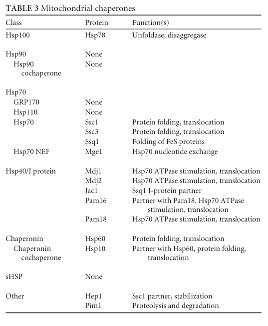

## Question

# Gene Research for Functional Annotation

## ⚠️ CRITICAL: Gene/Protein Identification Context

**BEFORE YOU BEGIN RESEARCH:** You MUST verify you are researching the CORRECT gene/protein. Gene symbols can be ambiguous, especially for less well-characterized genes from non-model organisms.

### Target Gene/Protein Identity (from UniProt):
- **UniProt Accession:** P19882
- **Protein Description:** RecName: Full=Heat shock protein 60, mitochondrial; AltName: Full=CPN60; AltName: Full=P66; AltName: Full=Stimulator factor I 66 kDa component; Flags: Precursor;
- **Gene Information:** Name=HSP60; Synonyms=MIF4; OrderedLocusNames=YLR259C; ORFNames=L8479.10;
- **Organism (full):** Saccharomyces cerevisiae (strain ATCC 204508 / S288c) (Baker's yeast).
- **Protein Family:** Belongs to the chaperonin (HSP60) family. .
- **Key Domains:** Chaperonin_Cpn60_CS. (IPR018370); Cpn60/GroEL. (IPR001844); Cpn60/GroEL/TCP-1. (IPR002423); GroEL-like_apical_dom_sf. (IPR027409); GROEL-like_equatorial_sf. (IPR027413)

### MANDATORY VERIFICATION STEPS:

1. **Check if the gene symbol "HSP60" matches the protein description above**
2. **Verify the organism is correct:** Saccharomyces cerevisiae (strain ATCC 204508 / S288c) (Baker's yeast).
3. **Check if protein family/domains align with what you find in literature**
4. **If you find literature for a DIFFERENT gene with the same or similar symbol, STOP**

### If Gene Symbol is Ambiguous or You Cannot Find Relevant Literature:

**DO NOT PROCEED WITH RESEARCH ON A DIFFERENT GENE.** Instead:
- State clearly: "The gene symbol 'HSP60' is ambiguous or literature is limited for this specific protein"
- Explain what you found (e.g., "Found extensive literature on a different gene with the same symbol in a different organism")
- Describe the protein based ONLY on the UniProt information provided above
- Suggest that the protein function can be inferred from domain/family information

### Research Target:

Please provide a comprehensive research report on the gene **HSP60** (gene ID: HSP60, UniProt: P19882) in yeast.

The research report should be a detailed narrative explaining the function, biological processes, and localization of the gene product. Citations should be given for all claims.

You should prioritize authoritative reviews and primary scientific literature when conducting research. You can supplement
this with annotations you find in gene/protein databases, but these can be outdated or inaccurate.

We are specifically interested in the primary function of the gene - for enzymes, what reaction is catalyzed, and what is the substrate specificity? For transporters, what is the substrate? For structural proteins or adapters, what is the broader structural role? For signaling molecules, what is the role in the pathway.

We are interested in where in or outside the cell the gene product carries out its function.

We are also interested in the signaling or biochemical pathways in which the gene functions. We are less interested in broad pleiotropic effects, except where these elucidate the precise role.

Include evidence where possible. We are interested in both experimental evidence as well as inference from structure, evolution, or bioinformatic analysis. Precise studies should be prioritized over high-throughput, where available.

## Output

Question: You are an expert researcher providing comprehensive, well-cited information.

Provide detailed information focusing on:
1. Key concepts and definitions with current understanding
2. Recent developments and latest research (prioritize 2023-2024 sources)
3. Current applications and real-world implementations
4. Expert opinions and analysis from authoritative sources
5. Relevant statistics and data from recent studies

Format as a comprehensive research report with proper citations. Include URLs and publication dates where available.
Always prioritize recent, authoritative sources and provide specific citations for all major claims.

# Gene Research for Functional Annotation

## ⚠️ CRITICAL: Gene/Protein Identification Context

**BEFORE YOU BEGIN RESEARCH:** You MUST verify you are researching the CORRECT gene/protein. Gene symbols can be ambiguous, especially for less well-characterized genes from non-model organisms.

### Target Gene/Protein Identity (from UniProt):
- **UniProt Accession:** P19882
- **Protein Description:** RecName: Full=Heat shock protein 60, mitochondrial; AltName: Full=CPN60; AltName: Full=P66; AltName: Full=Stimulator factor I 66 kDa component; Flags: Precursor;
- **Gene Information:** Name=HSP60; Synonyms=MIF4; OrderedLocusNames=YLR259C; ORFNames=L8479.10;
- **Organism (full):** Saccharomyces cerevisiae (strain ATCC 204508 / S288c) (Baker's yeast).
- **Protein Family:** Belongs to the chaperonin (HSP60) family. .
- **Key Domains:** Chaperonin_Cpn60_CS. (IPR018370); Cpn60/GroEL. (IPR001844); Cpn60/GroEL/TCP-1. (IPR002423); GroEL-like_apical_dom_sf. (IPR027409); GROEL-like_equatorial_sf. (IPR027413)

### MANDATORY VERIFICATION STEPS:

1. **Check if the gene symbol "HSP60" matches the protein description above**
2. **Verify the organism is correct:** Saccharomyces cerevisiae (strain ATCC 204508 / S288c) (Baker's yeast).
3. **Check if protein family/domains align with what you find in literature**
4. **If you find literature for a DIFFERENT gene with the same or similar symbol, STOP**

### If Gene Symbol is Ambiguous or You Cannot Find Relevant Literature:

**DO NOT PROCEED WITH RESEARCH ON A DIFFERENT GENE.** Instead:
- State clearly: "The gene symbol 'HSP60' is ambiguous or literature is limited for this specific protein"
- Explain what you found (e.g., "Found extensive literature on a different gene with the same symbol in a different organism")
- Describe the protein based ONLY on the UniProt information provided above
- Suggest that the protein function can be inferred from domain/family information

### Research Target:

Please provide a comprehensive research report on the gene **HSP60** (gene ID: HSP60, UniProt: P19882) in yeast.

The research report should be a detailed narrative explaining the function, biological processes, and localization of the gene product. Citations should be given for all claims.

You should prioritize authoritative reviews and primary scientific literature when conducting research. You can supplement
this with annotations you find in gene/protein databases, but these can be outdated or inaccurate.

We are specifically interested in the primary function of the gene - for enzymes, what reaction is catalyzed, and what is the substrate specificity? For transporters, what is the substrate? For structural proteins or adapters, what is the broader structural role? For signaling molecules, what is the role in the pathway.

We are interested in where in or outside the cell the gene product carries out its function.

We are also interested in the signaling or biochemical pathways in which the gene functions. We are less interested in broad pleiotropic effects, except where these elucidate the precise role.

Include evidence where possible. We are interested in both experimental evidence as well as inference from structure, evolution, or bioinformatic analysis. Precise studies should be prioritized over high-throughput, where available.

## Research Report: *Saccharomyces cerevisiae* HSP60 (UniProt P19882; ORF YLR259C)

### 0) Target verification (mandatory)
The research target is the budding yeast mitochondrial chaperonin Hsp60 encoded by **HSP60** with systematic locus **YLR259C**, which is a **nuclear-encoded mitochondrial precursor** protein imported into the mitochondrial matrix and processed by the mitochondrial processing peptidase (MPP). A high-authority chaperonin review explicitly describes yeast Hsp60 as a **572-aa ORF**, with a classical **mitochondrial targeting presequence cleaved after residue 21**, and identifies it as a **GroEL/Cpn60-family** chaperonin required for folding of imported mitochondrial proteins. (horwich2020chaperoninassistedproteinfolding pages 21-21)

### 1) Key concepts and definitions (current understanding)

#### 1.1 What Hsp60 is
Hsp60 (also called **Cpn60**) is a **Type I / Group I chaperonin** (GroEL-like) that forms an oligomeric folding cage to assist protein folding. In yeast, Hsp60 is the **mitochondrial matrix chaperonin**. (verghese2012biologyofthe pages 29-30)

#### 1.2 Core mechanism: ATP-driven folding in an encapsulated cavity
Authoritative reviews describe the canonical Group I chaperonin cycle as follows: (i) non-native polypeptides are captured in the chaperonin cavity, (ii) ATP binding drives conformational changes, and (iii) the co-chaperonin **Hsp10 (GroES-like)** caps the cavity (“lid”), enabling an encapsulated folding environment; ATP hydrolysis and nucleotide exchange govern release/reset. (singh2024molecularchaperoninhsp60 pages 2-4, singh2024molecularchaperoninhsp60 pages 1-2)

In yeast specifically, Hsp60 forms a **14-subunit double-ring (two heptameric rings)**, creating a cavity that can accommodate client proteins up to ~**50 kDa**, and imported precursor proteins transiently associate with Hsp60 as incompletely folded intermediates before ATP-dependent folding/release. (verghese2012biologyofthe pages 29-30)

#### 1.3 Cellular role in mitochondrial protein biogenesis and proteostasis
Because most mitochondrial proteins are nuclear encoded and imported post-translationally, mitochondria require dedicated chaperone systems. Yeast Hsp60 is positioned as a central component of this mitochondrial proteostasis network, partnering with Hsp10 and other mitochondrial chaperones in folding and translocation-linked quality control. (verghese2012biologyofthe pages 26-27, verghese2012biologyofthe pages 29-30)

### 2) Functional annotation for yeast HSP60 (what it *does*)

#### 2.1 Primary molecular function
**Molecular function:** ATP-dependent **protein folding chaperonin** for mitochondrial matrix proteins, particularly those imported into mitochondria as unfolded precursors. (verghese2012biologyofthe pages 29-30, cabiscol2002mitochondrialhsp60resistance pages 1-1)

**Reaction/substrate specificity (non-enzymatic):** Hsp60 does not catalyze a chemical transformation of a small molecule substrate; rather, it catalyzes **conformational maturation of polypeptides** by providing a protected folding environment and coordinating binding/release with ATP hydrolysis and Hsp10 capping. (verghese2012biologyofthe pages 29-30, singh2024molecularchaperoninhsp60 pages 2-4)

#### 2.2 Subcellular localization and targeting
Yeast Hsp60 is produced as a **mitochondrial precursor** with an N-terminal matrix-targeting presequence, cleaved by MPP after residue 21, consistent with mitochondrial import and processing to a mature matrix protein. (horwich2020chaperoninassistedproteinfolding pages 21-21)

In broader eukaryotic contexts, HSP60 is predominantly mitochondrial and can also be detected in extra-mitochondrial compartments; one 2024 review summarizes a distribution of ~**80–85% mitochondrial** and ~**15–20% cytoplasmic** for HSP60 (not yeast-specific). (singh2024molecularchaperoninhsp60 pages 2-4)

### 3) Biological processes, pathways, and key client proteins

#### 3.1 Mitochondrial protein import and folding pathway
Yeast mitochondrial precursor proteins associate with Hsp60 as folding intermediates after import; ATP-dependent folding/release has been demonstrated in classical imported substrate experiments (e.g., Su9-DHFR) cited in major yeast chaperone reviews. (verghese2012biologyofthe pages 29-30)

#### 3.2 Essentiality and representative clients
HSP60 is **essential for viability**: deletion/null mutants are inviable due to severe mitochondrial folding defects. (verghese2012biologyofthe pages 29-30, horwich2020chaperoninassistedproteinfolding pages 21-21)

Representative mitochondrial proteins discussed as Hsp60-dependent/affected in yeast reviews include **F1-ATPase subunits**, **cytochrome b2**, and the **Rieske Fe–S protein**; conditional mutants can accumulate **insoluble matrix aggregates**. (verghese2012biologyofthe pages 29-30)

### 4) Phenotypes and experimental evidence (selected high-confidence examples)

#### 4.1 Temperature-sensitive mif4 allele and complex behavior
A temperature-sensitive **mif4** allele (Gly298→Asp) has been reported to cause the existing ~**840 kDa** Hsp60 complex to become insoluble within ~2 hours after temperature shift, pelleting at 15,000×g; this phenotype is described in a chaperonin chronologue review synthesizing genetic/biochemical evidence. (horwich2020chaperoninassistedproteinfolding pages 21-21)

#### 4.2 Oxidative stress defense via protection of Fe/S proteins (quantitative)
A primary yeast study engineered strains spanning **~4× Hsp60 overexpression** down to **~20% of wild-type** (via doxycycline-controlled expression), and found that progressive reduction of Hsp60 reduced viability under oxidative stress while increasing peroxides and protein carbonylation. The same work reports Hsp60 is induced **2–3× at 42°C** and that protection of Fe/S enzymes from oxidative inactivation is **dose-dependent** on Hsp60 levels; reduced Hsp60 increased the labile iron pool (calcein assay), and iron chelation (deferoxamine) partially rescued survival and oxidation phenotypes. (cabiscol2002mitochondrialhsp60resistance pages 1-1)

### 5) Recent developments (prioritizing 2023–2024)

#### 5.1 2023: New rules for mitochondrial targeting sequences (Hsp60 used as a prototypical precursor)
A 2023 PLOS Genetics study used Hsp60p as a prototypical mitochondrial precursor in targeted MTS mutagenesis and proteome-wide N-terminome analysis. It reports that mitochondrial targeting sequences show favorable determinants including hydrophobic residues at **position 2** (notably **Leu/Phe/Ile/Trp/Met**) and enrichment of **Arg at position 3**, and proposes that these features balance hydrophobic membrane interaction and positively charged translocation forces for efficient import. This provides a modern, mechanistic framework for annotating Hsp60’s N-terminus as a functional mitochondrial targeting determinant rather than a generic “presequence.” (nashed2023functionalmappingof pages 33-37)

#### 5.2 2023: Environmental/toxicology application—HSP60 as a stress-response readout
A 2023 applied study measured HSP60 in yeast cultures exposed to mycotoxins and found dose- and toxin-dependent responses: a **~2-fold increase** in HSP60 at low aflatoxin B2+G1 exposure (12 µg/L), while zearalenone exposure decreased HSP60 (reported as **~12% decrease overall** in one excerpt and significant suppression at high dose). The authors emphasize that HSP responses are not systematic and depend on toxin and dose, making HSP60 a context-dependent biomarker of mitochondrial/cellular stress rather than a universally induced marker. (kłosowski2023thereactionof pages 3-6, kłosowski2023thereactionof pages 6-8)

#### 5.3 2024: Updated synthesis of HSP60 mechanism and regulation (contextual, not yeast-specific)
A 2024 review summarizes contemporary understanding of HSP60/HSP10 chaperonin architecture (double ring, lid) and ATP dependence, and notes mechanistic differences reported for mitochondrial HSP60 relative to bacterial GroEL (e.g., nucleotide-state effects on HSP10 binding and single- vs double-ring equilibria). While much of this is framed in mammalian/mitochondrial terms, it provides current expert consensus on mechanistic interpretation relevant to yeast Hsp60 as a Group I mitochondrial chaperonin. (singh2024molecularchaperoninhsp60 pages 4-5, singh2024molecularchaperoninhsp60 pages 2-4)

### 6) Current applications and real-world implementations

**Research applications in yeast (directly supported by retrieved sources):**
1. **Mitochondrial import engineering / N-terminus design:** Hsp60 is used as a model precursor to experimentally test how specific N-terminal residues modulate mitochondrial targeting efficiency and organelle proteome definition. (nashed2023functionalmappingof pages 33-37)
2. **Mechanistic mitochondrial oxidative-stress studies:** Doxycycline-tunable Hsp60 strains are used to quantify how chaperonin capacity influences oxidative damage, Fe/S enzyme integrity, and iron-mediated toxicity. (cabiscol2002mitochondrialhsp60resistance pages 1-1)
3. **Industrial/environmental stress monitoring:** HSP60 protein levels can be monitored (immunoblot densitometry) as part of stress-response profiling under chemical contamination (mycotoxins) in aerobic culture. (kłosowski2023thereactionof pages 12-14, kłosowski2023thereactionof pages 3-6)

### 7) Expert opinions and synthesis (authoritative interpretation)
Authoritative yeast chaperone reviews position Hsp60 as a central mitochondrial matrix folding machine whose loss causes catastrophic proteostasis failure and inviability, with a client range that includes key respiratory and ATP-synthesis components. (verghese2012biologyofthe pages 29-30)

The broader chaperonin field emphasizes that encapsulation-based folding (as opposed to simple “holdase” functions) is an ATP-driven cycle that can actively remodel folding landscapes; this conceptual framework is critical for interpreting yeast Hsp60 phenotypes as failures in mitochondrial biogenesis rather than generalized heat-shock effects. (singh2024molecularchaperoninhsp60 pages 2-4, horwich2020chaperoninassistedproteinfolding pages 2-3)

### 8) Relevant statistics and quantitative data (from included studies)

*Yeast Hsp60-specific quantitative findings:*
- **2–3× induction** of mitochondrial matrix Hsp60 at **42°C** (heat stress). (cabiscol2002mitochondrialhsp60resistance pages 1-1)
- Engineered expression range: **~4× overexpression** to **~15–20% of wild-type**, enabling graded phenotyping under oxidative stress. (cabiscol2002mitochondrialhsp60resistance pages 1-1, cabiscol2002mitochondrialhsp60resistance pages 3-4)
- Mycotoxin study: **~2-fold HSP60 increase** at low aflatoxin B2+G1; **~12% HSP60 decrease** with zearalenone exposure (plus significant suppression at high dose). (kłosowski2023thereactionof pages 3-6, kłosowski2023thereactionof pages 6-8)

*Network-level quantitative context (not Hsp60-specific but relevant to chaperone biology):*
- A quantitative proteomics study estimated chaperones target <40% of proteins but mediate folding of ~**62% of total protein flux** in the cell, highlighting the global scale of chaperone throughput (Hsp60 included among annotated chaperones, though Hsp60-specific copy number was not extracted in the provided pages). (brownridge2013quantitativeanalysisof pages 1-2, brownridge2013quantitativeanalysisof pages 11-12)

### 9) Visual evidence (tables/figures)
A yeast chaperone review provides a curated **Table of mitochondrial chaperones** (including Hsp60/Hsp10) and a schematic overview of the **mitochondrial chaperome**, placing Hsp60/Hsp10 into the broader protein import/folding network. (verghese2012biologyofthe media ee8d0869, verghese2012biologyofthe media 1b10d921)

### Evidence map (summary table)
| Evidence focus | Key findings (1-2 sentences) | Study type | Organism/strain | Publication (authors journal year) | Publication date (month/year) | URL | Notes |
|---|---|---|---|---|---|---|---|
| Identity/localization | Yeast HSP60 corresponds to the mitochondrial matrix chaperonin of the GroEL/Cpn60 family; the ORF is YLR259C and the protein is synthesized as a precursor with an N-terminal targeting presequence cleaved by MPP after residue 21. The mature protein is homologous to GroEL and forms the canonical oligomeric chaperonin assembly in mitochondria. (horwich2020chaperoninassistedproteinfolding pages 21-21) | Review synthesizing primary literature | *Saccharomyces cerevisiae* | Horwich & Fenton, *Quarterly Reviews of Biophysics* 2020 | Feb 2020 | https://doi.org/10.1017/S0033583519000143 | 572 aa precursor; targeting peptide enriched in Arg/Ser/Thr; essential gene; maps to YLR259C. |
| Mechanism | Hsp60 is a type I chaperonin that works with Hsp10 as a lid/co-chaperonin in an ATP-dependent folding cycle. In yeast mitochondria it forms a 14-subunit double-ring cavity that transiently binds incompletely folded imported proteins and releases folded products after ATP-driven conformational changes. (verghese2012biologyofthe pages 29-30, singh2024molecularchaperoninhsp60 pages 2-4, singh2024molecularchaperoninhsp60 pages 1-2) | Review | *S. cerevisiae*; broader conserved eukaryotic/chaperonin comparisons | Verghese et al., *Microbiology and Molecular Biology Reviews* 2012; Singh et al., *International Journal of Molecular Sciences* 2024 | Jun 2012; May 2024 | https://doi.org/10.1128/MMBR.05018-11; https://doi.org/10.3390/ijms25105483 | Double heptamer (~14 subunits); substrate capacity ~50 kDa in yeast review; Hsp10/GroES-like lid. |
| Essentiality/clients | HSP60 is essential for viability in yeast; null mutants are inviable because mitochondrial folding fails. Client examples and affected proteins include imported/matrix proteins such as F1-ATPase subunits, cytochrome b2, and the Rieske FeS protein; conditional mutants accumulate insoluble matrix aggregates. (verghese2012biologyofthe pages 29-30, horwich2020chaperoninassistedproteinfolding pages 20-21) | Review summarizing primary genetics/biochemistry | *S. cerevisiae* | Verghese et al., *Microbiology and Molecular Biology Reviews* 2012; Horwich & Fenton, *Quarterly Reviews of Biophysics* 2020 | Jun 2012; Feb 2020 | https://doi.org/10.1128/MMBR.05018-11; https://doi.org/10.1017/S0033583519000143 | mif4 temperature-sensitive allele (Gly298→Asp) destabilizes the ~840 kDa complex and causes insolubility after heat shift. |
| Stress/quant data | Hsp60 protein levels rise 2- to 3-fold at 42 °C, and engineered strains spanning ~4× overexpression down to ~20% of wild-type showed that lower Hsp60 reduces oxidative-stress survival and increases peroxides, protein carbonylation, and labile iron. Iron chelation partially rescues low-Hsp60 cells, linking Hsp60 to protection of Fe/S proteins during oxidative stress. (cabiscol2002mitochondrialhsp60resistance pages 1-1, cabiscol2002mitochondrialhsp60resistance pages 3-4) | Primary study | *S. cerevisiae* (conditional tet-regulated strains) | Cabiscol et al., *Journal of Biological Chemistry* 2002 | Nov 2002 | https://doi.org/10.1074/jbc.M206525200 | Quantitative values reported in evidence: 4× overexpression; depletion to ~15–20% WT; 2–3× induction at 42 °C; DFO rescue supports iron-dependent damage mechanism. |
| Recent 2023-2024 developments | A 2023 functional mapping study used Hsp60 as a prototypical mitochondrial precursor and found that specific N-terminal residues in its targeting sequence help define efficient mitochondrial import, with position-2 hydrophobic residues and position-3 Arg highlighted as favorable determinants. A 2024 review further emphasized HSP60/HSP10 complex assembly and ATP-dependent structural transitions as central to mitochondrial proteostasis. (nashed2023functionalmappingof pages 33-37, singh2024molecularchaperoninhsp60 pages 4-5) | Primary (2023) and review (2024) | *S. cerevisiae*; broader eukaryotic context | Nashed et al., *PLOS Genetics* 2023; Singh et al., *International Journal of Molecular Sciences* 2024 | Aug 2023; May 2024 | https://doi.org/10.1101/2022.08.19.504527; https://doi.org/10.3390/ijms25105483 | 2023 study identifies Leu/Phe/Ile/Trp/Met enrichment at MTS position 2 and Arg enrichment at position 3; supports import-rule annotation for Hsp60-like precursors. |
| Recent 2023-2024 developments | In a 2023 applied stress study, yeast HSP60 expression responded to mycotoxins in a dose-dependent, nonuniform way: lower AFB2+AFG1 increased HSP60 by about 2-fold, whereas zearalenone exposure decreased HSP60 (about 12% overall in the cited excerpt; high-dose ZEA significantly suppressed HSP60). These findings reinforce HSP60 as a mitochondrial stress-response readout rather than a universally induced marker. (kłosowski2023thereactionof pages 3-6, kłosowski2023thereactionof pages 12-14, kłosowski2023thereactionof pages 6-8, kłosowski2023thereactionof pages 8-9, kłosowski2023thereactionof pages 2-3) | Primary study | *S. cerevisiae* Ethanol Red strain | Kłosowski et al., *International Journal of Molecular Sciences* 2023 | Nov 2023 | https://doi.org/10.3390/ijms242216401 | Conditions in evidence: 72 h aerobic culture; AFB2+AFG1 12 or 36 µg/L, OTA 2.8 or 8.4 µg/L, ZEA 300 or 900 µg/L; significance assessed by ANOVA/Tukey at p < 0.05. |
| Applications | Hsp60 is useful as a readout and mechanistic node in mitochondrial proteostasis studies, including assays of precursor import determinants, oxidative-stress defense, and environmental toxicology responses in yeast. More broadly, expert reviews position HSP60/HSP10 as a conserved chaperonin system whose dysfunction or altered assembly informs mitochondrial quality-control models and translational disease research. (nashed2023functionalmappingof pages 33-37, cabiscol2002mitochondrialhsp60resistance pages 1-1, singh2024molecularchaperoninhsp60 pages 1-2) | Primary and review | *S. cerevisiae*; conserved eukaryotic context | Nashed et al., *PLOS Genetics* 2023; Cabiscol et al., *Journal of Biological Chemistry* 2002; Singh et al., *International Journal of Molecular Sciences* 2024 | Aug 2023; Nov 2002; May 2024 | https://doi.org/10.1101/2022.08.19.504527; https://doi.org/10.1074/jbc.M206525200; https://doi.org/10.3390/ijms25105483 | Real-world implementations in the retrieved evidence are research applications, not therapeutics in yeast: import-sequence engineering, oxidative-stress mechanistic tests, and biomarker-like monitoring of toxin responses. |

*Table: This table summarizes key evidence supporting functional annotation of Saccharomyces cerevisiae HSP60/YLR259C (UniProt P19882), including identity, mechanism, essentiality, stress phenotypes, and recent 2023-2024 developments. It is useful as a compact source map linking major claims to specific studies and quantitative observations.*

### 10) Key source list with URLs and publication dates (most relevant)
- Horwich AL, Fenton WA. *Chaperonin-assisted protein folding: a chronologue*. **Feb 2020**. https://doi.org/10.1017/S0033583519000143 (horwich2020chaperoninassistedproteinfolding pages 21-21)
- Verghese J, Abrams J, Wang Y, Morano KA. *Biology of the Heat Shock Response and Protein Chaperones: Budding Yeast as a Model System*. **Jun 2012**. https://doi.org/10.1128/MMBR.05018-11 (verghese2012biologyofthe pages 29-30)
- Cabiscol E, Bellí G, Tamarit J, et al. *Mitochondrial Hsp60, Resistance to Oxidative Stress, and the Labile Iron Pool Are Closely Connected in S. cerevisiae*. **Nov 2002**. https://doi.org/10.1074/jbc.M206525200 (cabiscol2002mitochondrialhsp60resistance pages 1-1)
- Nashed S, El Barbry H, Benchouaia M, et al. *Functional mapping of N-terminal residues… mitochondrial protein import*. **Aug 2023**. https://doi.org/10.1101/2022.08.19.504527 (nashed2023functionalmappingof pages 33-37)
- Kłosowski G, Koim-Puchowska B, Dróżdż-Afelt J, Mikulski D. *Reaction of yeast to mycotoxins…* **Nov 2023**. https://doi.org/10.3390/ijms242216401 (kłosowski2023thereactionof pages 3-6)
- Singh MK, Shin Y, Han S, et al. *Molecular Chaperonin HSP60: Current Understanding and Future Prospects*. **May 2024**. https://doi.org/10.3390/ijms25105483 (singh2024molecularchaperoninhsp60 pages 2-4)

References

1. (horwich2020chaperoninassistedproteinfolding pages 21-21): Arthur L. Horwich and Wayne A. Fenton. Chaperonin-assisted protein folding: a chronologue. Quarterly Reviews of Biophysics, Feb 2020. URL: https://doi.org/10.1017/s0033583519000143, doi:10.1017/s0033583519000143. This article has 76 citations and is from a peer-reviewed journal.

2. (verghese2012biologyofthe pages 29-30): Jacob Verghese, Jennifer Abrams, Yanyu Wang, and Kevin A. Morano. Biology of the heat shock response and protein chaperones: budding yeast (saccharomyces cerevisiae) as a model system. Microbiology and Molecular Biology Reviews, 76:115-158, Jun 2012. URL: https://doi.org/10.1128/mmbr.05018-11, doi:10.1128/mmbr.05018-11. This article has 770 citations and is from a domain leading peer-reviewed journal.

3. (singh2024molecularchaperoninhsp60 pages 2-4): Manish Kumar Singh, Yoonhwa Shin, Sunhee Han, Joohun Ha, Pramod K. Tiwari, Sung Soo Kim, and Insug Kang. Molecular chaperonin hsp60: current understanding and future prospects. May 2024. URL: https://doi.org/10.3390/ijms25105483, doi:10.3390/ijms25105483. This article has 92 citations.

4. (singh2024molecularchaperoninhsp60 pages 1-2): Manish Kumar Singh, Yoonhwa Shin, Sunhee Han, Joohun Ha, Pramod K. Tiwari, Sung Soo Kim, and Insug Kang. Molecular chaperonin hsp60: current understanding and future prospects. May 2024. URL: https://doi.org/10.3390/ijms25105483, doi:10.3390/ijms25105483. This article has 92 citations.

5. (verghese2012biologyofthe pages 26-27): Jacob Verghese, Jennifer Abrams, Yanyu Wang, and Kevin A. Morano. Biology of the heat shock response and protein chaperones: budding yeast (saccharomyces cerevisiae) as a model system. Microbiology and Molecular Biology Reviews, 76:115-158, Jun 2012. URL: https://doi.org/10.1128/mmbr.05018-11, doi:10.1128/mmbr.05018-11. This article has 770 citations and is from a domain leading peer-reviewed journal.

6. (cabiscol2002mitochondrialhsp60resistance pages 1-1): Elisa Cabiscol, Gemma Bellı́, Jordi Tamarit, Pedro Echave, Enrique Herrero, and Joaquim Ros. Mitochondrial hsp60, resistance to oxidative stress, and the labile iron pool are closely connected in saccharomyces cerevisiae *. The Journal of Biological Chemistry, 277:44531-44538, Nov 2002. URL: https://doi.org/10.1074/jbc.m206525200, doi:10.1074/jbc.m206525200. This article has 168 citations.

7. (nashed2023functionalmappingof pages 33-37): Salomé Nashed, Houssam El Barbry, Médine Benchouaia, Angélie Dijoux-Maréchal, T. Delaveau, Nadia Ruiz-Gutierrez, Lucie Gaulier, D. Tribouillard-Tanvier, Guillaume Chevreux, S. Le Crom, Benoît Palancade, F. Devaux, É. Laine, and Mathilde Garcia. Functional mapping of n-terminal residues in the yeast proteome uncovers novel determinants for mitochondrial protein import. PLOS Genetics, Aug 2023. URL: https://doi.org/10.1101/2022.08.19.504527, doi:10.1101/2022.08.19.504527. This article has 5 citations and is from a domain leading peer-reviewed journal.

8. (kłosowski2023thereactionof pages 3-6): Grzegorz Kłosowski, Beata Koim-Puchowska, Joanna Dróżdż-Afelt, and Dawid Mikulski. The reaction of the yeast saccharomyces cerevisiae to contamination of the medium with aflatoxins b2 and g1, ochratoxin a and zearalenone in aerobic cultures. International Journal of Molecular Sciences, 24:16401, Nov 2023. URL: https://doi.org/10.3390/ijms242216401, doi:10.3390/ijms242216401. This article has 9 citations.

9. (kłosowski2023thereactionof pages 6-8): Grzegorz Kłosowski, Beata Koim-Puchowska, Joanna Dróżdż-Afelt, and Dawid Mikulski. The reaction of the yeast saccharomyces cerevisiae to contamination of the medium with aflatoxins b2 and g1, ochratoxin a and zearalenone in aerobic cultures. International Journal of Molecular Sciences, 24:16401, Nov 2023. URL: https://doi.org/10.3390/ijms242216401, doi:10.3390/ijms242216401. This article has 9 citations.

10. (singh2024molecularchaperoninhsp60 pages 4-5): Manish Kumar Singh, Yoonhwa Shin, Sunhee Han, Joohun Ha, Pramod K. Tiwari, Sung Soo Kim, and Insug Kang. Molecular chaperonin hsp60: current understanding and future prospects. May 2024. URL: https://doi.org/10.3390/ijms25105483, doi:10.3390/ijms25105483. This article has 92 citations.

11. (kłosowski2023thereactionof pages 12-14): Grzegorz Kłosowski, Beata Koim-Puchowska, Joanna Dróżdż-Afelt, and Dawid Mikulski. The reaction of the yeast saccharomyces cerevisiae to contamination of the medium with aflatoxins b2 and g1, ochratoxin a and zearalenone in aerobic cultures. International Journal of Molecular Sciences, 24:16401, Nov 2023. URL: https://doi.org/10.3390/ijms242216401, doi:10.3390/ijms242216401. This article has 9 citations.

12. (horwich2020chaperoninassistedproteinfolding pages 2-3): Arthur L. Horwich and Wayne A. Fenton. Chaperonin-assisted protein folding: a chronologue. Quarterly Reviews of Biophysics, Feb 2020. URL: https://doi.org/10.1017/s0033583519000143, doi:10.1017/s0033583519000143. This article has 76 citations and is from a peer-reviewed journal.

13. (cabiscol2002mitochondrialhsp60resistance pages 3-4): Elisa Cabiscol, Gemma Bellı́, Jordi Tamarit, Pedro Echave, Enrique Herrero, and Joaquim Ros. Mitochondrial hsp60, resistance to oxidative stress, and the labile iron pool are closely connected in saccharomyces cerevisiae *. The Journal of Biological Chemistry, 277:44531-44538, Nov 2002. URL: https://doi.org/10.1074/jbc.m206525200, doi:10.1074/jbc.m206525200. This article has 168 citations.

14. (brownridge2013quantitativeanalysisof pages 1-2): Philip Brownridge, Craig Lawless, Aishwarya B. Payapilly, Karin Lanthaler, Stephen W. Holman, Victoria M. Harman, Christopher M. Grant, Robert J. Beynon, and Simon J. Hubbard. Quantitative analysis of chaperone network throughput in budding yeast. Proteomics, 13:1276-1291, Mar 2013. URL: https://doi.org/10.1002/pmic.201200412, doi:10.1002/pmic.201200412. This article has 43 citations and is from a peer-reviewed journal.

15. (brownridge2013quantitativeanalysisof pages 11-12): Philip Brownridge, Craig Lawless, Aishwarya B. Payapilly, Karin Lanthaler, Stephen W. Holman, Victoria M. Harman, Christopher M. Grant, Robert J. Beynon, and Simon J. Hubbard. Quantitative analysis of chaperone network throughput in budding yeast. Proteomics, 13:1276-1291, Mar 2013. URL: https://doi.org/10.1002/pmic.201200412, doi:10.1002/pmic.201200412. This article has 43 citations and is from a peer-reviewed journal.

16. (verghese2012biologyofthe media ee8d0869): Jacob Verghese, Jennifer Abrams, Yanyu Wang, and Kevin A. Morano. Biology of the heat shock response and protein chaperones: budding yeast (saccharomyces cerevisiae) as a model system. Microbiology and Molecular Biology Reviews, 76:115-158, Jun 2012. URL: https://doi.org/10.1128/mmbr.05018-11, doi:10.1128/mmbr.05018-11. This article has 770 citations and is from a domain leading peer-reviewed journal.

17. (verghese2012biologyofthe media 1b10d921): Jacob Verghese, Jennifer Abrams, Yanyu Wang, and Kevin A. Morano. Biology of the heat shock response and protein chaperones: budding yeast (saccharomyces cerevisiae) as a model system. Microbiology and Molecular Biology Reviews, 76:115-158, Jun 2012. URL: https://doi.org/10.1128/mmbr.05018-11, doi:10.1128/mmbr.05018-11. This article has 770 citations and is from a domain leading peer-reviewed journal.

18. (horwich2020chaperoninassistedproteinfolding pages 20-21): Arthur L. Horwich and Wayne A. Fenton. Chaperonin-assisted protein folding: a chronologue. Quarterly Reviews of Biophysics, Feb 2020. URL: https://doi.org/10.1017/s0033583519000143, doi:10.1017/s0033583519000143. This article has 76 citations and is from a peer-reviewed journal.

19. (kłosowski2023thereactionof pages 8-9): Grzegorz Kłosowski, Beata Koim-Puchowska, Joanna Dróżdż-Afelt, and Dawid Mikulski. The reaction of the yeast saccharomyces cerevisiae to contamination of the medium with aflatoxins b2 and g1, ochratoxin a and zearalenone in aerobic cultures. International Journal of Molecular Sciences, 24:16401, Nov 2023. URL: https://doi.org/10.3390/ijms242216401, doi:10.3390/ijms242216401. This article has 9 citations.

20. (kłosowski2023thereactionof pages 2-3): Grzegorz Kłosowski, Beata Koim-Puchowska, Joanna Dróżdż-Afelt, and Dawid Mikulski. The reaction of the yeast saccharomyces cerevisiae to contamination of the medium with aflatoxins b2 and g1, ochratoxin a and zearalenone in aerobic cultures. International Journal of Molecular Sciences, 24:16401, Nov 2023. URL: https://doi.org/10.3390/ijms242216401, doi:10.3390/ijms242216401. This article has 9 citations.

## Artifacts

- [Edison artifact artifact-00](HSP60-deep-research-falcon_artifacts/artifact-00.md)

## Citations

1. horwich2020chaperoninassistedproteinfolding pages 21-21
2. verghese2012biologyofthe pages 29-30
3. nashed2023functionalmappingof pages 33-37
4. verghese2012biologyofthe pages 26-27
5. horwich2020chaperoninassistedproteinfolding pages 2-3
6. brownridge2013quantitativeanalysisof pages 1-2
7. brownridge2013quantitativeanalysisof pages 11-12
8. horwich2020chaperoninassistedproteinfolding pages 20-21
9. https://doi.org/10.1017/S0033583519000143
10. https://doi.org/10.1128/MMBR.05018-11;
11. https://doi.org/10.3390/ijms25105483
12. https://doi.org/10.1074/jbc.M206525200
13. https://doi.org/10.1101/2022.08.19.504527;
14. https://doi.org/10.3390/ijms242216401
15. https://doi.org/10.1074/jbc.M206525200;
16. https://doi.org/10.1128/MMBR.05018-11
17. https://doi.org/10.1101/2022.08.19.504527
18. https://doi.org/10.1017/s0033583519000143,
19. https://doi.org/10.1128/mmbr.05018-11,
20. https://doi.org/10.3390/ijms25105483,
21. https://doi.org/10.1074/jbc.m206525200,
22. https://doi.org/10.1101/2022.08.19.504527,
23. https://doi.org/10.3390/ijms242216401,
24. https://doi.org/10.1002/pmic.201200412,