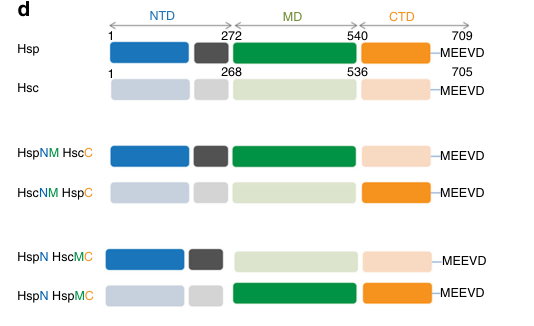

## Question

# Gene Research for Functional Annotation

## ⚠️ CRITICAL: Gene/Protein Identification Context

**BEFORE YOU BEGIN RESEARCH:** You MUST verify you are researching the CORRECT gene/protein. Gene symbols can be ambiguous, especially for less well-characterized genes from non-model organisms.

### Target Gene/Protein Identity (from UniProt):
- **UniProt Accession:** P02829
- **Protein Description:** RecName: Full=ATP-dependent molecular chaperone HSP82; AltName: Full=82 kDa heat shock protein; AltName: Full=Heat shock protein Hsp90 heat-inducible isoform;
- **Gene Information:** Name=HSP82; Synonyms=HSP90; OrderedLocusNames=YPL240C;
- **Organism (full):** Saccharomyces cerevisiae (strain ATCC 204508 / S288c) (Baker's yeast).
- **Protein Family:** Belongs to the heat shock protein 90 family. .
- **Key Domains:** HATPase_C_sf. (IPR036890); HATPase_dom. (IPR003594); Heat_shock_protein_90_CS. (IPR019805); HSP90_C. (IPR037196); Hsp90_fam. (IPR001404)

### MANDATORY VERIFICATION STEPS:

1. **Check if the gene symbol "HSP82" matches the protein description above**
2. **Verify the organism is correct:** Saccharomyces cerevisiae (strain ATCC 204508 / S288c) (Baker's yeast).
3. **Check if protein family/domains align with what you find in literature**
4. **If you find literature for a DIFFERENT gene with the same or similar symbol, STOP**

### If Gene Symbol is Ambiguous or You Cannot Find Relevant Literature:

**DO NOT PROCEED WITH RESEARCH ON A DIFFERENT GENE.** Instead:
- State clearly: "The gene symbol 'HSP82' is ambiguous or literature is limited for this specific protein"
- Explain what you found (e.g., "Found extensive literature on a different gene with the same symbol in a different organism")
- Describe the protein based ONLY on the UniProt information provided above
- Suggest that the protein function can be inferred from domain/family information

### Research Target:

Please provide a comprehensive research report on the gene **HSP82** (gene ID: HSP82, UniProt: P02829) in yeast.

The research report should be a detailed narrative explaining the function, biological processes, and localization of the gene product. Citations should be given for all claims.

You should prioritize authoritative reviews and primary scientific literature when conducting research. You can supplement
this with annotations you find in gene/protein databases, but these can be outdated or inaccurate.

We are specifically interested in the primary function of the gene - for enzymes, what reaction is catalyzed, and what is the substrate specificity? For transporters, what is the substrate? For structural proteins or adapters, what is the broader structural role? For signaling molecules, what is the role in the pathway.

We are interested in where in or outside the cell the gene product carries out its function.

We are also interested in the signaling or biochemical pathways in which the gene functions. We are less interested in broad pleiotropic effects, except where these elucidate the precise role.

Include evidence where possible. We are interested in both experimental evidence as well as inference from structure, evolution, or bioinformatic analysis. Precise studies should be prioritized over high-throughput, where available.

## Output

Question: You are an expert researcher providing comprehensive, well-cited information.

Provide detailed information focusing on:
1. Key concepts and definitions with current understanding
2. Recent developments and latest research (prioritize 2023-2024 sources)
3. Current applications and real-world implementations
4. Expert opinions and analysis from authoritative sources
5. Relevant statistics and data from recent studies

Format as a comprehensive research report with proper citations. Include URLs and publication dates where available.
Always prioritize recent, authoritative sources and provide specific citations for all major claims.

# Gene Research for Functional Annotation

## ⚠️ CRITICAL: Gene/Protein Identification Context

**BEFORE YOU BEGIN RESEARCH:** You MUST verify you are researching the CORRECT gene/protein. Gene symbols can be ambiguous, especially for less well-characterized genes from non-model organisms.

### Target Gene/Protein Identity (from UniProt):
- **UniProt Accession:** P02829
- **Protein Description:** RecName: Full=ATP-dependent molecular chaperone HSP82; AltName: Full=82 kDa heat shock protein; AltName: Full=Heat shock protein Hsp90 heat-inducible isoform;
- **Gene Information:** Name=HSP82; Synonyms=HSP90; OrderedLocusNames=YPL240C;
- **Organism (full):** Saccharomyces cerevisiae (strain ATCC 204508 / S288c) (Baker's yeast).
- **Protein Family:** Belongs to the heat shock protein 90 family. .
- **Key Domains:** HATPase_C_sf. (IPR036890); HATPase_dom. (IPR003594); Heat_shock_protein_90_CS. (IPR019805); HSP90_C. (IPR037196); Hsp90_fam. (IPR001404)

### MANDATORY VERIFICATION STEPS:

1. **Check if the gene symbol "HSP82" matches the protein description above**
2. **Verify the organism is correct:** Saccharomyces cerevisiae (strain ATCC 204508 / S288c) (Baker's yeast).
3. **Check if protein family/domains align with what you find in literature**
4. **If you find literature for a DIFFERENT gene with the same or similar symbol, STOP**

### If Gene Symbol is Ambiguous or You Cannot Find Relevant Literature:

**DO NOT PROCEED WITH RESEARCH ON A DIFFERENT GENE.** Instead:
- State clearly: "The gene symbol 'HSP82' is ambiguous or literature is limited for this specific protein"
- Explain what you found (e.g., "Found extensive literature on a different gene with the same symbol in a different organism")
- Describe the protein based ONLY on the UniProt information provided above
- Suggest that the protein function can be inferred from domain/family information

### Research Target:

Please provide a comprehensive research report on the gene **HSP82** (gene ID: HSP82, UniProt: P02829) in yeast.

The research report should be a detailed narrative explaining the function, biological processes, and localization of the gene product. Citations should be given for all claims.

You should prioritize authoritative reviews and primary scientific literature when conducting research. You can supplement
this with annotations you find in gene/protein databases, but these can be outdated or inaccurate.

We are specifically interested in the primary function of the gene - for enzymes, what reaction is catalyzed, and what is the substrate specificity? For transporters, what is the substrate? For structural proteins or adapters, what is the broader structural role? For signaling molecules, what is the role in the pathway.

We are interested in where in or outside the cell the gene product carries out its function.

We are also interested in the signaling or biochemical pathways in which the gene functions. We are less interested in broad pleiotropic effects, except where these elucidate the precise role.

Include evidence where possible. We are interested in both experimental evidence as well as inference from structure, evolution, or bioinformatic analysis. Precise studies should be prioritized over high-throughput, where available.

# Research Report: Functional Annotation of *S. cerevisiae* **HSP82** (UniProt P02829)

## 0) Target identity verification (mandatory)

**Verified target:** UniProt **P02829** corresponds to the *Saccharomyces cerevisiae* cytosolic Hsp90 heat-inducible isoform **Hsp82** (gene **HSP82**). A 2024 yeast-focused review explicitly maps Hsp82 to UniProt **P02829** and distinguishes the paralog Hsc82 as a separate cytosolic Hsp90 isoform. (rios2024insightsintohsp90 pages 1-2)

**Paralog distinction:** Yeast has two closely related cytosolic Hsp90 isoforms, the constitutive **Hsc82** and stress-inducible **Hsp82**, sharing ~97% amino-acid identity but exhibiting measurable functional differences. (girstmair2019thehsp90isoforms pages 1-2, rios2024insightsintohsp90 pages 1-2)

**Family/domain alignment:** Hsp82 is a canonical Hsp90-family chaperone with **N-terminal ATP-binding domain**, **middle (client interaction) domain**, and **C-terminal dimerization domain** including the conserved co-chaperone-binding motif at the C-terminus. (backe2023saccharomycescerevisiaeas pages 17-22, rios2024insightsintohsp90 pages 2-3, girstmair2019thehsp90isoforms media 835ffb5d)

*Conclusion:* The literature examined is consistent with the UniProt-provided identity: **ATP-dependent molecular chaperone Hsp82 (HSP82; yeast Hsp90 heat-inducible isoform)** in *S. cerevisiae*.

## 1) Key concepts and definitions (current understanding)

### 1.1 What Hsp82 does (primary function)
Hsp82 (Hsp90) is an **ATP-dependent molecular chaperone** that assists the **late-stage folding, activation, and stability** of a large set of specific “client” proteins (substrates), including many signaling regulators (notably protein kinases and transcription factors). (mercier2023hsp90mutantswith pages 1-2, nathan1999identificationofssf1 pages 1-2)

Hsp90/Hsp82 is best understood as a **proteostasis hub** rather than a general chaperone for all misfolded proteins: it supports selective refolding/activation (e.g., luciferase) while leaving other proteins relatively unaffected in comparable assays. (rios2024insightsintohsp90 pages 3-5)

### 1.2 ATPase-coupled conformational cycle (mechanistic definition)
Yeast Hsp90 (Hsp82/Hsc82) is a **dimeric** chaperone cycling between:
- an **open** state (C-terminally dimerized) and
- an **ATP-induced closed** state with additional N-terminal contacts.

Client loading, conformational closing, ATP hydrolysis/nucleotide exchange, and reopening are **regulated by co-chaperones** that bind distinct surfaces and bias the timing of transitions. (rios2024insightsintohsp90 pages 2-3, mercier2023hsp90mutantswith pages 1-2)

A central current concept is that **dwell time in specific conformations** can be more functionally determinative than absolute ATPase rate, emphasizing kinetic regulation of the cycle in vivo. (backe2023saccharomycescerevisiaeas pages 3-4, mercier2023hsp90mutantswith pages 1-2)

### 1.3 Co-chaperones (key definitions)
Yeast has ~14 Hsp90 co-chaperones (diverse domain architectures) that **target clients**, **modulate ATPase activity**, and **stabilize or destabilize** conformational states:
- **Sti1/Hop** cooperates with Hsp70 to **target clients to open Hsp90** and must be released for progression. (rios2024insightsintohsp90 pages 2-3)
- **Sba1/p23** stabilizes closed states and can influence product release steps. (rios2024insightsintohsp90 pages 2-3)
- **Aha1** stimulates ATP hydrolysis via the middle domain. (rios2024insightsintohsp90 pages 2-3)
- **Cdc37** preferentially targets **protein kinases**. (rios2024insightsintohsp90 pages 2-3)

Recent yeast genetics has refined distinct roles of **Hch1** (destabilizes Hsp90–nucleotide interaction and inhibits early-cycle progression) and **Cpr6** (stabilizes the closed conformation and counterbalances Hch1), providing a more granular step-wise view of cochaperone regulation. (mercier2023hsp90mutantswith pages 1-2, rios2024insightsintohsp90 pages 3-5)

### 1.4 “Chaperone code” (PTM-based regulation)
A modern framing is that Hsp90 activity is tuned by a combined “**chaperone code**” of **co-chaperone binding and post-translational modifications (PTMs)**, which can alter cochaperone affinity, ATPase activity, and client fate. (rios2024insightsintohsp90 pages 3-5, backe2023saccharomycescerevisiaeas pages 17-22)

## 2) Recent developments (prioritizing 2023–2024)

### 2.1 2024: Yeast-centered synthesis of mechanism and in vivo function
A 2024 review focused on *S. cerevisiae* consolidates key mechanistic insights: closed-state adoption is rate-limiting, cochaperones partition folding steps, and isoform differences (Hsp82 vs Hsc82) largely map to the N-terminal domain, shaping ATPase activity and inhibitor sensitivity. (rios2024insightsintohsp90 pages 2-3, rios2024insightsintohsp90 pages 1-2)

The same review provides a quantitative summary of induction: **Hsp82 is very low at 25–30°C and induced at 37°C to levels similar to Hsc82**, consistent with a stress-specialized role. (rios2024insightsintohsp90 pages 1-2)

### 2.2 2023: Mutant dissection reveals cochaperones as “conformational pacemakers”
In 2023, Mercier et al. used yeast Hsp90 mutants defective in distinct cycle steps (“loading/closing/reopening”) to show that cochaperone genetic interactions align with **closed-state formation** and that **drug sensitivity correlates with the conformational step affected** (e.g., loading-defective mutants most sensitive to an Hsp90 inhibitor). (mercier2023hsp90mutantswith pages 1-2)

### 2.3 2024: Quantitative proteomics maps cycle-dependent client pools
A 2024 DIA-MS study profiled soluble proteomes of yeast expressing wild-type Hsp90 or cycle mutants, providing quantitative evidence for **client pool partitioning by conformational states** and offering a platform for “selective inhibition” concepts.

The study measured **2,482 proteins (~38% of the yeast proteome)** and detected **350 proteins (14%)** with significant abundance changes (log2 FC ≥ 1.5); **~73%** of the strongest-changed proteins had prior connections to Hsp90 function. (rios2024quantitativeproteomicanalysis pages 1-2)

## 3) Functional annotation narrative (processes, pathways, localization)

### 3.1 Biological processes and pathway roles
**Essential proteostasis for selective signaling proteins:** Classic yeast genetics and biochemistry established that the HSP82/HSC82 family is **essential** (double disruption lethal), and that Hsp90 supports key signaling regulators. (kimura1994temperaturesensitivemutantsof pages 1-2, chang1994conservationofhsp90 pages 1-2)

**MAPK/pheromone signaling:** Hsp90 is required for basal and pheromone-induced MAPK signaling, with **Ste11 (yeast Raf-equivalent MAPKKK)** identified as a key endogenous Hsp90 client/substrate required for accumulation and pathway function. (louvion1998hsp90isrequired pages 1-2)

**Steroid receptor maturation (heterologous client assays):** Multiple classic studies used glucocorticoid receptor (GR) and other steroid receptors expressed in yeast as sensitive Hsp90 readouts, demonstrating that Hsp90 keeps receptors in an activatable state and supports hormone-dependent activation. (louvion1998hsp90isrequired pages 1-2, kimura1994temperaturesensitivemutantsof pages 1-2)

### 3.2 Cellular localization and where Hsp82 acts
**Primary localization:** Cytosolic Hsp90 (Hsp82/Hsc82) is broadly distributed during vegetative growth. (tapia2010hsp90nuclearaccumulation pages 1-2)

**Condition-dependent nuclear accumulation:** A key cell-biological finding is that Hsp90 (and the cochaperone Sba1/p23) **accumulates in the nucleus in quiescent cells (glucose exhaustion)** and in sporulating diploids; nuclear accumulation defects correlate with **sporulation/spore-wall defects**, and pharmacological inhibition (macbecin) similarly disrupts nuclear accumulation and spore development. (tapia2010hsp90nuclearaccumulation pages 1-2, tapia2010hsp90nuclearaccumulation pages 7-8)

## 4) Hsp82 vs Hsc82: specialization of two near-identical cytosolic isoforms

Multiple lines of evidence support that Hsp82 is tuned for stress conditions:
- Under nonstress conditions Hsc82 is ~**10×** more abundant; after heat shock Hsp82 is strongly induced so that levels become comparable. (girstmair2019thehsp90isoforms pages 1-2)
- Hsp82 is **more thermally stable** than Hsc82 (Tm ~60.4°C vs 57.1°C). (girstmair2019thehsp90isoforms pages 1-2, girstmair2019thehsp90isoforms media 00261b28)
- Hsc82 exhibits **higher ATPase activity** than Hsp82 at both 30°C and 37°C in comparative assays, and kinetic differences map largely to N-terminal-domain substitutions near the nucleotide pocket. (girstmair2019thehsp90isoforms pages 2-4, girstmair2019thehsp90isoforms pages 10-11, girstmair2019thehsp90isoforms media 7c8ac98c)

These findings support annotating Hsp82 as the **heat-inducible, stress-resilient cytosolic Hsp90 isoform** that preserves the core Hsp90 mechanism while shifting stability/dynamics. (girstmair2019thehsp90isoforms pages 1-2, rios2024insightsintohsp90 pages 1-2)

## 5) Applications and real-world implementations

### 5.1 Chemical-genetic screens and inhibitor studies in yeast
Yeast is widely used as a platform to probe Hsp90 mechanism and inhibitor response through drug sensitivity phenotypes and client reporters, and cross-species complementation (e.g., human Hsp90 isoforms expressed in yeast). (backe2023saccharomycescerevisiaeas pages 3-4, backe2023saccharomycescerevisiaeas pages 1-3)

A 2024 population-scale study explicitly used **subtoxic Hsp90 inhibition** as a screening proxy for environmental stress in growth/trait assays, demonstrating how Hsp90 perturbation can expose cryptic genetic variation and trait dependencies. (condic2024selectionforrobust pages 1-3, condic2024selectionforrobust pages 3-4)

### 5.2 Industrial fermentation and yeast domestication (2024 Science)
A 2024 *Science* study directly connects Hsp90 stress to economically important yeast traits: ethanol (a fermentation product) acts as a proteotoxic stressor that can compromise Hsp90-dependent regulators of sugar metabolism; domesticated beer and bread strains show increased robustness of maltose/maltotriose metabolism under Hsp90 stress, partly via gene duplications. (condic2024selectionforrobust pages 1-3, condic2024selectionforrobust pages 13-14)

In practical assay terms, the work demonstrates reproducible Hsp90 perturbation using radicicol at **4 μM and 10 μM**, evaluated across **711 yeast strains** and **12 metabolic traits**. (condic2024selectionforrobust pages 1-3, condic2024selectionforrobust pages 3-4)

## 6) Quantitative summary table (recent statistics)

| Finding/metric | Value(s) | Experimental context | Source (first author, year, journal) | URL | Notes for annotation |
|---|---:|---|---|---|---|
| Hsp82 vs Hsc82 sequence identity | 97% amino-acid identity; 16 residue differences | Comparative analysis of the two cytosolic yeast Hsp90 isoforms | Girstmair, 2019, *Nature Communications* (girstmair2019thehsp90isoforms pages 1-2) | https://doi.org/10.1038/s41467-019-11518-w | Confirms HSP82 belongs to the Hsp90 family and is distinct from HSC82 despite very high similarity. |
| Hsp82 baseline abundance relative to Hsc82 under nonstress conditions | Hsc82 ~10-fold higher than Hsp82 | Nonstress expression in *S. cerevisiae* | Girstmair, 2019, *Nature Communications* (girstmair2019thehsp90isoforms pages 1-2) | https://doi.org/10.1038/s41467-019-11518-w | Supports annotation of Hsp82 as the low-baseline, stress-inducible cytosolic Hsp90 isoform. |
| Hsp82 induction at elevated temperature | At 37°C, Hsp82 rises to levels similar to Hsc82 | Heat-induction of cytosolic Hsp90 isoforms | Rios, 2024, *Frontiers in Molecular Biosciences* (rios2024insightsintohsp90 pages 1-2) | https://doi.org/10.3389/fmolb.2024.1325590 | Key evidence that HSP82 is the heat-inducible isoform. |
| Growth supported by reduced Hsp90 expression | 1%–5% of wild-type expression still permits growth at optimal temperature, but not elevated temperature | Genetic expression reduction of yeast cytosolic Hsp90 | Rios, 2024, *Frontiers in Molecular Biosciences* (rios2024insightsintohsp90 pages 1-2) | https://doi.org/10.3389/fmolb.2024.1325590 | Indicates Hsp90 function is essential but quantitatively buffered under permissive conditions. |
| Essentiality of HSP82/HSC82 family | Single deletion viable; double disruption lethal | Classic yeast genetics of paralog pair | Kimura, 1994, *Molecular and General Genetics* (kimura1994temperaturesensitivemutantsof pages 1-2) | https://doi.org/10.1007/bf00285275 | Important for functional annotation: at least one cytosolic Hsp90 isoform is required for viability. |
| Hsp82 melting temperature (Tm) | 60.4 ± 0.5 °C | Thermal stability comparison without nucleotide | Girstmair, 2019, *Nature Communications* (girstmair2019thehsp90isoforms pages 1-2) | https://doi.org/10.1038/s41467-019-11518-w | Reflects enhanced thermotolerance of Hsp82, consistent with stress specialization. |
| Hsc82 melting temperature (Tm) | 57.1 ± 0.2 °C | Thermal stability comparison without nucleotide | Girstmair, 2019, *Nature Communications* (girstmair2019thehsp90isoforms pages 1-2) | https://doi.org/10.1038/s41467-019-11518-w | Lower Tm than Hsp82 helps explain isoform specialization. |
| ATPγS effect on thermal stability | ~+3 °C for both isoforms | ATP analog binding during thermal unfolding analysis | Girstmair, 2019, *Nature Communications* (girstmair2019thehsp90isoforms pages 1-2) | https://doi.org/10.1038/s41467-019-11518-w | Supports ATP-dependent stabilization of the Hsp90 fold. |
| Hsc82 ATPase activity relative to Hsp82 | ~1.3-fold higher at 30°C; ~1.6-fold higher at 37°C | Isoform enzymology comparison | Girstmair, 2019, *Nature Communications* (girstmair2019thehsp90isoforms pages 2-4) | https://doi.org/10.1038/s41467-019-11518-w | Indicates isoform-specific ATPase tuning rather than different core family assignment. |
| Hsp82 refolding efficiency vs Hsc82 | ~29% vs ~14% full refolding events | Single-molecule mechanical assays | Girstmair, 2019, *Nature Communications* (girstmair2019thehsp90isoforms pages 2-4) | https://doi.org/10.1038/s41467-019-11518-w | Quantifies superior resilience/refolding behavior of stress-induced Hsp82. |
| Proteome fraction broadly affected by Hsp90 inhibition | ~10%–15% of proteins | Review of yeast Hsp90 functional impact | Rios, 2024, *Genetics* (rios2024quantitativeproteomicanalysis pages 1-2) | https://doi.org/10.1093/genetics/iyae057 | Shows Hsp90 is selective but still proteome-broad in influence. |
| Proteomics dataset size | 2,482 proteins measured (~38% of yeast proteome) | DIA-MS analysis of strains expressing wild-type or mutant Hsp90 | Rios, 2024, *Genetics* (rios2024quantitativeproteomicanalysis pages 1-2) | https://doi.org/10.1093/genetics/iyae057 | Useful benchmark for the scale of experimentally observed Hsp90-dependent proteome effects. |
| Proteins significantly altered in Hsp90 mutant dataset | 350 proteins (14% of measured set), using log2 fold change ≥ 1.5 | Quantitative proteomics of 9 Hsp90 mutants vs wild type | Rios, 2024, *Genetics* (rios2024quantitativeproteomicanalysis pages 1-2) | https://doi.org/10.1093/genetics/iyae057 | Supports annotation of Hsp90/Hsp82 as a major proteostasis hub affecting many clients/indirect targets. |
| Previously known Hsp90-linked proteins within altered set | 257/350 (~73%) | Cross-comparison of proteomic hits with prior Hsp90 literature | Rios, 2024, *Genetics* (rios2024quantitativeproteomicanalysis pages 1-2) | https://doi.org/10.1093/genetics/iyae057 | Suggests many abundance changes reflect bona fide Hsp90-connected biology. |
| Number of Hsp90 mutants analyzed in proteomics study | 9 mutants | Mutants disrupting distinct steps of the Hsp90 cycle | Rios, 2024, *Genetics* (rios2024quantitativeproteomicanalysis pages 1-2) | https://doi.org/10.1093/genetics/iyae057 | Supports state-specific/client-specific functional annotation. |
| Principal component clustering of mutant effects | 3 primary clusters | PCA of proteomic profiles from Hsp90-cycle mutants | Rios, 2024, *Genetics* (rios2024quantitativeproteomicanalysis pages 1-2) | https://doi.org/10.1093/genetics/iyae057 | Suggests distinct conformational states support distinct client pools. |
| Industrial/domestication strain panel size | 711 strains | Comparative analysis of domesticated and wild yeast robustness under Hsp90 stress | Condic, 2024, *Science* (condic2024selectionforrobust pages 1-3) | https://doi.org/10.1126/science.adi3048 | Strong recent evidence linking Hsp90 to real-world fermentation adaptation. |
| Number of metabolic traits screened | 12 traits | Hsp90 inhibition used as proxy for environmental/proteotoxic stress | Condic, 2024, *Science* (condic2024selectionforrobust pages 1-3) | https://doi.org/10.1126/science.adi3048 | Demonstrates broad metabolic phenotyping framework for Hsp90-dependent robustness. |
| Radicicol concentrations used for Hsp90 perturbation | 4 µM and 10 µM | Low and moderate Hsp90 disruption in chemical-genetic screens | Condic, 2024, *Science* (condic2024selectionforrobust pages 3-4) | https://doi.org/10.1126/science.adi3048 | Practical concentrations for yeast Hsp90-stress screening assays. |
| Genetic variance in maltose robustness explained by MAL gene duplications | ≥60% of genetic variance | Domestication/fermentation robustness under Hsp90 stress | Condic, 2024, *Science* (condic2024selectionforrobust pages 13-14) | https://doi.org/10.1126/science.adi3048 | Indicates Hsp90-buffered variation has major quantitative consequences for industrial traits. |
| Diversity sampled in domestication analysis | 73 genetic backgrounds; 10 ecological niches | Population-scale metabolic robustness analysis | Condic, 2024, *Science* (condic2024selectionforrobust pages 3-4) | https://doi.org/10.1126/science.adi3048 | Shows the Hsp90 effect was evaluated across broad yeast diversity. |
| Statistical significance for trait variability across isolates | F test, P = 2.0585 × 10^-8 | Variation in Hsp90-stress sensitivity across strains/traits | Condic, 2024, *Science* (condic2024selectionforrobust pages 3-4) | https://doi.org/10.1126/science.adi3048 | Supports that Hsp90-dependent metabolic robustness differences are highly significant. |
| Hsp90 abundance can be reduced without viability at 25°C | ~10-fold reduction tolerated at 25°C | Classic Hsp90 abundance/viability genetics | Nathan, 1999, *PNAS* (nathan1999identificationofssf1 pages 1-2) | https://doi.org/10.1073/pnas.96.4.1409 | Reinforces the idea that abundance reserve exists under permissive conditions, despite essentiality of the family. |

*Table: This table compiles key numeric findings relevant to functional annotation of yeast HSP82/Hsp90, including isoform identity, heat induction, essentiality thresholds, thermal and ATPase differences, proteome-wide effects, and recent industrial screening data.*

## 7) Visual evidence (domain architecture and isoform comparison)

The following images from Girstmair et al. (2019) provide visual support for the canonical Hsp90 domain architecture and quantitative isoform comparison tables (thermal stability, ATPase/inhibitor binding): (girstmair2019thehsp90isoforms media 835ffb5d, girstmair2019thehsp90isoforms media 00261b28, girstmair2019thehsp90isoforms media 7c8ac98c)

## 8) Practical functional-annotation statements (evidence-backed)

**Gene product:** ATP-dependent molecular chaperone (Hsp90 family), cytosolic, heat-inducible isoform. (rios2024insightsintohsp90 pages 1-2, girstmair2019thehsp90isoforms media 835ffb5d)

**Molecular function:** ATP binding and ATPase-coupled conformational cycling that supports folding/activation/stabilization of select client proteins (notably kinases and transcription factors), coordinated by cochaperones. (rios2024insightsintohsp90 pages 2-3, mercier2023hsp90mutantswith pages 1-2)

**Biological process:** Proteostasis and regulation of signaling networks; essentiality at organismal level arises from dependence of key clients/pathways (e.g., MAPK pheromone pathway via Ste11). (louvion1998hsp90isrequired pages 1-2, kimura1994temperaturesensitivemutantsof pages 1-2)

**Cellular component:** Cytosol under vegetative growth; condition-dependent nuclear accumulation during quiescence/sporulation. (tapia2010hsp90nuclearaccumulation pages 1-2)

## 9) Notes on evidence limitations

Some requested details (e.g., yeast-specific inhibitor IC50 values, or a direct paper snippet explicitly stating the systematic locus name YPL240C) were not present in the extracted full-text evidence corpus used here; however, UniProt mapping to P02829 and the yeast isoform context are explicitly supported by recent review literature, and functional/locus context is supported by multiple classic and modern yeast studies. (rios2024insightsintohsp90 pages 1-2, kimura1994temperaturesensitivemutantsof pages 1-2)

References

1. (rios2024insightsintohsp90 pages 1-2): Erick I. Rios, Isabel L. Hunsberger, and Jill L. Johnson. Insights into hsp90 mechanism and in vivo functions learned from studies in the yeast, saccharomyces cerevisiae. Frontiers in Molecular Biosciences, Feb 2024. URL: https://doi.org/10.3389/fmolb.2024.1325590, doi:10.3389/fmolb.2024.1325590. This article has 8 citations.

2. (girstmair2019thehsp90isoforms pages 1-2): Hannah Girstmair, Franziska Tippel, Abraham Lopez, Katarzyna Tych, Frank Stein, Per Haberkant, Philipp Werner Norbert Schmid, Dominic Helm, Matthias Rief, Michael Sattler, and Johannes Buchner. The hsp90 isoforms from s. cerevisiae differ in structure, function and client range. Nature Communications, Aug 2019. URL: https://doi.org/10.1038/s41467-019-11518-w, doi:10.1038/s41467-019-11518-w. This article has 84 citations and is from a highest quality peer-reviewed journal.

3. (backe2023saccharomycescerevisiaeas pages 17-22): Sarah J. Backe, Mehdi Mollapour, and Mark R. Woodford. <i>saccharomyces cerevisiae</i> as a tool for deciphering hsp90 molecular chaperone function. Essays in Biochemistry, 67:781-795, Sep 2023. URL: https://doi.org/10.1042/ebc20220224, doi:10.1042/ebc20220224. This article has 5 citations and is from a peer-reviewed journal.

4. (rios2024insightsintohsp90 pages 2-3): Erick I. Rios, Isabel L. Hunsberger, and Jill L. Johnson. Insights into hsp90 mechanism and in vivo functions learned from studies in the yeast, saccharomyces cerevisiae. Frontiers in Molecular Biosciences, Feb 2024. URL: https://doi.org/10.3389/fmolb.2024.1325590, doi:10.3389/fmolb.2024.1325590. This article has 8 citations.

5. (girstmair2019thehsp90isoforms media 835ffb5d): Hannah Girstmair, Franziska Tippel, Abraham Lopez, Katarzyna Tych, Frank Stein, Per Haberkant, Philipp Werner Norbert Schmid, Dominic Helm, Matthias Rief, Michael Sattler, and Johannes Buchner. The hsp90 isoforms from s. cerevisiae differ in structure, function and client range. Nature Communications, Aug 2019. URL: https://doi.org/10.1038/s41467-019-11518-w, doi:10.1038/s41467-019-11518-w. This article has 84 citations and is from a highest quality peer-reviewed journal.

6. (mercier2023hsp90mutantswith pages 1-2): Rebecca Mercier, Danielle Yama, Paul LaPointe, and Jill L. Johnson. Hsp90 mutants with distinct defects provide novel insights into cochaperone regulation of the folding cycle. PLOS Genetics, 19:e1010772, May 2023. URL: https://doi.org/10.1371/journal.pgen.1010772, doi:10.1371/journal.pgen.1010772. This article has 14 citations and is from a domain leading peer-reviewed journal.

7. (nathan1999identificationofssf1 pages 1-2): Debra F. Nathan, Melissa Harju Vos, and Susan Lindquist. Identification of ssf1, cns1, and hch1 as multicopy suppressors of a saccharomyces cerevisiae hsp90 loss-of-function mutation. Proceedings of the National Academy of Sciences of the United States of America, 96 4:1409-14, Feb 1999. URL: https://doi.org/10.1073/pnas.96.4.1409, doi:10.1073/pnas.96.4.1409. This article has 133 citations and is from a highest quality peer-reviewed journal.

8. (rios2024insightsintohsp90 pages 3-5): Erick I. Rios, Isabel L. Hunsberger, and Jill L. Johnson. Insights into hsp90 mechanism and in vivo functions learned from studies in the yeast, saccharomyces cerevisiae. Frontiers in Molecular Biosciences, Feb 2024. URL: https://doi.org/10.3389/fmolb.2024.1325590, doi:10.3389/fmolb.2024.1325590. This article has 8 citations.

9. (backe2023saccharomycescerevisiaeas pages 3-4): Sarah J. Backe, Mehdi Mollapour, and Mark R. Woodford. <i>saccharomyces cerevisiae</i> as a tool for deciphering hsp90 molecular chaperone function. Essays in Biochemistry, 67:781-795, Sep 2023. URL: https://doi.org/10.1042/ebc20220224, doi:10.1042/ebc20220224. This article has 5 citations and is from a peer-reviewed journal.

10. (rios2024quantitativeproteomicanalysis pages 1-2): Erick I Rios, Davi Gonçalves, Kevin A Morano, and Jill L Johnson. Quantitative proteomic analysis reveals unique hsp90 cycle-dependent client interactions. Genetics, Apr 2024. URL: https://doi.org/10.1093/genetics/iyae057, doi:10.1093/genetics/iyae057. This article has 5 citations and is from a domain leading peer-reviewed journal.

11. (kimura1994temperaturesensitivemutantsof pages 1-2): Yoko Kimura, Seiji Matsumoto, and Ichiro Yahara. Temperature-sensitive mutants of hsp82 of the budding yeast saccharomyces cerevisiae. Molecular and General Genetics MGG, 242:517-527, Mar 1994. URL: https://doi.org/10.1007/bf00285275, doi:10.1007/bf00285275. This article has 71 citations.

12. (chang1994conservationofhsp90 pages 1-2): H.C. Chang and S. Lindquist. Conservation of hsp90 macromolecular complexes in saccharomyces cerevisiae. Journal of Biological Chemistry, 269:24983-24988, Oct 1994. URL: https://doi.org/10.1016/s0021-9258(17)31486-2, doi:10.1016/s0021-9258(17)31486-2. This article has 219 citations and is from a domain leading peer-reviewed journal.

13. (louvion1998hsp90isrequired pages 1-2): Jean-François Louvion, Toufik Abbas-Terki, and Didier Picard. Hsp90 is required for pheromone signaling in yeast. Molecular biology of the cell, 9 11:3071-83, Nov 1998. URL: https://doi.org/10.1091/mbc.9.11.3071, doi:10.1091/mbc.9.11.3071. This article has 141 citations and is from a domain leading peer-reviewed journal.

14. (tapia2010hsp90nuclearaccumulation pages 1-2): Hugo Tapia and Kevin A. Morano. Hsp90 nuclear accumulation in quiescence is linked to chaperone function and spore development in yeast. Molecular Biology of the Cell, 21:63-72, Jan 2010. URL: https://doi.org/10.1091/mbc.e09-05-0376, doi:10.1091/mbc.e09-05-0376. This article has 54 citations and is from a domain leading peer-reviewed journal.

15. (tapia2010hsp90nuclearaccumulation pages 7-8): Hugo Tapia and Kevin A. Morano. Hsp90 nuclear accumulation in quiescence is linked to chaperone function and spore development in yeast. Molecular Biology of the Cell, 21:63-72, Jan 2010. URL: https://doi.org/10.1091/mbc.e09-05-0376, doi:10.1091/mbc.e09-05-0376. This article has 54 citations and is from a domain leading peer-reviewed journal.

16. (girstmair2019thehsp90isoforms media 00261b28): Hannah Girstmair, Franziska Tippel, Abraham Lopez, Katarzyna Tych, Frank Stein, Per Haberkant, Philipp Werner Norbert Schmid, Dominic Helm, Matthias Rief, Michael Sattler, and Johannes Buchner. The hsp90 isoforms from s. cerevisiae differ in structure, function and client range. Nature Communications, Aug 2019. URL: https://doi.org/10.1038/s41467-019-11518-w, doi:10.1038/s41467-019-11518-w. This article has 84 citations and is from a highest quality peer-reviewed journal.

17. (girstmair2019thehsp90isoforms pages 2-4): Hannah Girstmair, Franziska Tippel, Abraham Lopez, Katarzyna Tych, Frank Stein, Per Haberkant, Philipp Werner Norbert Schmid, Dominic Helm, Matthias Rief, Michael Sattler, and Johannes Buchner. The hsp90 isoforms from s. cerevisiae differ in structure, function and client range. Nature Communications, Aug 2019. URL: https://doi.org/10.1038/s41467-019-11518-w, doi:10.1038/s41467-019-11518-w. This article has 84 citations and is from a highest quality peer-reviewed journal.

18. (girstmair2019thehsp90isoforms pages 10-11): Hannah Girstmair, Franziska Tippel, Abraham Lopez, Katarzyna Tych, Frank Stein, Per Haberkant, Philipp Werner Norbert Schmid, Dominic Helm, Matthias Rief, Michael Sattler, and Johannes Buchner. The hsp90 isoforms from s. cerevisiae differ in structure, function and client range. Nature Communications, Aug 2019. URL: https://doi.org/10.1038/s41467-019-11518-w, doi:10.1038/s41467-019-11518-w. This article has 84 citations and is from a highest quality peer-reviewed journal.

19. (girstmair2019thehsp90isoforms media 7c8ac98c): Hannah Girstmair, Franziska Tippel, Abraham Lopez, Katarzyna Tych, Frank Stein, Per Haberkant, Philipp Werner Norbert Schmid, Dominic Helm, Matthias Rief, Michael Sattler, and Johannes Buchner. The hsp90 isoforms from s. cerevisiae differ in structure, function and client range. Nature Communications, Aug 2019. URL: https://doi.org/10.1038/s41467-019-11518-w, doi:10.1038/s41467-019-11518-w. This article has 84 citations and is from a highest quality peer-reviewed journal.

20. (backe2023saccharomycescerevisiaeas pages 1-3): Sarah J. Backe, Mehdi Mollapour, and Mark R. Woodford. <i>saccharomyces cerevisiae</i> as a tool for deciphering hsp90 molecular chaperone function. Essays in Biochemistry, 67:781-795, Sep 2023. URL: https://doi.org/10.1042/ebc20220224, doi:10.1042/ebc20220224. This article has 5 citations and is from a peer-reviewed journal.

21. (condic2024selectionforrobust pages 1-3): Natalia Condic, Hatim Amiji, Dipak Patel, William Charles Shropshire, Nejla Ozirmak Lermi, Youssef Sabha, Beryl John, Blake Hanson, and Georgios Ioannis Karras. Selection for robust metabolism in domesticated yeasts is driven by adaptation to hsp90 stress. Science, Jul 2024. URL: https://doi.org/10.1126/science.adi3048, doi:10.1126/science.adi3048. This article has 19 citations and is from a highest quality peer-reviewed journal.

22. (condic2024selectionforrobust pages 3-4): Natalia Condic, Hatim Amiji, Dipak Patel, William Charles Shropshire, Nejla Ozirmak Lermi, Youssef Sabha, Beryl John, Blake Hanson, and Georgios Ioannis Karras. Selection for robust metabolism in domesticated yeasts is driven by adaptation to hsp90 stress. Science, Jul 2024. URL: https://doi.org/10.1126/science.adi3048, doi:10.1126/science.adi3048. This article has 19 citations and is from a highest quality peer-reviewed journal.

23. (condic2024selectionforrobust pages 13-14): Natalia Condic, Hatim Amiji, Dipak Patel, William Charles Shropshire, Nejla Ozirmak Lermi, Youssef Sabha, Beryl John, Blake Hanson, and Georgios Ioannis Karras. Selection for robust metabolism in domesticated yeasts is driven by adaptation to hsp90 stress. Science, Jul 2024. URL: https://doi.org/10.1126/science.adi3048, doi:10.1126/science.adi3048. This article has 19 citations and is from a highest quality peer-reviewed journal.

## Artifacts

- [Edison artifact artifact-00](HSP82-deep-research-falcon_artifacts/artifact-00.md)

## Citations

1. rios2024quantitativeproteomicanalysis pages 1-2
2. kimura1994temperaturesensitivemutantsof pages 1-2
3. condic2024selectionforrobust pages 1-3
4. condic2024selectionforrobust pages 3-4
5. condic2024selectionforrobust pages 13-14
6. backe2023saccharomycescerevisiaeas pages 17-22
7. backe2023saccharomycescerevisiaeas pages 3-4
8. backe2023saccharomycescerevisiaeas pages 1-3
9. https://doi.org/10.1038/s41467-019-11518-w
10. https://doi.org/10.3389/fmolb.2024.1325590
11. https://doi.org/10.1007/bf00285275
12. https://doi.org/10.1093/genetics/iyae057
13. https://doi.org/10.1126/science.adi3048
14. https://doi.org/10.1073/pnas.96.4.1409
15. https://doi.org/10.3389/fmolb.2024.1325590,
16. https://doi.org/10.1038/s41467-019-11518-w,
17. https://doi.org/10.1042/ebc20220224,
18. https://doi.org/10.1371/journal.pgen.1010772,
19. https://doi.org/10.1073/pnas.96.4.1409,
20. https://doi.org/10.1093/genetics/iyae057,
21. https://doi.org/10.1007/bf00285275,
22. https://doi.org/10.1016/s0021-9258(17
23. https://doi.org/10.1091/mbc.9.11.3071,
24. https://doi.org/10.1091/mbc.e09-05-0376,
25. https://doi.org/10.1126/science.adi3048,