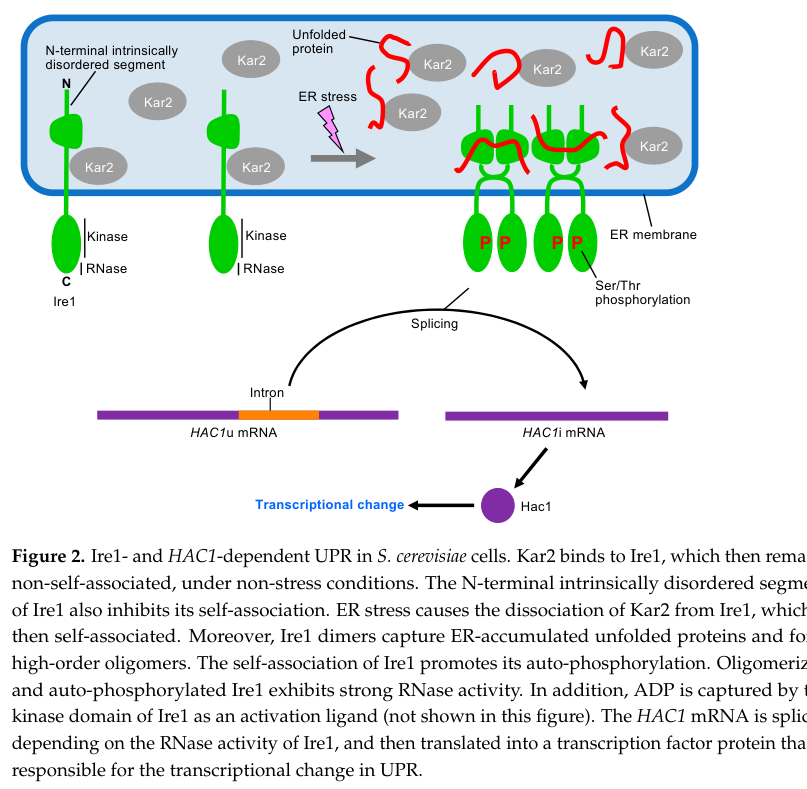

## Question

# Gene Research for Functional Annotation

## ⚠️ CRITICAL: Gene/Protein Identification Context

**BEFORE YOU BEGIN RESEARCH:** You MUST verify you are researching the CORRECT gene/protein. Gene symbols can be ambiguous, especially for less well-characterized genes from non-model organisms.

### Target Gene/Protein Identity (from UniProt):
- **UniProt Accession:** P32361
- **Protein Description:** RecName: Full=Serine/threonine-protein kinase/endoribonuclease IRE1; AltName: Full=Endoplasmic reticulum-to-nucleus signaling 1; Includes: RecName: Full=Serine/threonine-protein kinase; EC=2.7.11.1 {ECO:0000269|PubMed:18191223, ECO:0000269|PubMed:8663458, ECO:0000305|PubMed:9528768}; Includes: RecName: Full=Endoribonuclease; EC=3.1.26.- {ECO:0000269|PubMed:18191223, ECO:0000269|PubMed:9323131}; Flags: Precursor;
- **Gene Information:** Name=IRE1; Synonyms=ERN1; OrderedLocusNames=YHR079C;
- **Organism (full):** Saccharomyces cerevisiae (strain ATCC 204508 / S288c) (Baker's yeast).
- **Protein Family:** Belongs to the protein kinase superfamily. Ser/Thr protein
- **Key Domains:** IRE1/2-like. (IPR045133); KEN_dom. (IPR010513); KEN_sf. (IPR038357); Kinase-like_dom_sf. (IPR011009); PQQ_b-propeller_rpt. (IPR018391)

### MANDATORY VERIFICATION STEPS:

1. **Check if the gene symbol "IRE1" matches the protein description above**
2. **Verify the organism is correct:** Saccharomyces cerevisiae (strain ATCC 204508 / S288c) (Baker's yeast).
3. **Check if protein family/domains align with what you find in literature**
4. **If you find literature for a DIFFERENT gene with the same or similar symbol, STOP**

### If Gene Symbol is Ambiguous or You Cannot Find Relevant Literature:

**DO NOT PROCEED WITH RESEARCH ON A DIFFERENT GENE.** Instead:
- State clearly: "The gene symbol 'IRE1' is ambiguous or literature is limited for this specific protein"
- Explain what you found (e.g., "Found extensive literature on a different gene with the same symbol in a different organism")
- Describe the protein based ONLY on the UniProt information provided above
- Suggest that the protein function can be inferred from domain/family information

### Research Target:

Please provide a comprehensive research report on the gene **IRE1** (gene ID: IRE1, UniProt: P32361) in yeast.

The research report should be a detailed narrative explaining the function, biological processes, and localization of the gene product. Citations should be given for all claims.

You should prioritize authoritative reviews and primary scientific literature when conducting research. You can supplement
this with annotations you find in gene/protein databases, but these can be outdated or inaccurate.

We are specifically interested in the primary function of the gene - for enzymes, what reaction is catalyzed, and what is the substrate specificity? For transporters, what is the substrate? For structural proteins or adapters, what is the broader structural role? For signaling molecules, what is the role in the pathway.

We are interested in where in or outside the cell the gene product carries out its function.

We are also interested in the signaling or biochemical pathways in which the gene functions. We are less interested in broad pleiotropic effects, except where these elucidate the precise role.

Include evidence where possible. We are interested in both experimental evidence as well as inference from structure, evolution, or bioinformatic analysis. Precise studies should be prioritized over high-throughput, where available.

## Output

Question: You are an expert researcher providing comprehensive, well-cited information.

Provide detailed information focusing on:
1. Key concepts and definitions with current understanding
2. Recent developments and latest research (prioritize 2023-2024 sources)
3. Current applications and real-world implementations
4. Expert opinions and analysis from authoritative sources
5. Relevant statistics and data from recent studies

Format as a comprehensive research report with proper citations. Include URLs and publication dates where available.
Always prioritize recent, authoritative sources and provide specific citations for all major claims.

# Gene Research for Functional Annotation

## ⚠️ CRITICAL: Gene/Protein Identification Context

**BEFORE YOU BEGIN RESEARCH:** You MUST verify you are researching the CORRECT gene/protein. Gene symbols can be ambiguous, especially for less well-characterized genes from non-model organisms.

### Target Gene/Protein Identity (from UniProt):
- **UniProt Accession:** P32361
- **Protein Description:** RecName: Full=Serine/threonine-protein kinase/endoribonuclease IRE1; AltName: Full=Endoplasmic reticulum-to-nucleus signaling 1; Includes: RecName: Full=Serine/threonine-protein kinase; EC=2.7.11.1 {ECO:0000269|PubMed:18191223, ECO:0000269|PubMed:8663458, ECO:0000305|PubMed:9528768}; Includes: RecName: Full=Endoribonuclease; EC=3.1.26.- {ECO:0000269|PubMed:18191223, ECO:0000269|PubMed:9323131}; Flags: Precursor;
- **Gene Information:** Name=IRE1; Synonyms=ERN1; OrderedLocusNames=YHR079C;
- **Organism (full):** Saccharomyces cerevisiae (strain ATCC 204508 / S288c) (Baker's yeast).
- **Protein Family:** Belongs to the protein kinase superfamily. Ser/Thr protein
- **Key Domains:** IRE1/2-like. (IPR045133); KEN_dom. (IPR010513); KEN_sf. (IPR038357); Kinase-like_dom_sf. (IPR011009); PQQ_b-propeller_rpt. (IPR018391)

### MANDATORY VERIFICATION STEPS:

1. **Check if the gene symbol "IRE1" matches the protein description above**
2. **Verify the organism is correct:** Saccharomyces cerevisiae (strain ATCC 204508 / S288c) (Baker's yeast).
3. **Check if protein family/domains align with what you find in literature**
4. **If you find literature for a DIFFERENT gene with the same or similar symbol, STOP**

### If Gene Symbol is Ambiguous or You Cannot Find Relevant Literature:

**DO NOT PROCEED WITH RESEARCH ON A DIFFERENT GENE.** Instead:
- State clearly: "The gene symbol 'IRE1' is ambiguous or literature is limited for this specific protein"
- Explain what you found (e.g., "Found extensive literature on a different gene with the same symbol in a different organism")
- Describe the protein based ONLY on the UniProt information provided above
- Suggest that the protein function can be inferred from domain/family information

### Research Target:

Please provide a comprehensive research report on the gene **IRE1** (gene ID: IRE1, UniProt: P32361) in yeast.

The research report should be a detailed narrative explaining the function, biological processes, and localization of the gene product. Citations should be given for all claims.

You should prioritize authoritative reviews and primary scientific literature when conducting research. You can supplement
this with annotations you find in gene/protein databases, but these can be outdated or inaccurate.

We are specifically interested in the primary function of the gene - for enzymes, what reaction is catalyzed, and what is the substrate specificity? For transporters, what is the substrate? For structural proteins or adapters, what is the broader structural role? For signaling molecules, what is the role in the pathway.

We are interested in where in or outside the cell the gene product carries out its function.

We are also interested in the signaling or biochemical pathways in which the gene functions. We are less interested in broad pleiotropic effects, except where these elucidate the precise role.

Include evidence where possible. We are interested in both experimental evidence as well as inference from structure, evolution, or bioinformatic analysis. Precise studies should be prioritized over high-throughput, where available.

# Research report: *Saccharomyces cerevisiae* IRE1 (UniProt P32361; gene IRE1/ERN1; locus YHR079C)

## 0) Identity verification (critical disambiguation)
The UniProt accession **P32361** corresponds to **budding yeast (*Saccharomyces cerevisiae* S288c) Ire1/Ern1 (YHR079C)**, an **ER-resident single-pass (type I) transmembrane stress sensor** with a **cytosolic serine/threonine kinase domain and an endoribonuclease (RNase) domain** that initiates the yeast unfolded protein response (UPR) by **splicing HAC1 mRNA**. This aligns with current yeast-focused reviews describing Ire1 as the central UPR sensor and effector in *S. cerevisiae*, and with the foundational biochemical demonstration that Ire1 is a bifunctional kinase/endoribonuclease cleaving **HAC1** at two splice junctions. (ishiwatakimata2023fundamentalandapplicative pages 3-4, ishiwatakimata2023fundamentalandapplicative pages 4-6, sidrauski1997thetransmembranekinase pages 3-4)

A key species-level distinction is that **yeast Ire1’s canonical RNA substrate is HAC1**, whereas metazoan IRE1 splices **XBP1**; thus, mammalian IRE1α/β literature is not directly transferable for substrate specificity or pathway outputs. (fauzee2023endoplasmicstresssensor pages 1-2, bartoszewska2023dualrnaseactivity pages 3-5)

## 1) Key concepts and definitions (current understanding)

### 1.1 Unfolded Protein Response (UPR) in yeast
**ER stress** (insufficient folding capacity or ER dysfunction) triggers a protective gene-expression program termed the **unfolded protein response (UPR)**. In *S. cerevisiae*, the UPR is primarily the **Ire1–Hac1 axis**, discovered and mechanistically characterized in yeast genetics and biochemistry. (ishiwatakimata2023fundamentalandapplicative pages 6-8, ishiwatakimata2023fundamentalandapplicative pages 3-4)

### 1.2 Ire1 as a bifunctional ER stress sensor and signal transducer
In budding yeast, **Ire1 is an ER-located type I transmembrane protein**. Under ER stress, Ire1 becomes activated through **self-association (dimerization and higher-order oligomerization), autophosphorylation via its Ser/Thr kinase domain, and activation of its cytosolic RNase domain**. (ishiwatakimata2023fundamentalandapplicative pages 4-6, ishiwatakimata2023fundamentalandapplicative pages 3-4)

### 1.3 The canonical yeast output: unconventional HAC1 mRNA splicing
The defining biochemical step in yeast UPR signaling is **nonconventional splicing of unspliced HAC1 (HAC1u) mRNA**. Ire1 **cleaves HAC1 mRNA at both splice junctions**, and then **tRNA ligase (Trl1/Rlg1) ligates the exons** to generate the spliced form (HAC1i), which is translated to the bZIP transcription factor **Hac1** that activates UPR target genes (including ER chaperones and folding enzymes). (sidrauski1997thetransmembranekinase pages 4-6, ishiwatakimata2023fundamentalandapplicative pages 3-4)

## 2) Molecular function: enzymatic activities and substrate specificity

### 2.1 Endoribonuclease (RNase) activity: reaction and substrate specificity
**Reaction:** Ire1’s RNase performs **site-specific endonucleolytic cleavage** of **HAC1u mRNA** at both the **5′ and 3′ splice junctions**, thereby removing an inhibitory intron and initiating spliceosome-independent splicing. (sidrauski1997thetransmembranekinase pages 3-4, sidrauski1997thetransmembranekinase pages 4-6)

**Cleavage-site specificity:** Point mutations in critical guanosine residues at splice junctions (e.g., **G885C at the 5′ junction**) selectively block cleavage at that junction in vivo and in vitro, demonstrating that **Ire1 recognizes specific splice-junction determinants** in HAC1. Cleavage at the two junctions can occur independently (no obligate order). (sidrauski1997thetransmembranekinase pages 3-4, sidrauski1997thetransmembranekinase pages 4-6)

**Cofactor/nucleotide dependence:** In vitro cleavage requires an **adenosine nucleotide cofactor**: omission of ATP abolishes cleavage, while **ADP** or **AMP-PNP** can substitute; **GTP cannot**. This supports a conformational/ligand role for adenine nucleotide binding in RNase activation rather than requiring phosphoryl transfer. (sidrauski1997thetransmembranekinase pages 2-3)

**Completion of splicing:** Sidrauski & Walter reconstituted the full splicing reaction in vitro with **purified Ire1 fragment + purified tRNA ligase**, showing that these components are sufficient to produce correctly spliced HAC1. (sidrauski1997thetransmembranekinase pages 4-6)

### 2.2 tRNA ligase (Trl1/Rlg1) and RNA end-chemistry
Yeast HAC1 splicing is mechanistically analogous to tRNA splicing chemistry: Ire1 cleavage produces characteristic RNA ends (described in mechanistic summaries), and **Trl1/Rlg1** performs the ligation steps needed to generate the spliced HAC1 product. (rubio2010activatingeventsof pages 19-24)

### 2.3 Kinase activity: role in activation and attenuation
Ire1 has a **Ser/Thr kinase domain** that undergoes **trans-autophosphorylation** upon oligomerization, which is coupled to RNase activation in current models of UPR induction. (ishiwatakimata2023fundamentalandapplicative pages 4-6, ishiwatakimata2023fundamentalandapplicative pages 3-4)

Beyond enabling activation, kinase function is implicated in **attenuation/homeostatic shutdown**: mechanistic syntheses report kinase-dependent processes contributing to the disassembly of Ire1 oligomers and termination of signaling. (rubio2010activatingeventsof pages 24-31, ishiwatakimata2023fundamentalandapplicative pages 12-13)

## 3) Cellular localization and interacting partners

### 3.1 Localization
Ire1 is an **ER membrane protein** with a luminal stress-sensing domain and cytosolic kinase/RNase module; it forms **puncta/clusters** on the ER membrane during stress, consistent with its role as a spatially organized RNA-processing hub. (ishiwatakimata2023fundamentalandapplicative pages 3-4, ishiwatakimata2023fundamentalandapplicative pages 4-6)

A schematic depiction of this localization and pathway logic (Ire1 repression by Kar2/BiP, stress-induced clustering, HAC1 splicing, Hac1-driven transcriptional response) is shown here: (ishiwatakimata2023fundamentalandapplicative media d2ed78d3)

### 3.2 Key interaction partners and regulators
* **Kar2/BiP (ER Hsp70 chaperone):** Under non-stress conditions Kar2/BiP binding keeps Ire1 in a less self-associated state; ER stress promotes Kar2 dissociation and Ire1 self-association/activation. However, Kar2 dissociation alone is not sufficient for full activation, and mutants defective in Kar2 binding can still respond to stress, supporting multilayer regulation. (ishiwatakimata2023fundamentalandapplicative pages 4-6, ishiwatakimata2023fundamentalandapplicative pages 3-4)
* **Unfolded client proteins:** Ire1 activation can involve direct engagement of unfolded proteins via its luminal domain, which promotes oligomerization and signaling. (ishiwatakimata2023fundamentalandapplicative pages 4-6)
* **HAC1 mRNA:** HAC1u mRNA is recruited to Ire1 puncta/clusters for splicing during ER stress. (ishiwatakimata2023fundamentalandapplicative pages 3-4)
* **Trl1/Rlg1:** Ligates the exon fragments after Ire1 cleavage to complete HAC1 splicing. (ishiwatakimata2023fundamentalandapplicative pages 3-4, sidrauski1997thetransmembranekinase pages 4-6)

## 4) Pathway role and outputs

### 4.1 Core pathway steps (yeast Ire1–Hac1 branch)
1. ER stress increases unfolded protein burden and/or perturbs ER membrane homeostasis.
2. Ire1 transitions from repressed state (Kar2/BiP-associated) to an active state via dimerization/oligomerization and autophosphorylation.
3. Activated Ire1 RNase cleaves HAC1u mRNA at both splice junctions.
4. Trl1/Rlg1 ligates exons to produce HAC1i.
5. HAC1i is translated to Hac1 transcription factor, which induces UPR target genes (chaperones, folding enzymes, ERAD components; and, in broader UPR framing, lipid biosynthesis genes). (ishiwatakimata2023fundamentalandapplicative pages 4-6, ernst2024endoplasmicreticulummembrane pages 4-6)

### 4.2 Proteotoxic stress vs lipid bilayer stress (LBS)
Recent yeast-focused syntheses emphasize that Ire1 can be activated not only by unfolded proteins but also by **lipid bilayer stress**, sensed via Ire1’s transmembrane/amphipathic features. LBS tends to promote **dimeric** rather than large oligomeric Ire1 assemblies and can elicit **weaker RNase output** and a milder UPR. (ishiwatakimata2023fundamentalandapplicative pages 4-6, ernst2024endoplasmicreticulummembrane pages 6-7)

## 5) Recent developments (prioritizing 2023–2024)

### 5.1 2023 yeast UPR synthesis: expanded regulation layers
A 2023 yeast-focused review consolidates “canonical” and updated mechanistic insights, including: (i) multilayer control of Ire1 by Kar2/BiP and intrinsic disordered segments; (ii) stress-specific activation by unfolded proteins vs membrane stress; and (iii) multiple attenuation routes, including Ire1 dephosphorylation and HAC1 mRNA handling. (ishiwatakimata2023fundamentalandapplicative pages 4-6, ishiwatakimata2023fundamentalandapplicative pages 13-14)

### 5.2 2024 review focus: membrane homeostasis and lipid-induced UPR
A 2024 Cold Spring Harbor Perspectives review situates Ire1 within ER membrane homeostasis, explicitly linking UPR induction to **aberrant lipid metabolism** (lipid bilayer stress) and emphasizing oligomeric-state control of Ire1 activation. (ernst2024endoplasmicreticulummembrane pages 4-6, ernst2024endoplasmicreticulummembrane pages 6-7)

### 5.3 New regulatory input (2023 preprint): MAPK Slt2 modulates HAC1 splicing/translation
A 2023 bioRxiv preprint proposes that **MAPK Slt2** enhances both **HAC1 mRNA splicing and translation**, contributing to adaptation under ER stress. It reports quantitative kinetics under DTT stress (5 mM): Hac1 protein is detectable by ~1 h but reduced at 6–8 h; Slt2 phosphorylation exhibits strong late activation (reported up to ~19-fold at ≥4 h) consistent with multi-phase adaptation. (uppala2023adaptationtoer pages 11-15)

## 6) RIDD and non-canonical RNase outputs: what applies to *S. cerevisiae*?
Authoritative 2023–2024 reviews state that **regulated Ire1-dependent decay (RIDD)**—Ire1 RNase cleavage of additional ER-associated mRNAs—is **absent (or not convincingly supported) in *S. cerevisiae***, in contrast to other organisms such as *S. pombe* and metazoans. The yeast literature summarized indicates that **HAC1 is effectively the predominant (possibly sole) physiologically relevant Ire1 RNase substrate** in budding yeast; genome-wide analyses did not identify additional targets beyond HAC1, and reports of other cleavage events were not reproducible. (ernst2024endoplasmicreticulummembrane pages 4-6, ishiwatakimata2023fundamentalandapplicative pages 6-8, fauzee2023endoplasmicstresssensor pages 1-2)

## 7) Current applications and real-world implementations

### 7.1 Yeast biotechnology: improving secretion and ER capacity
Manipulating the Ire1/Hac1 axis (often by **HAC1/Hac1 overexpression** or constitutive UPR induction) is used to increase secretory capacity and can drive **ER expansion**. However, strong or constitutive UPR activation can impose growth defects in *S. cerevisiae*, motivating strategies that tune UPR strength or combine factors (e.g., co-overexpression with other stress-response transcription factors). (ishiwatakimata2023fundamentalandapplicative pages 10-12, ishiwatakimata2023fundamentalandapplicative pages 1-3)

### 7.2 Fungal biotechnology (industry): quantitative yield increases from UPR activation
A 2024 applied review summarizes that constitutive/activated HacA/Hac1 strategies have delivered substantial increases in secreted-product yields in industrial fungi, including **up to sevenfold** higher laccase production and **~2.8-fold** higher bovine preprochymosin in reported implementations. These examples illustrate how the Ire1/Hac1-style transcriptional UPR program can be leveraged to expand folding/secretion capacity. (jadhav2024proteinsecretionand pages 6-7)

### 7.3 Crop protection / antifungal strategies: targeting IRE1-dependent hac1 splicing
A 2023 *Journal of Agricultural and Food Chemistry* study developed a **cell-based reporter screening platform** (using transformed *S. cerevisiae* where DTT-induced UPR/hac1 splicing drives a GFP signal) to identify **natural products that inhibit fungal IRE1-dependent hac1 splicing**. The work reports dose–response inhibition (IC50 determination) and extends to plant-pathogen assays in which subtoxic doses of active inhibitors significantly reduced necrosis in infected leaves (Wilcoxon tests, p < 0.05 to < 0.001). This is a concrete translational use of Ire1/Hac1 pathway biology in an applied setting. (charpentier2023naturalproductstargeting pages 13-17)

## 8) Expert synthesis and authoritative interpretation (what leading sources emphasize)
* **Centrality of Ire1/Hac1 in budding yeast UPR:** Yeast UPR is effectively a single-sensor, single-transcription-factor architecture (Ire1→Hac1), which enables unusually clean genetic epistasis and mechanistic dissection; reviews emphasize this as a strength of yeast as a model for ER stress biology. (ishiwatakimata2023fundamentalandapplicative pages 6-8, fauzee2023endoplasmicstresssensor pages 1-2)
* **Two-input sensing (proteotoxic vs membrane stress):** 2023–2024 sources emphasize the physiological importance of **lipid bilayer stress** as a distinct trigger of Ire1 activation, integrating ER proteostasis with membrane homeostasis. (ishiwatakimata2023fundamentalandapplicative pages 4-6, ernst2024endoplasmicreticulummembrane pages 4-6)
* **Likely absence of RIDD in *S. cerevisiae*:** Recent authoritative reviews treat RIDD as absent in budding yeast, reinforcing a functional annotation in which HAC1 splicing is Ire1’s key RNase output in this organism. (ernst2024endoplasmicreticulummembrane pages 4-6, ishiwatakimata2023fundamentalandapplicative pages 6-8)

## 9) Recent data/statistics from studies (selected examples)
* **Enzymology (foundational quantitative/biochemical constraints):** Ire1 RNase activity requires an adenosine nucleotide cofactor (ATP required; ADP or AMP-PNP can substitute; GTP cannot), and single-nucleotide changes at splice junctions block cleavage at that junction—quantitative constraints critical for mechanistic and engineering interpretation. (sidrauski1997thetransmembranekinase pages 2-3, sidrauski1997thetransmembranekinase pages 4-6)
* **Stress adaptation signaling kinetics (2023 preprint):** Under DTT (5 mM), Slt2 phosphorylation shows time-dependent fold changes (reported ~2.5-fold at 2 h in WT and up to ~19-fold activation at ≥4 h), and Hac1 protein is detectable early (~1 h) but reduced at later times (6–8 h), indicating dynamic control of the Ire1/Hac1 output during prolonged stress. (uppala2023adaptationtoer pages 11-15)
* **Biotechnology outcomes (reviewed implementations):** Up to **7-fold** higher laccase yield and **~2.8-fold** higher bovine preprochymosin yield reported from UPR activation strategies in filamentous fungi (reviewed 2024). (jadhav2024proteinsecretionand pages 6-7)
* **Crop protection assay statistics (2023 primary):** Inhibitors targeting IRE1-dependent hac1 splicing reduced necrosis area with reported statistical significance (p < 0.05 to < 0.001) and were characterized via IC50/MIG50 dose–response frameworks. (charpentier2023naturalproductstargeting pages 13-17)

## 10) Evidence map (curated key sources)
The following table summarizes the highest-value sources used for functional annotation and recent developments.

| Year | Citation (first author/journal) | URL/DOI | Evidence type | Main contribution for Ire1 function | Quantitative/statistical data highlighted (if any) |
|---|---|---|---|---|---|
| 1997 | Sidrauski & Walter, *Cell* | https://doi.org/10.1016/S0092-8674(00)80369-4 | Primary | Foundational demonstration that *S. cerevisiae* Ire1p is an ER/inner nuclear membrane transmembrane kinase and site-specific endoribonuclease; cleaves *HAC1* mRNA at both splice junctions; together with tRNA ligase reconstitutes nonconventional splicing in vitro; establishes core Ire1→Hac1 UPR pathway and substrate specificity for *HAC1* over control RNAs (sidrauski1997thetransmembranekinase pages 3-4, sidrauski1997thetransmembranekinase pages 6-7, sidrauski1997thetransmembranekinase pages 4-6, sidrauski1997thetransmembranekinase pages 2-3) | Cell paper cited as having 1201 citations; splice-site point mutations selectively block cleavage; purified Ire1 + tRNA ligase sufficient for splicing; ATP/ADP/AMP-PNP support cleavage whereas GTP does not (sidrauski1997thetransmembranekinase pages 3-4, sidrauski1997thetransmembranekinase pages 6-7, sidrauski1997thetransmembranekinase pages 2-3) |
| 2023 | Ishiwata-Kimata & Kimata, *Journal of Fungi* | https://doi.org/10.3390/jof9100989 | Review | Best current yeast-focused synthesis: confirms Ire1 as ER type I transmembrane stress sensor with cytosolic kinase/RNase; activation by unfolded proteins and lipid bilayer stress; Kar2/BiP repression and release; oligomerization/puncta; predominant substrate is *HAC1u* in *S. cerevisiae*; attenuation via dephosphorylation/BiP re-binding; discusses industrial exploitation of constitutive UPR/Hac1 for secretion and ER expansion (ishiwatakimata2023fundamentalandapplicative pages 4-6, ishiwatakimata2023fundamentalandapplicative pages 6-8, ishiwatakimata2023fundamentalandapplicative pages 13-14, ishiwatakimata2023fundamentalandapplicative pages 3-4, ishiwatakimata2023fundamentalandapplicative pages 10-12, ishiwatakimata2023fundamentalandapplicative pages 1-3) | Notes milder RNase output under lipid bilayer stress with dimeric vs oligomeric Ire1; reports constitutive/enforced UPR can enlarge ER and improve secretion, but may retard growth in *S. cerevisiae* (ishiwatakimata2023fundamentalandapplicative pages 4-6, ishiwatakimata2023fundamentalandapplicative pages 10-12, ishiwatakimata2023fundamentalandapplicative pages 1-3) |
| 2024 | Ernst et al., *Cold Spring Harbor Perspectives in Biology* | https://doi.org/10.1101/cshperspect.a041400 | Review | Authoritative 2024 review on ER membrane homeostasis/UPR; frames ScIre1 as integrating proteotoxic and lipid bilayer stress; emphasizes oligomeric-state control, signaling clusters/filaments, TMD-based membrane sensing, and absence of robust RIDD in *S. cerevisiae* compared with other systems (ernst2024endoplasmicreticulummembrane pages 6-7, ernst2024endoplasmicreticulummembrane pages 4-6) | No yeast-specific numeric dataset extracted in evidence, but highlights structurally distinct activation modes and broad transcriptional regulation of hundreds of UPR targets through spliced *HAC1* (ernst2024endoplasmicreticulummembrane pages 4-6) |
| 2023 | Bartoszewska et al., *Journal of Cell Communication and Signaling* | https://doi.org/10.1007/s12079-023-00784-5 | Review | Comparative review useful for distinguishing yeast Ire1 from mammalian IRE1α: confirms yeast Ire1 as original UPR sensor that cleaves *HAC1* at two sites to produce active Hac1; also summarizes conserved dual kinase/RNase architecture across eukaryotes (bartoszewska2023dualrnaseactivity pages 3-5) | Article noted as having 23 citations; includes mammalian autophosphorylation residues S724/S726/S729 for comparison, underscoring species differences in downstream substrates (*HAC1* vs *XBP1*) (bartoszewska2023dualrnaseactivity pages 3-5) |
| 2023 | Uppala et al., *bioRxiv* | https://doi.org/10.1101/2023.11.19.567283 | Preprint / primary | Provides recent mechanistic evidence that MAPK Slt2 promotes adaptation to ER stress by enhancing both *HAC1* mRNA splicing and translation, adding a regulatory layer upstream/parallel to canonical Ire1–Hac1 signaling in budding yeast (uppala2023adaptationtoer pages 11-15, uppala2023adaptationtoer pages 1-4) | DTT 5 mM time course (1–8 h); Hac1 detectable by 1 h then reduced at 6–8 h; Slt2 phosphorylation ~2.5-fold at 2 h in WT, ~4-fold for Flag-Slt2 at 2 h, and ~19-fold at ≥4 h; truncation mapping identified residues 1–400/1–440 as functional but 1–355 nonfunctional (uppala2023adaptationtoer pages 11-15) |
| 2024 | Jadhav et al., *Applied Microbiology and Biotechnology* | https://doi.org/10.1007/s00253-023-12985-4 | Review | Application-focused review showing how Ire1/Hac1-like UPR manipulation is implemented in fungal biotechnology to improve secretory capacity; useful for real-world relevance of yeast UPR knowledge to enzyme/recombinant protein production (jadhav2024proteinsecretionand pages 6-7) | Reports activated HacA/Hac1 strategies increasing *T. versicolor* laccase up to 7-fold and bovine preprochymosin up to 2.8-fold; disruption of *aoatg15* in *A. oryzae* gave ~3-fold higher bovine chymosin secretion (jadhav2024proteinsecretionand pages 6-7) |

*Table: This table summarizes core literature for functional annotation of budding yeast Ire1/ERN1/YHR079C, spanning foundational mechanism, current reviews, recent regulatory studies, and applied biotechnology relevance. It is useful for quickly linking each source to specific evidence on activation, enzymatic function, substrate specificity, pathway role, localization, and practical implementation.*

## References (URLs and publication dates from retrieved sources)
* Sidrauski C, Walter P. *Cell* (1997-09). “The Transmembrane Kinase Ire1p Is a Site-Specific Endonuclease That Initiates mRNA Splicing in the Unfolded Protein Response.” https://doi.org/10.1016/S0092-8674(00)80369-4 (sidrauski1997thetransmembranekinase pages 3-4)
* Ishiwata-Kimata Y, Kimata Y. *Journal of Fungi* (2023-10). “Fundamental and Applicative Aspects of the Unfolded Protein Response in Yeasts.” https://doi.org/10.3390/jof9100989 (ishiwatakimata2023fundamentalandapplicative pages 4-6)
* Ernst R, Renne MF, Jain A, von der Malsburg A. *Cold Spring Harbor Perspectives in Biology* (2024-01). “Endoplasmic Reticulum Membrane Homeostasis and the Unfolded Protein Response.” https://doi.org/10.1101/cshperspect.a041400 (ernst2024endoplasmicreticulummembrane pages 4-6)
* Charpentier T et al. *Journal of Agricultural and Food Chemistry* (2023-09). “Natural Products Targeting the Fungal Unfolded Protein Response as an Alternative Crop Protection Strategy.” https://doi.org/10.1021/acs.jafc.3c03602 (charpentier2023naturalproductstargeting pages 13-17)
* Uppala JK et al. *bioRxiv* (2023-11). “Adaptation to ER Stress by Slt2 … via Enhancing Splicing and Translation of HAC1 mRNA in Saccharomyces cerevisiae.” https://doi.org/10.1101/2023.11.19.567283 (uppala2023adaptationtoer pages 11-15)
* Jadhav R, Mach RL, Mach-Aigner AR. *Applied Microbiology and Biotechnology* (2024-01). “Protein secretion and associated stress in industrially employed filamentous fungi.” https://doi.org/10.1007/s00253-023-12985-4 (jadhav2024proteinsecretionand pages 6-7)

References

1. (ishiwatakimata2023fundamentalandapplicative pages 3-4): Yuki Ishiwata-Kimata and Yukio Kimata. Fundamental and applicative aspects of the unfolded protein response in yeasts. Journal of Fungi, 9:989, Oct 2023. URL: https://doi.org/10.3390/jof9100989, doi:10.3390/jof9100989. This article has 21 citations.

2. (ishiwatakimata2023fundamentalandapplicative pages 4-6): Yuki Ishiwata-Kimata and Yukio Kimata. Fundamental and applicative aspects of the unfolded protein response in yeasts. Journal of Fungi, 9:989, Oct 2023. URL: https://doi.org/10.3390/jof9100989, doi:10.3390/jof9100989. This article has 21 citations.

3. (sidrauski1997thetransmembranekinase pages 3-4): Carmela Sidrauski and Peter Walter. The transmembrane kinase ire1p is a site-specific endonuclease that initiates mrna splicing in the unfolded protein response. Cell, 90:1031-1039, Sep 1997. URL: https://doi.org/10.1016/s0092-8674(00)80369-4, doi:10.1016/s0092-8674(00)80369-4. This article has 1201 citations and is from a highest quality peer-reviewed journal.

4. (fauzee2023endoplasmicstresssensor pages 1-2): Yasmin Nabilah Binti Mohd Fauzee, Yuki Yoshida, and Yukio Kimata. Endoplasmic stress sensor ire1 is involved in cytosolic/nuclear protein quality control in pichia pastoris cells independent of hac1. Frontiers in Microbiology, Jun 2023. URL: https://doi.org/10.3389/fmicb.2023.1157146, doi:10.3389/fmicb.2023.1157146. This article has 10 citations and is from a peer-reviewed journal.

5. (bartoszewska2023dualrnaseactivity pages 3-5): Sylwia Bartoszewska, Jakub Sławski, James F. Collawn, and Rafał Bartoszewski. Dual rnase activity of ire1 as a target for anticancer therapies. Journal of Cell Communication and Signaling, 17:1145-1161, Sep 2023. URL: https://doi.org/10.1007/s12079-023-00784-5, doi:10.1007/s12079-023-00784-5. This article has 23 citations and is from a peer-reviewed journal.

6. (ishiwatakimata2023fundamentalandapplicative pages 6-8): Yuki Ishiwata-Kimata and Yukio Kimata. Fundamental and applicative aspects of the unfolded protein response in yeasts. Journal of Fungi, 9:989, Oct 2023. URL: https://doi.org/10.3390/jof9100989, doi:10.3390/jof9100989. This article has 21 citations.

7. (sidrauski1997thetransmembranekinase pages 4-6): Carmela Sidrauski and Peter Walter. The transmembrane kinase ire1p is a site-specific endonuclease that initiates mrna splicing in the unfolded protein response. Cell, 90:1031-1039, Sep 1997. URL: https://doi.org/10.1016/s0092-8674(00)80369-4, doi:10.1016/s0092-8674(00)80369-4. This article has 1201 citations and is from a highest quality peer-reviewed journal.

8. (sidrauski1997thetransmembranekinase pages 2-3): Carmela Sidrauski and Peter Walter. The transmembrane kinase ire1p is a site-specific endonuclease that initiates mrna splicing in the unfolded protein response. Cell, 90:1031-1039, Sep 1997. URL: https://doi.org/10.1016/s0092-8674(00)80369-4, doi:10.1016/s0092-8674(00)80369-4. This article has 1201 citations and is from a highest quality peer-reviewed journal.

9. (rubio2010activatingeventsof pages 19-24): CAD Rubio. Activating events of the unfolded protein response in saccharomyces cerevisiae. Unknown journal, 2010.

10. (rubio2010activatingeventsof pages 24-31): CAD Rubio. Activating events of the unfolded protein response in saccharomyces cerevisiae. Unknown journal, 2010.

11. (ishiwatakimata2023fundamentalandapplicative pages 12-13): Yuki Ishiwata-Kimata and Yukio Kimata. Fundamental and applicative aspects of the unfolded protein response in yeasts. Journal of Fungi, 9:989, Oct 2023. URL: https://doi.org/10.3390/jof9100989, doi:10.3390/jof9100989. This article has 21 citations.

12. (ishiwatakimata2023fundamentalandapplicative media d2ed78d3): Yuki Ishiwata-Kimata and Yukio Kimata. Fundamental and applicative aspects of the unfolded protein response in yeasts. Journal of Fungi, 9:989, Oct 2023. URL: https://doi.org/10.3390/jof9100989, doi:10.3390/jof9100989. This article has 21 citations.

13. (ernst2024endoplasmicreticulummembrane pages 4-6): Robert Ernst, Mike F. Renne, Aamna Jain, and Alexander von der Malsburg. Endoplasmic reticulum membrane homeostasis and the unfolded protein response. Cold Spring Harbor perspectives in biology, 16:a041400, Jan 2024. URL: https://doi.org/10.1101/cshperspect.a041400, doi:10.1101/cshperspect.a041400. This article has 24 citations and is from a peer-reviewed journal.

14. (ernst2024endoplasmicreticulummembrane pages 6-7): Robert Ernst, Mike F. Renne, Aamna Jain, and Alexander von der Malsburg. Endoplasmic reticulum membrane homeostasis and the unfolded protein response. Cold Spring Harbor perspectives in biology, 16:a041400, Jan 2024. URL: https://doi.org/10.1101/cshperspect.a041400, doi:10.1101/cshperspect.a041400. This article has 24 citations and is from a peer-reviewed journal.

15. (ishiwatakimata2023fundamentalandapplicative pages 13-14): Yuki Ishiwata-Kimata and Yukio Kimata. Fundamental and applicative aspects of the unfolded protein response in yeasts. Journal of Fungi, 9:989, Oct 2023. URL: https://doi.org/10.3390/jof9100989, doi:10.3390/jof9100989. This article has 21 citations.

16. (uppala2023adaptationtoer pages 11-15): Jagadeesh Kumar Uppala, Anish Chakraborty, Jasmine George, Kimberly Ann Mayer, Chandrima Ghosh, Ritisha Dey, Pradeep Chaluvally-Raghavan, and Madhusudan Dey. Adaptation to er stress by slt2, counterpart of human map kinase erk1/2, via enhancing splicing and translation of hac1 mrna in saccharomyces cerevisiae. bioRxiv, Nov 2023. URL: https://doi.org/10.1101/2023.11.19.567283, doi:10.1101/2023.11.19.567283. This article has 1 citations.

17. (ishiwatakimata2023fundamentalandapplicative pages 10-12): Yuki Ishiwata-Kimata and Yukio Kimata. Fundamental and applicative aspects of the unfolded protein response in yeasts. Journal of Fungi, 9:989, Oct 2023. URL: https://doi.org/10.3390/jof9100989, doi:10.3390/jof9100989. This article has 21 citations.

18. (ishiwatakimata2023fundamentalandapplicative pages 1-3): Yuki Ishiwata-Kimata and Yukio Kimata. Fundamental and applicative aspects of the unfolded protein response in yeasts. Journal of Fungi, 9:989, Oct 2023. URL: https://doi.org/10.3390/jof9100989, doi:10.3390/jof9100989. This article has 21 citations.

19. (jadhav2024proteinsecretionand pages 6-7): Reshma Jadhav, Robert L Mach, and Astrid R Mach-Aigner. Protein secretion and associated stress in industrially employed filamentous fungi. Applied Microbiology and Biotechnology, Jan 2024. URL: https://doi.org/10.1007/s00253-023-12985-4, doi:10.1007/s00253-023-12985-4. This article has 28 citations and is from a domain leading peer-reviewed journal.

20. (charpentier2023naturalproductstargeting pages 13-17): Thomas Charpentier, Guillaume Viault, Anne-Marie Le Ray, Nelly Bataillé-Simoneau, Jean-Jacques Helesbeux, Nadège Blon, Franck Bastide, Muriel Marchi, Sophie Aligon, Antoine Bruguière, Chau Phi Dinh, Zahia Benbelkacem, Jean-Felix Dallery, Philippe Simoneau, Pascal Richomme, and Thomas Guillemette. Natural products targeting the fungal unfolded protein response as an alternative crop protection strategy. Journal of agricultural and food chemistry, 71:13706-13716, Sep 2023. URL: https://doi.org/10.1021/acs.jafc.3c03602, doi:10.1021/acs.jafc.3c03602. This article has 11 citations and is from a highest quality peer-reviewed journal.

21. (sidrauski1997thetransmembranekinase pages 6-7): Carmela Sidrauski and Peter Walter. The transmembrane kinase ire1p is a site-specific endonuclease that initiates mrna splicing in the unfolded protein response. Cell, 90:1031-1039, Sep 1997. URL: https://doi.org/10.1016/s0092-8674(00)80369-4, doi:10.1016/s0092-8674(00)80369-4. This article has 1201 citations and is from a highest quality peer-reviewed journal.

22. (uppala2023adaptationtoer pages 1-4): Jagadeesh Kumar Uppala, Anish Chakraborty, Jasmine George, Kimberly Ann Mayer, Chandrima Ghosh, Ritisha Dey, Pradeep Chaluvally-Raghavan, and Madhusudan Dey. Adaptation to er stress by slt2, counterpart of human map kinase erk1/2, via enhancing splicing and translation of hac1 mrna in saccharomyces cerevisiae. bioRxiv, Nov 2023. URL: https://doi.org/10.1101/2023.11.19.567283, doi:10.1101/2023.11.19.567283. This article has 1 citations.

## Artifacts

- [Edison artifact artifact-00](IRE1-deep-research-falcon_artifacts/artifact-00.md)

## Citations

1. sidrauski1997thetransmembranekinase pages 2-3
2. sidrauski1997thetransmembranekinase pages 4-6
3. rubio2010activatingeventsof pages 19-24
4. ishiwatakimata2023fundamentalandapplicative pages 4-6
5. ishiwatakimata2023fundamentalandapplicative pages 3-4
6. uppala2023adaptationtoer pages 11-15
7. jadhav2024proteinsecretionand pages 6-7
8. charpentier2023naturalproductstargeting pages 13-17
9. ernst2024endoplasmicreticulummembrane pages 4-6
10. bartoszewska2023dualrnaseactivity pages 3-5
11. sidrauski1997thetransmembranekinase pages 3-4
12. fauzee2023endoplasmicstresssensor pages 1-2
13. ishiwatakimata2023fundamentalandapplicative pages 6-8
14. rubio2010activatingeventsof pages 24-31
15. ishiwatakimata2023fundamentalandapplicative pages 12-13
16. ernst2024endoplasmicreticulummembrane pages 6-7
17. ishiwatakimata2023fundamentalandapplicative pages 13-14
18. ishiwatakimata2023fundamentalandapplicative pages 10-12
19. ishiwatakimata2023fundamentalandapplicative pages 1-3
20. sidrauski1997thetransmembranekinase pages 6-7
21. uppala2023adaptationtoer pages 1-4
22. https://doi.org/10.1016/S0092-8674(00
23. https://doi.org/10.3390/jof9100989
24. https://doi.org/10.1101/cshperspect.a041400
25. https://doi.org/10.1007/s12079-023-00784-5
26. https://doi.org/10.1101/2023.11.19.567283
27. https://doi.org/10.1007/s00253-023-12985-4
28. https://doi.org/10.1021/acs.jafc.3c03602
29. https://doi.org/10.3390/jof9100989,
30. https://doi.org/10.1016/s0092-8674(00
31. https://doi.org/10.3389/fmicb.2023.1157146,
32. https://doi.org/10.1007/s12079-023-00784-5,
33. https://doi.org/10.1101/cshperspect.a041400,
34. https://doi.org/10.1101/2023.11.19.567283,
35. https://doi.org/10.1007/s00253-023-12985-4,
36. https://doi.org/10.1021/acs.jafc.3c03602,