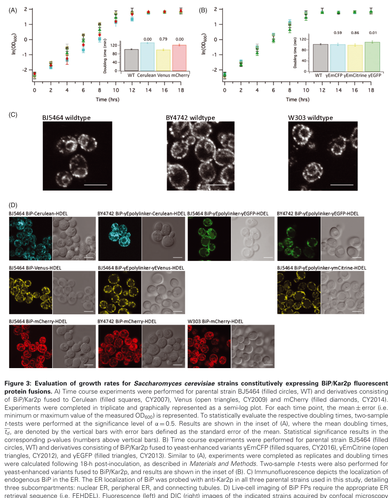

## Question

# Gene Research for Functional Annotation

## ⚠️ CRITICAL: Gene/Protein Identification Context

**BEFORE YOU BEGIN RESEARCH:** You MUST verify you are researching the CORRECT gene/protein. Gene symbols can be ambiguous, especially for less well-characterized genes from non-model organisms.

### Target Gene/Protein Identity (from UniProt):
- **UniProt Accession:** P16474
- **Protein Description:** RecName: Full=Endoplasmic reticulum chaperone BiP {ECO:0000305}; EC=3.6.4.10 {ECO:0000250|UniProtKB:P11021}; AltName: Full=78 kDa glucose-regulated protein homolog {ECO:0000303|PubMed:2661018}; Short=GRP-78 {ECO:0000303|PubMed:2661018}; AltName: Full=Immunoglobulin heavy chain-binding protein homolog {ECO:0000305}; Short=BiP {ECO:0000305}; Flags: Precursor;
- **Gene Information:** Name=KAR2; Synonyms=GRP78 {ECO:0000303|PubMed:2661018}, SSD1; OrderedLocusNames=YJL034W; ORFNames=J1248;
- **Organism (full):** Saccharomyces cerevisiae (strain ATCC 204508 / S288c) (Baker's yeast).
- **Protein Family:** Belongs to the heat shock protein 70 family. .
- **Key Domains:** ATPase_NBD. (IPR043129); BIP_NBD. (IPR042050); Heat_shock_70_CS. (IPR018181); HSP70_C_sf. (IPR029048); HSP70_peptide-bd_sf. (IPR029047)

### MANDATORY VERIFICATION STEPS:

1. **Check if the gene symbol "KAR2" matches the protein description above**
2. **Verify the organism is correct:** Saccharomyces cerevisiae (strain ATCC 204508 / S288c) (Baker's yeast).
3. **Check if protein family/domains align with what you find in literature**
4. **If you find literature for a DIFFERENT gene with the same or similar symbol, STOP**

### If Gene Symbol is Ambiguous or You Cannot Find Relevant Literature:

**DO NOT PROCEED WITH RESEARCH ON A DIFFERENT GENE.** Instead:
- State clearly: "The gene symbol 'KAR2' is ambiguous or literature is limited for this specific protein"
- Explain what you found (e.g., "Found extensive literature on a different gene with the same symbol in a different organism")
- Describe the protein based ONLY on the UniProt information provided above
- Suggest that the protein function can be inferred from domain/family information

### Research Target:

Please provide a comprehensive research report on the gene **KAR2** (gene ID: KAR2, UniProt: P16474) in yeast.

The research report should be a detailed narrative explaining the function, biological processes, and localization of the gene product. Citations should be given for all claims.

You should prioritize authoritative reviews and primary scientific literature when conducting research. You can supplement
this with annotations you find in gene/protein databases, but these can be outdated or inaccurate.

We are specifically interested in the primary function of the gene - for enzymes, what reaction is catalyzed, and what is the substrate specificity? For transporters, what is the substrate? For structural proteins or adapters, what is the broader structural role? For signaling molecules, what is the role in the pathway.

We are interested in where in or outside the cell the gene product carries out its function.

We are also interested in the signaling or biochemical pathways in which the gene functions. We are less interested in broad pleiotropic effects, except where these elucidate the precise role.

Include evidence where possible. We are interested in both experimental evidence as well as inference from structure, evolution, or bioinformatic analysis. Precise studies should be prioritized over high-throughput, where available.

## Output

Question: You are an expert researcher providing comprehensive, well-cited information.

Provide detailed information focusing on:
1. Key concepts and definitions with current understanding
2. Recent developments and latest research (prioritize 2023-2024 sources)
3. Current applications and real-world implementations
4. Expert opinions and analysis from authoritative sources
5. Relevant statistics and data from recent studies

Format as a comprehensive research report with proper citations. Include URLs and publication dates where available.
Always prioritize recent, authoritative sources and provide specific citations for all major claims.

# Gene Research for Functional Annotation

## ⚠️ CRITICAL: Gene/Protein Identification Context

**BEFORE YOU BEGIN RESEARCH:** You MUST verify you are researching the CORRECT gene/protein. Gene symbols can be ambiguous, especially for less well-characterized genes from non-model organisms.

### Target Gene/Protein Identity (from UniProt):
- **UniProt Accession:** P16474
- **Protein Description:** RecName: Full=Endoplasmic reticulum chaperone BiP {ECO:0000305}; EC=3.6.4.10 {ECO:0000250|UniProtKB:P11021}; AltName: Full=78 kDa glucose-regulated protein homolog {ECO:0000303|PubMed:2661018}; Short=GRP-78 {ECO:0000303|PubMed:2661018}; AltName: Full=Immunoglobulin heavy chain-binding protein homolog {ECO:0000305}; Short=BiP {ECO:0000305}; Flags: Precursor;
- **Gene Information:** Name=KAR2; Synonyms=GRP78 {ECO:0000303|PubMed:2661018}, SSD1; OrderedLocusNames=YJL034W; ORFNames=J1248;
- **Organism (full):** Saccharomyces cerevisiae (strain ATCC 204508 / S288c) (Baker's yeast).
- **Protein Family:** Belongs to the heat shock protein 70 family. .
- **Key Domains:** ATPase_NBD. (IPR043129); BIP_NBD. (IPR042050); Heat_shock_70_CS. (IPR018181); HSP70_C_sf. (IPR029048); HSP70_peptide-bd_sf. (IPR029047)

### MANDATORY VERIFICATION STEPS:

1. **Check if the gene symbol "KAR2" matches the protein description above**
2. **Verify the organism is correct:** Saccharomyces cerevisiae (strain ATCC 204508 / S288c) (Baker's yeast).
3. **Check if protein family/domains align with what you find in literature**
4. **If you find literature for a DIFFERENT gene with the same or similar symbol, STOP**

### If Gene Symbol is Ambiguous or You Cannot Find Relevant Literature:

**DO NOT PROCEED WITH RESEARCH ON A DIFFERENT GENE.** Instead:
- State clearly: "The gene symbol 'KAR2' is ambiguous or literature is limited for this specific protein"
- Explain what you found (e.g., "Found extensive literature on a different gene with the same symbol in a different organism")
- Describe the protein based ONLY on the UniProt information provided above
- Suggest that the protein function can be inferred from domain/family information

### Research Target:

Please provide a comprehensive research report on the gene **KAR2** (gene ID: KAR2, UniProt: P16474) in yeast.

The research report should be a detailed narrative explaining the function, biological processes, and localization of the gene product. Citations should be given for all claims.

You should prioritize authoritative reviews and primary scientific literature when conducting research. You can supplement
this with annotations you find in gene/protein databases, but these can be outdated or inaccurate.

We are specifically interested in the primary function of the gene - for enzymes, what reaction is catalyzed, and what is the substrate specificity? For transporters, what is the substrate? For structural proteins or adapters, what is the broader structural role? For signaling molecules, what is the role in the pathway.

We are interested in where in or outside the cell the gene product carries out its function.

We are also interested in the signaling or biochemical pathways in which the gene functions. We are less interested in broad pleiotropic effects, except where these elucidate the precise role.

Include evidence where possible. We are interested in both experimental evidence as well as inference from structure, evolution, or bioinformatic analysis. Precise studies should be prioritized over high-throughput, where available.

## Research Report: *Saccharomyces cerevisiae* KAR2 (Kar2p/BiP; UniProt P16474)

### 0) Target verification (mandatory)
The literature gathered here consistently identifies **KAR2** in *Saccharomyces cerevisiae* (S288c) as the **endoplasmic reticulum (ER) luminal Hsp70-family chaperone Kar2p**, homologous to mammalian **BiP/GRP78**. Functional descriptions match the UniProt P16474 entry: ER localization with a C-terminal HDEL-type retrieval motif, Hsp70 ATPase and peptide-binding domain architecture, roles in ER protein translocation, folding/quality control, ERAD, and unfolded protein response (UPR) regulation. (ishiwatakimata2023fundamentalandapplicative pages 1-3, kabani2000sls1pstimulatessec63pmediated pages 1-2)

### 1) Key concepts and definitions (current understanding)

#### 1.1 Kar2p/BiP as an ER Hsp70 chaperone
Kar2p is an **Hsp70-family molecular chaperone** in the **ER lumen** that binds unfolded polypeptides and supports **protein folding homeostasis**, **ER import/translocation**, and quality control pathways including ER-associated degradation (ERAD). (ishiwatakimata2023fundamentalandapplicative pages 3-4, young2013analysisofer pages 1-2)

A key mechanistic concept is the **Hsp70 ATPase cycle**: ATP binding/hydrolysis and nucleotide exchange regulate the affinity of the peptide-binding site for client polypeptides, thereby enabling cycles of binding and release that drive folding and translocation work. While ATPase kinetic constants (kcat, Km) were not available in the retrieved excerpts, Kar2p’s **canonical domain architecture** is explicitly described as an Hsp70 with an approximately **44 kDa ATPase domain**, an approximately **18 kDa peptide-binding pocket**, and an approximately **10 kDa C-terminal domain**. (kabani2000sls1pstimulatessec63pmediated pages 1-2)

#### 1.2 ER localization and retention/retrieval via HDEL
Soluble ER residents in budding yeast are commonly retained by **C-terminal HDEL-type retrieval sequences**. For Kar2p/BiP, an experimentally used retrieval motif is **FEHDEL** (i.e., HDEL as the terminal four residues). The H/KDEL tetrapeptide must occupy the final four residues to function, and **HDEL-dependent retrieval is required for cell growth** in budding yeast. (young2013analysisofer pages 1-2)

Immunofluorescence microscopy using anti-Kar2p antibodies and live-cell imaging of BiP fusion constructs show ER localization consistent with this retention/retrieval system. (young2013analysisofer media 23cebe70)

#### 1.3 Kar2p in ER protein translocation (Sec61/Sec62/Sec63 pathway)
Kar2p is central to ER translocation—particularly **posttranslational translocation**—through physical and functional coupling to the **Sec61 translocon accessory machinery**. A mechanistic anchor is **Sec63**, a transmembrane protein whose **luminal J-domain recruits Kar2p** and **stimulates Kar2p ATPase activity**; sec63 J-domain mutants (e.g., sec63-1) are defective in Kar2p binding and accumulate untranslocated preproteins. ER microsomes from **kar2** and **sec63-1** mutants are defective for **both post- and cotranslational translocation in vitro**. (kabani2000sls1pstimulatessec63pmediated pages 1-2)

A common conceptual model described in recent synthesis is that Kar2p can function as a **“molecular ratchet”** during translocation, biasing client movement into the ER lumen. (ishiwatakimata2023fundamentalandapplicative pages 3-4, ishiwatakimata2023fundamentalandapplicative pages 1-3)

#### 1.4 Kar2p in UPR regulation via Ire1–Hac1
In yeast, the canonical UPR is mediated by **Ire1**, an ER transmembrane stress sensor/endoribonuclease, which upon activation splices **HAC1 mRNA** to produce a transcription factor (Hac1p) that induces UPR target genes including ER chaperones (such as KAR2). (ishiwatakimata2023fundamentalandapplicative pages 1-3, read2021theunfoldedprotein pages 1-2)

Kar2p/BiP participates directly in regulating UPR activation: under non-stress conditions, Kar2 binds the **luminal domain of Ire1** and inhibits Ire1 self-association; upon ER stress, Kar2 dissociates, enabling Ire1 oligomerization and downstream HAC1 splicing. A key nuance emphasized in a 2023 review is that **Kar2 dissociation alone is not sufficient** for full Ire1 activation, and that additional Ire1-intrinsic constraints (e.g., an N-terminal intrinsically disordered inhibitory segment) contribute to setting the activation threshold. (ishiwatakimata2023fundamentalandapplicative pages 3-4)

### 2) Mechanistic functional annotation (biochemical function, pathways, localization)

#### 2.1 Primary molecular function
**Primary function (functional annotation):** Kar2p is an **ER-luminal ATP-dependent Hsp70 chaperone** that binds unfolded polypeptide substrates and uses ATP hydrolysis/nucleotide exchange cycles to:
- promote protein folding and assembly in the ER,
- drive or assist posttranslational import/translocation through the translocon,
- maintain solubility/handling of misfolded clients in ER quality control,
- interface with ERAD pathways for clients that cannot fold. (ishiwatakimata2023fundamentalandapplicative pages 3-4, young2013analysisofer pages 1-2, kabani2000sls1pstimulatessec63pmediated pages 1-2)

**Substrate specificity:** In Hsp70 terms, Kar2p is broadly specific for **unfolded or partially folded polypeptide segments**, rather than a narrow chemical substrate. This broad client-binding role is explicitly described (unfolded/unassembled ER clients; nascent peptides during translocation). (ishiwatakimata2023fundamentalandapplicative pages 3-4, ishiwatakimata2023fundamentalandapplicative pages 1-3)

#### 2.2 Interaction partners and functional modules
- **Sec63 (J-domain cochaperone):** recruits and activates Kar2p ATPase at the ER translocon; sec63 J-domain mutants disrupt Kar2 interaction and translocation. (kabani2000sls1pstimulatessec63pmediated pages 1-2)
- **Sls1p:** interacts with Kar2p; stimulates Sec63-mediated activation of Kar2p in a conformation-dependent manner; genetic interactions (synthetic lethality with kar2/sec63 mutants) support its role in translocation and the Kar2 cycle. (kabani2000sls1pstimulatessec63pmediated pages 1-2)
- **Nucleotide exchange factors (NEFs):** **Lhs1** is described as a molecular Hsp70 considered a NEF for BiP/Kar2; **Sil1** is described as a NEF required for ER translocation of nascent proteins. (young2013analysisofer pages 1-2)
- **Hsp40 cochaperone:** **Scj1** is listed as an ER cochaperone for BiP/Kar2. (young2013analysisofer pages 1-2)

#### 2.3 Subcellular site of action
Evidence supports **ER luminal localization** of Kar2p, with residency dependent on HDEL-type retrieval. Fluorescence and immunofluorescence images show ER-localized patterns consistent with ER retention/retrieval mechanisms. (young2013analysisofer media 23cebe70)

### 3) Recent developments and latest research (prioritize 2023–2024)

#### 3.1 2023: refined view of Ire1 regulation and UPR activation architecture
A 2023 authoritative review (Ishiwata-Kimata & Kimata, *Journal of Fungi*, Oct 2023; https://doi.org/10.3390/jof9100989) emphasizes that Kar2p/BiP should be viewed less as a simple “on/off inhibitor” and more as an **adjustor** of Ire1 activity with layered regulation: Kar2 binding restrains Ire1 clustering/self-association, but Ire1 retains stress responsiveness even when Kar2-binding sites are perturbed, implying additional regulatory constraints. (ishiwatakimata2023fundamentalandapplicative pages 3-4, ishiwatakimata2023fundamentalandapplicative pages 12-13)

The same review also compiles updated understanding of **HAC1 splicing regulation**, including additional factors that help ensure UPR is evoked strictly in response to ER stress (e.g., factors promoting HAC1 mRNA processing/splicing steps). (ishiwatakimata2023fundamentalandapplicative pages 3-4)

#### 3.2 2023: translocation accessory factor perspective that still centers BiP/Kar2
A 2023 perspective on ER protein biosynthesis highlights that posttranslational translocation in yeast involves Sec61 with Sec62/Sec63 and recruitment of BiP/Kar2 via Sec63’s J-domain (mechanistic framing consistent with earlier biochemical/genetic work), indicating continued relevance of the Kar2-dependent module within newer “accessory factor” frameworks for ER proteome biogenesis. (kabani2000sls1pstimulatessec63pmediated pages 1-2)

#### 3.3 2024: secretion engineering and UPR/ER folding capacity as an applied frontier
A 2024 review (Zhao et al., *Microbial Cell Factories*, Jan 2024; https://doi.org/10.1186/s12934-024-02299-z) summarizes modern strategies for enhanced heterologous protein production in *S. cerevisiae*, where ER folding capacity and UPR-linked interventions (including chaperone modules exemplified by Kar2-centered networks) remain a central lever for secretion performance. (ishiwatakimata2023fundamentalandapplicative pages 12-13)

**Limitation (evidence availability):** In the retrieved document set, 2023–2024 sources were largely reviews/perspectives rather than Kar2-focused primary studies reporting new kinetic constants or new quantitative measurements directly on Kar2p.

### 4) Current applications and real-world implementations

#### 4.1 Kar2p as a practical ER marker and a tool for imaging/purification
Young et al. (Traffic, Apr 2013; https://doi.org/10.1111/tra.12041) developed modular tagging approaches (fluorescent tags and Strep-tag II with H/KDEL retrieval sequences) for ER-resident proteins including Kar2p/BiP. They report a BiP-Strep-tag II-HDEL construct detected at the expected ~**76.9 kDa**, and a mild-elution affinity purification workflow yielding **~54% recovery** of total BiP from lysate prepared from ~**80 OD600** units of cells. (young2013analysisofer pages 9-11)

These approaches are used in practice to:
- validate ER localization/trafficking of ER residents,
- purify Kar2p under near-physiological conditions for biochemical analyses,
- benchmark retention/retrieval behavior of engineered ER proteins. (young2013analysisofer pages 1-2, young2013analysisofer pages 9-11)

#### 4.2 Kar2p and UPR reporters in screens and strain characterization
Kar2p secretion and KAR2/UPRE reporters are used as **readouts of ER stress, retention/retrieval defects, or UPR activation**. For example, a colony immunoblot method can quantify extracellular Kar2p in mutants, and a UPRE-LacZ reporter can define constitutive UPR activation using a **1.5-fold over wild-type threshold**. In a mutant collection described, **erd1Δ** had a reported Kar2 secretion index of **9.0** (highest in that screen), illustrating how Kar2 can serve as an experimentally tractable proxy for ER retention/retrieval failure or secretory pathway dysfunction. (mariana2011studiesonthe pages 116-120)

#### 4.3 Recombinant secretion engineering (Kar2 overexpression; UPR manipulation)
Kar2p is also used as a genetic engineering lever to improve heterologous secretion, with protein-dependent outcomes. A compiled methodological/review source reports that **Kar2p overproduction increased secretion of bovine prochymosin by 26-fold** (but had no effect on plant thaumatin) and that **KAR2 coexpression with PDI** can synergistically increase secretion of single-chain antibody fragments. The same source reports that overexpression of mature **HAC1** (UPR induction) improved heterologous **α-amylase** secretion by ~**20%**. (cedras2018theinvitro pages 31-34)

### 5) Relevant statistics and data (from retrieved studies)

- **Protein tagging/purification performance:** BiP-Strep-tag II-HDEL detected at ~**76.9 kDa**; **~54% recovery** of total BiP from lysate (starting from ~80 OD600 culture units). (young2013analysisofer pages 9-11)
- **UPR screen threshold:** **1.5-fold** UPRE-LacZ induction over WT used as a cutoff for constitutive UPR activation in a screening context. (mariana2011studiesonthe pages 116-120)
- **ER retention/retrieval phenotype:** **erd1Δ** Kar2 secretion index **9.0** in a colony immunoblot-based secretion assay. (mariana2011studiesonthe pages 116-120)
- **Biotechnology secretion improvements:** Kar2 overproduction reported to increase bovine prochymosin secretion by **26-fold**; HAC1 maturation overexpression improved α-amylase secretion by **~20%**. (cedras2018theinvitro pages 31-34)

### 6) Expert analysis and authoritative synthesis
A key expert-level synthesis emerging from recent authoritative reviews is that Kar2p/BiP is best understood as a **hub** connecting: (i) the ER’s folding capacity, (ii) translocon-associated import mechanics, (iii) quality control/ERAD triage, and (iv) the regulation of stress signaling via Ire1. The 2023 review emphasizes that **Ire1 activation is multi-step** and that Kar2 is part of a layered control system rather than the sole switch, aligning with modern mechanistic reconstructions of UPR stress sensing. (ishiwatakimata2023fundamentalandapplicative pages 3-4, ishiwatakimata2023fundamentalandapplicative pages 12-13)

### 7) Visual evidence (localization and construct validation)
Young et al. provide microscopy evidence of Kar2p/BiP ER localization (anti-Kar2p immunofluorescence and BiP fusion imaging) and biochemical validation/purification panels for BiP-Strep-tag II-HDEL constructs. (young2013analysisofer media 23cebe70, young2013analysisofer media cbccc2ab)

### 8) Evidence map summary table
The following table consolidates the functional annotation points, key evidence snippets, and source metadata (URLs/dates) into a compact evidence map.

| Topic | Key points | Representative evidence (with citation IDs) | Key sources (author-year, journal, URL, publication month/year) |
|---|---|---|---|
| Identity | KAR2 in *Saccharomyces cerevisiae* encodes Kar2p/BiP, the ER-luminal Hsp70-family chaperone homologous to mammalian BiP/GRP78; evidence aligns with UniProt P16474 and the expected ATPase and peptide-binding domain architecture. | Review and comparative sources identify ScKar2 as the ER BiP homolog and Hsp70-family chaperone; primary work describes canonical Hsp70 domain organization. (ishiwatakimata2023fundamentalandapplicative pages 1-3, kabani2000sls1pstimulatessec63pmediated pages 1-2) | Ishiwata-Kimata & Kimata 2023, *Journal of Fungi*, https://doi.org/10.3390/jof9100989, Oct 2023; Kabani et al. 2000, *Molecular and Cellular Biology*, https://doi.org/10.1128/MCB.20.18.6923-6934.2000, Sep 2000 |
| Localization/retention | Kar2p is ER luminal and retained/retrieved through a C-terminal HDEL-type motif; in tagged constructs the retrieval motif is FEHDEL. HDEL-dependent retrieval is important for growth and ER residency, with Erd2 as the receptor system. Imaging studies support ER localization. | FEHDEL motif documented for BiP/Kar2p; anti-Kar2 immunofluorescence and BiP-FP-HDEL imaging show ER localization; ERD2 determines specificity of the luminal ER protein retention system. (young2013analysisofer pages 1-2, young2013analysisofer pages 9-11, young2013analysisofer media 23cebe70, hernandezelvira2018theunfoldedprotein pages 14-16) | Young et al. 2013, *Traffic*, https://doi.org/10.1111/tra.12041, Apr 2013; Hernández-Elvira et al. 2018, *Cells*, https://doi.org/10.3390/cells7080106, Aug 2018 |
| Primary biochemical activity | Kar2p is an ATP-dependent Hsp70 chaperone that binds unfolded polypeptides, couples nucleotide state to peptide binding/release, and supports ER protein folding/homeostasis. Domain architecture reported as ~44-kDa ATPase domain, ~18-kDa peptide-binding pocket, and ~10-kDa C-terminal domain. | Kar2 described as molecular ratchet/chaperone for unfolded ER clients; Sec63-mediated ATPase activation and Hsp70 domain architecture defined experimentally. (ishiwatakimata2023fundamentalandapplicative pages 3-4, kabani2000sls1pstimulatessec63pmediated pages 1-2) | Ishiwata-Kimata & Kimata 2023, *Journal of Fungi*, https://doi.org/10.3390/jof9100989, Oct 2023; Kabani et al. 2000, *Molecular and Cellular Biology*, https://doi.org/10.1128/MCB.20.18.6923-6934.2000, Sep 2000 |
| Translocation role | Kar2p acts during ER import/translocation, especially posttranslational translocation, where the Sec63 luminal J-domain recruits and activates Kar2p; Kar2 binding helps pull/ratchet nascent chains into the ER. Loss of BiP function blocks secretory protein translocation. | Sec63 J-domain binds Kar2p and activates its ATPase; sec63-1 mutants accumulate untranslocated preproteins; kar2 and sec63 mutant microsomes are defective in post- and cotranslational translocation; review reiterates molecular-ratchet role. (kabani2000sls1pstimulatessec63pmediated pages 1-2, hernandezelvira2018theunfoldedprotein pages 14-16, ishiwatakimata2023fundamentalandapplicative pages 1-3) | Kabani et al. 2000, *Molecular and Cellular Biology*, https://doi.org/10.1128/MCB.20.18.6923-6934.2000, Sep 2000; Hernández-Elvira et al. 2018, *Cells*, https://doi.org/10.3390/cells7080106, Aug 2018; Ishiwata-Kimata & Kimata 2023, *Journal of Fungi*, https://doi.org/10.3390/jof9100989, Oct 2023 |
| UPR regulation | KAR2 is a classic UPR target gene. Under non-stress conditions Kar2 binds the Ire1 luminal domain and suppresses Ire1 self-association; during ER stress Kar2 dissociates, enabling Ire1 oligomerization and HAC1 mRNA splicing. Kar2 dissociation alone is not sufficient for full activation, indicating multilayered Ire1 control. | Review and mechanistic summaries cite Kar2-mediated repression of Ire1, stress-triggered dissociation, and persistence of stress responsiveness in Ire1 mutants lacking the Kar2-binding site. KAR2 promoter contains unfolded-protein-responsive cis-elements. (ishiwatakimata2023fundamentalandapplicative pages 3-4, ishiwatakimata2023fundamentalandapplicative pages 12-13, hernandezelvira2018theunfoldedprotein pages 14-16) | Ishiwata-Kimata & Kimata 2023, *Journal of Fungi*, https://doi.org/10.3390/jof9100989, Oct 2023; Hernández-Elvira et al. 2018, *Cells*, https://doi.org/10.3390/cells7080106, Aug 2018 |
| ERAD/quality control | Kar2p binds unfolded or unassembled ER proteins and contributes to quality control, maintaining client solubility and promoting retrotranslocation/degradation through ERAD. Kar2 availability influences proteotoxic stress outcomes and extracellular escape of ER residents when retention/retrieval fails. | Reviews state Kar2 associates with unfolded ER clients destined for proteasomal degradation; ER chaperones maintain solubility for retrotranslocation; Kar2 secretion assays reveal defects in ER quality-control/retrieval pathways. (ishiwatakimata2023fundamentalandapplicative pages 3-4, hernandezelvira2018theunfoldedprotein pages 14-16, mariana2011studiesonthe pages 116-120) | Ishiwata-Kimata & Kimata 2023, *Journal of Fungi*, https://doi.org/10.3390/jof9100989, Oct 2023; Hernández-Elvira et al. 2018, *Cells*, https://doi.org/10.3390/cells7080106, Aug 2018; Dorrington Quinones 2011, https://doi.org/10.7916/d85b08f5, Jan 2011 |
| Co-chaperones/NEFs | Kar2p works with Sec63 (J-domain cochaperone) and Sls1p, which stimulates Sec63-mediated activation of Kar2p. Lhs1 and Sil1 are identified as nucleotide exchange factors/functionally linked ER lumenal factors for BiP/Kar2; Scj1 is an Hsp40 cochaperone. | Sls1p binds Kar2p, shows synthetic lethality with kar2/sec63 mutants, and stimulates Kar2–Sec63 interaction/ATPase activation; Young et al. list Lhs1 as BiP NEF, Sil1 as required for ER translocation, and Scj1 as cochaperone. (kabani2000sls1pstimulatessec63pmediated pages 1-2, young2013analysisofer pages 1-2, ishiwatakimata2023fundamentalandapplicative pages 12-13) | Kabani et al. 2000, *Molecular and Cellular Biology*, https://doi.org/10.1128/MCB.20.18.6923-6934.2000, Sep 2000; Young et al. 2013, *Traffic*, https://doi.org/10.1111/tra.12041, Apr 2013; Ishiwata-Kimata & Kimata 2023, *Journal of Fungi*, https://doi.org/10.3390/jof9100989, Oct 2023 |
| Quantitative data points | Specific values available from gathered evidence include: BiP-Strep-tag II-HDEL expected MW ~76.9 kDa; ~54% recovery of total BiP from lysates after affinity purification; Kar2 secretion index 9.0 in *erd1Δ*; UPRE-LacZ screen cutoff 1.5-fold over WT for constitutive UPR activation. | Tagged BiP construct and purification values from Young et al.; Kar2 secretion index and UPR-screen threshold from Dorrington Quinones. (young2013analysisofer pages 9-11, mariana2011studiesonthe pages 116-120) | Young et al. 2013, *Traffic*, https://doi.org/10.1111/tra.12041, Apr 2013; Dorrington Quinones 2011, https://doi.org/10.7916/d85b08f5, Jan 2011 |
| Recent 2023-2024 developments | 2023 review synthesizes updated UPR control in yeast: Kar2/BiP acts as an Ire1 adjustor rather than a simple on/off inhibitor; Ire1 activation includes additional restraints beyond Kar2 release, including an N-terminal intrinsically disordered segment, and efficient clustering also depends on the actin/myosin cytoskeleton. 2023-2024 biotechnology reviews emphasize engineering UPR/ER folding capacity, where Kar2-centered pathways remain key leverage points for secretion. | Recent review highlights BiP-bound/nonclustered Ire1 producing weak but sustained UPR and outlines newer HAC1 splicing regulators; 2024 secretion-engineering review discusses ER folding/secretory pathway engineering in *S. cerevisiae*. (ishiwatakimata2023fundamentalandapplicative pages 3-4, ishiwatakimata2023fundamentalandapplicative pages 12-13) | Ishiwata-Kimata & Kimata 2023, *Journal of Fungi*, https://doi.org/10.3390/jof9100989, Oct 2023; Zhao et al. 2024, *Microbial Cell Factories*, https://doi.org/10.1186/s12934-024-02299-z, Jan 2024 |
| Key applications | Kar2p is a practical engineering and assay node in yeast biotechnology: used as a marker/reporting target of UPR and ER stress, as a benchmark ER-resident chaperone in localization/purification methods, and as a pathway target for improving recombinant protein secretion through UPR/folding engineering. | Young et al. provide validated tagging/purification tools for BiP/Kar2; reviews describe leveraging UPR and ER folding capacity in yeast protein production. (young2013analysisofer pages 9-11, young2013analysisofer media 23cebe70, ishiwatakimata2023fundamentalandapplicative pages 1-3, ishiwatakimata2023fundamentalandapplicative pages 3-4) | Young et al. 2013, *Traffic*, https://doi.org/10.1111/tra.12041, Apr 2013; Ishiwata-Kimata & Kimata 2023, *Journal of Fungi*, https://doi.org/10.3390/jof9100989, Oct 2023; Zhao et al. 2024, *Microbial Cell Factories*, https://doi.org/10.1186/s12934-024-02299-z, Jan 2024 |

*Table: This table summarizes the verified identity, mechanism, localization, pathway roles, quantitative evidence, and recent applications of Saccharomyces cerevisiae KAR2/Kar2p-BiP. It is designed as a compact evidence map for functional annotation with direct citation IDs and source metadata.*

### 9) Notes on gaps and how to close them (scope-limited)
The retrieved excerpts did not provide **direct Kar2p ATPase kinetic parameters** (e.g., hydrolysis rates, nucleotide exchange rates) or **binding constants (Kd)** for Kar2–substrate or Kar2–cofactor interactions. Given the importance of these quantitative parameters for a full biochemical annotation, targeted retrieval of primary biochemical studies focused on Kar2p ATPase kinetics and NEF/J-domain stimulation would be the most direct next step; however, they were not available in the present tool-retrieved corpus.

References

1. (ishiwatakimata2023fundamentalandapplicative pages 1-3): Yuki Ishiwata-Kimata and Yukio Kimata. Fundamental and applicative aspects of the unfolded protein response in yeasts. Journal of Fungi, 9:989, Oct 2023. URL: https://doi.org/10.3390/jof9100989, doi:10.3390/jof9100989. This article has 21 citations.

2. (kabani2000sls1pstimulatessec63pmediated pages 1-2): Mehdi Kabani, Jean-Marie Beckerich, and Claude Gaillardin. Sls1p stimulates sec63p-mediated activation of kar2p in a conformation-dependent manner in the yeast endoplasmic reticulum. Molecular and Cellular Biology, 20:6923-6934, Sep 2000. URL: https://doi.org/10.1128/mcb.20.18.6923-6934.2000, doi:10.1128/mcb.20.18.6923-6934.2000. This article has 123 citations and is from a domain leading peer-reviewed journal.

3. (ishiwatakimata2023fundamentalandapplicative pages 3-4): Yuki Ishiwata-Kimata and Yukio Kimata. Fundamental and applicative aspects of the unfolded protein response in yeasts. Journal of Fungi, 9:989, Oct 2023. URL: https://doi.org/10.3390/jof9100989, doi:10.3390/jof9100989. This article has 21 citations.

4. (young2013analysisofer pages 1-2): Carissa L. Young, David L. Raden, and Anne S. Robinson. Analysis of er resident proteins in saccharomyces cerevisiae: implementation of h/kdel retrieval sequences. Traffic, 14:365-381, Apr 2013. URL: https://doi.org/10.1111/tra.12041, doi:10.1111/tra.12041. This article has 32 citations and is from a peer-reviewed journal.

5. (young2013analysisofer media 23cebe70): Carissa L. Young, David L. Raden, and Anne S. Robinson. Analysis of er resident proteins in saccharomyces cerevisiae: implementation of h/kdel retrieval sequences. Traffic, 14:365-381, Apr 2013. URL: https://doi.org/10.1111/tra.12041, doi:10.1111/tra.12041. This article has 32 citations and is from a peer-reviewed journal.

6. (read2021theunfoldedprotein pages 1-2): Adam Read and Martin Schröder. The unfolded protein response: an overview. Biology, 10:384, Apr 2021. URL: https://doi.org/10.3390/biology10050384, doi:10.3390/biology10050384. This article has 574 citations.

7. (ishiwatakimata2023fundamentalandapplicative pages 12-13): Yuki Ishiwata-Kimata and Yukio Kimata. Fundamental and applicative aspects of the unfolded protein response in yeasts. Journal of Fungi, 9:989, Oct 2023. URL: https://doi.org/10.3390/jof9100989, doi:10.3390/jof9100989. This article has 21 citations.

8. (young2013analysisofer pages 9-11): Carissa L. Young, David L. Raden, and Anne S. Robinson. Analysis of er resident proteins in saccharomyces cerevisiae: implementation of h/kdel retrieval sequences. Traffic, 14:365-381, Apr 2013. URL: https://doi.org/10.1111/tra.12041, doi:10.1111/tra.12041. This article has 32 citations and is from a peer-reviewed journal.

9. (mariana2011studiesonthe pages 116-120): Mariana Dorrington Quinones. Studies on the mechanisms that contribute to the endoplasmic reticulum quality control system in saccharomyces cerevisiae. ArXiv, Jan 2011. URL: https://doi.org/10.7916/d85b08f5, doi:10.7916/d85b08f5. This article has 0 citations.

10. (cedras2018theinvitro pages 31-34): G Cedras. The in vitro detection and measurement of the unfolded protein response in saccharomyces cerevisiae. Unknown journal, 2018.

11. (young2013analysisofer media cbccc2ab): Carissa L. Young, David L. Raden, and Anne S. Robinson. Analysis of er resident proteins in saccharomyces cerevisiae: implementation of h/kdel retrieval sequences. Traffic, 14:365-381, Apr 2013. URL: https://doi.org/10.1111/tra.12041, doi:10.1111/tra.12041. This article has 32 citations and is from a peer-reviewed journal.

12. (hernandezelvira2018theunfoldedprotein pages 14-16): Mariana Hernández-Elvira, Francisco Torres-Quiroz, Abril Escamilla-Ayala, Eunice Domínguez-Martin, Ricardo Escalante, Laura Kawasaki, Laura Ongay-Larios, and Roberto Coria. The unfolded protein response pathway in the yeast kluyveromyces lactis. a comparative view among yeast species. Cells, 7:106, Aug 2018. URL: https://doi.org/10.3390/cells7080106, doi:10.3390/cells7080106. This article has 53 citations.

## Artifacts

- [Edison artifact artifact-00](KAR2-deep-research-falcon_artifacts/artifact-00.md)

## Citations

1. young2013analysisofer pages 1-2
2. ishiwatakimata2023fundamentalandapplicative pages 3-4
3. ishiwatakimata2023fundamentalandapplicative pages 12-13
4. young2013analysisofer pages 9-11
5. mariana2011studiesonthe pages 116-120
6. cedras2018theinvitro pages 31-34
7. ishiwatakimata2023fundamentalandapplicative pages 1-3
8. read2021theunfoldedprotein pages 1-2
9. hernandezelvira2018theunfoldedprotein pages 14-16
10. https://doi.org/10.3390/jof9100989
11. https://doi.org/10.1186/s12934-024-02299-z
12. https://doi.org/10.1111/tra.12041
13. https://doi.org/10.3390/jof9100989,
14. https://doi.org/10.1128/MCB.20.18.6923-6934.2000,
15. https://doi.org/10.1111/tra.12041,
16. https://doi.org/10.3390/cells7080106,
17. https://doi.org/10.7916/d85b08f5,
18. https://doi.org/10.1186/s12934-024-02299-z,
19. https://doi.org/10.1128/mcb.20.18.6923-6934.2000,
20. https://doi.org/10.3390/biology10050384,