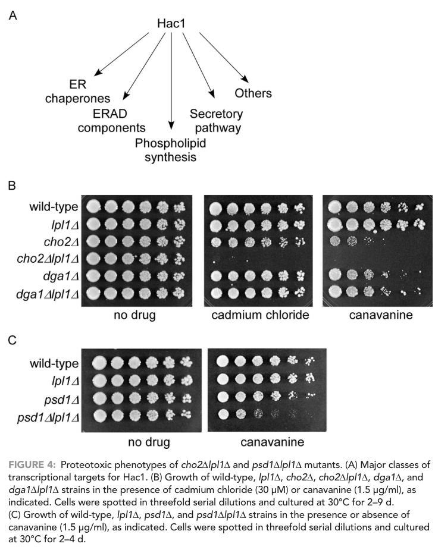

## Question

# Gene Research for Functional Annotation

## ⚠️ CRITICAL: Gene/Protein Identification Context

**BEFORE YOU BEGIN RESEARCH:** You MUST verify you are researching the CORRECT gene/protein. Gene symbols can be ambiguous, especially for less well-characterized genes from non-model organisms.

### Target Gene/Protein Identity (from UniProt):
- **UniProt Accession:** Q08448
- **Protein Description:** RecName: Full=Lipid droplet phospholipase 1 {ECO:0000303|PubMed:25014274}; EC=3.1.-.- {ECO:0000269|PubMed:25014274}; EC=3.1.1.4 {ECO:0000269|PubMed:25014274};
- **Gene Information:** Name=LPL1 {ECO:0000303|PubMed:25014274}; OrderedLocusNames=YOR059C; ORFNames=YOR29-10;
- **Organism (full):** Saccharomyces cerevisiae (strain ATCC 204508 / S288c) (Baker's yeast).
- **Protein Family:** Belongs to the putative lipase ROG1 family. .
- **Key Domains:** AB_hydrolase_fold. (IPR029058); DUF676_lipase-like. (IPR007751); Lipase-like. (IPR044294); DUF676 (PF05057)

### MANDATORY VERIFICATION STEPS:

1. **Check if the gene symbol "LPL1" matches the protein description above**
2. **Verify the organism is correct:** Saccharomyces cerevisiae (strain ATCC 204508 / S288c) (Baker's yeast).
3. **Check if protein family/domains align with what you find in literature**
4. **If you find literature for a DIFFERENT gene with the same or similar symbol, STOP**

### If Gene Symbol is Ambiguous or You Cannot Find Relevant Literature:

**DO NOT PROCEED WITH RESEARCH ON A DIFFERENT GENE.** Instead:
- State clearly: "The gene symbol 'LPL1' is ambiguous or literature is limited for this specific protein"
- Explain what you found (e.g., "Found extensive literature on a different gene with the same symbol in a different organism")
- Describe the protein based ONLY on the UniProt information provided above
- Suggest that the protein function can be inferred from domain/family information

### Research Target:

Please provide a comprehensive research report on the gene **LPL1** (gene ID: LPL1, UniProt: Q08448) in yeast.

The research report should be a detailed narrative explaining the function, biological processes, and localization of the gene product. Citations should be given for all claims.

You should prioritize authoritative reviews and primary scientific literature when conducting research. You can supplement
this with annotations you find in gene/protein databases, but these can be outdated or inaccurate.

We are specifically interested in the primary function of the gene - for enzymes, what reaction is catalyzed, and what is the substrate specificity? For transporters, what is the substrate? For structural proteins or adapters, what is the broader structural role? For signaling molecules, what is the role in the pathway.

We are interested in where in or outside the cell the gene product carries out its function.

We are also interested in the signaling or biochemical pathways in which the gene functions. We are less interested in broad pleiotropic effects, except where these elucidate the precise role.

Include evidence where possible. We are interested in both experimental evidence as well as inference from structure, evolution, or bioinformatic analysis. Precise studies should be prioritized over high-throughput, where available.

## Output

Question: You are an expert researcher providing comprehensive, well-cited information.

Provide detailed information focusing on:
1. Key concepts and definitions with current understanding
2. Recent developments and latest research (prioritize 2023-2024 sources)
3. Current applications and real-world implementations
4. Expert opinions and analysis from authoritative sources
5. Relevant statistics and data from recent studies

Format as a comprehensive research report with proper citations. Include URLs and publication dates where available.
Always prioritize recent, authoritative sources and provide specific citations for all major claims.

# Gene Research for Functional Annotation

## ⚠️ CRITICAL: Gene/Protein Identification Context

**BEFORE YOU BEGIN RESEARCH:** You MUST verify you are researching the CORRECT gene/protein. Gene symbols can be ambiguous, especially for less well-characterized genes from non-model organisms.

### Target Gene/Protein Identity (from UniProt):
- **UniProt Accession:** Q08448
- **Protein Description:** RecName: Full=Lipid droplet phospholipase 1 {ECO:0000303|PubMed:25014274}; EC=3.1.-.- {ECO:0000269|PubMed:25014274}; EC=3.1.1.4 {ECO:0000269|PubMed:25014274};
- **Gene Information:** Name=LPL1 {ECO:0000303|PubMed:25014274}; OrderedLocusNames=YOR059C; ORFNames=YOR29-10;
- **Organism (full):** Saccharomyces cerevisiae (strain ATCC 204508 / S288c) (Baker's yeast).
- **Protein Family:** Belongs to the putative lipase ROG1 family. .
- **Key Domains:** AB_hydrolase_fold. (IPR029058); DUF676_lipase-like. (IPR007751); Lipase-like. (IPR044294); DUF676 (PF05057)

### MANDATORY VERIFICATION STEPS:

1. **Check if the gene symbol "LPL1" matches the protein description above**
2. **Verify the organism is correct:** Saccharomyces cerevisiae (strain ATCC 204508 / S288c) (Baker's yeast).
3. **Check if protein family/domains align with what you find in literature**
4. **If you find literature for a DIFFERENT gene with the same or similar symbol, STOP**

### If Gene Symbol is Ambiguous or You Cannot Find Relevant Literature:

**DO NOT PROCEED WITH RESEARCH ON A DIFFERENT GENE.** Instead:
- State clearly: "The gene symbol 'LPL1' is ambiguous or literature is limited for this specific protein"
- Explain what you found (e.g., "Found extensive literature on a different gene with the same symbol in a different organism")
- Describe the protein based ONLY on the UniProt information provided above
- Suggest that the protein function can be inferred from domain/family information

### Research Target:

Please provide a comprehensive research report on the gene **LPL1** (gene ID: LPL1, UniProt: Q08448) in yeast.

The research report should be a detailed narrative explaining the function, biological processes, and localization of the gene product. Citations should be given for all claims.

You should prioritize authoritative reviews and primary scientific literature when conducting research. You can supplement
this with annotations you find in gene/protein databases, but these can be outdated or inaccurate.

We are specifically interested in the primary function of the gene - for enzymes, what reaction is catalyzed, and what is the substrate specificity? For transporters, what is the substrate? For structural proteins or adapters, what is the broader structural role? For signaling molecules, what is the role in the pathway.

We are interested in where in or outside the cell the gene product carries out its function.

We are also interested in the signaling or biochemical pathways in which the gene functions. We are less interested in broad pleiotropic effects, except where these elucidate the precise role.

Include evidence where possible. We are interested in both experimental evidence as well as inference from structure, evolution, or bioinformatic analysis. Precise studies should be prioritized over high-throughput, where available.

## Research report: Functional annotation of *Saccharomyces cerevisiae* **LPL1** (YOR059C; UniProt Q08448)

### 1) Target verification and disambiguation (critical)
The literature summarized here is explicitly for **budding yeast *Saccharomyces cerevisiae*** Lpl1 encoded by **LPL1/YOR059C** (UniProt **Q08448**), described in the primary paper as a **lipid-droplet phospholipase** and studied via *S. cerevisiae* genetics (e.g., **lpl1Δ**, **cho2Δ lpl1Δ**, **hac1Δ lpl1Δ**) and plasmid-borne **LPL1** expression constructs. (weisshaar2017phospholipaselpl1links pages 1-2, weisshaar2017phospholipaselpl1links pages 7-9, weisshaar2017phospholipaselpl1links pages 9-10)

This gene/protein is **not** mammalian **lipoprotein lipase (LPL)**, which is frequently abbreviated “LPL” in biomedical literature; any “LPL” papers in mammals are out-of-scope for yeast LPL1 functional annotation.

### 2) Key concepts and definitions (current understanding)

#### 2.1 Lipid droplets (LDs)
In yeast, lipid droplets are neutral-lipid storage organelles bounded by a **phospholipid monolayer** rather than a bilayer membrane; proteins acting at the LD surface can remodel the monolayer and influence droplet size, number, and fusion. In the referenced primary study, LD morphology was operationally classified as: **normal** (typically **5–10 small dispersed LDs per cell**), **intermediate** (**2–5 intermediate droplets**), and **supersized** (a **single dominant LD**, sometimes with 1–2 small droplets). (weisshaar2017phospholipaselpl1links pages 9-10)

#### 2.2 Phospholipase B activity (what “type B” implies)
Lpl1 is described as a **type B phospholipase** that cleaves phospholipids at both the **sn-1 and sn-2** positions. This deacylation releases **free fatty acids** while leaving the polar head group intact on the glycerophospholipid-derived backbone, consistent with a role in phospholipid breakdown at LD monolayers and fatty-acid recycling. (weisshaar2017phospholipaselpl1links pages 2-3, weisshaar2017phospholipaselpl1links pages 5-6, weisshaar2017phospholipaselpl1links pages 6-7)

### 3) Primary function: enzymatic activity, reaction, and substrate specificity

#### 3.1 Reaction catalyzed
The strongest direct functional claim supported by the included evidence is that yeast Lpl1 is a **phospholipase B** that **deacylates phospholipids at sn-1 and sn-2**, thereby **liberating free fatty acids**. (weisshaar2017phospholipaselpl1links pages 2-3)

Although the extracted evidence does not provide kinetic constants (e.g., Km/kcat), the qualitative reaction chemistry is explicitly tied to LD surface phospholipids and the physiological possibility of **reusing liberated fatty acids** for **phospholipid synthesis**, **β-oxidation**, and/or **protein lipidation**. (weisshaar2017phospholipaselpl1links pages 6-7)

#### 3.2 Substrate specificity (in vitro)
In vitro, Lpl1 is reported to have **relatively broad** activity across major phospholipid classes, with activity on:
- **phosphatidylethanolamine (PE)**
- **phosphatidylcholine (PC)**
- **phosphatidylserine (PS)**

and **much lower activity** against **phosphatidylinositol (PI)**. (weisshaar2017phospholipaselpl1links pages 2-3)

### 4) Subcellular localization and where the enzyme acts
Lpl1 is described as a **lipid droplet phospholipase**, and its functional role is interpreted as acting on the **LD phospholipid monolayer** (i.e., “Lpl1 appears to break down these phospholipids” in the context of LD monolayer composition and LD dynamics). (weisshaar2017phospholipaselpl1links pages 1-2, weisshaar2017phospholipaselpl1links pages 6-7)

The paper’s central LD phenotypes are measured by **BODIPY 493/503 staining** and microscopy-based LD scoring, supporting an LD-linked function even where direct Lpl1 fluorescent colocalization is not shown in the extracted text snippets. (weisshaar2017phospholipaselpl1links pages 9-10)

### 5) Biological roles, pathways, and phenotypes

#### 5.1 LD size control and droplet “supersizing” in a phospholipid biosynthesis mutant background
A major functional context used to reveal Lpl1’s LD role is the **cho2Δ** background (defective in phosphatidylcholine biosynthesis). In this setting:
- Wild-type cells typically show **5–10 LDs per cell** (normal phenotype). (weisshaar2017phospholipaselpl1links pages 4-5)
- **cho2Δ** mutants can form **“supersized” LDs**, reported as up to **~50× the volume** of wild-type droplets. (weisshaar2017phospholipaselpl1links pages 4-5)
- **lpl1Δ** alone resembles wild type in LD appearance, but **cho2Δ lpl1Δ** reduces the frequency of the single dominant supersized droplet and shifts toward an **intermediate** phenotype (more numerous, smaller droplets than cho2Δ). (weisshaar2017phospholipaselpl1links pages 4-5, weisshaar2017phospholipaselpl1links pages 5-6, weisshaar2017phospholipaselpl1links pages 7-9)

Quantitatively, LD morphology scoring was performed by counting **600 cells per strain** (in 100-cell groups), and the differences were statistically significant (**Student’s t-test p < 0.001**). (weisshaar2017phospholipaselpl1links pages 5-6, weisshaar2017phospholipaselpl1links pages 7-9)

These data support the interpretation that Lpl1 contributes to **LD remodeling** and is required for **full supersized-LD formation/maintenance** under conditions of perturbed phospholipid metabolism. (weisshaar2017phospholipaselpl1links pages 4-5, weisshaar2017phospholipaselpl1links pages 6-7)

#### 5.2 Regulation by proteotoxic stress and the Rpn4 pathway
Lpl1 is reported as an “unexpected” target of the **Rpn4 proteotoxic stress response**, with transcriptional induction under proteotoxic conditions and a **canonical PACE motif** in its promoter. (weisshaar2017phospholipaselpl1links pages 1-2, weisshaar2017phospholipaselpl1links pages 2-3)

Experimentally, the study highlights induction by **sodium arsenite (1 mM)** with timepoints at **0, 1, and 4 h**, and notes that **Rpn4 levels rise ~20-fold** under these conditions. (weisshaar2017phospholipaselpl1links pages 2-3)

#### 5.3 Link to protein quality control and proteasome-mediated degradation
Beyond lipid metabolism, Lpl1 is reported to be required for **efficient proteasome-mediated protein degradation** and to connect LD regulation to protein quality control pathways. Loss of Lpl1 leads to “multiple proteolytic defects” (as summarized in the extracted evidence) and shows synthetic interactions with unfolded protein response (UPR) components. (weisshaar2017phospholipaselpl1links pages 1-2)

A specific genetic interaction described is that a **hac1Δ lpl1Δ** mutant exhibits increased **eIF2α Ser51 phosphorylation**, consistent with heightened stress signaling when both UPR transcriptional output (Hac1) and Lpl1-dependent processes are compromised. (weisshaar2017phospholipaselpl1links pages 4-5)

Notably, the extracted evidence indicates **no increased HAC1 splicing** in **lpl1Δ** alone and no upregulation of the UPR target **Kar2** at the protein level in that context, suggesting Lpl1 loss does not simply trigger canonical UPR activation by itself. (weisshaar2017phospholipaselpl1links pages 2-3)

#### 5.4 Stress sensitivities (proteotoxic agents)
The **cho2Δ lpl1Δ** double mutant is reported to show strong sensitivity to proteotoxic stressors, with spot-test conditions including:
- **canavanine** (reported conditions include **1.5 µg/mL** and also **0.5 µg/mL** in different assay descriptions)
- **cadmium chloride (CdCl2)** (**30 µM**)

These phenotypes support a model in which Lpl1-dependent lipid remodeling contributes to the cellular capacity to tolerate proteotoxic stress. (weisshaar2017phospholipaselpl1links pages 4-5, weisshaar2017phospholipaselpl1links pages 7-9, weisshaar2017phospholipaselpl1links media 953f762a)

### 6) Recent developments (2023–2024) and latest research: status and limitations
Within the evidence successfully retrieved and analyzed here, the **most directly informative, experimentally grounded** Lpl1 functional study remains the **2017** primary research article. (weisshaar2017phospholipaselpl1links pages 1-2)

A targeted search for **2023–2024** sources explicitly focusing on **yeast Lpl1 (YOR059C/Q08448)** did not yield additional directly relevant full-text evidence in the current retrieval set, indicating that **recent Lpl1-specific literature may be limited or not captured by the present tool retrieval**. Therefore, claims about Lpl1’s function in this report are anchored in the primary experimental evidence above, and broader 2023–2024 lipid droplet reviews were not cited because no extractable, Lpl1-specific evidence from them was available in-context.

### 7) Current applications and real-world implementations
Lpl1 is primarily used as a **model LD-surface phospholipase** to understand how **phospholipid remodeling** intersects with **organelle morphology** and **proteostasis** in eukaryotic cells, leveraging yeast genetics and microscopy-based LD phenotyping. The clearest “implementation” in the included evidence is its use as a genetic node linking:
- phospholipid metabolism (e.g., **CHO2**-dependent PC synthesis)
- lipid droplet size regulation
- proteotoxic stress tolerance and proteasome function

This positioning makes LPL1 a potentially informative perturbation in **systems biology** studies of stress–lipid homeostasis coupling, although no industrial or clinical applications are demonstrated in the retrieved evidence. (weisshaar2017phospholipaselpl1links pages 1-2, weisshaar2017phospholipaselpl1links pages 4-5)

### 8) Expert interpretation / analysis (from authoritative primary source)
The primary study supports a mechanistic interpretation where Lpl1-mediated deacylation at the LD monolayer generates **free fatty acids** that can be rerouted into lipid metabolic demands during stress (e.g., membrane phospholipid synthesis) and that LD remodeling is integrated into proteotoxic stress responses governed by **Rpn4** (proteasome homeostasis) and intersecting with UPR signaling. (weisshaar2017phospholipaselpl1links pages 1-2, weisshaar2017phospholipaselpl1links pages 2-3, weisshaar2017phospholipaselpl1links pages 6-7)

### 9) Key data visualization (from primary literature)
The following figure evidence supports central phenotypes described above:
- LD morphology classes and the shift from supersized LDs in **cho2Δ** toward intermediate LDs in **cho2Δ lpl1Δ**, with representative images and quantitation (Figure 5). (weisshaar2017phospholipaselpl1links media 8924581e)
- Proteotoxic stress growth assays comparing **cho2Δ** vs **cho2Δ lpl1Δ** under canavanine/CdCl2 conditions (Figure 4B). (weisshaar2017phospholipaselpl1links media 953f762a)

### 10) Structured summary artifact
The table below consolidates the strongest evidence-backed annotation points from the retrieved primary source.

| Evidence-backed claim | Experimental basis/assay | Key quantitative details | Primary source (with year/DOI/URL) |
|---|---|---|---|
| **Target identity verified:** the gene is **yeast LPL1 / YOR059C / UniProt Q08448**, a **lipid-droplet phospholipase**, not mammalian lipoprotein lipase (LPL) | Primary literature on *S. cerevisiae* explicitly names Lpl1 as a lipid-droplet phospholipase and studies deletion/overexpression phenotypes in yeast genetic backgrounds | Organism-specific evidence is for *Saccharomyces cerevisiae*; paper analyzes **lpl1Δ**, **cho2Δ lpl1Δ**, **hac1Δ lpl1Δ**, and plasmid-borne **LPL1** constructs (weisshaar2017phospholipaselpl1links pages 1-2, weisshaar2017phospholipaselpl1links pages 7-9, weisshaar2017phospholipaselpl1links pages 9-10) | Weisshaar et al., **2017**. *Mol Biol Cell* 28:716-725. DOI: 10.1091/mbc.e16-10-0717. URL: https://doi.org/10.1091/mbc.e16-10-0717 (weisshaar2017phospholipaselpl1links pages 1-2, weisshaar2017phospholipaselpl1links pages 7-9, weisshaar2017phospholipaselpl1links pages 9-10) |
| **Lpl1 is a type B phospholipase** that cleaves phospholipids at both **sn-1 and sn-2** positions | In vitro enzymatic characterization summarized in the paper; authors describe Lpl1 as a phospholipase B and connect released fatty acids to downstream physiology | Reaction described as cleavage at **sn-1 and sn-2**; exact kinetic constants are not provided in the extracted evidence (weisshaar2017phospholipaselpl1links pages 2-3, weisshaar2017phospholipaselpl1links pages 5-6) | Weisshaar et al., **2017**. DOI: 10.1091/mbc.e16-10-0717. URL: https://doi.org/10.1091/mbc.e16-10-0717 (weisshaar2017phospholipaselpl1links pages 2-3, weisshaar2017phospholipaselpl1links pages 5-6) |
| **Substrate specificity is broad**, with activity toward **phosphatidylethanolamine (PE), phosphatidylcholine (PC), and phosphatidylserine (PS)**, and much lower activity toward **phosphatidylinositol (PI)** | In vitro substrate specificity assays summarized in the paper | Qualitative ranking: **PE/PC/PS active; PI much lower**; no kinetic parameters reported in extracted evidence (weisshaar2017phospholipaselpl1links pages 2-3) | Weisshaar et al., **2017**. DOI: 10.1091/mbc.e16-10-0717. URL: https://doi.org/10.1091/mbc.e16-10-0717 (weisshaar2017phospholipaselpl1links pages 2-3) |
| Lpl1 catalysis **releases free fatty acids while retaining the polar head group**, consistent with phospholipid deacylation on the lipid-droplet monolayer | Biochemical interpretation in the paper linked to LD phenotypes and phospholipid breakdown | Product detail explicitly notes **free fatty acids liberated by Lpl1**; no absolute product yields reported in extracted evidence (weisshaar2017phospholipaselpl1links pages 2-3, weisshaar2017phospholipaselpl1links pages 5-6, weisshaar2017phospholipaselpl1links pages 6-7) | Weisshaar et al., **2017**. DOI: 10.1091/mbc.e16-10-0717. URL: https://doi.org/10.1091/mbc.e16-10-0717 (weisshaar2017phospholipaselpl1links pages 2-3, weisshaar2017phospholipaselpl1links pages 5-6, weisshaar2017phospholipaselpl1links pages 6-7) |
| **Subcellular localization:** Lpl1 is a **lipid-droplet-localized** phospholipase and appears to act on the **phospholipid monolayer** surrounding LDs | Prior localization evidence integrated with LD morphology analysis; microscopy-based LD phenotype work supports function at LDs | LDs are categorized as **normal = 5-10 small dispersed droplets/cell**, **intermediate = 2-5 intermediate droplets**, **supersized = one dominant droplet ± 1-2 small droplets** (weisshaar2017phospholipaselpl1links pages 1-2, weisshaar2017phospholipaselpl1links pages 6-7, weisshaar2017phospholipaselpl1links pages 9-10, weisshaar2017phospholipaselpl1links media 8924581e) | Weisshaar et al., **2017**. DOI: 10.1091/mbc.e16-10-0717. URL: https://doi.org/10.1091/mbc.e16-10-0717 (weisshaar2017phospholipaselpl1links pages 1-2, weisshaar2017phospholipaselpl1links pages 6-7, weisshaar2017phospholipaselpl1links pages 9-10, weisshaar2017phospholipaselpl1links media 8924581e) |
| **LPL1 is induced by proteotoxic stress and regulated by Rpn4** | Stress-response/proteomic and promoter-regulation analyses summarized in the paper | **Sodium arsenite 1 mM** used; protein measured at **0, 1, and 4 h**; Rpn4 levels reported to rise by about **20-fold** under these conditions; LPL1 promoter contains a canonical **PACE** motif (weisshaar2017phospholipaselpl1links pages 2-3) | Weisshaar et al., **2017**. DOI: 10.1091/mbc.e16-10-0717. URL: https://doi.org/10.1091/mbc.e16-10-0717 (weisshaar2017phospholipaselpl1links pages 2-3) |
| Lpl1 links **lipid-droplet biology to proteasome-mediated protein quality control** | Genetic interaction and protein-degradation assays in stress/proteostasis backgrounds | Loss of Lpl1 causes **multiple proteolytic defects** and interacts genetically with **HAC1/UPR** components; exact degradation-rate constants are not provided in extracted evidence (weisshaar2017phospholipaselpl1links pages 1-2, weisshaar2017phospholipaselpl1links pages 7-9, weisshaar2017phospholipaselpl1links pages 9-10) | Weisshaar et al., **2017**. DOI: 10.1091/mbc.e16-10-0717. URL: https://doi.org/10.1091/mbc.e16-10-0717 (weisshaar2017phospholipaselpl1links pages 1-2, weisshaar2017phospholipaselpl1links pages 7-9, weisshaar2017phospholipaselpl1links pages 9-10) |
| In a **cho2Δ** background, **Lpl1 is required for full supersized-LD formation/maintenance** | BODIPY 493/503 fluorescence microscopy with categorical LD scoring | Wild type usually has **5-10 LDs/cell**; **cho2Δ** can form supersized droplets up to about **50× wild-type volume**; **cho2Δ lpl1Δ** shifts from supersized toward an **intermediate** phenotype; **600 cells per strain** counted; **p < 0.001** by Student's *t* test (weisshaar2017phospholipaselpl1links pages 4-5, weisshaar2017phospholipaselpl1links pages 5-6, weisshaar2017phospholipaselpl1links pages 7-9, weisshaar2017phospholipaselpl1links pages 9-10, weisshaar2017phospholipaselpl1links media 8924581e) | Weisshaar et al., **2017**. DOI: 10.1091/mbc.e16-10-0717. URL: https://doi.org/10.1091/mbc.e16-10-0717 (weisshaar2017phospholipaselpl1links pages 4-5, weisshaar2017phospholipaselpl1links pages 5-6, weisshaar2017phospholipaselpl1links pages 7-9, weisshaar2017phospholipaselpl1links pages 9-10, weisshaar2017phospholipaselpl1links media 8924581e) |
| **Overexpressing LPL1 in wild type increases LD size**, supporting a direct role in LD remodeling | Overexpression analysis summarized in the paper | Qualitative increase in LD size reported; no extracted fold-change value provided (weisshaar2017phospholipaselpl1links pages 6-7) | Weisshaar et al., **2017**. DOI: 10.1091/mbc.e16-10-0717. URL: https://doi.org/10.1091/mbc.e16-10-0717 (weisshaar2017phospholipaselpl1links pages 6-7) |
| **cho2Δ lpl1Δ** cells show enhanced **proteotoxic stress sensitivity** | Spot-growth assays under proteotoxic conditions | Reported assay conditions include **canavanine 1.5 µg/ml** and **CdCl2 30 µM**; another spot-test condition notes **canavanine 0.5 µg/ml**, **30°C for 2-4 d** depending on assay format (weisshaar2017phospholipaselpl1links pages 4-5, weisshaar2017phospholipaselpl1links pages 5-6, weisshaar2017phospholipaselpl1links pages 7-9, weisshaar2017phospholipaselpl1links media 953f762a) | Weisshaar et al., **2017**. DOI: 10.1091/mbc.e16-10-0717. URL: https://doi.org/10.1091/mbc.e16-10-0717 (weisshaar2017phospholipaselpl1links pages 4-5, weisshaar2017phospholipaselpl1links pages 5-6, weisshaar2017phospholipaselpl1links pages 7-9, weisshaar2017phospholipaselpl1links media 953f762a) |
| **UPR interaction:** Lpl1 is not required for basal HAC1 splicing increase, but **hac1Δ lpl1Δ** shows stronger stress-signaling defects | Genetic interaction with UPR pathway; immunoblot/readouts of stress signaling | **No increased HAC1 splicing** detected in **lpl1Δ** alone; **Kar2** not upregulated at the protein level; **hac1Δ lpl1Δ** shows increased **eIF2α Ser51 phosphorylation** (weisshaar2017phospholipaselpl1links pages 2-3, weisshaar2017phospholipaselpl1links pages 4-5) | Weisshaar et al., **2017**. DOI: 10.1091/mbc.e16-10-0717. URL: https://doi.org/10.1091/mbc.e16-10-0717 (weisshaar2017phospholipaselpl1links pages 2-3, weisshaar2017phospholipaselpl1links pages 4-5) |

*Table: This table summarizes the strongest evidence-backed functional annotation points for Saccharomyces cerevisiae Lpl1 (LPL1/YOR059C; UniProt Q08448). It is useful for distinguishing verified claims about enzymatic activity, localization, regulation, and phenotype from broader lipid-droplet background literature.*

### References (from retrieved evidence; publication date and URLs)
1. Weisshaar N, Welsch H, Guerra-Moreno A, Hanna J. **Phospholipase Lpl1 links lipid droplet function with quality control protein degradation.** *Molecular Biology of the Cell.* **2017-03**;28:716–725. DOI: 10.1091/mbc.e16-10-0717. URL: https://doi.org/10.1091/mbc.e16-10-0717 (weisshaar2017phospholipaselpl1links pages 1-2)

References

1. (weisshaar2017phospholipaselpl1links pages 1-2): Nina Weisshaar, Hendrik Welsch, Angel Guerra-Moreno, and John Hanna. Phospholipase lpl1 links lipid droplet function with quality control protein degradation. Molecular Biology of the Cell, 28:716-725, Mar 2017. URL: https://doi.org/10.1091/mbc.e16-10-0717, doi:10.1091/mbc.e16-10-0717. This article has 26 citations and is from a domain leading peer-reviewed journal.

2. (weisshaar2017phospholipaselpl1links pages 7-9): Nina Weisshaar, Hendrik Welsch, Angel Guerra-Moreno, and John Hanna. Phospholipase lpl1 links lipid droplet function with quality control protein degradation. Molecular Biology of the Cell, 28:716-725, Mar 2017. URL: https://doi.org/10.1091/mbc.e16-10-0717, doi:10.1091/mbc.e16-10-0717. This article has 26 citations and is from a domain leading peer-reviewed journal.

3. (weisshaar2017phospholipaselpl1links pages 9-10): Nina Weisshaar, Hendrik Welsch, Angel Guerra-Moreno, and John Hanna. Phospholipase lpl1 links lipid droplet function with quality control protein degradation. Molecular Biology of the Cell, 28:716-725, Mar 2017. URL: https://doi.org/10.1091/mbc.e16-10-0717, doi:10.1091/mbc.e16-10-0717. This article has 26 citations and is from a domain leading peer-reviewed journal.

4. (weisshaar2017phospholipaselpl1links pages 2-3): Nina Weisshaar, Hendrik Welsch, Angel Guerra-Moreno, and John Hanna. Phospholipase lpl1 links lipid droplet function with quality control protein degradation. Molecular Biology of the Cell, 28:716-725, Mar 2017. URL: https://doi.org/10.1091/mbc.e16-10-0717, doi:10.1091/mbc.e16-10-0717. This article has 26 citations and is from a domain leading peer-reviewed journal.

5. (weisshaar2017phospholipaselpl1links pages 5-6): Nina Weisshaar, Hendrik Welsch, Angel Guerra-Moreno, and John Hanna. Phospholipase lpl1 links lipid droplet function with quality control protein degradation. Molecular Biology of the Cell, 28:716-725, Mar 2017. URL: https://doi.org/10.1091/mbc.e16-10-0717, doi:10.1091/mbc.e16-10-0717. This article has 26 citations and is from a domain leading peer-reviewed journal.

6. (weisshaar2017phospholipaselpl1links pages 6-7): Nina Weisshaar, Hendrik Welsch, Angel Guerra-Moreno, and John Hanna. Phospholipase lpl1 links lipid droplet function with quality control protein degradation. Molecular Biology of the Cell, 28:716-725, Mar 2017. URL: https://doi.org/10.1091/mbc.e16-10-0717, doi:10.1091/mbc.e16-10-0717. This article has 26 citations and is from a domain leading peer-reviewed journal.

7. (weisshaar2017phospholipaselpl1links pages 4-5): Nina Weisshaar, Hendrik Welsch, Angel Guerra-Moreno, and John Hanna. Phospholipase lpl1 links lipid droplet function with quality control protein degradation. Molecular Biology of the Cell, 28:716-725, Mar 2017. URL: https://doi.org/10.1091/mbc.e16-10-0717, doi:10.1091/mbc.e16-10-0717. This article has 26 citations and is from a domain leading peer-reviewed journal.

8. (weisshaar2017phospholipaselpl1links media 953f762a): Nina Weisshaar, Hendrik Welsch, Angel Guerra-Moreno, and John Hanna. Phospholipase lpl1 links lipid droplet function with quality control protein degradation. Molecular Biology of the Cell, 28:716-725, Mar 2017. URL: https://doi.org/10.1091/mbc.e16-10-0717, doi:10.1091/mbc.e16-10-0717. This article has 26 citations and is from a domain leading peer-reviewed journal.

9. (weisshaar2017phospholipaselpl1links media 8924581e): Nina Weisshaar, Hendrik Welsch, Angel Guerra-Moreno, and John Hanna. Phospholipase lpl1 links lipid droplet function with quality control protein degradation. Molecular Biology of the Cell, 28:716-725, Mar 2017. URL: https://doi.org/10.1091/mbc.e16-10-0717, doi:10.1091/mbc.e16-10-0717. This article has 26 citations and is from a domain leading peer-reviewed journal.

## Artifacts

- [Edison artifact artifact-00](LPL1-deep-research-falcon_artifacts/artifact-00.md)

## Citations

1. https://doi.org/10.1091/mbc.e16-10-0717
2. https://doi.org/10.1091/mbc.e16-10-0717,