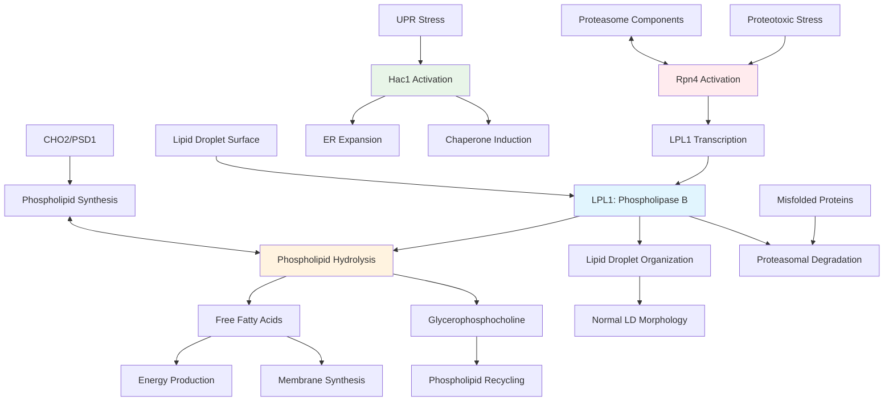

# Pathway Summary for LPL1

## Overview
LPL1 encodes a lipid droplet-localized phospholipase B that serves dual functions in cellular homeostasis: lipid droplet organization through phospholipid catabolism and protein quality control during proteotoxic stress [PMID:25014274, PMID:28100635]. The enzyme catalyzes the hydrolysis of glycerophospholipids at both sn-1 and sn-2 positions, releasing fatty acids that can be recycled for membrane synthesis or energy production. LPL1 represents a unique molecular link between lipid metabolism and proteostasis, being induced by the Rpn4 transcription factor as part of the proteotoxic stress response while maintaining constitutive roles in lipid droplet homeostasis.

## Lipid Droplet Organization and Homeostasis Pathway

LPL1 functions as a central regulator of lipid droplet (LD) organization through its phospholipase B activity. The enzyme specifically localizes to the phospholipid monolayer surrounding lipid droplets, where it hydrolyzes glycerophospholipids including phosphatidylethanolamine, phosphatidylcholine, phosphatidylserine, phosphatidic acid, and phosphatidylglycerol [PMID:25014274].

The phospholipase B activity of LPL1 proceeds through sequential cleavage, primarily attacking the sn-2 position first, followed by the sn-1 position. This dual specificity distinguishes LPL1 from other lipases and enables complete deacylation of phospholipids to glycerophosphocholine and free fatty acids. The released fatty acids can be utilized for energy production during stationary phase or recycled into new phospholipid synthesis pathways.

Loss of LPL1 function results in dramatically altered lipid droplet morphology, with cells forming enlarged, irregular lipid droplets due to impaired phospholipid turnover [PMID:25014274]. This phenotype demonstrates LPL1's essential role in maintaining proper lipid droplet surface composition and preventing aberrant droplet fusion or coalescence.

## Rpn4-Mediated Proteotoxic Stress Response Pathway

LPL1 participates in a specialized stress response pathway regulated by the Rpn4 transcription factor. Under proteotoxic stress conditions (such as arsenite exposure or protein misfolding), Rpn4 binds to a canonical PACE element in the LPL1 promoter, inducing strong upregulation of LPL1 expression [PMID:28100635]. This places LPL1 within the same regulatory network as proteasome subunits and other proteostasis factors.

The integration of LPL1 into the Rpn4 regulon represents a novel mechanism linking lipid metabolism to protein quality control. When cells experience proteotoxic stress, the coordinated induction of proteasome components and LPL1 suggests that lipid droplet remodeling is an integral part of the stress response. LPL1-generated fatty acids may provide energy for stress recovery processes or supply building blocks for membrane expansion during endoplasmic reticulum stress responses.

## Phospholipid Synthesis-Catabolism Balance

LPL1 functions within a critical regulatory network that balances phospholipid synthesis and catabolism. Genetic interaction studies reveal synthetic lethality between LPL1 deletion and mutations in phospholipid synthesis genes such as CHO2 (phosphatidylethanolamine methyltransferase) and PSD1 (phosphatidylserine decarboxylase) [PMID:28100635].

This genetic relationship demonstrates that LPL1-mediated phospholipid catabolism normally compensates for deficiencies in phospholipid synthesis. When both synthesis and catabolism pathways are compromised, cells cannot maintain proper membrane phospholipid homeostasis, leading to severe growth defects and stress sensitivity.

## Unfolded Protein Response Integration

LPL1 shows remarkable functional interaction with the Unfolded Protein Response (UPR) pathway mediated by the Hac1 transcription factor. While single deletions of either LPL1 or HAC1 show minimal stress sensitivity, the double mutant (hac1Δ lpl1Δ) exhibits severe proteotoxic stress sensitivity and dramatically impaired proteasomal protein degradation [PMID:28100635].

This synthetic interaction reveals that the Rpn4 and Hac1 pathways represent parallel arms of the proteostasis network. While the UPR focuses on expanding ER capacity and enhancing protein folding, the Rpn4 pathway (including LPL1) emphasizes protein degradation and lipid metabolism. The convergence of these pathways on lipid metabolism suggests that membrane remodeling is fundamental to proteotoxic stress management.

## Pathway Diagram

## Stationary Phase and Growth-Dependent Regulation

LPL1 expression and localization are tightly regulated by growth phase and cellular metabolic state. The protein shows peak expression and lipid droplet localization during stationary phase, when cells accumulate storage lipids and require mechanisms for lipid mobilization [PMID:25014274].

This growth phase-dependent regulation connects LPL1 to broader metabolic regulatory networks that control the transition between anabolic and catabolic metabolism. During exponential growth, when cells are actively synthesizing biomass, LPL1 levels remain low. As cells enter stationary phase and begin mobilizing stored lipids, LPL1 accumulates at lipid droplets to facilitate phospholipid turnover and fatty acid release.

## Cross-Talk with Other Lipid Droplet Enzymes

LPL1 functions within a network of lipid droplet-associated enzymes that collectively regulate lipid storage and mobilization. This includes triacylglycerol lipases (Tgl4, Tgl5), steryl ester hydrolases (Ldh1, Ldh2), and the related monoacylglycerol lipase Rog1. While these enzymes target different lipid substrates, they coordinate to maintain lipid droplet homeostasis and provide fatty acids for cellular needs.

The substrate specificity of LPL1 for phospholipids distinguishes it from other lipid droplet lipases and ensures comprehensive lipid mobilization. By targeting the phospholipid monolayer surrounding lipid droplets, LPL1 can influence droplet surface properties and facilitate access by other lipases to internal neutral lipid stores.

## Functional Consequences and Cellular Impact

LPL1's dual roles create a sophisticated regulatory system that coordinates lipid metabolism with protein quality control. Under normal conditions, LPL1 maintains lipid droplet homeostasis and provides a source of fatty acids for membrane turnover. During stress conditions, the Rpn4-mediated induction of LPL1 enhances both proteasomal capacity and lipid mobilization.

The synthetic interaction between LPL1 and UPR components suggests that efficient proteostasis requires coordination between protein folding (ER-based) and protein degradation (cytoplasmic/nuclear) systems, with lipid metabolism serving as a critical integration point. This coordination ensures that cells can simultaneously manage protein stress and maintain membrane integrity.

## Research and Biotechnological Significance

LPL1 represents a paradigm for understanding how metabolic enzymes can be co-opted into stress response pathways. The connection between lipid droplet organization and proteostasis has implications for understanding cellular aging, where both lipid metabolism and protein quality control decline.

In biotechnology applications, LPL1 function could be modulated to enhance stress tolerance in industrial yeast strains or to optimize lipid production by controlling droplet organization and turnover. The enzyme's broad substrate specificity also makes it a useful model for understanding phospholipase B evolution and engineering novel lipolytic activities.