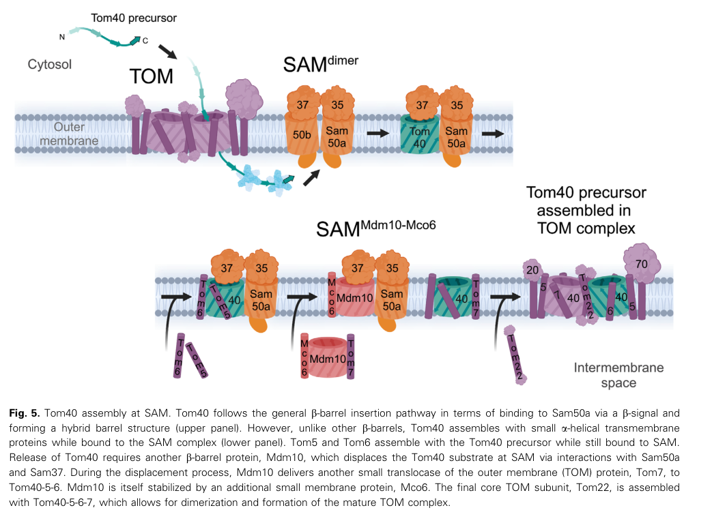

## Question

# Gene Research for Functional Annotation

## ⚠️ CRITICAL: Gene/Protein Identification Context

**BEFORE YOU BEGIN RESEARCH:** You MUST verify you are researching the CORRECT gene/protein. Gene symbols can be ambiguous, especially for less well-characterized genes from non-model organisms.

### Target Gene/Protein Identity (from UniProt):
- **UniProt Accession:** P18409
- **Protein Description:** RecName: Full=Mitochondrial distribution and morphology protein 10 {ECO:0000255|HAMAP-Rule:MF_03102}; AltName: Full=Mitochondrial inheritance component MDM10 {ECO:0000255|HAMAP-Rule:MF_03102};
- **Gene Information:** Name=MDM10 {ECO:0000255|HAMAP-Rule:MF_03102}; OrderedLocusNames=YAL010C; ORFNames=FUN37;
- **Organism (full):** Saccharomyces cerevisiae (strain ATCC 204508 / S288c) (Baker's yeast).
- **Protein Family:** Belongs to the MDM10 family. {ECO:0000255|HAMAP-
- **Key Domains:** Mdm10. (IPR027539); MDM10 (PF12519)

### MANDATORY VERIFICATION STEPS:

1. **Check if the gene symbol "MDM10" matches the protein description above**
2. **Verify the organism is correct:** Saccharomyces cerevisiae (strain ATCC 204508 / S288c) (Baker's yeast).
3. **Check if protein family/domains align with what you find in literature**
4. **If you find literature for a DIFFERENT gene with the same or similar symbol, STOP**

### If Gene Symbol is Ambiguous or You Cannot Find Relevant Literature:

**DO NOT PROCEED WITH RESEARCH ON A DIFFERENT GENE.** Instead:
- State clearly: "The gene symbol 'MDM10' is ambiguous or literature is limited for this specific protein"
- Explain what you found (e.g., "Found extensive literature on a different gene with the same symbol in a different organism")
- Describe the protein based ONLY on the UniProt information provided above
- Suggest that the protein function can be inferred from domain/family information

### Research Target:

Please provide a comprehensive research report on the gene **MDM10** (gene ID: MDM10, UniProt: P18409) in yeast.

The research report should be a detailed narrative explaining the function, biological processes, and localization of the gene product. Citations should be given for all claims.

You should prioritize authoritative reviews and primary scientific literature when conducting research. You can supplement
this with annotations you find in gene/protein databases, but these can be outdated or inaccurate.

We are specifically interested in the primary function of the gene - for enzymes, what reaction is catalyzed, and what is the substrate specificity? For transporters, what is the substrate? For structural proteins or adapters, what is the broader structural role? For signaling molecules, what is the role in the pathway.

We are interested in where in or outside the cell the gene product carries out its function.

We are also interested in the signaling or biochemical pathways in which the gene functions. We are less interested in broad pleiotropic effects, except where these elucidate the precise role.

Include evidence where possible. We are interested in both experimental evidence as well as inference from structure, evolution, or bioinformatic analysis. Precise studies should be prioritized over high-throughput, where available.

## Output

Question: You are an expert researcher providing comprehensive, well-cited information.

Provide detailed information focusing on:
1. Key concepts and definitions with current understanding
2. Recent developments and latest research (prioritize 2023-2024 sources)
3. Current applications and real-world implementations
4. Expert opinions and analysis from authoritative sources
5. Relevant statistics and data from recent studies

Format as a comprehensive research report with proper citations. Include URLs and publication dates where available.
Always prioritize recent, authoritative sources and provide specific citations for all major claims.

# Gene Research for Functional Annotation

## ⚠️ CRITICAL: Gene/Protein Identification Context

**BEFORE YOU BEGIN RESEARCH:** You MUST verify you are researching the CORRECT gene/protein. Gene symbols can be ambiguous, especially for less well-characterized genes from non-model organisms.

### Target Gene/Protein Identity (from UniProt):
- **UniProt Accession:** P18409
- **Protein Description:** RecName: Full=Mitochondrial distribution and morphology protein 10 {ECO:0000255|HAMAP-Rule:MF_03102}; AltName: Full=Mitochondrial inheritance component MDM10 {ECO:0000255|HAMAP-Rule:MF_03102};
- **Gene Information:** Name=MDM10 {ECO:0000255|HAMAP-Rule:MF_03102}; OrderedLocusNames=YAL010C; ORFNames=FUN37;
- **Organism (full):** Saccharomyces cerevisiae (strain ATCC 204508 / S288c) (Baker's yeast).
- **Protein Family:** Belongs to the MDM10 family. {ECO:0000255|HAMAP-
- **Key Domains:** Mdm10. (IPR027539); MDM10 (PF12519)

### MANDATORY VERIFICATION STEPS:

1. **Check if the gene symbol "MDM10" matches the protein description above**
2. **Verify the organism is correct:** Saccharomyces cerevisiae (strain ATCC 204508 / S288c) (Baker's yeast).
3. **Check if protein family/domains align with what you find in literature**
4. **If you find literature for a DIFFERENT gene with the same or similar symbol, STOP**

### If Gene Symbol is Ambiguous or You Cannot Find Relevant Literature:

**DO NOT PROCEED WITH RESEARCH ON A DIFFERENT GENE.** Instead:
- State clearly: "The gene symbol 'MDM10' is ambiguous or literature is limited for this specific protein"
- Explain what you found (e.g., "Found extensive literature on a different gene with the same symbol in a different organism")
- Describe the protein based ONLY on the UniProt information provided above
- Suggest that the protein function can be inferred from domain/family information

### Research Target:

Please provide a comprehensive research report on the gene **MDM10** (gene ID: MDM10, UniProt: P18409) in yeast.

The research report should be a detailed narrative explaining the function, biological processes, and localization of the gene product. Citations should be given for all claims.

You should prioritize authoritative reviews and primary scientific literature when conducting research. You can supplement
this with annotations you find in gene/protein databases, but these can be outdated or inaccurate.

We are specifically interested in the primary function of the gene - for enzymes, what reaction is catalyzed, and what is the substrate specificity? For transporters, what is the substrate? For structural proteins or adapters, what is the broader structural role? For signaling molecules, what is the role in the pathway.

We are interested in where in or outside the cell the gene product carries out its function.

We are also interested in the signaling or biochemical pathways in which the gene functions. We are less interested in broad pleiotropic effects, except where these elucidate the precise role.

Include evidence where possible. We are interested in both experimental evidence as well as inference from structure, evolution, or bioinformatic analysis. Precise studies should be prioritized over high-throughput, where available.

# Functional annotation report: yeast MDM10 (UniProt P18409)

## Identity and principal function

**Identity check.** The specified target is *Saccharomyces cerevisiae* S288c **MDM10**, also designated **YAL010C/FUN37** in the UniProt information supplied with the question. The yeast studies examined here independently identify Mdm10 as a mitochondrial outer-membrane protein involved in mitochondrial distribution and morphology; structural work identifies it as a **19-stranded β-barrel**, consistent with the supplied Mdm10 family/domain annotations. The accession-to-locus mapping is from the supplied UniProt record, not an independently reported accession in those studies. Mdm10 must not be confused with the separate ERMES proteins Mdm12 and Mdm34, or the inner-membrane proteins Mdm31 and Mdm32. (ellenrieder2016separatingmitochondrialprotein pages 1-2, dimmer2005mdm31andmdm32 pages 1-2, sogo1994regulationofmitochondrial pages 1-2)

**Primary molecular role.** Mdm10 is best annotated as a *dual-function mitochondrial outer-membrane structural and assembly factor*: it anchors the ER–mitochondria encounter structure (**ERMES**) at membrane contact sites and, in a distinct population of complexes, acts with the mitochondrial sorting and assembly machinery (**SAM**) during maturation of the TOM protein-import complex. It is **not an enzyme with an established catalytic reaction**, nor has a transported lipid substrate been demonstrated for Mdm10 itself. The principal β-barrel insertase within SAM is **Sam50**, not Mdm10. (ellenrieder2016separatingmitochondrialprotein pages 10-11, ellenrieder2016separatingmitochondrialprotein pages 4-6, ganesan2024biogenesisofmitochondrial pages 9-11, shin2018structure–functioninsightsinto pages 1-2)

The following evidence map distinguishes these functions and their evidential limits.

| Molecular role / location | Strongest experimental evidence | Evidence level, uncertainty, and dated DOI URL |
|---|---|---|
| **Identity and architecture:** *S. cerevisiae* S288c **MDM10** (YAL010C/FUN37; UniProt P18409) encodes an integral mitochondrial outer-membrane protein in the VDAC/Tom40 superfamily, characterized as a **19-stranded β-barrel**. | The original study localized the 56.2-kDa Mdm10 protein to the mitochondrial outer membrane; subsequent structure–function and electrophysiological studies established its β-barrel/channel character (ellenrieder2016separatingmitochondrialprotein pages 1-2, sogo1994regulationofmitochondrial pages 1-2, ellenrieder2016separatingmitochondrialprotein pages 8-9). | **High confidence.** The accession-to-locus mapping comes from the supplied UniProt record; the literature independently confirms the same yeast protein, location, and family. Sogo & Yaffe, **1994-09-15**: https://doi.org/10.1083/jcb.126.6.1361 |
| **ERMES anchor and morphology:** Mdm10 anchors ERMES in the mitochondrial outer membrane; the interaction chain is **Mdm10–Mdm34–Mdm12–Mmm1**, with Mmm1 anchored in the ER. | Carbonate extraction and affinity purification distinguished integral Mdm10/Mmm1 from peripheral Mdm34/Mdm12. Separation-of-function alleles mapped **Y73A/Y75A** to SAM binding, **G144L** to Tom7 binding, and **Y296A/F298A/Y301A** to ERMES binding; disrupting the ERMES-facing surface strongly altered morphology and reduced cardiolipin (ellenrieder2016separatingmitochondrialprotein pages 4-6). | **High confidence** for anchoring and separable interaction surfaces. Morphology and inheritance defects are largely downstream of ERMES/contact-site failure, not evidence that Mdm10 is a motor. Ellenrieder et al., **2016-10-05**: https://doi.org/10.1038/ncomms13021 |
| **SAM-associated TOM biogenesis:** Mdm10 is an accessory, substrate-selective SAM component promoting release and maturation of **Tom40–Tom5–Tom6** and assembly of **Tom7/Tom22**; **Sam50**, not Mdm10, is the catalytic β-barrel insertase. | Cryo-EM at approximately **2.8–3.2 Å** showed Mdm10 occupying an exchangeable β-barrel position in SAM. Current models place Mdm10–Mco6 in reverse β-barrel switching that displaces folded Tom40; *mdm10* and *mco6* mutants reduce Tom22 assembly and abundance (ganesan2024biogenesisofmitochondrial pages 7-9, ganesan2024biogenesisofmitochondrial media ad674409, takeda2021mitochondrialsortingand pages 4-5, takeda2021mitochondrialsortingand pages 1-2, takeda2021mitochondrialsortingand pages 14-14). | **High confidence** that Mdm10 is accessory rather than the catalytic insertase; **moderate confidence** for direct Tom7 handoff and some Mco6 steps, which remain mechanistic models. Takeda et al., **2021-01-06**: https://doi.org/10.1038/s41586-020-03113-7. Ganesan et al., **2024-09-03**: https://doi.org/10.1002/2211-5463.13905 |
| **Lipid homeostasis without a demonstrated Mdm10 lipid substrate:** Mdm10 positions ERMES at mitochondria; direct lipid binding and transfer are assigned principally to SMP-domain proteins **Mmm1, Mdm12, and Mdm34**, not the Mdm10 barrel. | Reconstituted Mmm1–Mdm12 efficiently transferred lipids between liposomes and supported in-vitro phosphatidylserine transport, whereas individual components were weak (shin2018structure–functioninsightsinto pages 1-2). A **November 2024 preprint** found that mitochondrially targeted Mmm1, requiring its SMP domain and membrane attachment, rescued even the quadruple ERMES deletion including *mdm10Δ* (covillcooke2024compositionalflexibilityof pages 5-8). | **High confidence** that Mdm10 anchors native ERMES; **direct Mdm10-mediated lipid transport remains unsupported**. Mmm1 sufficiency was **not peer reviewed when posted**. Kawano et al., **2018-03-05**: https://doi.org/10.1083/jcb.201704119. Covill-Cooke et al., **2024-11-27 preprint**: https://doi.org/10.1101/2024.11.26.625358 |
| **In-situ ERMES organization:** Each ER–mitochondria contact contains approximately **20–25 discrete bridge-like ERMES complexes**; each modeled bridge has three SMP domains in a zig-zag arrangement and terminates at mitochondrial Mdm10. | Quantitative live imaging, cryo-correlative microscopy, subtomogram averaging, and modeling resolved the clustered bridges (casler2025mitochondria–plasmamembranecontact pages 10-12). A four-residue Mdm10 interface mutant remained mitochondrially localized at levels not significantly different from wild type: median fluorescence 1.57 versus 1.31, *n*=53 versus 37, *P*=0.1739 (wozny2023insituarchitecture pages 6-9). | **High confidence** for clustered bridge architecture; **moderate confidence** for exact subunit order and a continuous lipid conduit because similarly shaped SMP domains limit assignment and alternative compositions remain possible. Wozny et al., **2023-05-24**: https://doi.org/10.1038/s41586-023-06050-3 |

*Table: Concise evidence map for S. cerevisiae Mdm10/P18409, separating its experimentally supported ERMES-anchor and SAM-assembly roles from direct lipid-transfer claims. Recent structural findings and unresolved mechanistic points are identified explicitly.*

## Cellular location and ERMES mechanism

Mdm10 resides **within the mitochondrial outer membrane**, rather than in the ER or mitochondrial matrix. At ER–mitochondria contacts it is the membrane-integrated mitochondrial endpoint of an ERMES assembly conventionally represented as **ER-anchored Mmm1–Mdm12–Mdm34–Mdm10**. Biochemical carbonate extraction retains Mdm10 in membrane fractions while Mdm12 and Mdm34 behave as peripheral components; selective Mdm10 mutations and affinity purification separate its ERMES association from its SAM association. Thus, Mdm10’s well-established ERMES contribution is **positioning and anchoring a contact-site complex** that supports mitochondrial membrane organization and lipid homeostasis. (ellenrieder2016separatingmitochondrialprotein pages 7-8, ellenrieder2016separatingmitochondrialprotein pages 4-6, kornmann2009anermitochondriatethering pages 2-4)

A particularly informative separation-of-function experiment found that **Mdm10 Y73A/Y75A** impairs SAM association, **G144L** impairs Tom7 binding, and **Y296A/F298A/Y301A** impairs ERMES association. The ERMES-interaction mutant disrupted the tubular mitochondrial network, caused mitochondrial clustering, and reduced cardiolipin; the SAM- and Tom7-interaction mutants retained much more nearly normal morphology. These findings tie morphology and lipid-homeostasis phenotypes specifically to the **ERMES-facing surface** of Mdm10, rather than simply to the failure of all mitochondrial protein import. Ellenrieder *et al.*, *Nature Communications*, October 2016, https://doi.org/10.1038/ncomms13021. (ellenrieder2016separatingmitochondrialprotein pages 4-6)

The original genetic characterization showed that loss of Mdm10 converts normal mitochondrial tubules into **giant spheres** with defective transmission to daughter buds; re-expression restored morphology. This establishes the phenotype, but not a direct motor or membrane-fission activity. Sogo and Yaffe, *Journal of Cell Biology*, **15 September 1994**, https://doi.org/10.1083/jcb.126.6.1361. An early actin-docking study found that *mdm10Δ* mitochondria lacked measured actin-binding/docking activity; later work argued that ERMES-associated inheritance defects can instead arise **secondarily from altered mitochondrial shape**. Accordingly, actin-driven motility should not be assigned as Mdm10’s established direct biochemical function. Boldogh *et al.*, June 1998, https://doi.org/10.1083/jcb.141.6.1371; Nguyen *et al.*, April 2012, https://doi.org/10.1111/j.1600-0854.2012.01352.x. (boldogh1998interactionbetweenmitochondria pages 1-2, nguyen2012gem1andermes pages 1-2, sogo1994regulationofmitochondrial pages 1-2)

## Lipid-transfer pathway: participation versus direct activity

ERMES was identified through a **synthetic ER–mitochondria tether rescue screen**: its Mmm1, Mdm12, Mdm34 and Mdm10 components form discrete contact-site foci, and an artificial tether partially compensates for loss of some components. In the original study, ERMES mutants exhibited a **two- to fivefold reduction in radiolabeled serine-derived phosphatidylserine-to-phosphatidylcholine conversion** in the assay used; this is evidence for disturbed interorganellar aminoglycerophospholipid metabolism, **not proof that Mdm10 directly transports phosphatidylserine**. Kornmann *et al.*, *Science*, July 2009, https://doi.org/10.1126/science.1175088. (kornmann2009anermitochondriatethering pages 2-4, kornmann2009anermitochondriatethering pages 1-2, kornmann2009anermitochondriatethering pages 4-5)

The distinction matters because the **SMP lipid-binding domains belong to Mmm1, Mdm12 and Mdm34, not Mdm10**. Purified **Mmm1–Mdm12** complexes transfer lipids between liposomes substantially more effectively than either tested component alone; mutations impair this activity and an in-vitro phosphatidylserine-transfer assay. Conversely, an earlier **in-vivo** study found no significant impairment of phosphatidylserine-to-phosphatidylethanolamine conversion in ERMES mutants. The experiments use different preparations and readouts: together they support a lipid-transfer capability of the ERMES machinery while cautioning against treating every cellular lipid phenotype as a direct flux measurement or assigning the transfer step to Mdm10. Kawano *et al.*, *Journal of Cell Biology*, March 2018, https://doi.org/10.1083/jcb.201704119; Nguyen *et al.*, April 2012, https://doi.org/10.1111/j.1600-0854.2012.01352.x. (nguyen2012gem1andermes pages 1-2, shin2018structure–functioninsightsinto pages 1-2)

## SAM mechanism and biochemical specificity

In the **SAM-associated** population, Mdm10 helps assemble the outer-membrane **TOM translocase**, particularly the late maturation and release of the **Tom40** β-barrel and assembly of the α-helical **Tom22** subunit. The initial substrate recognition, β-strand insertion and hybrid-barrel formation are attributed to **Sam50**. Earlier yeast import assays showed a late Tom40-assembly defect without an equivalent defect in porin biogenesis when Mdm10 was absent, demonstrating that Mdm10 is **not required identically for every β-barrel substrate**. Meisinger *et al.*, *Developmental Cell*, July 2004, https://doi.org/10.1016/j.devcel.2004.06.003; Ganesan *et al.*, *FEBS Open Bio*, September 2024, https://doi.org/10.1002/2211-5463.13905. (meisinger2004themitochondrialmorphology pages 1-2, ganesan2024biogenesisofmitochondrial pages 6-7, ganesan2024biogenesisofmitochondrial pages 7-9)

Structural evidence strengthens this distinction: **2021 cryo-electron microscopy at approximately 2.8–3.2 Å** resolved a SAM state in which the closed Mdm10 barrel replaces a second Sam50 barrel, whereas a precursor-bound SAM state contains Sam50, Sam35 and Sam37 **without mature Mdm10**. Sam37 interacts with and helps recruit Mdm10. Takeda *et al.*, *Nature*, January 2021, https://doi.org/10.1038/s41586-020-03113-7. The **2024 mechanistic synthesis** proposes that Mdm10, stabilized by **Mco6**, displaces a folded **Tom40–Tom5–Tom6** intermediate from SAM through β-barrel switching; Tom7 then joins, followed by Tom22. Direct handoff of Tom7 and some details of Mco6 action remain **models**, not equally established steps. Ganesan *et al.*, September 2024, https://doi.org/10.1002/2211-5463.13905. Its cropped **Figure 5** summarizes this assembly sequence. (takeda2021mitochondrialsortingand pages 5-6, takeda2021mitochondrialsortingand pages 4-5, takeda2021mitochondrialsortingand pages 1-2, ganesan2024biogenesisofmitochondrial pages 7-9, ganesan2024biogenesisofmitochondrial media ad674409)

Mdm10 can form a channel **in reconstituted membranes**, but that result should not be equated with a demonstrated physiological metabolite-transporter substrate. Reported baseline conductance was approximately **480 pS**, with modest cation preference (**K⁺:Cl⁻ permeability approximately 2.8:1**). Full-length **Tom22 precursor**, unlike several tested control proteins or its isolated cytosolic domain, altered gating and raised maximal conductance to approximately **550 pS**. This provides biochemical evidence of **precursor-selective coupling** relevant to TOM assembly, rather than an established Mdm10-mediated phospholipid transport reaction. Ellenrieder *et al.*, October 2016, https://doi.org/10.1038/ncomms13021. (ellenrieder2016separatingmitochondrialprotein pages 8-9, ellenrieder2016separatingmitochondrialprotein pages 10-11)

## Developments in 2023–2024 and functional interpretation

**In-situ organization, 2023.** Combining yeast live imaging, cryo-correlative microscopy, subtomogram averaging and molecular modeling, Wozny *et al.* described approximately **25 discrete ERMES bridge-like complexes per contact site**, with **three SMP domains arranged in a zig-zag** within each modeled bridge. This gives a physical context for Mdm10’s position at the mitochondrial end of the tether; it does **not directly measure lipid passage through the Mdm10 barrel**. A 2024 analysis also notes that similarly shaped SMP domains limit unambiguous assignment of every subunit in the in-situ density. Wozny *et al.*, *Nature*, May 2023, https://doi.org/10.1038/s41586-023-06050-3; Covill-Cooke *et al.*, **November 2024 preprint**, https://doi.org/10.1101/2024.11.26.625358. (wozny2023insituarchitecture pages 6-9, casler2025mitochondria–plasmamembranecontact pages 10-12, covillcooke2024compositionalflexibilityof pages 1-5)

**Reconsidering what transfers lipids, 2024.** A **not-peer-reviewed-at-posting** yeast preprint reported that artificially positioning Mmm1 across the ER–mitochondria interface rescues growth and morphology even after deletion of **all four** conventional ERMES components, including **MDM10**; rescue required the **Mmm1 SMP domain** and membrane attachment. Under this engineered condition, Mdm10 is dispensable for the demonstrated rescue, supporting its **native anchoring/recruitment** role rather than an indispensable intrinsic lipid-transfer domain. It does not establish that native ERMES is always compositionally minimal or resolve the lipid specificity and quantitative flux of native Mdm10-containing complexes. Covill-Cooke *et al.*, bioRxiv, November 2024, https://doi.org/10.1101/2024.11.26.625358. (covillcooke2024compositionalflexibilityof pages 5-8, covillcooke2024compositionalflexibilityof pages 1-5)

**A further contact-site application, 2024.** Yeast studies of the **ER-SURF** protein-targeting route found that ERMES and a **Tom70-associated route** provide partly redundant ways for selected mitochondrial precursor proteins to reach mitochondria from the ER surface. Disrupting contact routes left precursors such as **Oxa1** or **Coq2** stranded at the ER, while isolated mitochondria retained import competence. These experiments principally perturbed **Mdm34/ERMES**, **not an isolated Mdm10-specific interface**; they therefore expand the known functions of *Mdm10-containing contact sites* but should not be read as proof that the Mdm10 pore directly transports those substrates. Koch *et al.*, *EMBO Reports*, April 2024, https://doi.org/10.1038/s44319-024-00113-w. (koch2024theersurfpathway pages 3-4, koch2024theersurfpathway pages 9-11, koch2024theersurfpathway pages 1-3)

**Annotation conclusion.** For functional genomics or targeted yeast experiments, the strongest assignment is **mitochondrial outer-membrane β-barrel; ERMES mitochondrial anchor and contact-site organizer; accessory SAM factor for selective TOM-complex biogenesis**. Separate **ERMES-binding** from **SAM-binding** Mdm10 mutants when interpreting respiration, mitochondrial shape, lipid composition or protein import: a whole-gene deletion disrupts more than one primary mechanism. The most important unresolved point is whether Mdm10’s measured channel conductance has a physiological transported solute distinct from its established roles in precursor handling and ERMES anchoring. (ellenrieder2016separatingmitochondrialprotein pages 4-6, ganesan2024biogenesisofmitochondrial pages 9-11, ellenrieder2016separatingmitochondrialprotein pages 8-9)

References

1. (ellenrieder2016separatingmitochondrialprotein pages 1-2): Lars Ellenrieder, Łukasz Opaliński, Lars Becker, Vivien Krüger, Oliver Mirus, Sebastian P. Straub, Katharina Ebell, Nadine Flinner, Sebastian B. Stiller, Bernard Guiard, Chris Meisinger, Nils Wiedemann, Enrico Schleiff, Richard Wagner, Nikolaus Pfanner, and Thomas Becker. Separating mitochondrial protein assembly and endoplasmic reticulum tethering by selective coupling of mdm10. Nature Communications, Oct 2016. URL: https://doi.org/10.1038/ncomms13021, doi:10.1038/ncomms13021. This article has 110 citations and is from a highest quality peer-reviewed journal.

2. (dimmer2005mdm31andmdm32 pages 1-2): Kai Stefan Dimmer, Stefan Jakobs, Frank Vogel, Katrin Altmann, and Benedikt Westermann. Mdm31 and mdm32 are inner membrane proteins required for maintenance of mitochondrial shape and stability of mitochondrial dna nucleoids in yeast. The Journal of Cell Biology, 168:103-115, Jan 2005. URL: https://doi.org/10.1083/jcb.200410030, doi:10.1083/jcb.200410030. This article has 126 citations.

3. (sogo1994regulationofmitochondrial pages 1-2): L. Sogo, M. Yaffe, and Michael E Yaffe. Regulation of mitochondrial morphology and inheritance by mdm10p, a protein of the mitochondrial outer membrane. The Journal of cell biology, 126:1361-1373, Sep 1994. URL: https://doi.org/10.1083/jcb.126.6.1361, doi:10.1083/jcb.126.6.1361. This article has 358 citations.

4. (ellenrieder2016separatingmitochondrialprotein pages 10-11): Lars Ellenrieder, Łukasz Opaliński, Lars Becker, Vivien Krüger, Oliver Mirus, Sebastian P. Straub, Katharina Ebell, Nadine Flinner, Sebastian B. Stiller, Bernard Guiard, Chris Meisinger, Nils Wiedemann, Enrico Schleiff, Richard Wagner, Nikolaus Pfanner, and Thomas Becker. Separating mitochondrial protein assembly and endoplasmic reticulum tethering by selective coupling of mdm10. Nature Communications, Oct 2016. URL: https://doi.org/10.1038/ncomms13021, doi:10.1038/ncomms13021. This article has 110 citations and is from a highest quality peer-reviewed journal.

5. (ellenrieder2016separatingmitochondrialprotein pages 4-6): Lars Ellenrieder, Łukasz Opaliński, Lars Becker, Vivien Krüger, Oliver Mirus, Sebastian P. Straub, Katharina Ebell, Nadine Flinner, Sebastian B. Stiller, Bernard Guiard, Chris Meisinger, Nils Wiedemann, Enrico Schleiff, Richard Wagner, Nikolaus Pfanner, and Thomas Becker. Separating mitochondrial protein assembly and endoplasmic reticulum tethering by selective coupling of mdm10. Nature Communications, Oct 2016. URL: https://doi.org/10.1038/ncomms13021, doi:10.1038/ncomms13021. This article has 110 citations and is from a highest quality peer-reviewed journal.

6. (ganesan2024biogenesisofmitochondrial pages 9-11): Iniyan Ganesan, Jon V. Busto, Nikolaus Pfanner, and Nils Wiedemann. Biogenesis of mitochondrial β‐barrel membrane proteins. FEBS Open Bio, 14:1595-1609, Sep 2024. URL: https://doi.org/10.1002/2211-5463.13905, doi:10.1002/2211-5463.13905. This article has 28 citations and is from a peer-reviewed journal.

7. (shin2018structure–functioninsightsinto pages 1-2): Shin Kawano, Yasushi Tamura, Rieko Kojima, Siqin Bala, Eri Asai, Agnès H. Michel, Benoît Kornmann, Isabelle Riezman, Howard Riezman, Yoshitake Sakae, Yuko Okamoto, and Toshiya Endo. Structure–function insights into direct lipid transfer between membranes by mmm1–mdm12 of ermes. The Journal of Cell Biology, 217:959-974, Mar 2018. URL: https://doi.org/10.1083/jcb.201704119, doi:10.1083/jcb.201704119. This article has 183 citations.

8. (ellenrieder2016separatingmitochondrialprotein pages 8-9): Lars Ellenrieder, Łukasz Opaliński, Lars Becker, Vivien Krüger, Oliver Mirus, Sebastian P. Straub, Katharina Ebell, Nadine Flinner, Sebastian B. Stiller, Bernard Guiard, Chris Meisinger, Nils Wiedemann, Enrico Schleiff, Richard Wagner, Nikolaus Pfanner, and Thomas Becker. Separating mitochondrial protein assembly and endoplasmic reticulum tethering by selective coupling of mdm10. Nature Communications, Oct 2016. URL: https://doi.org/10.1038/ncomms13021, doi:10.1038/ncomms13021. This article has 110 citations and is from a highest quality peer-reviewed journal.

9. (ganesan2024biogenesisofmitochondrial pages 7-9): Iniyan Ganesan, Jon V. Busto, Nikolaus Pfanner, and Nils Wiedemann. Biogenesis of mitochondrial β‐barrel membrane proteins. FEBS Open Bio, 14:1595-1609, Sep 2024. URL: https://doi.org/10.1002/2211-5463.13905, doi:10.1002/2211-5463.13905. This article has 28 citations and is from a peer-reviewed journal.

10. (ganesan2024biogenesisofmitochondrial media ad674409): Iniyan Ganesan, Jon V. Busto, Nikolaus Pfanner, and Nils Wiedemann. Biogenesis of mitochondrial β‐barrel membrane proteins. FEBS Open Bio, 14:1595-1609, Sep 2024. URL: https://doi.org/10.1002/2211-5463.13905, doi:10.1002/2211-5463.13905. This article has 28 citations and is from a peer-reviewed journal.

11. (takeda2021mitochondrialsortingand pages 4-5): Hironori Takeda, Akihisa Tsutsumi, Tomohiro Nishizawa, Caroline Lindau, Jon V. Busto, Lena-Sophie Wenz, Lars Ellenrieder, Kenichiro Imai, Sebastian P. Straub, Waltraut Mossmann, Jian Qiu, Yu Yamamori, Kentaro Tomii, Junko Suzuki, Takeshi Murata, Satoshi Ogasawara, Osamu Nureki, Thomas Becker, Nikolaus Pfanner, Nils Wiedemann, Masahide Kikkawa, and Toshiya Endo. Mitochondrial sorting and assembly machinery operates by β-barrel switching. Nature, 590:163-169, Jan 2021. URL: https://doi.org/10.1038/s41586-020-03113-7, doi:10.1038/s41586-020-03113-7. This article has 127 citations and is from a highest quality peer-reviewed journal.

12. (takeda2021mitochondrialsortingand pages 1-2): Hironori Takeda, Akihisa Tsutsumi, Tomohiro Nishizawa, Caroline Lindau, Jon V. Busto, Lena-Sophie Wenz, Lars Ellenrieder, Kenichiro Imai, Sebastian P. Straub, Waltraut Mossmann, Jian Qiu, Yu Yamamori, Kentaro Tomii, Junko Suzuki, Takeshi Murata, Satoshi Ogasawara, Osamu Nureki, Thomas Becker, Nikolaus Pfanner, Nils Wiedemann, Masahide Kikkawa, and Toshiya Endo. Mitochondrial sorting and assembly machinery operates by β-barrel switching. Nature, 590:163-169, Jan 2021. URL: https://doi.org/10.1038/s41586-020-03113-7, doi:10.1038/s41586-020-03113-7. This article has 127 citations and is from a highest quality peer-reviewed journal.

13. (takeda2021mitochondrialsortingand pages 14-14): Hironori Takeda, Akihisa Tsutsumi, Tomohiro Nishizawa, Caroline Lindau, Jon V. Busto, Lena-Sophie Wenz, Lars Ellenrieder, Kenichiro Imai, Sebastian P. Straub, Waltraut Mossmann, Jian Qiu, Yu Yamamori, Kentaro Tomii, Junko Suzuki, Takeshi Murata, Satoshi Ogasawara, Osamu Nureki, Thomas Becker, Nikolaus Pfanner, Nils Wiedemann, Masahide Kikkawa, and Toshiya Endo. Mitochondrial sorting and assembly machinery operates by β-barrel switching. Nature, 590:163-169, Jan 2021. URL: https://doi.org/10.1038/s41586-020-03113-7, doi:10.1038/s41586-020-03113-7. This article has 127 citations and is from a highest quality peer-reviewed journal.

14. (covillcooke2024compositionalflexibilityof pages 5-8): Christian Covill-Cooke, Takashi Hirashima, Shin Kawano, Joe Ganellin, Andrew Moody, Sabine N. S. van Schie, Arun T. John Peter, Chika Saito, Toshiya Endo, and Benoît Kornmann. Compositional flexibility of the er-mitochondria encounter structure. bioRxiv, Nov 2024. URL: https://doi.org/10.1101/2024.11.26.625358, doi:10.1101/2024.11.26.625358. This article has 0 citations.

15. (casler2025mitochondria–plasmamembranecontact pages 10-12): Jason C. Casler, Clare S. Harper, and Laura L. Lackner. Mitochondria–plasma membrane contact sites regulate the er–mitochondria encounter structure. Journal of Cell Science, Feb 2025. URL: https://doi.org/10.1242/jcs.263685, doi:10.1242/jcs.263685. This article has 15 citations and is from a domain leading peer-reviewed journal.

16. (wozny2023insituarchitecture pages 6-9): Michael R. Wozny, Andrea Di Luca, Dustin R. Morado, Andrea Picco, Rasha Khaddaj, Pablo Campomanes, Lazar Ivanović, Patrick C. Hoffmann, Elizabeth A. Miller, Stefano Vanni, and Wanda Kukulski. In situ architecture of the er–mitochondria encounter structure. Nature, 618:188-192, May 2023. URL: https://doi.org/10.1038/s41586-023-06050-3, doi:10.1038/s41586-023-06050-3. This article has 153 citations and is from a highest quality peer-reviewed journal.

17. (ellenrieder2016separatingmitochondrialprotein pages 7-8): Lars Ellenrieder, Łukasz Opaliński, Lars Becker, Vivien Krüger, Oliver Mirus, Sebastian P. Straub, Katharina Ebell, Nadine Flinner, Sebastian B. Stiller, Bernard Guiard, Chris Meisinger, Nils Wiedemann, Enrico Schleiff, Richard Wagner, Nikolaus Pfanner, and Thomas Becker. Separating mitochondrial protein assembly and endoplasmic reticulum tethering by selective coupling of mdm10. Nature Communications, Oct 2016. URL: https://doi.org/10.1038/ncomms13021, doi:10.1038/ncomms13021. This article has 110 citations and is from a highest quality peer-reviewed journal.

18. (kornmann2009anermitochondriatethering pages 2-4): Benoît Kornmann, Erin Currie, Sean R. Collins, Maya Schuldiner, Jodi Nunnari, Jonathan S. Weissman, and Peter Walter. An er-mitochondria tethering complex revealed by a synthetic biology screen. Science, 325:477-481, Jul 2009. URL: https://doi.org/10.1126/science.1175088, doi:10.1126/science.1175088. This article has 1555 citations and is from a highest quality peer-reviewed journal.

19. (boldogh1998interactionbetweenmitochondria pages 1-2): Istvan Boldogh, Nikola Vojtov, Sharon Karmon, and Liza A. Pon. Interaction between mitochondria and the actin cytoskeleton in budding yeast requires two integral mitochondrial outer membrane proteins, mmm1p and mdm10p. The Journal of Cell Biology, 141:1371-1381, Jun 1998. URL: https://doi.org/10.1083/jcb.141.6.1371, doi:10.1083/jcb.141.6.1371. This article has 260 citations.

20. (nguyen2012gem1andermes pages 1-2): Tammy T. Nguyen, Agnieszka Lewandowska, Jae‐Yeon Choi, Daniel F. Markgraf, Mirco Junker, Mesut Bilgin, Christer S. Ejsing, Dennis R. Voelker, Tom A. Rapoport, and Janet M. Shaw. Gem1 and ermes do not directly affect phosphatidylserine transport from er to mitochondria or mitochondrial inheritance. Traffic (Copenhagen, Denmark), 13:880-890, Apr 2012. URL: https://doi.org/10.1111/j.1600-0854.2012.01352.x, doi:10.1111/j.1600-0854.2012.01352.x. This article has 199 citations.

21. (kornmann2009anermitochondriatethering pages 1-2): Benoît Kornmann, Erin Currie, Sean R. Collins, Maya Schuldiner, Jodi Nunnari, Jonathan S. Weissman, and Peter Walter. An er-mitochondria tethering complex revealed by a synthetic biology screen. Science, 325:477-481, Jul 2009. URL: https://doi.org/10.1126/science.1175088, doi:10.1126/science.1175088. This article has 1555 citations and is from a highest quality peer-reviewed journal.

22. (kornmann2009anermitochondriatethering pages 4-5): Benoît Kornmann, Erin Currie, Sean R. Collins, Maya Schuldiner, Jodi Nunnari, Jonathan S. Weissman, and Peter Walter. An er-mitochondria tethering complex revealed by a synthetic biology screen. Science, 325:477-481, Jul 2009. URL: https://doi.org/10.1126/science.1175088, doi:10.1126/science.1175088. This article has 1555 citations and is from a highest quality peer-reviewed journal.

23. (meisinger2004themitochondrialmorphology pages 1-2): Chris Meisinger, Michael Rissler, Agnieszka Chacinska, Luiza K.Sanjuán Szklarz, Dusanka Milenkovic, Vera Kozjak, Birgit Schönfisch, Christiane Lohaus, Helmut E Meyer, Michael P Yaffe, Bernard Guiard, Nils Wiedemann, and Nikolaus Pfanner. The mitochondrial morphology protein mdm10 functions in assembly of the preprotein translocase of the outer membrane. Developmental Cell, 7:61-71, Jul 2004. URL: https://doi.org/10.1016/j.devcel.2004.06.003, doi:10.1016/j.devcel.2004.06.003. This article has 345 citations and is from a highest quality peer-reviewed journal.

24. (ganesan2024biogenesisofmitochondrial pages 6-7): Iniyan Ganesan, Jon V. Busto, Nikolaus Pfanner, and Nils Wiedemann. Biogenesis of mitochondrial β‐barrel membrane proteins. FEBS Open Bio, 14:1595-1609, Sep 2024. URL: https://doi.org/10.1002/2211-5463.13905, doi:10.1002/2211-5463.13905. This article has 28 citations and is from a peer-reviewed journal.

25. (takeda2021mitochondrialsortingand pages 5-6): Hironori Takeda, Akihisa Tsutsumi, Tomohiro Nishizawa, Caroline Lindau, Jon V. Busto, Lena-Sophie Wenz, Lars Ellenrieder, Kenichiro Imai, Sebastian P. Straub, Waltraut Mossmann, Jian Qiu, Yu Yamamori, Kentaro Tomii, Junko Suzuki, Takeshi Murata, Satoshi Ogasawara, Osamu Nureki, Thomas Becker, Nikolaus Pfanner, Nils Wiedemann, Masahide Kikkawa, and Toshiya Endo. Mitochondrial sorting and assembly machinery operates by β-barrel switching. Nature, 590:163-169, Jan 2021. URL: https://doi.org/10.1038/s41586-020-03113-7, doi:10.1038/s41586-020-03113-7. This article has 127 citations and is from a highest quality peer-reviewed journal.

26. (covillcooke2024compositionalflexibilityof pages 1-5): Christian Covill-Cooke, Takashi Hirashima, Shin Kawano, Joe Ganellin, Andrew Moody, Sabine N. S. van Schie, Arun T. John Peter, Chika Saito, Toshiya Endo, and Benoît Kornmann. Compositional flexibility of the er-mitochondria encounter structure. bioRxiv, Nov 2024. URL: https://doi.org/10.1101/2024.11.26.625358, doi:10.1101/2024.11.26.625358. This article has 0 citations.

27. (koch2024theersurfpathway pages 3-4): Christian Koch, Svenja Lenhard, Markus Räschle, Cristina Prescianotto-Baschong, Anne Spang, and Johannes M Herrmann. The er-surf pathway uses er-mitochondria contact sites for protein targeting to mitochondria. EMBO Reports, 25:2071-2096, Apr 2024. URL: https://doi.org/10.1038/s44319-024-00113-w, doi:10.1038/s44319-024-00113-w. This article has 56 citations and is from a highest quality peer-reviewed journal.

28. (koch2024theersurfpathway pages 9-11): Christian Koch, Svenja Lenhard, Markus Räschle, Cristina Prescianotto-Baschong, Anne Spang, and Johannes M Herrmann. The er-surf pathway uses er-mitochondria contact sites for protein targeting to mitochondria. EMBO Reports, 25:2071-2096, Apr 2024. URL: https://doi.org/10.1038/s44319-024-00113-w, doi:10.1038/s44319-024-00113-w. This article has 56 citations and is from a highest quality peer-reviewed journal.

29. (koch2024theersurfpathway pages 1-3): Christian Koch, Svenja Lenhard, Markus Räschle, Cristina Prescianotto-Baschong, Anne Spang, and Johannes M Herrmann. The er-surf pathway uses er-mitochondria contact sites for protein targeting to mitochondria. EMBO Reports, 25:2071-2096, Apr 2024. URL: https://doi.org/10.1038/s44319-024-00113-w, doi:10.1038/s44319-024-00113-w. This article has 56 citations and is from a highest quality peer-reviewed journal.

## Artifacts

- [Edison artifact artifact-00](MDM10-deep-research-falcon_artifacts/artifact-00.md)

## Citations

1. ellenrieder2016separatingmitochondrialprotein pages 4-6
2. covillcooke2024compositionalflexibilityof pages 5-8
3. wozny2023insituarchitecture pages 6-9
4. ellenrieder2016separatingmitochondrialprotein pages 1-2
5. sogo1994regulationofmitochondrial pages 1-2
6. ellenrieder2016separatingmitochondrialprotein pages 10-11
7. ganesan2024biogenesisofmitochondrial pages 9-11
8. ellenrieder2016separatingmitochondrialprotein pages 8-9
9. ganesan2024biogenesisofmitochondrial pages 7-9
10. takeda2021mitochondrialsortingand pages 4-5
11. takeda2021mitochondrialsortingand pages 1-2
12. takeda2021mitochondrialsortingand pages 14-14
13. ellenrieder2016separatingmitochondrialprotein pages 7-8
14. kornmann2009anermitochondriatethering pages 2-4
15. boldogh1998interactionbetweenmitochondria pages 1-2
16. kornmann2009anermitochondriatethering pages 1-2
17. kornmann2009anermitochondriatethering pages 4-5
18. meisinger2004themitochondrialmorphology pages 1-2
19. ganesan2024biogenesisofmitochondrial pages 6-7
20. takeda2021mitochondrialsortingand pages 5-6
21. covillcooke2024compositionalflexibilityof pages 1-5
22. koch2024theersurfpathway pages 3-4
23. koch2024theersurfpathway pages 9-11
24. koch2024theersurfpathway pages 1-3
25. https://doi.org/10.1083/jcb.126.6.1361
26. https://doi.org/10.1038/ncomms13021
27. https://doi.org/10.1038/s41586-020-03113-7.
28. https://doi.org/10.1002/2211-5463.13905
29. https://doi.org/10.1083/jcb.201704119.
30. https://doi.org/10.1101/2024.11.26.625358
31. https://doi.org/10.1038/s41586-023-06050-3
32. https://doi.org/10.1038/ncomms13021.
33. https://doi.org/10.1083/jcb.126.6.1361.
34. https://doi.org/10.1083/jcb.141.6.1371;
35. https://doi.org/10.1111/j.1600-0854.2012.01352.x.
36. https://doi.org/10.1126/science.1175088.
37. https://doi.org/10.1083/jcb.201704119;
38. https://doi.org/10.1016/j.devcel.2004.06.003;
39. https://doi.org/10.1002/2211-5463.13905.
40. https://doi.org/10.1038/s41586-023-06050-3;
41. https://doi.org/10.1101/2024.11.26.625358.
42. https://doi.org/10.1038/s44319-024-00113-w.
43. https://doi.org/10.1038/ncomms13021,
44. https://doi.org/10.1083/jcb.200410030,
45. https://doi.org/10.1083/jcb.126.6.1361,
46. https://doi.org/10.1002/2211-5463.13905,
47. https://doi.org/10.1083/jcb.201704119,
48. https://doi.org/10.1038/s41586-020-03113-7,
49. https://doi.org/10.1101/2024.11.26.625358,
50. https://doi.org/10.1242/jcs.263685,
51. https://doi.org/10.1038/s41586-023-06050-3,
52. https://doi.org/10.1126/science.1175088,
53. https://doi.org/10.1083/jcb.141.6.1371,
54. https://doi.org/10.1111/j.1600-0854.2012.01352.x,
55. https://doi.org/10.1016/j.devcel.2004.06.003,
56. https://doi.org/10.1038/s44319-024-00113-w,