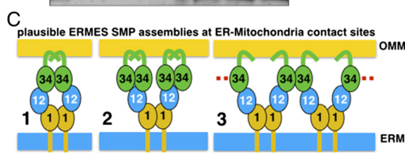

## Question

# Gene Research for Functional Annotation

## ⚠️ CRITICAL: Gene/Protein Identification Context

**BEFORE YOU BEGIN RESEARCH:** You MUST verify you are researching the CORRECT gene/protein. Gene symbols can be ambiguous, especially for less well-characterized genes from non-model organisms.

### Target Gene/Protein Identity (from UniProt):
- **UniProt Accession:** Q92328
- **Protein Description:** RecName: Full=Mitochondrial distribution and morphology protein 12 {ECO:0000255|HAMAP-Rule:MF_03104}; AltName: Full=Mitochondrial inheritance component MDM12 {ECO:0000255|HAMAP-Rule:MF_03104};
- **Gene Information:** Name=MDM12 {ECO:0000255|HAMAP-Rule:MF_03104}; OrderedLocusNames=YOL009C;
- **Organism (full):** Saccharomyces cerevisiae (strain ATCC 204508 / S288c) (Baker's yeast).
- **Protein Family:** Belongs to the MDM12 family. {ECO:0000255|HAMAP-
- **Key Domains:** Mdm12. (IPR027532); SMP_LBD. (IPR031468); Mdm12 (PF26544)

### MANDATORY VERIFICATION STEPS:

1. **Check if the gene symbol "MDM12" matches the protein description above**
2. **Verify the organism is correct:** Saccharomyces cerevisiae (strain ATCC 204508 / S288c) (Baker's yeast).
3. **Check if protein family/domains align with what you find in literature**
4. **If you find literature for a DIFFERENT gene with the same or similar symbol, STOP**

### If Gene Symbol is Ambiguous or You Cannot Find Relevant Literature:

**DO NOT PROCEED WITH RESEARCH ON A DIFFERENT GENE.** Instead:
- State clearly: "The gene symbol 'MDM12' is ambiguous or literature is limited for this specific protein"
- Explain what you found (e.g., "Found extensive literature on a different gene with the same symbol in a different organism")
- Describe the protein based ONLY on the UniProt information provided above
- Suggest that the protein function can be inferred from domain/family information

### Research Target:

Please provide a comprehensive research report on the gene **MDM12** (gene ID: MDM12, UniProt: Q92328) in yeast.

The research report should be a detailed narrative explaining the function, biological processes, and localization of the gene product. Citations should be given for all claims.

You should prioritize authoritative reviews and primary scientific literature when conducting research. You can supplement
this with annotations you find in gene/protein databases, but these can be outdated or inaccurate.

We are specifically interested in the primary function of the gene - for enzymes, what reaction is catalyzed, and what is the substrate specificity? For transporters, what is the substrate? For structural proteins or adapters, what is the broader structural role? For signaling molecules, what is the role in the pathway.

We are interested in where in or outside the cell the gene product carries out its function.

We are also interested in the signaling or biochemical pathways in which the gene functions. We are less interested in broad pleiotropic effects, except where these elucidate the precise role.

Include evidence where possible. We are interested in both experimental evidence as well as inference from structure, evolution, or bioinformatic analysis. Precise studies should be prioritized over high-throughput, where available.

## Output

Question: You are an expert researcher providing comprehensive, well-cited information.

Provide detailed information focusing on:
1. Key concepts and definitions with current understanding
2. Recent developments and latest research (prioritize 2023-2024 sources)
3. Current applications and real-world implementations
4. Expert opinions and analysis from authoritative sources
5. Relevant statistics and data from recent studies

Format as a comprehensive research report with proper citations. Include URLs and publication dates where available.
Always prioritize recent, authoritative sources and provide specific citations for all major claims.

# Gene Research for Functional Annotation

## ⚠️ CRITICAL: Gene/Protein Identification Context

**BEFORE YOU BEGIN RESEARCH:** You MUST verify you are researching the CORRECT gene/protein. Gene symbols can be ambiguous, especially for less well-characterized genes from non-model organisms.

### Target Gene/Protein Identity (from UniProt):
- **UniProt Accession:** Q92328
- **Protein Description:** RecName: Full=Mitochondrial distribution and morphology protein 12 {ECO:0000255|HAMAP-Rule:MF_03104}; AltName: Full=Mitochondrial inheritance component MDM12 {ECO:0000255|HAMAP-Rule:MF_03104};
- **Gene Information:** Name=MDM12 {ECO:0000255|HAMAP-Rule:MF_03104}; OrderedLocusNames=YOL009C;
- **Organism (full):** Saccharomyces cerevisiae (strain ATCC 204508 / S288c) (Baker's yeast).
- **Protein Family:** Belongs to the MDM12 family. {ECO:0000255|HAMAP-
- **Key Domains:** Mdm12. (IPR027532); SMP_LBD. (IPR031468); Mdm12 (PF26544)

### MANDATORY VERIFICATION STEPS:

1. **Check if the gene symbol "MDM12" matches the protein description above**
2. **Verify the organism is correct:** Saccharomyces cerevisiae (strain ATCC 204508 / S288c) (Baker's yeast).
3. **Check if protein family/domains align with what you find in literature**
4. **If you find literature for a DIFFERENT gene with the same or similar symbol, STOP**

### If Gene Symbol is Ambiguous or You Cannot Find Relevant Literature:

**DO NOT PROCEED WITH RESEARCH ON A DIFFERENT GENE.** Instead:
- State clearly: "The gene symbol 'MDM12' is ambiguous or literature is limited for this specific protein"
- Explain what you found (e.g., "Found extensive literature on a different gene with the same symbol in a different organism")
- Describe the protein based ONLY on the UniProt information provided above
- Suggest that the protein function can be inferred from domain/family information

### Research Target:

Please provide a comprehensive research report on the gene **MDM12** (gene ID: MDM12, UniProt: Q92328) in yeast.

The research report should be a detailed narrative explaining the function, biological processes, and localization of the gene product. Citations should be given for all claims.

You should prioritize authoritative reviews and primary scientific literature when conducting research. You can supplement
this with annotations you find in gene/protein databases, but these can be outdated or inaccurate.

We are specifically interested in the primary function of the gene - for enzymes, what reaction is catalyzed, and what is the substrate specificity? For transporters, what is the substrate? For structural proteins or adapters, what is the broader structural role? For signaling molecules, what is the role in the pathway.

We are interested in where in or outside the cell the gene product carries out its function.

We are also interested in the signaling or biochemical pathways in which the gene functions. We are less interested in broad pleiotropic effects, except where these elucidate the precise role.

Include evidence where possible. We are interested in both experimental evidence as well as inference from structure, evolution, or bioinformatic analysis. Precise studies should be prioritized over high-throughput, where available.

# Functional annotation of yeast MDM12 (UniProt Q92328)

## Identity and principal function

**The target is the *Saccharomyces cerevisiae* S288c protein Mdm12, encoded by MDM12/YOL009C—not an identically named protein from another organism.** The original yeast gene-characterization study explicitly identified its open reading frame as YOL009C and described an approximately 31-kDa product. Its experimentally established synaptotagmin-like mitochondrial-lipid-binding protein (**SMP**) fold agrees with the supplied Mdm12-family and SMP_LBD annotations. Q92328 and the S288c strain designation are those of the UniProt record specified in the question; the cited experiments independently establish the yeast gene and protein identity, but do not generally print the accession number. (berger1997mdm12pacomponent pages 4-5, ahyoung2015conservedsmpdomains pages 1-2, berger1997mdm12pacomponent pages 1-2)

**Best-supported annotation:** Mdm12 is a phospholipid-binding, non-membrane-spanning component of the **ER–mitochondria encounter structure (ERMES)**. At sites where the endoplasmic reticulum (ER) lies next to the mitochondrial outer membrane, it connects ER-anchored Mmm1 to mitochondrial-side Mdm34 and participates in phospholipid transfer across the intervening cytosol. Mdm10 anchors the assembly at the mitochondrial outer membrane. Mdm12 is therefore both a *structural adapter* in an interorganelle tether and a component of a lipid-transfer apparatus; it is **not a lipid-synthesis enzyme**, and no chemical reaction catalyzed by Mdm12 has been identified. (ahyoung2015conservedsmpdomains pages 1-2, ahyoung2015conservedsmpdomains pages 3-4, shin2018structure–functioninsightsinto pages 10-11, ahyoung2015conservedsmpdomains media c1527d4d)

## Location and molecular mechanism

Mdm12 acts on the **cytosolic face of ER–mitochondria contacts**, within ERMES puncta. Unlike transmembrane Mmm1 and outer-membrane Mdm10, Mdm12 is a soluble protein recruited through protein–protein interactions; Mdm34 provides its connection toward the mitochondrial side. Purified Mdm12 binds Mmm1 and Mdm34, whereas an Mmm1–Mdm34 interaction was not detected in the cited reconstitution, directly supporting an intervening Mdm12 bridge. A cropped schematic of the experimentally proposed arrangements appears in Fig. 4C of AhYoung *et al.* (2015); it depicts plausible assemblies, not a directly imaged atomic structure of intact ERMES. (jeong2016crystalstructureof pages 1-2, ahyoung2015conservedsmpdomains pages 3-4, ahyoung2015conservedsmpdomains media c1527d4d)

**An important annotation caveat:** The original 1997 study assigned Mdm12 to the mitochondrial outer membrane and interpreted carbonate-extraction behavior as evidence for membrane integration. Subsequent ERMES reconstitution and structural studies instead identify the predominantly SMP-fold protein as the *non-membrane-anchored* interposed subunit. The early mitochondrial association is consistent with recruitment to mitochondrial contacts, but the historical integral-membrane interpretation should not be presented as the current established topology. (berger1997mdm12pacomponent pages 1-2, berger1997mdm12pacomponent pages 8-8, ahyoung2015conservedsmpdomains pages 1-2, kundu2020theermes(endoplasmic pages 2-3)

The SMP domain contains a hydrophobic cavity that accommodates phospholipid acyl chains while leaving the polar head group more exposed. Mdm12 alone shows only weak interliposome lipid transfer; a reconstituted **Mmm1–Mdm12 complex** transfers lipid efficiently, and mutations affecting the proteins’ lipid-binding machinery reduce transfer and impair phosphatidylserine (PS) movement from ER-derived membranes to mitochondria. These experiments support *direct lipid handling by the subcomplex*, rather than an inference based solely on mutant mitochondrial shape. Whether lipids traverse a continuous series of pockets or undergo hand-offs involving conformational movement remains unresolved. (shin2018structure–functioninsightsinto pages 1-2, shin2018structure–functioninsightsinto pages 10-11, shin2018structure–functioninsightsinto pages 6-7)

## Cargo and biochemical pathway

**The substrate class is glycerophospholipids; a unique, exclusive Mdm12 substrate has not been established.** Bacterially expressed Mdm12 copurified mainly with phosphatidylethanolamine (PE) and phosphatidylglycerol (PG), but yeast-derived protein also associated with phosphatidylcholine (PC), PE and phosphatidylinositol; PC was enriched at least twofold in one yeast-protein analysis. In reconstituted assays, the Mmm1–Mdm12 complex transferred fluorescent PS approximately **threefold more efficiently than fluorescent PE under those particular conditions**. Neither bacterial copurification nor this assay ratio establishes exclusive physiological specificity. (ahyoung2015conservedsmpdomains pages 6-7, ahyoung2015conservedsmpdomains pages 4-5, shin2018structure–functioninsightsinto pages 6-7, tamura2020lipidhomeostasisin pages 3-5)

The physiological context is cooperation between ER and mitochondrial **phospholipid metabolism**. ER-derived PS must reach mitochondria for conversion to PE by mitochondrial phosphatidylserine decarboxylase; lipids can subsequently move among membranes as mitochondrial composition is maintained. Mdm12 helps move the lipid substrate between organelles—it does **not** catalyze PS decarboxylation. Disrupting ERMES impaired ER-to-mitochondria PS transport more strongly than reverse-direction PE transport in membrane-fraction experiments. In the original ERMES study, mutants showed a **two- to fivefold reduction** in measured PS-to-PC conversion and *mdm12Δ* cells had reduced cardiolipin abundance. These are pathway-level outcomes, not evidence that Mdm12 itself synthesizes PC or cardiolipin. (kornmann2009anermitochondriatethering pages 4-5, tamura2020lipidhomeostasisin pages 3-5, acoba2020phospholipidebband pages 5-6)

Strong evidence that ERMES contributes to lipid movement *inside living yeast* came from **METALIC** mass-tagging experiments published in 2022. Acute, auxin-induced depletion of Mdm12 reduced doubly tagged PC species that report ER–mitochondria exchange while leaving the separate labeling reactions intact. Combining ERMES inactivation with loss of **VPS13** or its mitochondrial partner **MCP1** lowered exchange close to background, establishing a substantially compensatory Vps13–Mcp1 route. MCP1 loss alone gave a modest, species-dependent effect: PC 32:1 double labeling was **25% lower at 14.5 hours** in one comparison. Because this assay follows selected PC species and inactivates an entire Mdm12-dependent complex, it does not assign a fixed fraction of all mitochondrial lipid import to the individual Mdm12 molecule. (peter2022metalicrevealsinterorganelle pages 4-6, peter2022metalicrevealsinterorganelle pages 3-4)

## Biological processes and significance of mutant phenotypes

The name “mitochondrial distribution and morphology” reflects the discovery phenotype: *mdm12* loss caused temperature-sensitive growth, enlarged rounded mitochondria and defective transmission of mitochondria to daughter buds. Current mechanistic evidence places Mdm12 primarily in **contact-site assembly and lipid exchange**, providing a more specific explanation for these otherwise broad organelle phenotypes. Artificial ER–mitochondria tethering partially ameliorated ERMES-associated defects, reinforcing the importance of contact architecture, but such rescue alone could not have proved direct lipid transfer; the subsequent reconstitution and live-cell flux experiments address that distinction. (berger1997mdm12pacomponent pages 1-2, kornmann2009anermitochondriatethering pages 4-5, shin2018structure–functioninsightsinto pages 1-2, peter2022metalicrevealsinterorganelle pages 4-6)

ERMES also supplies a platform for **mitochondrial protein biogenesis**, although this is presently an *ERMES-level* finding, not a separately demonstrated protein-transport activity of Mdm12. In a 2024 study, depletion of another ERMES subunit, **Mdm34**, together with disruption of a partially redundant Tom70-associated contact route caused ER-associated mitochondrial precursors, including Oxa1, to fail in delivery; isolated mitochondria retained import competence. An artificial contact did not restore the relevant import, indicating that proximity alone was insufficient. These experiments implicate the organized contact site in ER-SURF precursor targeting but do **not** show Mdm12 catalyzing protein translocation. (koch2024theersurfpathway pages 7-9, koch2024theersurfpathway pages 3-4, koch2024theersurfpathway pages 4-5)

## What 2023–2024 research changes

A **2023 peer-reviewed *Nature* study** combined quantitative cellular imaging, cryo-correlative electron microscopy, tomography and molecular modeling to resolve ERMES *in situ*. It reported approximately **25 discrete bridge-like complexes per contact**, with three SMP-domain-sized segments in a zig-zag arrangement. The model places **Mmm1 nearest the ER, Mdm12 centrally, and Mdm34 nearest the mitochondrial outer membrane**. The bridges are observed structures; the exact assignment of molecular identities and proposed lipid route result from integrative fitting rather than direct visualization of individual lipids moving through a bridge. The related detailed preprint reported a mean bridge length of **24.2 nm** across **1,098 bridges**, providing useful measurement context. (casler2025mitochondria–plasmamembranecontact pages 10-12, wozny2022supramoleculararchitectureof pages 4-6, wozny2022supramoleculararchitectureof pages 15-20)

A **November 2024 bioRxiv preprint**, which must be distinguished from peer-reviewed consensus, challenges the assumption that every native ERMES lipid-transfer event requires a fixed four-subunit conduit. An artificial tether rescued *mdm12Δ mdm34Δ* cells without Vps13, while engineered mitochondrially targeted Mmm1 rescued even a quadruple ERMES deletion if its SMP domain remained intact. The most defensible interpretation is **conditional sufficiency of engineered Mmm1 and possible compositional flexibility**: these experiments do **not** erase the direct evidence for Mdm12’s lipid-binding and native ERMES role or prove that native contacts normally lack Mdm12. (covillcooke2024compositionalflexibilityof pages 5-8)

The chronology below separates observations about this yeast protein from structural models, complex-level effects and engineered-system inferences.

| Date / publication | Key evidence | Precise interpretation | Limitations / cautions |
|---|---|---|---|
| [10 Feb 1997 — Berger et al., *JCB*](https://doi.org/10.1083/jcb.136.3.545) | Identified the *S. cerevisiae* **MDM12** ORF as **YOL009C**, encoding an approximately 31-kDa protein. Loss caused temperature-sensitive growth, enlarged round mitochondria, and defective mitochondrial inheritance. Fractionation and carbonate extraction led to an integral outer-membrane assignment. (berger1997mdm12pacomponent pages 1-2, berger1997mdm12pacomponent pages 4-5, berger1997mdm12pacomponent pages 8-8) | Establishes the verified locus and foundational morphology and inheritance phenotype. | The integral-membrane interpretation is historically important but superseded by evidence identifying Mdm12 as a soluble, cytosolic, peripherally recruited SMP bridge. The predicted hydrophobic segment was not a validated transmembrane topology. (jeong2016crystalstructureof pages 1-2, jeong2016crystalstructureof pages 10-12) |
| [24 Jul 2009 — Kornmann et al., *Science*](https://doi.org/10.1126/science.1175088) | A synthetic-biology screen identified Mmm1–Mdm10–Mdm12–Mdm34 as **ERMES**. ChiMERA artificial ER–mitochondria tethering partially rescued ERMES defects; *mdm12Δ* reduced cardiolipin, and ERMES mutants showed a two- to fivefold decrease in PS-to-PC conversion. (kornmann2009anermitochondriatethering pages 4-5) | Recast Mdm12 as part of an ER–mitochondria tether required for efficient phospholipid exchange and mitochondrial membrane homeostasis. | Rescue by a non-lipid-transferring artificial tether initially left open whether ERMES transfers lipids directly or supports transfer indirectly by maintaining contacts. |
| [16 Jun 2015 — AhYoung et al., *PNAS*](https://doi.org/10.1073/pnas.1422363112) | SMP domains assembled a stable Mmm1–Mdm12 complex; Mdm12 bound Mdm34 but Mmm1 did not, placing Mdm12 between them. Bacterially expressed Mdm12 copurified mainly with PE (approximately 80%) and PG (approximately 15%); yeast-derived Mdm12 contained PC, PE, and PI, with at least twofold PC enrichment. (ahyoung2015conservedsmpdomains pages 3-4, ahyoung2015conservedsmpdomains pages 6-7, ahyoung2015conservedsmpdomains pages 4-5, ahyoung2015conservedsmpdomains media c1527d4d) | Mdm12 is a soluble SMP-domain phospholipid-binding adapter that bridges ER-anchored Mmm1 and mitochondrial-side Mdm34. It binds multiple phospholipid classes rather than one exclusive substrate. | Bacterial PE and PG copurification does not establish physiological cargo specificity. The proposed bridge arrangements preceded native in situ structural resolution. |
| [5 Mar 2018 — Kawano et al., *JCB*](https://doi.org/10.1083/jcb.201704119) | Mdm12 contains a hydrophobic phospholipid pocket. Mdm12 or Mmm1 alone transferred lipid weakly between liposomes, whereas the Mmm1–Mdm12 complex transferred efficiently; pocket mutations impaired transfer and ER-to-mitochondria PS transport. NBD-PS transfer was approximately threefold more efficient than NBD-PE under the assay conditions. (shin2018structure–functioninsightsinto pages 1-2, shin2018structure–functioninsightsinto pages 10-11, shin2018structure–functioninsightsinto pages 6-7) | Defines Mmm1–Mdm12 as a minimal direct lipid-transfer unit. Mdm12 performs physical phospholipid extraction, shuttling, or conduit formation—not a chemical reaction—and PS is a demonstrated cargo, not an exclusive substrate. | Liposomes and isolated membrane fractions simplify native contacts; the shuttle-versus-conduit mechanism and intact-ERMES specificity remained unresolved. |
| [2 Jun 2022 — John Peter et al., *Nature Cell Biology*](https://doi.org/10.1038/s41556-022-00917-9) | METALIC measured ER–mitochondria PC exchange in living yeast. Acute auxin-induced Mdm12 depletion reduced double-tagged PC without disrupting the individual labeling reactions. Combined ERMES inactivation and loss of VPS13 or MCP1 reduced exchange nearly to background; *mcp1Δ* alone caused a mild 25% reduction for PC 32:1 at 14.5 hours. (peter2022metalicrevealsinterorganelle pages 4-6, peter2022metalicrevealsinterorganelle pages 3-4) | Supplies direct in-cell evidence that Mdm12-containing ERMES transports phospholipids and that Vps13–Mcp1 provides a substantially compensatory route. | The assay tracks selected PC species rather than every physiological lipid. Mdm12 was acutely degraded, so the result concerns loss of ERMES rather than an isolated catalytic contribution by Mdm12. |
| [31 May 2023 — Wozny et al., *Nature*](https://doi.org/10.1038/s41586-023-06050-3) | In situ cryo-CLEM and cryo-ET resolved approximately 20–25 bridge-like complexes per ERMES contact. Integrative modeling placed three SMP domains in a zig-zag sequence—ER-proximal Mmm1, central Mdm12, and OMM-proximal Mdm34—spanning an approximately 24-nm gap. (casler2025mitochondria–plasmamembranecontact pages 10-12, wozny2022supramoleculararchitectureof pages 4-6, wozny2022supramoleculararchitectureof pages 1-4) | Provides the leading native structural model: Mdm12 is the central lipid-binding link in a restrained, segmented ER-to-mitochondria pathway. | Bridges and their geometry were observed directly, but subunit identities and the continuous lipid pathway were assigned by integrative modeling; lipid movement through individual bridges was not directly visualized. |
| [15 Mar 2024 — Koch et al., *EMBO Reports*](https://doi.org/10.1038/s44319-024-00113-w) | ERMES and the Djp1–Lam6–Tom70 route acted in parallel during ER-SURF delivery of mitochondrial precursors. Mdm34 depletion caused hydrophobic mitochondrial precursors to accumulate at the ER; combined contact-route disruption impaired Oxa1 and Coq2 import in semi-intact cells, although isolated mitochondria retained import capacity. (koch2024theersurfpathway pages 7-9, koch2024theersurfpathway pages 3-4, koch2024theersurfpathway pages 1-3) | Extends ERMES function to mitochondrial protein biogenesis by facilitating precursor transfer at contacts; this is an ERMES-level application of the contact architecture. | **Mdm34**, not Mdm12, was the principal ERMES subunit manipulated. The results do not establish Mdm12 as a protein transporter or enzyme, and simple artificial tethering did not restore import. |
| [26 Nov 2024 — Covill-Cooke et al., *bioRxiv*](https://doi.org/10.1101/2024.11.26.625358) | ChiMERA rescued *mdm12Δ mdm34Δ* independently of Vps13. Mitochondrially targeted Mmm1 rescued individual and quadruple ERMES deletions; rescue required Mmm1 membrane attachment and its cytosolic SMP domain. (covillcooke2024compositionalflexibilityof pages 5-8) | Suggests that ERMES composition may be flexible and that engineered Mmm1 can provide minimal lipid-transfer activity when an artificial contact is supplied. | Non-peer-reviewed preprint using engineered targeting and synthetic tethers. It demonstrates conditional Mmm1 sufficiency, **not** native Mdm12 dispensability or the composition of physiological ERMES bridges. |

*Table: Chronology of the major experiments establishing the identity, localization, structure, and lipid-transfer role of verified S. cerevisiae Mdm12. The limitations distinguish direct findings from historical misassignments, model-dependent conclusions, and engineered systems.*

**Practical research use and remaining questions.** The yeast *mdm12Δ* strain, inducible Mdm12 depletion, lipid-pocket mutants, reconstituted Mmm1–Mdm12 complexes, and tagged Mdm12 foci provide experimentally implemented ways to perturb or observe ER–mitochondria contacts and lipid flux. They are research tools, not a clinical application or evidence that humans possess a one-to-one Mdm12 ortholog. Outstanding questions include the cargo distribution of intact ERMES in physiological membranes, how lipids cross interfaces between SMP domains, and when alternative tethers or Vps13–Mcp1 compensate for Mdm12-dependent transport. (shin2018structure–functioninsightsinto pages 4-5, peter2022metalicrevealsinterorganelle pages 4-6, wozny2022supramoleculararchitectureof pages 4-6, covillcooke2024compositionalflexibilityof pages 5-8)

### Principal sources and publication dates

- Berger *et al.*, **10 February 1997**, *Journal of Cell Biology*, original yeast locus and phenotype: https://doi.org/10.1083/jcb.136.3.545. (berger1997mdm12pacomponent pages 1-2, berger1997mdm12pacomponent pages 4-5)
- Kornmann *et al.*, **July 2009**, *Science*, ERMES discovery: https://doi.org/10.1126/science.1175088. (kornmann2009anermitochondriatethering pages 4-5)
- AhYoung *et al.*, **June 2015**, *PNAS*, SMP binding and complex assembly: https://doi.org/10.1073/pnas.1422363112. (ahyoung2015conservedsmpdomains pages 3-4, ahyoung2015conservedsmpdomains pages 6-7)
- Kawano *et al.*, **March 2018**, *Journal of Cell Biology*, Mmm1–Mdm12 lipid-transfer reconstitution: https://doi.org/10.1083/jcb.201704119. (shin2018structure–functioninsightsinto pages 1-2, shin2018structure–functioninsightsinto pages 6-7)
- John Peter *et al.*, **June 2022**, *Nature Cell Biology*, living-cell METALIC assay: https://doi.org/10.1038/s41556-022-00917-9. (peter2022metalicrevealsinterorganelle pages 4-6)
- Wozny *et al.*, **May 2023**, *Nature*, native ERMES architecture: https://doi.org/10.1038/s41586-023-06050-3. (casler2025mitochondria–plasmamembranecontact pages 10-12, wozny2023insituarchitecture pages 6-9)
- Koch *et al.*, **April 2024**, *EMBO Reports*, contact-site-assisted mitochondrial protein targeting: https://doi.org/10.1038/s44319-024-00113-w. (koch2024theersurfpathway pages 7-9)
- Covill-Cooke *et al.*, **26 November 2024**, *bioRxiv* **preprint**, engineered minimal-ERMES tests: https://doi.org/10.1101/2024.11.26.625358. (covillcooke2024compositionalflexibilityof pages 1-5, covillcooke2024compositionalflexibilityof pages 5-8)

References

1. (berger1997mdm12pacomponent pages 4-5): Karen H. Berger, L. Farah Sogo, and Michael P. Yaffe. Mdm12p, a component required for mitochondrial inheritance that is conserved between budding and fission yeast. The Journal of Cell Biology, 136:545-553, Feb 1997. URL: https://doi.org/10.1083/jcb.136.3.545, doi:10.1083/jcb.136.3.545. This article has 251 citations.

2. (ahyoung2015conservedsmpdomains pages 1-2): Andrew P. AhYoung, Jiansen Jiang, Jiang Zhang, Xuan Khoi Dang, J. Loo, Hong Z. Zhou, and Pascal F. Egea. Conserved smp domains of the ermes complex bind phospholipids and mediate tether assembly. Proceedings of the National Academy of Sciences, 112:E3179-E3188, Jun 2015. URL: https://doi.org/10.1073/pnas.1422363112, doi:10.1073/pnas.1422363112. This article has 199 citations and is from a highest quality peer-reviewed journal.

3. (berger1997mdm12pacomponent pages 1-2): Karen H. Berger, L. Farah Sogo, and Michael P. Yaffe. Mdm12p, a component required for mitochondrial inheritance that is conserved between budding and fission yeast. The Journal of Cell Biology, 136:545-553, Feb 1997. URL: https://doi.org/10.1083/jcb.136.3.545, doi:10.1083/jcb.136.3.545. This article has 251 citations.

4. (ahyoung2015conservedsmpdomains pages 3-4): Andrew P. AhYoung, Jiansen Jiang, Jiang Zhang, Xuan Khoi Dang, J. Loo, Hong Z. Zhou, and Pascal F. Egea. Conserved smp domains of the ermes complex bind phospholipids and mediate tether assembly. Proceedings of the National Academy of Sciences, 112:E3179-E3188, Jun 2015. URL: https://doi.org/10.1073/pnas.1422363112, doi:10.1073/pnas.1422363112. This article has 199 citations and is from a highest quality peer-reviewed journal.

5. (shin2018structure–functioninsightsinto pages 10-11): Shin Kawano, Yasushi Tamura, Rieko Kojima, Siqin Bala, Eri Asai, Agnès H. Michel, Benoît Kornmann, Isabelle Riezman, Howard Riezman, Yoshitake Sakae, Yuko Okamoto, and Toshiya Endo. Structure–function insights into direct lipid transfer between membranes by mmm1–mdm12 of ermes. The Journal of Cell Biology, 217:959-974, Mar 2018. URL: https://doi.org/10.1083/jcb.201704119, doi:10.1083/jcb.201704119. This article has 183 citations.

6. (ahyoung2015conservedsmpdomains media c1527d4d): Andrew P. AhYoung, Jiansen Jiang, Jiang Zhang, Xuan Khoi Dang, J. Loo, Hong Z. Zhou, and Pascal F. Egea. Conserved smp domains of the ermes complex bind phospholipids and mediate tether assembly. Proceedings of the National Academy of Sciences, 112:E3179-E3188, Jun 2015. URL: https://doi.org/10.1073/pnas.1422363112, doi:10.1073/pnas.1422363112. This article has 199 citations and is from a highest quality peer-reviewed journal.

7. (jeong2016crystalstructureof pages 1-2): Hanbin Jeong, Jumi Park, and Changwook Lee. Crystal structure of mdm12 reveals the architecture and dynamic organization of the ermes complex. EMBO reports, 17:1857-1871, Nov 2016. URL: https://doi.org/10.15252/embr.201642706, doi:10.15252/embr.201642706. This article has 99 citations and is from a highest quality peer-reviewed journal.

8. (berger1997mdm12pacomponent pages 8-8): Karen H. Berger, L. Farah Sogo, and Michael P. Yaffe. Mdm12p, a component required for mitochondrial inheritance that is conserved between budding and fission yeast. The Journal of Cell Biology, 136:545-553, Feb 1997. URL: https://doi.org/10.1083/jcb.136.3.545, doi:10.1083/jcb.136.3.545. This article has 251 citations.

9. (kundu2020theermes(endoplasmic pages 2-3): Deepika Kundu and Ritu Pasrija. The ermes (endoplasmic reticulum and mitochondria encounter structures) mediated functions in fungi. Mitochondrion, 52:89-99, May 2020. URL: https://doi.org/10.1016/j.mito.2020.02.010, doi:10.1016/j.mito.2020.02.010. This article has 41 citations and is from a peer-reviewed journal.

10. (shin2018structure–functioninsightsinto pages 1-2): Shin Kawano, Yasushi Tamura, Rieko Kojima, Siqin Bala, Eri Asai, Agnès H. Michel, Benoît Kornmann, Isabelle Riezman, Howard Riezman, Yoshitake Sakae, Yuko Okamoto, and Toshiya Endo. Structure–function insights into direct lipid transfer between membranes by mmm1–mdm12 of ermes. The Journal of Cell Biology, 217:959-974, Mar 2018. URL: https://doi.org/10.1083/jcb.201704119, doi:10.1083/jcb.201704119. This article has 183 citations.

11. (shin2018structure–functioninsightsinto pages 6-7): Shin Kawano, Yasushi Tamura, Rieko Kojima, Siqin Bala, Eri Asai, Agnès H. Michel, Benoît Kornmann, Isabelle Riezman, Howard Riezman, Yoshitake Sakae, Yuko Okamoto, and Toshiya Endo. Structure–function insights into direct lipid transfer between membranes by mmm1–mdm12 of ermes. The Journal of Cell Biology, 217:959-974, Mar 2018. URL: https://doi.org/10.1083/jcb.201704119, doi:10.1083/jcb.201704119. This article has 183 citations.

12. (ahyoung2015conservedsmpdomains pages 6-7): Andrew P. AhYoung, Jiansen Jiang, Jiang Zhang, Xuan Khoi Dang, J. Loo, Hong Z. Zhou, and Pascal F. Egea. Conserved smp domains of the ermes complex bind phospholipids and mediate tether assembly. Proceedings of the National Academy of Sciences, 112:E3179-E3188, Jun 2015. URL: https://doi.org/10.1073/pnas.1422363112, doi:10.1073/pnas.1422363112. This article has 199 citations and is from a highest quality peer-reviewed journal.

13. (ahyoung2015conservedsmpdomains pages 4-5): Andrew P. AhYoung, Jiansen Jiang, Jiang Zhang, Xuan Khoi Dang, J. Loo, Hong Z. Zhou, and Pascal F. Egea. Conserved smp domains of the ermes complex bind phospholipids and mediate tether assembly. Proceedings of the National Academy of Sciences, 112:E3179-E3188, Jun 2015. URL: https://doi.org/10.1073/pnas.1422363112, doi:10.1073/pnas.1422363112. This article has 199 citations and is from a highest quality peer-reviewed journal.

14. (tamura2020lipidhomeostasisin pages 3-5): Yasushi Tamura, Shin Kawano, and Toshiya Endo. Lipid homeostasis in mitochondria. Biological Chemistry, 401:821-833, Apr 2020. URL: https://doi.org/10.1515/hsz-2020-0121, doi:10.1515/hsz-2020-0121. This article has 97 citations and is from a peer-reviewed journal.

15. (kornmann2009anermitochondriatethering pages 4-5): Benoît Kornmann, Erin Currie, Sean R. Collins, Maya Schuldiner, Jodi Nunnari, Jonathan S. Weissman, and Peter Walter. An er-mitochondria tethering complex revealed by a synthetic biology screen. Science, 325:477-481, Jul 2009. URL: https://doi.org/10.1126/science.1175088, doi:10.1126/science.1175088. This article has 1555 citations and is from a highest quality peer-reviewed journal.

16. (acoba2020phospholipidebband pages 5-6): Michelle Grace Acoba, Nanami Senoo, and Steven M. Claypool. Phospholipid ebb and flow makes mitochondria go. The Journal of Cell Biology, Jul 2020. URL: https://doi.org/10.1083/jcb.202003131, doi:10.1083/jcb.202003131. This article has 122 citations.

17. (peter2022metalicrevealsinterorganelle pages 4-6): Arun T. John Peter, Carmelina Petrungaro, Matthias Peter, and Benoît Kornmann. Metalic reveals interorganelle lipid flux in live cells by enzymatic mass tagging. Nature Cell Biology, 24:996-1004, Jun 2022. URL: https://doi.org/10.1038/s41556-022-00917-9, doi:10.1038/s41556-022-00917-9. This article has 59 citations and is from a highest quality peer-reviewed journal.

18. (peter2022metalicrevealsinterorganelle pages 3-4): Arun T. John Peter, Carmelina Petrungaro, Matthias Peter, and Benoît Kornmann. Metalic reveals interorganelle lipid flux in live cells by enzymatic mass tagging. Nature Cell Biology, 24:996-1004, Jun 2022. URL: https://doi.org/10.1038/s41556-022-00917-9, doi:10.1038/s41556-022-00917-9. This article has 59 citations and is from a highest quality peer-reviewed journal.

19. (koch2024theersurfpathway pages 7-9): Christian Koch, Svenja Lenhard, Markus Räschle, Cristina Prescianotto-Baschong, Anne Spang, and Johannes M Herrmann. The er-surf pathway uses er-mitochondria contact sites for protein targeting to mitochondria. EMBO Reports, 25:2071-2096, Apr 2024. URL: https://doi.org/10.1038/s44319-024-00113-w, doi:10.1038/s44319-024-00113-w. This article has 56 citations and is from a highest quality peer-reviewed journal.

20. (koch2024theersurfpathway pages 3-4): Christian Koch, Svenja Lenhard, Markus Räschle, Cristina Prescianotto-Baschong, Anne Spang, and Johannes M Herrmann. The er-surf pathway uses er-mitochondria contact sites for protein targeting to mitochondria. EMBO Reports, 25:2071-2096, Apr 2024. URL: https://doi.org/10.1038/s44319-024-00113-w, doi:10.1038/s44319-024-00113-w. This article has 56 citations and is from a highest quality peer-reviewed journal.

21. (koch2024theersurfpathway pages 4-5): Christian Koch, Svenja Lenhard, Markus Räschle, Cristina Prescianotto-Baschong, Anne Spang, and Johannes M Herrmann. The er-surf pathway uses er-mitochondria contact sites for protein targeting to mitochondria. EMBO Reports, 25:2071-2096, Apr 2024. URL: https://doi.org/10.1038/s44319-024-00113-w, doi:10.1038/s44319-024-00113-w. This article has 56 citations and is from a highest quality peer-reviewed journal.

22. (casler2025mitochondria–plasmamembranecontact pages 10-12): Jason C. Casler, Clare S. Harper, and Laura L. Lackner. Mitochondria–plasma membrane contact sites regulate the er–mitochondria encounter structure. Journal of Cell Science, Feb 2025. URL: https://doi.org/10.1242/jcs.263685, doi:10.1242/jcs.263685. This article has 15 citations and is from a domain leading peer-reviewed journal.

23. (wozny2022supramoleculararchitectureof pages 4-6): Michael R. Wozny, Andrea Di Luca, Dustin R. Morado, Andrea Picco, Patrick C. Hoffmann, Elizabeth A. Miller, Stefano Vanni, and Wanda Kukulski. Supramolecular architecture of the er-mitochondria encounter structure in its native environment. bioRxiv, Apr 2022. URL: https://doi.org/10.1101/2022.04.12.488000, doi:10.1101/2022.04.12.488000. This article has 7 citations.

24. (wozny2022supramoleculararchitectureof pages 15-20): Michael R. Wozny, Andrea Di Luca, Dustin R. Morado, Andrea Picco, Patrick C. Hoffmann, Elizabeth A. Miller, Stefano Vanni, and Wanda Kukulski. Supramolecular architecture of the er-mitochondria encounter structure in its native environment. bioRxiv, Apr 2022. URL: https://doi.org/10.1101/2022.04.12.488000, doi:10.1101/2022.04.12.488000. This article has 7 citations.

25. (covillcooke2024compositionalflexibilityof pages 5-8): Christian Covill-Cooke, Takashi Hirashima, Shin Kawano, Joe Ganellin, Andrew Moody, Sabine N. S. van Schie, Arun T. John Peter, Chika Saito, Toshiya Endo, and Benoît Kornmann. Compositional flexibility of the er-mitochondria encounter structure. bioRxiv, Nov 2024. URL: https://doi.org/10.1101/2024.11.26.625358, doi:10.1101/2024.11.26.625358. This article has 0 citations.

26. (jeong2016crystalstructureof pages 10-12): Hanbin Jeong, Jumi Park, and Changwook Lee. Crystal structure of mdm12 reveals the architecture and dynamic organization of the ermes complex. EMBO reports, 17:1857-1871, Nov 2016. URL: https://doi.org/10.15252/embr.201642706, doi:10.15252/embr.201642706. This article has 99 citations and is from a highest quality peer-reviewed journal.

27. (wozny2022supramoleculararchitectureof pages 1-4): Michael R. Wozny, Andrea Di Luca, Dustin R. Morado, Andrea Picco, Patrick C. Hoffmann, Elizabeth A. Miller, Stefano Vanni, and Wanda Kukulski. Supramolecular architecture of the er-mitochondria encounter structure in its native environment. bioRxiv, Apr 2022. URL: https://doi.org/10.1101/2022.04.12.488000, doi:10.1101/2022.04.12.488000. This article has 7 citations.

28. (koch2024theersurfpathway pages 1-3): Christian Koch, Svenja Lenhard, Markus Räschle, Cristina Prescianotto-Baschong, Anne Spang, and Johannes M Herrmann. The er-surf pathway uses er-mitochondria contact sites for protein targeting to mitochondria. EMBO Reports, 25:2071-2096, Apr 2024. URL: https://doi.org/10.1038/s44319-024-00113-w, doi:10.1038/s44319-024-00113-w. This article has 56 citations and is from a highest quality peer-reviewed journal.

29. (shin2018structure–functioninsightsinto pages 4-5): Shin Kawano, Yasushi Tamura, Rieko Kojima, Siqin Bala, Eri Asai, Agnès H. Michel, Benoît Kornmann, Isabelle Riezman, Howard Riezman, Yoshitake Sakae, Yuko Okamoto, and Toshiya Endo. Structure–function insights into direct lipid transfer between membranes by mmm1–mdm12 of ermes. The Journal of Cell Biology, 217:959-974, Mar 2018. URL: https://doi.org/10.1083/jcb.201704119, doi:10.1083/jcb.201704119. This article has 183 citations.

30. (wozny2023insituarchitecture pages 6-9): Michael R. Wozny, Andrea Di Luca, Dustin R. Morado, Andrea Picco, Rasha Khaddaj, Pablo Campomanes, Lazar Ivanović, Patrick C. Hoffmann, Elizabeth A. Miller, Stefano Vanni, and Wanda Kukulski. In situ architecture of the er–mitochondria encounter structure. Nature, 618:188-192, May 2023. URL: https://doi.org/10.1038/s41586-023-06050-3, doi:10.1038/s41586-023-06050-3. This article has 153 citations and is from a highest quality peer-reviewed journal.

31. (covillcooke2024compositionalflexibilityof pages 1-5): Christian Covill-Cooke, Takashi Hirashima, Shin Kawano, Joe Ganellin, Andrew Moody, Sabine N. S. van Schie, Arun T. John Peter, Chika Saito, Toshiya Endo, and Benoît Kornmann. Compositional flexibility of the er-mitochondria encounter structure. bioRxiv, Nov 2024. URL: https://doi.org/10.1101/2024.11.26.625358, doi:10.1101/2024.11.26.625358. This article has 0 citations.

## Artifacts

- [Edison artifact artifact-00](MDM12-deep-research-falcon_artifacts/artifact-00.md)

## Citations

1. covillcooke2024compositionalflexibilityof pages 5-8
2. kornmann2009anermitochondriatethering pages 4-5
3. peter2022metalicrevealsinterorganelle pages 4-6
4. koch2024theersurfpathway pages 7-9
5. ahyoung2015conservedsmpdomains pages 1-2
6. ahyoung2015conservedsmpdomains pages 3-4
7. jeong2016crystalstructureof pages 1-2
8. ahyoung2015conservedsmpdomains pages 6-7
9. ahyoung2015conservedsmpdomains pages 4-5
10. tamura2020lipidhomeostasisin pages 3-5
11. acoba2020phospholipidebband pages 5-6
12. peter2022metalicrevealsinterorganelle pages 3-4
13. koch2024theersurfpathway pages 3-4
14. koch2024theersurfpathway pages 4-5
15. wozny2022supramoleculararchitectureof pages 4-6
16. wozny2022supramoleculararchitectureof pages 15-20
17. jeong2016crystalstructureof pages 10-12
18. wozny2022supramoleculararchitectureof pages 1-4
19. koch2024theersurfpathway pages 1-3
20. wozny2023insituarchitecture pages 6-9
21. covillcooke2024compositionalflexibilityof pages 1-5
22. 10 Feb 1997 — Berger et al., *JCB*
23. 24 Jul 2009 — Kornmann et al., *Science*
24. 16 Jun 2015 — AhYoung et al., *PNAS*
25. 5 Mar 2018 — Kawano et al., *JCB*
26. 2 Jun 2022 — John Peter et al., *Nature Cell Biology*
27. 31 May 2023 — Wozny et al., *Nature*
28. 15 Mar 2024 — Koch et al., *EMBO Reports*
29. 26 Nov 2024 — Covill-Cooke et al., *bioRxiv*
30. https://doi.org/10.1083/jcb.136.3.545
31. https://doi.org/10.1126/science.1175088
32. https://doi.org/10.1073/pnas.1422363112
33. https://doi.org/10.1083/jcb.201704119
34. https://doi.org/10.1038/s41556-022-00917-9
35. https://doi.org/10.1038/s41586-023-06050-3
36. https://doi.org/10.1038/s44319-024-00113-w
37. https://doi.org/10.1101/2024.11.26.625358
38. https://doi.org/10.1083/jcb.136.3.545.
39. https://doi.org/10.1126/science.1175088.
40. https://doi.org/10.1073/pnas.1422363112.
41. https://doi.org/10.1083/jcb.201704119.
42. https://doi.org/10.1038/s41556-022-00917-9.
43. https://doi.org/10.1038/s41586-023-06050-3.
44. https://doi.org/10.1038/s44319-024-00113-w.
45. https://doi.org/10.1101/2024.11.26.625358.
46. https://doi.org/10.1083/jcb.136.3.545,
47. https://doi.org/10.1073/pnas.1422363112,
48. https://doi.org/10.1083/jcb.201704119,
49. https://doi.org/10.15252/embr.201642706,
50. https://doi.org/10.1016/j.mito.2020.02.010,
51. https://doi.org/10.1515/hsz-2020-0121,
52. https://doi.org/10.1126/science.1175088,
53. https://doi.org/10.1083/jcb.202003131,
54. https://doi.org/10.1038/s41556-022-00917-9,
55. https://doi.org/10.1038/s44319-024-00113-w,
56. https://doi.org/10.1242/jcs.263685,
57. https://doi.org/10.1101/2022.04.12.488000,
58. https://doi.org/10.1101/2024.11.26.625358,
59. https://doi.org/10.1038/s41586-023-06050-3,