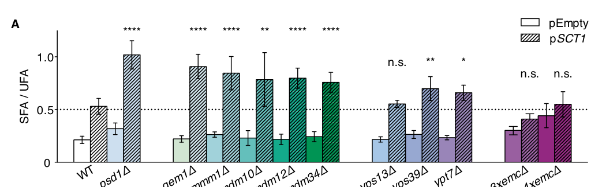

## Question

# Gene Research for Functional Annotation

## ⚠️ CRITICAL: Gene/Protein Identification Context

**BEFORE YOU BEGIN RESEARCH:** You MUST verify you are researching the CORRECT gene/protein. Gene symbols can be ambiguous, especially for less well-characterized genes from non-model organisms.

### Target Gene/Protein Identity (from UniProt):
- **UniProt Accession:** P53083
- **Protein Description:** RecName: Full=Mitochondrial distribution and morphology protein 34 {ECO:0000255|HAMAP-Rule:MF_03105}; AltName: Full=Mitochondrial outer membrane protein MMM2 {ECO:0000255|HAMAP-Rule:MF_03105};
- **Gene Information:** Name=MDM34 {ECO:0000255|HAMAP-Rule:MF_03105}; Synonyms=MMM2 {ECO:0000255|HAMAP-Rule:MF_03105}; OrderedLocusNames=YGL219C;
- **Organism (full):** Saccharomyces cerevisiae (strain ATCC 204508 / S288c) (Baker's yeast).
- **Protein Family:** Belongs to the MDM34 family. {ECO:0000255|HAMAP-
- **Key Domains:** MDM34. (IPR027536); MDM34_helical. (IPR061929); MDM34_N. (IPR058825); SMP_LBD. (IPR031468); MDM34_helical (PF28762)

### MANDATORY VERIFICATION STEPS:

1. **Check if the gene symbol "MDM34" matches the protein description above**
2. **Verify the organism is correct:** Saccharomyces cerevisiae (strain ATCC 204508 / S288c) (Baker's yeast).
3. **Check if protein family/domains align with what you find in literature**
4. **If you find literature for a DIFFERENT gene with the same or similar symbol, STOP**

### If Gene Symbol is Ambiguous or You Cannot Find Relevant Literature:

**DO NOT PROCEED WITH RESEARCH ON A DIFFERENT GENE.** Instead:
- State clearly: "The gene symbol 'MDM34' is ambiguous or literature is limited for this specific protein"
- Explain what you found (e.g., "Found extensive literature on a different gene with the same symbol in a different organism")
- Describe the protein based ONLY on the UniProt information provided above
- Suggest that the protein function can be inferred from domain/family information

### Research Target:

Please provide a comprehensive research report on the gene **MDM34** (gene ID: MDM34, UniProt: P53083) in yeast.

The research report should be a detailed narrative explaining the function, biological processes, and localization of the gene product. Citations should be given for all claims.

You should prioritize authoritative reviews and primary scientific literature when conducting research. You can supplement
this with annotations you find in gene/protein databases, but these can be outdated or inaccurate.

We are specifically interested in the primary function of the gene - for enzymes, what reaction is catalyzed, and what is the substrate specificity? For transporters, what is the substrate? For structural proteins or adapters, what is the broader structural role? For signaling molecules, what is the role in the pathway.

We are interested in where in or outside the cell the gene product carries out its function.

We are also interested in the signaling or biochemical pathways in which the gene functions. We are less interested in broad pleiotropic effects, except where these elucidate the precise role.

Include evidence where possible. We are interested in both experimental evidence as well as inference from structure, evolution, or bioinformatic analysis. Precise studies should be prioritized over high-throughput, where available.

## Output

Question: You are an expert researcher providing comprehensive, well-cited information.

Provide detailed information focusing on:
1. Key concepts and definitions with current understanding
2. Recent developments and latest research (prioritize 2023-2024 sources)
3. Current applications and real-world implementations
4. Expert opinions and analysis from authoritative sources
5. Relevant statistics and data from recent studies

Format as a comprehensive research report with proper citations. Include URLs and publication dates where available.
Always prioritize recent, authoritative sources and provide specific citations for all major claims.

# Gene Research for Functional Annotation

## ⚠️ CRITICAL: Gene/Protein Identification Context

**BEFORE YOU BEGIN RESEARCH:** You MUST verify you are researching the CORRECT gene/protein. Gene symbols can be ambiguous, especially for less well-characterized genes from non-model organisms.

### Target Gene/Protein Identity (from UniProt):
- **UniProt Accession:** P53083
- **Protein Description:** RecName: Full=Mitochondrial distribution and morphology protein 34 {ECO:0000255|HAMAP-Rule:MF_03105}; AltName: Full=Mitochondrial outer membrane protein MMM2 {ECO:0000255|HAMAP-Rule:MF_03105};
- **Gene Information:** Name=MDM34 {ECO:0000255|HAMAP-Rule:MF_03105}; Synonyms=MMM2 {ECO:0000255|HAMAP-Rule:MF_03105}; OrderedLocusNames=YGL219C;
- **Organism (full):** Saccharomyces cerevisiae (strain ATCC 204508 / S288c) (Baker's yeast).
- **Protein Family:** Belongs to the MDM34 family. {ECO:0000255|HAMAP-
- **Key Domains:** MDM34. (IPR027536); MDM34_helical. (IPR061929); MDM34_N. (IPR058825); SMP_LBD. (IPR031468); MDM34_helical (PF28762)

### MANDATORY VERIFICATION STEPS:

1. **Check if the gene symbol "MDM34" matches the protein description above**
2. **Verify the organism is correct:** Saccharomyces cerevisiae (strain ATCC 204508 / S288c) (Baker's yeast).
3. **Check if protein family/domains align with what you find in literature**
4. **If you find literature for a DIFFERENT gene with the same or similar symbol, STOP**

### If Gene Symbol is Ambiguous or You Cannot Find Relevant Literature:

**DO NOT PROCEED WITH RESEARCH ON A DIFFERENT GENE.** Instead:
- State clearly: "The gene symbol 'MDM34' is ambiguous or literature is limited for this specific protein"
- Explain what you found (e.g., "Found extensive literature on a different gene with the same symbol in a different organism")
- Describe the protein based ONLY on the UniProt information provided above
- Suggest that the protein function can be inferred from domain/family information

### Research Target:

Please provide a comprehensive research report on the gene **MDM34** (gene ID: MDM34, UniProt: P53083) in yeast.

The research report should be a detailed narrative explaining the function, biological processes, and localization of the gene product. Citations should be given for all claims.

You should prioritize authoritative reviews and primary scientific literature when conducting research. You can supplement
this with annotations you find in gene/protein databases, but these can be outdated or inaccurate.

We are specifically interested in the primary function of the gene - for enzymes, what reaction is catalyzed, and what is the substrate specificity? For transporters, what is the substrate? For structural proteins or adapters, what is the broader structural role? For signaling molecules, what is the role in the pathway.

We are interested in where in or outside the cell the gene product carries out its function.

We are also interested in the signaling or biochemical pathways in which the gene functions. We are less interested in broad pleiotropic effects, except where these elucidate the precise role.

Include evidence where possible. We are interested in both experimental evidence as well as inference from structure, evolution, or bioinformatic analysis. Precise studies should be prioritized over high-throughput, where available.

# MDM34 (MMM2; YGL219C) in budding yeast: functional annotation

## Identity and principal function

**Identity check.** This report concerns Mdm34 of *Saccharomyces cerevisiae* S288C, specified in the supplied UniProt record as **P53083**, gene **MDM34**, synonym **MMM2**, systematic locus **YGL219C** ([UniProt record](https://www.uniprot.org/uniprotkb/P53083/entry)). Independent yeast literature corroborates the MDM34–YGL219C locus assignment, the Mdm34/Mmm2 nomenclature, and membership in the SMP-domain-containing mitochondrial-contact-site machinery. The accession-to-strain mapping comes from the supplied UniProt identification; the papers examined do not independently print P53083. Mdm34 must not be confused with the distinct ERMES subunit **Mdm10** or similarly named mammalian proteins. (court2017insilicoanalysis pages 5-9, ahyoung2015conservedsmpdomains pages 1-2, kundu2020theermes(endoplasmic pages 4-5)

**Primary annotation:** Mdm34 is a mitochondrial-surface component of **ERMES**—the endoplasmic-reticulum–mitochondria encounter structure. Its best-supported role is to help assemble and organize a physical bridge between the ER and mitochondrial outer membrane, supporting non-vesicular phospholipid exchange. It is **not a characterized catalytic enzyme**: no chemical reaction, catalytic product, or enzyme substrate specificity has been established for Mdm34. Nor has a particular lipid been established as a selectively transported substrate of *isolated* Mdm34. Its predicted synaptotagmin-like mitochondrial lipid-binding protein (**SMP**) domain supports a lipid-handling role, whereas experiments establish its interaction with other bridge components and implicate the intact complex in lipid flux. (ahyoung2015conservedsmpdomains pages 1-2, ahyoung2015conservedsmpdomains pages 3-4, ahyoung2015conservedsmpdomains pages 5-6, renne2022molecularspeciesselectivity pages 7-9)

The following evidence summary separates observations about Mdm34 itself from observations about the larger ERMES complex.

| Biological role | Direct observation | Interpretation / limitation | Source |
|---|---|---|---|
| ERMES bridge and lipid-transfer architecture | Purified Mdm34 SMP associated with Mdm12 and Mmm1–Mdm12, but not Mmm1 alone. In situ ERMES contained approximately 25 zig-zag SMP-domain bridges per contact across a 20–25-nm gap. | Mdm12 bridges Mmm1 to Mdm34. The architecture supports a lipid pathway, but neither isolated-Mdm34 lipid selectivity nor a biochemical transfer rate was measured. | AhYoung et al., PNAS, 2015-06, [DOI](https://doi.org/10.1073/pnas.1422363112); Wozny et al., Nature, 2023-05, [DOI](https://doi.org/10.1038/s41586-023-06050-3); Ching et al., 2024-01 (ahyoung2015conservedsmpdomains pages 3-4, ahyoung2015conservedsmpdomains pages 5-6, ching2024coolcontactscryoelectronmicroscopy pages 10-11, casler2025mitochondria–plasmamembranecontact pages 10-12) |
| ER-to-mitochondria phosphatidylserine flux | After a 20-min isotope-serine pulse, *mdm34Δ* reduced labeled PS→PE conversion and total di-unsaturated PE production, while preference for PS 32:2 and PS 34:2 remained. | Mdm34-containing ERMES increases transport throughput. Preserved species preference argues against assigning di-unsaturated-PS selectivity specifically to Mdm34. | Renne et al., EMBO Journal, 2022, [DOI](https://doi.org/10.15252/embj.2020106837) (renne2022molecularspeciesselectivity pages 7-9) |
| Peroxisome–mitochondria contact and pexophagy | Pex11–Mdm34 association was detected by MYTH and BiFC. Mdm34 R349A/R350A reduced BiFC-positive cells from 72.78% to 33.74% and impaired pexophagy. | Supports a Pex11–Mdm34 contact, but the allele also reduced Mdm34/ERMES puncta, confounding interaction-specific and general ERMES effects. | Ušaj et al., Journal of Molecular Biology, 2015-06, [DOI](https://doi.org/10.1016/j.jmb.2015.03.004); Liu et al., Contact, 2019-01, [DOI](https://doi.org/10.1177/2515256418821584) (usaj2015genomewidelocalizationstudy pages 8-10, liu2019endoplasmicreticulum–mitochondriacontacts pages 4-6) |
| ER-SURF mitochondrial-precursor delivery | Mdm34 depletion shifted 84 mitochondrial proteins toward ER fractions, including 45 hydrophobic inner-membrane proteins; combined disruption with Tom70–Djp1/Lam6 routes caused stronger import defects. | ERMES facilitates precursor delivery at contact sites; the experiments do not establish Mdm34 as a protein transporter. | Koch et al., EMBO Reports, 2024-04, [DOI](https://doi.org/10.1038/s44319-024-00113-w) (koch2024theersurfpathway pages 7-9, koch2024theersurfpathway pages 5-7) |
| Compositional flexibility of lipid-transfer machinery | Mitochondrially tethered Mmm1 rescued growth and mitochondrial morphology after combined deletion of *MMM1*, *MDM12*, *MDM34*, and *MDM10*; equivalently targeted Mdm34 did not. | Mdm34 is not absolutely required when Mmm1 is artificially positioned, but sufficiency was inferred from engineered genetic rescue rather than native transport kinetics; the 2024 report was a preprint. | Covill-Cooke et al., bioRxiv, 2024-11, [DOI](https://doi.org/10.1101/2024.11.26.625358) (covillcooke2024compositionalflexibilityof pages 5-8, covillcooke2024compositionalflexibilityof pages 19-24) |

*Table: Five evidence tiers summarize experimentally supported functions of yeast Mdm34/P53083 while separating direct observations from mechanistic inference. Key limitations prevent assigning autonomous lipid specificity or protein-transporter activity to Mdm34.*

## Where Mdm34 acts and how the bridge is organized

Mdm34 functions on the **cytosol-facing side of the mitochondrial outer membrane**, concentrated in discrete ERMES puncta where that membrane approaches the ER. The complementary ER anchor is Mmm1; Mdm12 connects the SMP-containing portions of Mmm1 and Mdm34, while the separate outer-membrane β-barrel Mdm10 anchors the mitochondrial end of the assembly. Mdm34 is often described as outer-membrane associated, but its precise mode of membrane anchoring should not be confused with Mdm10’s established β-barrel insertion. Mdm34 fluorescent foci colocalize with ER–mitochondria junctions; disrupting other ERMES components redistributes Mdm34 more broadly over mitochondria. Affinity purification detects Mdm34 with other ERMES subunits, and purified Mdm34 SMP interacts with Mdm12 and Mmm1–Mdm12, **not detectably with Mmm1 alone**. (ahyoung2015conservedsmpdomains pages 1-2, ellenrieder2016separatingmitochondrialprotein pages 7-8, ahyoung2015conservedsmpdomains pages 3-4, kornmann2009anermitochondriatethering pages 2-4, ahyoung2015conservedsmpdomains pages 5-6)

The original synthetic-tether screen identified **Mmm1–Mdm10–Mdm12–Mdm34** as an ER–mitochondria tether: artificially bringing the membranes together with *ChiMERA* partially suppressed ERMES-mutant defects, including those of *mdm34Δ*. This is strong genetic evidence for a contact-site function, although rescue by a tether alone does not demonstrate that Mdm34 transports lipids autonomously. [Kornmann and colleagues, *Science*, July 2009, DOI: 10.1126/science.1175088](https://doi.org/10.1126/science.1175088). (kornmann2009anermitochondriatethering pages 2-4, kornmann2009anermitochondriatethering pages 9-11)

**Recent structural refinement.** In situ cryo-correlative microscopy and tomography of yeast ERMES, reported in 2023, found **approximately 25 discrete bridge-like assemblies per contact**, with three SMP-like domains arranged in a zig-zag organization. A 2024 structural review describes an ER–mitochondria separation of approximately **20–25 nm**, a contact area of approximately **0.02 µm²**, and a reconstruction from **1,098 subvolumes at 27 Å resolution**. Mdm34 fluorescence was used to locate the endogenous contacts. This provides a plausible route for lipids through the bridge, **not direct visualization of lipid movement**; the resolution and modeling do not establish a unique, invariant subunit arrangement in every bridge. [Wozny and colleagues, *Nature*, May 2023, DOI: 10.1038/s41586-023-06050-3](https://doi.org/10.1038/s41586-023-06050-3); [Ching and colleagues, *Contact*, January 2024, DOI: 10.1177/25152564241231364](https://doi.org/10.1177/25152564241231364). (ching2024coolcontactscryoelectronmicroscopy pages 10-11, casler2025mitochondria–plasmamembranecontact pages 10-12, covillcooke2024compositionalflexibilityof pages 1-5)

## Biochemical pathway and lipid specificity

The clearest physiological route connected to Mdm34 is **ER phosphatidylserine (PS) → mitochondrial uptake → phosphatidylethanolamine (PE)**. PS synthesized outside mitochondria reaches mitochondrial **Psd1**, which performs the *decarboxylation*; that reaction belongs to Psd1, **not Mdm34**. PE can subsequently contribute to lipid synthesis elsewhere, including phosphatidylcholine (PC) production. Other mitochondrial phospholipid needs make ERMES relevant to broader membrane biogenesis, but individual Mdm34 specificity for PS, PE, PC, or phosphatidic acid has not been demonstrated. Reconstituted Mmm1–Mdm12 transfers phospholipids between liposomes substantially better than either tested protein alone; that biochemical result must not be reassigned to purified Mdm34. [Kawano and colleagues, *Journal of Cell Biology*, March 2018, DOI: 10.1083/jcb.201704119](https://doi.org/10.1083/jcb.201704119). (shin2018structure–functioninsightsinto pages 1-2, ahyoung2015conservedsmpdomains pages 4-5, tamura2019organellecontactzones pages 4-5)

A particularly informative genetic–lipidomic experiment used a **20-minute labeled-serine pulse**. Compared with wild type, *mdm34Δ* and another ERMES mutant had less labeled PS converted to PE and produced less di-unsaturated PE. **Preference for PS 32:2 and PS 34:2 nevertheless persisted in the mutants**: Mdm34-containing ERMES contributes to the *rate* of this pathway, but the experiment does not show that Mdm34 itself recognizes those species. Under an additional **SCT1-overexpression** challenge, the tested ERMES mutants showed an increase of **at least 50% in saturated-to-unsaturated fatty-acyl ratio** relative to challenged wild type, consistent with disruption of mitochondrial demand for unsaturated lipids. These are perturbation-dependent, complex-level findings, not direct measurements of an isolated Mdm34 transport cycle. Figure 5 of the primary study displays the *mdm34Δ* comparison and the labeled PS/PE molecular species. [Renne and colleagues, *EMBO Journal*, 2022, DOI: 10.15252/embj.2020106837](https://doi.org/10.15252/embj.2020106837). (renne2022molecularspeciesselectivity pages 9-10, renne2022molecularspeciesselectivity pages 7-9, renne2022molecularspeciesselectivity media 6c335e4e, renne2022molecularspeciesselectivity media 83535970)

A **March 2024 chemical-genetic study** supplies complementary, but narrower, evidence: overexpressing Mdm34, Mdm12, or Mmm1 largely rescued growth under the compound **PCiB-1**, implicated in impaired mitochondrial-to-ER PE trafficking. Direct follow-up transport measurements used Mmm1 overexpression, **not an isolated Mdm34 assay**. Thus this result is compatible with enhanced ERMES-dependent lipid handling but does not establish that Mdm34 specifically supplies PC or catalyzes PE conversion. [Shiino and colleagues, *iScience*, March 2024, DOI: 10.1016/j.isci.2024.109189](https://doi.org/10.1016/j.isci.2024.109189). (shiino2024chemicalinhibitionof pages 6-8, shiino2024chemicalinhibitionof pages 8-9)

## Additional contact-site functions

**Mitochondrial division and DNA distribution.** Mdm34-tagged ERMES puncta mark ER-associated mitochondrial constrictions and occur adjacent to the fission protein **Dnm1**; the two proteins have different jobs. Live imaging associated approximately **54–60% of observed mitochondrial division events** with ERMES foci, versus roughly **10% expected by chance** under the authors’ comparison. Nucleoids were associated with **more than 80% of division events** in the reported imaging analysis. These observations support contact-site positioning and distribution of mitochondrial material; **Dnm1, not Mdm34, is the dynamin-related fission machinery**. The altered morphology and mitochondrial-DNA maintenance of ERMES mutants should therefore not be interpreted as evidence that Mdm34 itself executes membrane scission. [Murley and colleagues, *eLife*, May 2013, DOI: 10.7554/eLife.00422](https://doi.org/10.7554/eLife.00422). (murley2013erassociatedmitochondrialdivision pages 2-3, murley2013erassociatedmitochondrialdivision pages 7-9, murley2013erassociatedmitochondrialdivision pages 11-13)

**Peroxisome interface and selective autophagy.** Yeast Pex11, a peroxisomal membrane protein, associates with Mdm34 in membrane yeast two-hybrid and bimolecular fluorescence-complementation assays. Removing **PEX11** reduced the reported fraction of peroxisomes coincident with ERMES foci from approximately **30% to 15%**, without comparably eliminating ERMES foci. A later targeted study mapped an interaction-sensitive Mdm34 region: **R349A/R350A** reduced cells positive in the Pex11–Mdm34 fluorescence-complementation assay from **72.78% to 33.74%** and impaired **pexophagy**. The allele also diminished ERMES puncta, however, so its pexophagy phenotype cannot be assigned exclusively to loss of Pex11 binding. These findings place Mdm34 at a condition-dependent mitochondria–peroxisome contact, in addition to its primary ER–mitochondria site. [Ušaj and colleagues, *Journal of Molecular Biology*, June 2015, DOI: 10.1016/j.jmb.2015.03.004](https://doi.org/10.1016/j.jmb.2015.03.004); [Liu and colleagues, *Contact*, January 2019, DOI: 10.1177/2515256418821584](https://doi.org/10.1177/2515256418821584). (usaj2015genomewidelocalizationstudy pages 8-10, liu2019endoplasmicreticulum–mitochondriacontacts pages 4-6, usaj2015genomewidelocalizationstudy pages 7-8)

**Regulation during mitophagy.** The HECT ubiquitin ligase **Rsp5 modifies Mdm34** through a C-terminal PY-recognition motif; Mdm34 is the **ubiquitination substrate, not the ligase**. An Mdm34 PY-motif mutant reduced mitophagy-reporter processing without a comparable disruption of mitochondrial morphology, ERMES assembly, or bulk-autophagy reporter processing. This is evidence for a regulated role of the contact-site complex in selective mitochondrial turnover, rather than a new catalytic activity of Mdm34. [Belgareh-Touzé and colleagues, *Autophagy*, January 2017, DOI: 10.1080/15548627.2016.1252889](https://doi.org/10.1080/15548627.2016.1252889). (belgarehtouze2017ubiquitinationofermes pages 7-9, belgarehtouze2017ubiquitinationofermes pages 12-14, belgarehtouze2017ubiquitinationofermes pages 2-4)

**ER-assisted protein delivery: a 2024 development.** Acute depletion of Mdm34 exposed an additional function of intact ER–mitochondria contacts in **ER-SURF**, an ER-surface route for delivering mitochondrial protein precursors. Fractionation identified **84 mitochondrial proteins** redistributed toward ER fractions, **45** of them hydrophobic inner-membrane proteins. Combined impairment of Mdm34/ERMES and the parallel **Tom70–Djp1/Lam6-associated** route strongly disrupted delivery of precursors such as Oxa1; isolated mitochondria could still import proteins. Thus the evidence locates an important step at *cellular precursor delivery*, but does **not** show that Mdm34 is itself a protein translocase. An artificial tether did not restore Oxa1 import in the tested double-disruption setting, showing that simply apposing the membranes is not always enough. [Koch and colleagues, *EMBO Reports*, April 2024, DOI: 10.1038/s44319-024-00113-w](https://doi.org/10.1038/s44319-024-00113-w). (koch2024theersurfpathway pages 7-9, koch2024theersurfpathway pages 3-4, koch2024theersurfpathway pages 5-7)

## Current interpretation, applications, and limits

A **November 2024 bioRxiv preprint** challenges a rigid interpretation in which Mdm34 is indispensable as one specific link in every lipid-transfer chain. Its artificial tether **ChiMERA** rescued the *mdm12Δ mdm34Δ* double-mutant growth phenotype. More strikingly, an engineered, mitochondrially targeted **Mmm1** rescued growth and mitochondrial morphology even when **all four core ERMES genes** were deleted; equivalently configured Mdm34 did not. These results support *functional flexibility under engineered targeting*, not the conclusion that native Mdm34 is irrelevant or that its isolated lipid-transfer activity has been measured. The 2024 report is a **preprint**, and rescue phenotypes should be distinguished from a direct determination of native molecular transport kinetics. [Covill-Cooke and colleagues, *bioRxiv*, November 2024, DOI: 10.1101/2024.11.26.625358](https://doi.org/10.1101/2024.11.26.625358). (covillcooke2024compositionalflexibilityof pages 1-5, covillcooke2024compositionalflexibilityof pages 5-8)

In practice, researchers use **fluorescent Mdm34 as an ERMES/contact-site marker**, *mdm34Δ* or acute depletion to perturb contacts, **ChiMERA or engineered targeting constructs** to separate tethering from lipid-handling functions, and isotope-lipidomics or precursor-import assays to measure downstream consequences. These are experimentally established applications in yeast cell biology, **not clinical implementations or evidence for a human MDM34 therapeutic target**. Interpretation needs appropriate controls: alternative lipid-delivery/contact routes, including Vps13-associated pathways, can compensate for ERMES loss; stable deletions can also provoke adaptation or substantial secondary mitochondrial defects. The strongest defensible functional annotation remains **an outer-mitochondrial ERMES scaffold/bridge component that supports interorganelle phospholipid trafficking and organizes contact-dependent processes**, with **Mdm34-specific lipid substrate preference and its native contribution to each bridge’s lipid-transfer step still unresolved**. (kornmann2009anermitochondriatethering pages 2-4, tamura2019organellecontactzones pages 3-4, ching2024coolcontactscryoelectronmicroscopy pages 10-11, renne2022molecularspeciesselectivity pages 7-9, koch2024theersurfpathway pages 4-5, covillcooke2024compositionalflexibilityof pages 5-8)

References

1. (court2017insilicoanalysis pages 5-9): Deborah A. Court, Shivani Khetoo, Sabbir R. Shuvo, Shayne D. Reitmeier, and Georg Hausner. In silico analysis of coevolution among ermes proteins, pex11, and lam6. Canadian Journal of Microbiology, 63:984-997, Dec 2017. URL: https://doi.org/10.1139/cjm-2017-0460, doi:10.1139/cjm-2017-0460. This article has 1 citations and is from a peer-reviewed journal.

2. (ahyoung2015conservedsmpdomains pages 1-2): Andrew P. AhYoung, Jiansen Jiang, Jiang Zhang, Xuan Khoi Dang, J. Loo, Hong Z. Zhou, and Pascal F. Egea. Conserved smp domains of the ermes complex bind phospholipids and mediate tether assembly. Proceedings of the National Academy of Sciences, 112:E3179-E3188, Jun 2015. URL: https://doi.org/10.1073/pnas.1422363112, doi:10.1073/pnas.1422363112. This article has 199 citations and is from a highest quality peer-reviewed journal.

3. (kundu2020theermes(endoplasmic pages 4-5): Deepika Kundu and Ritu Pasrija. The ermes (endoplasmic reticulum and mitochondria encounter structures) mediated functions in fungi. Mitochondrion, 52:89-99, May 2020. URL: https://doi.org/10.1016/j.mito.2020.02.010, doi:10.1016/j.mito.2020.02.010. This article has 41 citations and is from a peer-reviewed journal.

4. (ahyoung2015conservedsmpdomains pages 3-4): Andrew P. AhYoung, Jiansen Jiang, Jiang Zhang, Xuan Khoi Dang, J. Loo, Hong Z. Zhou, and Pascal F. Egea. Conserved smp domains of the ermes complex bind phospholipids and mediate tether assembly. Proceedings of the National Academy of Sciences, 112:E3179-E3188, Jun 2015. URL: https://doi.org/10.1073/pnas.1422363112, doi:10.1073/pnas.1422363112. This article has 199 citations and is from a highest quality peer-reviewed journal.

5. (ahyoung2015conservedsmpdomains pages 5-6): Andrew P. AhYoung, Jiansen Jiang, Jiang Zhang, Xuan Khoi Dang, J. Loo, Hong Z. Zhou, and Pascal F. Egea. Conserved smp domains of the ermes complex bind phospholipids and mediate tether assembly. Proceedings of the National Academy of Sciences, 112:E3179-E3188, Jun 2015. URL: https://doi.org/10.1073/pnas.1422363112, doi:10.1073/pnas.1422363112. This article has 199 citations and is from a highest quality peer-reviewed journal.

6. (renne2022molecularspeciesselectivity pages 7-9): Mike F Renne, Xue Bao, Margriet WJ Hokken, Adolf S Bierhuizen, Martin Hermansson, Richard R Sprenger, Tom A Ewing, Xiao Ma, Ruud C Cox, Jos F Brouwers, Cedric H De Smet, Christer S Ejsing, and Anton IPM de Kroon. Molecular species selectivity of lipid transport creates a mitochondrial sink for di‐unsaturated phospholipids. The EMBO Journal, Dec 2022. URL: https://doi.org/10.15252/embj.2020106837, doi:10.15252/embj.2020106837. This article has 34 citations.

7. (ching2024coolcontactscryoelectronmicroscopy pages 10-11): Cyan Ching, Julien Maufront, Aurélie di Cicco, Daniel Lévy, and Manuela Dezi. Cool-contacts: cryo-electron microscopy of membrane contact sites and their components. Contact, Jan 2024. URL: https://doi.org/10.1177/25152564241231364, doi:10.1177/25152564241231364. This article has 13 citations.

8. (casler2025mitochondria–plasmamembranecontact pages 10-12): Jason C. Casler, Clare S. Harper, and Laura L. Lackner. Mitochondria–plasma membrane contact sites regulate the er–mitochondria encounter structure. Journal of Cell Science, Feb 2025. URL: https://doi.org/10.1242/jcs.263685, doi:10.1242/jcs.263685. This article has 15 citations and is from a domain leading peer-reviewed journal.

9. (usaj2015genomewidelocalizationstudy pages 8-10): M. Mattiazzi Ušaj, M. Brložnik, P. Kaferle, M. Žitnik, H. Wolinski, F. Leitner, S.D. Kohlwein, B. Zupan, and U. Petrovič. Genome-wide localization study of yeast pex11 identifies peroxisome–mitochondria interactions through the ermes complex. Journal of Molecular Biology, 427:2072-2087, Jun 2015. URL: https://doi.org/10.1016/j.jmb.2015.03.004, doi:10.1016/j.jmb.2015.03.004. This article has 208 citations and is from a domain leading peer-reviewed journal.

10. (liu2019endoplasmicreticulum–mitochondriacontacts pages 4-6): Xu Liu, Xin Wen, and Daniel J. Klionsky. Endoplasmic reticulum–mitochondria contacts are required for pexophagy in saccharomyces cerevisiae. Contact, Jan 2019. URL: https://doi.org/10.1177/2515256418821584, doi:10.1177/2515256418821584. This article has 9 citations.

11. (koch2024theersurfpathway pages 7-9): Christian Koch, Svenja Lenhard, Markus Räschle, Cristina Prescianotto-Baschong, Anne Spang, and Johannes M Herrmann. The er-surf pathway uses er-mitochondria contact sites for protein targeting to mitochondria. EMBO Reports, 25:2071-2096, Apr 2024. URL: https://doi.org/10.1038/s44319-024-00113-w, doi:10.1038/s44319-024-00113-w. This article has 56 citations and is from a highest quality peer-reviewed journal.

12. (koch2024theersurfpathway pages 5-7): Christian Koch, Svenja Lenhard, Markus Räschle, Cristina Prescianotto-Baschong, Anne Spang, and Johannes M Herrmann. The er-surf pathway uses er-mitochondria contact sites for protein targeting to mitochondria. EMBO Reports, 25:2071-2096, Apr 2024. URL: https://doi.org/10.1038/s44319-024-00113-w, doi:10.1038/s44319-024-00113-w. This article has 56 citations and is from a highest quality peer-reviewed journal.

13. (covillcooke2024compositionalflexibilityof pages 5-8): Christian Covill-Cooke, Takashi Hirashima, Shin Kawano, Joe Ganellin, Andrew Moody, Sabine N. S. van Schie, Arun T. John Peter, Chika Saito, Toshiya Endo, and Benoît Kornmann. Compositional flexibility of the er-mitochondria encounter structure. bioRxiv, Nov 2024. URL: https://doi.org/10.1101/2024.11.26.625358, doi:10.1101/2024.11.26.625358. This article has 0 citations.

14. (covillcooke2024compositionalflexibilityof pages 19-24): Christian Covill-Cooke, Takashi Hirashima, Shin Kawano, Joe Ganellin, Andrew Moody, Sabine N. S. van Schie, Arun T. John Peter, Chika Saito, Toshiya Endo, and Benoît Kornmann. Compositional flexibility of the er-mitochondria encounter structure. bioRxiv, Nov 2024. URL: https://doi.org/10.1101/2024.11.26.625358, doi:10.1101/2024.11.26.625358. This article has 0 citations.

15. (ellenrieder2016separatingmitochondrialprotein pages 7-8): Lars Ellenrieder, Łukasz Opaliński, Lars Becker, Vivien Krüger, Oliver Mirus, Sebastian P. Straub, Katharina Ebell, Nadine Flinner, Sebastian B. Stiller, Bernard Guiard, Chris Meisinger, Nils Wiedemann, Enrico Schleiff, Richard Wagner, Nikolaus Pfanner, and Thomas Becker. Separating mitochondrial protein assembly and endoplasmic reticulum tethering by selective coupling of mdm10. Nature Communications, Oct 2016. URL: https://doi.org/10.1038/ncomms13021, doi:10.1038/ncomms13021. This article has 110 citations and is from a highest quality peer-reviewed journal.

16. (kornmann2009anermitochondriatethering pages 2-4): Benoît Kornmann, Erin Currie, Sean R. Collins, Maya Schuldiner, Jodi Nunnari, Jonathan S. Weissman, and Peter Walter. An er-mitochondria tethering complex revealed by a synthetic biology screen. Science, 325:477-481, Jul 2009. URL: https://doi.org/10.1126/science.1175088, doi:10.1126/science.1175088. This article has 1555 citations and is from a highest quality peer-reviewed journal.

17. (kornmann2009anermitochondriatethering pages 9-11): Benoît Kornmann, Erin Currie, Sean R. Collins, Maya Schuldiner, Jodi Nunnari, Jonathan S. Weissman, and Peter Walter. An er-mitochondria tethering complex revealed by a synthetic biology screen. Science, 325:477-481, Jul 2009. URL: https://doi.org/10.1126/science.1175088, doi:10.1126/science.1175088. This article has 1555 citations and is from a highest quality peer-reviewed journal.

18. (covillcooke2024compositionalflexibilityof pages 1-5): Christian Covill-Cooke, Takashi Hirashima, Shin Kawano, Joe Ganellin, Andrew Moody, Sabine N. S. van Schie, Arun T. John Peter, Chika Saito, Toshiya Endo, and Benoît Kornmann. Compositional flexibility of the er-mitochondria encounter structure. bioRxiv, Nov 2024. URL: https://doi.org/10.1101/2024.11.26.625358, doi:10.1101/2024.11.26.625358. This article has 0 citations.

19. (shin2018structure–functioninsightsinto pages 1-2): Shin Kawano, Yasushi Tamura, Rieko Kojima, Siqin Bala, Eri Asai, Agnès H. Michel, Benoît Kornmann, Isabelle Riezman, Howard Riezman, Yoshitake Sakae, Yuko Okamoto, and Toshiya Endo. Structure–function insights into direct lipid transfer between membranes by mmm1–mdm12 of ermes. The Journal of Cell Biology, 217:959-974, Mar 2018. URL: https://doi.org/10.1083/jcb.201704119, doi:10.1083/jcb.201704119. This article has 183 citations.

20. (ahyoung2015conservedsmpdomains pages 4-5): Andrew P. AhYoung, Jiansen Jiang, Jiang Zhang, Xuan Khoi Dang, J. Loo, Hong Z. Zhou, and Pascal F. Egea. Conserved smp domains of the ermes complex bind phospholipids and mediate tether assembly. Proceedings of the National Academy of Sciences, 112:E3179-E3188, Jun 2015. URL: https://doi.org/10.1073/pnas.1422363112, doi:10.1073/pnas.1422363112. This article has 199 citations and is from a highest quality peer-reviewed journal.

21. (tamura2019organellecontactzones pages 4-5): Yasushi Tamura, Shin Kawano, and Toshiya Endo. Organelle contact zones as sites for lipid transfer. The Journal of Biochemistry, 165:115–123, Oct 2019. URL: https://doi.org/10.1093/jb/mvy088, doi:10.1093/jb/mvy088. This article has 74 citations.

22. (renne2022molecularspeciesselectivity pages 9-10): Mike F Renne, Xue Bao, Margriet WJ Hokken, Adolf S Bierhuizen, Martin Hermansson, Richard R Sprenger, Tom A Ewing, Xiao Ma, Ruud C Cox, Jos F Brouwers, Cedric H De Smet, Christer S Ejsing, and Anton IPM de Kroon. Molecular species selectivity of lipid transport creates a mitochondrial sink for di‐unsaturated phospholipids. The EMBO Journal, Dec 2022. URL: https://doi.org/10.15252/embj.2020106837, doi:10.15252/embj.2020106837. This article has 34 citations.

23. (renne2022molecularspeciesselectivity media 6c335e4e): Mike F Renne, Xue Bao, Margriet WJ Hokken, Adolf S Bierhuizen, Martin Hermansson, Richard R Sprenger, Tom A Ewing, Xiao Ma, Ruud C Cox, Jos F Brouwers, Cedric H De Smet, Christer S Ejsing, and Anton IPM de Kroon. Molecular species selectivity of lipid transport creates a mitochondrial sink for di‐unsaturated phospholipids. The EMBO Journal, Dec 2022. URL: https://doi.org/10.15252/embj.2020106837, doi:10.15252/embj.2020106837. This article has 34 citations.

24. (renne2022molecularspeciesselectivity media 83535970): Mike F Renne, Xue Bao, Margriet WJ Hokken, Adolf S Bierhuizen, Martin Hermansson, Richard R Sprenger, Tom A Ewing, Xiao Ma, Ruud C Cox, Jos F Brouwers, Cedric H De Smet, Christer S Ejsing, and Anton IPM de Kroon. Molecular species selectivity of lipid transport creates a mitochondrial sink for di‐unsaturated phospholipids. The EMBO Journal, Dec 2022. URL: https://doi.org/10.15252/embj.2020106837, doi:10.15252/embj.2020106837. This article has 34 citations.

25. (shiino2024chemicalinhibitionof pages 6-8): Hiroya Shiino, Shinya Tashiro, Michiko Hashimoto, Yuki Sakata, Takamitsu Hosoya, Toshiya Endo, Hirotatsu Kojima, and Yasushi Tamura. Chemical inhibition of phosphatidylcholine biogenesis reveals its role in mitochondrial division. iScience, 27:109189, Mar 2024. URL: https://doi.org/10.1016/j.isci.2024.109189, doi:10.1016/j.isci.2024.109189. This article has 6 citations and is from a peer-reviewed journal.

26. (shiino2024chemicalinhibitionof pages 8-9): Hiroya Shiino, Shinya Tashiro, Michiko Hashimoto, Yuki Sakata, Takamitsu Hosoya, Toshiya Endo, Hirotatsu Kojima, and Yasushi Tamura. Chemical inhibition of phosphatidylcholine biogenesis reveals its role in mitochondrial division. iScience, 27:109189, Mar 2024. URL: https://doi.org/10.1016/j.isci.2024.109189, doi:10.1016/j.isci.2024.109189. This article has 6 citations and is from a peer-reviewed journal.

27. (murley2013erassociatedmitochondrialdivision pages 2-3): Andrew Murley, Laura L Lackner, Christof Osman, Matthew West, Gia K Voeltz, Peter Walter, and Jodi Nunnari. Er-associated mitochondrial division links the distribution of mitochondria and mitochondrial dna in yeast. eLife, May 2013. URL: https://doi.org/10.7554/elife.00422, doi:10.7554/elife.00422. This article has 405 citations and is from a domain leading peer-reviewed journal.

28. (murley2013erassociatedmitochondrialdivision pages 7-9): Andrew Murley, Laura L Lackner, Christof Osman, Matthew West, Gia K Voeltz, Peter Walter, and Jodi Nunnari. Er-associated mitochondrial division links the distribution of mitochondria and mitochondrial dna in yeast. eLife, May 2013. URL: https://doi.org/10.7554/elife.00422, doi:10.7554/elife.00422. This article has 405 citations and is from a domain leading peer-reviewed journal.

29. (murley2013erassociatedmitochondrialdivision pages 11-13): Andrew Murley, Laura L Lackner, Christof Osman, Matthew West, Gia K Voeltz, Peter Walter, and Jodi Nunnari. Er-associated mitochondrial division links the distribution of mitochondria and mitochondrial dna in yeast. eLife, May 2013. URL: https://doi.org/10.7554/elife.00422, doi:10.7554/elife.00422. This article has 405 citations and is from a domain leading peer-reviewed journal.

30. (usaj2015genomewidelocalizationstudy pages 7-8): M. Mattiazzi Ušaj, M. Brložnik, P. Kaferle, M. Žitnik, H. Wolinski, F. Leitner, S.D. Kohlwein, B. Zupan, and U. Petrovič. Genome-wide localization study of yeast pex11 identifies peroxisome–mitochondria interactions through the ermes complex. Journal of Molecular Biology, 427:2072-2087, Jun 2015. URL: https://doi.org/10.1016/j.jmb.2015.03.004, doi:10.1016/j.jmb.2015.03.004. This article has 208 citations and is from a domain leading peer-reviewed journal.

31. (belgarehtouze2017ubiquitinationofermes pages 7-9): Naïma Belgareh-Touzé, Laetitia Cavellini, and Mickael M. Cohen. Ubiquitination of ermes components by the e3 ligase rsp5 is involved in mitophagy. Autophagy, 13:114-132, Jan 2017. URL: https://doi.org/10.1080/15548627.2016.1252889, doi:10.1080/15548627.2016.1252889. This article has 66 citations and is from a domain leading peer-reviewed journal.

32. (belgarehtouze2017ubiquitinationofermes pages 12-14): Naïma Belgareh-Touzé, Laetitia Cavellini, and Mickael M. Cohen. Ubiquitination of ermes components by the e3 ligase rsp5 is involved in mitophagy. Autophagy, 13:114-132, Jan 2017. URL: https://doi.org/10.1080/15548627.2016.1252889, doi:10.1080/15548627.2016.1252889. This article has 66 citations and is from a domain leading peer-reviewed journal.

33. (belgarehtouze2017ubiquitinationofermes pages 2-4): Naïma Belgareh-Touzé, Laetitia Cavellini, and Mickael M. Cohen. Ubiquitination of ermes components by the e3 ligase rsp5 is involved in mitophagy. Autophagy, 13:114-132, Jan 2017. URL: https://doi.org/10.1080/15548627.2016.1252889, doi:10.1080/15548627.2016.1252889. This article has 66 citations and is from a domain leading peer-reviewed journal.

34. (koch2024theersurfpathway pages 3-4): Christian Koch, Svenja Lenhard, Markus Räschle, Cristina Prescianotto-Baschong, Anne Spang, and Johannes M Herrmann. The er-surf pathway uses er-mitochondria contact sites for protein targeting to mitochondria. EMBO Reports, 25:2071-2096, Apr 2024. URL: https://doi.org/10.1038/s44319-024-00113-w, doi:10.1038/s44319-024-00113-w. This article has 56 citations and is from a highest quality peer-reviewed journal.

35. (tamura2019organellecontactzones pages 3-4): Yasushi Tamura, Shin Kawano, and Toshiya Endo. Organelle contact zones as sites for lipid transfer. The Journal of Biochemistry, 165:115–123, Oct 2019. URL: https://doi.org/10.1093/jb/mvy088, doi:10.1093/jb/mvy088. This article has 74 citations.

36. (koch2024theersurfpathway pages 4-5): Christian Koch, Svenja Lenhard, Markus Räschle, Cristina Prescianotto-Baschong, Anne Spang, and Johannes M Herrmann. The er-surf pathway uses er-mitochondria contact sites for protein targeting to mitochondria. EMBO Reports, 25:2071-2096, Apr 2024. URL: https://doi.org/10.1038/s44319-024-00113-w, doi:10.1038/s44319-024-00113-w. This article has 56 citations and is from a highest quality peer-reviewed journal.

## Artifacts

- [Edison artifact artifact-00](MDM34-deep-research-falcon_artifacts/artifact-00.md)

## Citations

1. renne2022molecularspeciesselectivity pages 7-9
2. court2017insilicoanalysis pages 5-9
3. ahyoung2015conservedsmpdomains pages 1-2
4. ahyoung2015conservedsmpdomains pages 3-4
5. ahyoung2015conservedsmpdomains pages 5-6
6. ching2024coolcontactscryoelectronmicroscopy pages 10-11
7. usaj2015genomewidelocalizationstudy pages 8-10
8. koch2024theersurfpathway pages 7-9
9. koch2024theersurfpathway pages 5-7
10. covillcooke2024compositionalflexibilityof pages 5-8
11. covillcooke2024compositionalflexibilityof pages 19-24
12. ellenrieder2016separatingmitochondrialprotein pages 7-8
13. kornmann2009anermitochondriatethering pages 2-4
14. kornmann2009anermitochondriatethering pages 9-11
15. covillcooke2024compositionalflexibilityof pages 1-5
16. ahyoung2015conservedsmpdomains pages 4-5
17. tamura2019organellecontactzones pages 4-5
18. renne2022molecularspeciesselectivity pages 9-10
19. shiino2024chemicalinhibitionof pages 6-8
20. shiino2024chemicalinhibitionof pages 8-9
21. murley2013erassociatedmitochondrialdivision pages 2-3
22. murley2013erassociatedmitochondrialdivision pages 7-9
23. murley2013erassociatedmitochondrialdivision pages 11-13
24. usaj2015genomewidelocalizationstudy pages 7-8
25. belgarehtouze2017ubiquitinationofermes pages 7-9
26. belgarehtouze2017ubiquitinationofermes pages 12-14
27. belgarehtouze2017ubiquitinationofermes pages 2-4
28. koch2024theersurfpathway pages 3-4
29. tamura2019organellecontactzones pages 3-4
30. koch2024theersurfpathway pages 4-5
31. UniProt record
32. DOI
33. Kornmann and colleagues, *Science*, July 2009, DOI: 10.1126/science.1175088
34. Wozny and colleagues, *Nature*, May 2023, DOI: 10.1038/s41586-023-06050-3
35. Ching and colleagues, *Contact*, January 2024, DOI: 10.1177/25152564241231364
36. Kawano and colleagues, *Journal of Cell Biology*, March 2018, DOI: 10.1083/jcb.201704119
37. Renne and colleagues, *EMBO Journal*, 2022, DOI: 10.15252/embj.2020106837
38. Shiino and colleagues, *iScience*, March 2024, DOI: 10.1016/j.isci.2024.109189
39. Murley and colleagues, *eLife*, May 2013, DOI: 10.7554/eLife.00422
40. Ušaj and colleagues, *Journal of Molecular Biology*, June 2015, DOI: 10.1016/j.jmb.2015.03.004
41. Liu and colleagues, *Contact*, January 2019, DOI: 10.1177/2515256418821584
42. Belgareh-Touzé and colleagues, *Autophagy*, January 2017, DOI: 10.1080/15548627.2016.1252889
43. Koch and colleagues, *EMBO Reports*, April 2024, DOI: 10.1038/s44319-024-00113-w
44. Covill-Cooke and colleagues, *bioRxiv*, November 2024, DOI: 10.1101/2024.11.26.625358
45. https://www.uniprot.org/uniprotkb/P53083/entry
46. https://doi.org/10.1073/pnas.1422363112
47. https://doi.org/10.1038/s41586-023-06050-3
48. https://doi.org/10.15252/embj.2020106837
49. https://doi.org/10.1016/j.jmb.2015.03.004
50. https://doi.org/10.1177/2515256418821584
51. https://doi.org/10.1038/s44319-024-00113-w
52. https://doi.org/10.1101/2024.11.26.625358
53. https://doi.org/10.1126/science.1175088
54. https://doi.org/10.1177/25152564241231364
55. https://doi.org/10.1083/jcb.201704119
56. https://doi.org/10.1016/j.isci.2024.109189
57. https://doi.org/10.7554/eLife.00422
58. https://doi.org/10.1080/15548627.2016.1252889
59. https://doi.org/10.1139/cjm-2017-0460,
60. https://doi.org/10.1073/pnas.1422363112,
61. https://doi.org/10.1016/j.mito.2020.02.010,
62. https://doi.org/10.15252/embj.2020106837,
63. https://doi.org/10.1177/25152564241231364,
64. https://doi.org/10.1242/jcs.263685,
65. https://doi.org/10.1016/j.jmb.2015.03.004,
66. https://doi.org/10.1177/2515256418821584,
67. https://doi.org/10.1038/s44319-024-00113-w,
68. https://doi.org/10.1101/2024.11.26.625358,
69. https://doi.org/10.1038/ncomms13021,
70. https://doi.org/10.1126/science.1175088,
71. https://doi.org/10.1083/jcb.201704119,
72. https://doi.org/10.1093/jb/mvy088,
73. https://doi.org/10.1016/j.isci.2024.109189,
74. https://doi.org/10.7554/elife.00422,
75. https://doi.org/10.1080/15548627.2016.1252889,