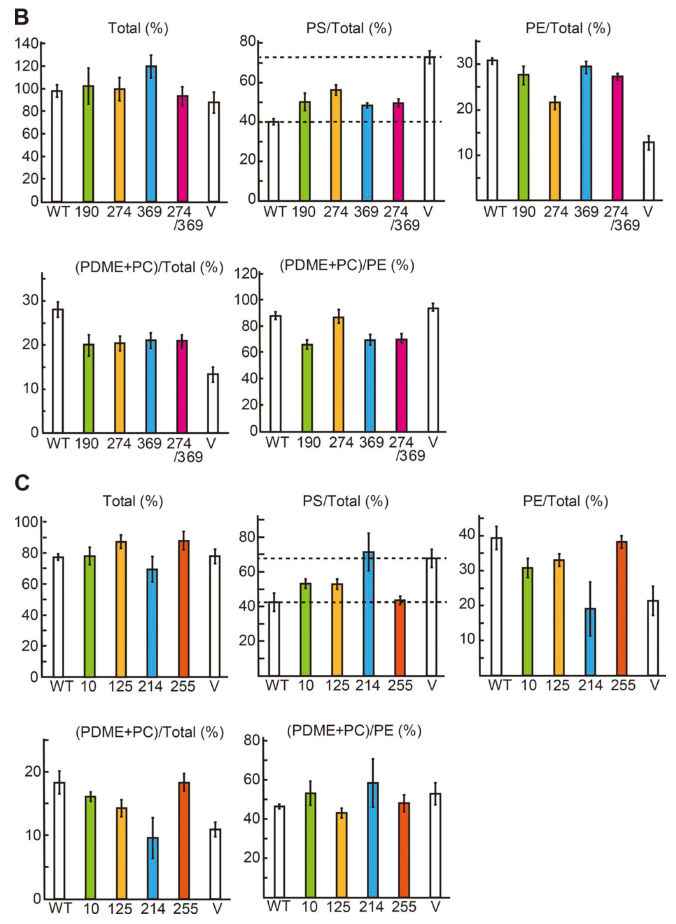

## Question

# Gene Research for Functional Annotation

## ⚠️ CRITICAL: Gene/Protein Identification Context

**BEFORE YOU BEGIN RESEARCH:** You MUST verify you are researching the CORRECT gene/protein. Gene symbols can be ambiguous, especially for less well-characterized genes from non-model organisms.

### Target Gene/Protein Identity (from UniProt):
- **UniProt Accession:** P41800
- **Protein Description:** RecName: Full=Maintenance of mitochondrial morphology protein 1 {ECO:0000255|HAMAP-Rule:MF_03103}; AltName: Full=Mitochondrial outer membrane protein MMM1 {ECO:0000255|HAMAP-Rule:MF_03103}; AltName: Full=Yeast mitochondrial escape protein 6 {ECO:0000255|HAMAP-Rule:MF_03103};
- **Gene Information:** Name=MMM1 {ECO:0000255|HAMAP-Rule:MF_03103}; Synonyms=YME6; OrderedLocusNames=YLL006W; ORFNames=L1357;
- **Organism (full):** Saccharomyces cerevisiae (strain ATCC 204508 / S288c) (Baker's yeast).
- **Protein Family:** Belongs to the MMM1 family. {ECO:0000255|HAMAP-
- **Key Domains:** Mmm1. (IPR027537); MMM1_dom. (IPR019411); SMP_LBD. (IPR031468); MMM1 (PF10296)

### MANDATORY VERIFICATION STEPS:

1. **Check if the gene symbol "MMM1" matches the protein description above**
2. **Verify the organism is correct:** Saccharomyces cerevisiae (strain ATCC 204508 / S288c) (Baker's yeast).
3. **Check if protein family/domains align with what you find in literature**
4. **If you find literature for a DIFFERENT gene with the same or similar symbol, STOP**

### If Gene Symbol is Ambiguous or You Cannot Find Relevant Literature:

**DO NOT PROCEED WITH RESEARCH ON A DIFFERENT GENE.** Instead:
- State clearly: "The gene symbol 'MMM1' is ambiguous or literature is limited for this specific protein"
- Explain what you found (e.g., "Found extensive literature on a different gene with the same symbol in a different organism")
- Describe the protein based ONLY on the UniProt information provided above
- Suggest that the protein function can be inferred from domain/family information

### Research Target:

Please provide a comprehensive research report on the gene **MMM1** (gene ID: MMM1, UniProt: P41800) in yeast.

The research report should be a detailed narrative explaining the function, biological processes, and localization of the gene product. Citations should be given for all claims.

You should prioritize authoritative reviews and primary scientific literature when conducting research. You can supplement
this with annotations you find in gene/protein databases, but these can be outdated or inaccurate.

We are specifically interested in the primary function of the gene - for enzymes, what reaction is catalyzed, and what is the substrate specificity? For transporters, what is the substrate? For structural proteins or adapters, what is the broader structural role? For signaling molecules, what is the role in the pathway.

We are interested in where in or outside the cell the gene product carries out its function.

We are also interested in the signaling or biochemical pathways in which the gene functions. We are less interested in broad pleiotropic effects, except where these elucidate the precise role.

Include evidence where possible. We are interested in both experimental evidence as well as inference from structure, evolution, or bioinformatic analysis. Precise studies should be prioritized over high-throughput, where available.

## Output

Question: You are an expert researcher providing comprehensive, well-cited information.

Provide detailed information focusing on:
1. Key concepts and definitions with current understanding
2. Recent developments and latest research (prioritize 2023-2024 sources)
3. Current applications and real-world implementations
4. Expert opinions and analysis from authoritative sources
5. Relevant statistics and data from recent studies

Format as a comprehensive research report with proper citations. Include URLs and publication dates where available.
Always prioritize recent, authoritative sources and provide specific citations for all major claims.

# Gene Research for Functional Annotation

## ⚠️ CRITICAL: Gene/Protein Identification Context

**BEFORE YOU BEGIN RESEARCH:** You MUST verify you are researching the CORRECT gene/protein. Gene symbols can be ambiguous, especially for less well-characterized genes from non-model organisms.

### Target Gene/Protein Identity (from UniProt):
- **UniProt Accession:** P41800
- **Protein Description:** RecName: Full=Maintenance of mitochondrial morphology protein 1 {ECO:0000255|HAMAP-Rule:MF_03103}; AltName: Full=Mitochondrial outer membrane protein MMM1 {ECO:0000255|HAMAP-Rule:MF_03103}; AltName: Full=Yeast mitochondrial escape protein 6 {ECO:0000255|HAMAP-Rule:MF_03103};
- **Gene Information:** Name=MMM1 {ECO:0000255|HAMAP-Rule:MF_03103}; Synonyms=YME6; OrderedLocusNames=YLL006W; ORFNames=L1357;
- **Organism (full):** Saccharomyces cerevisiae (strain ATCC 204508 / S288c) (Baker's yeast).
- **Protein Family:** Belongs to the MMM1 family. {ECO:0000255|HAMAP-
- **Key Domains:** Mmm1. (IPR027537); MMM1_dom. (IPR019411); SMP_LBD. (IPR031468); MMM1 (PF10296)

### MANDATORY VERIFICATION STEPS:

1. **Check if the gene symbol "MMM1" matches the protein description above**
2. **Verify the organism is correct:** Saccharomyces cerevisiae (strain ATCC 204508 / S288c) (Baker's yeast).
3. **Check if protein family/domains align with what you find in literature**
4. **If you find literature for a DIFFERENT gene with the same or similar symbol, STOP**

### If Gene Symbol is Ambiguous or You Cannot Find Relevant Literature:

**DO NOT PROCEED WITH RESEARCH ON A DIFFERENT GENE.** Instead:
- State clearly: "The gene symbol 'MMM1' is ambiguous or literature is limited for this specific protein"
- Explain what you found (e.g., "Found extensive literature on a different gene with the same symbol in a different organism")
- Describe the protein based ONLY on the UniProt information provided above
- Suggest that the protein function can be inferred from domain/family information

### Research Target:

Please provide a comprehensive research report on the gene **MMM1** (gene ID: MMM1, UniProt: P41800) in yeast.

The research report should be a detailed narrative explaining the function, biological processes, and localization of the gene product. Citations should be given for all claims.

You should prioritize authoritative reviews and primary scientific literature when conducting research. You can supplement
this with annotations you find in gene/protein databases, but these can be outdated or inaccurate.

We are specifically interested in the primary function of the gene - for enzymes, what reaction is catalyzed, and what is the substrate specificity? For transporters, what is the substrate? For structural proteins or adapters, what is the broader structural role? For signaling molecules, what is the role in the pathway.

We are interested in where in or outside the cell the gene product carries out its function.

We are also interested in the signaling or biochemical pathways in which the gene functions. We are less interested in broad pleiotropic effects, except where these elucidate the precise role.

Include evidence where possible. We are interested in both experimental evidence as well as inference from structure, evolution, or bioinformatic analysis. Precise studies should be prioritized over high-throughput, where available.

# Functional annotation of yeast **MMM1** (UniProt P41800)

## Identity and principal conclusion

The target is **MMM1/YLL006W**, also called **YME6**, from *Saccharomyces cerevisiae* S288c, as specified by the supplied UniProt record. The literature on yeast Mmm1 matches its annotated MMM1-family and synaptotagmin-like mitochondrial-lipid-binding protein (**SMP**) domain. Its historical alternative name, “mitochondrial outer membrane protein MMM1,” is potentially misleading: experiments identify **native Mmm1 as an endoplasmic-reticulum (ER) membrane protein**, positioned at ER–mitochondria contacts, not as the mitochondrial-membrane anchor of the complex. That anchor is principally Mdm10. The accession and locus identifiers come from the supplied record; the cited experiments independently establish the protein’s yeast ERMES identity, domain and localization. (ahyoung2015conservedsmpdomains pages 1-2, kornmann2009anermitochondriatethering pages 2-4, kornmann2009anermitochondriatethering pages 9-11)

**Best-supported functional annotation:** Mmm1 is the ER-anchored, phospholipid-binding and lipid-transfer subunit of the **ER–mitochondria encounter structure (ERMES)**. Together with Mdm12, Mdm34 and Mdm10, it helps tether the two organelles and move glycerophospholipids between their membranes. It is **not a phospholipid-synthesis enzyme**: no chemical reaction catalyzed by Mmm1 or enzyme-like substrate-to-product specificity has been demonstrated. Its transport role concerns movement of intact lipids, particularly phosphatidylserine (PS) along the ER-to-mitochondria pathway, rather than passage through an ion channel. (shin2018structure–functioninsightsinto pages 1-2, shin2018structure–functioninsightsinto pages 6-7, kornmann2009anermitochondriatethering pages 2-4)

## Where and how Mmm1 acts

Mmm1 has an N-terminal region in the **ER lumen**, a single ER-membrane-spanning segment and a large **cytosol-facing C-terminal SMP domain**. Domain boundaries used in a 2024 functional study were approximately residues 1–97 for the luminal region, 98–120 for the membrane anchor and 193–409 for the SMP domain. Its exposed SMP domain interacts with cytosolic Mdm12; Mdm12 connects to mitochondria-associated Mdm34, while Mdm10 resides in the mitochondrial outer membrane. Thus, Mmm1 carries out its principal activity **at the cytosolic interface between the ER and mitochondrion**, rather than inside the mitochondrial matrix or ER lumen. Glycosylation and synthetic-tether experiments support the ER assignment. (ahyoung2015conservedsmpdomains pages 1-2, jeong2017crystalstructuresof pages 1-3, covillcooke2024compositionalflexibilityof pages 5-8, kornmann2009anermitochondriatethering pages 9-11)

The SMP designation has a mechanistic meaning: this domain presents a hydrophobic lipid-binding environment that can shield phospholipid acyl chains from water during non-vesicular transfer. Biochemical sizing found an **Mmm1₂–Mdm12₂** subcomplex, with an Mmm1 SMP homodimer recruiting two Mdm12 molecules; Mdm12 can in turn engage Mdm34. Structural experiments revealed lipid-bound SMP cavities and interfaces consistent with this arrangement. An important species distinction is that a frequently cited **2.8-Å Mmm1 crystal structure used the *Zygosaccharomyces rouxii* homolog**, approximately 76% identical to *S. cerevisiae* Mmm1, in work that also examined its complex with *S. cerevisiae* Mdm12. Residue numbers from that homolog should not be assigned uncritically to P41800. (ahyoung2015conservedsmpdomains pages 3-4, jeong2017crystalstructuresof pages 1-3, jeong2017crystalstructuresof pages 4-5)

## Biochemical activity, substrates and pathway

Purified Mmm1 or Mdm12 alone exhibited weak liposome-to-liposome lipid transfer, whereas their assembled complex efficiently promoted lipid **extraction, transfer and insertion**. In one fluorescent-lipid assay, transfer of labeled **PS was approximately three times that of labeled phosphatidylethanolamine (PE)**. This is a measured preference **under those assay conditions**, not evidence that Mmm1 exclusively transports PS: biochemical studies also support interactions with PE and other glycerophospholipids, including phosphatidylcholine (PC) and phosphatidic acid. Lipid-pocket mutations compromised both purified-complex transfer and PS transport in ER/mitochondria-containing membrane fractions. The inspected experimental panels compare PS with PE transfer and show the effects of Mmm1 and Mdm12 mutations on the organelle-fraction assay. (shin2018structure–functioninsightsinto pages 6-7, jeong2017crystalstructuresof pages 3-4, shin2018structure–functioninsightsinto media fc732226, shin2018structure–functioninsightsinto media f1ce5edd, shin2018structure–functioninsightsinto pages 7-10)

The most clearly supported **physiological route** is ER-made **PS → mitochondrial uptake → decarboxylation to PE by Psd1**; PE can return toward the ER and be methylated by Cho2 and Opi3 to PC. **Psd1, not Mmm1, catalyzes PS decarboxylation.** In the original ERMES study, disrupting the complex slowed labeling through the PS-to-PC pathway by approximately **two- to fivefold**; later isolated-membrane experiments found impaired ER-to-mitochondria PS transfer after Mmm1 loss or mutation. The latter experiments controlled for major changes in the measured abundances of Mmm1/Mdm12, phospholipid-biosynthetic enzymes and a mitochondrial marker, although equal abundance cannot exclude every change in complex assembly or membrane organization. Steady-state lipid levels can obscure a defect in transport *rate*. (tamura2019organellecontactzones pages 4-5, kornmann2009anermitochondriatethering pages 4-5, shin2018structure–functioninsightsinto pages 6-7, shin2018structure–functioninsightsinto pages 7-10)

A labeled-PS-to-PE conversion assay measures **transport coupled to downstream metabolism**, not individual lipid molecules crossing an isolated Mmm1 protein. Its interpretation also depends on Psd1 localization and membrane-fraction purity; those potential confounders were considered in subsequent work. Alternative contact-site routes, including pathways involving **Vps13**, can partly compensate for ERMES deficiency. Accordingly, ERMES is an important route for phospholipid delivery in yeast, but should not be called the sole route or presumed to impose an invariant direction on every glycerophospholipid it binds. (tamura2019organellecontactzones pages 4-5, covillcooke2024compositionalflexibilityof pages 1-5, tamura2019organellecontactzones pages 3-4, tamura2017roleofintra pages 5-7)

## What 2023–2024 research changed

**Native architecture, 2023.** Wozny and colleagues combined quantitative imaging with in situ cryo-electron tomography and molecular modeling of *S. cerevisiae* ERMES. They reported approximately **25 discrete bridge-like assemblies per contact**, each modeled with **three SMP domains in a zig-zag arrangement**. A 2024 review of that study reports contact areas near **0.02 µm²**, an ER–mitochondria separation of approximately **20–25 nm**, and a **27-Å** reconstruction assembled from **1,098 subvolumes**. These measurements establish a native bridge architecture without requiring ERMES overexpression. A proposed lipid path through the bridges is a **structural model**: the reconstruction does not visualize individual lipids in transit or prove a continuously open, rigid tunnel. [Wozny *et al.*, *Nature*, May 2023](https://doi.org/10.1038/s41586-023-06050-3); [Ching *et al.*, *Contact*, January 2024](https://doi.org/10.1177/25152564241231364). (ching2024coolcontactscryoelectronmicroscopy pages 10-11)

**Possible minimal Mmm1 activity, 2024.** A **November 2024 bioRxiv preprint**, rather than a peer-reviewed 2024 publication, tested whether Mmm1 can work in more than one ERMES configuration. An engineered Mmm1 targeted to the mitochondrial outer membrane rescued growth and mitochondrial morphology even after deletion of **all four core ERMES genes**. Removing its SMP region abolished rescue; replacing its native ER anchor with an unrelated ER-targeting segment preserved it. Artificial tethering also rescued *mdm12Δ mdm34Δ* and *mdm12Δ vps13Δ* strains. The authors infer that appropriately positioned Mmm1 can be the only ERMES-derived lipid-transfer domain required in these engineered settings. **That is stronger evidence of functional sufficiency than of a native Mmm1-only complex:** growth and shape are indirect readouts, not direct measurements of lipid flux in the engineered cells. [Covill-Cooke *et al.*, bioRxiv, November 2024](https://doi.org/10.1101/2024.11.26.625358). (covillcooke2024compositionalflexibilityof pages 5-8, covillcooke2024compositionalflexibilityof pages 1-5)

The evidence, including the principal numerical measurements and their limits, is summarized below.

| Interpretation | Experimental basis and numbers | Strength / limitation | Paper, year, DOI |
|---|---|---|---|
| **Identity and topology:** Mmm1 is the ER-anchored subunit of the *S. cerevisiae* ER–mitochondria encounter structure (ERMES), with an N-terminal ER-luminal segment, one transmembrane anchor and a cytosolic C-terminal SMP domain. | Synthetic-tether screening identified Mmm1 with Mdm10, Mdm12 and Mdm34 as ERMES; glycosylation/topology and domain analyses place Mmm1 in the ER, whereas Mdm10 is embedded in the mitochondrial outer membrane. The SMP region is approximately residues 196–409. (ahyoung2015conservedsmpdomains pages 1-2, kornmann2009anermitochondriatethering pages 2-4, kornmann2009anermitochondriatethering pages 9-11) | **Strong:** genetic, localization, glycosylation and biochemical evidence converge. “Mitochondrial outer membrane protein MMM1” is a historical name and should not be interpreted as native outer-mitochondrial-membrane localization. | Kornmann *et al.* (2009), *Science*, [10.1126/science.1175088](https://doi.org/10.1126/science.1175088); AhYoung *et al.* (2015), *PNAS*, [10.1073/pnas.1422363112](https://doi.org/10.1073/pnas.1422363112) |
| **SMP lipid binding and assembly:** Mmm1 is a non-enzymatic glycerophospholipid-binding/transfer scaffold; its SMP homodimer recruits two Mdm12 molecules to form a 2:2 subcomplex. | SEC–MALS supported an Mmm1₂–Mdm12₂ heterotetramer; native MS/lipid analysis found approximately one phospholipid per Mdm12, principally copurifying PE and PG. A 2.8-Å structure showed a lipid-bound Mmm1 SMP dimer, and the Mdm12–Mmm1 complex adopted a central Mmm1 dimer capped by Mdm12. (ahyoung2015conservedsmpdomains pages 3-4, jeong2017crystalstructuresof pages 1-3, jeong2017crystalstructuresof pages 4-5) | **Strong assembly evidence; moderate substrate-specificity evidence.** The crystallized Mmm1 was the *Zygosaccharomyces rouxii* homolog, 76% identical to *S. cerevisiae* Mmm1, complexed with *S. cerevisiae* Mdm12; its residue numbers must not be assigned directly to P41800. | AhYoung *et al.* (2015), *PNAS*, [10.1073/pnas.1422363112](https://doi.org/10.1073/pnas.1422363112); Jeong *et al.* (2017), *PNAS*, [10.1073/pnas.1715592114](https://doi.org/10.1073/pnas.1715592114) |
| **Direct phospholipid transfer:** the Mmm1–Mdm12 module extracts and inserts glycerophospholipids and is a minimal robust transfer unit; phosphatidylserine (PS) is favored over phosphatidylethanolamine (PE) in the tested system. | Purified Mmm1 or Mdm12 alone transferred lipid weakly, whereas the assembled complex efficiently transferred lipid between liposomes. NBD-PS transfer was about **3-fold** greater than NBD-PE transfer. Lipid-pocket mutations reduced purified-complex activity and ER-to-mitochondria PS transport in radiolabeled heavy-membrane assays. (shin2018structure–functioninsightsinto pages 6-7, shin2018structure–functioninsightsinto media fc732226, shin2018structure–functioninsightsinto pages 7-10) | **Strong direct biochemical evidence.** PS preference is assay-dependent rather than absolute specificity: Mmm1 also binds/transfers other glycerophospholipids, and no catalytic reaction or fixed physiological direction is intrinsic to the purified proteins. | Kawano *et al.* (2018), *Journal of Cell Biology*, [10.1083/jcb.201704119](https://doi.org/10.1083/jcb.201704119) |
| **Physiological pathway:** Mmm1 facilitates ER-to-mitochondria delivery of PS for conversion by mitochondrial Psd1 to PE; PE can subsequently return to the ER for PC synthesis. | ERMES disruption slowed PS-to-PC pathway flux by approximately **2–5-fold** in metabolic-labeling experiments. Later fraction assays showed reduced PS transport with Mmm1/Mdm12 loss or lipid-pocket mutations while controlling major biosynthetic-enzyme and construct abundance. (tamura2019organellecontactzones pages 4-5, kornmann2009anermitochondriatethering pages 4-5, shin2018structure–functioninsightsinto pages 7-10) | **Moderate-to-strong:** conversion assays couple transport to downstream metabolism and can be influenced by organelle morphology, Psd1 localization and compensatory routes such as Vps13. Steady-state lipid abundance may remain near normal despite slower flux. | Kornmann *et al.* (2009), *Science*, [10.1126/science.1175088](https://doi.org/10.1126/science.1175088); Kawano *et al.* (2018), *JCB*, [10.1083/jcb.201704119](https://doi.org/10.1083/jcb.201704119) |
| **Native ERMES architecture:** Mmm1 participates in discrete bridge-like complexes spanning ER–mitochondria contact sites rather than forming one continuous macroscopic junction. | Integrative cryo-CLEM/cryo-ET reported approximately **25 bridges per contact**, with three SMP domains arranged in a zig-zag model. Contacts occupied about **0.02 µm²**, maintained an approximately **20–25-nm** membrane gap, and yielded a **27-Å** reconstruction from **1,098 subvolumes**. (ching2024coolcontactscryoelectronmicroscopy pages 10-11) | **Strong in-situ spatial evidence:** endogenous ERMES was examined without overexpression. At 27 Å, individual SMP identities and a continuous lipid path depend on integrative modeling; lipids moving through the bridges were not directly visualized. | Wozny *et al.* (2023), *Nature*, [10.1038/s41586-023-06050-3](https://doi.org/10.1038/s41586-023-06050-3); reviewed by Ching *et al.* (2024), [10.1177/25152564241231364](https://doi.org/10.1177/25152564241231364) |
| **Minimal Mmm1 sufficiency:** an appropriately membrane-tethered Mmm1 SMP domain may support ER–mitochondria lipid exchange without the other three core ERMES proteins. | Mitochondria-retargeted Mmm1 rescued growth and mitochondrial morphology in the quadruple *mmm1Δ mdm12Δ mdm34Δ mdm10Δ* mutant. Removing the SMP domain or membrane anchor abolished rescue; replacing the native anchor with Sec66-TM retained function, whereas analogous Mdm12/Mdm34 constructs did not. (covillcooke2024compositionalflexibilityof pages 5-8) | **Provocative but preliminary:** 2024 preprint using engineered targeting and indirect growth/morphology complementation, not direct lipid-flux measurement. It argues against an obligatorily fixed four-subunit conduit but does not establish native Mmm1-only complexes. | Covill-Cooke *et al.* (2024, bioRxiv preprint), [10.1101/2024.11.26.625358](https://doi.org/10.1101/2024.11.26.625358) |
| **CoQ organization is a downstream ERMES-linked phenotype, not evidence that Mmm1 directly transports CoQ.** | ERMES disruption destabilizes CoQ domains/synthome organization. A conventional *coq10Δ* cassette depleted both Mdm12 and Mmm1, whereas nonfunctional *COQ10* point/truncation alleles preserved ERMES; the R147* allele retained stable CoQ synthome assembly and efficient CoQ₆ production despite absent detectable Coq10. (novales2024nonfunctionalcoq10mutants pages 4-6, novales2024nonfunctionalcoq10mutants pages 2-4) | **Strong confounding-control study:** demonstrates that respiratory and CoQ phenotypes can arise indirectly through ERMES destabilization or neighboring-gene interference. No direct Mmm1–CoQ transport activity was shown. | Novales *et al.* (2024), *Journal of Biological Chemistry*, [10.1016/j.jbc.2024.107820](https://doi.org/10.1016/j.jbc.2024.107820) |

*Table: Evidence matrix separating well-supported Mmm1 identity, topology and lipid-transfer functions from modeled mechanisms and indirect physiological phenotypes. Quantitative results and important species, assay and publication-status limitations are shown alongside each source.*

## Biological interpretation and applications

ERMES loss changes mitochondrial morphology, respiration and mitochondrial-DNA maintenance; ERMES puncta have also been observed near replicating mitochondrial nucleoids. These findings make **MMM1 deletion, lipid-pocket mutants, synthetic ER–mitochondria tethers and organelle-fraction assays** useful research tools for separating contact formation from lipid-transfer activity. They do **not**, by themselves, establish that Mmm1 directly divides mitochondria, binds mitochondrial DNA or transports calcium. Genetic links to calcium-related pathways should not be mistaken for evidence that Mmm1 is a calcium channel. Its established direct functional assignment remains the **ER contact-site tether/lipid-transfer machinery**. (kornmann2009anermitochondriatethering pages 2-4, tamura2019organellecontactzones pages 3-4, kornmann2009anermitochondriatethering pages 4-5, kornmann2009anermitochondriatethering pages 1-2)

A useful recent example of why this distinction matters concerns coenzyme Q (CoQ). ERMES integrity is associated with organization of mitochondrial CoQ-biosynthetic domains, but that does **not** establish CoQ as an Mmm1 cargo. In a [November 2024 *Journal of Biological Chemistry* study](https://doi.org/10.1016/j.jbc.2024.107820), a conventional *COQ10* deletion also depleted **Mdm12 and Mmm1**; cleaner nonfunctional *COQ10* alleles preserved ERMES and distinguished Coq10-specific respiratory defects from effects caused by ERMES disruption. This is an experimental warning against assigning every mitochondrial or CoQ phenotype to direct Mmm1 transport. (novales2024nonfunctionalcoq10mutants pages 4-6, novales2024nonfunctionalcoq10mutants pages 2-4)

**Overall assessment:** Direct reconstitution and organelle-fraction measurements strongly support a **phospholipid-binding and transfer role for ER-anchored Mmm1, especially in the ER-to-mitochondria PS pathway**. Native imaging establishes its ERMES bridge setting. Precisely how lipids move between SMP domains, how much flux an intact native bridge carries, and when Mmm1 can act independently of its partner subunits remain open mechanistic questions rather than established enzyme reactions or fixed substrate rules. (shin2018structure–functioninsightsinto pages 6-7, covillcooke2024compositionalflexibilityof pages 5-8, ching2024coolcontactscryoelectronmicroscopy pages 10-11)

References

1. (ahyoung2015conservedsmpdomains pages 1-2): Andrew P. AhYoung, Jiansen Jiang, Jiang Zhang, Xuan Khoi Dang, J. Loo, Hong Z. Zhou, and Pascal F. Egea. Conserved smp domains of the ermes complex bind phospholipids and mediate tether assembly. Proceedings of the National Academy of Sciences, 112:E3179-E3188, Jun 2015. URL: https://doi.org/10.1073/pnas.1422363112, doi:10.1073/pnas.1422363112. This article has 199 citations and is from a highest quality peer-reviewed journal.

2. (kornmann2009anermitochondriatethering pages 2-4): Benoît Kornmann, Erin Currie, Sean R. Collins, Maya Schuldiner, Jodi Nunnari, Jonathan S. Weissman, and Peter Walter. An er-mitochondria tethering complex revealed by a synthetic biology screen. Science, 325:477-481, Jul 2009. URL: https://doi.org/10.1126/science.1175088, doi:10.1126/science.1175088. This article has 1555 citations and is from a highest quality peer-reviewed journal.

3. (kornmann2009anermitochondriatethering pages 9-11): Benoît Kornmann, Erin Currie, Sean R. Collins, Maya Schuldiner, Jodi Nunnari, Jonathan S. Weissman, and Peter Walter. An er-mitochondria tethering complex revealed by a synthetic biology screen. Science, 325:477-481, Jul 2009. URL: https://doi.org/10.1126/science.1175088, doi:10.1126/science.1175088. This article has 1555 citations and is from a highest quality peer-reviewed journal.

4. (shin2018structure–functioninsightsinto pages 1-2): Shin Kawano, Yasushi Tamura, Rieko Kojima, Siqin Bala, Eri Asai, Agnès H. Michel, Benoît Kornmann, Isabelle Riezman, Howard Riezman, Yoshitake Sakae, Yuko Okamoto, and Toshiya Endo. Structure–function insights into direct lipid transfer between membranes by mmm1–mdm12 of ermes. The Journal of Cell Biology, 217:959-974, Mar 2018. URL: https://doi.org/10.1083/jcb.201704119, doi:10.1083/jcb.201704119. This article has 183 citations.

5. (shin2018structure–functioninsightsinto pages 6-7): Shin Kawano, Yasushi Tamura, Rieko Kojima, Siqin Bala, Eri Asai, Agnès H. Michel, Benoît Kornmann, Isabelle Riezman, Howard Riezman, Yoshitake Sakae, Yuko Okamoto, and Toshiya Endo. Structure–function insights into direct lipid transfer between membranes by mmm1–mdm12 of ermes. The Journal of Cell Biology, 217:959-974, Mar 2018. URL: https://doi.org/10.1083/jcb.201704119, doi:10.1083/jcb.201704119. This article has 183 citations.

6. (jeong2017crystalstructuresof pages 1-3): Hanbin Jeong, Jumi Park, Youngsoo Jun, and Changwook Lee. Crystal structures of mmm1 and mdm12–mmm1 reveal mechanistic insight into phospholipid trafficking at er-mitochondria contact sites. Proceedings of the National Academy of Sciences, 114:E9502-E9511, Oct 2017. URL: https://doi.org/10.1073/pnas.1715592114, doi:10.1073/pnas.1715592114. This article has 131 citations and is from a highest quality peer-reviewed journal.

7. (covillcooke2024compositionalflexibilityof pages 5-8): Christian Covill-Cooke, Takashi Hirashima, Shin Kawano, Joe Ganellin, Andrew Moody, Sabine N. S. van Schie, Arun T. John Peter, Chika Saito, Toshiya Endo, and Benoît Kornmann. Compositional flexibility of the er-mitochondria encounter structure. bioRxiv, Nov 2024. URL: https://doi.org/10.1101/2024.11.26.625358, doi:10.1101/2024.11.26.625358. This article has 0 citations.

8. (ahyoung2015conservedsmpdomains pages 3-4): Andrew P. AhYoung, Jiansen Jiang, Jiang Zhang, Xuan Khoi Dang, J. Loo, Hong Z. Zhou, and Pascal F. Egea. Conserved smp domains of the ermes complex bind phospholipids and mediate tether assembly. Proceedings of the National Academy of Sciences, 112:E3179-E3188, Jun 2015. URL: https://doi.org/10.1073/pnas.1422363112, doi:10.1073/pnas.1422363112. This article has 199 citations and is from a highest quality peer-reviewed journal.

9. (jeong2017crystalstructuresof pages 4-5): Hanbin Jeong, Jumi Park, Youngsoo Jun, and Changwook Lee. Crystal structures of mmm1 and mdm12–mmm1 reveal mechanistic insight into phospholipid trafficking at er-mitochondria contact sites. Proceedings of the National Academy of Sciences, 114:E9502-E9511, Oct 2017. URL: https://doi.org/10.1073/pnas.1715592114, doi:10.1073/pnas.1715592114. This article has 131 citations and is from a highest quality peer-reviewed journal.

10. (jeong2017crystalstructuresof pages 3-4): Hanbin Jeong, Jumi Park, Youngsoo Jun, and Changwook Lee. Crystal structures of mmm1 and mdm12–mmm1 reveal mechanistic insight into phospholipid trafficking at er-mitochondria contact sites. Proceedings of the National Academy of Sciences, 114:E9502-E9511, Oct 2017. URL: https://doi.org/10.1073/pnas.1715592114, doi:10.1073/pnas.1715592114. This article has 131 citations and is from a highest quality peer-reviewed journal.

11. (shin2018structure–functioninsightsinto media fc732226): Shin Kawano, Yasushi Tamura, Rieko Kojima, Siqin Bala, Eri Asai, Agnès H. Michel, Benoît Kornmann, Isabelle Riezman, Howard Riezman, Yoshitake Sakae, Yuko Okamoto, and Toshiya Endo. Structure–function insights into direct lipid transfer between membranes by mmm1–mdm12 of ermes. The Journal of Cell Biology, 217:959-974, Mar 2018. URL: https://doi.org/10.1083/jcb.201704119, doi:10.1083/jcb.201704119. This article has 183 citations.

12. (shin2018structure–functioninsightsinto media f1ce5edd): Shin Kawano, Yasushi Tamura, Rieko Kojima, Siqin Bala, Eri Asai, Agnès H. Michel, Benoît Kornmann, Isabelle Riezman, Howard Riezman, Yoshitake Sakae, Yuko Okamoto, and Toshiya Endo. Structure–function insights into direct lipid transfer between membranes by mmm1–mdm12 of ermes. The Journal of Cell Biology, 217:959-974, Mar 2018. URL: https://doi.org/10.1083/jcb.201704119, doi:10.1083/jcb.201704119. This article has 183 citations.

13. (shin2018structure–functioninsightsinto pages 7-10): Shin Kawano, Yasushi Tamura, Rieko Kojima, Siqin Bala, Eri Asai, Agnès H. Michel, Benoît Kornmann, Isabelle Riezman, Howard Riezman, Yoshitake Sakae, Yuko Okamoto, and Toshiya Endo. Structure–function insights into direct lipid transfer between membranes by mmm1–mdm12 of ermes. The Journal of Cell Biology, 217:959-974, Mar 2018. URL: https://doi.org/10.1083/jcb.201704119, doi:10.1083/jcb.201704119. This article has 183 citations.

14. (tamura2019organellecontactzones pages 4-5): Yasushi Tamura, Shin Kawano, and Toshiya Endo. Organelle contact zones as sites for lipid transfer. The Journal of Biochemistry, 165:115–123, Oct 2019. URL: https://doi.org/10.1093/jb/mvy088, doi:10.1093/jb/mvy088. This article has 74 citations.

15. (kornmann2009anermitochondriatethering pages 4-5): Benoît Kornmann, Erin Currie, Sean R. Collins, Maya Schuldiner, Jodi Nunnari, Jonathan S. Weissman, and Peter Walter. An er-mitochondria tethering complex revealed by a synthetic biology screen. Science, 325:477-481, Jul 2009. URL: https://doi.org/10.1126/science.1175088, doi:10.1126/science.1175088. This article has 1555 citations and is from a highest quality peer-reviewed journal.

16. (covillcooke2024compositionalflexibilityof pages 1-5): Christian Covill-Cooke, Takashi Hirashima, Shin Kawano, Joe Ganellin, Andrew Moody, Sabine N. S. van Schie, Arun T. John Peter, Chika Saito, Toshiya Endo, and Benoît Kornmann. Compositional flexibility of the er-mitochondria encounter structure. bioRxiv, Nov 2024. URL: https://doi.org/10.1101/2024.11.26.625358, doi:10.1101/2024.11.26.625358. This article has 0 citations.

17. (tamura2019organellecontactzones pages 3-4): Yasushi Tamura, Shin Kawano, and Toshiya Endo. Organelle contact zones as sites for lipid transfer. The Journal of Biochemistry, 165:115–123, Oct 2019. URL: https://doi.org/10.1093/jb/mvy088, doi:10.1093/jb/mvy088. This article has 74 citations.

18. (tamura2017roleofintra pages 5-7): Yasushi Tamura and Toshiya Endo. Role of intra- and inter-mitochondrial membrane contact sites in yeast phospholipid biogenesis. Advances in experimental medicine and biology, 997:121-133, Jan 2017. URL: https://doi.org/10.1007/978-981-10-4567-7\_9, doi:10.1007/978-981-10-4567-7\_9. This article has 32 citations and is from a peer-reviewed journal.

19. (ching2024coolcontactscryoelectronmicroscopy pages 10-11): Cyan Ching, Julien Maufront, Aurélie di Cicco, Daniel Lévy, and Manuela Dezi. Cool-contacts: cryo-electron microscopy of membrane contact sites and their components. Contact, Jan 2024. URL: https://doi.org/10.1177/25152564241231364, doi:10.1177/25152564241231364. This article has 13 citations.

20. (novales2024nonfunctionalcoq10mutants pages 4-6): Noelle Alexa Novales, Kelsey J. Feustel, Kevin L. He, Guillaume F. Chanfreau, and Catherine F. Clarke. Nonfunctional coq10 mutants maintain the ermes complex and reveal true phenotypes associated with the loss of the coenzyme q chaperone protein coq10. Journal of Biological Chemistry, 300:107820, Nov 2024. URL: https://doi.org/10.1016/j.jbc.2024.107820, doi:10.1016/j.jbc.2024.107820. This article has 6 citations and is from a domain leading peer-reviewed journal.

21. (novales2024nonfunctionalcoq10mutants pages 2-4): Noelle Alexa Novales, Kelsey J. Feustel, Kevin L. He, Guillaume F. Chanfreau, and Catherine F. Clarke. Nonfunctional coq10 mutants maintain the ermes complex and reveal true phenotypes associated with the loss of the coenzyme q chaperone protein coq10. Journal of Biological Chemistry, 300:107820, Nov 2024. URL: https://doi.org/10.1016/j.jbc.2024.107820, doi:10.1016/j.jbc.2024.107820. This article has 6 citations and is from a domain leading peer-reviewed journal.

22. (kornmann2009anermitochondriatethering pages 1-2): Benoît Kornmann, Erin Currie, Sean R. Collins, Maya Schuldiner, Jodi Nunnari, Jonathan S. Weissman, and Peter Walter. An er-mitochondria tethering complex revealed by a synthetic biology screen. Science, 325:477-481, Jul 2009. URL: https://doi.org/10.1126/science.1175088, doi:10.1126/science.1175088. This article has 1555 citations and is from a highest quality peer-reviewed journal.

## Artifacts

- [Edison artifact artifact-00](MMM1-deep-research-falcon_artifacts/artifact-00.md)

## Citations

1. ching2024coolcontactscryoelectronmicroscopy pages 10-11
2. covillcooke2024compositionalflexibilityof pages 5-8
3. ahyoung2015conservedsmpdomains pages 1-2
4. kornmann2009anermitochondriatethering pages 2-4
5. kornmann2009anermitochondriatethering pages 9-11
6. jeong2017crystalstructuresof pages 1-3
7. ahyoung2015conservedsmpdomains pages 3-4
8. jeong2017crystalstructuresof pages 4-5
9. jeong2017crystalstructuresof pages 3-4
10. tamura2019organellecontactzones pages 4-5
11. kornmann2009anermitochondriatethering pages 4-5
12. covillcooke2024compositionalflexibilityof pages 1-5
13. tamura2019organellecontactzones pages 3-4
14. tamura2017roleofintra pages 5-7
15. kornmann2009anermitochondriatethering pages 1-2
16. Wozny *et al.*, *Nature*, May 2023
17. Ching *et al.*, *Contact*, January 2024
18. Covill-Cooke *et al.*, bioRxiv, November 2024
19. 10.1126/science.1175088
20. 10.1073/pnas.1422363112
21. 10.1073/pnas.1715592114
22. 10.1083/jcb.201704119
23. 10.1038/s41586-023-06050-3
24. 10.1177/25152564241231364
25. 10.1101/2024.11.26.625358
26. 10.1016/j.jbc.2024.107820
27. November 2024 *Journal of Biological Chemistry* study
28. https://doi.org/10.1038/s41586-023-06050-3
29. https://doi.org/10.1177/25152564241231364
30. https://doi.org/10.1101/2024.11.26.625358
31. https://doi.org/10.1126/science.1175088
32. https://doi.org/10.1073/pnas.1422363112
33. https://doi.org/10.1073/pnas.1715592114
34. https://doi.org/10.1083/jcb.201704119
35. https://doi.org/10.1016/j.jbc.2024.107820
36. https://doi.org/10.1073/pnas.1422363112,
37. https://doi.org/10.1126/science.1175088,
38. https://doi.org/10.1083/jcb.201704119,
39. https://doi.org/10.1073/pnas.1715592114,
40. https://doi.org/10.1101/2024.11.26.625358,
41. https://doi.org/10.1093/jb/mvy088,
42. https://doi.org/10.1007/978-981-10-4567-7\_9,
43. https://doi.org/10.1177/25152564241231364,
44. https://doi.org/10.1016/j.jbc.2024.107820,