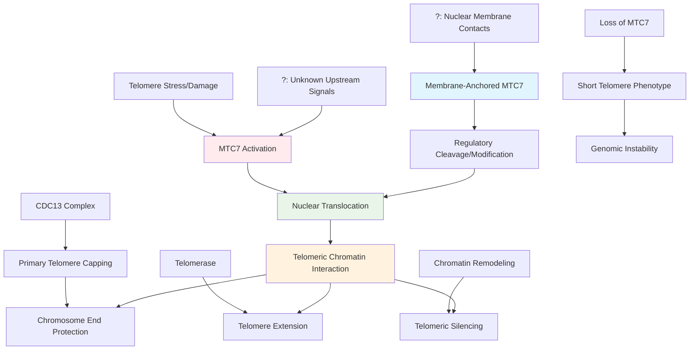

# Pathway Summary for MTC7

## Overview
MTC7 (Maintenance of Telomere Capping protein 7) is a small membrane protein that contributes to telomere maintenance and chromosome end protection in S. cerevisiae [PMID:18845848]. The protein exhibits unique structural features including two transmembrane helices and an exceptionally charged C-terminal domain containing eight consecutive lysines that serves as a strong nuclear localization signal [file:yeast/MTC7/MTC7-bioinformatics/RESULTS.md]. MTC7 was identified through genetic screens as a suppressor of cdc13-1 temperature-sensitive phenotypes, indicating its role in maintaining telomere capping integrity under stress conditions. Despite its clear genetic involvement in telomere biology, the precise molecular mechanism of MTC7 action remains to be elucidated.

## Telomere Capping and Chromosome End Protection

MTC7 functions as a component of the telomere maintenance network, specifically contributing to telomere capping - the process by which chromosome ends are protected from recognition as DNA double-strand breaks [PMID:18845848]. The protein was identified in a genome-wide screen for genes that genetically interact with the essential telomere capping protein Cdc13, with mtc7Δ mutants showing synthetic growth defects in combination with cdc13-1.

The telomere capping function involves multiple protein complexes that bind and protect telomeric DNA sequences. While MTC7 is not a core component of the major telomere-binding complexes, its genetic interactions suggest it plays a supportive or regulatory role in maintaining telomere structure. The protein may contribute to telomere accessibility, chromatin organization at telomeric regions, or signaling pathways that respond to telomere dysfunction.

MTC7 deletion alone results in shortened telomeres, indicating that the protein positively contributes to telomere length maintenance [PMID:18845848]. This phenotype suggests MTC7 may influence telomerase access to chromosome ends or affect the balance between telomere extension and degradation processes.

## Membrane-Nuclear Shuttling and Dual Localization

The structural organization of MTC7 suggests a novel mechanism for telomere regulation involving membrane-nuclear communication. Bioinformatics analysis reveals that MTC7 contains two transmembrane helices (positions 13-33 and 42-62) that anchor the protein to cellular membranes, while the C-terminal domain contains an exceptionally strong nuclear localization signal consisting of eight consecutive lysines [file:yeast/MTC7/MTC7-bioinformatics/RESULTS.md].

This dual localization capability suggests that MTC7 may function through regulated shuttling between membrane and nuclear compartments. Under certain conditions, the protein may be released from membrane anchoring and transported to the nucleus where it can interact with telomeric chromatin or telomere maintenance machinery. The highly charged C-terminal domain may facilitate interactions with acidic phospholipids at membranes or with DNA/chromatin in the nucleus.

The Type II membrane protein topology predicted for MTC7, with both N- and C-termini in the cytoplasm, positions the nuclear localization signal for potential regulatory cleavage or modification that could trigger nuclear translocation [file:yeast/MTC7/MTC7-bioinformatics/RESULTS.md].

## Chromatin Organization and Telomeric Silencing

MTC7's involvement in telomere maintenance likely extends to chromatin organization and gene silencing at telomeric regions. Genetic clustering analysis has linked MTC7 with factors involved in chromatin regulation and heterochromatin formation, suggesting it may contribute to the specialized chromatin structure required for telomere function [PMID:18845848].

Telomeric regions in S. cerevisiae are subject to position-dependent silencing effects that spread from chromosome ends inward. MTC7 may participate in establishing or maintaining this silenced chromatin state, which is crucial for both telomere protection and the regulation of subtelomeric gene expression. The protein's membrane association could provide a mechanism for sequestering telomeric chromatin at the nuclear periphery, a common feature of heterochromatic regions.

## Stress Response and Temperature Sensitivity

The identification of MTC7 through temperature-sensitive genetic interactions highlights its importance under cellular stress conditions. The cdc13-1 strain, which has defective telomere capping at restrictive temperatures, shows enhanced sensitivity when combined with mtc7Δ, indicating that MTC7 function becomes critical when the primary telomere capping machinery is compromised [PMID:18845848].

This stress-dependent function suggests that MTC7 may be part of a backup or auxiliary system for telomere maintenance that is activated under conditions of telomere stress or dysfunction. The protein may respond to signals indicating telomere uncapping or damage, potentially through changes in its subcellular localization or protein interactions.

## Pathway Diagram

## Integration with DNA Damage Response

MTC7's role in telomere maintenance connects it to broader DNA damage response pathways. Telomere dysfunction triggers DNA damage checkpoints and can lead to cell cycle arrest or apoptosis if not properly resolved. MTC7 may help prevent inappropriate activation of these pathways by maintaining proper telomere structure and signaling.

The protein may interact with or regulate components of the DNA damage response machinery, ensuring that normal telomeres are not recognized as sites of DNA breaks. This function would be particularly important during DNA replication when telomeres are most vulnerable to degradation or inappropriate processing.

## Cell Cycle and Replication Timing

Telomere maintenance is closely coordinated with cell cycle progression and DNA replication. MTC7 may contribute to the proper timing of telomerase action or the coordination of telomere replication with the rest of the genome. The protein's membrane localization could provide a mechanism for sequestering telomere maintenance factors until the appropriate cell cycle stage.

The regulation of MTC7 localization and activity may be cell cycle-dependent, with nuclear translocation occurring during specific phases when telomere maintenance activities are required. This temporal regulation would ensure that telomere maintenance does not interfere with other nuclear processes.

## Evolutionary and Comparative Aspects

MTC7 appears to be conserved primarily among closely related fungi, with no clear orthologs identified in higher eukaryotes [file:yeast/MTC7/MTC7-deep-research.md]. This limited conservation suggests that MTC7 may represent a fungi-specific solution to telomere maintenance challenges, possibly related to the unique aspects of yeast telomere biology.

Despite the lack of direct homologs, the functional themes associated with MTC7 - telomere capping, membrane-nuclear communication, and stress response - are conserved across eukaryotes. Understanding MTC7 function may provide insights into general principles of telomere regulation that are implemented through different molecular mechanisms in various organisms.

## Research and Biotechnological Significance

MTC7 represents an important model for understanding auxiliary telomere maintenance mechanisms and the integration of membrane and nuclear signaling in chromosome biology. The protein's unique structural features - combining transmembrane domains with nuclear localization signals - make it a valuable system for studying regulated protein translocation and dual compartment function.

The stress-dependent nature of MTC7 function has implications for understanding cellular aging and genomic stability. In biotechnology applications, modulation of MTC7 activity could potentially be used to influence telomere length and cellular lifespan in yeast-based production systems.

Further research on MTC7 mechanism could reveal novel targets for therapeutic intervention in telomere-related diseases or aging processes, even if direct orthologs are not present in humans. The principles discovered through MTC7 study may apply to other membrane-nuclear signaling systems involved in genome maintenance.