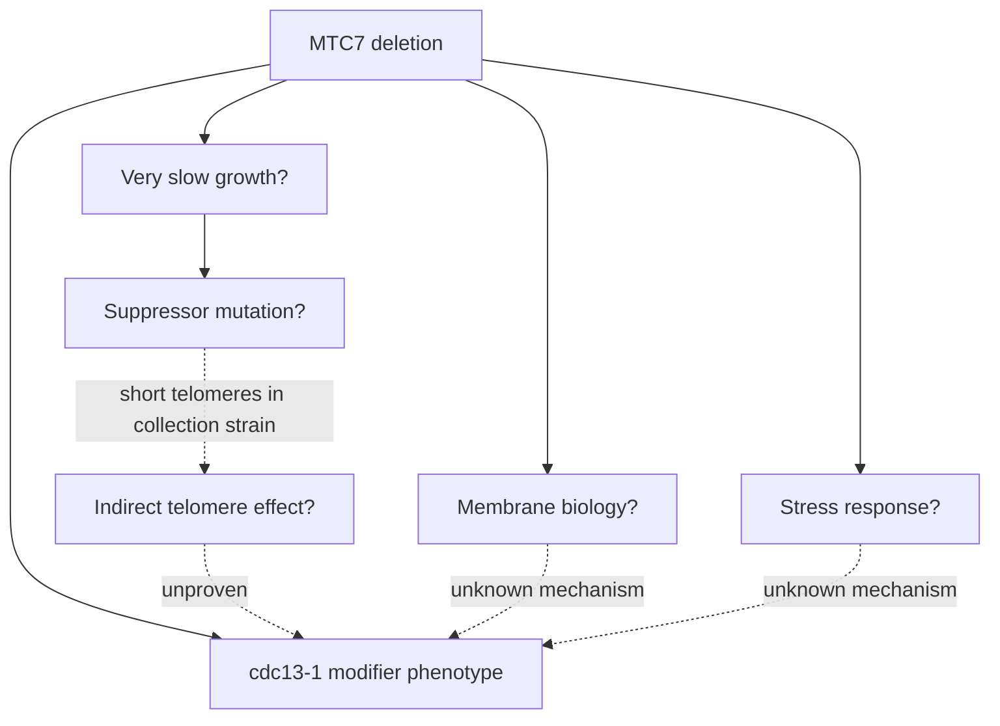

# Pathway Summary for MTC7

## Overview

MTC7 is not yet placed in a defined pathway. Its UniProt entry describes Mtc7 as a small predicted multi-pass membrane protein with two transmembrane helices, and the local bioinformatics analysis supports the same broad topology: two N-terminal hydrophobic helices followed by a basic, likely disordered C-terminal region [file:yeast/MTC7/MTC7-bioinformatics/RESULTS.md].

The telomere-capping name comes from a genome-wide *cdc13-1* genetic-interaction screen that identified many deletions with subtle effects on the growth of telomere-uncapping strains [PMID:18845848]. That screen is useful evidence that MTC7 is worth testing in telomere biology, but it does not establish Mtc7 as a structural capping factor, a CST-complex component, a telomerase regulator, or a direct telomere-localized protein.

## Telomere Hypothesis

Addinall et al. used the yeast deletion collection to search for genes that suppress, enhance, or modify the reversibility of *cdc13-1* temperature sensitivity. The screen recovered expected DNA damage checkpoint, telomerase, and nonsense-mediated decay genes and also a larger set of previously uncharacterized genes that the authors named RTC or MTC [PMID:18845848].

Two constraints keep the MTC7 model unresolved:

- The *cdc13-1* result is a high-throughput genetic phenotype. It does not distinguish direct chromosome-end capping from indirect changes in growth, stress tolerance, proteostasis, membrane biology, or the cellular response to uncapped telomeres.
- An earlier genome-wide telomere-length screen flagged YEL033W but then showed that its short-telomere phenotype did not cosegregate with the YEL033W deletion marker. Askree et al. concluded instead that the deletion segregated with very slow growth while the short telomeres segregated with a suppressor mutation, leaving only an indirect candidate interaction with an unidentified telomere-function gene [PMID:15161972].

## Membrane Protein Features

Mtc7 has two predicted transmembrane helices near its N terminus and a lysine-rich C-terminal tail [file:yeast/MTC7/MTC7-bioinformatics/RESULTS.md]. These features support the current membrane cellular-component annotation, but they do not explain the *cdc13-1* genetic interaction. The charged tail could mediate protein, lipid, or nucleic-acid contacts, and the membrane anchor could place Mtc7 at an endomembrane compartment; both ideas remain hypotheses until Mtc7 is localized and its interaction partners are identified.

## Working Model

```mermaid
flowchart TD
    A["MTC7 deletion"] --> B["cdc13-1 modifier phenotype"]
    A --> C["Very slow growth?"]
    C --> D["Suppressor mutation?"]
    D -. "short telomeres in collection strain" .-> E["Indirect telomere effect?"]
    A --> F["Membrane biology?"]
    A --> G["Stress response?"]
    E -. "unproven" .-> B
    F -. "unknown mechanism" .-> B
    G -. "unknown mechanism" .-> B
```

## Experiments Needed

The pathway question for MTC7 is still open. The most direct next tests are to localize endogenously tagged, functional Mtc7; compare telomere length and single-stranded telomeric DNA in freshly reconstructed *mtc7* mutants; and identify physical interactors during ordinary growth and *cdc13-1* telomere-uncapping stress.
