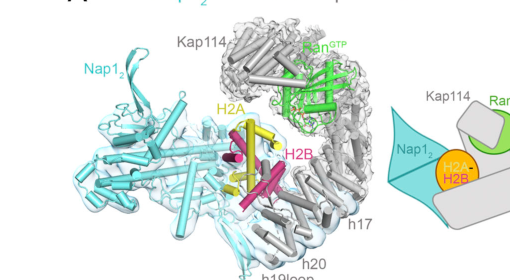

## Question

# Gene Research for Functional Annotation

## ⚠️ CRITICAL: Gene/Protein Identification Context

**BEFORE YOU BEGIN RESEARCH:** You MUST verify you are researching the CORRECT gene/protein. Gene symbols can be ambiguous, especially for less well-characterized genes from non-model organisms.

### Target Gene/Protein Identity (from UniProt):
- **UniProt Accession:** P25293
- **Protein Description:** RecName: Full=Nucleosome assembly protein {ECO:0000303|PubMed:2016313}; AltName: Full=Histone H2A-H2B chaperone NAP1 {ECO:0000305}; AltName: Full=Protein chaperone NAP1 {ECO:0000305}; AltName: Full=Ribosome assembly chaperone NAP1 {ECO:0000305};
- **Gene Information:** Name=NAP1 {ECO:0000303|PubMed:2016313}; OrderedLocusNames=YKR048C {ECO:0000312|SGD:S000001756};
- **Organism (full):** Saccharomyces cerevisiae (strain ATCC 204508 / S288c) (Baker's yeast).
- **Protein Family:** Belongs to the nucleosome assembly protein (NAP) family.
- **Key Domains:** NAP-like_sf. (IPR037231); NAP_family. (IPR002164); NAP (PF00956)

### MANDATORY VERIFICATION STEPS:

1. **Check if the gene symbol "NAP1" matches the protein description above**
2. **Verify the organism is correct:** Saccharomyces cerevisiae (strain ATCC 204508 / S288c) (Baker's yeast).
3. **Check if protein family/domains align with what you find in literature**
4. **If you find literature for a DIFFERENT gene with the same or similar symbol, STOP**

### If Gene Symbol is Ambiguous or You Cannot Find Relevant Literature:

**DO NOT PROCEED WITH RESEARCH ON A DIFFERENT GENE.** Instead:
- State clearly: "The gene symbol 'NAP1' is ambiguous or literature is limited for this specific protein"
- Explain what you found (e.g., "Found extensive literature on a different gene with the same symbol in a different organism")
- Describe the protein based ONLY on the UniProt information provided above
- Suggest that the protein function can be inferred from domain/family information

### Research Target:

Please provide a comprehensive research report on the gene **NAP1** (gene ID: NAP1, UniProt: P25293) in yeast.

The research report should be a detailed narrative explaining the function, biological processes, and localization of the gene product. Citations should be given for all claims.

You should prioritize authoritative reviews and primary scientific literature when conducting research. You can supplement
this with annotations you find in gene/protein databases, but these can be outdated or inaccurate.

We are specifically interested in the primary function of the gene - for enzymes, what reaction is catalyzed, and what is the substrate specificity? For transporters, what is the substrate? For structural proteins or adapters, what is the broader structural role? For signaling molecules, what is the role in the pathway.

We are interested in where in or outside the cell the gene product carries out its function.

We are also interested in the signaling or biochemical pathways in which the gene functions. We are less interested in broad pleiotropic effects, except where these elucidate the precise role.

Include evidence where possible. We are interested in both experimental evidence as well as inference from structure, evolution, or bioinformatic analysis. Precise studies should be prioritized over high-throughput, where available.

## Output

Question: You are an expert researcher providing comprehensive, well-cited information.

Provide detailed information focusing on:
1. Key concepts and definitions with current understanding
2. Recent developments and latest research (prioritize 2023-2024 sources)
3. Current applications and real-world implementations
4. Expert opinions and analysis from authoritative sources
5. Relevant statistics and data from recent studies

Format as a comprehensive research report with proper citations. Include URLs and publication dates where available.
Always prioritize recent, authoritative sources and provide specific citations for all major claims.

# Gene Research for Functional Annotation

## ⚠️ CRITICAL: Gene/Protein Identification Context

**BEFORE YOU BEGIN RESEARCH:** You MUST verify you are researching the CORRECT gene/protein. Gene symbols can be ambiguous, especially for less well-characterized genes from non-model organisms.

### Target Gene/Protein Identity (from UniProt):
- **UniProt Accession:** P25293
- **Protein Description:** RecName: Full=Nucleosome assembly protein {ECO:0000303|PubMed:2016313}; AltName: Full=Histone H2A-H2B chaperone NAP1 {ECO:0000305}; AltName: Full=Protein chaperone NAP1 {ECO:0000305}; AltName: Full=Ribosome assembly chaperone NAP1 {ECO:0000305};
- **Gene Information:** Name=NAP1 {ECO:0000303|PubMed:2016313}; OrderedLocusNames=YKR048C {ECO:0000312|SGD:S000001756};
- **Organism (full):** Saccharomyces cerevisiae (strain ATCC 204508 / S288c) (Baker's yeast).
- **Protein Family:** Belongs to the nucleosome assembly protein (NAP) family.
- **Key Domains:** NAP-like_sf. (IPR037231); NAP_family. (IPR002164); NAP (PF00956)

### MANDATORY VERIFICATION STEPS:

1. **Check if the gene symbol "NAP1" matches the protein description above**
2. **Verify the organism is correct:** Saccharomyces cerevisiae (strain ATCC 204508 / S288c) (Baker's yeast).
3. **Check if protein family/domains align with what you find in literature**
4. **If you find literature for a DIFFERENT gene with the same or similar symbol, STOP**

### If Gene Symbol is Ambiguous or You Cannot Find Relevant Literature:

**DO NOT PROCEED WITH RESEARCH ON A DIFFERENT GENE.** Instead:
- State clearly: "The gene symbol 'NAP1' is ambiguous or literature is limited for this specific protein"
- Explain what you found (e.g., "Found extensive literature on a different gene with the same symbol in a different organism")
- Describe the protein based ONLY on the UniProt information provided above
- Suggest that the protein function can be inferred from domain/family information

### Research Target:

Please provide a comprehensive research report on the gene **NAP1** (gene ID: NAP1, UniProt: P25293) in yeast.

The research report should be a detailed narrative explaining the function, biological processes, and localization of the gene product. Citations should be given for all claims.

You should prioritize authoritative reviews and primary scientific literature when conducting research. You can supplement
this with annotations you find in gene/protein databases, but these can be outdated or inaccurate.

We are specifically interested in the primary function of the gene - for enzymes, what reaction is catalyzed, and what is the substrate specificity? For transporters, what is the substrate? For structural proteins or adapters, what is the broader structural role? For signaling molecules, what is the role in the pathway.

We are interested in where in or outside the cell the gene product carries out its function.

We are also interested in the signaling or biochemical pathways in which the gene functions. We are less interested in broad pleiotropic effects, except where these elucidate the precise role.

Include evidence where possible. We are interested in both experimental evidence as well as inference from structure, evolution, or bioinformatic analysis. Precise studies should be prioritized over high-throughput, where available.

# Research Report: *Saccharomyces cerevisiae* NAP1 (UniProt P25293; gene **NAP1**, systematic **YKR048C**) — Functional Annotation

## Executive summary
NAP1 encodes the conserved nucleosome assembly protein 1 (Nap1), a canonical histone chaperone with strong functional specificity for H2A–H2B dimers. In budding yeast, Nap1 is primarily cytosolic for handling newly synthesized H2A–H2B, but also acts in the nucleus where it supports targeted histone release/import, nucleosome assembly and remodeling during transcription and other chromatin transactions. Recent mechanistic advances (2023–2024) resolved how Nap1 removes H2A–H2B from partially unwrapped nucleosomes and how Nap1 cooperates with the importin Kap114 and RanGTP to transfer H2A–H2B for nucleosome assembly. (ohkuni2003genomewideexpressionanalysis pages 1-2, fung2024nap1andkap114 pages 1-2, nagae2023histonechaperonenap1 pages 1-2)

## 1) Key concepts and definitions (current understanding)

### 1.1 What Nap1 is
Nap1 is defined as a **nucleosome assembly protein** and **core histone chaperone** that binds core histones—especially **H2A and H2B**—to promote correct nucleosome organization and to prevent inappropriate histone–DNA interactions. This view is consistent across classic yeast functional genetics and modern mechanistic structural work. (ohkuni2003genomewideexpressionanalysis pages 1-2, fung2024nap1andkap114 pages 1-2)

### 1.2 What a histone chaperone does (as applied to Nap1)
In the context of Nap1, “histone chaperone” denotes a protein that:
- **binds H2A–H2B** and shields their basic, DNA-binding surfaces to prevent non-specific aggregation, and
- **facilitates productive nucleosome incorporation** of H2A–H2B rather than random histone–DNA association. (fung2024nap1andkap114 pages 1-2)

### 1.3 Primary molecular function (substrate specificity)
The primary substrate of Nap1 is the **H2A–H2B dimer**. Mechanistically:
- Nap1 forms a stable **homodimer** (often referred to as Nap1\_2 or “Nap12” in the Kap114 work) that binds H2A–H2B and participates in nucleosome assembly pathways. (fung2024nap1andkap114 pages 1-2, nagae2023histonechaperonenap1 pages 1-2)
- Nap1 can also act in **H2A–H2B eviction/dismantling**, particularly when nucleosomal DNA is partially unwrapped (e.g., during collisions with translocases), supporting a role in nucleosome disassembly/reassembly cycles linked to transcription and chromatin repair. (nagae2023histonechaperonenap1 pages 1-2, nagae2023histonechaperonenap1 pages 2-2)

### 1.4 Biological processes and pathways
Evidence from yeast genetics and mechanistic biochemistry places Nap1 in multiple chromatin-centered processes:
- **Nucleosome maintenance/spacing and transcriptional regulation** in vivo, with deletion leading to widespread transcriptional changes and cluster-like behavior of affected genes. (ohkuni2003genomewideexpressionanalysis pages 1-2)
- **Histone trafficking/import and targeted nuclear release**, via cooperation with **Kap114** and the **RanGTP** system to deliver H2A–H2B for nucleosome assembly. (fung2024nap1andkap114 pages 1-2, fung2024nap1andkap114 pages 2-4)
- Links to **cell-cycle/mitotic regulation**, via reported interactions with **Clb2** (B-type cyclin) and **Gin4** (septum-related kinase), suggesting coupling between chromatin management and mitotic morphogenesis programs. (ohkuni2003genomewideexpressionanalysis pages 1-2, ohkuni2003genomewideexpressionanalysis pages 4-5)

## 2) Recent developments and latest research (prioritized 2023–2024)

### 2.1 2024: Nap1–Kap114–RanGTP quaternary complex and targeted histone release
A 2024 *Journal of Cell Biology* study provided biochemical and cryo-EM evidence that yeast Nap1 and Kap114 **co-chaperone** H2A–H2B and facilitate **targeted histone release in the nucleus**, addressing a central question of how import factors and histone chaperones coordinate to deliver H2A–H2B to assembling nucleosomes. (Publication date: Nov 2024; URL: https://doi.org/10.1083/jcb.202408193) (fung2024nap1andkap114 pages 1-2, fung2024nap1andkap114 pages 2-4)

Key mechanistic points reported include:
- Nap1 is described as the **principal cytosolic H2A–H2B chaperone** that is mostly cytoplasmic but also functions in the nucleus (implying **nucleocytoplasmic shuttling**). (fung2024nap1andkap114 pages 1-2)
- Kap114, H2A–H2B, and Nap1\_2 form equimolar complexes, including a quaternary **Nap1\_2•H2A–H2B•Kap114•RanGTP** assembly. (fung2024nap1andkap114 pages 1-2, fung2024nap1andkap114 pages 2-4)
- The study provides residue-level insight: Nap1\_2 β-hairpin residues (E288/R290/Q292) are critical for Kap114 binding and nuclear localization phenotypes. (fung2024nap1andkap114 pages 2-4)

### 2.2 2023: Mechanism of Nap1-mediated H2A–H2B dismantling from partially unwrapped nucleosomes
A 2023 *Nucleic Acids Research* paper used in vitro transcription assays and molecular simulations to show that partial nucleosome unwrapping by a translocase dramatically facilitates Nap1-mediated H2A–H2B dimer dismantling. (Publication date: May 2023; URL: https://doi.org/10.1093/nar/gkad396) (nagae2023histonechaperonenap1 pages 1-2)

Mechanistic conclusions include:
- Nap1 acidic **C-terminal flexible tails** can engage an H2A–H2B interface that is normally buried in the nucleosome and not accessible to Nap1’s globular domains, consistent with a **“penetrating fuzzy binding”** mode of chaperone–histone interaction. (nagae2023histonechaperonenap1 pages 1-2)
- Nap1 can remove H2A–H2B from fully wrapped nucleosomes only slowly at low temperature, but removal is accelerated when DNA is partially unwrapped (e.g., by polymerase-like collisions). (nagae2023histonechaperonenap1 pages 2-2)

### 2.3 2024 (non-yeast, NAP family insight): Modulation of acidic disordered regions and chaperone efficiency
Although not specific to *S. cerevisiae* Nap1, a 2024 *iScience* study analyzed Nap1/NAP1-like acidic disordered regions and showed that post-translational modification (glutamylation) can increase DNA mimicry and histone chaperone efficiency, reinforcing the functional importance of the acidic disordered regions implicated in yeast Nap1’s mechanism. (Publication date: Apr 2024; URL: https://doi.org/10.1016/j.isci.2024.109458) (lorton2024glutamylationofnpm2 pages 15-16)

## 3) Cellular localization and where Nap1 acts

### 3.1 Cytosolic functions
Nap1 is presented as the **primary cytosolic H2A–H2B chaperone** that chaperones newly synthesized and folded H2A–H2B and shields them from inappropriate interactions. (fung2024nap1andkap114 pages 1-2)

### 3.2 Nuclear/chromatin functions
Nap1 also functions in the nucleus in pathways including nucleosome assembly/remodeling and transcription-associated nucleosome processing, with cooperative action with Kap114/RanGTP enabling targeted histone release and transfer toward assembling nucleosomes. (fung2024nap1andkap114 pages 1-2)

## 4) Expert opinions and authoritative analysis (from primary sources)

### 4.1 Chromatin organization and gene expression in vivo (classic yeast genetics)
Ohkuni et al. interpret nap1Δ expression patterns as consistent with Nap1 functioning to maintain ordered nucleosome arrangement, potentially influencing cluster-wide transcriptional states (“tight” vs “loose” chromatin regions corresponding to cluster repression vs expression). (Publication date: Jun 2003; URL: https://doi.org/10.1016/S0006-291X(03)00907-0) (ohkuni2003genomewideexpressionanalysis pages 4-5, ohkuni2003genomewideexpressionanalysis pages 1-2)

### 4.2 Chaperoning as a regulated handoff pathway (modern mechanistic view)
Fung et al. argue that Nap1 and Kap114 cooperatively create a sheltered pathway for H2A–H2B that enables transfer from importin-bound histone cargo to chaperone-bound cargo and onward to nucleosome assembly substrates, providing a mechanistic framework for targeted nuclear release. (fung2024nap1andkap114 pages 1-2, fung2024nap1andkap114 media e5e2dd1a)

## 5) Relevant statistics and quantitative data

### 5.1 Genome-wide transcriptional effects of nap1Δ in yeast
In three independent Affymetrix yeast GeneChip experiments, **~8.4–12.0% of ORFs** showed ≥2-fold expression changes in nap1Δ, with experiment-level breakdowns (down/up/total) reported as: 3.2% down & 8.7% up (12.0% total); 1.4% down & 8.8% up (10.2% total); 6.3% down & 2.1% up (8.4% total). (ohkuni2003genomewideexpressionanalysis pages 1-2)

Among genes changing >2-fold, **~35.4%** were located in genomic “clusters” in nap1Δ (versus ~12.5–12.7% in two comparator deletions), suggesting a distinctive spatial organization component to Nap1-dependent transcriptional effects. (ohkuni2003genomewideexpressionanalysis pages 2-4)

### 5.2 Stoichiometry and structural resolution for Nap1/Kap114/H2A–H2B/RanGTP assemblies (2024)
Fung et al. report:
- **1:1 Kap114:Nap1\_2** complex formation and **1:1:1** Kap114:Nap1\_2:H2A–H2B complexes.
- A quaternary assembly consistent with **1:1:1:1 Kap114:Nap1\_2:H2A–H2B:RanGTP**.
- Cryo-EM structure solved at **2.9 Å** (local refinement 4.0 Å).
- Approximate interface areas: H2A–H2B with Kap114 ~**1,600 Ų**; Kap114–Nap1\_2 ~**120 Ų**.
- Key Nap1 β-hairpin residues E288/R290/Q292 (alanine substitutions) abolish pull-down interaction, supporting a direct functional interface. (fung2024nap1andkap114 pages 2-4)

### 5.3 Biochemical/structural parameters for Nap1-mediated nucleosome processing (2023)
Nagae et al. describe Nap1 as a **~48 kDa monomer** that forms a stable homodimer and binds a single H2A–H2B dimer with **nanomolar affinity**. They model Nap1 using a globular core (residues **74–365**) with disordered regions (residues **1–73** and **366–417**), consistent with mechanistic emphasis on flexible tails. (nagae2023histonechaperonenap1 pages 2-2, nagae2023histonechaperonenap1 pages 2-3)

## 6) Current applications and real-world implementations

### 6.1 In vitro chromatin biochemistry and nucleosome reconstitution
Yeast Nap1 is used as a reagent in mechanistic assays that reconstitute nucleosomes (e.g., Widom 601 substrates) and evaluate transcription-coupled histone exchange or dimer removal. Nagae et al. implemented in vitro transcription assays with T7 RNAP and Nap1 to quantify H2A–H2B dimer dismantling, using EMSA, MNase digestion, and pull-down workflows under defined reaction conditions (e.g., 6 µM Nap1 dimers, 0.2 µM nucleosomes, 0.8 µM T7 RNAP, 200 mM NaCl). (nagae2023histonechaperonenap1 pages 2-3)

### 6.2 Structural biology of histone import/co-chaperoning
The Nap1/Kap114 study demonstrates a common real-world implementation: biochemical reconstitution of multi-protein assemblies coupled to cryo-EM to reveal how histone cargo is shielded and transferred for nucleosome assembly, along with nucleosome assembly and DNA-competition assays to validate function. (fung2024nap1andkap114 pages 1-2, fung2024nap1andkap114 media 07f742f1)

### 6.3 Single-molecule biophysics using NAP-family folds (contextual application)
A 2023 single-molecule optical tweezers/confocal fluorescence study used a NAP1-fold-containing histone chaperone (SET/TAF-1β) to track chaperone dynamics and nucleosome unwrapping/eviction in real time, illustrating how NAP-family folds are deployed in quantitative chromatin biophysics pipelines (a methodological direction directly relevant to yeast Nap1 studies even if the protein differs). (buzon2023thehistonechaperones pages 1-2)

## Visual evidence (selected)
The cryo-EM architecture of the quaternary **Nap1\_2•H2A–H2B•Kap114•RanGTP** complex and a mechanistic model for **Nap1–Kap114 co-chaperoning and targeted histone release/transfer** are shown in figures from Fung et al. (2024). (fung2024nap1andkap114 media e5e2dd1a, fung2024nap1andkap114 media 07f742f1)

## Evidence map (compact table)
| Functional role/process | Molecular mechanism (substrate/partner) | Subcellular localization | Key experimental evidence type | Key quantitative/statistical findings (if any) | Key source (first author, year, journal, DOI/URL) |
|---|---|---|---|---|---|
| Canonical nucleosome assembly / histone chaperoning | Nap1 is a conserved nucleosome assembly protein and core histone chaperone that preferentially handles H2A-H2B dimers and supports nucleosome organization during transcription and replication (ohkuni2003genomewideexpressionanalysis pages 1-2, ohkuni2003genomewideexpressionanalysis pages 4-5) | Cytosol and nucleus/chromatin-associated; largely cytoplasmic but functions in nucleus (fung2024nap1andkap114 pages 1-2) | In vitro nucleosome assembly studies; yeast deletion genetics; genome-wide expression profiling (ohkuni2003genomewideexpressionanalysis pages 1-2, ohkuni2003genomewideexpressionanalysis pages 4-5) | In nap1Δ cells, ~8.4-12.0% of ORFs changed by ≥2-fold across three experiments; ~10% in one experiment (ohkuni2003genomewideexpressionanalysis pages 1-2) | Ohkuni, 2003, *Biochemical and Biophysical Research Communications*, https://doi.org/10.1016/S0006-291X(03)00907-0 |
| H2A-H2B chaperone / shielding of basic histones | Nap1 dimer (Nap1₂ / “Nap12”) binds H2A-H2B, shields DNA-binding surfaces, prevents nonspecific histone-DNA aggregation, and promotes specific nucleosome incorporation; cooperates with Kap114 (fung2024nap1andkap114 pages 1-2) | Mainly cytosolic for newly synthesized H2A-H2B, with nuclear transfer/assembly functions (fung2024nap1andkap114 pages 1-2) | Immunoprecipitation from cytosolic and RanGTP-rich nuclear extracts; SEC-MALS; AUC; pull-downs; cryo-EM; DNA competition and nucleosome assembly assays (fung2024nap1andkap114 pages 1-2, fung2024nap1andkap114 pages 2-4) | 1:1 Kap114:Nap1₂ complex; 1:1:1 Kap114:Nap1₂:H2A-H2B complex; quaternary 1:1:1:1 Kap114:Nap1₂:H2A-H2B:RanGTP complex; cryo-EM at 2.9 Å (local refinement 4.0 Å) (fung2024nap1andkap114 pages 2-4) | Fung, 2024, *Journal of Cell Biology*, https://doi.org/10.1083/jcb.202408193 |
| Nucleocytoplasmic co-chaperone for histone import and targeted nuclear release | Nap1 interacts with importin Kap114 and Ran-pathway components to escort H2A-H2B and facilitate targeted release onto assembling nucleosomes/tetrasomes in the nucleus (fung2024nap1andkap114 pages 1-2, fung2024nap1andkap114 media e5e2dd1a) | Nucleocytoplasmic shuttling; cytosol and nucleus (fung2024nap1andkap114 pages 1-2) | Genetics; IP; biochemical reconstitution; cryo-EM; model of histone transfer pathway (fung2024nap1andkap114 pages 1-2, fung2024nap1andkap114 media e5e2dd1a) | Kap114-H2A-H2B interface ~1,600 Ų; Kap114-Nap1₂ interface ~120 Ų; Nap1 β-hairpin residues E288/R290/Q292 are critical for Kap114 binding and nuclear localization (fung2024nap1andkap114 pages 2-4) | Fung, 2024, *Journal of Cell Biology*, https://doi.org/10.1083/jcb.202408193 |
| Transcription-coupled nucleosome disassembly / H2A-H2B eviction | Nap1 can dismantle an H2A/H2B dimer from a partially unwrapped nucleosome; acidic flexible C-terminal tails access buried histone interfaces via a “penetrating fuzzy binding” mechanism, especially after translocase-induced DNA unwrapping (nagae2023histonechaperonenap1 pages 1-2) | Likely nuclear/chromatin during transcription-associated collisions (inferred from in vitro nucleosome-translocase assays) (nagae2023histonechaperonenap1 pages 1-2) | In vitro transcription assays with T7 RNAP on nucleosomes; EMSA; MNase assays; Ni-NTA pull-downs; coarse-grained molecular simulations (nagae2023histonechaperonenap1 pages 1-2, nagae2023histonechaperonenap1 pages 2-3) | Nap1 is a ~48 kDa monomer forming a stable homodimer; full Nap1 model used residues 1-417 with globular core 74-365; slow dismantling from fully wrapped nucleosomes reported on hour timescales at 4°C, but greatly accelerated by partial unwrapping (nagae2023histonechaperonenap1 pages 2-2, nagae2023histonechaperonenap1 pages 2-3) | Nagae, 2023, *Nucleic Acids Research*, https://doi.org/10.1093/nar/gkad396 |
| Maintenance of in vivo nucleosome spacing and clustered transcriptional states | Nap1 is proposed to recruit H2A-H2B to maintain ordered nucleosome arrangement, influencing whether adjacent gene regions are relatively “tight” (repressed) or “loose” (expressed) (ohkuni2003genomewideexpressionanalysis pages 4-5) | Nuclear chromatin (functional inference from transcriptional and nucleosome phenotypes) (ohkuni2003genomewideexpressionanalysis pages 4-5, ohkuni2003genomewideexpressionanalysis pages 1-2) | Affymetrix Yeast Genome S98 microarrays; cluster analysis of nap1Δ expression profiles (ohkuni2003genomewideexpressionanalysis pages 2-4, ohkuni2003genomewideexpressionanalysis pages 1-2) | Among genes changing >2-fold in nap1Δ, ~35.4% were in clusters versus 12.7% in nbp2Δ and 12.5% in htr1Δ; genome-wide clustered proportions in two experiments were 28.3-30.7% for nap1Δ vs 14.8-18.1% in comparators (ohkuni2003genomewideexpressionanalysis pages 2-4) | Ohkuni, 2003, *Biochemical and Biophysical Research Communications*, https://doi.org/10.1016/S0006-291X(03)00907-0 |
| Cell-cycle / mitotic regulation linkage | Nap1 physically/functionally interacts with mitotic regulators including Clb2 and Gin4, linking histone-chaperone activity to mitotic functions and suppression of polar bud growth (ohkuni2003genomewideexpressionanalysis pages 1-2, ohkuni2003genomewideexpressionanalysis pages 4-5) | Cytoplasm and nucleus; exact compartment for all interactions not resolved in provided excerpts (ohkuni2003genomewideexpressionanalysis pages 1-2, fung2024nap1andkap114 pages 1-2) | Prior yeast interaction studies summarized in genome-wide and review-style discussion (ohkuni2003genomewideexpressionanalysis pages 1-2, ohkuni2003genomewideexpressionanalysis pages 4-5) | No direct numeric effect size provided in the extracted passages for this interaction class (ohkuni2003genomewideexpressionanalysis pages 1-2, ohkuni2003genomewideexpressionanalysis pages 4-5) | Ohkuni, 2003, *Biochemical and Biophysical Research Communications*, https://doi.org/10.1016/S0006-291X(03)00907-0 |
| Experimental reagent/platform for chromatin reconstitution and mechanistic studies | Purified yeast Nap1 is used in nucleosome reconstitution, chromatin transcription assays, histone-DNA competition tests, structural biology, and simulation-supported mechanistic studies (nagae2023histonechaperonenap1 pages 2-3, fung2024nap1andkap114 pages 1-2, nagae2023histonechaperonenap1 pages 1-2) | In vitro implementation rather than endogenous cellular localization (nagae2023histonechaperonenap1 pages 2-3, fung2024nap1andkap114 pages 1-2) | Reconstituted Widom 601 nucleosomes; T7 RNAP assays; EMSA; MNase; SEC-MALS; cryo-EM; MD simulations (nagae2023histonechaperonenap1 pages 2-3, fung2024nap1andkap114 pages 1-2, nagae2023histonechaperonenap1 pages 1-2) | Example assay conditions: 6 µM Nap1 dimers, 0.2 µM nucleosomes, 0.8 µM T7 RNAP, 200 mM NaCl; simulations placed Nap1 ~80 Å from nucleosome (nagae2023histonechaperonenap1 pages 2-3) | Nagae, 2023, *Nucleic Acids Research*, https://doi.org/10.1093/nar/gkad396; Fung, 2024, *Journal of Cell Biology*, https://doi.org/10.1083/jcb.202408193 |

*Table: This table summarizes experimentally supported functions, mechanisms, localization, and quantitative findings for Saccharomyces cerevisiae NAP1 (UniProt P25293; YKR048C). It is useful as a compact evidence map for functional annotation focused on the yeast protein rather than similarly named proteins in other organisms.*

## Conclusions and functional annotation statement
**Functional annotation (most supported):** Yeast NAP1 (YKR048C; UniProt P25293) encodes a dimeric H2A–H2B histone chaperone central to histone handling and nucleosome dynamics. Nap1’s primary molecular function is to bind/shield H2A–H2B and mediate their correct delivery into nucleosomes, including a Kap114/RanGTP-coordinated handoff pathway for targeted nuclear release and nucleosome assembly. Nap1 also participates in transcription-coupled chromatin dynamics by enabling H2A–H2B eviction from partially unwrapped nucleosomes via acidic disordered tails. In vivo, Nap1 contributes to chromatin organization that can influence clustered transcriptional outputs, and it has reported functional interactions with cell-cycle regulators (Clb2, Gin4). (ohkuni2003genomewideexpressionanalysis pages 4-5, fung2024nap1andkap114 pages 1-2, nagae2023histonechaperonenap1 pages 1-2)

## Key references (URLs, publication dates)
- Ohkuni K. et al. *Biochemical and Biophysical Research Communications* (Jun 2003). “Genome-wide expression analysis of NAP1 in *Saccharomyces cerevisiae*.” https://doi.org/10.1016/S0006-291X(03)00907-0 (ohkuni2003genomewideexpressionanalysis pages 1-2)
- Nagae F. et al. *Nucleic Acids Research* (May 2023). “Histone chaperone Nap1 dismantles an H2A/H2B dimer from a partially unwrapped nucleosome.” https://doi.org/10.1093/nar/gkad396 (nagae2023histonechaperonenap1 pages 1-2)
- Fung H.Y.J. et al. *Journal of Cell Biology* (Nov 2024). “Nap1 and Kap114 co-chaperone H2A-H2B and facilitate targeted histone release in the nucleus.” https://doi.org/10.1083/jcb.202408193 (fung2024nap1andkap114 pages 1-2)
- Lorton B.M. et al. *iScience* (Apr 2024). “Glutamylation of Npm2 and Nap1 acidic disordered regions increases DNA mimicry and histone chaperone efficiency.” https://doi.org/10.1016/j.isci.2024.109458 (lorton2024glutamylationofnpm2 pages 15-16)
- Buzón P. et al. *Advanced Science* (Aug 2023). “The Histone Chaperones SET/TAF‐1β and NPM1….” https://doi.org/10.1002/advs.202301859 (buzon2023thehistonechaperones pages 1-2)

References

1. (ohkuni2003genomewideexpressionanalysis pages 1-2): Kentaro Ohkuni, Katsuhiko Shirahige, and Akihiko Kikuchi. Genome-wide expression analysis of nap1 in saccharomyces cerevisiae. Biochemical and biophysical research communications, 306 1:5-9, Jun 2003. URL: https://doi.org/10.1016/s0006-291x(03)00907-0, doi:10.1016/s0006-291x(03)00907-0. This article has 94 citations and is from a peer-reviewed journal.

2. (fung2024nap1andkap114 pages 1-2): Ho Yee Joyce Fung, Jenny Jiou, Ashley B. Niesman, Natalia E. Bernardes, and Yuh Min Chook. Nap1 and kap114 co-chaperone h2a-h2b and facilitate targeted histone release in the nucleus. The Journal of Cell Biology, Nov 2024. URL: https://doi.org/10.1083/jcb.202408193, doi:10.1083/jcb.202408193. This article has 7 citations.

3. (nagae2023histonechaperonenap1 pages 1-2): Fritz Nagae, Shoji Takada, and Tsuyoshi Terakawa. Histone chaperone nap1 dismantles an h2a/h2b dimer from a partially unwrapped nucleosome. Nucleic Acids Research, 51:5351-5363, May 2023. URL: https://doi.org/10.1093/nar/gkad396, doi:10.1093/nar/gkad396. This article has 19 citations and is from a highest quality peer-reviewed journal.

4. (nagae2023histonechaperonenap1 pages 2-2): Fritz Nagae, Shoji Takada, and Tsuyoshi Terakawa. Histone chaperone nap1 dismantles an h2a/h2b dimer from a partially unwrapped nucleosome. Nucleic Acids Research, 51:5351-5363, May 2023. URL: https://doi.org/10.1093/nar/gkad396, doi:10.1093/nar/gkad396. This article has 19 citations and is from a highest quality peer-reviewed journal.

5. (fung2024nap1andkap114 pages 2-4): Ho Yee Joyce Fung, Jenny Jiou, Ashley B. Niesman, Natalia E. Bernardes, and Yuh Min Chook. Nap1 and kap114 co-chaperone h2a-h2b and facilitate targeted histone release in the nucleus. The Journal of Cell Biology, Nov 2024. URL: https://doi.org/10.1083/jcb.202408193, doi:10.1083/jcb.202408193. This article has 7 citations.

6. (ohkuni2003genomewideexpressionanalysis pages 4-5): Kentaro Ohkuni, Katsuhiko Shirahige, and Akihiko Kikuchi. Genome-wide expression analysis of nap1 in saccharomyces cerevisiae. Biochemical and biophysical research communications, 306 1:5-9, Jun 2003. URL: https://doi.org/10.1016/s0006-291x(03)00907-0, doi:10.1016/s0006-291x(03)00907-0. This article has 94 citations and is from a peer-reviewed journal.

7. (lorton2024glutamylationofnpm2 pages 15-16): Benjamin M. Lorton, Christopher Warren, Humaira Ilyas, Prithviraj Nandigrami, Subray Hegde, Sean Cahill, Stephanie M. Lehman, Jeffrey Shabanowitz, Donald F. Hunt, Andras Fiser, David Cowburn, and David Shechter. Glutamylation of npm2 and nap1 acidic disordered regions increases dna mimicry and histone chaperone efficiency. iScience, 27:109458, Apr 2024. URL: https://doi.org/10.1016/j.isci.2024.109458, doi:10.1016/j.isci.2024.109458. This article has 10 citations and is from a peer-reviewed journal.

8. (fung2024nap1andkap114 media e5e2dd1a): Ho Yee Joyce Fung, Jenny Jiou, Ashley B. Niesman, Natalia E. Bernardes, and Yuh Min Chook. Nap1 and kap114 co-chaperone h2a-h2b and facilitate targeted histone release in the nucleus. The Journal of Cell Biology, Nov 2024. URL: https://doi.org/10.1083/jcb.202408193, doi:10.1083/jcb.202408193. This article has 7 citations.

9. (ohkuni2003genomewideexpressionanalysis pages 2-4): Kentaro Ohkuni, Katsuhiko Shirahige, and Akihiko Kikuchi. Genome-wide expression analysis of nap1 in saccharomyces cerevisiae. Biochemical and biophysical research communications, 306 1:5-9, Jun 2003. URL: https://doi.org/10.1016/s0006-291x(03)00907-0, doi:10.1016/s0006-291x(03)00907-0. This article has 94 citations and is from a peer-reviewed journal.

10. (nagae2023histonechaperonenap1 pages 2-3): Fritz Nagae, Shoji Takada, and Tsuyoshi Terakawa. Histone chaperone nap1 dismantles an h2a/h2b dimer from a partially unwrapped nucleosome. Nucleic Acids Research, 51:5351-5363, May 2023. URL: https://doi.org/10.1093/nar/gkad396, doi:10.1093/nar/gkad396. This article has 19 citations and is from a highest quality peer-reviewed journal.

11. (fung2024nap1andkap114 media 07f742f1): Ho Yee Joyce Fung, Jenny Jiou, Ashley B. Niesman, Natalia E. Bernardes, and Yuh Min Chook. Nap1 and kap114 co-chaperone h2a-h2b and facilitate targeted histone release in the nucleus. The Journal of Cell Biology, Nov 2024. URL: https://doi.org/10.1083/jcb.202408193, doi:10.1083/jcb.202408193. This article has 7 citations.

12. (buzon2023thehistonechaperones pages 1-2): Pedro Buzón, Alejandro Velázquez‐Cruz, Laura Corrales‐Guerrero, Antonio Díaz‐Quintana, Irene Díaz‐Moreno, and Wouter H. Roos. The histone chaperones set/taf‐1β and npm1 exhibit conserved functionality in nucleosome remodeling and histone eviction in a cytochrome c‐dependent manner. Advanced Science, Aug 2023. URL: https://doi.org/10.1002/advs.202301859, doi:10.1002/advs.202301859. This article has 7 citations and is from a peer-reviewed journal.

## Artifacts

- [Edison artifact artifact-00](NAP1-deep-research-falcon_artifacts/artifact-00.md)

## Citations

1. ohkuni2003genomewideexpressionanalysis pages 1-2
2. ohkuni2003genomewideexpressionanalysis pages 2-4
3. buzon2023thehistonechaperones pages 1-2
4. ohkuni2003genomewideexpressionanalysis pages 4-5
5. https://doi.org/10.1083/jcb.202408193
6. https://doi.org/10.1093/nar/gkad396
7. https://doi.org/10.1016/j.isci.2024.109458
8. https://doi.org/10.1016/S0006-291X(03
9. https://doi.org/10.1093/nar/gkad396;
10. https://doi.org/10.1002/advs.202301859
11. https://doi.org/10.1016/s0006-291x(03
12. https://doi.org/10.1083/jcb.202408193,
13. https://doi.org/10.1093/nar/gkad396,
14. https://doi.org/10.1016/j.isci.2024.109458,
15. https://doi.org/10.1002/advs.202301859,