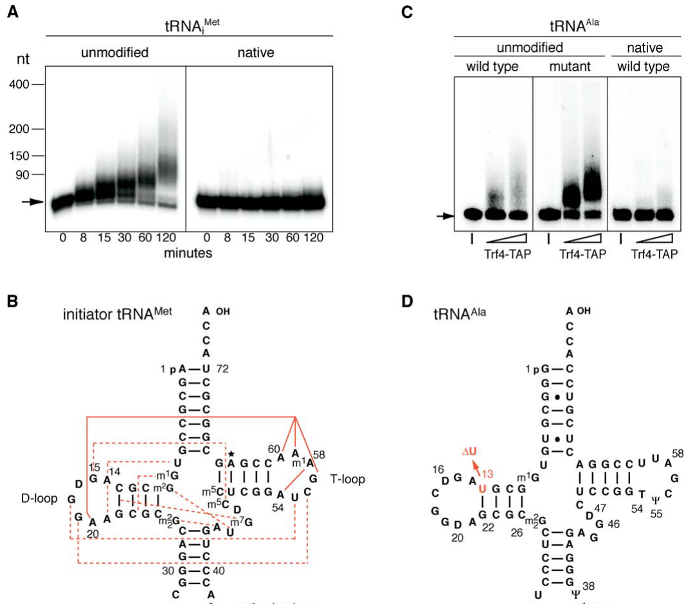

## Question

# Gene Research for Functional Annotation

## ⚠️ CRITICAL: Gene/Protein Identification Context

**BEFORE YOU BEGIN RESEARCH:** You MUST verify you are researching the CORRECT gene/protein. Gene symbols can be ambiguous, especially for less well-characterized genes from non-model organisms.

### Target Gene/Protein Identity (from UniProt):
- **UniProt Accession:** P53632
- **Protein Description:** RecName: Full=Poly(A) RNA polymerase protein 2; EC=2.7.7.19 {ECO:0000269|PubMed:20696927}; AltName: Full=DNA polymerase kappa; AltName: Full=DNA polymerase sigma; AltName: Full=Topoisomerase 1-related protein TRF4;
- **Gene Information:** Name=PAP2; Synonyms=TRF4; OrderedLocusNames=YOL115W; ORFNames=HRC584, O0716;
- **Organism (full):** Saccharomyces cerevisiae (strain ATCC 204508 / S288c) (Baker's yeast).
- **Protein Family:** Belongs to the DNA polymerase type-B-like family.
- **Key Domains:** MTPAP-like_central. (IPR054708); NT_sf. (IPR043519); PAP_assoc. (IPR002058); Trf4-like. (IPR045862); MTPAP-like_central (PF22600)

### MANDATORY VERIFICATION STEPS:

1. **Check if the gene symbol "PAP2" matches the protein description above**
2. **Verify the organism is correct:** Saccharomyces cerevisiae (strain ATCC 204508 / S288c) (Baker's yeast).
3. **Check if protein family/domains align with what you find in literature**
4. **If you find literature for a DIFFERENT gene with the same or similar symbol, STOP**

### If Gene Symbol is Ambiguous or You Cannot Find Relevant Literature:

**DO NOT PROCEED WITH RESEARCH ON A DIFFERENT GENE.** Instead:
- State clearly: "The gene symbol 'PAP2' is ambiguous or literature is limited for this specific protein"
- Explain what you found (e.g., "Found extensive literature on a different gene with the same symbol in a different organism")
- Describe the protein based ONLY on the UniProt information provided above
- Suggest that the protein function can be inferred from domain/family information

### Research Target:

Please provide a comprehensive research report on the gene **PAP2** (gene ID: PAP2, UniProt: P53632) in yeast.

The research report should be a detailed narrative explaining the function, biological processes, and localization of the gene product. Citations should be given for all claims.

You should prioritize authoritative reviews and primary scientific literature when conducting research. You can supplement
this with annotations you find in gene/protein databases, but these can be outdated or inaccurate.

We are specifically interested in the primary function of the gene - for enzymes, what reaction is catalyzed, and what is the substrate specificity? For transporters, what is the substrate? For structural proteins or adapters, what is the broader structural role? For signaling molecules, what is the role in the pathway.

We are interested in where in or outside the cell the gene product carries out its function.

We are also interested in the signaling or biochemical pathways in which the gene functions. We are less interested in broad pleiotropic effects, except where these elucidate the precise role.

Include evidence where possible. We are interested in both experimental evidence as well as inference from structure, evolution, or bioinformatic analysis. Precise studies should be prioritized over high-throughput, where available.

## Output

Question: You are an expert researcher providing comprehensive, well-cited information.

Provide detailed information focusing on:
1. Key concepts and definitions with current understanding
2. Recent developments and latest research (prioritize 2023-2024 sources)
3. Current applications and real-world implementations
4. Expert opinions and analysis from authoritative sources
5. Relevant statistics and data from recent studies

Format as a comprehensive research report with proper citations. Include URLs and publication dates where available.
Always prioritize recent, authoritative sources and provide specific citations for all major claims.

# Gene Research for Functional Annotation

## ⚠️ CRITICAL: Gene/Protein Identification Context

**BEFORE YOU BEGIN RESEARCH:** You MUST verify you are researching the CORRECT gene/protein. Gene symbols can be ambiguous, especially for less well-characterized genes from non-model organisms.

### Target Gene/Protein Identity (from UniProt):
- **UniProt Accession:** P53632
- **Protein Description:** RecName: Full=Poly(A) RNA polymerase protein 2; EC=2.7.7.19 {ECO:0000269|PubMed:20696927}; AltName: Full=DNA polymerase kappa; AltName: Full=DNA polymerase sigma; AltName: Full=Topoisomerase 1-related protein TRF4;
- **Gene Information:** Name=PAP2; Synonyms=TRF4; OrderedLocusNames=YOL115W; ORFNames=HRC584, O0716;
- **Organism (full):** Saccharomyces cerevisiae (strain ATCC 204508 / S288c) (Baker's yeast).
- **Protein Family:** Belongs to the DNA polymerase type-B-like family.
- **Key Domains:** MTPAP-like_central. (IPR054708); NT_sf. (IPR043519); PAP_assoc. (IPR002058); Trf4-like. (IPR045862); MTPAP-like_central (PF22600)

### MANDATORY VERIFICATION STEPS:

1. **Check if the gene symbol "PAP2" matches the protein description above**
2. **Verify the organism is correct:** Saccharomyces cerevisiae (strain ATCC 204508 / S288c) (Baker's yeast).
3. **Check if protein family/domains align with what you find in literature**
4. **If you find literature for a DIFFERENT gene with the same or similar symbol, STOP**

### If Gene Symbol is Ambiguous or You Cannot Find Relevant Literature:

**DO NOT PROCEED WITH RESEARCH ON A DIFFERENT GENE.** Instead:
- State clearly: "The gene symbol 'PAP2' is ambiguous or literature is limited for this specific protein"
- Explain what you found (e.g., "Found extensive literature on a different gene with the same symbol in a different organism")
- Describe the protein based ONLY on the UniProt information provided above
- Suggest that the protein function can be inferred from domain/family information

### Research Target:

Please provide a comprehensive research report on the gene **PAP2** (gene ID: PAP2, UniProt: P53632) in yeast.

The research report should be a detailed narrative explaining the function, biological processes, and localization of the gene product. Citations should be given for all claims.

You should prioritize authoritative reviews and primary scientific literature when conducting research. You can supplement
this with annotations you find in gene/protein databases, but these can be outdated or inaccurate.

We are specifically interested in the primary function of the gene - for enzymes, what reaction is catalyzed, and what is the substrate specificity? For transporters, what is the substrate? For structural proteins or adapters, what is the broader structural role? For signaling molecules, what is the role in the pathway.

We are interested in where in or outside the cell the gene product carries out its function.

We are also interested in the signaling or biochemical pathways in which the gene functions. We are less interested in broad pleiotropic effects, except where these elucidate the precise role.

Include evidence where possible. We are interested in both experimental evidence as well as inference from structure, evolution, or bioinformatic analysis. Precise studies should be prioritized over high-throughput, where available.

## Research Report: **PAP2/TRF4 (UniProt P53632; ORF YOL115W) in *Saccharomyces cerevisiae* (S288c)**

### 0. Target verification (critical disambiguation)
The UniProt accession **P53632** corresponds to *S. cerevisiae* **TRF4**, also annotated as **PAP2** and **YOL115W**, encoding a **non-canonical poly(A) RNA polymerase** that functions in nuclear RNA surveillance as part of the **TRAMP** complex (Trf4/5–Air1/2–Mtr4). This is distinct from other “PAP2” usages in other organisms and from canonical mRNA poly(A) polymerases. (vanacova2005anewyeast pages 2-3, schmidt2013nuclearrnasurveillance pages 1-2, vanacova2005anewyeast pages 1-2)

### 1. Key concepts and definitions (current understanding)
PAP2/TRF4 encodes **Trf4**, the **catalytic poly(A) polymerase** subunit of a nuclear RNA quality-control system that uses **short oligo(A) tailing** to channel defective or unstable RNAs to the **nuclear RNA exosome** for 3′→5′ processing/degradation. (vanacova2005anewyeast pages 2-3, schmidt2013nuclearrnasurveillance pages 1-2, das2021substratediscriminationand pages 1-2)

Trf4 acts in the **TRAMP** complex, typically comprising:
- **Trf4 or Trf5** (non-canonical poly(A) polymerase)
- **Air1 or Air2** (CCHC zinc-knuckle RNA-binding specificity factor)
- **Mtr4** (essential 3′→5′ DExH-box RNA helicase that remodels RNA and delivers substrates to the exosome)
This architecture is consistently supported by biochemical, genetic, and review syntheses. (schmidt2013nuclearrnasurveillance pages 1-2, schmidt2012airproteinscontrol pages 1-2, das2021substratediscriminationand pages 1-2)

A central functional concept is **surveillance oligoadenylation**: TRAMP adds short 3′ A-tracts to expose a single-stranded handle for **Mtr4** and to promote access/engagement by exosome nucleases (**Dis3/Rrp44** and nuclear exonuclease **Rrp6**). (das2021substratediscriminationand pages 1-2, schmidt2013nuclearrnasurveillance pages 4-5)

| Concept | Definition/Current understanding | Key molecules (yeast names) | Evidence highlights | Key citations (with year) |
|---|---|---|---|---|
| Non-canonical poly(A) polymerase / oligoadenylation | PAP2/TRF4 encodes Trf4, a non-canonical nuclear poly(A) RNA polymerase in the Polβ-like family. Unlike canonical Pap1, Trf4 lacks an intrinsic RNA-binding domain and usually adds short oligo(A) tails to RNA 3′ ends to promote nuclear RNA decay or processing rather than mRNA stabilization. Catalytic Asp residues are essential; activity has been reported to prefer Mn²⁺ in biochemical assays. | Trf4/Pap2, Trf5, Pap1 | Vaňáčová et al. established Trf4 as the catalytic subunit of a heteromeric poly(A) polymerase complex; D→A catalytic mutants abolish activity. Reviews summarize that TRAMP-mediated tails are typically short and function as decay-promoting marks. | Vaňáčová et al., 2005; Schmidt & Butler, 2013; Das et al., 2021 (vanacova2005anewyeast pages 2-3, gibson2011humanorthologuesof pages 27-31, schmidt2013nuclearrnasurveillance pages 1-2, das2021substratediscriminationand pages 1-2) |
| TRAMP4 vs TRAMP5 | TRAMP complexes are nuclear surveillance assemblies containing one polymerase (Trf4 or Trf5), one Air protein, and Mtr4. TRAMP4 is centered on Trf4 and often associates with Air2; TRAMP5 is centered on Trf5 and often associates with Air1. The two complexes overlap functionally but show substrate preferences and partially distinct localization/targeting. | Trf4, Trf5, Air1, Air2, Mtr4 | Deep-sequencing/genetic analyses support differential substrate classes; GFP studies showed slight nucleolar enrichment for Trf5/Air1 relative to Trf4/Air2. Double loss of TRF4 and TRF5 is lethal, indicating overlapping essential functions. | Schmidt et al., 2012; Schmidt & Butler, 2013 (schmidt2012airproteinscontrol pages 1-2, schmidt2013nuclearrnasurveillance pages 2-4, schmidt2013nuclearrnasurveillance pages 6-8) |
| Air proteins | Air1 and Air2 are zinc-knuckle RNA-binding proteins that confer substrate recognition to Trf4/Trf5 complexes and are required for efficient polyadenylation. Structural/mutational work indicates multiple zinc knuckles contribute to RNA binding and to interaction with Trf4/Trf5. | Air1, Air2, Trf4, Trf5 | Trf4 alone is inactive in reconstitution; Air1 or Air2 restores polymerase activity. Air2 zinc knuckles 4–5 contact Trf4, while additional knuckles are required for productive RNA targeting and decay. | Vaňáčová et al., 2005; Schmidt & Butler, 2013; Schmidt et al., 2012 (vanacova2005anewyeast pages 7-8, schmidt2012airproteinscontrol pages 1-2, schmidt2013nuclearrnasurveillance pages 2-4, wong2015currentperspectiveson pages 1-2, schmidt2013nuclearrnasurveillance pages 1-2) |
| Mtr4 | Mtr4 is the essential nuclear 3′→5′ DExH-box RNA helicase within TRAMP and also acts with the nuclear exosome beyond TRAMP. It helps capture oligoadenylated tails, remodel structured RNAs, and feed substrates into the exosome for processing or degradation. | Mtr4, Trf4, Trf5, Rrp6, Dis3/Rrp44, Mpp6, Rrp47 | Mtr4 physically associates with Trf4/5 complexes and is needed for complete degradation of structured substrates such as defective tRNAs. Reviews and reconstitution studies support a handoff model in which Mtr4 uses oligoadenylated 3′ ends to thread RNAs to exosome nucleases. | Vaňáčová et al., 2005; Schmidt & Butler, 2013; Das et al., 2021; Yim et al., 2023; Sterrett et al., 2023 (vanacova2005anewyeast pages 7-8, das2021substratediscriminationand pages 1-2, schmidt2013nuclearrnasurveillance pages 2-4) |
| Nuclear RNA exosome (Rrp6/Dis3) | The nuclear exosome is the major 3′→5′ RNA processing/degradation machinery. In yeast, Dis3/Rrp44 is the processive nuclease associated with the exosome core, while Rrp6 is the nuclear distributive exonuclease that often collaborates with TRAMP and can protect stable RNAs by proofreading/deadenylating inappropriate tails. | Exo-9 core, Dis3/Rrp44, Rrp6, Rrp47, Mpp6, Mtr4 | TRAMP oligoadenylation stimulates exosome action. Reconstitution showed that polyadenylation, helicase activity, and both Rrp6 and Dis3 nuclease functions together determine whether RNAs are protected, processed, or degraded. | Schmidt & Butler, 2013; Das et al., 2021 (das2021substratediscriminationand pages 1-2, schmidt2013nuclearrnasurveillance pages 1-2, roy2015thecontrolof pages 24-27) |
| RNA quality control / surveillance | Trf4/TRAMP functions primarily in nuclear RNA surveillance: aberrant, unstable, misprocessed, or improperly assembled RNAs are oligoadenylated and directed to the exosome. This system discriminates between functional/stable RNAs and faulty or unstable ones. | Trf4, Air1/2, Mtr4, Rrp6, Dis3/Rrp44 | Classic work linked Trf4 to quality control of defective tRNAs; later reconstitution showed each catalytic activity of TRAMP and the exosome contributes to substrate discrimination, supporting a proofreading-like model. | Vaňáčová et al., 2005; Schmidt & Butler, 2013; Das et al., 2021 (vanacova2005anewyeast pages 2-3, vanacova2005anewyeast pages 1-2, das2021substratediscriminationand pages 1-2, roy2015thecontrolof pages 24-27) |
| Pervasive transcription / ncRNA decay | TRAMP is a major cofactor for degrading pervasive nuclear transcripts and many ncRNAs generated by widespread RNA polymerase II transcription. Trf4–Air2 is particularly connected to NNS-terminated ncRNA decay, helping prevent accumulation of potentially deleterious pervasive transcripts. | Trf4, Air2, Mtr4, Nrd1, Nab3, Sen1, Rrp6, Mpp6 | Recent reviews emphasize that TRAMP is the principal nuclear exosome cofactor for pervasive transcript removal. Nrd1 recognizes a Trf4 motif, helping explain coupling between ncRNA termination and exosome targeting. | Villa & Porrua, 2023; Rambout & Maquat, 2024 (villa2023pervasivetranscriptiona pages 5-5) |
| tRNA surveillance | One of the best-defined Trf4 functions is surveillance of hypomodified or structurally abnormal tRNAs, especially initiator tRNAiMet. Defective tRNAs are preferentially polyadenylated by Trf4 complexes and then degraded by the nuclear exosome, with Mtr4 aiding turnover of structured RNA bodies. | Trf4, Air1/2, Mtr4, Rrp6, tRNAiMet | Vaňáčová et al. showed Trf4 preferentially polyadenylates defective/unmodified tRNAs, not native correctly folded tRNAs, and that exosome fractions degrade these substrates more efficiently after Trf4-mediated adenylation. | Vaňáčová et al., 2005; Elder et al., 2024 (vanacova2005anewyeast pages 1-2, vanacova2005anewyeast pages 8-9, vanacova2005anewyeast pages 7-8) |

*Table: This table summarizes the main mechanistic concepts needed to interpret yeast PAP2/TRF4 function in nuclear RNA surveillance. It highlights what Trf4 is, how TRAMP is organized, which RNAs it targets, and how it cooperates with Mtr4 and the nuclear exosome.*

### 2. Primary function: enzymatic activity, substrates, and mechanism
#### 2.1 Reaction catalyzed and catalytic requirements
Trf4 is a **non-templated poly(A) RNA polymerase** that adds adenosines to the **free 3′-OH** of RNA substrates. (gibson2011humanorthologuesof pages 27-31)

Catalysis depends on conserved **aspartate residues** (loss-of-function upon Asp→Ala “DADA” or related catalytic mutants), consistent with polymerase active-site requirements in this enzyme family. (vanacova2005anewyeast pages 2-3, gibson2011humanorthologuesof pages 27-31)

A mechanistic summary of biochemical assays indicates Trf4 activity can show **Mn2+ preference** (with little/no activity reported under Mg2+ conditions in the summarized study). (gibson2011humanorthologuesof pages 27-31)

#### 2.2 Minimal active complex and substrate recognition
A key biochemical result is that **Trf4 alone is inactive**; the minimal active surveillance polymerase is a **heteromer** of **Trf4 + Air1 or Air2**, consistent with Trf4 lacking an intrinsic RNA-binding domain and relying on Air proteins for substrate engagement. (vanacova2005anewyeast pages 7-8)

Air proteins contain **multiple CCHC zinc knuckles** and provide specificity; structural/mutational synthesis indicates multiple knuckles contribute to activity and to Trf4 binding. (schmidt2013nuclearrnasurveillance pages 1-2, schmidt2013nuclearrnasurveillance pages 2-4)

#### 2.3 Substrate specificity (what RNAs are targeted?)
A best-defined Trf4/TRAMP substrate class is **defective tRNAs**, particularly **hypomodified or structurally abnormal initiator tRNA\_i\^Met** and other misfolded tRNAs. Trf4-containing complexes preferentially polyadenylate **aberrant/unmodified** tRNAs over correctly folded native tRNAs, indicating recognition of **structural defects** rather than a simple “unmodified vs modified” rule. (vanacova2005anewyeast pages 8-9, vanacova2005anewyeast pages 1-2)

TRAMP targets additional nuclear RNA classes (as summarized across sources), including various noncoding RNAs (e.g., snoRNA-related intermediates and pervasive transcripts), and aberrantly processed RNAs destined for the exosome. (schmidt2013nuclearrnasurveillance pages 1-2, villa2023pervasivetranscriptiona pages 5-5)

#### 2.4 TRAMP–exosome coupling and “short-tail” logic
TRAMP-added tails are typically **short** in productive surveillance contexts. One synthesis places the distribution peak at ~**4–5 A** and describes **Mtr4-mediated suppression** of extension after ~**3–5 A**, consistent with oligoadenylation serving as an exosome-engagement handle rather than a stabilizing poly(A) tail. (schmidt2013nuclearrnasurveillance pages 4-5)

In contrast, when uncoupled from degradation, Trf4 complexes can elaborate much longer tails in vitro (average ~**60–70 nt** after 90 min in an uncoupled assay), suggesting that downstream handoff/decay normally constrains tail length in vivo. (vanacova2005anewyeast pages 7-8)

### 3. Cellular localization and pathway context
#### 3.1 Subcellular localization
TRAMP is a **nuclear** RNA surveillance system. GFP-fusion evidence indicates **slight nucleolar enrichment** for some TRAMP components (Trf5-GFP, Air1-GFP) compared to Trf4-GFP/Air2-GFP, and Trf4-GFP can accumulate in the nucleolus under conditions that cause nucleolar rRNA accumulation—supporting **dynamic nucleolar engagement** when substrates build up. (schmidt2013nuclearrnasurveillance pages 8-9)

#### 3.2 Physical partners and interfaces
Multiple experimental approaches demonstrate Trf4 complex assembly with Air proteins and Mtr4:
- Two-hybrid recovery of Air1/Air2 fragments using Trf4 as bait
- Reverse-tag copurification (Air1-TAP, Air2-TAP, Mtr4-TAP pulling down Trf4 and retaining polyadenylation activity)
These support that Trf4 acts in stable complexes rather than as a solitary enzyme. (vanacova2005anewyeast pages 2-3)

Functional coupling to the nuclear exosome is supported by:
- In vitro coupled reactions where Trf4-dependent adenylation stimulates decay by **nuclear exosome fractions**
- Genetic interactions with **RRP6** and **RRP44/DIS3**
- Reconstitution models in which **Mpp6** and **Rrp47** mediate interaction between **Mtr4** and the nuclear exosome, enabling threading into the exosome channel for degradation/processing
(vanacova2005anewyeast pages 1-2, vanacova2005anewyeast pages 2-3, das2021substratediscriminationand pages 1-2)

Cotranscriptional pathway integration is also supported by reports of cotranscriptional recruitment of TRAMP components and exosome cofactors (Rrp47, Mpp6), consistent with surveillance acting during/soon after transcription. (stuparevic2013cotranscriptionalrecruitmentof pages 1-2)

### 4. Recent developments (prioritizing 2023–2024)
#### 4.1 Coupling to pervasive transcription control (2023)
A 2023 review frames TRAMP (Trf4/5–Air1/2–Mtr4) as the principal **nuclear exosome cofactor** for degradation of pervasive transcripts, emphasizing coupling to transcription termination. A highlighted mechanistic link is that **Nrd1** can recognize a motif in **Trf4** resembling the RNAPII CTD via its CID, suggesting a molecular basis for coupling **Trf4–Air2** TRAMP activity to **NNS-terminated ncRNA** decay. (villa2023pervasivetranscriptiona pages 5-5)

#### 4.2 Updated understanding of tRNA decay coupling (2024)
A 2024 Trends in Genetics review summarizes a coordinated TRAMP–exosome pathway in which TRAMP marks hypomodified tRNAs by polyadenylation, and coordinated action of **Rrp6** and **Dis3** supports efficient decay, consistent with reconstitution experiments showing multistep coordination among these activities. (elder2024themakingand pages 6-8)

#### 4.3 Nuclear mRNA decay networks and “adenylation-independent” modes (2024)
A 2024 Nature Reviews Genetics synthesis places TRAMP in nuclear mRNA decay, including degradation of aberrant 3′-extended/readthrough transcripts. It also notes that in yeast, TRAMP-mediated nuclear decay can occur **without requiring TRAMP oligoadenylation activity** in some contexts, consistent with models in which targeted RNAs may already bear tails suitable for Mtr4/exosome engagement. (rambout2024nuclearmrnadecay pages 9-11)

#### 4.4 New quantitative datasets / implementations (2023)
Recent work applying **Oxford Nanopore direct RNA sequencing** to yeast surveillance mutants provides quantitative tail-length context and identifies TRAMP-dependent processing features at ncRNA loci. In the reported dataset, average coding-sequence poly(A) estimates were ~**31.5 nt** in WT and ~**35.2 nt** in **rrp6Δ**, and combined **air1Δ air2Δ** on an rrp6Δ background produced widespread changes (e.g., **3,289/5,210** polyadenylation peaks increased vs rrp6Δ) and stabilization of downstream snoRNA-associated peaks at defined distances downstream of certain snoRNAs. (demario2023investigationsonsnorna pages 27-33)

### 5. Current applications and real-world implementations
The dominant “real-world” use of PAP2/TRF4 is as a **model-system component** for dissecting conserved nuclear RNA surveillance principles and for benchmarking methods that measure RNA 3′ ends and tailing.

1) **Reconstitution biochemistry of RNA quality control**: TRAMP and exosome complexes are reconstituted to test how polyadenylation and helicase/nuclease activities contribute to substrate discrimination and proofreading-like behavior. (das2021substratediscriminationand pages 1-2)

2) **Genetic models of conserved exosome-cofactor interfaces**: Yeast is used to evaluate functionally critical interfaces (e.g., exosome–Mtr4 interactions) that are conserved and medically relevant in other organisms, with TRAMP serving as the nuclear adaptor context for Mtr4 delivery. (schmidt2013nuclearrnasurveillance pages 2-4)

3) **Long-read tail-length profiling and 3′-end mapping**: Nanopore direct RNA sequencing is being used to estimate poly(A) tail lengths and map TRAMP/exosome-dependent 3′ end intermediates in vivo in yeast mutants. (demario2023investigationsonsnorna pages 27-33)

### 6. Expert opinions and analysis (authoritative syntheses)
Across authoritative reviews, a consistent expert view is that TRAMP should be understood as an **exosome specificity and activation system**, not merely an RNA tailing enzyme: oligoadenylation, RNA-binding (Air proteins), helicase activity (Mtr4), and exosome nucleases jointly determine whether RNAs are protected, processed, or degraded. (schmidt2013nuclearrnasurveillance pages 1-2, schmidt2013nuclearrnasurveillance pages 4-5, das2021substratediscriminationand pages 1-2)

A particularly important mechanistic refinement from reconstitution work is that nuclear RNA quality control involves **substrate discrimination**, and that loss/inactivation of specific catalytic activities (notably Rrp6 distributive activity) can abolish discrimination and lead to inappropriate degradation of otherwise stable RNAs—consistent with a “proofreading” analogy. (das2021substratediscriminationand pages 1-2)

### 7. Key statistics and data (recent and foundational)
Key quantitative anchors are compiled below.

| Measurement | Value(s) | System/assay | Interpretation | Source (with year/DOI/URL if available) |
|---|---:|---|---|---|
| TRAMP oligo(A) tail-length distribution peak | ~4–5 adenosines | Mechanistic/biochemical synthesis of yeast TRAMP literature | Supports the current model that TRAMP usually adds short oligoadenylate tails that function as decay-promoting marks rather than long stabilizing poly(A) tails | Schmidt & Butler 2013, WIREs RNA, doi:10.1002/wrna.1155, https://doi.org/10.1002/wrna.1155 (schmidt2013nuclearrnasurveillance pages 4-5) |
| Mtr4 suppression of further Trf4 extension | Suppresses extension after ~3–5 adenosines | Mechanistic/biochemical synthesis of yeast TRAMP literature | Indicates that Mtr4 helps limit tail length and coordinates oligoadenylation with exosome targeting/unwinding | Schmidt & Butler 2013, WIREs RNA, doi:10.1002/wrna.1155, https://doi.org/10.1002/wrna.1155 (schmidt2013nuclearrnasurveillance pages 4-5) |
| Trf4-generated poly(A) tail length without exosome | Average ~60–70 nt after 90 min | In vitro uncoupled polyadenylation assay with Trf4-TAP, exosome absent | Shows that in the absence of downstream degradation/handoff, Trf4 complexes can elaborate much longer tails than the short tails generally associated with productive surveillance | Vaňáčová et al. 2005, PLoS Biology, doi:10.1371/journal.pbio.0030189, https://doi.org/10.1371/journal.pbio.0030189 (vanacova2005anewyeast pages 7-8) |
| WT coding-sequence poly(A) tail length | ~31.5 nt | Oxford Nanopore direct RNA sequencing | Provides recent transcriptome-wide quantitative context for nuclear RNA tail measurements in yeast backgrounds used to probe TRAMP/exosome function | DeMario 2023, snoRNA processing study/thesis (no DOI available in gathered evidence) (demario2023investigationsonsnorna pages 27-33) |
| rrp6Δ coding-sequence poly(A) tail length | ~35.2 nt | Oxford Nanopore direct RNA sequencing | RRP6 loss is associated with longer average CDS poly(A) tails, consistent with nuclear exosome/Rrp6 contributions to tail surveillance/turnover | DeMario 2023, snoRNA processing study/thesis (no DOI available in gathered evidence) (demario2023investigationsonsnorna pages 27-33) |
| AIR2 deletion effect vs rrp6Δ | Average fold change 1.24 ± 0.88 | 3′-end / polyadenylation peak analysis in mutant backgrounds | Supports a stronger role for Air2 than Air1 in TRAMP targeting of some ncRNA/snoRNA substrates | DeMario 2023, snoRNA processing study/thesis (no DOI available in gathered evidence) (demario2023investigationsonsnorna pages 27-33) |
| rrp6Δ air1Δ effect vs rrp6Δ | Average fold change 1.12 ± 0.842 | 3′-end / polyadenylation peak analysis in mutant backgrounds | Suggests AIR1 loss alone has a comparatively modest global effect on these polyadenylation patterns | DeMario 2023, snoRNA processing study/thesis (no DOI available in gathered evidence) (demario2023investigationsonsnorna pages 27-33) |
| rrp6Δ air1Δ air2Δ effect vs rrp6Δ | 3,289/5,210 peaks increased; average fold change 1.44 ± 1.45 | 3′-end / polyadenylation peak analysis in triple-mutant background | Demonstrates broad rewiring of RNA 3′-end polyadenylation when both Air proteins are lost on an rrp6Δ background; consistent with widespread TRAMP targeting defects | DeMario 2023, snoRNA processing study/thesis (no DOI available in gathered evidence) (demario2023investigationsonsnorna pages 27-33) |
| Stabilized downstream snoRNA-associated peaks in triple mutant | ~450 nt downstream of snR34 and snR10; ~200 nt downstream of snR65; ~100 nt downstream of snR71 | Nanopore/3′-end mapping of snoRNA loci | Indicates accumulation of unprocessed pre-snoRNA species and supports a role for Air2/TRAMP in late snoRNA maturation/surveillance | DeMario 2023, snoRNA processing study/thesis (no DOI available in gathered evidence) (demario2023investigationsonsnorna pages 27-33) |
| rRNA polyadenylation frequency in WT | <0.1% of 25S-related RNA polyadenylated | Background quantitative synthesis from yeast rRNA polyadenylation studies | Shows that polyadenylated rRNA is normally rare in wild-type yeast | Gibson 2011 summary of prior yeast studies (no journal DOI in gathered evidence) (gibson2011humanorthologuesof pages 41-44) |
| rRNA polyadenylation increase in rrp6Δ | ~100-fold increase | Background quantitative synthesis from yeast rRNA polyadenylation studies | Supports a major role for Rrp6 in clearing or trimming polyadenylated rRNA surveillance intermediates | Gibson 2011 summary of prior yeast studies (no journal DOI in gathered evidence) (gibson2011humanorthologuesof pages 41-44) |
| Relative abundance of polyadenylated rRNA vs poly(A)+ mRNA | ~1/20 | Background quantitative synthesis from yeast rRNA polyadenylation studies | Indicates that although rare, polyadenylated rRNA is a measurable surveillance-associated RNA class | Gibson 2011 summary of prior yeast studies (no journal DOI in gathered evidence) (gibson2011humanorthologuesof pages 41-44) |
| Air2 binding affinity for oligo(A) RNA | Lower micromolar Kd for oligo(A)15 | RNA-binding assay summarized in review | Supports the idea that Air2 is an RNA-binding specificity factor for TRAMP and preferentially recognizes RNA rather than DNA | Wong et al. 2015, doi:10.2147/RRBC.S58509, https://doi.org/10.2147/RRBC.S58509 (wong2015currentperspectiveson pages 1-2) |
| Trf4 short-tail output in one study | ~3–4 adenosines | Biochemical study summarized in review | Consistent with short-tail surveillance model and with Mtr4-mediated control of tail length | Gibson 2011 summary of prior yeast studies (no journal DOI in gathered evidence) (gibson2011humanorthologuesof pages 31-36) |

*Table: This table compiles quantitative measurements relevant to yeast Trf4/TRAMP function, emphasizing 2023–2024 evidence where available and supplementing with foundational earlier data. It highlights tail-length distributions, mutant-dependent polyadenylation changes, and binding measurements that anchor mechanistic interpretation.*

### 8. Visual evidence from primary literature
Cropped figures from the defining 2005 Trf4 complex paper show (i) TRAMP/Trf4 complex composition and (ii) assay evidence of polyadenylation coupled to decay.

- Trf4 complex composition and assay panels: (vanacova2005anewyeast media dcde6390)
- Polyadenylation activity and surveillance-linked degradation panels: (vanacova2005anewyeast media e1ba015f)

### 9. Consolidated literature map (2023–2024 prioritized)
| Citation (first author, year) | Type | Main finding relevant to Trf4/TRAMP | Methods | URL/DOI | Why it matters for functional annotation |
|---|---|---|---|---|---|
| Vaňáčová, 2005 | Primary | Established that yeast PAP2/TRF4 encodes the catalytic subunit of a non-canonical poly(A) polymerase complex with Air1/2 and Mtr4 that polyadenylates aberrant RNAs and stimulates nuclear exosome-dependent decay, especially defective tRNAs (vanacova2005anewyeast pages 2-3, vanacova2005anewyeast pages 7-8, vanacova2005anewyeast pages 1-2) | Affinity purification/TAP, recombinant reconstitution, polyadenylation assays, two-hybrid, reverse-tag copurification, coupled degradation assays | https://doi.org/10.1371/journal.pbio.0030189 | Foundational evidence that PAP2/TRF4 is an RNA polymerase in nuclear RNA surveillance, not a DNA polymerase, and defines its core partners and primary biochemical role. |
| Schmidt, 2012 | Primary | Showed that Air1 and Air2 help determine differential TRAMP substrate specificity, with TRAMP4/5 complexes targeting overlapping but distinct nuclear RNA sets (schmidt2012airproteinscontrol pages 1-2, schmidt2013nuclearrnasurveillance pages 6-8) | Genetics, deep sequencing/transcript profiling, mutant analysis | https://doi.org/10.1261/rna.033431.112 | Important for annotating Trf4 function as part of a specificity-determining complex rather than as a stand-alone polymerase. |
| Schmidt & Butler, 2013 | Review | Synthesized evidence that TRAMP is a nuclear Trf4/5–Air1/2–Mtr4 complex that oligoadenylates RNAs for Rrp6/core-exosome processing or decay; discussed localization, subunit interfaces, and substrate scope (schmidt2013nuclearrnasurveillance pages 1-2, schmidt2013nuclearrnasurveillance pages 2-4, schmidt2013nuclearrnasurveillance pages 8-9, schmidt2013nuclearrnasurveillance pages 4-5) | Review of structural, genetic, biochemical, and GFP-localization studies | https://doi.org/10.1002/wrna.1155 | Best integrative source for functional annotation of biological process, localization, and pathway context. |
| Stuparevic, 2013 | Primary | Reported cotranscriptional recruitment of TRAMP components and exosome cofactors Rrp47/Mpp6, linking Trf4/Trf5 complexes to surveillance of aberrant mRNPs during transcription (stuparevic2013cotranscriptionalrecruitmentof pages 1-2) | Chromatin/cotranscriptional recruitment analysis, mutant studies | Publication details incomplete in retrieved evidence | Supports annotation of Trf4 in cotranscriptional nuclear surveillance and exosome cofactor networks. |
| Das, 2021 | Primary | Reconstitution showed that Trf4 polyadenylation, Mtr4 helicase activity, and Rrp6/Dis3 nucleases each contribute to substrate discrimination, establishing a proofreading-like model for nuclear RNA quality control (das2021substratediscriminationand pages 1-2) | In vitro reconstitution biochemistry, mutational analysis, exosome/TRAMP degradation assays | https://doi.org/10.1073/pnas.2024846118 | Refines annotation from simple “marks RNAs for decay” to a coordinated quality-control mechanism that distinguishes stable vs aberrant RNAs. |
| Villa & Porrua, 2023 | Review | Highlighted TRAMP as the principal nuclear exosome cofactor for pervasive transcript decay and described mechanistic coupling of Trf4–Air2 to NNS termination via Nrd1 recognition of a Trf4 motif (villa2023pervasivetranscriptiona pages 5-5) | Review of recent mechanistic and genomics studies | https://doi.org/10.1111/febs.16530 | Useful for current annotation of pathway integration: Trf4 links transcription termination, pervasive ncRNA control, and exosome targeting. |
| DeMario, 2023 | Primary | Provided recent quantitative evidence that Air2 is especially important for TRAMP targeting of pre-snoRNAs and mapped mutant-dependent changes in poly(A) peaks and tail lengths, supporting roles in late snoRNA processing and surveillance (demario2023investigationsonsnorna pages 27-33) | 3′ end sequencing, Oxford Nanopore direct RNA/cDNA sequencing, mutant genetics | Publication details incomplete in retrieved evidence | Adds modern transcriptome-wide support for annotating Trf4/TRAMP in snoRNA maturation/surveillance and gives recent quantitative context. |
| Elder, 2024 | Review | Summarized current understanding that TRAMP (Trf4/Air2/Mtr4) selectively polyadenylates hypomodified tRNAs and cooperates with Rrp6 and Dis3 for their degradation (elder2024themakingand pages 6-8) | Review of biochemical and genetic studies | https://doi.org/10.1016/j.tig.2024.03.007 | Reinforces that tRNA quality control is one of the clearest, best-supported substrate-specific functions for Trf4. |
| Rambout & Maquat, 2024 | Review | Positioned TRAMP within nuclear mRNA decay networks, including degradation of readthrough and aberrantly processed transcripts, and noted that yeast TRAMP-mediated decay can occur even when new oligoadenylation is not always required (rambout2024nuclearmrnadecay pages 9-11, rambout2024nuclearmrnadecay pages 8-9) | Review of nuclear RNA decay pathways and comparative mechanistic studies | https://doi.org/10.1038/s41576-024-00712-2 | Expands annotation beyond ncRNAs/tRNAs to broader nuclear mRNA surveillance and termination-coupled decay. |
| Sterrett, 2023 | Primary | Used yeast to probe the critical exosome–Mtr4 interface in vivo, showing that disrupted Mtr4–exosome interaction causes accumulation of exosome target RNAs (schmidt2013nuclearrnasurveillance pages 2-4) | Yeast disease-model genetics, biochemical interaction assays | https://doi.org/10.1093/g3journal/jkad049 | Relevant because Trf4 function depends on Mtr4-mediated delivery of oligoadenylated RNAs to the exosome. |
| Yim, 2023 | Primary | Showed conserved Mtr4 C-terminal residues coordinate helicase activity and exosome interactions, including effects on RNA degradation in assays with TRAMP components (das2021substratediscriminationand pages 1-2) | Mutagenesis, helicase assays, in vitro RNA degradation assays | https://doi.org/10.1021/acs.biochem.3c00401 | Helps interpret Trf4 function mechanistically through its essential helicase partner Mtr4 and exosome coupling. |

*Table: This table compiles foundational and recent sources used to functionally annotate yeast PAP2/TRF4, emphasizing direct evidence for catalytic activity, substrate specificity, localization, and pathway context. It is useful for distinguishing well-established roles from newer 2023–2024 mechanistic updates.*

### 10. Summary functional annotation (actionable)
**Gene/protein:** PAP2/TRF4 (UniProt P53632) encodes **Trf4**, a **nuclear non-canonical poly(A) RNA polymerase** that functions primarily in **nuclear RNA surveillance**.

**Molecular function:** Non-templated addition of adenosines to RNA 3′ ends (oligoadenylation) as part of TRAMP; activity requires Air1/2 and is coordinated with Mtr4 helicase and nuclear RNA exosome nucleases. (vanacova2005anewyeast pages 7-8, das2021substratediscriminationand pages 1-2, vanacova2005anewyeast pages 1-2)

**Biological process:** Quality control of defective RNAs (prominently hypomodified/misfolded tRNAs), pervasive ncRNA decay (NNS-coupled), and broader nuclear surveillance/decay networks including termination-linked and readthrough transcript decay. (vanacova2005anewyeast pages 8-9, villa2023pervasivetranscriptiona pages 5-5, rambout2024nuclearmrnadecay pages 9-11)

**Cellular component:** Nucleus with dynamic engagement of nucleolar RNA metabolism; TRAMP components show nucleolar enrichment under some conditions and are implicated in rRNA-related surveillance. (schmidt2013nuclearrnasurveillance pages 8-9)

**Caveat on certain 2024 claims:** A 2024 paper (Chaudhuri et al., Microbial Cell) was retrieved at metadata level, but targeted extraction of its quantitative tail-length/site data failed in the available text chunks; therefore, its specific numerical claims are not included here. (No-evidence result from gather_evidence)

References

1. (vanacova2005anewyeast pages 2-3): Štěpánka Vaňáčová, Jeannette Wolf, Georges Martin, Diana Blank, Sabine Dettwiler, Arno Friedlein, Hanno Langen, Gérard Keith, and Walter Keller. A new yeast poly(a) polymerase complex involved in rna quality control. PLoS Biology, 3:e189, Apr 2005. URL: https://doi.org/10.1371/journal.pbio.0030189, doi:10.1371/journal.pbio.0030189. This article has 700 citations and is from a highest quality peer-reviewed journal.

2. (schmidt2013nuclearrnasurveillance pages 1-2): Karyn Schmidt and J. Scott Butler. Nuclear rna surveillance: role of tramp in controlling exosome specificity. Wiley Interdisciplinary Reviews: RNA, 4:217-231, Mar 2013. URL: https://doi.org/10.1002/wrna.1155, doi:10.1002/wrna.1155. This article has 135 citations.

3. (vanacova2005anewyeast pages 1-2): Štěpánka Vaňáčová, Jeannette Wolf, Georges Martin, Diana Blank, Sabine Dettwiler, Arno Friedlein, Hanno Langen, Gérard Keith, and Walter Keller. A new yeast poly(a) polymerase complex involved in rna quality control. PLoS Biology, 3:e189, Apr 2005. URL: https://doi.org/10.1371/journal.pbio.0030189, doi:10.1371/journal.pbio.0030189. This article has 700 citations and is from a highest quality peer-reviewed journal.

4. (das2021substratediscriminationand pages 1-2): Mom Das, Dimitrios Zattas, John C. Zinder, Elizabeth V. Wasmuth, Julien Henri, and Christopher D. Lima. Substrate discrimination and quality control require each catalytic activity of tramp and the nuclear rna exosome. Proceedings of the National Academy of Sciences of the United States of America, Mar 2021. URL: https://doi.org/10.1073/pnas.2024846118, doi:10.1073/pnas.2024846118. This article has 19 citations and is from a highest quality peer-reviewed journal.

5. (schmidt2012airproteinscontrol pages 1-2): Karyn Schmidt, Zhenjiang Xu, David H. Mathews, and J. Scott Butler. Air proteins control differential tramp substrate specificity for nuclear rna surveillance. RNA, 18 10:1934-45, Oct 2012. URL: https://doi.org/10.1261/rna.033431.112, doi:10.1261/rna.033431.112. This article has 41 citations and is from a domain leading peer-reviewed journal.

6. (schmidt2013nuclearrnasurveillance pages 4-5): Karyn Schmidt and J. Scott Butler. Nuclear rna surveillance: role of tramp in controlling exosome specificity. Wiley Interdisciplinary Reviews: RNA, 4:217-231, Mar 2013. URL: https://doi.org/10.1002/wrna.1155, doi:10.1002/wrna.1155. This article has 135 citations.

7. (gibson2011humanorthologuesof pages 27-31): K Gibson. Human orthologues of saccharomyces cerevisiae trf4/5 non-canonical poly (a) polymerases. Unknown journal, 2011.

8. (schmidt2013nuclearrnasurveillance pages 2-4): Karyn Schmidt and J. Scott Butler. Nuclear rna surveillance: role of tramp in controlling exosome specificity. Wiley Interdisciplinary Reviews: RNA, 4:217-231, Mar 2013. URL: https://doi.org/10.1002/wrna.1155, doi:10.1002/wrna.1155. This article has 135 citations.

9. (schmidt2013nuclearrnasurveillance pages 6-8): Karyn Schmidt and J. Scott Butler. Nuclear rna surveillance: role of tramp in controlling exosome specificity. Wiley Interdisciplinary Reviews: RNA, 4:217-231, Mar 2013. URL: https://doi.org/10.1002/wrna.1155, doi:10.1002/wrna.1155. This article has 135 citations.

10. (vanacova2005anewyeast pages 7-8): Štěpánka Vaňáčová, Jeannette Wolf, Georges Martin, Diana Blank, Sabine Dettwiler, Arno Friedlein, Hanno Langen, Gérard Keith, and Walter Keller. A new yeast poly(a) polymerase complex involved in rna quality control. PLoS Biology, 3:e189, Apr 2005. URL: https://doi.org/10.1371/journal.pbio.0030189, doi:10.1371/journal.pbio.0030189. This article has 700 citations and is from a highest quality peer-reviewed journal.

11. (wong2015currentperspectiveson pages 1-2): Chi-Ming Wong, Pan Kewu, Huang Zhe, and Jimmy TH Lee. Current perspectives on the role of tramp in nuclear rna surveillance and quality control. ArXiv, 5:111-117, Apr 2015. URL: https://doi.org/10.2147/rrbc.s58509, doi:10.2147/rrbc.s58509. This article has 6 citations.

12. (roy2015thecontrolof pages 24-27): KRJ Roy. The control of gene expression by nuclear rna degradation in saccharomyces cerevisiae. Unknown journal, 2015.

13. (villa2023pervasivetranscriptiona pages 5-5): Tommaso Villa and Odil Porrua. Pervasive transcription: a controlled risk. The FEBS Journal, 290:3723-3736, Jun 2023. URL: https://doi.org/10.1111/febs.16530, doi:10.1111/febs.16530. This article has 24 citations.

14. (vanacova2005anewyeast pages 8-9): Štěpánka Vaňáčová, Jeannette Wolf, Georges Martin, Diana Blank, Sabine Dettwiler, Arno Friedlein, Hanno Langen, Gérard Keith, and Walter Keller. A new yeast poly(a) polymerase complex involved in rna quality control. PLoS Biology, 3:e189, Apr 2005. URL: https://doi.org/10.1371/journal.pbio.0030189, doi:10.1371/journal.pbio.0030189. This article has 700 citations and is from a highest quality peer-reviewed journal.

15. (schmidt2013nuclearrnasurveillance pages 8-9): Karyn Schmidt and J. Scott Butler. Nuclear rna surveillance: role of tramp in controlling exosome specificity. Wiley Interdisciplinary Reviews: RNA, 4:217-231, Mar 2013. URL: https://doi.org/10.1002/wrna.1155, doi:10.1002/wrna.1155. This article has 135 citations.

16. (stuparevic2013cotranscriptionalrecruitmentof pages 1-2): I Stuparevic and C Mosrin-Huaman. Cotranscriptional recruitment of rna exosome cofactors rrp47p and mpp6p and two distinct trf-air-mtr4 polyadenylation (tramp) complexes assists the …. Unknown journal, 2013.

17. (elder2024themakingand pages 6-8): Jessica J.H. Elder, Ry Papadopoulos, Cassandra K. Hayne, and Robin E. Stanley. The making and breaking of trnas by ribonucleases. Jun 2024. URL: https://doi.org/10.1016/j.tig.2024.03.007, doi:10.1016/j.tig.2024.03.007. This article has 8 citations and is from a domain leading peer-reviewed journal.

18. (rambout2024nuclearmrnadecay pages 9-11): Xavier Rambout and Lynne E. Maquat. Nuclear mrna decay: regulatory networks that control gene expression. Nature reviews. Genetics, Apr 2024. URL: https://doi.org/10.1038/s41576-024-00712-2, doi:10.1038/s41576-024-00712-2. This article has 48 citations.

19. (demario2023investigationsonsnorna pages 27-33): SM DeMario. Investigations on snorna processing in saccharomyces cerevisiae. Unknown journal, 2023.

20. (gibson2011humanorthologuesof pages 41-44): K Gibson. Human orthologues of saccharomyces cerevisiae trf4/5 non-canonical poly (a) polymerases. Unknown journal, 2011.

21. (gibson2011humanorthologuesof pages 31-36): K Gibson. Human orthologues of saccharomyces cerevisiae trf4/5 non-canonical poly (a) polymerases. Unknown journal, 2011.

22. (vanacova2005anewyeast media dcde6390): Štěpánka Vaňáčová, Jeannette Wolf, Georges Martin, Diana Blank, Sabine Dettwiler, Arno Friedlein, Hanno Langen, Gérard Keith, and Walter Keller. A new yeast poly(a) polymerase complex involved in rna quality control. PLoS Biology, 3:e189, Apr 2005. URL: https://doi.org/10.1371/journal.pbio.0030189, doi:10.1371/journal.pbio.0030189. This article has 700 citations and is from a highest quality peer-reviewed journal.

23. (vanacova2005anewyeast media e1ba015f): Štěpánka Vaňáčová, Jeannette Wolf, Georges Martin, Diana Blank, Sabine Dettwiler, Arno Friedlein, Hanno Langen, Gérard Keith, and Walter Keller. A new yeast poly(a) polymerase complex involved in rna quality control. PLoS Biology, 3:e189, Apr 2005. URL: https://doi.org/10.1371/journal.pbio.0030189, doi:10.1371/journal.pbio.0030189. This article has 700 citations and is from a highest quality peer-reviewed journal.

24. (rambout2024nuclearmrnadecay pages 8-9): Xavier Rambout and Lynne E. Maquat. Nuclear mrna decay: regulatory networks that control gene expression. Nature reviews. Genetics, Apr 2024. URL: https://doi.org/10.1038/s41576-024-00712-2, doi:10.1038/s41576-024-00712-2. This article has 48 citations.

## Artifacts

- [Edison artifact artifact-00](PAP2-deep-research-falcon_artifacts/artifact-00.md)
- [Edison artifact artifact-01](PAP2-deep-research-falcon_artifacts/artifact-01.md)
- [Edison artifact artifact-02](PAP2-deep-research-falcon_artifacts/artifact-02.md)

## Citations

1. villa2023pervasivetranscriptiona pages 5-5
2. gibson2011humanorthologuesof pages 27-31
3. vanacova2005anewyeast pages 7-8
4. schmidt2013nuclearrnasurveillance pages 4-5
5. schmidt2013nuclearrnasurveillance pages 8-9
6. vanacova2005anewyeast pages 2-3
7. stuparevic2013cotranscriptionalrecruitmentof pages 1-2
8. elder2024themakingand pages 6-8
9. rambout2024nuclearmrnadecay pages 9-11
10. demario2023investigationsonsnorna pages 27-33
11. das2021substratediscriminationand pages 1-2
12. schmidt2013nuclearrnasurveillance pages 2-4
13. gibson2011humanorthologuesof pages 41-44
14. wong2015currentperspectiveson pages 1-2
15. gibson2011humanorthologuesof pages 31-36
16. schmidt2013nuclearrnasurveillance pages 1-2
17. vanacova2005anewyeast pages 1-2
18. schmidt2012airproteinscontrol pages 1-2
19. schmidt2013nuclearrnasurveillance pages 6-8
20. roy2015thecontrolof pages 24-27
21. vanacova2005anewyeast pages 8-9
22. rambout2024nuclearmrnadecay pages 8-9
23. https://doi.org/10.1002/wrna.1155
24. https://doi.org/10.1371/journal.pbio.0030189
25. https://doi.org/10.2147/RRBC.S58509
26. https://doi.org/10.1261/rna.033431.112
27. https://doi.org/10.1073/pnas.2024846118
28. https://doi.org/10.1111/febs.16530
29. https://doi.org/10.1016/j.tig.2024.03.007
30. https://doi.org/10.1038/s41576-024-00712-2
31. https://doi.org/10.1093/g3journal/jkad049
32. https://doi.org/10.1021/acs.biochem.3c00401
33. https://doi.org/10.1371/journal.pbio.0030189,
34. https://doi.org/10.1002/wrna.1155,
35. https://doi.org/10.1073/pnas.2024846118,
36. https://doi.org/10.1261/rna.033431.112,
37. https://doi.org/10.2147/rrbc.s58509,
38. https://doi.org/10.1111/febs.16530,
39. https://doi.org/10.1016/j.tig.2024.03.007,
40. https://doi.org/10.1038/s41576-024-00712-2,