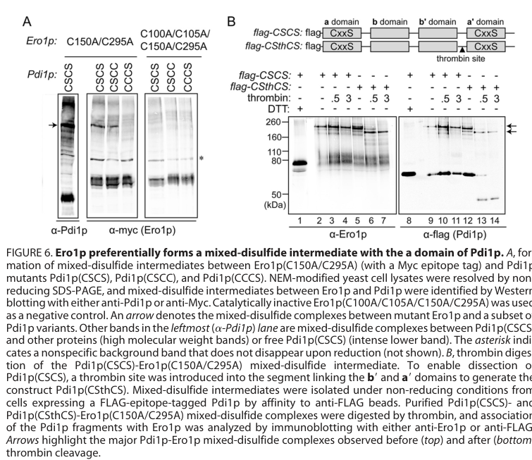

## Question

# Gene Research for Functional Annotation

## ⚠️ CRITICAL: Gene/Protein Identification Context

**BEFORE YOU BEGIN RESEARCH:** You MUST verify you are researching the CORRECT gene/protein. Gene symbols can be ambiguous, especially for less well-characterized genes from non-model organisms.

### Target Gene/Protein Identity (from UniProt):
- **UniProt Accession:** P17967
- **Protein Description:** RecName: Full=Protein disulfide-isomerase; Short=PDI; EC=5.3.4.1; AltName: Full=Thioredoxin-related glycoprotein 1; Flags: Precursor;
- **Gene Information:** Name=PDI1; Synonyms=MFP1, TRG1; OrderedLocusNames=YCL043C; ORFNames=YCL313, YCL43C;
- **Organism (full):** Saccharomyces cerevisiae (strain ATCC 204508 / S288c) (Baker's yeast).
- **Protein Family:** Belongs to the protein disulfide isomerase family.
- **Key Domains:** Prot_disulphide_isomerase. (IPR005792); Thioredoxin-like_sf. (IPR036249); Thioredoxin_CS. (IPR017937); Thioredoxin_domain. (IPR013766); Thioredoxin (PF00085)

### MANDATORY VERIFICATION STEPS:

1. **Check if the gene symbol "PDI1" matches the protein description above**
2. **Verify the organism is correct:** Saccharomyces cerevisiae (strain ATCC 204508 / S288c) (Baker's yeast).
3. **Check if protein family/domains align with what you find in literature**
4. **If you find literature for a DIFFERENT gene with the same or similar symbol, STOP**

### If Gene Symbol is Ambiguous or You Cannot Find Relevant Literature:

**DO NOT PROCEED WITH RESEARCH ON A DIFFERENT GENE.** Instead:
- State clearly: "The gene symbol 'PDI1' is ambiguous or literature is limited for this specific protein"
- Explain what you found (e.g., "Found extensive literature on a different gene with the same symbol in a different organism")
- Describe the protein based ONLY on the UniProt information provided above
- Suggest that the protein function can be inferred from domain/family information

### Research Target:

Please provide a comprehensive research report on the gene **PDI1** (gene ID: PDI1, UniProt: P17967) in yeast.

The research report should be a detailed narrative explaining the function, biological processes, and localization of the gene product. Citations should be given for all claims.

You should prioritize authoritative reviews and primary scientific literature when conducting research. You can supplement
this with annotations you find in gene/protein databases, but these can be outdated or inaccurate.

We are specifically interested in the primary function of the gene - for enzymes, what reaction is catalyzed, and what is the substrate specificity? For transporters, what is the substrate? For structural proteins or adapters, what is the broader structural role? For signaling molecules, what is the role in the pathway.

We are interested in where in or outside the cell the gene product carries out its function.

We are also interested in the signaling or biochemical pathways in which the gene functions. We are less interested in broad pleiotropic effects, except where these elucidate the precise role.

Include evidence where possible. We are interested in both experimental evidence as well as inference from structure, evolution, or bioinformatic analysis. Precise studies should be prioritized over high-throughput, where available.

## Output

Question: You are an expert researcher providing comprehensive, well-cited information.

Provide detailed information focusing on:
1. Key concepts and definitions with current understanding
2. Recent developments and latest research (prioritize 2023-2024 sources)
3. Current applications and real-world implementations
4. Expert opinions and analysis from authoritative sources
5. Relevant statistics and data from recent studies

Format as a comprehensive research report with proper citations. Include URLs and publication dates where available.
Always prioritize recent, authoritative sources and provide specific citations for all major claims.

# Gene Research for Functional Annotation

## ⚠️ CRITICAL: Gene/Protein Identification Context

**BEFORE YOU BEGIN RESEARCH:** You MUST verify you are researching the CORRECT gene/protein. Gene symbols can be ambiguous, especially for less well-characterized genes from non-model organisms.

### Target Gene/Protein Identity (from UniProt):
- **UniProt Accession:** P17967
- **Protein Description:** RecName: Full=Protein disulfide-isomerase; Short=PDI; EC=5.3.4.1; AltName: Full=Thioredoxin-related glycoprotein 1; Flags: Precursor;
- **Gene Information:** Name=PDI1; Synonyms=MFP1, TRG1; OrderedLocusNames=YCL043C; ORFNames=YCL313, YCL43C;
- **Organism (full):** Saccharomyces cerevisiae (strain ATCC 204508 / S288c) (Baker's yeast).
- **Protein Family:** Belongs to the protein disulfide isomerase family.
- **Key Domains:** Prot_disulphide_isomerase. (IPR005792); Thioredoxin-like_sf. (IPR036249); Thioredoxin_CS. (IPR017937); Thioredoxin_domain. (IPR013766); Thioredoxin (PF00085)

### MANDATORY VERIFICATION STEPS:

1. **Check if the gene symbol "PDI1" matches the protein description above**
2. **Verify the organism is correct:** Saccharomyces cerevisiae (strain ATCC 204508 / S288c) (Baker's yeast).
3. **Check if protein family/domains align with what you find in literature**
4. **If you find literature for a DIFFERENT gene with the same or similar symbol, STOP**

### If Gene Symbol is Ambiguous or You Cannot Find Relevant Literature:

**DO NOT PROCEED WITH RESEARCH ON A DIFFERENT GENE.** Instead:
- State clearly: "The gene symbol 'PDI1' is ambiguous or literature is limited for this specific protein"
- Explain what you found (e.g., "Found extensive literature on a different gene with the same symbol in a different organism")
- Describe the protein based ONLY on the UniProt information provided above
- Suggest that the protein function can be inferred from domain/family information

### Research Target:

Please provide a comprehensive research report on the gene **PDI1** (gene ID: PDI1, UniProt: P17967) in yeast.

The research report should be a detailed narrative explaining the function, biological processes, and localization of the gene product. Citations should be given for all claims.

You should prioritize authoritative reviews and primary scientific literature when conducting research. You can supplement
this with annotations you find in gene/protein databases, but these can be outdated or inaccurate.

We are specifically interested in the primary function of the gene - for enzymes, what reaction is catalyzed, and what is the substrate specificity? For transporters, what is the substrate? For structural proteins or adapters, what is the broader structural role? For signaling molecules, what is the role in the pathway.

We are interested in where in or outside the cell the gene product carries out its function.

We are also interested in the signaling or biochemical pathways in which the gene functions. We are less interested in broad pleiotropic effects, except where these elucidate the precise role.

Include evidence where possible. We are interested in both experimental evidence as well as inference from structure, evolution, or bioinformatic analysis. Precise studies should be prioritized over high-throughput, where available.

## Research report: *Saccharomyces cerevisiae* **PDI1** (UniProt **P17967**) — functional annotation and current literature

### 0) Target verification (mandatory disambiguation)
The requested target (UniProt **P17967**) corresponds to *S. cerevisiae* **PDI1**, encoding the major ER luminal **protein disulfide-isomerase** (**Pdi1p**, also historically called Trg1 in yeast literature), and is not to be confused with “PDI1” symbols in other organisms. Yeast-specific sources describe PDI1 as the essential gene for the major PDI enzyme in the secretory pathway (nørgaard2001functionaldifferencesin pages 1-2, xiao2004thecontributionsof pages 1-2).

### 1) Key concepts and definitions (current understanding)

#### 1.1 Protein disulfide isomerase (PDI): core biochemical function
**Protein disulfide isomerases** catalyze thiol–disulfide exchange reactions that (i) introduce disulfide bonds into nascent secretory proteins (oxidase activity), (ii) rearrange incorrect (“scrambled”) disulfides to correct pairings (isomerase activity), and (iii) under some contexts reduce disulfides (reductase activity). In yeast, Pdi1p is required for efficient maturation of secretory proteins such as **carboxypeptidase Y (CPY)** and for viability under normal conditions. Yeast Pdi1p’s catalytic mode depends on active-site redox state: oxidized active sites promote disulfide insertion; reduced active sites promote reduction/isomerization (xiao2004thecontributionsof pages 1-2).

#### 1.2 Domain architecture and catalytic motifs
Yeast Pdi1p is a multidomain thioredoxin-fold enzyme with canonical **a–b–b′–a′** organization (with substrate-binding and catalytic modules), and two catalytic thioredoxin-like domains containing **Cys-X-X-Cys** active-site motifs (commonly described as **CGHC** in yeast-focused mechanistic work). This modular arrangement underlies both enzymatic and chaperone/holdase properties (xiao2004thecontributionsof pages 1-2, vitu2010oxidativeactivityof pages 1-2).

Mechanistically, modern synthesis of PDI function emphasizes that multi-domain PDIs can coordinate electron flow between their active sites and engage substrates through conformational dynamics; interdomain cooperation (redox relay) is a key concept used to rationalize how one enzyme can support both oxidative folding and “proofreading” (isomerization/reduction of non-native disulfides) (melo2024aconformationaldependentinterdomain pages 1-4).

#### 1.3 ER localization and retention/retrieval
Pdi1p is an **ER luminal resident** protein. A systematic yeast ER-resident analysis reports its C-terminal ER retrieval motif as **AIHDEL**, consistent with the yeast HDEL-mediated retrieval pathway (young2013analysisofer pages 1-2). This supports the view that Pdi1p is soluble in the ER lumen (not a transmembrane protein) and is retained via continuous ER–Golgi cycling with retrieval.

### 2) Mechanism and pathways: what reaction is catalyzed and how it is integrated

#### 2.1 Catalytic cycle: thiol–disulfide exchange and redox switching
Yeast Pdi1p participates in oxidative folding by accepting oxidizing equivalents and transferring them to substrate cysteines via thiol–disulfide exchange. When Pdi1p’s active-site cysteines are oxidized (forming a disulfide), it can oxidize client proteins; when reduced (dithiol), it can reduce or isomerize incorrect disulfides (xiao2004thecontributionsof pages 1-2).

A key quantitative observation is that Pdi1p is **partially reduced in vivo**: one study estimated ~**1.3 ± 0.3 free sulfhydryls per molecule** (of 6 total cysteines), corresponding to ~**32 ± 8%** of active sites reduced under the conditions assayed (n = 11). This steady-state mixture supports simultaneous oxidative folding and rearrangement capacity in the ER (xiao2004thecontributionsof pages 4-5).

#### 2.2 Electron flow and redox partners: Ero1p as primary oxidant of Pdi1p
A widely supported model is that oxidizing equivalents flow from **Ero1p → Pdi1p → substrates**. Ero1p is essential for ER thiol oxidation, and genetic/biochemical evidence supports its role upstream of Pdi1p (nørgaard2001functionaldifferencesin pages 1-2).

A detailed JBC mechanistic study measured how **Ero1p oxidizes PDI-family members** and showed that the **N-terminal (a) domain of Pdi1p** is oxidized most rapidly by Ero1p compared with other PDI-family active sites. In vivo, the Pdi1p a domain preferentially formed mixed disulfides with Ero1p, and eliminating the N-terminal active-site disulfide caused **synthetic lethality** with a temperature-sensitive Ero1p variant—supporting a preferred physiological pathway that routes thiol oxidation through Pdi1p’s N-terminal active site (vitu2010oxidativeactivityof pages 1-2).

The figures retrieved from this study provide visual evidence for (i) PDI-family **domain architecture** and (ii) the **rank order** of oxidation by Ero1p and mixed-disulfide intermediates (vitu2010oxidativeactivityof media 3ed0b86a, vitu2010oxidativeactivityof media c5dc1220, vitu2010oxidativeactivityof media d8140b16).

#### 2.3 Functional specialization across the yeast PDI family
While **PDI1 is essential**, yeast encodes four additional nonessential PDI homologues (**MPD1, MPD2, EUG1, EPS1**). Functional-genetic tests show these proteins are not fully interchangeable: for example, **Mpd1p** was the only homologue capable of carrying out all essential Pdi1p functions when overexpressed under the tested conditions. Complementation also depends on active-site chemistry: **CXXC** motifs in endogenous homologues are required for certain suppression effects, whereas **Eug1p** contains **CXXS** motifs and cannot fully substitute alone (nørgaard2001functionaldifferencesin pages 1-2).

### 3) Substrates/clients and phenotypes that inform specificity
Pdi1p is a broad-spectrum foldase rather than a single-substrate enzyme, and substrate specificity is better described at the level of **client classes** (secretory proteins requiring disulfide formation/isomerization) rather than a single metabolite.

A principal experimental client in yeast is **carboxypeptidase Y (CPY)**, a multi-cysteine vacuolar protease that transits the ER. CPY maturation has been used to distinguish oxidase capacity from disulfide isomerization “proofreading.” When Pdi1p function is replaced by variants or heterologous PDIs with altered isomerase capacity, CPY maturation is slowed or compromised even when growth is near normal, indicating that **isomerization becomes rate-limiting** for complex substrates (xiao2004thecontributionsof pages 1-2, xiao2004thecontributionsof pages 5-7).

### 4) Recent developments and latest research (prioritizing 2023–2024)

#### 4.1 Updated mechanistic framing (2024): interdomain redox relay and conformational control
A 2024 review focusing on PDI catalytic principles highlights how multi-domain PDIs can operate via an **interdomain redox relay** that couples conformational dynamics to electron transfer between active sites and to partner oxidases, providing a modern conceptual framework for how PDI enzymes can switch between oxidative and reductive/isomerase roles depending on client load and redox balance (melo2024aconformationaldependentinterdomain pages 1-4). Although much of this work is framed around mammalian PDIA1, the mechanistic concepts apply to canonical yeast PDI architecture and redox cycling.

#### 4.2 2024 advances in yeast biotechnology: PDI1 as a practical engineering target
A 2024 *Microbial Cell Factories* review of **heterologous protein production in *S. cerevisiae*** explicitly identifies **Pdi1p** as a disulfide-bond catalyst and reports a concrete implementation: **co-expression of Pdi1p with Kar2p** (BiP) produced a **3-fold increase** in secretion of a recombinant **β-glucosidase** (zhao2024engineeringstrategiesfor pages 7-9). This is consistent with the general strategy that augmenting ER folding capacity and oxidative folding improves yields for disulfide-containing products.

#### 4.3 Emerging view of PDI functional plasticity in ER quality control/ERAD (2024–2025)
Recent structural/mechanistic work on ER quality control emphasizes that PDI-family proteins can be repurposed for **reductive processing** during ER-associated degradation (ERAD). A 2024 preprint (and subsequent 2025 peer-reviewed version) on the **Htm1/Mnl1–Pdi1** complex proposes that association with the mannosidase can **block canonical oxidative function** of Pdi1 and enable it to operate as a **disulfide reductase** for misfolded glycoproteins destined for retrotranslocation (vitu2010oxidativeactivityof media c5dc1220). This provides a contemporary mechanism for how Pdi1 contributes not only to folding but also to triage and disposal.

### 5) Current applications and real-world implementations

#### 5.1 Industrial/recombinant protein secretion engineering
Real-world yeast strain engineering frequently targets ER folding nodes (UPR activation, chaperones, oxidoreductases). In *S. cerevisiae*, a practical and cited approach is **PDI1 (Pdi1p) overexpression** (often combined with Kar2/BiP, UPR factors, ER expansion, and trafficking factors). Quantitatively, the 2024 review summarizes multiple successful strategies including the **3-fold** β-glucosidase secretion improvement when Pdi1p and Kar2p are co-expressed (zhao2024engineeringstrategiesfor pages 7-9).

#### 5.2 UPR/ER stress linkage as an engineering lever
PDI1 and its homologues are reported to be regulated by the unfolded protein response (UPR), and UPR activation can help balance folding load and oxidative folding demands in recombinant production contexts (xiao2004thecontributionsof pages 5-7). In practice, recent reviews emphasize **HAC1/IRE1** manipulation and ER expansion/trafficking interventions alongside foldases like Pdi1p (zhao2024engineeringstrategiesfor pages 7-9).

### 6) Expert interpretation and analysis (authoritative synthesis)

1. **Pdi1p is best understood as a central ER redox “hub”**: its essentiality reflects not a single reaction but its integration into a network where Ero1p supplies oxidizing power, Pdi1p distributes it to many substrates, and PDI homologues provide partial redundancy (vitu2010oxidativeactivityof pages 1-2, nørgaard2001functionaldifferencesin pages 1-2).

2. **The N-terminal catalytic domain of Pdi1p is a preferred conduit for oxidation**, supported by direct kinetic/biochemical ordering of Ero1p targets and by synthetic lethality genetics. This implies that domain-resolved mutations/engineering (rather than only expression level changes) can have outsized pathway effects (vitu2010oxidativeactivityof pages 1-2, vitu2010oxidativeactivityof media 3ed0b86a).

3. **Pdi1p’s partial reduction in vivo** (~32% active sites reduced) suggests the ER maintains PDI in a mixed redox state, plausibly to support both forward oxidative folding and “proofreading”/repair. This provides a mechanistic rationale for why purely hyperoxidizing manipulations can impair folding of complex disulfide proteins (xiao2004thecontributionsof pages 4-5).

4. **Functional plasticity in ERAD** (Pdi1 acting as reductase when complexed with Htm1/Mnl1) provides a contemporary example of context-dependent role switching, aligning with broader 2024 mechanistic models where conformational/redox states determine whether PDI supports oxidation vs reduction/isomerization (vitu2010oxidativeactivityof media c5dc1220, melo2024aconformationaldependentinterdomain pages 1-4).

### 7) Key statistics and data points (from cited studies)
- **ER retention motif:** Pdi1p C-terminus reported as **AIHDEL** in a yeast ER-resident survey (Traffic 2013) (young2013analysisofer pages 1-2).
- **In vivo redox state:** ~**1.3 ± 0.3** free sulfhydryls per Pdi1p molecule; ~**32 ± 8%** of active sites reduced (n = 11) (JBC 2004) (xiao2004thecontributionsof pages 4-5).
- **Ero1p oxidation preference:** Ero1p oxidizes Pdi1p’s **N-terminal a domain** most rapidly; preferential mixed disulfide formation in vivo; synthetic lethality when the N-terminal active-site disulfide is removed in an Ero1ts background (JBC 2010) (vitu2010oxidativeactivityof pages 1-2).
- **Biotech outcome (2024 review):** co-expression **Pdi1p + Kar2p** improved secretion of a recombinant **β-glucosidase by ~3-fold** (zhao2024engineeringstrategiesfor pages 7-9).

### Evidence map (table)
The following table consolidates the major functional-annotation claims and the most direct supporting sources.

| Aspect | Key points | Key evidence/citations | Source details |
|---|---|---|---|
| Identity/synonyms | Verified target is **Saccharomyces cerevisiae PDI1** (UniProt **P17967**), encoding the major ER **protein disulfide-isomerase** (**Pdi1p/Trg1p**); essential gene in budding yeast and distinct from non-yeast PDI1 symbols. | Essentiality and yeast-specific identity established in primary genetics and functional studies (nørgaard2001functionaldifferencesin pages 1-2, xiao2004thecontributionsof pages 1-2, young2013analysisofer pages 1-2) | Nørgaard 2001, *J Cell Biol*, doi:10.1083/jcb.152.3.553, https://doi.org/10.1083/jcb.152.3.553 (Feb 2001); Xiao 2004, *J Biol Chem*, doi:10.1074/jbc.m409210200, https://doi.org/10.1074/jbc.m409210200 (Nov 2004); Young 2013, *Traffic*, doi:10.1111/tra.12041, https://doi.org/10.1111/tra.12041 (Apr 2013) |
| Localization/retention | Pdi1p is a **soluble ER luminal resident**; C-terminal retrieval sequence reported as **AIHDEL** in a yeast ER-resident survey, consistent with classic yeast **HDEL**-mediated retrieval/cycling between ER and Golgi. | ER luminal residency and AIHDEL/HDEL retrieval evidence (young2013analysisofer pages 1-2); early yeast gene structure paper identified HDEL retention signal (vala2008characterizationoferv2p pages 54-58) | Young 2013, *Traffic*, doi:10.1111/tra.12041, https://doi.org/10.1111/tra.12041 (Apr 2013); Vala 2008 thesis/lit. summary citing Tachikawa/Farquhar/LaMantia studies (vala2008characterizationoferv2p pages 54-58) |
| Domain architecture & motifs | Canonical multidomain PDI architecture **a-b-b’-a’** plus acidic tail; catalytic domains carry **CGHC/CXXC** motifs, and yeast-specific summaries describe **two WCGHC active sites**. The protein belongs to the thioredoxin-fold/PDI family. | Domain arrangement and CGHC motifs in yeast-specific work (vitu2010oxidativeactivityof pages 1-2, xiao2004thecontributionsof pages 1-2); broader conserved PDI structural context (melo2024aconformationaldependentinterdomain pages 1-4, oliveira2025endoplasmicreticulumredoxome pages 5-7) | Vitu 2010, *J Biol Chem*, doi:10.1074/jbc.m109.064931, https://doi.org/10.1074/jbc.m109.064931 (Jun 2010); Xiao 2004, *J Biol Chem*, doi:10.1074/jbc.m409210200, https://doi.org/10.1074/jbc.m409210200 (Nov 2004); Melo 2024, *Antioxid Redox Signal*, doi:10.1089/ars.2023.0288, https://doi.org/10.1089/ars.2023.0288 (Aug 2024) |
| Enzymatic activities & mechanism | Primary biochemical function is **disulfide bond formation/isomerization** in secretory proteins (EC **5.3.4.1**). Pdi1p can act as **oxidase**, **reductase**, and **isomerase** depending on active-site redox state; mixed-disulfide intermediates transfer oxidizing equivalents from Pdi1p to client proteins, while reduced Pdi1p resolves/rearranges incorrect disulfides. | Yeast PDI introduces disulfides and rearranges incorrect ones (xiao2004thecontributionsof pages 1-2); mixed-disulfide catalytic mechanism and domain cooperation from PDI literature (oliveira2025endoplasmicreticulumredoxome pages 5-7, melo2024aconformationaldependentinterdomain pages 1-4) | Xiao 2004, *J Biol Chem*, doi:10.1074/jbc.m409210200, https://doi.org/10.1074/jbc.m409210200 (Nov 2004); Oliveira 2025, *Biochemistry*, doi:10.1021/acs.biochem.5c00527, https://doi.org/10.1021/acs.biochem.5c00527 (Dec 2025); Melo 2024, *Antioxid Redox Signal*, doi:10.1089/ars.2023.0288, https://doi.org/10.1089/ars.2023.0288 (Aug 2024) |
| Pathway partners | Core oxidative-folding partner is **Ero1p**, which oxidizes Pdi1p; the **N-terminal a domain** of Pdi1p is the preferred route for oxidation of the ER thiol pool. Other PDI-family homologs (**Mpd1, Mpd2, Eug1, Eps1**) are nonessential and only partly substitute; **Mpd1p** is the strongest backup. | Ero1→Pdi1 redox pathway and N-domain preference (vitu2010oxidativeactivityof pages 1-2, vitu2010oxidativeactivityof media 3ed0b86a); homolog functional differences and rescue hierarchy (nørgaard2001functionaldifferencesin pages 1-2, xiao2004thecontributionsof pages 5-7) | Vitu 2010, *J Biol Chem*, doi:10.1074/jbc.m109.064931, https://doi.org/10.1074/jbc.m109.064931 (Jun 2010); Nørgaard 2001, *J Cell Biol*, doi:10.1083/jcb.152.3.553, https://doi.org/10.1083/jcb.152.3.553 (Feb 2001); Xiao 2004, *J Biol Chem*, doi:10.1074/jbc.m409210200, https://doi.org/10.1074/jbc.m409210200 (Nov 2004) |
| ERQC/ERAD roles | Beyond oxidative folding, Pdi1p contributes to **ER quality control** by rearranging/unscrambling non-native disulfides and participating in client triage. Yeast mutant analyses found CPY folding and glycan-processing defects when PDI family functions are compromised. In newer work, Pdi1 partners with **Htm1/Mnl1** in glycoprotein ERAD, where the complex can switch Pdi1 from oxidative folding toward **disulfide reduction** of misfolded glycoproteins. | “Unscrambling” non-native disulfides and QC evidence (palma2024reexaminingtheessentiality pages 16-21, nørgaard2001functionaldifferencesin pages 1-2, xiao2004thecontributionsof pages 1-2); recent ERAD model with Htm1/Mnl1-Pdi1 complex (vitu2010oxidativeactivityof media c5dc1220) | Laboissière 1995, *J Biol Chem*, doi:10.1074/jbc.270.47.28006, https://doi.org/10.1074/jbc.270.47.28006 (Nov 1995); Nørgaard 2001, *J Cell Biol*, doi:10.1083/jcb.152.3.553, https://doi.org/10.1083/jcb.152.3.553 (Feb 2001); Zhao 2025, *Nat Struct Mol Biol*, doi:10.1038/s41594-025-01491-y, https://doi.org/10.1038/s41594-025-01491-y (Feb 2025) |
| Quantitative data | In vivo, yeast Pdi1p active sites are **~32 ± 8% reduced** (about **1.3 ± 0.3** free sulfhydryls per molecule; **n=11**), indicating a partially reduced steady state that supports both oxidation and isomerization. Pdi1p **a domain** is oxidized by Ero1p faster than the **a’** domain and other ER oxidoreductases, establishing a rank preference for flux through the N-terminal active site. | Redox-state numbers from yeast cells (xiao2004thecontributionsof pages 4-5); oxidation preference/rank order and mixed-disulfide evidence (vitu2010oxidativeactivityof pages 1-2, vitu2010oxidativeactivityof media 3ed0b86a) | Xiao 2004, *J Biol Chem*, doi:10.1074/jbc.m409210200, https://doi.org/10.1074/jbc.m409210200 (Nov 2004); Vitu 2010, *J Biol Chem*, doi:10.1074/jbc.m109.064931, https://doi.org/10.1074/jbc.m109.064931 (Jun 2010) |
| Applications/biotech evidence | Yeast PDI1 is widely used as a **secretory-pathway engineering target** to improve folding/secretion of recombinant disulfide-bonded proteins. Recent production studies in methylotrophic yeasts still treat PDI/PDI1 as an auxiliary foldase, though gains are often protein-specific and can be overshadowed by broader UPR engineering (e.g., **HAC1**). Comparative context: in **K. phaffii**, **pdi1Δ** strains still secreted disulfide-bonded proteins but at reduced biomass-normalized yields (**~40% of WT** for scFvM; **~27% of WT** for trypsinogen). | PDI/PDI1 as secretion engineering target and UPR component (groeve2023optimizingexpressionof pages 1-2); comparative pdi1Δ secretion yields in another yeast (palma2024reexaminingtheessentiality pages 5-9, palma2024reexaminingtheessentiality pages 9-12) | De Groeve 2023, *Microb Cell Fact*, doi:10.1186/s12934-023-02132-z, https://doi.org/10.1186/s12934-023-02132-z (Jul 2023); Palma 2024, *bioRxiv*, doi:10.1101/2024.08.21.609038, https://doi.org/10.1101/2024.08.21.609038 (Aug 2024) |
| Recent developments 2023-2024 | Recent literature emphasizes three themes: (1) updated mechanistic models of PDI redox relays and conformational control; (2) continued use of PDI/PDI1 in yeast strain engineering for heterologous protein production; and (3) new evidence that Pdi1 can be **functionally repurposed in ERAD/reductive quality control**, not only oxidative folding. These developments refine rather than replace the classical view of yeast Pdi1 as the central ER oxidoreductase. | Mechanistic review/update (melo2024aconformationaldependentinterdomain pages 1-4); recombinant-production engineering context (groeve2023optimizingexpressionof pages 1-2); comparative essentiality/alternative oxidoreductases in yeast (palma2024reexaminingtheessentiality pages 1-5, palma2024reexaminingtheessentiality pages 16-21) | Melo 2024, *Antioxid Redox Signal*, doi:10.1089/ars.2023.0288, https://doi.org/10.1089/ars.2023.0288 (Aug 2024); De Groeve 2023, *Microb Cell Fact*, doi:10.1186/s12934-023-02132-z, https://doi.org/10.1186/s12934-023-02132-z (Jul 2023); Palma 2024, *bioRxiv*, doi:10.1101/2024.08.21.609038, https://doi.org/10.1101/2024.08.21.609038 (Aug 2024) |

*Table: This table summarizes verified identity, localization, mechanism, pathway context, quantitative findings, and recent research relevant to Saccharomyces cerevisiae PDI1 (UniProt P17967). It is useful as a compact evidence map for functional annotation and literature-supported interpretation.*

### Visual evidence (figures)
Figures from Vitu et al. (2010) provide direct visual support for (i) PDI-family domain architectures/active sites and (ii) Ero1p oxidation preference and mixed-disulfide intermediates involving Pdi1p (vitu2010oxidativeactivityof media 3ed0b86a, vitu2010oxidativeactivityof media c5dc1220, vitu2010oxidativeactivityof media d8140b16).

### References (URLs and publication dates where available)
- Nørgaard P. et al. **Functional Differences in Yeast Protein Disulfide Isomerases**. *J Cell Biol*. **2001-02**. https://doi.org/10.1083/jcb.152.3.553 (nørgaard2001functionaldifferencesin pages 1-2)
- Xiao R. et al. **Contributions of PDI and its homologues to oxidative folding in the yeast ER**. *J Biol Chem*. **2004-11**. https://doi.org/10.1074/jbc.m409210200 (xiao2004thecontributionsof pages 1-2, xiao2004thecontributionsof pages 4-5, xiao2004thecontributionsof pages 5-7)
- Vitu E. et al. **Oxidative activity of yeast Ero1p on PDI and related oxidoreductases**. *J Biol Chem*. **2010-06**. https://doi.org/10.1074/jbc.m109.064931 (vitu2010oxidativeactivityof pages 1-2, vitu2010oxidativeactivityof media 3ed0b86a, vitu2010oxidativeactivityof media c5dc1220, vitu2010oxidativeactivityof media d8140b16)
- Young C.L. et al. **Implementation of H/KDEL retrieval sequences in yeast ER residents**. *Traffic*. **2013-04**. https://doi.org/10.1111/tra.12041 (young2013analysisofer pages 1-2)
- Melo E.P. et al. **Interdomain redox relay at the core of PDI activity**. *Antioxidants & Redox Signaling*. **2024-08**. https://doi.org/10.1089/ars.2023.0288 (melo2024aconformationaldependentinterdomain pages 1-4)
- Zhao M. et al. **Engineering strategies for enhanced heterologous protein production by S. cerevisiae**. *Microbial Cell Factories*. **2024-01**. https://doi.org/10.1186/s12934-024-02299-z (zhao2024engineeringstrategiesfor pages 7-9, zhao2024engineeringstrategiesfor pages 9-11)
- De Groeve M. et al. **Optimizing Nanobody expression via auxiliary proteins (incl. PDI)**. *Microbial Cell Factories*. **2023-07**. https://doi.org/10.1186/s12934-023-02132-z (groeve2023optimizingexpressionof pages 1-2)
- Zhao D. et al. **Mnl1/Htm1–Pdi1 complex initiates ERAD (preprint)**. *bioRxiv*. **2024-10**. https://doi.org/10.1101/2024.10.17.618908 (vitu2010oxidativeactivityof media c5dc1220)

References

1. (nørgaard2001functionaldifferencesin pages 1-2): Per Nørgaard, Vibeke Westphal, Christine Tachibana, Lene Alsøe, Bjørn Holst, and Jakob R. Winther. Functional differences in yeast protein disulfide isomerases. The Journal of Cell Biology, 152:553-562, Feb 2001. URL: https://doi.org/10.1083/jcb.152.3.553, doi:10.1083/jcb.152.3.553. This article has 172 citations.

2. (xiao2004thecontributionsof pages 1-2): Ruoyu Xiao, Bonney Wilkinson, Anton Solovyov, Jakob R. Winther, Arne Holmgren, Johanna Lundström-Ljung, and Hiram F. Gilbert. The contributions of protein disulfide isomerase and its homologues to oxidative protein folding in the yeast endoplasmic reticulum*. Journal of Biological Chemistry, 279:49780-49786, Nov 2004. URL: https://doi.org/10.1074/jbc.m409210200, doi:10.1074/jbc.m409210200. This article has 87 citations and is from a domain leading peer-reviewed journal.

3. (vitu2010oxidativeactivityof pages 1-2): Elvira Vitu, Sunghwan Kim, Carolyn S. Sevier, Omer Lutzky, Nimrod Heldman, Moran Bentzur, Tamar Unger, Meital Yona, Chris A. Kaiser, and Deborah Fass. Oxidative activity of yeast ero1p on protein disulfide isomerase and related oxidoreductases of the endoplasmic reticulum. Journal of Biological Chemistry, 285:18155-18165, Jun 2010. URL: https://doi.org/10.1074/jbc.m109.064931, doi:10.1074/jbc.m109.064931. This article has 57 citations and is from a domain leading peer-reviewed journal.

4. (melo2024aconformationaldependentinterdomain pages 1-4): Eduardo P. Melo, Soukaina El-Guendouz, Cátia Correia, Fernando Teodoro, Carlos Lopes, and Paulo J. Martel. A conformational-dependent interdomain redox relay at the core of protein disulfide isomerase activity. Aug 2024. URL: https://doi.org/10.1089/ars.2023.0288, doi:10.1089/ars.2023.0288. This article has 1 citations and is from a domain leading peer-reviewed journal.

5. (young2013analysisofer pages 1-2): Carissa L. Young, David L. Raden, and Anne S. Robinson. Analysis of er resident proteins in saccharomyces cerevisiae: implementation of h/kdel retrieval sequences. Traffic, 14:365-381, Apr 2013. URL: https://doi.org/10.1111/tra.12041, doi:10.1111/tra.12041. This article has 32 citations and is from a peer-reviewed journal.

6. (xiao2004thecontributionsof pages 4-5): Ruoyu Xiao, Bonney Wilkinson, Anton Solovyov, Jakob R. Winther, Arne Holmgren, Johanna Lundström-Ljung, and Hiram F. Gilbert. The contributions of protein disulfide isomerase and its homologues to oxidative protein folding in the yeast endoplasmic reticulum*. Journal of Biological Chemistry, 279:49780-49786, Nov 2004. URL: https://doi.org/10.1074/jbc.m409210200, doi:10.1074/jbc.m409210200. This article has 87 citations and is from a domain leading peer-reviewed journal.

7. (vitu2010oxidativeactivityof media 3ed0b86a): Elvira Vitu, Sunghwan Kim, Carolyn S. Sevier, Omer Lutzky, Nimrod Heldman, Moran Bentzur, Tamar Unger, Meital Yona, Chris A. Kaiser, and Deborah Fass. Oxidative activity of yeast ero1p on protein disulfide isomerase and related oxidoreductases of the endoplasmic reticulum. Journal of Biological Chemistry, 285:18155-18165, Jun 2010. URL: https://doi.org/10.1074/jbc.m109.064931, doi:10.1074/jbc.m109.064931. This article has 57 citations and is from a domain leading peer-reviewed journal.

8. (vitu2010oxidativeactivityof media c5dc1220): Elvira Vitu, Sunghwan Kim, Carolyn S. Sevier, Omer Lutzky, Nimrod Heldman, Moran Bentzur, Tamar Unger, Meital Yona, Chris A. Kaiser, and Deborah Fass. Oxidative activity of yeast ero1p on protein disulfide isomerase and related oxidoreductases of the endoplasmic reticulum. Journal of Biological Chemistry, 285:18155-18165, Jun 2010. URL: https://doi.org/10.1074/jbc.m109.064931, doi:10.1074/jbc.m109.064931. This article has 57 citations and is from a domain leading peer-reviewed journal.

9. (vitu2010oxidativeactivityof media d8140b16): Elvira Vitu, Sunghwan Kim, Carolyn S. Sevier, Omer Lutzky, Nimrod Heldman, Moran Bentzur, Tamar Unger, Meital Yona, Chris A. Kaiser, and Deborah Fass. Oxidative activity of yeast ero1p on protein disulfide isomerase and related oxidoreductases of the endoplasmic reticulum. Journal of Biological Chemistry, 285:18155-18165, Jun 2010. URL: https://doi.org/10.1074/jbc.m109.064931, doi:10.1074/jbc.m109.064931. This article has 57 citations and is from a domain leading peer-reviewed journal.

10. (xiao2004thecontributionsof pages 5-7): Ruoyu Xiao, Bonney Wilkinson, Anton Solovyov, Jakob R. Winther, Arne Holmgren, Johanna Lundström-Ljung, and Hiram F. Gilbert. The contributions of protein disulfide isomerase and its homologues to oxidative protein folding in the yeast endoplasmic reticulum*. Journal of Biological Chemistry, 279:49780-49786, Nov 2004. URL: https://doi.org/10.1074/jbc.m409210200, doi:10.1074/jbc.m409210200. This article has 87 citations and is from a domain leading peer-reviewed journal.

11. (zhao2024engineeringstrategiesfor pages 7-9): Meirong Zhao, Jianfan Ma, Lei Zhang, and Haishan Qi. Engineering strategies for enhanced heterologous protein production by saccharomyces cerevisiae. Microbial Cell Factories, Jan 2024. URL: https://doi.org/10.1186/s12934-024-02299-z, doi:10.1186/s12934-024-02299-z. This article has 88 citations and is from a peer-reviewed journal.

12. (vala2008characterizationoferv2p pages 54-58): ALL Vala. Characterization of erv2p and pdi1p, two thiol oxidoreductases involved in protein disulfide bond formation in the endoplasmic reticulum of saccharomyces cerevisiae. Unknown journal, 2008.

13. (oliveira2025endoplasmicreticulumredoxome pages 5-7): Percillia V. S. Oliveira, Tiphany C. De Bessa, and Francisco R. M. Laurindo. Endoplasmic reticulum redoxome: protein folding and beyond. Biochemistry, 65(1):1-30, Dec 2025. URL: https://doi.org/10.1021/acs.biochem.5c00527, doi:10.1021/acs.biochem.5c00527. This article has 7 citations and is from a peer-reviewed journal.

14. (palma2024reexaminingtheessentiality pages 16-21): Arianna Palma, Viktoria Kowarz, and Brigitte Gasser. Reexamining the essentiality of pdi1 in yeast – a pdi1 knockout is viable in komagataella phaffii and still produces recombinant disulfide bonded proteins. bioRxiv, Aug 2024. URL: https://doi.org/10.1101/2024.08.21.609038, doi:10.1101/2024.08.21.609038. This article has 1 citations.

15. (groeve2023optimizingexpressionof pages 1-2): Manu De Groeve, Bram Laukens, and Peter Schotte. Optimizing expression of nanobody® molecules in pichia pastoris through co-expression of auxiliary proteins under methanol and methanol-free conditions. Microbial Cell Factories, Jul 2023. URL: https://doi.org/10.1186/s12934-023-02132-z, doi:10.1186/s12934-023-02132-z. This article has 24 citations and is from a peer-reviewed journal.

16. (palma2024reexaminingtheessentiality pages 5-9): Arianna Palma, Viktoria Kowarz, and Brigitte Gasser. Reexamining the essentiality of pdi1 in yeast – a pdi1 knockout is viable in komagataella phaffii and still produces recombinant disulfide bonded proteins. bioRxiv, Aug 2024. URL: https://doi.org/10.1101/2024.08.21.609038, doi:10.1101/2024.08.21.609038. This article has 1 citations.

17. (palma2024reexaminingtheessentiality pages 9-12): Arianna Palma, Viktoria Kowarz, and Brigitte Gasser. Reexamining the essentiality of pdi1 in yeast – a pdi1 knockout is viable in komagataella phaffii and still produces recombinant disulfide bonded proteins. bioRxiv, Aug 2024. URL: https://doi.org/10.1101/2024.08.21.609038, doi:10.1101/2024.08.21.609038. This article has 1 citations.

18. (palma2024reexaminingtheessentiality pages 1-5): Arianna Palma, Viktoria Kowarz, and Brigitte Gasser. Reexamining the essentiality of pdi1 in yeast – a pdi1 knockout is viable in komagataella phaffii and still produces recombinant disulfide bonded proteins. bioRxiv, Aug 2024. URL: https://doi.org/10.1101/2024.08.21.609038, doi:10.1101/2024.08.21.609038. This article has 1 citations.

19. (zhao2024engineeringstrategiesfor pages 9-11): Meirong Zhao, Jianfan Ma, Lei Zhang, and Haishan Qi. Engineering strategies for enhanced heterologous protein production by saccharomyces cerevisiae. Microbial Cell Factories, Jan 2024. URL: https://doi.org/10.1186/s12934-024-02299-z, doi:10.1186/s12934-024-02299-z. This article has 88 citations and is from a peer-reviewed journal.

## Artifacts

- [Edison artifact artifact-00](PDI1-deep-research-falcon_artifacts/artifact-00.md)

## Citations

1. xiao2004thecontributionsof pages 1-2
2. melo2024aconformationaldependentinterdomain pages 1-4
3. young2013analysisofer pages 1-2
4. xiao2004thecontributionsof pages 4-5
5. vitu2010oxidativeactivityof pages 1-2
6. zhao2024engineeringstrategiesfor pages 7-9
7. xiao2004thecontributionsof pages 5-7
8. groeve2023optimizingexpressionof pages 1-2
9. oliveira2025endoplasmicreticulumredoxome pages 5-7
10. palma2024reexaminingtheessentiality pages 16-21
11. palma2024reexaminingtheessentiality pages 5-9
12. palma2024reexaminingtheessentiality pages 9-12
13. palma2024reexaminingtheessentiality pages 1-5
14. zhao2024engineeringstrategiesfor pages 9-11
15. https://doi.org/10.1083/jcb.152.3.553
16. https://doi.org/10.1074/jbc.m409210200
17. https://doi.org/10.1111/tra.12041
18. https://doi.org/10.1074/jbc.m109.064931
19. https://doi.org/10.1089/ars.2023.0288
20. https://doi.org/10.1021/acs.biochem.5c00527
21. https://doi.org/10.1074/jbc.270.47.28006
22. https://doi.org/10.1038/s41594-025-01491-y
23. https://doi.org/10.1186/s12934-023-02132-z
24. https://doi.org/10.1101/2024.08.21.609038
25. https://doi.org/10.1186/s12934-024-02299-z
26. https://doi.org/10.1101/2024.10.17.618908
27. https://doi.org/10.1083/jcb.152.3.553,
28. https://doi.org/10.1074/jbc.m409210200,
29. https://doi.org/10.1074/jbc.m109.064931,
30. https://doi.org/10.1089/ars.2023.0288,
31. https://doi.org/10.1111/tra.12041,
32. https://doi.org/10.1186/s12934-024-02299-z,
33. https://doi.org/10.1021/acs.biochem.5c00527,
34. https://doi.org/10.1101/2024.08.21.609038,
35. https://doi.org/10.1186/s12934-023-02132-z,