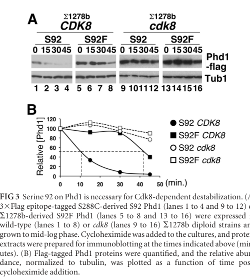

## Question

# Gene Research for Functional Annotation

## ⚠️ CRITICAL: Gene/Protein Identification Context

**BEFORE YOU BEGIN RESEARCH:** You MUST verify you are researching the CORRECT gene/protein. Gene symbols can be ambiguous, especially for less well-characterized genes from non-model organisms.

### Target Gene/Protein Identity (from UniProt):
- **UniProt Accession:** P36093
- **Protein Description:** RecName: Full=Putative transcription factor PHD1;
- **Gene Information:** Name=PHD1; OrderedLocusNames=YKL043W; ORFNames=YKL256;
- **Organism (full):** Saccharomyces cerevisiae (strain ATCC 204508 / S288c) (Baker's yeast).
- **Protein Family:** Belongs to the EFG1/PHD1/stuA family. .
- **Key Domains:** EFG1/Phd1/StuA. (IPR029790); HTH_APSES_sf. (IPR036887); KilA/APSES_HTH. (IPR018004); Tscrpt_reg_HTH_APSES-type. (IPR003163); KilA-N (PF04383)

### MANDATORY VERIFICATION STEPS:

1. **Check if the gene symbol "PHD1" matches the protein description above**
2. **Verify the organism is correct:** Saccharomyces cerevisiae (strain ATCC 204508 / S288c) (Baker's yeast).
3. **Check if protein family/domains align with what you find in literature**
4. **If you find literature for a DIFFERENT gene with the same or similar symbol, STOP**

### If Gene Symbol is Ambiguous or You Cannot Find Relevant Literature:

**DO NOT PROCEED WITH RESEARCH ON A DIFFERENT GENE.** Instead:
- State clearly: "The gene symbol 'PHD1' is ambiguous or literature is limited for this specific protein"
- Explain what you found (e.g., "Found extensive literature on a different gene with the same symbol in a different organism")
- Describe the protein based ONLY on the UniProt information provided above
- Suggest that the protein function can be inferred from domain/family information

### Research Target:

Please provide a comprehensive research report on the gene **PHD1** (gene ID: PHD1, UniProt: P36093) in yeast.

The research report should be a detailed narrative explaining the function, biological processes, and localization of the gene product. Citations should be given for all claims.

You should prioritize authoritative reviews and primary scientific literature when conducting research. You can supplement
this with annotations you find in gene/protein databases, but these can be outdated or inaccurate.

We are specifically interested in the primary function of the gene - for enzymes, what reaction is catalyzed, and what is the substrate specificity? For transporters, what is the substrate? For structural proteins or adapters, what is the broader structural role? For signaling molecules, what is the role in the pathway.

We are interested in where in or outside the cell the gene product carries out its function.

We are also interested in the signaling or biochemical pathways in which the gene functions. We are less interested in broad pleiotropic effects, except where these elucidate the precise role.

Include evidence where possible. We are interested in both experimental evidence as well as inference from structure, evolution, or bioinformatic analysis. Precise studies should be prioritized over high-throughput, where available.

## Output

Question: You are an expert researcher providing comprehensive, well-cited information.

Provide detailed information focusing on:
1. Key concepts and definitions with current understanding
2. Recent developments and latest research (prioritize 2023-2024 sources)
3. Current applications and real-world implementations
4. Expert opinions and analysis from authoritative sources
5. Relevant statistics and data from recent studies

Format as a comprehensive research report with proper citations. Include URLs and publication dates where available.
Always prioritize recent, authoritative sources and provide specific citations for all major claims.

# Gene Research for Functional Annotation

## ⚠️ CRITICAL: Gene/Protein Identification Context

**BEFORE YOU BEGIN RESEARCH:** You MUST verify you are researching the CORRECT gene/protein. Gene symbols can be ambiguous, especially for less well-characterized genes from non-model organisms.

### Target Gene/Protein Identity (from UniProt):
- **UniProt Accession:** P36093
- **Protein Description:** RecName: Full=Putative transcription factor PHD1;
- **Gene Information:** Name=PHD1; OrderedLocusNames=YKL043W; ORFNames=YKL256;
- **Organism (full):** Saccharomyces cerevisiae (strain ATCC 204508 / S288c) (Baker's yeast).
- **Protein Family:** Belongs to the EFG1/PHD1/stuA family. .
- **Key Domains:** EFG1/Phd1/StuA. (IPR029790); HTH_APSES_sf. (IPR036887); KilA/APSES_HTH. (IPR018004); Tscrpt_reg_HTH_APSES-type. (IPR003163); KilA-N (PF04383)

### MANDATORY VERIFICATION STEPS:

1. **Check if the gene symbol "PHD1" matches the protein description above**
2. **Verify the organism is correct:** Saccharomyces cerevisiae (strain ATCC 204508 / S288c) (Baker's yeast).
3. **Check if protein family/domains align with what you find in literature**
4. **If you find literature for a DIFFERENT gene with the same or similar symbol, STOP**

### If Gene Symbol is Ambiguous or You Cannot Find Relevant Literature:

**DO NOT PROCEED WITH RESEARCH ON A DIFFERENT GENE.** Instead:
- State clearly: "The gene symbol 'PHD1' is ambiguous or literature is limited for this specific protein"
- Explain what you found (e.g., "Found extensive literature on a different gene with the same symbol in a different organism")
- Describe the protein based ONLY on the UniProt information provided above
- Suggest that the protein function can be inferred from domain/family information

### Research Target:

Please provide a comprehensive research report on the gene **PHD1** (gene ID: PHD1, UniProt: P36093) in yeast.

The research report should be a detailed narrative explaining the function, biological processes, and localization of the gene product. Citations should be given for all claims.

You should prioritize authoritative reviews and primary scientific literature when conducting research. You can supplement
this with annotations you find in gene/protein databases, but these can be outdated or inaccurate.

We are specifically interested in the primary function of the gene - for enzymes, what reaction is catalyzed, and what is the substrate specificity? For transporters, what is the substrate? For structural proteins or adapters, what is the broader structural role? For signaling molecules, what is the role in the pathway.

We are interested in where in or outside the cell the gene product carries out its function.

We are also interested in the signaling or biochemical pathways in which the gene functions. We are less interested in broad pleiotropic effects, except where these elucidate the precise role.

Include evidence where possible. We are interested in both experimental evidence as well as inference from structure, evolution, or bioinformatic analysis. Precise studies should be prioritized over high-throughput, where available.

## Research Report: Functional Annotation of *Saccharomyces cerevisiae* PHD1 (UniProt P36093; gene PHD1; locus YKL043W)

### 1) Target identity verification (mandatory)
The research target is **PHD1** from *Saccharomyces cerevisiae* (S288c background; systematic locus **YKL043W**), encoding **Phd1**, a **transcription factor** implicated in **filamentous differentiation** programs (pseudohyphal and invasive growth). Multiple primary studies explicitly name **PHD1/Phd1** in *S. cerevisiae* and characterize it as a filamentation transcription factor that regulates **FLO11/MUC1** and other differentiation regulators, matching the UniProt context of a putative transcription factor rather than an enzyme or unrelated “PHD” domain protein. (raithatha2012cdk8regulatesstability pages 1-2, pan2000sok2regulatesyeast pages 1-2)

### 2) Key concepts and definitions (current understanding)

#### 2.1 Filamentous growth in budding yeast
*Saccharomyces cerevisiae* can switch from unicellular budding to multicellular, elongated growth forms under nutrient limitation. Two commonly discussed forms are:
- **Pseudohyphal growth** (classically in diploids), characterized by elongated cells that remain attached and form filaments.
- **Invasive growth** (classically in haploids), involving agar invasion and adhesion.
Both phenotypes require coordinated control of morphology, polarity, and especially **cell-surface adhesion**, with **FLO11/MUC1** a central effector gene encoding a surface glycoprotein (flocculin). (pan2000sok2regulatesyeast pages 1-2, kumar2021thecomplexgenetic pages 5-7)

#### 2.2 What PHD1/Phd1 is (molecular function)
**Phd1 is a transcription factor** positioned as a high-level regulator (“master regulator”) of filamentous differentiation gene expression programs, rather than a catalytic enzyme or transporter. Its biological role is therefore best defined by the **transcriptional programs it activates/represses** and by how its activity is controlled by upstream signaling and protein stability. (raithatha2012cdk8regulatesstability pages 1-2)

### 3) Core functional annotation: processes, targets, pathways, and mechanism

#### 3.1 Primary biological process: regulation of filamentous differentiation and adhesion via FLO11
A central experimentally supported role for Phd1 is **regulation of cell–cell/cell–surface adhesion and filamentation through FLO11**:
- In a transcription-factor cascade context, Pan & Heitman (2000) report that **Phd1 and Ash1 regulate expression of the cell surface protein Flo11**, and that both factors are **largely required** for filamentation in a **sok2** hyperfilamentous background. (Publication date: 2000-11; URL: https://doi.org/10.1128/MCB.20.22.8364-8372.2000) (pan2000sok2regulatesyeast pages 1-2)
- A later authoritative synthesis (Annual Review of Genetics) places Phd1 in a **Sok2→Phd1/Ash1/Swi5 transcription-factor cascade** capable of regulating **FLO11** “independently of the PKA and MAPK pathways,” framing Phd1 as part of a layered regulatory architecture converging on FLO11. (Publication date: 2021-11; URL: https://doi.org/10.1146/annurev-genet-071719-020249) (kumar2021thecomplexgenetic pages 5-7)

#### 3.2 Genetic/phenotypic evidence for PHD1 as a differentiation driver
Multiple lines of genetic evidence support Phd1 as a potent differentiation regulator:
- **Overexpression of PHD1 strongly promotes pseudohyphal growth** even on nitrogen-rich medium; in Pan & Heitman (2000), PHD1 overexpression can **suppress pseudohyphal defects** of **tpk2** and **ste12** mutants, indicating Phd1 can drive downstream differentiation programs even when canonical upstream regulators are compromised. (pan2000sok2regulatesyeast pages 1-2)
- Conversely, **phd1/phd1** mutants did **not** show obvious pseudohyphal defects under the conditions emphasized in that study, suggesting background/condition dependence and redundancy among differentiation regulators. (pan2000sok2regulatesyeast pages 1-2)
- Raithatha et al. (2012) also describe Phd1 as a “master regulator” of filamentation and report that PHD1 expression is induced under nitrogen starvation and Phd1 accumulates under differentiating conditions, consistent with a role in initiating/maintaining the program. (Publication date: 2012-02; URL: https://doi.org/10.1128/MCB.05420-11) (raithatha2012cdk8regulatesstability pages 1-2)

#### 3.3 Upstream signaling and transcriptional inputs: MAPK/PKA/Snf1 context and the Sok2 axis
Phd1 sits within a broader network in which nutrient sensing feeds into transcriptional regulators controlling FLO11 and morphology:
- The broader differentiation system is described as being regulated by **MAPK (Kss1)**, **Ras–cAMP–PKA**, and **Snf1/AMPK** signaling; this context is explicitly discussed alongside PHD1 regulation in Raithatha et al. (2012). (raithatha2012cdk8regulatesstability pages 1-2)
- Pan & Heitman (2000) place Phd1 in relation to the cAMP/PKA and MAPK systems and suggest Phd1 may act **distinct** from those pathways in some contexts, consistent with multiple partially independent inputs to FLO11 regulation. (pan2000sok2regulatesyeast pages 1-2)
- Kumar (2021) highlights that Sok2 is thought to act downstream of cAMP/PKA but can activate a TF cascade (including **Phd1**) that regulates FLO11 “independently” of direct PKA/MAPK control, emphasizing **network modularity and redundancy**. (kumar2021thecomplexgenetic pages 5-7)

#### 3.4 Post-translational regulation and mechanism: Cdk8-dependent turnover of Phd1
A major mechanistic advance in understanding Phd1 is that its activity is controlled not only transcriptionally but also by **protein stability**:
- Raithatha et al. (2012) provide experimental evidence that **Phd1 is intrinsically unstable** and that its degradation is initiated via **Cdk8-dependent phosphorylation** (Cdk8 is a kinase associated with the RNA polymerase II Mediator complex). (raithatha2012cdk8regulatesstability pages 1-2)
- Quantitative stability measurements by cycloheximide-chase show a **short half-life (~10–15 min) in rich medium**, and strong stabilization in conditions where Cdk8 activity is absent or reduced. (raithatha2012cdk8regulatesstability pages 6-7)
- Under **nitrogen limitation**, Phd1 becomes progressively stabilized: half-life increases to **~40 min after 2 h** in nitrogen-limiting SLAD and to **>45 min after 4 h**, consistent with a differentiation-triggered stabilization mechanism. (raithatha2012cdk8regulatesstability pages 6-7, raithatha2012cdk8regulatesstability media d01b8851)
- In **cdk8Δ**, Phd1 is strongly stabilized (**>45 min**), consistent with Cdk8 acting as a negative regulator through turnover. (raithatha2012cdk8regulatesstability pages 2-3)
- A notable genetics–biochemistry bridge is a **natural polymorphism** in a differentiating strain background (1278b) that removes a candidate Cdk8 phosphosite (S92F), stabilizing Phd1 and enhancing filamentation, supporting causality between **phosphorylation site, stability, and phenotype**. (raithatha2012cdk8regulatesstability pages 1-2, raithatha2012cdk8regulatesstability pages 6-7)

**Visual evidence:** cycloheximide-chase panels and the regulatory model were retrieved from Raithatha et al. (2012), including stability curves and a pathway model summarizing how nutrient limitation reduces Cdk8 activity to permit accumulation of Phd1 and other transcription factors. (raithatha2012cdk8regulatesstability media d01b8851, raithatha2012cdk8regulatesstability media c487618b)

### 4) Subcellular localization (what is known vs. evidence gaps)
Direct experimental localization evidence (e.g., GFP microscopy or cell fractionation explicitly stating nuclear localization) was **not found in the retrieved excerpts**. However:
- Raithatha et al. (2012) used **FLAG-tagged Phd1** for biochemical detection and treat Phd1 as a DNA-binding transcriptional regulator; nuclear function is therefore strongly implied but not directly demonstrated in the retrieved text segments. (raithatha2012cdk8regulatesstability pages 6-7, raithatha2012cdk8regulatesstability pages 3-4)
Accordingly, the most defensible annotation from the retrieved evidence is:
- **Cellular compartment (evidence level):** nuclear localization is **inferred** from transcription factor function and Mediator/Cdk8 context, but **direct localization assays were not available** in the gathered evidence. (raithatha2012cdk8regulatesstability pages 1-2)

### 5) Recent developments (prioritizing 2023–2024)
Direct 2023–2024 mechanistic papers specifically dissecting Phd1 regulation were not retrieved by the search tools. However, one 2024 primary study provides contemporary functional context:

#### 5.1 PHD1 in structured colony morphology (2024 RNA-seq + genetics)
Cromie et al. (2024) examined gene-expression programs underlying “ruffled/structured” colony morphology and performed deletion tests in a structured-colony background (F13). They report:
- **PHD1 (YKL043W)** is in a gene-expression cluster whose expression correlates positively with colony structure.
- Yet, **phd1Δ had little effect** on colony morphology at day 5 (colonies still displayed an outer structured zone and inner smooth zone), whereas **flo11Δ** or **msb2Δ** produced fully smooth colonies. (Publication date: 2024-09; URL: https://doi.org/10.1371/journal.pone.0311061) (cromie2024spatiotemporalpatternsof pages 21-23)

**Interpretation:** This supports the view that PHD1 participates in a broader colony-structure/filamentation-associated transcriptional state, but may be **nonessential or redundant** in at least some genetic backgrounds and environmental regimes—consistent with older observations that loss of PHD1 alone can show modest phenotypes while overexpression is strongly pro-filamentation. (pan2000sok2regulatesyeast pages 1-2, cromie2024spatiotemporalpatternsof pages 21-23)

### 6) Current applications and real-world implementations

#### 6.1 Synthetic biology: externally controlled induction of pseudohyphal growth
A clear real-world implementation of PHD1 knowledge is in synthetic gene regulation:
- Pothoulakis & Ellis (2018) engineered synthetic regulatory systems to control expression of **native PHD1 and FLO8**, demonstrating that externally controlled induction of these transcription factors can **trigger pseudohyphal growth** in both diploid and haploid strains, including in rich media. This establishes PHD1 as an actionable “handle” to program multicellular morphology in yeast. (Publication date: 2018-01; URL: https://doi.org/10.1038/s42003-017-0008-0) (pothoulakis2018syntheticgeneregulation pages 1-2)

**Application relevance:** controllable filamentation can be used as a chassis capability for engineered surface adhesion, structured multicellular assemblies, and programmable colony architectures, leveraging natural differentiation modules. (pothoulakis2018syntheticgeneregulation pages 1-2)

### 7) Expert opinions and authoritative synthesis
- Kumar (2021) emphasizes that pseudohyphal growth is governed by a **complex genetic basis and multilayered regulatory control**, with multiple pathways converging on FLO11 and a large gene set enabling morphological transition. Within this framework, the Sok2→Phd1/Ash1/Swi5 cascade represents one route to FLO11 regulation that can bypass canonical PKA/MAPK control, illustrating the field’s view that filamentation is controlled by **redundant, context-dependent regulatory modules**. (kumar2021thecomplexgenetic pages 5-7)
- Raithatha et al. (2012) contributes an expert mechanistic interpretation that controlling differentiation can hinge on changing the stability of labile transcription factors (including Phd1) by down-regulating Cdk8 activity under nitrogen limitation, highlighting **protein turnover as a regulatory “gate”** for cell-fate transitions. (raithatha2012cdk8regulatesstability pages 8-9)

### 8) Key statistics and quantitative data (from recent/primary studies)
- **Phd1 half-life in rich medium:** ~**10–15 min** (cycloheximide chase). (raithatha2012cdk8regulatesstability pages 6-7)
- **Phd1 half-life after nitrogen limitation:** ~**40 min** after **2 h** in SLAD; **>45 min** after **4 h** in SLAD. (raithatha2012cdk8regulatesstability pages 6-7, raithatha2012cdk8regulatesstability media d01b8851)
- **Phd1 half-life in cdk8Δ:** **>45 min** (stabilized). (raithatha2012cdk8regulatesstability pages 2-3)
- **2024 deletion phenotype:** in the F13 colony-structure system, **phd1Δ showed little effect** on the presence of structured outer zones at day 5, unlike **flo11Δ** (structure abolished). (cromie2024spatiotemporalpatternsof pages 21-23)

### Evidence summary table
The following table consolidates the supported claims, evidence types, and quantitative data extracted from the retrieved corpus.

| Claim/annotation | Evidence type | Key experimental details (strain/condition/assay) | Quantitative/statistical data | Primary source (authors year journal) | DOI URL |
|---|---|---|---|---|---|
| Phd1 is a transcription factor and a master regulator of filamentous differentiation in *S. cerevisiae* | Genetics; regulatory analysis | Primary study summarized Phd1 as regulating expression of most other differentiation TFs; overproduction induced filamentation; evidence integrated with nitrogen-starvation differentiation assays (raithatha2012cdk8regulatesstability pages 1-2, raithatha2012cdk8regulatesstability pages 2-2) | Overexpression sufficient to induce filamentation; no exact fold reported in gathered evidence (raithatha2012cdk8regulatesstability pages 1-2, raithatha2012cdk8regulatesstability pages 2-2) | Raithatha et al. 2012, *Molecular and Cellular Biology* (raithatha2012cdk8regulatesstability pages 1-2, raithatha2012cdk8regulatesstability pages 2-2) | https://doi.org/10.1128/MCB.05420-11 |
| Primary molecular function is transcriptional regulation of pseudohyphal/invasive growth programs rather than enzymatic catalysis | Genetics; phenotype suppression | Overexpression of **PHD1** strongly promoted pseudohyphal growth even on nitrogen-rich medium and could suppress pseudohyphal defects of **tpk2** and **ste12** mutants (pan2000sok2regulatesyeast pages 1-2) | Strong pseudohyphal growth on rich medium upon overexpression; **phd1/phd1** mutants alone showed no obvious pseudohyphal defect in that assay (pan2000sok2regulatesyeast pages 1-2) | Pan & Heitman 2000, *Molecular and Cellular Biology* (pan2000sok2regulatesyeast pages 1-2) | https://doi.org/10.1128/MCB.20.22.8364-8372.2000 |
| Phd1 positively regulates **FLO11/MUC1**, a key cell-surface flocculin required for filamentation/invasion | Genetics; transcriptional cascade | Genome-array/Northern analyses in **sok2/sok2** hyperfilamentous mutants placed **PHD1** in a cascade with Ash1 controlling **FLO11** expression and cell-cell adhesion (pan2000sok2regulatesyeast pages 1-2); review synthesis places Phd1 in Sok2→Phd1/Ash1/Swi5→FLO11 regulation (kumar2021thecomplexgenetic pages 5-7) | In **sok2** background, Phd1 and Ash1 were largely required for filamentation; exact expression fold not given in gathered excerpts (pan2000sok2regulatesyeast pages 1-2, kumar2021thecomplexgenetic pages 5-7) | Pan & Heitman 2000, *MCB*; Kumar 2021, *Annual Review of Genetics* (pan2000sok2regulatesyeast pages 1-2, kumar2021thecomplexgenetic pages 5-7) | https://doi.org/10.1128/MCB.20.22.8364-8372.2000; https://doi.org/10.1146/annurev-genet-071719-020249 |
| Phd1 functions in pseudohyphal growth and haploid invasive growth pathways | Genetics; phenotypic analysis | Ste12 and **PHD1** were required for haploid invasive growth; PHD1 induction/stabilization tracked with nitrogen starvation, a canonical pseudohyphal trigger (raithatha2012cdk8regulatesstability pages 8-9, raithatha2012cdk8regulatesstability pages 1-2) | Nitrogen starvation increased PHD1 mRNA and stabilized protein; invasive-growth requirement shown genetically but without exact percentages in gathered text (raithatha2012cdk8regulatesstability pages 8-9, raithatha2012cdk8regulatesstability pages 1-2) | Raithatha et al. 2012, *MCB* (raithatha2012cdk8regulatesstability pages 8-9, raithatha2012cdk8regulatesstability pages 1-2) | https://doi.org/10.1128/MCB.05420-11 |
| Upstream pathway context includes Ras2/cAMP-PKA, MAPK/Kss1, and Snf1; Phd1 acts within or alongside this network | Review synthesis; genetics | Filamentous differentiation broadly regulated by MAPK (Kss1), Ras-cAMP-PKA, and Snf1-AMPK; Sok2 is thought to act downstream of cAMP/PKA, while the Sok2→Phd1/Ash1/Swi5 cascade can regulate **FLO11** independently of direct PKA/MAPK control (raithatha2012cdk8regulatesstability pages 1-2, pan2000sok2regulatesyeast pages 1-2, kumar2021thecomplexgenetic pages 5-7) | Pathway placement is qualitative in gathered evidence; no direct kinetic constants reported (raithatha2012cdk8regulatesstability pages 1-2, pan2000sok2regulatesyeast pages 1-2, kumar2021thecomplexgenetic pages 5-7) | Raithatha et al. 2012, *MCB*; Pan & Heitman 2000, *MCB*; Kumar 2021, *Annu Rev Genet* (raithatha2012cdk8regulatesstability pages 1-2, pan2000sok2regulatesyeast pages 1-2, kumar2021thecomplexgenetic pages 5-7) | https://doi.org/10.1128/MCB.05420-11; https://doi.org/10.1128/MCB.20.22.8364-8372.2000; https://doi.org/10.1146/annurev-genet-071719-020249 |
| PHD1 is directly repressed by Sok2 in rich medium | Genetics; transcriptional regulation | In rich medium, Sok2 acted as a negative regulator of filamentation and directly/indirectly repressed the transcription-factor cascade including **PHD1**; **PHD1** was induced in **sok2/sok2** hyperfilamentous mutants (raithatha2012cdk8regulatesstability pages 8-9, pan2000sok2regulatesyeast pages 1-2) | **PHD1** induction observed in **sok2/sok2** mutants; exact fold change not given in gathered excerpts (raithatha2012cdk8regulatesstability pages 8-9, pan2000sok2regulatesyeast pages 1-2) | Pan & Heitman 2000, *MCB*; Raithatha et al. 2012, *MCB* (raithatha2012cdk8regulatesstability pages 8-9, pan2000sok2regulatesyeast pages 1-2) | https://doi.org/10.1128/MCB.20.22.8364-8372.2000; https://doi.org/10.1128/MCB.05420-11 |
| PHD1 expression is partially dependent on Ste12, and Ste12 binds the PHD1 promoter in vitro | Promoter binding; genetics | DNase I footprinting/promoter analysis showed Ste12 binds sites on the **PHD1** promoter in vitro; in vivo promoter occupancy also implicated Tec1, Flo8, Sok2, and Phd1 itself (raithatha2012cdk8regulatesstability pages 8-9, raithatha2012cdk8regulatesstability pages 6-7, raithatha2012cdk8regulatesstability pages 2-3) | Qualitative promoter-binding evidence; no occupancy percentages in gathered excerpts (raithatha2012cdk8regulatesstability pages 8-9, raithatha2012cdk8regulatesstability pages 6-7, raithatha2012cdk8regulatesstability pages 2-3) | Raithatha et al. 2012, *MCB* (raithatha2012cdk8regulatesstability pages 8-9, raithatha2012cdk8regulatesstability pages 6-7, raithatha2012cdk8regulatesstability pages 2-3) | https://doi.org/10.1128/MCB.05420-11 |
| Phd1 positively autoregulates its own expression under nitrogen limitation | Promoter binding; regulatory model | Promoter occupancy and regulatory model indicate Phd1 can bind/activate its own promoter, forming a positive-feedback loop during differentiation (raithatha2012cdk8regulatesstability pages 8-9, raithatha2012cdk8regulatesstability pages 6-7) | Positive feedback described qualitatively; no exact fold increase reported in gathered excerpts (raithatha2012cdk8regulatesstability pages 8-9, raithatha2012cdk8regulatesstability pages 6-7) | Raithatha et al. 2012, *MCB* (raithatha2012cdk8regulatesstability pages 8-9, raithatha2012cdk8regulatesstability pages 6-7) | https://doi.org/10.1128/MCB.05420-11 |
| Cdk8 negatively regulates Phd1 by phosphorylation-dependent destabilization | Protein stability assay; in vitro kinase/phosphopeptide analysis | Cycloheximide-chase, 32Pi metabolic labeling, immunoprecipitation, in vitro kinase assays, and phosphopeptide analysis showed Cdk8-dependent phosphorylation promotes Phd1 degradation (raithatha2012cdk8regulatesstability pages 1-2, raithatha2012cdk8regulatesstability pages 2-2, raithatha2012cdk8regulatesstability pages 2-3) | Phd1 half-life was reported as ~10–15 min in wild type/rich medium and >45 min in **cdk8Δ** cells (raithatha2012cdk8regulatesstability pages 1-2, raithatha2012cdk8regulatesstability pages 6-7, raithatha2012cdk8regulatesstability pages 2-3) | Raithatha et al. 2012, *MCB* (raithatha2012cdk8regulatesstability pages 1-2, raithatha2012cdk8regulatesstability pages 6-7, raithatha2012cdk8regulatesstability pages 2-3) | https://doi.org/10.1128/MCB.05420-11 |
| Natural polymorphism at the Cdk8 phosphosite stabilizes Phd1 and enhances filamentation | Protein stability assay; allele comparison | Comparison of PHD1 alleles (S92 versus S92F) showed that the 1278b strain carries S92F, removing a Cdk8 phosphorylation site and stabilizing Phd1 (raithatha2012cdk8regulatesstability pages 1-2, raithatha2012cdk8regulatesstability pages 6-7, raithatha2012cdk8regulatesstability pages 2-2) | Wild-type S92 Phd1 half-life ~15 min in rich medium; stabilized variant and/or **cdk8Δ** backgrounds showed >45 min stability (raithatha2012cdk8regulatesstability pages 6-7, raithatha2012cdk8regulatesstability pages 2-2) | Raithatha et al. 2012, *MCB* (raithatha2012cdk8regulatesstability pages 1-2, raithatha2012cdk8regulatesstability pages 6-7, raithatha2012cdk8regulatesstability pages 2-2) | https://doi.org/10.1128/MCB.05420-11 |
| Nitrogen starvation stabilizes Phd1 protein and increases PHD1 transcript, promoting differentiation | Protein stability assay; transcript analysis | Cells shifted to SLAD/nitrogen-limiting medium showed increased **PHD1** mRNA and marked stabilization of Phd1 protein; model proposes loss of Cdk8 activity under these conditions (raithatha2012cdk8regulatesstability pages 8-9, raithatha2012cdk8regulatesstability pages 1-2, raithatha2012cdk8regulatesstability pages 6-7, raithatha2012cdk8regulatesstability media d01b8851) | Half-life increased from ~15 min in SD to ~40 min after 2 h in SLAD and >45 min after 4 h in SLAD (raithatha2012cdk8regulatesstability pages 6-7, raithatha2012cdk8regulatesstability media d01b8851) | Raithatha et al. 2012, *MCB* (raithatha2012cdk8regulatesstability pages 8-9, raithatha2012cdk8regulatesstability pages 1-2, raithatha2012cdk8regulatesstability pages 6-7, raithatha2012cdk8regulatesstability media d01b8851) | https://doi.org/10.1128/MCB.05420-11 |
| Forced expression of PHD1 is sufficient to induce pseudohyphal growth synthetically, even in rich media and in haploids | Synthetic induction | Synthetic gene-regulation circuits controlling native **PHD1** and **FLO8** expression triggered pseudohyphal growth in diploid and haploid cells in rich media; used as an engineered, externally inducible differentiation system (pothoulakis2018syntheticgeneregulation pages 1-2) | Phenotype induction in both diploid and haploid strains under non-starvation conditions; exact percentages not given in gathered excerpt (pothoulakis2018syntheticgeneregulation pages 1-2) | Pothoulakis & Ellis 2018, *Communications Biology* (pothoulakis2018syntheticgeneregulation pages 1-2) | https://doi.org/10.1038/s42003-017-0008-0 |
| Recent 2024 colony-morphology data support association of PHD1 expression with structured colony regions, but deletion may be background-dependent and nonessential in F13 | RNA-seq/cluster; deletion phenotype | In structured-colony strain F13, **PHD1/YKL043W** clustered with genes whose expression correlated positively with colony structure (cluster I9); however, **phd1Δ** retained central smooth plus outer structured zones at day 5, unlike **flo11Δ** or **msb2Δ** (cromie2024spatiotemporalpatternsof pages 21-23) | **phd1Δ** had little effect on F13 morphology, whereas **flo11Δ** and **msb2Δ** remained fully smooth at day 5 (cromie2024spatiotemporalpatternsof pages 21-23) | Cromie et al. 2024, *PLOS ONE* (cromie2024spatiotemporalpatternsof pages 21-23) | https://doi.org/10.1371/journal.pone.0311061 |
| Subcellular localization is expected to be nuclear for a transcription factor, but no direct Phd1 localization evidence was identified in the gathered sources | Evidence gap / inference | Gathered primary and review sources discuss Phd1 as a transcription factor regulating promoters and differentiation programs, but none of the retrieved evidence IDs reported direct GFP/immunolocalization for Phd1 (raithatha2012cdk8regulatesstability pages 8-9, pan2000sok2regulatesyeast pages 1-2) | No direct localization measurement available in gathered evidence (raithatha2012cdk8regulatesstability pages 8-9, pan2000sok2regulatesyeast pages 1-2) | Evidence gap within retrieved literature (raithatha2012cdk8regulatesstability pages 8-9, pan2000sok2regulatesyeast pages 1-2) | N/A |

*Table: This table summarizes experimentally supported functional annotations for Saccharomyces cerevisiae PHD1/Phd1 using only the gathered evidence contexts. It highlights molecular function, pathway placement, regulatory inputs, phenotypes, and the current evidence gap for direct localization data.*

### References (with publication dates and URLs)
- Pan X, Heitman J. **2000-11.** Sok2 regulates yeast pseudohyphal differentiation via a transcription factor cascade that regulates cell-cell adhesion. *Molecular and Cellular Biology*. https://doi.org/10.1128/MCB.20.22.8364-8372.2000 (pan2000sok2regulatesyeast pages 1-2)
- Raithatha S, Su T-C, Lourenco P, Goto S, Sadowski I. **2012-02.** Cdk8 regulates stability of the transcription factor Phd1 to control pseudohyphal differentiation of *Saccharomyces cerevisiae*. *Molecular and Cellular Biology*. https://doi.org/10.1128/MCB.05420-11 (raithatha2012cdk8regulatesstability pages 1-2)
- Pothoulakis G, Ellis T. **2018-01.** Synthetic gene regulation for independent external induction of the *Saccharomyces cerevisiae* pseudohyphal growth phenotype. *Communications Biology*. https://doi.org/10.1038/s42003-017-0008-0 (pothoulakis2018syntheticgeneregulation pages 1-2)
- Kumar A. **2021-11.** The Complex Genetic Basis and Multilayered Regulatory Control of Yeast Pseudohyphal Growth. *Annual Review of Genetics*. https://doi.org/10.1146/annurev-genet-071719-020249 (kumar2021thecomplexgenetic pages 5-7)
- Cromie GA, Tan Z, Hays M, Sirr A, Dudley AM. **2024-09.** Spatiotemporal patterns of gene expression during development of a complex colony morphology. *PLOS ONE*. https://doi.org/10.1371/journal.pone.0311061 (cromie2024spatiotemporalpatternsof pages 21-23)

### Limitations of this report (evidence gaps)
- **Direct subcellular localization** of Phd1 (e.g., microscopy of Phd1-GFP or nuclear fractionation) was **not identified** in the retrieved text evidence, so nuclear localization is stated as **inferred** rather than directly demonstrated here. (raithatha2012cdk8regulatesstability pages 1-2)
- While the prompt requested prioritization of **2023–2024** sources, tool-based retrieval yielded limited Phd1-specific mechanistic literature in those years; the 2024 colony-morphology study provides the most direct recent primary evidence involving PHD1. (cromie2024spatiotemporalpatternsof pages 21-23)

References

1. (raithatha2012cdk8regulatesstability pages 1-2): Sheetal Raithatha, Ting-Cheng Su, Pedro Lourenco, Susan Goto, and Ivan Sadowski. Cdk8 regulates stability of the transcription factor phd1 to control pseudohyphal differentiation of <i>saccharomyces cerevisiae</i>. Molecular and Cellular Biology, 32:664-674, Feb 2012. URL: https://doi.org/10.1128/mcb.05420-11, doi:10.1128/mcb.05420-11. This article has 59 citations and is from a domain leading peer-reviewed journal.

2. (pan2000sok2regulatesyeast pages 1-2): Xuewen Pan and Joseph Heitman. Sok2 regulates yeast pseudohyphal differentiation via a transcription factor cascade that regulates cell-cell adhesion. Molecular and Cellular Biology, 20:8364-8372, Nov 2000. URL: https://doi.org/10.1128/mcb.20.22.8364-8372.2000, doi:10.1128/mcb.20.22.8364-8372.2000. This article has 164 citations and is from a domain leading peer-reviewed journal.

3. (kumar2021thecomplexgenetic pages 5-7): Anuj Kumar. The complex genetic basis and multilayered regulatory control of yeast pseudohyphal growth. Nov 2021. URL: https://doi.org/10.1146/annurev-genet-071719-020249, doi:10.1146/annurev-genet-071719-020249. This article has 41 citations and is from a domain leading peer-reviewed journal.

4. (raithatha2012cdk8regulatesstability pages 6-7): Sheetal Raithatha, Ting-Cheng Su, Pedro Lourenco, Susan Goto, and Ivan Sadowski. Cdk8 regulates stability of the transcription factor phd1 to control pseudohyphal differentiation of <i>saccharomyces cerevisiae</i>. Molecular and Cellular Biology, 32:664-674, Feb 2012. URL: https://doi.org/10.1128/mcb.05420-11, doi:10.1128/mcb.05420-11. This article has 59 citations and is from a domain leading peer-reviewed journal.

5. (raithatha2012cdk8regulatesstability media d01b8851): Sheetal Raithatha, Ting-Cheng Su, Pedro Lourenco, Susan Goto, and Ivan Sadowski. Cdk8 regulates stability of the transcription factor phd1 to control pseudohyphal differentiation of <i>saccharomyces cerevisiae</i>. Molecular and Cellular Biology, 32:664-674, Feb 2012. URL: https://doi.org/10.1128/mcb.05420-11, doi:10.1128/mcb.05420-11. This article has 59 citations and is from a domain leading peer-reviewed journal.

6. (raithatha2012cdk8regulatesstability pages 2-3): Sheetal Raithatha, Ting-Cheng Su, Pedro Lourenco, Susan Goto, and Ivan Sadowski. Cdk8 regulates stability of the transcription factor phd1 to control pseudohyphal differentiation of <i>saccharomyces cerevisiae</i>. Molecular and Cellular Biology, 32:664-674, Feb 2012. URL: https://doi.org/10.1128/mcb.05420-11, doi:10.1128/mcb.05420-11. This article has 59 citations and is from a domain leading peer-reviewed journal.

7. (raithatha2012cdk8regulatesstability media c487618b): Sheetal Raithatha, Ting-Cheng Su, Pedro Lourenco, Susan Goto, and Ivan Sadowski. Cdk8 regulates stability of the transcription factor phd1 to control pseudohyphal differentiation of <i>saccharomyces cerevisiae</i>. Molecular and Cellular Biology, 32:664-674, Feb 2012. URL: https://doi.org/10.1128/mcb.05420-11, doi:10.1128/mcb.05420-11. This article has 59 citations and is from a domain leading peer-reviewed journal.

8. (raithatha2012cdk8regulatesstability pages 3-4): Sheetal Raithatha, Ting-Cheng Su, Pedro Lourenco, Susan Goto, and Ivan Sadowski. Cdk8 regulates stability of the transcription factor phd1 to control pseudohyphal differentiation of <i>saccharomyces cerevisiae</i>. Molecular and Cellular Biology, 32:664-674, Feb 2012. URL: https://doi.org/10.1128/mcb.05420-11, doi:10.1128/mcb.05420-11. This article has 59 citations and is from a domain leading peer-reviewed journal.

9. (cromie2024spatiotemporalpatternsof pages 21-23): Gareth A. Cromie, Zhihao Tan, Michelle Hays, Amy Sirr, and Aimée M. Dudley. Spatiotemporal patterns of gene expression during development of a complex colony morphology. PLOS ONE, Sep 2024. URL: https://doi.org/10.1371/journal.pone.0311061, doi:10.1371/journal.pone.0311061. This article has 3 citations and is from a peer-reviewed journal.

10. (pothoulakis2018syntheticgeneregulation pages 1-2): Georgios Pothoulakis and Tom Ellis. Synthetic gene regulation for independent external induction of the saccharomyces cerevisiae pseudohyphal growth phenotype. Communications Biology, Jan 2018. URL: https://doi.org/10.1038/s42003-017-0008-0, doi:10.1038/s42003-017-0008-0. This article has 19 citations and is from a peer-reviewed journal.

11. (raithatha2012cdk8regulatesstability pages 8-9): Sheetal Raithatha, Ting-Cheng Su, Pedro Lourenco, Susan Goto, and Ivan Sadowski. Cdk8 regulates stability of the transcription factor phd1 to control pseudohyphal differentiation of <i>saccharomyces cerevisiae</i>. Molecular and Cellular Biology, 32:664-674, Feb 2012. URL: https://doi.org/10.1128/mcb.05420-11, doi:10.1128/mcb.05420-11. This article has 59 citations and is from a domain leading peer-reviewed journal.

12. (raithatha2012cdk8regulatesstability pages 2-2): Sheetal Raithatha, Ting-Cheng Su, Pedro Lourenco, Susan Goto, and Ivan Sadowski. Cdk8 regulates stability of the transcription factor phd1 to control pseudohyphal differentiation of <i>saccharomyces cerevisiae</i>. Molecular and Cellular Biology, 32:664-674, Feb 2012. URL: https://doi.org/10.1128/mcb.05420-11, doi:10.1128/mcb.05420-11. This article has 59 citations and is from a domain leading peer-reviewed journal.

## Artifacts

- [Edison artifact artifact-00](PHD1-deep-research-falcon_artifacts/artifact-00.md)

## Citations

1. kumar2021thecomplexgenetic pages 5-7
2. cromie2024spatiotemporalpatternsof pages 21-23
3. pothoulakis2018syntheticgeneregulation pages 1-2
4. https://doi.org/10.1128/MCB.20.22.8364-8372.2000
5. https://doi.org/10.1146/annurev-genet-071719-020249
6. https://doi.org/10.1128/MCB.05420-11
7. https://doi.org/10.1371/journal.pone.0311061
8. https://doi.org/10.1038/s42003-017-0008-0
9. https://doi.org/10.1128/MCB.20.22.8364-8372.2000;
10. https://doi.org/10.1128/MCB.05420-11;
11. https://doi.org/10.1128/mcb.05420-11,
12. https://doi.org/10.1128/mcb.20.22.8364-8372.2000,
13. https://doi.org/10.1146/annurev-genet-071719-020249,
14. https://doi.org/10.1371/journal.pone.0311061,
15. https://doi.org/10.1038/s42003-017-0008-0,