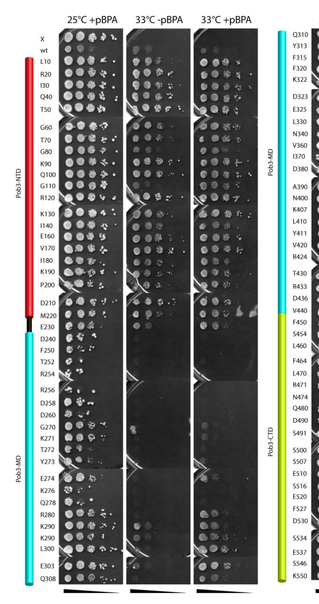

## Question

# Gene Research for Functional Annotation

## ⚠️ CRITICAL: Gene/Protein Identification Context

**BEFORE YOU BEGIN RESEARCH:** You MUST verify you are researching the CORRECT gene/protein. Gene symbols can be ambiguous, especially for less well-characterized genes from non-model organisms.

### Target Gene/Protein Identity (from UniProt):
- **UniProt Accession:** Q04636
- **Protein Description:** RecName: Full=FACT complex subunit POB3; AltName: Full=Facilitates chromatin transcription complex subunit POB3;
- **Gene Information:** Name=POB3; OrderedLocusNames=YML069W;
- **Organism (full):** Saccharomyces cerevisiae (strain ATCC 204508 / S288c) (Baker's yeast).
- **Protein Family:** Belongs to the SSRP1 family. .
- **Key Domains:** PH-like_dom_sf. (IPR011993); RTT106/SPT16-like_middle_dom. (IPR013719); RTT106/SSRP1_HistChap/FACT. (IPR050454); SSRP1-like_PH1. (IPR048993); SSRP1/POB3. (IPR000969)

### MANDATORY VERIFICATION STEPS:

1. **Check if the gene symbol "POB3" matches the protein description above**
2. **Verify the organism is correct:** Saccharomyces cerevisiae (strain ATCC 204508 / S288c) (Baker's yeast).
3. **Check if protein family/domains align with what you find in literature**
4. **If you find literature for a DIFFERENT gene with the same or similar symbol, STOP**

### If Gene Symbol is Ambiguous or You Cannot Find Relevant Literature:

**DO NOT PROCEED WITH RESEARCH ON A DIFFERENT GENE.** Instead:
- State clearly: "The gene symbol 'POB3' is ambiguous or literature is limited for this specific protein"
- Explain what you found (e.g., "Found extensive literature on a different gene with the same symbol in a different organism")
- Describe the protein based ONLY on the UniProt information provided above
- Suggest that the protein function can be inferred from domain/family information

### Research Target:

Please provide a comprehensive research report on the gene **POB3** (gene ID: POB3, UniProt: Q04636) in yeast.

The research report should be a detailed narrative explaining the function, biological processes, and localization of the gene product. Citations should be given for all claims.

You should prioritize authoritative reviews and primary scientific literature when conducting research. You can supplement
this with annotations you find in gene/protein databases, but these can be outdated or inaccurate.

We are specifically interested in the primary function of the gene - for enzymes, what reaction is catalyzed, and what is the substrate specificity? For transporters, what is the substrate? For structural proteins or adapters, what is the broader structural role? For signaling molecules, what is the role in the pathway.

We are interested in where in or outside the cell the gene product carries out its function.

We are also interested in the signaling or biochemical pathways in which the gene functions. We are less interested in broad pleiotropic effects, except where these elucidate the precise role.

Include evidence where possible. We are interested in both experimental evidence as well as inference from structure, evolution, or bioinformatic analysis. Precise studies should be prioritized over high-throughput, where available.

## Output

Question: You are an expert researcher providing comprehensive, well-cited information.

Provide detailed information focusing on:
1. Key concepts and definitions with current understanding
2. Recent developments and latest research (prioritize 2023-2024 sources)
3. Current applications and real-world implementations
4. Expert opinions and analysis from authoritative sources
5. Relevant statistics and data from recent studies

Format as a comprehensive research report with proper citations. Include URLs and publication dates where available.
Always prioritize recent, authoritative sources and provide specific citations for all major claims.

# Gene Research for Functional Annotation

## ⚠️ CRITICAL: Gene/Protein Identification Context

**BEFORE YOU BEGIN RESEARCH:** You MUST verify you are researching the CORRECT gene/protein. Gene symbols can be ambiguous, especially for less well-characterized genes from non-model organisms.

### Target Gene/Protein Identity (from UniProt):
- **UniProt Accession:** Q04636
- **Protein Description:** RecName: Full=FACT complex subunit POB3; AltName: Full=Facilitates chromatin transcription complex subunit POB3;
- **Gene Information:** Name=POB3; OrderedLocusNames=YML069W;
- **Organism (full):** Saccharomyces cerevisiae (strain ATCC 204508 / S288c) (Baker's yeast).
- **Protein Family:** Belongs to the SSRP1 family. .
- **Key Domains:** PH-like_dom_sf. (IPR011993); RTT106/SPT16-like_middle_dom. (IPR013719); RTT106/SSRP1_HistChap/FACT. (IPR050454); SSRP1-like_PH1. (IPR048993); SSRP1/POB3. (IPR000969)

### MANDATORY VERIFICATION STEPS:

1. **Check if the gene symbol "POB3" matches the protein description above**
2. **Verify the organism is correct:** Saccharomyces cerevisiae (strain ATCC 204508 / S288c) (Baker's yeast).
3. **Check if protein family/domains align with what you find in literature**
4. **If you find literature for a DIFFERENT gene with the same or similar symbol, STOP**

### If Gene Symbol is Ambiguous or You Cannot Find Relevant Literature:

**DO NOT PROCEED WITH RESEARCH ON A DIFFERENT GENE.** Instead:
- State clearly: "The gene symbol 'POB3' is ambiguous or literature is limited for this specific protein"
- Explain what you found (e.g., "Found extensive literature on a different gene with the same symbol in a different organism")
- Describe the protein based ONLY on the UniProt information provided above
- Suggest that the protein function can be inferred from domain/family information

### Research Target:

Please provide a comprehensive research report on the gene **POB3** (gene ID: POB3, UniProt: Q04636) in yeast.

The research report should be a detailed narrative explaining the function, biological processes, and localization of the gene product. Citations should be given for all claims.

You should prioritize authoritative reviews and primary scientific literature when conducting research. You can supplement
this with annotations you find in gene/protein databases, but these can be outdated or inaccurate.

We are specifically interested in the primary function of the gene - for enzymes, what reaction is catalyzed, and what is the substrate specificity? For transporters, what is the substrate? For structural proteins or adapters, what is the broader structural role? For signaling molecules, what is the role in the pathway.

We are interested in where in or outside the cell the gene product carries out its function.

We are also interested in the signaling or biochemical pathways in which the gene functions. We are less interested in broad pleiotropic effects, except where these elucidate the precise role.

Include evidence where possible. We are interested in both experimental evidence as well as inference from structure, evolution, or bioinformatic analysis. Precise studies should be prioritized over high-throughput, where available.

# Research Report: *Saccharomyces cerevisiae* POB3 (UniProt Q04636; YML069W)

## 0) Target verification (mandatory)
POB3 (UniProt Q04636; ORF YML069W) in *Saccharomyces cerevisiae* (S288c) encodes Pob3, the fungal/yeast functional homolog of metazoan SSRP1 and a core subunit of the histone chaperone complex FACT. In budding yeast, FACT is built around an essential Spt16–Pob3 heterodimer and functions together with HMGB proteins (notably Nhp6) to engage nucleosomes during chromatin-based processes. (martin2018transcriptionpromotesthe pages 1-1, hoffmann2015invivomapping pages 28-30, hoffmann2015invivomapping pages 8-11)

## 1) Key concepts, definitions, and current understanding

### 1.1 FACT and Pob3: functional definition
FACT (FAcilitates Chromatin Transcription/Transactions) is a conserved, abundant histone chaperone complex implicated in transcription, DNA replication, and DNA repair through ATP-independent nucleosome reorganization (i.e., without an intrinsic ATPase). (takahata2023opposingrolesof pages 1-2)

In *S. cerevisiae*, FACT comprises Spt16 and Pob3 as core subunits, with Nhp6 providing an HMGB DNA-binding module that cooperates with the Spt16–Pob3 core to bind/reorganize nucleosomes (often described as an SPN-like nucleosome-binding assembly). (myers2011mutantversionsof pages 14-14, hoffmann2015invivomapping pages 28-30)

### 1.2 Pob3 domain architecture (structure–function framework)
High-resolution in vivo interaction mapping and domain analyses describe Pob3 as a multi-domain protein with (i) an N-terminal domain (NTD; ~aa 1–220) involved in complex formation/dimerization with Spt16; (ii) a middle domain (MD; ~aa 237–447); and (iii) a C-terminal intrinsically disordered acidic domain (CTD), which is a major histone-binding module in vivo. (hoffmann2015invivomapping pages 8-11, hoffmann2015invivomapping pages 11-14)

**Visual evidence (domain organization / mapped contacts / NLS):** supplementary figure crops showing Pob3 domain organization, mapped Pob3–histone crosslinking sites, and the C-terminal NLS are available from Hoffmann & Neumann 2015. (hoffmann2015invivomapping media ecc0c5de, hoffmann2015invivomapping media 3ec032dd, hoffmann2015invivomapping media a661b88f)

### 1.3 Biochemical role: histone binding and nucleosome reorganization
A central mechanistic role for Pob3 is to provide direct histone-binding capacity—especially to H2A–H2B—through its acidic CTD. In vivo photo-crosslinking identifies multiple Pob3-CTD sites that directly contact H2A/H2B, supporting a model where Pob3 helps tether or reservoir histone dimers during transcription/replication-coupled nucleosome disruption and reassembly. (hoffmann2015invivomapping pages 8-11, hoffmann2015invivomapping pages 11-14)

## 2) Subcellular localization and trafficking (where Pob3 acts)

### 2.1 Nuclear and chromatin-associated localization
Yeast FACT (Spt16–Pob3) is described as nuclear and chromatin-associated, consistent with its roles in transcription and replication on chromosomal DNA. (hoffmann2015invivomapping pages 28-30)

### 2.2 Pob3 nuclear localization signal (NLS) and import regulation
A monopartite C-terminal NLS was mapped to Pob3 residues 544–552 (sequence **RPSKKPKVE**, NLS score **9.5/10**). Deleting this segment (Δ544–552) or mutating key residues (e.g., K547M) disrupts nuclear localization of Pob3-GFP fusions. (hoffmann2015invivomapping pages 17-20)

Importin-α binds the Pob3 NLS, but Importin-α binding is **negatively coupled** to Pob3–H2A/H2B binding: Importin-α reduces Pob3–H2A/H2B crosslinking by ~**2-fold**, implying that nuclear import machinery can regulate Pob3 histone engagement and thus FACT chromatin recruitment/activity. (hoffmann2015invivomapping pages 8-11, hoffmann2015invivomapping pages 17-20)

## 3) Biological processes and pathways involving Pob3/FACT

### 3.1 Transcription (RNAPII and beyond)

**Targeting to active transcription:** In vivo, FACT’s interaction with nucleosomes is transcription-dependent, and FACT-bound nucleosomes show altered MNase protection patterns versus bulk chromatin; transcription inhibition restores MNase resistance, supporting preferential engagement with RNAP-disrupted nucleosomes. (Martin et al., 2018-09; https://doi.org/10.1534/genetics.118.301349) (martin2018transcriptionpromotesthe pages 1-1)

**Coding-region recruitment via histone acetylation:** Recruitment of FACT to coding sequences depends on the histone H3 tail in an acetylation-dependent manner; deletion of the H3 acetyltransferase Gcn5 or mutation of H3 tail lysines reduces FACT occupancy at tested genes, whereas analogous H4 tail manipulations did not dampen FACT occupancy in those assays. (Pathak et al., 2018-04; https://doi.org/10.1534/genetics.118.300943) (pathak2018acetylationdependentrecruitmentof pages 1-2)

**Transcriptional output and chromatin integrity:** Mutations affecting FACT subunits are associated with cryptic transcription initiation within gene bodies and altered chromatin states, consistent with a key role for FACT/Pob3 in restoring or maintaining nucleosome organization during and after transcription. (martin2018transcriptionpromotesthe pages 1-1)

**RNAPIII-transcribed genes:** Genome-wide mapping found transcription-dependent enrichment of FACT (Spt16 measured; Pob3 implied as obligate heterodimer partner) near the **3′ ends of all Pol III-transcribed genes**, with functional differences reported between non-tRNA and tRNA gene classes in how FACT influences downstream nucleosome organization and transcription. The Pol III landscape described includes ~**280** Pol III-transcribed noncoding RNA genes in budding yeast. (Shukla et al., 2021-12; https://doi.org/10.1261/rna.077974.120) (shukla2021transcriptiondependentenrichmentof pages 1-2, shukla2021transcriptiondependentenrichmentof pages 10-11)

### 3.2 DNA replication and replication stress
The Pob3 acidic CTD contributes to replication-linked functions: CTD deletion (ΔS491–E543) yields hydroxyurea sensitivity, supporting a role in DNA replication/replication stress responses. (Hoffmann & Neumann, 2015-10; https://doi.org/10.1021/acschembio.5b00493) (hoffmann2015invivomapping pages 23-26, hoffmann2015invivomapping pages 11-14)

A recent mechanistic proposal (preprint) suggests that FACT can form an H3–H4–mediated bridge to DNA polymerase α (Pol α) via Pol1’s N-terminal domain: H3–H4 promotes FACT–Pol α association, and the resulting ternary complex stimulates Pol α polymerase activity to coordinate lagging-strand synthesis with nucleosome assembly. The study reports S-phase-specific interactions in yeast via BiFC–FRET, linking FACT (including Pob3) directly to replication-coupled chromatin assembly control. (Zhang et al., 2024-08; https://doi.org/10.1101/2024.08.08.607175) (zhang2024fact(h3h4)complexstimulates pages 1-4)

## 4) Recent developments (prioritizing 2023–2024)

### 4.1 2023: integrative expert synthesis of FACT functions across chromatin states
A 2023 review emphasizes that FACT is a histone H2A/H2B chaperone and RNAPII elongation-associated factor, and highlights context-dependent roles in euchromatin vs heterochromatin across yeast systems. For budding yeast, it summarizes promoter chromatin activation roles (e.g., via activators such as SBF/MBF at G1/S genes) and notes mechanistic interplay with other chromatin regulators during transcription initiation/early elongation. (Takahata & Murakami, 2023-02; https://doi.org/10.3390/biom13020377) (takahata2023opposingrolesof pages 1-2)

### 4.2 2024: determinants of yFACT disengagement at gene 3′ ends
A 2024 study tested whether DNA sequences at a gene’s 3′ end contribute to yFACT dissociation after transcription termination. Fourteen engineered PMA1 alleles with distinct internal deletions across the 3′ end were assayed for Spt16 occupancy; most had no effect, but one allele caused a **modest** increase in 3′-end Spt16 binding along with minor RNAPII retention and altered nucleosome occupancy, supporting a model in which specific DNA elements can contribute to efficient yFACT disengagement and local chromatin architecture. (Byrd et al., 2024-08; https://doi.org/10.1186/s13104-024-06872-y) (byrd2024assessingcontributionsof pages 1-2)

### 4.3 2024: domain-level mechanistic insight from the broader Pob3/SSRP1 family
A 2024 study in fission yeast demonstrates that Pob3 chromatin binding and silencing functions can be strongly enhanced by adding HMGB DNA-binding capacity (Nhp6 fusions), and reports quantitative increases in chromatin binding and heterochromatin marks (e.g., up to ~**3-fold** chromatin binding and up to ~**5-fold** increases in H3K9me and HP1/Swi6 binding in the strongest construct). Although this is not *S. cerevisiae*, it provides a mechanistic lens for how the conserved Pob3/SSRP1 architecture and HMGB modules tune FACT’s chromatin engagement—conceptually relevant to budding-yeast Pob3 working together with Nhp6. (Takahata et al., 2024-06; https://doi.org/10.1111/gtc.13132) (takahata2024thehmg‐boxmodule pages 7-7)

## 5) Applications and real-world implementations (current practice)

### 5.1 Pob3/FACT as a mechanistic tool in chromatin biology
**In vivo crosslinking for contact maps:** Pob3 has been used in *living yeast* for site-specific, genetically encoded photo-crosslinking (pBPA/pAzF) to map histone contacts, providing a powerful approach to define chaperone–histone interfaces in their native nuclear context. (Hoffmann & Neumann, 2015-10; https://doi.org/10.1021/acschembio.5b00493) (hoffmann2015invivomapping pages 8-11)

**Genome-scale chromatin assays:** FACT occupancy and function are routinely interrogated using MNase-seq and ChIP-based methods to connect transcriptional activity to nucleosome state and FACT targeting. (martin2018transcriptionpromotesthe pages 1-1)

### 5.2 Phenotypic/chemical-genetic readouts that operationalize Pob3 function
**Replication stress:** hydroxyurea sensitivity of Pob3 CTD mutants operationalizes Pob3 contributions to replication-associated chromatin management. (hoffmann2015invivomapping pages 23-26)

**Transcriptional network outputs:** FACT–histone interactions have been connected to rapamycin response and gene-expression programs (e.g., pheromone response genes), providing a functional axis for probing how chromatin factors influence signaling-responsive transcription. (Sulaiman et al., 2023-06; https://doi.org/10.1038/s41598-023-37339-y) (sulaiman2023thehistoneh2b pages 1-2)

## 6) Quantitative/statistical highlights (explicitly reported)

* **Pob3 NLS**: residues 544–552, **RPSKKPKVE**, predicted NLS score **9.5/10**; Δ544–552 or K547M disrupts nuclear localization. (hoffmann2015invivomapping pages 17-20)
* **Nuclear enrichment of Pob3–histone interaction**: Pob3 S500pBPA–H2A crosslink ~**4-fold** enriched in nuclear fractions. (hoffmann2015invivomapping pages 17-20)
* **Importin-α competition with histone binding**: Importin-α reduces Pob3–H2A/H2B crosslinking ~**2-fold**. (hoffmann2015invivomapping pages 17-20)
* **Binding affinity**: Pob3-CTD binds H2A–H2B with **low micromolar** affinity in vitro titration. (hoffmann2015invivomapping pages 17-20)
* **Gene expression effect size**: Histone H2B R95A mutant “lost the ability to express **26 genes**” of the pheromone response pathway; ste5Δ shows **~3–4-fold** CLN2 induction within 30 min of rapamycin (contextual transcriptional readout tied to FACT–histone association). (sulaiman2023thehistoneh2b pages 1-2)
* **FACT at Pol III genes**: Pol III noncoding gene set described as ~**280** genes; FACT enrichment reported at **3′ ends of all Pol III-transcribed genes** (Spt16 measured genome-wide). (shukla2021transcriptiondependentenrichmentof pages 1-2)

## 7) Expert interpretation and synthesis (authoritative, evidence-grounded)

Across multiple experimental modalities, Pob3 emerges as a chromatin-bound, nuclear histone chaperone subunit whose **acidic intrinsically disordered CTD** provides direct H2A–H2B engagement and whose **cooperation with Spt16 and Nhp6** enables FACT to recognize and stabilize transcription- or replication-perturbed nucleosome states. Transcription-coupled engagement with destabilized nucleosomes, acetylation-dependent recruitment via the H3 tail, and replication-stress phenotypes of Pob3 CTD mutants collectively support a model in which Pob3 is not an enzyme catalyzing a chemical transformation, but rather a **structural histone-handling module** that helps maintain chromatin integrity during high-flux DNA transactions. (hoffmann2015invivomapping pages 11-14, martin2018transcriptionpromotesthe pages 1-1, pathak2018acetylationdependentrecruitmentof pages 1-2)

Mechanistically, nuclear import is not merely logistical: Importin-α binding to the Pob3 NLS can directly antagonize Pob3’s H2A–H2B binding, implying a regulatory layer that couples subcellular trafficking machinery to histone-chaperone engagement. (hoffmann2015invivomapping pages 17-20)

## References (URLs + publication dates)
* Hoffmann C, Neumann H. **In vivo mapping of FACT-histone interactions identifies a role of Pob3 C-terminus in H2A-H2B binding.** *ACS Chemical Biology* (2015-10). https://doi.org/10.1021/acschembio.5b00493 (hoffmann2015invivomapping pages 8-11)
* Martin BJE, Chruscicki AT, Howe LJ. **Transcription promotes the interaction of FACT with nucleosomes in *S. cerevisiae*.** *Genetics* (2018-09). https://doi.org/10.1534/genetics.118.301349 (martin2018transcriptionpromotesthe pages 1-1)
* Pathak R, et al. **Acetylation-dependent recruitment of FACT and role in regulating Pol II occupancy genome-wide.** *Genetics* (2018-04). https://doi.org/10.1534/genetics.118.300943 (pathak2018acetylationdependentrecruitmentof pages 1-2)
* Shukla A, et al. **Transcription-dependent enrichment of yeast FACT influences nucleosome dynamics on Pol III genes.** *RNA* (2021-12). https://doi.org/10.1261/rna.077974.120 (shukla2021transcriptiondependentenrichmentof pages 1-2)
* Takahata S, Murakami Y. **Opposing roles of FACT for euchromatin and heterochromatin in yeast.** *Biomolecules* (2023-02). https://doi.org/10.3390/biom13020377 (takahata2023opposingrolesof pages 1-2)
* Sulaiman AA, Ali R, Ramotar D. **Histone H2B Arg95 recruits Spt16 to mediate Ste5 expression in pheromone response pathway.** *Scientific Reports* (2023-06). https://doi.org/10.1038/s41598-023-37339-y (sulaiman2023thehistoneh2b pages 1-2)
* Takahata S, et al. **HMG-box module in FACT suppresses epigenetic variegation in heterochromatin.** *Genes to Cells* (2024-06). https://doi.org/10.1111/gtc.13132 (takahata2024thehmg‐boxmodule pages 2-3)
* Byrd SE, et al. **DNA sequences at gene 3′ end influence yFACT/RNAPII/nucleosome occupancy (PMA1).** *BMC Research Notes* (2024-08). https://doi.org/10.1186/s13104-024-06872-y (byrd2024assessingcontributionsof pages 1-2)
* Zhang W, et al. **FACT-(H3-H4) stimulates Pol α to coordinate DNA synthesis with nucleosome assembly.** *bioRxiv* (2024-08). https://doi.org/10.1101/2024.08.08.607175 (zhang2024fact(h3h4)complexstimulates pages 1-4)

References

1. (martin2018transcriptionpromotesthe pages 1-1): Benjamin J E Martin, Adam T Chruscicki, and LeAnn J Howe. Transcription promotes the interaction of the facilitates chromatin transactions (fact) complex with nucleosomes in saccharomyces cerevisiae. Genetics, 210:869-881, Sep 2018. URL: https://doi.org/10.1534/genetics.118.301349, doi:10.1534/genetics.118.301349. This article has 58 citations and is from a domain leading peer-reviewed journal.

2. (hoffmann2015invivomapping pages 28-30): Christian Hoffmann and Heinz Neumann. In vivo mapping of fact-histone interactions identifies a role of pob3 c-terminus in h2a-h2b binding. ACS chemical biology, 10 12:2753-63, Oct 2015. URL: https://doi.org/10.1021/acschembio.5b00493, doi:10.1021/acschembio.5b00493. This article has 41 citations and is from a domain leading peer-reviewed journal.

3. (hoffmann2015invivomapping pages 8-11): Christian Hoffmann and Heinz Neumann. In vivo mapping of fact-histone interactions identifies a role of pob3 c-terminus in h2a-h2b binding. ACS chemical biology, 10 12:2753-63, Oct 2015. URL: https://doi.org/10.1021/acschembio.5b00493, doi:10.1021/acschembio.5b00493. This article has 41 citations and is from a domain leading peer-reviewed journal.

4. (takahata2023opposingrolesof pages 1-2): Shinya Takahata and Yota Murakami. Opposing roles of fact for euchromatin and heterochromatin in yeast. Biomolecules, Feb 2023. URL: https://doi.org/10.3390/biom13020377, doi:10.3390/biom13020377. This article has 4 citations.

5. (myers2011mutantversionsof pages 14-14): Catherine N. Myers, Gary B. Berner, Joseph H. Holthoff, Kirby Martinez-Fonts, Jennifer A. Harper, Sarah Alford, Megan N. Taylor, and Andrea A. Duina. Mutant versions of the s. cerevisiae transcription elongation factor spt16 define regions of spt16 that functionally interact with histone h3. PLoS ONE, 6:e20847, Jun 2011. URL: https://doi.org/10.1371/journal.pone.0020847, doi:10.1371/journal.pone.0020847. This article has 39 citations and is from a peer-reviewed journal.

6. (hoffmann2015invivomapping pages 11-14): Christian Hoffmann and Heinz Neumann. In vivo mapping of fact-histone interactions identifies a role of pob3 c-terminus in h2a-h2b binding. ACS chemical biology, 10 12:2753-63, Oct 2015. URL: https://doi.org/10.1021/acschembio.5b00493, doi:10.1021/acschembio.5b00493. This article has 41 citations and is from a domain leading peer-reviewed journal.

7. (hoffmann2015invivomapping media ecc0c5de): Christian Hoffmann and Heinz Neumann. In vivo mapping of fact-histone interactions identifies a role of pob3 c-terminus in h2a-h2b binding. ACS chemical biology, 10 12:2753-63, Oct 2015. URL: https://doi.org/10.1021/acschembio.5b00493, doi:10.1021/acschembio.5b00493. This article has 41 citations and is from a domain leading peer-reviewed journal.

8. (hoffmann2015invivomapping media 3ec032dd): Christian Hoffmann and Heinz Neumann. In vivo mapping of fact-histone interactions identifies a role of pob3 c-terminus in h2a-h2b binding. ACS chemical biology, 10 12:2753-63, Oct 2015. URL: https://doi.org/10.1021/acschembio.5b00493, doi:10.1021/acschembio.5b00493. This article has 41 citations and is from a domain leading peer-reviewed journal.

9. (hoffmann2015invivomapping media a661b88f): Christian Hoffmann and Heinz Neumann. In vivo mapping of fact-histone interactions identifies a role of pob3 c-terminus in h2a-h2b binding. ACS chemical biology, 10 12:2753-63, Oct 2015. URL: https://doi.org/10.1021/acschembio.5b00493, doi:10.1021/acschembio.5b00493. This article has 41 citations and is from a domain leading peer-reviewed journal.

10. (hoffmann2015invivomapping pages 17-20): Christian Hoffmann and Heinz Neumann. In vivo mapping of fact-histone interactions identifies a role of pob3 c-terminus in h2a-h2b binding. ACS chemical biology, 10 12:2753-63, Oct 2015. URL: https://doi.org/10.1021/acschembio.5b00493, doi:10.1021/acschembio.5b00493. This article has 41 citations and is from a domain leading peer-reviewed journal.

11. (pathak2018acetylationdependentrecruitmentof pages 1-2): Rakesh Pathak, Priyanka Singh, Sudha Ananthakrishnan, Sarah Adamczyk, Olivia Schimmel, and Chhabi K Govind. Acetylation-dependent recruitment of the fact complex and its role in regulating pol ii occupancy genome-wide in <i>saccharomyces cerevisiae</i>. Genetics, 209:743-756, Apr 2018. URL: https://doi.org/10.1534/genetics.118.300943, doi:10.1534/genetics.118.300943. This article has 49 citations and is from a domain leading peer-reviewed journal.

12. (shukla2021transcriptiondependentenrichmentof pages 1-2): Ashutosh Shukla, Pratibha Bhalla, Pooja Kiran Potdar, Preethi Jampala, and Purnima Bhargava. Transcription-dependent enrichment of the yeast fact complex influences nucleosome dynamics on the rna polymerase iii-transcribed genes. RNA, 27:273-290, Dec 2021. URL: https://doi.org/10.1261/rna.077974.120, doi:10.1261/rna.077974.120. This article has 12 citations and is from a domain leading peer-reviewed journal.

13. (shukla2021transcriptiondependentenrichmentof pages 10-11): Ashutosh Shukla, Pratibha Bhalla, Pooja Kiran Potdar, Preethi Jampala, and Purnima Bhargava. Transcription-dependent enrichment of the yeast fact complex influences nucleosome dynamics on the rna polymerase iii-transcribed genes. RNA, 27:273-290, Dec 2021. URL: https://doi.org/10.1261/rna.077974.120, doi:10.1261/rna.077974.120. This article has 12 citations and is from a domain leading peer-reviewed journal.

14. (hoffmann2015invivomapping pages 23-26): Christian Hoffmann and Heinz Neumann. In vivo mapping of fact-histone interactions identifies a role of pob3 c-terminus in h2a-h2b binding. ACS chemical biology, 10 12:2753-63, Oct 2015. URL: https://doi.org/10.1021/acschembio.5b00493, doi:10.1021/acschembio.5b00493. This article has 41 citations and is from a domain leading peer-reviewed journal.

15. (zhang2024fact(h3h4)complexstimulates pages 1-4): Wenshuo Zhang, Jiawei Xu, Jiayi Yang, Guojun Shi, Jiale Wu, Ning Gao, Jianxun Feng, and Qing Li. Fact-(h3-h4) complex stimulates pol α activity to coordinate dna synthesis with nucleosome assembly. bioRxiv, Aug 2024. URL: https://doi.org/10.1101/2024.08.08.607175, doi:10.1101/2024.08.08.607175. This article has 0 citations.

16. (byrd2024assessingcontributionsof pages 1-2): Samuel E. Byrd, Brianna Hoyt, Sydney A. Ozersky, Alex W. Crocker, Daniel Habenicht, Mattie R. Nester, Heather Prowse, Claire E. Turkal, Lauren Joseph, and Andrea A. Duina. Assessing contributions of dna sequences at the 3’ end of a yeast gene on yfact, rna polymerase ii, and nucleosome occupancy. BMC Research Notes, Aug 2024. URL: https://doi.org/10.1186/s13104-024-06872-y, doi:10.1186/s13104-024-06872-y. This article has 0 citations and is from a peer-reviewed journal.

17. (takahata2024thehmg‐boxmodule pages 7-7): Shinya Takahata, Asahi Taguchi, Ayaka Takenaka, Miyuki Mori, Yuji Chikashige, Chihiro Tsutsumi, Yasushi Hiraoka, and Yota Murakami. The hmg‐box module in fact is critical for suppressing epigenetic variegation of heterochromatin in fission yeast. Genes to Cells, 29:567-583, Jun 2024. URL: https://doi.org/10.1111/gtc.13132, doi:10.1111/gtc.13132. This article has 2 citations and is from a peer-reviewed journal.

18. (sulaiman2023thehistoneh2b pages 1-2): Abdallah Alhaj Sulaiman, Reem Ali, and Dindial Ramotar. The histone h2b arg95 residue efficiently recruits the transcription factor spt16 to mediate ste5 expression of the pheromone response pathway. Scientific Reports, Jun 2023. URL: https://doi.org/10.1038/s41598-023-37339-y, doi:10.1038/s41598-023-37339-y. This article has 3 citations and is from a peer-reviewed journal.

19. (takahata2024thehmg‐boxmodule pages 2-3): Shinya Takahata, Asahi Taguchi, Ayaka Takenaka, Miyuki Mori, Yuji Chikashige, Chihiro Tsutsumi, Yasushi Hiraoka, and Yota Murakami. The hmg‐box module in fact is critical for suppressing epigenetic variegation of heterochromatin in fission yeast. Genes to Cells, 29:567-583, Jun 2024. URL: https://doi.org/10.1111/gtc.13132, doi:10.1111/gtc.13132. This article has 2 citations and is from a peer-reviewed journal.

## Artifacts

## Citations

1. takahata2023opposingrolesof pages 1-2
2. hoffmann2015invivomapping pages 28-30
3. hoffmann2015invivomapping pages 17-20
4. martin2018transcriptionpromotesthe pages 1-1
5. pathak2018acetylationdependentrecruitmentof pages 1-2
6. byrd2024assessingcontributionsof pages 1-2
7. hoffmann2015invivomapping pages 8-11
8. hoffmann2015invivomapping pages 23-26
9. shukla2021transcriptiondependentenrichmentof pages 1-2
10. myers2011mutantversionsof pages 14-14
11. hoffmann2015invivomapping pages 11-14
12. shukla2021transcriptiondependentenrichmentof pages 10-11
13. https://doi.org/10.1534/genetics.118.301349
14. https://doi.org/10.1534/genetics.118.300943
15. https://doi.org/10.1261/rna.077974.120
16. https://doi.org/10.1021/acschembio.5b00493
17. https://doi.org/10.1101/2024.08.08.607175
18. https://doi.org/10.3390/biom13020377
19. https://doi.org/10.1186/s13104-024-06872-y
20. https://doi.org/10.1111/gtc.13132
21. https://doi.org/10.1038/s41598-023-37339-y
22. https://doi.org/10.1534/genetics.118.301349,
23. https://doi.org/10.1021/acschembio.5b00493,
24. https://doi.org/10.3390/biom13020377,
25. https://doi.org/10.1371/journal.pone.0020847,
26. https://doi.org/10.1534/genetics.118.300943,
27. https://doi.org/10.1261/rna.077974.120,
28. https://doi.org/10.1101/2024.08.08.607175,
29. https://doi.org/10.1186/s13104-024-06872-y,
30. https://doi.org/10.1111/gtc.13132,
31. https://doi.org/10.1038/s41598-023-37339-y,