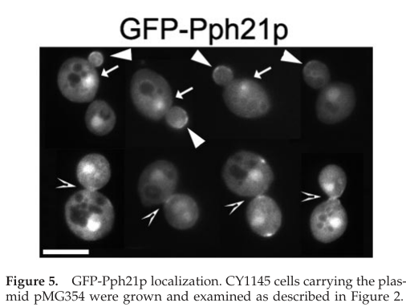

## Question

# Gene Research for Functional Annotation

## ⚠️ CRITICAL: Gene/Protein Identification Context

**BEFORE YOU BEGIN RESEARCH:** You MUST verify you are researching the CORRECT gene/protein. Gene symbols can be ambiguous, especially for less well-characterized genes from non-model organisms.

### Target Gene/Protein Identity (from UniProt):
- **UniProt Accession:** P23594
- **Protein Description:** RecName: Full=Serine/threonine-protein phosphatase PP2A-1 catalytic subunit; EC=3.1.3.16;
- **Gene Information:** Name=PPH21; OrderedLocusNames=YDL134C; ORFNames=D2180;
- **Organism (full):** Saccharomyces cerevisiae (strain ATCC 204508 / S288c) (Baker's yeast).
- **Protein Family:** Belongs to the PPP phosphatase family. PP-2A subfamily.
- **Key Domains:** Calcineurin-like_PHP. (IPR004843); Metallo-depent_PP-like. (IPR029052); PPA2-like. (IPR047129); Ser/Thr-sp_prot-phosphatase. (IPR006186); Metallophos (PF00149)

### MANDATORY VERIFICATION STEPS:

1. **Check if the gene symbol "PPH21" matches the protein description above**
2. **Verify the organism is correct:** Saccharomyces cerevisiae (strain ATCC 204508 / S288c) (Baker's yeast).
3. **Check if protein family/domains align with what you find in literature**
4. **If you find literature for a DIFFERENT gene with the same or similar symbol, STOP**

### If Gene Symbol is Ambiguous or You Cannot Find Relevant Literature:

**DO NOT PROCEED WITH RESEARCH ON A DIFFERENT GENE.** Instead:
- State clearly: "The gene symbol 'PPH21' is ambiguous or literature is limited for this specific protein"
- Explain what you found (e.g., "Found extensive literature on a different gene with the same symbol in a different organism")
- Describe the protein based ONLY on the UniProt information provided above
- Suggest that the protein function can be inferred from domain/family information

### Research Target:

Please provide a comprehensive research report on the gene **PPH21** (gene ID: PPH21, UniProt: P23594) in yeast.

The research report should be a detailed narrative explaining the function, biological processes, and localization of the gene product. Citations should be given for all claims.

You should prioritize authoritative reviews and primary scientific literature when conducting research. You can supplement
this with annotations you find in gene/protein databases, but these can be outdated or inaccurate.

We are specifically interested in the primary function of the gene - for enzymes, what reaction is catalyzed, and what is the substrate specificity? For transporters, what is the substrate? For structural proteins or adapters, what is the broader structural role? For signaling molecules, what is the role in the pathway.

We are interested in where in or outside the cell the gene product carries out its function.

We are also interested in the signaling or biochemical pathways in which the gene functions. We are less interested in broad pleiotropic effects, except where these elucidate the precise role.

Include evidence where possible. We are interested in both experimental evidence as well as inference from structure, evolution, or bioinformatic analysis. Precise studies should be prioritized over high-throughput, where available.

## Output

Question: You are an expert researcher providing comprehensive, well-cited information.

Provide detailed information focusing on:
1. Key concepts and definitions with current understanding
2. Recent developments and latest research (prioritize 2023-2024 sources)
3. Current applications and real-world implementations
4. Expert opinions and analysis from authoritative sources
5. Relevant statistics and data from recent studies

Format as a comprehensive research report with proper citations. Include URLs and publication dates where available.
Always prioritize recent, authoritative sources and provide specific citations for all major claims.

# Gene Research for Functional Annotation

## ⚠️ CRITICAL: Gene/Protein Identification Context

**BEFORE YOU BEGIN RESEARCH:** You MUST verify you are researching the CORRECT gene/protein. Gene symbols can be ambiguous, especially for less well-characterized genes from non-model organisms.

### Target Gene/Protein Identity (from UniProt):
- **UniProt Accession:** P23594
- **Protein Description:** RecName: Full=Serine/threonine-protein phosphatase PP2A-1 catalytic subunit; EC=3.1.3.16;
- **Gene Information:** Name=PPH21; OrderedLocusNames=YDL134C; ORFNames=D2180;
- **Organism (full):** Saccharomyces cerevisiae (strain ATCC 204508 / S288c) (Baker's yeast).
- **Protein Family:** Belongs to the PPP phosphatase family. PP-2A subfamily.
- **Key Domains:** Calcineurin-like_PHP. (IPR004843); Metallo-depent_PP-like. (IPR029052); PPA2-like. (IPR047129); Ser/Thr-sp_prot-phosphatase. (IPR006186); Metallophos (PF00149)

### MANDATORY VERIFICATION STEPS:

1. **Check if the gene symbol "PPH21" matches the protein description above**
2. **Verify the organism is correct:** Saccharomyces cerevisiae (strain ATCC 204508 / S288c) (Baker's yeast).
3. **Check if protein family/domains align with what you find in literature**
4. **If you find literature for a DIFFERENT gene with the same or similar symbol, STOP**

### If Gene Symbol is Ambiguous or You Cannot Find Relevant Literature:

**DO NOT PROCEED WITH RESEARCH ON A DIFFERENT GENE.** Instead:
- State clearly: "The gene symbol 'PPH21' is ambiguous or literature is limited for this specific protein"
- Explain what you found (e.g., "Found extensive literature on a different gene with the same symbol in a different organism")
- Describe the protein based ONLY on the UniProt information provided above
- Suggest that the protein function can be inferred from domain/family information

### Research Target:

Please provide a comprehensive research report on the gene **PPH21** (gene ID: PPH21, UniProt: P23594) in yeast.

The research report should be a detailed narrative explaining the function, biological processes, and localization of the gene product. Citations should be given for all claims.

You should prioritize authoritative reviews and primary scientific literature when conducting research. You can supplement
this with annotations you find in gene/protein databases, but these can be outdated or inaccurate.

We are specifically interested in the primary function of the gene - for enzymes, what reaction is catalyzed, and what is the substrate specificity? For transporters, what is the substrate? For structural proteins or adapters, what is the broader structural role? For signaling molecules, what is the role in the pathway.

We are interested in where in or outside the cell the gene product carries out its function.

We are also interested in the signaling or biochemical pathways in which the gene functions. We are less interested in broad pleiotropic effects, except where these elucidate the precise role.

Include evidence where possible. We are interested in both experimental evidence as well as inference from structure, evolution, or bioinformatic analysis. Precise studies should be prioritized over high-throughput, where available.

# Research report: *Saccharomyces cerevisiae* **PPH21** / Pph21

## Executive conclusion

The requested target is correctly identified. **PPH21** is the *S. cerevisiae* gene **YDL134C**, encoding the canonical serine/threonine-protein phosphatase 2A catalytic subunit Pph21 (**UniProt P23594; EC 3.1.3.16**). Literature consistently identifies Pph21—not a similarly named protein from another organism—as one of the two highly similar budding-yeast PP2A catalytic subunits, the other being Pph22. Its assignment to the PPP/PP2A family agrees with the supplied Calcineurin-like_PHP, metallophosphatase, PPA2-like, Ser/Thr phosphatase, and Metallophos annotations. No identity conflict was found. (zabrocki2002proteinphosphatase2a pages 1-3, jenkinson2022regulationofdna pages 24-28, scheinost2024peptideandrecombinant pages 29-32)

The most defensible primary annotation is: **Pph21 is a broadly distributed, metal-dependent phosphoserine/phosphothreonine phosphatase catalytic subunit whose physiological specificity and localization are conferred principally by assembly with Tpd3 and alternative regulatory proteins, especially Cdc55, Rts1, or Tap42.** It functions in nutrient-responsive signaling, glucose responses, cell-cycle progression, polarized growth, chromosome-related processes, and stress adaptation. Most pathway phenotypes, however, were measured after combined perturbation of **PPH21 and PPH22** or of a PP2A regulatory subunit; they should not be represented as uniquely Pph21-specific.

## Evidence map

The table below separates evidence specific to Pph21 from combined-paralog and holoenzyme-level findings.

| Aspect | Best-supported conclusion | Evidence scope | Key evidence/statistic | Important caveat |
|---|---|---|---|---|
| Identity and family | **PPH21/YDL134C** encodes Pph21, one of two bona fide *Saccharomyces cerevisiae* PP2A catalytic subunits. It belongs to the metal-dependent PPP serine/threonine-phosphatase family, consistent with UniProt **P23594** and the supplied metallophosphatase domains. (zabrocki2002proteinphosphatase2a pages 1-3, scheinost2024peptideandrecombinant pages 29-32) | Pph21-specific identity; family-level mechanism | Pph21 and Pph22 are the two yeast counterparts of human PP2A catalytic subunits PPP2CA/PPP2CB. (scheinost2024peptideandrecombinant pages 29-32) | The retrieved literature confirms PPH21 as a yeast PP2A catalytic subunit but does not independently map every supplied UniProt domain annotation. |
| Catalytic reaction and specificity | Pph21 hydrolytically removes phosphate from phosphoserine/phosphothreonine residues: phosphoprotein + H₂O → dephosphorylated protein + inorganic phosphate. PPP catalysis depends on divalent metals; physiological substrate selection is determined mainly by regulatory subunits rather than Pph21 alone. (scheinost2024peptideandrecombinant pages 29-32, david2021exploringtheregulation pages 16-20) | Family mechanism and PP2A-holoenzyme specificity | Cdc55 and Rts1 define distinct PP2A complexes and substrate repertoires. (jenkinson2022regulationofdna pages 24-28, scheinost2024peptideandrecombinant pages 29-32) | No Pph21-specific kinetic constants, physiological metal pair, or intrinsic sequence motif was established in the retrieved evidence. |
| Redundancy with Pph22 | Pph21 and Pph22 are highly similar, partially redundant paralogs. Either single deletion permits growth, whereas combined loss causes severe slow growth, G2 accumulation, and budding defects. (jenkinson2022regulationofdna pages 24-28, scheinost2024peptideandrecombinant pages 29-32, roopchand2005humanadenoviruse4orf4 pages 44-48) | Pph21-specific single deletion and combined Pph21/Pph22 evidence | The proteins are reported as **>90% identical**. Individual deletion reduced measured phosphatase activity by about **51% for PPH21** and **33% for PPH22**; additional loss of **PPH3** in the double mutant is inviable. (roopchand2005humanadenoviruse4orf4 pages 44-48) | Activity percentages derive from an older thesis excerpt and may depend on strain and assay; double-mutant phenotypes cannot be assigned uniquely to Pph21. |
| Complexes and regulation | Pph21 enters Tpd3-containing core complexes and heterotrimers with Cdc55 or Rts1; it can alternatively associate with Tap42. Tap42 and Tpd3 binding are mutually exclusive. Catalytic-subunit methylation and Rrd proteins regulate activation and assembly. (bras2016molecularinsightsinto pages 41-45, zabrocki2002proteinphosphatase2a pages 1-3, castermans2012glucoseinducedposttranslationalactivation pages 1-2) | Pph21-specific association plus holoenzyme-level regulation | In logarithmic growth, **<2% of Pph21** was Tap42-associated. Quantification found about **3.41 ± 0.53 Pph21 molecules per Tpd3 molecule**, implying that only a subset occupies Tpd3 holoenzymes at once. (zabrocki2002proteinphosphatase2a pages 1-3, gentry2002localizationofsaccharomyces pages 4-5) | Stoichiometric estimates used tagged proteins in early-log cultures; association does not identify the substrate of each complex. |
| Localization | Pph21 is broadly cytoplasmic and enriched in the nucleus throughout the mitotic cycle. GFP-Pph21 was also observed at small/medium-bud tips, a faint perinuclear or kinetochore-associated spot, and post-telophase bud necks. (roopchand2005humanadenoviruse4orf4 pages 44-48, gentry2002localizationofsaccharomyces pages 7-10, gentry2002localizationofsaccharomyces media a4a43e3b) | Pph21-specific imaging | HA-tag immunofluorescence showed cytoplasmic distribution and strong nuclear concentration; Figure 5 showed rarer bud-tip, perinuclear, and bud-neck signals. (gentry2002localizationofsaccharomyces pages 7-10, gentry2002localizationofsaccharomyces media a4a43e3b) | GFP–PPH21 did **not fully complement** the null allele, so rare focal localizations require caution; the broad nuclear/cytoplasmic pattern is better supported. |
| TOR and nutrient signaling | Pph21 participates in TOR-regulated phosphatase signaling through Tap42-associated and canonical PP2A complexes. TOR-dependent Tap42 phosphorylation promotes binding; rapamycin–Fpr1 inhibition causes Tap42 dephosphorylation and dissociation. (zabrocki2002proteinphosphatase2a pages 1-3, bras2016molecularinsightsinto pages 66-68) | Pph21-specific association; pathway mechanism mainly holoenzyme-level | **<2%** of Pph21 is Tap42-associated during logarithmic growth, indicating a regulated minority pool. Rrd2 was reported to be required for the Tap42–Pph21 complex. (zabrocki2002proteinphosphatase2a pages 1-3, bras2016molecularinsightsinto pages 66-68) | These findings do not establish a unique direct Pph21 substrate, and historical TOR–Tap42 models have been refined over time. |
| Glucose signaling | Glucose addition to glucose-deprived yeast rapidly activates PP2A post-translationally. Activation involves Cdc55, Rts1, Rrd1/Rrd2, and catalytic-subunit carboxymethylation; Pph21/Pph22 jointly oppose derepression of **SUC2**. (castermans2012glucoseinducedposttranslationalactivation pages 1-2) | Combined Pph21/Pph22 and PP2A-holoenzyme evidence | Carboxymethylation was **necessary but insufficient** for activation. Combined PPH21/PPH22 deletion enhanced SUC2 derepression, and Rts1 interacted with Pph21 under Reg1-dependent control. (castermans2012glucoseinducedposttranslationalactivation pages 1-2) | The study did not resolve a Pph21-only glucose-signaling role or establish pathway components as direct Pph21 substrates. |
| Cell cycle and morphogenesis | Pph21-containing PP2A supports G2/M progression, polarized growth, actin organization, chromosome functions, and cytokinetic spatial control, with work divided between PP2A–Cdc55 and PP2A–Rts1. (jenkinson2022regulationofdna pages 24-28, roopchand2005humanadenoviruse4orf4 pages 44-48, gentry2002localizationofsaccharomyces pages 6-7) | Mainly combined Pph21/Pph22 or holoenzyme-level; some Pph21-mutant evidence | The double mutant accumulates in G2 and has severe budding defects. Temperature-sensitive **pph21-102** cells show abnormal buds, disorganized actin, undivided nuclei, short spindles, and mitotic-entry failure. (jenkinson2022regulationofdna pages 24-28, roopchand2005humanadenoviruse4orf4 pages 44-48) | Regulatory-subunit localization and mutant phenotypes usually do not prove whether Pph21 or Pph22 supplies the catalytic subunit. |
| Recent 2023–2024 status | Recent literature continues to treat Pph21/Pph22 as canonical PP2A catalytic subunits in nutrient, autophagy, mitochondrial, and genome-control research, but the retrieved 2023–2024 evidence did not establish a new function unique to Pph21. (scheinost2024peptideandrecombinant pages 29-32, jenkinson2022regulationofdna pages 24-28) | Mostly PP2A-holoenzyme or combined Pph21/Pph22 context | Contemporary work emphasizes substrate-directing holoenzymes; catalytic-isoform-specific substrate assignment remains a central annotation gap. (scheinost2024peptideandrecombinant pages 29-32, david2021exploringtheregulation pages 16-20) | Results concerning Ppg1, non-*cerevisiae* fungal homologues, or mammalian PP2A cannot be transferred directly to *S. cerevisiae* Pph21. |

*Table: Compact evidence map for *S. cerevisiae* PPH21/Pph21 (UniProt P23594), separating Pph21-specific observations from combined paralog and PP2A-holoenzyme findings. Caveats highlight where redundancy or complex-level evidence limits gene-specific annotation.*

## 1. Identity, family, and molecular function

### 1.1 Identity verification

Multiple yeast studies designate **PPH21 and PPH22 as the two bona fide PP2A catalytic-subunit genes**. Pph21 and Pph22 are reported to be more than 90% identical and correspond functionally to the two mammalian PP2A catalytic-subunit paralogs. Thus, the supplied identity—PPH21/YDL134C/P23594 in *S. cerevisiae* S288c—is internally consistent with the literature and domain architecture. (zabrocki2002proteinphosphatase2a pages 1-3, scheinost2024peptideandrecombinant pages 29-32, roopchand2005humanadenoviruse4orf4 pages 44-48)

Some older literature loosely groups Pph3 with PP2A-family catalytic proteins. Functionally, however, Pph3 is the catalytic component of a distinct PP4 complex and should not be annotated as an interchangeable third canonical Pph21/Pph22 subunit. PPH21/PPH22 loss removes approximately 80–90% of the relevant PP2A activity in cited work, while Pph3-containing PP4 supplies residual, partly compensatory activity; simultaneous loss is inviable. (jenkinson2022regulationofdna pages 24-28)

### 1.2 Catalyzed reaction

As a PPP-family PP2A catalytic subunit, Pph21 catalyzes hydrolytic dephosphorylation:

**O-phospho-L-serine/O-phospho-L-threonine protein + H₂O → dephosphorylated protein + orthophosphate.**

The conserved PPP phosphatase fold uses divalent metal ions to activate water and stabilize the phosphoryl-transfer transition state. The retrieved Pph21 literature supports metal-dependent PPP catalysis but does not establish the exact physiological metal occupancy of native Pph21 under each cellular condition. Accordingly, it is safer to annotate Pph21 as a **divalent-metal-dependent protein Ser/Thr phosphatase** than to assign a specific in-vivo metal pair from analogy alone. (scheinost2024peptideandrecombinant pages 29-32)

### 1.3 Substrate specificity

Pph21 does **not** appear to possess a narrow, independently established linear-sequence specificity comparable to that of many protein kinases. Its effective specificity is generated by holoenzyme assembly, localization, docking interactions, phosphorylation state, and local substrate availability. The Tpd3 scaffold joins a catalytic subunit to alternative substrate-directing B subunits—principally **Cdc55** or **Rts1**—thereby producing PP2A-Cdc55 and PP2A-Rts1 complexes with different substrates and spatial distributions. (bras2016molecularinsightsinto pages 41-45, jenkinson2022regulationofdna pages 24-28, scheinost2024peptideandrecombinant pages 29-32)

Consequently, substrates reported for PP2A-Cdc55 or PP2A-Rts1 are substrates of a complex that *can contain* Pph21 or Pph22; they are not automatically proven direct substrates of Pph21 specifically. This distinction is the largest uncertainty in a gene-centric functional annotation.

## 2. Complex architecture and biochemical regulation

Pph21 participates in at least two major complex classes:

1. **Canonical PP2A:** Pph21 or Pph22 plus the A/scaffold subunit **Tpd3**, with **Cdc55** or **Rts1** as the variable regulatory B subunit.
2. **Tap42-associated phosphatase:** Pph21 can bind **Tap42** in a complex mutually exclusive with Tpd3 association, connecting it to TOR-regulated nutrient signaling. (bras2016molecularinsightsinto pages 41-45, zabrocki2002proteinphosphatase2a pages 1-3)

Quantitative analysis in early-log cultures estimated **3.41 ± 0.53 Pph21 molecules and 3.30 ± 0.57 Pph22 molecules per Tpd3 molecule**. Thus, catalytic subunits were present in substantial excess over Tpd3, and only a fraction could occupy canonical Tpd3-containing holoenzymes simultaneously. The same study estimated roughly 10–14-fold more Rts1 than Cdc55 in early-log cells, emphasizing that complex abundance is condition-dependent rather than fixed. (gentry2002localizationofsaccharomyces pages 4-5)

Only **<2% of Pph21** was reported to associate with Tap42 during logarithmic growth. This identifies Tap42-bound Pph21 as a regulated minority pool rather than the dominant cellular state. Tap42 and Tpd3 binding are mutually exclusive; TOR-dependent Tap42 phosphorylation favors phosphatase binding, whereas rapamycin–Fpr1 inhibition of TOR promotes Tap42 dephosphorylation and dissociation. Rrd2 has also been implicated in forming or maintaining the Tap42–Pph21 complex. (zabrocki2002proteinphosphatase2a pages 1-3, bras2016molecularinsightsinto pages 66-68)

Pph21 activity and assembly are further influenced by Rrd1/Rrd2 and reversible modification of the catalytic-subunit C terminus. Glucose-responsive carboxymethylation is necessary, but not by itself sufficient, for full PP2A activation; methylation also favors assembly with particular regulatory components such as Cdc55. (zabrocki2002proteinphosphatase2a pages 1-3, castermans2012glucoseinducedposttranslationalactivation pages 1-2)

## 3. Cellular localization

The strongest direct localization evidence comes from Gentry and Hallberg, published in **October 2002** (*Molecular Biology of the Cell* 13:3477–3492; DOI: [10.1091/mbc.02-05-0065](https://doi.org/10.1091/mbc.02-05-0065)). HA-tag immunofluorescence found Pph21 and Pph22 broadly distributed in the **cytoplasm** and strongly enriched in the **nucleus**. GFP-Pph21 reproduced this broad pattern and additionally showed rarer signal at small/medium-bud tips, a perinuclear spot consistent with the kinetochore/spindle-pole region, and post-telophase bud necks. (roopchand2005humanadenoviruse4orf4 pages 44-48, gentry2002localizationofsaccharomyces pages 7-10, gentry2002localizationofsaccharomyces media a4a43e3b)

The focal GFP-Pph21 observations require caution because the GFP–PPH21 construct did not fully complement the null phenotype. Therefore:

- **High confidence:** Pph21 is cytoplasmic and nuclear, with nuclear enrichment.
- **Moderate/low confidence:** Pph21 transiently concentrates at bud tips, bud necks, and perinuclear/kinetochore-associated structures.

Regulatory-subunit imaging provides stronger evidence that PP2A holoenzymes act at these specialized sites. Tpd3, Cdc55, and Rts1 localize dynamically to the nucleus, bud tip, bud neck, and chromosome-associated structures. Rts1 was detected at kinetochores by microscopy and chromatin immunoprecipitation; Cdc55 was also observed at vacuolar membranes. These distributions explain how an otherwise broad catalytic subunit can be recruited to spatially restricted substrates. For example, Cdc55 was nuclear in about **90%** of cells, localized to the bud neck in **53%** of post-telophase cells, and Rts1 localized to the bud neck in **45%** of post-telophase cells in the cited experiment. (gentry2002localizationofsaccharomyces pages 6-7, gentry2002localizationofsaccharomyces pages 7-10)

## 4. Biological pathways and experimentally supported functions

### 4.1 Cell-cycle progression and morphogenesis

The clearest phenotype of reduced canonical PP2A function is defective G2/M progression and polarized growth. Individual **pph21Δ** or **pph22Δ** strains remain viable, whereas combined loss produces severe slow growth, G2 accumulation, budding defects, and abnormal cell morphology. A temperature-sensitive **pph21-102** mutant exhibited abnormal buds, disorganized actin, undivided nuclei, short spindles, and failure to enter mitosis. (jenkinson2022regulationofdna pages 24-28, roopchand2005humanadenoviruse4orf4 pages 44-48)

At the holoenzyme level, PP2A-Cdc55 opposes the Swe1 pathway that inhibits Cdc28/CDK through Tyr19 phosphorylation, thereby promoting mitotic entry. PP2A-Cdc55 also controls mitotic-exit and cytokinetic events, whereas PP2A-Rts1 participates in kinetochore, spindle-position, and cell-size controls. These assignments explain the PPH21/PPH22 double-mutant phenotypes, but regulatory-subunit experiments generally cannot identify which catalytic paralog was present in each active complex. (jenkinson2022regulationofdna pages 24-28)

### 4.2 TOR and nutrient signaling

Pph21 participates in nutrient-responsive signaling through both canonical PP2A holoenzymes and Tap42-associated complexes. Historical yeast work established nutrient/TOR-dependent binding of Tap42 to type-2A phosphatases and rapamycin-sensitive dissociation. The 2002 review by Zabrocki and colleagues—published in **February 2002**, DOI [10.1046/j.1365-2958.2002.02786.x](https://doi.org/10.1046/j.1365-2958.2002.02786.x)—places Pph21/Pph22 at the intersection of TOR, growth, morphology, and nutrient signaling. (zabrocki2002proteinphosphatase2a pages 1-3, stanzel2012regulationofpp2a pages 168-168)

The small Tap42-bound fraction indicates that Pph21 should not be annotated solely as a “TOR phosphatase.” Rather, TOR regulates one pool within a larger network of Tpd3-, Cdc55-, and Rts1-associated PP2A complexes. Moreover, modern TOR research emphasizes that conclusions depend on the readout and holoenzyme context; pathway association does not identify a unique direct Pph21 substrate.

### 4.3 Glucose signaling and transcriptional repression

Castermans and colleagues, published online **31 January 2012** (*Cell Research* 22:1058–1077; DOI [10.1038/cr.2012.20](https://doi.org/10.1038/cr.2012.20)), showed rapid post-translational activation of PP2A after glucose was added to glucose-deprived cells. Activation depended on Cdc55, Rts1, Rrd1/Rrd2, and rapid catalytic-subunit carboxymethylation; it also involved cross-regulation with PP1 components Reg1 and Shp1. Rts1 interacted with Pph21 under Reg1-dependent conditions. Combined PPH21/PPH22 deletion enhanced derepression of **SUC2**, indicating that PP2A normally helps oppose SUC2 derepression. (castermans2012glucoseinducedposttranslationalactivation pages 1-2)

This is strong pathway-level evidence but not proof that Pph21 directly dephosphorylates Snf1, Mig1, or another particular glucose-response effector. The mechanistic annotation should therefore be “PP2A catalytic subunit participating in glucose-triggered phosphatase activation and glucose-repression control,” not a specific enzyme–substrate pair.

### 4.4 Cytoskeletal organization and polarized growth

Bud-tip and bud-neck localization of PP2A components, together with actin and morphology defects in PPH21/PPH22-deficient or pph21-102 cells, supports a local role in polarized growth, mitotic bud development, and cytokinesis. Tap42–PP2A signaling has also been linked to cell-cycle-dependent actin distribution. The direct substrates responsible for these phenotypes remain incompletely resolved. (roopchand2005humanadenoviruse4orf4 pages 44-48, gentry2002localizationofsaccharomyces pages 6-7, gentry2002localizationofsaccharomyces pages 7-10)

### 4.5 Genome maintenance and replication stress

Recent work continues to implicate PP2A-Cdc55 in checkpoint recovery and genome control. Combined PP2A perturbations affect an axis involving Swe1, CDK, Chk1, and the anaphase inhibitor Pds1 after replication stress. However, these findings are at the PP2A-Cdc55 or PPH21/PPH22-combined level; they do not demonstrate a catalytic function unique to Pph21. The same qualification applies to PP2A roles inferred from replication-initiation and DNA-damage studies. (jenkinson2022regulationofdna pages 24-28)

## 5. Redundancy and quantitative genetics

Pph21 and Pph22 are strongly but not necessarily perfectly redundant. Reported measurements found that deletion of **PPH21** or **PPH22** reduced phosphatase activity by approximately **51%** and **33%**, respectively, while either single mutant remained viable. Combined deletion caused very slow growth and shrunken or pear-shaped cells with cytoskeletal defects; additional deletion of **PPH3** was inviable. (roopchand2005humanadenoviruse4orf4 pages 44-48)

These observations support three conclusions:

1. Pph21 makes a quantitatively important contribution to total canonical PP2A activity.
2. Pph22 can compensate sufficiently for loss of Pph21 under standard growth conditions.
3. Severe double-mutant phenotypes define the shared Pph21/Pph22 function, not a Pph21-specific role.

Because the activity percentages come from older tagged-protein and genetic work, exact values may vary with strain, growth condition, extraction, and phosphatase assay. They should be treated as representative rather than universal constants.

## 6. Recent developments, 2023–2024

The 2023–2024 literature retrieved for this report reinforces three current themes rather than establishing a new Pph21-specific function:

- **Specificity resides at the holoenzyme level.** A 2024 phosphatase-methods synthesis again identifies Pph21/Pph22 as the yeast PP2A catalytic subunits and emphasizes Cdc55/Rts1-mediated substrate selection and the need for direct biochemical validation. (scheinost2024peptideandrecombinant pages 29-32)
- **PP2A-family enzymes remain central to nutrient, autophagy, mitochondrial, and genome-control research**, but many recent studies examine PP2A-Cdc55, PP2A-Rts1, or the distinct PP2A-like phosphatase Ppg1 rather than Pph21 alone. Ppg1/Far-complex results must not be transferred to Pph21.
- **Isoform-resolved substrate assignment remains a major gap.** The field increasingly combines phosphoproteomics, recombinant holoenzymes, substrate-trapping peptides, and acute perturbation, yet most yeast results still do not distinguish whether Pph21 or Pph22 occupies the active holoenzyme.

Thus, the latest evidence does not justify changing the core annotation. It strengthens the interpretation of Pph21 as a catalytic component whose function is determined by complex composition and cellular context.

## 7. Research and real-world applications

Pph21 is not an industrial enzyme with an established direct commercial application. Its applications are primarily as a **research model and experimental platform**:

- **Conserved PP2A biology:** Yeast allows genetic dissection of catalytic, scaffold, and regulatory subunits relevant to the conserved eukaryotic PP2A system.
- **Nutrient and TOR signaling:** Pph21/Tap42 and Pph21-containing holoenzymes provide tractable systems for studying rapamycin-sensitive growth control.
- **Cell-cycle and checkpoint research:** Conditional pph21 alleles and PPH21/PPH22 double perturbations reveal phosphatase requirements in mitotic entry, chromosome-related regulation, and replication-stress recovery.
- **Heterologous toxicity and pathogen-effector assays:** Yeast PP2A has been used to study adenoviral E4orf4 and bacterial effectors that target conserved PP2A machinery. These systems exploit yeast genetics to identify PP2A-dependent mechanisms, although they do not imply that the foreign proteins are physiological yeast substrates.
- **Phosphatase-method development:** Tagged Pph21 and defined regulatory-subunit complexes are useful for holoenzyme purification, localization, phosphoproteomic comparison, and substrate-validation assays.

## 8. Expert assessment and annotation confidence

### High-confidence annotation

- **Identity:** PPH21/YDL134C/P23594 in *S. cerevisiae*.
- **Function:** Catalytic subunit of PP2A; metal-dependent hydrolysis of phosphoserine/phosphothreonine in proteins.
- **Complexes:** Tpd3–Pph21 core complexes containing Cdc55 or Rts1; alternative regulated association with Tap42.
- **Localization:** Cytoplasm and nucleus, with nuclear enrichment.
- **Biological scope:** Nutrient/glucose signaling, cell-cycle progression, morphogenesis, and stress-responsive phosphoregulation.

### Moderate-confidence annotation

- Transient Pph21 action at bud tips, bud necks, and perinuclear/kinetochore-associated sites. The distribution is biologically consistent with regulatory-subunit localization, but the GFP-Pph21 reporter was not fully functional. (gentry2002localizationofsaccharomyces pages 7-10, gentry2002localizationofsaccharomyces media a4a43e3b)

### Low-confidence or unsupported as Pph21-specific

- Any unique peptide-recognition motif.
- A definitive list of direct Pph21-only physiological substrates.
- Assignment of every PP2A-Cdc55 or PP2A-Rts1 phenotype uniquely to Pph21 rather than Pph22.
- Transfer of Ppg1, non-*cerevisiae* fungal Pph21 homolog, or mammalian PP2A findings directly to yeast Pph21.

## Final functional annotation

**PPH21 encodes a conserved, broadly nuclear and cytoplasmic PP2A catalytic subunit that dephosphorylates serine- and threonine-phosphorylated proteins through a divalent-metal-dependent PPP-family mechanism. Pph21 forms alternative holoenzymes with Tpd3 and the substrate-directing subunits Cdc55 or Rts1, and a regulated minority pool associates with Tap42. These complexes control nutrient/TOR and glucose signaling, G2/M progression, chromosome and spindle-associated processes, polarized growth, actin organization, and cytokinesis. Pph21 is strongly redundant with Pph22; therefore, most established pathway functions describe shared Pph21/Pph22 or holoenzyme activity rather than uniquely Pph21-specific substrates.**

References

1. (zabrocki2002proteinphosphatase2a pages 1-3): Piotr Zabrocki, Christine Van Hoof, Jozef Goris, Johan M. Thevelein, Joris Winderickx, and Stefaan Wera. Protein phosphatase 2a on track for nutrient‐induced signalling in yeast. Molecular Microbiology, 43:835-842, Feb 2002. URL: https://doi.org/10.1046/j.1365-2958.2002.02786.x, doi:10.1046/j.1365-2958.2002.02786.x. This article has 79 citations and is from a domain leading peer-reviewed journal.

2. (jenkinson2022regulationofdna pages 24-28): Regulation of DNA replication by PP2A family phosphatases This article has 0 citations.

3. (scheinost2024peptideandrecombinant pages 29-32): LS Scheinost. Peptide and recombinant protein based approaches to study phosphatases. Unknown journal, 2024.

4. (david2021exploringtheregulation pages 16-20): Alain David. Exploring the regulation of mitotic pp2a-rts1 activity in saccharomyces cerevisiae. ArXiv, Jul 2021. URL: https://doi.org/10.20381/ruor-26657, doi:10.20381/ruor-26657. This article has 0 citations.

5. (roopchand2005humanadenoviruse4orf4 pages 44-48): DE Roopchand. Human adenovirus e4orf4 protein induces premature mitotic arrest by a pp2a-dependent mechanism leading to cell death in saccharomyces cerevisiae. Unknown journal, 2005.

6. (bras2016molecularinsightsinto pages 41-45): IFC Brás. Molecular insights into the role of alfa-synuclein phosphorylation in synucleinopathies. Unknown journal, 2016.

7. (castermans2012glucoseinducedposttranslationalactivation pages 1-2): Dries Castermans, Ils Somers, Johan Kriel, Wendy Louwet, Stefaan Wera, Matthias Versele, Veerle Janssens, and Johan M Thevelein. Glucose-induced posttranslational activation of protein phosphatases pp2a and pp1 in yeast. Cell Research, 22:1058-1077, Jan 2012. URL: https://doi.org/10.1038/cr.2012.20, doi:10.1038/cr.2012.20. This article has 115 citations and is from a domain leading peer-reviewed journal.

8. (gentry2002localizationofsaccharomyces pages 4-5): Matthew S. Gentry and Richard L. Hallberg. Localization of saccharomyces cerevisiae protein phosphatase 2a subunits throughout mitotic cell cycle. Molecular biology of the cell, 13 10:3477-92, Oct 2002. URL: https://doi.org/10.1091/mbc.02-05-0065, doi:10.1091/mbc.02-05-0065. This article has 110 citations and is from a domain leading peer-reviewed journal.

9. (gentry2002localizationofsaccharomyces pages 7-10): Matthew S. Gentry and Richard L. Hallberg. Localization of saccharomyces cerevisiae protein phosphatase 2a subunits throughout mitotic cell cycle. Molecular biology of the cell, 13 10:3477-92, Oct 2002. URL: https://doi.org/10.1091/mbc.02-05-0065, doi:10.1091/mbc.02-05-0065. This article has 110 citations and is from a domain leading peer-reviewed journal.

10. (gentry2002localizationofsaccharomyces media a4a43e3b): Matthew S. Gentry and Richard L. Hallberg. Localization of saccharomyces cerevisiae protein phosphatase 2a subunits throughout mitotic cell cycle. Molecular biology of the cell, 13 10:3477-92, Oct 2002. URL: https://doi.org/10.1091/mbc.02-05-0065, doi:10.1091/mbc.02-05-0065. This article has 110 citations and is from a domain leading peer-reviewed journal.

11. (bras2016molecularinsightsinto pages 66-68): IFC Brás. Molecular insights into the role of alfa-synuclein phosphorylation in synucleinopathies. Unknown journal, 2016.

12. (gentry2002localizationofsaccharomyces pages 6-7): Matthew S. Gentry and Richard L. Hallberg. Localization of saccharomyces cerevisiae protein phosphatase 2a subunits throughout mitotic cell cycle. Molecular biology of the cell, 13 10:3477-92, Oct 2002. URL: https://doi.org/10.1091/mbc.02-05-0065, doi:10.1091/mbc.02-05-0065. This article has 110 citations and is from a domain leading peer-reviewed journal.

13. (stanzel2012regulationofpp2a pages 168-168): C Stanzel. Regulation of pp2a biogenesis in yeast. Unknown journal, 2012.

## Artifacts

- [Edison artifact artifact-00](PPH21-deep-research-falcon_artifacts/artifact-00.md)

## Citations

1. scheinost2024peptideandrecombinant pages 29-32
2. castermans2012glucoseinducedposttranslationalactivation pages 1-2
3. jenkinson2022regulationofdna pages 24-28
4. gentry2002localizationofsaccharomyces pages 4-5
5. david2021exploringtheregulation pages 16-20
6. bras2016molecularinsightsinto pages 41-45
7. gentry2002localizationofsaccharomyces pages 7-10
8. bras2016molecularinsightsinto pages 66-68
9. gentry2002localizationofsaccharomyces pages 6-7
10. 10.1091/mbc.02-05-0065
11. 10.1046/j.1365-2958.2002.02786.x
12. 10.1038/cr.2012.20
13. https://doi.org/10.1091/mbc.02-05-0065
14. https://doi.org/10.1046/j.1365-2958.2002.02786.x
15. https://doi.org/10.1038/cr.2012.20
16. https://doi.org/10.1046/j.1365-2958.2002.02786.x,
17. https://doi.org/10.20381/ruor-26657,
18. https://doi.org/10.1038/cr.2012.20,
19. https://doi.org/10.1091/mbc.02-05-0065,