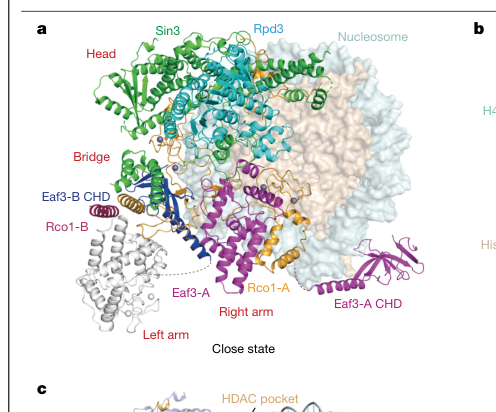

## Question

# Gene Research for Functional Annotation

## ⚠️ CRITICAL: Gene/Protein Identification Context

**BEFORE YOU BEGIN RESEARCH:** You MUST verify you are researching the CORRECT gene/protein. Gene symbols can be ambiguous, especially for less well-characterized genes from non-model organisms.

### Target Gene/Protein Identity (from UniProt):
- **UniProt Accession:** Q04779
- **Protein Description:** RecName: Full=Transcriptional regulatory protein RCO1;
- **Gene Information:** Name=RCO1; OrderedLocusNames=YMR075W; ORFNames=YM9916.14;
- **Organism (full):** Saccharomyces cerevisiae (strain ATCC 204508 / S288c) (Baker's yeast).
- **Protein Family:** Not specified in UniProt
- **Key Domains:** Chromatin_regulatory_protein. (IPR052819); Zinc_finger_PHD-type_CS. (IPR019786); Znf_FYVE_PHD. (IPR011011); Znf_PHD. (IPR001965); Znf_PHD-finger. (IPR019787)

### MANDATORY VERIFICATION STEPS:

1. **Check if the gene symbol "RCO1" matches the protein description above**
2. **Verify the organism is correct:** Saccharomyces cerevisiae (strain ATCC 204508 / S288c) (Baker's yeast).
3. **Check if protein family/domains align with what you find in literature**
4. **If you find literature for a DIFFERENT gene with the same or similar symbol, STOP**

### If Gene Symbol is Ambiguous or You Cannot Find Relevant Literature:

**DO NOT PROCEED WITH RESEARCH ON A DIFFERENT GENE.** Instead:
- State clearly: "The gene symbol 'RCO1' is ambiguous or literature is limited for this specific protein"
- Explain what you found (e.g., "Found extensive literature on a different gene with the same symbol in a different organism")
- Describe the protein based ONLY on the UniProt information provided above
- Suggest that the protein function can be inferred from domain/family information

### Research Target:

Please provide a comprehensive research report on the gene **RCO1** (gene ID: RCO1, UniProt: Q04779) in yeast.

The research report should be a detailed narrative explaining the function, biological processes, and localization of the gene product. Citations should be given for all claims.

You should prioritize authoritative reviews and primary scientific literature when conducting research. You can supplement
this with annotations you find in gene/protein databases, but these can be outdated or inaccurate.

We are specifically interested in the primary function of the gene - for enzymes, what reaction is catalyzed, and what is the substrate specificity? For transporters, what is the substrate? For structural proteins or adapters, what is the broader structural role? For signaling molecules, what is the role in the pathway.

We are interested in where in or outside the cell the gene product carries out its function.

We are also interested in the signaling or biochemical pathways in which the gene functions. We are less interested in broad pleiotropic effects, except where these elucidate the precise role.

Include evidence where possible. We are interested in both experimental evidence as well as inference from structure, evolution, or bioinformatic analysis. Precise studies should be prioritized over high-throughput, where available.

## Output

Question: You are an expert researcher providing comprehensive, well-cited information.

Provide detailed information focusing on:
1. Key concepts and definitions with current understanding
2. Recent developments and latest research (prioritize 2023-2024 sources)
3. Current applications and real-world implementations
4. Expert opinions and analysis from authoritative sources
5. Relevant statistics and data from recent studies

Format as a comprehensive research report with proper citations. Include URLs and publication dates where available.
Always prioritize recent, authoritative sources and provide specific citations for all major claims.

# Gene Research for Functional Annotation

## ⚠️ CRITICAL: Gene/Protein Identification Context

**BEFORE YOU BEGIN RESEARCH:** You MUST verify you are researching the CORRECT gene/protein. Gene symbols can be ambiguous, especially for less well-characterized genes from non-model organisms.

### Target Gene/Protein Identity (from UniProt):
- **UniProt Accession:** Q04779
- **Protein Description:** RecName: Full=Transcriptional regulatory protein RCO1;
- **Gene Information:** Name=RCO1; OrderedLocusNames=YMR075W; ORFNames=YM9916.14;
- **Organism (full):** Saccharomyces cerevisiae (strain ATCC 204508 / S288c) (Baker's yeast).
- **Protein Family:** Not specified in UniProt
- **Key Domains:** Chromatin_regulatory_protein. (IPR052819); Zinc_finger_PHD-type_CS. (IPR019786); Znf_FYVE_PHD. (IPR011011); Znf_PHD. (IPR001965); Znf_PHD-finger. (IPR019787)

### MANDATORY VERIFICATION STEPS:

1. **Check if the gene symbol "RCO1" matches the protein description above**
2. **Verify the organism is correct:** Saccharomyces cerevisiae (strain ATCC 204508 / S288c) (Baker's yeast).
3. **Check if protein family/domains align with what you find in literature**
4. **If you find literature for a DIFFERENT gene with the same or similar symbol, STOP**

### If Gene Symbol is Ambiguous or You Cannot Find Relevant Literature:

**DO NOT PROCEED WITH RESEARCH ON A DIFFERENT GENE.** Instead:
- State clearly: "The gene symbol 'RCO1' is ambiguous or literature is limited for this specific protein"
- Explain what you found (e.g., "Found extensive literature on a different gene with the same symbol in a different organism")
- Describe the protein based ONLY on the UniProt information provided above
- Suggest that the protein function can be inferred from domain/family information

### Research Target:

Please provide a comprehensive research report on the gene **RCO1** (gene ID: RCO1, UniProt: Q04779) in yeast.

The research report should be a detailed narrative explaining the function, biological processes, and localization of the gene product. Citations should be given for all claims.

You should prioritize authoritative reviews and primary scientific literature when conducting research. You can supplement
this with annotations you find in gene/protein databases, but these can be outdated or inaccurate.

We are specifically interested in the primary function of the gene - for enzymes, what reaction is catalyzed, and what is the substrate specificity? For transporters, what is the substrate? For structural proteins or adapters, what is the broader structural role? For signaling molecules, what is the role in the pathway.

We are interested in where in or outside the cell the gene product carries out its function.

We are also interested in the signaling or biochemical pathways in which the gene functions. We are less interested in broad pleiotropic effects, except where these elucidate the precise role.

Include evidence where possible. We are interested in both experimental evidence as well as inference from structure, evolution, or bioinformatic analysis. Precise studies should be prioritized over high-throughput, where available.

# Functional annotation research report: **RCO1 (UniProt Q04779; YMR075W) in *Saccharomyces cerevisiae* (S288c)**

## 0. Identity verification (critical)
Primary literature explicitly identifies *S. cerevisiae* **Rco1** as **UniProt Q04779** and as a PHD-domain protein that is a **unique, defining subunit of the Rpd3S histone deacetylase complex** (distinct from the promoter-focused Rpd3L complex). (ruan2016homodimericphddomaincontaining pages 3-4, drouin2010dsifandrna pages 1-2, li2023structureofhistone pages 1-3)

## 1. Key concepts, definitions, and current understanding

### 1.1 What RCO1 encodes (and what it does not)
**RCO1 encodes Rco1, a non-catalytic chromatin regulatory protein**. It is not itself a histone deacetylase; rather, it is a **reader/targeting and regulatory subunit** required for proper activity and chromatin engagement of the **Rpd3S (Rpd3 small) HDAC complex**. (li2023structureofhistone pages 1-3, mcdaniel2016combinatorialhistonereadout pages 2-4)

### 1.2 Rpd3S pathway context (Set2–H3K36 methylation and transcription elongation)
Rpd3S is a histone deacetylase complex that operates **co-transcriptionally across coding regions (ORFs/gene bodies)** to remove histone acetylation “in the wake” of RNA polymerase II (Pol II), thereby **suppressing cryptic (spurious intragenic) transcription initiation**. Rco1 is one of the Rpd3S-specific subunits underlying this gene-body surveillance function. (drouin2010dsifandrna pages 1-2, govind2010phosphorylatedpolii pages 1-2)

A central targeting axis for Rpd3S is the **Set2 → H3K36 methylation** pathway: Set2 deposits H3K36 methylation during elongation, which is read by **Eaf3**, while Rco1 contributes complementary histone-tail engagement and intra-complex regulation. (govind2010phosphorylatedpolii pages 1-2, lee2018combinatorialgeneticcontrol pages 1-2)

### 1.3 Reader domains in Rco1: PHD fingers and combinatorial histone readout
Rco1 contains **two plant homeodomain (PHD) zinc-finger modules (PHD1 and PHD2)**. Biochemical evidence indicates that both PHD1 and PHD2 bind the **extreme N-terminus of histone H3 (H3 1–20)** and that **H3K4 trimethylation reduces binding**—a mechanism that helps restrict Rpd3S away from promoter nucleosomes enriched in H3K4me3. (mcdaniel2016combinatorialhistonereadout pages 2-4)

More recent structural interpretations emphasize **combinatorial readout**: Rco1 preferentially reads **unmodified H3K4** while Eaf3 reads **H3K36me3**, together directing productive nucleosome engagement and affecting which histone tails/lysines are positioned for deacetylation. (guan2023diversemodesof pages 1-2, zhang2023structuralbasisfor pages 1-2)

### 1.4 Core molecular interactions and complex membership
Rpd3S is classically described as a five-subunit complex (Rpd3, Sin3, Ume1, Eaf3, Rco1). Mechanistic work shows Rco1 is a critical interaction hub: Rco1 forms key contacts with Eaf3 (via a Sin3 interaction domain/SID interacting with Eaf3’s MRG domain) and is required for full Rpd3S nucleosome engagement and cryptic transcription suppression. (ruan2015nucleosomecontacttriggers pages 3-5, ruan2016homodimericphddomaincontaining pages 1-2)

## 2. Biological function, processes, and localization

### 2.1 Primary biological role: suppressing cryptic intragenic transcription
Rpd3S functions across transcribed ORFs to deacetylate histones after Pol II passage and thereby **prevents cryptic transcription initiation within genes**. Rco1 is an essential Rpd3S subunit for this process; perturbing Rco1 regions needed for nucleosome engagement causes cryptic transcription phenotypes even when overall complex integrity is maintained. (drouin2010dsifandrna pages 1-2, ruan2016homodimericphddomaincontaining pages 6-8)

### 2.2 Chromatin and nuclear localization
Functional fractionation and chromatin association assays show **wild-type Rco1 is predominantly chromatin-associated**, consistent with its role in Rpd3S recruitment/engagement at gene bodies. Genome-scale localization approaches place Rpd3S/Rco1 primarily within coding regions at active genes. (mcdaniel2016combinatorialhistonereadout pages 2-4, drouin2010dsifandrna pages 1-2)

### 2.3 Recruitment mechanisms: integration of histone marks and transcription machinery
Although histone mark readout is central (Eaf3–H3K36me and Rco1–H3 N-terminus/H3K4me0), recruitment is also coordinated by Pol II-associated factors. ChIP–Chip evidence indicates Rpd3S binds active ORFs but is not recruited to every active gene; importantly, recruitment can be **Set2-independent** in some contexts, whereas complexes recruited without H3K36 methylation can be **inactive**, suggesting methylation contributes to activation and/or productive substrate engagement. (drouin2010dsifandrna pages 1-2)

Recruitment and/or stabilization of Rpd3S at transcribed loci is additionally linked to **Pol II CTD phosphorylation (Kin28, Ctk1)** and **DSIF (Spt4/5)**. (drouin2010dsifandrna pages 1-2, govind2010phosphorylatedpolii pages 1-2)

## 3. Recent developments (prioritizing 2023–2024)

### 3.1 2023: Structural resolution of Rpd3S–nucleosome engagement and Rco1’s placement
A set of 2023 cryo-EM studies transformed understanding of Rpd3S targeting and catalysis by resolving how the holoenzyme binds nucleosomes.

* **Stoichiometry and architecture.** Multiple structures indicate Rpd3S contains **two Eaf3–Rco1 modules** arranged around Rpd3/Sin3, with **two copies of Rco1 and two copies of Eaf3**. This duplicated module architecture supports multivalent nucleosome engagement and helps explain preference for dinucleosomal substrates. (li2023structureofhistone pages 1-3, markert2023structureofthea pages 1-3)

* **Mechanistic nucleosome contacts.** Cryo-EM structures show multivalent engagement of **histone tails, nucleosomal DNA, and linker DNA**. Rco1 is positioned to contribute to nucleosome binding and to help route/position the H3 N-terminal tail for catalysis. (zhang2023structuralbasisfor pages 1-2, li2023structureofhistone pages 1-3)

* **Context-dependent catalytic modes.** Structural/biochemical work indicates H3K36me3-guided docking can orient Rpd3S toward **H4-tail deacetylation** in one mode, while a combinatorial readout involving Rco1 (unmodified H3K4) and Eaf3 (H3K36me3) can direct **H3-tail deacetylation** with site selectivity (e.g., sparing “registered” H3K9ac in a particular mode). (guan2023diversemodesof pages 1-2)

### 3.2 2024: Expert commentary and emerging mechanistic extensions (Rco1 IDRs and traveling with Pol II)
A 2024 expert commentary synthesizing 2023 structures highlights Rco1 as a **specificity determinant**: its PHD engagement of **unmodified H3K4** and DNA contacts contribute to gene-body targeting and help rationalize how Rpd3S distinguishes promoter versus coding-region chromatin. (carrozza2024rpd3smeetsthe pages 1-2)

A 2024 preprint extends recruitment/allostery models by proposing an important role for an **Rco1 N-terminal intrinsically disordered region (IDR)** in Pol II association: mutations in a basic K/R cluster reduce association with the Pol II CTD without disrupting nucleosome recognition, and a minimal CTD-binding module involving Rco1-PHD1 and Eaf3-CHD is described. (li2024intrinsicallydisorderedregions pages 1-4)

## 4. Mechanistic model for Rco1 function (integrated synthesis)

### 4.1 Multivalent chromatin reading and allosteric cooperation with Eaf3
Rco1’s PHD domains contribute to nucleosome engagement by binding the H3 N-terminus; meanwhile, Rco1’s SID/interaction region binds Eaf3’s MRG domain and can allosterically enhance Eaf3 chromodomain engagement with H3K36-methylated peptides, supporting a cooperative model where “reader” domains are weak alone but strengthened in the assembled complex. (ruan2015nucleosomecontacttriggers pages 3-5, ruan2016homodimericphddomaincontaining pages 1-2)

### 4.2 Exclusion from promoters via H3K4 methylation sensitivity
H3K4me3 reduces binding of both Rco1 PHD domains to the H3 N-terminus, providing a plausible molecular basis for preferential Rpd3S action in gene bodies rather than H3K4me3-rich promoters. (mcdaniel2016combinatorialhistonereadout pages 2-4, lee2018combinatorialgeneticcontrol pages 1-2)

### 4.3 Structural routing of H3 tail and substrate selection
High-resolution structures show that engagement of unmodified H3K4 (via Rco1) can immobilize portions of the H3 tail and influence which lysines can access the catalytic pocket, yielding structural rationales for lysine-specific deacetylation patterns. (zhang2023structuralbasisfor pages 1-2)

## 5. Applications and real-world implementations

### 5.1 Yeast as an implementation platform for epigenetic mechanism discovery
Rco1/Rpd3S has become a model system for understanding **histone mark-guided HDAC targeting**, including multivalent recognition, reader-domain allostery, and elongation-coupled chromatin restoration. Modern cryo-EM reconstructions of Rpd3S–nucleosome complexes (2023) provide atomic frameworks that are now used to interpret conserved SIN3/HDAC complex behavior in other eukaryotes. (li2023structureofhistone pages 1-3, zhang2023structuralbasisfor pages 1-2)

### 5.2 Tooling and experimental implementations
* **Structure-guided mutagenesis.** 2023 structures map Rco1 regions that contact H3 tail/DNA and define residues/segments for functional perturbation; these are used to test cryptic transcription suppression and chromatin binding. (zhang2023structuralbasisfor pages 1-2, dong2023structuralbasisof pages 7-8)
* **Mechanistic coupling to Pol II.** Recruitment models incorporating CTD phosphorylation and DSIF have practical implications for designing experiments that decouple “recruitment” from “activation” of HDAC function at transcribed chromatin. (drouin2010dsifandrna pages 1-2, govind2010phosphorylatedpolii pages 1-2)

## 6. Expert opinion and authoritative analysis
The 2024 commentary emphasizes that Rpd3S achieves specificity through **multivalent contacts** (Rco1, Eaf3, Sin3) and that multiple structural “states” imply conformational plasticity relevant to substrate selection and chromatin context, with Rco1 contributing to gene-body targeting via PHD readout of H3K4me0 and DNA contacts. (carrozza2024rpd3smeetsthe pages 1-2)

## 7. Statistics and quantitative data highlights

* **Complex size:** Rpd3S is reported as **~410 kDa** and contains **two copies of Rco1**, both required for full function. (ruan2016homodimericphddomaincontaining pages 2-3)
* **Cryo-EM resolutions (recent):** 2.8 Å for the complete Rpd3S–nucleosome complex (Nature Communications, Dec 2023). (markert2023structureofthea pages 1-3)
* **Cryo-EM resolutions (additional 2023 structures):** 3.1 Å (overall) / 3.0 Å (focused) for Rpd3S–mono-nucleosome; 10.5 Å for a flexible di-nucleosome reconstruction (Nature Structural & Molecular Biology, Oct 2023). (li2023structureofhistone pages 1-3)
* **Linker DNA preference:** Rpd3S binding shows sensitivity to linker length with a **modest preference for ~30–40 bp linkers**, and preference for di-nucleosome over mono-nucleosome in vitro. (li2023structureofhistone pages 1-3)
* **Histone-tail affinity:** Rco1 PHD1 binds unmodified **H3(1–10)** with **Kd ~39 µM** (ITC); PHD2 showed no detectable H3(1–10) reader activity in that assay context (Research Square preprint, May 2023). (li2023dynamicandmultivalent pages 7-10)
* **Lysine preference (commentary summary):** Rpd3S deacetylates **H3K23 and H3K14 more efficiently** than **H3K9, H3K18, and H3K27**, indicating lysine-level selectivity likely shaped by structural positioning and engagement mode (Cell Research commentary, Nov 2024). (carrozza2024rpd3smeetsthe pages 2-2)

## 8. Visual evidence (key structural panels)
The following figure panels (cropped) visually support the statements about (i) overall Rpd3S–nucleosome architecture and (ii) Rco1 PHD engagement of the H3 N-terminus: (guan2023diversemodesof media a0d7f516, guan2023diversemodesof media 8facf5db, guan2023diversemodesof media 8448b558).

## 9. Evidence gaps and limitations (what was not fully retrievable here)
Some potentially important quantitative elements—particularly **global genome-wide recruitment percentages**, **many binding constants for full Rpd3S–nucleosome/CTD interactions**, and **numerical cryptic transcription effect sizes**—were not available in the accessible excerpts used for this report. Where possible, mechanistic conclusions were supported by structural resolutions, explicitly reported Kd values (for PHD1–H3), and qualitative but experimentally grounded phenotypes. (drouin2010dsifandrna pages 1-2, li2023dynamicandmultivalent pages 7-10)

---

## Summary table
| Category | Evidence-backed details | Key citations (with year) | URL |
|---|---|---|---|
| Verified identity | **RCO1/YMR075W/UniProt Q04779** in *Saccharomyces cerevisiae* is the **Rco1** subunit of the **Rpd3S histone deacetylase complex**; primary literature describes it as a **PHD zinc-finger/plant homeodomain-containing** chromatin regulator, not an enzyme on its own. | Li 2023 (li2023structureofhistone pages 1-3); Ruan 2016 (ruan2016homodimericphddomaincontaining pages 3-4, ruan2016homodimericphddomaincontaining pages 2-3) | https://doi.org/10.1038/s41594-023-01121-5; https://doi.org/10.1074/jbc.m115.703637 |
| Molecular function within Rpd3S | Rco1 helps target and activate **Rpd3S** on transcribed chromatin so the complex can **deacetylate histones in coding regions after Pol II passage**, maintaining hypoacetylated gene bodies and **suppressing cryptic intragenic transcription**. It acts together with Eaf3, Sin3, Rpd3, and Ume1. | Drouin 2010 (drouin2010dsifandrna pages 1-2); Govind 2010 (govind2010phosphorylatedpolii pages 1-2); Li 2023 (li2023structureofhistone pages 1-3) | https://doi.org/10.1371/journal.pgen.1001173; https://doi.org/10.1016/j.molcel.2010.07.003; https://doi.org/10.1038/s41594-023-01121-5 |
| Domains / reader activities | Rco1 contains **two PHD fingers (PHD1, PHD2)**. These domains bind the **extreme H3 N-terminus (H3 1–20)** and preferentially read **unmodified H3K4 (H3K4me0)**; **H3K4me3 reduces binding**, helping exclude Rpd3S from promoter chromatin. Rco1 also contains a **SID/MRG-interacting region** that connects functionally to Eaf3. | McDaniel 2016 (mcdaniel2016combinatorialhistonereadout pages 2-4, mcdaniel2016combinatorialhistonereadout pages 4-6); Guan 2023 (guan2023diversemodesof pages 1-2); Zhang 2023 (zhang2023structuralbasisfor pages 1-2) | https://doi.org/10.1074/jbc.m116.720193; https://doi.org/10.1038/s41586-023-06349-1; https://doi.org/10.1038/s41422-023-00884-2 |
| Binding partners / complex architecture | Core partners are **Rpd3, Sin3, Ume1, and Eaf3**. Structural studies show **two copies of Rco1 and two copies of Eaf3** organized around catalytic Rpd3; Rco1 forms **Eaf3–Rco1 heterodimers** and can homodimerize, making it a major interaction hub in Rpd3S. | Markert 2023 (markert2023structureofthea pages 1-3); Li 2023 (li2023structureofhistone pages 1-3); Ruan 2016 (ruan2016homodimericphddomaincontaining pages 3-4, ruan2016homodimericphddomaincontaining pages 1-2) | https://doi.org/10.1038/s41467-023-43968-8; https://doi.org/10.1038/s41594-023-01121-5; https://doi.org/10.1074/jbc.m115.703637 |
| Recruitment determinants | Recruitment/function is coupled to **Set2-dependent H3K36 methylation** via **Eaf3 chromodomain** recognition, while Rco1 contributes **H3 tail readout** and nucleosome engagement. Rpd3S recruitment to active ORFs is also coordinated by **RNAPII CTD phosphorylation (especially Ser5P, with S2P contribution)** and **DSIF/Spt4-Spt5**. Recent work further suggests an **Rco1 IDR** contributes to **Pol II CTD association**. | Drouin 2010 (drouin2010dsifandrna pages 1-2); Govind 2010 (govind2010phosphorylatedpolii pages 1-2); Li 2024 preprint (li2024intrinsicallydisorderedregions pages 1-4) | https://doi.org/10.1371/journal.pgen.1001173; https://doi.org/10.1016/j.molcel.2010.07.003; https://doi.org/10.21203/rs.3.rs-4000909/v1 |
| Cellular localization | Rco1 is predominantly **chromatin-associated** and localizes to **active ORFs / gene bodies** rather than promoters, consistent with Rpd3S function in transcribed coding regions. Fractionation studies place wild-type Rco1 mainly in the **chromatin fraction**. | Drouin 2010 (drouin2010dsifandrna pages 1-2); McDaniel 2016 (mcdaniel2016combinatorialhistonereadout pages 2-4); McDaniel thesis 2016 (stephen2016expandingthefunction pages 86-91) | https://doi.org/10.1371/journal.pgen.1001173; https://doi.org/10.1074/jbc.m116.720193; https://doi.org/10.17615/shj3-8048 |
| Mechanistic insight from 2023–2024 studies | 2023 cryo-EM studies show **multivalent nucleosome engagement**: Rco1, Eaf3, and Sin3 contact **H3K36me3-marked nucleosomes, nucleosomal DNA, and linker DNA**. Rco1 PHD1 helps place the H3 tail toward the catalytic center, while alternate engagement modes explain context-dependent H3/H4 deacetylation. A 2024 commentary interprets Rco1 as a **specificity determinant** for gene-body chromatin and lysine selection. | Guan 2023 (guan2023diversemodesof pages 1-2, guan2023diversemodesof media a0d7f516); Li 2023 (li2023structureofhistone pages 1-3); Carrozza & Workman 2024 (carrozza2024rpd3smeetsthe pages 1-2) | https://doi.org/10.1038/s41586-023-06349-1; https://doi.org/10.1038/s41594-023-01121-5; https://doi.org/10.1038/s41422-023-00899-9 |
| Phenotypes / functional readouts | **rco1Δ** or **PHD-disrupting mutants** impair nucleosome/chromatin binding and cause **cryptic transcription** phenotypes in reporter assays; truncations or mutations in key Rco1 regions compromise Rpd3S function even when complex assembly is retained. Genetic studies also show Rco1-mediated Rpd3S is antagonized by **H3K4 methylation** and promoted by **H3K36 methylation**. | Ruan 2016 (ruan2016homodimericphddomaincontaining pages 6-8); McDaniel 2016 (mcdaniel2016combinatorialhistonereadout pages 2-4, stephen2016expandingthefunction pages 86-91); Lee 2018 (lee2018combinatorialgeneticcontrol pages 1-2) | https://doi.org/10.1074/jbc.m115.703637; https://doi.org/10.1074/jbc.m116.720193; https://doi.org/10.1534/g3.118.200589 |
| Key quantitative metrics | Reported values include **~410 kDa** for Rpd3S, **2× Rco1 + 2× Eaf3** stoichiometry in 2023 structures, and cryo-EM resolutions of **2.8 Å** (Markert 2023), **3.1/3.0 Å** with **10.5 Å** di-nucleosome map (Li 2023), and **3.5 Å** (Dong 2023). Rpd3S shows a **modest preference for 30–40 bp linker DNA** and di-nucleosomes. One measured affinity from structural/biochemical work: **Rco1 PHD1 binds H3(1–10) with Kd ~39 µM**; PHD2 showed no detectable H3(1–10) reader activity in that assay. | Markert 2023 (markert2023structureofthea pages 1-3); Li 2023 (li2023structureofhistone pages 1-3); Dong 2023 (dong2023structuralbasisof pages 1-2); Ruan 2016 (ruan2016homodimericphddomaincontaining pages 2-3); Li/Guan preprint 2023 (li2023dynamicandmultivalent pages 7-10) | https://doi.org/10.1038/s41467-023-43968-8; https://doi.org/10.1038/s41594-023-01121-5; https://doi.org/10.1038/s41422-023-00869-1; https://doi.org/10.1074/jbc.m115.703637; https://doi.org/10.21203/rs.3.rs-2060494/v1 |
| Enzymatic/substrate specificity context | Rco1 is **not the catalytic HDAC**; it is a **reader/targeting and regulatory subunit**. Recent structural commentary notes Rpd3S deacetylates **H3K23 and H3K14 more efficiently than H3K9, H3K18, and H3K27**, and some structures place **H3K18** or H3/H4 tails near the active site depending on nucleosome engagement mode. | Carrozza & Workman 2024 (carrozza2024rpd3smeetsthe pages 2-2); Guan 2023 (guan2023diversemodesof pages 1-2, guan2023diversemodesof pages 5-6) | https://doi.org/10.1038/s41422-023-00899-9; https://doi.org/10.1038/s41586-023-06349-1 |

*Table: This table compiles evidence-backed functional annotation for Saccharomyces cerevisiae RCO1/Q04779, emphasizing its role as the PHD-containing targeting subunit of the Rpd3S histone deacetylase complex. It combines recent 2023-2024 structural advances with foundational mechanistic studies and includes URLs for rapid source checking.*

**Most recent/high-priority references used (publication date; URL):**
* Guan et al., Nature (Jul 2023): https://doi.org/10.1038/s41586-023-06349-1 (guan2023diversemodesof pages 1-2)
* Li et al., Nat Struct Mol Biol (Oct 2023): https://doi.org/10.1038/s41594-023-01121-5 (li2023structureofhistone pages 1-3)
* Dong et al., Cell Research (Sep 2023): https://doi.org/10.1038/s41422-023-00869-1 (dong2023structuralbasisof pages 1-2)
* Zhang et al., Cell Research (Oct 2023): https://doi.org/10.1038/s41422-023-00884-2 (zhang2023structuralbasisfor pages 1-2)
* Markert et al., Nat Communications (Dec 2023): https://doi.org/10.1038/s41467-023-43968-8 (markert2023structureofthea pages 1-3)
* Carrozza & Workman, Cell Research (Nov 2024 commentary): https://doi.org/10.1038/s41422-023-00899-9 (carrozza2024rpd3smeetsthe pages 1-2)

References

1. (ruan2016homodimericphddomaincontaining pages 3-4): Chun Ruan, Haochen Cui, Chul-Hwan Lee, Sheng Li, and Bing Li. Homodimeric phd domain-containing rco1 subunit constitutes a critical interaction hub within the rpd3s histone deacetylase complex. Journal of Biological Chemistry, 291:5428-5438, Mar 2016. URL: https://doi.org/10.1074/jbc.m115.703637, doi:10.1074/jbc.m115.703637. This article has 27 citations and is from a domain leading peer-reviewed journal.

2. (drouin2010dsifandrna pages 1-2): Simon Drouin, Louise Laramée, Pierre-Étienne Jacques, Audrey Forest, Maxime Bergeron, and François Robert. Dsif and rna polymerase ii ctd phosphorylation coordinate the recruitment of rpd3s to actively transcribed genes. PLoS Genetics, 6:e1001173, Oct 2010. URL: https://doi.org/10.1371/journal.pgen.1001173, doi:10.1371/journal.pgen.1001173. This article has 180 citations and is from a domain leading peer-reviewed journal.

3. (li2023structureofhistone pages 1-3): Wulong Li, Hengjun Cui, Zhimin Lu, and Haibo Wang. Structure of histone deacetylase complex rpd3s bound to nucleosome. Nature structural & molecular biology, 30:1893-1901, Oct 2023. URL: https://doi.org/10.1038/s41594-023-01121-5, doi:10.1038/s41594-023-01121-5. This article has 18 citations and is from a highest quality peer-reviewed journal.

4. (mcdaniel2016combinatorialhistonereadout pages 2-4): Stephen L. McDaniel, Jennifer E. Fligor, Chun Ruan, Haochen Cui, Joseph B. Bridgers, Julia V. DiFiore, Angela H. Guo, Bing Li, and Brian D. Strahl. Combinatorial histone readout by the dual plant homeodomain (phd) fingers of rco1 mediates rpd3s chromatin recruitment and the maintenance of transcriptional fidelity. Journal of Biological Chemistry, 291:14796-14802, Jul 2016. URL: https://doi.org/10.1074/jbc.m116.720193, doi:10.1074/jbc.m116.720193. This article has 32 citations and is from a domain leading peer-reviewed journal.

5. (govind2010phosphorylatedpolii pages 1-2): Chhabi K. Govind, Hongfang Qiu, Daniel S. Ginsburg, Chun Ruan, Kimberly Hofmeyer, Cuihua Hu, Venkatesh Swaminathan, Jerry L. Workman, Bing Li, and Alan G. Hinnebusch. Phosphorylated pol ii ctd recruits multiple hdacs, including rpd3c(s), for methylation-dependent deacetylation of orf nucleosomes. Molecular cell, 39:234-246, Jul 2010. URL: https://doi.org/10.1016/j.molcel.2010.07.003, doi:10.1016/j.molcel.2010.07.003. This article has 273 citations and is from a highest quality peer-reviewed journal.

6. (lee2018combinatorialgeneticcontrol pages 1-2): Kwan Yin Lee, Mathieu Ranger, and Marc D. Meneghini. Combinatorial genetic control of rpd3s through histone h3k4 and h3k36 methylation in budding yeast. G3: Genes|Genomes|Genetics, 8:3411-3420, Jul 2018. URL: https://doi.org/10.1534/g3.118.200589, doi:10.1534/g3.118.200589. This article has 20 citations.

7. (guan2023diversemodesof pages 1-2): Haipeng Guan, Pei Wang, Pei Zhang, Chun Ruan, Yutian Ou, Bo Peng, Xiangdong Zheng, Jianlin Lei, Bing Li, Chuangye Yan, and Haitao Li. Diverse modes of h3k36me3-guided nucleosomal deacetylation by rpd3s. Nature, 620:669-675, Jul 2023. URL: https://doi.org/10.1038/s41586-023-06349-1, doi:10.1038/s41586-023-06349-1. This article has 40 citations and is from a highest quality peer-reviewed journal.

8. (zhang2023structuralbasisfor pages 1-2): Yueyue Zhang, Mengxue Xu, Po Wang, Jiahui Zhou, Guangxian Wang, Shuailong Han, Gang Cai, and Xuejuan Wang. Structural basis for nucleosome binding and catalysis by the yeast rpd3s/hdac holoenzyme. Cell Research, 33:971-974, Oct 2023. URL: https://doi.org/10.1038/s41422-023-00884-2, doi:10.1038/s41422-023-00884-2. This article has 12 citations and is from a domain leading peer-reviewed journal.

9. (ruan2015nucleosomecontacttriggers pages 3-5): Chun Ruan, Chul-Hwan Lee, Haochen Cui, Sheng Li, and Bing Li. Nucleosome contact triggers conformational changes of rpd3s driving high-affinity h3k36me nucleosome engagement. Cell reports, 10 2:204-15, Jan 2015. URL: https://doi.org/10.1016/j.celrep.2014.12.027, doi:10.1016/j.celrep.2014.12.027. This article has 55 citations and is from a highest quality peer-reviewed journal.

10. (ruan2016homodimericphddomaincontaining pages 1-2): Chun Ruan, Haochen Cui, Chul-Hwan Lee, Sheng Li, and Bing Li. Homodimeric phd domain-containing rco1 subunit constitutes a critical interaction hub within the rpd3s histone deacetylase complex. Journal of Biological Chemistry, 291:5428-5438, Mar 2016. URL: https://doi.org/10.1074/jbc.m115.703637, doi:10.1074/jbc.m115.703637. This article has 27 citations and is from a domain leading peer-reviewed journal.

11. (ruan2016homodimericphddomaincontaining pages 6-8): Chun Ruan, Haochen Cui, Chul-Hwan Lee, Sheng Li, and Bing Li. Homodimeric phd domain-containing rco1 subunit constitutes a critical interaction hub within the rpd3s histone deacetylase complex. Journal of Biological Chemistry, 291:5428-5438, Mar 2016. URL: https://doi.org/10.1074/jbc.m115.703637, doi:10.1074/jbc.m115.703637. This article has 27 citations and is from a domain leading peer-reviewed journal.

12. (markert2023structureofthea pages 1-3): Jonathan W. Markert, Seychelle M. Vos, and Lucas Farnung. Structure of the complete saccharomyces cerevisiae rpd3s-nucleosome complex. Nature Communications, Dec 2023. URL: https://doi.org/10.1038/s41467-023-43968-8, doi:10.1038/s41467-023-43968-8. This article has 10 citations and is from a highest quality peer-reviewed journal.

13. (carrozza2024rpd3smeetsthe pages 1-2): Michael J. Carrozza and Jerry L. Workman. Rpd3s meets the nucleosome. Cell research, 34:1-2, Nov 2024. URL: https://doi.org/10.1038/s41422-023-00899-9, doi:10.1038/s41422-023-00899-9. This article has 2 citations and is from a domain leading peer-reviewed journal.

14. (li2024intrinsicallydisorderedregions pages 1-4): Bing Li, Yixuan Pan, Meiyang Liu, Chun Ruan, Mengyuan Peng, Min Hao, Qi Zhang, Jingdong Xue, Ningzhe Li, Haipeng Guan, Pei Wang, Mingqian Hu, Haitao Li, Wenjuan Wang, Juan Song, Yanhua Yao, and Yimin Lao. Intrinsically disordered regions steer the function coordination of the traveling chromatin modifier during pol ii elongation. Unknown journal, Mar 2024. URL: https://doi.org/10.21203/rs.3.rs-4000909/v1, doi:10.21203/rs.3.rs-4000909/v1.

15. (dong2023structuralbasisof pages 7-8): Shuqi Dong, Huadong Li, Meilin Wang, Nadia Rasheed, Binqian Zou, Xijie Gao, Jiali Guan, Weijie Li, Jiale Zhang, Chi Wang, Ningkun Zhou, Xue Shi, Mei Li, Min Zhou, Junfeng Huang, He Li, Ying Zhang, Koon Ho Wong, Xiaofei Zhang, William Chong Hang Chao, and Jun He. Structural basis of nucleosome deacetylation and dna linker tightening by rpd3s histone deacetylase complex. Cell Research, 33:790-801, Sep 2023. URL: https://doi.org/10.1038/s41422-023-00869-1, doi:10.1038/s41422-023-00869-1. This article has 12 citations and is from a domain leading peer-reviewed journal.

16. (ruan2016homodimericphddomaincontaining pages 2-3): Chun Ruan, Haochen Cui, Chul-Hwan Lee, Sheng Li, and Bing Li. Homodimeric phd domain-containing rco1 subunit constitutes a critical interaction hub within the rpd3s histone deacetylase complex. Journal of Biological Chemistry, 291:5428-5438, Mar 2016. URL: https://doi.org/10.1074/jbc.m115.703637, doi:10.1074/jbc.m115.703637. This article has 27 citations and is from a domain leading peer-reviewed journal.

17. (li2023dynamicandmultivalent pages 7-10): Haitao Li, Haipeng Guan, Pei Wang, Pei Zhang, Chun Ruan, Yutian Ou, Bo Peng, Xiangdong Zheng, Jianlin Lei, Bing Li, and Chuangye Yan. Dynamic and multivalent engagement determines context-dependent nucleosomal deacetylation by the rpd3s complex. Unknown journal, May 2023. URL: https://doi.org/10.21203/rs.3.rs-2060494/v1, doi:10.21203/rs.3.rs-2060494/v1.

18. (carrozza2024rpd3smeetsthe pages 2-2): Michael J. Carrozza and Jerry L. Workman. Rpd3s meets the nucleosome. Cell research, 34:1-2, Nov 2024. URL: https://doi.org/10.1038/s41422-023-00899-9, doi:10.1038/s41422-023-00899-9. This article has 2 citations and is from a domain leading peer-reviewed journal.

19. (guan2023diversemodesof media a0d7f516): Haipeng Guan, Pei Wang, Pei Zhang, Chun Ruan, Yutian Ou, Bo Peng, Xiangdong Zheng, Jianlin Lei, Bing Li, Chuangye Yan, and Haitao Li. Diverse modes of h3k36me3-guided nucleosomal deacetylation by rpd3s. Nature, 620:669-675, Jul 2023. URL: https://doi.org/10.1038/s41586-023-06349-1, doi:10.1038/s41586-023-06349-1. This article has 40 citations and is from a highest quality peer-reviewed journal.

20. (guan2023diversemodesof media 8facf5db): Haipeng Guan, Pei Wang, Pei Zhang, Chun Ruan, Yutian Ou, Bo Peng, Xiangdong Zheng, Jianlin Lei, Bing Li, Chuangye Yan, and Haitao Li. Diverse modes of h3k36me3-guided nucleosomal deacetylation by rpd3s. Nature, 620:669-675, Jul 2023. URL: https://doi.org/10.1038/s41586-023-06349-1, doi:10.1038/s41586-023-06349-1. This article has 40 citations and is from a highest quality peer-reviewed journal.

21. (guan2023diversemodesof media 8448b558): Haipeng Guan, Pei Wang, Pei Zhang, Chun Ruan, Yutian Ou, Bo Peng, Xiangdong Zheng, Jianlin Lei, Bing Li, Chuangye Yan, and Haitao Li. Diverse modes of h3k36me3-guided nucleosomal deacetylation by rpd3s. Nature, 620:669-675, Jul 2023. URL: https://doi.org/10.1038/s41586-023-06349-1, doi:10.1038/s41586-023-06349-1. This article has 40 citations and is from a highest quality peer-reviewed journal.

22. (mcdaniel2016combinatorialhistonereadout pages 4-6): Stephen L. McDaniel, Jennifer E. Fligor, Chun Ruan, Haochen Cui, Joseph B. Bridgers, Julia V. DiFiore, Angela H. Guo, Bing Li, and Brian D. Strahl. Combinatorial histone readout by the dual plant homeodomain (phd) fingers of rco1 mediates rpd3s chromatin recruitment and the maintenance of transcriptional fidelity. Journal of Biological Chemistry, 291:14796-14802, Jul 2016. URL: https://doi.org/10.1074/jbc.m116.720193, doi:10.1074/jbc.m116.720193. This article has 32 citations and is from a domain leading peer-reviewed journal.

23. (stephen2016expandingthefunction pages 86-91): Stephen McDaniel. Expanding the function of histone h3 lysine 36 methylation in saccharomyces cerevisiae. Text, 2016. URL: https://doi.org/10.17615/shj3-8048, doi:10.17615/shj3-8048. This article has 0 citations and is from a peer-reviewed journal.

24. (dong2023structuralbasisof pages 1-2): Shuqi Dong, Huadong Li, Meilin Wang, Nadia Rasheed, Binqian Zou, Xijie Gao, Jiali Guan, Weijie Li, Jiale Zhang, Chi Wang, Ningkun Zhou, Xue Shi, Mei Li, Min Zhou, Junfeng Huang, He Li, Ying Zhang, Koon Ho Wong, Xiaofei Zhang, William Chong Hang Chao, and Jun He. Structural basis of nucleosome deacetylation and dna linker tightening by rpd3s histone deacetylase complex. Cell Research, 33:790-801, Sep 2023. URL: https://doi.org/10.1038/s41422-023-00869-1, doi:10.1038/s41422-023-00869-1. This article has 12 citations and is from a domain leading peer-reviewed journal.

25. (guan2023diversemodesof pages 5-6): Haipeng Guan, Pei Wang, Pei Zhang, Chun Ruan, Yutian Ou, Bo Peng, Xiangdong Zheng, Jianlin Lei, Bing Li, Chuangye Yan, and Haitao Li. Diverse modes of h3k36me3-guided nucleosomal deacetylation by rpd3s. Nature, 620:669-675, Jul 2023. URL: https://doi.org/10.1038/s41586-023-06349-1, doi:10.1038/s41586-023-06349-1. This article has 40 citations and is from a highest quality peer-reviewed journal.

## Artifacts

- [Edison artifact artifact-00](RCO1-deep-research-falcon_artifacts/artifact-00.md)

## Citations

1. mcdaniel2016combinatorialhistonereadout pages 2-4
2. drouin2010dsifandrna pages 1-2
3. guan2023diversemodesof pages 1-2
4. li2024intrinsicallydisorderedregions pages 1-4
5. zhang2023structuralbasisfor pages 1-2
6. ruan2016homodimericphddomaincontaining pages 2-3
7. markert2023structureofthea pages 1-3
8. li2023structureofhistone pages 1-3
9. li2023dynamicandmultivalent pages 7-10
10. govind2010phosphorylatedpolii pages 1-2
11. stephen2016expandingthefunction pages 86-91
12. ruan2016homodimericphddomaincontaining pages 6-8
13. lee2018combinatorialgeneticcontrol pages 1-2
14. dong2023structuralbasisof pages 1-2
15. ruan2016homodimericphddomaincontaining pages 3-4
16. ruan2015nucleosomecontacttriggers pages 3-5
17. ruan2016homodimericphddomaincontaining pages 1-2
18. dong2023structuralbasisof pages 7-8
19. mcdaniel2016combinatorialhistonereadout pages 4-6
20. guan2023diversemodesof pages 5-6
21. https://doi.org/10.1038/s41594-023-01121-5;
22. https://doi.org/10.1074/jbc.m115.703637
23. https://doi.org/10.1371/journal.pgen.1001173;
24. https://doi.org/10.1016/j.molcel.2010.07.003;
25. https://doi.org/10.1038/s41594-023-01121-5
26. https://doi.org/10.1074/jbc.m116.720193;
27. https://doi.org/10.1038/s41586-023-06349-1;
28. https://doi.org/10.1038/s41422-023-00884-2
29. https://doi.org/10.1038/s41467-023-43968-8;
30. https://doi.org/10.21203/rs.3.rs-4000909/v1
31. https://doi.org/10.17615/shj3-8048
32. https://doi.org/10.1038/s41422-023-00899-9
33. https://doi.org/10.1074/jbc.m115.703637;
34. https://doi.org/10.1534/g3.118.200589
35. https://doi.org/10.1038/s41422-023-00869-1;
36. https://doi.org/10.21203/rs.3.rs-2060494/v1
37. https://doi.org/10.1038/s41422-023-00899-9;
38. https://doi.org/10.1038/s41586-023-06349-1
39. https://doi.org/10.1038/s41422-023-00869-1
40. https://doi.org/10.1038/s41467-023-43968-8
41. https://doi.org/10.1074/jbc.m115.703637,
42. https://doi.org/10.1371/journal.pgen.1001173,
43. https://doi.org/10.1038/s41594-023-01121-5,
44. https://doi.org/10.1074/jbc.m116.720193,
45. https://doi.org/10.1016/j.molcel.2010.07.003,
46. https://doi.org/10.1534/g3.118.200589,
47. https://doi.org/10.1038/s41586-023-06349-1,
48. https://doi.org/10.1038/s41422-023-00884-2,
49. https://doi.org/10.1016/j.celrep.2014.12.027,
50. https://doi.org/10.1038/s41467-023-43968-8,
51. https://doi.org/10.1038/s41422-023-00899-9,
52. https://doi.org/10.21203/rs.3.rs-4000909/v1,
53. https://doi.org/10.1038/s41422-023-00869-1,
54. https://doi.org/10.21203/rs.3.rs-2060494/v1,
55. https://doi.org/10.17615/shj3-8048,