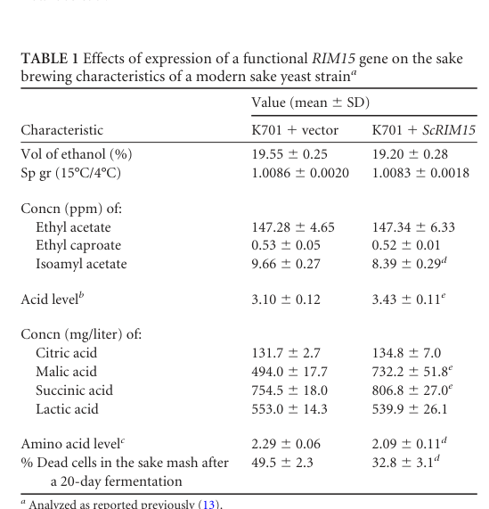

## Question

# Gene Research for Functional Annotation

## ⚠️ CRITICAL: Gene/Protein Identification Context

**BEFORE YOU BEGIN RESEARCH:** You MUST verify you are researching the CORRECT gene/protein. Gene symbols can be ambiguous, especially for less well-characterized genes from non-model organisms.

### Target Gene/Protein Identity (from UniProt):
- **UniProt Accession:** P43565
- **Protein Description:** RecName: Full=Serine/threonine-protein kinase RIM15; EC=2.7.11.1;
- **Gene Information:** Name=RIM15; Synonyms=TAK1; OrderedLocusNames=YFL033C;
- **Organism (full):** Saccharomyces cerevisiae (strain ATCC 204508 / S288c) (Baker's yeast).
- **Protein Family:** Belongs to the protein kinase superfamily. Ser/Thr protein
- **Key Domains:** AGC-kinase_C. (IPR000961); CheY-like_superfamily. (IPR011006); Kinase-like_dom_sf. (IPR011009); Prot_kinase_dom. (IPR000719); Ser/Thr_kinase_AS. (IPR008271)

### MANDATORY VERIFICATION STEPS:

1. **Check if the gene symbol "RIM15" matches the protein description above**
2. **Verify the organism is correct:** Saccharomyces cerevisiae (strain ATCC 204508 / S288c) (Baker's yeast).
3. **Check if protein family/domains align with what you find in literature**
4. **If you find literature for a DIFFERENT gene with the same or similar symbol, STOP**

### If Gene Symbol is Ambiguous or You Cannot Find Relevant Literature:

**DO NOT PROCEED WITH RESEARCH ON A DIFFERENT GENE.** Instead:
- State clearly: "The gene symbol 'RIM15' is ambiguous or literature is limited for this specific protein"
- Explain what you found (e.g., "Found extensive literature on a different gene with the same symbol in a different organism")
- Describe the protein based ONLY on the UniProt information provided above
- Suggest that the protein function can be inferred from domain/family information

### Research Target:

Please provide a comprehensive research report on the gene **RIM15** (gene ID: RIM15, UniProt: P43565) in yeast.

The research report should be a detailed narrative explaining the function, biological processes, and localization of the gene product. Citations should be given for all claims.

You should prioritize authoritative reviews and primary scientific literature when conducting research. You can supplement
this with annotations you find in gene/protein databases, but these can be outdated or inaccurate.

We are specifically interested in the primary function of the gene - for enzymes, what reaction is catalyzed, and what is the substrate specificity? For transporters, what is the substrate? For structural proteins or adapters, what is the broader structural role? For signaling molecules, what is the role in the pathway.

We are interested in where in or outside the cell the gene product carries out its function.

We are also interested in the signaling or biochemical pathways in which the gene functions. We are less interested in broad pleiotropic effects, except where these elucidate the precise role.

Include evidence where possible. We are interested in both experimental evidence as well as inference from structure, evolution, or bioinformatic analysis. Precise studies should be prioritized over high-throughput, where available.

## Output

Question: You are an expert researcher providing comprehensive, well-cited information.

Provide detailed information focusing on:
1. Key concepts and definitions with current understanding
2. Recent developments and latest research (prioritize 2023-2024 sources)
3. Current applications and real-world implementations
4. Expert opinions and analysis from authoritative sources
5. Relevant statistics and data from recent studies

Format as a comprehensive research report with proper citations. Include URLs and publication dates where available.
Always prioritize recent, authoritative sources and provide specific citations for all major claims.

# Gene Research for Functional Annotation

## ⚠️ CRITICAL: Gene/Protein Identification Context

**BEFORE YOU BEGIN RESEARCH:** You MUST verify you are researching the CORRECT gene/protein. Gene symbols can be ambiguous, especially for less well-characterized genes from non-model organisms.

### Target Gene/Protein Identity (from UniProt):
- **UniProt Accession:** P43565
- **Protein Description:** RecName: Full=Serine/threonine-protein kinase RIM15; EC=2.7.11.1;
- **Gene Information:** Name=RIM15; Synonyms=TAK1; OrderedLocusNames=YFL033C;
- **Organism (full):** Saccharomyces cerevisiae (strain ATCC 204508 / S288c) (Baker's yeast).
- **Protein Family:** Belongs to the protein kinase superfamily. Ser/Thr protein
- **Key Domains:** AGC-kinase_C. (IPR000961); CheY-like_superfamily. (IPR011006); Kinase-like_dom_sf. (IPR011009); Prot_kinase_dom. (IPR000719); Ser/Thr_kinase_AS. (IPR008271)

### MANDATORY VERIFICATION STEPS:

1. **Check if the gene symbol "RIM15" matches the protein description above**
2. **Verify the organism is correct:** Saccharomyces cerevisiae (strain ATCC 204508 / S288c) (Baker's yeast).
3. **Check if protein family/domains align with what you find in literature**
4. **If you find literature for a DIFFERENT gene with the same or similar symbol, STOP**

### If Gene Symbol is Ambiguous or You Cannot Find Relevant Literature:

**DO NOT PROCEED WITH RESEARCH ON A DIFFERENT GENE.** Instead:
- State clearly: "The gene symbol 'RIM15' is ambiguous or literature is limited for this specific protein"
- Explain what you found (e.g., "Found extensive literature on a different gene with the same symbol in a different organism")
- Describe the protein based ONLY on the UniProt information provided above
- Suggest that the protein function can be inferred from domain/family information

### Research Target:

Please provide a comprehensive research report on the gene **RIM15** (gene ID: RIM15, UniProt: P43565) in yeast.

The research report should be a detailed narrative explaining the function, biological processes, and localization of the gene product. Citations should be given for all claims.

You should prioritize authoritative reviews and primary scientific literature when conducting research. You can supplement
this with annotations you find in gene/protein databases, but these can be outdated or inaccurate.

We are specifically interested in the primary function of the gene - for enzymes, what reaction is catalyzed, and what is the substrate specificity? For transporters, what is the substrate? For structural proteins or adapters, what is the broader structural role? For signaling molecules, what is the role in the pathway.

We are interested in where in or outside the cell the gene product carries out its function.

We are also interested in the signaling or biochemical pathways in which the gene functions. We are less interested in broad pleiotropic effects, except where these elucidate the precise role.

Include evidence where possible. We are interested in both experimental evidence as well as inference from structure, evolution, or bioinformatic analysis. Precise studies should be prioritized over high-throughput, where available.

# Research Report: Functional Annotation of **RIM15** (UniProt **P43565**) in *Saccharomyces cerevisiae* S288c

## 1) Target verification (gene/protein identity)
The literature retrieved consistently matches the UniProt target: *S. cerevisiae* **RIM15** (also referenced as a Greatwall-family kinase in yeast; ordered locus **YFL033C**) encodes a large serine/threonine protein kinase that integrates nutrient signals to regulate entry into stationary phase/quiescence (G0) and associated stress programs. Multiple primary studies explicitly describe Rim15 as a Ser/Thr kinase downstream of nutrient signaling (PKA, TORC1-Sch9, Pho80–Pho85) and identify validated substrates (notably Igo1/Igo2 endosulfines). (sarkar2014therim15endosulfinepp2acdc55signalling pages 1-2, cameroni2007structuralandfunctional pages 123-127, pedruzzi2003torandpka pages 1-2)

## 2) Key concepts and definitions (current understanding)

### 2.1 Rim15 as a nutrient-to-quiescence “integrator kinase”
In budding yeast, quiescence/stationary phase entry requires coordinated downshifts in growth programs and activation of stress-protective transcriptional and post-transcriptional programs. Rim15 is a central kinase in this transition, positioned downstream of major nutrient-sensing pathways including Ras/PKA and TORC1 (via Sch9), and phosphate sensing via Pho80–Pho85. (swinnen2006rim15andthe pages 2-4, pedruzzi2003torandpka pages 1-2)

### 2.2 Greatwall–Endosulfine–PP2A/B55 module (conserved logic)
A core mechanistic concept is that Rim15 acts as the yeast Greatwall kinase in a conserved module comprising **Rim15 → endosulfines (Igo1/Igo2) → PP2A-B55/Cdc55**. Rim15 phosphorylates Igo1/Igo2, converting them into inhibitors of PP2A-Cdc55, thereby shifting phosphorylation states of downstream effectors that control cell cycle entry/arrest and quiescence programs. (sarkar2014therim15endosulfinepp2acdc55signalling pages 1-2, loewith2007structuralandfunctional pages 136-140)

### 2.3 Direct vs indirect control of transcription
Rim15 activates stress/quiescence transcriptional programs through transcription factors **Msn2/Msn4** (STRE-element genes), **Gis1** (PDS-element genes), and **Hsf1** (heat shock/stress genes). Evidence supports direct phosphorylation of **Msn2** and **Hsf1** by Rim15 in vitro, whereas **Gis1** appears primarily regulated indirectly (via PP2A-Cdc55 inhibition through Igo1/2). (lee2013rim15‐dependentactivationof pages 1-2, lee2013rim15‐dependentactivationof pages 4-6)

## 3) Protein features: domains, enzymatic activity, and substrate specificity

### 3.1 Domain architecture (structural concepts)
Rim15 is a large (~1770 aa) multidomain Ser/Thr kinase. Reported features include:
- **N-terminal PAS domain**, consistent with classification as a “PAS kinase” (domain contributes modestly to in vitro kinase activity). (2007; https://doi.org/10.13097/archive-ouverte/unige:2502) (loewith2007structuralandfunctional pages 1-6, loewith2007structuralandfunctional pages 66-70)
- **Central protein kinase domain** (AGC/Greatwall-like), containing a **large insert between motifs VII and VIII** that is a platform for regulatory phosphorylation and 14-3-3 binding. (cameroni2007structuralandfunctional pages 57-61, loewith2007structuralandfunctional pages 54-57)
- A **C2HC zinc-finger-like module** proposed to bind phosphoinositides in vitro and mediate localization/interaction functions. (loewith2007structuralandfunctional pages 1-6)
- A **non-canonical receiver (REC) domain** (lacking canonical phosphorylatable Asp), suggested to function in protein–protein interactions rather than classic phosphorelay. (loewith2007structuralandfunctional pages 86-90)

### 3.2 Kinase activity (reaction class)
Rim15 is an **EC 2.7.11.1 serine/threonine-protein kinase**. Direct biochemical evidence includes purified Rim15 phosphorylating substrates in vitro; a kinase-dead allele (**K823Y**) abrogates activity, supporting canonical ATP-dependent catalysis. (cameroni2007structuralandfunctional pages 123-127)

### 3.3 Validated direct substrates and what they imply about specificity
The best-supported direct substrates are the yeast endosulfines **Igo1** and **Igo2**:
- Rim15 phosphorylates **Igo1 at Ser64**, mapped by mass spectrometry; **S64A** eliminates phosphorylation. (cameroni2007structuralandfunctional pages 123-127)
- Phospho-Ser64 can be detected in vivo under Rim15-activating conditions (nutrient limitation/rapamycin), and IGO1/2 deletion phenocopies rim15Δ for multiple G0 traits; Ser64 phosphorylation is necessary for Rim15-dependent outputs in those assays. (loewith2007structuralandfunctional pages 136-140)

In addition, Rim15 directly phosphorylates:
- **Msn2** (in vitro), but not Gis1 in the same assays. (lee2013rim15‐dependentactivationof pages 4-6)
- **Hsf1** (in vitro; Rim15 targets Hsf1 C-terminal region in truncation assays). (lee2013rim15‐dependentactivationof pages 4-6)

These results support a model where Rim15’s most definitive substrate “specificity” in vivo is functional (endosulfines/PP2A inhibition) rather than a fully mapped peptide motif; large-scale studies still describe Rim15-dependent sites as largely Ser/Thr and enriched in functional categories such as RNA metabolism and translation during quiescence entry. (sun2023parallelproteomicsand pages 13-17)

## 4) Regulation and localization: where Rim15 acts in the cell

### 4.1 Nutrient-dependent nucleo-cytoplasmic shuttling
A central feature of Rim15 regulation is **localization control**:
- Under glucose/nutrient-rich conditions, Rim15 is retained in the **cytoplasm** and inhibited. (swinnen2006rim15andthe pages 2-4)
- Upon nutrient limitation or TORC1 inhibition (e.g., rapamycin), Rim15 transiently accumulates in the **nucleus**, where it can activate downstream programs. (pedruzzi2003torandpka pages 4-5)
- Nuclear export is mediated by **Msn5**; Rim15 autophosphorylation has been proposed to facilitate export dynamics. (loewith2007structuralandfunctional pages 54-57, swinnen2006rim15andthe pages 2-4)

### 4.2 Upstream pathways and mapped phosphosites
**PKA**:
- PKA phosphorylates Rim15 at **five RRxS consensus sites**, strongly inhibiting Rim15 kinase activity in vitro and supporting cytoplasmic inactivity. (swinnen2006rim15andthe pages 2-4)

**TORC1 → Sch9**:
- TORC1 signaling via Sch9 promotes Rim15 cytoplasmic retention, including phosphorylation in the kinase insert region (e.g., **Ser1061** by Sch9). (loewith2007structuralandfunctional pages 54-57, cameroni2007structuralandfunctional pages 54-57)

**Pho80–Pho85 (phosphate/CDK pathway)**:
- Pho80–Pho85 phosphorylates Rim15 at **Thr1075**, which promotes binding to **14-3-3 (Bmh2)** and cytoplasmic retention; Thr1075 is also implicated in export/retention cycles after nuclear entry. (loewith2007structuralandfunctional pages 54-57, swinnen2006rim15andthe pages 2-4)

Collectively, these pathways tune the nuclear availability and catalytic competence of Rim15 to couple nutrient status to quiescence entry. (sarkar2014therim15endosulfinepp2acdc55signalling pages 1-2, swinnen2006rim15andthe pages 2-4)

## 5) Downstream pathways and biological functions (best-supported)

### 5.1 Quiescence/G0 entry and stress resistance programs
Rim15 is required for canonical G0 outputs upon nutrient limitation or TOR inhibition, including G1 arrest and activation of stress genes and reserve carbohydrate programs. Early work showed rim15 mutants fail to induce G0 transcriptional markers (e.g., SSA3/HSP genes) and metabolic changes after rapamycin, establishing Rim15 as a key effector downstream of TOR and PKA signaling. (pedruzzi2003torandpka pages 1-2)

### 5.2 Rim15 → Igo1/2 → PP2A-Cdc55 axis (core biochemical pathway)
The strongest mechanistic chain is:
1) Nutrient limitation relieves inhibition of Rim15 (PKA/TORC1/Sch9/Pho85 branches) and permits nuclear Rim15 activity. (swinnen2006rim15andthe pages 2-4, pedruzzi2003torandpka pages 4-5)
2) Rim15 phosphorylates Igo1/2 (Igo1 **Ser64**) (cameroni2007structuralandfunctional pages 123-127, loewith2007structuralandfunctional pages 136-140)
3) Phosphorylated endosulfines inhibit **PP2A-Cdc55/B55**, shifting phosphorylation states of downstream regulators that promote quiescence and (in diploids) gametogenesis; PP2A-Cdc55 otherwise inhibits entry into these programs. (sarkar2014therim15endosulfinepp2acdc55signalling pages 1-2)

### 5.3 Transcription factor branches: Msn2/4, Gis1, Hsf1
- **Msn2/4**: Rim15 promotes STRE-dependent stress responses; Rim15 phosphorylates **Msn2** in vitro, supporting direct activation potential. (lee2013rim15‐dependentactivationof pages 4-6)
- **Gis1**: Gis1-dependent PDS transcription is positioned downstream of Rim15, often via PP2A-Cdc55 inhibition rather than direct phosphorylation by Rim15. (lee2013rim15‐dependentactivationof pages 1-2, swinnen2014molecularmechanismslinking pages 3-4)
- **Hsf1**: Rim15 phosphorylates Hsf1 in vitro and supports induction/stabilization of Hsf1-responsive transcripts during glucose depletion. (lee2013rim15‐dependentactivationof pages 1-2, lee2013rim15‐dependentactivationof pages 4-6)

### 5.4 Post-transcriptional control (mRNA stability/decapping)
Rim15 phosphorylates Igo1/2, which have been described to antagonize decapping and 5′→3′ decay of specific nutrient-regulated mRNAs, supporting translation and stress adaptation during nutrient limitation. (lee2013rim15‐dependentactivationof pages 1-2, swinnen2014molecularmechanismslinking pages 3-4)

### 5.5 Autophagy and gametogenesis-associated survival
In the context of gametogenesis and starvation responses, Igo1/2 are required for **pre-meiotic autophagy**, and the Rim15–Igo–PP2A-Cdc55 module regulates entry into both quiescence and gametogenesis via distinct downstream mechanisms. (sarkar2014therim15endosulfinepp2acdc55signalling pages 1-2)

## 6) Recent developments (prioritizing 2023–2024)

### 6.1 2023 (peer-reviewed review): TORC1–Rim15/Igo–PP2A-Cdc55 connects nutrients to START via Whi5
A 2023 review of TORC1 control of the yeast cell cycle highlighted a specific mechanism: under nutrient-poor conditions, the **Rim15–Igo1/2 pathway inhibits PP2A-Cdc55**, preventing dephosphorylation of the G1 inhibitor **Whi5**, thereby facilitating SBF-driven transcription and promoting START commitment through increased Whi5 phosphorylation by Cln3–Cdk1. (Published Oct 2023; https://doi.org/10.3390/ijms242115745) (foltman2023torcomplex1 pages 8-11)

### 6.2 2023 (systems-level phosphoproteomics; preprint): starvation-signal-specific roles for Rim15
A 2023 SILAC-based temporal proteomics/phosphoproteomics study (bioRxiv; Aug 2023; https://doi.org/10.1101/2023.08.03.551843) provided quantitative, condition-specific Rim15 dependencies during quiescence entry:
- **298 proteins** (carbon starvation) and **82 proteins** (phosphorus starvation) showed genotype-dependent dynamics (adjusted p < 0.05), and ~**75%** of Rim15-dependent proteins increased in the rim15Δ background under carbon starvation (interpreted as a largely repressive role of Rim15 on protein expression in that context). (sun2023parallelproteomicsand pages 13-17)
- Proteome/phosphoproteome scale: **1,277 proteins** quantified; **1,472 phosphorylation events** quantified; and 46–49 starvation-induced phosphosites increased in WT depending on starvation condition. (sun2023parallelproteomicsand pages 17-22, sun2023parallelproteomicsand pages 35-40)
- Rim15-dependent phosphorylation included the known site **IGO1 Ser64**, and additional common Rim15-regulated phosphosites were reported across starvation contexts (enriched in RNA metabolism/translation). (sun2023parallelproteomicsand pages 13-17)
- Phenotypically, rim15Δ reduced survival specifically under **phosphorus and nitrogen** starvation (not carbon), reinforcing that Rim15’s contribution to “quiescence viability” is starvation-signal dependent. (sun2023parallelproteomicsand pages 1-5)

### 6.3 2024: mechanistic refinement in related conserved modules
Although not all 2024 yeast papers in the retrieved set focus directly on budding yeast Rim15, the broader Greatwall-Endosulfine-PP2A/B55 axis continues to be refined in other yeast systems, reinforcing the interpretation of Rim15 as an evolutionarily conserved “kinase-to-phosphatase switch” (review/primary synthesis context). (sarkar2014therim15endosulfinepp2acdc55signalling pages 1-2)

## 7) Current applications and real-world implementations

### 7.1 Industrial fermentation: natural and engineered *RIM15* loss-of-function increases fermentation rate
**Sake yeast strains** provide a practical demonstration of Rim15’s role as a fermentation brake:
- Modern sake strains carry a **loss-of-function insertion** allele (reported as **5055insA**) truncating Rim15p and linked to defective quiescence entry and **high fermentation rates**. (Published Jun 2012; https://doi.org/10.1128/AEM.00165-12) (watanabe2012alossoffunctionmutation pages 1-2)
- In laboratory strain backgrounds, **rim15 mutants** display higher peak CO2 emission rates and higher ethanol output after extended fermentation.
  - Example quantitative results: peak CO2 emission increased from **180.8 ± 11.5 ml/6 h (WT BY4743)** to **235.3 ± 18.1 ml/6 h (BY4743 rim15)**; in another assay, **90.8 ± 2.5 ml/6 h** to **142.7 ± 2.8 ml/6 h**; ethanol reached **17.03% ± 0.44% v/v** after 20 days for BY4743 rim15. (watanabe2012alossoffunctionmutation pages 5-7)
- Figures and Table evidence for these fermentation phenotypes and complementation are shown in the extracted panels (watanabe2012alossoffunctionmutation media 0df2d675, watanabe2012alossoffunctionmutation media 8dbf4238, watanabe2012alossoffunctionmutation media 4c77db42).

### 7.2 Mechanistic strain design: TORC1–Greatwall(Rim15)–PP2A-B55/Cdc55 pathway as an engineering handle
A 2019 applied microbiology study connected fermentation-rate control mechanistically to a nutrient-signaling pathway:
- Disruption of **RIM15** increases fermentation rates across non-sake strains, and deletion of **CDC55** (PP2A-B55) abolishes the “high fermentation” phenotype of Rim15-deficient strains, supporting that PP2A-B55 mediates TORC1–Rim15 control of fermentation. (Published Jan 2019; https://doi.org/10.1128/AEM.02083-18) (watanabe2019nutrientsignalingvia pages 1-2)
- The authors explicitly frame these results as a rational basis for designing/breeding industrial yeasts with optimized fermentation performance, while noting potential fitness trade-offs. (watanabe2019nutrientsignalingvia pages 1-2)

### 7.3 Trade-offs: fermentation speed vs stress tolerance/quiescence robustness
Restoring functional **ScRIM15** in a sake background improved stress-related brewing traits (e.g., reduced cell death in high-ethanol mash) while modestly decreasing fermentation performance, illustrating a common industrial trade-off between rapid fermentation and robustness/survival programs governed by Rim15. (watanabe2012alossoffunctionmutation pages 8-9)

## 8) Expert opinions and analysis (authoritative synthesis)

### 8.1 Rim15 as a “crossroads” node of nutrient signaling
A widely cited review described Rim15 as a focal integrator of at least four nutrient-responsive pathways, emphasizing that Rim15 integrates kinase signaling through phosphorylation-dependent localization and activity control to coordinate entry into stationary phase. (Published Apr 2006; https://doi.org/10.1186/1747-1028-1-3) (swinnen2006rim15andthe pages 2-4)

### 8.2 Rim15 in lifespan/quiescence frameworks
Review literature on TORC1-Sch9-longevity places Rim15 in the canonical downstream effector layer for quiescence/stress resistance programs, emphasizing the Rim15→Igo→PP2A-Cdc55→Gis1 logic and highlighting that multiple mechanistic links remain an active area (e.g., details of Rim15–Msn2/4 regulation). (Published Feb 2014; https://doi.org/10.1111/1567-1364.12097) (swinnen2014molecularmechanismslinking pages 4-5)

## 9) Key statistics and data points (recent and classic)

### 9.1 Validated phosphorylation target with residue-level mapping
- **Igo1 Ser64** is a validated Rim15 phosphorylation site mapped by mass spectrometry; S64A abolishes phosphorylation in vitro (and Ser64 phosphorylation is required for major Rim15-dependent G0 outputs in follow-up studies). (cameroni2007structuralandfunctional pages 123-127, loewith2007structuralandfunctional pages 136-140)

### 9.2 Quantitative industrial phenotypes (2012)
- Increased peak CO2 emission rates in rim15 mutants (examples: **180.8 ± 11.5 → 235.3 ± 18.1 ml/6 h**; **90.8 ± 2.5 → 142.7 ± 2.8 ml/6 h**) and ethanol reaching **17.03% ± 0.44% v/v** after 20 days in one rim15 mutant condition. (watanabe2012alossoffunctionmutation pages 5-7)
- Visual evidence for fermentation kinetics and complementation is provided in extracted figure/table panels. (watanabe2012alossoffunctionmutation media 0df2d675, watanabe2012alossoffunctionmutation media 8dbf4238, watanabe2012alossoffunctionmutation media 4c77db42)

### 9.3 Quantitative omics (2023; preprint)
- **1,277 proteins** quantified and **1,472 phosphorylation events** quantified during quiescence entry; Rim15-dependent dynamics observed for **298 (carbon)** and **82 (phosphorus)** proteins; ~**75%** of Rim15-dependent proteins increased in rim15Δ under carbon starvation. (sun2023parallelproteomicsand pages 13-17, sun2023parallelproteomicsand pages 17-22)
- Rim15-dependent common phosphorylation events include IGO1 Ser64 and other sites spanning RNA/translation/proteostasis-related factors. (sun2023parallelproteomicsand pages 13-17)

## 10) Consolidated functional annotation summary
The table below consolidates (i) domains and enzymatic evidence, (ii) upstream regulatory logic and localization, (iii) validated direct substrates, (iv) downstream pathways and applications, and (v) DOI-linked sources.

| Module/Process | Upstream regulators | Mechanism (phosphosites/localization) | Direct Rim15 substrates/targets | Downstream outcomes | Key evidence (brief) | Primary citations with year+DOI URL |
|---|---|---|---|---|---|---|
| Nutrient-sensing hub controlling G0/quiescence entry | PKA; TORC1→Sch9; Pho80–Pho85 | PKA phosphorylates Rim15 at five RRxS sites and inhibits kinase activity; TORC1/Sch9 and Pho80–Pho85 promote cytoplasmic retention via kinase-insert phosphosites including S1061 and T1075; T1075 promotes Bmh2/14-3-3 binding; nutrient limitation/rapamycin/phosphate withdrawal trigger nuclear accumulation; export requires Msn5 (loewith2007structuralandfunctional pages 54-57, swinnen2006rim15andthe pages 2-4, cameroni2007structuralandfunctional pages 54-57, swinnen2014molecularmechanismslinking pages 4-5, pedruzzi2003torandpka pages 4-5) | Rim15 itself is regulated rather than acting as substrate in this row | Entry into G0/stationary phase, G1 arrest, activation of starvation-responsive transcriptional program (swinnen2006rim15andthe pages 2-4, pedruzzi2003torandpka pages 1-2) | Genetics and localization assays showed rim15 mutants fail to mount rapamycin-induced G0 responses; phosphatase-sensitive mobility shifts and GFP localization linked TOR/Sch9 to Rim15 phosphorylation and nuclear exclusion (pedruzzi2003torandpka pages 4-5, pedruzzi2003torandpka pages 1-2) | Pedruzzi et al. 2003, https://doi.org/10.1016/S1097-2765(03)00485-4; Swinnen et al. 2006, https://doi.org/10.1186/1747-1028-1-3 |
| Rim15 structural/enzymatic annotation | Nutrient pathways modulate activity but not basic domain architecture | Large 1770-aa AGC/Greatwall-like Ser/Thr kinase with N-terminal PAS domain, central kinase domain with large insert between motifs VII–VIII, C2HC zinc-finger-like region, and non-canonical REC domain; autophosphorylates; catalytic Lys823 required for activity (cameroni2007structuralandfunctional pages 57-61, loewith2007structuralandfunctional pages 86-90, loewith2007structuralandfunctional pages 1-6, cameroni2007structuralandfunctional pages 123-127) | Igo1/Igo2 are validated direct phospho-targets; broader consensus remains incompletely defined (cameroni2007structuralandfunctional pages 123-127) | Provides biochemical basis for central signaling role and regulated substrate phosphorylation during nutrient limitation | Purified wild-type but not kinase-dead Rim15 phosphorylated substrates on protein arrays/in vitro; domain analyses support multidomain signaling/scaffolding functions (cameroni2007structuralandfunctional pages 57-61, cameroni2007structuralandfunctional pages 123-127) | Cameroni/Loewith 2007 thesis/archive, https://doi.org/10.13097/archive-ouverte/unige:2502 |
| Greatwall–Endosulfine–PP2A-Cdc55 module | Relief of PKA, TORC1-Sch9, and Pho80–Pho85 inhibition activates Rim15 | Upon activation/nuclear function, Rim15 phosphorylates endosulfines Igo1/Igo2; Igo1 Ser64 is validated; phospho-Igo1/2 inhibit PP2A-Cdc55/B55 (sarkar2014therim15endosulfinepp2acdc55signalling pages 1-2, cameroni2007structuralandfunctional pages 123-127, loewith2007structuralandfunctional pages 136-140) | Igo1 Ser64; Igo2 corresponding conserved site (cameroni2007structuralandfunctional pages 123-127, sarkar2014therim15endosulfinepp2acdc55signalling pages 1-2, loewith2007structuralandfunctional pages 136-140) | PP2A-Cdc55 inhibition; preservation of phosphorylated targets such as Gis1/Sic1-related outputs; promotion of quiescence and gametogenesis; contribution to mRNA protection (sarkar2014therim15endosulfinepp2acdc55signalling pages 1-2, swinnen2014molecularmechanismslinking pages 3-4, deprez2018thetorc1sch9pathway pages 5-6) | Protein microarray + in vitro kinase assays + MS mapped Igo1 Ser64; phospho-Ser64 antibodies and mutational analysis showed Ser64 is necessary for Rim15-dependent G0 traits; genetic studies linked Rim15-Igo1/2 to PP2A-Cdc55 inhibition (sarkar2014therim15endosulfinepp2acdc55signalling pages 1-2, cameroni2007structuralandfunctional pages 123-127, loewith2007structuralandfunctional pages 136-140) | Sarkar et al. 2014, https://doi.org/10.1371/journal.pgen.1004456; Lee et al. 2013, https://doi.org/10.1016/j.febslet.2013.10.004 |
| Stress-responsive transcription via Msn2/4 | Upstream inhibition by PKA and TORC1-Sch9 is relieved during starvation | Rim15 enters nucleus and stimulates Msn2/Msn4-dependent STRE genes; Msn2 is directly phosphorylated by Rim15 in vitro, while the precise mechanism for Msn4 remains less direct/fully resolved (lee2013rim15‐dependentactivationof pages 1-2, swinnen2014molecularmechanismslinking pages 3-4, deprez2018thetorc1sch9pathway pages 5-6) | Msn2 direct in vitro substrate; Msn4 functional downstream effector (lee2013rim15‐dependentactivationof pages 1-2, swinnen2014molecularmechanismslinking pages 3-4) | Environmental stress response, antioxidant defense genes, reserve carbohydrate accumulation, quiescence-associated survival (swinnen2014molecularmechanismslinking pages 4-5, swinnen2014molecularmechanismslinking pages 3-4, deprez2018thetorc1sch9pathway pages 5-6) | In vitro kinase assays demonstrated Rim15→Msn2 phosphorylation; classic genetics placed Msn2/4 downstream of Rim15 in G0/stress programs (lee2013rim15‐dependentactivationof pages 1-2, swinnen2014molecularmechanismslinking pages 3-4) | Lee et al. 2013, https://doi.org/10.1016/j.febslet.2013.10.004; Pedruzzi et al. 2003, https://doi.org/10.1016/S1097-2765(03)00485-4 |
| Heat-shock/stress transcription via Hsf1 | Rim15 activated when PKA/TORC1 repression is relieved by glucose depletion/starvation | Rim15 directly phosphorylates Hsf1 in vitro; supports induction and stabilization of some Hsf1 target transcripts during glucose depletion (lee2013rim15‐dependentactivationof pages 1-2, lee2013rim15‐dependentactivationof pages 4-6) | Hsf1 (direct in vitro substrate) (lee2013rim15‐dependentactivationof pages 1-2, lee2013rim15‐dependentactivationof pages 4-6) | Heat-shock/stress gene expression, including HSP26-linked responses, contributing to stress resistance (lee2013rim15‐dependentactivationof pages 1-2, deprez2018thetorc1sch9pathway pages 5-6) | Purified Rim15 phosphorylated Hsf1 fragments in vitro; transcript assays showed Rim15-dependent induction/stabilization of Hsf1 targets under glucose depletion (lee2013rim15‐dependentactivationof pages 1-2, lee2013rim15‐dependentactivationof pages 4-6) | Lee et al. 2013, https://doi.org/10.1016/j.febslet.2013.10.004 |
| Gis1/PDS transcriptional branch | Activated indirectly downstream of Rim15 and antagonism of PP2A-Cdc55 | Rim15 does not directly phosphorylate Gis1 detectably in vitro; instead phospho-Igo1/2 inhibit PP2A-Cdc55, helping maintain Gis1 in an active phosphorylated state and/or promoter recruitment (lee2013rim15‐dependentactivationof pages 1-2, swinnen2014molecularmechanismslinking pages 3-4, cameroni2007structuralandfunctional pages 123-127) | No strong evidence for direct Rim15→Gis1 phosphorylation; indirect regulation via Igo1/2–PP2A-Cdc55 (lee2013rim15‐dependentactivationof pages 1-2, swinnen2014molecularmechanismslinking pages 3-4) | Post-diauxic shift (PDS) gene expression, stationary-phase transcriptional remodeling, oxidative/stress adaptation (swinnen2014molecularmechanismslinking pages 4-5, swinnen2014molecularmechanismslinking pages 3-4) | Genetic epistasis supports Gis1 downstream of Rim15; biochemical work supports the indirect Igo1/2→PP2A-Cdc55 route rather than direct phosphorylation (lee2013rim15‐dependentactivationof pages 1-2, cameroni2007structuralandfunctional pages 123-127) | Swinnen et al. 2014, https://doi.org/10.1111/1567-1364.12097; Lee et al. 2013, https://doi.org/10.1016/j.febslet.2013.10.004 |
| mRNA stability / decapping control | Rim15 activation under nutrient limitation | Rim15-phosphorylated Igo1/2 antagonize 5′→3′ mRNA decay, in part via association with decapping factor Dhh1; this is downstream of Rim15 kinase action on Igo proteins (lee2013rim15‐dependentactivationof pages 1-2, swinnen2014molecularmechanismslinking pages 3-4, deprez2018thetorc1sch9pathway pages 5-6) | Igo1/Igo2 are direct Rim15 substrates mediating this branch (lee2013rim15‐dependentactivationof pages 1-2, loewith2007structuralandfunctional pages 136-140) | Stabilization/translation of nutrient-regulated mRNAs during starvation/quiescence entry (lee2013rim15‐dependentactivationof pages 1-2, swinnen2014molecularmechanismslinking pages 3-4, deprez2018thetorc1sch9pathway pages 5-6) | Review synthesis and primary data indicate phospho-Igo proteins protect mRNAs from decapping-dependent degradation; IGO1/2 deletion reduces induction of Rim15-responsive genes such as BTN2/HSP26 (lee2013rim15‐dependentactivationof pages 1-2, lee2013rim15‐dependentactivationof pages 4-6) | Lee et al. 2013, https://doi.org/10.1016/j.febslet.2013.10.004; Swinnen et al. 2014, https://doi.org/10.1111/1567-1364.12097 |
| Autophagy/gametogenesis-linked survival program | Nutrient starvation activates Rim15 module | Rim15 phosphorylates Igo1/Igo2 to oppose PP2A-Cdc55; Igo1/2 are required for pre-meiotic autophagy, though autophagy defect alone does not fully explain sporulation defect (sarkar2014therim15endosulfinepp2acdc55signalling pages 1-2) | Igo1/Igo2 (direct); downstream autophagy effectors not fully resolved here (sarkar2014therim15endosulfinepp2acdc55signalling pages 1-2) | Entry into gametogenesis and starvation survival; quiescence and sporulation via distinct downstream mechanisms (sarkar2014therim15endosulfinepp2acdc55signalling pages 1-2) | Genetic deletion of IGO1/2 impaired pre-meiotic autophagy and sporulation; authors concluded the Rim15-Endosulfine-PP2A-Cdc55 module governs quiescence and gametogenesis through distinct mechanisms (sarkar2014therim15endosulfinepp2acdc55signalling pages 1-2) | Sarkar et al. 2014, https://doi.org/10.1371/journal.pgen.1004456 |
| Quiescence phosphoproteome and recent 2023 systems-level updates | Starvation signal context (carbon vs phosphorus vs nitrogen) intersects with Rim15 dependence | Temporal SILAC proteomics/phosphoproteomics in WT vs rim15Δ during starvation identified 1,277 proteins and 1,472 phosphorylation events; 11 common phosphorylation targets increased in WT vs rim15Δ; IGO1 S64 detected before starvation as Rim15-dependent (sun2023parallelproteomicsand pages 13-17, sun2023parallelproteomicsand pages 35-40, sun2023parallelproteomicsand pages 17-22, sun2023parallelproteomicsand pages 25-29) | Confirmed/implicated: IGO1 S64 plus candidate broader targets enriched in RNA metabolism, translation, proteostasis, glycogen metabolism (sun2023parallelproteomicsand pages 13-17, sun2023parallelproteomicsand pages 17-22) | Rim15 contributes to quiescence survival especially under phosphorus and nitrogen starvation; regulates mitochondrial/proteostasis and RNA/translation functions (sun2023parallelproteomicsand pages 13-17, sun2023parallelproteomicsand pages 1-5) | Quantitative study found 298 proteins (carbon) and 82 proteins (phosphorus) with genotype-dependent dynamics; survival defects were stronger in phosphorus/nitrogen starvation than carbon starvation (sun2023parallelproteomicsand pages 13-17, sun2023parallelproteomicsand pages 1-5) | Sun et al. 2023 preprint, https://doi.org/10.1101/2023.08.03.551843 |
| Fermentation control / industrial implementation | TORC1–Rim15–PP2A-B55 axis; natural/engineered RIM15 loss-of-function | Natural sake-yeast frameshift rim15^5055insA truncates Rim15; RIM15 loss increases fermentation rate, while restoring functional RIM15 improves stress tolerance and some brewing traits; CDC55/PP2A-B55 mediates much of the effect downstream (watanabe2012alossoffunctionmutation pages 3-5, watanabe2019nutrientsignalingvia pages 1-2, watanabe2012alossoffunctionmutation pages 5-7) | Rim15 pathway outputs involve Igo1/2 and PP2A-B55/Cdc55; direct fermentation substrate not defined (watanabe2019nutrientsignalingvia pages 1-2, watanabe2012alossoffunctionmutation pages 5-7) | Faster alcoholic fermentation, higher early CO2 evolution and ethanol production, but trade-offs in quiescence entry/stress tolerance/cell survival (watanabe2012alossoffunctionmutation pages 3-5, watanabe2012alossoffunctionmutation pages 8-9, watanabe2012alossoffunctionmutation pages 5-7) | In laboratory strains, rim15 mutants showed higher peak CO2 emission (e.g., 180.8 ± 11.5 vs 235.3 ± 18.1 ml/6 h) and higher ethanol after 20 days (17.03% ± 0.44% v/v); restoring ScRIM15 in K701 improved stress tolerance and reduced cell death in high-ethanol mash (watanabe2012alossoffunctionmutation pages 8-9, watanabe2012alossoffunctionmutation pages 5-7, watanabe2012alossoffunctionmutation media 0df2d675) | Watanabe et al. 2012, https://doi.org/10.1128/AEM.00165-12; Watanabe et al. 2019, https://doi.org/10.1128/AEM.02083-18 |

*Table: This table summarizes validated functional annotation for Saccharomyces cerevisiae Rim15 (UniProt P43565), including upstream regulation, localization and phosphosite mechanisms, direct substrates, downstream biological roles, and key primary literature supporting each module.*

## 11) Practical functional annotation (concise “database-style” statement)
**Rim15 (P43565)** is a nutrient-regulated **Ser/Thr protein kinase** that functions as a yeast Greatwall kinase to promote entry into quiescence/stationary phase by (1) translocating to the nucleus upon nutrient limitation and (2) phosphorylating **Igo1/Igo2 endosulfines** (Igo1 **Ser64**) to inhibit **PP2A-Cdc55/B55**, thereby sustaining phosphorylation-dependent states of downstream regulators controlling stress transcription, mRNA stability, and cell-cycle/quiescence decisions. Rim15 also directly phosphorylates stress regulators **Msn2** and **Hsf1** in vitro and supports starvation-induced stress gene programs. Rim15 activity is restrained under nutrient-rich conditions by **PKA**, **TORC1→Sch9**, and **Pho80–Pho85** through phosphoregulation that enforces cytoplasmic retention (including **Thr1075** and **Ser1061**) and inhibits catalytic activity. (loewith2007structuralandfunctional pages 54-57, sarkar2014therim15endosulfinepp2acdc55signalling pages 1-2, lee2013rim15‐dependentactivationof pages 4-6)

## 12) Notes on evidence quality and recency
- Core Rim15 mechanisms (Igo1 Ser64 phosphorylation; upstream nutrient control; PP2A-Cdc55 inhibition) are supported by robust primary literature from 2003–2014 and remain foundational. (pedruzzi2003torandpka pages 1-2, sarkar2014therim15endosulfinepp2acdc55signalling pages 1-2, loewith2007structuralandfunctional pages 136-140)
- 2023–2024 updates are mostly (i) synthesis/reviews placing Rim15 into cell-cycle control logic and (ii) omics-scale studies refining starvation-signal-specific dependencies; some of the newest quantitative phosphoproteomics evidence is currently available as a preprint and should be interpreted accordingly. (foltman2023torcomplex1 pages 8-11, sun2023parallelproteomicsand pages 13-17)

References

1. (sarkar2014therim15endosulfinepp2acdc55signalling pages 1-2): Sourav Sarkar, Jacob Z. Dalgaard, Jonathan B. A. Millar, and Prakash Arumugam. The rim15-endosulfine-pp2acdc55 signalling module regulates entry into gametogenesis and quiescence via distinct mechanisms in budding yeast. PLoS Genetics, 10:e1004456, Jun 2014. URL: https://doi.org/10.1371/journal.pgen.1004456, doi:10.1371/journal.pgen.1004456. This article has 61 citations and is from a domain leading peer-reviewed journal.

2. (cameroni2007structuralandfunctional pages 123-127): Structural and functional characterization of the novel yeast PAS kinase Rim 15, a central regulator of the G0 program in yeast

3. (pedruzzi2003torandpka pages 1-2): Ivo Pedruzzi, Frédérique Dubouloz, Elisabetta Cameroni, Valeria Wanke, Johnny Roosen, Joris Winderickx, and Claudio De Virgilio. Tor and pka signaling pathways converge on the protein kinase rim15 to control entry into g0. Molecular cell, 12 6:1607-13, Dec 2003. URL: https://doi.org/10.1016/s1097-2765(03)00485-4, doi:10.1016/s1097-2765(03)00485-4. This article has 406 citations and is from a highest quality peer-reviewed journal.

4. (swinnen2006rim15andthe pages 2-4): Erwin Swinnen, Valeria Wanke, Johnny Roosen, Bart Smets, Frédérique Dubouloz, Ivo Pedruzzi, Elisabetta Cameroni, Claudio De Virgilio, and Joris Winderickx. Rim15 and the crossroads of nutrient signalling pathways in saccharomyces cerevisiae. Cell Division, 1:3-3, Apr 2006. URL: https://doi.org/10.1186/1747-1028-1-3, doi:10.1186/1747-1028-1-3. This article has 197 citations and is from a peer-reviewed journal.

5. (loewith2007structuralandfunctional pages 136-140): R Loewith. Structural and functional characterization of the novel yeast pas kinase rim15, a central regulator of the g0 program in yeast. Unknown journal, 2007.

6. (lee2013rim15‐dependentactivationof pages 1-2): Peter Lee, Myunghye Kim, S. Paik, Seung-Hwan Choi, Boram Cho, and J. Hahn. Rim15‐dependent activation of hsf1 and msn2/4 transcription factors by direct phosphorylation in saccharomyces cerevisiae. FEBS Letters, Nov 2013. URL: https://doi.org/10.1016/j.febslet.2013.10.004, doi:10.1016/j.febslet.2013.10.004. This article has 109 citations and is from a peer-reviewed journal.

7. (lee2013rim15‐dependentactivationof pages 4-6): Peter Lee, Myunghye Kim, S. Paik, Seung-Hwan Choi, Boram Cho, and J. Hahn. Rim15‐dependent activation of hsf1 and msn2/4 transcription factors by direct phosphorylation in saccharomyces cerevisiae. FEBS Letters, Nov 2013. URL: https://doi.org/10.1016/j.febslet.2013.10.004, doi:10.1016/j.febslet.2013.10.004. This article has 109 citations and is from a peer-reviewed journal.

8. (loewith2007structuralandfunctional pages 1-6): R Loewith. Structural and functional characterization of the novel yeast pas kinase rim15, a central regulator of the g0 program in yeast. Unknown journal, 2007.

9. (loewith2007structuralandfunctional pages 66-70): R Loewith. Structural and functional characterization of the novel yeast pas kinase rim15, a central regulator of the g0 program in yeast. Unknown journal, 2007.

10. (cameroni2007structuralandfunctional pages 57-61): Structural and functional characterization of the novel yeast PAS kinase Rim 15, a central regulator of the G0 program in yeast

11. (loewith2007structuralandfunctional pages 54-57): R Loewith. Structural and functional characterization of the novel yeast pas kinase rim15, a central regulator of the g0 program in yeast. Unknown journal, 2007.

12. (loewith2007structuralandfunctional pages 86-90): R Loewith. Structural and functional characterization of the novel yeast pas kinase rim15, a central regulator of the g0 program in yeast. Unknown journal, 2007.

13. (sun2023parallelproteomicsand pages 13-17): Siyu Sun, Daniel Tranchina, and David Gresham. Parallel proteomics and phosphoproteomics defines starvation signal specific processes in cell quiescence. bioRxiv, Aug 2023. URL: https://doi.org/10.1101/2023.08.03.551843, doi:10.1101/2023.08.03.551843. This article has 1 citations.

14. (pedruzzi2003torandpka pages 4-5): Ivo Pedruzzi, Frédérique Dubouloz, Elisabetta Cameroni, Valeria Wanke, Johnny Roosen, Joris Winderickx, and Claudio De Virgilio. Tor and pka signaling pathways converge on the protein kinase rim15 to control entry into g0. Molecular cell, 12 6:1607-13, Dec 2003. URL: https://doi.org/10.1016/s1097-2765(03)00485-4, doi:10.1016/s1097-2765(03)00485-4. This article has 406 citations and is from a highest quality peer-reviewed journal.

15. (cameroni2007structuralandfunctional pages 54-57): Structural and functional characterization of the novel yeast PAS kinase Rim 15, a central regulator of the G0 program in yeast

16. (swinnen2014molecularmechanismslinking pages 3-4): Erwin Swinnen, Ruben Ghillebert, Tobias Wilms, and Joris Winderickx. Molecular mechanisms linking the evolutionary conserved torc1-sch9 nutrient signalling branch to lifespan regulation in saccharomyces cerevisiae. FEMS yeast research, 14 1:17-32, Feb 2014. URL: https://doi.org/10.1111/1567-1364.12097, doi:10.1111/1567-1364.12097. This article has 99 citations and is from a peer-reviewed journal.

17. (foltman2023torcomplex1 pages 8-11): Magdalena Foltman and Alberto Sanchez-Diaz. Tor complex 1: orchestrating nutrient signaling and cell cycle progression. International Journal of Molecular Sciences, 24:15745, Oct 2023. URL: https://doi.org/10.3390/ijms242115745, doi:10.3390/ijms242115745. This article has 18 citations.

18. (sun2023parallelproteomicsand pages 17-22): Siyu Sun, Daniel Tranchina, and David Gresham. Parallel proteomics and phosphoproteomics defines starvation signal specific processes in cell quiescence. bioRxiv, Aug 2023. URL: https://doi.org/10.1101/2023.08.03.551843, doi:10.1101/2023.08.03.551843. This article has 1 citations.

19. (sun2023parallelproteomicsand pages 35-40): Siyu Sun, Daniel Tranchina, and David Gresham. Parallel proteomics and phosphoproteomics defines starvation signal specific processes in cell quiescence. bioRxiv, Aug 2023. URL: https://doi.org/10.1101/2023.08.03.551843, doi:10.1101/2023.08.03.551843. This article has 1 citations.

20. (sun2023parallelproteomicsand pages 1-5): Siyu Sun, Daniel Tranchina, and David Gresham. Parallel proteomics and phosphoproteomics defines starvation signal specific processes in cell quiescence. bioRxiv, Aug 2023. URL: https://doi.org/10.1101/2023.08.03.551843, doi:10.1101/2023.08.03.551843. This article has 1 citations.

21. (watanabe2012alossoffunctionmutation pages 1-2): Daisuke Watanabe, Yuya Araki, Yan Zhou, Naoki Maeya, Takeshi Akao, and Hitoshi Shimoi. A loss-of-function mutation in the pas kinase rim15p is related to defective quiescence entry and high fermentation rates of saccharomyces cerevisiae sake yeast strains. Applied and Environmental Microbiology, 78:4008-4016, Jun 2012. URL: https://doi.org/10.1128/aem.00165-12, doi:10.1128/aem.00165-12. This article has 121 citations and is from a peer-reviewed journal.

22. (watanabe2012alossoffunctionmutation pages 5-7): Daisuke Watanabe, Yuya Araki, Yan Zhou, Naoki Maeya, Takeshi Akao, and Hitoshi Shimoi. A loss-of-function mutation in the pas kinase rim15p is related to defective quiescence entry and high fermentation rates of saccharomyces cerevisiae sake yeast strains. Applied and Environmental Microbiology, 78:4008-4016, Jun 2012. URL: https://doi.org/10.1128/aem.00165-12, doi:10.1128/aem.00165-12. This article has 121 citations and is from a peer-reviewed journal.

23. (watanabe2012alossoffunctionmutation media 0df2d675): Daisuke Watanabe, Yuya Araki, Yan Zhou, Naoki Maeya, Takeshi Akao, and Hitoshi Shimoi. A loss-of-function mutation in the pas kinase rim15p is related to defective quiescence entry and high fermentation rates of saccharomyces cerevisiae sake yeast strains. Applied and Environmental Microbiology, 78:4008-4016, Jun 2012. URL: https://doi.org/10.1128/aem.00165-12, doi:10.1128/aem.00165-12. This article has 121 citations and is from a peer-reviewed journal.

24. (watanabe2012alossoffunctionmutation media 8dbf4238): Daisuke Watanabe, Yuya Araki, Yan Zhou, Naoki Maeya, Takeshi Akao, and Hitoshi Shimoi. A loss-of-function mutation in the pas kinase rim15p is related to defective quiescence entry and high fermentation rates of saccharomyces cerevisiae sake yeast strains. Applied and Environmental Microbiology, 78:4008-4016, Jun 2012. URL: https://doi.org/10.1128/aem.00165-12, doi:10.1128/aem.00165-12. This article has 121 citations and is from a peer-reviewed journal.

25. (watanabe2012alossoffunctionmutation media 4c77db42): Daisuke Watanabe, Yuya Araki, Yan Zhou, Naoki Maeya, Takeshi Akao, and Hitoshi Shimoi. A loss-of-function mutation in the pas kinase rim15p is related to defective quiescence entry and high fermentation rates of saccharomyces cerevisiae sake yeast strains. Applied and Environmental Microbiology, 78:4008-4016, Jun 2012. URL: https://doi.org/10.1128/aem.00165-12, doi:10.1128/aem.00165-12. This article has 121 citations and is from a peer-reviewed journal.

26. (watanabe2019nutrientsignalingvia pages 1-2): Daisuke Watanabe, Takuma Kajihara, Yukiko Sugimoto, Kenichi Takagi, Megumi Mizuno, Yan Zhou, Jiawen Chen, Kojiro Takeda, Hisashi Tatebe, Kazuhiro Shiozaki, Nobushige Nakazawa, Shingo Izawa, Takeshi Akao, Hitoshi Shimoi, Tatsuya Maeda, and Hiroshi Takagi. Nutrient signaling via the torc1-greatwall-pp2a b55δ pathway is responsible for the high initial rates of alcoholic fermentation in sake yeast strains of saccharomyces cerevisiae. Applied and Environmental Microbiology, Jan 2019. URL: https://doi.org/10.1128/aem.02083-18, doi:10.1128/aem.02083-18. This article has 35 citations and is from a peer-reviewed journal.

27. (watanabe2012alossoffunctionmutation pages 8-9): Daisuke Watanabe, Yuya Araki, Yan Zhou, Naoki Maeya, Takeshi Akao, and Hitoshi Shimoi. A loss-of-function mutation in the pas kinase rim15p is related to defective quiescence entry and high fermentation rates of saccharomyces cerevisiae sake yeast strains. Applied and Environmental Microbiology, 78:4008-4016, Jun 2012. URL: https://doi.org/10.1128/aem.00165-12, doi:10.1128/aem.00165-12. This article has 121 citations and is from a peer-reviewed journal.

28. (swinnen2014molecularmechanismslinking pages 4-5): Erwin Swinnen, Ruben Ghillebert, Tobias Wilms, and Joris Winderickx. Molecular mechanisms linking the evolutionary conserved torc1-sch9 nutrient signalling branch to lifespan regulation in saccharomyces cerevisiae. FEMS yeast research, 14 1:17-32, Feb 2014. URL: https://doi.org/10.1111/1567-1364.12097, doi:10.1111/1567-1364.12097. This article has 99 citations and is from a peer-reviewed journal.

29. (deprez2018thetorc1sch9pathway pages 5-6): Marie-Anne Deprez, Elja Eskes, Joris Winderickx, and Tobias Wilms. The torc1-sch9 pathway as a crucial mediator of chronological lifespan in the yeast saccharomyces cerevisiae. FEMS yeast research, Aug 2018. URL: https://doi.org/10.1093/femsyr/foy048, doi:10.1093/femsyr/foy048. This article has 79 citations and is from a peer-reviewed journal.

30. (sun2023parallelproteomicsand pages 25-29): Siyu Sun, Daniel Tranchina, and David Gresham. Parallel proteomics and phosphoproteomics defines starvation signal specific processes in cell quiescence. bioRxiv, Aug 2023. URL: https://doi.org/10.1101/2023.08.03.551843, doi:10.1101/2023.08.03.551843. This article has 1 citations.

31. (watanabe2012alossoffunctionmutation pages 3-5): Daisuke Watanabe, Yuya Araki, Yan Zhou, Naoki Maeya, Takeshi Akao, and Hitoshi Shimoi. A loss-of-function mutation in the pas kinase rim15p is related to defective quiescence entry and high fermentation rates of saccharomyces cerevisiae sake yeast strains. Applied and Environmental Microbiology, 78:4008-4016, Jun 2012. URL: https://doi.org/10.1128/aem.00165-12, doi:10.1128/aem.00165-12. This article has 121 citations and is from a peer-reviewed journal.

## Artifacts

- [Edison artifact artifact-00](RIM15-deep-research-falcon_artifacts/artifact-00.md)

## Citations

1. loewith2007structuralandfunctional pages 1-6
2. loewith2007structuralandfunctional pages 86-90
3. cameroni2007structuralandfunctional pages 123-127
4. loewith2007structuralandfunctional pages 136-140
5. sun2023parallelproteomicsand pages 13-17
6. pedruzzi2003torandpka pages 4-5
7. pedruzzi2003torandpka pages 1-2
8. sun2023parallelproteomicsand pages 1-5
9. watanabe2012alossoffunctionmutation pages 1-2
10. watanabe2012alossoffunctionmutation pages 5-7
11. watanabe2019nutrientsignalingvia pages 1-2
12. watanabe2012alossoffunctionmutation pages 8-9
13. swinnen2014molecularmechanismslinking pages 4-5
14. loewith2007structuralandfunctional pages 66-70
15. cameroni2007structuralandfunctional pages 57-61
16. loewith2007structuralandfunctional pages 54-57
17. cameroni2007structuralandfunctional pages 54-57
18. swinnen2014molecularmechanismslinking pages 3-4
19. sun2023parallelproteomicsand pages 17-22
20. sun2023parallelproteomicsand pages 35-40
21. sun2023parallelproteomicsand pages 25-29
22. watanabe2012alossoffunctionmutation pages 3-5
23. https://doi.org/10.13097/archive-ouverte/unige:2502
24. https://doi.org/10.3390/ijms242115745
25. https://doi.org/10.1101/2023.08.03.551843
26. https://doi.org/10.1128/AEM.00165-12
27. https://doi.org/10.1128/AEM.02083-18
28. https://doi.org/10.1186/1747-1028-1-3
29. https://doi.org/10.1111/1567-1364.12097
30. https://doi.org/10.1016/S1097-2765(03
31. https://doi.org/10.1371/journal.pgen.1004456;
32. https://doi.org/10.1016/j.febslet.2013.10.004
33. https://doi.org/10.1016/j.febslet.2013.10.004;
34. https://doi.org/10.1111/1567-1364.12097;
35. https://doi.org/10.1371/journal.pgen.1004456
36. https://doi.org/10.1128/AEM.00165-12;
37. https://doi.org/10.1371/journal.pgen.1004456,
38. https://doi.org/10.1016/s1097-2765(03
39. https://doi.org/10.1186/1747-1028-1-3,
40. https://doi.org/10.1016/j.febslet.2013.10.004,
41. https://doi.org/10.1101/2023.08.03.551843,
42. https://doi.org/10.1111/1567-1364.12097,
43. https://doi.org/10.3390/ijms242115745,
44. https://doi.org/10.1128/aem.00165-12,
45. https://doi.org/10.1128/aem.02083-18,
46. https://doi.org/10.1093/femsyr/foy048,