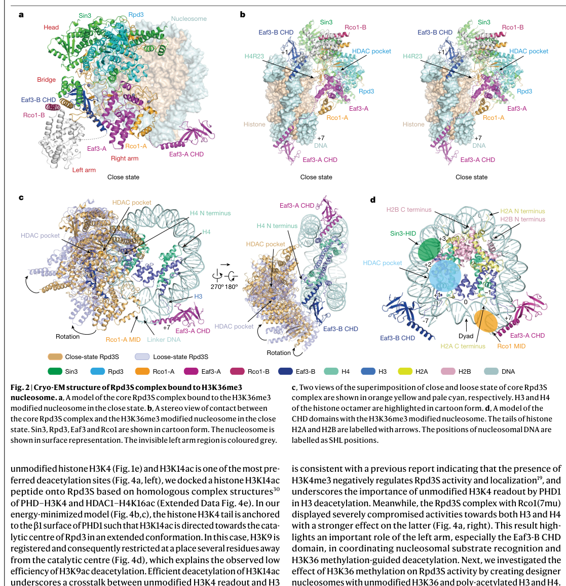

## Question

# Gene Research for Functional Annotation

## ⚠️ CRITICAL: Gene/Protein Identification Context

**BEFORE YOU BEGIN RESEARCH:** You MUST verify you are researching the CORRECT gene/protein. Gene symbols can be ambiguous, especially for less well-characterized genes from non-model organisms.

### Target Gene/Protein Identity (from UniProt):
- **UniProt Accession:** P32561
- **Protein Description:** RecName: Full=Histone deacetylase RPD3; EC=3.5.1.98 {ECO:0000269|PubMed:12110674}; AltName: Full=Transcriptional regulatory protein RPD3;
- **Gene Information:** Name=RPD3; Synonyms=MOF6, REC3, SDI2, SDS6; OrderedLocusNames=YNL330C; ORFNames=N0305;
- **Organism (full):** Saccharomyces cerevisiae (strain ATCC 204508 / S288c) (Baker's yeast).
- **Protein Family:** Belongs to the histone deacetylase family. HD type 1
- **Key Domains:** HDAC_PDAC. (IPR050284); His_deacetylse. (IPR000286); His_deacetylse_1. (IPR003084); His_deacetylse_dom. (IPR023801); His_deacetylse_dom_sf. (IPR037138)

### MANDATORY VERIFICATION STEPS:

1. **Check if the gene symbol "RPD3" matches the protein description above**
2. **Verify the organism is correct:** Saccharomyces cerevisiae (strain ATCC 204508 / S288c) (Baker's yeast).
3. **Check if protein family/domains align with what you find in literature**
4. **If you find literature for a DIFFERENT gene with the same or similar symbol, STOP**

### If Gene Symbol is Ambiguous or You Cannot Find Relevant Literature:

**DO NOT PROCEED WITH RESEARCH ON A DIFFERENT GENE.** Instead:
- State clearly: "The gene symbol 'RPD3' is ambiguous or literature is limited for this specific protein"
- Explain what you found (e.g., "Found extensive literature on a different gene with the same symbol in a different organism")
- Describe the protein based ONLY on the UniProt information provided above
- Suggest that the protein function can be inferred from domain/family information

### Research Target:

Please provide a comprehensive research report on the gene **RPD3** (gene ID: RPD3, UniProt: P32561) in yeast.

The research report should be a detailed narrative explaining the function, biological processes, and localization of the gene product. Citations should be given for all claims.

You should prioritize authoritative reviews and primary scientific literature when conducting research. You can supplement
this with annotations you find in gene/protein databases, but these can be outdated or inaccurate.

We are specifically interested in the primary function of the gene - for enzymes, what reaction is catalyzed, and what is the substrate specificity? For transporters, what is the substrate? For structural proteins or adapters, what is the broader structural role? For signaling molecules, what is the role in the pathway.

We are interested in where in or outside the cell the gene product carries out its function.

We are also interested in the signaling or biochemical pathways in which the gene functions. We are less interested in broad pleiotropic effects, except where these elucidate the precise role.

Include evidence where possible. We are interested in both experimental evidence as well as inference from structure, evolution, or bioinformatic analysis. Precise studies should be prioritized over high-throughput, where available.

## Output

Question: You are an expert researcher providing comprehensive, well-cited information.

Provide detailed information focusing on:
1. Key concepts and definitions with current understanding
2. Recent developments and latest research (prioritize 2023-2024 sources)
3. Current applications and real-world implementations
4. Expert opinions and analysis from authoritative sources
5. Relevant statistics and data from recent studies

Format as a comprehensive research report with proper citations. Include URLs and publication dates where available.
Always prioritize recent, authoritative sources and provide specific citations for all major claims.

# Gene Research for Functional Annotation

## ⚠️ CRITICAL: Gene/Protein Identification Context

**BEFORE YOU BEGIN RESEARCH:** You MUST verify you are researching the CORRECT gene/protein. Gene symbols can be ambiguous, especially for less well-characterized genes from non-model organisms.

### Target Gene/Protein Identity (from UniProt):
- **UniProt Accession:** P32561
- **Protein Description:** RecName: Full=Histone deacetylase RPD3; EC=3.5.1.98 {ECO:0000269|PubMed:12110674}; AltName: Full=Transcriptional regulatory protein RPD3;
- **Gene Information:** Name=RPD3; Synonyms=MOF6, REC3, SDI2, SDS6; OrderedLocusNames=YNL330C; ORFNames=N0305;
- **Organism (full):** Saccharomyces cerevisiae (strain ATCC 204508 / S288c) (Baker's yeast).
- **Protein Family:** Belongs to the histone deacetylase family. HD type 1
- **Key Domains:** HDAC_PDAC. (IPR050284); His_deacetylse. (IPR000286); His_deacetylse_1. (IPR003084); His_deacetylse_dom. (IPR023801); His_deacetylse_dom_sf. (IPR037138)

### MANDATORY VERIFICATION STEPS:

1. **Check if the gene symbol "RPD3" matches the protein description above**
2. **Verify the organism is correct:** Saccharomyces cerevisiae (strain ATCC 204508 / S288c) (Baker's yeast).
3. **Check if protein family/domains align with what you find in literature**
4. **If you find literature for a DIFFERENT gene with the same or similar symbol, STOP**

### If Gene Symbol is Ambiguous or You Cannot Find Relevant Literature:

**DO NOT PROCEED WITH RESEARCH ON A DIFFERENT GENE.** Instead:
- State clearly: "The gene symbol 'RPD3' is ambiguous or literature is limited for this specific protein"
- Explain what you found (e.g., "Found extensive literature on a different gene with the same symbol in a different organism")
- Describe the protein based ONLY on the UniProt information provided above
- Suggest that the protein function can be inferred from domain/family information

### Research Target:

Please provide a comprehensive research report on the gene **RPD3** (gene ID: RPD3, UniProt: P32561) in yeast.

The research report should be a detailed narrative explaining the function, biological processes, and localization of the gene product. Citations should be given for all claims.

You should prioritize authoritative reviews and primary scientific literature when conducting research. You can supplement
this with annotations you find in gene/protein databases, but these can be outdated or inaccurate.

We are specifically interested in the primary function of the gene - for enzymes, what reaction is catalyzed, and what is the substrate specificity? For transporters, what is the substrate? For structural proteins or adapters, what is the broader structural role? For signaling molecules, what is the role in the pathway.

We are interested in where in or outside the cell the gene product carries out its function.

We are also interested in the signaling or biochemical pathways in which the gene functions. We are less interested in broad pleiotropic effects, except where these elucidate the precise role.

Include evidence where possible. We are interested in both experimental evidence as well as inference from structure, evolution, or bioinformatic analysis. Precise studies should be prioritized over high-throughput, where available.

# Research report: **RPD3 / Histone deacetylase Rpd3** (UniProt **P32561**, *Saccharomyces cerevisiae* S288c)

## 0. Target verification (critical identity check)
The literature synthesized here refers specifically to *S. cerevisiae* **Rpd3** (gene **RPD3**, ORF **YNL330C**), a **class I histone deacetylase (HDAC)** that is the catalytic subunit of **Sin3-associated** HDAC complexes **Rpd3L** and **Rpd3S**. Multiple 2023–2024 structural studies explicitly describe “Rpd3 from the budding yeast *Saccharomyces cerevisiae*” as a class I HDAC functioning in these two complexes, matching the UniProt description for **P32561**. (carrozza2024rpd3smeetsthe pages 1-2, patel2023cryoemstructureof pages 1-2)

## 1. Key concepts and definitions (current understanding)

### 1.1 What Rpd3 *is*: a class I, Zn²⁺-dependent lysine deacetylase operating in multi-protein complexes
Rpd3 is a **class I HDAC** and is described as the **founding member** of class I HDACs in yeast. (zhang2023structuralbasisfor pages 1-2)

Mechanistically, its catalytic site is **Zn²⁺-dependent**: a 2023 Rpd3S–nucleosome cryo-EM structure describes a catalytic Zn²⁺ coordinated/stabilized by **D186, H188, and D274** in Rpd3. (zhang2023structuralbasisfor pages 1-2)

**Definition (HDAC reaction):** Rpd3-containing complexes remove acetyl groups from ε-N-acetyl-lysine residues on histone tails (lysine deacetylation), modulating chromatin accessibility and transcriptional output. Functionally, the enzyme acts primarily as part of **Rpd3L** (large) or **Rpd3S** (small) complexes rather than as a solitary enzyme. (patel2023cryoemstructureof pages 1-2, carrozza2024rpd3smeetsthe pages 1-2)

### 1.2 The two principal Rpd3 complexes: Rpd3L vs Rpd3S
A central organizing principle is that Rpd3 forms **two distinct Sin3-associated complexes** that target different genomic regions:

* **Rpd3L (“large”)**: ~**1.2 MDa** (often described as 1–2 MDa), ~**12 subunits**, acting largely at **promoters** and at/near recruitment sites of DNA-bound factors. (zhang2023structuralbasisfor pages 1-2, patel2023cryoemstructureof pages 1-2)
* **Rpd3S (“small”)**: ~**0.5–0.6 MDa**, core **5 subunits**, targeting **transcribed gene bodies** to suppress intragenic/cryptic transcription. (zhang2023structuralbasisfor pages 1-2, patel2023cryoemstructureof pages 1-2, carrozza2024rpd3smeetsthe pages 1-2)

The 2024 expert commentary emphasizes the division of labor: **Rpd3L** is promoter-associated and **Rpd3S** acts behind elongating RNA polymerase II to maintain gene-body chromatin in a deacetylated state. (carrozza2024rpd3smeetsthe pages 1-2)

## 2. Recent developments and latest research (prioritizing 2023–2024)
The period 2023–2024 saw a major leap in mechanistic understanding through multiple cryo-EM structures of Rpd3 complexes on nucleosomal substrates.

### 2.1 Rpd3S–nucleosome structures define multivalent recognition and catalytic positioning
**Rpd3S** is recruited to **H3K36-methylated** nucleosomes and suppresses cryptic initiation. A 2023 Nature study solved cryo-EM structures of Rpd3S free and nucleosome-bound, describing an architecture with **two Eaf3–Rco1 heterodimers** assembled asymmetrically around the catalytic core (Rpd3 + Sin3) and demonstrating multivalent recognition of **H3K36me3** and DNA to position the Rpd3 catalytic center for deacetylation. (guan2023diversemodesof pages 1-2, guan2023diversemodesof pages 2-3)

A complementary 2023 Cell Research cryo-EM structure of the **Rpd3S holoenzyme bound to a nucleosome** (3.7 Å) captured an intact H3 tail threaded into the active site with **H3K18 poised for catalysis** and reported in vitro deacetylation of **H3K18ac**. (zhang2023structuralbasisfor pages 1-2)

Another 2023 study reported a structure of Rpd3S bound to nucleosome (3.1 Å, as described in the publication metadata; mechanistic details in the text include Eaf3 recognition of H3K36me3 via an aromatic cage) and noted that Rpd3S engages chromatin multivalently, helping explain how the complex acts cotranscriptionally on gene bodies. (li2023structureofhistone pages 4-5)

### 2.2 Rpd3L structure provides a framework for complex-level regulation of catalytic access
A 2023 Nature Communications study solved the cryo-EM structure of the **12-subunit Rpd3L complex** (~3.5 Å). It showed Rpd3 is the **sole catalytic subunit** and that the complex is organized as an **asymmetric dimer** in which **two copies each of Sin3, Rpd3, and Ume1** form two lobes. Importantly, it found that the **active site of one Rpd3 is occluded** by a leucine from **Rxt2**, indicating complex-mediated regulation of catalytic accessibility. (patel2023cryoemstructureof pages 1-2)

### 2.3 2024 expert synthesis on Rpd3S–nucleosome engagement
A 2024 Cell Research commentary (Carrozza & Workman) integrated multiple 2023 structural results, emphasizing how reader modules and nucleosome geometry determine where Rpd3S acts and which histone tails are engaged. It highlights that Rpd3S can engage/deacetylate H3 tail residues spanning **K9 to K18**, and reports differential apparent efficiencies at different H3 lysines in biochemical assays (e.g., more efficient deacetylation at H3K23/H3K14 than H3K9/H3K18/H3K27 at lower enzyme amounts). (carrozza2024rpd3smeetsthe pages 2-2)

## 3. Functional annotation: substrates, specificity, localization, pathways

## 3.1 Enzymatic function and substrate specificity
### 3.1.1 Histone substrates and sites (recent evidence)
Recent biochemical assays and structural states support that Rpd3S can act on multiple histone tail acetylation sites:

* **H3 sites assayed**: **H3K9ac, H3K14ac, H3K18ac, H3K23ac, H3K27ac**. (guan2023diversemodesof pages 5-6)
* **H4 sites assayed**: **H4K5ac, H4K8ac, H4K12ac, H4K16ac**. (guan2023diversemodesof pages 5-6)

Structural evidence indicates context-dependent catalytic engagement:

* In one Rpd3S–nucleosome structure, the **H3(1–24) tail** is resolved in the active site and **H3K18** is positioned for catalysis toward the Zn²⁺ center; **H3K9/H3K14** do not fit that specific conformation, implying multiple binding modes/states are required to reach different lysines. (zhang2023structuralbasisfor pages 1-2)
* In a Nature study, multivalent engagement of **H3K36me3** and DNA positions the Rpd3 catalytic center next to the **H4 N-terminal tail** for deacetylation, and an alternative mode directs H3-specific deacetylation. (guan2023diversemodesof pages 1-2)

Thus, current understanding is that **Rpd3S has broad histone-tail deacetylation capability**, with **chromatin context and binding mode** determining whether H3- or H4-tail lysines are preferentially presented to the active site. (guan2023diversemodesof pages 2-3, zhang2023structuralbasisfor pages 1-2)

### 3.1.2 How specificity is achieved: multivalent “reader” guidance and DNA contacts
A key modern insight is that Rpd3’s specificity in vivo is achieved by **non-catalytic subunits** that read histone methyl marks and DNA geometry.

**H3K36me3 readout (Eaf3 chromodomain):**
* Rpd3S is recruited to gene bodies via Set2-dependent **H3K36 methylation**; Eaf3’s chromodomain recognizes H3K36me2/3. (carrozza2024rpd3smeetsthe pages 1-2, yague‐sanz2024shapingthechromatin pages 5-6)
* A 2023 Nature study describes H3K36me3 recognition via an Eaf3 aromatic cage comprising **Y23, Y81, W84, W88**. (guan2023diversemodesof pages 2-3)

**H3K4me0 readout (Rco1 PHD1):**
* Rco1 PHD1 recognizes **unmodified H3K4**, and methylation destabilizes binding, helping restrict Rpd3S activity to coding regions (which tend to be H3K4 hypomethylated relative to promoters). (zhang2023structuralbasisfor pages 1-2)
* The 2023 Nature study measured **Kd ≈ 39 μM** for PHD1 binding H3(1–10). (guan2023diversemodesof pages 2-3)

**DNA contacts and nucleosome geometry:**
Rpd3S engages nucleosomes through multiple DNA interfaces involving Sin3 and reader modules, anchoring the complex and orienting it so histone tails can be threaded into the active site. (zhang2023structuralbasisfor pages 1-2, guan2023diversemodesof pages 2-3)

## 3.2 Complex membership and architecture (Rpd3S and Rpd3L)

### Rpd3S composition/stoichiometry
Rpd3S comprises the core catalytic and scaffold components plus chromatin-binding subunits:

* Core: **Rpd3 + Sin3 + Ume1** (shared with Rpd3L). (zhang2023structuralbasisfor pages 1-2, carrozza2024rpd3smeetsthe pages 1-2)
* Rpd3S-specific: **Eaf3 + Rco1** (chromatin binding/readout). (zhang2023structuralbasisfor pages 1-2, carrozza2024rpd3smeetsthe pages 1-2)

A 2023 report on the complete Rpd3S–nucleosome assembly describes a nucleosome-bound complex with **1× Sin3, 1× Rpd3, 1× Ume1, and 2× each of Eaf3 and Rco1**. (markert2023structureofthea pages 1-2)

### Rpd3L composition/architecture
Rpd3L is a larger promoter-associated complex; a 2023 cryo-EM study describes it as a **12-subunit** complex where **Sin3 serves as principal scaffold** integrating the sole catalytic subunit **Rpd3** and multiple structural subunits (including, among others, **Rxt2, Pho23, Rxt3, Sap30, Sds3, Dep1**). (patel2023cryoemstructureof pages 1-2)

## 3.3 Cellular localization and biological processes

### 3.3.1 Gene-body function: suppression of cryptic transcription by Rpd3S
Rpd3S is targeted to **transcribed regions** and functions to **suppress cryptic/spurious intragenic transcription initiation**, restoring deacetylated chromatin behind elongating RNA polymerase II. (carrozza2024rpd3smeetsthe pages 1-2)

The mechanistic model is: Set2 deposits **H3K36me3** during elongation → Eaf3 reads H3K36me3 → Rpd3S is recruited and oriented on nucleosomes → deacetylation of H3/H4 tails reduces inappropriate initiation within ORFs. (yague‐sanz2024shapingthechromatin pages 5-6, guan2023diversemodesof pages 2-3)

### 3.3.2 Promoter-associated repression/fine-tuning by Rpd3L
Rpd3L is described as acting primarily at **promoters**, performing localized deacetylation near recruitment sites of DNA-binding factors. (patel2023cryoemstructureof pages 1-2)

A yeast review notes Rpd3L recruitment can involve association with sequence-specific factors and/or interactions with promoter marks such as **H3K4me3**, whereas Rpd3S is recruited via **H3K36 methylation** in gene bodies. (yague‐sanz2024shapingthechromatin pages 5-6)

## 4. Current applications and real-world implementations

### 4.1 Yeast Rpd3 as a model system for class I HDAC biology
Rpd3 is repeatedly framed as a **prototypical/founding** class I HDAC, enabling yeast to serve as a tractable model to study complex-level HDAC regulation that is conserved across eukaryotes. (zhang2023structuralbasisfor pages 1-2, patel2023cryoemstructureof pages 1-2)

### 4.2 Pharmacology and inhibitor testing in a native complex context
A key “real-world implementation” of the yeast system is using purified native complexes to test inhibitors and understand accessibility/complex-specific regulation:

* The 2023 Rpd3L structural paper reports that purified Rpd3L is enzymatically active and **responsive to known inhibitors such as SAHA (vorinostat)**, demonstrating assayability of the native complex. (patel2023cryoemstructureof pages 1-2)
* The same paper explicitly states the structure provides a foundation for “the discovery of **HDAC complex-specific inhibitors**,” highlighting a modern direction: targeting not only the active site but also complex-specific regulatory interfaces and conformations (e.g., a regulated/occluded active site). (patel2023cryoemstructureof pages 1-2)

## 5. Expert opinions and authoritative analysis (2023–2024 emphasis)

* A 2023 Cell Research letter states that **class I HDACs are promising targets for epigenetic therapies** and positions yeast Rpd3 as the founding class I HDAC, underscoring translational relevance of mechanistic insights from yeast. (zhang2023structuralbasisfor pages 1-2)
* A 2024 Cell Research expert commentary argues that recent cryo-EM structures clarify how Rpd3S uses multivalent chromatin readout and multiple binding/catalytic configurations to reach different histone-tail lysines and maintain gene-body chromatin states. (carrozza2024rpd3smeetsthe pages 1-2)
* A 2023 Nature Communications Rpd3L structure emphasizes that complex architecture and regulated active-site accessibility provide a framework for **complex-specific inhibitor discovery**, a major current theme in HDAC pharmacology (moving beyond pan-HDAC active-site inhibitors). (patel2023cryoemstructureof pages 1-2)

## 6. Recent statistics and quantitative data points (from recent studies)
Key reported quantitative details useful for functional annotation include:

* **Complex size and composition**: Rpd3L ~**1.2 MDa**, ~**12 subunits**; Rpd3S ~**0.5–0.6 MDa**, core **5 subunits**. (zhang2023structuralbasisfor pages 1-2, patel2023cryoemstructureof pages 1-2)
* **Cryo-EM resolution (Rpd3S–nucleosome)**: **3.7 Å** average resolution in a 2023 study capturing H3 tail engagement. (zhang2023structuralbasisfor pages 1-2)
* **Cryo-EM resolution (Rpd3L)**: nominal **3.5 Å** in a 2023 study; Rpd3L is an asymmetric dimer with two copies each of Sin3/Rpd3/Ume1 and an occluded active site in one lobe. (patel2023cryoemstructureof pages 1-2)
* **Reader binding affinity**: Rco1 **PHD1** binds H3(1–10) with **Kd ≈ 39 μM**. (guan2023diversemodesof pages 2-3)
* **Structural distances (tail-to-active-site, one structure)**: in an Rpd3S–nucleosome structure, resolved H3 and H4 N-terminal tails are ~**54 Å** and ~**31 Å** from the Rpd3 active center, consistent with flexibility/multiple binding states being needed for catalysis. (li2023structureofhistone pages 4-5)
* **Relative deacetylation efficiencies (qualitative quantitative)**: a 2024 commentary reports that, at lower Rpd3S amounts, deacetylation was more efficient on **H3K23 and H3K14** than on **H3K9, H3K18, and H3K27** in biochemical assays. (carrozza2024rpd3smeetsthe pages 2-2)

## 7. Visual evidence (complex architecture)
The overall architecture of **Rpd3S bound to an H3K36me3 nucleosome**—including labeled subunits (Sin3, Rpd3, Eaf3, Rco1) and the nucleosome—is illustrated in a cryo-EM figure from Guan et al. 2023. (guan2023diversemodesof media 4647e40e)

## Summary table (annotation-ready)
| Aspect | Current understanding | Key supporting 2023–2024 sources (with DOI/URL) | Notes/quantitative details |
|---|---|---|---|
| Enzyme class / reaction | Rpd3 (UniProt P32561; YNL330C) is the budding yeast founding **class I, Zn²⁺-dependent histone deacetylase** that catalyzes hydrolytic removal of ε-N-acetyl groups from lysine residues on histones, functioning as the catalytic subunit of Sin3-associated HDAC complexes. It acts in both Rpd3S and Rpd3L chromatin complexes rather than as a free enzyme. (guan2023diversemodesof pages 1-2, patel2023cryoemstructureof pages 1-2, zhang2023structuralbasisfor pages 1-2) | Guan et al., 2023, **Nature**. DOI: 10.1038/s41586-023-06349-1. https://doi.org/10.1038/s41586-023-06349-1 (guan2023diversemodesof pages 1-2); Patel et al., 2023, **Nat Commun**. DOI: 10.1038/s41467-023-38687-z. https://doi.org/10.1038/s41467-023-38687-z (patel2023cryoemstructureof pages 1-2); Zhang et al., 2023, **Cell Research**. DOI: 10.1038/s41422-023-00884-2. https://doi.org/10.1038/s41422-023-00884-2 (zhang2023structuralbasisfor pages 1-2) | Active-site Zn²⁺ is structurally stabilized/coordinated by **D186, H188, D274** in the 2023 Rpd3S cryo-EM study. Rpd3L is ~**1.2 MDa**; Rpd3S is ~**0.6 MDa**. (zhang2023structuralbasisfor pages 1-2) |
| Rpd3S complex composition / stoichiometry / targeting logic | **Rpd3S** is the gene-body HDAC complex specialized for transcribed chromatin. Core composition: **Rpd3, Sin3, Ume1** plus chromatin-targeting subunits **Eaf3 and Rco1**. Recent structures show a stoichiometry of **1× Rpd3, 1× Sin3, 1× Ume1, 2× Eaf3, 2× Rco1** in the nucleosome-bound assembly. Recruitment/targeting is driven by multivalent readout of **H3K36me3** and **H3K4me0** together with nucleosomal/linker DNA contacts. Eaf3 chromodomain reads H3K36 methylation, while Rco1 PHD1 prefers unmodified H3K4, helping bias Rpd3S toward coding regions. (markert2023structureofthea pages 1-2, guan2023diversemodesof pages 1-2, zhang2023structuralbasisfor pages 1-2, guan2023diversemodesof pages 2-3) | Markert et al., 2023, **Nat Commun**. DOI: 10.1038/s41467-023-43968-8. https://doi.org/10.1038/s41467-023-43968-8 (markert2023structureofthea pages 1-2); Guan et al., 2023. DOI: 10.1038/s41586-023-06349-1. https://doi.org/10.1038/s41586-023-06349-1 (guan2023diversemodesof pages 1-2); Zhang et al., 2023. DOI: 10.1038/s41422-023-00884-2. https://doi.org/10.1038/s41422-023-00884-2 (zhang2023structuralbasisfor pages 1-2); Li et al., 2023, **Nat Struct Mol Biol**. DOI: 10.1038/s41594-023-01121-5. https://doi.org/10.1038/s41594-023-01121-5 (li2023structureofhistone pages 4-5) | Eaf3 CHD aromatic cage residues recognizing H3K36me3: **Y23, Y81, W84, W88**. Rco1 PHD1 binds H3(1–10) with **Kd ≈ 39 μM** and is destabilized by H3K4 methylation. The Sin3 scaffold and Rco1/Eaf3 also contact linker/nucleosomal DNA, enabling orientation over the nucleosome. (li2023structureofhistone pages 4-5, guan2023diversemodesof pages 2-3, zhang2023structuralbasisfor pages 1-2) |
| Rpd3L complex composition / promoter targeting | **Rpd3L** is the larger promoter-proximal Sin3-associated deacetylase complex that performs localized deacetylation at or near recruitment sites of DNA-binding factors. It shares the catalytic/scaffold core (**Rpd3, Sin3, Ume1**) with Rpd3S but contains Rpd3L-specific accessory subunits such as **Pho23, Rxt2, Rxt3, Sap30, Sds3, Dep1** (and related promoter-recruitment factors noted in recent literature). Rpd3L is targeted primarily to **promoters**, often via transcription factors and/or promoter chromatin marks including **H3K4me3** readout by Pho23-linked mechanisms. (patel2023cryoemstructureof pages 1-2, carrozza2024rpd3smeetsthe pages 1-2, dong2023structuralbasisof pages 1-2, yague‐sanz2024shapingthechromatin pages 5-6) | Patel et al., 2023. DOI: 10.1038/s41467-023-38687-z. https://doi.org/10.1038/s41467-023-38687-z (patel2023cryoemstructureof pages 1-2); Carrozza & Workman, 2024, **Cell Research**. DOI: 10.1038/s41422-023-00899-9. https://doi.org/10.1038/s41422-023-00899-9 (carrozza2024rpd3smeetsthe pages 1-2); Dong et al., 2023, **Cell Research**. DOI: 10.1038/s41422-023-00869-1. https://doi.org/10.1038/s41422-023-00869-1 (dong2023structuralbasisof pages 1-2); Yague-Sanz, 2024, **Yeast**. DOI: 10.1002/yea.3921. https://doi.org/10.1002/yea.3921 (yague‐sanz2024shapingthechromatin pages 5-6) | Structural work indicates an asymmetric dimeric Rpd3L architecture with **two copies each of Rpd3, Sin3, and Ume1** in the core of the 12-subunit complex; one Rpd3 active site can be occluded by **Rxt2**, suggesting regulated catalytic access. (patel2023cryoemstructureof pages 1-2) |
| Known / assayed histone substrate sites and preferences | Recent structural/biochemical studies show that Rpd3S deacetylates multiple acetyl-lysine sites on **H3 and H4 tails**. Assayed H3 sites include **H3K9ac, H3K14ac, H3K18ac, H3K23ac, H3K27ac**; assayed H4 sites include **H4K5ac, H4K8ac, H4K12ac, H4K16ac**. Distinct catalytic states suggest context-dependent substrate use: some structures position Rpd3S for **H4-tail deacetylation**, whereas others capture an **H3-tail** entering the active site with **H3K18** poised for catalysis. (zhang2023structuralbasisfor pages 1-2, carrozza2024rpd3smeetsthe pages 2-2, guan2023diversemodesof pages 5-6) | Zhang et al., 2023. DOI: 10.1038/s41422-023-00884-2. https://doi.org/10.1038/s41422-023-00884-2 (zhang2023structuralbasisfor pages 1-2); Guan et al., 2023. DOI: 10.1038/s41586-023-06349-1. https://doi.org/10.1038/s41586-023-06349-1 (guan2023diversemodesof pages 5-6); Carrozza & Workman, 2024. DOI: 10.1038/s41422-023-00899-9. https://doi.org/10.1038/s41422-023-00899-9 (carrozza2024rpd3smeetsthe pages 2-2); Dong et al., 2023. DOI: 10.1038/s41422-023-00869-1. https://doi.org/10.1038/s41422-023-00869-1 (dong2023structuralbasisof pages 1-2) | In one cryo-EM state, **H3K18** is oriented toward catalytic Zn²⁺; **H3K9/H3K14** were not accommodated in that exact conformation, showing substrate-state dependence. Commentary summarizing biochemical assays notes lower enzyme amounts deacetylated **H3K23/H3K14** more efficiently than **H3K9/H3K18/H3K27**. Recent structures also indicate Rpd3S can sample multiple tails and catalytic modes. (zhang2023structuralbasisfor pages 1-2, carrozza2024rpd3smeetsthe pages 2-2, dong2023structuralbasisof pages 1-2) |
| Mechanistic / structural highlights | 2023 cryo-EM studies transformed understanding of Rpd3 by revealing how noncatalytic subunits specify chromatin engagement. Sin3 wraps around catalytic Rpd3 and contributes key DNA-binding surfaces; Eaf3 and Rco1 form duplicated reader modules that contact histone marks and DNA. Rpd3S can adopt multiple nucleosome-binding states (“close,” “loose,” alternative deacetylation, linker-tightening), explaining how the enzyme reaches different histone tails and even engages neighboring nucleosomes. (zhang2023structuralbasisfor pages 1-2, li2023structureofhistone pages 4-5, guan2023diversemodesof pages 2-3, guan2023diversemodesof media 4647e40e) | Zhang et al., 2023. DOI: 10.1038/s41422-023-00884-2. https://doi.org/10.1038/s41422-023-00884-2 (zhang2023structuralbasisfor pages 1-2); Li et al., 2023. DOI: 10.1038/s41594-023-01121-5. https://doi.org/10.1038/s41594-023-01121-5 (li2023structureofhistone pages 4-5); Guan et al., 2023. DOI: 10.1038/s41586-023-06349-1. https://doi.org/10.1038/s41586-023-06349-1 (guan2023diversemodesof pages 2-3); Figure/context summary from Guan et al. overall model (guan2023diversemodesof media 4647e40e) | Structural details include: **3.7 Å** Rpd3S–nucleosome structure (zhang2023structuralbasisfor pages 1-2); **3.5 Å** alternative Rpd3S structures including linker-tightening states (dong2023structuralbasisof pages 1-2); **3.1 Å** nucleosome-bound structure in another study (li2023structureofhistone pages 4-5). Eaf3 CHD makes aromatic-cage recognition of H3K36me3, while Rco1 PHD1 enforces H3K4me0 preference; Sin3 basic surfaces anchor DNA. (zhang2023structuralbasisfor pages 1-2, li2023structureofhistone pages 4-5, guan2023diversemodesof pages 2-3) |
| Cellular localization on chromatin / biological role | Functional division of labor is now clear: **Rpd3S acts mainly across transcribed gene bodies**, where it is recruited cotranscriptionally via Set2-linked **H3K36me3** and associated with elongating RNAPII to restore a deacetylated chromatin state and suppress **cryptic/spurious intragenic transcription**. **Rpd3L acts mainly at promoters**, where it mediates localized repression or fine-tuning near recruitment sites of transcription factors and promoter marks. (carrozza2024rpd3smeetsthe pages 1-2, dong2023structuralbasisof pages 1-2, yague‐sanz2024shapingthechromatin pages 5-6) | Carrozza & Workman, 2024. DOI: 10.1038/s41422-023-00899-9. https://doi.org/10.1038/s41422-023-00899-9 (carrozza2024rpd3smeetsthe pages 1-2); Dong et al., 2023. DOI: 10.1038/s41422-023-00869-1. https://doi.org/10.1038/s41422-023-00869-1 (dong2023structuralbasisof pages 1-2); Yague-Sanz, 2024. DOI: 10.1002/yea.3921. https://doi.org/10.1002/yea.3921 (yague‐sanz2024shapingthechromatin pages 5-6) | Gene-body acetylation accumulates when Rpd3S is lost, consistent with its elongation-coupled deacetylase role. Rpd3S also shows possible **di-nucleosome preference** and linker-length dependence in recent work, supporting action on chromatin behind RNAPII rather than isolated peptides. (guan2023diversemodesof pages 1-2, carrozza2024rpd3smeetsthe pages 2-2) |

*Table: This table summarizes the current functional annotation of Saccharomyces cerevisiae Rpd3 (UniProt P32561), emphasizing 2023–2024 structural and mechanistic advances. It highlights catalytic activity, Rpd3S/Rpd3L complex biology, substrate specificity, chromatin localization, and key quantitative details useful for annotation.*

## References (URLs and publication dates)
Key 2023–2024 sources used heavily in this report:

1. Patel AB et al. **Cryo-EM structure of the Saccharomyces cerevisiae Rpd3L histone deacetylase complex**. *Nature Communications*. **May 2023**. https://doi.org/10.1038/s41467-023-38687-z (patel2023cryoemstructureof pages 1-2)
2. Guan H et al. **Diverse modes of H3K36me3-guided nucleosomal deacetylation by Rpd3S**. *Nature*. **Jul 2023**. https://doi.org/10.1038/s41586-023-06349-1 (guan2023diversemodesof pages 1-2)
3. Li W et al. **Structure of histone deacetylase complex Rpd3S bound to nucleosome**. *Nature Structural & Molecular Biology*. **Oct 2023**. https://doi.org/10.1038/s41594-023-01121-5 (li2023structureofhistone pages 4-5)
4. Zhang Y et al. **Structural basis for nucleosome binding and catalysis by the yeast Rpd3S/HDAC holoenzyme**. *Cell Research*. **Oct 2023**. https://doi.org/10.1038/s41422-023-00884-2 (zhang2023structuralbasisfor pages 1-2)
5. Carrozza MJ, Workman JL. **Rpd3S meets the nucleosome**. *Cell Research*. **Nov 2024**. https://doi.org/10.1038/s41422-023-00899-9 (carrozza2024rpd3smeetsthe pages 1-2)
6. Yague-Sanz C. **Shaping the chromatin landscape at rRNA and tRNA genes, an emerging new role for RNA polymerase II transcription?** *Yeast*. **Dec 2024**. https://doi.org/10.1002/yea.3921 (yague‐sanz2024shapingthechromatin pages 5-6)

References

1. (carrozza2024rpd3smeetsthe pages 1-2): Michael J. Carrozza and Jerry L. Workman. Rpd3s meets the nucleosome. Cell research, 34:1-2, Nov 2024. URL: https://doi.org/10.1038/s41422-023-00899-9, doi:10.1038/s41422-023-00899-9. This article has 2 citations and is from a domain leading peer-reviewed journal.

2. (patel2023cryoemstructureof pages 1-2): Avinash B. Patel, Jinkang Qing, Kelly H. Tam, Sara Zaman, Maria Luiso, Ishwar Radhakrishnan, and Yuan He. Cryo-em structure of the saccharomyces cerevisiae rpd3l histone deacetylase complex. Nature Communications, May 2023. URL: https://doi.org/10.1038/s41467-023-38687-z, doi:10.1038/s41467-023-38687-z. This article has 20 citations and is from a highest quality peer-reviewed journal.

3. (zhang2023structuralbasisfor pages 1-2): Yueyue Zhang, Mengxue Xu, Po Wang, Jiahui Zhou, Guangxian Wang, Shuailong Han, Gang Cai, and Xuejuan Wang. Structural basis for nucleosome binding and catalysis by the yeast rpd3s/hdac holoenzyme. Cell Research, 33:971-974, Oct 2023. URL: https://doi.org/10.1038/s41422-023-00884-2, doi:10.1038/s41422-023-00884-2. This article has 12 citations and is from a domain leading peer-reviewed journal.

4. (guan2023diversemodesof pages 1-2): Haipeng Guan, Pei Wang, Pei Zhang, Chun Ruan, Yutian Ou, Bo Peng, Xiangdong Zheng, Jianlin Lei, Bing Li, Chuangye Yan, and Haitao Li. Diverse modes of h3k36me3-guided nucleosomal deacetylation by rpd3s. Nature, 620:669-675, Jul 2023. URL: https://doi.org/10.1038/s41586-023-06349-1, doi:10.1038/s41586-023-06349-1. This article has 40 citations and is from a highest quality peer-reviewed journal.

5. (guan2023diversemodesof pages 2-3): Haipeng Guan, Pei Wang, Pei Zhang, Chun Ruan, Yutian Ou, Bo Peng, Xiangdong Zheng, Jianlin Lei, Bing Li, Chuangye Yan, and Haitao Li. Diverse modes of h3k36me3-guided nucleosomal deacetylation by rpd3s. Nature, 620:669-675, Jul 2023. URL: https://doi.org/10.1038/s41586-023-06349-1, doi:10.1038/s41586-023-06349-1. This article has 40 citations and is from a highest quality peer-reviewed journal.

6. (li2023structureofhistone pages 4-5): Wulong Li, Hengjun Cui, Zhimin Lu, and Haibo Wang. Structure of histone deacetylase complex rpd3s bound to nucleosome. Nature structural & molecular biology, 30:1893-1901, Oct 2023. URL: https://doi.org/10.1038/s41594-023-01121-5, doi:10.1038/s41594-023-01121-5. This article has 18 citations and is from a highest quality peer-reviewed journal.

7. (carrozza2024rpd3smeetsthe pages 2-2): Michael J. Carrozza and Jerry L. Workman. Rpd3s meets the nucleosome. Cell research, 34:1-2, Nov 2024. URL: https://doi.org/10.1038/s41422-023-00899-9, doi:10.1038/s41422-023-00899-9. This article has 2 citations and is from a domain leading peer-reviewed journal.

8. (guan2023diversemodesof pages 5-6): Haipeng Guan, Pei Wang, Pei Zhang, Chun Ruan, Yutian Ou, Bo Peng, Xiangdong Zheng, Jianlin Lei, Bing Li, Chuangye Yan, and Haitao Li. Diverse modes of h3k36me3-guided nucleosomal deacetylation by rpd3s. Nature, 620:669-675, Jul 2023. URL: https://doi.org/10.1038/s41586-023-06349-1, doi:10.1038/s41586-023-06349-1. This article has 40 citations and is from a highest quality peer-reviewed journal.

9. (yague‐sanz2024shapingthechromatin pages 5-6): Carlo Yague‐Sanz. Shaping the chromatin landscape at rrna and trna genes, an emerging new role for rna polymerase ii transcription? Yeast, 41:135-147, Dec 2024. URL: https://doi.org/10.1002/yea.3921, doi:10.1002/yea.3921. This article has 7 citations and is from a peer-reviewed journal.

10. (markert2023structureofthea pages 1-2): Jonathan W. Markert, Seychelle M. Vos, and Lucas Farnung. Structure of the complete s. cerevisiae rpd3s-nucleosome complex. bioRxiv, Aug 2023. URL: https://doi.org/10.1101/2023.08.03.551877, doi:10.1101/2023.08.03.551877. This article has 6 citations.

11. (guan2023diversemodesof media 4647e40e): Haipeng Guan, Pei Wang, Pei Zhang, Chun Ruan, Yutian Ou, Bo Peng, Xiangdong Zheng, Jianlin Lei, Bing Li, Chuangye Yan, and Haitao Li. Diverse modes of h3k36me3-guided nucleosomal deacetylation by rpd3s. Nature, 620:669-675, Jul 2023. URL: https://doi.org/10.1038/s41586-023-06349-1, doi:10.1038/s41586-023-06349-1. This article has 40 citations and is from a highest quality peer-reviewed journal.

12. (dong2023structuralbasisof pages 1-2): Shuqi Dong, Huadong Li, Meilin Wang, Nadia Rasheed, Binqian Zou, Xijie Gao, Jiali Guan, Weijie Li, Jiale Zhang, Chi Wang, Ningkun Zhou, Xue Shi, Mei Li, Min Zhou, Junfeng Huang, He Li, Ying Zhang, Koon Ho Wong, Xiaofei Zhang, William Chong Hang Chao, and Jun He. Structural basis of nucleosome deacetylation and dna linker tightening by rpd3s histone deacetylase complex. Cell Research, 33:790-801, Sep 2023. URL: https://doi.org/10.1038/s41422-023-00869-1, doi:10.1038/s41422-023-00869-1. This article has 12 citations and is from a domain leading peer-reviewed journal.

## Artifacts

- [Edison artifact artifact-00](RPD3-deep-research-falcon_artifacts/artifact-00.md)

## Citations

1. zhang2023structuralbasisfor pages 1-2
2. li2023structureofhistone pages 4-5
3. patel2023cryoemstructureof pages 1-2
4. guan2023diversemodesof pages 5-6
5. guan2023diversemodesof pages 1-2
6. guan2023diversemodesof pages 2-3
7. markert2023structureofthea pages 1-2
8. dong2023structuralbasisof pages 1-2
9. https://doi.org/10.1038/s41586-023-06349-1
10. https://doi.org/10.1038/s41467-023-38687-z
11. https://doi.org/10.1038/s41422-023-00884-2
12. https://doi.org/10.1038/s41467-023-43968-8
13. https://doi.org/10.1038/s41594-023-01121-5
14. https://doi.org/10.1038/s41422-023-00899-9
15. https://doi.org/10.1038/s41422-023-00869-1
16. https://doi.org/10.1002/yea.3921
17. https://doi.org/10.1038/s41422-023-00899-9,
18. https://doi.org/10.1038/s41467-023-38687-z,
19. https://doi.org/10.1038/s41422-023-00884-2,
20. https://doi.org/10.1038/s41586-023-06349-1,
21. https://doi.org/10.1038/s41594-023-01121-5,
22. https://doi.org/10.1002/yea.3921,
23. https://doi.org/10.1101/2023.08.03.551877,
24. https://doi.org/10.1038/s41422-023-00869-1,