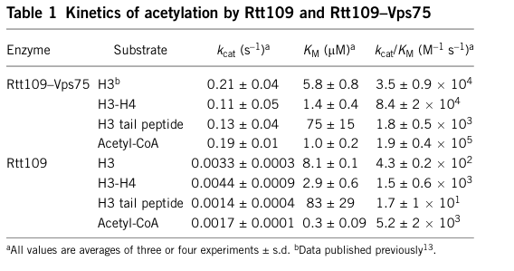

## Question

# Gene Research for Functional Annotation

## ⚠️ CRITICAL: Gene/Protein Identification Context

**BEFORE YOU BEGIN RESEARCH:** You MUST verify you are researching the CORRECT gene/protein. Gene symbols can be ambiguous, especially for less well-characterized genes from non-model organisms.

### Target Gene/Protein Identity (from UniProt):
- **UniProt Accession:** Q07794
- **Protein Description:** RecName: Full=Histone acetyltransferase RTT109; EC=2.3.1.48 {ECO:0000269|PubMed:17272722, ECO:0000269|PubMed:17369253, ECO:0000269|PubMed:17690098, ECO:0000269|PubMed:18707894, ECO:0000269|PubMed:21256037, ECO:0000269|PubMed:29300933, ECO:0000269|PubMed:31194870}; AltName: Full=Regulator of Ty1 transposition protein 109;
- **Gene Information:** Name=RTT109 {ECO:0000303|PubMed:17046836}; Synonyms=KAT11 {ECO:0000303|PubMed:18568037}, KIM2, REM50; OrderedLocusNames=YLL002W; ORFNames=L1377;
- **Organism (full):** Saccharomyces cerevisiae (strain ATCC 204508 / S288c) (Baker's yeast).
- **Protein Family:** Belongs to the RTT109 family. .
- **Key Domains:** HAT_RTT109-like. (IPR051236); Histone_AcTrfase_Rtt109/CBP. (IPR013178); Rtt109. (IPR016849); HAT_KAT11 (PF08214)

### MANDATORY VERIFICATION STEPS:

1. **Check if the gene symbol "RTT109" matches the protein description above**
2. **Verify the organism is correct:** Saccharomyces cerevisiae (strain ATCC 204508 / S288c) (Baker's yeast).
3. **Check if protein family/domains align with what you find in literature**
4. **If you find literature for a DIFFERENT gene with the same or similar symbol, STOP**

### If Gene Symbol is Ambiguous or You Cannot Find Relevant Literature:

**DO NOT PROCEED WITH RESEARCH ON A DIFFERENT GENE.** Instead:
- State clearly: "The gene symbol 'RTT109' is ambiguous or literature is limited for this specific protein"
- Explain what you found (e.g., "Found extensive literature on a different gene with the same symbol in a different organism")
- Describe the protein based ONLY on the UniProt information provided above
- Suggest that the protein function can be inferred from domain/family information

### Research Target:

Please provide a comprehensive research report on the gene **RTT109** (gene ID: RTT109, UniProt: Q07794) in yeast.

The research report should be a detailed narrative explaining the function, biological processes, and localization of the gene product. Citations should be given for all claims.

You should prioritize authoritative reviews and primary scientific literature when conducting research. You can supplement
this with annotations you find in gene/protein databases, but these can be outdated or inaccurate.

We are specifically interested in the primary function of the gene - for enzymes, what reaction is catalyzed, and what is the substrate specificity? For transporters, what is the substrate? For structural proteins or adapters, what is the broader structural role? For signaling molecules, what is the role in the pathway.

We are interested in where in or outside the cell the gene product carries out its function.

We are also interested in the signaling or biochemical pathways in which the gene functions. We are less interested in broad pleiotropic effects, except where these elucidate the precise role.

Include evidence where possible. We are interested in both experimental evidence as well as inference from structure, evolution, or bioinformatic analysis. Precise studies should be prioritized over high-throughput, where available.

## Output

Question: You are an expert researcher providing comprehensive, well-cited information.

Provide detailed information focusing on:
1. Key concepts and definitions with current understanding
2. Recent developments and latest research (prioritize 2023-2024 sources)
3. Current applications and real-world implementations
4. Expert opinions and analysis from authoritative sources
5. Relevant statistics and data from recent studies

Format as a comprehensive research report with proper citations. Include URLs and publication dates where available.
Always prioritize recent, authoritative sources and provide specific citations for all major claims.

# Gene Research for Functional Annotation

## ⚠️ CRITICAL: Gene/Protein Identification Context

**BEFORE YOU BEGIN RESEARCH:** You MUST verify you are researching the CORRECT gene/protein. Gene symbols can be ambiguous, especially for less well-characterized genes from non-model organisms.

### Target Gene/Protein Identity (from UniProt):
- **UniProt Accession:** Q07794
- **Protein Description:** RecName: Full=Histone acetyltransferase RTT109; EC=2.3.1.48 {ECO:0000269|PubMed:17272722, ECO:0000269|PubMed:17369253, ECO:0000269|PubMed:17690098, ECO:0000269|PubMed:18707894, ECO:0000269|PubMed:21256037, ECO:0000269|PubMed:29300933, ECO:0000269|PubMed:31194870}; AltName: Full=Regulator of Ty1 transposition protein 109;
- **Gene Information:** Name=RTT109 {ECO:0000303|PubMed:17046836}; Synonyms=KAT11 {ECO:0000303|PubMed:18568037}, KIM2, REM50; OrderedLocusNames=YLL002W; ORFNames=L1377;
- **Organism (full):** Saccharomyces cerevisiae (strain ATCC 204508 / S288c) (Baker's yeast).
- **Protein Family:** Belongs to the RTT109 family. .
- **Key Domains:** HAT_RTT109-like. (IPR051236); Histone_AcTrfase_Rtt109/CBP. (IPR013178); Rtt109. (IPR016849); HAT_KAT11 (PF08214)

### MANDATORY VERIFICATION STEPS:

1. **Check if the gene symbol "RTT109" matches the protein description above**
2. **Verify the organism is correct:** Saccharomyces cerevisiae (strain ATCC 204508 / S288c) (Baker's yeast).
3. **Check if protein family/domains align with what you find in literature**
4. **If you find literature for a DIFFERENT gene with the same or similar symbol, STOP**

### If Gene Symbol is Ambiguous or You Cannot Find Relevant Literature:

**DO NOT PROCEED WITH RESEARCH ON A DIFFERENT GENE.** Instead:
- State clearly: "The gene symbol 'RTT109' is ambiguous or literature is limited for this specific protein"
- Explain what you found (e.g., "Found extensive literature on a different gene with the same symbol in a different organism")
- Describe the protein based ONLY on the UniProt information provided above
- Suggest that the protein function can be inferred from domain/family information

### Research Target:

Please provide a comprehensive research report on the gene **RTT109** (gene ID: RTT109, UniProt: Q07794) in yeast.

The research report should be a detailed narrative explaining the function, biological processes, and localization of the gene product. Citations should be given for all claims.

You should prioritize authoritative reviews and primary scientific literature when conducting research. You can supplement
this with annotations you find in gene/protein databases, but these can be outdated or inaccurate.

We are specifically interested in the primary function of the gene - for enzymes, what reaction is catalyzed, and what is the substrate specificity? For transporters, what is the substrate? For structural proteins or adapters, what is the broader structural role? For signaling molecules, what is the role in the pathway.

We are interested in where in or outside the cell the gene product carries out its function.

We are also interested in the signaling or biochemical pathways in which the gene functions. We are less interested in broad pleiotropic effects, except where these elucidate the precise role.

Include evidence where possible. We are interested in both experimental evidence as well as inference from structure, evolution, or bioinformatic analysis. Precise studies should be prioritized over high-throughput, where available.

## Research report: *Saccharomyces cerevisiae* RTT109 (UniProt Q07794) — functional annotation and current evidence

### 0) Target verification (mandatory)
The research target is **RTT109** from *Saccharomyces cerevisiae* (S288c), encoding **histone acetyltransferase Rtt109** (UniProt **Q07794**; EC **2.3.1.48**). Key mechanistic primary literature explicitly identifies *S. cerevisiae* **Rtt109** as the enzyme responsible for histone H3 lysine-56 acetylation (H3K56ac) and describes its functional coupling to histone chaperones **Asf1** and **Vps75**, matching the UniProt entry and its HAT_RTT109 family assignment. (tsubota2007histoneh3k56acetylation pages 2-4, driscoll2007yeastrtt109promotes pages 2-4, berndsen2008molecularfunctionsof pages 1-2)

### 1) Key concepts and definitions (current understanding)

#### 1.1 Rtt109 is a fungal histone lysine acetyltransferase (KAT)
Rtt109 catalyzes **acetyl transfer from acetyl‑CoA to the ε‑amine of lysine residues on histone H3**, producing acetyl‑lysine and CoA. In budding yeast, its defining and dominant reaction is acetylation of **histone H3 lysine 56 (H3K56ac)**. Loss of RTT109 causes “absence of detectable K56 acetylation” in vivo, establishing Rtt109 as essential for H3K56ac. (driscoll2007yeastrtt109promotes pages 2-4)

#### 1.2 H3K56ac as a replication-coupled “new histone” mark
H3K56ac is strongly linked to **newly synthesized histone H3** and **S-phase/replication-associated chromatin**. It is installed on new histones during S phase and is later removed by deacetylases, making it a temporally regulated mark that couples histone supply to replication-coupled chromatin assembly and maturation. (duan2025h3k56acetylationregulates pages 1-2, karri2024defectivetransferof pages 1-2)

#### 1.3 Chaperone-dependent KAT activity (Asf1/Vps75)
A defining feature of Rtt109 is that efficient H3K56 acetylation requires **histone chaperone cofactors**. Rtt109 forms functional HAT complexes with **Asf1** or **Vps75**; these are **functionally distinct**, with Asf1-linked activity being particularly important for genotoxic resistance. (tsubota2007histoneh3k56acetylation pages 2-4, tsubota2007histoneh3k56acetylation pages 1-2)

### 2) Biochemical function: reaction, substrate specificity, and catalytic requirements

#### 2.1 Primary substrate and site specificity
Multiple primary studies demonstrate that Rtt109 catalyzes **H3K56 acetylation**. Genetic deletion of RTT109 eliminates detectable H3K56ac, and recombinant Rtt109 can directly acetylate H3K56 in vitro, particularly when Asf1 is present. (driscoll2007yeastrtt109promotes pages 2-4, driscoll2007yeastrtt109promotes pages 4-8)

Although H3K56 is the canonical in vivo target, biochemical work shows that the **Rtt109–Vps75** complex can also acetylate additional H3 sites, especially within the H3 N-terminal tail. Mass spectrometry and enzymology implicated H3 tail lysines such as **K9** (and other tail sites) as targets of the Rtt109–Vps75 complex, and VPS75 deletion reduced S-phase H3K9ac substantially. (berndsen2008molecularfunctionsof pages 1-2)

#### 2.2 Quantitative enzymology and chaperone activation
Vps75 is a high-affinity activator of Rtt109 and increases catalytic throughput largely via **kcat stimulation**. Representative kinetic and binding values reported include:

* For **Rtt109–Vps75** acting on free histone H3: **kcat ≈ 0.21 ± 0.04 s⁻¹**, **Km(H3) ≈ 5.9 ± 0.8 μM**, **kcat/Km ≈ 3.5 × 10⁴ M⁻¹ s⁻¹**. (tsubota2007histoneh3k56acetylation pages 19-22)
* Affinity measurements: **Kd(Rtt109–H3) ≈ 17 ± 8 nM** and **Kd(Vps75–Rtt109) ≈ 23 ± 10 nM**, supporting stable complex formation relevant to catalysis. (berndsen2008molecularfunctionsof pages 2-3)
* A key mechanistic conclusion is that Vps75 stimulates the **kcat** of histone acetylation by ~**100‑fold** compared with Rtt109 alone. (berndsen2008molecularfunctionsof pages 1-2)

A cropped image of the kinetic summary table from Berndsen et al. (2008) is available and provides a compact quantitative overview of these parameters across substrates (Rtt109 alone vs Rtt109–Vps75). (berndsen2008molecularfunctionsof media 1c7a7538)

#### 2.3 Distinct roles of Asf1 vs Vps75 in substrate presentation
Mechanistically, Asf1 and Vps75 modulate Rtt109 differently. Evidence supports that Asf1 promotes acetylation in the context of **H3–H4** substrate presentation (rather than free H3 alone), consistent with a chaperone handoff model for new histones. (tsubota2007histoneh3k56acetylation pages 19-22, tsubota2007histoneh3k56acetylation pages 12-19)

### 3) Cellular context, localization, and pathways

#### 3.1 Where does Rtt109 act?
The retrieved evidence frames Rtt109 activity in **S phase** and in the context of **new histone H3–H4 handling and replication-associated chromatin assembly**, rather than providing a single, direct “Rtt109 is nuclear” localization statement. Specifically:

* Asf1 presents H3–H4 to Rtt109 for H3K56 acetylation in the pathway of new histone processing and deposition. (duan2025h3k56acetylationregulates pages 1-2)
* Newly synthesized H3–H4 are escorted toward the nucleus by chaperone pathways, with Rtt109 acting in complex with Asf1 to acetylate H3K56, linking the reaction to replication-coupled chromatin assembly. (luciano2015replisomefunctionduring pages 48-52)
* H3K56 acetylation is required for S-phase chromosome domain positioning (e.g., telomere peripheral localization), reinforcing that the functional action is on nuclear chromatin during/after replication. (hiraga2008histoneh3lysine pages 1-2)

Interpretation consistent with these data: Rtt109 primarily acetylates **soluble newly synthesized H3–H4** in an Asf1/Vps75-associated pathway, producing H3K56ac that is then used during **nuclear, replication-coupled nucleosome assembly** and subsequent chromatin maturation. (duan2025h3k56acetylationregulates pages 1-2, luciano2015replisomefunctionduring pages 48-52, kaplan2008cellcycle–andchaperonemediated pages 1-2)

#### 3.2 Replication-coupled nucleosome assembly and chromatin maturation
A 2024‑DOI Nature Communications study (published Jan 2025) provides a modern mechanistic model connecting Rtt109-installed H3K56ac to **chromatin maturation following DNA replication**:

* Asf1 presents H3–H4 to **Rtt109** for H3K56 acetylation. (duan2025h3k56acetylationregulates pages 1-2)
* H3K56ac-containing tetramers are preferentially bound by histone chaperones (CAF‑1 and Rtt106) for nucleosome formation. (duan2025h3k56acetylationregulates pages 1-2)
* H3K56ac enhances activity of ISWI remodelers (yeast Isw1; human SNF2h) and helps remodel disorganized nascent chromatin; aberrantly low or high levels of H3K56ac perturb maturation and are linked to genome instability. (duan2025h3k56acetylationregulates pages 1-2)

These results extend earlier models by tying the modification to **remodeler-mediated resolution of nascent chromatin architecture**, using modern strand- and nucleosome-resolved mapping approaches. (duan2025h3k56acetylationregulates pages 1-2)

#### 3.3 Genome stability and DNA damage response
RTT109 is a genome stability factor in budding yeast. Deleting RTT109 leads to hypersensitivity to replication stress/genotoxic agents and increased genome instability metrics. In a foundational *Science* study, **rtt109Δ** caused an approximately **9‑fold increase in gross chromosomal rearrangement** frequency and showed phenotypes consistent with replication-associated DNA damage tolerance defects. (driscoll2007yeastrtt109promotes pages 1-2)

Rtt109-dependent H3K56ac is closely tied to DNA damage response phenotypes and epistasis relationships:

* rtt109Δ eliminates H3K56ac and is epistatic with H3K56R for HU sensitivity, placing Rtt109 upstream of the H3K56ac-dependent replication stress response. (driscoll2007yeastrtt109promotes pages 2-4)
* Rtt109 complexes are functionally distinct; Asf1-dependent activity is especially linked to resistance to genotoxic agents. (tsubota2007histoneh3k56acetylation pages 1-2)

### 4) Recent developments (prioritizing 2023–2024) and how they change the picture

#### 4.1 2024: connecting parental histone transfer defects to repair outcomes using H3K56ac as a nascent histone marker
A 2024 Nucleic Acids Research study used H3K56ac as a marker of newly synthesized H3 during S phase (noting it is removed during G2) and analyzed how parental histone transfer pathways affect homologous recombination. The authors report that defects in parental histone transfer are associated with **significantly reduced homologous recombination frequency**, linking replication-coupled chromatin inheritance to DNA repair capacity. (karri2024defectivetransferof pages 1-2)

While this work does not redefine Rtt109’s enzymatic function, it represents a modern integration of the H3K56ac-marked new-histone pathway with **strand-specific replication and repair phenotypes**. (karri2024defectivetransferof pages 1-2)

#### 4.2 2024‑DOI (published 2025): H3K56ac as a regulator of chromatin maturation
The Duan et al. study (DOI minted 2024; published Jan 2025) provides a mechanistic bridge between the classic “new histone deposition” view of H3K56ac and an explicit role in **ISWI remodeler-driven maturation of nascent chromatin**. (duan2025h3k56acetylationregulates pages 1-2)

### 5) Applications and real-world implementations

#### 5.1 Antifungal drug target rationale (translational context)
Although the requested target is *S. cerevisiae* RTT109, Rtt109 is frequently discussed as a **fungal-specific** HAT whose inhibition could selectively impact fungal genome maintenance and virulence. A dissertation focused on antifungal development reported a selective small-molecule inhibitor (**KB7**) that inhibits Rtt109 with **apparent Ki ~56 nM** (and ~60 nM IC50 reported) and inhibits Rtt109 complexes with Vps75 or Asf1, supporting feasibility of chemical targeting at the enzyme level. (rosaspiegler2012targetingthehistone pages 103-109, rosaspiegler2012targetingthehistone pages 1-8)

A critical practical caveat is assay interference: a medicinal chemistry analysis of an Rtt109 HTS reported that many initial “hits” were **thiol-reactive/pan-assay interference compounds (PAINS)**, emphasizing the need for stringent triage when claiming Rtt109 inhibitors. (cheng2016absenceofrtt109p pages 1-2)

#### 5.2 Yeast biotechnology / strain engineering (experimentally demonstrated)
In an applied *S. cerevisiae* engineering context, **absence/deletion of RTT109** improved acetic acid tolerance and fermentation kinetics. Reported quantitative outcomes included:

* Resistance to **5.5 g/L acetic acid**
* Lag phase shortened by **48 h**
* Glucose consumption completed **36 h earlier**
* Ethanol production rate increased from **0.39 to 0.60 g·L⁻¹·h⁻¹** (FEMS Yeast Research; Mar 2016). (cheng2016absenceofrtt109p pages 1-2)

This demonstrates a real-world implementation where manipulating RTT109 impacts industrial stress tolerance and productivity, despite RTT109’s core role in genome stability under genotoxic stress. (cheng2016absenceofrtt109p pages 1-2, driscoll2007yeastrtt109promotes pages 1-2)

### 6) Expert opinion and authoritative analysis (synthesized from primary evidence)

1. **Mechanistic consensus**: Rtt109 is best understood as a replication-coupled, chaperone-dependent histone acetyltransferase whose principal biological output is **H3K56 acetylation on newly synthesized H3**, enabling correct nucleosome assembly/maturation and robust genome maintenance during S phase. This conclusion is supported across independent primary studies spanning enzymology, genetics, and chromatin biology. (tsubota2007histoneh3k56acetylation pages 2-4, driscoll2007yeastrtt109promotes pages 2-4, duan2025h3k56acetylationregulates pages 1-2)
2. **Cofactor logic**: Distinct chaperones (Asf1 vs Vps75) do not simply “increase activity,” but rather shape substrate context and physiological function—Vps75 can strongly activate catalytic turnover and broaden tail-site acetylation in vitro, while Asf1-linked acetylation is more tightly connected to genome stability phenotypes. (tsubota2007histoneh3k56acetylation pages 1-2, berndsen2008molecularfunctionsof pages 1-2)
3. **Modern direction (2024+)**: The field is moving from “H3K56ac is a deposition mark” toward quantitative models in which H3K56ac modulates **post-replicative chromatin maturation** by remodeling enzymes and helps resolve disorganized nascent nucleosome arrays—providing testable mechanistic endpoints beyond bulk mark abundance. (duan2025h3k56acetylationregulates pages 1-2)

### 7) Summary of key statistics/data points (selected)
* **Genome instability**: rtt109Δ associated with ~**9‑fold** increased gross chromosomal rearrangements in budding yeast. (driscoll2007yeastrtt109promotes pages 1-2)
* **Enzymology**: Rtt109–Vps75 on H3: **kcat ~0.21 s⁻¹**, **Km(H3) ~5.9 μM**, stable binding (Kd in the tens of nM). (tsubota2007histoneh3k56acetylation pages 19-22, berndsen2008molecularfunctionsof pages 2-3)
* **In vivo acetylation cross-talk**: VPS75 loss caused ~**60% reduction** in H3K9ac during S phase while having modest effect on bulk H3K56ac. (berndsen2008molecularfunctionsof pages 1-2)
* **Industrial phenotype**: RTT109 deletion increased ethanol production rate from **0.39 → 0.60 g·L⁻¹·h⁻¹** under acetic acid stress and reduced lag by **48 h**. (cheng2016absenceofrtt109p pages 1-2)
* **Chemical inhibition (enzyme-level)**: KB7 inhibitor apparent **Ki ~56 nM** (IC50 ~60 nM reported). (rosaspiegler2012targetingthehistone pages 103-109, rosaspiegler2012targetingthehistone pages 1-8)

### Evidence map (tabular)
The following table summarizes the main findings, including publication dates and URLs (DOI links), and highlights which claims have quantitative support.

| Topic | Key finding | Quantitative/statistical data | System/assay | Reference |
|---|---|---|---|---|
| Catalytic activity: primary reaction and site | **S. cerevisiae** Rtt109 is a histone acetyltransferase that uses acetyl-CoA to acetylate histone H3, with **H3K56** established as the major in vivo site; K56 acetylation is absent in **rtt109Δ** cells and Rtt109 directly acetylates H3 in vitro. | H3K56ac undetectable in **rtt109Δ**; recombinant Rtt109 shows in vitro HAT activity on H3/octamers; H3K56ac linked to ~9-fold increased GCR when RTT109 is deleted. | Yeast genetics, anti-H3K56ac immunoblot, in vitro acetylation with recombinant proteins, genome instability assays. | Driscoll et al., *Science* (Feb 2007), DOI: https://doi.org/10.1126/science.1135862 (driscoll2007yeastrtt109promotes pages 4-8, driscoll2007yeastrtt109promotes pages 2-4, driscoll2007yeastrtt109promotes pages 1-2) |
| Catalytic specificity beyond K56 | Rtt109–Vps75 can also acetylate H3 tail lysines in vitro/in S phase, especially **H3K9**, with additional MS evidence for K14 and K23 acetylation; however, **H3K56** remains the canonical and dominant functional site in budding yeast. | Vps75 loss caused ~**60% reduction** in H3K9ac during S phase; H4 peptide acetylation was **28-fold slower** than H3 peptide in one study. | Mass spectrometry, peptide/substrate acetylation kinetics, S-phase histone acetylation measurements. | Berndsen et al., *Nat Struct Mol Biol* (Aug 2008), DOI: https://doi.org/10.1038/nsmb.1459 (berndsen2008molecularfunctionsof pages 2-3, berndsen2008molecularfunctionsof pages 1-2) |
| Chaperone/cofactor requirement: Asf1 and Vps75 | Rtt109 is **chaperone-dependent**: Asf1 and Vps75 each support catalysis, but in distinct ways. Asf1 is required in vivo for H3K56ac; Vps75 forms a high-affinity complex with Rtt109 and strongly stimulates catalysis. | Rtt109–Vps75: **kcat = 0.21 ± 0.04 s⁻¹**, **Km(H3) = 5.9 ± 0.8 μM**, **kcat/Km = 3.5 ± 0.9 × 10⁴ M⁻¹ s⁻¹**; Vps75 increased kcat by about **100-fold** relative to Rtt109 alone in one analysis; **Kd(Rtt109–Vps75) = 23 ± 10 nM**; **Kd(Rtt109–H3) = 17 ± 8 nM**. | Steady-state enzymology, binding assays, reconstituted HAT complexes. | Tsubota et al., *Mol Cell* (Mar 2007), DOI: https://doi.org/10.1016/j.molcel.2007.02.006; Berndsen et al., *Nat Struct Mol Biol* (Aug 2008), DOI: https://doi.org/10.1038/nsmb.1459 (tsubota2007histoneh3k56acetylation pages 19-22, tsubota2007histoneh3k56acetylation pages 2-4, tsubota2007histoneh3k56acetylation pages 12-19, berndsen2008molecularfunctionsof pages 2-3) |
| Chaperone specificity | Asf1 does **not** stimulate free-H3 acetylation efficiently, but promotes Rtt109 activity when **H4 is present**, consistent with Asf1 presenting **H3–H4 dimers** to Rtt109; the Rtt109–Asf1 complex is especially important for genotoxin resistance. | Rtt109–Asf1: **kcat = 0.021 ± 0.002 s⁻¹**, **Km(H3/H4) = 1.19 ± 0.34 μM**, **kcat/Km = 2.0 ± 0.5 × 10⁴ M⁻¹ s⁻¹**; Rtt109–Vps75 on H3/H4: **kcat = 0.34 ± 0.04 s⁻¹**, **Km = 0.84 ± 0.28 μM**, **kcat/Km = 4.4 ± 0.9 × 10⁵ M⁻¹ s⁻¹**. | Reconstituted HAT assays with H3/H4 dimers/tetramers and chaperones. | Tsubota et al., *Mol Cell* (Mar 2007), DOI: https://doi.org/10.1016/j.molcel.2007.02.006 (tsubota2007histoneh3k56acetylation pages 19-22, tsubota2007histoneh3k56acetylation pages 12-19) |
| Structural/evolutionary insight | Although fungal-specific in sequence, Rtt109 is structurally related to metazoan **p300/CBP**-type acetyltransferases, helping explain catalytic architecture while preserving fungal-selective biology. | Qualitative structural homology; no numeric statistic in gathered evidence. | Structural biology/review synthesis. | Bazan, *Cell Cycle* (Jun 2008), DOI: https://doi.org/10.4161/cc.7.12.6074; Tang et al., *Nat Struct Mol Biol* (2008 notice) DOI: https://doi.org/10.1038/nsmb0908-998d (contextualized in gathered set) (tsubota2007histoneh3k56acetylation pages 1-2) |
| Genome stability and DNA damage response | RTT109 promotes genome stability and resistance to replication stress/genotoxic agents; **rtt109Δ** resembles **asf1Δ** and **H3K56R** mutants, supporting a shared pathway centered on H3K56ac. | **~9-fold increase** in gross chromosomal rearrangement in **rtt109Δ**; hypersensitivity to **HU, CPT, MMS**; elevated spontaneous Rad52 foci and checkpoint activation reported. | Yeast deletion mutants, fluctuation tests, genotoxin sensitivity assays, checkpoint/Rad52 analyses. | Driscoll et al., *Science* (Feb 2007), DOI: https://doi.org/10.1126/science.1135862; Tsubota et al., *Mol Cell* (Mar 2007), DOI: https://doi.org/10.1016/j.molcel.2007.02.006 (tsubota2007histoneh3k56acetylation pages 1-2, driscoll2007yeastrtt109promotes pages 4-8, driscoll2007yeastrtt109promotes pages 1-2) |
| Replication-coupled nucleosome assembly | H3K56ac marks newly synthesized H3 during S phase and promotes binding of histone deposition factors **CAF-1** and **Rtt106**, linking Rtt109 directly to replication-coupled nucleosome assembly. | H3K56ac described as marking **all newly synthesized H3** in S phase; no single new percentage given in gathered evidence. | Chromatin assembly and histone chaperone pathway studies. | Duan et al., *Nat Commun* (Jan 2025; DOI minted 2024), DOI: https://doi.org/10.1038/s41467-024-55144-7; Luciano et al., *Genetics* (Feb 2015), DOI: https://doi.org/10.1534/genetics.114.173856 (duan2025h3k56acetylationregulates pages 1-2, luciano2015replisomefunctionduring pages 48-52) |
| Chromosome positioning/localization | Rtt109-mediated H3K56 acetylation is required for proper positioning of chromosome domains, including telomere peripheral localization, indicating a role beyond local nucleosome assembly. | Qualitative requirement; no single numeric estimate in gathered evidence. | Telomere/chromosome localization assays in yeast. | Hiraga et al., *J Cell Biol* (Nov 2008), DOI: https://doi.org/10.1083/jcb.200806065 (tsubota2007histoneh3k56acetylation pages 1-2) |
| Recent development (2024–2025): chromatin maturation | New work shows Rtt109-installed **H3K56ac** actively promotes **chromatin maturation after DNA replication** by enhancing ISWI-family remodelers and resolving disorganized nascent nucleosome arrays. | In vivo deficiency of H3K56ac caused accumulation of closely packed **di-/tetra-nucleosomes**; persistent/excess H3K56ac disrupted maturation and genome stability. | Strand-specific BrdU-IP + MNase mapping of nascent chromatin, in vitro remodeling assays with Isw1/SNF2h. | Duan et al., *Nat Commun* (Jan 2025; DOI minted 2024), DOI: https://doi.org/10.1038/s41467-024-55144-7 (duan2025h3k56acetylationregulates pages 1-2) |
| Recent development (2024): parental histone transfer and HR | 2024 studies use **H3K56ac as a marker of newly synthesized H3** to show that defective parental histone transfer increases free histone pools and lowers homologous recombination, connecting the Rtt109-marked new-histone pathway to epigenetic inheritance and repair outcomes. | In **dpb3Δ**, **mcm2-3A**, and double mutants, homologous recombination frequency was reported as **significantly lower**; H3K56ac is completely removed during G2 phase. | eSPAN/strand-specific chromatin analyses, HR assays, histone-mark tracking during replication. | Karri et al., *Nucleic Acids Res* (Mar 2024), DOI: https://doi.org/10.1093/nar/gkae205 (karri2024defectivetransferof pages 1-2) |
| Antifungal target rationale | Because Rtt109 is **fungal-specific** and central to H3K56ac-dependent genome maintenance/virulence in pathogenic fungi, it has been widely proposed as a selective antifungal target. | In *Candida albicans*, systemic candidiasis mortality cited as ~**40%** in translational discussion; Rtt109 loss causes avirulence/hypovirulence in pathogenic fungi. | Antifungal target assessment, ortholog studies, translational review/dissertation evidence. | da Rosa-Spiegler, Dissertation (Jan 2012), DOI: https://doi.org/10.13028/w35r-7869; Li et al., *Front Microbiol* (Aug 2022), DOI: https://doi.org/10.3389/fmicb.2022.980615 (rosaspiegler2012targetingthehistone pages 103-109, rosaspiegler2012targetingthehistone pages 1-8, ghugari2018histoneh3lysine pages 54-58) |
| Chemical inhibition / screening | A selective small-molecule inhibitor **KB7** was reported for Rtt109, but later HTS experience emphasized that many apparent hits are **PAINS/thiol-reactive artifacts**, complicating inhibitor development. | **KB7 apparent Ki = 56 nM**; **IC50 ~60 nM** in dissertation summary; one screen of **300,000** compounds found one specific inhibitor, while another larger effort cited **525,000** compounds with only **2** inhibitory hits; pilot assay used **25 nM** Rtt109–Vps75, **178 μM** H3-H4 tetramers, **125 μM** compound, **7.5 μM** Ac-CoA. | High-throughput screening, ELISA-based H3K56ac readout, medicinal chemistry triage, assay-interference analysis. | da Rosa-Spiegler, Dissertation (Jan 2012), DOI: https://doi.org/10.13028/w35r-7869; Dahlin et al., *J Med Chem* (Feb 2015), DOI: https://doi.org/10.1021/jm5019093 (rosaspiegler2012targetingthehistone pages 103-109, rosaspiegler2012targetingthehistone pages 1-8, ghugari2018histoneh3lysine pages 149-153) |
| Yeast biotechnology application | In industrially relevant **S. cerevisiae**, deleting **RTT109** improved tolerance to acetic acid stress and accelerated fermentation, showing direct engineering value even though RTT109 loss compromises DNA damage responses. | At **5.5 g/L acetic acid**, lag phase shortened by **48 h**; glucose consumption completed **36 h earlier**; ethanol production rate increased from **0.39 to 0.60 g·L⁻¹·h⁻¹**. | Stress-tolerance/fermentation assays in yeast. | Cheng et al., *FEMS Yeast Res* (Mar 2016), DOI: https://doi.org/10.1093/femsyr/fow010 (cheng2016absenceofrtt109p pages 1-2) |
| Useful quantitative summary figure/table | A kinetic summary table from Berndsen et al. provides a compact quantitative comparison of Rtt109 alone versus Rtt109–Vps75 across multiple substrates and is one of the clearest single-source summaries of Rtt109 activation by Vps75. | Example values include Rtt109–Vps75 **kcat 0.21 ± 0.04 s⁻¹** for H3 vs **0.0033 ± 0.0003 s⁻¹** for Rtt109 alone. | Published kinetic table image extracted from primary paper. | Berndsen et al., *Nat Struct Mol Biol* (Aug 2008), DOI: https://doi.org/10.1038/nsmb.1459 (berndsen2008molecularfunctionsof media 1c7a7538) |

*Table: This table compiles the key mechanistic, quantitative, recent, and applied evidence for Saccharomyces cerevisiae Rtt109 (UniProt Q07794). It is useful as a compact source map linking catalytic activity, chaperone dependence, biological function, and translational relevance to specific cited studies.*

### References (URLs and publication dates where available)
* Driscoll R, Hudson A, Jackson SP. “Yeast Rtt109 Promotes Genome Stability by Acetylating Histone H3 on Lysine 56.” *Science*. **Feb 2007**. https://doi.org/10.1126/science.1135862 (driscoll2007yeastrtt109promotes pages 4-8, driscoll2007yeastrtt109promotes pages 2-4, driscoll2007yeastrtt109promotes pages 1-2)
* Tsubota T et al. “Histone H3-K56 acetylation is catalyzed by histone chaperone-dependent complexes.” *Molecular Cell*. **Mar 2007**. https://doi.org/10.1016/j.molcel.2007.02.006 (tsubota2007histoneh3k56acetylation pages 1-2, tsubota2007histoneh3k56acetylation pages 19-22, tsubota2007histoneh3k56acetylation pages 2-4, tsubota2007histoneh3k56acetylation pages 12-19)
* Berndsen CE et al. “Molecular functions of the histone acetyltransferase chaperone complex Rtt109–Vps75.” *Nature Structural & Molecular Biology*. **Aug 2008**. https://doi.org/10.1038/nsmb.1459 (berndsen2008molecularfunctionsof pages 2-3, berndsen2008molecularfunctionsof pages 1-2, berndsen2008molecularfunctionsof media 1c7a7538)
* Hiraga S-I et al. “Histone H3 lysine 56 acetylation by Rtt109 is crucial for chromosome positioning.” *J Cell Biol*. **Nov 2008**. https://doi.org/10.1083/jcb.200806065 (hiraga2008histoneh3lysine pages 1-2)
* Karri S et al. “Defective transfer of parental histone decreases frequency of homologous recombination…” *Nucleic Acids Research*. **Mar 2024**. https://doi.org/10.1093/nar/gkae205 (karri2024defectivetransferof pages 1-2)
* Duan S et al. “H3K56 acetylation regulates chromatin maturation following DNA replication.” *Nature Communications*. **Jan 2025** (DOI indicates 2024). https://doi.org/10.1038/s41467-024-55144-7 (duan2025h3k56acetylationregulates pages 1-2)
* Cheng C et al. “Absence of Rtt109p… results in improved acetic acid tolerance of *S. cerevisiae*.” *FEMS Yeast Research*. **Mar 2016**. https://doi.org/10.1093/femsyr/fow010 (cheng2016absenceofrtt109p pages 1-2)
* Dahlin JL et al. “PAINS in the Assay…” *Journal of Medicinal Chemistry*. **Feb 2015**. https://doi.org/10.1021/jm5019093 (cheng2016absenceofrtt109p pages 1-2)
* da Rosa-Spiegler J. “Targeting the Histone Acetyl-Transferase, RTT109, for Novel Anti-Fungal Drug Development: A Dissertation.” **Jan 2012**. https://doi.org/10.13028/w35r-7869 (rosaspiegler2012targetingthehistone pages 103-109, rosaspiegler2012targetingthehistone pages 1-8)

References

1. (tsubota2007histoneh3k56acetylation pages 2-4): Toshiaki Tsubota, Christopher E. Berndsen, Judith A. Erkmann, Corey L. Smith, Lanhao Yang, Michael A. Freitas, John M. Denu, and Paul D. Kaufman. Histone h3-k56 acetylation is catalyzed by histone chaperone-dependent complexes. Molecular cell, 25 5:703-12, Mar 2007. URL: https://doi.org/10.1016/j.molcel.2007.02.006, doi:10.1016/j.molcel.2007.02.006. This article has 348 citations and is from a highest quality peer-reviewed journal.

2. (driscoll2007yeastrtt109promotes pages 2-4): Robert Driscoll, Amanda Hudson, and Stephen P. Jackson. Yeast rtt109 promotes genome stability by acetylating histone h3 on lysine 56. Science, 315:649-652, Feb 2007. URL: https://doi.org/10.1126/science.1135862, doi:10.1126/science.1135862. This article has 520 citations and is from a highest quality peer-reviewed journal.

3. (berndsen2008molecularfunctionsof pages 1-2): Christopher E Berndsen, Toshiaki Tsubota, Scott E Lindner, Susan Lee, James M Holton, Paul D Kaufman, James L Keck, and John M Denu. Molecular functions of the histone acetyltransferase chaperone complex rtt109-vps75. Nature structural & molecular biology, 15:948-956, Aug 2008. URL: https://doi.org/10.1038/nsmb.1459, doi:10.1038/nsmb.1459. This article has 146 citations and is from a highest quality peer-reviewed journal.

4. (duan2025h3k56acetylationregulates pages 1-2): Shoufu Duan, Ilana M. Nodelman, Hui Zhou, Toshio Tsukiyama, Gregory D. Bowman, and Zhiguo Zhang. H3k56 acetylation regulates chromatin maturation following dna replication. Nature Communications, Jan 2025. URL: https://doi.org/10.1038/s41467-024-55144-7, doi:10.1038/s41467-024-55144-7. This article has 12 citations and is from a highest quality peer-reviewed journal.

5. (karri2024defectivetransferof pages 1-2): Srinivasu Karri, Yi Yang, Jiaqi Zhou, Quinn Dickinson, Jing Jia, Yuxin Huang, Zhiquan Wang, Haiyun Gan, and Chuanhe Yu. Defective transfer of parental histone decreases frequency of homologous recombination by increasing free histone pools in budding yeast. Nucleic Acids Research, 52:5138-5151, Mar 2024. URL: https://doi.org/10.1093/nar/gkae205, doi:10.1093/nar/gkae205. This article has 12 citations and is from a highest quality peer-reviewed journal.

6. (tsubota2007histoneh3k56acetylation pages 1-2): Toshiaki Tsubota, Christopher E. Berndsen, Judith A. Erkmann, Corey L. Smith, Lanhao Yang, Michael A. Freitas, John M. Denu, and Paul D. Kaufman. Histone h3-k56 acetylation is catalyzed by histone chaperone-dependent complexes. Molecular cell, 25 5:703-12, Mar 2007. URL: https://doi.org/10.1016/j.molcel.2007.02.006, doi:10.1016/j.molcel.2007.02.006. This article has 348 citations and is from a highest quality peer-reviewed journal.

7. (driscoll2007yeastrtt109promotes pages 4-8): Robert Driscoll, Amanda Hudson, and Stephen P. Jackson. Yeast rtt109 promotes genome stability by acetylating histone h3 on lysine 56. Science, 315:649-652, Feb 2007. URL: https://doi.org/10.1126/science.1135862, doi:10.1126/science.1135862. This article has 520 citations and is from a highest quality peer-reviewed journal.

8. (tsubota2007histoneh3k56acetylation pages 19-22): Toshiaki Tsubota, Christopher E. Berndsen, Judith A. Erkmann, Corey L. Smith, Lanhao Yang, Michael A. Freitas, John M. Denu, and Paul D. Kaufman. Histone h3-k56 acetylation is catalyzed by histone chaperone-dependent complexes. Molecular cell, 25 5:703-12, Mar 2007. URL: https://doi.org/10.1016/j.molcel.2007.02.006, doi:10.1016/j.molcel.2007.02.006. This article has 348 citations and is from a highest quality peer-reviewed journal.

9. (berndsen2008molecularfunctionsof pages 2-3): Christopher E Berndsen, Toshiaki Tsubota, Scott E Lindner, Susan Lee, James M Holton, Paul D Kaufman, James L Keck, and John M Denu. Molecular functions of the histone acetyltransferase chaperone complex rtt109-vps75. Nature structural & molecular biology, 15:948-956, Aug 2008. URL: https://doi.org/10.1038/nsmb.1459, doi:10.1038/nsmb.1459. This article has 146 citations and is from a highest quality peer-reviewed journal.

10. (berndsen2008molecularfunctionsof media 1c7a7538): Christopher E Berndsen, Toshiaki Tsubota, Scott E Lindner, Susan Lee, James M Holton, Paul D Kaufman, James L Keck, and John M Denu. Molecular functions of the histone acetyltransferase chaperone complex rtt109-vps75. Nature structural & molecular biology, 15:948-956, Aug 2008. URL: https://doi.org/10.1038/nsmb.1459, doi:10.1038/nsmb.1459. This article has 146 citations and is from a highest quality peer-reviewed journal.

11. (tsubota2007histoneh3k56acetylation pages 12-19): Toshiaki Tsubota, Christopher E. Berndsen, Judith A. Erkmann, Corey L. Smith, Lanhao Yang, Michael A. Freitas, John M. Denu, and Paul D. Kaufman. Histone h3-k56 acetylation is catalyzed by histone chaperone-dependent complexes. Molecular cell, 25 5:703-12, Mar 2007. URL: https://doi.org/10.1016/j.molcel.2007.02.006, doi:10.1016/j.molcel.2007.02.006. This article has 348 citations and is from a highest quality peer-reviewed journal.

12. (luciano2015replisomefunctionduring pages 48-52): Pierre Luciano, Pierre-Marie Dehé, Stéphane Audebert, Vincent Géli, and Yves Corda. Replisome function during replicative stress is modulated by histone h3 lysine 56 acetylation through ctf4. Genetics, 199:1047-1063, Feb 2015. URL: https://doi.org/10.1534/genetics.114.173856, doi:10.1534/genetics.114.173856. This article has 27 citations and is from a domain leading peer-reviewed journal.

13. (hiraga2008histoneh3lysine pages 1-2): Shin-ichiro Hiraga, Sotirios Botsios, and Anne D. Donaldson. Histone h3 lysine 56 acetylation by rtt109 is crucial for chromosome positioning. The Journal of Cell Biology, 183:641-651, Nov 2008. URL: https://doi.org/10.1083/jcb.200806065, doi:10.1083/jcb.200806065. This article has 48 citations.

14. (kaplan2008cellcycle–andchaperonemediated pages 1-2): T Kaplan, CL Liu, JA Erkmann, and J Holik. Cell cycle–and chaperone-mediated regulation of h3k56ac incorporation in yeast. Unknown journal, 2008.

15. (driscoll2007yeastrtt109promotes pages 1-2): Robert Driscoll, Amanda Hudson, and Stephen P. Jackson. Yeast rtt109 promotes genome stability by acetylating histone h3 on lysine 56. Science, 315:649-652, Feb 2007. URL: https://doi.org/10.1126/science.1135862, doi:10.1126/science.1135862. This article has 520 citations and is from a highest quality peer-reviewed journal.

16. (rosaspiegler2012targetingthehistone pages 103-109): Jessica Lopes da Rosa-Spiegler. Targeting the histone acetyl-transferase, rtt109, for novel anti-fungal drug development: a dissertation. ArXiv, Jan 2012. URL: https://doi.org/10.13028/w35r-7869, doi:10.13028/w35r-7869. This article has 0 citations.

17. (rosaspiegler2012targetingthehistone pages 1-8): Jessica Lopes da Rosa-Spiegler. Targeting the histone acetyl-transferase, rtt109, for novel anti-fungal drug development: a dissertation. ArXiv, Jan 2012. URL: https://doi.org/10.13028/w35r-7869, doi:10.13028/w35r-7869. This article has 0 citations.

18. (cheng2016absenceofrtt109p pages 1-2): Cheng Cheng, Xinqing Zhao, Mingming Zhang, and Fengwu Bai. Absence of rtt109p, a fungal-specific histone acetyltransferase, results in improved acetic acid tolerance of saccharomyces cerevisiae. FEMS yeast research, 16 2:fow010, Mar 2016. URL: https://doi.org/10.1093/femsyr/fow010, doi:10.1093/femsyr/fow010. This article has 49 citations and is from a peer-reviewed journal.

19. (ghugari2018histoneh3lysine pages 54-58): R Ghugari. Histone h3 lysine 56 acetylation and deacetylation pathways as targets for novel antifungal therapies in candida albicans. Unknown journal, 2018.

20. (ghugari2018histoneh3lysine pages 149-153): R Ghugari. Histone h3 lysine 56 acetylation and deacetylation pathways as targets for novel antifungal therapies in candida albicans. Unknown journal, 2018.

## Artifacts

- [Edison artifact artifact-00](RTT109-deep-research-falcon_artifacts/artifact-00.md)

## Citations

1. berndsen2008molecularfunctionsof pages 1-2
2. berndsen2008molecularfunctionsof pages 2-3
3. luciano2015replisomefunctionduring pages 48-52
4. karri2024defectivetransferof pages 1-2
5. rosaspiegler2012targetingthehistone pages 103-109
6. rosaspiegler2012targetingthehistone pages 1-8
7. https://doi.org/10.1126/science.1135862
8. https://doi.org/10.1038/nsmb.1459
9. https://doi.org/10.1016/j.molcel.2007.02.006;
10. https://doi.org/10.1016/j.molcel.2007.02.006
11. https://doi.org/10.4161/cc.7.12.6074;
12. https://doi.org/10.1038/nsmb0908-998d
13. https://doi.org/10.1126/science.1135862;
14. https://doi.org/10.1038/s41467-024-55144-7;
15. https://doi.org/10.1534/genetics.114.173856
16. https://doi.org/10.1083/jcb.200806065
17. https://doi.org/10.1038/s41467-024-55144-7
18. https://doi.org/10.1093/nar/gkae205
19. https://doi.org/10.13028/w35r-7869;
20. https://doi.org/10.3389/fmicb.2022.980615
21. https://doi.org/10.1021/jm5019093
22. https://doi.org/10.1093/femsyr/fow010
23. https://doi.org/10.13028/w35r-7869
24. https://doi.org/10.1016/j.molcel.2007.02.006,
25. https://doi.org/10.1126/science.1135862,
26. https://doi.org/10.1038/nsmb.1459,
27. https://doi.org/10.1038/s41467-024-55144-7,
28. https://doi.org/10.1093/nar/gkae205,
29. https://doi.org/10.1534/genetics.114.173856,
30. https://doi.org/10.1083/jcb.200806065,
31. https://doi.org/10.13028/w35r-7869,
32. https://doi.org/10.1093/femsyr/fow010,