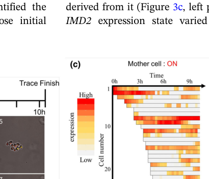

## Question

# Gene Research for Functional Annotation

## ⚠️ CRITICAL: Gene/Protein Identification Context

**BEFORE YOU BEGIN RESEARCH:** You MUST verify you are researching the CORRECT gene/protein. Gene symbols can be ambiguous, especially for less well-characterized genes from non-model organisms.

### Target Gene/Protein Identity (from UniProt):
- **UniProt Accession:** P40963
- **Protein Description:** RecName: Full=Histone acetyltransferase SAS2; EC=2.3.1.48 {ECO:0000269|PubMed:22020126}; AltName: Full=Something about silencing protein 2;
- **Gene Information:** Name=SAS2; Synonyms=ESO1; OrderedLocusNames=YMR127C; ORFNames=YM9553.03C;
- **Organism (full):** Saccharomyces cerevisiae (strain ATCC 204508 / S288c) (Baker's yeast).
- **Protein Family:** Belongs to the MYST (SAS/MOZ) family. .
- **Key Domains:** Acyl_CoA_acyltransferase. (IPR016181); HAT_MYST-type. (IPR002717); MYST_HAT. (IPR050603); WH-like_DNA-bd_sf. (IPR036388); MOZ_SAS (PF01853)

### MANDATORY VERIFICATION STEPS:

1. **Check if the gene symbol "SAS2" matches the protein description above**
2. **Verify the organism is correct:** Saccharomyces cerevisiae (strain ATCC 204508 / S288c) (Baker's yeast).
3. **Check if protein family/domains align with what you find in literature**
4. **If you find literature for a DIFFERENT gene with the same or similar symbol, STOP**

### If Gene Symbol is Ambiguous or You Cannot Find Relevant Literature:

**DO NOT PROCEED WITH RESEARCH ON A DIFFERENT GENE.** Instead:
- State clearly: "The gene symbol 'SAS2' is ambiguous or literature is limited for this specific protein"
- Explain what you found (e.g., "Found extensive literature on a different gene with the same symbol in a different organism")
- Describe the protein based ONLY on the UniProt information provided above
- Suggest that the protein function can be inferred from domain/family information

### Research Target:

Please provide a comprehensive research report on the gene **SAS2** (gene ID: SAS2, UniProt: P40963) in yeast.

The research report should be a detailed narrative explaining the function, biological processes, and localization of the gene product. Citations should be given for all claims.

You should prioritize authoritative reviews and primary scientific literature when conducting research. You can supplement
this with annotations you find in gene/protein databases, but these can be outdated or inaccurate.

We are specifically interested in the primary function of the gene - for enzymes, what reaction is catalyzed, and what is the substrate specificity? For transporters, what is the substrate? For structural proteins or adapters, what is the broader structural role? For signaling molecules, what is the role in the pathway.

We are interested in where in or outside the cell the gene product carries out its function.

We are also interested in the signaling or biochemical pathways in which the gene functions. We are less interested in broad pleiotropic effects, except where these elucidate the precise role.

Include evidence where possible. We are interested in both experimental evidence as well as inference from structure, evolution, or bioinformatic analysis. Precise studies should be prioritized over high-throughput, where available.

## Output

Question: You are an expert researcher providing comprehensive, well-cited information.

Provide detailed information focusing on:
1. Key concepts and definitions with current understanding
2. Recent developments and latest research (prioritize 2023-2024 sources)
3. Current applications and real-world implementations
4. Expert opinions and analysis from authoritative sources
5. Relevant statistics and data from recent studies

Format as a comprehensive research report with proper citations. Include URLs and publication dates where available.
Always prioritize recent, authoritative sources and provide specific citations for all major claims.

# Gene Research for Functional Annotation

## ⚠️ CRITICAL: Gene/Protein Identification Context

**BEFORE YOU BEGIN RESEARCH:** You MUST verify you are researching the CORRECT gene/protein. Gene symbols can be ambiguous, especially for less well-characterized genes from non-model organisms.

### Target Gene/Protein Identity (from UniProt):
- **UniProt Accession:** P40963
- **Protein Description:** RecName: Full=Histone acetyltransferase SAS2; EC=2.3.1.48 {ECO:0000269|PubMed:22020126}; AltName: Full=Something about silencing protein 2;
- **Gene Information:** Name=SAS2; Synonyms=ESO1; OrderedLocusNames=YMR127C; ORFNames=YM9553.03C;
- **Organism (full):** Saccharomyces cerevisiae (strain ATCC 204508 / S288c) (Baker's yeast).
- **Protein Family:** Belongs to the MYST (SAS/MOZ) family. .
- **Key Domains:** Acyl_CoA_acyltransferase. (IPR016181); HAT_MYST-type. (IPR002717); MYST_HAT. (IPR050603); WH-like_DNA-bd_sf. (IPR036388); MOZ_SAS (PF01853)

### MANDATORY VERIFICATION STEPS:

1. **Check if the gene symbol "SAS2" matches the protein description above**
2. **Verify the organism is correct:** Saccharomyces cerevisiae (strain ATCC 204508 / S288c) (Baker's yeast).
3. **Check if protein family/domains align with what you find in literature**
4. **If you find literature for a DIFFERENT gene with the same or similar symbol, STOP**

### If Gene Symbol is Ambiguous or You Cannot Find Relevant Literature:

**DO NOT PROCEED WITH RESEARCH ON A DIFFERENT GENE.** Instead:
- State clearly: "The gene symbol 'SAS2' is ambiguous or literature is limited for this specific protein"
- Explain what you found (e.g., "Found extensive literature on a different gene with the same symbol in a different organism")
- Describe the protein based ONLY on the UniProt information provided above
- Suggest that the protein function can be inferred from domain/family information

### Research Target:

Please provide a comprehensive research report on the gene **SAS2** (gene ID: SAS2, UniProt: P40963) in yeast.

The research report should be a detailed narrative explaining the function, biological processes, and localization of the gene product. Citations should be given for all claims.

You should prioritize authoritative reviews and primary scientific literature when conducting research. You can supplement
this with annotations you find in gene/protein databases, but these can be outdated or inaccurate.

We are specifically interested in the primary function of the gene - for enzymes, what reaction is catalyzed, and what is the substrate specificity? For transporters, what is the substrate? For structural proteins or adapters, what is the broader structural role? For signaling molecules, what is the role in the pathway.

We are interested in where in or outside the cell the gene product carries out its function.

We are also interested in the signaling or biochemical pathways in which the gene functions. We are less interested in broad pleiotropic effects, except where these elucidate the precise role.

Include evidence where possible. We are interested in both experimental evidence as well as inference from structure, evolution, or bioinformatic analysis. Precise studies should be prioritized over high-throughput, where available.

# Comprehensive research report: *Saccharomyces cerevisiae* **SAS2** (UniProt P40963) — functional annotation

## 0. Target verification (mandatory disambiguation)
The target described (UniProt **P40963**, *S. cerevisiae* S288c, gene **SAS2** / “something about silencing 2”, ORF **YMR127C**) corresponds to the budding-yeast MYST-family histone acetyltransferase **Sas2**, the catalytic subunit of the **SAS-I** complex (Sas2–Sas4–Sas5) that mediates acetylation of histone H4 at lysine 16 (**H4K16ac**) and shapes heterochromatin boundaries by antagonizing SIR spreading. This identification is consistent across foundational primary studies and later genome-wide work in *S. cerevisiae*. (meijsing2001thesilencingcomplex pages 2-4, heise2012genomewideh4k16 pages 1-2)

## 1. Key concepts, definitions, and current understanding

### 1.1. What SAS2 encodes
**SAS2** encodes a **MYST-family histone acetyltransferase (HAT)**, Sas2, which contains an acetyl-CoA binding HAT domain and an atypical zinc finger; both regions are required for function, including interaction with the SAS-I subunit Sas4. (meijsing2001thesilencingcomplex pages 4-5)

### 1.2. The SAS-I complex
Sas2 acts in a nuclear complex termed **SAS-I**, composed of **Sas2, Sas4, and Sas5**, which coimmunoprecipitate and coelute as a ~220 kDa complex. (meijsing2001thesilencingcomplex pages 2-4)

### 1.3. Histone acetylation (reaction definition)
Histone acetyltransferases catalyze transfer of an acetyl group from **acetyl-coenzyme A (acetyl-CoA)** to the ε-amino group of a lysine residue on histones. (reiter2014dynamicsofh4 pages 17-20)

### 1.4. Primary biochemical function: H4K16 acetylation and heterochromatin boundary control
Multiple lines of evidence support that SAS-I/Sas2 targets **histone H4 lysine 16 (H4K16)** in vivo and that this mark is central to silencing boundary behavior:
- Genetic evidence: H4K16 mutation phenocopies sas2 deletion effects on silencing; authors conclude “the most direct explanation” is that Sas2 acetylates **H4K16**. (meijsing2001thesilencingcomplex pages 4-5)
- Functional chromatin interpretation: H4K16ac counteracts SIR complex binding and limits heterochromatin spreading into subtelomeric regions; absence of SAS-I allows inappropriate SIR spreading and silencing. (boltengagen2021dynamicsofsasi pages 1-2)

## 2. Molecular function and substrate specificity

### 2.1. Catalyzed reaction and substrates
**Reaction (as currently supported in this evidence set):** acetyl transfer from acetyl-CoA to lysine 16 on histone H4 (H4K16ac) in chromatin, catalyzed by Sas2 as part of SAS-I. (meijsing2001thesilencingcomplex pages 2-4, reiter2014dynamicsofh4 pages 17-20)

**Substrate specificity:** the strongest, repeatedly supported in vivo substrate is **H4K16**; the evidence gathered here does not robustly support additional primary Sas2 targets beyond H4K16 in *S. cerevisiae*. (meijsing2001thesilencingcomplex pages 2-4, meijsing2001thesilencingcomplex pages 4-5)

### 2.2. Redundancy with other acetyltransferases
Sas2/SAS-I does not account for all cellular H4K16ac. A major redundant contributor is **Esa1 (NuA4)**: sas2Δ cells retain ~40% of wild-type H4K16ac, and genetic experiments indicate Esa1 can compensate for Sas2 for H4K16 acetylation. (boltengagen2021dynamicsofsasi pages 1-2)

## 3. Cellular localization and where Sas2 acts

### 3.1. Nuclear and nucleolar localization
Sas2 is a chromatin-bound nuclear protein; GFP-tagged Sas2 predominantly stains the nucleus, including the **nucleolus**. (meijsing2001thesilencingcomplex pages 4-5)

### 3.2. Association with rDNA
Chromatin immunoprecipitation showed rDNA spacer sequences weakly but reproducibly enriched with Sas2, consistent with direct association with **rDNA**. (meijsing2001thesilencingcomplex pages 4-5)

### 3.3. Genomic distribution beyond classic silent loci
Genome-wide mapping supports that Sas2-dependent H4K16ac is deposited broadly, with pronounced effects across **open reading frames (ORFs)** (gene bodies) and comparatively less change in intergenic regions when SAS2 is deleted. (heise2012genomewideh4k16 pages 1-2)

## 4. Biological processes and pathways involving SAS2

### 4.1. Silencing and heterochromatin boundary pathway (Sir2/Sir3/Sir4 antagonism)
Sas2-mediated H4K16 acetylation is a key antagonistic input into SIR-based chromatin: acetylation at H4K16 counteracts SIR binding/spreading; SAS-I loss leads to inappropriate spreading and subtelomeric silencing. (boltengagen2021dynamicsofsasi pages 1-2)

### 4.2. Replication-coupled chromatin assembly linkage (CAF-I/Asf1)
A major mechanistic theme is that SAS-I couples histone modification to nucleosome assembly:
- SAS-I interacts with **Cac1 (CAF-I subunit)** and **Asf1**, supporting recruitment to newly assembled chromatin after replication. (meijsing2001thesilencingcomplex pages 2-4)
- H4K16ac appears immediately upon replication in a SAS-I-dependent manner, supporting that SAS-I acetylates newly deposited histones shortly after fork passage. (boltengagen2021dynamicsofsasi pages 1-2)

### 4.3. Genome-wide deposition and transcriptional context
Sas2-dependent H4K16ac can be deposited **independently of transcription and histone exchange**, consistent with a deposition mechanism linked to chromatin assembly rather than transcription-coupled turnover. (heise2012genomewideh4k16 pages 1-2)

## 5. Recent developments and latest research (prioritized 2023–2024)

### 5.1. 2024: single-cell heterochromatin fluctuations at a subtelomeric boundary gene (IMD2)
A 2024 *Genes to Cells* study examined the subtelomeric **IMD2** locus (near heterochromatin boundaries) using **single-cell tracking** under perturbations that alter nucleotide pools. Key findings include:
- **Repeated ON/OFF switching** of IMD2 expression in single-cell lineages, despite heterochromatic location. (ayano2024gtp‐dependentregulationof pages 1-2)
- A quantitative population statistic: **~30% of cells** in the population “always expressed IMD2” under the tracking conditions. (ayano2024gtp‐dependentregulationof pages 1-2)
- The figures support persistent ON fractions on the order of ~30–40% and show switching trajectories in individual cells. (ayano2024gtp‐dependentregulationof media 19ad13d4, ayano2024gtp‐dependentregulationof media 6de4c8e8)

This work explicitly situates IMD2 boundary behavior in the established context where Sas2-driven **H4K16ac** helps form subtelomeric boundaries that limit heterochromatin spreading. (ayano2024gtp‐dependentregulationof pages 1-2)

### 5.2. 2024: identification of additional HAT-related factors modulating boundary behavior at IMD2
A 2024 *Genes & Genetic Systems* study investigated HAT-related regulation at IMD2 and provided evidence that multiple acetylation-related systems contribute to boundary control:
- The study frames IMD2 boundary formation in the context of Sas2 (SAS-I) acetylating **H4K16** and competing with Sir2 at subtelomeric boundaries. (ayano2024imd2whichis pages 1-2)
- It identifies SAGA-related contributions and reports a quantitative transcription effect: **spt8Δ reduced IMD2 transcription three-fold** under MPA-induced conditions (while basal expression without MPA was not significantly changed in the same comparison). (ayano2024imd2whichis pages 2-3)

### 5.3. 2024: quantitative modeling of heterochromatin bistability incorporating acetylation-dependent compaction
A 2024 **PNAS** study developed and tested a model in which chromatin compaction and histone modification state form a **two-way feedback** that can underlie bistable silencing at HMR. The authors emphasize acetylation-dependent locus size and silencer protein binding feedback, and report agreement with prior quantitative switching data, providing a modern theoretical synthesis for how marks such as H4 acetylation contribute to stable or switching heterochromatin states. (miangolarra2024twowayfeedbackbetween pages 1-2, miangolarra2024twowayfeedbackbetween pages 2-3)

### 5.4. 2024 review-level synthesis touching Sas2/H4K16ac
A 2024 *Journal of Fungi* review (fungal/plant-host context, but explicitly referencing yeast foundations) summarizes Sas2 as a **MYST-family** HAT in the SAS complex, requiring SAS4 and SAS5 for HAT activity, catalyzing **H4K16 acetylation**, and interfering with telomeric heterochromatin formation by antagonizing SIR-mediated silencing. (zhang2024researchprogresson pages 3-4)

## 6. Current applications and real-world implementations

### 6.1. SAS2 as an experimental handle to tune heterochromatin boundaries
In practice, *S. cerevisiae* SAS2 deletion/mutation is widely used as a **genetic perturbation** to alter H4K16ac levels and thereby modulate SIR spreading, subtelomeric silencing, and boundary behavior. Mechanistically grounded examples include studies of subtelomeric boundary genes such as IMD2 (2024), where the boundary framework explicitly depends on the established Sas2/H4K16ac vs Sir2 axis. (ayano2024gtp‐dependentregulationof pages 1-2, ayano2024imd2whichis pages 1-2)

### 6.2. SAS2 and replication-coupled chromatin restoration paradigms
SAS-I’s interaction with CAF-I/Asf1 and replication-coupled deposition of H4K16ac make SAS2 a common component of experimental designs probing how histone marks are restored following DNA replication. (meijsing2001thesilencingcomplex pages 2-4, boltengagen2021dynamicsofsasi pages 1-2)

## 7. Expert opinions and analysis (authoritative interpretations)

### 7.1. Boundary model: Sas2 acetylation antagonizes SIR spreading
Foundational yeast genetics/biochemistry supports a boundary model in which SAS-I is recruited during/after replication to acetylate H4K16 on newly assembled nucleosomes, thereby constraining SIR propagation into euchromatin and shaping silencing at telomeres/HM loci/rDNA. (meijsing2001thesilencingcomplex pages 2-4, boltengagen2021dynamicsofsasi pages 1-2)

### 7.2. Systems view: coupling chromatin compaction with modification state
Recent quantitative modeling (2024 PNAS) supports the view that chromatin accessibility/compaction can be both driver and consequence of histone modification state, yielding bistable transcriptional outputs at silent loci—an interpretive framework that aligns with the experimentally grounded role of acetylation marks (including H4 acetylation) as barriers to stable SIR-bound heterochromatin. (miangolarra2024twowayfeedbackbetween pages 1-2, miangolarra2024twowayfeedbackbetween pages 2-3)

## 8. Key statistics and quantitative data (from cited studies)

- **SAS-I contribution to H4K16ac:** ~**60%** of cellular H4K16ac is provided by SAS-I/Sas2; **sas2Δ** retains ~**40%** of wild-type H4K16ac (implicating redundancy, notably with Esa1/NuA4). (boltengagen2021dynamicsofsasi pages 1-2)
- **Single-cell heterochromatin heterogeneity (IMD2):** ~**30%** of cells “always expressed IMD2” in a single-cell tracking system; figures show persistent ON fractions (~30–40%) and frequent ON/OFF switching trajectories. (ayano2024gtp‐dependentregulationof pages 1-2, ayano2024gtp‐dependentregulationof media 19ad13d4, ayano2024gtp‐dependentregulationof media 6de4c8e8)
- **IMD2 transcriptional effect of SAGA component Spt8:** “Transcription was reduced **three-fold** in **spt8Δ**” under MPA induction conditions in the 2024 IMD2 boundary study. (ayano2024imd2whichis pages 2-3)

## 9. Summary table (evidence map)
The following table compacts the functional annotation into a single evidence-linked map.

| Aspect | Key findings (1-2 sentences) | Evidence type | Key papers with year and URL |
|---|---|---|---|
| Identity & complex (SAS-I) | **S. cerevisiae** SAS2 (UniProt P40963) matches the yeast **MYST-family histone acetyltransferase** Sas2, the catalytic subunit of the **SAS-I complex** with Sas4 and Sas5. This distinguishes it from related but different MYST proteins such as Esa1, Sas3, and metazoan MOF homologs. (meijsing2001thesilencingcomplex pages 4-5, meijsing2001thesilencingcomplex pages 2-4, heise2012genomewideh4k16 pages 1-2) | biochemical, genetic | Meijsing & Ehrenhofer-Murray 2001 — https://doi.org/10.1101/gad.929001; Heise et al. 2012 — https://doi.org/10.1093/nar/gkr649 |
| Enzymatic reaction / substrate | Sas2 is a histone acetyltransferase with an **acetyl-CoA-binding HAT domain**; HAT chemistry transfers an acetyl group from **acetyl-CoA** to lysine ε-amino groups. Genetic and chromatin evidence support **histone H4 Lys16 (H4K16)** as the principal in vivo Sas2/SAS-I target; SAS-I supplies about **60% of cellular H4K16ac**. (meijsing2001thesilencingcomplex pages 4-5, boltengagen2021dynamicsofsasi pages 1-2, reiter2015alinkbetween pages 1-2, reiter2014dynamicsofh4 pages 17-20) | biochemical, genetic | Meijsing & Ehrenhofer-Murray 2001 — https://doi.org/10.1101/gad.929001; Boltengagen et al. 2021 — https://doi.org/10.1371/journal.pone.0251660; Reiter et al. 2015 — https://doi.org/10.1093/femsyr/fov073 |
| Localization | Sas2 is a **chromatin-bound nuclear protein**; GFP-tagging showed predominant **nuclear localization including the nucleolus**, and ChIP detected association with **rDNA**. Functionally, Sas2 activity is also evident at **telomeres, HM loci, subtelomeres, and ORFs**. (meijsing2001thesilencingcomplex pages 4-5, meijsing2001thesilencingcomplex pages 2-4, heise2012genomewideh4k16 pages 1-2) | biochemical, genetic, genome-wide | Meijsing & Ehrenhofer-Murray 2001 — https://doi.org/10.1101/gad.929001; Heise et al. 2012 — https://doi.org/10.1093/nar/gkr649 |
| Role in heterochromatin boundary & silencing | Sas2-mediated **H4K16 acetylation antagonizes SIR binding/spreading**, helping define **subtelomeric and HMR boundary states** and supporting proper silencing architecture. Loss of SAS-I reduces H4K16ac and permits inappropriate **subtelomeric SIR spreading** and altered silencing at telomeres/HM loci/rDNA. (boltengagen2021dynamicsofsasi pages 1-2, heise2012genomewideh4k16 pages 1-2, heise2012genomewideh4k16 pages 2-2) | genetic, genome-wide | Boltengagen et al. 2021 — https://doi.org/10.1371/journal.pone.0251660; Heise et al. 2012 — https://doi.org/10.1093/nar/gkr649 |
| Replication-coupled deposition | SAS-I interacts with **CAF-I/Cac1 and Asf1**, linking Sas2 to chromatin assembly after replication. H4K16ac appears **immediately upon replication** in a SAS-I-dependent manner, supporting a model in which Sas2 acetylates newly assembled chromatin during **S phase**. (meijsing2001thesilencingcomplex pages 1-2, boltengagen2021dynamicsofsasi pages 1-2, reiter2014dynamicsofh4 pages 101-104) | genetic, biochemical, genome-wide | Meijsing & Ehrenhofer-Murray 2001 — https://doi.org/10.1101/gad.929001; Boltengagen et al. 2021 — https://doi.org/10.1371/journal.pone.0251660; Reiter 2014 — https://doi.org/10.18452/17041 |
| Genome-wide distribution | Genome-wide mapping showed Sas2-dependent H4K16ac is strongest across the **bodies of many ORFs**, especially **lowly transcribed genes**, with less effect in intergenic regions. Sas2-dependent deposition occurs broadly and can be **independent of transcription and histone exchange**. (heise2012genomewideh4k16 pages 1-2, heise2012genomewideh4k16 pages 2-2, reiter2015alinkbetween pages 1-2) | genome-wide | Heise et al. 2012 — https://doi.org/10.1093/nar/gkr649; Reiter et al. 2015 — https://doi.org/10.1093/femsyr/fov073 |
| 2024 IMD2 heterochromatin fluctuation findings | At the subtelomeric **IMD2** locus, 2024 single-cell work showed repeated switching between ON/OFF expression states under GTP depletion conditions, and about **30% of cells** consistently expressed IMD2; figure-level summaries indicated roughly **20-23%** of tracked lineages remained consistently ON in one analysis. These studies place IMD2 boundary behavior in the context of Sas2/H4K16ac-defined heterochromatin boundaries and identify additional HAT-related factors such as **Spt8/SAGA** affecting IMD2 regulation; **spt8Δ** reduced transcription about **3-fold** in the cited assay. (ayano2024gtp‐dependentregulationof pages 1-2, ayano2024imd2whichis pages 1-2, ayano2024imd2whichis pages 2-3, ayano2024gtp‐dependentregulationof media 19ad13d4) | single-cell, genetic | Ayano et al. 2024 — https://doi.org/10.1111/gtc.13094; Ayano & Oki 2024 — https://doi.org/10.1266/ggs.23-00284 |
| 2024 modeling work | A 2024 **PNAS** study modeled **two-way feedback** between chromatin compaction and histone modification state at **HMR**, incorporating acetylation-dependent locus size and Sir-mediated feedback. The framework reproduced prior quantitative silencing dynamics and provides a current mechanistic interpretation for how marks such as **H4K16ac** help generate **bistable heterochromatin states**. (miangolarra2024twowayfeedbackbetween pages 1-2, miangolarra2024twowayfeedbackbetween pages 2-3) | modeling | Miangolarra et al. 2024 — https://doi.org/10.1073/pnas.2403316121 |

*Table: This table summarizes the core functional annotation of S. cerevisiae SAS2/P40963, including its biochemical role, localization, chromatin functions, and the most relevant recent 2024 findings. It is useful as a compact evidence map linking major claims to specific study types and papers.*

## 10. Notes on limitations of the retrieved evidence
- Within the retrieved primary texts, Sas2’s best-supported direct enzymatic substrate is **H4K16**; additional Sas2 substrates (if any) are not established by the excerpts gathered here and should not be asserted without direct evidence.
- Some 2024 modeling work refers to detailed quantitative switching rates in supplementary materials; these numeric values were not captured in the retrieved excerpts, so only high-level claims about quantitative agreement are reported. (miangolarra2024twowayfeedbackbetween pages 1-2)

References

1. (meijsing2001thesilencingcomplex pages 2-4): Sebastiaan H. Meijsing and Ann E. Ehrenhofer-Murray. The silencing complex sas-i links histone acetylation to the assembly of repressed chromatin by caf-i and asf1 in saccharomyces cerevisiae. Genes & development, 15 23:3169-82, Dec 2001. URL: https://doi.org/10.1101/gad.929001, doi:10.1101/gad.929001. This article has 191 citations and is from a highest quality peer-reviewed journal.

2. (heise2012genomewideh4k16 pages 1-2): Franziska Heise, Ho-Ryun Chung, Jan M. Weber, Zhenyu Xu, Ludger Klein-Hitpass, Lars M. Steinmetz, Martin Vingron, and Ann E. Ehrenhofer-Murray. Genome-wide h4 k16 acetylation by sas-i is deposited independently of transcription and histone exchange. Nucleic Acids Research, 40:65-74, Sep 2012. URL: https://doi.org/10.1093/nar/gkr649, doi:10.1093/nar/gkr649. This article has 22 citations and is from a highest quality peer-reviewed journal.

3. (meijsing2001thesilencingcomplex pages 4-5): Sebastiaan H. Meijsing and Ann E. Ehrenhofer-Murray. The silencing complex sas-i links histone acetylation to the assembly of repressed chromatin by caf-i and asf1 in saccharomyces cerevisiae. Genes & development, 15 23:3169-82, Dec 2001. URL: https://doi.org/10.1101/gad.929001, doi:10.1101/gad.929001. This article has 191 citations and is from a highest quality peer-reviewed journal.

4. (reiter2014dynamicsofh4 pages 17-20): Christian Reiter. Dynamics of h4 k16 acetylation by the sas-i complex in saccharomyces cerevisiae. ArXiv, Oct 2014. URL: https://doi.org/10.18452/17041, doi:10.18452/17041. This article has 0 citations.

5. (boltengagen2021dynamicsofsasi pages 1-2): Mark Boltengagen, Anke Samel-Pommerencke, David Fechtig, and Ann E. Ehrenhofer-Murray. Dynamics of sas-i mediated h4 k16 acetylation during dna replication in yeast. PLoS ONE, 16:e0251660, May 2021. URL: https://doi.org/10.1371/journal.pone.0251660, doi:10.1371/journal.pone.0251660. This article has 3 citations and is from a peer-reviewed journal.

6. (ayano2024gtp‐dependentregulationof pages 1-2): Takahito Ayano, Takuma Yokosawa, and Masaya Oki. Gtp‐dependent regulation of heterochromatin fluctuations at subtelomeric regions in saccharomyces cerevisiae. Genes to Cells, 29:217-230, Jan 2024. URL: https://doi.org/10.1111/gtc.13094, doi:10.1111/gtc.13094. This article has 1 citations and is from a peer-reviewed journal.

7. (ayano2024gtp‐dependentregulationof media 19ad13d4): Takahito Ayano, Takuma Yokosawa, and Masaya Oki. Gtp‐dependent regulation of heterochromatin fluctuations at subtelomeric regions in saccharomyces cerevisiae. Genes to Cells, 29:217-230, Jan 2024. URL: https://doi.org/10.1111/gtc.13094, doi:10.1111/gtc.13094. This article has 1 citations and is from a peer-reviewed journal.

8. (ayano2024gtp‐dependentregulationof media 6de4c8e8): Takahito Ayano, Takuma Yokosawa, and Masaya Oki. Gtp‐dependent regulation of heterochromatin fluctuations at subtelomeric regions in saccharomyces cerevisiae. Genes to Cells, 29:217-230, Jan 2024. URL: https://doi.org/10.1111/gtc.13094, doi:10.1111/gtc.13094. This article has 1 citations and is from a peer-reviewed journal.

9. (ayano2024imd2whichis pages 1-2): Takahito Ayano and Masaya Oki. Imd2, which is located near the boundary of heterochromatin regions, is regulated by the use of multiple hat-related factors. Genes & genetic systems, Feb 2024. URL: https://doi.org/10.1266/ggs.23-00284, doi:10.1266/ggs.23-00284. This article has 0 citations and is from a peer-reviewed journal.

10. (ayano2024imd2whichis pages 2-3): Takahito Ayano and Masaya Oki. Imd2, which is located near the boundary of heterochromatin regions, is regulated by the use of multiple hat-related factors. Genes & genetic systems, Feb 2024. URL: https://doi.org/10.1266/ggs.23-00284, doi:10.1266/ggs.23-00284. This article has 0 citations and is from a peer-reviewed journal.

11. (miangolarra2024twowayfeedbackbetween pages 1-2): Ander Movilla Miangolarra, Daniel S. Saxton, Zhi Yan, Jasper Rine, and Martin Howard. Two-way feedback between chromatin compaction and histone modification state explains saccharomyces cerevisiae heterochromatin bistability. Proceedings of the National Academy of Sciences of the United States of America, Apr 2024. URL: https://doi.org/10.1073/pnas.2403316121, doi:10.1073/pnas.2403316121. This article has 13 citations and is from a highest quality peer-reviewed journal.

12. (miangolarra2024twowayfeedbackbetween pages 2-3): Ander Movilla Miangolarra, Daniel S. Saxton, Zhi Yan, Jasper Rine, and Martin Howard. Two-way feedback between chromatin compaction and histone modification state explains saccharomyces cerevisiae heterochromatin bistability. Proceedings of the National Academy of Sciences of the United States of America, Apr 2024. URL: https://doi.org/10.1073/pnas.2403316121, doi:10.1073/pnas.2403316121. This article has 13 citations and is from a highest quality peer-reviewed journal.

13. (zhang2024researchprogresson pages 3-4): Xiaokang Zhang, Yuzhu Zhou, Yangzhi Liu, Boqiang Li, Shiping Tian, and Zhanquan Zhang. Research progress on the mechanism and function of histone acetylation regulating the interaction between pathogenic fungi and plant hosts. Journal of Fungi, 10:522, Jul 2024. URL: https://doi.org/10.3390/jof10080522, doi:10.3390/jof10080522. This article has 25 citations.

14. (reiter2015alinkbetween pages 1-2): Christian Reiter, Franziska Heise, Ho-Ryun Chung, and Ann E. Ehrenhofer-Murray. A link between sas2-mediated h4 k16 acetylation, chromatin assembly in s-phase by caf-i and asf1, and nucleosome assembly by spt6 during transcription. FEMS yeast research, 15 7:fov073, Nov 2015. URL: https://doi.org/10.1093/femsyr/fov073, doi:10.1093/femsyr/fov073. This article has 16 citations and is from a peer-reviewed journal.

15. (heise2012genomewideh4k16 pages 2-2): Franziska Heise, Ho-Ryun Chung, Jan M. Weber, Zhenyu Xu, Ludger Klein-Hitpass, Lars M. Steinmetz, Martin Vingron, and Ann E. Ehrenhofer-Murray. Genome-wide h4 k16 acetylation by sas-i is deposited independently of transcription and histone exchange. Nucleic Acids Research, 40:65-74, Sep 2012. URL: https://doi.org/10.1093/nar/gkr649, doi:10.1093/nar/gkr649. This article has 22 citations and is from a highest quality peer-reviewed journal.

16. (meijsing2001thesilencingcomplex pages 1-2): Sebastiaan H. Meijsing and Ann E. Ehrenhofer-Murray. The silencing complex sas-i links histone acetylation to the assembly of repressed chromatin by caf-i and asf1 in saccharomyces cerevisiae. Genes & development, 15 23:3169-82, Dec 2001. URL: https://doi.org/10.1101/gad.929001, doi:10.1101/gad.929001. This article has 191 citations and is from a highest quality peer-reviewed journal.

17. (reiter2014dynamicsofh4 pages 101-104): Christian Reiter. Dynamics of h4 k16 acetylation by the sas-i complex in saccharomyces cerevisiae. ArXiv, Oct 2014. URL: https://doi.org/10.18452/17041, doi:10.18452/17041. This article has 0 citations.

## Artifacts

- [Edison artifact artifact-00](SAS2-deep-research-falcon_artifacts/artifact-00.md)

## Citations

1. meijsing2001thesilencingcomplex pages 4-5
2. meijsing2001thesilencingcomplex pages 2-4
3. boltengagen2021dynamicsofsasi pages 1-2
4. zhang2024researchprogresson pages 3-4
5. miangolarra2024twowayfeedbackbetween pages 1-2
6. miangolarra2024twowayfeedbackbetween pages 2-3
7. reiter2015alinkbetween pages 1-2
8. meijsing2001thesilencingcomplex pages 1-2
9. https://doi.org/10.1101/gad.929001;
10. https://doi.org/10.1093/nar/gkr649
11. https://doi.org/10.1371/journal.pone.0251660;
12. https://doi.org/10.1093/femsyr/fov073
13. https://doi.org/10.18452/17041
14. https://doi.org/10.1093/nar/gkr649;
15. https://doi.org/10.1111/gtc.13094;
16. https://doi.org/10.1266/ggs.23-00284
17. https://doi.org/10.1073/pnas.2403316121
18. https://doi.org/10.1101/gad.929001,
19. https://doi.org/10.1093/nar/gkr649,
20. https://doi.org/10.18452/17041,
21. https://doi.org/10.1371/journal.pone.0251660,
22. https://doi.org/10.1111/gtc.13094,
23. https://doi.org/10.1266/ggs.23-00284,
24. https://doi.org/10.1073/pnas.2403316121,
25. https://doi.org/10.3390/jof10080522,
26. https://doi.org/10.1093/femsyr/fov073,