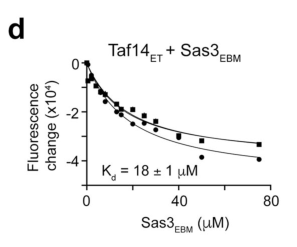

## Question

# Gene Research for Functional Annotation

## ⚠️ CRITICAL: Gene/Protein Identification Context

**BEFORE YOU BEGIN RESEARCH:** You MUST verify you are researching the CORRECT gene/protein. Gene symbols can be ambiguous, especially for less well-characterized genes from non-model organisms.

### Target Gene/Protein Identity (from UniProt):
- **UniProt Accession:** P34218
- **Protein Description:** RecName: Full=Histone acetyltransferase SAS3; EC=2.3.1.48 {ECO:0000269|PubMed:10600516, ECO:0000269|PubMed:10817755}; AltName: Full=Something about silencing protein 3 {ECO:0000303|PubMed:10817755};
- **Gene Information:** Name=SAS3 {ECO:0000303|PubMed:8782818}; OrderedLocusNames=YBL052C; ORFNames=YBL0507, YBL0515;
- **Organism (full):** Saccharomyces cerevisiae (strain ATCC 204508 / S288c) (Baker's yeast).
- **Protein Family:** Belongs to the MYST (SAS/MOZ) family. .
- **Key Domains:** Acyl_CoA_acyltransferase. (IPR016181); HAT_MYST-type. (IPR002717); MYST_HAT. (IPR050603); WH-like_DNA-bd_sf. (IPR036388); Zf-MYST. (IPR040706)

### MANDATORY VERIFICATION STEPS:

1. **Check if the gene symbol "SAS3" matches the protein description above**
2. **Verify the organism is correct:** Saccharomyces cerevisiae (strain ATCC 204508 / S288c) (Baker's yeast).
3. **Check if protein family/domains align with what you find in literature**
4. **If you find literature for a DIFFERENT gene with the same or similar symbol, STOP**

### If Gene Symbol is Ambiguous or You Cannot Find Relevant Literature:

**DO NOT PROCEED WITH RESEARCH ON A DIFFERENT GENE.** Instead:
- State clearly: "The gene symbol 'SAS3' is ambiguous or literature is limited for this specific protein"
- Explain what you found (e.g., "Found extensive literature on a different gene with the same symbol in a different organism")
- Describe the protein based ONLY on the UniProt information provided above
- Suggest that the protein function can be inferred from domain/family information

### Research Target:

Please provide a comprehensive research report on the gene **SAS3** (gene ID: SAS3, UniProt: P34218) in yeast.

The research report should be a detailed narrative explaining the function, biological processes, and localization of the gene product. Citations should be given for all claims.

You should prioritize authoritative reviews and primary scientific literature when conducting research. You can supplement
this with annotations you find in gene/protein databases, but these can be outdated or inaccurate.

We are specifically interested in the primary function of the gene - for enzymes, what reaction is catalyzed, and what is the substrate specificity? For transporters, what is the substrate? For structural proteins or adapters, what is the broader structural role? For signaling molecules, what is the role in the pathway.

We are interested in where in or outside the cell the gene product carries out its function.

We are also interested in the signaling or biochemical pathways in which the gene functions. We are less interested in broad pleiotropic effects, except where these elucidate the precise role.

Include evidence where possible. We are interested in both experimental evidence as well as inference from structure, evolution, or bioinformatic analysis. Precise studies should be prioritized over high-throughput, where available.

## Output

Question: You are an expert researcher providing comprehensive, well-cited information.

Provide detailed information focusing on:
1. Key concepts and definitions with current understanding
2. Recent developments and latest research (prioritize 2023-2024 sources)
3. Current applications and real-world implementations
4. Expert opinions and analysis from authoritative sources
5. Relevant statistics and data from recent studies

Format as a comprehensive research report with proper citations. Include URLs and publication dates where available.
Always prioritize recent, authoritative sources and provide specific citations for all major claims.

# Gene Research for Functional Annotation

## ⚠️ CRITICAL: Gene/Protein Identification Context

**BEFORE YOU BEGIN RESEARCH:** You MUST verify you are researching the CORRECT gene/protein. Gene symbols can be ambiguous, especially for less well-characterized genes from non-model organisms.

### Target Gene/Protein Identity (from UniProt):
- **UniProt Accession:** P34218
- **Protein Description:** RecName: Full=Histone acetyltransferase SAS3; EC=2.3.1.48 {ECO:0000269|PubMed:10600516, ECO:0000269|PubMed:10817755}; AltName: Full=Something about silencing protein 3 {ECO:0000303|PubMed:10817755};
- **Gene Information:** Name=SAS3 {ECO:0000303|PubMed:8782818}; OrderedLocusNames=YBL052C; ORFNames=YBL0507, YBL0515;
- **Organism (full):** Saccharomyces cerevisiae (strain ATCC 204508 / S288c) (Baker's yeast).
- **Protein Family:** Belongs to the MYST (SAS/MOZ) family. .
- **Key Domains:** Acyl_CoA_acyltransferase. (IPR016181); HAT_MYST-type. (IPR002717); MYST_HAT. (IPR050603); WH-like_DNA-bd_sf. (IPR036388); Zf-MYST. (IPR040706)

### MANDATORY VERIFICATION STEPS:

1. **Check if the gene symbol "SAS3" matches the protein description above**
2. **Verify the organism is correct:** Saccharomyces cerevisiae (strain ATCC 204508 / S288c) (Baker's yeast).
3. **Check if protein family/domains align with what you find in literature**
4. **If you find literature for a DIFFERENT gene with the same or similar symbol, STOP**

### If Gene Symbol is Ambiguous or You Cannot Find Relevant Literature:

**DO NOT PROCEED WITH RESEARCH ON A DIFFERENT GENE.** Instead:
- State clearly: "The gene symbol 'SAS3' is ambiguous or literature is limited for this specific protein"
- Explain what you found (e.g., "Found extensive literature on a different gene with the same symbol in a different organism")
- Describe the protein based ONLY on the UniProt information provided above
- Suggest that the protein function can be inferred from domain/family information

### Research Target:

Please provide a comprehensive research report on the gene **SAS3** (gene ID: SAS3, UniProt: P34218) in yeast.

The research report should be a detailed narrative explaining the function, biological processes, and localization of the gene product. Citations should be given for all claims.

You should prioritize authoritative reviews and primary scientific literature when conducting research. You can supplement
this with annotations you find in gene/protein databases, but these can be outdated or inaccurate.

We are specifically interested in the primary function of the gene - for enzymes, what reaction is catalyzed, and what is the substrate specificity? For transporters, what is the substrate? For structural proteins or adapters, what is the broader structural role? For signaling molecules, what is the role in the pathway.

We are interested in where in or outside the cell the gene product carries out its function.

We are also interested in the signaling or biochemical pathways in which the gene functions. We are less interested in broad pleiotropic effects, except where these elucidate the precise role.

Include evidence where possible. We are interested in both experimental evidence as well as inference from structure, evolution, or bioinformatic analysis. Precise studies should be prioritized over high-throughput, where available.

## Research Report: *Saccharomyces cerevisiae* **SAS3** (UniProt **P34218**, ORF **YBL052C**) — Functional Annotation and Recent Literature

### Executive summary
*S. cerevisiae* **Sas3** is a **MYST-family histone acetyltransferase (HAT)** and the **catalytic subunit of the NuA3 complex**, which primarily acetylates **histone H3 lysine 14 (H3K14)** and is also associated with **H3K23 acetylation** in yeast chromatin. NuA3 integrates catalytic activity (Sas3) with multiple **chromatin “reader” modules** (e.g., Yng1 PHD binding H3K4 methylation; Pdp3 PWWP binding H3K36me3; Taf14 YEATS binding acyl-lysine marks) to target acetylation to active chromatin. Classic biochemical purification work established Sas3’s catalytic and structural role in NuA3 and revealed a physical/functional connection to the transcription-elongation factor **FACT** via **Spt16**. A major **2024 advance** resolved how **Taf14** helps organize NuA3 by binding short ET-binding motifs in both **Sas3** and **Yng1**; mutations that disrupt these interfaces cause **transcription-elongation stress sensitivity (6-AU)** and increased sensitivity to **replication/damage stresses (HU, MMS)**, connecting NuA3 assembly to genome maintenance. (john2000thesomethingabout pages 1-2, kim2020nua3hatantagonizes pages 1-2, taverna2006yng1phdfinger pages 1-2, nguyen2024molecularinsightinto pages 6-8)

### 1) Identity verification and disambiguation (critical)
The symbol **SAS3** can refer to MYST-family HAT orthologs in other fungi (e.g., pathogens), but the target here is explicitly **budding yeast SAS3 (P34218; YBL052C)**. Foundational yeast studies purifying **NuA3** identified **Sas3 as its catalytic HAT subunit** and described Sas3 as the **yeast homolog/counterpart of human MOZ/MORF**-type MYST HATs, which provides a clear species/family/complex-based disambiguation. (john2000thesomethingabout pages 1-2, nguyen2024molecularinsightinto pages 1-2)

### 2) Key concepts and definitions (current understanding)
#### 2.1 Histone acetyltransferase (HAT) activity of Sas3/NuA3
A HAT transfers an acetyl group from **acetyl-CoA** to the ε-amino group of a **lysine** residue on histones (a post-translational modification linked to chromatin accessibility and transcription). NuA3 is defined as a **Gcn5-independent nucleosomal H3 HAT complex** in yeast. (john2000thesomethingabout pages 2-4, john2000thesomethingabout pages 1-2)

#### 2.2 NuA3 complex as a “writer + readers” chromatin machine
NuA3 combines:
- a **writer**: Sas3 (MYST catalytic subunit)
- multiple **reader domains**: **Yng1 PHD** (H3K4 methylation), **Pdp3 PWWP** (H3K36me3), **Taf14 YEATS/ET** (acyl-lysine binding and EBM binding), enabling chromatin-context-sensitive recruitment and regulation. (martin2017histoneh3k4and pages 1-2, kim2020nua3hatantagonizes pages 1-2, nguyen2024molecularinsightinto pages 1-2)

### 3) Primary biochemical function: reaction catalyzed and substrate specificity
#### 3.1 Reaction catalyzed
Sas3 (as NuA3 catalytic subunit) catalyzes **histone lysine acetylation** using acetyl-CoA (EC 2.3.1.48 in UniProt context; mechanistically supported by HAT assays described in classic NuA3 purification studies). NuA3 is active on **chromatin/nucleosomal templates** and is positioned to acetylate nucleosomal H3. (john2000thesomethingabout pages 2-4, john2000thesomethingabout pages 1-2)

#### 3.2 Substrate context: nucleosomes vs free histones
NuA3 is characterized as a complex that **acetylates histone H3 on nucleosomal substrates**, but can also acetylate **H4 on free histones** in vitro. Importantly, bacterially expressed Sas3 can acetylate **free histones**, whereas nucleosomal targeting/efficiency depends on **NuA3 subunits** that enable chromatin engagement. (john2000thesomethingabout pages 2-4, john2000thesomethingabout pages 6-8)

#### 3.3 Site specificity on histone H3
Multiple independent yeast sources support **H3K14** as the principal physiological site for NuA3/Sas3 action:
- NuA3 is described as primarily acetylating **H3K14**, and its transcriptional role is linked to reader-dependent stimulation (e.g., Yng1–H3K4me3). (kim2020nua3hatantagonizes pages 1-2, taverna2006yng1phdfinger pages 1-2)
- NuA3 is also associated with acetylation of **H3K23** (reported in yeast NuA3 literature and summarized in Genetics work on recruitment). (martin2017histoneh3k4and pages 1-2)

### 4) Complex membership, assembly, and molecular interactions
#### 4.1 Core/commonly cited subunits
Modern descriptions of NuA3 include **Sas3 (catalytic), Nto1, Eaf6, Yng1, Taf14, and Pdp3**; earlier biochemical purification also identified **yTAFII30/TAF30** in NuA3 preparations. (john2000thesomethingabout pages 2-4, martin2017histoneh3k4and pages 1-2, john2000thesomethingabout pages 1-2)

#### 4.2 Sas3 requirement for complex integrity
Deletion of **SAS3** eliminates detectable NuA3 HAT activity and disrupts co-purification/co-elution of other NuA3 components (e.g., TAF30), supporting Sas3 as required for both **activity and integrity** of the complex. (john2000thesomethingabout pages 2-4, john2000thesomethingabout pages 1-2)

#### 4.3 Coupling to transcription elongation machinery (FACT/Spt16)
A key mechanistic theme is physical coupling between NuA3 and the **FACT** complex:
- Sas3 mediates NuA3 interaction with **Spt16** (in vivo and in vitro), through an acidic C-terminal region; genetic interaction includes enhanced **6-azauracil (6-AU)** sensitivity when SAS3 is disrupted in an spt16-truncation background. This supports a role in transcription elongation through nucleosomes (and potentially replication-associated chromatin transactions). (john2000thesomethingabout pages 6-8, john2000thesomethingabout pages 8-9)

### 5) Localization and pathway-level function in the cell
#### 5.1 Subcellular localization
NuA3 is a chromatin-associated nuclear complex (nucleosomal H3 acetyltransferase); genome-wide studies show Sas3 occupancy on genes and chromatin. (john2000thesomethingabout pages 1-2, vicentemunoz2014comprehensiveanalysisof pages 1-2)

#### 5.2 Genome targeting patterns
Genome-wide chromatin mapping supports that Sas3/NuA3 localizes predominantly across **transcribed gene bodies**, often in **mid-gene regions**, consistent with a role in transcription-coupled chromatin regulation:
- Sas3 and Yng1 peaks reported ~**750 bp** and **657 bp** downstream of the +1 nucleosome dyad, respectively, and correlate genome-wide (**Spearman r = 0.48**). (martin2018targetingofhistone pages 63-69)
- ChIP-on-chip mapping found Sas3 preferentially in the **5′ half of coding regions**, supporting involvement in **transcriptional elongation**. (vicentemunoz2014comprehensiveanalysisof pages 1-2)

#### 5.3 Recruitment logic (histone methylation cross-talk)
NuA3 recruitment is promoted by histone methylation marks associated with active transcription:
- H3K4 and H3K36 methylation independently support NuA3 recruitment via Yng1 (PHD) and Pdp3 (PWWP) modules. (martin2017histoneh3k4and pages 1-2, martin2016histoneh3k4and pages 14-18)
- Importantly, recruitment does not guarantee acetylation (“presence is insufficient”), implying additional regulation of enzymatic activity after binding. (martin2017histoneh3k4and pages 1-2)

### 6) Recent developments (priority 2023–2024)
#### 6.1 2024: Structural and mechanistic assembly of NuA3 via Taf14–Sas3/Yng1 interfaces
A major 2024 *Nature Communications* study dissected how **Taf14** binds short ET-binding motifs (EBMs) in **Sas3** and **Yng1**, forming dimeric assemblies that enhance Taf14 DNA binding and are required for NuA3 function in transcription and genome maintenance. Key quantitative findings include:
- **Taf14ET–Sas3EBM** affinity **Kd ≈ 18 μM** (NMR) and Taf14FL–Sas3 peptide **Kd ≈ 21 μM** (fluorescence). (nguyen2024molecularinsightinto pages 3-6)
- Mutations in Sas3 EBM weaken/abrogate binding: **L114D Kd ≈ 540 μM**, while **V116D/I118D** disrupt binding. (nguyen2024molecularinsightinto pages 3-6)
- In vivo, Sas3 (I118D) or Yng1 (I120D) mutations that disrupt Taf14 binding cause strong sensitivity to transcription elongation stress (**6-AU**) and increased sensitivity to replication/damage stresses (**HU, MMS**). (nguyen2024molecularinsightinto pages 6-8)
- ChIP-exo promoter occupancy counts: **Taf14 1096**, **Yng1 71**, **Sas3 9**; **70/71** Yng1 promoters co-bound by Taf14; **6** promoters co-bound by all three. (nguyen2024molecularinsightinto pages 3-6)

These findings sharpen current understanding from “NuA3 has multiple subunits” to an explicit **molecular assembly interface** and provide a direct mechanistic route linking NuA3 architecture to transcription and DNA repair phenotypes. (nguyen2024molecularinsightinto pages 1-2, nguyen2024molecularinsightinto pages 6-8)

#### 6.2 2024: Additional yeast literature signals
A 2024 *bioRxiv* histone-mutant screening study references reduced H3 acetylation including H3K14 and notes nucleosomes acetylated by Gcn5 and Sas3/NuA3 in transcriptional regulation contexts, suggesting Sas3 remains embedded as a standard component of chromatin functional interpretation in contemporary yeast epigenetics. (singh2024screeningofhistone; retrieved but not deeply evidenced beyond snippet in this corpus)

### 7) Current applications and real-world implementations
#### 7.1 Yeast Sas3/NuA3 as a model for human MYST HATs (MOZ/MORF)
Authoritative review literature frames yeast MYST HATs—including Sas3—as a tractable system to illuminate mechanisms relevant to human disease-associated MYST enzymes (e.g., MOZ/MORF), leveraging yeast genetics, biochemistry, and interaction assays. (lafon2007mystopportunitiesfor pages 1-2, lafon2007mystopportunitiesfor pages 2-3)

#### 7.2 Studying transcription elongation through nucleosomes
The Sas3–Spt16/FACT linkage provides a platform to study how acetylation is coupled to chromatin transactions during elongation, with phenotypes such as 6-AU sensitivity serving as functional readouts in standard laboratory workflows. (john2000thesomethingabout pages 6-8, john2000thesomethingabout pages 8-9)

#### 7.3 Modular “reader–writer” logic for chromatin targeting
NuA3 embodies a widely used conceptual framework in epigenetics—writer enzymes guided by reader domains recognizing pre-existing histone marks (H3K4 methylation, H3K36me3, acyl marks). This supports experimental designs that perturb reader interactions (e.g., Yng1 PHD mutants) to test causality between histone PTMs, recruitment, and downstream acetylation/transcription. (taverna2006yng1phdfinger pages 1-2, martin2017histoneh3k4and pages 1-2, nguyen2024molecularinsightinto pages 1-2)

### 8) Expert opinions and analysis (authoritative synthesis)
- **“Yeast genes illuminate human cancer gene functions”**: Sas3/NuA3 is presented as a key yeast MYST system that connects conserved domain architecture and complex subunits to transcriptional regulation and growth control, supporting its translational relevance to MOZ/MORF biology. (lafon2007mystopportunitiesfor pages 1-2, lafon2007mystopportunitiesfor pages 3-4)
- **Modern consensus on multi-layer control**: recruitment of NuA3 by active chromatin marks is necessary but not sufficient for acetylation output, implying regulation at the level of complex assembly, chromatin engagement geometry, and/or competing chromatin modifiers (e.g., Rpd3 HDAC pathways). (martin2017histoneh3k4and pages 1-2, kim2020nua3hatantagonizes pages 1-2)
- **2024 mechanistic refinement**: NuA3 function depends on defined Taf14-mediated interactions with both Sas3 and Yng1, linking a specific physical interface to transcription and DNA repair phenotypes; this strengthens causal inference beyond correlational chromatin localization. (nguyen2024molecularinsightinto pages 6-8, nguyen2024molecularinsightinto pages 1-2)

### 9) Relevant statistics and data highlights (from cited studies)
- **NuA3 substrate context**: NuA3 acetylates **H3 on nucleosomal substrates** and can acetylate **H4 on free histones** in vitro. (john2000thesomethingabout pages 2-4)
- **Genome targeting metrics**: Sas3 peak enrichment ~**750 bp** downstream of +1 dyad; Yng1 ~**657 bp**; Sas3–Yng1 occupancy correlation **Spearman r = 0.48**. (martin2018targetingofhistone pages 63-69)
- **2024 affinities**: Taf14FL–Sas3 peptide **Kd ~21 μM**; Taf14ET–Sas3 EBM **Kd ~18 μM**; Sas3 L114D mutant **Kd ~540 μM**. (nguyen2024molecularinsightinto pages 3-6)
- **2024 occupancy counts**: Taf14 **1096** promoters; Yng1 **71**; Sas3 **9**; triple overlap **6**. (nguyen2024molecularinsightinto pages 3-6)
- **2024 phenotypes**: Disruption of Taf14–Sas3 or Taf14–Yng1 binding increases sensitivity to **6-AU**, **HU**, **MMS**, linking NuA3 assembly to elongation stress and genome maintenance. (nguyen2024molecularinsightinto pages 6-8)

### 10) Key figure evidence (2024)
Nguyen et al. provide direct figure-level evidence for Taf14–Sas3/Yng1 binding energetics, structural overlap, and stress phenotypes.
- Binding curves and mutant effects (Fig. 5 panels) and structural overlays (Fig. 6c). (nguyen2024molecularinsightinto media 3daaaaa8)
- Spot assays showing growth sensitivity with interface-disrupting mutations under **6-AU**, **HU**, and **MMS**. (nguyen2024molecularinsightinto media cea32fb1)

### 11) Limitations and evidence gaps
Within the retrieved corpus, **2023–2024 yeast-specific Sas3/NuA3 primary literature** beyond Nguyen et al. (2024) is limited. Ortholog papers (2023–2024) in fungal pathogens exist but should not be used as direct evidence for *S. cerevisiae* P34218 function; they mainly support evolutionary conservation of a nuclear MYST-HAT role.

### Consolidated evidence table
| Topic | Key finding | Quantitative / mechanistic details | Evidence scope | Key citations (URL; date) |
|---|---|---|---|---|
| Identity & core function | **SAS3 (UniProt P34218; YBL052C)** in *Saccharomyces cerevisiae* is the **MYST-family catalytic histone acetyltransferase** subunit of the **NuA3** complex, a nucleosomal acetyltransferase of histone H3 involved in chromatin-based gene regulation. Sas3 is also required for NuA3 integrity and mediates interaction with the FACT subunit **Spt16**. (john2000thesomethingabout pages 1-2) | Early purification identified Sas3 by peptide sequencing in a ~0.4–0.5 MDa NuA3 complex; loss of **SAS3** abolishes NuA3 HAT activity and disrupts complex integrity. (john2000thesomethingabout pages 2-4, john2000thesomethingabout pages 8-9) | Yeast-specific | John et al., *Genes & Development* — https://doi.org/10.1101/gad.14.10.1196; **May 2000** (john2000thesomethingabout pages 1-2, john2000thesomethingabout pages 2-4) ; Lafon et al., *Oncogene* — https://doi.org/10.1038/sj.onc.1210606; **Aug 2007** (lafon2007mystopportunitiesfor pages 2-3) |
| Enzymatic reaction & principal histone targets | Sas3 catalyzes **acetyl-CoA-dependent lysine acetylation of histone H3**, with **H3K14** the best-supported primary physiological target and **H3K23** also reported for NuA3. (martin2017histoneh3k4and pages 1-2, kim2020nua3hatantagonizes pages 1-2, taverna2006yng1phdfinger pages 1-2) | NuA3 acetylates **H3 on nucleosomal substrates**; early work also found it can acetylate **H4 on free histones**. Recombinant Sas3 acetylates free histones, whereas NuA3 subunits promote nucleosome engagement. H3K14 targeting is enhanced by Yng1 recognition of H3K4me3. (john2000thesomethingabout pages 2-4, john2000thesomethingabout pages 6-8, lafon2007mystopportunitiesfor pages 2-3) | Yeast-specific | Taverna et al., *Molecular Cell* — https://doi.org/10.1016/j.molcel.2006.10.026; **Dec 2006** (taverna2006yng1phdfinger pages 1-2) ; Martin et al., *Genetics* — https://doi.org/10.1534/genetics.116.199422; **Mar 2017** (martin2017histoneh3k4and pages 1-2) ; Kim et al., *Nucleic Acids Research* — https://doi.org/10.1093/nar/gkaa781; **Oct 2020** (kim2020nua3hatantagonizes pages 1-2) |
| Complex composition & reader domains | Mature NuA3 is commonly described with **Sas3, Nto1, Eaf6, Yng1, Taf14, Pdp3**; earlier biochemical work also identified **yTAFII30/TAF30** in NuA3 preparations. (martin2017histoneh3k4and pages 1-2, john2000thesomethingabout pages 2-4) | Reader modules: **Yng1 PHD** binds **H3K4me3**; **Pdp3 PWWP** binds **H3K36me3**; **Taf14 YEATS** binds acylated histone marks including **H3K9ac/crotonylation**; Taf14 ET binds EBMs in Yng1 and Sas3. (martin2017histoneh3k4and pages 1-2, nguyen2024molecularinsightinto pages 1-2, nguyen2024molecularinsightinto pages 3-6) | Yeast-specific | Martin et al., *Genetics* — https://doi.org/10.1534/genetics.116.199422; **Mar 2017** (martin2017histoneh3k4and pages 1-2) ; Nguyen et al., *Nature Communications* — https://doi.org/10.1038/s41467-024-49730-y; **Jun 2024** (nguyen2024molecularinsightinto pages 1-2, nguyen2024molecularinsightinto pages 3-6) |
| Localization & genome targeting | Sas3/NuA3 functions in the **nucleus on chromatin**, associating with transcribed genes and chromatinized templates; multiple studies place NuA3 over **gene bodies / mid-gene regions**, while promoter recruitment is also observed in recent Taf14-focused work. (martin2016histoneh3k4and pages 14-18, martin2018targetingofhistone pages 63-69, vicentemunoz2014comprehensiveanalysisof pages 1-2, nguyen2024molecularinsightinto pages 1-2) | MNase-ChIP/ChIP analyses place Sas3 and Yng1 peaks about **750 bp** and **657 bp** downstream of the +1 dyad, respectively; genome-wide Sas3–Yng1 occupancy correlation **Spearman r = 0.48**. Recruitment depends additively on **Set1/H3K4 methylation** and **Set2/H3K36 methylation**. (martin2016histoneh3k4and pages 14-18, martin2018targetingofhistone pages 69-78, martin2018targetingofhistone pages 63-69) | Yeast-specific | Martin preprint — https://doi.org/10.1101/096511; **Dec 2016** (martin2016histoneh3k4and pages 14-18) ; Martin thesis-derived data — https://doi.org/10.14288/1.0364673; **Jan 2018** (martin2018targetingofhistone pages 63-69, martin2018targetingofhistone pages 69-78) ; Vicente-Muñoz et al., *FEBS Open Bio* — https://doi.org/10.1016/j.fob.2014.11.001; **Nov 2014** (vicentemunoz2014comprehensiveanalysisof pages 1-2) |
| Pathways / biological processes | Best-supported roles are in **transcriptional regulation**, especially coupling histone acetylation to active chromatin and antagonizing Rpd3 HDAC pathways; Sas3/NuA3 also connects to **transcription elongation** via **FACT/Spt16** and has emerging links to **DNA repair** and cell-cycle/stress responses. (john2000thesomethingabout pages 6-8, john2000thesomethingabout pages 8-9, nguyen2024molecularinsightinto pages 1-2) | NuA3 antagonizes **Rpd3S/Rpd3L** to optimize mRNA and lncRNA expression dynamics; Sas3 disruption enhances **6-azauracil** sensitivity in an Spt16-mutant background, consistent with elongation defects. (kim2020nua3hatantagonizes pages 1-2, john2000thesomethingabout pages 6-8) | Yeast-specific | Kim et al., *Nucleic Acids Research* — https://doi.org/10.1093/nar/gkaa781; **Oct 2020** (kim2020nua3hatantagonizes pages 1-2) ; John et al., *Genes & Development* — https://doi.org/10.1101/gad.14.10.1196; **May 2000** (john2000thesomethingabout pages 6-8, john2000thesomethingabout pages 8-9) ; Nguyen et al., *Nature Communications* — https://doi.org/10.1038/s41467-024-49730-y; **Jun 2024** (nguyen2024molecularinsightinto pages 1-2) |
| 2024 Nguyen et al. mechanistic advance | Taf14 organizes NuA3 by binding **ET-binding motifs (EBMs)** in both **Yng1** and **Sas3**, forming a dimeric ET:EBM assembly that enhances Taf14 DNA binding and is required for proper NuA3 function in transcription and genome maintenance. (nguyen2024molecularinsightinto pages 1-2, nguyen2024molecularinsightinto pages 3-6) | **Taf14ET–Sas3EBM Kd ≈ 18 μM** by NMR; **Taf14FL–Sas3 peptide Kd ≈ 21 μM** by tryptophan fluorescence; **Sas3 L114D** weakens binding to **~540 μM**; **V116D/I118D** abolish binding. For Yng1, **Taf14ET–Yng1EBM Kd ~0.6 μM**, **Taf14FL–Yng1EBM ~1.1–1.2 μM**. (nguyen2024molecularinsightinto pages 3-6, nguyen2024molecularinsightinto pages 2-3, nguyen2024molecularinsightinto media 3daaaaa8) | Yeast-specific | Nguyen et al., *Nature Communications* — https://doi.org/10.1038/s41467-024-49730-y; **Jun 2024** (nguyen2024molecularinsightinto pages 6-8, nguyen2024molecularinsightinto pages 3-6, nguyen2024molecularinsightinto pages 2-3, nguyen2024molecularinsightinto media 3daaaaa8) |
| 2024 Nguyen et al. genomic & phenotypic data | ChIP-exo and mutant phenotyping tie Taf14–Sas3/Yng1 interactions to a restricted promoter set and stress resistance relevant to transcription/replication-repair. (nguyen2024molecularinsightinto pages 3-6, nguyen2024molecularinsightinto pages 6-8) | Promoter occupancy counts: **Taf14 1096**, **Yng1 71**, **Sas3 9**; **70/71** Yng1 promoters are co-bound by Taf14; **6** promoters are co-bound by all three. Mutations disrupting Taf14 binding (**Sas3 I118D**, **Yng1 I120D**) cause strong **6-AU** sensitivity and increased sensitivity to **HU** and **MMS**; Sas3 I118D shows near loss of growth and temperature-sensitive defects. (nguyen2024molecularinsightinto pages 6-8, nguyen2024molecularinsightinto pages 3-6, nguyen2024molecularinsightinto media 3daaaaa8) | Yeast-specific | Nguyen et al., *Nature Communications* — https://doi.org/10.1038/s41467-024-49730-y; **Jun 2024** (nguyen2024molecularinsightinto pages 6-8, nguyen2024molecularinsightinto pages 3-6, nguyen2024molecularinsightinto media 3daaaaa8) |
| Ortholog context (not the target protein) | Recent 2023–2024 papers also use **Sas3** for **orthologous fungal MYST HATs** in pathogens such as *Zymoseptoria tritici* and *Aspergillus fumigatus*. These studies support evolutionary conservation of a nuclear chromatin-acetylation role but are **not evidence for the specific yeast P34218 protein**. | Ortholog studies link Sas3 to virulence, cell wall integrity, and effector regulation, often with H3K14/H3K9 acetylation phenotypes, but these findings should be used only as comparative context. (nguyen2024molecularinsightinto pages 1-2) | Ortholog-context | Suarez-Fernandez et al., *mBio* — https://doi.org/10.1128/mbio.01386-23; **Oct 2023** ; Wang et al., *Applied and Environmental Microbiology* — https://doi.org/10.1128/aem.01885-23; **Apr 2024** (nguyen2024molecularinsightinto pages 1-2) |

*Table: This table condenses yeast-specific evidence for SAS3/P34218 function, substrates, complex organization, chromatin targeting, and 2024 mechanistic advances from Nguyen et al. It also flags ortholog-only Sas3 literature to avoid conflating non-yeast findings with the target protein.*

### Selected key references (URLs; publication dates)
- John S. et al. “The Something About Silencing protein, Sas3, is the catalytic subunit of NuA3…” *Genes & Development* **May 2000**. https://doi.org/10.1101/gad.14.10.1196 (john2000thesomethingabout pages 1-2)
- Taverna S.D. et al. “Yng1 PHD finger binding to H3K4me3 promotes NuA3 HAT activity at K14…” *Molecular Cell* **Dec 2006**. https://doi.org/10.1016/j.molcel.2006.10.026 (taverna2006yng1phdfinger pages 1-2)
- Lafon A. et al. “MYST opportunities for growth control: yeast genes illuminate human cancer gene functions.” *Oncogene* **Aug 2007**. https://doi.org/10.1038/sj.onc.1210606 (lafon2007mystopportunitiesfor pages 1-2)
- Vicente-Muñoz S. et al. “Comprehensive analysis… Sas3-dependent NuA3…” *FEBS Open Bio* **Nov 2014**. https://doi.org/10.1016/j.fob.2014.11.001 (vicentemunoz2014comprehensiveanalysisof pages 1-2)
- Martin B.J.E. et al. “Histone H3K4 and H3K36 methylation independently recruit the NuA3 HAT…” *Genetics* **Mar 2017**. https://doi.org/10.1534/genetics.116.199422 (martin2017histoneh3k4and pages 1-2)
- Kim J.H. et al. “NuA3 HAT antagonizes the Rpd3S and Rpd3L HDACs…” *Nucleic Acids Research* **Oct 2020**. https://doi.org/10.1093/nar/gkaa781 (kim2020nua3hatantagonizes pages 1-2)
- Nguyen M.C. et al. “Molecular insight into interactions between the Taf14, Yng1 and Sas3 subunits of the NuA3 complex.” *Nature Communications* **Jun 2024**. https://doi.org/10.1038/s41467-024-49730-y (nguyen2024molecularinsightinto pages 1-2)

References

1. (john2000thesomethingabout pages 1-2): Sam John, LeAnn Howe, Stefan T. Tafrov, Patrick A. Grant, Rolf Sternglanz, and Jerry L. Workman. The something about silencing protein, sas3, is the catalytic subunit of nua3, a ytafii30-containing hat complex that interacts with the spt16 subunit of the yeast cp (cdc68/pob3)–fact complex. Genes &amp; Development, 14:1196-1208, May 2000. URL: https://doi.org/10.1101/gad.14.10.1196, doi:10.1101/gad.14.10.1196. This article has 316 citations and is from a highest quality peer-reviewed journal.

2. (kim2020nua3hatantagonizes pages 1-2): Ji Hyun Kim, Chae Young Yoon, Yukyung Jun, Bo Bae Lee, Ji Eun Lee, So Dam Ha, Hyeonju Woo, Ahyoung Choi, Sanghyuk Lee, Woojin Jeong, Ji Hyung Kim, and TaeSoo Kim. Nua3 hat antagonizes the rpd3s and rpd3l hdacs to optimize mrna and lncrna expression dynamics. Nucleic Acids Research, 48:10753-10767, Oct 2020. URL: https://doi.org/10.1093/nar/gkaa781, doi:10.1093/nar/gkaa781. This article has 16 citations and is from a highest quality peer-reviewed journal.

3. (taverna2006yng1phdfinger pages 1-2): Sean D. Taverna, Serge Ilin, Richard S. Rogers, Jason C. Tanny, Heather Lavender, Haitao Li, Lindsey Baker, John Boyle, Lauren P. Blair, Brian T. Chait, Dinshaw J. Patel, John D. Aitchison, Alan J. Tackett, and C. David Allis. Yng1 phd finger binding to h3 trimethylated at k4 promotes nua3 hat activity at k14 of h3 and transcription at a subset of targeted orfs. Molecular cell, 24 5:785-796, Dec 2006. URL: https://doi.org/10.1016/j.molcel.2006.10.026, doi:10.1016/j.molcel.2006.10.026. This article has 418 citations and is from a highest quality peer-reviewed journal.

4. (nguyen2024molecularinsightinto pages 6-8): Minh Chau Nguyen, Hosein Rostamian, Ana Raman, Pengcheng Wei, Dustin C. Becht, Annette H. Erbse, Brianna J. Klein, Tonya M. Gilbert, Gongyi Zhang, M. Andres Blanco, Brian D. Strahl, Sean D. Taverna, and Tatiana G. Kutateladze. Molecular insight into interactions between the taf14, yng1 and sas3 subunits of the nua3 complex. Nature Communications, Jun 2024. URL: https://doi.org/10.1038/s41467-024-49730-y, doi:10.1038/s41467-024-49730-y. This article has 3 citations and is from a highest quality peer-reviewed journal.

5. (nguyen2024molecularinsightinto pages 1-2): Minh Chau Nguyen, Hosein Rostamian, Ana Raman, Pengcheng Wei, Dustin C. Becht, Annette H. Erbse, Brianna J. Klein, Tonya M. Gilbert, Gongyi Zhang, M. Andres Blanco, Brian D. Strahl, Sean D. Taverna, and Tatiana G. Kutateladze. Molecular insight into interactions between the taf14, yng1 and sas3 subunits of the nua3 complex. Nature Communications, Jun 2024. URL: https://doi.org/10.1038/s41467-024-49730-y, doi:10.1038/s41467-024-49730-y. This article has 3 citations and is from a highest quality peer-reviewed journal.

6. (john2000thesomethingabout pages 2-4): Sam John, LeAnn Howe, Stefan T. Tafrov, Patrick A. Grant, Rolf Sternglanz, and Jerry L. Workman. The something about silencing protein, sas3, is the catalytic subunit of nua3, a ytafii30-containing hat complex that interacts with the spt16 subunit of the yeast cp (cdc68/pob3)–fact complex. Genes &amp; Development, 14:1196-1208, May 2000. URL: https://doi.org/10.1101/gad.14.10.1196, doi:10.1101/gad.14.10.1196. This article has 316 citations and is from a highest quality peer-reviewed journal.

7. (martin2017histoneh3k4and pages 1-2): Benjamin J E Martin, Kristina L McBurney, Vicki E Maltby, Kristoffer N Jensen, Julie Brind’Amour, and LeAnn J Howe. Histone h3k4 and h3k36 methylation independently recruit the nua3 histone acetyltransferase in <i>saccharomyces cerevisiae</i>. Genetics, 205:1113-1123, Mar 2017. URL: https://doi.org/10.1534/genetics.116.199422, doi:10.1534/genetics.116.199422. This article has 39 citations and is from a domain leading peer-reviewed journal.

8. (john2000thesomethingabout pages 6-8): Sam John, LeAnn Howe, Stefan T. Tafrov, Patrick A. Grant, Rolf Sternglanz, and Jerry L. Workman. The something about silencing protein, sas3, is the catalytic subunit of nua3, a ytafii30-containing hat complex that interacts with the spt16 subunit of the yeast cp (cdc68/pob3)–fact complex. Genes &amp; Development, 14:1196-1208, May 2000. URL: https://doi.org/10.1101/gad.14.10.1196, doi:10.1101/gad.14.10.1196. This article has 316 citations and is from a highest quality peer-reviewed journal.

9. (john2000thesomethingabout pages 8-9): Sam John, LeAnn Howe, Stefan T. Tafrov, Patrick A. Grant, Rolf Sternglanz, and Jerry L. Workman. The something about silencing protein, sas3, is the catalytic subunit of nua3, a ytafii30-containing hat complex that interacts with the spt16 subunit of the yeast cp (cdc68/pob3)–fact complex. Genes &amp; Development, 14:1196-1208, May 2000. URL: https://doi.org/10.1101/gad.14.10.1196, doi:10.1101/gad.14.10.1196. This article has 316 citations and is from a highest quality peer-reviewed journal.

10. (vicentemunoz2014comprehensiveanalysisof pages 1-2): Sara Vicente-Muñoz, Paco Romero, Lorena Magraner-Pardo, Celia P. Martinez-Jimenez, Vicente Tordera, and Mercè Pamblanco. Comprehensive analysis of interacting proteins and genome-wide location studies of the sas3-dependent nua3 histone acetyltransferase complex. FEBS Open Bio, 4:996-1006, Nov 2014. URL: https://doi.org/10.1016/j.fob.2014.11.001, doi:10.1016/j.fob.2014.11.001. This article has 21 citations and is from a peer-reviewed journal.

11. (martin2018targetingofhistone pages 63-69): Benjamin John Elwood Martin. Targeting of histone acetylation to transcribed chromatin. ArXiv, Jan 2018. URL: https://doi.org/10.14288/1.0364673, doi:10.14288/1.0364673. This article has 0 citations.

12. (martin2016histoneh3k4and pages 14-18): Benjamin J.E. Martin, Kristina L. McBurney, Vicki E. Maltby, Kristoffer N. Jensen, Julie Brind’Amour, and LeAnn J. Howe. Histone h3k4 and h3k36 methylation promotes recruitment, but not activity, of the nua3 histone acetyltransferase complex in s. cerevisiae. bioRxiv, Dec 2016. URL: https://doi.org/10.1101/096511, doi:10.1101/096511. This article has 0 citations.

13. (nguyen2024molecularinsightinto pages 3-6): Minh Chau Nguyen, Hosein Rostamian, Ana Raman, Pengcheng Wei, Dustin C. Becht, Annette H. Erbse, Brianna J. Klein, Tonya M. Gilbert, Gongyi Zhang, M. Andres Blanco, Brian D. Strahl, Sean D. Taverna, and Tatiana G. Kutateladze. Molecular insight into interactions between the taf14, yng1 and sas3 subunits of the nua3 complex. Nature Communications, Jun 2024. URL: https://doi.org/10.1038/s41467-024-49730-y, doi:10.1038/s41467-024-49730-y. This article has 3 citations and is from a highest quality peer-reviewed journal.

14. (lafon2007mystopportunitiesfor pages 1-2): Anne Lafon, Christie S. Chang, E. Scott, Sandra J. Jacobson, and L. Pillus. Myst opportunities for growth control: yeast genes illuminate human cancer gene functions. Oncogene, 26:5373-5384, Aug 2007. URL: https://doi.org/10.1038/sj.onc.1210606, doi:10.1038/sj.onc.1210606. This article has 82 citations and is from a domain leading peer-reviewed journal.

15. (lafon2007mystopportunitiesfor pages 2-3): Anne Lafon, Christie S. Chang, E. Scott, Sandra J. Jacobson, and L. Pillus. Myst opportunities for growth control: yeast genes illuminate human cancer gene functions. Oncogene, 26:5373-5384, Aug 2007. URL: https://doi.org/10.1038/sj.onc.1210606, doi:10.1038/sj.onc.1210606. This article has 82 citations and is from a domain leading peer-reviewed journal.

16. (lafon2007mystopportunitiesfor pages 3-4): Anne Lafon, Christie S. Chang, E. Scott, Sandra J. Jacobson, and L. Pillus. Myst opportunities for growth control: yeast genes illuminate human cancer gene functions. Oncogene, 26:5373-5384, Aug 2007. URL: https://doi.org/10.1038/sj.onc.1210606, doi:10.1038/sj.onc.1210606. This article has 82 citations and is from a domain leading peer-reviewed journal.

17. (nguyen2024molecularinsightinto media 3daaaaa8): Minh Chau Nguyen, Hosein Rostamian, Ana Raman, Pengcheng Wei, Dustin C. Becht, Annette H. Erbse, Brianna J. Klein, Tonya M. Gilbert, Gongyi Zhang, M. Andres Blanco, Brian D. Strahl, Sean D. Taverna, and Tatiana G. Kutateladze. Molecular insight into interactions between the taf14, yng1 and sas3 subunits of the nua3 complex. Nature Communications, Jun 2024. URL: https://doi.org/10.1038/s41467-024-49730-y, doi:10.1038/s41467-024-49730-y. This article has 3 citations and is from a highest quality peer-reviewed journal.

18. (nguyen2024molecularinsightinto media cea32fb1): Minh Chau Nguyen, Hosein Rostamian, Ana Raman, Pengcheng Wei, Dustin C. Becht, Annette H. Erbse, Brianna J. Klein, Tonya M. Gilbert, Gongyi Zhang, M. Andres Blanco, Brian D. Strahl, Sean D. Taverna, and Tatiana G. Kutateladze. Molecular insight into interactions between the taf14, yng1 and sas3 subunits of the nua3 complex. Nature Communications, Jun 2024. URL: https://doi.org/10.1038/s41467-024-49730-y, doi:10.1038/s41467-024-49730-y. This article has 3 citations and is from a highest quality peer-reviewed journal.

19. (martin2018targetingofhistone pages 69-78): Benjamin John Elwood Martin. Targeting of histone acetylation to transcribed chromatin. ArXiv, Jan 2018. URL: https://doi.org/10.14288/1.0364673, doi:10.14288/1.0364673. This article has 0 citations.

20. (nguyen2024molecularinsightinto pages 2-3): Minh Chau Nguyen, Hosein Rostamian, Ana Raman, Pengcheng Wei, Dustin C. Becht, Annette H. Erbse, Brianna J. Klein, Tonya M. Gilbert, Gongyi Zhang, M. Andres Blanco, Brian D. Strahl, Sean D. Taverna, and Tatiana G. Kutateladze. Molecular insight into interactions between the taf14, yng1 and sas3 subunits of the nua3 complex. Nature Communications, Jun 2024. URL: https://doi.org/10.1038/s41467-024-49730-y, doi:10.1038/s41467-024-49730-y. This article has 3 citations and is from a highest quality peer-reviewed journal.

## Artifacts

- [Edison artifact artifact-00](SAS3-deep-research-falcon_artifacts/artifact-00.md)

## Citations

1. martin2018targetingofhistone pages 63-69
2. vicentemunoz2014comprehensiveanalysisof pages 1-2
3. nguyen2024molecularinsightinto pages 3-6
4. nguyen2024molecularinsightinto pages 6-8
5. john2000thesomethingabout pages 2-4
6. john2000thesomethingabout pages 1-2
7. lafon2007mystopportunitiesfor pages 2-3
8. nguyen2024molecularinsightinto pages 1-2
9. lafon2007mystopportunitiesfor pages 1-2
10. john2000thesomethingabout pages 6-8
11. john2000thesomethingabout pages 8-9
12. lafon2007mystopportunitiesfor pages 3-4
13. martin2018targetingofhistone pages 69-78
14. nguyen2024molecularinsightinto pages 2-3
15. https://doi.org/10.1101/gad.14.10.1196;
16. https://doi.org/10.1038/sj.onc.1210606;
17. https://doi.org/10.1016/j.molcel.2006.10.026;
18. https://doi.org/10.1534/genetics.116.199422;
19. https://doi.org/10.1093/nar/gkaa781;
20. https://doi.org/10.1038/s41467-024-49730-y;
21. https://doi.org/10.1101/096511;
22. https://doi.org/10.14288/1.0364673;
23. https://doi.org/10.1016/j.fob.2014.11.001;
24. https://doi.org/10.1128/mbio.01386-23;
25. https://doi.org/10.1128/aem.01885-23;
26. https://doi.org/10.1101/gad.14.10.1196
27. https://doi.org/10.1016/j.molcel.2006.10.026
28. https://doi.org/10.1038/sj.onc.1210606
29. https://doi.org/10.1016/j.fob.2014.11.001
30. https://doi.org/10.1534/genetics.116.199422
31. https://doi.org/10.1093/nar/gkaa781
32. https://doi.org/10.1038/s41467-024-49730-y
33. https://doi.org/10.1101/gad.14.10.1196,
34. https://doi.org/10.1093/nar/gkaa781,
35. https://doi.org/10.1016/j.molcel.2006.10.026,
36. https://doi.org/10.1038/s41467-024-49730-y,
37. https://doi.org/10.1534/genetics.116.199422,
38. https://doi.org/10.1016/j.fob.2014.11.001,
39. https://doi.org/10.14288/1.0364673,
40. https://doi.org/10.1101/096511,
41. https://doi.org/10.1038/sj.onc.1210606,