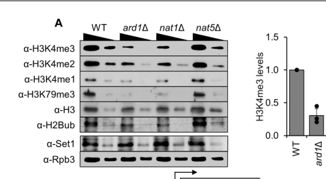

## Question

# Gene Research for Functional Annotation

## ⚠️ CRITICAL: Gene/Protein Identification Context

**BEFORE YOU BEGIN RESEARCH:** You MUST verify you are researching the CORRECT gene/protein. Gene symbols can be ambiguous, especially for less well-characterized genes from non-model organisms.

### Target Gene/Protein Identity (from UniProt):
- **UniProt Accession:** P38827
- **Protein Description:** RecName: Full=Histone-lysine N-methyltransferase, H3 lysine-4 specific {ECO:0000303|PubMed:11805083}; EC=2.1.1.354 {ECO:0000269|PubMed:11805083, ECO:0000305|PubMed:29071121}; AltName: Full=COMPASS component SET1 {ECO:0000303|PubMed:11742990}; AltName: Full=Lysine N-methyltransferase 2; AltName: Full=SET domain-containing protein 1 {ECO:0000303|PubMed:11742990};
- **Gene Information:** Name=SET1 {ECO:0000303|PubMed:9398665}; Synonyms=KMT2 {ECO:0000303|PubMed:18022353}, YTX1; OrderedLocusNames=YHR119W;
- **Organism (full):** Saccharomyces cerevisiae (strain ATCC 204508 / S288c) (Baker's yeast).
- **Protein Family:** Belongs to the class V-like SAM-binding methyltransferase
- **Key Domains:** COMPASS_Set1_N-SET. (IPR024657); Nucleotide-bd_a/b_plait_sf. (IPR012677); Post-SET_dom. (IPR003616); Set1-like. (IPR044570); Set1_fungi. (IPR017111)

### MANDATORY VERIFICATION STEPS:

1. **Check if the gene symbol "SET1" matches the protein description above**
2. **Verify the organism is correct:** Saccharomyces cerevisiae (strain ATCC 204508 / S288c) (Baker's yeast).
3. **Check if protein family/domains align with what you find in literature**
4. **If you find literature for a DIFFERENT gene with the same or similar symbol, STOP**

### If Gene Symbol is Ambiguous or You Cannot Find Relevant Literature:

**DO NOT PROCEED WITH RESEARCH ON A DIFFERENT GENE.** Instead:
- State clearly: "The gene symbol 'SET1' is ambiguous or literature is limited for this specific protein"
- Explain what you found (e.g., "Found extensive literature on a different gene with the same symbol in a different organism")
- Describe the protein based ONLY on the UniProt information provided above
- Suggest that the protein function can be inferred from domain/family information

### Research Target:

Please provide a comprehensive research report on the gene **SET1** (gene ID: SET1, UniProt: P38827) in yeast.

The research report should be a detailed narrative explaining the function, biological processes, and localization of the gene product. Citations should be given for all claims.

You should prioritize authoritative reviews and primary scientific literature when conducting research. You can supplement
this with annotations you find in gene/protein databases, but these can be outdated or inaccurate.

We are specifically interested in the primary function of the gene - for enzymes, what reaction is catalyzed, and what is the substrate specificity? For transporters, what is the substrate? For structural proteins or adapters, what is the broader structural role? For signaling molecules, what is the role in the pathway.

We are interested in where in or outside the cell the gene product carries out its function.

We are also interested in the signaling or biochemical pathways in which the gene functions. We are less interested in broad pleiotropic effects, except where these elucidate the precise role.

Include evidence where possible. We are interested in both experimental evidence as well as inference from structure, evolution, or bioinformatic analysis. Precise studies should be prioritized over high-throughput, where available.

## Output

Question: You are an expert researcher providing comprehensive, well-cited information.

Provide detailed information focusing on:
1. Key concepts and definitions with current understanding
2. Recent developments and latest research (prioritize 2023-2024 sources)
3. Current applications and real-world implementations
4. Expert opinions and analysis from authoritative sources
5. Relevant statistics and data from recent studies

Format as a comprehensive research report with proper citations. Include URLs and publication dates where available.
Always prioritize recent, authoritative sources and provide specific citations for all major claims.

# Gene Research for Functional Annotation

## ⚠️ CRITICAL: Gene/Protein Identification Context

**BEFORE YOU BEGIN RESEARCH:** You MUST verify you are researching the CORRECT gene/protein. Gene symbols can be ambiguous, especially for less well-characterized genes from non-model organisms.

### Target Gene/Protein Identity (from UniProt):
- **UniProt Accession:** P38827
- **Protein Description:** RecName: Full=Histone-lysine N-methyltransferase, H3 lysine-4 specific {ECO:0000303|PubMed:11805083}; EC=2.1.1.354 {ECO:0000269|PubMed:11805083, ECO:0000305|PubMed:29071121}; AltName: Full=COMPASS component SET1 {ECO:0000303|PubMed:11742990}; AltName: Full=Lysine N-methyltransferase 2; AltName: Full=SET domain-containing protein 1 {ECO:0000303|PubMed:11742990};
- **Gene Information:** Name=SET1 {ECO:0000303|PubMed:9398665}; Synonyms=KMT2 {ECO:0000303|PubMed:18022353}, YTX1; OrderedLocusNames=YHR119W;
- **Organism (full):** Saccharomyces cerevisiae (strain ATCC 204508 / S288c) (Baker's yeast).
- **Protein Family:** Belongs to the class V-like SAM-binding methyltransferase
- **Key Domains:** COMPASS_Set1_N-SET. (IPR024657); Nucleotide-bd_a/b_plait_sf. (IPR012677); Post-SET_dom. (IPR003616); Set1-like. (IPR044570); Set1_fungi. (IPR017111)

### MANDATORY VERIFICATION STEPS:

1. **Check if the gene symbol "SET1" matches the protein description above**
2. **Verify the organism is correct:** Saccharomyces cerevisiae (strain ATCC 204508 / S288c) (Baker's yeast).
3. **Check if protein family/domains align with what you find in literature**
4. **If you find literature for a DIFFERENT gene with the same or similar symbol, STOP**

### If Gene Symbol is Ambiguous or You Cannot Find Relevant Literature:

**DO NOT PROCEED WITH RESEARCH ON A DIFFERENT GENE.** Instead:
- State clearly: "The gene symbol 'SET1' is ambiguous or literature is limited for this specific protein"
- Explain what you found (e.g., "Found extensive literature on a different gene with the same symbol in a different organism")
- Describe the protein based ONLY on the UniProt information provided above
- Suggest that the protein function can be inferred from domain/family information

### Research Target:

Please provide a comprehensive research report on the gene **SET1** (gene ID: SET1, UniProt: P38827) in yeast.

The research report should be a detailed narrative explaining the function, biological processes, and localization of the gene product. Citations should be given for all claims.

You should prioritize authoritative reviews and primary scientific literature when conducting research. You can supplement
this with annotations you find in gene/protein databases, but these can be outdated or inaccurate.

We are specifically interested in the primary function of the gene - for enzymes, what reaction is catalyzed, and what is the substrate specificity? For transporters, what is the substrate? For structural proteins or adapters, what is the broader structural role? For signaling molecules, what is the role in the pathway.

We are interested in where in or outside the cell the gene product carries out its function.

We are also interested in the signaling or biochemical pathways in which the gene functions. We are less interested in broad pleiotropic effects, except where these elucidate the precise role.

Include evidence where possible. We are interested in both experimental evidence as well as inference from structure, evolution, or bioinformatic analysis. Precise studies should be prioritized over high-throughput, where available.

## Research Report: *Saccharomyces cerevisiae* SET1 (UniProt P38827; gene SET1/YHR119W)

### 0) Scope, identity verification, and disambiguation
The target protein is *Saccharomyces cerevisiae* Set1 (gene **SET1**, locus **YHR119W**; UniProt **P38827** as provided by the user), the founding member of the SET-domain KMT2/SET1 family and the **sole H3K4 methyltransferase in budding yeast**, functioning as the catalytic subunit of the **COMPASS** (COMplex of Proteins ASSociated with Set1) complex. This yeast Set1/COMPASS context is explicitly described in yeast-specific 2023–2024 literature (not metazoan KMT2s), and the reported complex composition and activity (H3K4me1/2/3) match the UniProt description provided (deshpande2023diverseanddynamic pages 1-2, woo2024nterminalacetylationof pages 1-2).

### 1) Key concepts and definitions (current understanding)

#### 1.1 Histone H3K4 methylation states
Set1/COMPASS deposits methyl groups on **histone H3 lysine 4 (H3K4)** in three states: **mono- (me1), di- (me2), and tri-methylation (me3)** (deshpande2023diverseanddynamic pages 1-2, woo2024nterminalacetylationof pages 1-2). These states are nonredundant chromatin signals with characteristic genomic distributions in yeast: **H3K4me3** is typically promoter/TSS-proximal, **H3K4me2** is enriched over the **5′ transcribed region**, and **H3K4me1** tends to accumulate further toward **3′ gene regions** (woo2024nterminalacetylationof pages 1-2, deshpande2023diverseanddynamic pages 3-5).

#### 1.2 COMPASS as the catalytic platform for Set1
Set1 functions **within** COMPASS rather than as a solitary enzyme; COMPASS is an eight-subunit complex consisting of Set1 plus seven accessory subunits (Swd3/Cps30, Swd1/Cps50, Bre2/Cps60, Sdc1/Cps25, Spp1/Cps40, Swd2/Cps35, Shg1/Cps15) (woo2024nterminalacetylationof pages 1-2). A WRAD-like module (Swd3/Swd1/Bre2/Sdc1) parallels the conserved metazoan scaffolding of SET1/KMT2 complexes and supports catalytic output (woo2024nterminalacetylationof pages 1-2).

A yeast-focused synthesis also reports COMPASS subunit stoichiometries (Set1 (2), Swd1 (1), Swd2 (1), Swd3 (1), Bre2 (2), Spp1 (2), Sdc1 (1), Shg1 (1)) (deshpande2023diverseanddynamic pages 1-2).

#### 1.3 Trans-histone crosstalk: H2B ubiquitination → H3K4 methylation
A defining regulatory principle for Set1/COMPASS is **trans-histone crosstalk** in which **H2B monoubiquitination at K123 (H2BK123ub)** (installed by Rad6/Bre1) is required for normal levels of **H3K4 di- and tri-methylation** by COMPASS (deshpande2023diverseanddynamic pages 6-7, serranoquilez2025unravelinggeneexpression pages 2-5). Mechanistically, COMPASS engages ubiquitinated nucleosomes with one face contacting ubiquitin and another contacting the H3 tail; structural descriptions place ubiquitin on the Set1 n-SET helix with contacts to Swd1 and Bre2 (deshpande2023diverseanddynamic pages 6-7).

### 2) Molecular function: reaction catalyzed and substrate specificity

#### 2.1 Enzymatic reaction
Set1 is a **SAM-dependent histone-lysine N-methyltransferase** (EC 2.1.1.354 as in UniProt; consistent with literature) that catalyzes methyl transfer onto **H3K4** to generate H3K4me1/2/3 in vivo (deshpande2023diverseanddynamic pages 1-2, woo2024nterminalacetylationof pages 1-2). In budding yeast, Set1 is described as the **only enzyme** responsible for all H3K4 methylation states genome-wide (deshpande2023diverseanddynamic pages 3-5).

#### 2.2 Functional specialization across methylation states
A yeast-centered 2023 review summarizes that H3K4me3 commonly correlates with active transcription near 5′ gene ends, whereas H3K4me2 has been linked to repressive or other non-activating functions in some contexts, and H3K4me1 can contribute to repression of subsets of stress/DNA-damage inducible genes (context-dependent) (deshpande2023diverseanddynamic pages 7-9). This diversity underlies ongoing debate on whether H3K4 methylation is a causal regulator of transcription versus a by-product of transcription-coupled recruitment (deshpande2023diverseanddynamic pages 7-9).

### 3) Regulation and pathway context (how Set1/COMPASS is controlled)

#### 3.1 Co-transcriptional recruitment via RNA polymerase II CTD
Set1/COMPASS preferentially associates with **actively transcribed genes** by interacting with the **phosphorylated C-terminal domain (CTD)** of Rpb1 (RNA polymerase II largest subunit) (woo2024nterminalacetylationof pages 1-2). A yeast review further states COMPASS associates with phosphorylated Pol II near 5′ gene ends via PAF1 component Ctr9, and that the Set1 N-terminus (aa 1–200) and Swd2 contribute to Pol II interaction; Set1 also contains RNA-recognition motifs and binds mRNA co-/post-transcriptionally, with RNA binding contributing particularly to H3K4me3 deposition (deshpande2023diverseanddynamic pages 5-6).

#### 3.2 H2BK123ub pathway inputs: Rad6/Bre1, PAF1C, and Bur1/2
H2BK123ub is installed by Rad6 (E2) with Bre1 (E3) and is promoted by transcription-associated factors including the **PAF1 complex**; loss of Rad6 or PAF1C components can abolish H2B ubiquitination and thus disrupt downstream H3K4 methylation (deshpande2023diverseanddynamic pages 6-7, serranoquilez2025unravelinggeneexpression pages 2-5). Bur1/Bur2 kinase promotes this pathway by phosphorylating Rad6 (Ser120) and enhancing H2B ubiquitination (deshpande2023diverseanddynamic pages 6-7, serranoquilez2025unravelinggeneexpression pages 2-5).

A quantitative perspective from a yeast gene-expression review notes that ubiquitinated H2B can be **<10% of total H2B** while still acting as a key activating signal for downstream chromatin processes (serranoquilez2025unravelinggeneexpression pages 2-5).

#### 3.3 Swd2 as a regulatory nexus for H2Bub-dependent H3K4me3
A major 2024 advance is the explicit genome-scale mapping of Set1/COMPASS interplay with **Swd2/Cps35** and **Rad6/H2Bub**. Oh et al. (BMC Biology, May 2024; https://doi.org/10.1186/s12915-024-01903-3) analyzed occupancy across **n = 6020 protein-coding genes** and found that Swd2 peaks occur near both 5′ and 3′ gene regions, corresponding to its presence in both COMPASS and the 3′-end cleavage/polyadenylation factor (CPF) complex (oh2024swd2cps35determinesh3k4 pages 1-2, oh2024swd2cps35determinesh3k4 pages 6-9). They report that **Rad6 catalytic activity** is essential for Swd2 chromatin binding and that Set1 helps redistribute a limited Swd2 pool toward 5′ regions to achieve genome-wide H3K4me3 (oh2024swd2cps35determinesh3k4 pages 1-2).

#### 3.4 Newly identified post-translational regulation: N-terminal acetylation of COMPASS subunits (2024)
Woo et al. (Science Advances, Jul 2024; https://doi.org/10.1126/sciadv.adl6280) report that N-terminal acetyltransferases (NATs) can modulate COMPASS output. NatA is required for N-terminal acetylation of Shg1, Spp1, and Swd2, and NatA deletion decreases global H3K4me3 and shifts H3K4me2 localization toward promoters (woo2024nterminalacetylationof pages 1-2). Figure-level evidence shows NatA-component deletions (ard1Δ or nat1Δ) reduce global H3K4me3/2/1 by immunoblot, and metagene profiles show reduced H3K4me3 at TSS and H3K4me2 peak shifts (woo2024nterminalacetylationof media 722832c6, woo2024nterminalacetylationof media 87743e60). The same study reports that blocking Shg1 N-terminal acetylation (shg1A2P) reduces global H3K4 methylation (woo2024nterminalacetylationof media 53ca2d54).

### 4) Cellular localization and where Set1 functions
Set1/COMPASS is a nuclear chromatin regulator whose functional activity is observed at **actively transcribed genes** with **promoter/TSS enrichment** of Set1 and H3K4me3 and a downstream gradient of H3K4 methylation states across gene bodies (woo2024nterminalacetylationof pages 1-2, deshpande2023diverseanddynamic pages 3-5). Genome-scale occupancy mapping indicates Swd2’s dual localization near 5′ and 3′ ends reflects its participation in COMPASS and CPF, respectively (oh2024swd2cps35determinesh3k4 pages 1-2).

### 5) Biological roles and processes (mechanistically informed)

#### 5.1 Transcriptional regulation (activation and repression, context-dependent)
A 2023 yeast-focused review emphasizes Set1’s “diverse and dynamic” regulation of gene expression and highlights that distinct H3K4 methylation states can have distinct regulatory outcomes depending on genomic and physiological context (deshpande2023diverseanddynamic pages 7-9). A 2024 review discussing multiple organisms (including yeast evidence) frames an active area of expert debate: whether H3K4 methylation is purely correlative with transcription or plays direct functional roles; the review summarizes approaches used to test causality (histone residue mutation, modifier manipulation, epigenetic editing) (woo2024nterminalacetylationof pages 1-2).

#### 5.2 Telomere maintenance and subtelomeric gene repression (primary 2023 evidence)
Jezek et al. (Molecular Biology of the Cell, Jan 2023; https://doi.org/10.1091/mbc.e22-06-0213) show that **set1Δ** causes **shortened telomeres** and **derepression of subtelomeric genes**, and that Set1 impacts additional telomere-associated phenotypes such as telomere clustering and telomerase-related senescence interactions (jezek2023set1regulatestelomere pages 2-3, jezek2023set1regulatestelomere pages 1-2). They further dissect mechanistic dependence:
- Subtelomeric gene repression is strongly linked to Set1’s catalytic activity and H3K4 methylation (jezek2023set1regulatestelomere pages 1-2).
- Telomere length maintenance appears to require the Set1 catalytic core but is not strictly explained by H3K4 methylation status alone, implying a partially H3K4-substrate–independent catalytic role or additional substrates (jezek2023set1regulatestelomere pages 3-4, jezek2023set1regulatestelomere pages 1-2).

Quantitative evidence in this study includes a thiolutin transcription shutoff experiment indicating altered EST3 mRNA turnover in set1Δ (shorter half-life; **P = 0.013**) (jezek2023set1regulatestelomere pages 8-9).

They also report Set1-dependent calibration of steady-state abundance of telomere factors (CST components and telomerase holoenzyme factors) through transcriptional and post-transcriptional effects (jezek2023set1regulatestelomere pages 9-10, jezek2023set1regulatestelomere pages 1-2).

#### 5.3 DNA double-strand break (DSB) chromatin and replication origins (reviewed mechanisms)
A yeast review summarizes that H3K4me3 can accumulate near DSBs and that Set1/H3K4me3 are recruited to damage sites (including RSC dependence), suggesting Set1 shapes local chromatin at breaks and influences repair pathway decisions (deshpande2023diverseanddynamic pages 12-13). The same synthesis notes H3K4me2/3 enrichment at replication origins and a role in efficient DNA replication, extending Set1’s mechanistic relevance beyond transcription (deshpande2023diverseanddynamic pages 12-13).

### 6) Recent developments (prioritizing 2023–2024)
Key 2023–2024 advances for yeast Set1 functional annotation include:
1. **Comprehensive yeast-focused synthesis of mechanisms and phenotypes**: Deshpande & Bryk (Current Genetics, Mar 2023; https://doi.org/10.1007/s00294-023-01265-3) integrates structural, genetic, and transcriptional evidence for Set1/COMPASS, including crosstalk with H2BK123ub and links to telomeric/rDNA chromatin (deshpande2023diverseanddynamic pages 6-7, deshpande2023diverseanddynamic pages 1-2).
2. **Genome-scale mechanistic mapping of Swd2–Rad6–Set1 relationships**: Oh et al. (BMC Biology, May 2024; https://doi.org/10.1186/s12915-024-01903-3) connect Rad6 catalytic activity to Swd2 chromatin binding and Set1-driven redistribution of Swd2 to 5′ gene regions, supporting H3K4me3 establishment across **6020 genes** (oh2024swd2cps35determinesh3k4 pages 1-2, oh2024swd2cps35determinesh3k4 pages 6-9).
3. **Discovery of NAT-mediated tuning of COMPASS output**: Woo et al. (Science Advances, Jul 2024; https://doi.org/10.1126/sciadv.adl6280) identify N-terminal acetylation of COMPASS subunits (notably Shg1) as a direct determinant of global H3K4 methylation patterns; immunoblot and metagene evidence show reduced H3K4me3 and redistribution of H3K4me2 in NatA mutants (woo2024nterminalacetylationof media 722832c6, woo2024nterminalacetylationof media 87743e60).

### 7) Current applications and real-world implementations

1. **Yeast as a mechanistic platform for conserved H3K4 methylation biology**: Budding yeast Set1/COMPASS is repeatedly used as a reference model for conserved SET1/KMT2 regulation and histone crosstalk (H2Bub → H3K4me), because yeast has a single H3K4 methyltransferase, simplifying causal inference from genetics and chromatin profiling (woo2024nterminalacetylationof pages 1-2, deshpande2023diverseanddynamic pages 7-9).
2. **Genome-wide chromatin mapping to connect enzymatic regulation with transcription architecture**: The 2024 Swd2/Rad6/Set1 work demonstrates a real-world implementation pattern common in the field: ChIP-seq occupancy mapping across essentially all protein-coding genes to resolve competing models of factor recruitment and redistribution (oh2024swd2cps35determinesh3k4 pages 1-2, oh2024swd2cps35determinesh3k4 pages 6-9).
3. **Functional dissection through perturbation of complex subunits and post-translational regulation**: The 2024 NAT/acetylation study illustrates a generalizable approach in chromatin biology: modulating modifying-enzyme systems (NATs) and subunit N-termini to reprogram global histone modification patterns and test mechanistic dependencies (woo2024nterminalacetylationof pages 1-2, woo2024nterminalacetylationof media 722832c6).

### 8) Statistics and quantitative data highlights (from included sources)
- **Oh et al. 2024**: genome-wide analysis across **6020 protein-coding genes**; Rad6 catalytic activity dependence of Swd2 chromatin binding and Set1-dependent redistribution of Swd2 toward 5′ regions (oh2024swd2cps35determinesh3k4 pages 1-2, oh2024swd2cps35determinesh3k4 pages 6-9).
- **H2Bub abundance**: ubiquitinated H2B reported as **<10% of total H2B** in yeast (serranoquilez2025unravelinggeneexpression pages 2-5).
- **Jezek et al. 2023**: Set1 loss accelerates EST3 transcript turnover in a thiolutin shutoff assay (**P = 0.013**) and alters abundance of multiple telomere maintenance factors (jezek2023set1regulatestelomere pages 8-9, jezek2023set1regulatestelomere pages 9-10).
- **Woo et al. 2024**: figure evidence demonstrates global reductions of H3K4 methylation states (H3K4me3/2/1) in NatA mutants and H3K4me distribution shifts toward promoters (woo2024nterminalacetylationof media 722832c6, woo2024nterminalacetylationof media 87743e60).

### 9) Consolidated synthesis table
The following table consolidates key functional annotation points, regulatory inputs, biological roles, and recent 2023–2024 sources with DOIs/URLs.

| Topic | Key finding | Evidence type (review/primary) | Source (short citation) | DOI/URL | Year |
|---|---|---|---|---|---|
| Identity and core function | **SET1/YHR119W (UniProt P38827)** in *Saccharomyces cerevisiae* is the sole H3K4-specific SET-domain histone methyltransferase in budding yeast and the catalytic subunit of COMPASS; it deposits H3K4me1, H3K4me2, and H3K4me3 on chromatin (deshpande2023diverseanddynamic pages 1-2, woo2024nterminalacetylationof pages 1-2) | Review + primary | Deshpande & Bryk 2023; Woo et al. 2024 | https://doi.org/10.1007/s00294-023-01265-3 ; https://doi.org/10.1126/sciadv.adl6280 | Mar 2023; Jul 2024 |
| Reaction and substrate specificity | Set1/COMPASS catalyzes SAM-dependent methylation of **histone H3 Lys4**; canonical distribution is H3K4me3 at promoter/TSS-proximal regions, H3K4me2 in 5′ transcribed/coding regions, and H3K4me1 further downstream toward 3′ regions (woo2024nterminalacetylationof pages 1-2, serranoquilez2025unravelinggeneexpression pages 5-6) | Primary + review | Woo et al. 2024; Serrano-Quílez & Rodriguez-Navarro 2025 | https://doi.org/10.1126/sciadv.adl6280 ; https://doi.org/10.1080/19491034.2025.2516909 | Jul 2024; Jun 2025 |
| COMPASS composition | Yeast COMPASS is an eight-subunit complex: Set1, Swd1/Cps50, Swd2/Cps35, Swd3/Cps30, Bre2/Cps60, Sdc1/Cps25, Spp1/Cps40, and Shg1/Cps15; the WRAD-like catalytic core includes Swd1, Swd3, Bre2, and Sdc1 (woo2024nterminalacetylationof pages 1-2, deshpande2023diverseanddynamic pages 1-2) | Primary + review | Woo et al. 2024; Deshpande & Bryk 2023 | https://doi.org/10.1126/sciadv.adl6280 ; https://doi.org/10.1007/s00294-023-01265-3 | Jul 2024; Mar 2023 |
| COMPASS architecture and roles | Spp1 binds the **nSET** region and contributes particularly to H3K4me3; Swd2 is unique because it is both a COMPASS subunit and a CPF/3′-end processing factor; dimeric COMPASS supports symmetric H3K4me3 on nucleosomes (deshpande2023diverseanddynamic pages 3-5, serranoquilez2025unravelinggeneexpression pages 5-6, oh2024swd2cps35determinesh3k4 pages 1-2) | Review + primary | Deshpande & Bryk 2023; Oh et al. 2024 | https://doi.org/10.1007/s00294-023-01265-3 ; https://doi.org/10.1186/s12915-024-01903-3 | Mar 2023; May 2024 |
| Pol II-coupled recruitment | Set1/COMPASS is recruited **co-transcriptionally** to active genes via interaction with the phosphorylated Rpb1 CTD; recent summaries emphasize Ser5-phosphorylated Pol II CTD and Set1 N-terminal/Swd2-dependent recruitment to 5′ gene regions (deshpande2023diverseanddynamic pages 5-6, woo2024nterminalacetylationof pages 1-2) | Review + primary | Deshpande & Bryk 2023; Woo et al. 2024 | https://doi.org/10.1007/s00294-023-01265-3 ; https://doi.org/10.1126/sciadv.adl6280 | Mar 2023; Jul 2024 |
| H2Bub trans-histone crosstalk | H3K4 di- and tri-methylation by Set1/COMPASS depends on prior **H2BK123 monoubiquitination** by Rad6 (E2) and Bre1 (E3); this is a central trans-histone crosstalk pathway regulating H3K4me3 competence (serranoquilez2025unravelinggeneexpression pages 2-5, deshpande2023diverseanddynamic pages 6-7) | Review | Deshpande & Bryk 2023; Serrano-Quílez & Rodriguez-Navarro 2025 | https://doi.org/10.1007/s00294-023-01265-3 ; https://doi.org/10.1080/19491034.2025.2516909 | Mar 2023; Jun 2025 |
| Quantitative note on H2Bub | H2BK123ub is a low-abundance but critical activating signal for COMPASS; one review notes ubiquitinated H2B is **<10% of total H2B** in yeast, underscoring a tightly regulated modification with disproportionate functional impact (serranoquilez2025unravelinggeneexpression pages 2-5) | Review | Serrano-Quílez & Rodriguez-Navarro 2025 | https://doi.org/10.1080/19491034.2025.2516909 | Jun 2025 |
| PAF1 complex input | The **PAF1 complex (Paf1, Ctr9, Rtf1, Leo1, Cdc73)** promotes H2BK123ub and thereby supports Set1-dependent H3K4 methylation; Rtf1 stimulates Rad6 activity and FACT helps PAF1 recruitment to transcribed chromatin (serranoquilez2025unravelinggeneexpression pages 2-5, deshpande2023diverseanddynamic pages 5-6) | Review | Serrano-Quílez & Rodriguez-Navarro 2025; Deshpande & Bryk 2023 | https://doi.org/10.1080/19491034.2025.2516909 ; https://doi.org/10.1007/s00294-023-01265-3 | Jun 2025; Mar 2023 |
| Bur1/2 kinase input | The **Bur1/Bur2 kinase complex** stimulates H2BK123ub by phosphorylating Rad6 at Ser120 and promoting PAF1C recruitment, thereby indirectly enhancing Set1-dependent H3K4 methylation (deshpande2023diverseanddynamic pages 6-7, serranoquilez2025unravelinggeneexpression pages 2-5) | Review | Deshpande & Bryk 2023; Serrano-Quílez & Rodriguez-Navarro 2025 | https://doi.org/10.1007/s00294-023-01265-3 ; https://doi.org/10.1080/19491034.2025.2516909 | Mar 2023; Jun 2025 |
| Swd2/Rad6 control of H3K4me3 | In a 2024 genome-wide analysis across **6020 protein-coding genes**, Rad6 catalytic activity was required for Swd2 chromatin binding; without Set1, Swd2 shifted from 5′ to 3′ regions, showing Set1 redistributes a limited Swd2 pool to promoter-proximal chromatin for H3K4me3 (oh2024swd2cps35determinesh3k4 pages 1-2, oh2024swd2cps35determinesh3k4 pages 6-9) | Primary | Oh et al. 2024 | https://doi.org/10.1186/s12915-024-01903-3 | May 2024 |
| NAT-dependent regulation | A 2024 study showed **NatA-mediated N-terminal acetylation** of Shg1, Spp1, and Swd2, and likely NatB action on Swd1, fine-tunes H3K4 methylation; deleting NatA substantially reduced global H3K4me3 and shifted H3K4me2 peaks toward promoters, while blocking Shg1 N-acetylation drastically reduced H3K4 methylation (woo2024nterminalacetylationof pages 1-2) | Primary | Woo et al. 2024 | https://doi.org/10.1126/sciadv.adl6280 | Jul 2024 |
| Nuclear/chromatin localization | Set1 functions on **nuclear chromatin** at actively transcribed genes; H3K4me3 and Set1 are enriched near promoter/TSS-proximal nucleosomes, with gradients beginning near nucleosome +1 and decaying downstream from promoters (luciano2026asystematicinteractome pages 1-4, woo2024nterminalacetylationof pages 1-2) | Primary + later synthesis | Woo et al. 2024; Luciano et al. 2026 | https://doi.org/10.1126/sciadv.adl6280 ; https://doi.org/10.1101/2025.11.23.690026 | Jul 2024; Apr 2026 |
| Transcriptional regulation | Expert synthesis in 2023-2024 emphasizes that Set1-dependent H3K4 methylation has **diverse and dynamic** roles in transcription, including promoter-associated activation, context-dependent repression, and coupling to transcriptional history through repeated Pol II passage (deshpande2023diverseanddynamic pages 5-6, deshpande2023diverseanddynamic pages 7-9) | Review | Deshpande & Bryk 2023; Yu & Lesch 2024 | https://doi.org/10.1007/s00294-023-01265-3 ; https://doi.org/10.1080/10985549.2024.2388254 | Mar 2023; Aug 2024 |
| Telomere maintenance | Set1 regulates telomere biology through both **H3K4 methylation-dependent and -independent** pathways: subtelomeric repression tracks strongly with H3K4 methylation, whereas telomere length maintenance appears to require Set1 catalytic/core function but is not strictly explained by H3K4 methylation status alone (jezek2023set1regulatestelomere pages 9-10, jezek2023set1regulatestelomere pages 8-9, jezek2023set1regulatestelomere pages 1-2) | Primary | Jezek et al. 2023 | https://doi.org/10.1091/mbc.e22-06-0213 | Jan 2023 |
| Telomere phenotypes and factors | In set1Δ cells, telomeres are shortened and subtelomeric genes are derepressed; Set1 also calibrates abundance of telomere factors including **STN1, CDC13, EST1, EST3, TEN1, TLC1**, with both transcriptional and post-transcriptional effects (jezek2023set1regulatestelomere pages 9-10, jezek2023set1regulatestelomere pages 2-3, jezek2023set1regulatestelomere pages 1-2) | Primary | Jezek et al. 2023 | https://doi.org/10.1091/mbc.e22-06-0213 | Jan 2023 |
| DNA double-strand break biology | Set1-dependent H3K4me3 accumulates near DSBs and declines with distance from the break; Set1 and H3K4me3 are recruited to damage sites, linking Set1 to chromatin-based DNA repair control (deshpande2023diverseanddynamic pages 12-13) | Review | Deshpande & Bryk 2023 | https://doi.org/10.1007/s00294-023-01265-3 | Mar 2023 |
| Replication origin function | H3K4me2/3 deposited by Set1 are enriched at **origins of replication** and contribute to efficient DNA replication, extending Set1 function beyond transcription into DNA replication-associated chromatin control (deshpande2023diverseanddynamic pages 12-13) | Review | Deshpande & Bryk 2023 | https://doi.org/10.1007/s00294-023-01265-3 | Mar 2023 |
| Recent expert view | Recent expert reviews argue that H3K4 methylation is not merely a passive mark of transcription but can directly shape chromatin openness and transcriptional activation in a context-dependent manner, with yeast Set1/COMPASS remaining a foundational mechanistic model (deshpande2023diverseanddynamic pages 7-9, deshpande2023diverseanddynamic pages 1-2) | Review | Yu & Lesch 2024; Deshpande & Bryk 2023 | https://doi.org/10.1080/10985549.2024.2388254 ; https://doi.org/10.1007/s00294-023-01265-3 | Aug 2024; Mar 2023 |

*Table: This table summarizes the key functional annotation points for Saccharomyces cerevisiae Set1/COMPASS, including its catalytic activity, complex composition, regulatory inputs, chromatin localization, and major biological roles. It highlights recent 2023-2024 evidence and provides DOI-linked sources for rapid verification.*

### 10) Limitations of this report (evidence boundaries)
This tool-based report is constrained to the retrieved full texts. Several foundational structural papers and some specialized chapters were listed as “unobtainable” by the search tool, so detailed kinetic constants and some structure-derived numerical parameters were not available in the accessible excerpts. Where only qualitative statements were available (e.g., “substantially decreased” global H3K4me3), the report avoids inventing numeric effect sizes and instead cites figure evidence directly (woo2024nterminalacetylationof media 722832c6, woo2024nterminalacetylationof media 87743e60).

References

1. (deshpande2023diverseanddynamic pages 1-2): Neha Deshpande and Mary Bryk. Diverse and dynamic forms of gene regulation by the s. cerevisiae histone methyltransferase set1. Current Genetics, 69:91-114, Mar 2023. URL: https://doi.org/10.1007/s00294-023-01265-3, doi:10.1007/s00294-023-01265-3. This article has 7 citations and is from a peer-reviewed journal.

2. (woo2024nterminalacetylationof pages 1-2): Hyeonju Woo, Junsoo Oh, Yong-Joon Cho, Goo Taeg Oh, Seon-Young Kim, Kisoon Dan, Dohyun Han, Jung-Shin Lee, and TaeSoo Kim. N-terminal acetylation of set1-compass fine-tunes h3k4 methylation patterns. Science Advances, Jul 2024. URL: https://doi.org/10.1126/sciadv.adl6280, doi:10.1126/sciadv.adl6280. This article has 8 citations and is from a highest quality peer-reviewed journal.

3. (deshpande2023diverseanddynamic pages 3-5): Neha Deshpande and Mary Bryk. Diverse and dynamic forms of gene regulation by the s. cerevisiae histone methyltransferase set1. Current Genetics, 69:91-114, Mar 2023. URL: https://doi.org/10.1007/s00294-023-01265-3, doi:10.1007/s00294-023-01265-3. This article has 7 citations and is from a peer-reviewed journal.

4. (deshpande2023diverseanddynamic pages 6-7): Neha Deshpande and Mary Bryk. Diverse and dynamic forms of gene regulation by the s. cerevisiae histone methyltransferase set1. Current Genetics, 69:91-114, Mar 2023. URL: https://doi.org/10.1007/s00294-023-01265-3, doi:10.1007/s00294-023-01265-3. This article has 7 citations and is from a peer-reviewed journal.

5. (serranoquilez2025unravelinggeneexpression pages 2-5): Joan Serrano-Quílez and Susana Rodriguez-Navarro. Unraveling gene expression: a beginner’s guide from chromatin modifications to mrna export in saccharomyces cerevisiae. Nucleus, Jun 2025. URL: https://doi.org/10.1080/19491034.2025.2516909, doi:10.1080/19491034.2025.2516909. This article has 1 citations and is from a peer-reviewed journal.

6. (deshpande2023diverseanddynamic pages 7-9): Neha Deshpande and Mary Bryk. Diverse and dynamic forms of gene regulation by the s. cerevisiae histone methyltransferase set1. Current Genetics, 69:91-114, Mar 2023. URL: https://doi.org/10.1007/s00294-023-01265-3, doi:10.1007/s00294-023-01265-3. This article has 7 citations and is from a peer-reviewed journal.

7. (deshpande2023diverseanddynamic pages 5-6): Neha Deshpande and Mary Bryk. Diverse and dynamic forms of gene regulation by the s. cerevisiae histone methyltransferase set1. Current Genetics, 69:91-114, Mar 2023. URL: https://doi.org/10.1007/s00294-023-01265-3, doi:10.1007/s00294-023-01265-3. This article has 7 citations and is from a peer-reviewed journal.

8. (oh2024swd2cps35determinesh3k4 pages 1-2): Junsoo Oh, Shinae Park, Jueun Kim, Soojin Yeom, Ji Min Lee, Eun-Jin Lee, Yong-Joon Cho, and Jung-Shin Lee. Swd2/cps35 determines h3k4 tri-methylation via interactions with set1 and rad6. BMC Biology, May 2024. URL: https://doi.org/10.1186/s12915-024-01903-3, doi:10.1186/s12915-024-01903-3. This article has 4 citations and is from a domain leading peer-reviewed journal.

9. (oh2024swd2cps35determinesh3k4 pages 6-9): Junsoo Oh, Shinae Park, Jueun Kim, Soojin Yeom, Ji Min Lee, Eun-Jin Lee, Yong-Joon Cho, and Jung-Shin Lee. Swd2/cps35 determines h3k4 tri-methylation via interactions with set1 and rad6. BMC Biology, May 2024. URL: https://doi.org/10.1186/s12915-024-01903-3, doi:10.1186/s12915-024-01903-3. This article has 4 citations and is from a domain leading peer-reviewed journal.

10. (woo2024nterminalacetylationof media 722832c6): Hyeonju Woo, Junsoo Oh, Yong-Joon Cho, Goo Taeg Oh, Seon-Young Kim, Kisoon Dan, Dohyun Han, Jung-Shin Lee, and TaeSoo Kim. N-terminal acetylation of set1-compass fine-tunes h3k4 methylation patterns. Science Advances, Jul 2024. URL: https://doi.org/10.1126/sciadv.adl6280, doi:10.1126/sciadv.adl6280. This article has 8 citations and is from a highest quality peer-reviewed journal.

11. (woo2024nterminalacetylationof media 87743e60): Hyeonju Woo, Junsoo Oh, Yong-Joon Cho, Goo Taeg Oh, Seon-Young Kim, Kisoon Dan, Dohyun Han, Jung-Shin Lee, and TaeSoo Kim. N-terminal acetylation of set1-compass fine-tunes h3k4 methylation patterns. Science Advances, Jul 2024. URL: https://doi.org/10.1126/sciadv.adl6280, doi:10.1126/sciadv.adl6280. This article has 8 citations and is from a highest quality peer-reviewed journal.

12. (woo2024nterminalacetylationof media 53ca2d54): Hyeonju Woo, Junsoo Oh, Yong-Joon Cho, Goo Taeg Oh, Seon-Young Kim, Kisoon Dan, Dohyun Han, Jung-Shin Lee, and TaeSoo Kim. N-terminal acetylation of set1-compass fine-tunes h3k4 methylation patterns. Science Advances, Jul 2024. URL: https://doi.org/10.1126/sciadv.adl6280, doi:10.1126/sciadv.adl6280. This article has 8 citations and is from a highest quality peer-reviewed journal.

13. (jezek2023set1regulatestelomere pages 2-3): Meagan Jezek, Winny Sun, Maraki Y. Negesse, Zachary M. Smith, Alexander Orosz, and Erin M. Green. Set1 regulates telomere function via h3k4 methylation–dependent and -independent pathways and calibrates the abundance of telomere maintenance factors. Molecular Biology of the Cell, Jan 2023. URL: https://doi.org/10.1091/mbc.e22-06-0213, doi:10.1091/mbc.e22-06-0213. This article has 7 citations and is from a domain leading peer-reviewed journal.

14. (jezek2023set1regulatestelomere pages 1-2): Meagan Jezek, Winny Sun, Maraki Y. Negesse, Zachary M. Smith, Alexander Orosz, and Erin M. Green. Set1 regulates telomere function via h3k4 methylation–dependent and -independent pathways and calibrates the abundance of telomere maintenance factors. Molecular Biology of the Cell, Jan 2023. URL: https://doi.org/10.1091/mbc.e22-06-0213, doi:10.1091/mbc.e22-06-0213. This article has 7 citations and is from a domain leading peer-reviewed journal.

15. (jezek2023set1regulatestelomere pages 3-4): Meagan Jezek, Winny Sun, Maraki Y. Negesse, Zachary M. Smith, Alexander Orosz, and Erin M. Green. Set1 regulates telomere function via h3k4 methylation–dependent and -independent pathways and calibrates the abundance of telomere maintenance factors. Molecular Biology of the Cell, Jan 2023. URL: https://doi.org/10.1091/mbc.e22-06-0213, doi:10.1091/mbc.e22-06-0213. This article has 7 citations and is from a domain leading peer-reviewed journal.

16. (jezek2023set1regulatestelomere pages 8-9): Meagan Jezek, Winny Sun, Maraki Y. Negesse, Zachary M. Smith, Alexander Orosz, and Erin M. Green. Set1 regulates telomere function via h3k4 methylation–dependent and -independent pathways and calibrates the abundance of telomere maintenance factors. Molecular Biology of the Cell, Jan 2023. URL: https://doi.org/10.1091/mbc.e22-06-0213, doi:10.1091/mbc.e22-06-0213. This article has 7 citations and is from a domain leading peer-reviewed journal.

17. (jezek2023set1regulatestelomere pages 9-10): Meagan Jezek, Winny Sun, Maraki Y. Negesse, Zachary M. Smith, Alexander Orosz, and Erin M. Green. Set1 regulates telomere function via h3k4 methylation–dependent and -independent pathways and calibrates the abundance of telomere maintenance factors. Molecular Biology of the Cell, Jan 2023. URL: https://doi.org/10.1091/mbc.e22-06-0213, doi:10.1091/mbc.e22-06-0213. This article has 7 citations and is from a domain leading peer-reviewed journal.

18. (deshpande2023diverseanddynamic pages 12-13): Neha Deshpande and Mary Bryk. Diverse and dynamic forms of gene regulation by the s. cerevisiae histone methyltransferase set1. Current Genetics, 69:91-114, Mar 2023. URL: https://doi.org/10.1007/s00294-023-01265-3, doi:10.1007/s00294-023-01265-3. This article has 7 citations and is from a peer-reviewed journal.

19. (serranoquilez2025unravelinggeneexpression pages 5-6): Joan Serrano-Quílez and Susana Rodriguez-Navarro. Unraveling gene expression: a beginner’s guide from chromatin modifications to mrna export in saccharomyces cerevisiae. Nucleus, Jun 2025. URL: https://doi.org/10.1080/19491034.2025.2516909, doi:10.1080/19491034.2025.2516909. This article has 1 citations and is from a peer-reviewed journal.

20. (luciano2026asystematicinteractome pages 1-4): Pierre Luciano, Kihyun Park, Stéphane Audebert, Luc Camoin, Carlos A. Niño, Da Kyeong Park, Isabella E. Maudlin, Marion Dubarry, Lara Lee, Marlene Oeffinger, Jean D. Beggs, Young Hye Kim, Jaehoon Kim, Bernhard Dichtl, and Vincent Géli. A systematic interactome of set1c expands its functional landscape and identifies candidate regulatory connections. bioRxiv, Apr 2026. URL: https://doi.org/10.1101/2025.11.23.690026, doi:10.1101/2025.11.23.690026. This article has 0 citations.

## Artifacts

- [Edison artifact artifact-00](SET1-deep-research-falcon_artifacts/artifact-00.md)

## Citations

1. woo2024nterminalacetylationof pages 1-2
2. deshpande2023diverseanddynamic pages 1-2
3. deshpande2023diverseanddynamic pages 6-7
4. deshpande2023diverseanddynamic pages 3-5
5. deshpande2023diverseanddynamic pages 7-9
6. deshpande2023diverseanddynamic pages 5-6
7. serranoquilez2025unravelinggeneexpression pages 2-5
8. deshpande2023diverseanddynamic pages 12-13
9. serranoquilez2025unravelinggeneexpression pages 5-6
10. luciano2026asystematicinteractome pages 1-4
11. https://doi.org/10.1186/s12915-024-01903-3
12. https://doi.org/10.1126/sciadv.adl6280
13. https://doi.org/10.1091/mbc.e22-06-0213
14. https://doi.org/10.1007/s00294-023-01265-3
15. https://doi.org/10.1080/19491034.2025.2516909
16. https://doi.org/10.1101/2025.11.23.690026
17. https://doi.org/10.1080/10985549.2024.2388254
18. https://doi.org/10.1007/s00294-023-01265-3,
19. https://doi.org/10.1126/sciadv.adl6280,
20. https://doi.org/10.1080/19491034.2025.2516909,
21. https://doi.org/10.1186/s12915-024-01903-3,
22. https://doi.org/10.1091/mbc.e22-06-0213,
23. https://doi.org/10.1101/2025.11.23.690026,