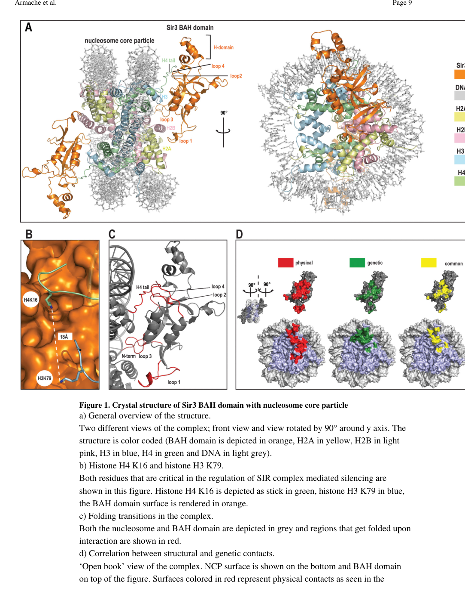

## Question

# Gene Research for Functional Annotation

## ⚠️ CRITICAL: Gene/Protein Identification Context

**BEFORE YOU BEGIN RESEARCH:** You MUST verify you are researching the CORRECT gene/protein. Gene symbols can be ambiguous, especially for less well-characterized genes from non-model organisms.

### Target Gene/Protein Identity (from UniProt):
- **UniProt Accession:** P06701
- **Protein Description:** RecName: Full=Regulatory protein SIR3; AltName: Full=Silent information regulator 3;
- **Gene Information:** Name=SIR3; Synonyms=CMT1, MAR2, STE8; OrderedLocusNames=YLR442C; ORFNames=L9753.10;
- **Organism (full):** Saccharomyces cerevisiae (strain ATCC 204508 / S288c) (Baker's yeast).
- **Protein Family:** Not specified in UniProt
- **Key Domains:** AAA_lid_10. (IPR041083); BAH_dom. (IPR001025); BAH_sf. (IPR043151); ORC1/CDC6. (IPR050311); P-loop_NTPase. (IPR027417)

### MANDATORY VERIFICATION STEPS:

1. **Check if the gene symbol "SIR3" matches the protein description above**
2. **Verify the organism is correct:** Saccharomyces cerevisiae (strain ATCC 204508 / S288c) (Baker's yeast).
3. **Check if protein family/domains align with what you find in literature**
4. **If you find literature for a DIFFERENT gene with the same or similar symbol, STOP**

### If Gene Symbol is Ambiguous or You Cannot Find Relevant Literature:

**DO NOT PROCEED WITH RESEARCH ON A DIFFERENT GENE.** Instead:
- State clearly: "The gene symbol 'SIR3' is ambiguous or literature is limited for this specific protein"
- Explain what you found (e.g., "Found extensive literature on a different gene with the same symbol in a different organism")
- Describe the protein based ONLY on the UniProt information provided above
- Suggest that the protein function can be inferred from domain/family information

### Research Target:

Please provide a comprehensive research report on the gene **SIR3** (gene ID: SIR3, UniProt: P06701) in yeast.

The research report should be a detailed narrative explaining the function, biological processes, and localization of the gene product. Citations should be given for all claims.

You should prioritize authoritative reviews and primary scientific literature when conducting research. You can supplement
this with annotations you find in gene/protein databases, but these can be outdated or inaccurate.

We are specifically interested in the primary function of the gene - for enzymes, what reaction is catalyzed, and what is the substrate specificity? For transporters, what is the substrate? For structural proteins or adapters, what is the broader structural role? For signaling molecules, what is the role in the pathway.

We are interested in where in or outside the cell the gene product carries out its function.

We are also interested in the signaling or biochemical pathways in which the gene functions. We are less interested in broad pleiotropic effects, except where these elucidate the precise role.

Include evidence where possible. We are interested in both experimental evidence as well as inference from structure, evolution, or bioinformatic analysis. Precise studies should be prioritized over high-throughput, where available.

## Output

Question: You are an expert researcher providing comprehensive, well-cited information.

Provide detailed information focusing on:
1. Key concepts and definitions with current understanding
2. Recent developments and latest research (prioritize 2023-2024 sources)
3. Current applications and real-world implementations
4. Expert opinions and analysis from authoritative sources
5. Relevant statistics and data from recent studies

Format as a comprehensive research report with proper citations. Include URLs and publication dates where available.
Always prioritize recent, authoritative sources and provide specific citations for all major claims.

# Gene Research for Functional Annotation

## ⚠️ CRITICAL: Gene/Protein Identification Context

**BEFORE YOU BEGIN RESEARCH:** You MUST verify you are researching the CORRECT gene/protein. Gene symbols can be ambiguous, especially for less well-characterized genes from non-model organisms.

### Target Gene/Protein Identity (from UniProt):
- **UniProt Accession:** P06701
- **Protein Description:** RecName: Full=Regulatory protein SIR3; AltName: Full=Silent information regulator 3;
- **Gene Information:** Name=SIR3; Synonyms=CMT1, MAR2, STE8; OrderedLocusNames=YLR442C; ORFNames=L9753.10;
- **Organism (full):** Saccharomyces cerevisiae (strain ATCC 204508 / S288c) (Baker's yeast).
- **Protein Family:** Not specified in UniProt
- **Key Domains:** AAA_lid_10. (IPR041083); BAH_dom. (IPR001025); BAH_sf. (IPR043151); ORC1/CDC6. (IPR050311); P-loop_NTPase. (IPR027417)

### MANDATORY VERIFICATION STEPS:

1. **Check if the gene symbol "SIR3" matches the protein description above**
2. **Verify the organism is correct:** Saccharomyces cerevisiae (strain ATCC 204508 / S288c) (Baker's yeast).
3. **Check if protein family/domains align with what you find in literature**
4. **If you find literature for a DIFFERENT gene with the same or similar symbol, STOP**

### If Gene Symbol is Ambiguous or You Cannot Find Relevant Literature:

**DO NOT PROCEED WITH RESEARCH ON A DIFFERENT GENE.** Instead:
- State clearly: "The gene symbol 'SIR3' is ambiguous or literature is limited for this specific protein"
- Explain what you found (e.g., "Found extensive literature on a different gene with the same symbol in a different organism")
- Describe the protein based ONLY on the UniProt information provided above
- Suggest that the protein function can be inferred from domain/family information

### Research Target:

Please provide a comprehensive research report on the gene **SIR3** (gene ID: SIR3, UniProt: P06701) in yeast.

The research report should be a detailed narrative explaining the function, biological processes, and localization of the gene product. Citations should be given for all claims.

You should prioritize authoritative reviews and primary scientific literature when conducting research. You can supplement
this with annotations you find in gene/protein databases, but these can be outdated or inaccurate.

We are specifically interested in the primary function of the gene - for enzymes, what reaction is catalyzed, and what is the substrate specificity? For transporters, what is the substrate? For structural proteins or adapters, what is the broader structural role? For signaling molecules, what is the role in the pathway.

We are interested in where in or outside the cell the gene product carries out its function.

We are also interested in the signaling or biochemical pathways in which the gene functions. We are less interested in broad pleiotropic effects, except where these elucidate the precise role.

Include evidence where possible. We are interested in both experimental evidence as well as inference from structure, evolution, or bioinformatic analysis. Precise studies should be prioritized over high-throughput, where available.

## Research report: *Saccharomyces cerevisiae* SIR3 (UniProt P06701; ORF YLR442C)

### 0) Mandatory identity verification (correct gene/protein)
The target protein is **Silent information regulator 3 (Sir3)** from **budding yeast *Saccharomyces cerevisiae* strain S288c**, encoded by **SIR3/YLR442C** (UniProt **P06701**). The literature synthesized here explicitly concerns *S. cerevisiae* Sir3 and its role in **Sir2/3/4-dependent transcriptional silencing (yeast heterochromatin)** at the silent mating-type loci and telomeres, and matches the domain logic implied by UniProt (BAH domain; Orc1/Cdc6-like relationship; AAA-like region). (buchberger2008sir3nucleosomeinteractionsin pages 1-2, connelly2006structureandfunction pages 1-2, currie2024thebahdomain pages 1-4)

### 1) Key concepts, definitions, and current understanding

#### 1.1 Yeast “heterochromatin” and SIR-dependent silencing
In *S. cerevisiae*, “silent chromatin” (often treated as a heterochromatin analog) is a **highly stable transcriptionally repressed state** classically found at **HML/HMR** (silent mating-type loci) and **subtelomeres**, assembled by the **SIR complex**. A recent review emphasizes that silencing is not simply static occlusion; rather, it is **probabilistic and dynamic**, where silencers increase Sir protein residence time and domain formation reflects many weak, cooperative interactions that bias chromatin configurations toward repression. (dhillon2024transcriptionalsilencingin pages 1-2, dhillon2024transcriptionalsilencingin pages 2-4)

#### 1.2 Sir3’s primary molecular function
Across classic biochemistry and structural work, **Sir3 is the principal nucleosome-binding/structural subunit** of the Sir2/3/4 complex. It binds chromatin via its conserved **N-terminal BAH (bromo-adjacent homology) domain**, and it oligomerizes and participates in spreading/compaction through additional conserved regions, including a **C-terminal AAA-like domain** (lacking canonical ATPase activity). (onishi2007roleofthe pages 1-2, buchberger2008sir3nucleosomeinteractionsin pages 1-2, currie2024thebahdomain pages 1-4)

#### 1.3 Domain architecture and nucleosome recognition (mechanistic definition)
**BAH domain as a nucleosome reader.** Sir3 contains an N-terminal BAH domain that directly binds nucleosomes and is **sensitive to histone modification state**, a key aspect of how silent chromatin is specified. (currie2024thebahdomain pages 4-8, currie2024thebahdomain pages 1-4)

**Structural basis.** A landmark structure solved a **3.0 Å crystal structure** of the Sir3 **BAH domain bound to the nucleosome**, showing that Sir3 BAH forms extensive contacts primarily with **histones (not DNA)**, including the **H4 N-terminal tail** and the H3/H4 LRS surface; critically, the structure orders and implicates residues such as **H4K16** and **H3K79**, whose modification state regulates silencing. (armache2011structuralbasisof pages 1-3, armache2011structuralbasisof pages 3-4)

Visual evidence of this interaction and contact mapping is available in the original figure crops. (armache2011structuralbasisof media 2905dd00, armache2011structuralbasisof media b38d5437, armache2011structuralbasisof media faf51ee3)

#### 1.4 How Sir3 participates in initiation and spreading
A widely used mechanistic model is an iterative “read–write” logic in which **Sir2 deacetylates histone H4K16**, creating binding-competent nucleosomes; **Sir3 preferentially recognizes deacetylated H4K16 nucleosomes** and, together with Sir4-mediated assemblies, supports cooperative binding and **cis-spreading** of the silent domain outward from silencers. (yuan2024minimalrequirementsfor pages 1-2)

### 2) Recent developments and latest research (prioritizing 2023–2024)

#### 2.1 Quantitative limits of silencing and gene-level escape (2023)
Using sensitive reporters, Fouet & Rine (2023) quantified that Sir-dependent repression at HML/HMR can reach roughly **~10^4-fold** but is not absolute: transient silencing failures at HML occurred at about **~10⁻³ per generation** in their CRASH assay framework. (fouet2023limitstotranscriptional pages 1-2)

Importantly, escapes can be **gene-specific within a silenced locus**: silencing-loss at an **HML α2** reporter was reported to be **~10-fold higher** than at **α1**, consistent with the observation that α2 is more highly expressed than α1 when unsilenced (e.g., **~8-fold** difference in one construct; smaller in RT-qPCR). (fouet2023limitstotranscriptional pages 12-13, fouet2023limitstotranscriptional pages 1-2)

#### 2.2 Sir3 dynamics and genome-wide transient contacts (2023)
A 2023 study used **Nanopore-MetID** (in vivo methylation footprinting read out by nanopore sequencing) to map Sir3 chromatin contacts beyond what ChIP-seq typically detects. It reported:

* **High-density Sir3 occupancy** concentrated about **±2 kb** around subtelomeric nucleation sites, while **transient low-density contacts** extended up to **~30 kb** away. (radmanlivaja2023thebuddingyeast pages 4-7, radmanlivaja2023thebuddingyeast pages 7-9)
* **1,197 genes (~19% of genes)** identified as Sir3 contact targets, and **>1,000 euchromatic genes** contacted overall. (radmanlivaja2023thebuddingyeast pages 4-7, radmanlivaja2023thebuddingyeast pages 7-9, radmanlivaja2023thebuddingyeast pages 22-24)
* Contact frequency decayed with distance: **~50% of genes within 0–20 kb** of subtelomeric nucleation sites were contacted, dropping to **~20%** farther away; similarly **~50% within 20 kb of telomere ends** were contacted, dropping to **~20% beyond 50 kb**. (radmanlivaja2023thebuddingyeast pages 24-26, radmanlivaja2023thebuddingyeast pages 7-9)
* Global methylation readouts: Sir3EcoG2 methylated about **~0.08% of adenines (~6,000 A/genome)**, with site-proximal average methylation around **~0.4–0.45%** at nucleation sites and typically **≤1.5%** even at strongly bound HML/HMR regions. (radmanlivaja2023thebuddingyeast pages 4-7, radmanlivaja2023thebuddingyeast pages 7-9)

The same work emphasized that Sir3 binding and turnover are **highly dynamic** during nutrient transitions: after release from growth arrest, Sir3 exchange and degradation rise sharply, and Sir3 bound at subtelomeric/HM loci is largely replaced by newly synthesized Sir3 by the end of the **first cell cycle** after release. (radmanlivaja2023thebuddingyeast pages 24-26, radmanlivaja2023thebuddingyeast pages 22-24)

Functionally, reduced Sir3 supply caused large silencing defects: silencing was reported **15–30× less efficient** after release and **200–500× less efficient** in mid-log in a Sir3 hypomorph compared with WT. (radmanlivaja2023thebuddingyeast pages 24-26)

#### 2.3 Current “expert view” of silencing mechanisms (2024 review)
Dhillon & Kamakaka (2024) synthesize an updated picture of silencing as a **stochastic, non-equilibrium process** in which silencers chiefly work by increasing **local Sir concentration and residence time**, and robustness is produced by **domain-wide cooperativity/avidity** while individual components remain dynamic. (dhillon2024transcriptionalsilencingin pages 1-2, dhillon2024transcriptionalsilencingin pages 2-4)

#### 2.4 Epigenetic inheritance and bistability framing (2024)
Two 2024 PNAS studies highlight how the field is converging on quantitative/constructive models:

* **Minimal engineered inheritance:** Yuan & Moazed (2024) explicitly restate the canonical yeast mechanism (Sir2 deacetylates H4K16; Sir3 recognizes deacetylated H4K16; Sir3 dimerization and Sir4-linked complexes support spreading) and then engineer reduced-complexity silent chromatin domains to probe minimal requirements for epigenetic inheritance. (yuan2024minimalrequirementsfor pages 1-2)
* **Bistability via compaction–mark feedback:** Miangolarra et al. (2024) propose and test a two-way feedback model in which **chromatin compaction increases silencer-protein binding**, which removes activating marks and promotes further compaction, producing bistable expression states at HMR; this formalizes compaction as an active participant in epigenetic switching. (miangolarra2024twowayfeedbackbetween pages 1-2)

### 3) Current applications and real-world implementations

#### 3.1 Sir3 as a model for epigenetic domain assembly and inheritance
Sir3-mediated silencing remains a major experimental system for:

* testing **histone-mark reader mechanisms** (e.g., BAH-mediated recognition of appropriate nucleosome states) (currie2024thebahdomain pages 4-8, armache2011structuralbasisof pages 3-4)
* building and validating **quantitative epigenetic models** of bistability and inheritance at defined loci (miangolarra2024twowayfeedbackbetween pages 1-2, yuan2024minimalrequirementsfor pages 1-2)

These are “real-world” implementations in molecular genetics and synthetic/quantitative epigenetics because the yeast SIR system is experimentally tractable and can be re-engineered, including transplantation of heterochromatin-like feedback designs into yeast. (yuan2024minimalrequirementsfor pages 1-2)

#### 3.2 Tools and assays enabled by Sir3 biology
Recent work illustrates how Sir3 supports development and validation of mapping assays:

* **Nanopore-MetID** for transient chromatin contacts that are hard to capture by ChIP-seq, revealing low-density and cell-fraction-specific interactions across the genome. (radmanlivaja2023thebuddingyeast pages 4-7, radmanlivaja2023thebuddingyeast pages 7-9)
* sensitive **reporter assays** (e.g., CRASH) to quantify rare silencing failures and gene-level differences in escape rates. (fouet2023limitstotranscriptional pages 1-2)

### 4) Expert opinions and analysis (authoritative sources)

#### 4.1 How silencers “work” and why silencing is probabilistic
A key expert synthesis (Dhillon & Kamakaka 2024) argues that silencers primarily increase Sir residence time and local concentration, while the output is **probabilistic** because regulatory DNA can transiently become accessible (nucleosome breathing, transient TF binding). In this view, Sir proteins shift the distribution of chromatin configurations toward repressed states, and silencing robustness emerges from **sub-optimized, distributed cooperativity** rather than a single dominant step. (dhillon2024transcriptionalsilencingin pages 1-2, dhillon2024transcriptionalsilencingin pages 2-4)

#### 4.2 Structural interpretation of “histone mark dependency”
A structural and mechanistic synthesis (Currie et al. 2024) frames the Sir3 BAH domain as a **histone/nucleosome reader** whose binding is impaired by **H4K16 acetylation** and **H3K79 methylation**, connecting “epigenetic marks” to a concrete binding interface. (currie2024thebahdomain pages 4-8, currie2024thebahdomain pages 1-4)

### 5) Statistics and data highlights (recent studies)

Key recent quantitative observations for Sir3 and Sir-mediated silencing include:

* **Silencing strength:** HML/HMR repression of ~**10⁴-fold** (fouet2023limitstotranscriptional pages 1-2)
* **Silencing failure frequency:** transient failures ~**10⁻³ per generation** (fouet2023limitstotranscriptional pages 1-2)
* **Gene-specific escape:** α2 silencing-loss ~**10×** higher than α1 in one assay design (fouet2023limitstotranscriptional pages 12-13)
* **Sir3 target scale:** **1,197 genes (~19%)** as Sir3-contact targets by Nanopore-MetID (radmanlivaja2023thebuddingyeast pages 7-9)
* **Spatial scale:** high-density binding ~**±2 kb** around subtelomeric nucleation sites; transient contacts up to ~**30 kb** (radmanlivaja2023thebuddingyeast pages 4-7, radmanlivaja2023thebuddingyeast pages 7-9)
* **Distance-dependent contact fraction:** ~**50%** genes contacted within 0–20 kb, ~**20%** farther away (radmanlivaja2023thebuddingyeast pages 24-26, radmanlivaja2023thebuddingyeast pages 7-9)
* **Functional sensitivity to Sir3 dosage/state:** silencing **15–30×** less efficient after arrest release and **200–500×** less efficient in mid-log in a Sir3 hypomorph (radmanlivaja2023thebuddingyeast pages 24-26)

A consolidated table of mechanistic points and quantitative findings is provided below.

| Topic | Key finding (with numbers where available) | System/assay | Source (author year, venue) | URL |
|---|---|---|---|---|
| Target identity and core function | SIR3/P06701 in *S. cerevisiae* is the structural, nucleosome-binding silencing subunit of the Sir2/3/4 complex; it contains an N-terminal BAH domain and a C-terminal AAA-like region implicated in chromatin interactions and oligomerization (buchberger2008sir3nucleosomeinteractionsin pages 1-2, currie2024thebahdomain pages 1-4) | Genetics/biochemistry/structural synthesis | Currie et al. 2024, *Chromatin Readers in Health and Disease*; Buchberger et al. 2008, *MCB* | https://doi.org/10.1016/b978-0-12-823376-4.00006-9 ; https://doi.org/10.1128/mcb.01210-08 |
| BAH–nucleosome structure | Sir3 BAH was solved bound to the nucleosome at 3.0 Å; two Sir3 BAH domains bind one nucleosome (one per face) and make extensive contacts with all four core histones (armache2011structuralbasisof pages 1-3, armache2011structuralbasisof pages 3-4) | X-ray crystallography of Sir3 BAH–nucleosome complex | Armache et al. 2011, *Science* | https://doi.org/10.1126/science.1210915 |
| Histone-mark sensitivity | The Sir3 BAH domain binds the H4 tail and contacts the H3/H4 LRS region; silencing-relevant residues H4K16 and H3K79 are directly implicated, and H4K16 acetylation/H3K79 methylation impair Sir3 association with nucleosomes (armache2011structuralbasisof pages 1-3, currie2024thebahdomain pages 4-8, armache2011structuralbasisof pages 3-4) | Structural biology plus biochemical/genetic synthesis | Armache et al. 2011, *Science*; Currie et al. 2024, book chapter | https://doi.org/10.1126/science.1210915 ; https://doi.org/10.1016/b978-0-12-823376-4.00006-9 |
| Canonical read–write logic of spreading | Sir2 deacetylates H4K16; Sir3 recognizes deacetylated H4K16-containing nucleosomes; Sir3 dimers, linked through Sir4 dimers, support cooperative binding to paired nucleosomes and cis-spreading of silent chromatin from silencers (yuan2024minimalrequirementsfor pages 1-2) | Mechanistic synthesis/engineered silent chromatin design | Yuan & Moazed 2024, *PNAS* | https://doi.org/10.1073/pnas.2318455121 |
| Silencing initiation and propagation | Silencers recruit Sir proteins via ORC/Rap1/Abf1/Sum1; iterative Sir2 deacetylation and Sir3/Sir4 binding across adjacent hypoacetylated nucleosomes propagate the domain; current expert view emphasizes probabilistic, dynamic, domain-wide cooperativity rather than static occupancy (dhillon2024transcriptionalsilencingin pages 1-2, dhillon2024transcriptionalsilencingin pages 2-4) | Review of genetic, chromatin, and live-cell evidence | Dhillon & Kamakaka 2024, *Epigenetics & Chromatin* | https://doi.org/10.1186/s13072-024-00553-7 |
| Heterochromatin bistability | A 2024 HMR model/validation study supports two-way feedback between chromatin compaction and histone modification state: compaction promotes SIR binding, which removes activating marks and drives further compaction, explaining bistable silent vs expressed states (miangolarra2024twowayfeedbackbetween pages 1-2) | Theory plus experimental validation at HMR | Miangolarra et al. 2024, *PNAS* | https://doi.org/10.1073/pnas.2403316121 |
| Subtelomeric Sir3 occupancy extent | Stable, high-density Sir3 occupancy is concentrated about ±2 kb around subtelomeric SIR nucleation sites; ChIP-seq falls to background by ~4 kb downstream of XCS, but transient low-density contacts extend to ~30 kb (radmanlivaja2023thebuddingyeast pages 4-7, radmanlivaja2023thebuddingyeast pages 7-9) | Nanopore-MetID (Sir3Dam/EcoG2), ChIP-seq | Radman-Livaja et al. 2023, Research Square preprint | https://doi.org/10.21203/rs.3.rs-3495250/v1 |
| Genome-wide transient contacts | Sir3 makes contacts with >1,000 euchromatic genes; 1,197 genes (~19% of genes) were identified as Sir3 contacts; at least 15% of promoters and 7% of CDS had non-zero Sir3Dam methylation probability (radmanlivaja2023thebuddingyeast pages 4-7, radmanlivaja2023thebuddingyeast pages 7-9, radmanlivaja2023thebuddingyeast pages 22-24) | Nanopore-MetID genome-wide mapping | Radman-Livaja et al. 2023, Research Square preprint | https://doi.org/10.21203/rs.3.rs-3495250/v1 |
| Contact frequency vs distance from telomeres | ~50% of genes within 0–20 kb of subtelomeric nucleation sites are contacted by Sir3, dropping to ~20% in the next 20 kb and remaining ~20% farther toward centromeres; similarly, ~50% of genes within 20 kb of telomere ends are contacted, dropping to ~20% beyond 50 kb (radmanlivaja2023thebuddingyeast pages 24-26, radmanlivaja2023thebuddingyeast pages 7-9) | Nanopore-MetID positional analysis | Radman-Livaja et al. 2023, Research Square preprint | https://doi.org/10.21203/rs.3.rs-3495250/v1 |
| Methylation density readout for Sir3 contacts | Sir3EcoG2 methylated ~0.08% of adenines genome-wide (~6,000 A/genome); methylation near XCS averaged ~0.45%, at Yp ~0.4%, and even at HML/HMR was not >1.5%; signal dropped to ~0.1% at 4–15 kb and ~0.02% farther away (radmanlivaja2023thebuddingyeast pages 4-7, radmanlivaja2023thebuddingyeast pages 7-9) | Nanopore-MetID with adenine methylation readout | Radman-Livaja et al. 2023, Research Square preprint | https://doi.org/10.21203/rs.3.rs-3495250/v1 |
| Fraction of cells with Sir3 contact | Yp and XCS nucleation sites were methylated in ~72% of cells; high-density binding around nucleation sites occurred in ~70% of cells, whereas distal transient contacts up to ~30 kb were present in ~10–20% of cells and at ~5-fold lower density (radmanlivaja2023thebuddingyeast pages 4-7, radmanlivaja2023thebuddingyeast pages 7-9) | Single-molecule/nanopore contact frequency inference | Radman-Livaja et al. 2023, Research Square preprint | https://doi.org/10.21203/rs.3.rs-3495250/v1 |
| Sir2/Sir4 dependence of Sir3 chromatin contacts | Subtelomeric Sir3 methylation is abolished in *sir2Δ* and reduced about 2-fold in *sir4Δ*, consistent with Sir3 acting within the Sir2/3/4 complex (radmanlivaja2023thebuddingyeast pages 7-9) | Nanopore-MetID in mutant backgrounds | Radman-Livaja et al. 2023, Research Square preprint | https://doi.org/10.21203/rs.3.rs-3495250/v1 |
| Sir3 exchange dynamics | During growth arrest, Sir3 exchange is slow; after nutrient repletion, exchange and degradation increase sharply, and Sir3 bound at subtelomeric and HM loci is largely replaced by newly synthesized Sir3 by the end of the first cell cycle after release (radmanlivaja2023thebuddingyeast pages 24-26, radmanlivaja2023thebuddingyeast pages 22-24) | RITE tag-switch, ChIP-seq, nutrient-shift experiments | Radman-Livaja et al. 2023, Research Square preprint | https://doi.org/10.21203/rs.3.rs-3495250/v1 |
| Effect of reduced Sir3 supply on silencing | In a Sir3 hypomorph, SIR-dependent silencing after exit from arrest was 15–30× less efficient, and in mid-log cells 200–500× less efficient than WT; ON rates scaled with Sir3 dosage whereas OFF rates were similar (radmanlivaja2023thebuddingyeast pages 24-26) | RITE hypomorph plus silencing assays | Radman-Livaja et al. 2023, Research Square preprint | https://doi.org/10.21203/rs.3.rs-3495250/v1 |
| Magnitude of repression at HM loci | Sir-dependent repression at HML/HMR reduces transcription by roughly four orders of magnitude (~10^4-fold), while Sir proteins subsequently occupy nucleosomes across these loci (fouet2023limitstotranscriptional pages 1-2) | CRASH reporter context and prior silencing literature synthesis | Fouet & Rine 2023, *Genetics* | https://doi.org/10.1093/genetics/iyac180 |
| Frequency of transient silencing loss | Using the sensitive CRASH assay, transient silencing failures at HML occurred at about 10^-3 per generation, showing that Sir-based repression is strong but not absolute (fouet2023limitstotranscriptional pages 1-2) | CRASH recombinase assay at HML | Fouet & Rine 2023, *Genetics* | https://doi.org/10.1093/genetics/iyac180 |
| Gene-specific differences within a silent locus | Silencing loss at the HML α2 reporter was ~10-fold higher than at α1; when unsilenced, CRE expression was ~8-fold higher for α2 than α1, and RT-qPCR in WT showed a smaller ~4-fold difference, indicating transient failure can be gene-specific rather than locus-wide (fouet2023limitstotranscriptional pages 12-13, fouet2023limitstotranscriptional pages 1-2) | CRASH reporters and RT-qPCR | Fouet & Rine 2023, *Genetics* | https://doi.org/10.1093/genetics/iyac180 |

*Table: This table summarizes core mechanistic and quantitative findings for budding yeast Sir3/SIR3 (P06701), emphasizing structural nucleosome recognition, histone-mark dependencies, silencing dynamics, and 2023–2024 measurements of chromatin contacts and silencing escape.*

### 6) Subcellular localization and sites of action
Sir3 functions in the **nucleus** on **chromatin**, with classical sites of action at **HML/HMR** and **telomere-proximal/subtelomeric regions**, where it binds nucleosomes as part of the Sir2/3/4 silencing machinery (onishi2007roleofthe pages 1-2, yuan2024minimalrequirementsfor pages 1-2, fouet2023limitstotranscriptional pages 1-2). Recent mapping adds that Sir3 also makes **transient direct contacts with euchromatin** at large scale, beyond canonical silent domains. (radmanlivaja2023thebuddingyeast pages 7-9, radmanlivaja2023thebuddingyeast pages 22-24)

### 7) Pathways and molecular interactions (high-confidence)

* **SIR silencing pathway:** Sir2 (deacetylase) generates hypoacetylated nucleosomes, and Sir3/Sir4 bind and spread/compact chromatin, producing transcriptional repression; Sir3 recognition of deacetylated H4K16 is central to this mechanism. (dhillon2024transcriptionalsilencingin pages 2-4, yuan2024minimalrequirementsfor pages 1-2)
* **Direct nucleosome binding:** Sir3 BAH contacts histone surfaces and tails (notably the H4 tail; LRS surface), providing a structural basis for chromatin association and for sensitivity to histone marks (including residues H4K16 and H3K79). (armache2011structuralbasisof pages 1-3, armache2011structuralbasisof pages 3-4)

### 8) Notes on evidence quality and recency
The core structural mechanism of Sir3 nucleosome recognition is anchored by high-confidence peer-reviewed structural biology (Science 2011). (armache2011structuralbasisof pages 1-3, armache2011structuralbasisof media 2905dd00)

For 2023–2024 “latest research,” key quantitative advances include peer-reviewed work on escape frequencies (Genetics 2023) and mechanistic reviews/models (Epigenetics & Chromatin 2024; PNAS 2024), as well as a 2023 preprint providing substantial quantitative mapping of transient contacts and dynamics; preprint conclusions should be interpreted with appropriate caution until peer-reviewed. (radmanlivaja2023thebuddingyeast pages 24-26, fouet2023limitstotranscriptional pages 1-2, dhillon2024transcriptionalsilencingin pages 2-4, miangolarra2024twowayfeedbackbetween pages 1-2)

References

1. (buchberger2008sir3nucleosomeinteractionsin pages 1-2): Johannes R. Buchberger, Megumi Onishi, Geng Li, Jan Seebacher, Adam D. Rudner, Steven P. Gygi, and Danesh Moazed. Sir3-nucleosome interactions in spreading of silent chromatin in <i>saccharomyces cerevisiae</i>. Nov 2008. URL: https://doi.org/10.1128/mcb.01210-08, doi:10.1128/mcb.01210-08. This article has 79 citations and is from a domain leading peer-reviewed journal.

2. (connelly2006structureandfunction pages 1-2): Jessica J. Connelly, Peihua Yuan, Hao-Chi Hsu, Zhizhong Li, Rui-Ming Xu, and Rolf Sternglanz. Structure and function of the saccharomyces cerevisiae sir3 bah domain. Molecular and Cellular Biology, 26:3256-3265, Apr 2006. URL: https://doi.org/10.1128/mcb.26.8.3256-3265.2006, doi:10.1128/mcb.26.8.3256-3265.2006. This article has 91 citations and is from a domain leading peer-reviewed journal.

3. (currie2024thebahdomain pages 1-4): Mark A. Currie, Reza Behrouzi, and Danesh Moazed. The bah domain: a versatile histone modification reader. Chromatin Readers in Health and Disease, pages 13-30, Jan 2024. URL: https://doi.org/10.1016/b978-0-12-823376-4.00006-9, doi:10.1016/b978-0-12-823376-4.00006-9. This article has 1 citations.

4. (dhillon2024transcriptionalsilencingin pages 1-2): Namrita Dhillon and Rohinton T. Kamakaka. Transcriptional silencing in saccharomyces cerevisiae: known unknowns. Epigenetics & Chromatin, Sep 2024. URL: https://doi.org/10.1186/s13072-024-00553-7, doi:10.1186/s13072-024-00553-7. This article has 4 citations and is from a peer-reviewed journal.

5. (dhillon2024transcriptionalsilencingin pages 2-4): Namrita Dhillon and Rohinton T. Kamakaka. Transcriptional silencing in saccharomyces cerevisiae: known unknowns. Epigenetics & Chromatin, Sep 2024. URL: https://doi.org/10.1186/s13072-024-00553-7, doi:10.1186/s13072-024-00553-7. This article has 4 citations and is from a peer-reviewed journal.

6. (onishi2007roleofthe pages 1-2): Megumi Onishi, Gunn-Guang Liou, Johannes R. Buchberger, Thomas Walz, and Danesh Moazed. Role of the conserved sir3-bah domain in nucleosome binding and silent chromatin assembly. Molecular cell, 28 6:1015-28, Dec 2007. URL: https://doi.org/10.1016/j.molcel.2007.12.004, doi:10.1016/j.molcel.2007.12.004. This article has 213 citations and is from a highest quality peer-reviewed journal.

7. (currie2024thebahdomain pages 4-8): Mark A. Currie, Reza Behrouzi, and Danesh Moazed. The bah domain: a versatile histone modification reader. Chromatin Readers in Health and Disease, pages 13-30, Jan 2024. URL: https://doi.org/10.1016/b978-0-12-823376-4.00006-9, doi:10.1016/b978-0-12-823376-4.00006-9. This article has 1 citations.

8. (armache2011structuralbasisof pages 1-3): Karim-Jean Armache, Joseph D. Garlick, Daniele Canzio, Geeta J. Narlikar, and Robert E. Kingston. Structural basis of silencing: sir3 bah domain in complex with a nucleosome at 3.0 å resolution. Science, 334:977-982, Nov 2011. URL: https://doi.org/10.1126/science.1210915, doi:10.1126/science.1210915. This article has 326 citations and is from a highest quality peer-reviewed journal.

9. (armache2011structuralbasisof pages 3-4): Karim-Jean Armache, Joseph D. Garlick, Daniele Canzio, Geeta J. Narlikar, and Robert E. Kingston. Structural basis of silencing: sir3 bah domain in complex with a nucleosome at 3.0 å resolution. Science, 334:977-982, Nov 2011. URL: https://doi.org/10.1126/science.1210915, doi:10.1126/science.1210915. This article has 326 citations and is from a highest quality peer-reviewed journal.

10. (armache2011structuralbasisof media 2905dd00): Karim-Jean Armache, Joseph D. Garlick, Daniele Canzio, Geeta J. Narlikar, and Robert E. Kingston. Structural basis of silencing: sir3 bah domain in complex with a nucleosome at 3.0 å resolution. Science, 334:977-982, Nov 2011. URL: https://doi.org/10.1126/science.1210915, doi:10.1126/science.1210915. This article has 326 citations and is from a highest quality peer-reviewed journal.

11. (armache2011structuralbasisof media b38d5437): Karim-Jean Armache, Joseph D. Garlick, Daniele Canzio, Geeta J. Narlikar, and Robert E. Kingston. Structural basis of silencing: sir3 bah domain in complex with a nucleosome at 3.0 å resolution. Science, 334:977-982, Nov 2011. URL: https://doi.org/10.1126/science.1210915, doi:10.1126/science.1210915. This article has 326 citations and is from a highest quality peer-reviewed journal.

12. (armache2011structuralbasisof media faf51ee3): Karim-Jean Armache, Joseph D. Garlick, Daniele Canzio, Geeta J. Narlikar, and Robert E. Kingston. Structural basis of silencing: sir3 bah domain in complex with a nucleosome at 3.0 å resolution. Science, 334:977-982, Nov 2011. URL: https://doi.org/10.1126/science.1210915, doi:10.1126/science.1210915. This article has 326 citations and is from a highest quality peer-reviewed journal.

13. (yuan2024minimalrequirementsfor pages 1-2): Andy H. Yuan and Danesh Moazed. Minimal requirements for the epigenetic inheritance of engineered silent chromatin domains. Proceedings of the National Academy of Sciences of the United States of America, Jan 2024. URL: https://doi.org/10.1073/pnas.2318455121, doi:10.1073/pnas.2318455121. This article has 7 citations and is from a highest quality peer-reviewed journal.

14. (fouet2023limitstotranscriptional pages 1-2): Marc Fouet and Jasper Rine. Limits to transcriptional silencing in saccharomyces cerevisiae. Genetics, Dec 2023. URL: https://doi.org/10.1093/genetics/iyac180, doi:10.1093/genetics/iyac180. This article has 5 citations and is from a domain leading peer-reviewed journal.

15. (fouet2023limitstotranscriptional pages 12-13): Marc Fouet and Jasper Rine. Limits to transcriptional silencing in saccharomyces cerevisiae. Genetics, Dec 2023. URL: https://doi.org/10.1093/genetics/iyac180, doi:10.1093/genetics/iyac180. This article has 5 citations and is from a domain leading peer-reviewed journal.

16. (radmanlivaja2023thebuddingyeast pages 4-7): Marta Radman-Livaja, Pritha Bhattacharjee, Alain Camasses, Hrvoje Galic, Ana Hrgovcic, Lara Demont, Linh Nguyen, and Pauline Vasseur. The budding yeast heterochromatic protein sir3 modulates genome-wide gene expression through transient direct contacts with euchromatin. Unknown journal, Nov 2023. URL: https://doi.org/10.21203/rs.3.rs-3495250/v1, doi:10.21203/rs.3.rs-3495250/v1.

17. (radmanlivaja2023thebuddingyeast pages 7-9): Marta Radman-Livaja, Pritha Bhattacharjee, Alain Camasses, Hrvoje Galic, Ana Hrgovcic, Lara Demont, Linh Nguyen, and Pauline Vasseur. The budding yeast heterochromatic protein sir3 modulates genome-wide gene expression through transient direct contacts with euchromatin. Unknown journal, Nov 2023. URL: https://doi.org/10.21203/rs.3.rs-3495250/v1, doi:10.21203/rs.3.rs-3495250/v1.

18. (radmanlivaja2023thebuddingyeast pages 22-24): Marta Radman-Livaja, Pritha Bhattacharjee, Alain Camasses, Hrvoje Galic, Ana Hrgovcic, Lara Demont, Linh Nguyen, and Pauline Vasseur. The budding yeast heterochromatic protein sir3 modulates genome-wide gene expression through transient direct contacts with euchromatin. Unknown journal, Nov 2023. URL: https://doi.org/10.21203/rs.3.rs-3495250/v1, doi:10.21203/rs.3.rs-3495250/v1.

19. (radmanlivaja2023thebuddingyeast pages 24-26): Marta Radman-Livaja, Pritha Bhattacharjee, Alain Camasses, Hrvoje Galic, Ana Hrgovcic, Lara Demont, Linh Nguyen, and Pauline Vasseur. The budding yeast heterochromatic protein sir3 modulates genome-wide gene expression through transient direct contacts with euchromatin. Unknown journal, Nov 2023. URL: https://doi.org/10.21203/rs.3.rs-3495250/v1, doi:10.21203/rs.3.rs-3495250/v1.

20. (miangolarra2024twowayfeedbackbetween pages 1-2): Ander Movilla Miangolarra, Daniel S. Saxton, Zhi Yan, Jasper Rine, and Martin Howard. Two-way feedback between chromatin compaction and histone modification state explains saccharomyces cerevisiae heterochromatin bistability. Proceedings of the National Academy of Sciences of the United States of America, Apr 2024. URL: https://doi.org/10.1073/pnas.2403316121, doi:10.1073/pnas.2403316121. This article has 13 citations and is from a highest quality peer-reviewed journal.

## Artifacts

- [Edison artifact artifact-00](SIR3-deep-research-falcon_artifacts/artifact-00.md)

## Citations

1. yuan2024minimalrequirementsfor pages 1-2
2. fouet2023limitstotranscriptional pages 1-2
3. radmanlivaja2023thebuddingyeast pages 24-26
4. miangolarra2024twowayfeedbackbetween pages 1-2
5. fouet2023limitstotranscriptional pages 12-13
6. radmanlivaja2023thebuddingyeast pages 7-9
7. connelly2006structureandfunction pages 1-2
8. currie2024thebahdomain pages 1-4
9. dhillon2024transcriptionalsilencingin pages 1-2
10. dhillon2024transcriptionalsilencingin pages 2-4
11. onishi2007roleofthe pages 1-2
12. currie2024thebahdomain pages 4-8
13. armache2011structuralbasisof pages 1-3
14. armache2011structuralbasisof pages 3-4
15. radmanlivaja2023thebuddingyeast pages 4-7
16. radmanlivaja2023thebuddingyeast pages 22-24
17. https://doi.org/10.1016/b978-0-12-823376-4.00006-9
18. https://doi.org/10.1128/mcb.01210-08
19. https://doi.org/10.1126/science.1210915
20. https://doi.org/10.1073/pnas.2318455121
21. https://doi.org/10.1186/s13072-024-00553-7
22. https://doi.org/10.1073/pnas.2403316121
23. https://doi.org/10.21203/rs.3.rs-3495250/v1
24. https://doi.org/10.1093/genetics/iyac180
25. https://doi.org/10.1128/mcb.01210-08,
26. https://doi.org/10.1128/mcb.26.8.3256-3265.2006,
27. https://doi.org/10.1016/b978-0-12-823376-4.00006-9,
28. https://doi.org/10.1186/s13072-024-00553-7,
29. https://doi.org/10.1016/j.molcel.2007.12.004,
30. https://doi.org/10.1126/science.1210915,
31. https://doi.org/10.1073/pnas.2318455121,
32. https://doi.org/10.1093/genetics/iyac180,
33. https://doi.org/10.21203/rs.3.rs-3495250/v1,
34. https://doi.org/10.1073/pnas.2403316121,