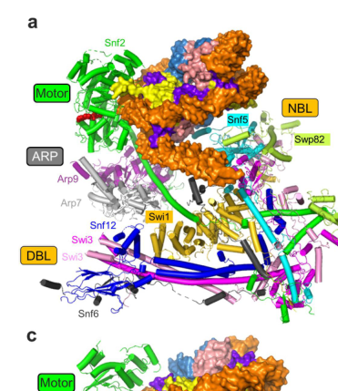

## Question

# Gene Research for Functional Annotation

## ⚠️ CRITICAL: Gene/Protein Identification Context

**BEFORE YOU BEGIN RESEARCH:** You MUST verify you are researching the CORRECT gene/protein. Gene symbols can be ambiguous, especially for less well-characterized genes from non-model organisms.

### Target Gene/Protein Identity (from UniProt):
- **UniProt Accession:** P18480
- **Protein Description:** RecName: Full=SWI/SNF chromatin-remodeling complex subunit SNF5; AltName: Full=SWI/SNF complex subunit SNF5; AltName: Full=Transcription factor TYE4; AltName: Full=Transcription regulatory protein SNF5;
- **Gene Information:** Name=SNF5; Synonyms=SWI10, TYE4; OrderedLocusNames=YBR289W; ORFNames=YBR2036;
- **Organism (full):** Saccharomyces cerevisiae (strain ATCC 204508 / S288c) (Baker's yeast).
- **Protein Family:** Belongs to the SNF5 family. .
- **Key Domains:** SNF5. (IPR006939); SNF5 (PF04855)

### MANDATORY VERIFICATION STEPS:

1. **Check if the gene symbol "SNF5" matches the protein description above**
2. **Verify the organism is correct:** Saccharomyces cerevisiae (strain ATCC 204508 / S288c) (Baker's yeast).
3. **Check if protein family/domains align with what you find in literature**
4. **If you find literature for a DIFFERENT gene with the same or similar symbol, STOP**

### If Gene Symbol is Ambiguous or You Cannot Find Relevant Literature:

**DO NOT PROCEED WITH RESEARCH ON A DIFFERENT GENE.** Instead:
- State clearly: "The gene symbol 'SNF5' is ambiguous or literature is limited for this specific protein"
- Explain what you found (e.g., "Found extensive literature on a different gene with the same symbol in a different organism")
- Describe the protein based ONLY on the UniProt information provided above
- Suggest that the protein function can be inferred from domain/family information

### Research Target:

Please provide a comprehensive research report on the gene **SNF5** (gene ID: SNF5, UniProt: P18480) in yeast.

The research report should be a detailed narrative explaining the function, biological processes, and localization of the gene product. Citations should be given for all claims.

You should prioritize authoritative reviews and primary scientific literature when conducting research. You can supplement
this with annotations you find in gene/protein databases, but these can be outdated or inaccurate.

We are specifically interested in the primary function of the gene - for enzymes, what reaction is catalyzed, and what is the substrate specificity? For transporters, what is the substrate? For structural proteins or adapters, what is the broader structural role? For signaling molecules, what is the role in the pathway.

We are interested in where in or outside the cell the gene product carries out its function.

We are also interested in the signaling or biochemical pathways in which the gene functions. We are less interested in broad pleiotropic effects, except where these elucidate the precise role.

Include evidence where possible. We are interested in both experimental evidence as well as inference from structure, evolution, or bioinformatic analysis. Precise studies should be prioritized over high-throughput, where available.

## Output

Question: You are an expert researcher providing comprehensive, well-cited information.

Provide detailed information focusing on:
1. Key concepts and definitions with current understanding
2. Recent developments and latest research (prioritize 2023-2024 sources)
3. Current applications and real-world implementations
4. Expert opinions and analysis from authoritative sources
5. Relevant statistics and data from recent studies

Format as a comprehensive research report with proper citations. Include URLs and publication dates where available.
Always prioritize recent, authoritative sources and provide specific citations for all major claims.

# Gene Research for Functional Annotation

## ⚠️ CRITICAL: Gene/Protein Identification Context

**BEFORE YOU BEGIN RESEARCH:** You MUST verify you are researching the CORRECT gene/protein. Gene symbols can be ambiguous, especially for less well-characterized genes from non-model organisms.

### Target Gene/Protein Identity (from UniProt):
- **UniProt Accession:** P18480
- **Protein Description:** RecName: Full=SWI/SNF chromatin-remodeling complex subunit SNF5; AltName: Full=SWI/SNF complex subunit SNF5; AltName: Full=Transcription factor TYE4; AltName: Full=Transcription regulatory protein SNF5;
- **Gene Information:** Name=SNF5; Synonyms=SWI10, TYE4; OrderedLocusNames=YBR289W; ORFNames=YBR2036;
- **Organism (full):** Saccharomyces cerevisiae (strain ATCC 204508 / S288c) (Baker's yeast).
- **Protein Family:** Belongs to the SNF5 family. .
- **Key Domains:** SNF5. (IPR006939); SNF5 (PF04855)

### MANDATORY VERIFICATION STEPS:

1. **Check if the gene symbol "SNF5" matches the protein description above**
2. **Verify the organism is correct:** Saccharomyces cerevisiae (strain ATCC 204508 / S288c) (Baker's yeast).
3. **Check if protein family/domains align with what you find in literature**
4. **If you find literature for a DIFFERENT gene with the same or similar symbol, STOP**

### If Gene Symbol is Ambiguous or You Cannot Find Relevant Literature:

**DO NOT PROCEED WITH RESEARCH ON A DIFFERENT GENE.** Instead:
- State clearly: "The gene symbol 'SNF5' is ambiguous or literature is limited for this specific protein"
- Explain what you found (e.g., "Found extensive literature on a different gene with the same symbol in a different organism")
- Describe the protein based ONLY on the UniProt information provided above
- Suggest that the protein function can be inferred from domain/family information

### Research Target:

Please provide a comprehensive research report on the gene **SNF5** (gene ID: SNF5, UniProt: P18480) in yeast.

The research report should be a detailed narrative explaining the function, biological processes, and localization of the gene product. Citations should be given for all claims.

You should prioritize authoritative reviews and primary scientific literature when conducting research. You can supplement
this with annotations you find in gene/protein databases, but these can be outdated or inaccurate.

We are specifically interested in the primary function of the gene - for enzymes, what reaction is catalyzed, and what is the substrate specificity? For transporters, what is the substrate? For structural proteins or adapters, what is the broader structural role? For signaling molecules, what is the role in the pathway.

We are interested in where in or outside the cell the gene product carries out its function.

We are also interested in the signaling or biochemical pathways in which the gene functions. We are less interested in broad pleiotropic effects, except where these elucidate the precise role.

Include evidence where possible. We are interested in both experimental evidence as well as inference from structure, evolution, or bioinformatic analysis. Precise studies should be prioritized over high-throughput, where available.

# Research Report: *Saccharomyces cerevisiae* **SNF5** (UniProt P18480) — Functional Annotation and Current Evidence

## 0) Target verification (critical disambiguation)

**Requested target**: UniProt **P18480**, *S. cerevisiae* (S288c) **Snf5** (synonyms: **SWI10**, **TYE4**; locus **YBR289W**), a **SWI/SNF chromatin-remodeling complex subunit**.

**Verification status with retrieved literature**: The retrieved sources consistently discuss **budding-yeast Snf5 as a core SWI/SNF subunit**, conserved with metazoan **SMARCB1/INI1/BAF47**, and involved in SWI/SNF chromatin remodeling (including nucleosome acidic-patch engagement and transcription-factor interactions). (kuwahara2023recentinsightsinto pages 3-5, eustermann2024energydrivengenomeregulation pages 1-3, wendegatz2024transcriptionalactivationdomains pages 5-6) 

**Limitation**: None of the retrieved full-text excerpts explicitly list the **UniProt accession P18480**, the systematic locus **YBR289W**, or synonyms **SWI10/TYE4**. Therefore, this report’s *biological* conclusions are supported by the yeast Snf5 literature, but the **database-level identifier mapping** (P18480 ↔ YBR289W ↔ SNF5/SWI10/TYE4) could not be independently re-confirmed from the current paper excerpts alone.

## 1) Key concepts and definitions (current understanding)

### 1.1 SWI/SNF chromatin remodeling complexes
SWI/SNF-family remodelers are **ATP-dependent, multi-subunit chromatin remodeling machines** that alter nucleosome–DNA contacts to regulate DNA accessibility; canonical activities include **nucleosome sliding** and **histone ejection** (eviction). (eustermann2024energydrivengenomeregulation pages 1-3, chen2023mechanismofaction pages 2-6)

### 1.2 The nucleosome acidic patch
The **H2A–H2B acidic patch** is a negatively charged nucleosome surface that serves as a common interaction hub for chromatin factors. In SWI/SNF-family remodelers, acidic-patch engagement helps stabilize remodeler–nucleosome binding and can contribute to coupling ATP hydrolysis to productive remodeling. (chen2023mechanismofaction pages 2-6, eustermann2024energydrivengenomeregulation pages 1-3)

### 1.3 NBL, finger helix, and SnAc: terms relevant to Snf5 function
A recent mechanistic synthesis organizes SWI/SNF nucleosome engagement into motor- and substrate-recruitment components and highlights two acidic-patch–recognition elements:

* **Nucleosome-binding lobe (NBL)**: in budding-yeast SWI/SNF, the NBL is described as being **mainly formed by Snf5**, making Snf5 a principal nucleosome-contacting scaffold within the complex. (chen2023mechanismofaction pages 2-6)
* **Snf5 “finger helix” (FH)**: a C-terminal helix protruding from the NBL that **packs against the H2A–H2B surface** and binds the acidic patch via multiple arginine residues. (chen2023mechanismofaction pages 2-6)
* **SnAc domain**: a conserved, polybasic extension of the SWI/SNF ATPase motor (Snf2) that also recognizes the acidic patch and is described as coupling ATP hydrolysis to nucleosome sliding. (chen2023mechanismofaction pages 2-6)

## 2) Molecular function of Snf5 (primary function and mechanism)

### 2.1 Snf5 is a core structural/regulatory subunit, not an enzyme
Across yeast and metazoans, **Snf5/SMARCB1/INI1** is repeatedly framed as a **core subunit** that contributes to SWI/SNF complex integrity and nucleosome engagement rather than providing catalytic ATPase activity (which in yeast is carried by Snf2). (kuwahara2023recentinsightsinto pages 3-5, eustermann2024energydrivengenomeregulation pages 1-3)

### 2.2 Direct nucleosome engagement via the acidic patch
A key mechanistic advance synthesized in a 2023 review is that budding-yeast **Snf5 largely composes the NBL** and uses its **finger helix** to bind the nucleosome’s **H2A–H2B acidic patch** through **multiple arginine residues**. (chen2023mechanismofaction pages 2-6)

A specific residue is highlighted: **Arg669** in yeast Snf5 is described as the **canonical “arginine anchor”**, equivalent to Arg370 in SMARCB1. (chen2023mechanismofaction pages 2-6)

In the same framework, **mutations in the finger helix reduce remodeling activity in vitro and reduce fitness in vivo**, linking this nucleosome-surface contact to biologically relevant remodeling output. (chen2023mechanismofaction pages 2-6)

A 2024 authoritative review further supports the assignment of **Snf5 as a “proximal acidic patch” binder** within yeast SWI/SNF and places SWI/SNF’s characteristic activities as **nucleosome sliding and histone ejection**. (eustermann2024energydrivengenomeregulation pages 1-3)

### 2.3 Complex architecture context (where Snf5 sits)
Structural/architecture descriptions of yeast SWI/SNF emphasize modular organization (ATPase/motor module; ARP module; body/substrate recruitment components) and explicitly label Snf5 as part of the complex architecture. (amaris2022structuralinvestigationof pages 34-44)

The figure panels retrieved from Chen et al. 2023 visually support the **overall yeast SWI/SNF architecture** and the **acidic-patch engagement by the Snf5/SMARCB1 finger helix**. (chen2023mechanismofaction media 799148c2, chen2023mechanismofaction media ad429c0b, chen2023mechanismofaction media 79a39cc8)

## 3) Biological processes and pathways (with emphasis on precise roles)

### 3.1 Transcriptional activation via activator interactions (recruitment/coupling)
A 2024 yeast-focused study demonstrates that **Snf5 can bind transcriptional activation domains (TADs)** (tested alongside other SWI/SNF subunits). In the context of phospholipid biosynthetic gene regulation, SWI/SNF subunits including **Snf5** were reported to bind **Ino2** TADs, and the study also discusses interactions with other activators such as **Gcn4**. (wendegatz2024transcriptionalactivationdomains pages 5-6)

This supports a mechanistic view where Snf5 contributes to SWI/SNF’s transcriptional effects by acting as a **protein–protein interaction platform** for activator-driven recruitment and/or for coupling activator binding to remodeling. (wendegatz2024transcriptionalactivationdomains pages 5-6)

### 3.2 Direct transcriptional repression via LUTI-based transcriptional interference (2024 development)
A major recent development in yeast is evidence that Swi/Snf can **directly repress transcription in vivo** through nucleosome remodeling, rather than repression being only an indirect consequence of activation elsewhere.

In *Molecular Cell* (Aug 2024), Morse et al. used a genetic selection for “LUTI escape” mutants and found **all validated escape mutations mapped to genes encoding Swi/Snf subunits**; they conclude this provides “conclusive evidence” that Swi/Snf can directly repress transcription **through nucleosome remodeling downstream of an active TSS**, thereby interfering with a downstream CDS-proximal promoter. (morse2024swisnfchromatinremodeling pages 5-8)

At the endogenous **HNT1** locus during DTT-induced stress, Swi/Snf recruitment/remodeling was fast and quantitative:
* **HNT1LUTI induction within 5 minutes**, increasing to approximately **~3-fold by 30 minutes**.
* At ~30 minutes, the proximal isoform **HNT1PROX** is described as **nearly fully silenced**.
* Proximal promoter chromatin changes were measurable: **NDR nucleosome occupancy increased ~1.9-fold (p = 0.0445)** on average in the repression state, and -1/+1 nucleosomes became “more fuzzy” (a measure of positioning/heterogeneity). (morse2024swisnfchromatinremodeling pages 15-19)

Although these data were tracked using **Snf2** ChIP and nucleosome mapping (rather than Snf5 ChIP specifically), the mechanism is attributed to the **Swi/Snf complex’s remodeling activity**, of which Snf5 is a core nucleosome-binding subunit. (morse2024swisnfchromatinremodeling pages 15-19, chen2023mechanismofaction pages 2-6)

Morse et al. also defined a **250-gene Swi/Snf target set** using transcriptomic and occupancy filters (downregulated in snf2Δ, Snf2-bound loci, and additional exclusions), providing a concrete genome-scale handle on Swi/Snf-regulated genes in their framework. (morse2024swisnfchromatinremodeling pages 19-22)

### 3.3 Metabolic pathway control and sulfur metabolism (2023 development)
A 2023 *Nucleic Acids Research* study emphasizes that loss of Swi/Snf can paradoxically lead to **activation of metabolic genes under repressing conditions**, especially sulfur metabolism (MET) genes, and a **cysteine-deficient phenotype** despite growth in rich medium. (church2023theswisnfchromatin pages 1-2)

The study reports that this correlates with a **global redistribution of the transcription factor Met4** and widespread perturbations in sulfur metabolic transcription; RNA-seq comparisons of **snf2Δ and snf5Δ** were performed and pathway enrichment identified sulfur/MET pathways among the most enriched upregulated pathways. (church2023theswisnfchromatin pages 2-3)

This illustrates how SWI/SNF (and by extension its Snf5 subunit) participates in transcriptional programs that control metabolic state, not merely “general transcription.” (church2023theswisnfchromatin pages 2-3, church2024theswisnfchromatin pages 1-2)

## 4) Cellular localization and where Snf5 acts

### 4.1 Subcellular site of action: nucleus/chromatin
Functionally, Snf5 is a chromatin-associated factor by virtue of its role in SWI/SNF remodeling of nucleosomes and direct nucleosome-surface binding (acidic patch). (chen2023mechanismofaction pages 2-6)

### 4.2 Genomic targeting (promoters, stress induction, and co-transcriptional remodeling)
Direct kinetic evidence for *S. cerevisiae* Swi/Snf recruitment to a locus was shown at HNT1 by tracking **Snf2**:
* Snf2 occupancy at HNT1 increased within **5 minutes** of stress, tracking LUTI induction.
* Initiation at the distal LUTI promoter was sufficient for initial recruitment, but **productive elongation was required for downstream occupancy and remodeling at the proximal promoter**; mutants that truncated transcription reduced Snf2 binding at the proximal region and blocked remodeling. (morse2024swisnfchromatinremodeling pages 15-19)

Snf5-specific genome-wide occupancy/localization was not retrieved in the current excerpts; therefore, Snf5 targeting is best stated as: Snf5 is expected to be **nuclear/chromatin-associated as a SWI/SNF core subunit**, and recruitment occurs at promoter regions where the complex is directed by activators/histone signals, consistent with demonstrated Snf5 binding to activator TADs. (wendegatz2024transcriptionalactivationdomains pages 5-6, morse2024swisnfchromatinremodeling pages 15-19)

## 5) Recent developments (prioritizing 2023–2024)

### 5.1 2023: Mechanistic consolidation of acidic patch binding by Snf5
The 2023 mechanistic review formalizes a model where SWI/SNF uses **two acidic-patch recognition elements**—Snf5’s finger helix (NBL) and Snf2’s SnAc domain—to bind an otherwise intact nucleosome while the motor engages DNA at SHL2, supporting ATP-coupled remodeling outputs (sliding/ejection). (chen2023mechanismofaction pages 2-6)

### 5.2 2023: Metabolic control and sulfur pathway rewiring
The 2023 NAR study adds a concrete, pathway-level example of how SWI/SNF loss can yield **systemic metabolic consequences** (cysteine deficiency; altered sulfur metabolism transcription) mediated through transcription-factor redistribution (Met4). (church2023theswisnfchromatin pages 2-3)

### 5.3 2024: Direct repression mechanism (LUTI transcriptional interference)
The 2024 *Molecular Cell* study provides strong genetic and genomic evidence that Swi/Snf can mediate **direct repression** via **co-transcriptional downstream remodeling** that occludes a downstream promoter’s NDR, with quantified kinetics and chromatin effect sizes. (morse2024swisnfchromatinremodeling pages 15-19, morse2024swisnfchromatinremodeling pages 5-8)

### 5.4 2024: Expert syntheses and “big picture” interpretation
Two 2024 reviews contextualize yeast SWI/SNF as the foundational model for a broader class of remodelers and highlight disease and targeting implications:
* SWI/SNF as an energy-driven genome regulator; Snf5 specifically annotated as **proximal acidic patch** binder. (eustermann2024energydrivengenomeregulation pages 1-3)
* SWI/SNF framed as a **critical regulator of metabolism**, emphasizing conserved chromatin–metabolism coupling and therapeutic vulnerabilities in SWI/SNF-mutant contexts. (church2024theswisnfchromatin pages 1-2)

## 6) Current applications and real-world implementations

### 6.1 Yeast Snf5/SWI/SNF as a conserved model for human SWI/SNF vulnerabilities
A 2024 metabolism-focused review argues that mechanistic understanding from yeast SWI/SNF continues to inform mammalian SWI/SNF biology and cancer vulnerabilities, emphasizing strategies such as **synthetic lethality** for tumors with SWI/SNF loss-of-function. (church2024theswisnfchromatin pages 6-8)

This is an important “real-world implementation” pathway: yeast is used to derive mechanistic principles (e.g., chromatin–metabolism coupling) that translate into **candidate metabolic liabilities** in SWI/SNF-deficient disease contexts. (church2024theswisnfchromatin pages 2-4)

### 6.2 Engineering transcriptional control via activator–remodeler interactions (conceptual synthetic biology application)
The 2024 *Current Genetics* study and associated discussion highlight that transcription factors can bind different remodeler subunits (including **Snf5**) through activation domains, and discuss models such as **activator-specific binding patterns** and **phase-separation/condensate formation** upon TAD–ABD binding. Such mechanisms can guide engineered strategies to tune recruitment of chromatin remodelers in synthetic transcription systems, even if the paper itself is not a deployment study. (wendegatz2024transcriptionalactivationdomains pages 1-2, wendegatz2024transcriptionalactivationdomains pages 5-6)

## 7) Expert opinions / authoritative perspectives

* A 2024 review emphasizes that SWI/SNF’s role as a regulator of metabolic transcription in mammals has recently emerged and that understanding of SWI/SNF as a metabolic regulator “continues to evolve,” motivating further mechanistic work; yeast remains positioned as an informative model for chromatin–metabolism connections. (church2024theswisnfchromatin pages 8-9)
* A 2024 Nature Reviews Genetics synthesis emphasizes that remodellers show strong biological specificity and dosage sensitivity, are widely mutated in disease, and that active efforts are underway to develop therapeutic avenues targeting remodellers; yeast SWI/SNF is framed as the foundational discovery enabling this field. (gourisankar2024contextspecificfunctionsof pages 1-3)

## 8) Key statistics and quantitative findings (recent studies)

* **Snf5 mechanistic statistic (structure-function)**: Snf5 finger helix mutations reduce remodeling activity in vitro and reduce fitness in vivo (qualitative outcome; numerical values not provided in the excerpt). (chen2023mechanismofaction pages 2-6)
* **LUTI repression quantitative chromatin effects (2024)**: NDR occupancy at proximal promoter increased **~1.9-fold (p = 0.0445)**; HNT1LUTI increased **~3-fold by 30 min**; recruitment/remodeling detectable within **5 min**. (morse2024swisnfchromatinremodeling pages 15-19)
* **Genome-scale set definition (2024)**: Morse et al. defined **250 Swi/Snf target genes** based on transcriptomic and occupancy filters. (morse2024swisnfchromatinremodeling pages 19-22)
* **Cancer association summary statistic (2024 reviews)**: BAF/SWI/SNF complexes are reported as mutated in **~20%** of human cancers (used for translational framing). (gourisankar2024contextspecificfunctionsof pages 27-28, church2024theswisnfchromatin pages 1-2)
* **Yeast dependency estimate**: A 2024 yeast-focused study cites an estimate that **~1% of yeast protein-coding genes are Swi-dependent** (contextual statistic; details of derivation not in excerpt). (wendegatz2024transcriptionalactivationdomains pages 1-2)

## 9) Visual evidence (figure support)

A key structural depiction of yeast SWI/SNF architecture (with Snf5/NBL indicated) and the acidic-patch engagement concept (finger helix contact) is available from the retrieved figure crops. (chen2023mechanismofaction media 799148c2, chen2023mechanismofaction media ad429c0b, chen2023mechanismofaction media 79a39cc8)

## 10) Evidence map (for traceability)

| Aspect | Key points | Evidence (with citation IDs) | Publication (author, year, journal) | URL | Publication date/month if available |
|---|---|---|---|---|---|
| Identity / complex membership | Budding-yeast Snf5 is a core, non-ATPase subunit of the SWI/SNF ATP-dependent chromatin-remodeling complex; it is evolutionarily conserved with human SMARCB1/INI1 and contributes to complex integrity and function. | Snf5 is identified as a core SWI/SNF component in *S. cerevisiae* and homologous to SMARCB1/INI1; SWI/SNF is a large multi-subunit chromatin remodeler. (kuwahara2023recentinsightsinto pages 3-5, lampersberger2023geneticinteractorsof pages 37-41, lampersberger2023geneticinteractorsof pages 34-37, amaris2022structuralinvestigationof pages 34-44) | Kuwahara et al., 2023, *Cancer Medicine*; Lampersberger, 2023, Dissertation | https://doi.org/10.1002/cam4.6255 ; https://doi.org/10.17863/cam.93003 | Jun 2023; Jan 2023 |
| Mechanistic role | Snf5 mainly forms the nucleosome-binding lobe (NBL) of SWI/SNF and acts as a structural/regulatory subunit that helps couple nucleosome recognition to remodeling rather than serving as the ATPase. | Reviews describe Snf5 as the principal component of the NBL and a structural subunit within SWI/SNF family remodelers. (chen2023mechanismofaction pages 2-6, eustermann2024energydrivengenomeregulation pages 1-3) | Chen et al., 2023, *Nucleus*; Eustermann et al., 2024, *Nature Reviews Molecular Cell Biology* | https://doi.org/10.1080/19491034.2023.2165604 ; https://doi.org/10.1038/s41580-023-00683-y | Jan 2023; Dec 2024 |
| Nucleosome interaction | Snf5 engages the nucleosomal H2A-H2B acidic patch through its C-terminal finger helix; Arg669 is the canonical arginine anchor. This acidic-patch contact cooperates with the Snf2 motor and SnAc domain to support ATP-coupled nucleosome sliding/ejection. | Snf5 is annotated as a proximal acidic-patch binder; the finger helix packs against the acidic patch, and finger-helix mutations reduce remodeling in vitro and cell fitness in vivo. (eustermann2024energydrivengenomeregulation pages 1-3, chen2023mechanismofaction pages 2-6) | Eustermann et al., 2024, *Nature Reviews Molecular Cell Biology*; Chen et al., 2023, *Nucleus* | https://doi.org/10.1038/s41580-023-00683-y ; https://doi.org/10.1080/19491034.2023.2165604 | Dec 2024; Jan 2023 |
| Transcription regulation | Snf5 contributes to SWI/SNF-mediated transcriptional control by interacting with activator domains and participating in promoter chromatin remodeling. Recent yeast studies show Swi/Snf can directly repress as well as activate transcription, including via LUTI-based transcriptional interference and metabolic control. | Snf5 binds activator TADs such as Ino2/Gcn4; SWI/SNF mediates direct repression through co-transcriptional downstream remodeling and regulates sulfur metabolic genes. (wendegatz2024transcriptionalactivationdomains pages 5-6, morse2024swisnfchromatinremodeling pages 19-22, morse2024swisnfchromatinremodeling pages 15-19, morse2024swisnfchromatinremodeling pages 5-8, church2023theswisnfchromatin pages 1-2) | Wendegatz et al., 2024, *Current Genetics*; Morse et al., 2024, *Molecular Cell*; Church et al., 2023, *Nucleic Acids Research* | https://doi.org/10.1007/s00294-024-01300-x ; https://doi.org/10.1016/j.molcel.2024.06.029 ; https://doi.org/10.1093/nar/gkad711 | Sep 2024; Aug 2024; Aug 2023 |
| Quantitative findings | Recent quantified SWI/SNF effects in yeast include: 250 defined Swi/Snf target genes in Morse et al.; average 1.9-fold increase in NDR occupancy at the proximal promoter during HNT1 LUTI repression (p=0.0445); HNT1LUTI induced within 5 min and ~3-fold by 30 min; all 11 validated LUTI-escape mutations mapped to Swi/Snf genes. Church et al. found RNA-seq pathway enrichment of sulfur/MET genes in both snf2Δ and snf5Δ mutants. | Quantitative values and gene-set sizes come from recent genomic and reporter-based yeast studies on Swi/Snf-dependent repression/activation. (church2023theswisnfchromatin pages 2-3, morse2024swisnfchromatinremodeling pages 19-22, morse2024swisnfchromatinremodeling pages 15-19, morse2024swisnfchromatinremodeling pages 5-8) | Church et al., 2023, *Nucleic Acids Research*; Morse et al., 2024, *Molecular Cell* | https://doi.org/10.1093/nar/gkad711 ; https://doi.org/10.1016/j.molcel.2024.06.029 | Aug 2023; Aug 2024 |
| Applications / implications | Yeast Snf5 provides a mechanistic model for the conserved SNF5/SMARCB1 class in eukaryotes. Its acidic-patch engagement and scaffold-like role inform interpretation of disease-linked mammalian orthologs and broader chromatin-remodeler targeting strategies; in yeast, SWI/SNF studies also inform metabolic engineering and stress-response transcription models. | Expert reviews use yeast Snf5/SMARCB1 conservation to explain SWI/SNF mechanism and disease relevance; recent metabolism-focused work highlights SWI/SNF as a regulator of metabolic transcription. (kuwahara2023recentinsightsinto pages 3-5, church2023theswisnfchromatin pages 1-2, chen2023mechanismofaction pages 2-6, eustermann2024energydrivengenomeregulation pages 1-3) | Kuwahara et al., 2023, *Cancer Medicine*; Church & Workman, 2024, *Biochemical Society Transactions*; Eustermann et al., 2024, *Nature Reviews Molecular Cell Biology* | https://doi.org/10.1002/cam4.6255 ; https://doi.org/10.1042/bst20231141 ; https://doi.org/10.1038/s41580-023-00683-y | Jun 2023; Apr 2024; Dec 2024 |

*Table: This table compiles the main evidence retrieved for Saccharomyces cerevisiae Snf5, focusing on identity, mechanism, nucleosome interactions, transcriptional roles, quantitative findings, and broader implications. It is useful as a concise source map for building a full research report on UniProt P18480.*

## 11) Summary functional annotation (concise)

**Snf5 (yeast SNF5-family; UniProt P18480 per user)** is best supported as a **core SWI/SNF chromatin remodeling subunit** whose primary mechanistic contribution is to **form the nucleosome-binding lobe and bind the nucleosomal acidic patch via a conserved finger helix (Arg669 anchor)**, thereby stabilizing remodeler–nucleosome engagement and helping couple ATPase-driven DNA translocation to productive nucleosome sliding/ejection. (chen2023mechanismofaction pages 2-6, eustermann2024energydrivengenomeregulation pages 1-3)

Functionally, Snf5 participates in transcriptional control by **interacting with transcriptional activators** and supporting promoter remodeling, and SWI/SNF can exert both activation and direct repression depending on context, including **LUTI-based transcriptional interference** and **metabolic pathway regulation** (notably sulfur metabolism). (wendegatz2024transcriptionalactivationdomains pages 5-6, morse2024swisnfchromatinremodeling pages 15-19, church2023theswisnfchromatin pages 2-3)

References

1. (kuwahara2023recentinsightsinto pages 3-5): Yasumichi Kuwahara, Tomoko Iehara, Akifumi Matsumoto, and Tsukasa Okuda. Recent insights into the swi/snf complex and the molecular mechanism of hsnf5 deficiency in rhabdoid tumors. Cancer Medicine, 12:16323-16336, Jun 2023. URL: https://doi.org/10.1002/cam4.6255, doi:10.1002/cam4.6255. This article has 5 citations and is from a peer-reviewed journal.

2. (eustermann2024energydrivengenomeregulation pages 1-3): Sebastian Eustermann, Avinash B. Patel, Karl-Peter Hopfner, Yuan He, and Philipp Korber. Energy-driven genome regulation by atp-dependent chromatin remodellers. Nature reviews. Molecular cell biology, 25:309-332, Dec 2024. URL: https://doi.org/10.1038/s41580-023-00683-y, doi:10.1038/s41580-023-00683-y. This article has 113 citations.

3. (wendegatz2024transcriptionalactivationdomains pages 5-6): Eva-Carina Wendegatz, Maike Engelhardt, and Hans-Joachim Schüller. Transcriptional activation domains interact with atpase subunits of yeast chromatin remodelling complexes swi/snf, rsc and ino80. Current Genetics, Sep 2024. URL: https://doi.org/10.1007/s00294-024-01300-x, doi:10.1007/s00294-024-01300-x. This article has 3 citations and is from a peer-reviewed journal.

4. (chen2023mechanismofaction pages 2-6): Kangjing Chen, Junjie Yuan, Youyang Sia, and Zhucheng Chen. Mechanism of action of the swi/snf family complexes. Nucleus, Jan 2023. URL: https://doi.org/10.1080/19491034.2023.2165604, doi:10.1080/19491034.2023.2165604. This article has 55 citations and is from a peer-reviewed journal.

5. (amaris2022structuralinvestigationof pages 34-44): Structural Investigation of Chromatin Regulatory Complexes Using Electron Microscopy This article has 0 citations and is from a peer-reviewed journal.

6. (chen2023mechanismofaction media 799148c2): Kangjing Chen, Junjie Yuan, Youyang Sia, and Zhucheng Chen. Mechanism of action of the swi/snf family complexes. Nucleus, Jan 2023. URL: https://doi.org/10.1080/19491034.2023.2165604, doi:10.1080/19491034.2023.2165604. This article has 55 citations and is from a peer-reviewed journal.

7. (chen2023mechanismofaction media ad429c0b): Kangjing Chen, Junjie Yuan, Youyang Sia, and Zhucheng Chen. Mechanism of action of the swi/snf family complexes. Nucleus, Jan 2023. URL: https://doi.org/10.1080/19491034.2023.2165604, doi:10.1080/19491034.2023.2165604. This article has 55 citations and is from a peer-reviewed journal.

8. (chen2023mechanismofaction media 79a39cc8): Kangjing Chen, Junjie Yuan, Youyang Sia, and Zhucheng Chen. Mechanism of action of the swi/snf family complexes. Nucleus, Jan 2023. URL: https://doi.org/10.1080/19491034.2023.2165604, doi:10.1080/19491034.2023.2165604. This article has 55 citations and is from a peer-reviewed journal.

9. (morse2024swisnfchromatinremodeling pages 5-8): Kaitlin Morse, Alena L. Bishop, Sarah Swerdlow, Jessica M. Leslie, and Elçin Ünal. Swi/snf chromatin remodeling regulates transcriptional interference and gene repression. Aug 2024. URL: https://doi.org/10.1016/j.molcel.2024.06.029, doi:10.1016/j.molcel.2024.06.029. This article has 21 citations and is from a highest quality peer-reviewed journal.

10. (morse2024swisnfchromatinremodeling pages 15-19): Kaitlin Morse, Alena L. Bishop, Sarah Swerdlow, Jessica M. Leslie, and Elçin Ünal. Swi/snf chromatin remodeling regulates transcriptional interference and gene repression. Aug 2024. URL: https://doi.org/10.1016/j.molcel.2024.06.029, doi:10.1016/j.molcel.2024.06.029. This article has 21 citations and is from a highest quality peer-reviewed journal.

11. (morse2024swisnfchromatinremodeling pages 19-22): Kaitlin Morse, Alena L. Bishop, Sarah Swerdlow, Jessica M. Leslie, and Elçin Ünal. Swi/snf chromatin remodeling regulates transcriptional interference and gene repression. Aug 2024. URL: https://doi.org/10.1016/j.molcel.2024.06.029, doi:10.1016/j.molcel.2024.06.029. This article has 21 citations and is from a highest quality peer-reviewed journal.

12. (church2023theswisnfchromatin pages 1-2): Michael C Church, Andrew Price, Hua Li, and Jerry L Workman. The swi-snf chromatin remodeling complex mediates gene repression through metabolic control. Nucleic Acids Research, 51:10278-10291, Aug 2023. URL: https://doi.org/10.1093/nar/gkad711, doi:10.1093/nar/gkad711. This article has 13 citations and is from a highest quality peer-reviewed journal.

13. (church2023theswisnfchromatin pages 2-3): Michael C Church, Andrew Price, Hua Li, and Jerry L Workman. The swi-snf chromatin remodeling complex mediates gene repression through metabolic control. Nucleic Acids Research, 51:10278-10291, Aug 2023. URL: https://doi.org/10.1093/nar/gkad711, doi:10.1093/nar/gkad711. This article has 13 citations and is from a highest quality peer-reviewed journal.

14. (church2024theswisnfchromatin pages 1-2): Michael C. Church and Jerry L. Workman. The swi/snf chromatin remodeling complex: a critical regulator of metabolism. Biochemical Society Transactions, 52:1327-1337, Apr 2024. URL: https://doi.org/10.1042/bst20231141, doi:10.1042/bst20231141. This article has 21 citations and is from a peer-reviewed journal.

15. (church2024theswisnfchromatin pages 6-8): Michael C. Church and Jerry L. Workman. The swi/snf chromatin remodeling complex: a critical regulator of metabolism. Biochemical Society Transactions, 52:1327-1337, Apr 2024. URL: https://doi.org/10.1042/bst20231141, doi:10.1042/bst20231141. This article has 21 citations and is from a peer-reviewed journal.

16. (church2024theswisnfchromatin pages 2-4): Michael C. Church and Jerry L. Workman. The swi/snf chromatin remodeling complex: a critical regulator of metabolism. Biochemical Society Transactions, 52:1327-1337, Apr 2024. URL: https://doi.org/10.1042/bst20231141, doi:10.1042/bst20231141. This article has 21 citations and is from a peer-reviewed journal.

17. (wendegatz2024transcriptionalactivationdomains pages 1-2): Eva-Carina Wendegatz, Maike Engelhardt, and Hans-Joachim Schüller. Transcriptional activation domains interact with atpase subunits of yeast chromatin remodelling complexes swi/snf, rsc and ino80. Current Genetics, Sep 2024. URL: https://doi.org/10.1007/s00294-024-01300-x, doi:10.1007/s00294-024-01300-x. This article has 3 citations and is from a peer-reviewed journal.

18. (church2024theswisnfchromatin pages 8-9): Michael C. Church and Jerry L. Workman. The swi/snf chromatin remodeling complex: a critical regulator of metabolism. Biochemical Society Transactions, 52:1327-1337, Apr 2024. URL: https://doi.org/10.1042/bst20231141, doi:10.1042/bst20231141. This article has 21 citations and is from a peer-reviewed journal.

19. (gourisankar2024contextspecificfunctionsof pages 1-3): Sai Gourisankar, Andrey Krokhotin, Wendy Wenderski, and Gerald R. Crabtree. Context-specific functions of chromatin remodellers in development and disease. Nature Reviews Genetics, 25:340-361, Nov 2024. URL: https://doi.org/10.1038/s41576-023-00666-x, doi:10.1038/s41576-023-00666-x. This article has 75 citations and is from a domain leading peer-reviewed journal.

20. (gourisankar2024contextspecificfunctionsof pages 27-28): Sai Gourisankar, Andrey Krokhotin, Wendy Wenderski, and Gerald R. Crabtree. Context-specific functions of chromatin remodellers in development and disease. Nature Reviews Genetics, 25:340-361, Nov 2024. URL: https://doi.org/10.1038/s41576-023-00666-x, doi:10.1038/s41576-023-00666-x. This article has 75 citations and is from a domain leading peer-reviewed journal.

21. (lampersberger2023geneticinteractorsof pages 37-41): Genetic interactors of the SWI/SNF chromatin remodelling complex in Caenorhabditis elegans This article has 0 citations.

22. (lampersberger2023geneticinteractorsof pages 34-37): Genetic interactors of the SWI/SNF chromatin remodelling complex in Caenorhabditis elegans This article has 0 citations.

## Artifacts

- [Edison artifact artifact-00](SNF5-deep-research-falcon_artifacts/artifact-00.md)

## Citations

1. chen2023mechanismofaction pages 2-6
2. eustermann2024energydrivengenomeregulation pages 1-3
3. amaris2022structuralinvestigationof pages 34-44
4. wendegatz2024transcriptionalactivationdomains pages 5-6
5. morse2024swisnfchromatinremodeling pages 5-8
6. morse2024swisnfchromatinremodeling pages 15-19
7. morse2024swisnfchromatinremodeling pages 19-22
8. church2023theswisnfchromatin pages 1-2
9. church2023theswisnfchromatin pages 2-3
10. church2024theswisnfchromatin pages 1-2
11. church2024theswisnfchromatin pages 6-8
12. church2024theswisnfchromatin pages 2-4
13. church2024theswisnfchromatin pages 8-9
14. gourisankar2024contextspecificfunctionsof pages 1-3
15. wendegatz2024transcriptionalactivationdomains pages 1-2
16. kuwahara2023recentinsightsinto pages 3-5
17. gourisankar2024contextspecificfunctionsof pages 27-28
18. lampersberger2023geneticinteractorsof pages 37-41
19. lampersberger2023geneticinteractorsof pages 34-37
20. https://doi.org/10.1002/cam4.6255
21. https://doi.org/10.17863/cam.93003
22. https://doi.org/10.1080/19491034.2023.2165604
23. https://doi.org/10.1038/s41580-023-00683-y
24. https://doi.org/10.1007/s00294-024-01300-x
25. https://doi.org/10.1016/j.molcel.2024.06.029
26. https://doi.org/10.1093/nar/gkad711
27. https://doi.org/10.1042/bst20231141
28. https://doi.org/10.1002/cam4.6255,
29. https://doi.org/10.1038/s41580-023-00683-y,
30. https://doi.org/10.1007/s00294-024-01300-x,
31. https://doi.org/10.1080/19491034.2023.2165604,
32. https://doi.org/10.1016/j.molcel.2024.06.029,
33. https://doi.org/10.1093/nar/gkad711,
34. https://doi.org/10.1042/bst20231141,
35. https://doi.org/10.1038/s41576-023-00666-x,