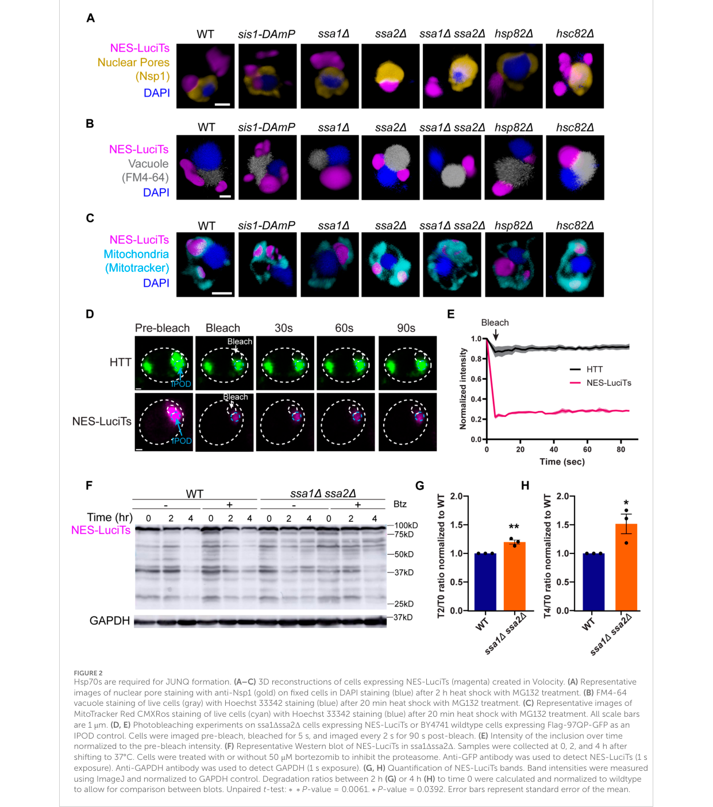

## Question

# Gene Research for Functional Annotation

## ⚠️ CRITICAL: Gene/Protein Identification Context

**BEFORE YOU BEGIN RESEARCH:** You MUST verify you are researching the CORRECT gene/protein. Gene symbols can be ambiguous, especially for less well-characterized genes from non-model organisms.

### Target Gene/Protein Identity (from UniProt):
- **UniProt Accession:** P10592
- **Protein Description:** RecName: Full=Heat shock protein SSA2;
- **Gene Information:** Name=SSA2; OrderedLocusNames=YLL024C; ORFNames=L0931;
- **Organism (full):** Saccharomyces cerevisiae (strain ATCC 204508 / S288c) (Baker's yeast).
- **Protein Family:** Belongs to the heat shock protein 70 family. .
- **Key Domains:** ATPase_NBD. (IPR043129); Heat_shock_70_CS. (IPR018181); HSP70_C_sf. (IPR029048); HSP70_peptide-bd_sf. (IPR029047); Hsp_70_fam. (IPR013126)

### MANDATORY VERIFICATION STEPS:

1. **Check if the gene symbol "SSA2" matches the protein description above**
2. **Verify the organism is correct:** Saccharomyces cerevisiae (strain ATCC 204508 / S288c) (Baker's yeast).
3. **Check if protein family/domains align with what you find in literature**
4. **If you find literature for a DIFFERENT gene with the same or similar symbol, STOP**

### If Gene Symbol is Ambiguous or You Cannot Find Relevant Literature:

**DO NOT PROCEED WITH RESEARCH ON A DIFFERENT GENE.** Instead:
- State clearly: "The gene symbol 'SSA2' is ambiguous or literature is limited for this specific protein"
- Explain what you found (e.g., "Found extensive literature on a different gene with the same symbol in a different organism")
- Describe the protein based ONLY on the UniProt information provided above
- Suggest that the protein function can be inferred from domain/family information

### Research Target:

Please provide a comprehensive research report on the gene **SSA2** (gene ID: SSA2, UniProt: P10592) in yeast.

The research report should be a detailed narrative explaining the function, biological processes, and localization of the gene product. Citations should be given for all claims.

You should prioritize authoritative reviews and primary scientific literature when conducting research. You can supplement
this with annotations you find in gene/protein databases, but these can be outdated or inaccurate.

We are specifically interested in the primary function of the gene - for enzymes, what reaction is catalyzed, and what is the substrate specificity? For transporters, what is the substrate? For structural proteins or adapters, what is the broader structural role? For signaling molecules, what is the role in the pathway.

We are interested in where in or outside the cell the gene product carries out its function.

We are also interested in the signaling or biochemical pathways in which the gene functions. We are less interested in broad pleiotropic effects, except where these elucidate the precise role.

Include evidence where possible. We are interested in both experimental evidence as well as inference from structure, evolution, or bioinformatic analysis. Precise studies should be prioritized over high-throughput, where available.

## Output

Question: You are an expert researcher providing comprehensive, well-cited information.

Provide detailed information focusing on:
1. Key concepts and definitions with current understanding
2. Recent developments and latest research (prioritize 2023-2024 sources)
3. Current applications and real-world implementations
4. Expert opinions and analysis from authoritative sources
5. Relevant statistics and data from recent studies

Format as a comprehensive research report with proper citations. Include URLs and publication dates where available.
Always prioritize recent, authoritative sources and provide specific citations for all major claims.

# Gene Research for Functional Annotation

## ⚠️ CRITICAL: Gene/Protein Identification Context

**BEFORE YOU BEGIN RESEARCH:** You MUST verify you are researching the CORRECT gene/protein. Gene symbols can be ambiguous, especially for less well-characterized genes from non-model organisms.

### Target Gene/Protein Identity (from UniProt):
- **UniProt Accession:** P10592
- **Protein Description:** RecName: Full=Heat shock protein SSA2;
- **Gene Information:** Name=SSA2; OrderedLocusNames=YLL024C; ORFNames=L0931;
- **Organism (full):** Saccharomyces cerevisiae (strain ATCC 204508 / S288c) (Baker's yeast).
- **Protein Family:** Belongs to the heat shock protein 70 family. .
- **Key Domains:** ATPase_NBD. (IPR043129); Heat_shock_70_CS. (IPR018181); HSP70_C_sf. (IPR029048); HSP70_peptide-bd_sf. (IPR029047); Hsp_70_fam. (IPR013126)

### MANDATORY VERIFICATION STEPS:

1. **Check if the gene symbol "SSA2" matches the protein description above**
2. **Verify the organism is correct:** Saccharomyces cerevisiae (strain ATCC 204508 / S288c) (Baker's yeast).
3. **Check if protein family/domains align with what you find in literature**
4. **If you find literature for a DIFFERENT gene with the same or similar symbol, STOP**

### If Gene Symbol is Ambiguous or You Cannot Find Relevant Literature:

**DO NOT PROCEED WITH RESEARCH ON A DIFFERENT GENE.** Instead:
- State clearly: "The gene symbol 'SSA2' is ambiguous or literature is limited for this specific protein"
- Explain what you found (e.g., "Found extensive literature on a different gene with the same symbol in a different organism")
- Describe the protein based ONLY on the UniProt information provided above
- Suggest that the protein function can be inferred from domain/family information

### Research Target:

Please provide a comprehensive research report on the gene **SSA2** (gene ID: SSA2, UniProt: P10592) in yeast.

The research report should be a detailed narrative explaining the function, biological processes, and localization of the gene product. Citations should be given for all claims.

You should prioritize authoritative reviews and primary scientific literature when conducting research. You can supplement
this with annotations you find in gene/protein databases, but these can be outdated or inaccurate.

We are specifically interested in the primary function of the gene - for enzymes, what reaction is catalyzed, and what is the substrate specificity? For transporters, what is the substrate? For structural proteins or adapters, what is the broader structural role? For signaling molecules, what is the role in the pathway.

We are interested in where in or outside the cell the gene product carries out its function.

We are also interested in the signaling or biochemical pathways in which the gene functions. We are less interested in broad pleiotropic effects, except where these elucidate the precise role.

Include evidence where possible. We are interested in both experimental evidence as well as inference from structure, evolution, or bioinformatic analysis. Precise studies should be prioritized over high-throughput, where available.

## Research report: Functional annotation of *Saccharomyces cerevisiae* SSA2 (UniProt P10592; YLL024C)

### 0) Target verification (mandatory)
The gene/protein addressed here is **SSA2 (YLL024C)** from *Saccharomyces cerevisiae* (S288c), encoding **Ssa2**, a **cytosolic Hsp70 (Stress-Seventy subfamily A) chaperone**. In the retrieved literature, SSA2 is consistently described as one of four cytosolic Ssa Hsp70 isoforms (Ssa1–4), with **Ssa1/Ssa2 constitutively expressed** and **Ssa3/Ssa4 stress-inducible**, matching the UniProt-provided identity and family assignment. No conflicting “SSA2” identities (other organisms/proteins) were encountered in the analyzed corpus. (gaur2020theyeasthsp70 pages 2-3, gaur2020theyeasthsp70 pages 1-1, gaur2020theyeasthsp70 pages 1-2)

### 1) Key concepts and definitions (current understanding)
#### 1.1 What SSA2 encodes (primary function)
**SSA2 encodes an ATP-dependent molecular chaperone of the Hsp70 family.** Rather than catalyzing a metabolic reaction with a defined substrate/product, Ssa2 performs **ATP-driven cycles of client binding and release** to prevent aggregation and promote folding/refolding and quality control. This is evidenced in (i) biochemical handling consistent with ATP-binding Hsp70 behavior (purification via ATP-agarose and ATP elution) and (ii) mechanistic descriptions of cochaperone control of the Hsp70 ATPase cycle (Ydj1 stimulating ATPase activity and substrate transfer). (gaur2020theyeasthsp70 pages 2-3, gaur2020theyeasthsp70 pages 9-9, matveenko2025optimizationofconditions pages 1-3)

#### 1.2 Canonical Hsp70 machine components relevant to SSA2
The evidence base emphasizes that Ssa2 functions as part of a chaperone system:
- **Hsp40/J-domain cochaperone Ydj1**: recruits misfolded clients to Hsp70 and stimulates Hsp70 ATPase activity and substrate transfer. (gaur2020theyeasthsp70 pages 12-13, gaur2020theyeasthsp70 pages 9-9)
- **Hsp90 (Hsp82)**: receives certain clients after Hsp70 processing; Ssa2 participates in upstream client handling and transfer toward Hsp90. (gaur2020theyeasthsp70 pages 12-13, gaur2020theyeasthsp70 pages 1-1)
- **Isoform specialization within cytosolic Ssa Hsp70s**: although homologous, Ssa isoforms are not fully redundant; Ssa2 can differ from Ssa4 in client maturation contexts and prion propagation phenotypes. (gaur2020theyeasthsp70 pages 2-3, gaur2020theyeasthsp70 pages 12-13)

#### 1.3 Domain-level functional mapping (alignment with UniProt domain architecture)
The provided evidence supports Hsp70’s division of labor between regions:
- The **N-terminal nucleotide-binding domain (NBD)** is implicated in ATPase-cycle control (Ydj1 binds the NBD to stimulate ATPase activity). (gaur2020theyeasthsp70 pages 13-14)
- Functional differences between Ssa2 and Ssa4 in an Hsp90-client context map strongly to the **C-terminal region**, which is also implicated in substrate transfer and isoform specificity. (gaur2020theyeasthsp70 pages 13-14, gaur2020theyeasthsp70 pages 1-1)

### 2) Cellular localization and where SSA2 acts
Direct evidence in the corpus places Ssa2 primarily in the **cytosol**, consistent with its classification as a cytosolic Ssa Hsp70:
- Gaur et al. explicitly treat Ssa2 as one of four **cytosolic** Ssa Hsp70s acting in the Hsp90 pathway. (gaur2020theyeasthsp70 pages 1-1, gaur2020theyeasthsp70 pages 1-2)
- Fluorescence microscopy of N-terminally tagged Ssa proteins (including **Ssa2**) shows predominantly **diffuse** signal in most cells, supporting predominant **cytosolic localization** under those conditions. (matveenko2025optimizationofconditions pages 7-9)

In addition, recent work connects Ssa1/Ssa2 activity to **spatial protein quality control compartments** at the cytoplasm–organelle interface:
- Ssa1/Ssa2 are required for formation/localization of the cytoplasmic **JUNQ** compartment adjacent to the **nucleus–vacuole junction (NVJ)** and for degradation of cytoplasmic misfolded proteins that are routed there. (rolli2024clearingthejunq pages 1-2, rolli2024clearingthejunq pages 12-13)

### 3) Pathways and biological processes involving SSA2
#### 3.1 Hsp70–Hsp90 client processing and maturation
A detailed mechanistic model for Ssa2 in a client maturation pathway comes from an Hsp90-client system:
- Using v-Src as an Hsp90 client, Gaur et al. show that the Hsp40 cochaperone **Ydj1 binds misfolded client, recruits it to Hsp70, and transfers it preferentially to Ssa2** (relative to Ssa4). Transfer to Ssa2 supports subsequent engagement with Hsp90 and client maturation. (gaur2020theyeasthsp70 pages 12-13)
- Although Ssa2 and Ssa4 bind Hsp90 similarly, the key discriminant is **weaker Ydj1 interaction with Ssa4**, reducing Ydj1-assisted folding/transfer efficiency and lowering client maturation efficiency when Ssa4 is the sole Ssa. (gaur2020theyeasthsp70 pages 9-9, gaur2020theyeasthsp70 pages 1-1)

#### 3.2 Heat shock response (HSR) feedback control involving SSA2 (2024 development)
A 2024 preprint directly interrogates gene-by-gene contributions to HSR feedback:
- Among SSA paralogs in that dataset, expression rank was reported as **Ssa3 < Ssa4 < Ssa1 < Ssa2**, placing **SSA2 highest** among SSA paralogs measured. (garde2024feedbackcontrolof pages 4-7)
- Disrupting the Hsf1-binding site in SSA2 (**ssa2ΔHSE**) was associated with **elevated basal HSE-YFP reporter** and **reduced induction after prolonged heat shock**, and the authors interpret the reduced induction as explained by the increased basal reporter level—consistent with SSA2 contributing to basal repression/feedback behavior in the Hsf1 regulon context. The study reports significance testing for reporter changes after 4 h heat shock (p < 0.05; two-tailed t-test) and identifies ssa2ΔHSE among specific mutants with these reporter phenotypes. (garde2024feedbackcontrolof pages 4-7)

#### 3.3 Spatial proteostasis: JUNQ/IPOD sorting and microautophagy-linked clearance (2024 review)
Rolli et al. (2024) synthesize and extend evidence for how misfolded proteins are sorted and cleared:
- **Ssa1/Ssa2 requirement**: loss of Ssa1 and Ssa2 together shifts cytoplasmic misfolded-protein handling away from perinuclear JUNQ sorting and toward a peripheral, IPOD-like inclusion; the double deletion **inhibits clearance** of a misfolded cytosolic reporter (NES-LuciTs) and produces inclusions with limited FRAP recovery (static behavior). (rolli2024clearingthejunq pages 1-2, rolli2024clearingthejunq pages 12-13, rolli2024clearingthejunq pages 5-7)
- **Sorting factors**: sequestrase **Btn2** is required for perinuclear foci (JUNQ-like), whereas **Hsp42** promotes peripheral foci (IPOD-like); genetic deletions bias the reporter localization accordingly. (rolli2024clearingthejunq pages 12-13, rolli2024clearingthejunq pages 7-9)
- **Clearance mechanism**: components associated with **piecemeal microautophagy of the nucleus (PMN)** and NVJ structure—**Atg1, Atg8, Nvj1, Vac8**—are implicated in JUNQ formation/clearance; Atg1 or Atg8 deletion decreases reporter clearance compared to wild type. Proteasome inhibition with **50 μM bortezomib** did not show a strong effect on degradation of the cytoplasmic NES-LuciTs reporter in the described assay conditions, supporting a vacuole/autophagy-linked route for that substrate. (rolli2024clearingthejunq pages 12-13, rolli2024clearingthejunq pages 1-2)

### 4) Recent developments (prioritizing 2023–2024)
The most SSA2-relevant 2023–2024 developments captured in the retrieved set are:
1. **HSR systems-level feedback dissection**: SSA2 emerges as (i) highly expressed relative to other SSA paralogs in a reporter dataset and (ii) a locus where deleting the Hsf1 binding site changes basal and induced Hsf1 reporter output, supporting models in which Hsp70-family expression shapes negative feedback and basal repression dynamics. (Publication date: 2024-01; URL: https://doi.org/10.1101/2024.01.09.574867) (garde2024feedbackcontrolof pages 4-7)
2. **Spatial quality control emphasis**: a 2024 JUNQ-focused synthesis identifies **Ssa1/Ssa2 as required** for JUNQ localization to NVJ and degradation of cytosolic misfolded proteins, integrating Hsp70 function with NVJ/microautophagy factors (Atg1/Atg8; Nvj1/Vac8) and sorting factors (Btn2/Hsp42). (Publication date: 2024-08; URL: https://doi.org/10.3389/fmolb.2024.1427542) (rolli2024clearingthejunq pages 1-2, rolli2024clearingthejunq pages 12-13)

### 5) Current applications and real-world implementations
Within the provided evidence, SSA2’s “applications” are primarily as a **core tool gene/protein in experimental and engineering workflows** around proteostasis:
- **Client maturation pathway dissection**: SSA2 is used as a defined isoform background (including chimeras between Ssa2 and Ssa4) to map determinants of Hsp70 isoform specificity in the Hsp90 pathway and to understand how cochaperones (Ydj1) route clients through the Hsp70→Hsp90 pipeline. (gaur2020theyeasthsp70 pages 12-13, gaur2020theyeasthsp70 pages 13-14)
- **Proteostasis compartment assays**: the Ssa1/Ssa2 requirement for JUNQ routing and clearance makes SSA2 relevant for modeling cytosolic proteotoxic stress management, including imaging (localization, FRAP) and biochemical clearance assays (time-course Western blot). (rolli2024clearingthejunq pages 1-2, rolli2024clearingthejunq pages 5-7)
- **Recombinant production and localization validation**: constructs expressing tagged SSA2 were used to optimize cytosolic Hsp70 production in yeast and confirm a largely cytosolic distribution, supporting practical purification/biochemical study pipelines. (Publication date: 2025-06; URL: https://doi.org/10.17816/ecogen676918) (matveenko2025optimizationofconditions pages 7-9)

### 6) Expert opinions / analysis from authoritative sources (within the retrieved evidence)
- **Isoform specialization is functionally meaningful**: despite high homology among Ssa paralogs, Gaur et al. emphasize that isoforms can be functionally distinct in defined pathways (Hsp90 client maturation), and map those distinctions to specific regions (C-terminal determinants) and cochaperone affinities (Ydj1). This positions SSA2 not as a generic “redundant” Hsp70 but as an isoform with measurable pathway-specific capabilities. (gaur2020theyeasthsp70 pages 13-14, gaur2020theyeasthsp70 pages 9-9, gaur2020theyeasthsp70 pages 1-1)
- **Proteostasis is spatially organized and chaperone-dependent**: Rolli et al. frame Ssa1/Ssa2 as required components that help determine whether cytosolic misfolded proteins are routed to JUNQ vs IPOD and whether they are cleared efficiently, integrating Hsp70 function into emerging models where subcellular localization (NVJ proximity) links to clearance route (microautophagy-associated processes). (rolli2024clearingthejunq pages 1-2, rolli2024clearingthejunq pages 12-13)

### 7) Statistics and quantitative data (from cited studies)
Key quantitative points directly extractable from the evidence include:
- **~25–30× difference**: Ydj1-assisted luciferase refolding activity was reported as **~25–30-fold higher with Ssa2 than with Ssa4**, consistent with stronger Ydj1–Ssa2 functional coupling. (Gaur et al., 2020-07; https://doi.org/10.1534/genetics.120.303190) (gaur2020theyeasthsp70 pages 13-14)
- **HSR reporter statistics**: after 4 h heat shock, the HSR feedback study reports groups of ΔHSE mutants with significantly increased/decreased HSE-YFP relative to wild type (**p < 0.05**, two-tailed t-test) and identifies **ssa2ΔHSE** among those with elevated basal HSE-YFP and reduced inducibility. (Garde et al., 2024-01; https://doi.org/10.1101/2024.01.09.574867) (garde2024feedbackcontrolof pages 4-7)
- **Proteostasis clearance assays**: JUNQ/IPOD work reports significant differences in quantified degradation/phenotypes in certain comparisons (**P = 0.0061** and **P = 0.0392**; unpaired t-tests) in time-course/clearance measurements, and notes that one cytosolic reporter (NES-VHL) cleared in about **half the time** of another (NES-Luci). (Rolli et al., 2024-08; https://doi.org/10.3389/fmolb.2024.1427542) (rolli2024clearingthejunq pages 7-9, rolli2024clearingthejunq pages 12-13)

### 8) Visual evidence (figures)
Rolli et al. (2024) figures provide visual support for SSA2-relevant claims: the requirement for Ssa1/Ssa2 in JUNQ formation and routing, Btn2/Hsp42 sorting effects, and the involvement of Atg1/Atg8 in clearance are shown in cropped figure panels retrieved from the paper. (rolli2024clearingthejunq media fa7c60b5, rolli2024clearingthejunq media b834e7ef, rolli2024clearingthejunq media 33462aaf)

### 9) Evidence map (compact)
The following table is an evidence-mapped summary of SSA2 functional annotation from the retrieved corpus.

| Aspect | Evidence summary | Key source(s) with year, URL, and context citation IDs |
|---|---|---|
| identity/domains | SSA2 matches the target protein as a **Saccharomyces cerevisiae cytosolic Ssa Hsp70** and is one of four SSA-family Hsp70 isoforms (Ssa1–4); Ssa1/2 are constitutive, whereas Ssa3/4 are stress inducible. Hsp70 functional architecture is supported by evidence that the **N-terminal nucleotide-binding domain (NBD)** mediates ATPase regulation and the **C-terminal region** contributes to substrate transfer/isoform specificity; the cited work maps functional distinction between Ssa2 and Ssa4 largely to the C-terminal domain. (gaur2020theyeasthsp70 pages 2-3, gaur2020theyeasthsp70 pages 13-14, gaur2020theyeasthsp70 pages 1-1, gaur2020theyeasthsp70 pages 1-2) | Gaur et al., 2020, *Genetics*, https://doi.org/10.1534/genetics.120.303190 (gaur2020theyeasthsp70 pages 13-14, gaur2020theyeasthsp70 pages 2-3, gaur2020theyeasthsp70 pages 1-1, gaur2020theyeasthsp70 pages 1-2) |
| biochemical activity | SSA2 is an **ATP-dependent molecular chaperone** of the Hsp70 family that binds ATP and acts with **Hsp40 cochaperones** and **nucleotide exchange factors** to prevent aggregation, assist folding/refolding, and support degradation/translocation of client proteins. Experimental handling of purified Ssa2 with ATP-agarose and mechanistic interpretation of Ydj1 action support ATP-linked chaperone cycling rather than enzyme-like substrate conversion. (gaur2020theyeasthsp70 pages 2-3, gaur2020theyeasthsp70 pages 9-9, matveenko2025optimizationofconditions pages 9-10, matveenko2025optimizationofconditions pages 1-3) | Gaur et al., 2020, https://doi.org/10.1534/genetics.120.303190 (gaur2020theyeasthsp70 pages 2-3, gaur2020theyeasthsp70 pages 9-9); Matveenko et al., 2025, https://doi.org/10.17816/ecogen676918 (matveenko2025optimizationofconditions pages 9-10, matveenko2025optimizationofconditions pages 1-3) |
| localization | The strongest direct localization evidence in the provided context places SSA2 in the **cytosol**. Tagged Ssa proteins, including Ssa2, showed a predominantly **diffuse cytosolic distribution** in fluorescence microscopy, and Gaur et al. also describe SSA2 as a cytosolic Hsp70 acting upstream of Hsp90. (gaur2020theyeasthsp70 pages 1-1, gaur2020theyeasthsp70 pages 1-2, matveenko2025optimizationofconditions pages 7-9) | Gaur et al., 2020, https://doi.org/10.1534/genetics.120.303190 (gaur2020theyeasthsp70 pages 1-1, gaur2020theyeasthsp70 pages 1-2); Matveenko et al., 2025, https://doi.org/10.17816/ecogen676918 (matveenko2025optimizationofconditions pages 7-9) |
| pathways/complexes | SSA2 functions in the **Hsp70–Hsp90 chaperone pathway**, where Ydj1 recruits misfolded clients to Hsp70 and promotes transfer toward Hsp90-dependent maturation; Ssa2 supports this process better than Ssa4. In proteostasis compartment biology, Ssa1/Ssa2 are required for **JUNQ sorting/localization to the nucleus–vacuole junction (NVJ)** and for clearance of cytoplasmic misfolded proteins, with Btn2 favoring JUNQ sorting, Hsp42 favoring IPOD sorting, and Atg1/Atg8 plus Nvj1/Vac8 implicated in JUNQ clearance via microautophagy-related mechanisms. (gaur2020theyeasthsp70 pages 12-13, gaur2020theyeasthsp70 pages 9-9, rolli2024clearingthejunq pages 12-13, rolli2024clearingthejunq pages 1-2, rolli2024clearingthejunq pages 7-9, rolli2024clearingthejunq pages 5-7) | Gaur et al., 2020, https://doi.org/10.1534/genetics.120.303190 (gaur2020theyeasthsp70 pages 12-13, gaur2020theyeasthsp70 pages 9-9); Rolli et al., 2024, *Front. Mol. Biosci.*, https://doi.org/10.3389/fmolb.2024.1427542 (rolli2024clearingthejunq pages 12-13, rolli2024clearingthejunq pages 1-2, rolli2024clearingthejunq pages 7-9, rolli2024clearingthejunq pages 5-7) |
| recent 2023-2024 findings | In a 2024 heat-shock feedback study, **SSA2 had the highest expression rank** among SSA paralogs in the reported reporter dataset (Ssa3 < Ssa4 < Ssa1 < Ssa2), and deleting the Hsf1-binding site at SSA2 altered Hsf1 reporter behavior, consistent with SSA2 contributing to **basal repression/feedback control** of Hsf1-regulated heat-shock expression. A separate 2024 study showed that loss of Ssa1/Ssa2 shifts cytoplasmic misfolded-protein management away from JUNQ and toward IPOD-like inclusions, linking SSA2 to modern models of spatial proteostasis. (garde2024feedbackcontrolof pages 4-7, rolli2024clearingthejunq pages 12-13, rolli2024clearingthejunq pages 1-2, rolli2024clearingthejunq pages 7-9) | Garde et al., 2024, *bioRxiv*, https://doi.org/10.1101/2024.01.09.574867 (garde2024feedbackcontrolof pages 4-7); Rolli et al., 2024, https://doi.org/10.3389/fmolb.2024.1427542 (rolli2024clearingthejunq pages 12-13, rolli2024clearingthejunq pages 1-2, rolli2024clearingthejunq pages 7-9) |
| quantitative/statistical data | Quantitative findings in the provided context include: **Ydj1-assisted luciferase refolding was ~25–30× higher with Ssa2 than Ssa4** in the Hsp90-client study; in the heat-shock feedback study, **six** ΔHSE mutants had significantly increased and **three** had significantly reduced HSE-YFP after 4 h heat shock (**p < 0.05**), with **ssa2ΔHSE** among mutants showing elevated basal reporter signal; and in JUNQ studies, NES-LuciTs degradation phenotypes showed significant differences (**P = 0.0061** and **P = 0.0392** in unpaired t-tests), while **50 μM bortezomib** did not significantly alter NES-LuciTs degradation in one assay and NES-VHL cleared in about **half the time** of NES-Luci. (gaur2020theyeasthsp70 pages 13-14, garde2024feedbackcontrolof pages 4-7, rolli2024clearingthejunq pages 12-13, rolli2024clearingthejunq pages 7-9) | Gaur et al., 2020, https://doi.org/10.1534/genetics.120.303190 (gaur2020theyeasthsp70 pages 13-14); Garde et al., 2024, https://doi.org/10.1101/2024.01.09.574867 (garde2024feedbackcontrolof pages 4-7); Rolli et al., 2024, https://doi.org/10.3389/fmolb.2024.1427542 (rolli2024clearingthejunq pages 12-13, rolli2024clearingthejunq pages 7-9) |
| applications | Within the provided evidence, SSA2 is most useful as a **model proteostasis factor** for dissecting client maturation, stress-response feedback, prion biology, and spatial quality control rather than as a dedicated metabolic enzyme or transporter. The studies use SSA2 in practical experimental contexts including purified chaperone biochemistry, isoform-swapping to map domain specificity, and reporter-based assays for misfolded-protein clearance and heat-shock regulation. (gaur2020theyeasthsp70 pages 13-14, gaur2020theyeasthsp70 pages 12-13, matveenko2025optimizationofconditions pages 1-3, garde2024feedbackcontrolof pages 4-7, rolli2024clearingthejunq pages 1-2) | Gaur et al., 2020, https://doi.org/10.1534/genetics.120.303190 (gaur2020theyeasthsp70 pages 13-14, gaur2020theyeasthsp70 pages 12-13); Matveenko et al., 2025, https://doi.org/10.17816/ecogen676918 (matveenko2025optimizationofconditions pages 1-3); Garde et al., 2024, https://doi.org/10.1101/2024.01.09.574867 (garde2024feedbackcontrolof pages 4-7); Rolli et al., 2024, https://doi.org/10.3389/fmolb.2024.1427542 (rolli2024clearingthejunq pages 1-2) |

*Table: This table summarizes identity, activity, localization, pathways, recent findings, quantitative data, and practical research uses for yeast SSA2 (UniProt P10592/YLL024C) using only the provided evidence contexts. It is useful as a compact evidence map for functional annotation and literature-backed reporting.*

### 10) Limitations of this report (scope of retrieved evidence)
Although the user requested prioritization of 2023–2024 sources, the retrieved corpus contains SSA2-focused mechanistic details mostly in **2020** and **2024** sources, with no additional 2023 peer-reviewed SSA2-specific primary paper content beyond what was captured by the available texts. Database-level details (e.g., UniProt catalytic residue annotations, comprehensive interaction networks) were not directly retrieved via tools in this run; therefore, statements here are restricted to tool-retrieved primary/review evidence.

References

1. (gaur2020theyeasthsp70 pages 2-3): Deepika Gaur, Prashant Singh, Jyoti Guleria, Arpit Gupta, Satinderdeep Kaur, and Deepak Sharma. The yeast hsp70 cochaperone ydj1 regulates functional distinction of ssa hsp70s in the hsp90 chaperoning pathway. Genetics, 215:683-698, Jul 2020. URL: https://doi.org/10.1534/genetics.120.303190, doi:10.1534/genetics.120.303190. This article has 25 citations and is from a domain leading peer-reviewed journal.

2. (gaur2020theyeasthsp70 pages 1-1): Deepika Gaur, Prashant Singh, Jyoti Guleria, Arpit Gupta, Satinderdeep Kaur, and Deepak Sharma. The yeast hsp70 cochaperone ydj1 regulates functional distinction of ssa hsp70s in the hsp90 chaperoning pathway. Genetics, 215:683-698, Jul 2020. URL: https://doi.org/10.1534/genetics.120.303190, doi:10.1534/genetics.120.303190. This article has 25 citations and is from a domain leading peer-reviewed journal.

3. (gaur2020theyeasthsp70 pages 1-2): Deepika Gaur, Prashant Singh, Jyoti Guleria, Arpit Gupta, Satinderdeep Kaur, and Deepak Sharma. The yeast hsp70 cochaperone ydj1 regulates functional distinction of ssa hsp70s in the hsp90 chaperoning pathway. Genetics, 215:683-698, Jul 2020. URL: https://doi.org/10.1534/genetics.120.303190, doi:10.1534/genetics.120.303190. This article has 25 citations and is from a domain leading peer-reviewed journal.

4. (gaur2020theyeasthsp70 pages 9-9): Deepika Gaur, Prashant Singh, Jyoti Guleria, Arpit Gupta, Satinderdeep Kaur, and Deepak Sharma. The yeast hsp70 cochaperone ydj1 regulates functional distinction of ssa hsp70s in the hsp90 chaperoning pathway. Genetics, 215:683-698, Jul 2020. URL: https://doi.org/10.1534/genetics.120.303190, doi:10.1534/genetics.120.303190. This article has 25 citations and is from a domain leading peer-reviewed journal.

5. (matveenko2025optimizationofconditions pages 1-3): A. Matveenko, A. A. Tsvetkov, Tatiana M Rogoza, Yury A. Barbitoff, and G. Zhouravleva. Optimization of conditions for the productionof hsp70 chaperones in saccharomyces cerevisiae cells. Ecological genetics, Jun 2025. URL: https://doi.org/10.17816/ecogen676918, doi:10.17816/ecogen676918. This article has 0 citations.

6. (gaur2020theyeasthsp70 pages 12-13): Deepika Gaur, Prashant Singh, Jyoti Guleria, Arpit Gupta, Satinderdeep Kaur, and Deepak Sharma. The yeast hsp70 cochaperone ydj1 regulates functional distinction of ssa hsp70s in the hsp90 chaperoning pathway. Genetics, 215:683-698, Jul 2020. URL: https://doi.org/10.1534/genetics.120.303190, doi:10.1534/genetics.120.303190. This article has 25 citations and is from a domain leading peer-reviewed journal.

7. (gaur2020theyeasthsp70 pages 13-14): Deepika Gaur, Prashant Singh, Jyoti Guleria, Arpit Gupta, Satinderdeep Kaur, and Deepak Sharma. The yeast hsp70 cochaperone ydj1 regulates functional distinction of ssa hsp70s in the hsp90 chaperoning pathway. Genetics, 215:683-698, Jul 2020. URL: https://doi.org/10.1534/genetics.120.303190, doi:10.1534/genetics.120.303190. This article has 25 citations and is from a domain leading peer-reviewed journal.

8. (matveenko2025optimizationofconditions pages 7-9): A. Matveenko, A. A. Tsvetkov, Tatiana M Rogoza, Yury A. Barbitoff, and G. Zhouravleva. Optimization of conditions for the productionof hsp70 chaperones in saccharomyces cerevisiae cells. Ecological genetics, Jun 2025. URL: https://doi.org/10.17816/ecogen676918, doi:10.17816/ecogen676918. This article has 0 citations.

9. (rolli2024clearingthejunq pages 1-2): Sarah Rolli, Chloe A. Langridge, and Emily M. Sontag. Clearing the junq: the molecular machinery for sequestration, localization, and degradation of the junq compartment. Frontiers in Molecular Biosciences, Aug 2024. URL: https://doi.org/10.3389/fmolb.2024.1427542, doi:10.3389/fmolb.2024.1427542. This article has 8 citations.

10. (rolli2024clearingthejunq pages 12-13): Sarah Rolli, Chloe A. Langridge, and Emily M. Sontag. Clearing the junq: the molecular machinery for sequestration, localization, and degradation of the junq compartment. Frontiers in Molecular Biosciences, Aug 2024. URL: https://doi.org/10.3389/fmolb.2024.1427542, doi:10.3389/fmolb.2024.1427542. This article has 8 citations.

11. (garde2024feedbackcontrolof pages 4-7): Rania Garde, Annisa Dea, Madeline F. Herwig, and David Pincus. Feedback control of the heat shock response by spatiotemporal regulation of hsp70. bioRxiv, Jan 2024. URL: https://doi.org/10.1101/2024.01.09.574867, doi:10.1101/2024.01.09.574867. This article has 17 citations.

12. (rolli2024clearingthejunq pages 5-7): Sarah Rolli, Chloe A. Langridge, and Emily M. Sontag. Clearing the junq: the molecular machinery for sequestration, localization, and degradation of the junq compartment. Frontiers in Molecular Biosciences, Aug 2024. URL: https://doi.org/10.3389/fmolb.2024.1427542, doi:10.3389/fmolb.2024.1427542. This article has 8 citations.

13. (rolli2024clearingthejunq pages 7-9): Sarah Rolli, Chloe A. Langridge, and Emily M. Sontag. Clearing the junq: the molecular machinery for sequestration, localization, and degradation of the junq compartment. Frontiers in Molecular Biosciences, Aug 2024. URL: https://doi.org/10.3389/fmolb.2024.1427542, doi:10.3389/fmolb.2024.1427542. This article has 8 citations.

14. (rolli2024clearingthejunq media fa7c60b5): Sarah Rolli, Chloe A. Langridge, and Emily M. Sontag. Clearing the junq: the molecular machinery for sequestration, localization, and degradation of the junq compartment. Frontiers in Molecular Biosciences, Aug 2024. URL: https://doi.org/10.3389/fmolb.2024.1427542, doi:10.3389/fmolb.2024.1427542. This article has 8 citations.

15. (rolli2024clearingthejunq media b834e7ef): Sarah Rolli, Chloe A. Langridge, and Emily M. Sontag. Clearing the junq: the molecular machinery for sequestration, localization, and degradation of the junq compartment. Frontiers in Molecular Biosciences, Aug 2024. URL: https://doi.org/10.3389/fmolb.2024.1427542, doi:10.3389/fmolb.2024.1427542. This article has 8 citations.

16. (rolli2024clearingthejunq media 33462aaf): Sarah Rolli, Chloe A. Langridge, and Emily M. Sontag. Clearing the junq: the molecular machinery for sequestration, localization, and degradation of the junq compartment. Frontiers in Molecular Biosciences, Aug 2024. URL: https://doi.org/10.3389/fmolb.2024.1427542, doi:10.3389/fmolb.2024.1427542. This article has 8 citations.

17. (matveenko2025optimizationofconditions pages 9-10): A. Matveenko, A. A. Tsvetkov, Tatiana M Rogoza, Yury A. Barbitoff, and G. Zhouravleva. Optimization of conditions for the productionof hsp70 chaperones in saccharomyces cerevisiae cells. Ecological genetics, Jun 2025. URL: https://doi.org/10.17816/ecogen676918, doi:10.17816/ecogen676918. This article has 0 citations.

## Artifacts

- [Edison artifact artifact-00](SSA2-deep-research-falcon_artifacts/artifact-00.md)

## Citations

1. matveenko2025optimizationofconditions pages 7-9
2. garde2024feedbackcontrolof pages 4-7
3. matveenko2025optimizationofconditions pages 1-3
4. rolli2024clearingthejunq pages 1-2
5. rolli2024clearingthejunq pages 12-13
6. rolli2024clearingthejunq pages 5-7
7. rolli2024clearingthejunq pages 7-9
8. matveenko2025optimizationofconditions pages 9-10
9. https://doi.org/10.1101/2024.01.09.574867
10. https://doi.org/10.3389/fmolb.2024.1427542
11. https://doi.org/10.17816/ecogen676918
12. https://doi.org/10.1534/genetics.120.303190
13. https://doi.org/10.1534/genetics.120.303190,
14. https://doi.org/10.17816/ecogen676918,
15. https://doi.org/10.3389/fmolb.2024.1427542,
16. https://doi.org/10.1101/2024.01.09.574867,