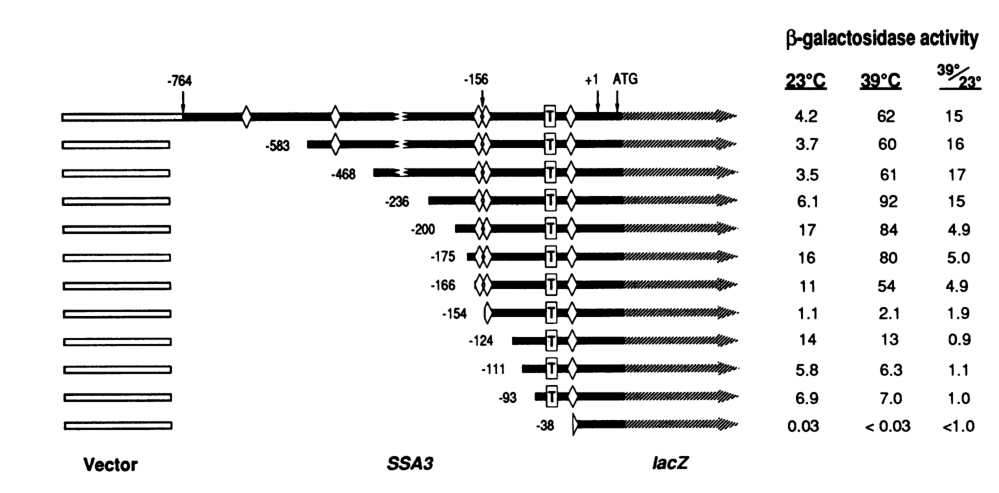

## Question

# Gene Research for Functional Annotation

## ⚠️ CRITICAL: Gene/Protein Identification Context

**BEFORE YOU BEGIN RESEARCH:** You MUST verify you are researching the CORRECT gene/protein. Gene symbols can be ambiguous, especially for less well-characterized genes from non-model organisms.

### Target Gene/Protein Identity (from UniProt):
- **UniProt Accession:** P09435
- **Protein Description:** RecName: Full=Heat shock protein SSA3;
- **Gene Information:** Name=SSA3; OrderedLocusNames=YBL075C; ORFNames=YBL06.07, YBL0610;
- **Organism (full):** Saccharomyces cerevisiae (strain ATCC 204508 / S288c) (Baker's yeast).
- **Protein Family:** Belongs to the heat shock protein 70 family. .
- **Key Domains:** ATPase_NBD. (IPR043129); Heat_shock_70_CS. (IPR018181); HSP70_C_sf. (IPR029048); HSP70_peptide-bd_sf. (IPR029047); Hsp_70_fam. (IPR013126)

### MANDATORY VERIFICATION STEPS:

1. **Check if the gene symbol "SSA3" matches the protein description above**
2. **Verify the organism is correct:** Saccharomyces cerevisiae (strain ATCC 204508 / S288c) (Baker's yeast).
3. **Check if protein family/domains align with what you find in literature**
4. **If you find literature for a DIFFERENT gene with the same or similar symbol, STOP**

### If Gene Symbol is Ambiguous or You Cannot Find Relevant Literature:

**DO NOT PROCEED WITH RESEARCH ON A DIFFERENT GENE.** Instead:
- State clearly: "The gene symbol 'SSA3' is ambiguous or literature is limited for this specific protein"
- Explain what you found (e.g., "Found extensive literature on a different gene with the same symbol in a different organism")
- Describe the protein based ONLY on the UniProt information provided above
- Suggest that the protein function can be inferred from domain/family information

### Research Target:

Please provide a comprehensive research report on the gene **SSA3** (gene ID: SSA3, UniProt: P09435) in yeast.

The research report should be a detailed narrative explaining the function, biological processes, and localization of the gene product. Citations should be given for all claims.

You should prioritize authoritative reviews and primary scientific literature when conducting research. You can supplement
this with annotations you find in gene/protein databases, but these can be outdated or inaccurate.

We are specifically interested in the primary function of the gene - for enzymes, what reaction is catalyzed, and what is the substrate specificity? For transporters, what is the substrate? For structural proteins or adapters, what is the broader structural role? For signaling molecules, what is the role in the pathway.

We are interested in where in or outside the cell the gene product carries out its function.

We are also interested in the signaling or biochemical pathways in which the gene functions. We are less interested in broad pleiotropic effects, except where these elucidate the precise role.

Include evidence where possible. We are interested in both experimental evidence as well as inference from structure, evolution, or bioinformatic analysis. Precise studies should be prioritized over high-throughput, where available.

## Output

Question: You are an expert researcher providing comprehensive, well-cited information.

Provide detailed information focusing on:
1. Key concepts and definitions with current understanding
2. Recent developments and latest research (prioritize 2023-2024 sources)
3. Current applications and real-world implementations
4. Expert opinions and analysis from authoritative sources
5. Relevant statistics and data from recent studies

Format as a comprehensive research report with proper citations. Include URLs and publication dates where available.
Always prioritize recent, authoritative sources and provide specific citations for all major claims.

# Gene Research for Functional Annotation

## ⚠️ CRITICAL: Gene/Protein Identification Context

**BEFORE YOU BEGIN RESEARCH:** You MUST verify you are researching the CORRECT gene/protein. Gene symbols can be ambiguous, especially for less well-characterized genes from non-model organisms.

### Target Gene/Protein Identity (from UniProt):
- **UniProt Accession:** P09435
- **Protein Description:** RecName: Full=Heat shock protein SSA3;
- **Gene Information:** Name=SSA3; OrderedLocusNames=YBL075C; ORFNames=YBL06.07, YBL0610;
- **Organism (full):** Saccharomyces cerevisiae (strain ATCC 204508 / S288c) (Baker's yeast).
- **Protein Family:** Belongs to the heat shock protein 70 family. .
- **Key Domains:** ATPase_NBD. (IPR043129); Heat_shock_70_CS. (IPR018181); HSP70_C_sf. (IPR029048); HSP70_peptide-bd_sf. (IPR029047); Hsp_70_fam. (IPR013126)

### MANDATORY VERIFICATION STEPS:

1. **Check if the gene symbol "SSA3" matches the protein description above**
2. **Verify the organism is correct:** Saccharomyces cerevisiae (strain ATCC 204508 / S288c) (Baker's yeast).
3. **Check if protein family/domains align with what you find in literature**
4. **If you find literature for a DIFFERENT gene with the same or similar symbol, STOP**

### If Gene Symbol is Ambiguous or You Cannot Find Relevant Literature:

**DO NOT PROCEED WITH RESEARCH ON A DIFFERENT GENE.** Instead:
- State clearly: "The gene symbol 'SSA3' is ambiguous or literature is limited for this specific protein"
- Explain what you found (e.g., "Found extensive literature on a different gene with the same symbol in a different organism")
- Describe the protein based ONLY on the UniProt information provided above
- Suggest that the protein function can be inferred from domain/family information

### Research Target:

Please provide a comprehensive research report on the gene **SSA3** (gene ID: SSA3, UniProt: P09435) in yeast.

The research report should be a detailed narrative explaining the function, biological processes, and localization of the gene product. Citations should be given for all claims.

You should prioritize authoritative reviews and primary scientific literature when conducting research. You can supplement
this with annotations you find in gene/protein databases, but these can be outdated or inaccurate.

We are specifically interested in the primary function of the gene - for enzymes, what reaction is catalyzed, and what is the substrate specificity? For transporters, what is the substrate? For structural proteins or adapters, what is the broader structural role? For signaling molecules, what is the role in the pathway.

We are interested in where in or outside the cell the gene product carries out its function.

We are also interested in the signaling or biochemical pathways in which the gene functions. We are less interested in broad pleiotropic effects, except where these elucidate the precise role.

Include evidence where possible. We are interested in both experimental evidence as well as inference from structure, evolution, or bioinformatic analysis. Precise studies should be prioritized over high-throughput, where available.

## Comprehensive functional annotation report: *Saccharomyces cerevisiae* **SSA3** (UniProt P09435; locus YBL075C)

### 1) Gene/protein identity verification (critical disambiguation)

All evidence gathered in this report refers to the budding yeast *Saccharomyces cerevisiae* cytosolic Hsp70 paralog **Ssa3** (gene **SSA3**), which is consistently discussed in the literature as one of the four cytosolic Hsp70-Ssa proteins (**Ssa1–Ssa4**). SSA3 is repeatedly described as a **heat/stress-inducible** cytosolic Hsp70, in contrast to **SSA1/SSA2**, which are constitutively expressed. (hasin2014globaltranscriptand pages 1-2, young1993saccharomycescerevisiaehsp70 pages 1-2, hasin2014globaltranscriptand pages 2-4)

Paralog relationships reported experimentally support correct identification: Ssa1/Ssa2 are ~97% identical; the inducible isoforms Ssa3/Ssa4 are ~87–88% identical to each other and share ~80% identity with Ssa1/2. (hasin2014globaltranscriptand pages 2-4)

### 2) Key concepts and definitions (current understanding)

#### 2.1 What SSA3 encodes
SSA3 encodes **Ssa3**, a member of the **Hsp70** molecular chaperone family, the major cytosolic Hsp70 system in yeast. (verghese2012biologyofthe pages 13-13, hasin2014globaltranscriptand pages 1-2)

#### 2.2 Core Hsp70 mechanism (how Ssa3 works)
Hsp70/Ssa chaperones are **ATP-dependent**. They bind exposed hydrophobic segments of non-native proteins to prevent aggregation and promote productive folding/refolding and quality control. (cusack2010assessingtherole pages 30-34, hasin2014globaltranscriptand pages 1-2)

Mechanistically, Hsp70 proteins consist of an N-terminal **nucleotide-binding/ATPase domain (NBD)** and a **substrate-binding domain (SBD)** with a helical “lid.” ATP binding and hydrolysis drive switching between low-affinity/high-exchange and high-affinity/slow-exchange substrate states; co-chaperones (notably J-domain proteins/Hsp40s) stimulate ATP hydrolysis and nucleotide-exchange factors reset the cycle. (cusack2010assessingtherole pages 30-34, xiao2021thestudyof pages 16-20)

### 3) Molecular function, biological processes, and pathways

#### 3.1 Primary function (functional annotation)
**Primary molecular function:** SSA3 encodes a **cytosolic ATP-dependent protein chaperone** that participates in proteostasis by assisting folding/refolding and limiting aggregation of stress-denatured proteins. (verghese2012biologyofthe pages 13-13, hasin2014globaltranscriptand pages 1-2)

#### 3.2 Heat shock response (HSR) / Hsf1 regulon linkage
SSA3 is a canonical **Hsf1-regulated heat shock response gene** and serves as a sensitive readout of Hsf1 activity in multiple studies. The HSR is often conceptualized as a feedback system in which chaperone availability influences transcription factor activity; SSA3 is part of the induced chaperone output that helps restore proteostasis. (verghese2012biologyofthe pages 13-13, boorsteinl1990transcriptionalregulationof pages 1-2, goncalves2024cytoplasmicredoximbalance pages 10-11)

#### 3.3 Prion propagation and protein-aggregate biology
Despite substantial redundancy among Ssa paralogs, experiments indicate **Ssa3 has specialized functional effects** on yeast prions, particularly the [PSI+] prion (prion form of Sup35). In systematic “single-Ssa” strains, **Ssa3 was reported as the most proficient isoform for [PSI+] propagation/maintenance**, while Ssa4 most strongly impaired propagation. (hasin2014globaltranscriptand pages 4-5, hasin2014globaltranscriptand pages 5-7)

### 4) Regulation of SSA3 expression (high-confidence primary evidence)

#### 4.1 Basal expression and stress induction
Multiple primary studies emphasize that **SSA3 has extremely low basal expression under optimal conditions but is rapidly induced by heat shock/stress**, unlike SSA1/SSA2. (young1993saccharomycescerevisiaehsp70 pages 1-2, boorsteinl1990transcriptionalregulationof pages 1-2)

#### 4.2 Promoter architecture: heat shock elements (HSEs)
A foundational promoter-dissection study mapped SSA3 heat inducibility to **two overlapping HSEs centered ~−156 bp upstream** of the transcribed region; these sequences were **necessary and sufficient** for heat induction. Removal of > half of this overlapping HSE region essentially abolished heat inducibility. (boorsteinl1990transcriptionalregulationof pages 1-2)

#### 4.3 Quantitative induction data (classical β-gal reporter assays)
Using an SSA3–lacZ fusion, basal expression at 23°C was very low (reported ~**4 Miller units**), and a **dramatic increase** was observed within **30 minutes** of heat shock. A minimal −236 to −124 promoter fragment gave **2.4 Miller units** basal activity and a rapid **~20-fold** heat induction. (boorsteinl1990transcriptionalregulationof pages 1-2)

Experimental heat-shock conditions in the same work included growth at 23°C followed by heat shock at **39°C for 20 min**, with multiple constructs quantified in Miller units, enabling direct comparison of HSE-containing fragments and mutant variants. (boorsteinl1990transcriptionalregulationof pages 3-4)

### 5) Subcellular localization
Across the sources retrieved here, SSA3 is consistently treated as a **cytosolic** Hsp70 of the Ssa family (in contrast to compartment-specific Hsp70s such as ER BiP/Kar2). (hasin2014globaltranscriptand pages 2-4, verghese2012biologyofthe pages 13-13, hasin2014globaltranscriptand pages 1-2)

### 6) Functional specialization vs redundancy among Ssa paralogs (SSA3-specific phenotypes)

A major theme is **partial redundancy with measurable specialization**:

* **Viability / essentiality of the Ssa system:** yeast requires at least one Ssa paralog for growth; Ssa paralogs can compensate substantially for one another. (hasin2014globaltranscriptand pages 2-4, xiao2021thestudyof pages 16-20)
* **Stress inducibility:** Ssa3 (with Ssa4) is inducible and expressed under non-optimal conditions; Ssa1/Ssa2 are constitutive. (hasin2014globaltranscriptand pages 2-4, boorsteinl1990transcriptionalregulationof pages 1-2)
* **Thermotolerance:** In acquired thermotolerance assays, inducible isoforms (including Ssa3) showed enhanced thermotolerance relative to constitutive isoforms, and Ssa3 showed a smaller dependence on Hsp104 inhibition in at least one assay context, suggesting distinct network wiring for thermotolerance. (hasin2014globaltranscriptand pages 4-5, hasin2014globaltranscriptand pages 5-7)
* **Oxidative/cell-wall stress responses:** single-Ssa strains showed differential resistance; Ssa3-expressing cells displayed greater resistance to H2O2 than Ssa1/Ssa2 in the Hasin et al. phenotyping framework. (hasin2014globaltranscriptand pages 5-7)
* **Chaperone performance readouts:** Ssa1 was most efficient in one luciferase refolding assay, while Ssa3 performed comparably to Ssa1 and better than Ssa2/Ssa4 at some time points, indicating assay- and client-dependent differences among paralogs. (hasin2014globaltranscriptand pages 4-5, hasin2014globaltranscriptand pages 5-7)

### 7) Statistics and data highlights from experimental studies

Key quantitative/statistical points directly available from the retrieved texts include:

* **SSA3 promoter:** ~4 Miller units basal at 23°C; induction detected within 30 min post heat shock; minimal promoter fragment basal 2.4 Miller units with ~20-fold heat induction; heat shock performed at 39°C for 20 min in the quantitative promoter study. (boorsteinl1990transcriptionalregulationof pages 1-2, boorsteinl1990transcriptionalregulationof pages 3-4)
* **Paralog abundance and similarity:** Ssa2 ~4-fold more abundant than Ssa1 under optimal conditions; Ssa1/2 ~97% identical; Ssa3/4 87% identical; Ssa3/4 ~80% identical to Ssa1/2. (hasin2014globaltranscriptand pages 2-4)
* **Transcriptome reprogramming in single-Ssa strains:** one report states that in the Ssa3-only strain **47 genes were induced and 79 repressed**; microarray data were deposited as **GEO: GSE32433**. (hasin2014globaltranscriptand pages 7-9)
* **Proteostasis under redox imbalance (2024):** in trr1Δ mutants, **20S proteasome activity was ~3-fold higher** than wild type, suggesting that Hsf1/SSA3-reporter activation can occur even with elevated proteasome capacity (i.e., not necessarily due to UPS failure). (goncalves2024cytoplasmicredoximbalance pages 7-8)

### 8) Recent developments (prioritizing 2023–2024)

#### 8.1 SSA3 as an Hsf1/HSR reporter in contemporary mechanistic studies (2024)
A 2024 *Molecular Biology of the Cell* study on thioredoxin/redox imbalance explicitly used an **SSA3 HSE–lacZ reporter** (pSSA3HSE-lacZ) to quantify Hsf1 activity and used **qRT-PCR to measure SSA3 and SSA4** transcript levels (TAF10 normalization; biological and technical replication; Welch’s t-tests). While the excerpted portion contains the methods rather than the numeric expression outcomes, it demonstrates that SSA3 remains a **standard quantitative readout** for Hsf1/HSR activation in current yeast proteostasis research. (goncalves2024cytoplasmicredoximbalance pages 10-11)

#### 8.2 Hsf1/Hsp network engineering for biotechnology (2023)
A 2023 applied study in *Biotechnology for Biofuels and Bioproducts* leveraged Hsf1-dependent Hsp pathways (which include cytosolic Hsp70 genes such as SSA3) to mitigate stress from strong promoter overexpression in engineered yeast. HSF1 overexpression increased ethyl acetate production by **49.81%** in one engineered background and was accompanied by elevated expression of at least some stress genes (e.g., **HSP30 up 2.19-fold** in the HSF1 overexpression strain). This illustrates real-world implementation of manipulating the Hsf1–Hsp network that functionally contextualizes SSA3 as part of the induced chaperone arsenal. (cui2023genomewideanalysisreveals pages 11-14)

### 9) Current applications and real-world implementations

* **Synthetic biology/strain engineering:** Recent metabolic engineering work uses the Hsf1–Hsp regulon as a strategy to relieve transcriptional/proteostasis stress and improve production phenotypes; although SSA3 is not the direct engineered locus in the excerpted results, SSA-family genes are part of the canonical Hsf1-controlled stress response that is being exploited. (cui2023genomewideanalysisreveals pages 11-14)
* **Proteostasis measurement and screening:** SSA3 promoter/HSE constructs (e.g., SSA3HSE-lacZ) are used as practical reporters for Hsf1 activity and cytosolic proteostasis stress in modern yeast genetics. (goncalves2024cytoplasmicredoximbalance pages 10-11)

### 10) Expert synthesis and interpretation (authoritative analysis anchored in evidence)

Collectively, the SSA3 literature supports a model in which **SSA3 provides stress-inducible cytosolic Hsp70 capacity** that is transcriptionally wired for rapid deployment under proteotoxic conditions via Hsf1/HSE promoter architecture. (verghese2012biologyofthe pages 13-13, boorsteinl1990transcriptionalregulationof pages 1-2)

While the Ssa paralogs can substitute for essential Hsp70 functions, multiple lines of evidence indicate that Ssa3 is not simply redundant: it shows **distinct functional outcomes** in prion propagation, thermotolerance acquisition, oxidative stress tolerance, and transcriptome remodeling when it is the sole cytosolic Ssa. This pattern is consistent with specialization emerging from fine-tuned interactions with co-chaperones/NEFs and stress-regulated expression rather than gross domain innovations. (hasin2014globaltranscriptand pages 4-5, hasin2014globaltranscriptand pages 5-7, hasin2014globaltranscriptand pages 7-9)

### Visual evidence
The following figures (cropped from the primary SSA3 promoter paper) provide direct visual support for SSA3 promoter deletion mapping and quantitative heat induction (β-galactosidase/Miller units) around the −156 HSE region: (boorsteinl1990transcriptionalregulationof media 198214a1, boorsteinl1990transcriptionalregulationof media 305408ab)

### Evidence map table
The table below summarizes the major annotation aspects, key findings, and quantitative evidence:

| Annotation aspect | Main findings | Key evidence/details | Best supporting citations |
|---|---|---|---|
| Identity | SSA3 is the Saccharomyces cerevisiae cytosolic Hsp70 paralog Ssa3, corresponding to the stress-inducible branch of the Ssa family | Retrieved literature consistently places SSA3 among the four cytosolic Ssa Hsp70s (Ssa1–Ssa4); Ssa3/Ssa4 are heat-inducible, whereas Ssa1/Ssa2 are constitutive; Ssa3/4 share 87–88% identity with each other and ~80% identity with Ssa1/2; Ssa1/2 are ~97% identical | (hasin2014globaltranscriptand pages 2-4, hasin2012functionalsignificanceof pages 225-229) |
| Molecular function | ATP-dependent molecular chaperone that binds non-native polypeptides and helps prevent aggregation | Hsp70-Ssa proteins bind exposed hydrophobic regions on unfolded proteins, assist folding/refolding, and support proteostasis; Ssa3 is part of the major cytosolic Hsp70 system | (cusack2010assessingtherole pages 30-34, xiao2021thestudyof pages 16-20, hasin2014globaltranscriptand pages 1-2) |
| Mechanism | Operates through the canonical Hsp70 ATPase cycle with co-chaperones and nucleotide-exchange factors | Hsp70 architecture includes N-terminal ATPase/NBD, substrate-binding domain, helical lid, and C-terminal tail; ATP binding lowers substrate affinity (~10-fold higher Kd) and increases on/off rates by ~100–1000-fold; Ssa proteins function with Hsp40 J-proteins and Hsp110 NEFs | (verghese2012biologyofthe pages 13-13, cusack2010assessingtherole pages 30-34, xiao2021thestudyof pages 16-20) |
| Regulation | SSA3 is strongly heat-shock inducible via Hsf1/HSE-dependent promoter elements and has little basal expression | Full SSA3-lacZ fusion showed low basal activity (~4 Miller units at 23°C) and strong induction within 30 min of heat shock; a 113-bp promoter fragment (-236 to -124) gave low basal activity (2.4 Miller units) and rapid ~20-fold heat induction; two overlapping HSEs centered near -156 bp were necessary/sufficient; deleting > half of the overlapping HSE abolished inducibility | (boorsteinl1990transcriptionalregulationof pages 1-2) |
| Localization | Predominantly cytosolic; functions in the cytosol/nucleus proteostasis network | Ssa family is described as the major cytosolic Hsp70 system; experimental studies compare Ssa3 as a source of cytosolic Hsp70 activity in vivo | (hasin2014globaltranscriptand pages 2-4, hasin2014globaltranscriptand pages 1-2) |
| Pathways / biological processes | Core component of the heat shock response, cytosolic proteostasis, folding/refolding, and stress adaptation | SSA3 is induced as part of the Hsf1-regulated heat-shock program; Ssa proteins promote folding, translocation, degradation, and refolding of denatured substrates; Ssa activity also links to translational capacity and stress survival | (verghese2012biologyofthe pages 13-13, boorsteinl1990transcriptionalregulationof pages 1-2, ciccarelli2023geneticinactivationof pages 1-2) |
| Prion-related function | Ssa3 shows specialized activity in prion biology, especially [PSI+] propagation | In isoform-swap studies, Ssa3 was reported as the most proficient Ssa isoform for propagating the [PSI+] prion; Ssa-family specialization is detectable despite broad redundancy | (hasin2014globaltranscriptand pages 1-2) |
| Paralog specialization | Ssa paralogs are partly redundant but differ in stress protection and transcriptomic effects | Any one Ssa isoform can support viability, but stress-inducible Ssa3/4 better support thermotolerance and some stress resistances; when Ssa3 was sole Ssa, 134 genes were induced and 120 repressed (>2-fold), supporting paralog-specific cellular programs | (hasin2012functionalsignificanceof pages 267-271, verghese2012biologyofthe pages 13-13, hasin2014globaltranscriptand pages 1-2) |
| Quantitative data | Key numeric evidence supports inducible regulation and specialization | Basal SSA3-lacZ activity ~4 Miller units at 23°C; minimal promoter basal 2.4 Miller units with ~20-fold heat induction; Ssa2 is ~4-fold more abundant than Ssa1 under optimal conditions; Ssa3-only cells showed 134 induced and 120 repressed genes (>2-fold) | (boorsteinl1990transcriptionalregulationof pages 1-2, hasin2014globaltranscriptand pages 2-4, hasin2012functionalsignificanceof pages 267-271) |
| Recent developments (2023–2024) | Recent yeast stress studies continue to use SSA3 as a sensitive Hsf1-responsive readout of cytosolic proteostasis stress | 2024 work measured SSA3/SSA4 transcript levels by qRT-PCR in redox-stressed cells and used an SSA3 HSE-lacZ reporter to quantify Hsf1 activity; in trr1Δ cells, 20S proteasome activity was ~3-fold higher than wild type, supporting the idea that SSA3 induction can occur alongside elevated proteasome function rather than UPS collapse | (goncalves2024cytoplasmicredoximbalance pages 10-11, goncalves2024cytoplasmicredoximbalance pages 7-8) |
| Real-world applications | SSA3/Hsf1 biology is used in yeast engineering and stress-response tuning, rather than as a direct industrial target itself | Recent engineering study showed HSF1 overexpression can improve production traits: ethyl acetate increased by 49.81% in an HSF1-overexpression strain; HSP30 expression increased 2.19-fold; combined chaperone/stress-network engineering produced further gains, illustrating applied value of Hsf1–Hsp70 regulon knowledge that includes SSA-family genes | (cui2023genomewideanalysisreveals pages 11-14) |

*Table: This table compiles core functional annotation points for yeast SSA3 (UniProt P09435/YBL075C), including mechanism, regulation, localization, specialization, and recent stress-biology findings. It is useful as a concise evidence map for narrative gene annotation and citation-backed reporting.*

### URLs and publication dates (from retrieved sources)

* Boorstein WR, Craig EA. “Transcriptional regulation of SSA3, an HSP70 gene from *Saccharomyces cerevisiae*.” **Molecular and Cellular Biology**. **June 1990**. https://doi.org/10.1128/mcb.10.6.3262-3267.1990 (boorsteinl1990transcriptionalregulationof pages 1-2)
* Young MR, Craig EA. “*Saccharomyces cerevisiae* HSP70 heat shock elements are functionally distinct.” **Molecular and Cellular Biology**. **September 1993**. https://doi.org/10.1128/mcb.13.9.5637-5646.1993 (young1993saccharomycescerevisiaehsp70 pages 1-2)
* Verghese J, Abrams J, Wang Y, Morano KA. “Biology of the Heat Shock Response and Protein Chaperones: Budding Yeast as a Model System.” **Microbiology and Molecular Biology Reviews**. **June 2012**. https://doi.org/10.1128/mmbr.05018-11 (verghese2012biologyofthe pages 11-12)
* Hasin N, Cusack SA, Ali SS, Fitzpatrick DA, Jones GW. “Global transcript and phenotypic analysis of yeast cells expressing Ssa1, Ssa2, Ssa3 or Ssa4 as sole source of cytosolic Hsp70-Ssa chaperone activity.” **BMC Genomics**. **March 2014**. https://doi.org/10.1186/1471-2164-15-194 (hasin2014globaltranscriptand pages 1-2)
* Cui D, Liu L-P, Sun L, et al. “Genome-wide analysis reveals Hsf1 maintains high transcript abundance… (synthetic biology application; ethyl acetate).” **Biotechnology for Biofuels and Bioproducts**. **April 2023**. https://doi.org/10.1186/s13068-023-02322-2 (cui2023genomewideanalysisreveals pages 11-14)
* Goncalves D, Duy DL, Peffer S, Morano KA. “Cytoplasmic redox imbalance in the thioredoxin system activates Hsf1…” **Molecular Biology of the Cell**. **April 2024**. https://doi.org/10.1091/mbc.e23-07-0296 (goncalves2024cytoplasmicredoximbalance pages 9-10)

### Limitations of the current evidence set

* The retrieved corpus does not include direct text excerpts that explicitly map SSA3 to UniProt accession P09435 or ORF YBL075C; identity confirmation is therefore based on consistent SSA3/Ssa3 usage in the yeast Hsp70-Ssa context and paralog-structure/regulation concordance. (hasin2014globaltranscriptand pages 2-4, boorsteinl1990transcriptionalregulationof pages 1-2)
* For 2024 Goncalves et al., SSA3/SSA4 qRT-PCR outcomes are described in methods excerpts; numerical fold changes for SSA3 expression were not present in the retrieved pages. (goncalves2024cytoplasmicredoximbalance pages 10-11)

References

1. (hasin2014globaltranscriptand pages 1-2): Naushaba Hasin, Sarah A Cusack, Shahin S Ali, David A Fitzpatrick, and Gary W Jones. Global transcript and phenotypic analysis of yeast cells expressing ssa1, ssa2, ssa3 or ssa4 as sole source of cytosolic hsp70-ssa chaperone activity. BMC Genomics, Mar 2014. URL: https://doi.org/10.1186/1471-2164-15-194, doi:10.1186/1471-2164-15-194. This article has 66 citations and is from a peer-reviewed journal.

2. (young1993saccharomycescerevisiaehsp70 pages 1-2): Michael R. Young and Elizabeth A. Craig. Saccharomyces cerevisiae hsp70 heat shock elements are functionally distinct. Molecular and Cellular Biology, 13:5637-5646, Sep 1993. URL: https://doi.org/10.1128/mcb.13.9.5637-5646.1993, doi:10.1128/mcb.13.9.5637-5646.1993. This article has 44 citations and is from a domain leading peer-reviewed journal.

3. (hasin2014globaltranscriptand pages 2-4): Naushaba Hasin, Sarah A Cusack, Shahin S Ali, David A Fitzpatrick, and Gary W Jones. Global transcript and phenotypic analysis of yeast cells expressing ssa1, ssa2, ssa3 or ssa4 as sole source of cytosolic hsp70-ssa chaperone activity. BMC Genomics, Mar 2014. URL: https://doi.org/10.1186/1471-2164-15-194, doi:10.1186/1471-2164-15-194. This article has 66 citations and is from a peer-reviewed journal.

4. (verghese2012biologyofthe pages 13-13): Jacob Verghese, Jennifer Abrams, Yanyu Wang, and Kevin A. Morano. Biology of the heat shock response and protein chaperones: budding yeast (saccharomyces cerevisiae) as a model system. Microbiology and Molecular Biology Reviews, 76:115-158, Jun 2012. URL: https://doi.org/10.1128/mmbr.05018-11, doi:10.1128/mmbr.05018-11. This article has 768 citations and is from a domain leading peer-reviewed journal.

5. (cusack2010assessingtherole pages 30-34): S Cusack. Assessing the role of hsp70 in prion propagation in saccharomyces cerevisiae. Unknown journal, 2010.

6. (xiao2021thestudyof pages 16-20): ARC Xiao. The study of hsp70 mrna degradation mechanism in «saccharomyces cerevisiae». Unknown journal, 2021.

7. (boorsteinl1990transcriptionalregulationof pages 1-2): William R. BOORSTEINl and Elizabeth A. Craig. Transcriptional regulation of ssa3, an hsp70 gene from saccharomyces cerevisiae. Molecular and Cellular Biology, 10:3262-3267, Jun 1990. URL: https://doi.org/10.1128/mcb.10.6.3262-3267.1990, doi:10.1128/mcb.10.6.3262-3267.1990. This article has 167 citations and is from a domain leading peer-reviewed journal.

8. (goncalves2024cytoplasmicredoximbalance pages 10-11): Davi Goncalves, Duong Long Duy, Sara Peffer, and Kevin A. Morano. Cytoplasmic redox imbalance in the thioredoxin system activates hsf1 and results in hyperaccumulation of the sequestrase hsp42 with misfolded proteins. Molecular Biology of the Cell, Apr 2024. URL: https://doi.org/10.1091/mbc.e23-07-0296, doi:10.1091/mbc.e23-07-0296. This article has 4 citations and is from a domain leading peer-reviewed journal.

9. (hasin2014globaltranscriptand pages 4-5): Naushaba Hasin, Sarah A Cusack, Shahin S Ali, David A Fitzpatrick, and Gary W Jones. Global transcript and phenotypic analysis of yeast cells expressing ssa1, ssa2, ssa3 or ssa4 as sole source of cytosolic hsp70-ssa chaperone activity. BMC Genomics, Mar 2014. URL: https://doi.org/10.1186/1471-2164-15-194, doi:10.1186/1471-2164-15-194. This article has 66 citations and is from a peer-reviewed journal.

10. (hasin2014globaltranscriptand pages 5-7): Naushaba Hasin, Sarah A Cusack, Shahin S Ali, David A Fitzpatrick, and Gary W Jones. Global transcript and phenotypic analysis of yeast cells expressing ssa1, ssa2, ssa3 or ssa4 as sole source of cytosolic hsp70-ssa chaperone activity. BMC Genomics, Mar 2014. URL: https://doi.org/10.1186/1471-2164-15-194, doi:10.1186/1471-2164-15-194. This article has 66 citations and is from a peer-reviewed journal.

11. (boorsteinl1990transcriptionalregulationof pages 3-4): William R. BOORSTEINl and Elizabeth A. Craig. Transcriptional regulation of ssa3, an hsp70 gene from saccharomyces cerevisiae. Molecular and Cellular Biology, 10:3262-3267, Jun 1990. URL: https://doi.org/10.1128/mcb.10.6.3262-3267.1990, doi:10.1128/mcb.10.6.3262-3267.1990. This article has 167 citations and is from a domain leading peer-reviewed journal.

12. (hasin2014globaltranscriptand pages 7-9): Naushaba Hasin, Sarah A Cusack, Shahin S Ali, David A Fitzpatrick, and Gary W Jones. Global transcript and phenotypic analysis of yeast cells expressing ssa1, ssa2, ssa3 or ssa4 as sole source of cytosolic hsp70-ssa chaperone activity. BMC Genomics, Mar 2014. URL: https://doi.org/10.1186/1471-2164-15-194, doi:10.1186/1471-2164-15-194. This article has 66 citations and is from a peer-reviewed journal.

13. (goncalves2024cytoplasmicredoximbalance pages 7-8): Davi Goncalves, Duong Long Duy, Sara Peffer, and Kevin A. Morano. Cytoplasmic redox imbalance in the thioredoxin system activates hsf1 and results in hyperaccumulation of the sequestrase hsp42 with misfolded proteins. Molecular Biology of the Cell, Apr 2024. URL: https://doi.org/10.1091/mbc.e23-07-0296, doi:10.1091/mbc.e23-07-0296. This article has 4 citations and is from a domain leading peer-reviewed journal.

14. (cui2023genomewideanalysisreveals pages 11-14): Danyao Cui, Ling-Pu Liu, Lijing Sun, X. Lin, Liangcai Lin, and Cui-ying Zhang. Genome-wide analysis reveals hsf1 maintains high transcript abundance of target genes controlled by strong constitutive promoter in saccharomyces cerevisiae. Biotechnology for Biofuels and Bioproducts, Apr 2023. URL: https://doi.org/10.1186/s13068-023-02322-2, doi:10.1186/s13068-023-02322-2. This article has 8 citations and is from a domain leading peer-reviewed journal.

15. (boorsteinl1990transcriptionalregulationof media 198214a1): William R. BOORSTEINl and Elizabeth A. Craig. Transcriptional regulation of ssa3, an hsp70 gene from saccharomyces cerevisiae. Molecular and Cellular Biology, 10:3262-3267, Jun 1990. URL: https://doi.org/10.1128/mcb.10.6.3262-3267.1990, doi:10.1128/mcb.10.6.3262-3267.1990. This article has 167 citations and is from a domain leading peer-reviewed journal.

16. (boorsteinl1990transcriptionalregulationof media 305408ab): William R. BOORSTEINl and Elizabeth A. Craig. Transcriptional regulation of ssa3, an hsp70 gene from saccharomyces cerevisiae. Molecular and Cellular Biology, 10:3262-3267, Jun 1990. URL: https://doi.org/10.1128/mcb.10.6.3262-3267.1990, doi:10.1128/mcb.10.6.3262-3267.1990. This article has 167 citations and is from a domain leading peer-reviewed journal.

17. (hasin2012functionalsignificanceof pages 225-229): N Hasin. Functional significance of hsp70 post-translational modification in prion propagation and cellular function. Unknown journal, 2012.

18. (ciccarelli2023geneticinactivationof pages 1-2): Michela Ciccarelli, Anna E. Masser, Jayasankar Mohanakrishnan Kaimal, Jordi Planells, and Claes Andréasson. Genetic inactivation of essential <i>hsf1</i> reveals an isolated transcriptional stress response selectively induced by protein misfolding. Molecular Biology of the Cell, Sep 2023. URL: https://doi.org/10.1091/mbc.e23-05-0153, doi:10.1091/mbc.e23-05-0153. This article has 14 citations and is from a domain leading peer-reviewed journal.

19. (hasin2012functionalsignificanceof pages 267-271): N Hasin. Functional significance of hsp70 post-translational modification in prion propagation and cellular function. Unknown journal, 2012.

20. (verghese2012biologyofthe pages 11-12): Jacob Verghese, Jennifer Abrams, Yanyu Wang, and Kevin A. Morano. Biology of the heat shock response and protein chaperones: budding yeast (saccharomyces cerevisiae) as a model system. Microbiology and Molecular Biology Reviews, 76:115-158, Jun 2012. URL: https://doi.org/10.1128/mmbr.05018-11, doi:10.1128/mmbr.05018-11. This article has 768 citations and is from a domain leading peer-reviewed journal.

21. (goncalves2024cytoplasmicredoximbalance pages 9-10): Davi Goncalves, Duong Long Duy, Sara Peffer, and Kevin A. Morano. Cytoplasmic redox imbalance in the thioredoxin system activates hsf1 and results in hyperaccumulation of the sequestrase hsp42 with misfolded proteins. Molecular Biology of the Cell, Apr 2024. URL: https://doi.org/10.1091/mbc.e23-07-0296, doi:10.1091/mbc.e23-07-0296. This article has 4 citations and is from a domain leading peer-reviewed journal.

## Artifacts

- [Edison artifact artifact-00](SSA3-deep-research-falcon_artifacts/artifact-00.md)

## Citations

1. hasin2014globaltranscriptand pages 2-4
2. boorsteinl1990transcriptionalregulationof pages 1-2
3. boorsteinl1990transcriptionalregulationof pages 3-4
4. hasin2014globaltranscriptand pages 5-7
5. hasin2014globaltranscriptand pages 7-9
6. goncalves2024cytoplasmicredoximbalance pages 7-8
7. goncalves2024cytoplasmicredoximbalance pages 10-11
8. cui2023genomewideanalysisreveals pages 11-14
9. hasin2014globaltranscriptand pages 1-2
10. verghese2012biologyofthe pages 11-12
11. goncalves2024cytoplasmicredoximbalance pages 9-10
12. verghese2012biologyofthe pages 13-13
13. cusack2010assessingtherole pages 30-34
14. xiao2021thestudyof pages 16-20
15. hasin2014globaltranscriptand pages 4-5
16. hasin2012functionalsignificanceof pages 225-229
17. ciccarelli2023geneticinactivationof pages 1-2
18. hasin2012functionalsignificanceof pages 267-271
19. PSI+
20. https://doi.org/10.1128/mcb.10.6.3262-3267.1990
21. https://doi.org/10.1128/mcb.13.9.5637-5646.1993
22. https://doi.org/10.1128/mmbr.05018-11
23. https://doi.org/10.1186/1471-2164-15-194
24. https://doi.org/10.1186/s13068-023-02322-2
25. https://doi.org/10.1091/mbc.e23-07-0296
26. https://doi.org/10.1186/1471-2164-15-194,
27. https://doi.org/10.1128/mcb.13.9.5637-5646.1993,
28. https://doi.org/10.1128/mmbr.05018-11,
29. https://doi.org/10.1128/mcb.10.6.3262-3267.1990,
30. https://doi.org/10.1091/mbc.e23-07-0296,
31. https://doi.org/10.1186/s13068-023-02322-2,
32. https://doi.org/10.1091/mbc.e23-05-0153,