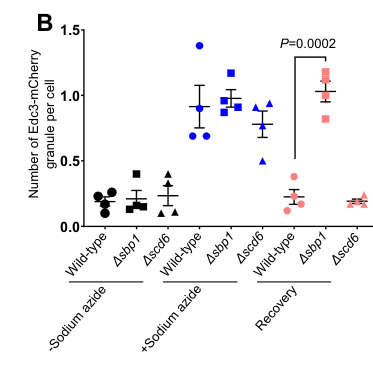

## Question

# Gene Research for Functional Annotation

## ⚠️ CRITICAL: Gene/Protein Identification Context

**BEFORE YOU BEGIN RESEARCH:** You MUST verify you are researching the CORRECT gene/protein. Gene symbols can be ambiguous, especially for less well-characterized genes from non-model organisms.

### Target Gene/Protein Identity (from UniProt):
- **UniProt Accession:** P10080
- **Protein Description:** RecName: Full=Single-stranded nucleic acid-binding protein;
- **Gene Information:** Name=SBP1; Synonyms=SSB1 {ECO:0000303|PubMed:2823109}, SSBR1; OrderedLocusNames=YHL034C;
- **Organism (full):** Saccharomyces cerevisiae (strain ATCC 204508 / S288c) (Baker's yeast).
- **Protein Family:** Belongs to the RRM GAR family. .
- **Key Domains:** Nucleotide-bd_a/b_plait_sf. (IPR012677); RBD_domain_sf. (IPR035979); RRM_dom. (IPR000504); RRT5_SRSF_SR. (IPR050374); RRM_1 (PF00076)

### MANDATORY VERIFICATION STEPS:

1. **Check if the gene symbol "SBP1" matches the protein description above**
2. **Verify the organism is correct:** Saccharomyces cerevisiae (strain ATCC 204508 / S288c) (Baker's yeast).
3. **Check if protein family/domains align with what you find in literature**
4. **If you find literature for a DIFFERENT gene with the same or similar symbol, STOP**

### If Gene Symbol is Ambiguous or You Cannot Find Relevant Literature:

**DO NOT PROCEED WITH RESEARCH ON A DIFFERENT GENE.** Instead:
- State clearly: "The gene symbol 'SBP1' is ambiguous or literature is limited for this specific protein"
- Explain what you found (e.g., "Found extensive literature on a different gene with the same symbol in a different organism")
- Describe the protein based ONLY on the UniProt information provided above
- Suggest that the protein function can be inferred from domain/family information

### Research Target:

Please provide a comprehensive research report on the gene **SBP1** (gene ID: SSB1, UniProt: P10080) in yeast.

The research report should be a detailed narrative explaining the function, biological processes, and localization of the gene product. Citations should be given for all claims.

You should prioritize authoritative reviews and primary scientific literature when conducting research. You can supplement
this with annotations you find in gene/protein databases, but these can be outdated or inaccurate.

We are specifically interested in the primary function of the gene - for enzymes, what reaction is catalyzed, and what is the substrate specificity? For transporters, what is the substrate? For structural proteins or adapters, what is the broader structural role? For signaling molecules, what is the role in the pathway.

We are interested in where in or outside the cell the gene product carries out its function.

We are also interested in the signaling or biochemical pathways in which the gene functions. We are less interested in broad pleiotropic effects, except where these elucidate the precise role.

Include evidence where possible. We are interested in both experimental evidence as well as inference from structure, evolution, or bioinformatic analysis. Precise studies should be prioritized over high-throughput, where available.

## Output

Question: You are an expert researcher providing comprehensive, well-cited information.

Provide detailed information focusing on:
1. Key concepts and definitions with current understanding
2. Recent developments and latest research (prioritize 2023-2024 sources)
3. Current applications and real-world implementations
4. Expert opinions and analysis from authoritative sources
5. Relevant statistics and data from recent studies

Format as a comprehensive research report with proper citations. Include URLs and publication dates where available.
Always prioritize recent, authoritative sources and provide specific citations for all major claims.

# Gene Research for Functional Annotation

## ⚠️ CRITICAL: Gene/Protein Identification Context

**BEFORE YOU BEGIN RESEARCH:** You MUST verify you are researching the CORRECT gene/protein. Gene symbols can be ambiguous, especially for less well-characterized genes from non-model organisms.

### Target Gene/Protein Identity (from UniProt):
- **UniProt Accession:** P10080
- **Protein Description:** RecName: Full=Single-stranded nucleic acid-binding protein;
- **Gene Information:** Name=SBP1; Synonyms=SSB1 {ECO:0000303|PubMed:2823109}, SSBR1; OrderedLocusNames=YHL034C;
- **Organism (full):** Saccharomyces cerevisiae (strain ATCC 204508 / S288c) (Baker's yeast).
- **Protein Family:** Belongs to the RRM GAR family. .
- **Key Domains:** Nucleotide-bd_a/b_plait_sf. (IPR012677); RBD_domain_sf. (IPR035979); RRM_dom. (IPR000504); RRT5_SRSF_SR. (IPR050374); RRM_1 (PF00076)

### MANDATORY VERIFICATION STEPS:

1. **Check if the gene symbol "SBP1" matches the protein description above**
2. **Verify the organism is correct:** Saccharomyces cerevisiae (strain ATCC 204508 / S288c) (Baker's yeast).
3. **Check if protein family/domains align with what you find in literature**
4. **If you find literature for a DIFFERENT gene with the same or similar symbol, STOP**

### If Gene Symbol is Ambiguous or You Cannot Find Relevant Literature:

**DO NOT PROCEED WITH RESEARCH ON A DIFFERENT GENE.** Instead:
- State clearly: "The gene symbol 'SBP1' is ambiguous or literature is limited for this specific protein"
- Explain what you found (e.g., "Found extensive literature on a different gene with the same symbol in a different organism")
- Describe the protein based ONLY on the UniProt information provided above
- Suggest that the protein function can be inferred from domain/family information

### Research Target:

Please provide a comprehensive research report on the gene **SBP1** (gene ID: SSB1, UniProt: P10080) in yeast.

The research report should be a detailed narrative explaining the function, biological processes, and localization of the gene product. Citations should be given for all claims.

You should prioritize authoritative reviews and primary scientific literature when conducting research. You can supplement
this with annotations you find in gene/protein databases, but these can be outdated or inaccurate.

We are specifically interested in the primary function of the gene - for enzymes, what reaction is catalyzed, and what is the substrate specificity? For transporters, what is the substrate? For structural proteins or adapters, what is the broader structural role? For signaling molecules, what is the role in the pathway.

We are interested in where in or outside the cell the gene product carries out its function.

We are also interested in the signaling or biochemical pathways in which the gene functions. We are less interested in broad pleiotropic effects, except where these elucidate the precise role.

Include evidence where possible. We are interested in both experimental evidence as well as inference from structure, evolution, or bioinformatic analysis. Precise studies should be prioritized over high-throughput, where available.

## Research report: *Saccharomyces cerevisiae* SBP1 (YHL034C; UniProt P10080)

### 0) Target verification (gene/protein identity)
The literature synthesized here explicitly studies *Saccharomyces cerevisiae* Sbp1/Sbp1p (also referred to historically as Ssb1p) and describes the characteristic architecture of **two RRMs separated by an RGG box**, matching the UniProt P10080 description and yeast locus YHL034C (segal2006sbp1paffectstranslational pages 2-3, rajyaguru2012scd6targetseif4g pages 5-6).

---

### 1) Key concepts and definitions (current understanding)

**SBP1 encodes an RGG/RRM RNA-binding protein that regulates cytoplasmic mRNP state transitions.** In yeast, “mRNP state” is commonly framed as movement of mRNA between active translation and non-translating states that can be associated with **P-bodies (PBs)** and **stress granules (SGs)**—biomolecular condensates enriched for translation repression and decay factors. Sbp1 is positioned in this regulatory space as (i) a translation repressor that can promote PB association and, more recently, (ii) a PB **disassembly factor** that promotes granule dissolution during recovery from stress (segal2006sbp1paffectstranslational pages 8-10, roy2022lowcomplexityrggmotif pages 3-4).

**Translation repression via initiation-factor targeting.** A central mechanistic concept for Sbp1 is repression of translation initiation by interaction with the scaffold initiation factor **eIF4G**, potentially destabilizing the eIF4E–eIF4G complex at the 5′ cap or organizing a repressed mRNP state (segal2006sbp1paffectstranslational pages 10-11, rajyaguru2012scd6targetseif4g pages 5-6).

**mRNA decapping pathway interface.** PBs are enriched for the Dcp1/Dcp2 decapping enzyme and decapping activators such as Dhh1 and Pat1. Sbp1 is functionally linked to this system: overexpression can suppress decapping-mutant phenotypes and accelerate decapping of reporter transcripts in decapping-compromised backgrounds, while deletion alone does not produce strong baseline decay defects for standard reporters—suggesting Sbp1 modulates decapping conditionally and/or for subsets of mRNAs (segal2006sbp1paffectstranslational pages 5-6, segal2006sbp1paffectstranslational pages 10-11).

---

### 2) Molecular function: RNA binding and protein–protein interactions

#### 2.1 RNA-binding properties and target positioning
A global yeast mRNP study using CLIP identified Sbp1 among a set of PB/SG-associated RBPs (with Pat1, Lsm1, Dhh1) and found that Sbp1 exhibits **positional specificity** on transcripts: Sbp1 binding shows a clear preference for the **5′ UTR**, rather than strong sequence specificity (mitchell2013globalanalysisof pages 7-9). Sbp1’s CLIP target set was reported as most similar to Dhh1’s, and Sbp1 and Dhh1 were observed to co-localize in stress granules under stress (mitchell2013globalanalysisof pages 7-9).

#### 2.2 Direct binding to translation initiation factor eIF4G (RGG-dependent)
Biochemical evidence demonstrates that Sbp1 **directly binds eIF4G**, and that the **RGG motif is required and sufficient** for that interaction in vitro. In particular, an isolated Sbp1 RGG region (residues **121–180**) bound GST-eIF4G in binding assays, whereas deletion of the RGG region impaired binding (rajyaguru2012scd6targetseif4g pages 5-6).

#### 2.3 Interaction with PB component Edc3 and condensate regulation
Recent work supporting a PB disassembly role shows that purified Sbp1 can interact with Edc3 domains (LSm-FDF and YjeF-N in the cited excerpt), in RNase-treated conditions (supporting RNA-independent detectability), and that Sbp1 can reduce Edc3 assemblies in vitro—supporting a mechanistic basis for PB dissolution (roy2021rggmotifproteinsbp1 pages 7-10, roy2021rggmotifproteinsbp1 pages 26-29).

---

### 3) Cellular roles, localization, and pathway context

#### 3.1 Translational repression and PB recruitment (foundational evidence)
Overexpression of Sbp1 produces strong evidence of translation repression and PB engagement:
- Sbp1 overexpression markedly reduces polysomes, consistent with translational repression, and increases PB localization/visibility of PB markers (segal2006sbp1paffectstranslational pages 8-10).
- Under Sbp1 overexpression, **Dhh1 localized to PBs in 80% of cells (n=78)**, whereas in glucose Dhh1 was diffuse and rarely in PBs in **90% of cells (n=40)** (segal2006sbp1paffectstranslational pages 8-10).
- Dcp2-GFP PBs were described as small in **73% of cells (n=56)** at baseline and showed increased PB localization in **79% of cells (n=67)** when Sbp1 was overexpressed (segal2006sbp1paffectstranslational pages 8-10).

Sbp1 itself is largely cytoplasmic in mid-log phase and accumulates in PBs under stress conditions (e.g., glucose deprivation/high cell density) or upon overexpression, consistent with conditional relocalization during mRNP remodeling (segal2006sbp1paffectstranslational pages 10-11).

#### 3.2 Conditional modulation of decapping
Sbp1 overexpression partially compensates for decapping impairment:
- In a **dcp2-7** mutant, overexpression shifted an MFA2pG reporter half-life from **~12 min to ~6 min**, and in a **dcp1-2** mutant the half-life was **~8 min** upon Sbp1 overexpression (segal2006sbp1paffectstranslational pages 5-6).
- In contrast, deletion of SBP1 did not substantially change decay of MFA2pG or PGK1pG reporters in unstressed conditions, supporting a model where Sbp1 is not a universal basal decapping factor but can influence decapping depending on cellular context or transcript class (segal2006sbp1paffectstranslational pages 5-6, segal2006sbp1paffectstranslational pages 10-11).

Genetic interaction patterns further suggest Sbp1 functionally interfaces with canonical decapping activators (e.g., Pat1/Dhh1) in the transition of mRNAs from translation into decay-competent states (segal2006sbp1paffectstranslational pages 5-6, segal2006sbp1paffectstranslational pages 1-2).

#### 3.3 PB disassembly factor (latest major gene-specific advance)
A major advance is the identification of Sbp1 as a **PB disassembly factor** during recovery from stress. Using sodium azide stress followed by recovery, Δsbp1 cells show defective disassembly (persistence) of PB foci marked by Edc3, Dhh1, and Scd6 (roy2022lowcomplexityrggmotif pages 3-4).

The associated quantification (foci per cell, mean ± SEM, n=4 independent experiments) and statistical support show significant recovery defects in Δsbp1, including:
- Edc3 disassembly defect (**P=0.0002**; and endogenously tagged Edc3 **P=0.021**) (roy2022lowcomplexityrggmotif media 205d9ed0, roy2022lowcomplexityrggmotif media 5a4ec429)
- Dhh1 disassembly defect (**P=0.0125**) (roy2022lowcomplexityrggmotif media eeac8fd2)
- Scd6 disassembly defect (**P=0.0132**) (roy2022lowcomplexityrggmotif media 743f1cb0)

**Mechanistic requirement for the RGG motif and arginine methylation.** Complementation and mutant analyses indicate that the **RGG motif is required** for rescuing PB disassembly defects, and an “arginine methylation defective” mutant (13 Arg→Ala in the RGG motif) fails to rescue, implicating arginine residues (and plausibly methylation state) in function (roy2021rggmotifproteinsbp1 pages 7-10). 

---

### 4) Expert opinions and interpretive models (authoritative synthesis)

**eIF4G as an integration hub for repression/decay factors.** A synthesis by Rajyaguru & Parker frames Sbp1 as part of an RGG-motif protein class that binds eIF4G and modulates mRNA functional states. They highlight non-mutually exclusive models in which multiple RGG proteins may bind eIF4G simultaneously, act sequentially in time/space, or compete to specify distinct transcript subsets; they also emphasize post-translational modification (e.g., arginine methylation) as a potential regulator of these interactions (rajyaguru2012rggmotifproteins pages 4-5). 

**Positional binding as a driver of co-assembly.** The CLIP-based analysis suggests that PB/SG mRNP composition may be governed not only by sequence-specific RNA binding but by **positional binding preferences** (Sbp1 at 5′ UTR; Pat1/Lsm1 near 3′ ends) and by protein–protein interactions (eIF4G–Sbp1), supporting a mechanistic logic for how translation initiation control could be coupled to decapping and deadenylation (mitchell2013globalanalysisof pages 7-9).

---

### 5) Current applications and real-world implementations

While SBP1 is not a therapeutic target, it has practical “real-world” use in **yeast as a model system**:
- **Mechanistic dissection of condensate dynamics**: SBP1 provides a genetically tractable example of a factor that promotes PB dissolution rather than assembly, useful for understanding recovery from stress and condensate homeostasis (roy2022lowcomplexityrggmotif pages 3-4, roy2022lowcomplexityrggmotif media 205d9ed0).
- **Translation/decapping coupling experiments**: Sbp1 overexpression and mutant backgrounds (dcp1/dcp2/pat1/dhh1) provide a toolkit for perturbing the translation-to-decay transition and measuring outcomes via polysome profiling, PB microscopy, and reporter half-life assays (segal2006sbp1paffectstranslational pages 8-10, segal2006sbp1paffectstranslational pages 5-6).
- **5′ UTR-centric mRNP targeting**: Sbp1’s 5′ positional binding preference makes it a useful entry point for studying how 5′ UTR occupancy relates to initiation-factor engagement and downstream decapping competence (mitchell2013globalanalysisof pages 7-9, rajyaguru2012scd6targetseif4g pages 5-6).

---

### 6) Relevant statistics and data (selected highlights)
Key quantitative results supporting SBP1 functional annotation are consolidated in the table artifact below.

| Functional role | Key experimental evidence/assay | Quantitative/conditional details | Domain/motif requirement | Primary source with DOI URL and publication date/year |
|---|---|---|---|---|
| Translation repression | Sbp1 overexpression reduced polysomes and promoted formation/localization of P-body markers, consistent with repression of translation initiation and mRNP remodeling (segal2006sbp1paffectstranslational pages 8-10, segal2006sbp1paffectstranslational pages 10-11) | Dhh1p localized to P-bodies in **80% of cells** on Sbp1 overexpression (n=78); in glucose, Dhh1p was diffuse/rarely in P-bodies in **90% of cells** (n=40). Dcp2p-GFP-marked P-bodies were small in **73% of cells** at baseline (n=56) and increased on Sbp1 overexpression in **79% of cells** (n=67) (segal2006sbp1paffectstranslational pages 8-10) | RGG box and RRMs are part of Sbp1 architecture; specific domain requirement for this phenotype not resolved in Segal 2006 (segal2006sbp1paffectstranslational pages 10-11, segal2006sbp1paffectstranslational pages 2-3) | Segal SP, Dunckley T, Parker R. *Molecular and Cellular Biology* (Jul 2006). DOI: https://doi.org/10.1128/MCB.01913-05 (segal2006sbp1paffectstranslational pages 8-10, segal2006sbp1paffectstranslational pages 10-11) |
| Decapping modulation | High-copy/overexpressed Sbp1 suppressed conditional decapping defects and accelerated decay of MFA2pG reporter in decapping mutants, indicating Sbp1 can enhance decapping under sensitized conditions (segal2006sbp1paffectstranslational pages 5-6, segal2006sbp1paffectstranslational pages 1-2) | MFA2pG half-life changed from **~12 min to ~6 min** in **dcp2-7** with Sbp1 overexpression and was **~8 min** in **dcp1-2** upon Sbp1 overexpression; effects were not due to altered deadenylation. sbp1Δ alone did **not** alter normal MFA2pG/PGK1pG decay (segal2006sbp1paffectstranslational pages 5-6) | No specific motif requirement established in this assay; mechanistic models implicate RNA-binding regions and eIF4E/eIF4G-associated functions (segal2006sbp1paffectstranslational pages 10-11) | Segal SP, Dunckley T, Parker R. *Molecular and Cellular Biology* (Jul 2006). DOI: https://doi.org/10.1128/MCB.01913-05 (segal2006sbp1paffectstranslational pages 5-6, segal2006sbp1paffectstranslational pages 10-11) |
| P-body localization | Fluorescence microscopy of SBP1-GFP showed stress-dependent accumulation in P-bodies; Sbp1 is cytoplasmic in log phase and relocalizes under glucose deprivation/high cell density or overexpression (segal2006sbp1paffectstranslational pages 10-11, segal2006sbp1paffectstranslational pages 1-2) | Localization occurs under stress rather than mid-log growth; overexpression increases P-body size/number and mRNA targeting to P-bodies (segal2006sbp1paffectstranslational pages 8-10, segal2006sbp1paffectstranslational pages 10-11) | Specific localization determinant not assigned in Segal 2006; later work links condensate behaviors to RGG motif-dependent functions (roy2021rggmotifproteinsbp1 pages 7-10) | Segal SP, Dunckley T, Parker R. *Molecular and Cellular Biology* (Jul 2006). DOI: https://doi.org/10.1128/MCB.01913-05 (segal2006sbp1paffectstranslational pages 8-10, segal2006sbp1paffectstranslational pages 10-11, segal2006sbp1paffectstranslational pages 1-2) |
| P-body disassembly | Live-cell microscopy after stress/recovery showed Δsbp1 cells are defective in disassembly of Edc3-, Dhh1-, and Scd6-marked P-bodies; complementation and in vitro reconstitution support Sbp1 as a disassembly factor (roy2021rggmotifproteinsbp1 pages 7-10, roy2022lowcomplexityrggmotif pages 3-4, roy2021rggmotifproteinsbp1 pages 26-29) | Stress: **0.5% sodium azide for 30 min at 30°C**; recovery: **1 h**. Quantified as foci/cell, mean ± SEM, **n=4** independent experiments. Significant recovery defects in Δsbp1: **Edc3 P=0.0002** (and endogenously tagged Edc3 **P=0.021**), **Dhh1 P=0.0125**, **Scd6 P=0.0132** (roy2022lowcomplexityrggmotif pages 3-4, roy2022lowcomplexityrggmotif media 205d9ed0) | **RGG motif required**: SBP1ΔRGG fails to rescue; RGG motif necessary and sufficient to rescue PB disassembly defect. **Arginine-methylation-defective mutant (13 Arg→Ala; AMD)** also fails to rescue. **RRM1**, but not RRM2, required for stress granule assembly; deletion of either RRM did not affect Edc3 granule assembly/disassembly in the cited excerpt (roy2021rggmotifproteinsbp1 pages 7-10) | Roy R et al. *Nature Communications* (Apr 2022). DOI: https://doi.org/10.1038/s41467-022-29715-5 (roy2022lowcomplexityrggmotif pages 3-4, roy2022lowcomplexityrggmotif media 205d9ed0); Roy R et al. *bioRxiv* (Feb 2021). DOI: https://doi.org/10.1101/2021.02.23.432385 (roy2021rggmotifproteinsbp1 pages 7-10, roy2021rggmotifproteinsbp1 pages 26-29) |
| RNA-binding positional preference | CLIP analysis identified Sbp1-bound mRNAs and showed positional, not strong sequence, specificity; Sbp1-binding profiles are most similar to Dhh1 and enriched toward 5′ regions (mitchell2013globalanalysisof pages 7-9) | Sbp1 was one of four proteins (Pat1, Lsm1, Dhh1, Sbp1) profiled by CLIP. Study also noted **38%** of identified mRNA-binding proteins changed localization during stress (global context for mRNP remodeling) (mitchell2013globalanalysisof pages 7-9) | Positional preference likely linked to interaction with 5′-end-associated factor eIF4G; no specific RRM/RGG requirement quantified in the excerpt (mitchell2013globalanalysisof pages 7-9) | Mitchell SF et al. *Nature Structural & Molecular Biology* (Dec 2013). DOI: https://doi.org/10.1038/nsmb.2468 (mitchell2013globalanalysisof pages 7-9) |
| eIF4G binding | In vitro binding/pulldown assays with recombinant proteins showed direct Sbp1-eIF4G interaction; isolated Sbp1 RGG region was sufficient to bind GST-eIF4G (rajyaguru2012scd6targetseif4g pages 5-6) | Isolated **RGG motif (residues 121–180)** interacted with GST-eIF4G but not GST alone; no Kd/affinity values reported in the excerpt (rajyaguru2012scd6targetseif4g pages 5-6) | **RGG motif is required and sufficient** for eIF4G binding in the cited assays (rajyaguru2012scd6targetseif4g pages 5-6) | Rajyaguru P, She M, Parker R. *Molecular Cell* (Jan 2012). DOI: https://doi.org/10.1016/j.molcel.2011.11.026 (rajyaguru2012scd6targetseif4g pages 5-6) |
| Edc3 interaction underlying disassembly | Purified-protein pulldowns and assembly assays showed direct Sbp1-Edc3 interaction and competition with Edc3 self-association, explaining Edc3 condensate dissolution (roy2021rggmotifproteinsbp1 pages 7-10, roy2021rggmotifproteinsbp1 pages 26-29) | Sbp1 bound Edc3 **LSm-FDF** and **YjeF-N** domains, but not FDF alone, in RNA-independent conditions (RNase A present). Addition of purified Sbp1 decreased Edc3 assemblies in vitro; no binding affinity constants provided (roy2021rggmotifproteinsbp1 pages 7-10, roy2021rggmotifproteinsbp1 pages 26-29) | **RGG motif required** for dissolution of Edc3 assemblies; AMD mutant defective, implicating arginine methylation in function (roy2021rggmotifproteinsbp1 pages 7-10) | Roy R et al. *Nature Communications* (Apr 2022). DOI: https://doi.org/10.1038/s41467-022-29715-5 (supported by bioRxiv precursor DOI https://doi.org/10.1101/2021.02.23.432385) (roy2021rggmotifproteinsbp1 pages 7-10, roy2021rggmotifproteinsbp1 pages 26-29) |

*Table: This table summarizes the main experimentally supported molecular and cellular functions of S. cerevisiae Sbp1/YHL034C, including translation repression, decapping modulation, RNA-binding properties, and roles in P-body dynamics. It highlights the assays, quantitative details, and motif/domain requirements most useful for a gene-function annotation report.*

Figure-based quantitative evidence for PB disassembly defects in Δsbp1 (Edc3/Dhh1/Scd6) is available in Roy et al. 2022 (roy2022lowcomplexityrggmotif media 205d9ed0, roy2022lowcomplexityrggmotif media eeac8fd2, roy2022lowcomplexityrggmotif media 743f1cb0).

---

### 7) Recent developments (2023–2024)
In the retrieved and analyzed corpus, **no SBP1-focused primary papers from 2023–2024** were recovered. The most recent SBP1-specific peer-reviewed advance available here is the **2022** study defining Sbp1 as an **RGG-dependent PB disassembly factor** and providing in vitro competition/assembly evidence with Edc3 (roy2022lowcomplexityrggmotif pages 3-4, roy2021rggmotifproteinsbp1 pages 7-10). A **2023** decapping review was retrieved, but Sbp1-specific evidence could not be extracted from its text via the evidence tool in this run, so it is not used to support gene-specific claims.

---

## References (URLs and publication dates/years)
- Segal SP, Dunckley T, Parker R. **“Sbp1p affects translational repression and decapping in *Saccharomyces cerevisiae*.”** *Molecular and Cellular Biology* (Jul 2006). https://doi.org/10.1128/MCB.01913-05 (segal2006sbp1paffectstranslational pages 8-10, segal2006sbp1paffectstranslational pages 5-6, segal2006sbp1paffectstranslational pages 10-11)
- Rajyaguru P, She M, Parker R. **“Scd6 targets eIF4G to repress translation: RGG motif proteins as a class of eIF4G-binding proteins.”** *Molecular Cell* (Jan 2012). https://doi.org/10.1016/j.molcel.2011.11.026 (rajyaguru2012scd6targetseif4g pages 5-6)
- Rajyaguru P, Parker R. **“RGG motif proteins: Modulators of mRNA functional states.”** *Cell Cycle* (Jan 2012). https://doi.org/10.4161/cc.20716 (rajyaguru2012rggmotifproteins pages 4-5)
- Mitchell SF, Jain S, She M, Parker R. **“Global analysis of yeast mRNPs.”** *Nature Structural & Molecular Biology* (Dec 2013). https://doi.org/10.1038/nsmb.2468 (mitchell2013globalanalysisof pages 7-9)
- Roy R, Das G, Kuttanda IA, Bhatter N, Rajyaguru PI. **“Low complexity RGG-motif sequence is required for Processing body (P-body) disassembly.”** *Nature Communications* (Apr 2022). https://doi.org/10.1038/s41467-022-29715-5 (roy2022lowcomplexityrggmotif pages 3-4, roy2022lowcomplexityrggmotif media 205d9ed0)
- Roy R, Kuttanda IA, Bhatter N, Rajyaguru PI. **“RGG-motif protein Sbp1 is required for Processing body (P-body) disassembly.”** *bioRxiv* (Feb 2021). https://doi.org/10.1101/2021.02.23.432385 (roy2021rggmotifproteinsbp1 pages 7-10, roy2021rggmotifproteinsbp1 pages 26-29)

References

1. (segal2006sbp1paffectstranslational pages 2-3): Scott P. Segal, Travis Dunckley, and Roy Parker. Sbp1p affects translational repression and decapping in saccharomyces cerevisiae. Molecular and Cellular Biology, 26:5120-5130, Jul 2006. URL: https://doi.org/10.1128/mcb.01913-05, doi:10.1128/mcb.01913-05. This article has 72 citations and is from a domain leading peer-reviewed journal.

2. (rajyaguru2012scd6targetseif4g pages 5-6): Purusharth Rajyaguru, Meipei She, and Roy Parker. Scd6 targets eif4g to repress translation: rgg motif proteins as a class of eif4g-binding proteins. Molecular cell, 45 2:244-54, Jan 2012. URL: https://doi.org/10.1016/j.molcel.2011.11.026, doi:10.1016/j.molcel.2011.11.026. This article has 179 citations and is from a highest quality peer-reviewed journal.

3. (segal2006sbp1paffectstranslational pages 8-10): Scott P. Segal, Travis Dunckley, and Roy Parker. Sbp1p affects translational repression and decapping in saccharomyces cerevisiae. Molecular and Cellular Biology, 26:5120-5130, Jul 2006. URL: https://doi.org/10.1128/mcb.01913-05, doi:10.1128/mcb.01913-05. This article has 72 citations and is from a domain leading peer-reviewed journal.

4. (roy2022lowcomplexityrggmotif pages 3-4): Raju Roy, Gitartha Das, Ishwarya Achappa Kuttanda, Nupur Bhatter, and Purusharth I. Rajyaguru. Low complexity rgg-motif sequence is required for processing body (p-body) disassembly. Nature Communications, Apr 2022. URL: https://doi.org/10.1038/s41467-022-29715-5, doi:10.1038/s41467-022-29715-5. This article has 26 citations and is from a highest quality peer-reviewed journal.

5. (segal2006sbp1paffectstranslational pages 10-11): Scott P. Segal, Travis Dunckley, and Roy Parker. Sbp1p affects translational repression and decapping in saccharomyces cerevisiae. Molecular and Cellular Biology, 26:5120-5130, Jul 2006. URL: https://doi.org/10.1128/mcb.01913-05, doi:10.1128/mcb.01913-05. This article has 72 citations and is from a domain leading peer-reviewed journal.

6. (segal2006sbp1paffectstranslational pages 5-6): Scott P. Segal, Travis Dunckley, and Roy Parker. Sbp1p affects translational repression and decapping in saccharomyces cerevisiae. Molecular and Cellular Biology, 26:5120-5130, Jul 2006. URL: https://doi.org/10.1128/mcb.01913-05, doi:10.1128/mcb.01913-05. This article has 72 citations and is from a domain leading peer-reviewed journal.

7. (mitchell2013globalanalysisof pages 7-9): Sarah F Mitchell, Saumya Jain, Meipei She, and Roy Parker. Global analysis of yeast mrnps. Nature Structural &amp; Molecular Biology, 20:127-133, Dec 2013. URL: https://doi.org/10.1038/nsmb.2468, doi:10.1038/nsmb.2468. This article has 435 citations and is from a highest quality peer-reviewed journal.

8. (roy2021rggmotifproteinsbp1 pages 7-10): Raju Roy, Ishwarya Achappa Kuttanda, Nupur Bhatter, and Purusharth I Rajyaguru. Rgg-motif protein sbp1 is required for processing body (p-body) disassembly. bioRxiv, Feb 2021. URL: https://doi.org/10.1101/2021.02.23.432385, doi:10.1101/2021.02.23.432385. This article has 0 citations.

9. (roy2021rggmotifproteinsbp1 pages 26-29): Raju Roy, Ishwarya Achappa Kuttanda, Nupur Bhatter, and Purusharth I Rajyaguru. Rgg-motif protein sbp1 is required for processing body (p-body) disassembly. bioRxiv, Feb 2021. URL: https://doi.org/10.1101/2021.02.23.432385, doi:10.1101/2021.02.23.432385. This article has 0 citations.

10. (segal2006sbp1paffectstranslational pages 1-2): Scott P. Segal, Travis Dunckley, and Roy Parker. Sbp1p affects translational repression and decapping in saccharomyces cerevisiae. Molecular and Cellular Biology, 26:5120-5130, Jul 2006. URL: https://doi.org/10.1128/mcb.01913-05, doi:10.1128/mcb.01913-05. This article has 72 citations and is from a domain leading peer-reviewed journal.

11. (roy2022lowcomplexityrggmotif media 205d9ed0): Raju Roy, Gitartha Das, Ishwarya Achappa Kuttanda, Nupur Bhatter, and Purusharth I. Rajyaguru. Low complexity rgg-motif sequence is required for processing body (p-body) disassembly. Nature Communications, Apr 2022. URL: https://doi.org/10.1038/s41467-022-29715-5, doi:10.1038/s41467-022-29715-5. This article has 26 citations and is from a highest quality peer-reviewed journal.

12. (roy2022lowcomplexityrggmotif media 5a4ec429): Raju Roy, Gitartha Das, Ishwarya Achappa Kuttanda, Nupur Bhatter, and Purusharth I. Rajyaguru. Low complexity rgg-motif sequence is required for processing body (p-body) disassembly. Nature Communications, Apr 2022. URL: https://doi.org/10.1038/s41467-022-29715-5, doi:10.1038/s41467-022-29715-5. This article has 26 citations and is from a highest quality peer-reviewed journal.

13. (roy2022lowcomplexityrggmotif media eeac8fd2): Raju Roy, Gitartha Das, Ishwarya Achappa Kuttanda, Nupur Bhatter, and Purusharth I. Rajyaguru. Low complexity rgg-motif sequence is required for processing body (p-body) disassembly. Nature Communications, Apr 2022. URL: https://doi.org/10.1038/s41467-022-29715-5, doi:10.1038/s41467-022-29715-5. This article has 26 citations and is from a highest quality peer-reviewed journal.

14. (roy2022lowcomplexityrggmotif media 743f1cb0): Raju Roy, Gitartha Das, Ishwarya Achappa Kuttanda, Nupur Bhatter, and Purusharth I. Rajyaguru. Low complexity rgg-motif sequence is required for processing body (p-body) disassembly. Nature Communications, Apr 2022. URL: https://doi.org/10.1038/s41467-022-29715-5, doi:10.1038/s41467-022-29715-5. This article has 26 citations and is from a highest quality peer-reviewed journal.

15. (rajyaguru2012rggmotifproteins pages 4-5): Purusharth Rajyaguru and Roy Parker. Rgg motif proteins: modulators of mrna functional states. Cell Cycle, 11:2594-2599, Jan 2012. URL: https://doi.org/10.4161/cc.20716, doi:10.4161/cc.20716. This article has 114 citations and is from a peer-reviewed journal.

## Artifacts

- [Edison artifact artifact-00](SSB1-deep-research-falcon_artifacts/artifact-00.md)

## Citations

1. mitchell2013globalanalysisof pages 7-9
2. roy2022lowcomplexityrggmotif pages 3-4
3. rajyaguru2012rggmotifproteins pages 4-5
4. https://doi.org/10.1128/MCB.01913-05
5. https://doi.org/10.1038/s41467-022-29715-5
6. https://doi.org/10.1101/2021.02.23.432385
7. https://doi.org/10.1038/nsmb.2468
8. https://doi.org/10.1016/j.molcel.2011.11.026
9. https://doi.org/10.4161/cc.20716
10. https://doi.org/10.1128/mcb.01913-05,
11. https://doi.org/10.1016/j.molcel.2011.11.026,
12. https://doi.org/10.1038/s41467-022-29715-5,
13. https://doi.org/10.1038/nsmb.2468,
14. https://doi.org/10.1101/2021.02.23.432385,
15. https://doi.org/10.4161/cc.20716,