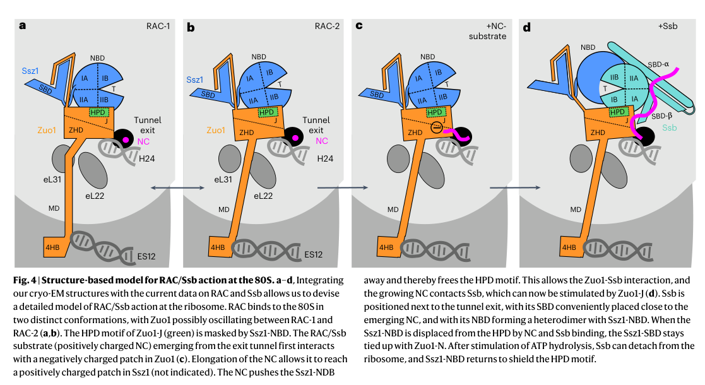

## Question

# Gene Research for Functional Annotation

## ⚠️ CRITICAL: Gene/Protein Identification Context

**BEFORE YOU BEGIN RESEARCH:** You MUST verify you are researching the CORRECT gene/protein. Gene symbols can be ambiguous, especially for less well-characterized genes from non-model organisms.

### Target Gene/Protein Identity (from UniProt):
- **UniProt Accession:** P40150
- **Protein Description:** RecName: Full=Ribosome-associated molecular chaperone SSB2 {ECO:0000303|PubMed:11739779}; EC=3.6.4.10; AltName: Full=Heat shock protein SSB2 {ECO:0000303|PubMed:3302682}; AltName: Full=Hsp70 chaperone Ssb;
- **Gene Information:** Name=SSB2 {ECO:0000303|PubMed:3302682}; Synonyms=YG103 {ECO:0000303|PubMed:6761581}; OrderedLocusNames=YNL209W {ECO:0000312|SGD:S000005153}; ORFNames=N1333;
- **Organism (full):** Saccharomyces cerevisiae (strain ATCC 204508 / S288c) (Baker's yeast).
- **Protein Family:** Belongs to the heat shock protein 70 family. Ssb-type Hsp70
- **Key Domains:** ATPase_NBD. (IPR043129); Heat_shock_70_CS. (IPR018181); HSP70_C_sf. (IPR029048); HSP70_peptide-bd_sf. (IPR029047); Hsp_70_fam. (IPR013126)

### MANDATORY VERIFICATION STEPS:

1. **Check if the gene symbol "SSB2" matches the protein description above**
2. **Verify the organism is correct:** Saccharomyces cerevisiae (strain ATCC 204508 / S288c) (Baker's yeast).
3. **Check if protein family/domains align with what you find in literature**
4. **If you find literature for a DIFFERENT gene with the same or similar symbol, STOP**

### If Gene Symbol is Ambiguous or You Cannot Find Relevant Literature:

**DO NOT PROCEED WITH RESEARCH ON A DIFFERENT GENE.** Instead:
- State clearly: "The gene symbol 'SSB2' is ambiguous or literature is limited for this specific protein"
- Explain what you found (e.g., "Found extensive literature on a different gene with the same symbol in a different organism")
- Describe the protein based ONLY on the UniProt information provided above
- Suggest that the protein function can be inferred from domain/family information

### Research Target:

Please provide a comprehensive research report on the gene **SSB2** (gene ID: SSB2, UniProt: P40150) in yeast.

The research report should be a detailed narrative explaining the function, biological processes, and localization of the gene product. Citations should be given for all claims.

You should prioritize authoritative reviews and primary scientific literature when conducting research. You can supplement
this with annotations you find in gene/protein databases, but these can be outdated or inaccurate.

We are specifically interested in the primary function of the gene - for enzymes, what reaction is catalyzed, and what is the substrate specificity? For transporters, what is the substrate? For structural proteins or adapters, what is the broader structural role? For signaling molecules, what is the role in the pathway.

We are interested in where in or outside the cell the gene product carries out its function.

We are also interested in the signaling or biochemical pathways in which the gene functions. We are less interested in broad pleiotropic effects, except where these elucidate the precise role.

Include evidence where possible. We are interested in both experimental evidence as well as inference from structure, evolution, or bioinformatic analysis. Precise studies should be prioritized over high-throughput, where available.

## Output

Question: You are an expert researcher providing comprehensive, well-cited information.

Provide detailed information focusing on:
1. Key concepts and definitions with current understanding
2. Recent developments and latest research (prioritize 2023-2024 sources)
3. Current applications and real-world implementations
4. Expert opinions and analysis from authoritative sources
5. Relevant statistics and data from recent studies

Format as a comprehensive research report with proper citations. Include URLs and publication dates where available.
Always prioritize recent, authoritative sources and provide specific citations for all major claims.

# Gene Research for Functional Annotation

## ⚠️ CRITICAL: Gene/Protein Identification Context

**BEFORE YOU BEGIN RESEARCH:** You MUST verify you are researching the CORRECT gene/protein. Gene symbols can be ambiguous, especially for less well-characterized genes from non-model organisms.

### Target Gene/Protein Identity (from UniProt):
- **UniProt Accession:** P40150
- **Protein Description:** RecName: Full=Ribosome-associated molecular chaperone SSB2 {ECO:0000303|PubMed:11739779}; EC=3.6.4.10; AltName: Full=Heat shock protein SSB2 {ECO:0000303|PubMed:3302682}; AltName: Full=Hsp70 chaperone Ssb;
- **Gene Information:** Name=SSB2 {ECO:0000303|PubMed:3302682}; Synonyms=YG103 {ECO:0000303|PubMed:6761581}; OrderedLocusNames=YNL209W {ECO:0000312|SGD:S000005153}; ORFNames=N1333;
- **Organism (full):** Saccharomyces cerevisiae (strain ATCC 204508 / S288c) (Baker's yeast).
- **Protein Family:** Belongs to the heat shock protein 70 family. Ssb-type Hsp70
- **Key Domains:** ATPase_NBD. (IPR043129); Heat_shock_70_CS. (IPR018181); HSP70_C_sf. (IPR029048); HSP70_peptide-bd_sf. (IPR029047); Hsp_70_fam. (IPR013126)

### MANDATORY VERIFICATION STEPS:

1. **Check if the gene symbol "SSB2" matches the protein description above**
2. **Verify the organism is correct:** Saccharomyces cerevisiae (strain ATCC 204508 / S288c) (Baker's yeast).
3. **Check if protein family/domains align with what you find in literature**
4. **If you find literature for a DIFFERENT gene with the same or similar symbol, STOP**

### If Gene Symbol is Ambiguous or You Cannot Find Relevant Literature:

**DO NOT PROCEED WITH RESEARCH ON A DIFFERENT GENE.** Instead:
- State clearly: "The gene symbol 'SSB2' is ambiguous or literature is limited for this specific protein"
- Explain what you found (e.g., "Found extensive literature on a different gene with the same symbol in a different organism")
- Describe the protein based ONLY on the UniProt information provided above
- Suggest that the protein function can be inferred from domain/family information

### Research Target:

Please provide a comprehensive research report on the gene **SSB2** (gene ID: SSB2, UniProt: P40150) in yeast.

The research report should be a detailed narrative explaining the function, biological processes, and localization of the gene product. Citations should be given for all claims.

You should prioritize authoritative reviews and primary scientific literature when conducting research. You can supplement
this with annotations you find in gene/protein databases, but these can be outdated or inaccurate.

We are specifically interested in the primary function of the gene - for enzymes, what reaction is catalyzed, and what is the substrate specificity? For transporters, what is the substrate? For structural proteins or adapters, what is the broader structural role? For signaling molecules, what is the role in the pathway.

We are interested in where in or outside the cell the gene product carries out its function.

We are also interested in the signaling or biochemical pathways in which the gene functions. We are less interested in broad pleiotropic effects, except where these elucidate the precise role.

Include evidence where possible. We are interested in both experimental evidence as well as inference from structure, evolution, or bioinformatic analysis. Precise studies should be prioritized over high-throughput, where available.

## Research report: *Saccharomyces cerevisiae* SSB2 (UniProt P40150; YNL209W) — ribosome-associated Hsp70 chaperone

### 0) Identity verification (critical disambiguation)
The target protein is **Ssb2**, a **ribosome-associated cytosolic Hsp70** in *Saccharomyces cerevisiae* (S288c), encoded by **SSB2** and commonly discussed together with its near-identical paralog **SSB1** as “Ssb”. Experimental literature explicitly states that Ssb is encoded by **two paralogous genes, SSB1 and SSB2**, and functions as the ribosome-associated Hsp70 chaperone system in yeast, supporting that this report is about the intended UniProt P40150 protein family/context. (jaygarcia2023yeastchaperonehsp70ssb pages 2-3, ziegelhoffer2024nacandzuotinhsp70 pages 1-2)

### 1) Key concepts and definitions (current understanding)

#### 1.1 Hsp70 chaperone cycle (what Ssb2 *does*)
Ssb2 is a **canonical Hsp70-family molecular chaperone**. As with other Hsp70s, its core biochemistry is an **ATP-driven conformational cycle** coupling an N-terminal **nucleotide-binding/ATPase domain (NBD)** to a C-terminal **substrate-binding domain (SBD)**. In the **ATP-bound state**, Hsp70s typically exhibit lower substrate affinity and higher exchange; **J-domain co-chaperones** stimulate ATP hydrolysis, shifting Hsp70 to an **ADP-bound high-affinity state** that stabilizes client binding. In the yeast RAC–Ssb system, the J-domain protein **Zuo1** stimulates ATP hydrolysis of **Ssb1/2**, driving this high-affinity substrate engagement on nascent chains. (chen2022structuralremodelingof pages 1-2, zhang2026thecotranslationalcycle pages 1-2)

#### 1.2 Co-translational protein folding and the “tunnel-exit chaperone hub”
A major modern framework for Ssb2 function is that a substantial portion of cytosolic proteostasis is organized **co-translationally at the ribosomal polypeptide exit tunnel**, where nascent chains emerge and are immediately exposed to a local network of chaperones and biogenesis factors. Ssb2 belongs to an **Hsp70 triad at the exit tunnel** consisting of:
- **RAC** (ribosome-associated complex): **Zuo1 (Hsp40/J-domain protein)** + **Ssz1 (atypical Hsp70)**
- **Ssb1/2 (Ssb)**: the canonical Hsp70(s) that directly bind nascent chains
This system is described as central to eukaryotic co-translational folding in yeast, with RAC both **recruiting and activating** Ssb near the tunnel exit. (chen2022structuralremodelingof pages 1-2, ziegelhoffer2024nacandzuotinhsp70 pages 1-2)

### 2) Molecular function, pathway placement, and mechanism

#### 2.1 Primary biological role: RAC-dependent co-translational chaperoning of nascent chains
Ssb1/2 (including Ssb2) act as the **direct nascent-chain binders** during co-translational folding in yeast, functioning within the **RAC–Ssb system**: RAC is an obligate Zuo1–Ssz1 heterodimer attached to the ribosome (via Zuo1), and Zuo1’s J-domain stimulates Ssb ATP hydrolysis to stabilize nascent-chain binding. (chen2022structuralremodelingof pages 1-2)

Mechanistically, structural and crosslinking evidence supports a **handover/relay**: very early nascent chains are contacted by RAC components and, as the chain extends, **Ssb becomes the predominant binder** (a transition observed around ~50 amino acids in the cited crosslinking summary), consistent with “handoff” of the emerging peptide to Ssb for iterative binding–release cycles that promote productive folding and reduce off-pathway interactions. (chen2022structuralremodelingof pages 1-2)

#### 2.2 Ribosome positioning and activation model (structural understanding; 2023 advance)
High-resolution cryo-EM work in 2023 provides a mechanistic picture of how RAC cooperates with Ssb at the tunnel exit. In the RAC-2 state, RAC is positioned such that **Zuo1 contacts ribosomal protein uL29 near the tunnel exit**, placing Ssb’s substrate-binding elements near the emerging chain; interactions extend beyond the canonical Hsp40–Hsp70 interface and center on the Zuo1 J-domain HPD motif in an activating arrangement with **Ssb-ATP**. A specific basic motif in Ssb (reported as **KKR 429–431**) is implicated in ribosome binding/engagement in this structural model. (kisonaite2023structuralinventoryof pages 21-23)

A structure-based **working model** (Figure 4 in Kišonaitė et al. 2023) proposes that RAC adopts distinct conformations and undergoes nascent-chain-triggered remodeling that **exposes the Zuo1 HPD motif** to enable productive Ssb activation and nascent chain capture adjacent to the tunnel exit. (kisonaite2023structuralinventoryof media 09f31c1f)

#### 2.3 Interaction partners and connected processes
Key partners and connected processes supported by recent literature include:
- **Zuo1 and Ssz1 (RAC)**: Zuo1 forms an extremely stable heterodimer with Ssz1, and Ssz1 transiently binds Ssb(ATP) in a recruitment/activation process; Zuo1 anchors the system near the exit tunnel to facilitate Ssb function. (ziegelhoffer2024nacandzuotinhsp70 pages 1-2)
- **NAC coexistence at the tunnel exit (2024 advance)**: In vivo crosslinking shows **NAC and the Zuotin/Hsp70 system can coexist** at the ribosome tunnel exit, rather than being strictly mutually exclusive, supporting an integrated tunnel-exit chaperone environment compatible with productive Ssb positioning. (ziegelhoffer2024nacandzuotinhsp70 pages 1-2)
- **Ribosome-associated quality control (RQC)**: Ssb/RAC is linked to recruitment of the ubiquitin ligase **Ltn1**, implicating Ssb in coupling co-translational chaperoning to quality-control ubiquitination of problematic nascent chains. (jaygarcia2023yeastchaperonehsp70ssb pages 1-2, jaygarcia2023yeastchaperonehsp70ssb pages 24-26)

### 3) Cellular localization (where Ssb2 acts)
Ssb proteins (Ssb1/Ssb2) are **cytosolic** and **ribosome-associated**, positioned at the **60S tunnel exit** where they can bind emerging nascent chains. Quantitatively, Ssb is described as binding ribosomes at approximately **~1:1 stoichiometry**, while only about **~50% of total cellular Ssb** is ribosome-associated at steady state (with the remainder cytosolic), consistent with a dynamic pool that can engage translating ribosomes and potentially other cytosolic substrates/aggregates. (black2023investigatingtherole pages 68-72)

### 4) Recent developments and latest research (prioritizing 2023–2024)

#### 4.1 2023: Structural inventory of RAC and activation model for Ssb at the tunnel exit
Kišonaitė et al. (published **2023-06**, URL https://doi.org/10.1038/s41594-023-00973-1) provide high-resolution structural snapshots of RAC bound to 80S ribosomes, supporting a mechanistic model for how RAC dynamics accommodate ribosome rotation while positioning and activating Ssb at the exit tunnel. This work strengthens a structure-based view of how the Zuo1 J-domain and RAC conformational remodeling coordinate Ssb activation and substrate capture during translation. (kisonaite2023structuralinventoryof pages 21-23, kisonaite2023structuralinventoryof media 09f31c1f)

#### 4.2 2024: Co-occupancy of NAC and Zuotin/Hsp70 at the tunnel exit in vivo
Ziegelhoffer et al. (published **2024-01**, URL https://doi.org/10.1093/nar/gkae005) used **in vivo site-specific crosslinking** to show NAC and Zuotin/Hsp70 components can crosslink to one another at the ribosome and therefore can **coexist** near the tunnel exit. The inferred geometry supports that, even with NAC present, Hsp70 can adopt a productive orientation for nascent-chain engagement with the Zuo1 J-domain positioned to promote stable binding. (ziegelhoffer2024nacandzuotinhsp70 pages 1-2)

#### 4.3 2023: RAC/Ssb connects tunnel-exit proteostasis to TORC1-mediated translation control
Black et al. (published **2023-11**, URL https://doi.org/10.15252/embj.2022113240) identified a role for RAC/Ssb in translational control during **TORC1 inhibition**. The study reports that **zuo1Δ** cells fail to appropriately reduce translation upon TORC1 inhibition and display proteostasis defects, with mechanistic connections to **autophagy-mediated eIF4G degradation** that is impaired in zuo1Δ. The requirement depends on a functional interaction between Zuo1 and Ssb. (black2023theribosome‐associatedchaperone pages 1-2, black2023theribosome‐associatedchaperone pages 9-11)

Quantitatively/experimentally, the authors report (i) a Zuo1 interactome remodeling upon rapamycin with **39 proteins increased and 11 decreased** in association, (ii) rapamycin treatment conditions (e.g., **200 nM** for ~1.5 h for some interactomics), and (iii) impaired eIF4G1/2 degradation in zuo1Δ, while eIF2α phosphorylation signaling remains intact (Sui2 phosphorylation not altered by Zuo1 loss). (black2023theribosome‐associatedchaperone pages 8-9, black2023theribosome‐associatedchaperone pages 9-11)

#### 4.4 2023: Ssb suppresses multiple amyloid/prion-like heritable elements
Jay-Garcia et al. (published **2023-05**, URL https://doi.org/10.3390/ijms24108660) synthesized prior knowledge and added data showing Ssb’s influence on several heritable protein-aggregate states, extending beyond the well-known [PSI+] system. Importantly, they report that after mild heat stress **almost 20% of cells** form a detectable prion in cultures lacking Ssb, supporting Ssb as a strong antagonist of stress-induced amyloid inheritance. (jaygarcia2023yeastchaperonehsp70ssb pages 24-26)

### 5) Current applications and real-world implementations

Although SSB2 itself is a yeast gene (not a direct clinical target), the RAC/Ssb system has practical “real-world” implementations in biotechnology and basic research:

1. **Proteostasis engineering for recombinant expression in yeast**: Understanding and manipulating co-translational folding (e.g., by modulating RAC/Ssb function) informs strategies to improve folding yields and reduce aggregation of recombinant proteins. The mechanistic model of tunnel-exit chaperoning provides a rational basis for tuning translation–folding coupling, especially for aggregation-prone proteins. (chen2022structuralremodelingof pages 1-2, kisonaite2023structuralinventoryof media 09f31c1f)

2. **Models for translational stress responses**: The connection of RAC/Ssb to **TORC1 inhibition** positions this system as an experimentally tractable module linking signaling, translation, and protein quality control; this is relevant for interpreting how translation reprogramming avoids proteotoxic stress during nutrient limitation or drug treatment (e.g., rapamycin). (black2023theribosome‐associatedchaperone pages 1-2, black2023theribosome‐associatedchaperone pages 9-11)

3. **Aggregation and epigenetic-like inheritance studies (prions/mnemons)**: Ssb perturbation provides a tool to modulate amyloid formation and inheritance in yeast, enabling controlled studies of prion biology and proteostasis networks that can generalize to other organisms’ protein-aggregation problems. (jaygarcia2023yeastchaperonehsp70ssb pages 1-2, jaygarcia2023yeastchaperonehsp70ssb pages 24-26)

### 6) Expert opinions and analysis (synthesis from authoritative sources)

A consensus emerging from recent high-quality mechanistic and in vivo work is that Ssb2’s “primary function” is best described not by narrow client specificity, but by **architecting the earliest stages of proteome biogenesis** through **RAC-coupled Hsp70 cycling at the tunnel exit**. Structural studies emphasize dynamic remodeling and precise geometry of RAC and Ssb positioning (kisonaite2023structuralinventoryof pages 21-23, kisonaite2023structuralinventoryof media 09f31c1f), while in vivo crosslinking emphasizes that the tunnel exit is a **shared platform** where multiple factors can co-occupy and coordinate rather than simply compete (ziegelhoffer2024nacandzuotinhsp70 pages 1-2). Functional work extends this to systems-level physiology: when nutrient signaling requires translational downshift (TORC1 inhibition), RAC/Ssb is required to maintain viable proteostasis, suggesting the exit-tunnel chaperone platform is also a **signal-responsive regulatory node** in addition to a folding machine. (black2023theribosome‐associatedchaperone pages 1-2, black2023theribosome‐associatedchaperone pages 9-11)

### 7) Relevant statistics and quantitative data (recent/representative)

#### 7.1 Stoichiometry and partitioning
- **Ssb:ribo ~1:1 stoichiometry**, but only **~50%** of cellular Ssb is ribosome-associated at steady state (remainder cytosolic). (black2023investigatingtherole pages 68-72)
- Tunnel-exit factor abundance context: **NAC:ribo ~1:1** and **RAC:ribo ~0.3–0.5:1** reported. (ziegelhoffer2024nacandzuotinhsp70 pages 1-2)

#### 7.2 Proteome-wide substrate engagement
Ssb’s co-translational substrate coverage is broad:
- **~80%** of cytosolic/nuclear proteins
- **~80%** of (nascent) mitochondrial proteins
- **~46%** (or “>40%”) of ER-targeted proteins
These values imply Ssb2 participates in folding/biogenesis decisions for a large fraction of the nascent proteome. (black2023investigatingtherole pages 68-72, chen2022structuralremodelingof pages 1-2)

#### 7.3 Aggregation inheritance
- After mild heat stress, **~20%** of cells form a detectable prion in cultures lacking Ssb, supporting a strong suppressive role for Ssb in stress-linked amyloid inheritance. (jaygarcia2023yeastchaperonehsp70ssb pages 24-26)

### 8) Limitations and gene-specific caveats for SSB2
Most mechanistic and quantitative literature treats **Ssb1 and Ssb2 together** as “Ssb,” consistent with their near identity (4 amino acid differences) and functional redundancy; many studies therefore do not provide **SSB2-only** biochemical specificity or phenotypes. Nonetheless, statements about “Ssb (SSB1/SSB2)” map directly onto Ssb2’s annotated molecular role as the canonical ribosome-associated Hsp70 in yeast. (black2023investigatingtherole pages 68-72, chen2022structuralremodelingof pages 1-2)

### Summary table
The following table consolidates functional annotation, partners, localization, pathway role, and 2023–2024 developments with URLs.

| Section | SSB2-specific summary | Key evidence / details | Recent source(s) with date and URL |
|---|---|---|---|
| Identity / orthology / redundancy with SSB1 | **SSB2** encodes one of the two nearly identical **ribosome-associated cytosolic Hsp70s** in *Saccharomyces cerevisiae*; Ssb1 and Ssb2 differ by only **4 amino acids** and are generally treated together as **Ssb** in the literature, with strong functional redundancy. Single-gene loss has little obvious phenotype, whereas combined **ssb1/2Δ** causes broad defects (black2023investigatingtherole pages 68-72, jaygarcia2023yeastchaperonehsp70ssb pages 2-3, black2023investigatingtherole pages 63-68, chen2022structuralremodelingof pages 1-2). | Confirms the target is the yeast ribosome-associated **Ssb-type Hsp70** rather than unrelated “SSB2” genes from other organisms; literature usually does not distinguish unique biochemical activities of Ssb2 from Ssb1 (black2023investigatingtherole pages 68-72, ziegelhoffer2024nacandzuotinhsp70 pages 1-2). | Ziegelhoffer et al., **2024-01**, *Nucleic Acids Research*, https://doi.org/10.1093/nar/gkae005 (ziegelhoffer2024nacandzuotinhsp70 pages 1-2); Jay-Garcia et al., **2023-05**, *Int. J. Mol. Sci.*, https://doi.org/10.3390/ijms24108660 (jaygarcia2023yeastchaperonehsp70ssb pages 2-3) |
| Molecular function | Ssb2 is a **canonical Hsp70 chaperone** with an **N-terminal ATPase/nucleotide-binding domain (NBD)** and a **C-terminal substrate-binding domain (SBD)**. In the ATP state, Ssb is poised for substrate capture; **Zuo1 J-domain** stimulates ATP hydrolysis, shifting Ssb to an ADP-bound high-affinity state that stabilizes nascent-chain binding (chen2022structuralremodelingof pages 1-2, zhang2026thecotranslationalcycle pages 1-2). | Substrate binding occurs near the ribosomal peptide exit tunnel; Ssb recognizes broad nascent-chain clients and engages them through repeated binding–release cycles typical of Hsp70s (chen2022structuralremodelingof pages 1-2, black2023investigatingtherole pages 68-72, zhang2026thecotranslationalcycle pages 1-2). | Chen et al., **2022-06**, *Nature Communications*, https://doi.org/10.1038/s41467-022-31127-4 (chen2022structuralremodelingof pages 1-2); Zhang et al., **2026-01**, *Nature Communications*, https://doi.org/10.1038/s41467-025-67685-6 (zhang2026thecotranslationalcycle pages 1-2) |
| Core pathway / biological process | SSB2 functions in the **RAC–Ssb co-translational folding pathway** at the **ribosome exit tunnel**. RAC is the ribosome-associated complex of **Zuo1 (J-protein/Hsp40)** plus **Ssz1 (atypical Hsp70)**, which recruits and activates Ssb to receive emerging nascent chains and promote proper folding during translation (chen2022structuralremodelingof pages 1-2, kisonaite2023structuralinventoryof pages 21-23, ziegelhoffer2024nacandzuotinhsp70 pages 1-2, kisonaite2023structuralinventoryof media 09f31c1f). | Structural work supports a relay model: Zuo1/Ssz1 contact very short nascent chains first; as the chain extends, RAC rearranges to expose the Zuo1 HPD motif and position Ssb adjacent to the tunnel exit for efficient handoff and folding (chen2022structuralremodelingof pages 1-2, kisonaite2023structuralinventoryof pages 21-23, kisonaite2023structuralinventoryof media 09f31c1f). | Kišonaitė et al., **2023-06**, *Nature Structural & Molecular Biology*, https://doi.org/10.1038/s41594-023-00973-1 (kisonaite2023structuralinventoryof pages 21-23, kisonaite2023structuralinventoryof media 09f31c1f); Chen et al., **2022-06**, https://doi.org/10.1038/s41467-022-31127-4 (chen2022structuralremodelingof pages 1-2) |
| Interaction partners | Major partners are **Zuo1**, **Ssz1**, the **80S ribosome** near the peptide tunnel exit, and quality-control machinery including **Ltn1**; recent work also shows **NAC** can coexist with the Zuotin/Hsp70 system at the tunnel exit rather than being strictly mutually exclusive (jaygarcia2023yeastchaperonehsp70ssb pages 1-2, jaygarcia2023yeastchaperonehsp70ssb pages 24-26, ziegelhoffer2024nacandzuotinhsp70 pages 1-2). | Structural/biochemical details include Zuo1 contact with ribosomal features near the exit tunnel and a conserved basic motif in Ssb implicated in ribosome engagement; RAC also coordinates Ssb activation. Ssb/RAC is linked to ribosome-associated quality control and ubiquitination of nascent chains through Ltn1 (kisonaite2023structuralinventoryof pages 21-23, jaygarcia2023yeastchaperonehsp70ssb pages 24-26, ziegelhoffer2024nacandzuotinhsp70 pages 1-2). | Ziegelhoffer et al., **2024-01**, https://doi.org/10.1093/nar/gkae005 (ziegelhoffer2024nacandzuotinhsp70 pages 1-2); Kišonaitė et al., **2023-06**, https://doi.org/10.1038/s41594-023-00973-1 (kisonaite2023structuralinventoryof pages 21-23); Jay-Garcia et al., **2023-05**, https://doi.org/10.3390/ijms24108660 (jaygarcia2023yeastchaperonehsp70ssb pages 1-2, jaygarcia2023yeastchaperonehsp70ssb pages 24-26) |
| Localization | Ssb2 is primarily **ribosome-associated on the cytosolic face of translating 80S ribosomes**, positioned near the **60S tunnel exit**, but a substantial pool is also **cytosolic**. Ssb can shuttle, and RAC strongly promotes its association with translating ribosomes (black2023investigatingtherole pages 68-72, ziegelhoffer2024nacandzuotinhsp70 pages 1-2). | Direct ribosome interaction involves basic regions in Ssb and ribosomal proteins/rRNA near the exit tunnel; in vivo, RAC recruitment can compensate for loss of autonomous ribosome-binding determinants (black2023investigatingtherole pages 68-72). | Ziegelhoffer et al., **2024-01**, https://doi.org/10.1093/nar/gkae005 (ziegelhoffer2024nacandzuotinhsp70 pages 1-2); Black et al., **2023-11**, *EMBO Journal*, https://doi.org/10.15252/embj.2022113240 (functional RAC/Ssb context) (black2023investigatingtherole pages 63-68) |
| Quantitative stats | Reported quantitative values for Ssb/Ssb1/2 include: **~1:1 stoichiometry with ribosomes**; only **~50%** of total cellular Ssb is ribosome-bound, with the remainder cytosolic; substrate coverage includes **~80% of cytosolic/nuclear proteins**, **~80% of mitochondrial proteins**, and **~46% of ER-targeted proteins** (black2023investigatingtherole pages 68-72, chen2022structuralremodelingof pages 1-2). | For contextual comparison, the **RAC:ribo** ratio is reported at **~0.3–0.5:1**, while **NAC:ribo** is about **~1:1** (ziegelhoffer2024nacandzuotinhsp70 pages 1-2). These values emphasize how broadly Ssb surveils the nascent proteome and how abundant the ribosome-tunnel chaperone environment is (black2023investigatingtherole pages 68-72, ziegelhoffer2024nacandzuotinhsp70 pages 1-2). | Ziegelhoffer et al., **2024-01**, https://doi.org/10.1093/nar/gkae005 (ziegelhoffer2024nacandzuotinhsp70 pages 1-2); Chen et al., **2022-06**, https://doi.org/10.1038/s41467-022-31127-4 (chen2022structuralremodelingof pages 1-2) |
| Recent development (structural mechanism) | **Kišonaitė 2023** provided high-resolution cryo-EM views of RAC on the 80S ribosome and a model for how RAC dynamics accommodate ribosome rotation while positioning Ssb for activation at the tunnel exit (kisonaite2023structuralinventoryof pages 21-23, kisonaite2023structuralinventoryof media 09f31c1f). | Key advance: RAC adopts at least two conformations; nascent-chain-triggered remodeling exposes the Zuo1 HPD motif and supports Ssb activation/substrate capture (kisonaite2023structuralinventoryof pages 21-23, kisonaite2023structuralinventoryof media 09f31c1f). | Kišonaitė et al., **2023-06**, https://doi.org/10.1038/s41594-023-00973-1 (kisonaite2023structuralinventoryof pages 21-23, kisonaite2023structuralinventoryof media 09f31c1f) |
| Recent development (ribosome tunnel exit occupancy) | **Ziegelhoffer 2024** showed that **NAC and Zuotin/Hsp70 can coexist at the ribosome tunnel exit in vivo**, revising a simplistic competition-only model of tunnel-exit factor occupancy (ziegelhoffer2024nacandzuotinhsp70 pages 1-2). | This supports a more integrated chaperone platform at the exit tunnel, with productive positioning for Ssb-mediated nascent-chain capture even when NAC is present (ziegelhoffer2024nacandzuotinhsp70 pages 1-2). | Ziegelhoffer et al., **2024-01**, https://doi.org/10.1093/nar/gkae005 (ziegelhoffer2024nacandzuotinhsp70 pages 1-2) |
| Recent development (signaling / TORC1 response) | **Black 2023 (EMBO J.)** found that the **RAC/Ssb system is required for proper translational downregulation and proteostasis during TORC1 inhibition**, linking this ribosome-associated chaperone system to nutrient/stress signaling responses (black2023investigatingtherole pages 63-68). | In the absence of Zuo1, translation fails to decrease appropriately after TORC1 loss, and defects in autophagy/eIF4G turnover contribute to reduced survival; a functional interaction between Zuo1 and Ssb is required (black2023investigatingtherole pages 63-68). | Black et al., **2023-11**, *The EMBO Journal*, https://doi.org/10.15252/embj.2022113240 (black2023investigatingtherole pages 63-68) |
| Recent development (proteostasis / prion control) | **Jay-Garcia 2023** expanded the known proteostasis role of Ssb beyond general folding, showing that Ssb suppresses formation and/or inheritance of multiple **amyloid/prion-like elements** including **[PSI+]**, **[LSB+]**, **[STE+]**, and influences **[URE3]** behavior (jaygarcia2023yeastchaperonehsp70ssb pages 1-2, jaygarcia2023yeastchaperonehsp70ssb pages 24-26, jaygarcia2023yeastchaperonehsp70ssb pages 19-20). | Notably, loss of Ssb strongly enhances stress-associated aggregate inheritance; the paper reports that **almost 20%** of cells form a detectable prion after mild heat stress in strains lacking Ssb (jaygarcia2023yeastchaperonehsp70ssb pages 24-26). | Jay-Garcia et al., **2023-05**, https://doi.org/10.3390/ijms24108660 (jaygarcia2023yeastchaperonehsp70ssb pages 1-2, jaygarcia2023yeastchaperonehsp70ssb pages 24-26, jaygarcia2023yeastchaperonehsp70ssb pages 19-20) |

*Table: This table summarizes validated functional annotation for yeast SSB2 (UniProt P40150/YNL209W), emphasizing its identity as the ribosome-associated Ssb-type Hsp70, core RAC-dependent co-translational folding role, localization, interaction partners, quantitative properties, and key 2023–2024 developments.*

### Key model figure (visual evidence)
A structure-based working model for RAC conformational states and **Ssb activation at the ribosomal tunnel exit** is shown in Kišonaitė et al. 2023 Figure 4. (kisonaite2023structuralinventoryof media 09f31c1f)

### Selected recent references (with dates and URLs)
- Kišonaitė M. et al. **2023-06**. *Nat Struct Mol Biol.* “Structural inventory of cotranslational protein folding by the eukaryotic RAC complex.” https://doi.org/10.1038/s41594-023-00973-1 (kisonaite2023structuralinventoryof pages 21-23, kisonaite2023structuralinventoryof media 09f31c1f)
- Ziegelhoffer T. et al. **2024-01**. *Nucleic Acids Research.* “NAC and Zuotin/Hsp70 chaperone systems coexist at the ribosome tunnel exit in vivo.” https://doi.org/10.1093/nar/gkae005 (ziegelhoffer2024nacandzuotinhsp70 pages 1-2)
- Black A. et al. **2023-11**. *The EMBO Journal.* “The ribosome-associated chaperone Zuo1 controls translation upon TORC1 inhibition.” https://doi.org/10.15252/embj.2022113240 (black2023theribosome‐associatedchaperone pages 1-2, black2023theribosome‐associatedchaperone pages 9-11)
- Jay-Garcia L.M. et al. **2023-05**. *Int J Mol Sci.* “Yeast Chaperone Hsp70-Ssb Modulates a Variety of Protein-Based Heritable Elements.” https://doi.org/10.3390/ijms24108660 (jaygarcia2023yeastchaperonehsp70ssb pages 24-26)
- Chen Y. et al. **2022-06**. *Nat Commun.* “Structural remodeling of ribosome associated Hsp40-Hsp70 chaperones during co-translational folding.” https://doi.org/10.1038/s41467-022-31127-4 (chen2022structuralremodelingof pages 1-2)

References

1. (jaygarcia2023yeastchaperonehsp70ssb pages 2-3): Lina M. Jay-Garcia, Joseph L. Cornell, Rebecca L. Howie, Quincy L. Faber, Abigail Salas, Tatiana A. Chernova, and Yury O. Chernoff. Yeast chaperone hsp70-ssb modulates a variety of protein-based heritable elements. International Journal of Molecular Sciences, 24:8660, May 2023. URL: https://doi.org/10.3390/ijms24108660, doi:10.3390/ijms24108660. This article has 4 citations.

2. (ziegelhoffer2024nacandzuotinhsp70 pages 1-2): Thomas Ziegelhoffer, Amit K Verma, Wojciech Delewski, Brenda A Schilke, Paige M Hill, Marcin Pitek, Jaroslaw Marszalek, and Elizabeth A Craig. Nac and zuotin/hsp70 chaperone systems coexist at the ribosome tunnel exit in vivo. Nucleic Acids Research, 52:3346-3357, Jan 2024. URL: https://doi.org/10.1093/nar/gkae005, doi:10.1093/nar/gkae005. This article has 4 citations and is from a highest quality peer-reviewed journal.

3. (chen2022structuralremodelingof pages 1-2): Yan Chen, Bing-Yun Tsai, Ningning Li, and N. Gao. Structural remodeling of ribosome associated hsp40-hsp70 chaperones during co-translational folding. Nature Communications, Jun 2022. URL: https://doi.org/10.1038/s41467-022-31127-4, doi:10.1038/s41467-022-31127-4. This article has 38 citations and is from a highest quality peer-reviewed journal.

4. (zhang2026thecotranslationalcycle pages 1-2): Ying Zhang, Lorenz Grundmann, Leonie Vollmar, Julia Schimpf, Volker Hübscher, Mohd Areeb, Irina Grishkovskaya, Anna Moddemann, Kerstin Werner, Thorsten Hugel, David Haselbach, and Sabine Rospert. The cotranslational cycle of the ribosome-bound hsp70 homolog ssb. Nature Communications, Jan 2026. URL: https://doi.org/10.1038/s41467-025-67685-6, doi:10.1038/s41467-025-67685-6. This article has 0 citations and is from a highest quality peer-reviewed journal.

5. (kisonaite2023structuralinventoryof pages 21-23): Miglė Kišonaitė, Klemens Wild, Karine Lapouge, Genís Valentín Gesé, Nikola Kellner, Ed Hurt, and Irmgard Sinning. Structural inventory of cotranslational protein folding by the eukaryotic rac complex. Nature Structural & Molecular Biology, 30:670-677, Jun 2023. URL: https://doi.org/10.1038/s41594-023-00973-1, doi:10.1038/s41594-023-00973-1. This article has 26 citations and is from a highest quality peer-reviewed journal.

6. (kisonaite2023structuralinventoryof media 09f31c1f): Miglė Kišonaitė, Klemens Wild, Karine Lapouge, Genís Valentín Gesé, Nikola Kellner, Ed Hurt, and Irmgard Sinning. Structural inventory of cotranslational protein folding by the eukaryotic rac complex. Nature Structural & Molecular Biology, 30:670-677, Jun 2023. URL: https://doi.org/10.1038/s41594-023-00973-1, doi:10.1038/s41594-023-00973-1. This article has 26 citations and is from a highest quality peer-reviewed journal.

7. (jaygarcia2023yeastchaperonehsp70ssb pages 1-2): Lina M. Jay-Garcia, Joseph L. Cornell, Rebecca L. Howie, Quincy L. Faber, Abigail Salas, Tatiana A. Chernova, and Yury O. Chernoff. Yeast chaperone hsp70-ssb modulates a variety of protein-based heritable elements. International Journal of Molecular Sciences, 24:8660, May 2023. URL: https://doi.org/10.3390/ijms24108660, doi:10.3390/ijms24108660. This article has 4 citations.

8. (jaygarcia2023yeastchaperonehsp70ssb pages 24-26): Lina M. Jay-Garcia, Joseph L. Cornell, Rebecca L. Howie, Quincy L. Faber, Abigail Salas, Tatiana A. Chernova, and Yury O. Chernoff. Yeast chaperone hsp70-ssb modulates a variety of protein-based heritable elements. International Journal of Molecular Sciences, 24:8660, May 2023. URL: https://doi.org/10.3390/ijms24108660, doi:10.3390/ijms24108660. This article has 4 citations.

9. (black2023investigatingtherole pages 68-72): A Black. Investigating the role of the ribosome associated chaperone zuo1 under torc1 inhibition. Unknown journal, 2023.

10. (black2023theribosome‐associatedchaperone pages 1-2): Ailsa Black, Thomas D Williams, Flavie Soubigou, Ifeoluwapo M Joshua, Houjiang Zhou, Frederic Lamoliatte, and Adrien Rousseau. The ribosome‐associated chaperone zuo1 controls translation upon torc1 inhibition. The EMBO Journal, Nov 2023. URL: https://doi.org/10.15252/embj.2022113240, doi:10.15252/embj.2022113240. This article has 11 citations.

11. (black2023theribosome‐associatedchaperone pages 9-11): Ailsa Black, Thomas D Williams, Flavie Soubigou, Ifeoluwapo M Joshua, Houjiang Zhou, Frederic Lamoliatte, and Adrien Rousseau. The ribosome‐associated chaperone zuo1 controls translation upon torc1 inhibition. The EMBO Journal, Nov 2023. URL: https://doi.org/10.15252/embj.2022113240, doi:10.15252/embj.2022113240. This article has 11 citations.

12. (black2023theribosome‐associatedchaperone pages 8-9): Ailsa Black, Thomas D Williams, Flavie Soubigou, Ifeoluwapo M Joshua, Houjiang Zhou, Frederic Lamoliatte, and Adrien Rousseau. The ribosome‐associated chaperone zuo1 controls translation upon torc1 inhibition. The EMBO Journal, Nov 2023. URL: https://doi.org/10.15252/embj.2022113240, doi:10.15252/embj.2022113240. This article has 11 citations.

13. (black2023investigatingtherole pages 63-68): A Black. Investigating the role of the ribosome associated chaperone zuo1 under torc1 inhibition. Unknown journal, 2023.

14. (jaygarcia2023yeastchaperonehsp70ssb pages 19-20): Lina M. Jay-Garcia, Joseph L. Cornell, Rebecca L. Howie, Quincy L. Faber, Abigail Salas, Tatiana A. Chernova, and Yury O. Chernoff. Yeast chaperone hsp70-ssb modulates a variety of protein-based heritable elements. International Journal of Molecular Sciences, 24:8660, May 2023. URL: https://doi.org/10.3390/ijms24108660, doi:10.3390/ijms24108660. This article has 4 citations.

## Artifacts

- [Edison artifact artifact-00](SSB2-deep-research-falcon_artifacts/artifact-00.md)

## Citations

1. chen2022structuralremodelingof pages 1-2
2. kisonaite2023structuralinventoryof pages 21-23
3. black2023investigatingtherole pages 68-72
4. zhang2026thecotranslationalcycle pages 1-2
5. black2023investigatingtherole pages 63-68
6. PSI+
7. LSB+
8. STE+
9. URE3
10. https://doi.org/10.1038/s41594-023-00973-1
11. https://doi.org/10.1093/nar/gkae005
12. https://doi.org/10.15252/embj.2022113240
13. https://doi.org/10.3390/ijms24108660
14. https://doi.org/10.1038/s41467-022-31127-4
15. https://doi.org/10.1038/s41467-025-67685-6
16. https://doi.org/10.3390/ijms24108660,
17. https://doi.org/10.1093/nar/gkae005,
18. https://doi.org/10.1038/s41467-022-31127-4,
19. https://doi.org/10.1038/s41467-025-67685-6,
20. https://doi.org/10.1038/s41594-023-00973-1,
21. https://doi.org/10.15252/embj.2022113240,