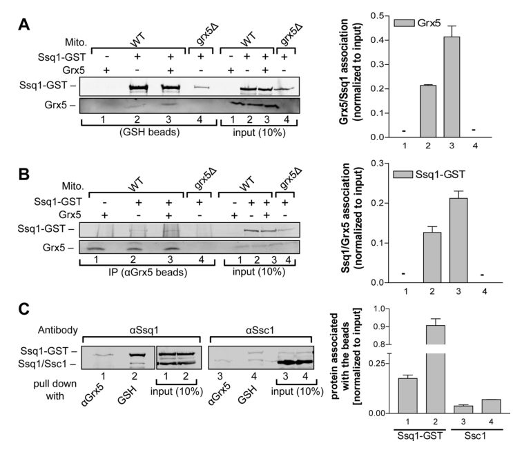

## Question

# Gene Research for Functional Annotation

## ⚠️ CRITICAL: Gene/Protein Identification Context

**BEFORE YOU BEGIN RESEARCH:** You MUST verify you are researching the CORRECT gene/protein. Gene symbols can be ambiguous, especially for less well-characterized genes from non-model organisms.

### Target Gene/Protein Identity (from UniProt):
- **UniProt Accession:** Q05931
- **Protein Description:** RecName: Full=Iron-sulfur cluster biogenesis chaperone, mitochondrial {ECO:0000305}; EC=3.6.4.10 {ECO:0000269|PubMed:16431909, ECO:0000269|PubMed:26545917}; AltName: Full=Heat shock protein SSQ1, mitochondrial {ECO:0000305}; AltName: Full=Stress-seventy subfamily Q protein 1 {ECO:0000305}; AltName: Full=mtHSP70 homolog {ECO:0000305}; Flags: Precursor;
- **Gene Information:** Name=SSQ1 {ECO:0000303|PubMed:10779357, ECO:0000312|SGD:S000004361}; Synonyms=SSC2 {ECO:0000303|PubMed:9660806}; OrderedLocusNames=YLR369W;
- **Organism (full):** Saccharomyces cerevisiae (strain ATCC 204508 / S288c) (Baker's yeast).
- **Protein Family:** Belongs to the heat shock protein 70 family. .
- **Key Domains:** ATPase_NBD. (IPR043129); Heat_shock_70_CS. (IPR018181); HSP70_C_sf. (IPR029048); HSP70_peptide-bd_sf. (IPR029047); Hsp_70_fam. (IPR013126)

### MANDATORY VERIFICATION STEPS:

1. **Check if the gene symbol "SSQ1" matches the protein description above**
2. **Verify the organism is correct:** Saccharomyces cerevisiae (strain ATCC 204508 / S288c) (Baker's yeast).
3. **Check if protein family/domains align with what you find in literature**
4. **If you find literature for a DIFFERENT gene with the same or similar symbol, STOP**

### If Gene Symbol is Ambiguous or You Cannot Find Relevant Literature:

**DO NOT PROCEED WITH RESEARCH ON A DIFFERENT GENE.** Instead:
- State clearly: "The gene symbol 'SSQ1' is ambiguous or literature is limited for this specific protein"
- Explain what you found (e.g., "Found extensive literature on a different gene with the same symbol in a different organism")
- Describe the protein based ONLY on the UniProt information provided above
- Suggest that the protein function can be inferred from domain/family information

### Research Target:

Please provide a comprehensive research report on the gene **SSQ1** (gene ID: SSQ1, UniProt: Q05931) in yeast.

The research report should be a detailed narrative explaining the function, biological processes, and localization of the gene product. Citations should be given for all claims.

You should prioritize authoritative reviews and primary scientific literature when conducting research. You can supplement
this with annotations you find in gene/protein databases, but these can be outdated or inaccurate.

We are specifically interested in the primary function of the gene - for enzymes, what reaction is catalyzed, and what is the substrate specificity? For transporters, what is the substrate? For structural proteins or adapters, what is the broader structural role? For signaling molecules, what is the role in the pathway.

We are interested in where in or outside the cell the gene product carries out its function.

We are also interested in the signaling or biochemical pathways in which the gene functions. We are less interested in broad pleiotropic effects, except where these elucidate the precise role.

Include evidence where possible. We are interested in both experimental evidence as well as inference from structure, evolution, or bioinformatic analysis. Precise studies should be prioritized over high-throughput, where available.

## Output

Question: You are an expert researcher providing comprehensive, well-cited information.

Provide detailed information focusing on:
1. Key concepts and definitions with current understanding
2. Recent developments and latest research (prioritize 2023-2024 sources)
3. Current applications and real-world implementations
4. Expert opinions and analysis from authoritative sources
5. Relevant statistics and data from recent studies

Format as a comprehensive research report with proper citations. Include URLs and publication dates where available.
Always prioritize recent, authoritative sources and provide specific citations for all major claims.

# Gene Research for Functional Annotation

## ⚠️ CRITICAL: Gene/Protein Identification Context

**BEFORE YOU BEGIN RESEARCH:** You MUST verify you are researching the CORRECT gene/protein. Gene symbols can be ambiguous, especially for less well-characterized genes from non-model organisms.

### Target Gene/Protein Identity (from UniProt):
- **UniProt Accession:** Q05931
- **Protein Description:** RecName: Full=Iron-sulfur cluster biogenesis chaperone, mitochondrial {ECO:0000305}; EC=3.6.4.10 {ECO:0000269|PubMed:16431909, ECO:0000269|PubMed:26545917}; AltName: Full=Heat shock protein SSQ1, mitochondrial {ECO:0000305}; AltName: Full=Stress-seventy subfamily Q protein 1 {ECO:0000305}; AltName: Full=mtHSP70 homolog {ECO:0000305}; Flags: Precursor;
- **Gene Information:** Name=SSQ1 {ECO:0000303|PubMed:10779357, ECO:0000312|SGD:S000004361}; Synonyms=SSC2 {ECO:0000303|PubMed:9660806}; OrderedLocusNames=YLR369W;
- **Organism (full):** Saccharomyces cerevisiae (strain ATCC 204508 / S288c) (Baker's yeast).
- **Protein Family:** Belongs to the heat shock protein 70 family. .
- **Key Domains:** ATPase_NBD. (IPR043129); Heat_shock_70_CS. (IPR018181); HSP70_C_sf. (IPR029048); HSP70_peptide-bd_sf. (IPR029047); Hsp_70_fam. (IPR013126)

### MANDATORY VERIFICATION STEPS:

1. **Check if the gene symbol "SSQ1" matches the protein description above**
2. **Verify the organism is correct:** Saccharomyces cerevisiae (strain ATCC 204508 / S288c) (Baker's yeast).
3. **Check if protein family/domains align with what you find in literature**
4. **If you find literature for a DIFFERENT gene with the same or similar symbol, STOP**

### If Gene Symbol is Ambiguous or You Cannot Find Relevant Literature:

**DO NOT PROCEED WITH RESEARCH ON A DIFFERENT GENE.** Instead:
- State clearly: "The gene symbol 'SSQ1' is ambiguous or literature is limited for this specific protein"
- Explain what you found (e.g., "Found extensive literature on a different gene with the same symbol in a different organism")
- Describe the protein based ONLY on the UniProt information provided above
- Suggest that the protein function can be inferred from domain/family information

### Research Target:

Please provide a comprehensive research report on the gene **SSQ1** (gene ID: SSQ1, UniProt: Q05931) in yeast.

The research report should be a detailed narrative explaining the function, biological processes, and localization of the gene product. Citations should be given for all claims.

You should prioritize authoritative reviews and primary scientific literature when conducting research. You can supplement
this with annotations you find in gene/protein databases, but these can be outdated or inaccurate.

We are specifically interested in the primary function of the gene - for enzymes, what reaction is catalyzed, and what is the substrate specificity? For transporters, what is the substrate? For structural proteins or adapters, what is the broader structural role? For signaling molecules, what is the role in the pathway.

We are interested in where in or outside the cell the gene product carries out its function.

We are also interested in the signaling or biochemical pathways in which the gene functions. We are less interested in broad pleiotropic effects, except where these elucidate the precise role.

Include evidence where possible. We are interested in both experimental evidence as well as inference from structure, evolution, or bioinformatic analysis. Precise studies should be prioritized over high-throughput, where available.

## Research report: *Saccharomyces cerevisiae* SSQ1 (UniProt Q05931; gene YLR369W)

### 0) Mandatory identity verification (correct gene/protein)
The UniProt accession **Q05931** corresponds to **SSQ1 (synonym SSC2)** from *Saccharomyces cerevisiae* S288c, encoding **Ssq1**, a **mitochondria-localized specialized Hsp70 family chaperone** dedicated to **iron–sulfur (Fe–S) cluster biogenesis**. Primary literature and reviews explicitly describe Ssq1 as a **mitochondrial matrix Hsp70** whose key role is in Fe/S cluster maturation, acting with the J-protein **Jac1** and the nucleotide exchange factor **Mge1**, and binding the ISC scaffold **Isu1** and the transfer factor **Grx5** (craig2002aspecializedmitochondrial pages 2-4, craig2002aspecializedmitochondrial pages 5-6, uzarska2013themitochondrialhsp70 pages 1-2). This matches the UniProt-provided description (“iron-sulfur cluster biogenesis chaperone, mitochondrial”; Hsp70 family).

### 1) Key concepts and definitions (current understanding)

#### 1.1 Iron–sulfur (Fe–S) cluster biogenesis in mitochondria (ISC pathway)
Fe–S clusters are essential cofactors required by many mitochondrial and extra-mitochondrial enzymes. In eukaryotes, **de novo [2Fe–2S] cluster assembly** occurs on a dedicated scaffold protein (**Isu1/Isu2** in yeast; ISCU in mammals), using sulfur mobilized by Nfs1 (cysteine desulfurase) and associated early ISC factors; subsequently, clusters are **released/transferred** to downstream carriers/recipients via a dedicated **Hsp70/J-protein chaperone system** (melber2018stepstowardunderstanding pages 7-10, heffner2024tipofthe pages 2-4).

#### 1.2 What SSQ1/Ssq1 is (molecular function definition)
**Ssq1 is an ATP-dependent Hsp70 chaperone/ATPase that drives the ISC “transfer step”**: it promotes **release of a newly assembled Fe–S cluster from the Isu scaffold** and facilitates **handoff** to downstream factors (notably Grx5), enabling maturation of mitochondrial Fe–S proteins and supporting downstream cytosolic/nuclear Fe–S biogenesis (uzarska2013themitochondrialhsp70 pages 1-2, melber2018stepstowardunderstanding pages 7-10, dutkiewicz2018molecularchaperonesinvolved pages 5-7).

Critically, Ssq1 is **not** the enzyme that makes the Fe–S cluster; instead, its “reaction” is the **ATP-driven conformational chaperone cycle** that stabilizes specific complexes (Ssq1–Isu1, Ssq1–Grx5) to make transfer efficient and directional (uzarska2013themitochondrialhsp70 pages 1-2, dutkiewicz2018molecularchaperonesinvolved pages 2-4).

#### 1.3 The Ssq1 chaperone cycle and substrate specificity
Mechanistically, Ssq1 follows canonical Hsp70 principles:
- Client binding is **nucleotide-state dependent** (tight binding in ADP state; release/reset in ATP state) (dutkiewicz2018molecularchaperonesinvolved pages 2-4, uzarska2013themitochondrialhsp70 pages 1-2).
- The **J-domain cochaperone Jac1** recruits the Fe–S-loaded scaffold and stimulates Ssq1 ATP hydrolysis; Jac1 and Isu1 act **synergistically** to stimulate Ssq1 ATPase activity, driving formation of a productive, stable complex needed for transfer (uzarska2013themitochondrialhsp70 pages 1-2, craig2002aspecializedmitochondrial pages 5-6).
- The nucleotide exchange factor **Mge1** stimulates nucleotide release/exchange and resets the cycle; Ssq1 binds nucleotide tightly and Mge1 stimulates its release (craig2002aspecializedmitochondrial pages 5-6).

**Substrate/client specificity:**
- Ssq1 recognizes the scaffold **Isu1** through the conserved **LPPVK** motif (a peptide loop) that engages the Hsp70 substrate-binding site (uzarska2013themitochondrialhsp70 pages 1-2, uzarska2013themitochondrialhsp70 pages 5-6).
- **Grx5 binds Ssq1 at a distinct site** (not displaced by excess LPPVK peptide) and **does not stimulate Ssq1 ATPase**, enabling simultaneous Isu1+Grx5 association on Ssq1 for handoff (uzarska2013themitochondrialhsp70 pages 5-6, uzarska2013themitochondrialhsp70 pages 7-8).

### 2) Pathway placement and mechanistic model (what SSQ1 does in vivo)

#### 2.1 Core partners and their roles
Evidence-supported core components of the yeast ISC transfer module include:
- **Ssq1 (SSQ1)**: specialized Hsp70 driving transfer (uzarska2013themitochondrialhsp70 pages 1-2).
- **Jac1 (JAC1)**: J-protein cochaperone; recruits Isu1 and activates Ssq1 ATPase (craig2002aspecializedmitochondrial pages 2-4, uzarska2013themitochondrialhsp70 pages 1-2).
- **Mge1 (MGE1)**: nucleotide exchange factor for Ssq1 (craig2002aspecializedmitochondrial pages 5-6).
- **Isu1/Isu2 (ISU1/ISU2)**: Fe–S scaffold client; binds Ssq1 via LPPVK motif (craig2002aspecializedmitochondrial pages 5-6).
- **Grx5 (GRX5)**: monothiol glutaredoxin that receives Fe–S clusters; forms a specific complex with Ssq1 that facilitates transfer to targets (uzarska2013themitochondrialhsp70 pages 1-2, uzarska2013themitochondrialhsp70 pages 7-8).

#### 2.2 Model for Fe–S cluster transfer (primary literature)
Uzarska et al. (2013) provide direct biochemical and in vivo evidence that **Ssq1 binds both Isu1 and Grx5** and that co-occupancy facilitates transfer from scaffold to glutaredoxin (uzarska2013themitochondrialhsp70 pages 1-2, uzarska2013themitochondrialhsp70 pages 7-8). Their working model explicitly proposes: (i) de novo synthesis on Isu1; (ii) Jac1 targets ISC-loaded Isu1 to ATP-bound Ssq1; (iii) ATP hydrolysis stabilizes interactions and promotes transfer to Grx5; and (iv) Grx5 then supports maturation of recipient Fe–S proteins (uzarska2013themitochondrialhsp70 media a9609f72, uzarska2013themitochondrialhsp70 media d1f76f58).

### 3) Phenotypes and functional evidence in yeast (including statistics/data)

#### 3.1 Localization and essentiality context
Ssq1 and Jac1 are localized to the **mitochondrial matrix** (craig2002aspecializedmitochondrial pages 2-4). SSQ1 is **not strictly essential** under all conditions, but **ssq1Δ** strains show strong conditional growth defects (cold-sensitive/slow growth) (craig2002aspecializedmitochondrial pages 1-2).

#### 3.2 Iron homeostasis and Fe–S enzyme defects
Disruption of the Ssq1/Jac1 module produces hallmark Fe–S biogenesis defects:
- **~10-fold increase in mitochondrial iron** in ssq1 or jac1 mutants (craig2002aspecializedmitochondrial pages 2-4).
- **Decreased activities** of Fe–S enzymes/proteins including **aconitase**, **cytochrome bc1 complex**, and **succinate dehydrogenase** in ssq1/jac1 mutants (craig2002aspecializedmitochondrial pages 2-4).
- **Compromised formation of holo-ferredoxin** in isolated jac1 and ssq1 mitochondria (craig2002aspecializedmitochondrial pages 2-4).

These phenotypes support a primary defect in Fe–S cluster maturation/transfer rather than unrelated pleiotropy.

#### 3.3 Evidence that Ssq1/Jac1 defects block transfer downstream of Isu
Multiple lines of evidence indicate that loss of Ssq1 or Jac1 causes **Fe–S clusters to accumulate on Isu1**, consistent with impaired release/transfer (uzarska2013themitochondrialhsp70 pages 1-2).

#### 3.4 Quantitative and biochemical observations from key studies
Selected quantitative observations directly reported:
- **Ssq1 is low abundance:** present at **~500–1000-fold lower levels than the general mtHsp70 Ssc1** (craig2002aspecializedmitochondrial pages 1-2).
- **Functional substitution is inefficient:** partial suppression of ssq1Δ phenotypes can occur with modest Ssc1 overexpression, but full suppression reportedly requires **~1000–2000-fold excess** Ssc1 (craig2002aspecializedmitochondrial pages 5-6).
- **Ssq1–Grx5 complex formation is measurable:** copurified Grx5 increases **~2-fold** when Grx5 is overproduced (uzarska2013themitochondrialhsp70 pages 1-2).
- **Jac1–Isu interaction is quantitatively important:** some mutations yield **~8-fold decreased affinity** of Jac1 for Isu1 and compromise function; J-domain HPD motif disruption impairs ATPase stimulation and viability rescue (ciesielski2012interactionofjprotein pages 2-3).

### 4) Recent developments (prioritizing 2023–2024) and latest research context
Direct Ssq1-focused primary papers are mostly earlier than 2023; however, **2024 work and reviews refine the broader pathway context in which Ssq1 operates** and reinforce conserved mechanistic principles.

#### 4.1 2024 experimental update: cytosolic [2Fe–2S] maturation requirements
Braymer et al. (PNAS, **May 2024**, https://doi.org/10.1073/pnas.2400740121) reaffirm the canonical yeast mitochondrial transfer step involving **Ssq1 and Jac1** with trafficking to **Grx5**, and present new in vivo evidence that **cytosolic [2Fe–2S] protein maturation** requires the **mitochondrial ISC machinery**, the exporter **Atm1/ABCB7**, and **glutathione (GSH)**, but can be **independent of the CIA system** and cytosolic monothiol glutaredoxins for this protein subclass (braymer2024requirementsforthe pages 1-2). This refines where downstream requirements lie relative to the Ssq1-mediated release/transfer step.

#### 4.2 2024 mechanistic synthesis: specificity via cochaperones in the conserved system
A 2024 review by Heffner & Maio (Inorganics, **Jan 2024**, https://doi.org/10.20944/preprints202312.1414.v1) summarizes the evolutionarily conserved idea that **Hsp70 partners are relatively promiscuous**, whereas specificity can be driven by J-protein cochaperones; in mammals, **HSC20/HSCB** recognizes **LYR-like motifs** in recipients and uses its **HPD** motif to stimulate **HSPA9** ATP hydrolysis, promoting transfer from ISCU to targets (heffner2024tipofthe pages 2-4). While this is human-centric, it provides up-to-date comparative framing for the yeast Ssq1/Jac1 system, in which Jac1 similarly drives specificity to the Isu scaffold and stimulates Hsp70 ATPase.

### 5) Current applications and real-world implementations

#### 5.1 Yeast as a mechanistic model for conserved mitochondrial Fe–S delivery
The most concrete “real-world implementation” is **use of yeast SSQ1/JAC1/ISU/GRX5 as a genetically tractable model** for mitochondrial Fe–S transfer, informing conserved principles of eukaryotic Fe–S maturation (dutkiewicz2018molecularchaperonesinvolved pages 5-7, ciesielski2012interactionofjprotein pages 2-3).

#### 5.2 Translational relevance via conservation to human machinery and disease mechanisms
Although Ssq1 itself is fungal-specialized, the **functional module is conserved**: reviews describe the analogous mammalian **HSPA9 + HSC20/HSCB** transfer system acting on ISCU and using cochaperone-driven specificity (heffner2024tipofthe pages 2-4, dutkiewicz2018molecularchaperonesinvolved pages 5-7). This conservation makes yeast Ssq1/Jac1 studies relevant to understanding how perturbations in Fe–S delivery can contribute to cellular iron dysregulation and enzyme deficiencies.

### 6) Expert opinions and authoritative interpretations
Authoritative reviews conclude that Ssq1 represents a rare example of a **highly specialized Hsp70 system with a narrowly defined native client (the ISC scaffold Isu)**, supporting the view that Ssq1’s primary function is to catalyze a specific Fe–S transfer step rather than general mitochondrial proteostasis (craig2002aspecializedmitochondrial pages 5-6, dutkiewicz2018molecularchaperonesinvolved pages 5-7). The specificity argument is strengthened by the strong genetic/biochemical coupling between Ssq1 and Jac1 and the ability of Isu1+Jac1 to cooperatively stimulate Ssq1 ATPase activity (craig2002aspecializedmitochondrial pages 5-6).

### 7) Visual evidence (figures)
Uzarska et al. (2013) includes a **working model schematic** for Ssq1–Jac1–Isu1–Grx5 mediated transfer and supporting interaction evidence (uzarska2013themitochondrialhsp70 media a9609f72, uzarska2013themitochondrialhsp70 media d1f76f58).

### Summary table (evidence map)
| Aspect | Summary | Key references |
|---|---|---|
| Identity/localization | **SSQ1** corresponds to the *Saccharomyces cerevisiae* mitochondrial **specialized Hsp70** chaperone Ssq1 (gene **YLR369W**), dedicated to iron–sulfur (Fe–S) cluster biogenesis rather than general protein import/folding. It localizes to the **mitochondrial matrix** and is evolutionarily derived from an mtHsp70 duplication. (craig2002aspecializedmitochondrial pages 1-2, dutkiewicz2018molecularchaperonesinvolved pages 5-7, dutkiewicz2018molecularchaperonesinvolved pages 1-2) | Craig & Marszalek, **Oct 2002**, DOI: https://doi.org/10.1007/pl00012493; Dutkiewicz & Nowak, **Nov 2018**, DOI: https://doi.org/10.1007/s00775-017-1504-x; Kleczewska et al., **May 2020**, DOI: https://doi.org/10.3390/ijms21093326 |
| Molecular function | Ssq1 is an **ATP-dependent Hsp70 chaperone/ATPase** that promotes **release and transfer of nascent [2Fe-2S] clusters** from the Isu1/Isu2 scaffold during ISC biogenesis. Its biochemical role is not to synthesize the cluster directly, but to couple ATP hydrolysis to scaffold engagement and productive handoff of the cluster. (uzarska2013themitochondrialhsp70 pages 1-2, melber2018stepstowardunderstanding pages 7-10, dutkiewicz2018molecularchaperonesinvolved pages 2-4) | Uzarska et al., **Jun 2013**, DOI: https://doi.org/10.1091/mbc.e12-09-0644; Melber & Winge, **Jan 2018**, DOI: https://doi.org/10.1016/bs.mie.2017.09.004; Dutkiewicz & Nowak, **Nov 2018**, DOI: https://doi.org/10.1007/s00775-017-1504-x |
| Pathway step | In the mitochondrial ISC pathway, de novo [2Fe-2S] assembly occurs on **Isu1**, after which the **Ssq1–Jac1–Mge1** system mediates the **cluster-release/transfer step** to **Grx5**, enabling maturation of mitochondrial Fe–S proteins and supporting downstream cytosolic/nuclear Fe–S protein biogenesis. (melber2018stepstowardunderstanding pages 7-10, dutkiewicz2018molecularchaperonesinvolved pages 2-4, braymer2024requirementsforthe pages 1-2) | Melber & Winge, **Jan 2018**, DOI: https://doi.org/10.1016/bs.mie.2017.09.004; Dutkiewicz & Nowak, **Nov 2018**, DOI: https://doi.org/10.1007/s00775-017-1504-x; Braymer et al., **May 2024**, DOI: https://doi.org/10.1073/pnas.2400740121 |
| Key partners | Core partners are **Jac1** (J-domain cochaperone), **Isu1/Isu2** (Fe–S scaffold), **Mge1** (nucleotide-exchange factor), and **Grx5** (monothiol glutaredoxin transfer factor). Jac1 recruits Isu1 to Ssq1; Mge1 resets nucleotide state; Grx5 receives clusters downstream. (uzarska2013themitochondrialhsp70 pages 1-2, craig2002aspecializedmitochondrial pages 5-6, dutkiewicz2018molecularchaperonesinvolved pages 5-7) | Uzarska et al., **Jun 2013**, DOI: https://doi.org/10.1091/mbc.e12-09-0644; Craig & Marszalek, **Oct 2002**, DOI: https://doi.org/10.1007/pl00012493; Dutkiewicz & Nowak, **Nov 2018**, DOI: https://doi.org/10.1007/s00775-017-1504-x |
| Mechanistic notes | Ssq1 follows a canonical Hsp70 cycle: **Jac1 + Isu1** stimulate Ssq1 ATPase activity; the **ADP-bound** state stabilizes Ssq1–Isu1 interaction; **Mge1** promotes ADP release/exchange to ATP, resetting the cycle. Ssq1 recognizes the **LPPVK** motif of Isu1 at its substrate-binding site. **Grx5 binds Ssq1 at a distinct site** and does **not** stimulate ATPase activity, allowing simultaneous/compatible association that facilitates direct cluster handoff. A 1:1:1 chaperone–cochaperone–scaffold complex is proposed as sufficient to accelerate transfer. (uzarska2013themitochondrialhsp70 pages 1-2, uzarska2013themitochondrialhsp70 pages 5-6, dutkiewicz2018molecularchaperonesinvolved pages 5-7, dutkiewicz2018molecularchaperonesinvolved pages 2-4, uzarska2013themitochondrialhsp70 media a9609f72) | Uzarska et al., **Jun 2013**, DOI: https://doi.org/10.1091/mbc.e12-09-0644; Dutkiewicz & Nowak, **Nov 2018**, DOI: https://doi.org/10.1007/s00775-017-1504-x |
| Loss-of-function phenotypes | **ssq1Δ** or Ssq1 dysfunction causes **mitochondrial iron accumulation**, reduced activities of Fe–S enzymes such as **aconitase** and **succinate dehydrogenase**, impaired Fe–S protein maturation, and **cold-sensitive/slow growth**. When Ssq1/Jac1/Grx5 function is compromised, Fe–S clusters accumulate on **Isu1**, consistent with a defect in transfer rather than de novo synthesis. (uzarska2013themitochondrialhsp70 pages 1-2, craig2002aspecializedmitochondrial pages 5-6, kamyari2024ironsulfurclustersand pages 2-5, dutkiewicz2018molecularchaperonesinvolved pages 5-7) | Craig & Marszalek, **Oct 2002**, DOI: https://doi.org/10.1007/pl00012493; Uzarska et al., **Jun 2013**, DOI: https://doi.org/10.1091/mbc.e12-09-0644; Dutkiewicz & Nowak, **Nov 2018**, DOI: https://doi.org/10.1007/s00775-017-1504-x |
| Quantitative/stoichiometric notes | Ssq1 is reported to be **500–1000-fold less abundant than Ssc1** in mitochondria. Partial suppression of some **ssq1** phenotypes by the general mtHsp70 **Ssc1** required extreme overexpression; reports cited in review indicate roughly **2-fold** overexpression yielded limited rescue, whereas **~1000–2000-fold** excess was needed for full suppression. In biochemical assays, **Ssq1 was used at 0.5 μM** for ATPase tests, **Grx5–Ssq1 binding assays used ~4 μM**, and Grx5 copurification increased about **2-fold** on Grx5 overproduction. (uzarska2013themitochondrialhsp70 pages 1-2, craig2002aspecializedmitochondrial pages 5-6, craig2002aspecializedmitochondrial pages 1-2, uzarska2013themitochondrialhsp70 pages 5-6) | Craig & Marszalek, **Oct 2002**, DOI: https://doi.org/10.1007/pl00012493; Uzarska et al., **Jun 2013**, DOI: https://doi.org/10.1091/mbc.e12-09-0644 |
| Recent developments (2023–2024 context) | No major **Ssq1-specific** 2023–2024 primary breakthroughs were identified, but recent work reinforces the conserved chaperone-controlled transfer paradigm. A **May 2024 PNAS** study showed that maturation of **cytosolic [2Fe-2S] proteins** in yeast and humans still depends on the **mitochondrial ISC machinery**, **Atm1/ABCB7**, and **glutathione**, while being independent of CIA for this subclass—supporting the importance of the upstream mitochondrial release/transfer step in which Ssq1 participates. Recent 2024 reviews also emphasize the analogous **HSPA9/HSCB** system in humans, highlighting translational relevance of the yeast Ssq1/Jac1 model. (heffner2024tipofthe pages 2-4, braymer2024requirementsforthe pages 1-2) | Braymer et al., **May 2024**, DOI: https://doi.org/10.1073/pnas.2400740121; Heffner & Maio, **Jan 2024**, DOI: https://doi.org/10.20944/preprints202312.1414.v1 |
| Expert consensus | Authoritative reviews converge on the view that Ssq1 is a **highly specialized, dedicated transfer chaperone** in fungal ISC biogenesis, functionally analogous to bacterial **HscA** and mechanistically linked to **Jac1/Isu1/Grx5**. Expert interpretation is that its main role is to promote **cluster labilization and directed transfer**, not broad proteostasis. (craig2002aspecializedmitochondrial pages 5-6, dutkiewicz2018molecularchaperonesinvolved pages 5-7, dutkiewicz2018molecularchaperonesinvolved pages 1-2) | Craig & Marszalek, **Oct 2002**, DOI: https://doi.org/10.1007/pl00012493; Dutkiewicz & Nowak, **Nov 2018**, DOI: https://doi.org/10.1007/s00775-017-1504-x; Lill, **Apr 2020**, DOI: https://doi.org/10.1515/hsz-2020-0117 |

*Table: This table summarizes the identity, mechanism, pathway role, interaction partners, phenotypes, and recent context for the yeast mitochondrial Fe–S biogenesis chaperone SSQ1. It is designed as a concise evidence map for functional annotation with publication dates and DOI URLs.*

### Key references (publication date; URL)
- Craig EA, Marszalek J. **Oct 2002**. *A specialized mitochondrial molecular chaperone system: A role in formation of Fe/S centers.* https://doi.org/10.1007/pl00012493 (craig2002aspecializedmitochondrial pages 2-4, craig2002aspecializedmitochondrial pages 5-6, craig2002aspecializedmitochondrial pages 1-2)
- Ciesielski SJ et al. **Mar 2012**. *Interaction of J-protein co-chaperone Jac1 with Fe-S scaffold Isu is indispensable in vivo and conserved in evolution.* https://doi.org/10.1016/j.jmb.2012.01.022 (ciesielski2012interactionofjprotein pages 2-3)
- Uzarska MA et al. **Jun 2013**. *The mitochondrial Hsp70 chaperone Ssq1 facilitates Fe/S cluster transfer from Isu1 to Grx5 by complex formation.* https://doi.org/10.1091/mbc.e12-09-0644 (uzarska2013themitochondrialhsp70 pages 1-2, uzarska2013themitochondrialhsp70 pages 7-8)
- Dutkiewicz R, Nowak M. **Nov 2018**. *Molecular chaperones involved in mitochondrial iron–sulfur protein biogenesis.* https://doi.org/10.1007/s00775-017-1504-x (dutkiewicz2018molecularchaperonesinvolved pages 5-7)
- Melber A, Winge DR. **Jan 2018**. *Steps Toward Understanding Mitochondrial Fe/S Cluster Biogenesis.* https://doi.org/10.1016/bs.mie.2017.09.004 (melber2018stepstowardunderstanding pages 7-10)
- Braymer JJ et al. **May 2024**. *Requirements for the biogenesis of [2Fe-2S] proteins in the human and yeast cytosol.* https://doi.org/10.1073/pnas.2400740121 (braymer2024requirementsforthe pages 1-2)
- Heffner AL, Maio N. **Jan 2024**. *Tip of the Iceberg: A New Wave of Iron–Sulfur Cluster Proteins Found in Viruses.* https://doi.org/10.20944/preprints202312.1414.v1 (mechanistic review of Fe–S biogenesis including HSPA9/HSC20 specificity principles) (heffner2024tipofthe pages 2-4)

References

1. (craig2002aspecializedmitochondrial pages 2-4): Elizabeth A. Craig and J. Marszalek. A specialized mitochondrial molecular chaperone system:¶a role in formation of fe/s centers. Cellular and Molecular Life Sciences CMLS, 59:1658-1665, Oct 2002. URL: https://doi.org/10.1007/pl00012493, doi:10.1007/pl00012493. This article has 122 citations.

2. (craig2002aspecializedmitochondrial pages 5-6): Elizabeth A. Craig and J. Marszalek. A specialized mitochondrial molecular chaperone system:¶a role in formation of fe/s centers. Cellular and Molecular Life Sciences CMLS, 59:1658-1665, Oct 2002. URL: https://doi.org/10.1007/pl00012493, doi:10.1007/pl00012493. This article has 122 citations.

3. (uzarska2013themitochondrialhsp70 pages 1-2): Marta A. Uzarska, Rafal Dutkiewicz, Sven-Andreas Freibert, Roland Lill, and Ulrich Mühlenhoff. The mitochondrial hsp70 chaperone ssq1 facilitates fe/s cluster transfer from isu1 to grx5 by complex formation. Molecular Biology of the Cell, 24:1830-1841, Jun 2013. URL: https://doi.org/10.1091/mbc.e12-09-0644, doi:10.1091/mbc.e12-09-0644. This article has 175 citations and is from a domain leading peer-reviewed journal.

4. (melber2018stepstowardunderstanding pages 7-10): Andrew Melber and Dennis R. Winge. Steps toward understanding mitochondrial fe/s cluster biogenesis. Methods in enzymology, 599:265-292, Jan 2018. URL: https://doi.org/10.1016/bs.mie.2017.09.004, doi:10.1016/bs.mie.2017.09.004. This article has 28 citations and is from a peer-reviewed journal.

5. (heffner2024tipofthe pages 2-4): Audrey L. Heffner and Nunziata Maio. Tip of the iceberg: a new wave of iron–sulfur cluster proteins found in viruses. Inorganics, 12:34, Jan 2024. URL: https://doi.org/10.20944/preprints202312.1414.v1, doi:10.20944/preprints202312.1414.v1. This article has 7 citations.

6. (dutkiewicz2018molecularchaperonesinvolved pages 5-7): Rafal Dutkiewicz and Malgorzata Nowak. Molecular chaperones involved in mitochondrial iron–sulfur protein biogenesis. Journal of Biological Inorganic Chemistry, 23:569-579, Nov 2018. URL: https://doi.org/10.1007/s00775-017-1504-x, doi:10.1007/s00775-017-1504-x. This article has 47 citations and is from a peer-reviewed journal.

7. (dutkiewicz2018molecularchaperonesinvolved pages 2-4): Rafal Dutkiewicz and Malgorzata Nowak. Molecular chaperones involved in mitochondrial iron–sulfur protein biogenesis. Journal of Biological Inorganic Chemistry, 23:569-579, Nov 2018. URL: https://doi.org/10.1007/s00775-017-1504-x, doi:10.1007/s00775-017-1504-x. This article has 47 citations and is from a peer-reviewed journal.

8. (uzarska2013themitochondrialhsp70 pages 5-6): Marta A. Uzarska, Rafal Dutkiewicz, Sven-Andreas Freibert, Roland Lill, and Ulrich Mühlenhoff. The mitochondrial hsp70 chaperone ssq1 facilitates fe/s cluster transfer from isu1 to grx5 by complex formation. Molecular Biology of the Cell, 24:1830-1841, Jun 2013. URL: https://doi.org/10.1091/mbc.e12-09-0644, doi:10.1091/mbc.e12-09-0644. This article has 175 citations and is from a domain leading peer-reviewed journal.

9. (uzarska2013themitochondrialhsp70 pages 7-8): Marta A. Uzarska, Rafal Dutkiewicz, Sven-Andreas Freibert, Roland Lill, and Ulrich Mühlenhoff. The mitochondrial hsp70 chaperone ssq1 facilitates fe/s cluster transfer from isu1 to grx5 by complex formation. Molecular Biology of the Cell, 24:1830-1841, Jun 2013. URL: https://doi.org/10.1091/mbc.e12-09-0644, doi:10.1091/mbc.e12-09-0644. This article has 175 citations and is from a domain leading peer-reviewed journal.

10. (uzarska2013themitochondrialhsp70 media a9609f72): Marta A. Uzarska, Rafal Dutkiewicz, Sven-Andreas Freibert, Roland Lill, and Ulrich Mühlenhoff. The mitochondrial hsp70 chaperone ssq1 facilitates fe/s cluster transfer from isu1 to grx5 by complex formation. Molecular Biology of the Cell, 24:1830-1841, Jun 2013. URL: https://doi.org/10.1091/mbc.e12-09-0644, doi:10.1091/mbc.e12-09-0644. This article has 175 citations and is from a domain leading peer-reviewed journal.

11. (uzarska2013themitochondrialhsp70 media d1f76f58): Marta A. Uzarska, Rafal Dutkiewicz, Sven-Andreas Freibert, Roland Lill, and Ulrich Mühlenhoff. The mitochondrial hsp70 chaperone ssq1 facilitates fe/s cluster transfer from isu1 to grx5 by complex formation. Molecular Biology of the Cell, 24:1830-1841, Jun 2013. URL: https://doi.org/10.1091/mbc.e12-09-0644, doi:10.1091/mbc.e12-09-0644. This article has 175 citations and is from a domain leading peer-reviewed journal.

12. (craig2002aspecializedmitochondrial pages 1-2): Elizabeth A. Craig and J. Marszalek. A specialized mitochondrial molecular chaperone system:¶a role in formation of fe/s centers. Cellular and Molecular Life Sciences CMLS, 59:1658-1665, Oct 2002. URL: https://doi.org/10.1007/pl00012493, doi:10.1007/pl00012493. This article has 122 citations.

13. (ciesielski2012interactionofjprotein pages 2-3): Szymon J. Ciesielski, Brenda A. Schilke, Jerzy Osipiuk, Lance Bigelow, Rory Mulligan, Julia Majewska, Andrzej Joachimiak, Jaroslaw Marszalek, Elizabeth A. Craig, and Rafal Dutkiewicz. Interaction of j-protein co-chaperone jac1 with fe-s scaffold isu is indispensable in vivo and conserved in evolution. Journal of molecular biology, 417 1-2:1-12, Mar 2012. URL: https://doi.org/10.1016/j.jmb.2012.01.022, doi:10.1016/j.jmb.2012.01.022. This article has 80 citations and is from a domain leading peer-reviewed journal.

14. (braymer2024requirementsforthe pages 1-2): Joseph J. Braymer, Oliver Stehling, Martin Stümpfig, Ralf Rösser, Farah Spantgar, Catharina M. Blinn, Ulrich Mühlenhoff, Antonio J. Pierik, and Roland Lill. Requirements for the biogenesis of [2fe-2s] proteins in the human and yeast cytosol. Proceedings of the National Academy of Sciences, May 2024. URL: https://doi.org/10.1073/pnas.2400740121, doi:10.1073/pnas.2400740121. This article has 15 citations and is from a highest quality peer-reviewed journal.

15. (dutkiewicz2018molecularchaperonesinvolved pages 1-2): Rafal Dutkiewicz and Malgorzata Nowak. Molecular chaperones involved in mitochondrial iron–sulfur protein biogenesis. Journal of Biological Inorganic Chemistry, 23:569-579, Nov 2018. URL: https://doi.org/10.1007/s00775-017-1504-x, doi:10.1007/s00775-017-1504-x. This article has 47 citations and is from a peer-reviewed journal.

16. (kamyari2024ironsulfurclustersand pages 2-5): Mohammad Kamyari. Iron-sulfur clusters and cancer. Biomedical Journal of Scientific &amp; Technical Research, Oct 2024. URL: https://doi.org/10.26717/bjstr.2024.59.009266, doi:10.26717/bjstr.2024.59.009266. This article has 0 citations.

## Artifacts

- [Edison artifact artifact-00](SSQ1-deep-research-falcon_artifacts/artifact-00.md)

## Citations

1. craig2002aspecializedmitochondrial pages 5-6
2. craig2002aspecializedmitochondrial pages 2-4
3. craig2002aspecializedmitochondrial pages 1-2
4. ciesielski2012interactionofjprotein pages 2-3
5. braymer2024requirementsforthe pages 1-2
6. heffner2024tipofthe pages 2-4
7. dutkiewicz2018molecularchaperonesinvolved pages 5-7
8. melber2018stepstowardunderstanding pages 7-10
9. dutkiewicz2018molecularchaperonesinvolved pages 2-4
10. dutkiewicz2018molecularchaperonesinvolved pages 1-2
11. kamyari2024ironsulfurclustersand pages 2-5
12. 2Fe–2S
13. 2Fe-2S
14. 2fe-2s
15. https://doi.org/10.1073/pnas.2400740121
16. https://doi.org/10.20944/preprints202312.1414.v1
17. https://doi.org/10.1007/pl00012493;
18. https://doi.org/10.1007/s00775-017-1504-x;
19. https://doi.org/10.3390/ijms21093326
20. https://doi.org/10.1091/mbc.e12-09-0644;
21. https://doi.org/10.1016/bs.mie.2017.09.004;
22. https://doi.org/10.1007/s00775-017-1504-x
23. https://doi.org/10.1091/mbc.e12-09-0644
24. https://doi.org/10.1073/pnas.2400740121;
25. https://doi.org/10.1515/hsz-2020-0117
26. https://doi.org/10.1007/pl00012493
27. https://doi.org/10.1016/j.jmb.2012.01.022
28. https://doi.org/10.1016/bs.mie.2017.09.004
29. https://doi.org/10.1007/pl00012493,
30. https://doi.org/10.1091/mbc.e12-09-0644,
31. https://doi.org/10.1016/bs.mie.2017.09.004,
32. https://doi.org/10.20944/preprints202312.1414.v1,
33. https://doi.org/10.1007/s00775-017-1504-x,
34. https://doi.org/10.1016/j.jmb.2012.01.022,
35. https://doi.org/10.1073/pnas.2400740121,
36. https://doi.org/10.26717/bjstr.2024.59.009266,