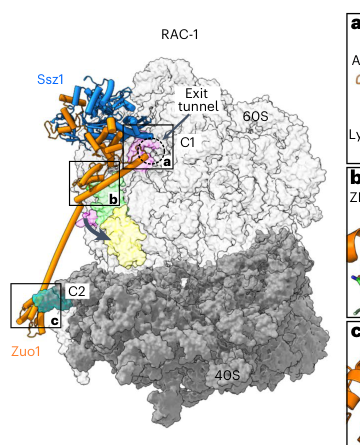

## Question

# Gene Research for Functional Annotation

## ⚠️ CRITICAL: Gene/Protein Identification Context

**BEFORE YOU BEGIN RESEARCH:** You MUST verify you are researching the CORRECT gene/protein. Gene symbols can be ambiguous, especially for less well-characterized genes from non-model organisms.

### Target Gene/Protein Identity (from UniProt):
- **UniProt Accession:** P38788
- **Protein Description:** RecName: Full=Ribosome-associated complex subunit SSZ1; AltName: Full=DnaK-related protein SSZ1; AltName: Full=Heat shock protein 70 homolog SSZ1; AltName: Full=Pleiotropic drug resistance protein 13;
- **Gene Information:** Name=SSZ1; Synonyms=PDR13; OrderedLocusNames=YHR064C;
- **Organism (full):** Saccharomyces cerevisiae (strain ATCC 204508 / S288c) (Baker's yeast).
- **Protein Family:** Belongs to the heat shock protein 70 family. .
- **Key Domains:** ATPase_NBD. (IPR043129); HSP70_peptide-bd_sf. (IPR029047); Hsp_70_fam. (IPR013126); HSP70 (PF00012)

### MANDATORY VERIFICATION STEPS:

1. **Check if the gene symbol "SSZ1" matches the protein description above**
2. **Verify the organism is correct:** Saccharomyces cerevisiae (strain ATCC 204508 / S288c) (Baker's yeast).
3. **Check if protein family/domains align with what you find in literature**
4. **If you find literature for a DIFFERENT gene with the same or similar symbol, STOP**

### If Gene Symbol is Ambiguous or You Cannot Find Relevant Literature:

**DO NOT PROCEED WITH RESEARCH ON A DIFFERENT GENE.** Instead:
- State clearly: "The gene symbol 'SSZ1' is ambiguous or literature is limited for this specific protein"
- Explain what you found (e.g., "Found extensive literature on a different gene with the same symbol in a different organism")
- Describe the protein based ONLY on the UniProt information provided above
- Suggest that the protein function can be inferred from domain/family information

### Research Target:

Please provide a comprehensive research report on the gene **SSZ1** (gene ID: SSZ1, UniProt: P38788) in yeast.

The research report should be a detailed narrative explaining the function, biological processes, and localization of the gene product. Citations should be given for all claims.

You should prioritize authoritative reviews and primary scientific literature when conducting research. You can supplement
this with annotations you find in gene/protein databases, but these can be outdated or inaccurate.

We are specifically interested in the primary function of the gene - for enzymes, what reaction is catalyzed, and what is the substrate specificity? For transporters, what is the substrate? For structural proteins or adapters, what is the broader structural role? For signaling molecules, what is the role in the pathway.

We are interested in where in or outside the cell the gene product carries out its function.

We are also interested in the signaling or biochemical pathways in which the gene functions. We are less interested in broad pleiotropic effects, except where these elucidate the precise role.

Include evidence where possible. We are interested in both experimental evidence as well as inference from structure, evolution, or bioinformatic analysis. Precise studies should be prioritized over high-throughput, where available.

## Output

Question: You are an expert researcher providing comprehensive, well-cited information.

Provide detailed information focusing on:
1. Key concepts and definitions with current understanding
2. Recent developments and latest research (prioritize 2023-2024 sources)
3. Current applications and real-world implementations
4. Expert opinions and analysis from authoritative sources
5. Relevant statistics and data from recent studies

Format as a comprehensive research report with proper citations. Include URLs and publication dates where available.
Always prioritize recent, authoritative sources and provide specific citations for all major claims.

# Gene Research for Functional Annotation

## ⚠️ CRITICAL: Gene/Protein Identification Context

**BEFORE YOU BEGIN RESEARCH:** You MUST verify you are researching the CORRECT gene/protein. Gene symbols can be ambiguous, especially for less well-characterized genes from non-model organisms.

### Target Gene/Protein Identity (from UniProt):
- **UniProt Accession:** P38788
- **Protein Description:** RecName: Full=Ribosome-associated complex subunit SSZ1; AltName: Full=DnaK-related protein SSZ1; AltName: Full=Heat shock protein 70 homolog SSZ1; AltName: Full=Pleiotropic drug resistance protein 13;
- **Gene Information:** Name=SSZ1; Synonyms=PDR13; OrderedLocusNames=YHR064C;
- **Organism (full):** Saccharomyces cerevisiae (strain ATCC 204508 / S288c) (Baker's yeast).
- **Protein Family:** Belongs to the heat shock protein 70 family. .
- **Key Domains:** ATPase_NBD. (IPR043129); HSP70_peptide-bd_sf. (IPR029047); Hsp_70_fam. (IPR013126); HSP70 (PF00012)

### MANDATORY VERIFICATION STEPS:

1. **Check if the gene symbol "SSZ1" matches the protein description above**
2. **Verify the organism is correct:** Saccharomyces cerevisiae (strain ATCC 204508 / S288c) (Baker's yeast).
3. **Check if protein family/domains align with what you find in literature**
4. **If you find literature for a DIFFERENT gene with the same or similar symbol, STOP**

### If Gene Symbol is Ambiguous or You Cannot Find Relevant Literature:

**DO NOT PROCEED WITH RESEARCH ON A DIFFERENT GENE.** Instead:
- State clearly: "The gene symbol 'SSZ1' is ambiguous or literature is limited for this specific protein"
- Explain what you found (e.g., "Found extensive literature on a different gene with the same symbol in a different organism")
- Describe the protein based ONLY on the UniProt information provided above
- Suggest that the protein function can be inferred from domain/family information

### Research Target:

Please provide a comprehensive research report on the gene **SSZ1** (gene ID: SSZ1, UniProt: P38788) in yeast.

The research report should be a detailed narrative explaining the function, biological processes, and localization of the gene product. Citations should be given for all claims.

You should prioritize authoritative reviews and primary scientific literature when conducting research. You can supplement
this with annotations you find in gene/protein databases, but these can be outdated or inaccurate.

We are specifically interested in the primary function of the gene - for enzymes, what reaction is catalyzed, and what is the substrate specificity? For transporters, what is the substrate? For structural proteins or adapters, what is the broader structural role? For signaling molecules, what is the role in the pathway.

We are interested in where in or outside the cell the gene product carries out its function.

We are also interested in the signaling or biochemical pathways in which the gene functions. We are less interested in broad pleiotropic effects, except where these elucidate the precise role.

Include evidence where possible. We are interested in both experimental evidence as well as inference from structure, evolution, or bioinformatic analysis. Precise studies should be prioritized over high-throughput, where available.

# Research Report: Functional Annotation of **SSZ1 (UniProt P38788; YHR064C; synonym PDR13)** in *Saccharomyces cerevisiae* (S288c)

## 1) Target verification (gene/protein identity)
The literature retrieved for **SSZ1** is consistent with UniProt **P38788** from *Saccharomyces cerevisiae* (S288c): an **Hsp70-family, noncanonical/atypical Hsp70** named **Ssz1**, encoded by **SSZ1 (YHR064C; synonym PDR13)**, functioning as the Hsp70 subunit of the **ribosome-associated complex (RAC)** together with the J-domain protein **Zuo1/Zuotin**. (gautschi2002afunctionalchaperone pages 1-1, conz2007functionalcharacterizationof pages 2-3, kisonaite2023structuralinventoryof pages 1-2)

## 2) Key concepts and definitions (current understanding)

### 2.1 Ribosome-associated complex (RAC) and the “ribosome chaperone triad”
In budding yeast, **RAC** is a stable heterodimeric chaperone complex at the ribosomal tunnel exit composed of **Zuo1 (Hsp40/J-domain protein)** and **Ssz1 (atypical Hsp70)**; RAC cooperates with the ribosome-bound canonical Hsp70 **Ssb1/2** to form a **functional chaperone triad** that supports early nascent-chain handling and cotranslational folding. (gautschi2002afunctionalchaperone pages 1-1, lee2021pathwayofhsp70 pages 1-2, kisonaite2023structuralinventoryof pages 1-2)

A central functional definition supported by biochemical crosslinking is that **efficient engagement of nascent chains by Ssb depends on functional RAC**, consistent with RAC acting as a co-chaperone/positioning and activation module for Ssb on translating ribosomes. (gautschi2002afunctionalchaperone pages 1-1)

### 2.2 Noncanonical Hsp70 behavior of Ssz1
Unlike canonical Hsp70s, **Ssz1 binds nucleotide but is not detectably ATP-hydrolyzing** in vitro, and key parts of canonical Hsp70 functional logic are rewired: **ATP hydrolysis—and even ATP binding—can be largely dispensable in vivo** depending on the mutational context, implying Ssz1’s primary role is not a classic ATP-driven foldase cycle. (conz2007functionalcharacterizationof pages 2-3, peisker2010theribosomeboundhsp70 pages 1-2)

Structural work further supports that Ssz1 is noncanonical in domain architecture (e.g., truncated substrate-binding region and altered linker features compared with canonical Hsp70s), consistent with a specialized role in RAC rather than a generic Hsp70 chaperone cycle. (kisonaite2023structuralinventoryof pages 1-2)

## 3) Molecular function, biological processes, and localization

### 3.1 Molecular function (mechanistic role at the tunnel exit)
**Primary function (experimentally supported):** Ssz1 operates as part of **RAC** to organize and regulate cotranslational chaperoning at the ribosomal exit tunnel, including **recruitment/positioning of Ssb** and **transient nascent-chain binding/relay**.

A mechanistic “relay” model with concrete timing/length landmarks was supported by combined structural/biochemical analysis: nascent chains interact in sequence with RAC/Ssb as they emerge from the tunnel—approximately **~40 amino acids** (Zuo1 contact), **~45 aa** (Ssz1 contact), and **~50 aa** (Ssb engagement). (zhang2020theribosomeassociatedcomplex pages 8-9)

Consistent with this, the translation elongation rate contextualizing these interaction windows was given as **~3–6 residues/second** in the same mechanistic discussion. (zhang2020theribosomeassociatedcomplex pages 8-9)

### 3.2 Key partners and complex architecture
Ssz1 forms a stable heterodimer with **Zuo1**, and this RAC module cooperates with **Ssb1/2** (canonical Hsp70s) at the ribosome to support cotranslational folding. (gautschi2002afunctionalchaperone pages 1-1, lee2021pathwayofhsp70 pages 1-2, kisonaite2023structuralinventoryof pages 1-2)

A 2021 in vivo site-specific crosslinking study provides a concrete interaction pathway: **Ssb(ATP) heterodimerizes with Ssz1**, placing Ssb in the correct neighborhood for Zuo1 J-domain action; after ATP hydrolysis, **Ssb(ADP)** shifts to interact more directly with the ribosome, while Ssz1 can recruit another Ssb(ATP). (lee2021pathwayofhsp70 pages 1-2)

### 3.3 Subcellular localization and stoichiometry on ribosomes
RAC is a **ribosome-associated** system localized near the **60S subunit tunnel exit region**, with Zuo1 anchoring RAC at the ribosome and Ssz1 tethered through Zuo1. (gautschi2002afunctionalchaperone pages 1-1, lee2021pathwayofhsp70 pages 1-2, ziegelhoffer2024nacandzuotinhsp70 pages 1-2)

Recent quantitative stoichiometry estimates in vivo indicate RAC occupancy of roughly **~0.3–0.5 RAC per ribosome**, while the nascent chain–associated complex (NAC) can be present at about **~1:1 NAC:ribosome**. (ziegelhoffer2024nacandzuotinhsp70 pages 1-2)

A 2023 cryo-EM structural depiction of RAC bound to the 80S ribosome visually supports the spatial placement of **Ssz1 and Zuo1** relative to the ribosome and tunnel exit region. (kisonaite2023structuralinventoryof media 1d346c7e, kisonaite2023structuralinventoryof media 573700ab)

## 4) Phenotypes and functional readouts (statistics/data)

### 4.1 Growth and stress-related phenotypes
Loss of SSZ1 causes **slow growth and cold sensitivity**, phenotypes shared with loss of Zuo1 or Ssb1/2, consistent with action in a common ribosome-associated chaperone pathway. (gautschi2002afunctionalchaperone pages 1-1, lee2021pathwayofhsp70 pages 1-2, peisker2010theribosomeboundhsp70 pages 1-2)

### 4.2 Translational fidelity phenotypes (aminoglycoside/paromomycin)
Ssz1 contributes to a function related to **translational fidelity**, and defects in Ssz1/RAC are associated with **sensitivity to paromomycin/aminoglycosides** used as translation-fidelity stressors, with evidence for separable (partly independent) roles of Ssz1 in translational fidelity versus general growth/cold sensitivity. (conz2007functionalcharacterizationof pages 2-3, conz2007functionalcharacterizationof pages 5-6)

### 4.3 Separation-of-function evidence (domain cooperation)
A key functional-annotation point is that Ssz1’s domains can compensate for each other to some extent: a **C-terminal truncation** that fails to bind Zuo1 stably and does not bind ribosomes can still complement slow-growth/cold-sensitivity phenotypes, while being only partially functional on paromomycin; combining **defects in nucleotide binding** and truncation abolishes function, supporting a **two-domain cooperation model** in vivo. (conz2007functionalcharacterizationof pages 5-6)

## 5) Recent developments (prioritizing 2023–2024)

### 5.1 2023 structural inventory: dynamic RAC on the 80S ribosome
**Kišonaitė et al. (publication date: Jun 2023; URL: https://doi.org/10.1038/s41594-023-00973-1)** provided high-resolution cryo-EM structures of RAC on 80S ribosomes (in a fungal system) that clarify conserved architecture relevant to yeast Ssz1: RAC adopts **multiple conformations** compatible with ribosomal rotation, and the **noncanonical Ssz1–Zuo1 interface** and masking of Zuo1’s HPD motif by the Ssz1 NBD help rationalize how RAC positions and regulates Ssb engagement. (kisonaite2023structuralinventoryof pages 1-2)

### 5.2 2023 cell physiology: RAC/Ssb in TORC1-linked proteostasis
**Black et al. (publication date: Nov 2023; URL: https://doi.org/10.15252/embj.2022113240)** linked the ribosome-associated chaperone system to signaling-dependent proteostasis: the **RAC/Ssb system** is required to maintain proteostasis and viability under **TORC1 inhibition**, and disrupting the RAC system perturbs translation downregulation and downstream proteostasis programs. Although the work emphasizes Zuo1, it defines RAC explicitly as **Zuo1 + Ssz1** and treats Ssz1 as the RAC Hsp70 subunit in the same functional module. (black2023theribosome‐associatedchaperone pages 1-2)

### 5.3 2024 tunnel-exit organization: coexistence of NAC and RAC/Zuotin–Hsp70
**Ziegelhoffer et al. (publication date: Jan 2024; URL: https://doi.org/10.1093/nar/gkae005)** used in vivo site-specific crosslinking to address how abundant tunnel-exit factors coexist. They found that **NAC and the Zuotin/Hsp70 system** can **coexist at the ribosome tunnel exit** and even crosslink to each other, revising a strict mutual-exclusion picture and supporting a more dynamic model in vivo. This work also reports the **RAC:ribosome** stoichiometry (~0.3–0.5:1) that is useful for systems-level modeling of cotranslational proteostasis. (ziegelhoffer2024nacandzuotinhsp70 pages 1-2, ziegelhoffer2024nacandzuotinhsp70 pages 6-8)

## 6) Pathways and broader biological implications

### 6.1 Cotranslational proteostasis pathway at the tunnel exit
Mechanistic work supports the view that Ssz1 is an **active participant** in cotranslational chaperoning rather than merely a scaffold: in the relay model, Ssz1’s rudimentary substrate-binding features support **transient, low-affinity interactions** with emerging nascent chains that help channel substrates toward productive Ssb capture. (zhang2020theribosomeassociatedcomplex pages 8-9)

Additionally, a Zuo1 **LP motif** can bind the Ssz1 SBD as a **pseudo-substrate**, competing with nascent chain binding and modulating forward transfer to Ssb—an example of internal regulatory logic built into RAC architecture. (zhang2020theribosomeassociatedcomplex pages 8-9)

### 6.2 Prion/aggregation biology
RAC has been implicated in **antagonizing prion formation** (e.g., effects on [PSI+]) through its role in cotranslational folding and nascent-chain quality control; deletions/mutations in RAC components can increase spontaneous/induced prion formation and sensitivity to aggregation-prone proteins, consistent with RAC acting as a protective early folding system. (amor2015theribosomeassociatedcomplex pages 32-36)

### 6.3 Drug resistance and the PDR13 synonym (interpretation)
The synonym **PDR13** reflects a historical connection of SSZ1 to **pleiotropic drug resistance (PDR)** regulatory phenotypes; however, the strongest mechanistic evidence in this evidence set supports Ssz1’s **primary role as a ribosome-associated chaperone component** rather than a transporter or enzyme, and any PDR-related phenotypes should be interpreted through indirect proteostasis/translational effects unless supported by pathway-specific experiments. (amor2015theribosomeassociatedcomplex pages 32-36)

## 7) Current applications and real-world implementations

1. **Model system for cotranslational proteostasis:** SSZ1 deletion/mutant strains are used to probe how cotranslational chaperones shape nascent protein folding, translational fidelity (e.g., aminoglycoside/paromomycin sensitivity), and downstream stress responses. (conz2007functionalcharacterizationof pages 2-3, conz2007functionalcharacterizationof pages 5-6)
2. **Mechanistic platform for tunnel-exit factor organization:** Recent in vivo crosslinking approaches explicitly map how RAC/Zuotin–Hsp70 systems and NAC can occupy and function at the tunnel exit simultaneously—informing general principles that extend to eukaryotic proteostasis and ribosome biology. (ziegelhoffer2024nacandzuotinhsp70 pages 1-2, ziegelhoffer2024nacandzuotinhsp70 pages 6-8)
3. **Proteostasis–signaling integration:** TORC1 inhibition studies provide a framework to connect ribosome-associated chaperoning (RAC/Ssb) to systems-level translation control and proteostasis maintenance, relevant to industrial and biomedical contexts where translation capacity and protein quality control must be balanced. (black2023theribosome‐associatedchaperone pages 1-2)

## 8) Expert synthesis and analysis (authoritative interpretation anchored in primary data)

The accumulated evidence supports a coherent functional annotation: **Ssz1 is a specialized, noncanonical Hsp70 that has evolved to function within RAC as a ribosome-exit chaperone regulator and substrate relay factor**. Multiple independent lines of evidence converge on this view: (i) genetic epistasis/phenotypic similarity across SSZ1/ZUO1/SSB1/2, (ii) biochemical crosslinking dependence of Ssb–nascent-chain engagement on RAC, (iii) in vivo crosslinking showing a defined Ssb↔Ssz1 interaction pathway, and (iv) structural elucidation of a distinctive Ssz1–Zuo1 interface adapted for ribosome-associated action rather than canonical Hsp70 cycling. (gautschi2002afunctionalchaperone pages 1-1, lee2021pathwayofhsp70 pages 1-2, conz2007functionalcharacterizationof pages 5-6, kisonaite2023structuralinventoryof pages 1-2)

A key modern refinement is that Ssz1 is not merely “non-ATPase Hsp70”: rather, Ssz1 contributes **active substrate-handling logic** (transient nascent-chain binding plus pseudo-substrate competition via Zuo1’s LP motif) that can tune flux from the ribosome exit to Ssb capture. This provides a plausible mechanistic bridge from molecular events at ~40–50 aa emergence to organism-level phenotypes such as cold sensitivity and translation-fidelity defects under aminoglycoside stress. (zhang2020theribosomeassociatedcomplex pages 8-9, conz2007functionalcharacterizationof pages 5-6)

## Summary table
The following table compiles the main functional claims, key mechanistic details (including quantitative values), evidence types, and DOI URLs.

| Functional aspect | Key details | Evidence type | Key references |
|---|---|---|---|
| Molecular identity | **SSZ1 / YHR064C / PDR13** encodes an **atypical/noncanonical Hsp70-family protein** in *Saccharomyces cerevisiae* that functions as the Hsp70 subunit of the **ribosome-associated complex (RAC)** rather than as a typical standalone Hsp70 (gautschi2002afunctionalchaperone pages 1-1, conz2007functionalcharacterizationof pages 2-3, kisonaite2023structuralinventoryof pages 1-2) | Biochemical, genetic, structural, review | Gautschi et al., 2002, https://doi.org/10.1073/pnas.062048599; Conz et al., 2007, https://doi.org/10.1074/jbc.M706737200; Kišonaitė et al., 2023, https://doi.org/10.1038/s41594-023-00973-1 |
| Core complex/partners | Ssz1 forms a **stable 1:1 heterodimer with Zuo1/Zuotin** (RAC); RAC works together with **Ssb1/2** as a fungal ribosome-bound chaperone triad for nascent-chain handling (gautschi2002afunctionalchaperone pages 1-1, lee2021pathwayofhsp70 pages 1-2, kisonaite2023structuralinventoryof pages 1-2) | Biochemical, genetic, structural, crosslinking | Gautschi et al., 2002, https://doi.org/10.1073/pnas.062048599; Lee et al., 2021, https://doi.org/10.1038/s41467-021-25930-8; Kišonaitė et al., 2023, https://doi.org/10.1038/s41594-023-00973-1 |
| Subcellular localization | RAC is **largely/almost entirely ribosome-associated** and positioned at the **60S tunnel-exit region**; Zuo1 anchors the complex, while Ssz1 is tethered through Zuo1. RAC abundance was reported at about **0.3–0.5 RAC per ribosome**, versus roughly **1:1 NAC:ribosome** for comparison (gautschi2002afunctionalchaperone pages 1-1, lee2021pathwayofhsp70 pages 1-2, ziegelhoffer2024nacandzuotinhsp70 pages 1-2, kisonaite2023structuralinventoryof media 1d346c7e) | Ribosome biochemistry, cryo-EM, in vivo crosslinking | Gautschi et al., 2002, https://doi.org/10.1073/pnas.062048599; Lee et al., 2021, https://doi.org/10.1038/s41467-021-25930-8; Ziegelhoffer et al., 2024, https://doi.org/10.1093/nar/gkae005; Kišonaitė et al., 2023, https://doi.org/10.1038/s41594-023-00973-1 |
| ATPase/nucleotide properties | Ssz1 **binds nucleotide but does not hydrolyze ATP** detectably; ATP hydrolysis is **dispensable in vivo**, and even ATP-binding defects can be tolerated unless combined with other disabling mutations (conz2007functionalcharacterizationof pages 2-3, peisker2010theribosomeboundhsp70 pages 1-2, kisonaite2023structuralinventoryof pages 1-2) | Biochemical ATPase assays, mutagenesis, genetics | Conz et al., 2007, https://doi.org/10.1074/jbc.M706737200; Peisker et al., 2010, https://doi.org/10.1016/j.bbamcr.2010.03.005; Kišonaitė et al., 2023, https://doi.org/10.1038/s41594-023-00973-1 |
| Domain architecture / noncanonical features | Ssz1 has a **noncanonical Hsp70 architecture**: truncated/rudimentary **SBD-β**, lacks the usual **SBD-α lid** and conserved linker, and uses an extended linker intertwined with the **Zuo1 N terminus** to stabilize RAC (kisonaite2023structuralinventoryof pages 1-2) | Cryo-EM, structural analysis | Kišonaitė et al., 2023, https://doi.org/10.1038/s41594-023-00973-1; Zhang et al., 2020, https://doi.org/10.1038/s41467-020-15313-w |
| Mechanistic role in cotranslational folding | Current model: Ssz1 is not just structural; via its rudimentary SBD it **directly and transiently binds emerging nascent chains** and helps **relay** them from RAC to Ssb. Nascent chains contact Zuo1 at ~**40 aa**, Ssz1 at ~**45 aa**, and Ssb by ~**50 aa** after emergence; this supports early cotranslational folding at a translation rate of about **3–6 aa/s** (zhang2020theribosomeassociatedcomplex pages 8-9, gautschi2002afunctionalchaperone pages 1-1, kisonaite2023structuralinventoryof pages 1-2) | Crosslinking, structural biochemistry, mechanistic model | Zhang et al., 2020, https://doi.org/10.1038/s41467-020-15313-w; Gautschi et al., 2002, https://doi.org/10.1073/pnas.062048599; Kišonaitė et al., 2023, https://doi.org/10.1038/s41594-023-00973-1 |
| Zuo1 interaction and pseudo-substrate mechanism | A conserved **LP motif** in Zuo1 binds the Ssz1 **SBD-β** as a **pseudo-substrate**; this competes with nascent-chain binding and is proposed to promote **forward transfer to Ssb** (zhang2020theribosomeassociatedcomplex pages 8-9) | X-ray/structural biochemistry, crosslinking | Zhang et al., 2020, https://doi.org/10.1038/s41467-020-15313-w |
| Ssb recruitment/activation pathway | Zuo1 binds the ribosome and Ssz1; **Ssz1 transiently heterodimerizes with Ssb(ATP)**, positioning Ssb near the tunnel exit. Zuo1’s J-domain then stimulates **Ssb ATP hydrolysis**, after which Ssb(ADP) engages the ribosome/nascent chain more stably and Ssz1 is freed to recruit another Ssb(ATP) (lee2021pathwayofhsp70 pages 1-2, kisonaite2023structuralinventoryof pages 1-2, ziegelhoffer2024nacandzuotinhsp70 pages 6-8) | In vivo site-specific crosslinking, structural modeling | Lee et al., 2021, https://doi.org/10.1038/s41467-021-25930-8; Zhang et al., 2020, https://doi.org/10.1038/s41467-020-15313-w; Ziegelhoffer et al., 2024, https://doi.org/10.1093/nar/gkae005 |
| Structural regulation of Zuo1 J-domain | Cryo-EM indicates the conserved **HPD motif** of the Zuo1 J-domain is **masked by the Ssz1 NBD** in RAC, a noncanonical arrangement thought to position Ssb for productive activation rather than reflect a classical Hsp70–JDP interaction (kisonaite2023structuralinventoryof pages 1-2) | Cryo-EM, structural interpretation | Kišonaitė et al., 2023, https://doi.org/10.1038/s41594-023-00973-1; Zhang et al., 2020, https://doi.org/10.1038/s41467-020-15313-w |
| Translation fidelity | Ssz1 contributes to **accurate translation**; RAC/Ssz1 defects produce **paromomycin/aminoglycoside sensitivity** and translational-fidelity phenotypes. Conz et al. concluded Ssz1 participates in a process related specifically to **translational fidelity** that is partly separable from growth phenotypes (conz2007functionalcharacterizationof pages 2-3, conz2007functionalcharacterizationof pages 5-6) | Genetic phenotype assays | Conz et al., 2007, https://doi.org/10.1074/jbc.M706737200; Kim & Craig, 2005, https://doi.org/10.1128/EC.4.1.82-89.2005 |
| Growth phenotypes | Loss of SSZ1 causes **slow growth** and **cold sensitivity**, phenotypes shared with loss of Zuo1 or Ssb1/2, supporting function in a common pathway/triad (gautschi2002afunctionalchaperone pages 1-1, lee2021pathwayofhsp70 pages 1-2, peisker2010theribosomeboundhsp70 pages 1-2) | Genetics, phenotypic complementation | Gautschi et al., 2002, https://doi.org/10.1073/pnas.062048599; Lee et al., 2021, https://doi.org/10.1038/s41467-021-25930-8; Peisker et al., 2010, https://doi.org/10.1016/j.bbamcr.2010.03.005 |
| Separation-of-function observations | A C-terminally truncated Ssz1 that does **not stably bind Zuo1 or ribosomes** can still complement **slow-growth/cold-sensitive** phenotypes but is only partly functional on **paromomycin**, whereas combined defects in nucleotide binding plus C-terminal truncation abolish function (conz2007functionalcharacterizationof pages 5-6) | Mutagenesis, complementation genetics | Conz et al., 2007, https://doi.org/10.1074/jbc.M706737200 |
| Relation to NAC at tunnel exit | Recent in vivo crosslinking supports that **NAC and RAC/Zuotin–Hsp70 can coexist simultaneously** at the ribosome tunnel exit rather than being strictly mutually exclusive; productive Ssb positioning remains possible in NAC’s presence (ziegelhoffer2024nacandzuotinhsp70 pages 1-2, ziegelhoffer2024nacandzuotinhsp70 pages 6-8) | In vivo site-specific crosslinking, structural modeling | Ziegelhoffer et al., 2024, https://doi.org/10.1093/nar/gkae005 |
| TORC1/proteostasis link | RAC/Ssb is required for appropriate **translation downregulation and proteostasis during TORC1 inhibition**. Although the 2023 study centered on Zuo1, it explicitly treats Ssz1 as the RAC Hsp70 subunit in the same ribosome-exit machinery needed for survival under rapamycin/TORC1 stress (black2023theribosome‐associatedchaperone pages 1-2) | Cell biology, genetics, signaling/proteostasis assays | Black et al., 2023, https://doi.org/10.15252/embj.2022113240 |
| Prion biology / anti-prion role | RAC antagonizes prion formation: loss of RAC components increases spontaneous/induced prion formation and sensitivity to aggregation-prone proteins. Reviews and primary work place Ssz1 within this **anti-prion/proteostasis network** acting through cotranslational chaperoning with Zuo1/Ssb (amor2015theribosomeassociatedcomplex pages 32-36) | Prion assays, review of primary literature | Amor et al., 2015, https://doi.org/10.1080/19336896.2015.1022022 |
| Drug resistance / PDR connection | Ssz1’s historical synonym **PDR13** reflects links to **pleiotropic drug resistance**. The RAC system has been implicated in regulating Pdr1/PDR pathways in yeast literature, but the strongest mechanistic evidence in the gathered set supports Ssz1 primarily as a **ribosome-associated cotranslational chaperone**, not a transporter or enzyme (amor2015theribosomeassociatedcomplex pages 32-36) | Genetic/functional linkage, literature synthesis | Amor et al., 2015, https://doi.org/10.1080/19336896.2015.1022022 |
| Functional conservation | Heterologous **mammalian RAC** can complement **yeast Δzuo1Δssz1 growth defects**, supporting conservation of core RAC function despite fungal specialization of the Ssz1/Ssb system (zhang2020theribosomeassociatedcomplex pages 8-9) | Functional complementation | Zhang et al., 2020, https://doi.org/10.1038/s41467-020-15313-w |

*Table: This table summarizes experimentally supported functional annotation for Saccharomyces cerevisiae Ssz1/SSZ1, including its molecular role in RAC, ribosome localization, mechanistic links to cotranslational folding, and major phenotypes. It maps each claim to evidence type and key DOI-linked references, with inline context citations for traceability.*

## Key references (publication dates and URLs)
- **Gautschi et al.** “A functional chaperone triad on the yeast ribosome.” *PNAS* (Apr **2002**). https://doi.org/10.1073/pnas.062048599 (gautschi2002afunctionalchaperone pages 1-1)
- **Conz et al.** “Functional Characterization of the Atypical Hsp70 Subunit of Yeast Ribosome-associated Complex.” *J Biol Chem* (Nov **2007**). https://doi.org/10.1074/jbc.M706737200 (conz2007functionalcharacterizationof pages 2-3, conz2007functionalcharacterizationof pages 5-6)
- **Zhang et al.** “The ribosome-associated complex RAC serves in a relay that directs nascent chains to Ssb.” *Nat Commun* (Mar **2020**). https://doi.org/10.1038/s41467-020-15313-w (zhang2020theribosomeassociatedcomplex pages 8-9)
- **Lee et al.** “Pathway of Hsp70 interactions at the ribosome.” *Nat Commun* (Sep **2021**). https://doi.org/10.1038/s41467-021-25930-8 (lee2021pathwayofhsp70 pages 1-2)
- **Kišonaitė et al.** “Structural inventory of cotranslational protein folding by the eukaryotic RAC complex.” *Nat Struct Mol Biol* (Jun **2023**). https://doi.org/10.1038/s41594-023-00973-1 (kisonaite2023structuralinventoryof pages 1-2, kisonaite2023structuralinventoryof media 1d346c7e, kisonaite2023structuralinventoryof media 573700ab)
- **Black et al.** “The ribosome-associated chaperone Zuo1 controls translation upon TORC1 inhibition.” *EMBO J* (Nov **2023**). https://doi.org/10.15252/embj.2022113240 (black2023theribosome‐associatedchaperone pages 1-2)
- **Ziegelhoffer et al.** “NAC and Zuotin/Hsp70 chaperone systems coexist at the ribosome tunnel exit in vivo.” *Nucleic Acids Res* (Jan **2024**). https://doi.org/10.1093/nar/gkae005 (ziegelhoffer2024nacandzuotinhsp70 pages 1-2, ziegelhoffer2024nacandzuotinhsp70 pages 6-8)

References

1. (gautschi2002afunctionalchaperone pages 1-1): Matthias Gautschi, Andrej Mun, Suzanne Ross, and Sabine Rospert. A functional chaperone triad on the yeast ribosome. Proceedings of the National Academy of Sciences of the United States of America, 99:4209-4214, Apr 2002. URL: https://doi.org/10.1073/pnas.062048599, doi:10.1073/pnas.062048599. This article has 224 citations and is from a highest quality peer-reviewed journal.

2. (conz2007functionalcharacterizationof pages 2-3): Charlotte Conz, Hendrik Otto, Kristin Peisker, Matthias Gautschi, Tina Wölfle, Matthias P. Mayer, and Sabine Rospert. Functional characterization of the atypical hsp70 subunit of yeast ribosome-associated complex*. Journal of Biological Chemistry, 282:33977-33984, Nov 2007. URL: https://doi.org/10.1074/jbc.m706737200, doi:10.1074/jbc.m706737200. This article has 61 citations and is from a domain leading peer-reviewed journal.

3. (kisonaite2023structuralinventoryof pages 1-2): Miglė Kišonaitė, Klemens Wild, Karine Lapouge, Genís Valentín Gesé, Nikola Kellner, Ed Hurt, and Irmgard Sinning. Structural inventory of cotranslational protein folding by the eukaryotic rac complex. Nature Structural & Molecular Biology, 30:670-677, Jun 2023. URL: https://doi.org/10.1038/s41594-023-00973-1, doi:10.1038/s41594-023-00973-1. This article has 26 citations and is from a highest quality peer-reviewed journal.

4. (lee2021pathwayofhsp70 pages 1-2): Kanghyun Lee, Thomas Ziegelhoffer, Wojciech Delewski, Scott E. Berger, Grzegorz Sabat, and Elizabeth A. Craig. Pathway of hsp70 interactions at the ribosome. Nature Communications, Sep 2021. URL: https://doi.org/10.1038/s41467-021-25930-8, doi:10.1038/s41467-021-25930-8. This article has 31 citations and is from a highest quality peer-reviewed journal.

5. (peisker2010theribosomeboundhsp70 pages 1-2): Kristin Peisker, Marco Chiabudini, and Sabine Rospert. The ribosome-bound hsp70 homolog ssb of saccharomyces cerevisiae. Biochimica et biophysica acta, 1803 6:662-72, Jun 2010. URL: https://doi.org/10.1016/j.bbamcr.2010.03.005, doi:10.1016/j.bbamcr.2010.03.005. This article has 86 citations.

6. (zhang2020theribosomeassociatedcomplex pages 8-9): Ying Zhang, Genís Valentín Gesé, Charlotte Conz, Karine Lapouge, Jürgen Kopp, Tina Wölfle, Sabine Rospert, and Irmgard Sinning. The ribosome-associated complex rac serves in a relay that directs nascent chains to ssb. Nature Communications, Mar 2020. URL: https://doi.org/10.1038/s41467-020-15313-w, doi:10.1038/s41467-020-15313-w. This article has 50 citations and is from a highest quality peer-reviewed journal.

7. (ziegelhoffer2024nacandzuotinhsp70 pages 1-2): Thomas Ziegelhoffer, Amit K Verma, Wojciech Delewski, Brenda A Schilke, Paige M Hill, Marcin Pitek, Jaroslaw Marszalek, and Elizabeth A Craig. Nac and zuotin/hsp70 chaperone systems coexist at the ribosome tunnel exit in vivo. Nucleic Acids Research, 52:3346-3357, Jan 2024. URL: https://doi.org/10.1093/nar/gkae005, doi:10.1093/nar/gkae005. This article has 4 citations and is from a highest quality peer-reviewed journal.

8. (kisonaite2023structuralinventoryof media 1d346c7e): Miglė Kišonaitė, Klemens Wild, Karine Lapouge, Genís Valentín Gesé, Nikola Kellner, Ed Hurt, and Irmgard Sinning. Structural inventory of cotranslational protein folding by the eukaryotic rac complex. Nature Structural & Molecular Biology, 30:670-677, Jun 2023. URL: https://doi.org/10.1038/s41594-023-00973-1, doi:10.1038/s41594-023-00973-1. This article has 26 citations and is from a highest quality peer-reviewed journal.

9. (kisonaite2023structuralinventoryof media 573700ab): Miglė Kišonaitė, Klemens Wild, Karine Lapouge, Genís Valentín Gesé, Nikola Kellner, Ed Hurt, and Irmgard Sinning. Structural inventory of cotranslational protein folding by the eukaryotic rac complex. Nature Structural & Molecular Biology, 30:670-677, Jun 2023. URL: https://doi.org/10.1038/s41594-023-00973-1, doi:10.1038/s41594-023-00973-1. This article has 26 citations and is from a highest quality peer-reviewed journal.

10. (conz2007functionalcharacterizationof pages 5-6): Charlotte Conz, Hendrik Otto, Kristin Peisker, Matthias Gautschi, Tina Wölfle, Matthias P. Mayer, and Sabine Rospert. Functional characterization of the atypical hsp70 subunit of yeast ribosome-associated complex*. Journal of Biological Chemistry, 282:33977-33984, Nov 2007. URL: https://doi.org/10.1074/jbc.m706737200, doi:10.1074/jbc.m706737200. This article has 61 citations and is from a domain leading peer-reviewed journal.

11. (black2023theribosome‐associatedchaperone pages 1-2): Ailsa Black, Thomas D Williams, Flavie Soubigou, Ifeoluwapo M Joshua, Houjiang Zhou, Frederic Lamoliatte, and Adrien Rousseau. The ribosome‐associated chaperone zuo1 controls translation upon torc1 inhibition. The EMBO Journal, Nov 2023. URL: https://doi.org/10.15252/embj.2022113240, doi:10.15252/embj.2022113240. This article has 11 citations.

12. (ziegelhoffer2024nacandzuotinhsp70 pages 6-8): Thomas Ziegelhoffer, Amit K Verma, Wojciech Delewski, Brenda A Schilke, Paige M Hill, Marcin Pitek, Jaroslaw Marszalek, and Elizabeth A Craig. Nac and zuotin/hsp70 chaperone systems coexist at the ribosome tunnel exit in vivo. Nucleic Acids Research, 52:3346-3357, Jan 2024. URL: https://doi.org/10.1093/nar/gkae005, doi:10.1093/nar/gkae005. This article has 4 citations and is from a highest quality peer-reviewed journal.

13. (amor2015theribosomeassociatedcomplex pages 32-36): Alvaro J Amor, Dominic T Castanzo, Sean P Delany, Daniel M Selechnik, Alex van Ooy, and Dale M Cameron. The ribosome-associated complex antagonizes prion formation in yeast. Prion, 9:144-164, Mar 2015. URL: https://doi.org/10.1080/19336896.2015.1022022, doi:10.1080/19336896.2015.1022022. This article has 44 citations and is from a peer-reviewed journal.

## Artifacts

- [Edison artifact artifact-00](SSZ1-deep-research-falcon_artifacts/artifact-00.md)

## Citations

1. gautschi2002afunctionalchaperone pages 1-1
2. kisonaite2023structuralinventoryof pages 1-2
3. zhang2020theribosomeassociatedcomplex pages 8-9
4. conz2007functionalcharacterizationof pages 5-6
5. amor2015theribosomeassociatedcomplex pages 32-36
6. conz2007functionalcharacterizationof pages 2-3
7. PSI+
8. https://doi.org/10.1038/s41594-023-00973-1
9. https://doi.org/10.15252/embj.2022113240
10. https://doi.org/10.1093/nar/gkae005
11. https://doi.org/10.1073/pnas.062048599;
12. https://doi.org/10.1074/jbc.M706737200;
13. https://doi.org/10.1038/s41467-021-25930-8;
14. https://doi.org/10.1093/nar/gkae005;
15. https://doi.org/10.1016/j.bbamcr.2010.03.005;
16. https://doi.org/10.1038/s41594-023-00973-1;
17. https://doi.org/10.1038/s41467-020-15313-w
18. https://doi.org/10.1038/s41467-020-15313-w;
19. https://doi.org/10.1128/EC.4.1.82-89.2005
20. https://doi.org/10.1016/j.bbamcr.2010.03.005
21. https://doi.org/10.1074/jbc.M706737200
22. https://doi.org/10.1080/19336896.2015.1022022
23. https://doi.org/10.1073/pnas.062048599
24. https://doi.org/10.1038/s41467-021-25930-8
25. https://doi.org/10.1073/pnas.062048599,
26. https://doi.org/10.1074/jbc.m706737200,
27. https://doi.org/10.1038/s41594-023-00973-1,
28. https://doi.org/10.1038/s41467-021-25930-8,
29. https://doi.org/10.1016/j.bbamcr.2010.03.005,
30. https://doi.org/10.1038/s41467-020-15313-w,
31. https://doi.org/10.1093/nar/gkae005,
32. https://doi.org/10.15252/embj.2022113240,
33. https://doi.org/10.1080/19336896.2015.1022022,