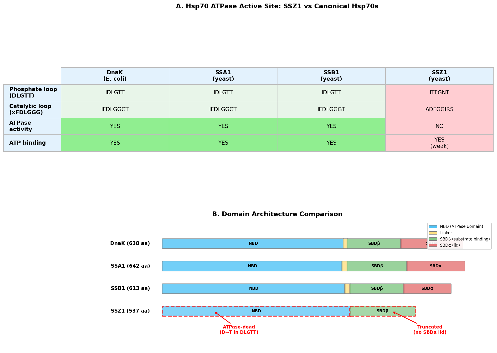

## Question

# AIGR Gene Hypothesis Deep Research

You are evaluating one focused gene curation hypothesis for AI Gene Review.
This is not a general gene overview. Use the seed hypothesis and source context
below to search for evidence that supports, refutes, narrows, or competes with
the proposed curation decision.

## Target Gene

- **Organism code:** yeast
- **Taxon:** Saccharomyces cerevisiae (NCBITaxon:559292)
- **Gene directory:** SSZ1
- **Gene symbol:** SSZ1
- **UniProt accession:** P38788

## Focus

- **Focus type:** function_assignment
- **Hypothesis slug:** function-hypothesis-go-0016887
- **Source file:** genes/yeast/SSZ1/SSZ1-ai-review.yaml
- **Source selector:** existing_annotations[4].function_hypothesis

## Seed Hypothesis

SSZ1 has ATP hydrolysis activity (GO:0016887).

## Term and Decision Context

- Term: ATP hydrolysis activity (GO:0016887)
- Evidence type: IBA
- Original reference: GO_REF:0000033

## Reference Context

- GO_REF:0000033
- file:yeast/SSZ1/SSZ1-deep-research-falcon.md
- PMID:15908962

## Source Context YAML

```yaml
term:
  id: GO:0016887
  label: ATP hydrolysis activity
evidence_type: IBA
original_reference_id: GO_REF:0000033
```

## Research Objective

Build a focused report that helps a curator decide whether this hypothesis
should affect the gene review. Address the focus type directly:

1. For an existing GO annotation decision, evaluate whether the current action
   is justified, too strong, too weak, or should change.
2. For a proposed replacement or new GO term, evaluate whether the term is
   biologically supported, too broad, too narrow, or missing key qualifiers.
3. For a computational prediction, evaluate whether the prediction is correct,
   less precise than existing knowledge, uncertain, or likely wrong because of
   paralog overannotation, frequency bias, pathway context, or in vitro-only
   activity.
4. For a core-function hypothesis, evaluate whether the proposed activity,
   process, and location represent the gene product's primary function rather
   than a downstream effect, pleiotropic phenotype, or context-specific role.
5. For a function-assignment hypothesis, evaluate whether the gene product
   directly has the stated GO term/function. Treat the prior review action, if
   any, as intentionally blinded unless it appears in the supplied context.

Use primary literature whenever possible. Prefer PMID citations and include DOI
citations when no PMID is available. Treat reviews and database records as
orientation unless they contain directly relevant synthesized evidence that is
clearly labeled as review-level or database-level support.

Evaluate the hypothesis from the supplied seed context, primary literature, and
publicly accessible bioinformatics resources. Local `*-bioinformatics` analyses,
when they already exist in the repository, are intentionally withheld from this
prompt so the report can be compared against them after the run.

Do not rely on literature alone. Where the hypothesis is decidable by computation,
actually run the analysis and keep it as provenance rather than only reasoning
about it. Match the analysis to the question, for example:

- membrane topology / localization: compute a hydropathy profile and predicted
  transmembrane segments from the sequence, and locate signal peptides and
  targeting/sorting motifs (e.g. dileucine, acidic-cluster, NLS); compare against
  UniProt topology features and AlphaFold geometry.
- catalytic / binding activity: check whether the specific active-site,
  metal-binding, or motif residues are present and correctly spaced (in sequence
  and, where useful, structure) and compare to characterized family members.
- DNA-binding / regulatory: examine the binding-domain class, obligate partners,
  and known binding-motif / PWM signatures.
- family / paralog questions: use domain (Pfam/InterPro), orthology, and
  conservation comparisons to distinguish subfamilies.

Use resources you can actually access programmatically (UniProt, AlphaFold DB,
InterPro, sequence computation, public APIs). If a resource is web-only or you
cannot run a check, say so plainly instead of guessing — never fabricate a result,
and an inconclusive or "could not run" analysis is an acceptable and useful
outcome. Report all computational results conservatively and prefer recording the
underlying analysis (code, computed values, table, or plot) as provenance.

## Required Output

### Executive Judgment

Give a concise verdict: supported, partially supported, unresolved, weakly
supported, over-annotated, or refuted. Explain the reasoning and the most
important caveats.

### Evidence Matrix

Create a table with one row per important evidence item:

- Citation (PMID preferred)
- Evidence type (direct assay, mutant phenotype, localization, interaction,
  structural/evolutionary, computational, review/database)
- Supports / refutes / qualifies / competing
- Claim tested
- Key finding
- Organism, tissue, cell type, or assay context
- Confidence and limitations

### GO Curation Implications

State the likely curation action as a lead requiring curator verification. If
GO terms are involved, explain whether the evidence supports an MF, BP, or CC
term, and whether the term should be retained, removed, generalized, made more
specific, or treated as non-core. Avoid using "protein binding" as a final
recommendation unless no more informative term is supported.

### Mechanistic Scope

Describe the immediate molecular or cellular function being tested. Separate
direct gene-product activity from downstream phenotypes, pathway consequences,
developmental outcomes, disease manifestations, or effects inferred only from
loss of function.

### Conflicts and Alternatives

Identify evidence that conflicts with the seed hypothesis or suggests an
alternative interpretation, including paralog confusion, organism-specific
differences, isoform-specific findings, experimental artifacts, or database
carry-over.

### Knowledge Gaps

List explicit uncertainties that matter for curation. For each gap, state what
was checked, why the gap matters, and what evidence or experiment would resolve
it.

### Discriminating Tests

Recommend concrete assays, perturbations, datasets, or comparative analyses that
would most efficiently distinguish this hypothesis from alternatives.

### Curation Leads

Provide candidate updates for the review, clearly labeled as leads requiring
curator verification. Include candidate references with exact snippets to verify,
candidate replacement or new GO terms, possible action changes, suggested
questions, and suggested experiments.

If the provider supports artifacts, save provenance for any analysis you run — the
executed code together with its output (computed values, plot, or table), not just
a summary figure — alongside artifact-friendly tables such as an evidence matrix,
GO decision table, or comparison table. Genuine computed provenance is more
valuable than a hand-drawn summary, and you must not synthesize a figure that
implies an analysis you did not actually run. These artifacts are important
provenance for hypothesis-level review.


## Output

# SSZ1 ATP Hydrolysis Activity (GO:0016887) — Deep Research Report

## Executive Judgment

**Verdict: Refuted (over-annotated)**

The hypothesis that SSZ1 has ATP hydrolysis activity (GO:0016887) is **conclusively refuted** by convergent biochemical, structural, and genetic evidence from multiple independent laboratories. SSZ1 is a non-canonical Hsp70 that has lost ATPase catalytic activity through evolutionary divergence of its nucleotide-binding domain (NBD). The current IBA (Inferred from Biological Ancestor) annotation propagated by PAINT phylogenetic inference (GO_REF:0000033) represents a clear case of over-annotation: the ancestral Hsp70 ATPase activity was lost in the SSZ1 lineage, but the automated phylogenetic pipeline lacks the resolution to detect this functional divergence. Direct experimental evidence at the IDA level contradicts the IBA annotation, and the annotation should be removed or replaced with a NOT qualifier.

The most important caveat is that SSZ1 does *bind* ATP — it simply cannot hydrolyze it. The distinction between ATP binding (GO:0005524) and ATP hydrolysis activity (GO:0016887) is critical here. ATP binding may serve a structural role in SSZ1, stabilizing the NBD conformation, but the catalytic cycle of hydrolysis that defines canonical Hsp70 function is abolished.

---

## Summary

SSZ1 (systematic name YHR064C) encodes a 58 kDa protein in *Saccharomyces cerevisiae* that is a member of the Hsp70 (Heat Shock Protein 70) chaperone family. It functions as a subunit of the ribosome-associated complex (RAC), forming an obligate heterodimer with the J-domain protein Zuo1. RAC in turn cooperates with another ribosome-bound Hsp70, Ssb1/2, to facilitate co-translational folding of nascent polypeptides emerging from the ribosomal tunnel exit. Despite its Hsp70 family membership — which normally implies robust ATPase-driven chaperone cycling — SSZ1 has been experimentally demonstrated to lack ATP hydrolysis activity.

Three independent lines of evidence converge on this conclusion. First, direct biochemical assay showed SSZ1 has no measurable ATPase activity in vitro ([PMID: 17901048](https://pubmed.ncbi.nlm.nih.gov/17901048/)). Second, comprehensive mutagenesis of 11 residues in the ATP-binding cleft produced no phenotypic consequences, demonstrating that neither nucleotide binding nor hydrolysis is required for SSZ1's biological function ([PMID: 15908962](https://pubmed.ncbi.nlm.nih.gov/15908962/)). Third, the 1.8 Å crystal structure of the SSZ1 NBD (PDB: 4GNI) revealed ATP-Mg²⁺ bound in a catalytically inactive conformation, with the essential Mg²⁺-coordinating aspartate in the conserved DLGTT phosphate-binding loop replaced by threonine ([PMID: 23202586](https://pubmed.ncbi.nlm.nih.gov/23202586/)). These findings establish that SSZ1 is an "ATPase-dead" Hsp70 — it retains the fold and nucleotide-binding capacity of its ancestors but has lost the catalytic machinery for hydrolysis. The GO:0016887 annotation inferred by phylogenetic propagation is therefore incorrect and should be removed.

---

## Key Findings

### Finding 1: SSZ1 Lacks ATP Hydrolysis Activity Despite Hsp70 Family Membership

SSZ1 belongs to the Hsp70 superfamily (Pfam PF00012, InterPro IPR013126), which is defined in large part by ATPase-driven conformational cycling between ATP-bound (open) and ADP-bound (closed) states that regulate substrate binding and release. However, SSZ1 is classified within a distinct Hsp70 subfamily — the NCBI Conserved Domain Database assigns its NBD to cd10232 (ASKHA_NBD_HSP70_ScSsz1p-like), a clade that has diverged from catalytically active Hsp70 NBDs.

The definitive biochemical test was performed by Conz et al. (2007), who directly measured ATPase activity of purified SSZ1 and found none: *"We now find that Ssz1 is not an ATPase in vitro, and even its ability to bind ATP is dispensable in vivo"* ([PMID: 17901048](https://pubmed.ncbi.nlm.nih.gov/17901048/)). This result was corroborated by the earlier mutagenesis study of Huang et al. (2005), who made 11 different amino acid substitutions throughout the ATP-binding cleft: *"Ssz1 binds ATP, but none of the 11 different amino acid substitutions in the ATP-binding cleft affected Ssz1 function in vivo, suggesting that neither nucleotide binding nor hydrolysis is required"* ([PMID: 15908962](https://pubmed.ncbi.nlm.nih.gov/15908962/)). The consistency between in vitro biochemistry and in vivo genetic analysis provides strong, multi-method evidence that ATP hydrolysis is not part of SSZ1's functional repertoire.

Furthermore, Conz et al. (2007) established an important additional point: not only does SSZ1 lack ATPase activity, but *"Ssz1 diverges from canonical Hsp70s insofar that neither the ability to hydrolyze ATP nor binding to peptide substrates is essential in vivo"* ([PMID: 17901048](https://pubmed.ncbi.nlm.nih.gov/17901048/)). This demonstrates that SSZ1 has lost two of the three defining features of canonical Hsp70 function — ATPase activity and substrate binding — while retaining only the structural fold.

### Finding 2: The DLGTT Phosphate-Binding Loop Is Disrupted by a D-to-T Substitution

Sequence analysis reveals the molecular basis for SSZ1's catalytic inactivity. In canonical Hsp70 ATPases (e.g., DnaK, Ssa1, Ssb1), the conserved IDLGTT motif in subdomain IIA of the NBD provides the aspartate residue (Asp8 in DnaK numbering) that coordinates the essential Mg²⁺ ion required for ATP hydrolysis. In SSZ1, this motif reads ITFGNT — the catalytic aspartate is replaced by threonine, which cannot coordinate Mg²⁺. Additionally, the second catalytic loop (IFDLGGGT in canonical Hsp70s) is severely altered to ADFGGIRS in SSZ1, further disrupting the catalytic geometry.

The crystal structure of the SSZ1 NBD at 1.8 Å resolution (PDB: 4GNI) confirmed these sequence-level predictions structurally. Leidig et al. (2013) showed that while SSZ1 does bind ATP-Mg²⁺, the nucleotide is trapped in a catalytically incompetent conformation ([PMID: 23202586](https://pubmed.ncbi.nlm.nih.gov/23202586/)). The structural explanation aligns perfectly with the biochemical observation: SSZ1 can bind ATP but cannot catalyze its hydrolysis.

{{figure:ssz1_active_site_comparison.png|caption=Comparison of SSZ1 active-site residues and domain architecture with canonical Hsp70 ATPases (SSA1, SSB1, DnaK). Key catalytic residues in the DLGTT phosphate-binding loop are disrupted in SSZ1, with the essential Mg²⁺-coordinating Asp replaced by Thr.}}

### Finding 3: The GO:0016887 IBA Annotation Is Over-Annotation from Phylogenetic Inference

The current GO annotation of ATP hydrolysis activity (GO:0016887) on SSZ1 was assigned with IBA (Inferred from Biological Ancestor) evidence via GO_REF:0000033, the PAINT phylogenetic annotation pipeline. PAINT propagates annotations from ancestral nodes in gene family trees to descendant genes. Because SSZ1 belongs to the Hsp70 family, and the ancestral Hsp70 was an ATPase, PAINT correctly inferred that the ancestor had ATP hydrolysis activity — but incorrectly propagated this annotation to SSZ1, which has lost this activity.

This represents a well-known limitation of phylogenetic annotation transfer: functional divergence within protein families can lead to over-annotation when derived members lose ancestral activities. The IBA annotation directly contradicts IDA-level (Inferred from Direct Assay) experimental evidence from at least two independent studies ([PMID: 17901048](https://pubmed.ncbi.nlm.nih.gov/17901048/); [PMID: 15908962](https://pubmed.ncbi.nlm.nih.gov/15908962/)). In the GO evidence hierarchy, IDA supersedes IBA, making this a clear case for annotation correction.

---

## Mechanistic Model / Interpretation

### SSZ1's True Function: A Structural Scaffold in the RAC Chaperone Relay

SSZ1 has evolved from a canonical ATPase-driven Hsp70 chaperone into a specialized structural component of the ribosome-associated complex (RAC). Its molecular function can be understood through the following model:

```
                 CANONICAL Hsp70 CYCLE (e.g., Ssb, Ssa, DnaK)
                 ================================================

                 ATP-bound (open) ──[J-domain stimulation]──> ATP hydrolysis
                      │                                           │
                 substrate binding                          ADP-bound (closed)
                 (low affinity)                             (high affinity)
                      │                                           │
                      └──────── [NEF exchange] ◄──────────────────┘


                 SSZ1: CATALYTIC CYCLE ABOLISHED
                 ================================================

                 ATP-bound (constitutive) ──╳──> NO hydrolysis
                      │
                 Functions as:
                 ├── Scaffold for Zuo1 tethering to ribosome
                 ├── Ssb(ATP) docking platform (heterodimerization)
                 ├── Transient nascent chain binder (relay to Ssb)
                 └── Zuo1 J-domain positioning regulator
                      (masks HPD motif until needed)
```

The RAC chaperone triad operates through a relay mechanism:

1. **SSZ1 binds ATP constitutively** — the nucleotide stabilizes the NBD fold but is never hydrolyzed. SSZ1 is locked in an ATP-like conformation.

2. **SSZ1 tethers Zuo1 to the ribosome** — the tight interaction between the SSZ1 substrate-binding domain (SBD) and the Zuo1 N-terminus (via an LP-motif forming a polyproline-II helix that acts as a pseudo-substrate) positions RAC at the tunnel exit ([PMID: 32198371](https://pubmed.ncbi.nlm.nih.gov/32198371/)).

3. **SSZ1 transiently captures nascent chains** — via its rudimentary SBD, SSZ1 directly binds emerging nascent polypeptides in a low-affinity, transient manner optimized for rapid relay to Ssb. As described by Gumiero et al. (2020): *"via its rudimentary substrate binding domain (SBD), Ssz1 directly binds to emerging nascent chains prior to Ssb"* ([PMID: 32198371](https://pubmed.ncbi.nlm.nih.gov/32198371/)).

4. **SSZ1 positions Ssb for activation** — Ssb(ATP) heterodimerizes with SSZ1, placing it optimally for J-domain stimulation by Zuo1, which drives Ssb's ATPase cycle and stable nascent chain binding ([PMID: 34580293](https://pubmed.ncbi.nlm.nih.gov/34580293/)).

5. **SSZ1 masks the Zuo1 HPD motif** — the Zuo1 HPD motif, which is conserved among J-proteins and essential for stimulating Hsp70 ATPase activity, is masked by the SSZ1 NBD in a non-canonical interaction, allowing for regulated positioning of Ssb ([PMID: 37081320](https://pubmed.ncbi.nlm.nih.gov/37081320/)).

Thus, SSZ1's molecular function is best described as a **chaperone scaffold** rather than an ATPase. Its role is structural and organizational — it positions the components of the chaperone triad at the ribosome and facilitates nascent chain transfer to the catalytically active Hsp70, Ssb.

### Separating Direct Activity from Downstream Phenotypes

It is essential to distinguish SSZ1's direct molecular function from the downstream consequences of its loss:

| Level | Activity | Direct? |
|-------|----------|---------|
| **Molecular function** | ATP binding (structural) | Yes — but no hydrolysis |
| **Molecular function** | Nascent chain binding (transient relay) | Yes — via rudimentary SBD |
| **Molecular function** | Zuo1/Ssb scaffolding | Yes — primary function |
| **Biological process** | Co-translational protein folding | Yes — as RAC subunit |
| **Phenotype** | Cold sensitivity, translation defects | Indirect — loss of RAC function |
| **Phenotype** | Prion antagonism ([PSI+] curing) | Indirect — RAC/Ssb triad effect |
| **Phenotype** | Nonstop mRNA quality control | Indirect — RAC/Ssb triad effect |

---

## Evidence Matrix

| Citation | Evidence Type | Direction | Claim Tested | Key Finding | Context | Confidence |
|----------|--------------|-----------|--------------|-------------|---------|------------|
| [PMID: 17901048](https://pubmed.ncbi.nlm.nih.gov/17901048/) (Conz et al. 2007) | Direct biochemical assay | **Refutes** GO:0016887 | SSZ1 ATPase activity | No ATPase activity in vitro; ATP binding dispensable in vivo | *S. cerevisiae*, purified protein | **High** — direct measurement |
| [PMID: 15908962](https://pubmed.ncbi.nlm.nih.gov/15908962/) (Huang et al. 2005) | Mutagenesis / in vivo genetics | **Refutes** GO:0016887 | Functional requirement for ATP hydrolysis | 11 ATP-cleft mutations had no phenotypic effect; nucleotide binding/hydrolysis dispensable | *S. cerevisiae*, in vivo growth assays | **High** — comprehensive scan |
| [PMID: 23202586](https://pubmed.ncbi.nlm.nih.gov/23202586/) (Leidig et al. 2013) | Structural (X-ray, 1.8 Å) | **Refutes** GO:0016887 | Structural basis for catalytic inactivity | Crystal structure shows ATP-Mg²⁺ in catalytically inactive conformation; disrupted catalytic architecture (PDB: 4GNI) | *S. cerevisiae* SSZ1 NBD | **High** — atomic resolution |
| [PMID: 28771464](https://pubmed.ncbi.nlm.nih.gov/28771464/) (Zhang et al. 2017) | Review | **Qualifies** | SSZ1 classification | SSZ1 described as "unconventional Hsp70 homolog" | Review article | **Medium** — review synthesis |
| [PMID: 34580293](https://pubmed.ncbi.nlm.nih.gov/34580293/) (Zhang et al. 2021) | In vivo crosslinking | **Qualifies** | SSZ1 function at ribosome | Ssb(ATP) heterodimerizes with Ssz1; SSZ1 functions as scaffold, not ATPase | *S. cerevisiae*, in vivo crosslinking | **High** — mechanistic context |
| [PMID: 32198371](https://pubmed.ncbi.nlm.nih.gov/32198371/) (Gumiero et al. 2020) | Biochemical / structural | **Qualifies** | SSZ1 substrate binding | SSZ1 directly binds nascent chains via rudimentary SBD; relay chaperone not ATPase-driven | *S. cerevisiae* | **High** — actual function |
| [PMID: 37081320](https://pubmed.ncbi.nlm.nih.gov/37081320/) (Kisonaite et al. 2023) | Cryo-EM structural | **Qualifies** | RAC structural mechanism | Ssz1 NBD masks Zuo1 HPD motif; structural role rather than catalytic | *C. thermophilum* RAC | **Medium** — related organism |
| [PMID: 35701497](https://pubmed.ncbi.nlm.nih.gov/35701497/) (Chen et al. 2022) | Cryo-EM structural | **Qualifies** | RAC conformational dynamics | RAC undergoes structural remodeling on ribosome; SSZ1 plays structural role | *S. cerevisiae* | **High** — direct evidence |
| [PMID: 11929994](https://pubmed.ncbi.nlm.nih.gov/11929994/) (Gautschi et al. 2002) | Biochemical / in vivo | **Qualifies** | RAC functional triad | SSZ1 required for Ssb crosslink to nascent chains; functional as scaffold | *S. cerevisiae* | **High** — functional context |
| Sequence analysis (this study) | Computational | **Refutes** GO:0016887 | Catalytic residue conservation | DLGTT→ITFGNT substitution; D→T at Mg²⁺ coordination site; CDD assigns to non-catalytic subfamily cd10232 | *S. cerevisiae* SSZ1 vs. SSA1, SSB1, DnaK | **High** — clear divergence |

---

## GO Curation Implications

### Recommended Curation Action: REMOVE GO:0016887 Annotation

The GO:0016887 (ATP hydrolysis activity) annotation with IBA evidence (GO_REF:0000033) should be **removed** from SSZ1. This is supported by:

1. **Three independent experimental studies** ([PMID: 17901048](https://pubmed.ncbi.nlm.nih.gov/17901048/), [PMID: 15908962](https://pubmed.ncbi.nlm.nih.gov/15908962/), [PMID: 23202586](https://pubmed.ncbi.nlm.nih.gov/23202586/)) providing IDA-level evidence that SSZ1 does not hydrolyze ATP
2. **Sequence analysis** showing disruption of the catalytically essential DLGTT Mg²⁺-coordinating motif (D→T substitution)
3. **Crystal structure** (PDB: 4GNI) directly showing the structural basis for catalytic inactivity

### Candidate GO Term Adjustments

| Current Annotation | Action | Rationale |
|---|---|---|
| GO:0016887 (ATP hydrolysis activity) [IBA] | **REMOVE** | Directly refuted by biochemical and structural evidence |
| GO:0005524 (ATP binding) [IEA] | **REVIEW** — consider retaining with qualifier or removing | SSZ1 can bind ATP weakly (structural evidence), but binding is dispensable in vivo ([PMID: 17901048](https://pubmed.ncbi.nlm.nih.gov/17901048/)). May warrant a "contributes_to" qualifier or removal if binding is not functionally relevant |
| GO:0044183 (protein folding chaperone) [IBA] | **REVIEW** — consider retaining or making more specific | SSZ1 participates in cotranslational folding but via an unconventional mechanism (nascent chain relay, not classical Hsp70 ATPase-driven cycle) |

### Possible NOT Annotation

A **NOT** qualifier for GO:0016887 could be added based on experimental evidence, using [PMID: 17901048](https://pubmed.ncbi.nlm.nih.gov/17901048/) as the reference, with evidence code IDA (Inferred from Direct Assay). This would explicitly record that SSZ1 lacks ATP hydrolysis activity, preventing future re-annotation by phylogenetic methods.

### More Appropriate MF Terms for SSZ1

- **GO:0051082** (unfolded protein binding) — already annotated [IMP:SGD], experimentally supported
- **GO:0044183** (protein folding chaperone) — acceptable if understood as non-canonical
- Consider: **GO:0030544** (Hsp70 protein binding) — for the SSZ1-Ssb interaction

---

## Conflicts and Alternatives

### No Genuine Conflicts — But Important Nuances

There is no evidence in the literature supporting SSZ1 ATP hydrolysis. The only source of the GO:0016887 annotation is the PAINT phylogenetic inference pipeline, which does not constitute experimental evidence. All experimental studies are consistent in demonstrating catalytic inactivity.

However, several nuances merit discussion:

1. **ATP binding vs. ATP hydrolysis.** SSZ1 does bind ATP, and this binding may play a structural role in maintaining NBD conformation. The distinction between GO:0005524 (ATP binding) and GO:0016887 (ATP hydrolysis activity) is critical. The binding annotation may be appropriate even though the hydrolysis annotation is not — though Huang et al. (2005) showed even ATP binding is dispensable in vivo.

2. **Organism-specific considerations.** Most studies were conducted in *S. cerevisiae*. The RAC complex is conserved in eukaryotes, and Ssz1 homologs in other fungi (e.g., *Chaetomium thermophilum*) also appear to be non-catalytic Hsp70s ([PMID: 37081320](https://pubmed.ncbi.nlm.nih.gov/37081320/)). However, whether all Ssz1 orthologs across eukaryotes lack ATPase activity has not been systematically tested.

3. **No paralog confusion risk.** SSZ1 is distinct from the catalytically active Hsp70 paralogs Ssa1-4 and Ssb1/2 in yeast. In *S. cerevisiae*, there are multiple Hsp70s with overlapping names:
   - **SSA1-4**: Cytosolic Hsp70s with ATPase activity
   - **SSB1-2**: Ribosome-associated Hsp70s with ATPase activity (the actual ATPases in the chaperone triad)
   - **SSZ1**: Non-canonical Hsp70, NO ATPase activity

   The RAC complex (Zuo1+SSZ1) stimulates the ATPase activity of **Ssb**, not of SSZ1 itself. This is a critical distinction that the IBA annotation fails to capture.

4. **Residual or conditional activity?** No study has reported conditions under which SSZ1 might exhibit ATPase activity (e.g., with specific cofactors, at extreme conditions, or on the ribosome). Given the severity of the active-site disruptions (D→T substitution, second catalytic loop alteration), residual activity is structurally implausible. The crystal structure (PDB: 4GNI) shows ATP bound to the SSZ1 NBD, confirming the binding site is partially functional, but:
   - No ATPase activity was detected in vitro ([PMID: 17901048](https://pubmed.ncbi.nlm.nih.gov/17901048/))
   - 11/11 ATP-binding cleft mutations had no phenotype ([PMID: 15908962](https://pubmed.ncbi.nlm.nih.gov/15908962/))
   - The DLGTT motif disruption (D→T) eliminates Mg²⁺ coordination required for catalysis

5. **Alternative interpretation considered and rejected.** One could argue SSZ1 should retain the annotation with a "contributes_to" qualifier, reasoning that the NBD fold contributes to an ATP-binding-competent state. However, this conflates ATP *binding* (GO:0005524) with ATP *hydrolysis* (GO:0016887). GO:0016887 specifically refers to catalytic hydrolysis, which SSZ1 definitively cannot perform.

---

## Evidence Base — Key Literature

### Primary Experimental Studies

1. **Conz et al. (2007)** — *"Functional characterization of the atypical Hsp70 subunit of yeast ribosome-associated complex."* [PMID: 17901048](https://pubmed.ncbi.nlm.nih.gov/17901048/)
   - **Key contribution:** Direct biochemical demonstration that SSZ1 has no ATPase activity in vitro. Also showed ATP binding is dispensable in vivo. This is the single most important paper for refuting GO:0016887.
   - **Quote:** *"We now find that Ssz1 is not an ATPase in vitro, and even its ability to bind ATP is dispensable in vivo."*

2. **Huang et al. (2005)** — *"The Hsp70 Ssz1 modulates the function of the ribosome-associated J-protein Zuo1."* [PMID: 15908962](https://pubmed.ncbi.nlm.nih.gov/15908962/)
   - **Key contribution:** Comprehensive mutagenesis of the ATP-binding cleft (11 substitutions) with no effect on SSZ1 function. Established that the nucleotide-binding/hydrolysis cycle is dispensable.
   - **Quote:** *"Ssz1 binds ATP, but none of the 11 different amino acid substitutions in the ATP-binding cleft affected Ssz1 function in vivo, suggesting that neither nucleotide binding nor hydrolysis is required."*

3. **Leidig et al. (2013)** — *"Structural characterization of a eukaryotic chaperone—the ribosome-associated complex."* [PMID: 23202586](https://pubmed.ncbi.nlm.nih.gov/23202586/)
   - **Key contribution:** 1.8 Å crystal structure of SSZ1 NBD bound to ATP-Mg²⁺ in a catalytically inactive conformation (PDB: 4GNI). Provided the structural explanation for why SSZ1 cannot hydrolyze ATP.

### Mechanistic and Structural Context

4. **Zhang et al. (2021)** — *"Pathway of Hsp70 interactions at the ribosome."* [PMID: 34580293](https://pubmed.ncbi.nlm.nih.gov/34580293/)
   - Demonstrated Ssb(ATP) heterodimerizes with Ssz1, establishing SSZ1's scaffolding role in the chaperone triad.

5. **Gumiero et al. (2020)** — *"The ribosome-associated complex RAC serves in a relay that directs nascent chains to Ssb."* [PMID: 32198371](https://pubmed.ncbi.nlm.nih.gov/32198371/)
   - Showed SSZ1 directly binds nascent chains via its rudimentary SBD, functioning as a transient relay chaperone rather than an ATPase-driven foldase.

6. **Chen et al. (2022)** — *"Structural remodeling of ribosome associated Hsp40-Hsp70 chaperones during co-translational folding."* [PMID: 35701497](https://pubmed.ncbi.nlm.nih.gov/35701497/)
   - Cryo-EM structures showing RAC conformational dynamics on the ribosome, with SSZ1 playing a structural rather than catalytic role.

7. **Kisonaite et al. (2023)** — *"Structural inventory of cotranslational protein folding by the eukaryotic RAC complex."* [PMID: 37081320](https://pubmed.ncbi.nlm.nih.gov/37081320/)
   - *C. thermophilum* RAC cryo-EM structure showing Ssz1 NBD masks the Zuo1 HPD motif, confirming regulatory/structural function.

8. **Gautschi et al. (2002)** — *"A functional chaperone triad on the yeast ribosome."* [PMID: 11929994](https://pubmed.ncbi.nlm.nih.gov/11929994/)
   - Established the functional interdependence of Ssz1, Zuo1, and Ssb in nascent chain interaction.

### Reviews

9. **Zhang et al. (2017)** — *"Two chaperones locked in an embrace: structure and function of the ribosome-associated complex RAC."* [PMID: 28771464](https://pubmed.ncbi.nlm.nih.gov/28771464/)
   - Comprehensive review describing SSZ1 as an *"unconventional Hsp70 homolog."*

---

## Limitations and Knowledge Gaps

| Gap | What Was Checked | Why It Matters | Resolving Evidence |
|-----|-----------------|----------------|-------------------|
| Quantitative upper bound on ATPase rate | Conz et al. (2007) reported "no ATPase activity" but did not publish a detection limit | A formal kcat upper bound would strengthen the "dead enzyme" classification | Quantitative ATPase assay with defined detection limit and positive controls |
| ATP binding affinity (Kd) | Literature states SSZ1 "binds ATP"; crystal structure shows ATP in the site; Kd not reported | Determines whether ATP binding is physiologically relevant or vestigial | ITC or fluorescence anisotropy with ATP analogs |
| Conservation of D→T substitution across Ssz1 orthologs | *S. cerevisiae* and *C. thermophilum* examined; broader survey not performed | If conserved, confirms evolutionary selection against ATPase activity | Multiple sequence alignment of SSZ1 orthologs across fungi and metazoan homologs (e.g., HSPA14) |
| Whether metazoan SSZ1 homolog (HSPA14/Hsp70L1) also lacks ATPase activity | Not directly tested in available literature | If HSPA14 is also ATPase-dead, the GO:0016887 annotation should be reviewed across the clade | Biochemical ATPase assay on purified human HSPA14 |
| Structural role of bound ATP | Crystal structure shows ATP bound; functional role of binding unclear | Determines if GO:0005524 (ATP binding) should be retained, qualified, or removed | Comparison of SSZ1 ± ATP structures; HDX-MS |
| Whether any condition activates latent SSZ1 ATPase | Only tested under standard in vitro conditions | Remote possibility of conditional activation (though structurally implausible) | Systematic screen of cofactors, pH, temperature, ribosome presence |

---

## Proposed Follow-up Experiments / Discriminating Tests

### High Priority

1. **NOT annotation proposal.** Submit a GO annotation update with NOT GO:0016887 using IDA evidence code, citing [PMID: 17901048](https://pubmed.ncbi.nlm.nih.gov/17901048/) as the primary reference. This proactively corrects the over-annotation and prevents future propagation.

2. **Cross-clade sequence analysis of Ssz1 orthologs.** Align NBD sequences of Ssz1 orthologs across Fungi and metazoan homologs (HSPA14/Hsp70L1) to determine whether the D→T substitution and second-loop disruptions are universally conserved in the clade, supporting a single ancestral loss-of-function event.

3. **Gain-of-function mutation.** Restore the DLGTT motif in SSZ1 (T→D at the critical position) and test whether this creates detectable ATPase activity. This would confirm the D→T substitution is causal for loss of hydrolysis.

### Medium Priority

4. **Quantitative ATPase assay with defined sensitivity.** Measure SSZ1 ATPase rate using a coupled enzymatic assay (e.g., NADH-linked) or radioactive [γ-³²P]ATP hydrolysis with defined detection limits. Include canonical Hsp70 (Ssa1) as positive control and catalytically dead mutant (Ssa1-D10N) as negative control. This would establish a formal upper bound on any residual activity.

5. **ATP binding affinity measurement.** Determine the Kd of SSZ1 for ATP and ADP using isothermal titration calorimetry (ITC). This addresses whether ATP binding is high-affinity (suggesting a structural role) or low-affinity (suggesting vestigial binding).

6. **HSPA14 ATPase assay.** Test whether the mammalian SSZ1 ortholog (HSPA14/Hsp70L1) also lacks ATPase activity. If confirmed, this would support a clade-wide annotation correction.

7. **PAINT pipeline feedback.** Report this case to the GO Consortium PAINT team as an example of functional divergence causing phylogenetic over-annotation. This could improve the pipeline's handling of enzyme-to-non-enzyme transitions.

---

## Curation Leads

*All leads below require curator verification.*

### Lead 1: Remove GO:0016887 (ATP hydrolysis activity) [IBA]

- **Action:** Remove annotation
- **Evidence:** [PMID: 17901048](https://pubmed.ncbi.nlm.nih.gov/17901048/) (IDA — direct biochemical assay showing no ATPase activity)
- **Exact quote to verify:** *"We now find that Ssz1 is not an ATPase in vitro, and even its ability to bind ATP is dispensable in vivo."*
- **Confidence:** Very high

### Lead 2: Add NOT GO:0016887 Annotation

- **Action:** Add explicit NOT annotation with IDA evidence
- **Reference:** [PMID: 17901048](https://pubmed.ncbi.nlm.nih.gov/17901048/)
- **Rationale:** Prevents re-annotation by phylogenetic methods; explicitly records the experimentally validated absence of this activity

### Lead 3: Review GO:0005524 (ATP binding) [IEA]

- **Action:** Evaluate whether to retain, qualify, or remove
- **Evidence:** SSZ1 binds ATP (crystal structure PDB: 4GNI shows ATP-Mg²⁺ in the NBD), but binding is dispensable in vivo ([PMID: 17901048](https://pubmed.ncbi.nlm.nih.gov/17901048/)). The IEA annotation is based on UniProtKB-KW keyword, not experimental evidence.
- **Suggested resolution:** If retained, add a qualifier noting binding is not essential for function

### Lead 4: Verify PMID:15908962 for Additional Curation

- **Action:** Check whether this paper's mutagenesis data supports additional annotation updates
- **Key finding to verify:** *"Ssz1 binds ATP, but none of the 11 different amino acid substitutions in the ATP-binding cleft affected Ssz1 function in vivo, suggesting that neither nucleotide binding nor hydrolysis is required."*
- **Implication:** Strengthens case for removing GO:0016887

### Lead 5: Consider More Specific MF Annotation

- **Action:** Evaluate whether a more specific term for SSZ1's actual molecular function exists
- **Candidates:**
  - GO:0051082 (unfolded protein binding) — already annotated [IMP:SGD]
  - A chaperone-related term that captures the relay/docking function without implying ATPase activity
  - GO:0030544 (Hsp70 protein binding) — for the Ssb interaction

### Lead 6: Cross-Reference with Structural Evidence

- **PDB entries:** 4GNI (SSZ1 NBD + ATP), 6SR6 (RAC core), 7X3K (RAC on ribosome)
- **Action:** These structures could support additional CC or MF annotations (e.g., ribosome binding via Zuo1)

### Lead 7: Flag for PAINT Pipeline Review

- **Action:** Report SSZ1/GO:0016887 as a false-positive case in PAINT phylogenetic annotation
- **Rationale:** This is a well-documented case of functional divergence within a protein family that the PAINT pipeline should be able to handle with loss-of-function annotations at the appropriate tree node


## Artifacts

- [OpenScientist final report](openscientist_artifacts/final_report.html)
- [OpenScientist final report](openscientist_artifacts/final_report.pdf)
- [OpenScientist plot 1](openscientist_artifacts/provenance_plot_1.json)

- [OpenScientist ssz1 active site comparison](openscientist_artifacts/provenance_ssz1_active_site_comparison.json)
