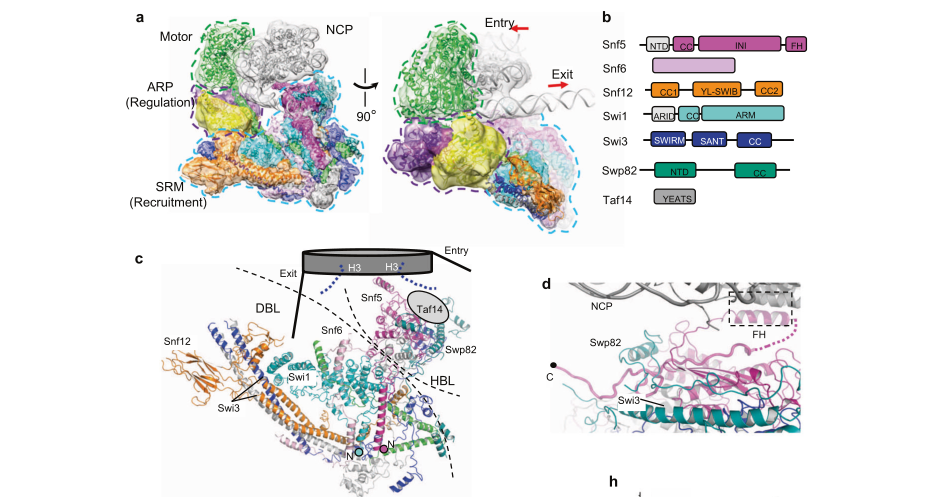

## Question

# Gene Research for Functional Annotation

## ⚠️ CRITICAL: Gene/Protein Identification Context

**BEFORE YOU BEGIN RESEARCH:** You MUST verify you are researching the CORRECT gene/protein. Gene symbols can be ambiguous, especially for less well-characterized genes from non-model organisms.

### Target Gene/Protein Identity (from UniProt):
- **UniProt Accession:** P09547
- **Protein Description:** RecName: Full=SWI/SNF chromatin-remodeling complex subunit SWI1; AltName: Full=Regulatory protein GAM3; AltName: Full=SWI/SNF complex subunit SWI1; AltName: Full=Transcription regulatory protein ADR6; AltName: Full=Transcription regulatory protein SWI1;
- **Gene Information:** Name=SWI1; Synonyms=ADR6, GAM3; OrderedLocusNames=YPL016W; ORFNames=LPA1;
- **Organism (full):** Saccharomyces cerevisiae (strain ATCC 204508 / S288c) (Baker's yeast).
- **Protein Family:** Belongs to the SWI1 family. .
- **Key Domains:** ARID/SWI1_ChromRemod. (IPR051232); ARID_dom. (IPR001606); ARID_dom_sf. (IPR036431); ARID (PF01388)

### MANDATORY VERIFICATION STEPS:

1. **Check if the gene symbol "SWI1" matches the protein description above**
2. **Verify the organism is correct:** Saccharomyces cerevisiae (strain ATCC 204508 / S288c) (Baker's yeast).
3. **Check if protein family/domains align with what you find in literature**
4. **If you find literature for a DIFFERENT gene with the same or similar symbol, STOP**

### If Gene Symbol is Ambiguous or You Cannot Find Relevant Literature:

**DO NOT PROCEED WITH RESEARCH ON A DIFFERENT GENE.** Instead:
- State clearly: "The gene symbol 'SWI1' is ambiguous or literature is limited for this specific protein"
- Explain what you found (e.g., "Found extensive literature on a different gene with the same symbol in a different organism")
- Describe the protein based ONLY on the UniProt information provided above
- Suggest that the protein function can be inferred from domain/family information

### Research Target:

Please provide a comprehensive research report on the gene **SWI1** (gene ID: SWI1, UniProt: P09547) in yeast.

The research report should be a detailed narrative explaining the function, biological processes, and localization of the gene product. Citations should be given for all claims.

You should prioritize authoritative reviews and primary scientific literature when conducting research. You can supplement
this with annotations you find in gene/protein databases, but these can be outdated or inaccurate.

We are specifically interested in the primary function of the gene - for enzymes, what reaction is catalyzed, and what is the substrate specificity? For transporters, what is the substrate? For structural proteins or adapters, what is the broader structural role? For signaling molecules, what is the role in the pathway.

We are interested in where in or outside the cell the gene product carries out its function.

We are also interested in the signaling or biochemical pathways in which the gene functions. We are less interested in broad pleiotropic effects, except where these elucidate the precise role.

Include evidence where possible. We are interested in both experimental evidence as well as inference from structure, evolution, or bioinformatic analysis. Precise studies should be prioritized over high-throughput, where available.

## Output

Question: You are an expert researcher providing comprehensive, well-cited information.

Provide detailed information focusing on:
1. Key concepts and definitions with current understanding
2. Recent developments and latest research (prioritize 2023-2024 sources)
3. Current applications and real-world implementations
4. Expert opinions and analysis from authoritative sources
5. Relevant statistics and data from recent studies

Format as a comprehensive research report with proper citations. Include URLs and publication dates where available.
Always prioritize recent, authoritative sources and provide specific citations for all major claims.

# Gene Research for Functional Annotation

## ⚠️ CRITICAL: Gene/Protein Identification Context

**BEFORE YOU BEGIN RESEARCH:** You MUST verify you are researching the CORRECT gene/protein. Gene symbols can be ambiguous, especially for less well-characterized genes from non-model organisms.

### Target Gene/Protein Identity (from UniProt):
- **UniProt Accession:** P09547
- **Protein Description:** RecName: Full=SWI/SNF chromatin-remodeling complex subunit SWI1; AltName: Full=Regulatory protein GAM3; AltName: Full=SWI/SNF complex subunit SWI1; AltName: Full=Transcription regulatory protein ADR6; AltName: Full=Transcription regulatory protein SWI1;
- **Gene Information:** Name=SWI1; Synonyms=ADR6, GAM3; OrderedLocusNames=YPL016W; ORFNames=LPA1;
- **Organism (full):** Saccharomyces cerevisiae (strain ATCC 204508 / S288c) (Baker's yeast).
- **Protein Family:** Belongs to the SWI1 family. .
- **Key Domains:** ARID/SWI1_ChromRemod. (IPR051232); ARID_dom. (IPR001606); ARID_dom_sf. (IPR036431); ARID (PF01388)

### MANDATORY VERIFICATION STEPS:

1. **Check if the gene symbol "SWI1" matches the protein description above**
2. **Verify the organism is correct:** Saccharomyces cerevisiae (strain ATCC 204508 / S288c) (Baker's yeast).
3. **Check if protein family/domains align with what you find in literature**
4. **If you find literature for a DIFFERENT gene with the same or similar symbol, STOP**

### If Gene Symbol is Ambiguous or You Cannot Find Relevant Literature:

**DO NOT PROCEED WITH RESEARCH ON A DIFFERENT GENE.** Instead:
- State clearly: "The gene symbol 'SWI1' is ambiguous or literature is limited for this specific protein"
- Explain what you found (e.g., "Found extensive literature on a different gene with the same symbol in a different organism")
- Describe the protein based ONLY on the UniProt information provided above
- Suggest that the protein function can be inferred from domain/family information

### Research Target:

Please provide a comprehensive research report on the gene **SWI1** (gene ID: SWI1, UniProt: P09547) in yeast.

The research report should be a detailed narrative explaining the function, biological processes, and localization of the gene product. Citations should be given for all claims.

You should prioritize authoritative reviews and primary scientific literature when conducting research. You can supplement
this with annotations you find in gene/protein databases, but these can be outdated or inaccurate.

We are specifically interested in the primary function of the gene - for enzymes, what reaction is catalyzed, and what is the substrate specificity? For transporters, what is the substrate? For structural proteins or adapters, what is the broader structural role? For signaling molecules, what is the role in the pathway.

We are interested in where in or outside the cell the gene product carries out its function.

We are also interested in the signaling or biochemical pathways in which the gene functions. We are less interested in broad pleiotropic effects, except where these elucidate the precise role.

Include evidence where possible. We are interested in both experimental evidence as well as inference from structure, evolution, or bioinformatic analysis. Precise studies should be prioritized over high-throughput, where available.

# Research Report: *Saccharomyces cerevisiae* SWI1 (UniProt P09547; YPL016W; ADR6/GAM3)

## Scope and gene/protein identity verification (mandatory)
The target protein is **Swi1**, a core non-catalytic subunit of the **yeast SWI/SNF ATP-dependent chromatin remodeling complex**, encoded by **SWI1/YPL016W** and historically referred to as **ADR6/GAM3** in genetic literature; this identity matches the UniProt description provided and is consistently described as a SWI/SNF subunit in modern work. (wendegatz2024transcriptionalactivationdomains pages 1-2, wang1994geneticinteractionsbetween pages 1-2)

## 1) Key concepts and definitions (current understanding)

### SWI/SNF chromatin remodeling
SWI/SNF is an **ATP-dependent chromatin remodeler** that repositions and/or evicts nucleosomes to modulate access to DNA. In yeast, SWI/SNF remodeling at promoters is linked to formation/maintenance of nucleosome-depleted regions that facilitate transcription-factor and general transcription machinery access. (wendegatz2024transcriptionalactivationdomains pages 1-2)

### Modular architecture: where Swi1 fits
A contemporary mechanistic framework divides SWI/SNF-family remodelers into (i) a **motor module** (ATPase; in yeast Snf2), (ii) an **ARP (actin-related protein) module**, and (iii) a **substrate recruitment module (SRM)** that contributes targeting/engagement with nucleosomal features. (chen2023mechanismofaction pages 1-2, he2021structureofthe pages 1-3)

Within this organization, **Swi1 functions as an auxiliary recruitment/structural subunit** rather than the catalytic ATPase: it helps position/organize recruitment elements and provides interfaces for activator- and DNA-associated contacts. (chen2023mechanismofaction pages 1-2, he2021structureofthe pages 1-3)

### ARID domain (AT-rich interaction domain)
Swi1 contains an **ARID (AT-rich interaction) domain**, a conserved DNA-binding fold found across eukaryotes and frequently associated with transcriptional regulation/chromatin remodeling proteins. In the yeast Swi1 subunit, an ARID region has been experimentally mapped and reported to bind DNA **non-specifically**. (wendegatz2024transcriptionalactivationdomains pages 14-15, wendegatz2024transcriptionalactivationdomains pages 5-6)

## 2) Recent developments and latest research (prioritized 2023–2024)

### 2.1. Activator-binding interfaces in Swi1 (2024 primary study)
A 2024 study directly tested interactions between transcriptional activation domains (TADs) and yeast chromatin remodeler subunits, showing that **Swi1** (along with other SWI/SNF subunits) can bind activator TADs, including the lipid-metabolism activator **Ino2**. (wendegatz2024transcriptionalactivationdomains pages 1-2, wendegatz2024transcriptionalactivationdomains pages 2-3)

Critically, this work refines **domain-level functional annotation** within Swi1: it reports the **ARID domain spans ~aa 405–506**, and maps an activator-interacting region in a broader internal segment (**aa 329–657**). Truncation mapping indicated that a fragment **aa 428–606** retained efficient binding to an Ino2 activation domain, whereas a shorter fragment **aa 329–531** (which includes the ARID) did not, implying that **ARID is not sufficient for activator binding** and that residues **~507–606** likely contribute a core activator-binding surface. (wendegatz2024transcriptionalactivationdomains pages 5-6)

### 2.2. Functional modularity and mechanistic framing (2023 review)
A 2023 review synthesizes modern structural/biochemical understanding of SWI/SNF-family mechanisms and emphasizes that yeast SWI/SNF comprises an Snf2 ATPase plus auxiliary subunits that govern targeting and nucleosome engagement; it also reports an estimate that yeast SWI/SNF regulates expression of **~5% of yeast genes**. (chen2023mechanismofaction pages 1-2)

### 2.3. Authoritative perspective on centrality of Swi1 (2024 review)
A 2024 review that discusses SWI/SNF complexes across species characterizes Swi1 (yeast) as centrally located within SWI/SNF architecture, functioning as a “molecular nexus” in the complex body organization described by cryo-EM studies. (sailik2024openingandchanging pages 2-3)

## 3) Molecular function, domains, and interaction partners (functional annotation)

### 3.1. Primary molecular function of Swi1
Swi1’s primary function is **structural and regulatory within the SWI/SNF complex**, contributing to:
1) **substrate recruitment** (positioning near nucleosomal DNA and helping target SWI/SNF to promoters), and
2) **coactivator/activator interfaces** that enable transcription-factor-dependent SWI/SNF recruitment. (wendegatz2024transcriptionalactivationdomains pages 1-2, he2021structureofthe pages 1-3)

Swi1 is not itself described as an enzyme catalyzing a specific reaction; the **ATP hydrolysis and mechanical remodeling** is carried by the SWI/SNF ATPase (Snf2/Swi2 in yeast nomenclature). (chen2023mechanismofaction pages 1-2)

### 3.2. Domain architecture supported by experimental evidence
**ARID domain:** Swi1 contains an ARID (AT-rich interaction) domain mapped to **aa ~405–506**, reported to bind DNA **non-specifically**. (wendegatz2024transcriptionalactivationdomains pages 5-6)

**Activator-binding region:** Swi1’s internal region **aa 329–657** is experimentally implicated in activator interactions, and mapping suggests a core region around **aa 507–606** is important for Ino2 TAD binding (distinct from the ARID itself). (wendegatz2024transcriptionalactivationdomains pages 5-6)

### 3.3. Key interaction partners and interfaces
**Transcriptional activators/TADs:** Swi1 binds activation domains from multiple activators (historic and newly tested), and in 2024 it was shown to bind the Ino2 activation domains relevant to phospholipid gene expression. (wendegatz2024transcriptionalactivationdomains pages 2-3, wendegatz2024transcriptionalactivationdomains pages 1-2)

**SWI/SNF subunits:** Structural work indicates that the **N-termini of Swi1 and Snf5 interact** and that Swi1 contributes to the SRM DNA-binding lobe together with **Snf6, Snf12, and Snf5 N-terminus**. (he2021structureofthe pages 1-3)

## 4) Localization: where Swi1 acts in the cell

### 4.1. Nuclear/chromatin site of action
Functionally, SWI/SNF is a promoter-acting chromatin remodeler, and structural work directly visualizes SWI/SNF bound to a nucleosome, demonstrating its chromatin-associated mode of action. (he2021structureofthe pages 1-3, wendegatz2024transcriptionalactivationdomains pages 1-2)

### 4.2. Structural positioning relative to nucleosome and DNA
In the cryo-EM structure of yeast SWI/SNF bound to a mononucleosome, **Swi1 (construct residues 251–1336)** contributes to the **substrate recruitment module (SRM)** and specifically to the **DNA-binding lobe (DBL)** located near the **exit DNA**; Swi1 is proposed to help bind nucleosomal DNA either directly (via ARID) or indirectly (via coactivators). (he2021structureofthe pages 1-3)

A figure from this primary structure paper depicts the overall architecture/modules of nucleosome-bound SWI/SNF and the placement of Swi1 within the SRM/DBL in relation to the nucleosome. (he2021structureofthe media 010f0c81)

## 5) Biological processes and pathways linked to SWI1/SWI/SNF function

### 5.1. Transcriptional activation programs (classic genetics)
Genetic evidence places SWI1 within the SWI/SNF machinery required for transcriptional activation at specific loci. For example, SWI1 was reported to be required for expression of the a-specific gene **STE6**, positioning SWI1/SWI/SNF within mating-type gene regulation networks. (wang1994geneticinteractionsbetween pages 1-2)

### 5.2. Metabolic and stress-responsive gene regulation (modern framing)
Recent work emphasizes SWI/SNF’s general role in promoter remodeling and inducible gene activation programs. A 2024 mechanistic study connects SWI/SNF (including Swi1 interactions) to activator-dependent expression of **phospholipid biosynthetic genes** through Ino2 activation domains. (wendegatz2024transcriptionalactivationdomains pages 1-2)

Across yeast SWI/SNF literature, SWI/SNF defects are classically associated with failures in promoter induction/derepression at loci such as **HO** and **SUC2** and impaired utilization of certain carbon sources (e.g., sucrose), consistent with a role in environmentally responsive transcription. (wendegatz2024transcriptionalactivationdomains pages 1-2)

## 6) Relevant statistics and data (recent and authoritative)

### 6.1. Fraction of genes regulated
A 2023 review reports an estimate that yeast SWI/SNF regulates expression of approximately **~5% of yeast genes**. (chen2023mechanismofaction pages 1-2)

Consistent with this magnitude, the nucleosome-bound structure paper reiterates that SWI/SNF regulates **~5%** of genes in yeast. (he2021structureofthe pages 1-3)

Separately, a 2024 paper cites microarray evidence that expression of **~1%** of yeast protein-coding genes was significantly SWI-dependent (as reported in the cited microarray comparison). (wendegatz2024transcriptionalactivationdomains pages 1-2)

### 6.2. Quantitative structural and domain mapping data
Key quantitative structural/domain data for Swi1-supported annotation include:
- **Swi1 residues 251–1336** used in cryo-EM reconstruction of nucleosome-bound SWI/SNF. (he2021structureofthe pages 1-3)
- **Overall cryo-EM resolution ~6.9 Å**, with higher local resolutions reported at the nucleosome and SRM. (he2021structureofthe pages 1-3)
- **ARID domain ~aa 405–506**, and an internal activator-interaction region **aa 329–657** with a likely core around **aa 507–606** for Ino2 TAD binding. (wendegatz2024transcriptionalactivationdomains pages 5-6)

## 7) Current applications and real-world implementations
Yeast SWI1/SWI/SNF is primarily used as a **model system** for mechanistic understanding of ATP-dependent chromatin remodeling and transcription-factor-dependent recruitment, including domain-level mapping of activator-binding interfaces. (wendegatz2024transcriptionalactivationdomains pages 1-2, he2021structureofthe pages 1-3)

Within the retrieved corpus, **direct industrial or clinical implementations specifically targeting yeast SWI1** were not identified; however, cross-species reviews explicitly connect SWI/SNF structural/mechanistic insights (including yeast archetype studies) to broader biomedical contexts such as understanding SWI/SNF dysfunction in disease and therapeutic development in other organisms. (sailik2024openingandchanging pages 2-3)

## 8) Expert opinions and synthesis (authoritative interpretation)
Collectively, the most strongly supported functional interpretation is that Swi1 is a **central architectural and targeting subunit** within yeast SWI/SNF: it helps form the SRM recruitment surface near nucleosomal exit DNA and provides interfaces that bind transcriptional activation domains, thereby enabling promoter-specific recruitment and efficient remodeling by the Snf2 ATPase. This integrated view is supported by the convergence of (i) direct nucleosome-bound SWI/SNF structure defining Swi1’s physical placement and module membership, and (ii) 2024 biochemical interaction mapping showing Swi1 contains separable DNA- (ARID) and activator-binding functions. (he2021structureofthe pages 1-3, wendegatz2024transcriptionalactivationdomains pages 5-6, wendegatz2024transcriptionalactivationdomains pages 1-2)

## Evidence summary table
The following evidence map summarizes the main supported annotations and quantitative points for Swi1/P09547.

| Category | Key points | Best supporting sources (citation IDs) | Publication year(s) and URL(s) when available |
|---|---|---|---|
| Identity | SWI1 in this report matches the *Saccharomyces cerevisiae* SWI/SNF chromatin-remodeling complex subunit encoded by **YPL016W**, also called **ADR6/GAM3**; it is a non-catalytic auxiliary subunit of the yeast SWI/SNF complex rather than the ATPase motor. | (wendegatz2024transcriptionalactivationdomains pages 1-2, wang1994geneticinteractionsbetween pages 1-2, chen2023mechanismofaction pages 1-2) | 2024 https://doi.org/10.1007/s00294-024-01300-x; 1994 https://doi.org/10.1007/BF00297274; 2023 https://doi.org/10.1080/19491034.2023.2165604 |
| Domains | Swi1 contains an **ARID/AT-rich interaction domain** spanning approximately **aa 405-506**; this domain has been reported to bind DNA **non-specifically**. An internal region **aa 329-657** interacts with activators, and mapping suggests **aa 507-606** contributes a core activator-binding region distinct from the ARID itself. | (wendegatz2024transcriptionalactivationdomains pages 14-15, wendegatz2024transcriptionalactivationdomains pages 5-6) | 2024 https://doi.org/10.1007/s00294-024-01300-x |
| Complex architecture | In cryo-EM reconstructions, Swi1 is a central structural subunit or “molecular nexus.” Its **N-terminus** contributes to the **substrate recruitment module (SRM)**, specifically the **DNA-binding lobe (DBL)** near nucleosomal exit DNA. The DBL includes **Snf6, Snf12, and the N-termini of Swi1 and Snf5**. A truncated construct containing **Swi1 residues 251-1336** was used for structure determination. | (he2021structureofthe pages 1-3, sailik2024openingandchanging pages 2-3, he2021structureofthe media 010f0c81) | 2021 https://doi.org/10.1038/s41421-021-00262-5; 2024 https://doi.org/10.1098/rsob.240039 |
| Recruitment & activator binding | Swi1 functions as a **coactivator interface** that helps recruit SWI/SNF to promoters through transcriptional activators. It has documented interactions with activation domains from **Gcn4, VP16, Hap4**, and in 2024 work with **Ino2**; GST pull-down mapping showed Swi1 fragments containing **aa 428-606** bound Ino2 TAD1 efficiently, whereas **aa 329-531** did not, implying the ARID alone is insufficient for activator binding. | (wendegatz2024transcriptionalactivationdomains pages 5-6, wendegatz2024transcriptionalactivationdomains pages 2-3, wendegatz2024transcriptionalactivationdomains pages 1-2) | 2024 https://doi.org/10.1007/s00294-024-01300-x |
| Biological processes | As part of SWI/SNF, Swi1 supports **ATP-dependent chromatin remodeling** that opens promoter chromatin and helps generate **nucleosome-depleted regions** for transcription initiation. Classic genetic evidence links SWI1 to activation of genes such as **STE6** and to broader regulation of carbon-catabolite-responsive programs and other SWI/SNF-dependent genes. Yeast SWI/SNF overall has been estimated to regulate about **5% of genes**. | (wendegatz2024transcriptionalactivationdomains pages 1-2, wang1994geneticinteractionsbetween pages 1-2, chen2023mechanismofaction pages 1-2) | 2024 https://doi.org/10.1007/s00294-024-01300-x; 1994 https://doi.org/10.1007/BF00297274; 2023 https://doi.org/10.1080/19491034.2023.2165604 |
| Localization & site of action | Swi1 acts in the **nucleus**, associated with the **SWI/SNF complex on chromatin/nucleosomes**. Structurally it is positioned in the recruitment portion of the complex adjacent to **nucleosomal exit DNA**, and its N-terminus is proposed to help contact DNA directly or indirectly via transcription coactivators. | (chen2023mechanismofaction pages 1-2, he2021structureofthe pages 1-3, he2021structureofthe media 010f0c81) | 2023 https://doi.org/10.1080/19491034.2023.2165604; 2021 https://doi.org/10.1038/s41421-021-00262-5 |
| Quantitative data | Quantitative details currently supported by available evidence include: yeast SWI/SNF has **~12 subunits**; regulates about **~5% of yeast genes**; cryo-EM map resolution was **6.9 Å overall**, with local resolution around **~3.6 Å** for the SRM and **~3.1 Å** near the nucleosome-facing region; Swi1 ARID is **aa 405-506**; activator-interacting region **aa 329-657**; efficient Ino2-TAD1-binding fragment **aa 428-606**. | (wendegatz2024transcriptionalactivationdomains pages 5-6, wendegatz2024transcriptionalactivationdomains pages 1-2, chen2023mechanismofaction pages 1-2, he2021structureofthe pages 1-3) | 2024 https://doi.org/10.1007/s00294-024-01300-x; 2023 https://doi.org/10.1080/19491034.2023.2165604; 2021 https://doi.org/10.1038/s41421-021-00262-5 |

*Table: This table compiles the currently supported functional annotation for Saccharomyces cerevisiae Swi1/P09547, including identity verification, domain organization, structural role in SWI/SNF, recruitment mechanisms, biological roles, localization, and quantitative findings. It is useful as a compact evidence map before writing the full narrative report.*

## Key sources (with dates and URLs)
- **Wendegatz EC, Engelhardt M, Schüller H-J.** *Current Genetics* (Sep **2024**). “Transcriptional activation domains interact with ATPase subunits of yeast chromatin remodelling complexes SWI/SNF, RSC and INO80.” https://doi.org/10.1007/s00294-024-01300-x (wendegatz2024transcriptionalactivationdomains pages 1-2)
- **Chen K, Yuan J, Sia Y, Chen Z.** *Nucleus* (Jan **2023**). “Mechanism of action of the SWI/SNF family complexes.” https://doi.org/10.1080/19491034.2023.2165604 (chen2023mechanismofaction pages 1-2)
- **Abu Sailik F, Emerald BS, Ansari SA.** *Open Biology* (Oct **2024**). “Opening and changing: mammalian SWI/SNF complexes in organ development and carcinogenesis.” https://doi.org/10.1098/rsob.240039 (sailik2024openingandchanging pages 2-3)
- **He Z, Chen K, Ye Y, Chen Z.** *Cell Discovery* (Apr **2021**). “Structure of the SWI/SNF complex bound to the nucleosome and insights into the functional modularity.” https://doi.org/10.1038/s41421-021-00262-5 (he2021structureofthe pages 1-3)
- **Wang H, Reynolds-Hager L, Stillman DJ.** *Mol Gen Genet* (Dec **1994**). “Genetic interactions between SIN3 mutations and the Saccharomyces cerevisiae transcriptional activators encoded by MCM1, STE12, and SWI1.” https://doi.org/10.1007/BF00297274 (wang1994geneticinteractionsbetween pages 1-2)

References

1. (wendegatz2024transcriptionalactivationdomains pages 1-2): Eva-Carina Wendegatz, Maike Engelhardt, and Hans-Joachim Schüller. Transcriptional activation domains interact with atpase subunits of yeast chromatin remodelling complexes swi/snf, rsc and ino80. Current Genetics, Sep 2024. URL: https://doi.org/10.1007/s00294-024-01300-x, doi:10.1007/s00294-024-01300-x. This article has 3 citations and is from a peer-reviewed journal.

2. (wang1994geneticinteractionsbetween pages 1-2): H. Wang, L. Reynolds-Hager, and D. J. Stillman. Genetic interactions between sin3 mutations and the saccharomyces cerevisiae transcriptional activators encoded by mcm1, ste12, and swi1. Molecular and General Genetics MGG, 245:675-685, Dec 1994. URL: https://doi.org/10.1007/bf00297274, doi:10.1007/bf00297274. This article has 22 citations.

3. (chen2023mechanismofaction pages 1-2): Kangjing Chen, Junjie Yuan, Youyang Sia, and Zhucheng Chen. Mechanism of action of the swi/snf family complexes. Nucleus, Jan 2023. URL: https://doi.org/10.1080/19491034.2023.2165604, doi:10.1080/19491034.2023.2165604. This article has 55 citations and is from a peer-reviewed journal.

4. (he2021structureofthe pages 1-3): Zhenyu He, Kangjing Chen, Youpi Ye, and Zhucheng Chen. Structure of the swi/snf complex bound to the nucleosome and insights into the functional modularity. Cell Discovery, Apr 2021. URL: https://doi.org/10.1038/s41421-021-00262-5, doi:10.1038/s41421-021-00262-5. This article has 36 citations and is from a peer-reviewed journal.

5. (wendegatz2024transcriptionalactivationdomains pages 14-15): Eva-Carina Wendegatz, Maike Engelhardt, and Hans-Joachim Schüller. Transcriptional activation domains interact with atpase subunits of yeast chromatin remodelling complexes swi/snf, rsc and ino80. Current Genetics, Sep 2024. URL: https://doi.org/10.1007/s00294-024-01300-x, doi:10.1007/s00294-024-01300-x. This article has 3 citations and is from a peer-reviewed journal.

6. (wendegatz2024transcriptionalactivationdomains pages 5-6): Eva-Carina Wendegatz, Maike Engelhardt, and Hans-Joachim Schüller. Transcriptional activation domains interact with atpase subunits of yeast chromatin remodelling complexes swi/snf, rsc and ino80. Current Genetics, Sep 2024. URL: https://doi.org/10.1007/s00294-024-01300-x, doi:10.1007/s00294-024-01300-x. This article has 3 citations and is from a peer-reviewed journal.

7. (wendegatz2024transcriptionalactivationdomains pages 2-3): Eva-Carina Wendegatz, Maike Engelhardt, and Hans-Joachim Schüller. Transcriptional activation domains interact with atpase subunits of yeast chromatin remodelling complexes swi/snf, rsc and ino80. Current Genetics, Sep 2024. URL: https://doi.org/10.1007/s00294-024-01300-x, doi:10.1007/s00294-024-01300-x. This article has 3 citations and is from a peer-reviewed journal.

8. (sailik2024openingandchanging pages 2-3): Fadia Abu Sailik, Bright Starling Emerald, and Suraiya Anjum Ansari. Opening and changing: mammalian swi/snf complexes in organ development and carcinogenesis. Open Biology, Oct 2024. URL: https://doi.org/10.1098/rsob.240039, doi:10.1098/rsob.240039. This article has 5 citations and is from a peer-reviewed journal.

9. (he2021structureofthe media 010f0c81): Zhenyu He, Kangjing Chen, Youpi Ye, and Zhucheng Chen. Structure of the swi/snf complex bound to the nucleosome and insights into the functional modularity. Cell Discovery, Apr 2021. URL: https://doi.org/10.1038/s41421-021-00262-5, doi:10.1038/s41421-021-00262-5. This article has 36 citations and is from a peer-reviewed journal.

## Artifacts

- [Edison artifact artifact-00](SWI1-deep-research-falcon_artifacts/artifact-00.md)

## Citations

1. wendegatz2024transcriptionalactivationdomains pages 1-2
2. wendegatz2024transcriptionalactivationdomains pages 5-6
3. chen2023mechanismofaction pages 1-2
4. sailik2024openingandchanging pages 2-3
5. he2021structureofthe pages 1-3
6. wang1994geneticinteractionsbetween pages 1-2
7. wendegatz2024transcriptionalactivationdomains pages 14-15
8. wendegatz2024transcriptionalactivationdomains pages 2-3
9. https://doi.org/10.1007/s00294-024-01300-x;
10. https://doi.org/10.1007/BF00297274;
11. https://doi.org/10.1080/19491034.2023.2165604
12. https://doi.org/10.1007/s00294-024-01300-x
13. https://doi.org/10.1038/s41421-021-00262-5;
14. https://doi.org/10.1098/rsob.240039
15. https://doi.org/10.1080/19491034.2023.2165604;
16. https://doi.org/10.1038/s41421-021-00262-5
17. https://doi.org/10.1007/BF00297274
18. https://doi.org/10.1007/s00294-024-01300-x,
19. https://doi.org/10.1007/bf00297274,
20. https://doi.org/10.1080/19491034.2023.2165604,
21. https://doi.org/10.1038/s41421-021-00262-5,
22. https://doi.org/10.1098/rsob.240039,