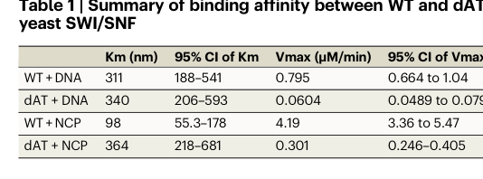

## Question

# Gene Research for Functional Annotation

## ⚠️ CRITICAL: Gene/Protein Identification Context

**BEFORE YOU BEGIN RESEARCH:** You MUST verify you are researching the CORRECT gene/protein. Gene symbols can be ambiguous, especially for less well-characterized genes from non-model organisms.

### Target Gene/Protein Identity (from UniProt):
- **UniProt Accession:** P22082
- **Protein Description:** RecName: Full=Transcription regulatory protein SNF2; EC=3.6.4.-; AltName: Full=ATP-dependent helicase SNF2; AltName: Full=Regulatory protein GAM1; AltName: Full=Regulatory protein SWI2; AltName: Full=SWI/SNF complex component SNF2; AltName: Full=Transcription factor TYE3;
- **Gene Information:** Name=SNF2; Synonyms=GAM1, RIC1, SWI2, TYE3; OrderedLocusNames=YOR290C;
- **Organism (full):** Saccharomyces cerevisiae (strain ATCC 204508 / S288c) (Baker's yeast).
- **Protein Family:** Not specified in UniProt
- **Key Domains:** AT_hook_DNA-bd_motif. (IPR017956); Bromodomain. (IPR001487); Bromodomain-like_sf. (IPR036427); Bromodomain_CS. (IPR018359); Gln-Leu-Gln_QLQ. (IPR014978)

### MANDATORY VERIFICATION STEPS:

1. **Check if the gene symbol "SNF2" matches the protein description above**
2. **Verify the organism is correct:** Saccharomyces cerevisiae (strain ATCC 204508 / S288c) (Baker's yeast).
3. **Check if protein family/domains align with what you find in literature**
4. **If you find literature for a DIFFERENT gene with the same or similar symbol, STOP**

### If Gene Symbol is Ambiguous or You Cannot Find Relevant Literature:

**DO NOT PROCEED WITH RESEARCH ON A DIFFERENT GENE.** Instead:
- State clearly: "The gene symbol 'SNF2' is ambiguous or literature is limited for this specific protein"
- Explain what you found (e.g., "Found extensive literature on a different gene with the same symbol in a different organism")
- Describe the protein based ONLY on the UniProt information provided above
- Suggest that the protein function can be inferred from domain/family information

### Research Target:

Please provide a comprehensive research report on the gene **SNF2** (gene ID: SWI2, UniProt: P22082) in yeast.

The research report should be a detailed narrative explaining the function, biological processes, and localization of the gene product. Citations should be given for all claims.

You should prioritize authoritative reviews and primary scientific literature when conducting research. You can supplement
this with annotations you find in gene/protein databases, but these can be outdated or inaccurate.

We are specifically interested in the primary function of the gene - for enzymes, what reaction is catalyzed, and what is the substrate specificity? For transporters, what is the substrate? For structural proteins or adapters, what is the broader structural role? For signaling molecules, what is the role in the pathway.

We are interested in where in or outside the cell the gene product carries out its function.

We are also interested in the signaling or biochemical pathways in which the gene functions. We are less interested in broad pleiotropic effects, except where these elucidate the precise role.

Include evidence where possible. We are interested in both experimental evidence as well as inference from structure, evolution, or bioinformatic analysis. Precise studies should be prioritized over high-throughput, where available.

## Output

Question: You are an expert researcher providing comprehensive, well-cited information.

Provide detailed information focusing on:
1. Key concepts and definitions with current understanding
2. Recent developments and latest research (prioritize 2023-2024 sources)
3. Current applications and real-world implementations
4. Expert opinions and analysis from authoritative sources
5. Relevant statistics and data from recent studies

Format as a comprehensive research report with proper citations. Include URLs and publication dates where available.
Always prioritize recent, authoritative sources and provide specific citations for all major claims.

# Gene Research for Functional Annotation

## ⚠️ CRITICAL: Gene/Protein Identification Context

**BEFORE YOU BEGIN RESEARCH:** You MUST verify you are researching the CORRECT gene/protein. Gene symbols can be ambiguous, especially for less well-characterized genes from non-model organisms.

### Target Gene/Protein Identity (from UniProt):
- **UniProt Accession:** P22082
- **Protein Description:** RecName: Full=Transcription regulatory protein SNF2; EC=3.6.4.-; AltName: Full=ATP-dependent helicase SNF2; AltName: Full=Regulatory protein GAM1; AltName: Full=Regulatory protein SWI2; AltName: Full=SWI/SNF complex component SNF2; AltName: Full=Transcription factor TYE3;
- **Gene Information:** Name=SNF2; Synonyms=GAM1, RIC1, SWI2, TYE3; OrderedLocusNames=YOR290C;
- **Organism (full):** Saccharomyces cerevisiae (strain ATCC 204508 / S288c) (Baker's yeast).
- **Protein Family:** Not specified in UniProt
- **Key Domains:** AT_hook_DNA-bd_motif. (IPR017956); Bromodomain. (IPR001487); Bromodomain-like_sf. (IPR036427); Bromodomain_CS. (IPR018359); Gln-Leu-Gln_QLQ. (IPR014978)

### MANDATORY VERIFICATION STEPS:

1. **Check if the gene symbol "SNF2" matches the protein description above**
2. **Verify the organism is correct:** Saccharomyces cerevisiae (strain ATCC 204508 / S288c) (Baker's yeast).
3. **Check if protein family/domains align with what you find in literature**
4. **If you find literature for a DIFFERENT gene with the same or similar symbol, STOP**

### If Gene Symbol is Ambiguous or You Cannot Find Relevant Literature:

**DO NOT PROCEED WITH RESEARCH ON A DIFFERENT GENE.** Instead:
- State clearly: "The gene symbol 'SNF2' is ambiguous or literature is limited for this specific protein"
- Explain what you found (e.g., "Found extensive literature on a different gene with the same symbol in a different organism")
- Describe the protein based ONLY on the UniProt information provided above
- Suggest that the protein function can be inferred from domain/family information

### Research Target:

Please provide a comprehensive research report on the gene **SNF2** (gene ID: SWI2, UniProt: P22082) in yeast.

The research report should be a detailed narrative explaining the function, biological processes, and localization of the gene product. Citations should be given for all claims.

You should prioritize authoritative reviews and primary scientific literature when conducting research. You can supplement
this with annotations you find in gene/protein databases, but these can be outdated or inaccurate.

We are specifically interested in the primary function of the gene - for enzymes, what reaction is catalyzed, and what is the substrate specificity? For transporters, what is the substrate? For structural proteins or adapters, what is the broader structural role? For signaling molecules, what is the role in the pathway.

We are interested in where in or outside the cell the gene product carries out its function.

We are also interested in the signaling or biochemical pathways in which the gene functions. We are less interested in broad pleiotropic effects, except where these elucidate the precise role.

Include evidence where possible. We are interested in both experimental evidence as well as inference from structure, evolution, or bioinformatic analysis. Precise studies should be prioritized over high-throughput, where available.

## Research Report: *Saccharomyces cerevisiae* SNF2 (SWI2/SNF2; YOR290C; UniProt P22082)

### Executive summary
*Saccharomyces cerevisiae* Snf2 (a.k.a. Swi2; gene YOR290C; UniProt P22082) is the catalytic ATPase (“motor”) subunit of the yeast SWI/SNF chromatin-remodeling complex. Its core molecular function is ATP-dependent DNA translocation on nucleosomal substrates to reposition or destabilize nucleosomes, enabling both transcriptional activation and transcription-associated repression mechanisms (including repression by remodeling downstream of active promoters). Snf2 activity is regulated by multiple non-catalytic domains—including a conserved SnAC coupling domain and a C-terminal AT-hook module—that tune ATP hydrolysis and its coupling to nucleosome movement. (sen2011anewhighly pages 1-2, eustermann2024energydrivengenomeregulation pages 1-3, saha2023theathookis pages 1-2, morse2024swisnfchromatinremodeling pages 8-12)

### 1) Key concepts and definitions (current understanding)

#### 1.1 ATP-dependent chromatin remodeling and SWI/SNF
ATP-dependent chromatin remodelers are multi-subunit machines that use ATP hydrolysis to alter nucleosome organization on DNA. In the SWI/SNF family, the principal outcomes include nucleosome sliding and histone ejection, mediated by a dedicated “motor ATPase” subunit. In yeast SWI/SNF, that motor is Snf2. (eustermann2024energydrivengenomeregulation pages 1-3)

#### 1.2 What “SNF2” means in this report (identity verification)
This report concerns *S. cerevisiae* Snf2/Swi2 encoded by YOR290C (UniProt P22082), the SWI/SNF-family catalytic ATPase. The cited primary studies explicitly analyze yeast Snf2/Swi2 within SWI/SNF and experimentally manipulate domains that match the UniProt entry (HSA, QLQ, SnAC, AT-hook(s), bromodomain). (sen2011anewhighly pages 1-2, sen2011anewhighly pages 2-2, saha2023theathookis pages 1-2)

### 2) Molecular function: enzymatic activity, substrates, and mechanism

#### 2.1 Enzymatic activity and substrate preference
Snf2 provides the SWI/SNF complex’s ATPase and DNA translocase activity. In mechanistic summaries and primary work, Snf2-containing SWI/SNF is described as a DNA-dependent ATPase that couples ATP hydrolysis to nucleosome mobilization/displacement; nucleosomal DNA is reported as the optimal substrate that stimulates ATP hydrolysis above naked DNA. (guoUnknownyear…thegenomewide pages 23-28)

At the SWI/SNF-family level, the activity output is nucleosome sliding and histone ejection, driven by the motor ATPase (Snf2 in yeast). (eustermann2024energydrivengenomeregulation pages 1-3)

#### 2.2 Coupling ATP hydrolysis to nucleosome movement: the SnAC domain (primary evidence)
A highly conserved SnAC (“Snf2 ATP coupling”) domain lies between the ATPase and AT-hook region and is essential for productive remodeling. In yeast, deletion or mutation of SnAC severely impairs ATPase and nucleosome-mobilizing activities, but does not abolish complex integrity, efficient nucleosome binding, or recruitment by acidic transcription activators—supporting a specific “coupling” function between hydrolysis and mechanical work. (sen2011anewhighly pages 1-2)

Quantitatively, removal of SnAC does not substantially change apparent nucleosome binding affinity: WT nucleosome KD 2.85 ± 0.5 nM versus ΔSnAC KD 2.38 ± 0.7 nM, consistent with a catalytic/coupling defect rather than a binding defect. (sen2011anewhighly pages 4-5)

#### 2.3 Auto-regulation by the AT-hook module: kinetic and mechanistic data (2023)
A 2023 *Nature Communications* study demonstrates that the C-terminal AT-hook module in yeast Snf2 is not merely a DNA tether, but an auto-regulatory element that strongly boosts ATPase catalytic velocity and remodeling rate. Deleting both AT-hooks (ΔAT) reduces ATP hydrolysis velocity ~13-fold (DNA-stimulated) and ~14-fold (nucleosome-stimulated), with Vmax decreasing from 0.795 to 0.0604 μM/min on DNA and from 4.19 to 0.301 μM/min on nucleosomes. (saha2023theathookis pages 1-2, saha2023theathookis pages 4-5)

The AT-hook deletion has modest effects on DNA KM (311 → 340 nM) but substantially worsens nucleosome KM (98 → 364 nM), indicating a key role in productive nucleosome engagement and catalysis under nucleosomal conditions. (saha2023theathookis pages 1-2, saha2023theathookis pages 4-5)

Binding effects are present but smaller than catalytic effects: free DNA KD 7.87 nM (WT) vs 12.8 nM (ΔAT), and nucleosome KD 7.67 nM (WT) vs 20.5 nM (ΔAT). (saha2023theathookis pages 1-2, saha2023theathookis pages 5-6)

The same work reports that ΔAT SWI/SNF mobilizes nucleosomes dramatically more slowly than WT (reported rates: 0.26 nM/s for WT vs 0.0019 nM/s for ΔAT), and that the remodeling reduction is tightly coupled to the ATPase reduction. (saha2023theathookis pages 2-4)

**Visual evidence (kinetics and in vivo growth assays).** Table 1 and Figure 4 from this study provide the kinetic parameterization and growth phenotypes supporting the above claims. (saha2023theathookis media 36b896c6, saha2023theathookis media 2a6902d6)

### 3) Domain architecture and experimentally supported roles

The following artifact compiles domain-level functional evidence directly supported by the retrieved primary literature and recent synthesis articles (with quantitative data where available).

| Domain/motif | Approx. location if available | Molecular role | Key experimental evidence / quantitative data | Key citations (with DOI URL) |
|---|---|---|---|---|
| HSA (helicase-SANT-associated) | N-terminal; exact residues not given in provided context | Binds actin-related proteins Arp7 and Arp9; helps build the SWI/SNF motor/ARP module | Experimental summaries report HSA is required for Arp7/Arp9 association with Snf2; ARP association contributes >90% of catalytic activity in one mechanistic summary of yeast SWI/SNF (guoUnknownyear…thegenomewide pages 23-28, sen2011anewhighly pages 2-2) | Sen et al., 2011-08, *Nucleic Acids Res.* DOI: https://doi.org/10.1093/nar/gkr622; mechanistic review/summary in provided context, year not stated (guoUnknownyear…thegenomewide pages 23-28) |
| QLQ | Between N-terminus and HSA | Conserved domain present in Snf2 architecture; specific function not established in the provided evidence | Domain is explicitly noted as conserved in yeast Snf2, but no direct functional assay or quantitative phenotype for QLQ is described in the retrieved context (sen2011anewhighly pages 2-2) | Sen et al., 2011-08, *Nucleic Acids Res.* DOI: https://doi.org/10.1093/nar/gkr622 |
| pHSA | Between HSA and ATPase region (exact residues not given) | Links ARP module to ATPase; conformational coupling on ARP binding | Mechanistic summary states pHSA connects HSA/ARP binding to the ATPase region and changes conformation upon ARP association, supporting motor regulation; no residue-level quantitative assay provided in retrieved context (guoUnknownyear…thegenomewide pages 23-28) | Mechanistic review/summary in provided context, year not stated (guoUnknownyear…thegenomewide pages 23-28) |
| ATPase / DNA translocase helicase motifs | Central motor; seven helicase motifs noted | Catalyzes ATP hydrolysis and DNA translocation on nucleosomes; powers nucleosome sliding, unwrapping, rewrapping, histone ejection/displacement | Snf2 is the catalytic subunit of SWI/SNF and a DNA-dependent ATPase whose optimal substrate is nucleosomal DNA rather than naked DNA; SWI/SNF activities summarized include nucleosome mobilization/displacement, sliding, and histone ejection. Recent review table identifies yeast Snf2 as the SWI/SNF motor ATPase with distal acidic-patch binding and bromodomain features (guoUnknownyear…thegenomewide pages 23-28, guoUnknownyear…thegenomewide pages 127-130, sen2011anewhighly pages 1-2, eustermann2024energydrivengenomeregulation pages 1-3) | Sen et al., 2011-08, *Nucleic Acids Res.* DOI: https://doi.org/10.1093/nar/gkr622; Eustermann et al., 2024-12, *Nat. Rev. Mol. Cell Biol.* DOI: https://doi.org/10.1038/s41580-023-00683-y |
| SnAC (Snf2 ATP coupling) | Between ATPase and AT-hook; deletion tested for aa1312–1444 | Couples ATP hydrolysis to remodeling; positively regulates ATPase output without major effect on ATP affinity or nucleosome binding | Deletion/mutation severely impairs ATPase and nucleosome mobilization, but not complex integrity or nucleosome binding. WT versus ΔSnAC nucleosome KD values are similar (2.85 ± 0.5 nM vs 2.38 ± 0.7 nM), supporting a catalytic-coupling rather than binding role. ΔSnAC expression profile correlates strongly with snf2Δ (r = 0.88), indicating essentiality for most Snf2-dependent gene activation (sen2011anewhighly pages 1-2, sen2011anewhighly pages 4-5, sen2011anewhighly pages 3-4) | Sen et al., 2011-08, *Nucleic Acids Res.* DOI: https://doi.org/10.1093/nar/gkr622 |
| AT-hook(s) | C-terminal region; ΔAT deletion spans ~aa1446–1530 in one assay set | Auto-regulatory domain that stimulates DNA- and nucleosome-stimulated ATPase activity, promotes nucleosome engagement, and supports in vivo SWI/SNF function | 2023 study shows ΔAT lowers ATPase Vmax ~13-fold on DNA (0.795 to 0.0604 μM/min) and ~14-fold on nucleosomes (4.19 to 0.301 μM/min), with modest DNA KM change (311 to 340 nM) but much worse nucleosome KM (98 to 364 nM). Binding effects are smaller but detectable: free DNA KD 7.87 vs 12.8 nM; nucleosome KD 7.67 vs 20.5 nM. Crosslinking places AT-hooks near H3 K15/K28, SnAC, and ATPase C-lobe. Growth assays indicate requirement for amino-acid biosynthesis/stress responses and ethanol metabolism, while some carbon-source switching phenotypes are less dependent on AT-hooks (saha2023theathookis pages 1-2, saha2023theathookis pages 4-5, saha2023theathookis pages 10-11, saha2023theathookis pages 2-4, saha2023theathookis pages 5-6, saha2023theathookis media 36b896c6, saha2023theathookis media 2a6902d6) | Saha et al., 2023-08, *Nat. Commun.* DOI: https://doi.org/10.1038/s41467-023-40386-8 |
| Bromodomain | C-terminal | Recognizes acetylated histone tails; contributes to chromatin targeting/retention and remodeler dynamics on acetylated chromatin | The bromodomain is reported to bind acetylated N-terminal histone tails. Mechanistic summary notes stimulation by tetra-acetylated H3 and acetyl-H3/H4 recognition. Recent work on stress-responsive genes showed competitive bromodomain interactions regulate Swi/Snf recruitment/release dynamics, including effects of Snf2 acetylation on binding to acetylated nucleosomes (guoUnknownyear…thegenomewide pages 23-28, sen2011anewhighly pages 2-2) | Sen et al., 2011-08, *Nucleic Acids Res.* DOI: https://doi.org/10.1093/nar/gkr622; Dutta et al., 2014-10, *Genes Dev.* DOI: https://doi.org/10.1101/gad.243584.114 |
| N-terminal activator-binding domain (ABD) | aa238–307 | Direct interaction with transcriptional activator TADs; likely contributes to recruitment but is dispensable in vivo because of redundancy with other SWI/SNF subunits | 2024 mapping study identified a ~70-aa Swi2 ABD (aa238–307) that binds Ino2 TAD1/TAD2 and also TADs from Gal4, Gcn4, Rap1, Aro80, and Swi5. In vivo, deletion variants lacking the ABD complemented swi2Δ growth phenotypes, indicating dispensability/redundancy. In reporter assays, Ino2 TAD1 activation dropped to 13.4% in swi2 null cells, whereas TAD2 retained 72.5%, supporting selective recruitment contributions (wendegatz2024transcriptionalactivationdomains pages 5-6, wendegatz2024transcriptionalactivationdomains pages 1-2, wendegatz2024transcriptionalactivationdomains pages 3-5, wendegatz2024transcriptionalactivationdomains pages 9-11) | Wendegatz et al., 2024-09, *Current Genetics* DOI: https://doi.org/10.1007/s00294-024-01300-x |

*Table: This table summarizes the experimentally supported domain architecture of Saccharomyces cerevisiae Snf2/Swi2 (UniProt P22082; YOR290C), emphasizing what each motif contributes to SWI/SNF remodeling. It highlights where the evidence is strong and quantitative, especially for the SnAC and AT-hook regions.*

Key points with highest-confidence experimental support include (i) SnAC as an ATP-to-remodeling coupling element that is dispensable for nucleosome binding but essential for remodeling output (sen2011anewhighly pages 1-2, sen2011anewhighly pages 4-5), and (ii) AT-hooks as strong catalytic accelerators (order-of-magnitude Vmax effect) and nucleosome-engagement elements (saha2023theathookis pages 1-2, saha2023theathookis pages 4-5).

### 4) Complex membership and interactions (SWI/SNF context)

#### 4.1 Snf2 as the SWI/SNF motor ATPase and subunit context
A recent review table explicitly identifies yeast Snf2 as the SWI/SNF motor ATPase and associates SWI/SNF with “nucleosome sliding” and “histone ejection.” It lists canonical yeast SWI/SNF subunits that associate with the complex (including Arp7, Arp9, Snf5, Swi1, Swi3, Snf6, among others), placing Snf2 within the well-defined holo-complex. (eustermann2024energydrivengenomeregulation pages 1-3)

A primary-study context further notes SWI/SNF as a ~12-subunit complex and reports that a minimal complex (Snf2 plus Arp7 and Arp9) can exhibit in vitro activity, though with limitations relative to the full complex (e.g., reduced ability to displace H2A–H2B dimers). (sen2011anewhighly pages 1-2)

#### 4.2 Interactions with transcriptional activators (recruitment interfaces)
A 2024 *Current Genetics* study provides direct biochemical evidence that transcriptional activation domains can bind to the yeast SWI/SNF ATPase subunit (Swi2/Snf2) and maps a ~70 aa N-terminal “activator-binding domain” (ABD) in Swi2 spanning aa 238–307. This ABD binds both activation domains (TAD1/TAD2) of the yeast transcription factor Ino2 and also binds TADs from several unrelated activators (Gal4, Gcn4, Rap1, Aro80, Swi5) in vitro, supporting a model in which activators can directly contact Snf2 to help recruit/engage SWI/SNF at promoters. (wendegatz2024transcriptionalactivationdomains pages 5-6, wendegatz2024transcriptionalactivationdomains pages 3-5)

Functionally, reporter assays indicate Ino2 TAD1 activation is strongly reduced in a swi2 null background (to 13.4% of WT), whereas TAD2 retains more activity (72.5%), implying differential reliance on Swi2-mediated recruitment mechanisms. Importantly, deletion variants lacking the mapped Swi2 ABD can complement growth phenotypes, supporting redundancy among SWI/SNF subunits that contain activator-binding interfaces. (wendegatz2024transcriptionalactivationdomains pages 5-6)

### 5) Biological processes, pathways, and cellular localization

#### 5.1 Localization (functional inference from direct chromatin engagement)
Across primary and review sources, Snf2 is functionally characterized through nucleosome binding, ATPase assays using DNA/nucleosomes, chromatin remodeling reactions, and genome-wide chromatin occupancy measurements (ChIP-based), all of which place its function in the nucleus on chromatin. For example, Snf2 occupancy at regulatory regions changes upon promoter induction in vivo (ChIP-seq), consistent with chromatin-associated nuclear localization. (morse2024swisnfchromatinremodeling pages 12-15)

#### 5.2 Pathways/processes: metabolic regulation and stress-responsive transcription programs (AT-hook phenotypes)
In vivo growth assays in yeast show that AT-hooks are “needed in vivo for active yeast SWI/SNF,” with phenotypes implicating SWI/SNF-dependent activation programs including amino-acid biosynthesis (e.g., rescue under amino-acid starvation conditions) and ethanol metabolism-related programs. (saha2023theathookis pages 5-6, saha2023theathookis pages 4-5, saha2023theathookis media 36b896c6)

Mechanistically, the interpretation is that some transcriptional programs require high-efficiency nucleosome mobilization (and thus strong ATPase output), whereas others tolerate attenuated remodeling. (saha2023theathookis pages 10-11)

#### 5.3 Pathways/processes: phospholipid biosynthesis gene activation (Ino2 recruitment)
The Ino2 activator is required for expression of phospholipid biosynthetic genes in yeast, and its activation domains bind multiple SWI/SNF subunits, including Swi2/Snf2. This provides a direct path from a defined transcription factor to Snf2-containing remodeling activity at metabolic gene promoters. (wendegatz2024transcriptionalactivationdomains pages 1-2, wendegatz2024transcriptionalactivationdomains pages 5-6)

#### 5.4 A newer functional axis (2024): transcriptional interference and gene repression
A 2024 *Molecular Cell* study highlights an expanded view of Snf2/SWI-SNF function in vivo: SWI/SNF not only promotes transcription initiation through promoter remodeling, but can also remodel nucleosomes downstream of active transcription start sites (TSSs) to repress proximal promoters (TSSPROX) associated with genes that also possess a distal active TSS (TSSDIST), thereby controlling transcriptional interference. (morse2024swisnfchromatinremodeling pages 66-70)

This work provides quantitative evidence of Snf2 redistribution in response to promoter induction: Snf2 occupancy at 5′ regulatory regions increased on average ~1.4-fold after distal promoter induction (paired t test p = 0.0423). (morse2024swisnfchromatinremodeling pages 12-15)

### 6) Recent developments and latest research (prioritizing 2023–2024)

#### 6.1 2023: AT-hook as an evolutionarily conserved auto-regulatory domain
The 2023 AT-hook study reframes AT-hooks from passive DNA anchors to strong catalytic regulators that accelerate ATP hydrolysis and nucleosome movement (~13–14× Vmax effects) and modulate nucleosome engagement (KM shift on nucleosomes). This “attenuation” model is useful because it enables partial-function perturbations that differ from full deletion or ATPase-dead mutants, potentially revealing remodeling-efficiency thresholds for specific gene programs. (saha2023theathookis pages 1-2, saha2023theathookis pages 10-11)

#### 6.2 2024: direct activator-binding interfaces within Swi2/Snf2
The 2024 Swi2 ABD mapping provides a contemporary biochemical framework for how intrinsically disordered transcription activation domains (TADs) can directly engage ATPase subunits of remodelers, and it experimentally supports the concept of redundancy (ABD dispensability) within SWI/SNF recruitment logic. (wendegatz2024transcriptionalactivationdomains pages 5-6, wendegatz2024transcriptionalactivationdomains pages 1-2)

#### 6.3 2024: SWI/SNF-mediated repression via gene-body remodeling in transcriptional interference
The 2024 transcriptional interference study provides a mechanistically specific repression function for SWI/SNF in yeast, supported by genome-wide transcriptomics (including TSS mapping) and chromatin profiling (MNase-seq/ChIP-seq), expanding functional annotation beyond “coactivator” descriptions. (morse2024swisnfchromatinremodeling pages 66-70, morse2024swisnfchromatinremodeling pages 8-12)

#### 6.4 2024: synthesis of remodeler mechanics and outputs
A 2024 *Nature Reviews Molecular Cell Biology* review synthesizes ATP-dependent remodeler families and explicitly associates yeast Snf2/SWI-SNF with sliding and histone ejection outputs, providing authoritative terminology and a comparative framework for mechanistic annotation. (eustermann2024energydrivengenomeregulation pages 1-3)

### 7) Current applications and real-world implementations

#### 7.1 Yeast Snf2 as a model system for “tunable” chromatin remodeling perturbations
The AT-hook work demonstrates a practical experimental strategy: rather than deleting SNF2 or using ATPase-dead mutants (often lethal or broadly pleiotropic), researchers can attenuate remodeling through specific regulatory elements (AT-hooks) to dissect remodeling-efficiency requirements for distinct gene programs. This is a real-world implementation in functional genomics and mechanistic epigenetics using yeast as a tractable model. (saha2023theathookis pages 10-11, saha2023theathookis media 36b896c6)

#### 7.2 Translational context (non-yeast): pharmacological targeting of SWI/SNF
While not yeast-specific, 2024 review literature emphasizes pharmacological targeting of SWI/SNF complexes in cancer via catalytic ATPase inhibitors, bromodomain ligands, and PROTAC-based degradation strategies. Yeast mechanistic insights (e.g., bromodomain and AT-hook regulatory logic in a homologous ATPase family) inform hypotheses about conserved regulatory surfaces, even though subunit composition differs between yeast and mammals. (eustermann2024energydrivengenomeregulation pages 1-3)

### 8) Expert opinions and analysis (authoritative interpretations)

* The 2024 *Nature Reviews Molecular Cell Biology* synthesis frames chromatin remodelers as “energy-driven genome regulation” machines and explicitly categorizes SWI/SNF output modes (sliding and ejection) with a motor ATPase at the center (Snf2 in yeast), reflecting the field’s current consensus model. (eustermann2024energydrivengenomeregulation pages 1-3)

* The 2023 AT-hook study’s analysis argues that understanding partial attenuation (rather than complete inactivation) is critical for separating remodeling “efficiency” requirements across biological programs, an approach aligned with modern quantitative mechanistic biology. (saha2023theathookis pages 10-11)

### 9) Key statistics and quantitative data (recent studies)

* **ATPase kinetics (2023):** Deleting Snf2 AT-hooks reduces Vmax ~13× on DNA and ~14× on nucleosomes (0.795→0.0604 μM/min on DNA; 4.19→0.301 μM/min on nucleosomes). Nucleosome KM worsens ~3.7× (98→364 nM), while DNA KM changes minimally (311→340 nM). (saha2023theathookis pages 4-5, saha2023theathookis media 36b896c6)

* **Binding affinities (2023):** ΔAT weakens nucleosome binding more than DNA binding (KD nucleosome 7.67→20.5 nM; KD DNA 7.87→12.8 nM). (saha2023theathookis pages 5-6)

* **Remodeling rate (2023):** Reported nucleosome mobilization rates differ dramatically between WT and ΔAT (0.26 nM/s vs 0.0019 nM/s). (saha2023theathookis pages 2-4)

* **Gene regulation (2011):** SnAC deletion yields gene expression changes strongly correlated with snf2Δ (correlation r = 0.88), consistent with SnAC being required for most Snf2-dependent gene activation. (sen2011anewhighly pages 3-4)

* **Transcriptional interference / repression (2024):** Snf2 occupancy at 5′ regulatory regions increases ~1.4-fold upon distal promoter induction (p = 0.0423). SER3 mRNA is upregulated ~40-fold in the snf2-Q928K allele in the context of interference regulation at the SER3 locus. (morse2024swisnfchromatinremodeling pages 12-15, morse2024swisnfchromatinremodeling pages 8-12)

### 10) Practical functional annotation summary (actionable)

**Primary molecular function:** ATP-dependent chromatin remodeling as the SWI/SNF motor ATPase, translocating on nucleosomal DNA to drive nucleosome sliding and histone ejection/destabilization. (eustermann2024energydrivengenomeregulation pages 1-3, guoUnknownyear…thegenomewide pages 23-28)

**Key regulatory/coupling elements:**
* SnAC: essential ATP-to-remodeling coupling; large functional impact without major nucleosome binding change. (sen2011anewhighly pages 1-2, sen2011anewhighly pages 4-5)
* AT-hooks: strong catalytic accelerators and nucleosome engagement elements (order-of-magnitude Vmax effects). (saha2023theathookis pages 1-2, saha2023theathookis pages 4-5)

**Localization:** Nuclear and chromatin-associated, supported by nucleosome engagement assays and in vivo chromatin occupancy profiling. (morse2024swisnfchromatinremodeling pages 12-15)

**Pathways/processes:**
* Activator-driven metabolic transcription programs (e.g., amino-acid biosynthesis/stress; phospholipid biosynthesis via Ino2). (saha2023theathookis pages 4-5, wendegatz2024transcriptionalactivationdomains pages 1-2)
* Chromatin-mediated repression via transcriptional interference (gene-body remodeling). (morse2024swisnfchromatinremodeling pages 66-70, morse2024swisnfchromatinremodeling pages 8-12)

### 11) Source list (URLs and publication dates)

* Saha D. et al. (2023-08). “The AT-hook is an evolutionarily conserved auto-regulatory domain of SWI/SNF required for cell lineage priming.” *Nature Communications.* https://doi.org/10.1038/s41467-023-40386-8 (saha2023theathookis pages 1-2)
* Morse K. et al. (2024-08). “Swi/Snf chromatin remodeling regulates transcriptional interference and gene repression.” *Molecular Cell.* https://doi.org/10.1016/j.molcel.2024.06.029 (morse2024swisnfchromatinremodeling pages 12-15)
* Wendegatz E.-C. et al. (2024-09). “Transcriptional activation domains interact with ATPase subunits of yeast chromatin remodelling complexes SWI/SNF, RSC and INO80.” *Current Genetics.* https://doi.org/10.1007/s00294-024-01300-x (wendegatz2024transcriptionalactivationdomains pages 5-6)
* Eustermann S. et al. (2024; published in *Nat Rev Mol Cell Biol* with 2024-12 metadata in retrieved record). “Energy-driven genome regulation by ATP-dependent chromatin remodellers.” https://doi.org/10.1038/s41580-023-00683-y (eustermann2024energydrivengenomeregulation pages 1-3)
* Sen P. et al. (2011-08). “A new, highly conserved domain in Swi2/Snf2 is required for SWI/SNF remodeling.” *Nucleic Acids Research.* https://doi.org/10.1093/nar/gkr622 (sen2011anewhighly pages 1-2)

References

1. (sen2011anewhighly pages 1-2): Payel Sen, Sujana Ghosh, B. Franklin Pugh, and Blaine Bartholomew. A new, highly conserved domain in swi2/snf2 is required for swi/snf remodeling. Nucleic Acids Research, 39:9155-9166, Aug 2011. URL: https://doi.org/10.1093/nar/gkr622, doi:10.1093/nar/gkr622. This article has 70 citations and is from a highest quality peer-reviewed journal.

2. (eustermann2024energydrivengenomeregulation pages 1-3): Sebastian Eustermann, Avinash B. Patel, Karl-Peter Hopfner, Yuan He, and Philipp Korber. Energy-driven genome regulation by atp-dependent chromatin remodellers. Nature reviews. Molecular cell biology, 25:309-332, Dec 2024. URL: https://doi.org/10.1038/s41580-023-00683-y, doi:10.1038/s41580-023-00683-y. This article has 113 citations.

3. (saha2023theathookis pages 1-2): Dhurjhoti Saha, Solomon Hailu, Arjan Hada, Junwoo Lee, Jie Luo, Jeff A. Ranish, Yuan-chi Lin, Kyle Feola, Jim Persinger, Abhinav Jain, Bin Liu, Yue Lu, Payel Sen, and Blaine Bartholomew. The at-hook is an evolutionarily conserved auto-regulatory domain of swi/snf required for cell lineage priming. Nature Communications, Aug 2023. URL: https://doi.org/10.1038/s41467-023-40386-8, doi:10.1038/s41467-023-40386-8. This article has 9 citations and is from a highest quality peer-reviewed journal.

4. (morse2024swisnfchromatinremodeling pages 8-12): Kaitlin Morse, Alena L. Bishop, Sarah Swerdlow, Jessica M. Leslie, and Elçin Ünal. Swi/snf chromatin remodeling regulates transcriptional interference and gene repression. Aug 2024. URL: https://doi.org/10.1016/j.molcel.2024.06.029, doi:10.1016/j.molcel.2024.06.029. This article has 21 citations and is from a highest quality peer-reviewed journal.

5. (sen2011anewhighly pages 2-2): Payel Sen, Sujana Ghosh, B. Franklin Pugh, and Blaine Bartholomew. A new, highly conserved domain in swi2/snf2 is required for swi/snf remodeling. Nucleic Acids Research, 39:9155-9166, Aug 2011. URL: https://doi.org/10.1093/nar/gkr622, doi:10.1093/nar/gkr622. This article has 70 citations and is from a highest quality peer-reviewed journal.

6. (guoUnknownyear…thegenomewide pages 23-28): X Guo. … the genome-wide interplay between swi/snf and tup1-cyc8 complexes in transcriptional regulation and chromatin remodeling in saccharomyces cerevisiae. Unknown journal, Unknown year.

7. (sen2011anewhighly pages 4-5): Payel Sen, Sujana Ghosh, B. Franklin Pugh, and Blaine Bartholomew. A new, highly conserved domain in swi2/snf2 is required for swi/snf remodeling. Nucleic Acids Research, 39:9155-9166, Aug 2011. URL: https://doi.org/10.1093/nar/gkr622, doi:10.1093/nar/gkr622. This article has 70 citations and is from a highest quality peer-reviewed journal.

8. (saha2023theathookis pages 4-5): Dhurjhoti Saha, Solomon Hailu, Arjan Hada, Junwoo Lee, Jie Luo, Jeff A. Ranish, Yuan-chi Lin, Kyle Feola, Jim Persinger, Abhinav Jain, Bin Liu, Yue Lu, Payel Sen, and Blaine Bartholomew. The at-hook is an evolutionarily conserved auto-regulatory domain of swi/snf required for cell lineage priming. Nature Communications, Aug 2023. URL: https://doi.org/10.1038/s41467-023-40386-8, doi:10.1038/s41467-023-40386-8. This article has 9 citations and is from a highest quality peer-reviewed journal.

9. (saha2023theathookis pages 5-6): Dhurjhoti Saha, Solomon Hailu, Arjan Hada, Junwoo Lee, Jie Luo, Jeff A. Ranish, Yuan-chi Lin, Kyle Feola, Jim Persinger, Abhinav Jain, Bin Liu, Yue Lu, Payel Sen, and Blaine Bartholomew. The at-hook is an evolutionarily conserved auto-regulatory domain of swi/snf required for cell lineage priming. Nature Communications, Aug 2023. URL: https://doi.org/10.1038/s41467-023-40386-8, doi:10.1038/s41467-023-40386-8. This article has 9 citations and is from a highest quality peer-reviewed journal.

10. (saha2023theathookis pages 2-4): Dhurjhoti Saha, Solomon Hailu, Arjan Hada, Junwoo Lee, Jie Luo, Jeff A. Ranish, Yuan-chi Lin, Kyle Feola, Jim Persinger, Abhinav Jain, Bin Liu, Yue Lu, Payel Sen, and Blaine Bartholomew. The at-hook is an evolutionarily conserved auto-regulatory domain of swi/snf required for cell lineage priming. Nature Communications, Aug 2023. URL: https://doi.org/10.1038/s41467-023-40386-8, doi:10.1038/s41467-023-40386-8. This article has 9 citations and is from a highest quality peer-reviewed journal.

11. (saha2023theathookis media 36b896c6): Dhurjhoti Saha, Solomon Hailu, Arjan Hada, Junwoo Lee, Jie Luo, Jeff A. Ranish, Yuan-chi Lin, Kyle Feola, Jim Persinger, Abhinav Jain, Bin Liu, Yue Lu, Payel Sen, and Blaine Bartholomew. The at-hook is an evolutionarily conserved auto-regulatory domain of swi/snf required for cell lineage priming. Nature Communications, Aug 2023. URL: https://doi.org/10.1038/s41467-023-40386-8, doi:10.1038/s41467-023-40386-8. This article has 9 citations and is from a highest quality peer-reviewed journal.

12. (saha2023theathookis media 2a6902d6): Dhurjhoti Saha, Solomon Hailu, Arjan Hada, Junwoo Lee, Jie Luo, Jeff A. Ranish, Yuan-chi Lin, Kyle Feola, Jim Persinger, Abhinav Jain, Bin Liu, Yue Lu, Payel Sen, and Blaine Bartholomew. The at-hook is an evolutionarily conserved auto-regulatory domain of swi/snf required for cell lineage priming. Nature Communications, Aug 2023. URL: https://doi.org/10.1038/s41467-023-40386-8, doi:10.1038/s41467-023-40386-8. This article has 9 citations and is from a highest quality peer-reviewed journal.

13. (guoUnknownyear…thegenomewide pages 127-130): X Guo. … the genome-wide interplay between swi/snf and tup1-cyc8 complexes in transcriptional regulation and chromatin remodeling in saccharomyces cerevisiae. Unknown journal, Unknown year.

14. (sen2011anewhighly pages 3-4): Payel Sen, Sujana Ghosh, B. Franklin Pugh, and Blaine Bartholomew. A new, highly conserved domain in swi2/snf2 is required for swi/snf remodeling. Nucleic Acids Research, 39:9155-9166, Aug 2011. URL: https://doi.org/10.1093/nar/gkr622, doi:10.1093/nar/gkr622. This article has 70 citations and is from a highest quality peer-reviewed journal.

15. (saha2023theathookis pages 10-11): Dhurjhoti Saha, Solomon Hailu, Arjan Hada, Junwoo Lee, Jie Luo, Jeff A. Ranish, Yuan-chi Lin, Kyle Feola, Jim Persinger, Abhinav Jain, Bin Liu, Yue Lu, Payel Sen, and Blaine Bartholomew. The at-hook is an evolutionarily conserved auto-regulatory domain of swi/snf required for cell lineage priming. Nature Communications, Aug 2023. URL: https://doi.org/10.1038/s41467-023-40386-8, doi:10.1038/s41467-023-40386-8. This article has 9 citations and is from a highest quality peer-reviewed journal.

16. (wendegatz2024transcriptionalactivationdomains pages 5-6): Eva-Carina Wendegatz, Maike Engelhardt, and Hans-Joachim Schüller. Transcriptional activation domains interact with atpase subunits of yeast chromatin remodelling complexes swi/snf, rsc and ino80. Current Genetics, Sep 2024. URL: https://doi.org/10.1007/s00294-024-01300-x, doi:10.1007/s00294-024-01300-x. This article has 3 citations and is from a peer-reviewed journal.

17. (wendegatz2024transcriptionalactivationdomains pages 1-2): Eva-Carina Wendegatz, Maike Engelhardt, and Hans-Joachim Schüller. Transcriptional activation domains interact with atpase subunits of yeast chromatin remodelling complexes swi/snf, rsc and ino80. Current Genetics, Sep 2024. URL: https://doi.org/10.1007/s00294-024-01300-x, doi:10.1007/s00294-024-01300-x. This article has 3 citations and is from a peer-reviewed journal.

18. (wendegatz2024transcriptionalactivationdomains pages 3-5): Eva-Carina Wendegatz, Maike Engelhardt, and Hans-Joachim Schüller. Transcriptional activation domains interact with atpase subunits of yeast chromatin remodelling complexes swi/snf, rsc and ino80. Current Genetics, Sep 2024. URL: https://doi.org/10.1007/s00294-024-01300-x, doi:10.1007/s00294-024-01300-x. This article has 3 citations and is from a peer-reviewed journal.

19. (wendegatz2024transcriptionalactivationdomains pages 9-11): Eva-Carina Wendegatz, Maike Engelhardt, and Hans-Joachim Schüller. Transcriptional activation domains interact with atpase subunits of yeast chromatin remodelling complexes swi/snf, rsc and ino80. Current Genetics, Sep 2024. URL: https://doi.org/10.1007/s00294-024-01300-x, doi:10.1007/s00294-024-01300-x. This article has 3 citations and is from a peer-reviewed journal.

20. (morse2024swisnfchromatinremodeling pages 12-15): Kaitlin Morse, Alena L. Bishop, Sarah Swerdlow, Jessica M. Leslie, and Elçin Ünal. Swi/snf chromatin remodeling regulates transcriptional interference and gene repression. Aug 2024. URL: https://doi.org/10.1016/j.molcel.2024.06.029, doi:10.1016/j.molcel.2024.06.029. This article has 21 citations and is from a highest quality peer-reviewed journal.

21. (morse2024swisnfchromatinremodeling pages 66-70): Kaitlin Morse, Alena L. Bishop, Sarah Swerdlow, Jessica M. Leslie, and Elçin Ünal. Swi/snf chromatin remodeling regulates transcriptional interference and gene repression. Aug 2024. URL: https://doi.org/10.1016/j.molcel.2024.06.029, doi:10.1016/j.molcel.2024.06.029. This article has 21 citations and is from a highest quality peer-reviewed journal.

## Artifacts

- [Edison artifact artifact-00](SWI2-deep-research-falcon_artifacts/artifact-00.md)

## Citations

1. eustermann2024energydrivengenomeregulation pages 1-3
2. sen2011anewhighly pages 1-2
3. sen2011anewhighly pages 4-5
4. saha2023theathookis pages 2-4
5. sen2011anewhighly pages 2-2
6. wendegatz2024transcriptionalactivationdomains pages 5-6
7. morse2024swisnfchromatinremodeling pages 12-15
8. saha2023theathookis pages 10-11
9. morse2024swisnfchromatinremodeling pages 66-70
10. saha2023theathookis pages 5-6
11. sen2011anewhighly pages 3-4
12. saha2023theathookis pages 1-2
13. morse2024swisnfchromatinremodeling pages 8-12
14. saha2023theathookis pages 4-5
15. wendegatz2024transcriptionalactivationdomains pages 1-2
16. wendegatz2024transcriptionalactivationdomains pages 3-5
17. wendegatz2024transcriptionalactivationdomains pages 9-11
18. https://doi.org/10.1093/nar/gkr622;
19. https://doi.org/10.1093/nar/gkr622
20. https://doi.org/10.1038/s41580-023-00683-y
21. https://doi.org/10.1038/s41467-023-40386-8
22. https://doi.org/10.1101/gad.243584.114
23. https://doi.org/10.1007/s00294-024-01300-x
24. https://doi.org/10.1016/j.molcel.2024.06.029
25. https://doi.org/10.1093/nar/gkr622,
26. https://doi.org/10.1038/s41580-023-00683-y,
27. https://doi.org/10.1038/s41467-023-40386-8,
28. https://doi.org/10.1016/j.molcel.2024.06.029,
29. https://doi.org/10.1007/s00294-024-01300-x,