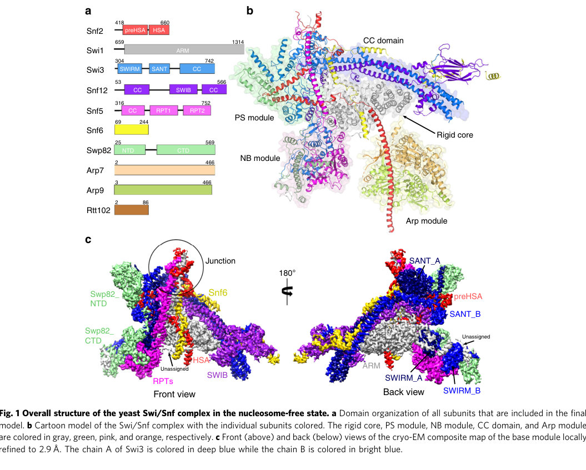

## Question

# Gene Research for Functional Annotation

## ⚠️ CRITICAL: Gene/Protein Identification Context

**BEFORE YOU BEGIN RESEARCH:** You MUST verify you are researching the CORRECT gene/protein. Gene symbols can be ambiguous, especially for less well-characterized genes from non-model organisms.

### Target Gene/Protein Identity (from UniProt):
- **UniProt Accession:** P32591
- **Protein Description:** RecName: Full=SWI/SNF complex subunit SWI3; AltName: Full=Transcription factor TYE2; AltName: Full=Transcription regulatory protein SWI3;
- **Gene Information:** Name=SWI3; Synonyms=TYE2; OrderedLocusNames=YJL176C; ORFNames=J0495;
- **Organism (full):** Saccharomyces cerevisiae (strain ATCC 204508 / S288c) (Baker's yeast).
- **Protein Family:** Not specified in UniProt
- **Key Domains:** Homeodomain-like_sf. (IPR009057); SANT/Myb. (IPR001005); SANT_dom. (IPR017884); SMARCC_C. (IPR032451); SWIRM. (IPR007526)

### MANDATORY VERIFICATION STEPS:

1. **Check if the gene symbol "SWI3" matches the protein description above**
2. **Verify the organism is correct:** Saccharomyces cerevisiae (strain ATCC 204508 / S288c) (Baker's yeast).
3. **Check if protein family/domains align with what you find in literature**
4. **If you find literature for a DIFFERENT gene with the same or similar symbol, STOP**

### If Gene Symbol is Ambiguous or You Cannot Find Relevant Literature:

**DO NOT PROCEED WITH RESEARCH ON A DIFFERENT GENE.** Instead:
- State clearly: "The gene symbol 'SWI3' is ambiguous or literature is limited for this specific protein"
- Explain what you found (e.g., "Found extensive literature on a different gene with the same symbol in a different organism")
- Describe the protein based ONLY on the UniProt information provided above
- Suggest that the protein function can be inferred from domain/family information

### Research Target:

Please provide a comprehensive research report on the gene **SWI3** (gene ID: SWI3, UniProt: P32591) in yeast.

The research report should be a detailed narrative explaining the function, biological processes, and localization of the gene product. Citations should be given for all claims.

You should prioritize authoritative reviews and primary scientific literature when conducting research. You can supplement
this with annotations you find in gene/protein databases, but these can be outdated or inaccurate.

We are specifically interested in the primary function of the gene - for enzymes, what reaction is catalyzed, and what is the substrate specificity? For transporters, what is the substrate? For structural proteins or adapters, what is the broader structural role? For signaling molecules, what is the role in the pathway.

We are interested in where in or outside the cell the gene product carries out its function.

We are also interested in the signaling or biochemical pathways in which the gene functions. We are less interested in broad pleiotropic effects, except where these elucidate the precise role.

Include evidence where possible. We are interested in both experimental evidence as well as inference from structure, evolution, or bioinformatic analysis. Precise studies should be prioritized over high-throughput, where available.

## Output

Question: You are an expert researcher providing comprehensive, well-cited information.

Provide detailed information focusing on:
1. Key concepts and definitions with current understanding
2. Recent developments and latest research (prioritize 2023-2024 sources)
3. Current applications and real-world implementations
4. Expert opinions and analysis from authoritative sources
5. Relevant statistics and data from recent studies

Format as a comprehensive research report with proper citations. Include URLs and publication dates where available.
Always prioritize recent, authoritative sources and provide specific citations for all major claims.

# Gene Research for Functional Annotation

## ⚠️ CRITICAL: Gene/Protein Identification Context

**BEFORE YOU BEGIN RESEARCH:** You MUST verify you are researching the CORRECT gene/protein. Gene symbols can be ambiguous, especially for less well-characterized genes from non-model organisms.

### Target Gene/Protein Identity (from UniProt):
- **UniProt Accession:** P32591
- **Protein Description:** RecName: Full=SWI/SNF complex subunit SWI3; AltName: Full=Transcription factor TYE2; AltName: Full=Transcription regulatory protein SWI3;
- **Gene Information:** Name=SWI3; Synonyms=TYE2; OrderedLocusNames=YJL176C; ORFNames=J0495;
- **Organism (full):** Saccharomyces cerevisiae (strain ATCC 204508 / S288c) (Baker's yeast).
- **Protein Family:** Not specified in UniProt
- **Key Domains:** Homeodomain-like_sf. (IPR009057); SANT/Myb. (IPR001005); SANT_dom. (IPR017884); SMARCC_C. (IPR032451); SWIRM. (IPR007526)

### MANDATORY VERIFICATION STEPS:

1. **Check if the gene symbol "SWI3" matches the protein description above**
2. **Verify the organism is correct:** Saccharomyces cerevisiae (strain ATCC 204508 / S288c) (Baker's yeast).
3. **Check if protein family/domains align with what you find in literature**
4. **If you find literature for a DIFFERENT gene with the same or similar symbol, STOP**

### If Gene Symbol is Ambiguous or You Cannot Find Relevant Literature:

**DO NOT PROCEED WITH RESEARCH ON A DIFFERENT GENE.** Instead:
- State clearly: "The gene symbol 'SWI3' is ambiguous or literature is limited for this specific protein"
- Explain what you found (e.g., "Found extensive literature on a different gene with the same symbol in a different organism")
- Describe the protein based ONLY on the UniProt information provided above
- Suggest that the protein function can be inferred from domain/family information

### Research Target:

Please provide a comprehensive research report on the gene **SWI3** (gene ID: SWI3, UniProt: P32591) in yeast.

The research report should be a detailed narrative explaining the function, biological processes, and localization of the gene product. Citations should be given for all claims.

You should prioritize authoritative reviews and primary scientific literature when conducting research. You can supplement
this with annotations you find in gene/protein databases, but these can be outdated or inaccurate.

We are specifically interested in the primary function of the gene - for enzymes, what reaction is catalyzed, and what is the substrate specificity? For transporters, what is the substrate? For structural proteins or adapters, what is the broader structural role? For signaling molecules, what is the role in the pathway.

We are interested in where in or outside the cell the gene product carries out its function.

We are also interested in the signaling or biochemical pathways in which the gene functions. We are less interested in broad pleiotropic effects, except where these elucidate the precise role.

Include evidence where possible. We are interested in both experimental evidence as well as inference from structure, evolution, or bioinformatic analysis. Precise studies should be prioritized over high-throughput, where available.

## Comprehensive Research Report: **SWI3 / TYE2 (YJL176C)** — SWI/SNF complex subunit Swi3 in *Saccharomyces cerevisiae* (UniProt P32591)

### 0) Target verification (critical identity check)
The requested protein is *S. cerevisiae* SWI3, explicitly mapped to **ORF YJL176C** in experimental literature, and described as a **subunit of the SWI/SNF chromatin remodeling complex**. In an oxygen-response localization study, SWI3 is listed in a table as “YJL176C SWI3 Subunit of the SWI/SNF chromatin remodeling complex,” aligning with the UniProt-provided organism and functional description. (dastidar2012thenuclearlocalization pages 2-4)

A key ambiguity in the literature is the presence of a **Swi3 homolog/paralog Swh3**, which partners with Sth1 in a distinct essential SWI/SNF-related complex (RSC-related), and does not substitute for Swi3. This distinction helps prevent confusion with non-canonical “SWI3-like” proteins. (treich1997interactionofa pages 6-7, treich1997interactionofa pages 1-2)

### 1) Key concepts and current understanding

#### 1.1 SWI/SNF chromatin remodeling complexes (definition)
SWI/SNF (“Switch/Sucrose Non-Fermentable”) is an ATP-dependent chromatin remodeling complex that alters nucleosome structure to regulate DNA accessibility, thereby impacting transcription. Foundational yeast work established that the complex uses ATP to perturb nucleosome structure and assist transcriptional regulation, and that SWI3 is among the SWI/SNF gene products required for proper transcriptional control of many yeast genes. (cairns1996tfgtaf30anc1acomponent pages 1-1, treich1997interactionofa pages 1-2)

#### 1.2 What SWI3 is (molecular function at the protein level)
SWI3 is **not an enzyme**; it is a **core structural/regulatory subunit** within SWI/SNF. Evidence supports at least three mechanistic roles:

1) **Complex membership and stability/assembly**: SWI3 is detected in purified SWI/SNF preparations monitored by immunoblotting, supporting that it is physically present in the complex. (cairns1996tfgtaf30anc1acomponent pages 1-1)

2) **Protein–protein interaction hub**: SWI3 interacts with the SWI/SNF ATPase **Snf2** in two-hybrid assays, linking it to the catalytic motor subunit. (treich1997interactionofa pages 4-4, treich1997interactionofa pages 1-2)

3) **DNA/nucleosome engagement via conserved domains**: the **SWIRM domain** of Swi3 is a conserved structural module whose structure and biochemical function were experimentally characterized; it can bind DNA (and nucleosomal DNA) and contributes to SWI/SNF assembly and stability. (da2006structureandfunction pages 4-5, da2006structureandfunction pages 2-3)

### 2) Domain architecture and structure (evidence-based)

#### 2.1 SWIRM domain: structure, DNA binding, and functional consequences
A high-confidence mechanistic advance for SWI3 is the direct biochemical/structural characterization of its **SWIRM domain**:

* **Structure**: Swi3 SWIRM forms a globular antiparallel four-helix bundle (structural description from the SWIRM-domain crystal structure study). (da2006structureandfunction pages 2-3)

* **DNA binding**: The Swi3 SWIRM domain binds nucleic acids with reported apparent Kd values ~72–90 nM in one set of assays, and a KD of **~105.36 ± 7.65 nM** reported for binding to cruciform DNA in vitro. (da2006structureandfunction pages 4-5, da2006structureandfunction pages 2-3)

* **Mutational evidence**: Structure-guided mutations in SWIRM (e.g., targeting residues implicated in binding or core stability) produce **moderate to strong swi/snf phenotypes** and can reduce Swi3 protein levels and **defectively associate with SWI/SNF**, as measured by coprecipitation with Swp73. This supports that SWIRM contributes to complex stability/assembly and likely chromatin engagement. (da2006structureandfunction pages 4-5)

#### 2.2 SANT and coiled-coil/leucine zipper features (structure and genetics)
A cryo-EM structure of yeast SWI/SNF in a nucleosome-free state shows Swi3 subunits with labeled domains, including **SWIRM_A/B and SANT_A/B** consistent with two Swi3 copies in the base module. The figure also maps overall domain organization of subunits (including Swi3’s SWIRM and SANT regions). (wang2020structureofthe media e53f6d4b)

Earlier genetic work also emphasizes a functionally important **leucine zipper motif** in Swi3 (tested via fusion constructs including “most of Swi3 including the leucine zipper”) and reports the leucine zipper is required in that experimental context. (treich1997interactionofa pages 4-4)

#### 2.3 SWI/SNF base-module architecture: two Swi3 copies as a structural backbone
Cryo-EM analysis indicates Swi3 is part of the **backbone/scaffold** of SWI/SNF:

* The model contains **two Swi3 instances (Swi3A and Swi3B)**.
* Swi3 SWIRM domains contact Snf5 RPT regions and Swi3 contributes structural helices in coiled-coil organization with Snf12.
* Swi1 and Swi3 together form a major structural backbone of the complex. (wang2020structureofthe pages 1-2)

A visually accessible summary of this architecture—including the two Swi3 copies and labeled SWIRM/SANT regions—is present in the retrieved figure panel from Wang et al. 2020. (wang2020structureofthe media e53f6d4b)

### 3) Biological roles and pathways (process-level functional annotation)

#### 3.1 Transcriptional regulation via chromatin remodeling
Foundational biochemical/genetic evidence supports that SWI3 functions within SWI/SNF to regulate transcription through chromatin remodeling:

* SWI3 is one of the SWI/SNF gene products required for proper transcriptional control of many genes, and SWI/SNF uses ATP (via Snf2 ATPase) to perturb nucleosome structure and assist transcriptional activation. (cairns1996tfgtaf30anc1acomponent pages 1-1, treich1997interactionofa pages 1-2)

* Swi3-containing complexes can activate transcription when tethered to a reporter system, and Swi3 interacts with Snf2 (two-hybrid), connecting it to the catalytic core of remodeling. (treich1997interactionofa pages 4-4, treich1997interactionofa pages 1-2)

#### 3.2 Repression / transcriptional interference (recent 2024 mechanistic context)
Recent work highlights SWI/SNF roles beyond simple “activation,” including gene repression in specific contexts:

* A 2024 Molecular Cell study found that SWI/SNF remodeling regulates transcriptional interference and gene repression. A Swi3 truncation allele (**swi3-E815X**) showed relatively mild global effects among tested targets, but displayed **significant upregulation** of certain proximal isoforms (ODC2PROX and HNT1PROX) without significant changes in corresponding distal isoforms, consistent with SWI/SNF involvement in repression at proximal TSSs in LUTI-associated regulation. (morse2024swisnfchromatinremodeling pages 12-15)

This study provides a modern experimental anchor that SWI3 contributes to context-specific repression mechanisms, not only activation. (morse2024swisnfchromatinremodeling pages 12-15)

### 4) Subcellular localization and real-world cellular implementation

#### 4.1 Nuclear localization in normoxia
SWI3 is expected to be nuclear as a chromatin remodeler subunit, and imaging experiments confirm this expectation: in air/normoxia, SWI3 (and other hypoxia-altered SWI/SNF subunits) are predominantly nuclear. (dastidar2012thenuclearlocalization pages 1-2)

#### 4.2 Condition-dependent relocalization: hypoxia-induced cytosolic accumulation
A well-defined real-world physiological implementation of SWI3 regulation is oxygen-responsive localization:

* Under hypoxia, **over 95%** of Swi3 (and several other SWI/SNF components) accumulate in the **cytosol**. (dastidar2012thenuclearlocalization pages 1-2)
* Time-course behavior: a subset becomes predominantly cytosolic within ~6 h, and all become predominantly cytosolic after 12 h hypoxia exposure; reoxygenation can restore nuclear localization quickly (within ~1 hour for many proteins), with Swi3 shown as an example. (dastidar2012thenuclearlocalization pages 1-2)

Mechanistically, the study notes differential behavior among SWI/SNF components: Swi2/Arp7/Arp9 remain nuclear while Swi3 is affected, implying oxygen can alter nuclear SWI/SNF composition by changing which subunits are nuclear. (dastidar2012thenuclearlocalization pages 8-11)

The study also reports a quantitative gene list context: **112 oxygen-regulated target genes of Swi3** are tabulated for wild-type HAP1 cells (supporting SWI/SNF-Swi3 involvement in oxygen-regulated transcription programs). (dastidar2012thenuclearlocalization pages 6-8)

### 5) Interaction partners and assembly constraints

#### 5.1 Interaction with Snf2 and functional implications
A two-hybrid screen recovered Swi3 interactions involving Snf2, supporting direct or proximal interaction between Swi3 and the ATPase motor. This reinforces a model where Swi3 helps connect regulatory/scaffold elements to the remodeling ATPase. (treich1997interactionofa pages 4-4, treich1997interactionofa pages 1-2)

#### 5.2 SWIRM-mediated contacts in cryo-EM base module
Structural analysis indicates Swi3 SWIRM domains contact Snf5 RPT regions (electrostatic interactions) within the SWI/SNF base module, supporting a direct architectural role for SWI3 in organizing conserved core components. (wang2020structureofthe pages 1-2)

### 6) Quantitative/statistical highlights from recent and classic studies

Key quantitative points directly supported by the retrieved sources include:

* **SWIRM domain DNA binding**: Swi3 SWIRM cruciform DNA binding KD **~105.36 ± 7.65 nM**, with other apparent binding estimates in the **~72–90 nM** range. (da2006structureandfunction pages 4-5, da2006structureandfunction pages 2-3)

* **Reporter assay quantitation (Swi3 homolog context)**: LexA-Swh3 activation is **~25-fold lower** than LexA-Snf2 in a lexAop reporter assay, with β-galactosidase activities including (2 operators): LexA-Swh3 **5.1 U**, LexA-Snf2 **120 U**, LexA-Sth1 **12 U**; standard errors reported as **<7%**. Although these values are for Swh3 (a Swi3 homolog/paralog), they contextualize differential activation capacity among Swi3-like proteins and highlight the importance of not confusing Swi3 with Swh3. (treich1997interactionofa pages 4-4, treich1997interactionofa pages 1-2)

* **Hypoxia relocalization**: In hypoxia, **>95% of Swi3** localizes to cytosol, reversing upon reoxygenation. (dastidar2012thenuclearlocalization pages 1-2)

* **Recent mutant phenotype (2024)**: swi3-E815X shows significant upregulation of specific proximal isoforms (ODC2PROX, HNT1PROX) with minimal changes in corresponding distal isoforms, supporting a role in repression at proximal TSSs in transcriptional interference; the excerpt is qualitative for effect size but explicit about significance and directionality. (morse2024swisnfchromatinremodeling pages 12-15)

### 7) Recent developments (prioritizing 2023–2024)

#### 7.1 2024: SWI/SNF-mediated repression via transcriptional interference
The 2024 Molecular Cell work provides direct evidence that SWI/SNF remodeling contributes to repression mechanisms in the setting of LUTI-associated regulation, with a Swi3 truncation allele showing measurable target-specific effects. (morse2024swisnfchromatinremodeling pages 12-15)

#### 7.2 How this reframes functional annotation for SWI3
A modern view supported by the above evidence is that SWI3’s “primary function” is best annotated as:

* **Structural/scaffold subunit of SWI/SNF** required for proper complex assembly and targeting, enabling ATP-dependent remodeling by the Snf2 motor; and
* A contributor to both **activation and repression** outcomes depending on promoter architecture, transcription factor context, and chromatin state (as exemplified by transcriptional interference regulation). (cairns1996tfgtaf30anc1acomponent pages 1-1, morse2024swisnfchromatinremodeling pages 12-15, wang2020structureofthe pages 1-2)

### 8) Current applications and real-world implementations

Because yeast SWI3 is a core SWI/SNF subunit, its “applications” are primarily as a tool and model in chromatin biology:

* **Model for conserved SWI/SNF mechanisms**: Structural biology has reached subunit/domain-level models (two Swi3 copies with labeled SWIRM/SANT regions), enabling mechanistic hypotheses about assembly and remodeling. (wang2020structureofthe pages 1-2, wang2020structureofthe media e53f6d4b)

* **Environmental response biology**: The oxygen-dependent nuclear/cytosolic relocalization of Swi3 suggests a mechanism by which cells can rapidly rewire transcriptional programs by altering nuclear access of chromatin remodelers (quantified as >95% cytosolic under hypoxia). (dastidar2012thenuclearlocalization pages 1-2)

### 9) Expert analysis (grounded in authoritative sources)

The strongest mechanistic evidence base indicates SWI3 is a **multi-domain architectural subunit** that integrates three functional layers:

1) **Scaffold/assembly** (two copies in base module; backbone with Swi1). (wang2020structureofthe pages 1-2)
2) **Chromatin engagement** via SWIRM domain DNA/nucleosome binding and domain-dependent stability/assembly. (da2006structureandfunction pages 4-5)
3) **Regulatory outcome shaping** (activation and repression contexts), including proximal-TSS repression in transcriptional interference. (cairns1996tfgtaf30anc1acomponent pages 1-1, morse2024swisnfchromatinremodeling pages 12-15)

### 10) Evidence summary table
The following table consolidates the evidence themes, approaches, and key quantitative results.

| Evidence theme | Key findings | Key experimental approach | Representative citations with publication year + URL |
|---|---|---|---|
| Identity / complex membership | SWI3 in *Saccharomyces cerevisiae* corresponds to YJL176C and is a defined subunit of the Swi/Snf chromatin-remodeling complex required for transcriptional control of many yeast genes; literature also distinguishes Swi3 from the paralog/homolog Swh3 that functions with Sth1 in an essential Swi/Snf-related complex rather than canonical Swi/Snf. (treich1997interactionofa pages 1-2, dastidar2012thenuclearlocalization pages 2-4) | Biochemical purification/immunoblotting of Swi/Snf complex; genetic and two-hybrid analyses distinguishing Swi3 vs. Swh3 complexes. (cairns1996tfgtaf30anc1acomponent pages 1-1, treich1997interactionofa pages 1-2) | Cairns et al., 1996, *Mol Cell Biol* / https://doi.org/10.1128/mcb.16.7.3308; Treich & Carlson, 1997, *Mol Cell Biol* / https://doi.org/10.1128/mcb.17.4.1768 |
| Domains | Swi3 contains a SWIRM domain with direct nucleic-acid binding activity and also carries SANT and leucine-zipper/coiled-coil features noted in structural and genetic studies; SWIRM mutations impair protein stability, complex association, and growth-related Swi/Snf phenotypes. GST-Swi3 SWIRM bound cruciform DNA with reported Kd ~105.36 ± 7.65 nM; apparent nucleic-acid binding was also reported in the ~72–90 nM range for the isolated domain. (da2006structureandfunction pages 4-5, da2006structureandfunction pages 2-3) | SWIRM domain structure determination plus in vitro DNA-binding assays and structure-guided mutagenesis; mutant growth and co-precipitation assays. (da2006structureandfunction pages 4-5, da2006structureandfunction pages 2-3) | Da et al., 2006, *PNAS* / https://doi.org/10.1073/pnas.0510949103; Wang et al., 2020, *Nat Commun* / https://doi.org/10.1038/s41467-020-17229-x |
| Structure / assembly | Swi3 is a backbone/scaffold subunit of yeast Swi/Snf. Cryo-EM studies identify two Swi3 copies (Swi3A/Swi3B) in the base module; Swi3 SWIRM domains contact Snf5 RPT regions, SANT elements contribute to architecture, and Swi3 helps form the outer frame with Snf12. Earlier genetic work showed Swi3 interacts with Snf2 and that the leucine-zipper motif is functionally required. (wang2020structureofthe pages 1-2, treich1997interactionofa pages 4-4, wang2020structureofthe media e53f6d4b) | Cryo-EM structural analysis of purified Swi/Snf; yeast two-hybrid interaction mapping; functional mutational analysis of Swi3 motifs. (wang2020structureofthe pages 1-2, treich1997interactionofa pages 4-4) | Wang et al., 2020, *Nat Commun* / https://doi.org/10.1038/s41467-020-17229-x; Treich & Carlson, 1997, *Mol Cell Biol* / https://doi.org/10.1128/mcb.17.4.1768 |
| Transcriptional roles | Swi3 functions within Swi/Snf to remodel nucleosomes and support transcriptional regulation. Canonical Swi/Snf facilitates transcriptional activation, and tethering assays linked Swi3-containing complexes to activation. Recent work also supports a repressive role at selected proximal promoters: the swi3-E815X allele reduces Swi/Snf-mediated repression at some LUTI-associated TSSs, though more mildly than snf2-W935R. (treich1997interactionofa pages 1-2, treich1997interactionofa pages 4-4, morse2024swisnfchromatinremodeling pages 12-15) | Reporter/tethering assays, two-hybrid assays, and recent transcript-isoform analysis of transcriptional interference targets in swi3 mutants. (treich1997interactionofa pages 4-4, morse2024swisnfchromatinremodeling pages 12-15) | Treich & Carlson, 1997, *Mol Cell Biol* / https://doi.org/10.1128/mcb.17.4.1768; Morse et al., 2024, *Molecular Cell* / https://doi.org/10.1016/j.molcel.2024.06.029 |
| Localization | Swi3 is predominantly nuclear under normoxia but relocalizes to the cytosol under hypoxia and returns to the nucleus upon reoxygenation, indicating condition-dependent control of SWI/SNF subcellular distribution. Dastidar et al. identify Swi3 as one of six Swi/Snf proteins with this behavior. (dastidar2012thenuclearlocalization pages 11-12, dastidar2012thenuclearlocalization pages 8-11, dastidar2012thenuclearlocalization pages 1-2) | GFP/live-cell fluorescence imaging and nuclear import/localization time-course assays under hypoxia and reoxygenation. (dastidar2012thenuclearlocalization pages 11-12, dastidar2012thenuclearlocalization pages 2-4) | Dastidar et al., 2012, *Cell & Bioscience* / https://doi.org/10.1186/2045-3701-2-30 |
| Quantitative data | Representative quantitative findings include: isolated Swi3 SWIRM domain DNA binding Kd ~105.36 ± 7.65 nM and ~72–90 nM in related assays; LexA-Swh3 activity was ~25-fold lower than LexA-Snf2 in reporter assays, with standard errors <7% in similar measurements; under hypoxia, >95% of Swi3 and several other Swi/Snf proteins were cytosolic, versus predominantly nuclear in air; 112 oxygen-regulated target genes were listed for Swi3 in wild-type HAP1 cells; swi3-E815X caused significant upregulation of ODC2PROX and HNT1PROX with relatively mild genome-wide effects compared with snf2 mutants. (da2006structureandfunction pages 4-5, da2006structureandfunction pages 2-3, treich1997interactionofa pages 4-4, dastidar2012thenuclearlocalization pages 6-8, dastidar2012thenuclearlocalization pages 1-2, morse2024swisnfchromatinremodeling pages 12-15) | Quantitative DNA-binding assays, β-gal reporter assays, fluorescence localization scoring across counted cells, and transcript/TSS profiling in mutant strains. (da2006structureandfunction pages 4-5, treich1997interactionofa pages 4-4, dastidar2012thenuclearlocalization pages 11-12, morse2024swisnfchromatinremodeling pages 12-15) | Da et al., 2006, *PNAS* / https://doi.org/10.1073/pnas.0510949103; Treich & Carlson, 1997, *Mol Cell Biol* / https://doi.org/10.1128/mcb.17.4.1768; Dastidar et al., 2012, *Cell & Bioscience* / https://doi.org/10.1186/2045-3701-2-30; Morse et al., 2024, *Molecular Cell* / https://doi.org/10.1016/j.molcel.2024.06.029 |

*Table: This table summarizes experimentally supported functional annotation evidence for yeast SWI3/YJL176C (UniProt P32591), organized by identity, domains, structure, transcriptional role, localization, and quantitative findings. It is useful as a compact evidence map tied to specific primary studies and context citations.*

### 11) Visual evidence (SWI3 domain placement within SWI/SNF)
A key cryo-EM figure panel (Wang et al., 2020) shows the overall SWI/SNF architecture and explicitly labels SWIRM_A/B and SANT_A/B corresponding to the two Swi3 copies (Swi3A/Swi3B) within the base module. (wang2020structureofthe media e53f6d4b)

### 12) Limitations of this evidence set
* **TYE2 synonym**: Within the retrieved full-text evidence excerpts, SWI3 is mapped to YJL176C and SWI/SNF subunit roles, but the specific synonym “TYE2” did not appear in the excerpts. Therefore, TYE2 is not explicitly supported here from the gathered documents.
* **Main-paper nucleosome-bound SWI/SNF cryo-EM figure**: The supplementary text available for Han et al. 2020 did not contain the requested architecture figure; thus, the visual support is taken from the nucleosome-free cryo-EM structure paper (Wang et al. 2020) that explicitly provides a domain map and base-module architecture. (wang2020structureofthe media e53f6d4b)

### 13) Minimal functional annotation statement (recommended)
**SWI3 (YJL176C; UniProt P32591)** encodes a **core SWI/SNF chromatin remodeling complex subunit**. Swi3 contains a **SWIRM domain** with direct DNA/nucleosome binding activity and structural roles in complex assembly, and participates as one of (at least) **two Swi3 copies** in the SWI/SNF base module that forms the complex backbone with Swi1 and contacts other conserved subunits such as Snf5. Swi3 is predominantly **nuclear** under normoxia but undergoes regulated **cytosolic relocalization under hypoxia** (>95% cytosolic), consistent with dynamic control of SWI/SNF nuclear function. Functionally, Swi3 supports context-dependent transcriptional regulation, including roles in **transcriptional interference-associated repression** as indicated by swi3-E815X effects on proximal isoform expression. (da2006structureandfunction pages 4-5, wang2020structureofthe pages 1-2, dastidar2012thenuclearlocalization pages 1-2, morse2024swisnfchromatinremodeling pages 12-15)

References

1. (dastidar2012thenuclearlocalization pages 2-4): Ranita Ghosh Dastidar, Jagmohan Hooda, Ajit Shah, Thai M Cao, Robert Michael Henke, and Li Zhang. The nuclear localization of swi/snf proteins is subjected to oxygen regulation. Cell & Bioscience, 2:30-30, Aug 2012. URL: https://doi.org/10.1186/2045-3701-2-30, doi:10.1186/2045-3701-2-30. This article has 87 citations and is from a peer-reviewed journal.

2. (treich1997interactionofa pages 6-7): Isabelle Treich and Marian Carlson. Interaction of a swi3 homolog with sth1 provides evidence for a swi/snf-related complex with an essential function in saccharomyces cerevisiae. Molecular and Cellular Biology, 17:1768-1775, Apr 1997. URL: https://doi.org/10.1128/mcb.17.4.1768, doi:10.1128/mcb.17.4.1768. This article has 65 citations and is from a domain leading peer-reviewed journal.

3. (treich1997interactionofa pages 1-2): Isabelle Treich and Marian Carlson. Interaction of a swi3 homolog with sth1 provides evidence for a swi/snf-related complex with an essential function in saccharomyces cerevisiae. Molecular and Cellular Biology, 17:1768-1775, Apr 1997. URL: https://doi.org/10.1128/mcb.17.4.1768, doi:10.1128/mcb.17.4.1768. This article has 65 citations and is from a domain leading peer-reviewed journal.

4. (cairns1996tfgtaf30anc1acomponent pages 1-1): Bradley R. Cairns, N. Lynn Henry, and Roger D. Kornberg. Tfg/taf30/anc1, a component of the yeast swi/snf complex that is similar to the leukemogenic proteins enl and af-9. Molecular and Cellular Biology, 16:3308-3316, Jul 1996. URL: https://doi.org/10.1128/mcb.16.7.3308, doi:10.1128/mcb.16.7.3308. This article has 213 citations and is from a domain leading peer-reviewed journal.

5. (treich1997interactionofa pages 4-4): Isabelle Treich and Marian Carlson. Interaction of a swi3 homolog with sth1 provides evidence for a swi/snf-related complex with an essential function in saccharomyces cerevisiae. Molecular and Cellular Biology, 17:1768-1775, Apr 1997. URL: https://doi.org/10.1128/mcb.17.4.1768, doi:10.1128/mcb.17.4.1768. This article has 65 citations and is from a domain leading peer-reviewed journal.

6. (da2006structureandfunction pages 4-5): Guoping Da, Jeffrey Lenkart, Kehao Zhao, Ramin Shiekhattar, Bradley R. Cairns, and Ronen Marmorstein. Structure and function of the swirm domain, a conserved protein module found in chromatin regulatory complexes. Proceedings of the National Academy of Sciences of the United States of America, 103:2057-2062, Feb 2006. URL: https://doi.org/10.1073/pnas.0510949103, doi:10.1073/pnas.0510949103. This article has 139 citations and is from a highest quality peer-reviewed journal.

7. (da2006structureandfunction pages 2-3): Guoping Da, Jeffrey Lenkart, Kehao Zhao, Ramin Shiekhattar, Bradley R. Cairns, and Ronen Marmorstein. Structure and function of the swirm domain, a conserved protein module found in chromatin regulatory complexes. Proceedings of the National Academy of Sciences of the United States of America, 103:2057-2062, Feb 2006. URL: https://doi.org/10.1073/pnas.0510949103, doi:10.1073/pnas.0510949103. This article has 139 citations and is from a highest quality peer-reviewed journal.

8. (wang2020structureofthe media e53f6d4b): Chengcheng Wang, Zhouyan Guo, Xiechao Zhan, Fenghua Yang, Mingxuan Wu, and Xiaofeng Zhang. Structure of the yeast swi/snf complex in a nucleosome free state. Nature Communications, Jul 2020. URL: https://doi.org/10.1038/s41467-020-17229-x, doi:10.1038/s41467-020-17229-x. This article has 29 citations and is from a highest quality peer-reviewed journal.

9. (wang2020structureofthe pages 1-2): Chengcheng Wang, Zhouyan Guo, Xiechao Zhan, Fenghua Yang, Mingxuan Wu, and Xiaofeng Zhang. Structure of the yeast swi/snf complex in a nucleosome free state. Nature Communications, Jul 2020. URL: https://doi.org/10.1038/s41467-020-17229-x, doi:10.1038/s41467-020-17229-x. This article has 29 citations and is from a highest quality peer-reviewed journal.

10. (morse2024swisnfchromatinremodeling pages 12-15): Kaitlin Morse, Alena L. Bishop, Sarah Swerdlow, Jessica M. Leslie, and Elçin Ünal. Swi/snf chromatin remodeling regulates transcriptional interference and gene repression. Aug 2024. URL: https://doi.org/10.1016/j.molcel.2024.06.029, doi:10.1016/j.molcel.2024.06.029. This article has 21 citations and is from a highest quality peer-reviewed journal.

11. (dastidar2012thenuclearlocalization pages 1-2): Ranita Ghosh Dastidar, Jagmohan Hooda, Ajit Shah, Thai M Cao, Robert Michael Henke, and Li Zhang. The nuclear localization of swi/snf proteins is subjected to oxygen regulation. Cell & Bioscience, 2:30-30, Aug 2012. URL: https://doi.org/10.1186/2045-3701-2-30, doi:10.1186/2045-3701-2-30. This article has 87 citations and is from a peer-reviewed journal.

12. (dastidar2012thenuclearlocalization pages 8-11): Ranita Ghosh Dastidar, Jagmohan Hooda, Ajit Shah, Thai M Cao, Robert Michael Henke, and Li Zhang. The nuclear localization of swi/snf proteins is subjected to oxygen regulation. Cell & Bioscience, 2:30-30, Aug 2012. URL: https://doi.org/10.1186/2045-3701-2-30, doi:10.1186/2045-3701-2-30. This article has 87 citations and is from a peer-reviewed journal.

13. (dastidar2012thenuclearlocalization pages 6-8): Ranita Ghosh Dastidar, Jagmohan Hooda, Ajit Shah, Thai M Cao, Robert Michael Henke, and Li Zhang. The nuclear localization of swi/snf proteins is subjected to oxygen regulation. Cell & Bioscience, 2:30-30, Aug 2012. URL: https://doi.org/10.1186/2045-3701-2-30, doi:10.1186/2045-3701-2-30. This article has 87 citations and is from a peer-reviewed journal.

14. (dastidar2012thenuclearlocalization pages 11-12): Ranita Ghosh Dastidar, Jagmohan Hooda, Ajit Shah, Thai M Cao, Robert Michael Henke, and Li Zhang. The nuclear localization of swi/snf proteins is subjected to oxygen regulation. Cell & Bioscience, 2:30-30, Aug 2012. URL: https://doi.org/10.1186/2045-3701-2-30, doi:10.1186/2045-3701-2-30. This article has 87 citations and is from a peer-reviewed journal.

## Artifacts

- [Edison artifact artifact-00](SWI3-deep-research-falcon_artifacts/artifact-00.md)

## Citations

1. dastidar2012thenuclearlocalization pages 2-4
2. da2006structureandfunction pages 2-3
3. da2006structureandfunction pages 4-5
4. treich1997interactionofa pages 4-4
5. wang2020structureofthe pages 1-2
6. morse2024swisnfchromatinremodeling pages 12-15
7. dastidar2012thenuclearlocalization pages 1-2
8. dastidar2012thenuclearlocalization pages 8-11
9. dastidar2012thenuclearlocalization pages 6-8
10. treich1997interactionofa pages 6-7
11. treich1997interactionofa pages 1-2
12. dastidar2012thenuclearlocalization pages 11-12
13. https://doi.org/10.1128/mcb.16.7.3308;
14. https://doi.org/10.1128/mcb.17.4.1768
15. https://doi.org/10.1073/pnas.0510949103;
16. https://doi.org/10.1038/s41467-020-17229-x
17. https://doi.org/10.1038/s41467-020-17229-x;
18. https://doi.org/10.1128/mcb.17.4.1768;
19. https://doi.org/10.1016/j.molcel.2024.06.029
20. https://doi.org/10.1186/2045-3701-2-30
21. https://doi.org/10.1186/2045-3701-2-30;
22. https://doi.org/10.1186/2045-3701-2-30,
23. https://doi.org/10.1128/mcb.17.4.1768,
24. https://doi.org/10.1128/mcb.16.7.3308,
25. https://doi.org/10.1073/pnas.0510949103,
26. https://doi.org/10.1038/s41467-020-17229-x,
27. https://doi.org/10.1016/j.molcel.2024.06.029,