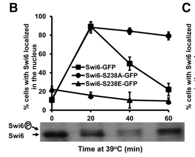

## Question

# Gene Research for Functional Annotation

## ⚠️ CRITICAL: Gene/Protein Identification Context

**BEFORE YOU BEGIN RESEARCH:** You MUST verify you are researching the CORRECT gene/protein. Gene symbols can be ambiguous, especially for less well-characterized genes from non-model organisms.

### Target Gene/Protein Identity (from UniProt):
- **UniProt Accession:** P09959
- **Protein Description:** RecName: Full=Regulatory protein SWI6; AltName: Full=Cell-cycle box factor subunit SWI6; AltName: Full=MBF subunit P90; AltName: Full=Trans-acting activator of HO endonuclease gene;
- **Gene Information:** Name=SWI6; OrderedLocusNames=YLR182W; ORFNames=L9470.8;
- **Organism (full):** Saccharomyces cerevisiae (strain ATCC 204508 / S288c) (Baker's yeast).
- **Protein Family:** Not specified in UniProt
- **Key Domains:** Ankyrin_rpt. (IPR002110); Ankyrin_rpt-contain_sf. (IPR036770); SWI6-like. (IPR051642); Swi6_N. (IPR040822); Ank (PF00023)

### MANDATORY VERIFICATION STEPS:

1. **Check if the gene symbol "SWI6" matches the protein description above**
2. **Verify the organism is correct:** Saccharomyces cerevisiae (strain ATCC 204508 / S288c) (Baker's yeast).
3. **Check if protein family/domains align with what you find in literature**
4. **If you find literature for a DIFFERENT gene with the same or similar symbol, STOP**

### If Gene Symbol is Ambiguous or You Cannot Find Relevant Literature:

**DO NOT PROCEED WITH RESEARCH ON A DIFFERENT GENE.** Instead:
- State clearly: "The gene symbol 'SWI6' is ambiguous or literature is limited for this specific protein"
- Explain what you found (e.g., "Found extensive literature on a different gene with the same symbol in a different organism")
- Describe the protein based ONLY on the UniProt information provided above
- Suggest that the protein function can be inferred from domain/family information

### Research Target:

Please provide a comprehensive research report on the gene **SWI6** (gene ID: SWI6, UniProt: P09959) in yeast.

The research report should be a detailed narrative explaining the function, biological processes, and localization of the gene product. Citations should be given for all claims.

You should prioritize authoritative reviews and primary scientific literature when conducting research. You can supplement
this with annotations you find in gene/protein databases, but these can be outdated or inaccurate.

We are specifically interested in the primary function of the gene - for enzymes, what reaction is catalyzed, and what is the substrate specificity? For transporters, what is the substrate? For structural proteins or adapters, what is the broader structural role? For signaling molecules, what is the role in the pathway.

We are interested in where in or outside the cell the gene product carries out its function.

We are also interested in the signaling or biochemical pathways in which the gene functions. We are less interested in broad pleiotropic effects, except where these elucidate the precise role.

Include evidence where possible. We are interested in both experimental evidence as well as inference from structure, evolution, or bioinformatic analysis. Precise studies should be prioritized over high-throughput, where available.

## Output

Question: You are an expert researcher providing comprehensive, well-cited information.

Provide detailed information focusing on:
1. Key concepts and definitions with current understanding
2. Recent developments and latest research (prioritize 2023-2024 sources)
3. Current applications and real-world implementations
4. Expert opinions and analysis from authoritative sources
5. Relevant statistics and data from recent studies

Format as a comprehensive research report with proper citations. Include URLs and publication dates where available.
Always prioritize recent, authoritative sources and provide specific citations for all major claims.

# Gene Research for Functional Annotation

## ⚠️ CRITICAL: Gene/Protein Identification Context

**BEFORE YOU BEGIN RESEARCH:** You MUST verify you are researching the CORRECT gene/protein. Gene symbols can be ambiguous, especially for less well-characterized genes from non-model organisms.

### Target Gene/Protein Identity (from UniProt):
- **UniProt Accession:** P09959
- **Protein Description:** RecName: Full=Regulatory protein SWI6; AltName: Full=Cell-cycle box factor subunit SWI6; AltName: Full=MBF subunit P90; AltName: Full=Trans-acting activator of HO endonuclease gene;
- **Gene Information:** Name=SWI6; OrderedLocusNames=YLR182W; ORFNames=L9470.8;
- **Organism (full):** Saccharomyces cerevisiae (strain ATCC 204508 / S288c) (Baker's yeast).
- **Protein Family:** Not specified in UniProt
- **Key Domains:** Ankyrin_rpt. (IPR002110); Ankyrin_rpt-contain_sf. (IPR036770); SWI6-like. (IPR051642); Swi6_N. (IPR040822); Ank (PF00023)

### MANDATORY VERIFICATION STEPS:

1. **Check if the gene symbol "SWI6" matches the protein description above**
2. **Verify the organism is correct:** Saccharomyces cerevisiae (strain ATCC 204508 / S288c) (Baker's yeast).
3. **Check if protein family/domains align with what you find in literature**
4. **If you find literature for a DIFFERENT gene with the same or similar symbol, STOP**

### If Gene Symbol is Ambiguous or You Cannot Find Relevant Literature:

**DO NOT PROCEED WITH RESEARCH ON A DIFFERENT GENE.** Instead:
- State clearly: "The gene symbol 'SWI6' is ambiguous or literature is limited for this specific protein"
- Explain what you found (e.g., "Found extensive literature on a different gene with the same symbol in a different organism")
- Describe the protein based ONLY on the UniProt information provided above
- Suggest that the protein function can be inferred from domain/family information

### Research Target:

Please provide a comprehensive research report on the gene **SWI6** (gene ID: SWI6, UniProt: P09959) in yeast.

The research report should be a detailed narrative explaining the function, biological processes, and localization of the gene product. Citations should be given for all claims.

You should prioritize authoritative reviews and primary scientific literature when conducting research. You can supplement
this with annotations you find in gene/protein databases, but these can be outdated or inaccurate.

We are specifically interested in the primary function of the gene - for enzymes, what reaction is catalyzed, and what is the substrate specificity? For transporters, what is the substrate? For structural proteins or adapters, what is the broader structural role? For signaling molecules, what is the role in the pathway.

We are interested in where in or outside the cell the gene product carries out its function.

We are also interested in the signaling or biochemical pathways in which the gene functions. We are less interested in broad pleiotropic effects, except where these elucidate the precise role.

Include evidence where possible. We are interested in both experimental evidence as well as inference from structure, evolution, or bioinformatic analysis. Precise studies should be prioritized over high-throughput, where available.

# Functional annotation report: *Saccharomyces cerevisiae* SWI6 (P09959/YLR182W)

## Executive conclusion

**Identity is verified.** The requested protein is the approximately 90-kDa regulatory protein Swi6 of budding yeast *Saccharomyces cerevisiae* S288c, encoded by **SWI6/YLR182W** and represented by UniProt **P09959**. Its defining literature-supported role is as the shared regulatory/transcription-activation subunit of two G1/S transcription factors: **SBF = Swi4–Swi6** and **MBF = Mbp1–Swi6**. This agrees with the supplied names “cell-cycle box factor subunit SWI6,” “MBF subunit P90,” and “trans-acting activator of *HO*.” (baetz1999regulationofcell pages 1-2, belanger2022exportincrm1is pages 8-10)

The symbol is highly ambiguous across yeasts. In particular, *Schizosaccharomyces pombe* Swi6 is an HP1-family heterochromatin protein and is **not** the protein assessed here. Claims about centromeric heterochromatin from that system must not be transferred to P09959. The matching organism, SBF/MBF partners, approximately 90-kDa size, ankyrin-repeat architecture, and regulated nucleocytoplasmic shuttling collectively confirm the budding-yeast identity. (baetz2000multiplelevelsof pages 30-37, belanger2022exportincrm1is pages 8-10)

**Primary functional annotation:** Swi6 is neither an enzyme nor a transporter. It has no known catalytic reaction or transported substrate. It is a modular, non-sequence-specific transcriptional regulatory subunit that enables and regulates promoter binding, provides activation functions, recruits or interfaces with other regulatory proteins, and couples cell-cycle and stress signals to transcription.

| Feature | Evidence-based annotation | Mechanistic consequence |
|---|---|---|
| Identity and ambiguity exclusion | **SWI6/YLR182W, UniProt P09959** is the approximately 90-kDa Swi6 protein of *Saccharomyces cerevisiae* S288c. It is the shared subunit of SBF and MBF, not the unrelated *Schizosaccharomyces pombe* Swi6/HP1 heterochromatin protein. (baetz1999regulationofcell pages 1-2, belanger2022exportincrm1is pages 8-10) | Establishes that the annotation concerns the budding-yeast G1/S transcriptional regulator and excludes same-symbol proteins from other organisms. |
| Biochemical class | Non-enzymatic, non-sequence-specific transcriptional regulatory/activation subunit; no catalytic reaction or transported substrate is known. Swi4 or Mbp1 supplies sequence-specific DNA recognition. (macpherson1999identificationandcharacterizaton pages 42-48, baetz1999regulationofcell pages 1-2, baetz2000multiplelevelsof pages 30-37) | Swi6 functions principally as a protein-interaction scaffold and regulatory cofactor that enables promoter binding and transcriptional activation. |
| SBF partner and SCB motif | Swi6 associates with Swi4 to form **SBF**. Swi4 recognizes SCB elements, reported as CACGAAA/CGCGAA-related sequences; Swi6 relieves Swi4 autoinhibition and is required for normal promoter occupancy and activation. (siegmund1996thesaccharomycescerevisiae pages 6-7, baetz1999regulationofcell pages 1-2, stephan2022interactionsstructuralaspects pages 4-5) | Activates late-G1 genes involved in Start, budding, cell-wall organization, and G1 cyclin expression, including *CLN1* and *CLN2*. |
| MBF partner and MCB motif | Swi6 associates with Mbp1 to form **MBF**. Mbp1 recognizes MCB elements, while Swi6 provides shared regulatory and activation functions. (macpherson1999identificationandcharacterizaton pages 42-48, baetz2000multiplelevelsof pages 30-37, stephan2022interactionsstructuralaspects pages 4-5) | Drives G1/S transcription of genes needed chiefly for DNA synthesis, replication, and repair, including the *CLB5* program. |
| Ankyrin and interaction architecture | Swi6 contains approximately four to four-and-a-half central ankyrin repeats used in protein interactions, activation regions flanking the repeats, and a C-terminal region required for association with Swi4; ankyrin mutations can differentially impair SBF or MBF. (macpherson1999identificationandcharacterizaton pages 42-48, baetz2000multiplelevelsof pages 30-37) | Provides a modular interaction platform that couples DNA-binding partners to transcriptional activation and permits complex-specific regulation. |
| Cell-cycle localization and Ser160 | Swi6 is predominantly nuclear in late M and G1 but largely cytoplasmic during S, G2, and early M. Cdc28-dependent phosphorylation at **Ser160**, adjacent to an NLS, reduces nuclear import; S160A is constitutively nuclear. (macpherson1999identificationandcharacterizaton pages 42-48, baetz1999regulationofcell pages 1-2, kim2010yeastmpk1cell pages 5-6) | Regulated nucleocytoplasmic shuttling limits SBF/MBF promoter activity to the appropriate cell-cycle interval. |
| Cell-wall stress and Mpk1/Ser238 | During cell-wall stress, activated Mpk1/Slt2 first recruits Swi6 to a nuclear Mpk1–Swi4 complex and subsequently phosphorylates **Ser238** beside a second NLS. S238 phosphorylation inhibits further nuclear entry; S238A enters the nucleus but fails to return efficiently to the cytoplasm. (kim2010yeastmpk1cell pages 1-2, kim2010yeastmpk1cell pages 5-6, kim2010yeastmpk1cell media 75fcd052) | Integrates cell-wall-integrity MAPK signaling with Swi6 localization and stress-induced transcription, including activation of *FKS2*. |
| Crm1/Msn5 export | Swi6 uses at least two exportins: Crm1/Xpo1 and Msn5. A leucine-rich Crm1-responsive NES includes L250, L254, L257, and L258; its disruption preferentially reduces MBF reporter activity, whereas Msn5 contributes differently to Swi6-regulated expression. (belanger2022exportincrm1is pages 10-11, belanger2022exportincrm1is pages 8-10, belanger2022exportincrm1is pages 4-7) | Distinct export routes help specify MBF-versus-SBF output rather than serving only as redundant bulk-export mechanisms; export defects also increase cell size. |
| Major biological outputs | Swi6-containing SBF and MBF coordinate Start commitment, G1/S transcription, budding and cell-wall biogenesis, DNA replication and repair, and selected stress responses. Swi6 also contributes to regulation of *HO*, but it is not a chromatin-remodeling ATPase or the HO nuclease itself. (macpherson1999identificationandcharacterizaton pages 42-48, baetz1999regulationofcell pages 1-2, fong2008oxidantinducedcellcycledelay pages 8-9, kim2010yeastmpk1cell pages 1-2) | Couples growth and environmental signals to a temporally ordered transcriptional program that prepares cells for budding and genome duplication. |
| 2024 quantitative updates | A 2024 study estimated that SBF and MBF jointly regulate about **200 cell-cycle genes** and identified **19** appreciably phosphorylated Whi5 sites, including **7** early-G1 sites required for normal size and G1/S timing. The 2024 START-BYCC model reproduced key behavior of approximately **150 START mutants**; combined non-phosphorylatable Whi5/Swi6 variants were about **40% larger**, supporting partially redundant activation through Whi5 or Swi6 phosphorylation. (ravi2024modelingthestart pages 5-6, xiao2024whi5hypoand pages 1-3, ravi2024modelingthestart pages 1-2) | Current models treat Swi6 as an explicit, regulated Start-network node whose phosphorylation and localization cooperate with—but are not strictly subordinate to—Whi5 in controlling commitment and cell size. |

*Table: Evidence-based annotation of budding-yeast Swi6/P09959, covering its identity, molecular role, regulatory complexes, domain architecture, localization, and major biological outputs. The table also highlights recent quantitative updates to the Swi6-containing Start network.*

## 1. Molecular function and mechanism

### 1.1 Division of labor in SBF and MBF

In **SBF**, Swi4 supplies sequence-specific recognition of SCB elements, while Swi6 binds Swi4’s conserved C-terminal region. SCB sequences have been reported in related forms such as CACGAAA and CGCGAA. Swi6 relieves an autoinhibitory interaction between the Swi4 C terminus and its N-terminal DNA-binding domain, thereby permitting productive promoter binding. In *swi6Δ* cells, the CLN2-promoter SCB footprint disappears and *CLN1/CLN2* transcription is reduced, supporting an enabling role for Swi6 rather than direct sequence recognition. (siegmund1996thesaccharomycescerevisiae pages 6-7, baetz1999regulationofcell pages 1-2, stephan2022interactionsstructuralaspects pages 4-5)

In **MBF**, Mbp1 supplies recognition of MCB elements, and Swi6 again acts as the shared regulatory/activation partner. Swi6 itself has no demonstrated sequence-specific DNA-binding activity and does not make the defining DNA contacts in either complex. SBF and MBF regulate overlapping but functionally biased programs: SBF is particularly associated with Start, G1 cyclins, budding and cell-wall organization, whereas MBF preferentially regulates DNA-synthesis, replication and repair genes. Functional overlap permits partial compensation between the two complexes. (macpherson1999identificationandcharacterizaton pages 42-48, baetz2000multiplelevelsof pages 30-37, ravi2024modelingthestart pages 2-3)

SBF-regulated examples include *CLN1, CLN2, PCL1, PCL2,* and *HO*, together with cell-wall genes. MBF-regulated programs include S-phase genes such as *CLB5*. Recent synthesis places the combined SBF/MBF regulon at approximately **200 cell-cycle-regulated genes**, spanning DNA replication, mitosis and associated cell-cycle functions. This number refers to the two Swi6-containing complexes collectively, not to promoters bound independently by Swi6. (baetz1999regulationofcell pages 1-2, xiao2024whi5hypoand pages 1-3)

### 1.2 Domain and structural interpretation

The supplied InterPro/Pfam annotations—**Ankyrin repeat, ankyrin-repeat superfamily, SWI6-like, Swi6_N and Ank/PF00023**—fit the experimental literature. Swi6 has roughly four to four-and-a-half central ankyrin repeats, activation regions flanking this repeat block, and a C-terminal interaction region needed for association with Swi4. Ankyrin repeats are protein-interaction modules rather than catalytic domains. Mutations in these repeats can selectively impair SBF or MBF activity even when in-vitro DNA binding is retained, while deleting the repeat region can derepress Swi6-dependent transcription. These observations indicate that the repeats organize partner-specific conformations and regulatory interactions rather than simply tethering Swi6 to DNA. (macpherson1999identificationandcharacterizaton pages 42-48, baetz2000multiplelevelsof pages 30-37)

This domain evidence therefore supports classifying P09959 as an **ankyrin-repeat transcriptional adaptor/activator**. The data do not support classifying it as a DNA-binding factor in isolation, chromatin-remodeling ATPase, kinase, or HO endonuclease.

## 2. Biological process and pathway placement

### 2.1 The Start/G1-to-S transcriptional switch

Swi6 functions centrally at **Start**, the late-G1 commitment transition preceding budding and genome duplication. Before Start, SBF is inhibited by nuclear Whi5. Growth- and nutrient-responsive inputs involving Cln3–Cdk1 and Bck2 raise SBF/MBF output; SBF then induces *CLN1/CLN2*, whose Cdk1 complexes reinforce transcription through positive feedback. MBF contributes the DNA-replication program, including *CLB5/CLB6*. SBF and MBF can partly substitute for one another—MBF can support some *CLN1/2* expression without SBF, and SBF can support some *CLB5/6* expression without MBF. (ravi2024modelingthestart pages 2-3, xiao2024whi5hypoand pages 1-3)

Current expert interpretation is more nuanced than a simple “Cln3 phosphorylates Whi5, Whi5 exits, SBF turns on” switch. A 2024 study found that Whi5 has **19 appreciably phosphorylated sites**; mutating the **seven** sites responsible for early-G1 hypophosphorylation increased cell size and delayed G1/S. Cks1-dependent priming accelerates late-G1 hyperphosphorylation, which is required for full SBF-target expression and timely progression through both G1/S and later S/G2/M phases. The same study emphasizes that Cln3 and Whi5 can act as partly separate inputs to SBF rather than forming a single linear pathway. Xiao et al., published June 3, 2024, Current Biology, DOI: https://doi.org/10.1016/j.cub.2024.04.052. (xiao2024whi5hypoand pages 1-3)

Swi6 phosphorylation provides an additional activation route. Genetic evidence summarized in the 2024 START-BYCC study showed that a combined nonphosphorylatable **WHI5-12A SWI6-SA4** genotype was approximately **40% larger**, whereas the individual mutants were reported as approximately wild-type-sized. This supports partial redundancy: phosphorylation of Whi5 or Swi6 can permit timely SBF activation, and neither event alone is an absolute on/off requirement. (ravi2024modelingthestart pages 5-6)

### 2.2 Cell-wall-integrity signaling

Swi6 also connects the Pkc1–Bck1–Mkk1/2–Mpk1/Slt2 cell-wall-integrity pathway to transcription. During wall stress, activated Mpk1 forms a complex with Swi4 and recruits Swi6 to the nucleus; Swi6 is required in this complex for full stress-induced *FKS2* transcription. Mpk1 subsequently phosphorylates Swi6 at **Ser238**, reducing further nuclear import. Thus, the response is biphasic: rapid nuclear recruitment initiates transcription, and delayed phosphorylation promotes return toward a cytoplasmic state. Kim et al., published May 1, 2010, Molecular Biology of the Cell, DOI: https://doi.org/10.1091/mbc.e09-11-0923. (kim2010yeastmpk1cell pages 1-2, kim2010yeastmpk1cell pages 5-6)

The experiments provide unusually direct quantitative evidence. Following a shift to 39°C, the nuclear fraction of wild-type Swi6-GFP rose to roughly **85–90% at 20 minutes** and fell to approximately **20% by 60 minutes**. The nonphosphorylatable S238A variant remained nuclear in roughly **80%** of cells at 60 minutes, whereas phosphomimetic S238E largely failed to accumulate in nuclei. K231A or I232A substitutions in the neighboring second NLS also blocked heat-induced import. These data directly connect sequence elements, phosphorylation and subcellular location. (kim2010yeastmpk1cell pages 5-6, kim2010yeastmpk1cell media 75fcd052, kim2010yeastmpk1cell media 6c1e6b94)

### 2.3 Other physiological contexts

Swi6-dependent transcription contributes to oxidative-stress adaptation. After one hour of 0.03 mM linoleic-acid hydroperoxide, comparison of wild type with *swi6Δ* showed altered induction of chaperone/stress, ribosomal and glucose-metabolic genes, while purine-ribonucleotide metabolism and weaker DNA-repair/cell-division categories were relatively increased in the mutant. Because these are transcriptome-level consequences and may include compensatory effects, they should be interpreted as evidence that Swi6 shapes the stress response, not that every affected gene is a direct Swi6 target. Fong et al., 2008, DOI: https://doi.org/10.1111/j.1567-1364.2007.00349.x. (fong2008oxidantinducedcellcycledelay pages 8-9)

At meiotic entry, recent work shows that mitotic SBF activity must be restrained. The 2024 study by Su, Yendluri and Ünal found that a meiosis-specific SWI4 LUTI mechanism and Whi5 jointly inhibit SBF; excessive SBF causes reduced early-meiotic-gene expression and delayed meiotic entry, largely through SBF-target G1 cyclins that interfere with Ime1–Ume6. Swi6 is the shared SBF/MBF component, but the new direct regulation in this study concerns Swi4 and Whi5 rather than a meiosis-specific change in Swi6. Published February 27, 2024, eLife, DOI: https://doi.org/10.7554/eLife.90425. (su2024controlofmeiotic pages 1-2)

## 3. Subcellular localization

Swi6 acts primarily **in the nucleus at target promoters**, but its availability is controlled by nucleocytoplasmic shuttling. It is predominantly nuclear during late mitosis and G1, when SBF/MBF promoter functions are required, and more cytoplasmic during S phase, G2 and early mitosis. Swi4 remains nuclear more continuously, emphasizing that regulated Swi6 transport is a key control point. (macpherson1999identificationandcharacterizaton pages 42-48, baetz1999regulationofcell pages 1-2)

Two phosphorylation-sensitive nuclear-localization modules have been resolved:

- **NLS1/Ser160:** Cdc28-dependent phosphorylation of Ser160 adjacent to an NLS inhibits nuclear entry; S160A is constitutively nuclear.
- **NLS2/Ser238:** Mpk1 phosphorylates Ser238 adjacent to a second NLS during wall stress. Kap120 recognizes this Mpk1-regulated NLS, while the classical import pathway contributes to the other import route. (kim2010yeastmpk1cell pages 1-2, kim2010yeastmpk1cell pages 5-6, kim2010yeastmpk1cell media 6c1e6b94)

Nuclear export is also specialized. A 2022 study identified a leucine-rich Crm1/Xpo1-responsive NES containing **L250, L254, L257 and L258**. Swi6 uses at least two exportins, Crm1 and Msn5, through distinct signals. Disrupting the Crm1-responsive NES preferentially reduced MBF reporter activity without measurably reducing SBF reporter activity and enlarged cells; combining this alteration with *msn5Δ* worsened the size phenotype. This argues that trafficking routes help encode complex-specific transcriptional function rather than merely clearing Swi6 from the nucleus. Belanger et al., February 2022, BMC Molecular and Cell Biology, DOI: https://doi.org/10.1186/s12860-022-00409-6. (belanger2022exportincrm1is pages 10-11, belanger2022exportincrm1is pages 8-10, belanger2022exportincrm1is pages 4-7)

## 4. Experimental evidence and confidence assessment

**High-confidence conclusions** are supported by multiple focused experiments:

1. **Complex membership and division of labor:** biochemical interaction, promoter-footprinting, deletion and reporter studies establish Swi6 as the common non-DNA-binding regulatory component of SBF/MBF. (siegmund1996thesaccharomycescerevisiae pages 6-7, baetz1999regulationofcell pages 1-2, baetz2000multiplelevelsof pages 30-37)
2. **Ankyrin-repeat regulatory architecture:** deletion and point-mutation studies show complex-specific effects on SBF/MBF transcription. (macpherson1999identificationandcharacterizaton pages 42-48)
3. **Regulated localization:** synchronized-cell microscopy, phosphosite mutants and transport-factor perturbations establish Ser160-, Ser238-, Crm1- and Msn5-dependent shuttling. (kim2010yeastmpk1cell pages 5-6, belanger2022exportincrm1is pages 8-10, belanger2022exportincrm1is pages 4-7)
4. **Physiological output:** loss or altered trafficking of Swi6 affects G1/S transcription and cell size; stress experiments establish a direct role in Mpk1–Swi4-dependent *FKS2* induction. (kim2010yeastmpk1cell pages 1-2, belanger2022exportincrm1is pages 1-2)

**Moderate-confidence or model-dependent conclusions** include exact stoichiometries and the sufficiency of particular phospho-forms. The 2024 START-BYCC model explicitly represents localization, free and promoter-bound SBF/MBF pools, Whi5 binding, and Swi6 phosphorylation. It contains **51 Start-regulation species and 56 parameters**, versus one species and eight parameters for Start in the earlier framework, and reproduced about **95%** of assessed mutant phenotypes or approximately **150 START mutants**, depending on the reported analysis set. These are strong systems-level validations, but individual inferred state occupancies remain model predictions requiring direct measurement. Ravi et al., published August 2, 2024, PLOS Computational Biology, DOI: https://doi.org/10.1371/journal.pcbi.1012048. (ravi2024modelingthestart pages 1-2, ravi2024modelingthestart pages 6-9, ravi2024modelingthestart pages 9-10)

## 5. Recent developments, 2023–2024

Direct 2023–2024 work on Swi6 itself is relatively sparse; the major advances concern the network in which it operates.

- **Revised Start logic (2024):** Whi5 phosphorylation is multisite and dynamically staged, and Cln3 and Whi5 are increasingly viewed as separable inputs to SBF. This makes Swi6-containing SBF an integration node rather than the endpoint of one linear Whi5 pathway. (xiao2024whi5hypoand pages 1-3)
- **Quantitative systems model (2024):** START-BYCC incorporated Swi6 phospho-states, localization and SBF/MBF complexes and reproduced approximately 150 mutant behaviors, including size and nutritional phenotypes. The code, parameters and simulator were made publicly available through the paper’s GitHub and SBML simulator links. (ravi2024modelingthestart pages 1-2)
- **Meiotic-state exclusion (2024):** inappropriate SBF activity antagonizes early meiosis, although the newly identified direct control is primarily SWI4-LUTI/Whi5 rather than a novel biochemical activity of Swi6. (su2024controlofmeiotic pages 1-2)
- **Chromatin context (2023 review):** budding-yeast SBF/MBF can interface with chromatin cofactors, including FACT and Rpd3L-related machinery at G1/S promoters. This is compatible with Swi6 acting within promoter-bound regulatory assemblies, but does not make Swi6 itself a chromatin-remodeling enzyme. Takahata and Murakami, February 2023, Biomolecules, DOI: https://doi.org/10.3390/biom13020377. (takahata2023opposingrolesof pages 12-14)

## 6. Applications and real-world implementations

Swi6 is chiefly a **research-system component**, not a clinical or industrial enzyme target with a substrate/product specification.

1. **Cell-cycle modeling:** its dual participation in SBF and MBF, phosphorylation and spatial regulation make it a central variable in executable models of eukaryotic commitment. START-BYCC provides downloadable simulations for wild-type and mutant networks and is useful for hypothesis generation concerning size control, nutrients and robustness. (ravi2024modelingthestart pages 1-2)
2. **Synthetic and quantitative biology:** SCB- and MCB-driven reporters distinguish SBF from MBF output, while phosphosite, NLS and NES variants permit experimental uncoupling of localization from activation. The Crm1 study used 4×SCB::LacZ and 4×MCB::LacZ reporters to resolve pathway-selective transport effects. (belanger2022exportincrm1is pages 8-10, belanger2022exportincrm1is pages 13-14)
3. **Stress-signaling assays:** Swi6-GFP and S238 mutants provide a live-cell readout of Mpk1/Slt2 pathway dynamics and their coupling to wall-stress transcription. (kim2010yeastmpk1cell pages 5-6, kim2010yeastmpk1cell media 75fcd052)
4. **Comparative cell-cycle biology:** the SBF/MBF–Whi5 network provides a tractable conceptual analogue of metazoan G1/S transcription and Rb-family control. The analogy is functional rather than strict one-to-one orthology, and conclusions should not be transferred directly to human disease without validation. (xiao2024whi5hypoand pages 1-3, ravi2024modelingthestart pages 1-2)

## 7. Final annotation statement

**SWI6/P09959 encodes a nuclear-cytoplasmic, ankyrin-repeat transcriptional regulatory protein that serves as the common activation and interaction subunit of budding-yeast SBF and MBF.** Through Swi4 or Mbp1, respectively, it supports recognition and activation of SCB- and MCB-containing promoters. Its core physiological role is to coordinate Start and G1/S gene expression—G1 cyclins, budding/cell-wall functions, and DNA-replication/repair machinery—with growth, cyclin-CDK activity and stress signaling. Swi6 acts at promoter-bound nuclear complexes, but phosphorylation near two NLSs and export through Crm1 and Msn5 dynamically redistribute it between nucleus and cytoplasm. The strongest mechanistic interpretation is therefore **regulated transcriptional adaptor/activation subunit**, not enzyme, transporter, independent sequence-specific DNA-binding protein, or chromatin-remodeling ATPase. (macpherson1999identificationandcharacterizaton pages 42-48, baetz1999regulationofcell pages 1-2, kim2010yeastmpk1cell pages 1-2, belanger2022exportincrm1is pages 8-10)

References

1. (baetz1999regulationofcell pages 1-2): Kristin Baetz and Brenda Andrews. Regulation of cell cycle transcription factor swi4 through auto-inhibition of dna binding. Molecular and Cellular Biology, 19:6729-6741, Oct 1999. URL: https://doi.org/10.1128/mcb.19.10.6729, doi:10.1128/mcb.19.10.6729. This article has 63 citations and is from a domain leading peer-reviewed journal.

2. (belanger2022exportincrm1is pages 8-10): Kenneth D. Belanger, William T. Yewdell, Matthew F. Barber, Amy N. Russo, Mark A. Pettit, Emily K. Damuth, Naveen Hussain, Susan J. Geier, and Karyn G. Belanger. Exportin crm1 is important for swi6 nuclear shuttling and mbf transcription activation in saccharomyces cerevisiae. BMC Molecular and Cell Biology, Feb 2022. URL: https://doi.org/10.1186/s12860-022-00409-6, doi:10.1186/s12860-022-00409-6. This article has 3 citations and is from a peer-reviewed journal.

3. (baetz2000multiplelevelsof pages 30-37): KK Baetz. Multiple levels of regulation of the g (1) transcription factor sbf. Unknown journal, 2000.

4. (macpherson1999identificationandcharacterizaton pages 42-48): NN Macpherson. Identification and characterizaton of genes required for cell viability in the absence of the swi6 protein in saccharomyces cerevisiae. Unknown journal, 1999.

5. (siegmund1996thesaccharomycescerevisiae pages 6-7): Robert F. Siegmund and Kim A. Nasmyth. The saccharomyces cerevisiae start-specific transcription factor swi4 interacts through the ankyrin repeats with the mitotic clb2/cdc28 kinase and through its conserved carboxy terminus with swi6. Molecular and Cellular Biology, 16:2647-2655, Jun 1996. URL: https://doi.org/10.1128/mcb.16.6.2647, doi:10.1128/mcb.16.6.2647. This article has 108 citations and is from a domain leading peer-reviewed journal.

6. (stephan2022interactionsstructuralaspects pages 4-5): Octavian O. H. Stephan. Interactions, structural aspects, and evolutionary perspectives of the yeast 'start'-regulatory network. FEMS yeast research, Dec 2022. URL: https://doi.org/10.1093/femsyr/foab064, doi:10.1093/femsyr/foab064. This article has 5 citations and is from a peer-reviewed journal.

7. (kim2010yeastmpk1cell pages 5-6): Ki-Young Kim, Andrew W. Truman, Stefanie Caesar, Gabriel Schlenstedt, and David E. Levin. Yeast mpk1 cell wall integrity mitogen-activated protein kinase regulates nucleocytoplasmic shuttling of the swi6 transcriptional regulator. Molecular Biology of the Cell, 21:1609-1619, May 2010. URL: https://doi.org/10.1091/mbc.e09-11-0923, doi:10.1091/mbc.e09-11-0923. This article has 75 citations and is from a domain leading peer-reviewed journal.

8. (kim2010yeastmpk1cell pages 1-2): Ki-Young Kim, Andrew W. Truman, Stefanie Caesar, Gabriel Schlenstedt, and David E. Levin. Yeast mpk1 cell wall integrity mitogen-activated protein kinase regulates nucleocytoplasmic shuttling of the swi6 transcriptional regulator. Molecular Biology of the Cell, 21:1609-1619, May 2010. URL: https://doi.org/10.1091/mbc.e09-11-0923, doi:10.1091/mbc.e09-11-0923. This article has 75 citations and is from a domain leading peer-reviewed journal.

9. (kim2010yeastmpk1cell media 75fcd052): Ki-Young Kim, Andrew W. Truman, Stefanie Caesar, Gabriel Schlenstedt, and David E. Levin. Yeast mpk1 cell wall integrity mitogen-activated protein kinase regulates nucleocytoplasmic shuttling of the swi6 transcriptional regulator. Molecular Biology of the Cell, 21:1609-1619, May 2010. URL: https://doi.org/10.1091/mbc.e09-11-0923, doi:10.1091/mbc.e09-11-0923. This article has 75 citations and is from a domain leading peer-reviewed journal.

10. (belanger2022exportincrm1is pages 10-11): Kenneth D. Belanger, William T. Yewdell, Matthew F. Barber, Amy N. Russo, Mark A. Pettit, Emily K. Damuth, Naveen Hussain, Susan J. Geier, and Karyn G. Belanger. Exportin crm1 is important for swi6 nuclear shuttling and mbf transcription activation in saccharomyces cerevisiae. BMC Molecular and Cell Biology, Feb 2022. URL: https://doi.org/10.1186/s12860-022-00409-6, doi:10.1186/s12860-022-00409-6. This article has 3 citations and is from a peer-reviewed journal.

11. (belanger2022exportincrm1is pages 4-7): Kenneth D. Belanger, William T. Yewdell, Matthew F. Barber, Amy N. Russo, Mark A. Pettit, Emily K. Damuth, Naveen Hussain, Susan J. Geier, and Karyn G. Belanger. Exportin crm1 is important for swi6 nuclear shuttling and mbf transcription activation in saccharomyces cerevisiae. BMC Molecular and Cell Biology, Feb 2022. URL: https://doi.org/10.1186/s12860-022-00409-6, doi:10.1186/s12860-022-00409-6. This article has 3 citations and is from a peer-reviewed journal.

12. (fong2008oxidantinducedcellcycledelay pages 8-9): Chii Shyang Fong, Mark D. Temple, Nazif Alic, Joyce Chiu, Moritz Durchdewald, Geoffrey W. Thorpe, Vincent J. Higgins, and Ian W. Dawes. Oxidant-induced cell-cycle delay in saccharomyces cerevisiae: the involvement of the swi6 transcription factor. FEMS yeast research, 8 3:386-99, Jan 2008. URL: https://doi.org/10.1111/j.1567-1364.2007.00349.x, doi:10.1111/j.1567-1364.2007.00349.x. This article has 23 citations and is from a peer-reviewed journal.

13. (ravi2024modelingthestart pages 5-6): Janani Ravi, Kewalin Samart, and Jason Zwolak. Modeling the start transition in the budding yeast cell cycle. Aug 2024. URL: https://doi.org/10.1371/journal.pcbi.1012048, doi:10.1371/journal.pcbi.1012048. This article has 1 citations and is from a highest quality peer-reviewed journal.

14. (xiao2024whi5hypoand pages 1-3): Jordan Xiao, Jonathan J. Turner, Mardo Kõivomägi, and Jan M. Skotheim. Whi5 hypo- and hyper-phosphorylation dynamics control cell-cycle entry and progression. Jun 2024. URL: https://doi.org/10.1016/j.cub.2024.04.052, doi:10.1016/j.cub.2024.04.052. This article has 19 citations and is from a highest quality peer-reviewed journal.

15. (ravi2024modelingthestart pages 1-2): Janani Ravi, Kewalin Samart, and Jason Zwolak. Modeling the start transition in the budding yeast cell cycle. Aug 2024. URL: https://doi.org/10.1371/journal.pcbi.1012048, doi:10.1371/journal.pcbi.1012048. This article has 1 citations and is from a highest quality peer-reviewed journal.

16. (ravi2024modelingthestart pages 2-3): Janani Ravi, Kewalin Samart, and Jason Zwolak. Modeling the start transition in the budding yeast cell cycle. Aug 2024. URL: https://doi.org/10.1371/journal.pcbi.1012048, doi:10.1371/journal.pcbi.1012048. This article has 1 citations and is from a highest quality peer-reviewed journal.

17. (kim2010yeastmpk1cell media 6c1e6b94): Ki-Young Kim, Andrew W. Truman, Stefanie Caesar, Gabriel Schlenstedt, and David E. Levin. Yeast mpk1 cell wall integrity mitogen-activated protein kinase regulates nucleocytoplasmic shuttling of the swi6 transcriptional regulator. Molecular Biology of the Cell, 21:1609-1619, May 2010. URL: https://doi.org/10.1091/mbc.e09-11-0923, doi:10.1091/mbc.e09-11-0923. This article has 75 citations and is from a domain leading peer-reviewed journal.

18. (su2024controlofmeiotic pages 1-2): Amanda J. Su, Siri C. Yendluri, and Elçin Ünal. Control of meiotic entry by dual inhibition of a key mitotic transcription factor. ArXiv, Feb 2024. URL: https://doi.org/10.7554/elife.90425.2, doi:10.7554/elife.90425.2. This article has 11 citations.

19. (belanger2022exportincrm1is pages 1-2): Kenneth D. Belanger, William T. Yewdell, Matthew F. Barber, Amy N. Russo, Mark A. Pettit, Emily K. Damuth, Naveen Hussain, Susan J. Geier, and Karyn G. Belanger. Exportin crm1 is important for swi6 nuclear shuttling and mbf transcription activation in saccharomyces cerevisiae. BMC Molecular and Cell Biology, Feb 2022. URL: https://doi.org/10.1186/s12860-022-00409-6, doi:10.1186/s12860-022-00409-6. This article has 3 citations and is from a peer-reviewed journal.

20. (ravi2024modelingthestart pages 6-9): Janani Ravi, Kewalin Samart, and Jason Zwolak. Modeling the start transition in the budding yeast cell cycle. Aug 2024. URL: https://doi.org/10.1371/journal.pcbi.1012048, doi:10.1371/journal.pcbi.1012048. This article has 1 citations and is from a highest quality peer-reviewed journal.

21. (ravi2024modelingthestart pages 9-10): Janani Ravi, Kewalin Samart, and Jason Zwolak. Modeling the start transition in the budding yeast cell cycle. Aug 2024. URL: https://doi.org/10.1371/journal.pcbi.1012048, doi:10.1371/journal.pcbi.1012048. This article has 1 citations and is from a highest quality peer-reviewed journal.

22. (takahata2023opposingrolesof pages 12-14): Shinya Takahata and Yota Murakami. Opposing roles of fact for euchromatin and heterochromatin in yeast. Biomolecules, Feb 2023. URL: https://doi.org/10.3390/biom13020377, doi:10.3390/biom13020377. This article has 6 citations.

23. (belanger2022exportincrm1is pages 13-14): Kenneth D. Belanger, William T. Yewdell, Matthew F. Barber, Amy N. Russo, Mark A. Pettit, Emily K. Damuth, Naveen Hussain, Susan J. Geier, and Karyn G. Belanger. Exportin crm1 is important for swi6 nuclear shuttling and mbf transcription activation in saccharomyces cerevisiae. BMC Molecular and Cell Biology, Feb 2022. URL: https://doi.org/10.1186/s12860-022-00409-6, doi:10.1186/s12860-022-00409-6. This article has 3 citations and is from a peer-reviewed journal.

## Artifacts

- [Edison artifact artifact-00](SWI6-deep-research-falcon_artifacts/artifact-00.md)

## Citations

1. ravi2024modelingthestart pages 5-6
2. fong2008oxidantinducedcellcycledelay pages 8-9
3. su2024controlofmeiotic pages 1-2
4. macpherson1999identificationandcharacterizaton pages 42-48
5. ravi2024modelingthestart pages 1-2
6. takahata2023opposingrolesof pages 12-14
7. baetz1999regulationofcell pages 1-2
8. baetz2000multiplelevelsof pages 30-37
9. siegmund1996thesaccharomycescerevisiae pages 6-7
10. stephan2022interactionsstructuralaspects pages 4-5
11. ravi2024modelingthestart pages 2-3
12. ravi2024modelingthestart pages 6-9
13. ravi2024modelingthestart pages 9-10
14. https://doi.org/10.1016/j.cub.2024.04.052.
15. https://doi.org/10.1091/mbc.e09-11-0923.
16. https://doi.org/10.1111/j.1567-1364.2007.00349.x.
17. https://doi.org/10.7554/eLife.90425.
18. https://doi.org/10.1186/s12860-022-00409-6.
19. https://doi.org/10.1371/journal.pcbi.1012048.
20. https://doi.org/10.3390/biom13020377.
21. https://doi.org/10.1128/mcb.19.10.6729,
22. https://doi.org/10.1186/s12860-022-00409-6,
23. https://doi.org/10.1128/mcb.16.6.2647,
24. https://doi.org/10.1093/femsyr/foab064,
25. https://doi.org/10.1091/mbc.e09-11-0923,
26. https://doi.org/10.1111/j.1567-1364.2007.00349.x,
27. https://doi.org/10.1371/journal.pcbi.1012048,
28. https://doi.org/10.1016/j.cub.2024.04.052,
29. https://doi.org/10.7554/elife.90425.2,
30. https://doi.org/10.3390/biom13020377,