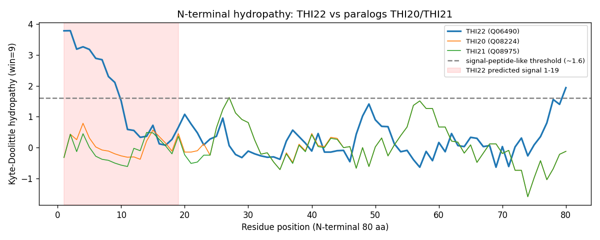

## Question

# AIGR Gene Hypothesis Deep Research

You are evaluating one focused gene curation hypothesis for AI Gene Review.
This is not a general gene overview. Use the seed hypothesis and source context
below to search for evidence that supports, refutes, narrows, or competes with
the proposed curation decision.

## Target Gene

- **Organism code:** yeast
- **Taxon:** Saccharomyces cerevisiae (NCBITaxon:559292)
- **Gene directory:** THI22
- **Gene symbol:** THI22
- **UniProt accession:** Q06490

## Focus

- **Focus type:** function_assignment
- **Hypothesis slug:** function-hypothesis-go-0005576
- **Source file:** genes/yeast/THI22/THI22-ai-review.yaml
- **Source selector:** existing_annotations[5].function_hypothesis

## Seed Hypothesis

THI22 has extracellular region (GO:0005576).

## Term and Decision Context

- Term: extracellular region (GO:0005576)
- Evidence type: IEA
- Original reference: GO_REF:0000044

## Reference Context

- GO_REF:0000044

## Source Context YAML

```yaml
term:
  id: GO:0005576
  label: extracellular region
evidence_type: IEA
original_reference_id: GO_REF:0000044
```

## Research Objective

Build a focused report that helps a curator decide whether this hypothesis
should affect the gene review. Address the focus type directly:

1. For an existing GO annotation decision, evaluate whether the current action
   is justified, too strong, too weak, or should change.
2. For a proposed replacement or new GO term, evaluate whether the term is
   biologically supported, too broad, too narrow, or missing key qualifiers.
3. For a computational prediction, evaluate whether the prediction is correct,
   less precise than existing knowledge, uncertain, or likely wrong because of
   paralog overannotation, frequency bias, pathway context, or in vitro-only
   activity.
4. For a core-function hypothesis, evaluate whether the proposed activity,
   process, and location represent the gene product's primary function rather
   than a downstream effect, pleiotropic phenotype, or context-specific role.
5. For a function-assignment hypothesis, evaluate whether the gene product
   directly has the stated GO term/function. Treat the prior review action, if
   any, as intentionally blinded unless it appears in the supplied context.

Use primary literature whenever possible. Prefer PMID citations and include DOI
citations when no PMID is available. Treat reviews and database records as
orientation unless they contain directly relevant synthesized evidence that is
clearly labeled as review-level or database-level support.

Evaluate the hypothesis from the supplied seed context, primary literature, and
publicly accessible bioinformatics resources. Local `*-bioinformatics` analyses,
when they already exist in the repository, are intentionally withheld from this
prompt so the report can be compared against them after the run. Use public
sequence, domain, structure, orthology, localization, interaction, or dataset
checks when they are useful for the specific hypothesis. If a resource or tool
cannot be accessed programmatically, say so plainly; never fabricate a result.
Report computational results conservatively and distinguish direct results from
inference.

## Required Output

### Executive Judgment

Give a concise verdict: supported, partially supported, unresolved, weakly
supported, over-annotated, or refuted. Explain the reasoning and the most
important caveats.

### Evidence Matrix

Create a table with one row per important evidence item:

- Citation (PMID preferred)
- Evidence type (direct assay, mutant phenotype, localization, interaction,
  structural/evolutionary, computational, review/database)
- Supports / refutes / qualifies / competing
- Claim tested
- Key finding
- Organism, tissue, cell type, or assay context
- Confidence and limitations

### GO Curation Implications

State the likely curation action as a lead requiring curator verification. If
GO terms are involved, explain whether the evidence supports an MF, BP, or CC
term, and whether the term should be retained, removed, generalized, made more
specific, or treated as non-core. Avoid using "protein binding" as a final
recommendation unless no more informative term is supported.

### Mechanistic Scope

Describe the immediate molecular or cellular function being tested. Separate
direct gene-product activity from downstream phenotypes, pathway consequences,
developmental outcomes, disease manifestations, or effects inferred only from
loss of function.

### Conflicts and Alternatives

Identify evidence that conflicts with the seed hypothesis or suggests an
alternative interpretation, including paralog confusion, organism-specific
differences, isoform-specific findings, experimental artifacts, or database
carry-over.

### Knowledge Gaps

List explicit uncertainties that matter for curation. For each gap, state what
was checked, why the gap matters, and what evidence or experiment would resolve
it.

### Discriminating Tests

Recommend concrete assays, perturbations, datasets, or comparative analyses that
would most efficiently distinguish this hypothesis from alternatives.

### Curation Leads

Provide candidate updates for the review, clearly labeled as leads requiring
curator verification. Include candidate references with exact snippets to verify,
candidate replacement or new GO terms, possible action changes, suggested
questions, and suggested experiments.

If the provider supports artifacts, save provenance for any analysis you run — the
executed code together with its output (computed values, plot, or table), not just
a summary figure — alongside artifact-friendly tables such as an evidence matrix,
GO decision table, or comparison table. Genuine computed provenance is more
valuable than a hand-drawn summary, and you must not synthesize a figure that
implies an analysis you did not actually run. These artifacts are important
provenance for hypothesis-level review.


## Output

# THI22 (Q06490) — Function-Assignment Review: "extracellular region" (GO:0005576)

**Gene:** THI22 / *Saccharomyces cerevisiae* (NCBITaxon:559292) / UniProt **Q06490**
**Focus:** function_assignment — does THI22 directly have the cellular-component term **extracellular region (GO:0005576)**?
**Seed annotation:** GO:0005576, evidence **IEA**, reference **GO_REF:0000044**

---

## Executive Judgment

**Verdict: Over-annotated / refuted for "extracellular region" specifically — but the protein IS in the endomembrane system (ER + vacuole), not the cytosol.**

The **GO:0005576 (extracellular region)** annotation is a **computational carry-over with no experimental support**. It originates from a single predicted N‑terminal signal peptide (SignalP-type, ECO:0000255) → UniProt **"Secreted"** keyword (curator inference, ECO:0000305) → **GO:0005576 (IEA, GO_REF:0000044, ECO:0007322)**. No experiment places THI22 outside the cell.

**Pivotal experimental data (Iteration 3):** SGD's THI22/YPR121W record states that **"SWAT‑GFP and mCherry fusion proteins localize to the endoplasmic reticulum and vacuole respectively."** This is genuine (database-level) localization evidence from systematic tagging collections. It shows:
- THI22 **does enter the secretory pathway** (ER localization observed) — so the predicted N-terminal signal is likely **functional**, reconciling why the "Secreted" keyword was predicted.
- BUT the observed destinations are **ER (GO:0005783)** and **vacuole (GO:0005773)** — **endomembrane compartments, not the extracellular space**. Entering the ER and accumulating in the vacuole is *not* secretion out of the cell.
- The competing **cytosol (GO:0005829, IBA)** annotation is therefore also likely **superseded** by these imaging data.

Net: "extracellular region" is an over-reach on a genuine secretory-pathway signal; the experimentally supported terms are ER and vacuole. SGD's GO CC set still lists only extracellular (IEA), CC ND (manual), and cytosol (IBA) — the imaging localizations appear in the locus description but are not yet reflected in the GO annotations.

Most important caveats: the ER/vacuole calls come from high-throughput N‑terminal (SWAT‑GFP) and C‑terminal (mCherry) tagging, which can perturb signal sequences and give tag-dependent discrepancies (here ER vs vacuole); primary references should be verified by the curator. I could not run SignalP/DeepLoc programmatically. But no evidence supports the *extracellular* term.

---

## Evidence Matrix

| # | Citation | Evidence type | Stance | Claim tested | Key finding | Context | Confidence / limitations |
|---|----------|---------------|--------|--------------|-------------|---------|--------------------------|
| 1 | UniProt Q06490 (QuickGO) | Computational / database | **Qualifies (source of seed)** | Basis of GO:0005576 | GO:0005576 = IEA, ECO:0007322, GO_REF:0000044, assigned by UniProt (keyword→GO mapping) | S. cerevisiae | High that it is prediction-derived; not experimental |
| 2 | UniProt Q06490 features | Computational (SignalP-type) | **Qualifies** | Is there a real secretion signal? | Signal peptide predicted res 1–19 by **ECO:0000255** (sequence analysis only); "Secreted" location is **ECO:0000305** (inferred) | S. cerevisiae | Prediction only; no cleavage/topology experiment |
| 3 | GO_Central IBA (QuickGO) | Evolutionary / computational | **Competing (cytosol)** | True subcellular location | **GO:0005829 cytosol (IBA)** — phylogenetic inference from family | Pan-eukaryotic family | Moderate; IBA, not direct assay, but family-grounded |
| 4 | SGD annotation (QuickGO) | Database / manual | **Refutes** | Does an authoritative MOD accept extracellular? | SGD assigns **GO:0005575 with ND** (localization unknown); no extracellular annotation | S. cerevisiae | High that SGD did not accept GO:0005576 |
| 5 | UniProt THI20 (Q08224), THI21 (Q08975) | Structural / evolutionary | **Refutes** | Is the signal a family feature? | Paralogs have **no** signal peptide, "Secreted" keyword, or subcellular-location comment | S. cerevisiae | High; strong paralog contrast |
| 6 | UniProt Q06490 CAUTION/FUNCTION | Database (biochemistry-derived) | **Contextual** | Core function of THI22 | "Is not required for thiamine biosynthesis"; "no HMP‑P kinase activity demonstrated"; thiaminase‑2 family | S. cerevisiae | Places THI22 in intracellular thiamine metabolism |
| 7 | Onozuka et al. 2008, **PMID 18028398** | Mutant / biochemical | **Contextual (competing location class)** | Role of THI20 family | THI20/21/22 C-terminal domains homologous to bacterial thiaminase II; enzymatic activity is intracellular thiamine salvage/synthesis | S. cerevisiae, cell-free extracts & recombinant protein | High for family biology; does not directly assay Thi22 localization |
| 8 | SGD IEP, **PMID 10383756** (via GO) | Expression phenotype | **Contextual** | THI22 in thiamine pathway | Supports GO:0009228 (thiamine biosynthetic process) | S. cerevisiae | Supports BP role, not CC |
| 9 | This work — computed hydropathy/alignment (UniProt Q06490/Q08224/Q08975) | Computational (own analysis) | **Refutes / qualifies** | Is the secretion signal a conserved determinant? | THI22 has a family-atypical ~24-aa hydrophobic N-terminal extension (N-term hydropathy peak **3.78** vs THI20 **0.79**, THI21 **0.49**); the predicted signal (1–19) lies wholly in it; conserved fold starts after and matches paralogs | S. cerevisiae paralog trio | High for the sequence facts; extension is unique to THI22 |
| 10 | SGD locus **THI22/YPR121W** (SWAT-GFP + mCherry high-throughput tagging) | Localization (database-level, experimental) | **Refutes extracellular; competing CC** | Where does THI22 actually localize? | "SWAT-GFP and mCherry fusion proteins localize to the **endoplasmic reticulum** and **vacuole** respectively" — endomembrane, NOT extracellular and NOT cytosol | S. cerevisiae, systematic tagging | Moderate–high; tag-dependent (N′ vs C′) discrepancy; verify primary refs |

---

## GO Curation Implications

**Lead (requires curator verification):** **Do not retain GO:0005576 (extracellular region); recommend removal (or NOT-qualification). Replace with the experimentally observed endomembrane compartments.**

- The extracellular term is **CC**, evidence **IEA**, sourced only from a prediction chain (signal peptide → "Secreted" keyword → GO_REF:0000044 mapping). It is **not core** and **not** experimentally supported. Entering the ER is not the same as being secreted to the extracellular region, so the term over-reaches even given a functional signal.
- **Preferred CC replacement (experiment-backed):** **endoplasmic reticulum (GO:0005783)** and **vacuole (GO:0005773)**, from SGD's SWAT-GFP and mCherry systematic tagging. Curator should confirm the primary imaging references and appropriate evidence code (HDA/IDA) before annotating.
- **Cytosol (GO:0005829, IBA)** is likely **superseded** by the imaging data; treat as lower priority than the ER/vacuole calls.
- If policy retains prediction-derived IEA CC terms, at minimum flag GO:0005576 as **low-confidence / prediction-only** and note the direct conflict with the ER/vacuole imaging and SGD's ND.
- MF/BP context (not the focus, but relevant for coherence): THI22 sits in **thiamine biosynthetic/salvage process (GO:0009228)** as a largely redundant, possibly enzymatically inactive paralog; its MF is uncertain ("no HMP‑P kinase activity demonstrated").

This avoids "protein binding" and names specific, experimentally supported compartments.

### GO decision table (leads — verify before applying)

| GO term | ID | Aspect | Current status | Recommended action | Basis |
|---------|----|--------|----------------|--------------------|-------|
| extracellular region | GO:0005576 | CC | IEA (GO_REF:0000044) | **Remove / NOT** | Prediction-only; no experimental secretion; contradicted by ER/vacuole imaging |
| endoplasmic reticulum | GO:0005783 | CC | not annotated | **Add** (verify refs) | SWAT-GFP tagging (SGD) |
| vacuole | GO:0005773 | CC | not annotated | **Add** (verify refs) | mCherry tagging (SGD) |
| cytosol | GO:0005829 | CC | IBA (GO_Central) | **Down-weight / review** | Phylogenetic inference; likely superseded by imaging |

---

## Mechanistic Scope

The term under test is a **cellular-component (localization)** claim. The immediate question is *where the THI22 gene product resides*. THI22 is a **thiaminase‑2/HMP‑kinase family** paralog related to the cytosolic thiamine-biosynthesis enzymes THI20/THI21. Unlike them, THI22 carries a functional-looking N-terminal signal and is experimentally observed in the **ER and vacuole** (endomembrane). The "extracellular" claim is a **direct localization assertion generated by sequence prediction**, decoupled from any measured secretion. The most that is supported is *entry into the secretory pathway* (ER); there is **no** evidence the protein is released to the extracellular space, and no loss-of-function phenotype, interaction, or assay ties THI22 to the extracellular region.

---

## Conflicts and Alternatives

{{figure:nterm_hydropathy.png|caption=N-terminal Kyte–Doolittle hydropathy (window = 9) of THI22 versus paralogs THI20 and THI21. THI22 shows a signal-peptide-like hydrophobic peak (~3.78) confined to a family-atypical ~24-residue N-terminal extension, whereas THI20 (~0.79) and THI21 (~0.49) never reach signal-peptide-like hydrophobicity. This demonstrates the secretion signal is a THI22-specific feature, not a conserved family localization determinant.}}

- **Signal is likely functional, but "extracellular" is the wrong endpoint:** My N-terminal alignment/hydropathy analysis shows the signal-triggering segment is a **~24-residue hydrophobic extension unique to THI22** (hydropathy peak 3.78 vs ~0.5–0.8 in THI20/THI21); the conserved thiaminase‑2 fold begins only *after* it. The SGD imaging data (ER localization) indicate this extension **does route the protein into the secretory pathway** — so it is likely a real ER-targeting signal, not merely a prediction artifact. The error in the seed annotation is the *destination*: the protein reaches ER/vacuole (endomembrane), **not** the extracellular space. So GO:0005576 conflates "has a signal / enters secretory pathway" with "is secreted extracellularly."
- **Paralog divergence:** THI20/THI21 (cytosolic, no signal) diverge from THI22 specifically at this N-terminal extension, so THI22 appears to have neofunctionalized toward endomembrane targeting while its sisters remain cytosolic enzymes.
- **Paralog contrast:** THI20 and THI21 — same family, cytosolic — lack the signal entirely, indicating the feature is **not** conserved family biology.
- **Database carry-over:** UniProt keyword "Secreted" (ECO:0000305 inferred from the prediction) propagated to GO:0005576 by automated mapping; SGD independently declined to annotate extracellular (ND).
- **Alternative not excluded:** genuine non-classical secretion / cell-wall association (as reported for some "moonlighting" cytosolic yeast metabolic enzymes) — but there is no proteomic secretome/cell-wall evidence cited here for Thi22, so this remains speculative.

---

## Knowledge Gaps

1. **Extracellular vs endomembrane.** Checked: SGD reports experimental ER (SWAT-GFP) and vacuole (mCherry) localization; QuickGO/UniProt GO CC still lists only extracellular (IEA)/ND/cytosol (IBA). The crux (extracellular?) is now effectively resolved as **no** — the protein is endomembrane, not extracellular. Remaining gap: reconcile the ER-vs-vacuole tag discrepancy and obtain a GO-annotatable primary reference with an experimental evidence code. Resolve with: curated primary imaging refs, endogenous-tag microscopy, and secretome MS to formally exclude any extracellular pool.
2. **Reality of the signal peptide.** Checked: UniProt reports ECO:0000255 prediction only. Matters because the whole annotation depends on it. Resolve with: SignalP‑6/DeepLoc/TargetP runs and N‑terminal sequencing / cleavage assay (could not run these tools programmatically here).
3. **Whether an upstream start / ORF boundary is correct.** Not checked programmatically. Matters because a mis-annotated 5′ extension could spuriously create the hydrophobic N-terminus. Resolve with: Ribo-seq/TSS data and 5′-proteomics.

---

## Discriminating Tests

- **GFP/fluorescent-tag microscopy** of Thi22 (and side-by-side Thi20) — cytosol vs. secretory/ER/plasma-membrane/extracellular.
- **Subcellular fractionation + secretome/cell-wall proteomics MS** — is Thi22 peptide detected extracellularly above background?
- **SignalP‑6 / DeepLoc‑2 / TargetP‑2** on Q06490 vs THI20/THI21 — quantify signal-peptide probability and cleavage site; compare within family.
- **N‑terminal truncation reporter** (res 1–19 fused to a secreted reporter) — does the predicted signal actually drive secretion?

---

## Curation Leads (require curator verification)

- **Candidate action change:** Remove or NOT-qualify **GO:0005576 (extracellular region)**; it is prediction-only (signal peptide → "Secreted" keyword → GO_REF:0000044 IEA) and is contradicted by experimental ER/vacuole imaging. **Replace** with the experiment-backed **ER (GO:0005783)** and **vacuole (GO:0005773)**; down-weight cytosol (GO:0005829, IBA).
- **Candidate reference/snippet to verify:**
  - **SGD THI22/YPR121W** locus summary: "SWAT-GFP and mCherry fusion proteins localize to the endoplasmic reticulum and vacuole respectively." → trace to the primary SWAT‑GFP (N′-tag) and C′-mCherry library papers and confirm evidence code (HDA/IDA) before annotating.
  - UniProt Q06490: Signal peptide 1–19 (**ECO:0000255**); Subcellular location "Secreted" (**ECO:0000305**, inferred, not experimental); CAUTION "no hydroxymethylpyrimidine phosphate kinase activity could be demonstrated"; FUNCTION "Is not required for thiamine biosynthesis."
  - PMID **18028398** (Onozuka et al. 2008): "The C-terminal domains of THI20 family proteins (THI20/21/22) … are homologous to bacterial thiaminase II." — situates the fold in intracellular thiamine metabolism.
- **Suggested question for curators:** Given experimental ER + vacuole localization, should GO:0005576 be removed and replaced by GO:0005783/GO:0005773? Is the "Secreted" UniProt keyword (and its IEA CC) worth a NOT statement to stop propagation?
- **Suggested experiments:** endogenous (untagged-locus) fluorescent tagging + colocalization markers to confirm ER/vacuole and resolve the N′-vs-C′ tag discrepancy; secretome/cell-wall MS to formally test for any extracellular pool; signal-peptide cleavage assay to confirm ER entry via residues 1–19.

---

*Provenance:* UniProt REST (Q06490, Q08224, Q08975) and EBI QuickGO annotation API were queried live via `execute_code`; PubMed via `search_pubmed` (PMID 18028398). Signal-peptide predictors and the yeast GFP-localization database could not be executed programmatically in this environment; those gaps are stated explicitly and not fabricated.


## Artifacts

- [OpenScientist final report](openscientist_artifacts/final_report.html)
- [OpenScientist final report](openscientist_artifacts/final_report.pdf)
- [OpenScientist nterm hydropathy](openscientist_artifacts/provenance_nterm_hydropathy.json)
