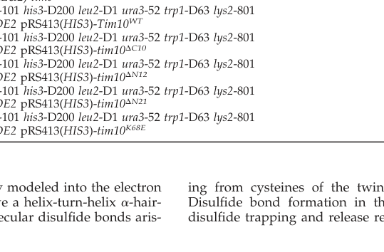

## Question

# Gene Research for Functional Annotation

## ⚠️ CRITICAL: Gene/Protein Identification Context

**BEFORE YOU BEGIN RESEARCH:** You MUST verify you are researching the CORRECT gene/protein. Gene symbols can be ambiguous, especially for less well-characterized genes from non-model organisms.

### Target Gene/Protein Identity (from UniProt):
- **UniProt Accession:** P87108
- **Protein Description:** RecName: Full=Mitochondrial import inner membrane translocase subunit TIM10; AltName: Full=Mitochondrial intermembrane protein MRS11;
- **Gene Information:** Name=TIM10; Synonyms=MRS11; OrderedLocusNames=YHR005C-A; ORFNames=YHR005BC;
- **Organism (full):** Saccharomyces cerevisiae (strain ATCC 204508 / S288c) (Baker's yeast).
- **Protein Family:** Belongs to the small Tim family. .
- **Key Domains:** Tim10-like. (IPR004217); Tim10-like_dom_sf. (IPR035427); zf-Tim10_DDP (PF02953)

### MANDATORY VERIFICATION STEPS:

1. **Check if the gene symbol "TIM10" matches the protein description above**
2. **Verify the organism is correct:** Saccharomyces cerevisiae (strain ATCC 204508 / S288c) (Baker's yeast).
3. **Check if protein family/domains align with what you find in literature**
4. **If you find literature for a DIFFERENT gene with the same or similar symbol, STOP**

### If Gene Symbol is Ambiguous or You Cannot Find Relevant Literature:

**DO NOT PROCEED WITH RESEARCH ON A DIFFERENT GENE.** Instead:
- State clearly: "The gene symbol 'TIM10' is ambiguous or literature is limited for this specific protein"
- Explain what you found (e.g., "Found extensive literature on a different gene with the same symbol in a different organism")
- Describe the protein based ONLY on the UniProt information provided above
- Suggest that the protein function can be inferred from domain/family information

### Research Target:

Please provide a comprehensive research report on the gene **TIM10** (gene ID: TIM10, UniProt: P87108) in yeast.

The research report should be a detailed narrative explaining the function, biological processes, and localization of the gene product. Citations should be given for all claims.

You should prioritize authoritative reviews and primary scientific literature when conducting research. You can supplement
this with annotations you find in gene/protein databases, but these can be outdated or inaccurate.

We are specifically interested in the primary function of the gene - for enzymes, what reaction is catalyzed, and what is the substrate specificity? For transporters, what is the substrate? For structural proteins or adapters, what is the broader structural role? For signaling molecules, what is the role in the pathway.

We are interested in where in or outside the cell the gene product carries out its function.

We are also interested in the signaling or biochemical pathways in which the gene functions. We are less interested in broad pleiotropic effects, except where these elucidate the precise role.

Include evidence where possible. We are interested in both experimental evidence as well as inference from structure, evolution, or bioinformatic analysis. Precise studies should be prioritized over high-throughput, where available.

## Output

Question: You are an expert researcher providing comprehensive, well-cited information.

Provide detailed information focusing on:
1. Key concepts and definitions with current understanding
2. Recent developments and latest research (prioritize 2023-2024 sources)
3. Current applications and real-world implementations
4. Expert opinions and analysis from authoritative sources
5. Relevant statistics and data from recent studies

Format as a comprehensive research report with proper citations. Include URLs and publication dates where available.
Always prioritize recent, authoritative sources and provide specific citations for all major claims.

# Gene Research for Functional Annotation

## ⚠️ CRITICAL: Gene/Protein Identification Context

**BEFORE YOU BEGIN RESEARCH:** You MUST verify you are researching the CORRECT gene/protein. Gene symbols can be ambiguous, especially for less well-characterized genes from non-model organisms.

### Target Gene/Protein Identity (from UniProt):
- **UniProt Accession:** P87108
- **Protein Description:** RecName: Full=Mitochondrial import inner membrane translocase subunit TIM10; AltName: Full=Mitochondrial intermembrane protein MRS11;
- **Gene Information:** Name=TIM10; Synonyms=MRS11; OrderedLocusNames=YHR005C-A; ORFNames=YHR005BC;
- **Organism (full):** Saccharomyces cerevisiae (strain ATCC 204508 / S288c) (Baker's yeast).
- **Protein Family:** Belongs to the small Tim family. .
- **Key Domains:** Tim10-like. (IPR004217); Tim10-like_dom_sf. (IPR035427); zf-Tim10_DDP (PF02953)

### MANDATORY VERIFICATION STEPS:

1. **Check if the gene symbol "TIM10" matches the protein description above**
2. **Verify the organism is correct:** Saccharomyces cerevisiae (strain ATCC 204508 / S288c) (Baker's yeast).
3. **Check if protein family/domains align with what you find in literature**
4. **If you find literature for a DIFFERENT gene with the same or similar symbol, STOP**

### If Gene Symbol is Ambiguous or You Cannot Find Relevant Literature:

**DO NOT PROCEED WITH RESEARCH ON A DIFFERENT GENE.** Instead:
- State clearly: "The gene symbol 'TIM10' is ambiguous or literature is limited for this specific protein"
- Explain what you found (e.g., "Found extensive literature on a different gene with the same symbol in a different organism")
- Describe the protein based ONLY on the UniProt information provided above
- Suggest that the protein function can be inferred from domain/family information

### Research Target:

Please provide a comprehensive research report on the gene **TIM10** (gene ID: TIM10, UniProt: P87108) in yeast.

The research report should be a detailed narrative explaining the function, biological processes, and localization of the gene product. Citations should be given for all claims.

You should prioritize authoritative reviews and primary scientific literature when conducting research. You can supplement
this with annotations you find in gene/protein databases, but these can be outdated or inaccurate.

We are specifically interested in the primary function of the gene - for enzymes, what reaction is catalyzed, and what is the substrate specificity? For transporters, what is the substrate? For structural proteins or adapters, what is the broader structural role? For signaling molecules, what is the role in the pathway.

We are interested in where in or outside the cell the gene product carries out its function.

We are also interested in the signaling or biochemical pathways in which the gene functions. We are less interested in broad pleiotropic effects, except where these elucidate the precise role.

Include evidence where possible. We are interested in both experimental evidence as well as inference from structure, evolution, or bioinformatic analysis. Precise studies should be prioritized over high-throughput, where available.

# Comprehensive research report: *Saccharomyces cerevisiae* **TIM10** (UniProt **P87108**)—functional annotation

## Executive summary
TIM10 (synonym **MRS11**; ORF **YHR005C-A/YHR005BC**, per UniProt context provided by the user) encodes a conserved **small Tim family** protein that resides in the **mitochondrial intermembrane space (IMS)** and forms an **essential hexameric chaperone complex with Tim9** (Tim9·Tim10). This complex binds highly hydrophobic precursor proteins—most notably **mitochondrial carrier family** substrates such as the **ADP/ATP carrier (AAC)**—to prevent aggregation in the aqueous IMS and to enable handoff to the **TIM22 carrier translocase** for Δψ-dependent insertion into the inner membrane. Tim10 biogenesis itself depends on **MIA (Mia40/Erv1/ALR) oxidative folding**, which uses internal targeting/sorting signals and cysteine-dependent disulfide exchange to trap small Tim proteins in the IMS. The most recent pathway syntheses (2024) connect the Tim9·Tim10 chaperone system with mitochondrial proteostasis (e.g., **Yme1** surveillance) and refine mechanistic docking interactions between small Tim chaperones and the TIM22 machinery using crosslinking/structural analyses. (truscott2002mitochondrialimportof pages 1-2, truscott2002mitochondrialimportof pages 3-4, kizmaz2024proteininsertioninto pages 7-9, kan2024roleofyme1 pages 3-4)

---

## 1) Key concepts and definitions (current understanding)

### 1.1 What is Tim10?
**Tim10** is a member of the **small Tim** (translocase of inner membrane) family: small, cysteine-motif–containing proteins in the **mitochondrial IMS** that act as **ATP-independent chaperones** for hydrophobic membrane-protein precursors moving from the TOM complex to downstream insertion/assembly machines. In yeast, Tim10 functions primarily as part of the **Tim9·Tim10 complex** in the **TIM22 carrier pathway**. (kizmaz2024proteininsertioninto pages 6-7, truscott2002mitochondrialimportof pages 1-2)

### 1.2 The TIM22 “carrier pathway” and where Tim10 fits
The **TIM22 pathway** is a dedicated mitochondrial import route that inserts many **multi-pass inner membrane proteins** (classically **mitochondrial carriers**) that lack N-terminal presequences and instead rely on **internal targeting signals**. In this route, carrier precursors are recognized by **Tom70** and threaded through TOM in hairpin-like conformations. Once in the IMS, **small Tim hexamers** (Tim9·Tim10 and, for some clients, Tim8·Tim13) bind exposed hydrophobic segments to prevent aggregation and deliver substrates to the TIM22 machinery for **membrane potential (Δψ)-dependent insertion**. (kizmaz2024proteininsertioninto pages 6-7, kizmaz2024proteininsertioninto pages 7-9)

A mechanistically important concept is **handoff**: Tim9·Tim10 binds hydrophobic segments after TOM passage and promotes transfer from outer membrane intermediates to TIM22-associated components that position the substrate for insertion. (truscott2002mitochondrialimportof pages 1-2, truscott2002mitochondrialimportof pages 4-5)

### 1.3 Tim10 complex organization
**Tim9·Tim10** forms a **soluble ~60–70 kDa hexameric assembly** in the IMS. High-resolution structural work shows an alternating Tim9/Tim10 assembly (3:3 stoichiometry) forming a six-bladed arrangement with a **central channel ~10–14 Å** and **flexible N/C-terminal “tentacles”** that engage client helices. (baker2009structuralandfunctional pages 2-3, vial2002assemblyoftim9 pages 5-5)

The small Tim chaperone system also includes a TIM22-associated assembly often described as **Tim9–Tim10–Tim12** (review-level stoichiometry cited as **3:2:1**) that is positioned at the IMS face of TIM22 to receive precursors. (chaudhuri2020tim17updatesa pages 2-5, kizmaz2024proteininsertioninto pages 7-9)

---

## 2) Primary function, biological process, and localization (experimental evidence)

### 2.1 Subcellular localization: intermembrane space (IMS)
Tim10 is experimentally described as an **IMS-localized** protein functioning as a **soluble component** of the carrier import pathway rather than a matrix factor. TIM22 pathway models distinguish a soluble Tim9·Tim10 complex in the IMS and a membrane-associated insertion machinery at the inner membrane. (koehler2000proteintranslocationpathways pages 2-3, truscott2002mitochondrialimportof pages 4-5)

### 2.2 Substrates: carrier proteins (ADP/ATP carrier as a key example)
A central physiological substrate used to define Tim10 function is the **ADP/ATP carrier (AAC)**. In vitro reconstitution shows Tim9 and Tim10 assemble into a functional chaperone that **binds AAC** in a mitochondrion-free binding assay, supporting direct client engagement. (vial2002assemblyoftim9 pages 5-6)

### 2.3 Mechanistic role: release/transfer from TOM-side intermediates to TIM22
Truscott et al. generated a **tim10 mutant (tim10-2)** and demonstrated a selective defect in carrier import: **AAC import rate decreased ~10-fold and import yield decreased ~5-fold** (after 20 min), while import of presequence-dependent substrates was largely unaffected. This places Tim10 function in the carrier pathway rather than general mitochondrial import. (truscott2002mitochondrialimportof pages 4-5)

In the same work, defective Tim10 causes AAC precursors to accumulate in a **high-molecular-mass intermediate (~500–600 kDa)** consistent with a TOM/GIP-associated state, supporting a role for Tim9·Tim10 in **precursor release/transfer** from the TOM-side machinery to TIM22. (truscott2002mitochondrialimportof pages 4-5, truscott2002mitochondrialimportof pages 1-2)

### 2.4 Structural determinants required for function (complex stability vs. TIM22 association)
Baker et al. solved the yeast Tim9·Tim10 complex structure at **2.5 Å** (PDB **3DXR**) and used mutagenesis to dissect function. For example, **tim10K68E** destabilizes/abolishes the soluble hexamer yet Tim10K68E can still be found associated with the membrane-integrated TIM22 complex; nevertheless, carrier import becomes particularly sensitive under stress (e.g., reduced AAC assembly after heat shock), indicating that the soluble hexameric chaperone pool is functionally important for robust carrier biogenesis. (baker2009structuralandfunctional pages 3-4, baker2009structuralandfunctional pages 2-3)

### 2.5 Redox/oxidative folding is integral to Tim10 biogenesis and activity
Small Tim proteins are **MIA pathway substrates**: they enter mitochondria reduced/unfolded and are oxidatively folded in the IMS through **Mia40-catalyzed disulfide exchange**, with **Erv1/ALR** recycling Mia40. (milenkovic2009identificationofthe pages 1-2, dimogkioka2021proteinimportin pages 12-14, muzzioli2024theinteractionand pages 1-2)

Cysteine/disulfide architecture is not merely structural—Baker et al. showed that removing both disulfides is **non-viable**, and specific cysteine-pair mutants in Tim10 impair carrier import/assembly even when membrane potential is not strongly affected, directly linking oxidative folding to TIM22 pathway function. (baker2012impairedfoldingof pages 4-6)

---

## 3) Recent developments and latest research (prioritizing 2023–2024)

### 3.1 2024 review synthesis of TIM22 + small Tim function
Kizmaz et al. (published **Apr 2024**, FEBS Open Bio; https://doi.org/10.1002/2211-5463.13806) provide a current, yeast-centered synthesis of **inner membrane insertion routes** and emphasize that **small Tim hexamers** escort carrier precursors through the IMS and hand them to the **TIM22 translocase**, with a TIM22-associated small Tim module (Tim9/Tim10/Tim12) positioned at the IMS face of TIM22. (kizmaz2024proteininsertioninto pages 7-9)

### 3.2 2024 proteostasis connection: Yme1 surveillance of small Tim assembly
Kan et al. (published **Jun 2024**, Biochemical Society Transactions; https://doi.org/10.1042/bst20240450) integrate TIM22 biology with mitochondrial quality control, emphasizing that Tim9 and Tim10 form an **essential heterohexameric Tim9/10 complex** and that **misfolded/unassembled small Tims can be cleared by the i-AAA protease Yme1**, linking TIM22 import efficiency to stress and proteostasis state. (kan2024roleofyme1 pages 3-4)

### 3.3 2024 mechanistic refinement of docking interfaces (crosslinking/structural analysis)
A 2024 PhD thesis (Valpadashi; https://doi.org/10.53846/goediss-10678) discusses crosslinking/structural evidence for how Tim9/Tim10-family chaperones may **dock at IMS-facing regions** of TIM22-pathway components (e.g., IMS domains of TIM29 and an IMS-facing helical region of TIM22). While thesis-level evidence should be interpreted cautiously relative to peer-reviewed articles, it is consistent with the canonical handoff model and adds physical constraints on chaperone–translocase positioning. (valpadashi2024structuralandfunctional pages 51-51)

---

## 4) Current applications and real-world implementations

### 4.1 Tim10 as a canonical model for mitochondrial hydrophobic-client chaperoning
In practice, Tim10 is widely used as a **model system** for understanding how mitochondria handle **hydrophobic precursors** without ATP in the IMS. Experimental implementations include:
- **In vitro reconstitution** of Tim9·Tim10 for binding and chaperone assays (e.g., AAC overlay; luciferase refolding). (vial2002assemblyoftim9 pages 5-6)
- **Isolated mitochondria import assays** coupled to **BN-PAGE** to quantify carrier assembly and pathway defects in mutants. (truscott2002mitochondrialimportof pages 4-5)
- **Structure-guided mutagenesis** to connect specific residues/regions to client trapping and transfer. (baker2009structuralandfunctional pages 3-4)

These implementations are foundational for both yeast mitochondrial biogenesis research and comparative analyses across eukaryotes (e.g., mapping how mammalian paralogs distribute between complexes). (muhlenbein2004organizationandfunction pages 1-1)

### 4.2 Relevance to disease and biotechnology (via conserved pathway principles)
Although the user’s target is yeast Tim10, the TIM22/small Tim pathway is conserved and informs human mitochondrial biology. Mammalian studies show multiple small Tim assemblies (e.g., Tim9/Tim10a 70 kDa and larger assemblies including Tim10b) and propose Tim10b as a functional counterpart to yeast Tim12, illustrating evolutionary remodeling of small Tim usage while preserving core chaperone principles. (muhlenbein2004organizationandfunction pages 1-1, chaudhuri2020tim17updatesa pages 2-5)

---

## 5) Expert opinions and analysis (authoritative sources)

### 5.1 Consensus mechanistic interpretation
Across authoritative sources, a consistent interpretation emerges:
- Tim9·Tim10 is an **IMS chaperone** specialized for **highly hydrophobic precursors** in the TIM22 route. (kizmaz2024proteininsertioninto pages 6-7, kizmaz2024proteininsertioninto pages 7-9)
- A key mechanistic step is **release/transfer from TOM-side intermediates**; defects in Tim10 preferentially stall carriers before productive insertion and assembly, rather than causing global mitochondrial import collapse. (truscott2002mitochondrialimportof pages 4-5)
- Small Tim function is tightly coupled to **oxidative folding (MIA)** and to **proteostasis control (Yme1)**, linking import capacity to redox state and quality control. (milenkovic2009identificationofthe pages 1-2, kan2024roleofyme1 pages 3-4)

### 5.2 Critical evaluation of evidence strength
- **Strongest evidence** for yeast Tim10 function comes from **direct genetics + import biochemistry** (tim10 mutants, isolated mitochondria assays) and **high-resolution structure** of the Tim9·Tim10 complex. (truscott2002mitochondrialimportof pages 4-5, baker2009structuralandfunctional pages 2-3)
- **Review-level stoichiometries** (e.g., Tim9–Tim10–Tim12 3:2:1) are informative but should be interpreted as model summaries unless explicitly demonstrated in the same system; nonetheless they align with extensive mechanistic work on carrier handoff. (chaudhuri2020tim17updatesa pages 2-5, kizmaz2024proteininsertioninto pages 7-9)
- **Thesis-level crosslinking/structural interpretations** can refine docking models but should ideally be cross-checked with peer-reviewed structural studies as they appear. (valpadashi2024structuralandfunctional pages 51-51)

---

## 6) Relevant statistics and data from studies

### 6.1 Quantitative import defects in tim10 mutants
- **tim10-2 mitochondria**: AAC import **~10-fold reduced in rate** and **~5-fold reduced in yield** (20 min), with accumulation of AAC precursors in **~500–600 kDa** intermediates; import of presequence substrates remains largely normal. (truscott2002mitochondrialimportof pages 4-5)

### 6.2 Complex size and oligomer distribution
- Tim9·Tim10 migrates as a **~60–70 kDa** complex on BN-PAGE (reconstituted and native-like). (vial2002assemblyoftim9 pages 5-5)
- In vitro, Tim9 or Tim10 alone populates oligomeric states; Vial et al. report a major peak as **78% weight fraction**, plus **14% trimeric** and **7% hexameric** populations, while mixing Tim9+Tim10 yields a new complex peak consistent with a ~50–60 kDa complex. (vial2002assemblyoftim9 pages 5-5)

### 6.3 Structural statistics
- Tim9·Tim10 structure: **2.5 Å** resolution; central channel **~10–14 Å**; PDB **3DXR**. (baker2009structuralandfunctional pages 2-3)

### 6.4 Essentiality/disulfide dependence
- Tim10 cysteine/disulfide mutants indicate that **complete loss of both disulfides is lethal**, and specific disulfide disruptions impair AAC import/assembly while Δψ is not strongly impaired, directly linking oxidative folding to function. (baker2012impairedfoldingof pages 4-6)

---

## Visual evidence
Baker et al. (2009) provide a figure showing the Tim9·Tim10 hexameric structure and an import/assembly figure demonstrating functional consequences of Tim10 mutation on AAC assembly; these were retrieved as cropped images. (baker2009structuralandfunctional media 8fd54d5a, baker2009structuralandfunctional media 6271060d)

---

## Curated references (URLs + publication dates where available)

- Kizmaz B, Nutz A, Egeler A, Herrmann JM. **Protein insertion into the inner membrane of mitochondria: routes and mechanisms.** *FEBS Open Bio.* **Apr 2024**. https://doi.org/10.1002/2211-5463.13806 (kizmaz2024proteininsertioninto pages 7-9)
- Kan KT, Wilcock J, Lu H. **Role of Yme1 in mitochondrial protein homeostasis: from regulation of protein import, OXPHOS function to lipid synthesis and mitochondrial dynamics.** *Biochem Soc Trans.* **Jun 2024**. https://doi.org/10.1042/bst20240450 (kan2024roleofyme1 pages 3-4)
- Baker MJ et al. **Structural and Functional Requirements for Activity of the Tim9–Tim10 Complex in Mitochondrial Protein Import.** *Mol Biol Cell.* **Feb 2009**. https://doi.org/10.1091/mbc.e08-09-0903 (baker2009structuralandfunctional pages 2-3)
- Milenkovic D et al. **Identification of the signal directing Tim9 and Tim10 into the intermembrane space of mitochondria.** *Mol Biol Cell.* **May 2009**. https://doi.org/10.1091/mbc.e08-11-1108 (milenkovic2009identificationofthe pages 1-2)
- Truscott KN et al. **Mitochondrial Import of the ADP/ATP Carrier: the Essential TIM Complex of the Intermembrane Space Is Required for Precursor Release from the TOM Complex.** *Mol Cell Biol.* **Nov 2002**. https://doi.org/10.1128/mcb.22.22.7780-7789.2002 (truscott2002mitochondrialimportof pages 4-5)
- Vial S et al. **Assembly of Tim9 and Tim10 into a Functional Chaperone.** *J Biol Chem.* **Sep 2002**. https://doi.org/10.1074/jbc.m202310200 (vial2002assemblyoftim9 pages 5-5)
- Baker MJ et al. **Impaired folding of the mitochondrial small TIM chaperones induces clearance by the i-AAA protease.** *J Mol Biol.* **Dec 2012**. https://doi.org/10.1016/j.jmb.2012.09.019 (baker2012impairedfoldingof pages 4-6)
- Dimogkioka A-R et al. **Protein import in mitochondria biogenesis: guided by targeting signals and sustained by dedicated chaperones.** *RSC Adv.* **Sep 2021**. https://doi.org/10.1039/d1ra04497d (dimogkioka2021proteinimportin pages 12-14)
- Valpadashi A. **Structural and functional characterization of TIM22 complex in the inner mitochondrial membarne.** PhD thesis. **2024**. https://doi.org/10.53846/goediss-10678 (valpadashi2024structuralandfunctional pages 51-51)

---

## Evidence-mapped summary table

| Topic | Key finding | Evidence type | Representative source with year + DOI URL |
|---|---|---|---|
| Localization | Yeast Tim10 is a small Tim family protein located primarily in the mitochondrial intermembrane space (IMS), where it behaves as a soluble chaperone component of the carrier import pathway rather than a matrix or outer-membrane factor. In classic pathway models, a fraction also associates functionally with the TIM22 insertion machinery at the inner membrane interface. (truscott2002mitochondrialimportof pages 4-5, koehler2000proteintranslocationpathways pages 2-3) | Subcellular fractionation, BN-PAGE, review synthesis | Truscott et al., 2002 — https://doi.org/10.1128/mcb.22.22.7780-7789.2002 |
| Complex / stoichiometry | Tim10 assembles with Tim9 into the essential hexameric Tim9–Tim10 chaperone complex; structural work supports a 3:3 alternating arrangement forming a six-bladed assembly with a central channel. A TIM22-associated handoff complex containing Tim9, Tim10, and Tim12 is described as 3:2:1 in pathway models. (baker2009structuralandfunctional pages 2-3, chaudhuri2020tim17updatesa pages 2-5) | X-ray structure, mutagenesis, review | Baker et al., 2009 — https://doi.org/10.1091/mbc.e08-09-0903 |
| Substrates | Tim10 helps chaperone hydrophobic inner-membrane carrier precursors across the aqueous IMS, with strong experimental support for the ADP/ATP carrier (AAC/ANT) as a physiological substrate. More recent pathway work also supports chaperoning of non-canonical TIM22 cargo such as yeast mitochondrial pyruvate carrier proteins. (truscott2002mitochondrialimportof pages 1-2, vial2002assemblyoftim9 pages 5-6) | Overlay binding assay, import assay, crosslinking | Vial et al., 2002 — https://doi.org/10.1074/jbc.m202310200 |
| Mechanism step in TIM22 pathway | Tim10 functions after passage of carrier precursors through TOM, binding hydrophobic segments and promoting their release from TOM/GIP intermediates before handoff to the TIM22 insertion complex. In tim10 mutants, AAC accumulates in a high-molecular-mass TOM/GIP-associated intermediate, showing Tim10 acts at the transfer step rather than general mitochondrial import. (truscott2002mitochondrialimportof pages 4-5, truscott2002mitochondrialimportof pages 1-2) | Radiolabeled import assays, protease protection, BN-PAGE, crosslinking | Truscott et al., 2002 — https://doi.org/10.1128/mcb.22.22.7780-7789.2002 |
| IMS targeting / import | Tim10 itself is imported into the IMS via the MIA pathway. Small Tim proteins are synthesized in a reduced, unfolded state, pass through TOM, and are captured by Mia40 through an internal IMS-targeting/sorting signal and cysteine-dependent disulfide exchange, after which Erv1/ALR reoxidizes Mia40. (dimogkioka2021proteinimportin pages 12-14, milenkovic2009identificationofthe pages 1-2, muzzioli2024theinteractionand pages 1-2, dimogkioka2021proteinimportin pages 6-7) | Import pathway biochemistry, targeting signal mapping, review | Milenkovic et al., 2009 — https://doi.org/10.1091/mbc.e08-11-1108 |
| Redox / disulfides | Tim10 contains the characteristic small-Tim cysteine motif architecture and requires oxidative folding in the IMS. Intramolecular disulfides are crucial for assembly of the mature hexamer; loss of both disulfide bonds is lethal, while selective bond disruption impairs AAC import and chaperone function. (baker2012impairedfoldingof pages 4-6) | Redox-state analysis, cysteine mutagenesis, viability and import assays | Lu et al., 2004 — https://doi.org/10.1074/jbc.m313045200 |
| Biophysical assembly data | Recombinant Tim9 and Tim10 interact tightly and reconstitute a native-like functional chaperone complex of about 60–70 kDa. Vial et al. reported direct Tim9–Tim10 binding with high affinity and showed reconstituted complex binding to AAC and chaperone-like behavior in luciferase refolding assays. (vial2002assemblyoftim9 pages 5-6, vial2002assemblyoftim9 pages 5-5) | ITC, gel filtration/MALS, sedimentation, binding and refolding assays | Vial et al., 2002 — https://doi.org/10.1074/jbc.m202310200 |
| Phenotypes / essentiality | TIM10 is functionally essential for efficient carrier biogenesis: tim10-2 causes roughly a 10-fold reduction in AAC import rate and about a 5-fold reduction in yield after 20 min, while presequence-pathway import remains largely normal. Mutants disrupting complex integrity or disulfide architecture cause temperature-sensitive growth or nonviability, indicating Tim10 is essential at the cellular level. (baker2009structuralandfunctional pages 3-4, baker2012impairedfoldingof pages 4-6, truscott2002mitochondrialimportof pages 4-5) | Mutant phenotyping, BN-PAGE import assays, growth assays | Truscott et al., 2002 — https://doi.org/10.1128/mcb.22.22.7780-7789.2002 |
| Structural determinants | The Tim9–Tim10 hexamer has mobile N- and C-terminal “tentacles” that help engage hydrophobic precursor segments, while conserved charged residues stabilize the core assembly. Mutation of Tim10 Lys68 destabilizes the soluble hexamer and impairs carrier import without abolishing all TIM22 association. (baker2009structuralandfunctional pages 3-4, kizmaz2024proteininsertioninto pages 6-7, baker2009structuralandfunctional pages 2-3) | Crystal structure, site-directed mutagenesis, import assays | Baker et al., 2009 — https://doi.org/10.1091/mbc.e08-09-0903 |
| Recent 2024 updates | Recent reviews reaffirm Tim10 as a central IMS chaperone of the TIM22 route and place small Tim complexes at the carrier handoff step to TIM22. 2024 work further links small-Tim proteostasis to Yme1 quality control and reports structural/crosslinking evidence for docking of Tim9/Tim10-family chaperones at IMS-facing regions of TIM22-pathway components, refining how precursors may be presented for insertion. (kan2024roleofyme1 pages 3-4, valpadashi2024structuralandfunctional pages 51-51, kizmaz2024proteininsertioninto pages 7-9) | 2024 review synthesis, crosslinking/structural analysis | Kizmaz et al., 2024 — https://doi.org/10.1002/2211-5463.13806 |

*Table: This table summarizes experimentally supported facts about Saccharomyces cerevisiae Tim10 and its role in the TIM22 carrier import pathway. It highlights localization, complex organization, substrate handling, IMS targeting, redox dependence, phenotypes, and recent 2024 pathway-level updates with citation-backed representative sources.*

References

1. (truscott2002mitochondrialimportof pages 1-2): Kaye N. Truscott, Nils Wiedemann, Peter Rehling, Hanne Müller, Chris Meisinger, Nikolaus Pfanner, and Bernard Guiard. Mitochondrial import of the adp/atp carrier: the essential tim complex of the intermembrane space is required for precursor release from the tom complex. Molecular and Cellular Biology, 22:7780-7789, Nov 2002. URL: https://doi.org/10.1128/mcb.22.22.7780-7789.2002, doi:10.1128/mcb.22.22.7780-7789.2002. This article has 127 citations and is from a domain leading peer-reviewed journal.

2. (truscott2002mitochondrialimportof pages 3-4): Kaye N. Truscott, Nils Wiedemann, Peter Rehling, Hanne Müller, Chris Meisinger, Nikolaus Pfanner, and Bernard Guiard. Mitochondrial import of the adp/atp carrier: the essential tim complex of the intermembrane space is required for precursor release from the tom complex. Molecular and Cellular Biology, 22:7780-7789, Nov 2002. URL: https://doi.org/10.1128/mcb.22.22.7780-7789.2002, doi:10.1128/mcb.22.22.7780-7789.2002. This article has 127 citations and is from a domain leading peer-reviewed journal.

3. (kizmaz2024proteininsertioninto pages 7-9): Büsra Kizmaz, Annika Nutz, Annika Egeler, and Johannes M. Herrmann. Protein insertion into the inner membrane of mitochondria: routes and mechanisms. FEBS Open Bio, 14:1627-1639, Apr 2024. URL: https://doi.org/10.1002/2211-5463.13806, doi:10.1002/2211-5463.13806. This article has 23 citations and is from a peer-reviewed journal.

4. (kan2024roleofyme1 pages 3-4): Kwan Ting Kan, Joel Wilcock, and Hui Lu. Role of yme1 in mitochondrial protein homeostasis: from regulation of protein import, oxphos function to lipid synthesis and mitochondrial dynamics. Biochemical Society Transactions, 52:1539-1548, Jun 2024. URL: https://doi.org/10.1042/bst20240450, doi:10.1042/bst20240450. This article has 9 citations and is from a peer-reviewed journal.

5. (kizmaz2024proteininsertioninto pages 6-7): Büsra Kizmaz, Annika Nutz, Annika Egeler, and Johannes M. Herrmann. Protein insertion into the inner membrane of mitochondria: routes and mechanisms. FEBS Open Bio, 14:1627-1639, Apr 2024. URL: https://doi.org/10.1002/2211-5463.13806, doi:10.1002/2211-5463.13806. This article has 23 citations and is from a peer-reviewed journal.

6. (truscott2002mitochondrialimportof pages 4-5): Kaye N. Truscott, Nils Wiedemann, Peter Rehling, Hanne Müller, Chris Meisinger, Nikolaus Pfanner, and Bernard Guiard. Mitochondrial import of the adp/atp carrier: the essential tim complex of the intermembrane space is required for precursor release from the tom complex. Molecular and Cellular Biology, 22:7780-7789, Nov 2002. URL: https://doi.org/10.1128/mcb.22.22.7780-7789.2002, doi:10.1128/mcb.22.22.7780-7789.2002. This article has 127 citations and is from a domain leading peer-reviewed journal.

7. (baker2009structuralandfunctional pages 2-3): Michael J. Baker, Chaille T. Webb, David A. Stroud, Catherine S. Palmer, Ann E. Frazier, Bernard Guiard, Agnieszka Chacinska, Jacqueline M. Gulbis, and Michael T. Ryan. Structural and functional requirements for activity of the tim9–tim10 complex in mitochondrial protein import. Molecular Biology of the Cell, 20:769-779, Feb 2009. URL: https://doi.org/10.1091/mbc.e08-09-0903, doi:10.1091/mbc.e08-09-0903. This article has 89 citations and is from a domain leading peer-reviewed journal.

8. (vial2002assemblyoftim9 pages 5-5): Sarah Vial, Hui Lu, Scott Allen, Peter Savory, David Thornton, John Sheehan, and Kostas Tokatlidis. Assembly of tim9 and tim10 into a functional chaperone*. The Journal of Biological Chemistry, 277:36100-36108, Sep 2002. URL: https://doi.org/10.1074/jbc.m202310200, doi:10.1074/jbc.m202310200. This article has 114 citations.

9. (chaudhuri2020tim17updatesa pages 2-5): Minu Chaudhuri, Chauncey Darden, Fidel Soto Gonzalez, Ujjal K. Singha, Linda Quinones, and Anuj Tripathi. Tim17 updates: a comprehensive review of an ancient mitochondrial protein translocator. Biomolecules, 10:1643, Dec 2020. URL: https://doi.org/10.3390/biom10121643, doi:10.3390/biom10121643. This article has 25 citations.

10. (koehler2000proteintranslocationpathways pages 2-3): Carla M Koehler. Protein translocation pathways of the mitochondrion. FEBS Letters, 476:27-31, Jun 2000. URL: https://doi.org/10.1016/s0014-5793(00)01664-1, doi:10.1016/s0014-5793(00)01664-1. This article has 159 citations and is from a peer-reviewed journal.

11. (vial2002assemblyoftim9 pages 5-6): Sarah Vial, Hui Lu, Scott Allen, Peter Savory, David Thornton, John Sheehan, and Kostas Tokatlidis. Assembly of tim9 and tim10 into a functional chaperone*. The Journal of Biological Chemistry, 277:36100-36108, Sep 2002. URL: https://doi.org/10.1074/jbc.m202310200, doi:10.1074/jbc.m202310200. This article has 114 citations.

12. (baker2009structuralandfunctional pages 3-4): Michael J. Baker, Chaille T. Webb, David A. Stroud, Catherine S. Palmer, Ann E. Frazier, Bernard Guiard, Agnieszka Chacinska, Jacqueline M. Gulbis, and Michael T. Ryan. Structural and functional requirements for activity of the tim9–tim10 complex in mitochondrial protein import. Molecular Biology of the Cell, 20:769-779, Feb 2009. URL: https://doi.org/10.1091/mbc.e08-09-0903, doi:10.1091/mbc.e08-09-0903. This article has 89 citations and is from a domain leading peer-reviewed journal.

13. (milenkovic2009identificationofthe pages 1-2): Dusanka Milenkovic, Thomas Ramming, Judith M. Müller, Lena-Sophie Wenz, Natalia Gebert, Agnes Schulze-Specking, Diana Stojanovski, Sabine Rospert, and Agnieszka Chacinska. Identification of the signal directing tim9 and tim10 into the intermembrane space of mitochondria. Molecular biology of the cell, 20 10:2530-9, May 2009. URL: https://doi.org/10.1091/mbc.e08-11-1108, doi:10.1091/mbc.e08-11-1108. This article has 214 citations and is from a domain leading peer-reviewed journal.

14. (dimogkioka2021proteinimportin pages 12-14): Anna-Roza Dimogkioka, Jamie Lees, Erik Lacko, and Kostas Tokatlidis. Protein import in mitochondria biogenesis: guided by targeting signals and sustained by dedicated chaperones. RSC Advances, 11:32476-32493, Sep 2021. URL: https://doi.org/10.1039/d1ra04497d, doi:10.1039/d1ra04497d. This article has 29 citations and is from a peer-reviewed journal.

15. (muzzioli2024theinteractionand pages 1-2): Riccardo Muzzioli and Angelo Gallo. The interaction and effect of a small mitoblock library as inhibitor of alr protein–protein interaction pathway. International Journal of Molecular Sciences, 25:1174, Jan 2024. URL: https://doi.org/10.3390/ijms25021174, doi:10.3390/ijms25021174. This article has 3 citations.

16. (baker2012impairedfoldingof pages 4-6): Michael J. Baker, Ved P. Mooga, Bernard Guiard, Thomas Langer, Michael T. Ryan, and Diana Stojanovski. Impaired folding of the mitochondrial small tim chaperones induces clearance by the i-aaa protease. Journal of molecular biology, 424 5:227-39, Dec 2012. URL: https://doi.org/10.1016/j.jmb.2012.09.019, doi:10.1016/j.jmb.2012.09.019. This article has 92 citations and is from a domain leading peer-reviewed journal.

17. (valpadashi2024structuralandfunctional pages 51-51): Anusha Valpadashi. Structural and functional characterization of TIM22 complex in the inner mitochondrial membarne. PhD thesis, University Goettingen Repository, 2024. URL: https://doi.org/10.53846/goediss-10678, doi:10.53846/goediss-10678.

18. (muhlenbein2004organizationandfunction pages 1-1): Nicole Mühlenbein, Sabine Hofmann, Uli Rothbauer, and Matthias F. Bauer. Organization and function of the small tim complexes acting along the import pathway of metabolite carriers into mammalian mitochondria*. Journal of Biological Chemistry, 279:13540-13546, Apr 2004. URL: https://doi.org/10.1074/jbc.m312485200, doi:10.1074/jbc.m312485200. This article has 73 citations and is from a domain leading peer-reviewed journal.

19. (baker2009structuralandfunctional media 8fd54d5a): Michael J. Baker, Chaille T. Webb, David A. Stroud, Catherine S. Palmer, Ann E. Frazier, Bernard Guiard, Agnieszka Chacinska, Jacqueline M. Gulbis, and Michael T. Ryan. Structural and functional requirements for activity of the tim9–tim10 complex in mitochondrial protein import. Molecular Biology of the Cell, 20:769-779, Feb 2009. URL: https://doi.org/10.1091/mbc.e08-09-0903, doi:10.1091/mbc.e08-09-0903. This article has 89 citations and is from a domain leading peer-reviewed journal.

20. (baker2009structuralandfunctional media 6271060d): Michael J. Baker, Chaille T. Webb, David A. Stroud, Catherine S. Palmer, Ann E. Frazier, Bernard Guiard, Agnieszka Chacinska, Jacqueline M. Gulbis, and Michael T. Ryan. Structural and functional requirements for activity of the tim9–tim10 complex in mitochondrial protein import. Molecular Biology of the Cell, 20:769-779, Feb 2009. URL: https://doi.org/10.1091/mbc.e08-09-0903, doi:10.1091/mbc.e08-09-0903. This article has 89 citations and is from a domain leading peer-reviewed journal.

21. (dimogkioka2021proteinimportin pages 6-7): Anna-Roza Dimogkioka, Jamie Lees, Erik Lacko, and Kostas Tokatlidis. Protein import in mitochondria biogenesis: guided by targeting signals and sustained by dedicated chaperones. RSC Advances, 11:32476-32493, Sep 2021. URL: https://doi.org/10.1039/d1ra04497d, doi:10.1039/d1ra04497d. This article has 29 citations and is from a peer-reviewed journal.

## Artifacts

- [Edison artifact artifact-00](TIM10-deep-research-falcon_artifacts/artifact-00.md)

## Citations

1. truscott2002mitochondrialimportof pages 4-5
2. baker2012impairedfoldingof pages 4-6
3. kizmaz2024proteininsertioninto pages 7-9
4. valpadashi2024structuralandfunctional pages 51-51
5. baker2009structuralandfunctional pages 3-4
6. muhlenbein2004organizationandfunction pages 1-1
7. baker2009structuralandfunctional pages 2-3
8. milenkovic2009identificationofthe pages 1-2
9. dimogkioka2021proteinimportin pages 12-14
10. truscott2002mitochondrialimportof pages 1-2
11. truscott2002mitochondrialimportof pages 3-4
12. kizmaz2024proteininsertioninto pages 6-7
13. koehler2000proteintranslocationpathways pages 2-3
14. muzzioli2024theinteractionand pages 1-2
15. dimogkioka2021proteinimportin pages 6-7
16. https://doi.org/10.1002/2211-5463.13806
17. https://doi.org/10.1042/bst20240450
18. https://doi.org/10.53846/goediss-10678
19. https://doi.org/10.1091/mbc.e08-09-0903
20. https://doi.org/10.1091/mbc.e08-11-1108
21. https://doi.org/10.1128/mcb.22.22.7780-7789.2002
22. https://doi.org/10.1074/jbc.m202310200
23. https://doi.org/10.1016/j.jmb.2012.09.019
24. https://doi.org/10.1039/d1ra04497d
25. https://doi.org/10.1074/jbc.m313045200
26. https://doi.org/10.1128/mcb.22.22.7780-7789.2002,
27. https://doi.org/10.1002/2211-5463.13806,
28. https://doi.org/10.1042/bst20240450,
29. https://doi.org/10.1091/mbc.e08-09-0903,
30. https://doi.org/10.1074/jbc.m202310200,
31. https://doi.org/10.3390/biom10121643,
32. https://doi.org/10.1016/s0014-5793(00
33. https://doi.org/10.1091/mbc.e08-11-1108,
34. https://doi.org/10.1039/d1ra04497d,
35. https://doi.org/10.3390/ijms25021174,
36. https://doi.org/10.1016/j.jmb.2012.09.019,
37. https://doi.org/10.53846/goediss-10678,
38. https://doi.org/10.1074/jbc.m312485200,