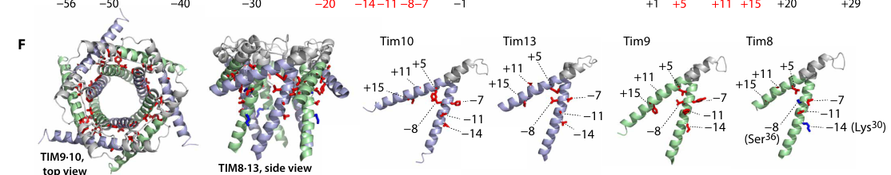

## Question

# Gene Research for Functional Annotation

## ⚠️ CRITICAL: Gene/Protein Identification Context

**BEFORE YOU BEGIN RESEARCH:** You MUST verify you are researching the CORRECT gene/protein. Gene symbols can be ambiguous, especially for less well-characterized genes from non-model organisms.

### Target Gene/Protein Identity (from UniProt):
- **UniProt Accession:** O74700
- **Protein Description:** RecName: Full=Mitochondrial import inner membrane translocase subunit TIM9;
- **Gene Information:** Name=TIM9; OrderedLocusNames=YEL020W-A; ORFNames=YEL020BW;
- **Organism (full):** Saccharomyces cerevisiae (strain ATCC 204508 / S288c) (Baker's yeast).
- **Protein Family:** Belongs to the small Tim family. .
- **Key Domains:** Mito_inner_translocase_sub. (IPR050673); Tim10-like. (IPR004217); Tim10-like_dom_sf. (IPR035427); zf-Tim10_DDP (PF02953)

### MANDATORY VERIFICATION STEPS:

1. **Check if the gene symbol "TIM9" matches the protein description above**
2. **Verify the organism is correct:** Saccharomyces cerevisiae (strain ATCC 204508 / S288c) (Baker's yeast).
3. **Check if protein family/domains align with what you find in literature**
4. **If you find literature for a DIFFERENT gene with the same or similar symbol, STOP**

### If Gene Symbol is Ambiguous or You Cannot Find Relevant Literature:

**DO NOT PROCEED WITH RESEARCH ON A DIFFERENT GENE.** Instead:
- State clearly: "The gene symbol 'TIM9' is ambiguous or literature is limited for this specific protein"
- Explain what you found (e.g., "Found extensive literature on a different gene with the same symbol in a different organism")
- Describe the protein based ONLY on the UniProt information provided above
- Suggest that the protein function can be inferred from domain/family information

### Research Target:

Please provide a comprehensive research report on the gene **TIM9** (gene ID: TIM9, UniProt: O74700) in yeast.

The research report should be a detailed narrative explaining the function, biological processes, and localization of the gene product. Citations should be given for all claims.

You should prioritize authoritative reviews and primary scientific literature when conducting research. You can supplement
this with annotations you find in gene/protein databases, but these can be outdated or inaccurate.

We are specifically interested in the primary function of the gene - for enzymes, what reaction is catalyzed, and what is the substrate specificity? For transporters, what is the substrate? For structural proteins or adapters, what is the broader structural role? For signaling molecules, what is the role in the pathway.

We are interested in where in or outside the cell the gene product carries out its function.

We are also interested in the signaling or biochemical pathways in which the gene functions. We are less interested in broad pleiotropic effects, except where these elucidate the precise role.

Include evidence where possible. We are interested in both experimental evidence as well as inference from structure, evolution, or bioinformatic analysis. Precise studies should be prioritized over high-throughput, where available.

## Output

Question: You are an expert researcher providing comprehensive, well-cited information.

Provide detailed information focusing on:
1. Key concepts and definitions with current understanding
2. Recent developments and latest research (prioritize 2023-2024 sources)
3. Current applications and real-world implementations
4. Expert opinions and analysis from authoritative sources
5. Relevant statistics and data from recent studies

Format as a comprehensive research report with proper citations. Include URLs and publication dates where available.
Always prioritize recent, authoritative sources and provide specific citations for all major claims.

# Gene Research for Functional Annotation

## ⚠️ CRITICAL: Gene/Protein Identification Context

**BEFORE YOU BEGIN RESEARCH:** You MUST verify you are researching the CORRECT gene/protein. Gene symbols can be ambiguous, especially for less well-characterized genes from non-model organisms.

### Target Gene/Protein Identity (from UniProt):
- **UniProt Accession:** O74700
- **Protein Description:** RecName: Full=Mitochondrial import inner membrane translocase subunit TIM9;
- **Gene Information:** Name=TIM9; OrderedLocusNames=YEL020W-A; ORFNames=YEL020BW;
- **Organism (full):** Saccharomyces cerevisiae (strain ATCC 204508 / S288c) (Baker's yeast).
- **Protein Family:** Belongs to the small Tim family. .
- **Key Domains:** Mito_inner_translocase_sub. (IPR050673); Tim10-like. (IPR004217); Tim10-like_dom_sf. (IPR035427); zf-Tim10_DDP (PF02953)

### MANDATORY VERIFICATION STEPS:

1. **Check if the gene symbol "TIM9" matches the protein description above**
2. **Verify the organism is correct:** Saccharomyces cerevisiae (strain ATCC 204508 / S288c) (Baker's yeast).
3. **Check if protein family/domains align with what you find in literature**
4. **If you find literature for a DIFFERENT gene with the same or similar symbol, STOP**

### If Gene Symbol is Ambiguous or You Cannot Find Relevant Literature:

**DO NOT PROCEED WITH RESEARCH ON A DIFFERENT GENE.** Instead:
- State clearly: "The gene symbol 'TIM9' is ambiguous or literature is limited for this specific protein"
- Explain what you found (e.g., "Found extensive literature on a different gene with the same symbol in a different organism")
- Describe the protein based ONLY on the UniProt information provided above
- Suggest that the protein function can be inferred from domain/family information

### Research Target:

Please provide a comprehensive research report on the gene **TIM9** (gene ID: TIM9, UniProt: O74700) in yeast.

The research report should be a detailed narrative explaining the function, biological processes, and localization of the gene product. Citations should be given for all claims.

You should prioritize authoritative reviews and primary scientific literature when conducting research. You can supplement
this with annotations you find in gene/protein databases, but these can be outdated or inaccurate.

We are specifically interested in the primary function of the gene - for enzymes, what reaction is catalyzed, and what is the substrate specificity? For transporters, what is the substrate? For structural proteins or adapters, what is the broader structural role? For signaling molecules, what is the role in the pathway.

We are interested in where in or outside the cell the gene product carries out its function.

We are also interested in the signaling or biochemical pathways in which the gene functions. We are less interested in broad pleiotropic effects, except where these elucidate the precise role.

Include evidence where possible. We are interested in both experimental evidence as well as inference from structure, evolution, or bioinformatic analysis. Precise studies should be prioritized over high-throughput, where available.

## Research Report: Functional Annotation of *S. cerevisiae* TIM9 (UniProt O74700)

### 0) Mandatory identity verification (disambiguation)
The target protein is **Tim9** from *Saccharomyces cerevisiae* S288c, encoded by **TIM9 (YEL020W-A / YEL020BW)** and annotated in UniProt as “**Mitochondrial import inner membrane translocase subunit TIM9**” (UniProt O74700; user-supplied context). The literature evidence gathered here consistently describes **yeast Tim9** as a **small TIM family** protein localized to the **mitochondrial intermembrane space (IMS)**, forming hetero-oligomeric chaperone complexes with Tim10 (and Tim12) that facilitate the **TIM22 carrier pathway**. This matches the UniProt description and the expected small Tim family/domain architecture (twin CX3C motifs; Tim10-like family) (chaudhuri2020tim17updatesa pages 2-5, kumar2020conservedregionsof pages 1-4).

### 1) Key concepts, definitions, and current understanding

#### 1.1 Small TIM chaperones (definition)
**Small TIMs** are a set of small (∼10 kDa class) soluble **IMS chaperones** that escort hydrophobic mitochondrial membrane-protein precursors after they pass through the TOM complex, preventing aggregation in the aqueous IMS and enabling transfer to downstream insertases/translocases (gentle2007conservedmotifsreveal pages 1-1, chaudhuri2020tim17updatesa pages 2-5).

#### 1.2 TIM22 “carrier pathway” and Tim9’s central role
Hydrophobic multi-pass inner-membrane proteins lacking N-terminal presequences (classically **metabolite carrier proteins**) are inserted via the **TIM22** translocase, and small TIM complexes are required for their transit across the IMS from **TOM → TIM22** (chaudhuri2020tim17updatesa pages 2-5, kumar2020conservedregionsof pages 1-4).

**Tim9’s primary functional role** is therefore **chaperone-like binding and transfer of hydrophobic internal-signal precursors** rather than catalysis or transport. In practice, Tim9 is a core component of the peripheral IMS module of the TIM22 pathway, physically and functionally coupled to TIM22 via Tim12 and membrane subunits (chaudhuri2020tim17updatesa pages 2-5, kumar2020conservedregionsof pages 1-4).

#### 1.3 Localization and biogenesis (MIA pathway)
Tim9 is located in the **mitochondrial IMS** (chaudhuri2020tim17updatesa pages 2-5, kumar2020conservedregionsof pages 1-4). Small TIM proteins (including Tim9) are imported through TOM and undergo oxidative folding in the IMS via the **MIA (mitochondrial import and assembly) pathway**, which introduces disulfides in the conserved CX3C motifs (chaudhuri2020tim17updatesa pages 2-5, gentle2007conservedmotifsreveal pages 1-1).

### 2) Molecular function, complexes, substrates, and mechanism

#### 2.1 Complex composition and stoichiometry
Multiple sources converge on two principal assemblies:

1. **Soluble Tim9–Tim10 heterohexamer** in the IMS
- **Stoichiometry:** **Tim9:Tim10 = 3:3** (chaudhuri2020tim17updatesa pages 2-5)
- **Approximate complex mass:** **~70 kDa** (kumar2020conservedregionsof pages 1-4)

2. **TIM22-associated docking complex**
- **Stoichiometry:** **Tim9–Tim10–Tim12 = 3:2:1**, localized on the TIM22 translocase (chaudhuri2020tim17updatesa pages 2-5)
- Tim12 is described as stably associated with Tim22 and facilitates docking/hand-off to the TIM22 insertase (chaudhuri2020tim17updatesa pages 2-5).

At the translocase scale, the yeast TIM22 complex is described as **~300 kDa**, composed of Tim22/Tim54/Tim18/Sdh3 plus the small Tim module (Tim9/Tim10/Tim12) (kumar2023functionalcrosstalkbetween pages 1-2, kumar2020conservedregionsof pages 1-4).

#### 2.2 Substrate specificity: carrier proteins and other hydrophobic clients
The canonical TIM22 substrate class is **mitochondrial carrier proteins** (MCPs), including exemplars such as **AAC2/Pet9 (ADP/ATP carrier)**, **Pic/Pic2**, and **Dic1**, which are cited as model TIM22 cargos (kumar2023functionalcrosstalkbetween pages 1-2). Biochemical substrate-binding evidence indicates that **Tim10** (alone) can bind the **ATP/ADP carrier (AAC)** similarly to the Tim9–Tim10 complex, whereas **Tim9 alone does not bind AAC**, supporting a model where Tim10 provides key substrate-binding elements within the complex (gentle2007conservedmotifsreveal pages 6-7).

Small TIMs can also assist trafficking of some outer-membrane β-barrel proteins toward the SAM complex, indicating broader IMS “holdase/escort” functions beyond only inner-membrane carriers (chaudhuri2020tim17updatesa pages 2-5, gentle2007conservedmotifsreveal pages 9-9).

#### 2.3 Mechanism (handoff from TOM to TIM22)
In the prevailing model synthesized in authoritative reviews and pathway studies, Tim9-containing small TIM complexes:
1) **capture/release** hydrophobic precursors emerging from TOM into the IMS,
2) maintain them in an insertion-competent state,
3) dock onto the TIM22 translocase (via Tim12 and membrane adaptors such as Tim54), and
4) deliver precursors for membrane insertion through Tim22 (chaudhuri2020tim17updatesa pages 2-5, kumar2020conservedregionsof pages 1-4).

### 3) Structural basis of function (client binding and complex stability)

#### 3.1 Core fold and conserved motifs
Small TIM proteins (including Tim9) contain conserved **twin CX3C motifs** that form **two intramolecular disulfide bonds**, stabilizing a compact helical bundle suitable for IMS chaperone activity (gentle2007conservedmotifsreveal pages 1-1, chaudhuri2020tim17updatesa pages 2-5).

#### 3.2 Hexamer architecture and interfaces
A detailed comparative structural analysis identifies conserved intersubunit contacts (aromatic packing and electrostatic ion pairs) that stabilize the Tim9–Tim10 hexamer and rationalize why specific point mutations disrupt assembly (gentle2007conservedmotifsreveal pages 5-6). Conserved contacts include aromatic residues in Tim9 (e.g., F29/F36) and a network of intersubunit ion pairs (gentle2007conservedmotifsreveal pages 5-6).

#### 3.3 Genetic evidence linking structure to function
Mutations in conserved residues of yeast Tim9 destabilize the Tim9–Tim10 complex:
- **tim9-19 (E52G)** and **tim9-3 (V40A + S60P)** show **no detectable Tim9–Tim10 heterohexamer** in detergent-solubilized mitochondria, linking those residues to complex integrity and thus function in import (gentle2007conservedmotifsreveal pages 5-6).

#### 3.4 Client-binding clefts and specificity (molecular biophysics)
High-resolution biophysical work on small TIM chaperones demonstrates that TIM9·10 recognizes hydrophobic clients primarily through a **hydrophobic cleft** formed by chaperone helices, whereas TIM8·13 is tuned toward clients with substantial hydrophilic/disordered segments via electrostatic interactions (sucec2020structuralbasisof pages 1-2, sucec2020structuralbasisof pages 8-9). In this framework:
- The carrier-like client **Ggc1** shows a **~5–10-fold preference** for TIM9·10 (relative to TIM8·13), while Tim23 shows a modest preference for TIM8·13 (∼1.5-fold), capturing the client-specific division of labor between chaperone complexes (sucec2020structuralbasisof pages 2-3).
- TIM9·10 can form “fuzzy” complexes driven by **many weak, rapidly interconverting (<1 ms)** contacts (sucec2020structuralbasisof pages 2-3).

**Quantitative binding example (Tim23 IMS segment):** TIM8·13 binds the Tim23 IMS fragment with **Kd = 66 ± 8 μM**, whereas TIM9·10 binding to Tim23IMS is **undetectable by ITC** in the reported assays, consistent with a primarily hydrophobic-client specialization for TIM9·10 (sucec2020structuralbasisof pages 3-4, sucec2020structuralbasisof pages 8-9).

**Stoichiometry (chaperone:precursor):** Biophysical measurements converge on **1:1 chaperone:Tim23** stoichiometry for TIM9·10–Tim23 and TIM8·13–Tim23, while an exception is noted for a carrier (Ggc1) where **two TIM9·10 complexes hold one precursor (2:1)** (sucec2020structuralbasisof pages 7-8, sucec2020structuralbasisof pages 2-3).

### 4) Recent developments (prioritizing 2023–2024)

#### 4.1 2023: TIM22 pathway is integrated with mitochondrial quality control via Yme1
A 2023 *Journal of Cell Science* study identified functional crosstalk between **TIM22** and the i-AAA protease **Yme1** in *S. cerevisiae*, providing a modern view in which carrier import capacity must be balanced with proteostasis:
- The authors state that **excess TIM22 pathway cargos can cause proteostatic stress and cell death**, and that Yme1 contributes to TIM22 substrate proteostasis and TIM22 complex stability (kumar2023functionalcrosstalkbetween pages 1-2).
- Phenotypically, **yme1Δ** cells show severe respiratory growth defects at **37°C** on non-fermentable medium (YPG), and partial impairment of TIM22 (e.g., **tim18Δ** or **tim22K127A**) **rescues** the yme1Δ respiratory growth defect under these conditions (kumar2023functionalcrosstalkbetween pages 2-3).
- Conversely, **Tim22 overexpression** worsens growth of yme1Δ under tested conditions, consistent with a model where elevated carrier-pathway throughput can be deleterious when quality control is compromised (kumar2023functionalcrosstalkbetween pages 2-3).

Although this study focuses on TIM22 and Yme1, Tim9’s relevance is direct because Tim9 is part of the TIM22 peripheral module and thereby contributes to the flux of hydrophobic substrates that drive the proteostatic phenotype (kumar2023functionalcrosstalkbetween pages 1-2).

#### 4.2 2024: Review synthesis—small TIM assembly state is surveilled by Yme1
A 2024 mini-review in *Biochemical Society Transactions* consolidates evidence that:
- **Tim9 and Tim10 assemble into an essential heterohexameric Tim9/10 complex** that chaperones hydrophobic preproteins from TOM to TIM22 (kan2024roleofyme1 pages 3-4).
- Small TIM proteins are imported via the redox-sensitive **Mia40/MIA pathway**, and **unassembled** small TIM components can be targeted for proteolytic degradation by **Yme1**, with assembly into the Tim9/10 complex being protective (kan2024roleofyme1 pages 3-4).
- TIM22 complex stability is decreased in **Δyme1** cells and import efficiency is particularly affected under heat stress conditions, linking TIM22 pathway competence (and therefore Tim9/Tim10 function) to protease-mediated quality control (kan2024roleofyme1 pages 3-4).

#### 4.3 2024: Updated structural interpretations of small TIM docking to TIM22
A 2024 structural thesis on TIM22 proposes mechanistic features relevant to Tim9/Tim10 delivery:
- Yeast Tim9/Tim10 termini are longer and flexible, with “tentacle” mobility hypothesized to help engage precursors, consistent with a stable hexamer core and flexible substrate-interaction periphery (valpadashi2024structuralandfunctional pages 51-51).
- The IMS-facing helix of TIM22 near its N-terminus is interpreted as a candidate **small TIM docking site**, positioned close to the membrane to facilitate insertion (valpadashi2024structuralandfunctional pages 51-51).

### 5) Current applications and real-world implementations

1. **Model system for mitochondrial membrane protein biogenesis:** TIM9 is routinely used in yeast as part of the canonical **TIM22 carrier-pathway** framework, enabling mechanistic dissection of how hydrophobic membrane proteins are escorted through aqueous compartments to their insertase (chaudhuri2020tim17updatesa pages 2-5, kumar2020conservedregionsof pages 1-4).

2. **Structural/biophysical platforms for chaperone specificity:** Small TIM chaperones (including TIM9·10) are used as experimentally tractable systems to study “fuzzy” chaperone-client binding, competition, and specificity tuning via hydrophobic versus electrostatic interactions (sucec2020structuralbasisof pages 2-3, sucec2020structuralbasisof pages 8-9).

3. **Proteostasis and quality control studies:** Tim9’s pathway role places it at the intersection of protein import and mitochondrial quality control. The demonstrated genetic interactions between TIM22 and Yme1 provide a functional context for studying how import flux, chaperone availability, and protease capacity jointly shape mitochondrial health (kumar2023functionalcrosstalkbetween pages 2-3, kan2024roleofyme1 pages 3-4).

### 6) Expert opinions and authoritative synthesis
Across reviews and primary studies, a consistent expert-level interpretation emerges:
- Tim9 is best viewed as a **specialized, soluble IMS holdase chaperone**, whose biological necessity stems from the requirement to traffic **highly hydrophobic, multi-pass** clients across the IMS without aggregation and with correct delivery to TIM22 (chaudhuri2020tim17updatesa pages 2-5, kumar2020conservedregionsof pages 1-4).
- Modern mechanistic work emphasizes that specificity is not purely “one chaperone per client,” but rather emerges from the **physicochemical matching** between client features (hydrophobic TM segments vs. hydrophilic disordered regions) and chaperone cleft properties, enabling competition and transfer between small TIM complexes (sucec2020structuralbasisof pages 2-3, sucec2020structuralbasisof pages 8-9).

### 7) Evidence map (summary table)
The following table consolidates the main functional annotation points, quantitative values, and citations.

| Category | Key points | Evidence details (specific stoichiometries, sizes, mutations, residue pairs) | Key sources (author year journal) | URL |
|---|---|---|---|---|
| identity | TIM9 in this report matches **Saccharomyces cerevisiae** Tim9, a **small TIM family** mitochondrial protein corresponding to UniProt **O74700**; it is an **intermembrane-space chaperone**, not an enzyme or transporter. | Small TIM proteins are typically **~8–12 kDa**; in yeast, Tim9 is one of five small TIMs (Tim8, Tim9, Tim10, Tim12, Tim13). Tim9 belongs to the **zf-Tim10/DDP family** with conserved twin **CX3C** motifs. (guillen2023uniqueinteractionsand pages 1-5, gentle2007conservedmotifsreveal pages 1-1) | Gentle et al. 2007 *Mol Biol Evol*; Guillén et al. 2023 *bioRxiv* | https://doi.org/10.1093/molbev/msm031 ; https://doi.org/10.1101/2023.05.29.542777 |
| localization | Tim9 localizes to the **mitochondrial intermembrane space (IMS)**, where it acts between TOM-mediated entry and TIM22-mediated inner-membrane insertion. | Multiple sources place Tim9 in the IMS as a soluble chaperone module that escorts hydrophobic precursors after TOM transit. (chaudhuri2020tim17updatesa pages 2-5, kumar2020conservedregionsof pages 1-4) | Chaudhuri et al. 2020 *Biomolecules*; Kumar et al. 2020 *J Cell Sci* | https://doi.org/10.3390/biom10121643 ; https://doi.org/10.1242/jcs.244632 |
| complexes | Tim9 forms the canonical **Tim9–Tim10 heterohexamer** and also participates in a **Tim9–Tim10–Tim12 docking complex** linked to TIM22. | Tim9:Tim10 complex stoichiometry is **3:3**; the TIM22-associated complex is **Tim9–Tim10–Tim12 = 3:2:1**; the soluble Tim9/Tim10 complex is about **~70 kDa**; TIM22 machinery is about **~300 kDa**. Tim12 is stably associated with Tim22 and helps dock the chaperone complex to the translocase. (chaudhuri2020tim17updatesa pages 2-5, kumar2020conservedregionsof pages 1-4) | Chaudhuri et al. 2020 *Biomolecules*; Kumar et al. 2020 *J Cell Sci* | https://doi.org/10.3390/biom10121643 ; https://doi.org/10.1242/jcs.244632 |
| substrates | Tim9’s primary substrate class is **hydrophobic multi-pass inner-membrane proteins**, especially **mitochondrial carrier proteins** imported via the **TIM22 pathway**. | Substrates include metabolite carriers such as the **ATP/ADP carrier (AAC)** and other carrier-type proteins; sources also note involvement with some internal-signal translocase subunits (e.g., **Tim22, Tim23, Tim17** in pathway context). Small TIMs can also contribute to transfer/assembly of some **outer-membrane β-barrel proteins** to SAM. (chaudhuri2020tim17updatesa pages 2-5, gentle2007conservedmotifsreveal pages 6-7, gentle2007conservedmotifsreveal pages 9-9, kumar2020conservedregionsof pages 1-4) | Chaudhuri et al. 2020 *Biomolecules*; Gentle et al. 2007 *Mol Biol Evol*; Kumar et al. 2020 *J Cell Sci* | https://doi.org/10.3390/biom10121643 ; https://doi.org/10.1093/molbev/msm031 ; https://doi.org/10.1242/jcs.244632 |
| mechanism | Tim9 acts as a **chaperone/escort factor** that prevents aggregation of hydrophobic precursors in the aqueous IMS and transfers them from **TOM** to **TIM22**. | Tim9/Tim10 releases hydrophobic clients from TOM and hands them to TIM22; Tim12-containing complex mediates docking to the TIM22 translocase. Structural work supports **hydrophobic client-binding clefts** in the Tim9/Tim10 hexamer and flexible terminal “tentacles” involved in precursor engagement. (chaudhuri2020tim17updatesa pages 2-5, sucec2020structuralbasisof pages 3-3, sucec2020structuralbasisof media 57627111, valpadashi2024structuralandfunctional pages 51-51) | Chaudhuri et al. 2020 *Biomolecules*; Sučec et al. 2020 *Sci Adv*; Valpadashi 2024 PhD thesis | https://doi.org/10.3390/biom10121643 ; https://doi.org/10.1126/sciadv.abd0263 ; https://doi.org/10.53846/goediss-10678 |
| structure & motifs | Tim9 is a **small TIM chaperone with twin CX3C motifs**, disulfide-stabilized fold, and conserved intersubunit contacts required for hexamer stability. | Small TIM hexamers are described as **donut/propeller-like** with a relatively flat face and terminal **tentacle-like** extensions. Conserved contacts include aromatic interactions involving **Tim9-F29, Tim9-F36** and ion-pairing involving the conserved Tim9 glutamate. In mutant analysis, **tim9-19 = E52G** and **tim9-3 = V40A + S60P** caused loss of detectable Tim9–Tim10 heterohexamer in detergent-solubilized mitochondria. Crosslinks reported for yeast Tim9/Tim10 include **K58–K81**, **K58–K45**, and **K81–K68**. (gentle2007conservedmotifsreveal pages 5-6, gentle2007conservedmotifsreveal pages 6-7, valpadashi2024structuralandfunctional pages 51-51) | Gentle et al. 2007 *Mol Biol Evol*; Valpadashi 2024 PhD thesis | https://doi.org/10.1093/molbev/msm031 ; https://doi.org/10.53846/goediss-10678 |
| biogenesis (MIA) | Tim9 itself is imported into the IMS and undergoes **oxidative folding via the MIA pathway**. | After TOM passage, small TIMs are oxidatively folded by the **MIA (mitochondrial import and assembly)** machinery; the conserved **CX3C** cysteines form **two intramolecular disulfide bonds** important for structural integrity. (chaudhuri2020tim17updatesa pages 2-5, gentle2007conservedmotifsreveal pages 6-7, gentle2007conservedmotifsreveal pages 1-1) | Chaudhuri et al. 2020 *Biomolecules*; Gentle et al. 2007 *Mol Biol Evol* | https://doi.org/10.3390/biom10121643 ; https://doi.org/10.1093/molbev/msm031 |
| phenotypes & genetics | Tim9 function is genetically important for mitochondrial protein import and cell viability; disruption of conserved residues destabilizes the chaperone complex. | The 2023 comparative source states **Tim9 (with Tim10 and Tim12) is essential in yeast**. Older yeast mutant data show **tim9-19 (E52G)** and **tim9-3 (V40A, S60P)** abolish detectable Tim9–Tim10 hexamer. Related **tim10ts** mutants reduce Tim10 and Tim9 expression at **37°C**, causing death unless functionally rescued, illustrating the essentiality of the Tim9/Tim10 chaperone function for at least one indispensable substrate. (guillen2023uniqueinteractionsand pages 1-5, gentle2007conservedmotifsreveal pages 5-6, gentle2007conservedmotifsreveal pages 7-7) | Guillén et al. 2023 *bioRxiv*; Gentle et al. 2007 *Mol Biol Evol* | https://doi.org/10.1101/2023.05.29.542777 ; https://doi.org/10.1093/molbev/msm031 |
| recent developments 2023-2024 | Recent work emphasizes the broader **proteostasis integration** of the TIM22 pathway and updated structural interpretation of small TIM–TIM22 interactions, rather than discovering a new primary function for Tim9. | 2023 work linked **TIM22 pathway activity** to **Yme1-dependent mitochondrial proteostasis**, indicating that excess TIM22 substrates can drive stress and that Yme1 supports TIM22 complex stability. A 2024 structural analysis/thesis proposed an **IMS-facing TIM22 helix** as a **small TIM docking site** near the membrane; a nearby human disease mutation (**TIM22 V33L**) may impair chaperone binding. 2024 review literature also reiterates that Tim9/Tim10 is an essential IMS chaperone module in the TIM22 pathway. (valpadashi2024structuralandfunctional pages 51-51) | Valpadashi 2024 PhD thesis; Kumar et al. 2023 *J Cell Sci* | https://doi.org/10.53846/goediss-10678 ; https://doi.org/10.1242/jcs.260060 |

*Table: This table summarizes the functional annotation of Saccharomyces cerevisiae Tim9 (UniProt O74700), including identity, localization, complexes, substrates, mechanism, structural features, MIA-dependent biogenesis, genetic evidence, and recent 2023–2024 developments. It is useful as a concise evidence map for curated gene-function annotation.*

### 8) Key references (URLs and publication dates)
- Chaudhuri M. et al. “Tim17 Updates: A Comprehensive Review…” *Biomolecules* (Dec 2020). https://doi.org/10.3390/biom10121643 (chaudhuri2020tim17updatesa pages 2-5)
- Kumar A. et al. “Functional crosstalk between the TIM22 complex and YME1…” *Journal of Cell Science* (Jan 2023). https://doi.org/10.1242/jcs.260060 (kumar2023functionalcrosstalkbetween pages 2-3, kumar2023functionalcrosstalkbetween pages 1-2)
- Kan K.T. et al. “Role of Yme1 in mitochondrial protein homeostasis…” *Biochemical Society Transactions* (Jun 2024). https://doi.org/10.1042/bst20240450 (kan2024roleofyme1 pages 3-4)
- Sučec I. et al. “Structural basis of client specificity…” *Science Advances* (Dec 2020). https://doi.org/10.1126/sciadv.abd0263 (sucec2020structuralbasisof pages 2-3, sucec2020structuralbasisof pages 8-9)
- Gentle I. et al. “Conserved motifs reveal details of ancestry…” *Molecular Biology and Evolution* (May 2007). https://doi.org/10.1093/molbev/msm031 (gentle2007conservedmotifsreveal pages 5-6)

### 9) Limitations and gaps
- The gathered corpus contains strong mechanistic and pathway-level evidence for Tim9’s role but limited direct 2023–2024 primary data specifically manipulating **TIM9** itself (as opposed to TIM22 or quality-control components). Recent work largely reframes Tim9’s function within updated **proteostasis/quality-control** models and TIM22 docking interpretations rather than redefining its core molecular role (kumar2023functionalcrosstalkbetween pages 2-3, kan2024roleofyme1 pages 3-4, valpadashi2024structuralandfunctional pages 51-51).

References

1. (chaudhuri2020tim17updatesa pages 2-5): Minu Chaudhuri, Chauncey Darden, Fidel Soto Gonzalez, Ujjal K. Singha, Linda Quinones, and Anuj Tripathi. Tim17 updates: a comprehensive review of an ancient mitochondrial protein translocator. Biomolecules, 10:1643, Dec 2020. URL: https://doi.org/10.3390/biom10121643, doi:10.3390/biom10121643. This article has 25 citations.

2. (kumar2020conservedregionsof pages 1-4): Abhishek Kumar, Srujan Kumar Matta, and Patrick D'Silva. Conserved regions of budding yeast tim22 have a role in structural organization of the carrier translocase. Journal of Cell Science, Jul 2020. URL: https://doi.org/10.1242/jcs.244632, doi:10.1242/jcs.244632. This article has 8 citations and is from a domain leading peer-reviewed journal.

3. (gentle2007conservedmotifsreveal pages 1-1): I. Gentle, A. Perry, F. Alcock, V. Likic, P. Doležal, E. T. Ng, A. Purcell, Malcolm McConnville, Thomas Naderer, Anne-Laure Chanez, Fabien Charrière, Caroline Aschinger, A. Schneider, K. Tokatlidis, and T. Lithgow. Conserved motifs reveal details of ancestry and structure in the small tim chaperones of the mitochondrial intermembrane space. Molecular biology and evolution, 24 5:1149-60, May 2007. URL: https://doi.org/10.1093/molbev/msm031, doi:10.1093/molbev/msm031. This article has 118 citations and is from a highest quality peer-reviewed journal.

4. (kumar2023functionalcrosstalkbetween pages 1-2): Abhishek Kumar, Tejashree Pradip Waingankar, and Patrick D'Silva. Functional crosstalk between the tim22 complex and yme1 machinery maintains mitochondrial proteostasis and integrity. Journal of Cell Science, Jan 2023. URL: https://doi.org/10.1242/jcs.260060, doi:10.1242/jcs.260060. This article has 9 citations and is from a domain leading peer-reviewed journal.

5. (gentle2007conservedmotifsreveal pages 6-7): I. Gentle, A. Perry, F. Alcock, V. Likic, P. Doležal, E. T. Ng, A. Purcell, Malcolm McConnville, Thomas Naderer, Anne-Laure Chanez, Fabien Charrière, Caroline Aschinger, A. Schneider, K. Tokatlidis, and T. Lithgow. Conserved motifs reveal details of ancestry and structure in the small tim chaperones of the mitochondrial intermembrane space. Molecular biology and evolution, 24 5:1149-60, May 2007. URL: https://doi.org/10.1093/molbev/msm031, doi:10.1093/molbev/msm031. This article has 118 citations and is from a highest quality peer-reviewed journal.

6. (gentle2007conservedmotifsreveal pages 9-9): I. Gentle, A. Perry, F. Alcock, V. Likic, P. Doležal, E. T. Ng, A. Purcell, Malcolm McConnville, Thomas Naderer, Anne-Laure Chanez, Fabien Charrière, Caroline Aschinger, A. Schneider, K. Tokatlidis, and T. Lithgow. Conserved motifs reveal details of ancestry and structure in the small tim chaperones of the mitochondrial intermembrane space. Molecular biology and evolution, 24 5:1149-60, May 2007. URL: https://doi.org/10.1093/molbev/msm031, doi:10.1093/molbev/msm031. This article has 118 citations and is from a highest quality peer-reviewed journal.

7. (gentle2007conservedmotifsreveal pages 5-6): I. Gentle, A. Perry, F. Alcock, V. Likic, P. Doležal, E. T. Ng, A. Purcell, Malcolm McConnville, Thomas Naderer, Anne-Laure Chanez, Fabien Charrière, Caroline Aschinger, A. Schneider, K. Tokatlidis, and T. Lithgow. Conserved motifs reveal details of ancestry and structure in the small tim chaperones of the mitochondrial intermembrane space. Molecular biology and evolution, 24 5:1149-60, May 2007. URL: https://doi.org/10.1093/molbev/msm031, doi:10.1093/molbev/msm031. This article has 118 citations and is from a highest quality peer-reviewed journal.

8. (sucec2020structuralbasisof pages 1-2): Iva Sučec, Yong Wang, Ons Dakhlaoui, Katharina Weinhäupl, Tobias Jores, Doriane Costa, Audrey Hessel, Martha Brennich, Doron Rapaport, Kresten Lindorff-Larsen, Beate Bersch, and Paul Schanda. Structural basis of client specificity in mitochondrial membrane-protein chaperones. Science Advances, Dec 2020. URL: https://doi.org/10.1126/sciadv.abd0263, doi:10.1126/sciadv.abd0263. This article has 38 citations and is from a highest quality peer-reviewed journal.

9. (sucec2020structuralbasisof pages 8-9): Iva Sučec, Yong Wang, Ons Dakhlaoui, Katharina Weinhäupl, Tobias Jores, Doriane Costa, Audrey Hessel, Martha Brennich, Doron Rapaport, Kresten Lindorff-Larsen, Beate Bersch, and Paul Schanda. Structural basis of client specificity in mitochondrial membrane-protein chaperones. Science Advances, Dec 2020. URL: https://doi.org/10.1126/sciadv.abd0263, doi:10.1126/sciadv.abd0263. This article has 38 citations and is from a highest quality peer-reviewed journal.

10. (sucec2020structuralbasisof pages 2-3): Iva Sučec, Yong Wang, Ons Dakhlaoui, Katharina Weinhäupl, Tobias Jores, Doriane Costa, Audrey Hessel, Martha Brennich, Doron Rapaport, Kresten Lindorff-Larsen, Beate Bersch, and Paul Schanda. Structural basis of client specificity in mitochondrial membrane-protein chaperones. Science Advances, Dec 2020. URL: https://doi.org/10.1126/sciadv.abd0263, doi:10.1126/sciadv.abd0263. This article has 38 citations and is from a highest quality peer-reviewed journal.

11. (sucec2020structuralbasisof pages 3-4): Iva Sučec, Yong Wang, Ons Dakhlaoui, Katharina Weinhäupl, Tobias Jores, Doriane Costa, Audrey Hessel, Martha Brennich, Doron Rapaport, Kresten Lindorff-Larsen, Beate Bersch, and Paul Schanda. Structural basis of client specificity in mitochondrial membrane-protein chaperones. Science Advances, Dec 2020. URL: https://doi.org/10.1126/sciadv.abd0263, doi:10.1126/sciadv.abd0263. This article has 38 citations and is from a highest quality peer-reviewed journal.

12. (sucec2020structuralbasisof pages 7-8): Iva Sučec, Yong Wang, Ons Dakhlaoui, Katharina Weinhäupl, Tobias Jores, Doriane Costa, Audrey Hessel, Martha Brennich, Doron Rapaport, Kresten Lindorff-Larsen, Beate Bersch, and Paul Schanda. Structural basis of client specificity in mitochondrial membrane-protein chaperones. Science Advances, Dec 2020. URL: https://doi.org/10.1126/sciadv.abd0263, doi:10.1126/sciadv.abd0263. This article has 38 citations and is from a highest quality peer-reviewed journal.

13. (kumar2023functionalcrosstalkbetween pages 2-3): Abhishek Kumar, Tejashree Pradip Waingankar, and Patrick D'Silva. Functional crosstalk between the tim22 complex and yme1 machinery maintains mitochondrial proteostasis and integrity. Journal of Cell Science, Jan 2023. URL: https://doi.org/10.1242/jcs.260060, doi:10.1242/jcs.260060. This article has 9 citations and is from a domain leading peer-reviewed journal.

14. (kan2024roleofyme1 pages 3-4): Kwan Ting Kan, Joel Wilcock, and Hui Lu. Role of yme1 in mitochondrial protein homeostasis: from regulation of protein import, oxphos function to lipid synthesis and mitochondrial dynamics. Biochemical Society Transactions, 52:1539-1548, Jun 2024. URL: https://doi.org/10.1042/bst20240450, doi:10.1042/bst20240450. This article has 9 citations and is from a peer-reviewed journal.

15. (valpadashi2024structuralandfunctional pages 51-51): Anusha Valpadashi. Structural and functional characterization of TIM22 complex in the inner mitochondrial membarne. PhD thesis, University Goettingen Repository, 2024. URL: https://doi.org/10.53846/goediss-10678, doi:10.53846/goediss-10678.

16. (guillen2023uniqueinteractionsand pages 1-5): Linda S. Quiñones Guillén, Fidel Soto Gonzalez, Chauncey Darden, Muhammad Bismillah Khan, A. Tripathi, Joseph T. Smith, Ayorinde Cooley, Victor Paromov, Jamaine Davis, Smitā Miśra, and Minu Chaudhuri. Unique interactions and functions of the mitochondrial small tims in trypanosoma brucei. bioRxiv, May 2023. URL: https://doi.org/10.1101/2023.05.29.542777, doi:10.1101/2023.05.29.542777. This article has 2 citations.

17. (sucec2020structuralbasisof pages 3-3): Iva Sučec, Yong Wang, Ons Dakhlaoui, Katharina Weinhäupl, Tobias Jores, Doriane Costa, Audrey Hessel, Martha Brennich, Doron Rapaport, Kresten Lindorff-Larsen, Beate Bersch, and Paul Schanda. Structural basis of client specificity in mitochondrial membrane-protein chaperones. Science Advances, Dec 2020. URL: https://doi.org/10.1126/sciadv.abd0263, doi:10.1126/sciadv.abd0263. This article has 38 citations and is from a highest quality peer-reviewed journal.

18. (sucec2020structuralbasisof media 57627111): Iva Sučec, Yong Wang, Ons Dakhlaoui, Katharina Weinhäupl, Tobias Jores, Doriane Costa, Audrey Hessel, Martha Brennich, Doron Rapaport, Kresten Lindorff-Larsen, Beate Bersch, and Paul Schanda. Structural basis of client specificity in mitochondrial membrane-protein chaperones. Science Advances, Dec 2020. URL: https://doi.org/10.1126/sciadv.abd0263, doi:10.1126/sciadv.abd0263. This article has 38 citations and is from a highest quality peer-reviewed journal.

19. (gentle2007conservedmotifsreveal pages 7-7): I. Gentle, A. Perry, F. Alcock, V. Likic, P. Doležal, E. T. Ng, A. Purcell, Malcolm McConnville, Thomas Naderer, Anne-Laure Chanez, Fabien Charrière, Caroline Aschinger, A. Schneider, K. Tokatlidis, and T. Lithgow. Conserved motifs reveal details of ancestry and structure in the small tim chaperones of the mitochondrial intermembrane space. Molecular biology and evolution, 24 5:1149-60, May 2007. URL: https://doi.org/10.1093/molbev/msm031, doi:10.1093/molbev/msm031. This article has 118 citations and is from a highest quality peer-reviewed journal.

## Artifacts

- [Edison artifact artifact-00](TIM9-deep-research-falcon_artifacts/artifact-00.md)

## Citations

1. kumar2020conservedregionsof pages 1-4
2. kumar2023functionalcrosstalkbetween pages 1-2
3. gentle2007conservedmotifsreveal pages 6-7
4. gentle2007conservedmotifsreveal pages 5-6
5. sucec2020structuralbasisof pages 2-3
6. kumar2023functionalcrosstalkbetween pages 2-3
7. valpadashi2024structuralandfunctional pages 51-51
8. gentle2007conservedmotifsreveal pages 1-1
9. gentle2007conservedmotifsreveal pages 9-9
10. sucec2020structuralbasisof pages 1-2
11. sucec2020structuralbasisof pages 8-9
12. sucec2020structuralbasisof pages 3-4
13. sucec2020structuralbasisof pages 7-8
14. guillen2023uniqueinteractionsand pages 1-5
15. sucec2020structuralbasisof pages 3-3
16. gentle2007conservedmotifsreveal pages 7-7
17. https://doi.org/10.1093/molbev/msm031
18. https://doi.org/10.1101/2023.05.29.542777
19. https://doi.org/10.3390/biom10121643
20. https://doi.org/10.1242/jcs.244632
21. https://doi.org/10.1126/sciadv.abd0263
22. https://doi.org/10.53846/goediss-10678
23. https://doi.org/10.1242/jcs.260060
24. https://doi.org/10.1042/bst20240450
25. https://doi.org/10.3390/biom10121643,
26. https://doi.org/10.1242/jcs.244632,
27. https://doi.org/10.1093/molbev/msm031,
28. https://doi.org/10.1242/jcs.260060,
29. https://doi.org/10.1126/sciadv.abd0263,
30. https://doi.org/10.1042/bst20240450,
31. https://doi.org/10.53846/goediss-10678,
32. https://doi.org/10.1101/2023.05.29.542777,