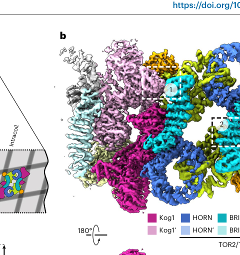

## Question

# Gene Research for Functional Annotation

## ⚠️ CRITICAL: Gene/Protein Identification Context

**BEFORE YOU BEGIN RESEARCH:** You MUST verify you are researching the CORRECT gene/protein. Gene symbols can be ambiguous, especially for less well-characterized genes from non-model organisms.

### Target Gene/Protein Identity (from UniProt):
- **UniProt Accession:** P35169
- **Protein Description:** RecName: Full=Serine/threonine-protein kinase TOR1; EC=2.7.11.1 {ECO:0000269|PubMed:10436010, ECO:0000305|PubMed:34535752}; AltName: Full=Dominant rapamycin resistance protein 1; AltName: Full=Phosphatidylinositol kinase homolog TOR1; AltName: Full=Target of rapamycin kinase 1;
- **Gene Information:** Name=TOR1; Synonyms=DRR1; OrderedLocusNames=YJR066W; ORFNames=J1803;
- **Organism (full):** Saccharomyces cerevisiae (strain ATCC 204508 / S288c) (Baker's yeast).
- **Protein Family:** Belongs to the PI3/PI4-kinase family. .
- **Key Domains:** ARM-like. (IPR011989); ARM-type_fold. (IPR016024); DDR_Repair_Kinase. (IPR050517); FATC_dom. (IPR003152); FRB_dom. (IPR009076)

### MANDATORY VERIFICATION STEPS:

1. **Check if the gene symbol "TOR1" matches the protein description above**
2. **Verify the organism is correct:** Saccharomyces cerevisiae (strain ATCC 204508 / S288c) (Baker's yeast).
3. **Check if protein family/domains align with what you find in literature**
4. **If you find literature for a DIFFERENT gene with the same or similar symbol, STOP**

### If Gene Symbol is Ambiguous or You Cannot Find Relevant Literature:

**DO NOT PROCEED WITH RESEARCH ON A DIFFERENT GENE.** Instead:
- State clearly: "The gene symbol 'TOR1' is ambiguous or literature is limited for this specific protein"
- Explain what you found (e.g., "Found extensive literature on a different gene with the same symbol in a different organism")
- Describe the protein based ONLY on the UniProt information provided above
- Suggest that the protein function can be inferred from domain/family information

### Research Target:

Please provide a comprehensive research report on the gene **TOR1** (gene ID: TOR1, UniProt: P35169) in yeast.

The research report should be a detailed narrative explaining the function, biological processes, and localization of the gene product. Citations should be given for all claims.

You should prioritize authoritative reviews and primary scientific literature when conducting research. You can supplement
this with annotations you find in gene/protein databases, but these can be outdated or inaccurate.

We are specifically interested in the primary function of the gene - for enzymes, what reaction is catalyzed, and what is the substrate specificity? For transporters, what is the substrate? For structural proteins or adapters, what is the broader structural role? For signaling molecules, what is the role in the pathway.

We are interested in where in or outside the cell the gene product carries out its function.

We are also interested in the signaling or biochemical pathways in which the gene functions. We are less interested in broad pleiotropic effects, except where these elucidate the precise role.

Include evidence where possible. We are interested in both experimental evidence as well as inference from structure, evolution, or bioinformatic analysis. Precise studies should be prioritized over high-throughput, where available.

## Output

Question: You are an expert researcher providing comprehensive, well-cited information.

Provide detailed information focusing on:
1. Key concepts and definitions with current understanding
2. Recent developments and latest research (prioritize 2023-2024 sources)
3. Current applications and real-world implementations
4. Expert opinions and analysis from authoritative sources
5. Relevant statistics and data from recent studies

Format as a comprehensive research report with proper citations. Include URLs and publication dates where available.
Always prioritize recent, authoritative sources and provide specific citations for all major claims.

# Gene Research for Functional Annotation

## ⚠️ CRITICAL: Gene/Protein Identification Context

**BEFORE YOU BEGIN RESEARCH:** You MUST verify you are researching the CORRECT gene/protein. Gene symbols can be ambiguous, especially for less well-characterized genes from non-model organisms.

### Target Gene/Protein Identity (from UniProt):
- **UniProt Accession:** P35169
- **Protein Description:** RecName: Full=Serine/threonine-protein kinase TOR1; EC=2.7.11.1 {ECO:0000269|PubMed:10436010, ECO:0000305|PubMed:34535752}; AltName: Full=Dominant rapamycin resistance protein 1; AltName: Full=Phosphatidylinositol kinase homolog TOR1; AltName: Full=Target of rapamycin kinase 1;
- **Gene Information:** Name=TOR1; Synonyms=DRR1; OrderedLocusNames=YJR066W; ORFNames=J1803;
- **Organism (full):** Saccharomyces cerevisiae (strain ATCC 204508 / S288c) (Baker's yeast).
- **Protein Family:** Belongs to the PI3/PI4-kinase family. .
- **Key Domains:** ARM-like. (IPR011989); ARM-type_fold. (IPR016024); DDR_Repair_Kinase. (IPR050517); FATC_dom. (IPR003152); FRB_dom. (IPR009076)

### MANDATORY VERIFICATION STEPS:

1. **Check if the gene symbol "TOR1" matches the protein description above**
2. **Verify the organism is correct:** Saccharomyces cerevisiae (strain ATCC 204508 / S288c) (Baker's yeast).
3. **Check if protein family/domains align with what you find in literature**
4. **If you find literature for a DIFFERENT gene with the same or similar symbol, STOP**

### If Gene Symbol is Ambiguous or You Cannot Find Relevant Literature:

**DO NOT PROCEED WITH RESEARCH ON A DIFFERENT GENE.** Instead:
- State clearly: "The gene symbol 'TOR1' is ambiguous or literature is limited for this specific protein"
- Explain what you found (e.g., "Found extensive literature on a different gene with the same symbol in a different organism")
- Describe the protein based ONLY on the UniProt information provided above
- Suggest that the protein function can be inferred from domain/family information

### Research Target:

Please provide a comprehensive research report on the gene **TOR1** (gene ID: TOR1, UniProt: P35169) in yeast.

The research report should be a detailed narrative explaining the function, biological processes, and localization of the gene product. Citations should be given for all claims.

You should prioritize authoritative reviews and primary scientific literature when conducting research. You can supplement
this with annotations you find in gene/protein databases, but these can be outdated or inaccurate.

We are specifically interested in the primary function of the gene - for enzymes, what reaction is catalyzed, and what is the substrate specificity? For transporters, what is the substrate? For structural proteins or adapters, what is the broader structural role? For signaling molecules, what is the role in the pathway.

We are interested in where in or outside the cell the gene product carries out its function.

We are also interested in the signaling or biochemical pathways in which the gene functions. We are less interested in broad pleiotropic effects, except where these elucidate the precise role.

Include evidence where possible. We are interested in both experimental evidence as well as inference from structure, evolution, or bioinformatic analysis. Precise studies should be prioritized over high-throughput, where available.

## Research report: Functional annotation of **TOR1** (UniProt **P35169**) in *Saccharomyces cerevisiae* S288c

### 0) Target verification (critical disambiguation)
The research target here is **budding yeast TOR1** (UniProt **P35169**, locus **YJR066W**, synonym **DRR1**), encoding **serine/threonine-protein kinase TOR1** and belonging to the PI3/PI4-kinase-related kinase (PIKK) family. The literature used below explicitly discusses *S. cerevisiae* **TOR1/TOR2** kinases, their characteristic domains (HEAT/ARM-like repeats; FAT/FATC; FRB; kinase domain), and their roles within the **TORC1** complex, consistent with the UniProt identity provided. (emmerstorferaugustin2023regulationoftorc2 pages 3-5, wang2023torc1signalingin pages 1-2, schmelzle2000toracentral pages 2-3)

### 1) Key concepts and definitions (current understanding)

#### 1.1 TOR1 molecular function (enzymatic activity)
TOR1 is a **very large atypical Ser/Thr protein kinase**: its C-terminal region resembles the catalytic domains of atypical serine/threonine kinases, and TOR proteins are widely recognized as Ser/Thr kinases rather than bona fide lipid kinases (despite historical description as “phosphatidylinositol kinase homologs”). (emmerstorferaugustin2023regulationoftorc2 pages 3-5, schmelzle2000toracentral pages 2-3)

Operationally, TOR1’s enzymatic function is to **phosphorylate downstream proteins (directly or via signaling branches)** in nutrient- and stress-responsive signaling, thereby coordinating biosynthesis (translation and ribosome biogenesis) and catabolism (autophagy). (wang2023torc1signalingin pages 6-8, schmidt1998thetornutrient pages 1-2, schmelzle2000toracentral pages 2-3)

#### 1.2 TOR1 complex membership: TORC1 versus TORC2
Yeast contains two TOR complexes:
- **TORC1** is the **rapamycin-sensitive** complex; its core is described as **Tor1 or Tor2 + Kog1 (RAPTOR ortholog) + Lst8** (with additional components described in other sources). (wang2023torc1signalingin pages 1-2)
- **TORC2** is distinct and **contains Tor2 exclusively** (and is normally rapamycin-insensitive). A key genetic distinction is that **tor1Δ is viable** whereas **tor2Δ is lethal**; TORC1 can function with either Tor1 or Tor2, but **TORC2 requires Tor2**. (emmerstorferaugustin2023regulationoftorc2 pages 3-5)

This distinction is essential for correct annotation: **TOR1 is primarily a TORC1 catalytic subunit**, not a TORC2 subunit, in *S. cerevisiae*. (emmerstorferaugustin2023regulationoftorc2 pages 3-5)

#### 1.3 Rapamycin mechanism and rapamycin-resistant TOR1 alleles
Rapamycin inhibits yeast TOR signaling through FKBP12 (**Fpr1** in yeast). Disrupting FKBP12 function yields rapamycin resistance (e.g., **fpr1Δ cells are completely resistant** in the summarized genetic evidence). (emmerstorferaugustin2023regulationoftorc2 pages 3-5)

Dominant TOR1 rapamycin-resistant alleles map to the **FRB domain**, including substitutions at **Ser1972 (to Arg or Asn)**, which pinpoints the TOR–FKBP12–rapamycin interaction interface. (emmerstorferaugustin2023regulationoftorc2 pages 3-5)

### 2) Where TOR1 acts in the cell (subcellular localization)
A core concept in yeast is that **TORC1 signaling is organized at the vacuolar membrane** (analogous to lysosome-associated mTORC1 in mammals). In budding yeast, TORC1 is recruited/regulated at the **vacuolar membrane** by Rag-family GTPases (**Gtr1–Gtr2**) and the **EGO complex**. (wang2023torc1signalingin pages 1-2, wang2023torc1signalingin pages 2-3)

A major recent development is the description of TORC1’s nutrient-dependent spatial reorganization into **TOROIDs** (“TORC1 organized in inhibited domains”), which appear as **vacuolar puncta/condensates** under glucose depletion/post-diauxic shift conditions. (prouteau2023egocinhibitstoroid pages 4-5)

### 3) Regulation and signaling pathways involving TOR1 (TORC1)

#### 3.1 Nutrient activation through Rag GTPases/EGO
TORC1 activity in yeast is primarily stimulated by amino acids through **Rag-family GTPases** (**Gtr1–Gtr2**). TORC1 activation correlates with the **Gtr1-GTP / Gtr2-GDP** nucleotide state; these GTPases are recruited to the vacuolar membrane by the **EGO complex** and stimulate TORC1 through Kog1. (wang2023torc1signalingin pages 1-2)

The 2023 fungal TORC1 review also summarizes additional upstream regulators that tune Rag/EGO-driven TORC1 activity and localization, including **Vam6** (reported as a GEF for Gtr1), SEAC subcomplexes, **Lst4–Lst7** (as a GAP for Gtr2 favoring an activating nucleotide state), and the vacuolar FYVE-domain protein **Pib2** that localizes to TORC1. (wang2023torc1signalingin pages 1-2, wang2023torc1signalingin pages 2-3)

#### 3.2 Glucose depletion and TOROID formation: a 2023 structural model
Prouteau et al. (2023) showed that **glucose depletion** triggers redistribution of TORC1 into TOROIDs and that **EGOC activity is sufficient to control TOROID distribution**, with Gtr nucleotide state dictating TOROID/puncta behavior. (prouteau2023egocinhibitstoroid pages 4-5)

They report quantitative/experimental details including microscopy quantification (**n=2 independent experiments; ≥77 cells per replicate**), pull-down quantification (**n=3**), and plate assays performed with **2.5 nM rapamycin**. (prouteau2023egocinhibitstoroid pages 4-5)

### 4) Downstream functions and biological processes controlled by TOR1/TORC1

#### 4.1 Translation initiation and protein synthesis
Canonical yeast TOR pathway outputs include **activation of translation initiation** and maintenance of high protein synthesis rates under nutrient-rich conditions. In primary evidence, **loss of TOR1/2 signaling or rapamycin treatment causes a severe reduction in protein synthesis** and triggers starvation-like physiology. (schmidt1998thetornutrient pages 1-2)

A widely cited synthesis further frames TOR as a central controller of **translation and ribosome biogenesis**, and notes that rapamycin is a highly TOR-specific growth inhibitor whose resistance mutations block FKBP–rapamycin binding. (schmelzle2000toracentral pages 2-3)

#### 4.2 Ribosome biogenesis and growth programs
A 2023 review summarizes that yeast TORC1 controls **protein synthesis and ribosome biogenesis**, with major downstream branches involving **Sch9** and **Tap42**; and it catalogs downstream factors connected to translation and ribosome production (e.g., Gcn2/eIF2α and ribosome biogenesis regulators such as Maf1, Ifh1, Stb3, Dot6, Tod6). (wang2023torc1signalingin pages 6-8)

#### 4.3 Autophagy repression and induction upon TOR inhibition
TOR signaling is a pivotal negative regulator of autophagy in yeast: experimental evidence indicates that rapamycin (TOR inhibition) induces starvation-like programs including **induction of autophagy**, and TOR acts upstream of core autophagy machinery. (schmidt1998thetornutrient pages 1-2)

### 5) Recent developments (prioritizing 2023–2024)

#### 5.1 2023: High-resolution TORC1 structure in an inhibited condensate (TOROID)
Prouteau et al. (publication date: **Jan 2023**) determined a **3.9 Å cryo-EM structure** of yeast TORC1 purified from TOROIDs, providing a structural basis for how TORC1 assembles into a helical polymer and how EGOC binding can antagonize polymerization to promote active TORC1. (prouteau2023egocinhibitstoroid pages 4-5, prouteau2023egocinhibitstoroid media 38ba5201)

*Figure evidence.* A representative panel showing the cryo-EM reconstruction/organization of TORC1 in the TOROID assembly is available from this work. (prouteau2023egocinhibitstoroid media 38ba5201)

#### 5.2 2024: Quantitative population variation in TORC1 activation across yeast ecologies
Rocha et al. (publication date: **Nov 2024**) developed an improved, higher-throughput assay to quantify TORC1 activation dynamics across genetically diverse *S. cerevisiae* strains using a **PRPL26A-driven luciferase reporter** (RPL26A promoter chosen because it is strongly TORC1-activated). They explicitly describe this luminescence assay as an indirect proxy that correlates with direct TORC1 readouts such as **Sch9 and Rps6 phosphorylation**. (rocha2024phenotypingofa pages 6-8)

**Key quantitative statistics and methods (2024):**
- From **641 diploid-euploid strains** evaluated for proline growth, only **279 (43.5%)** reached **OD600 ≥ 0.8 within 46 h**, defining a transformable/assayable set. (rocha2024phenotypingofa pages 2-4)
- Nitrogen upshift assay: strains grown in YMM+Pro to **OD600 ~0.8**, then glutamine added (final **0.5 mg/mL**), luminescence measured every **10 min** up to **12 h**, with **three independent biological replicates**. (rocha2024phenotypingofa pages 2-4, rocha2024phenotypingofa pages 10-11)
- Kinetic features extracted from each luminescence curve include **Time-to-max**, **Max**, and **AUC** over windows **0–4 h**, **4–12 h**, and **0–12 h**; nonparametric statistics included Kruskal–Wallis with Dunn’s post hoc and Mann–Whitney tests. (rocha2024phenotypingofa pages 6-8, rocha2024phenotypingofa pages 10-11)

**Findings (2024):** Wild versus domesticated strains differ significantly in TORC1 activation dynamics; notably, domesticated (wine) strains show **faster but lower** TORC1 activation compared with wild strains during the first 4 h, while wild strains show higher variance (larger standard deviations), with continuous (polygenic) variation across the mapping population. (rocha2024phenotypingofa pages 8-10, rocha2024phenotypingofa pages 6-8)

### 6) Current applications and real-world implementations

#### 6.1 TOR1/TORC1 as an experimental “control knob” for growth vs stress programs
In yeast research, TOR signaling is routinely manipulated (e.g., by **rapamycin** or nutrient shifts) to switch between high-growth biosynthetic programs and starvation/stress programs including autophagy and transcriptional remodeling. This is supported by classic experimental observations that rapamycin/TOR loss causes early G1 arrest, reduced protein synthesis, glycogen accumulation, vacuole enlargement, transcriptional reprogramming, and autophagy induction. (schmidt1998thetornutrient pages 1-2)

#### 6.2 Quantitative functional genomics and mapping of TORC1 pathway variation
Rocha et al. (2024) provides a concrete example of modern real-world implementation: constructing a standardized reporter plasmid and transforming a diverse strain collection to enable **high-throughput phenotyping** of TORC1 activation and subsequent **QTL/GWAS** approaches to map genetic variants controlling TORC1 dynamics. (rocha2024phenotypingofa pages 2-4, rocha2024phenotypingofa pages 10-11)

### 7) Expert opinions / authoritative synthesis
Authoritative reviews emphasize TOR as a conserved, central controller of growth, integrating nutrient and stress signals to regulate translation/ribosome biogenesis and autophagy. A widely cited Cell review frames TOR as a “central controller of cell growth” and highlights rapamycin as a highly TOR-specific inhibitor with resistance mutations that block FKBP–rapamycin binding. (schmelzle2000toracentral pages 2-3)

A 2023 Annual Review article (focused on TORC2 but explicitly contrasting complexes) emphasizes that TORC1 is rapamycin-sensitive and that TOR1 is the primary TORC1 catalytic subunit in budding yeast, whereas TORC2 contains Tor2 exclusively. (emmerstorferaugustin2023regulationoftorc2 pages 3-5)

### 8) Evidence gaps and scope notes (important for interpretation)
- **Direct TOR1 substrates and site-specific kinase biochemistry** (i.e., purified Tor1 phosphorylating defined substrates in vitro with mapped phosphosites) are not directly provided in the excerpts retrieved here. The current evidence supports TOR1’s Ser/Thr kinase role and identifies pathway-linked phosphorylation events (e.g., Npr1 phosphorylation; regulatory branches via Tap42/PPases; downstream readouts such as Sch9/Rps6 phosphorylation used in assay correlation), but does not fully enumerate direct Tor1 substrates. (schmidt1998thetornutrient pages 1-2, rocha2024phenotypingofa pages 6-8)
- Several recent mechanistic Cell Reports papers (e.g., Pib2 as a cysteine sensor; glucose-dependent TORC1 activation mechanisms) were identified by search but were not obtainable in the current tool run, limiting 2023–2024 primary evidence coverage for some upstream sensing modalities.

### Summary table
The following table consolidates key functional-annotation points for TOR1, including complex membership, localization, regulation, downstream biology, phenotypes, and key recent advances.

| Category | Key points | Key evidence & notes | Primary sources (with year, DOI URL) |
|---|---|---|---|
| Molecular function | TOR1 encodes a large PI3/PI4-kinase-family, atypical serine/threonine protein kinase; its C-terminal kinase region is the catalytically relevant domain. | TOR1/TOR2 are described as phosphatidylinositol-kinase homologs/PIKK-family proteins with HEAT, FAT/FATC and FRB regions; current understanding is that the biologically relevant activity is Ser/Thr protein kinase activity rather than lipid kinase activity (emmerstorferaugustin2023regulationoftorc2 pages 3-5, wang2023torc1signalingin pages 1-2, schmelzle2000toracentral pages 2-3). | Emmerstorfer-Augustin & Thorner 2023, https://doi.org/10.1146/annurev-cellbio-011723-030346; Wang et al. 2023, https://doi.org/10.3390/microorganisms11010218; Schmelzle & Hall 2000, https://doi.org/10.1016/S0092-8674(00)00117-3 |
| Complex membership | In budding yeast, TOR1 is the primary catalytic subunit of TORC1; TORC1 can contain Tor1 or Tor2, whereas TORC2 contains Tor2 exclusively. TORC1 is rapamycin-sensitive. | Genetic evidence summarized in review: tor1Δ is viable, tor2Δ is lethal; TORC1 function can be supported by either Tor1 or Tor2, but TORC2 requires Tor2. Reviews describe TORC1 core composition as Tor1/Tor2 with Kog1 and Lst8, and TORC1 is the rapamycin-sensitive complex (emmerstorferaugustin2023regulationoftorc2 pages 3-5, wang2023torc1signalingin pages 1-2). | Emmerstorfer-Augustin & Thorner 2023, https://doi.org/10.1146/annurev-cellbio-011723-030346; Wang et al. 2023, https://doi.org/10.3390/microorganisms11010218 |
| Localization | TOR1-containing TORC1 localizes to the vacuolar membrane/cytosolic vacuole surface; upon glucose depletion, TORC1 redistributes into vacuolar puncta/condensates called TOROIDs. | 2023 review places TORC1 at the vacuolar membrane through Rag GTPases/EGO machinery. 2023 structural study shows glucose depletion or post-diauxic shift promotes TOROID formation; EGOC colocalizes with TORC1 puncta. Figure-level evidence identifies TOROID structural organization and redistribution from vacuole surface into puncta (wang2023torc1signalingin pages 1-2, prouteau2023egocinhibitstoroid pages 4-5, wang2023torc1signalingin pages 2-3, prouteau2023egocinhibitstoroid media 38ba5201). | Wang et al. 2023, https://doi.org/10.3390/microorganisms11010218; Prouteau et al. 2023, https://doi.org/10.1038/s41594-022-00912-6 |
| Regulation | TOR1/TORC1 is activated mainly by nutrient cues, especially amino acids, through Gtr1-Gtr2 Rag-family GTPases and the EGO complex; Vam6, SEAC complexes, Lst4-Lst7, Pib2, phosphate signals, AMPK/stress inputs and glucose availability modulate activity. | Active Gtr1-GTP/Gtr2-GDP promotes TORC1; inactive Gtr1-GDP/Gtr2-GTP inhibits it. Vam6 acts as GEF for Gtr1; SEAC complexes tune Rag-state signaling; Lst4-Lst7 promotes the activating Gtr1-GTP/Gtr2-GDP state via Gtr2 GAP activity; Pib2 is a vacuolar TORC1-localized regulator. Glucose depletion promotes inactive TOROID assembly, while active EGOC antagonizes TOROID formation (wang2023torc1signalingin pages 1-2, prouteau2023egocinhibitstoroid pages 4-5, wang2023torc1signalingin pages 6-8, wang2023torc1signalingin pages 2-3). | Wang et al. 2023, https://doi.org/10.3390/microorganisms11010218; Prouteau et al. 2023, https://doi.org/10.1038/s41594-022-00912-6 |
| Downstream processes | TOR1/TORC1 promotes protein synthesis, translation initiation and ribosome biogenesis, and suppresses autophagy under nutrient-rich conditions. | Reviews and classic studies agree that TOR signaling supports translation and ribosome biogenesis through Sch9 and Tap42 branches; downstream factors include Gcn2/eIF2α, Maf1, Ifh1, Stb3, Dot6, Tod6. Rapamycin or TOR loss causes severe reduction in protein synthesis; TOR inhibition induces autophagy and starvation-like transcriptional responses (wang2023torc1signalingin pages 6-8, schmidt1998thetornutrient pages 1-2, schmelzle2000toracentral pages 2-3). | Wang et al. 2023, https://doi.org/10.3390/microorganisms11010218; Schmidt et al. 1998, https://doi.org/10.1093/emboj/17.23.6924; Schmelzle & Hall 2000, https://doi.org/10.1016/S0092-8674(00)00117-3 |
| Substrate-linked pathway evidence | TOR signaling phosphorylates/controls pathway effectors including Npr1 and Tap42-associated phosphatase signaling, linking nutrient status to permease turnover and translation control. | In a primary 1998 study, TOR pathway activity phosphorylates the Ser/Thr kinase Npr1; loss of TOR signaling leads to rapid Npr1 dephosphorylation and starvation-induced turnover of the tryptophan permease Tat2. TOR also promotes association of PP2A-related phosphatases with Tap42, supporting translation initiation (schmidt1998thetornutrient pages 1-2). | Schmidt et al. 1998, https://doi.org/10.1093/emboj/17.23.6924 |
| Phenotypes | Reduced TOR1/TORC1 signaling causes early G1/G0 arrest, severe reduction in protein synthesis, glycogen accumulation, thermotolerance, vacuole enlargement, autophagy induction, and starvation-like transcriptional reprogramming. | These phenotypes were observed after rapamycin treatment or combined TOR1/TOR2 pathway loss in classic studies; TORC1 also contributes to cell size and broader growth/stress programs in reviews (wang2023torc1signalingin pages 1-2, schmidt1998thetornutrient pages 1-2, schmelzle2000toracentral pages 2-3). | Wang et al. 2023, https://doi.org/10.3390/microorganisms11010218; Schmidt et al. 1998, https://doi.org/10.1093/emboj/17.23.6924; Schmelzle & Hall 2000, https://doi.org/10.1016/S0092-8674(00)00117-3 |
| Rapamycin resistance mutations | Dominant rapamycin-resistant TOR1 alleles map to the FRB domain, notably substitutions at Ser1972, which disrupt FKBP12-rapamycin binding. | Review evidence states rapamycin acts through FKBP12/Fpr1; fpr1Δ is completely resistant. Dominant TOR1 resistance alleles alter Ser1972 to Arg or Asn, pinpointing the FRB domain as the binding interface for FKBP-rapamycin (emmerstorferaugustin2023regulationoftorc2 pages 3-5). | Emmerstorfer-Augustin & Thorner 2023, https://doi.org/10.1146/annurev-cellbio-011723-030346 |
| Recent structural insights | 2023 cryo-EM resolved yeast TORC1 within TOROIDs at 3.9 Å and showed EGOC binding structurally opposes TOROID polymerization, favoring active TORC1. | Prouteau et al. reconstructed TORC1 from TOROIDs and reported stronger intracoil than intercoil contacts in the TOROID helix. Functional assays quantified TOROID/EGOC puncta by microscopy (n=2 experiments, at least 77 cells per replicate) and pull-downs (n=3); cells were assayed on 2.5 nM rapamycin plates. This provides current mechanistic evidence for nutrient-dependent spatial regulation of TOR1-containing TORC1 (prouteau2023egocinhibitstoroid pages 4-5, prouteau2023egocinhibitstoroid media 38ba5201). | Prouteau et al. 2023, https://doi.org/10.1038/s41594-022-00912-6 |

*Table: This table summarizes the experimentally supported functional annotation of Saccharomyces cerevisiae TOR1 (UniProt P35169), emphasizing verified TORC1 membership, vacuolar localization, nutrient regulation, downstream growth/autophagy control, and 2023 structural advances.*

### Key references (publication date; URL)
- Prouteau M. et al. **Jan 2023**. *Nat Struct Mol Biol* “EGOC inhibits TOROID polymerization by structurally activating TORC1”. https://doi.org/10.1038/s41594-022-00912-6 (prouteau2023egocinhibitstoroid pages 4-5, prouteau2023egocinhibitstoroid media 38ba5201)
- Emmerstorfer-Augustin A, Thorner J. **Oct 2023**. *Annu Rev Cell Dev Biol* “Regulation of TORC2 Function and Localization in Yeast”. https://doi.org/10.1146/annurev-cellbio-011723-030346 (emmerstorferaugustin2023regulationoftorc2 pages 3-5)
- Wang Y. et al. **Jan 2023**. *Microorganisms* “TORC1 Signaling in Fungi: From Yeasts to Filamentous Fungi”. https://doi.org/10.3390/microorganisms11010218 (wang2023torc1signalingin pages 1-2, wang2023torc1signalingin pages 6-8, wang2023torc1signalingin pages 2-3)
- Rocha G. et al. **Nov 2024**. *Biological Research* “Phenotyping … reveals differences in the activation of the TORC1 signalling pathway …”. https://doi.org/10.1186/s40659-024-00563-5 (rocha2024phenotypingofa pages 8-10, rocha2024phenotypingofa pages 6-8, rocha2024phenotypingofa pages 2-4, rocha2024phenotypingofa pages 10-11)
- Schmidt A. et al. **Dec 1998**. *EMBO J* “The TOR nutrient signalling pathway phosphorylates NPR1 and inhibits turnover of the tryptophan permease”. https://doi.org/10.1093/emboj/17.23.6924 (schmidt1998thetornutrient pages 1-2)
- Schmelzle T, Hall MN. **Oct 2000**. *Cell* “TOR, a Central Controller of Cell Growth”. https://doi.org/10.1016/S0092-8674(00)00117-3 (schmelzle2000toracentral pages 2-3)

References

1. (emmerstorferaugustin2023regulationoftorc2 pages 3-5): Anita Emmerstorfer-Augustin and Jeremy Thorner. Regulation of torc2 function and localization in yeast. Annual Review of Cell and Developmental Biology, 39:363-389, Oct 2023. URL: https://doi.org/10.1146/annurev-cellbio-011723-030346, doi:10.1146/annurev-cellbio-011723-030346. This article has 15 citations and is from a domain leading peer-reviewed journal.

2. (wang2023torc1signalingin pages 1-2): Yuhua Wang, Xi Zheng, Guohong Li, and Xin Wang. Torc1 signaling in fungi: from yeasts to filamentous fungi. Microorganisms, 11:218, Jan 2023. URL: https://doi.org/10.3390/microorganisms11010218, doi:10.3390/microorganisms11010218. This article has 28 citations.

3. (schmelzle2000toracentral pages 2-3): Tobias Schmelzle and Michael N Hall. Tor, a central controller of cell growth. Cell, 103:253-262, Oct 2000. URL: https://doi.org/10.1016/s0092-8674(00)00117-3, doi:10.1016/s0092-8674(00)00117-3. This article has 2666 citations and is from a highest quality peer-reviewed journal.

4. (wang2023torc1signalingin pages 6-8): Yuhua Wang, Xi Zheng, Guohong Li, and Xin Wang. Torc1 signaling in fungi: from yeasts to filamentous fungi. Microorganisms, 11:218, Jan 2023. URL: https://doi.org/10.3390/microorganisms11010218, doi:10.3390/microorganisms11010218. This article has 28 citations.

5. (schmidt1998thetornutrient pages 1-2): Anja Schmidt, Thomas Beck, Antonius Koller, Jeannette Kunz, and Michael N. Hall. The tor nutrient signalling pathway phosphorylates npr1 and inhibits turnover of the tryptophan permease. The EMBO Journal, 17:6924-6931, Dec 1998. URL: https://doi.org/10.1093/emboj/17.23.6924, doi:10.1093/emboj/17.23.6924. This article has 390 citations.

6. (wang2023torc1signalingin pages 2-3): Yuhua Wang, Xi Zheng, Guohong Li, and Xin Wang. Torc1 signaling in fungi: from yeasts to filamentous fungi. Microorganisms, 11:218, Jan 2023. URL: https://doi.org/10.3390/microorganisms11010218, doi:10.3390/microorganisms11010218. This article has 28 citations.

7. (prouteau2023egocinhibitstoroid pages 4-5): Manoël Prouteau, Clélia Bourgoint, Jan Felix, Lenny Bonadei, Yashar Sadian, Caroline Gabus, Savvas N. Savvides, Irina Gutsche, Ambroise Desfosses, and Robbie Loewith. Egoc inhibits toroid polymerization by structurally activating torc1. Nature Structural &amp; Molecular Biology, 30:273-285, Jan 2023. URL: https://doi.org/10.1038/s41594-022-00912-6, doi:10.1038/s41594-022-00912-6. This article has 16 citations and is from a highest quality peer-reviewed journal.

8. (prouteau2023egocinhibitstoroid media 38ba5201): Manoël Prouteau, Clélia Bourgoint, Jan Felix, Lenny Bonadei, Yashar Sadian, Caroline Gabus, Savvas N. Savvides, Irina Gutsche, Ambroise Desfosses, and Robbie Loewith. Egoc inhibits toroid polymerization by structurally activating torc1. Nature Structural &amp; Molecular Biology, 30:273-285, Jan 2023. URL: https://doi.org/10.1038/s41594-022-00912-6, doi:10.1038/s41594-022-00912-6. This article has 16 citations and is from a highest quality peer-reviewed journal.

9. (rocha2024phenotypingofa pages 6-8): Guilherme Rocha, Melissa Gómez, Camila Baeza, Francisco Salinas, Claudio Martínez, and Eduardo I. Kessi-Pérez. Phenotyping of a new yeast mapping population reveals differences in the activation of the torc1 signalling pathway between wild and domesticated yeast strains. Biological Research, Nov 2024. URL: https://doi.org/10.1186/s40659-024-00563-5, doi:10.1186/s40659-024-00563-5. This article has 3 citations and is from a peer-reviewed journal.

10. (rocha2024phenotypingofa pages 2-4): Guilherme Rocha, Melissa Gómez, Camila Baeza, Francisco Salinas, Claudio Martínez, and Eduardo I. Kessi-Pérez. Phenotyping of a new yeast mapping population reveals differences in the activation of the torc1 signalling pathway between wild and domesticated yeast strains. Biological Research, Nov 2024. URL: https://doi.org/10.1186/s40659-024-00563-5, doi:10.1186/s40659-024-00563-5. This article has 3 citations and is from a peer-reviewed journal.

11. (rocha2024phenotypingofa pages 10-11): Guilherme Rocha, Melissa Gómez, Camila Baeza, Francisco Salinas, Claudio Martínez, and Eduardo I. Kessi-Pérez. Phenotyping of a new yeast mapping population reveals differences in the activation of the torc1 signalling pathway between wild and domesticated yeast strains. Biological Research, Nov 2024. URL: https://doi.org/10.1186/s40659-024-00563-5, doi:10.1186/s40659-024-00563-5. This article has 3 citations and is from a peer-reviewed journal.

12. (rocha2024phenotypingofa pages 8-10): Guilherme Rocha, Melissa Gómez, Camila Baeza, Francisco Salinas, Claudio Martínez, and Eduardo I. Kessi-Pérez. Phenotyping of a new yeast mapping population reveals differences in the activation of the torc1 signalling pathway between wild and domesticated yeast strains. Biological Research, Nov 2024. URL: https://doi.org/10.1186/s40659-024-00563-5, doi:10.1186/s40659-024-00563-5. This article has 3 citations and is from a peer-reviewed journal.

## Artifacts

- [Edison artifact artifact-00](TOR1-deep-research-falcon_artifacts/artifact-00.md)

## Citations

1. prouteau2023egocinhibitstoroid pages 4-5
2. schmidt1998thetornutrient pages 1-2
3. schmelzle2000toracentral pages 2-3
4. rocha2024phenotypingofa pages 6-8
5. rocha2024phenotypingofa pages 2-4
6. rocha2024phenotypingofa pages 10-11
7. rocha2024phenotypingofa pages 8-10
8. https://doi.org/10.1146/annurev-cellbio-011723-030346;
9. https://doi.org/10.3390/microorganisms11010218;
10. https://doi.org/10.1016/S0092-8674(00
11. https://doi.org/10.3390/microorganisms11010218
12. https://doi.org/10.1038/s41594-022-00912-6
13. https://doi.org/10.1093/emboj/17.23.6924;
14. https://doi.org/10.1093/emboj/17.23.6924
15. https://doi.org/10.1146/annurev-cellbio-011723-030346
16. https://doi.org/10.1186/s40659-024-00563-5
17. https://doi.org/10.1146/annurev-cellbio-011723-030346,
18. https://doi.org/10.3390/microorganisms11010218,
19. https://doi.org/10.1016/s0092-8674(00
20. https://doi.org/10.1093/emboj/17.23.6924,
21. https://doi.org/10.1038/s41594-022-00912-6,
22. https://doi.org/10.1186/s40659-024-00563-5,