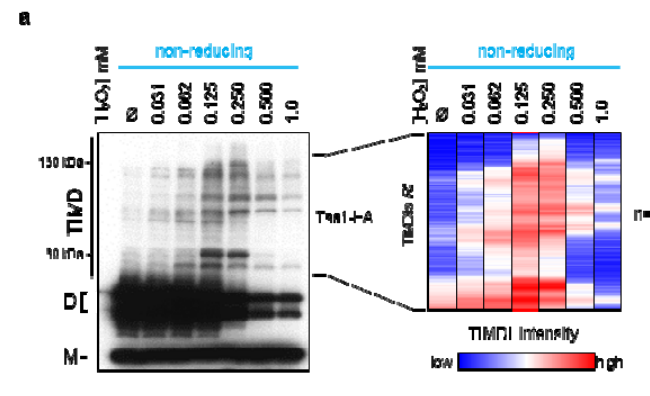

## Question

# Gene Research for Functional Annotation

## ⚠️ CRITICAL: Gene/Protein Identification Context

**BEFORE YOU BEGIN RESEARCH:** You MUST verify you are researching the CORRECT gene/protein. Gene symbols can be ambiguous, especially for less well-characterized genes from non-model organisms.

### Target Gene/Protein Identity (from UniProt):
- **UniProt Accession:** P34760
- **Protein Description:** RecName: Full=Peroxiredoxin TSA1 {ECO:0000305}; Short=Prx; EC=1.11.1.24 {ECO:0000269|PubMed:9888818}; AltName: Full=Cytoplasmic thiol peroxidase 1 {ECO:0000303|PubMed:10681558}; Short=cTPx 1 {ECO:0000303|PubMed:10681558}; AltName: Full=Protector protein {ECO:0000303|PubMed:2895105}; Short=PRP; AltName: Full=Thiol-specific antioxidant protein 1 {ECO:0000303|PubMed:8344960}; AltName: Full=Thioredoxin peroxidase type Ia {ECO:0000303|PubMed:9888818}; Short=TPx type Ia; AltName: Full=Thioredoxin-dependent peroxide reductase {ECO:0000303|PubMed:7961686}; AltName: Full=Thioredoxin-dependent peroxiredoxin TSA1 {ECO:0000305};
- **Gene Information:** Name=TSA1 {ECO:0000303|PubMed:8344960}; Synonyms=TPX1, TSA, ZRG14; OrderedLocusNames=YML028W {ECO:0000312|SGD:S000004490};
- **Organism (full):** Saccharomyces cerevisiae (strain ATCC 204508 / S288c) (Baker's yeast).
- **Protein Family:** Belongs to the peroxiredoxin family. AhpC/Prx1 subfamily.
- **Key Domains:** AhpC/TSA. (IPR000866); Peroxiredoxin. (IPR050217); Peroxiredoxin_AhpC-typ. (IPR024706); Peroxiredoxin_C. (IPR019479); Thioredoxin-like_sf. (IPR036249)

### MANDATORY VERIFICATION STEPS:

1. **Check if the gene symbol "TSA1" matches the protein description above**
2. **Verify the organism is correct:** Saccharomyces cerevisiae (strain ATCC 204508 / S288c) (Baker's yeast).
3. **Check if protein family/domains align with what you find in literature**
4. **If you find literature for a DIFFERENT gene with the same or similar symbol, STOP**

### If Gene Symbol is Ambiguous or You Cannot Find Relevant Literature:

**DO NOT PROCEED WITH RESEARCH ON A DIFFERENT GENE.** Instead:
- State clearly: "The gene symbol 'TSA1' is ambiguous or literature is limited for this specific protein"
- Explain what you found (e.g., "Found extensive literature on a different gene with the same symbol in a different organism")
- Describe the protein based ONLY on the UniProt information provided above
- Suggest that the protein function can be inferred from domain/family information

### Research Target:

Please provide a comprehensive research report on the gene **TSA1** (gene ID: TSA1, UniProt: P34760) in yeast.

The research report should be a detailed narrative explaining the function, biological processes, and localization of the gene product. Citations should be given for all claims.

You should prioritize authoritative reviews and primary scientific literature when conducting research. You can supplement
this with annotations you find in gene/protein databases, but these can be outdated or inaccurate.

We are specifically interested in the primary function of the gene - for enzymes, what reaction is catalyzed, and what is the substrate specificity? For transporters, what is the substrate? For structural proteins or adapters, what is the broader structural role? For signaling molecules, what is the role in the pathway.

We are interested in where in or outside the cell the gene product carries out its function.

We are also interested in the signaling or biochemical pathways in which the gene functions. We are less interested in broad pleiotropic effects, except where these elucidate the precise role.

Include evidence where possible. We are interested in both experimental evidence as well as inference from structure, evolution, or bioinformatic analysis. Precise studies should be prioritized over high-throughput, where available.

## Output

Question: You are an expert researcher providing comprehensive, well-cited information.

Provide detailed information focusing on:
1. Key concepts and definitions with current understanding
2. Recent developments and latest research (prioritize 2023-2024 sources)
3. Current applications and real-world implementations
4. Expert opinions and analysis from authoritative sources
5. Relevant statistics and data from recent studies

Format as a comprehensive research report with proper citations. Include URLs and publication dates where available.
Always prioritize recent, authoritative sources and provide specific citations for all major claims.

# Gene Research for Functional Annotation

## ⚠️ CRITICAL: Gene/Protein Identification Context

**BEFORE YOU BEGIN RESEARCH:** You MUST verify you are researching the CORRECT gene/protein. Gene symbols can be ambiguous, especially for less well-characterized genes from non-model organisms.

### Target Gene/Protein Identity (from UniProt):
- **UniProt Accession:** P34760
- **Protein Description:** RecName: Full=Peroxiredoxin TSA1 {ECO:0000305}; Short=Prx; EC=1.11.1.24 {ECO:0000269|PubMed:9888818}; AltName: Full=Cytoplasmic thiol peroxidase 1 {ECO:0000303|PubMed:10681558}; Short=cTPx 1 {ECO:0000303|PubMed:10681558}; AltName: Full=Protector protein {ECO:0000303|PubMed:2895105}; Short=PRP; AltName: Full=Thiol-specific antioxidant protein 1 {ECO:0000303|PubMed:8344960}; AltName: Full=Thioredoxin peroxidase type Ia {ECO:0000303|PubMed:9888818}; Short=TPx type Ia; AltName: Full=Thioredoxin-dependent peroxide reductase {ECO:0000303|PubMed:7961686}; AltName: Full=Thioredoxin-dependent peroxiredoxin TSA1 {ECO:0000305};
- **Gene Information:** Name=TSA1 {ECO:0000303|PubMed:8344960}; Synonyms=TPX1, TSA, ZRG14; OrderedLocusNames=YML028W {ECO:0000312|SGD:S000004490};
- **Organism (full):** Saccharomyces cerevisiae (strain ATCC 204508 / S288c) (Baker's yeast).
- **Protein Family:** Belongs to the peroxiredoxin family. AhpC/Prx1 subfamily.
- **Key Domains:** AhpC/TSA. (IPR000866); Peroxiredoxin. (IPR050217); Peroxiredoxin_AhpC-typ. (IPR024706); Peroxiredoxin_C. (IPR019479); Thioredoxin-like_sf. (IPR036249)

### MANDATORY VERIFICATION STEPS:

1. **Check if the gene symbol "TSA1" matches the protein description above**
2. **Verify the organism is correct:** Saccharomyces cerevisiae (strain ATCC 204508 / S288c) (Baker's yeast).
3. **Check if protein family/domains align with what you find in literature**
4. **If you find literature for a DIFFERENT gene with the same or similar symbol, STOP**

### If Gene Symbol is Ambiguous or You Cannot Find Relevant Literature:

**DO NOT PROCEED WITH RESEARCH ON A DIFFERENT GENE.** Instead:
- State clearly: "The gene symbol 'TSA1' is ambiguous or literature is limited for this specific protein"
- Explain what you found (e.g., "Found extensive literature on a different gene with the same symbol in a different organism")
- Describe the protein based ONLY on the UniProt information provided above
- Suggest that the protein function can be inferred from domain/family information

### Research Target:

Please provide a comprehensive research report on the gene **TSA1** (gene ID: TSA1, UniProt: P34760) in yeast.

The research report should be a detailed narrative explaining the function, biological processes, and localization of the gene product. Citations should be given for all claims.

You should prioritize authoritative reviews and primary scientific literature when conducting research. You can supplement
this with annotations you find in gene/protein databases, but these can be outdated or inaccurate.

We are specifically interested in the primary function of the gene - for enzymes, what reaction is catalyzed, and what is the substrate specificity? For transporters, what is the substrate? For structural proteins or adapters, what is the broader structural role? For signaling molecules, what is the role in the pathway.

We are interested in where in or outside the cell the gene product carries out its function.

We are also interested in the signaling or biochemical pathways in which the gene functions. We are less interested in broad pleiotropic effects, except where these elucidate the precise role.

Include evidence where possible. We are interested in both experimental evidence as well as inference from structure, evolution, or bioinformatic analysis. Precise studies should be prioritized over high-throughput, where available.

# Research Report: Functional Annotation of *Saccharomyces cerevisiae* **TSA1** (UniProt **P34760**, ORF **YML028W**)

## 0) Target identity verification (critical disambiguation)
The research target is the budding yeast (*Saccharomyces cerevisiae*) protein **Tsa1**, consistently described across primary and review sources as the **major cytosolic typical 2‑Cys peroxiredoxin** (Prx) with canonical active-site cysteines **Cys48 (peroxidatic, CP)** and **Cys171 (resolving, CR)**. (west2018piecingtogetherhow pages 1-3, hanzen2017proteostasisandaging pages 20-23)

## 1) Key concepts, definitions, and current mechanistic understanding

### 1.1 Peroxiredoxins and “typical 2‑Cys” mechanism
**Peroxiredoxins (Prxs)** are thiol-based peroxidases that reduce peroxides using a conserved **peroxidatic cysteine** (CP). In **typical 2‑Cys Prxs**, peroxide oxidizes CP to **CP‑SOH**, which then condenses with a **resolving cysteine** (CR) on the partner subunit to form an **inter‑subunit disulfide**; this disulfide is reduced to complete the catalytic cycle. (west2018piecingtogetherhow pages 1-3, santos2017saccharomycescerevisiaeperoxiredoxins pages 1-4)

In yeast Tsa1 specifically, the key catalytic residues are **Cys48 (CP)** and **Cys171 (CR)**. (hanzen2017proteostasisandaging pages 20-23, west2018piecingtogetherhow pages 1-3)

### 1.2 Substrates and reducing partners (thioredoxin system)
Tsa1 reduces **H2O2 and organic hydroperoxides**; in typical 2‑Cys Prxs this occurs via CP attack on the peroxide bond, generating water/alcohol products. (west2018piecingtogetherhow pages 1-3, santos2017saccharomycescerevisiaeperoxiredoxins pages 1-4)

Reduction of oxidized Tsa1 is primarily driven by the **cytosolic thioredoxin system**: **Trx1/Trx2** reduce the Tsa1 disulfide, and oxidized thioredoxin is recycled by **thioredoxin reductase** using **NADPH**. (west2018piecingtogetherhow pages 1-3, santos2017saccharomycescerevisiaeperoxiredoxins pages 1-4, seisenbacher2023peroxiredoxinylationbuffersthe pages 13-15)

### 1.3 Hyperoxidation, “floodgate” behavior, and the chaperone switch
At higher oxidant loads, Tsa1’s peroxidatic cysteine can become **hyperoxidized** (sulfinic/sulfonic states), which **inactivates peroxidase activity** and promotes formation of **higher-order oligomers** associated with **molecular chaperone/holdase activity**. (west2018piecingtogetherhow pages 1-3, seisenbacher2023peroxiredoxinylationbuffersthe pages 13-15, ohira2024theperoxiredoxintsa1 pages 1-5)

### 1.4 Abundance and why peroxiredoxins dominate peroxide metabolism
Despite lower catalytic efficiency than catalases/GPxs on a per-molecule basis, Prxs are highly abundant. Reported values for Tsa1 include ~**1% of cytosolic protein** and ~**10–50 µM** cytosolic concentration. (west2018piecingtogetherhow pages 1-3)

Reviews also emphasize that Prxs decompose **>90% of cellular hydroperoxides** and can detoxify up to **~90% of cytosolic H2O2** due to abundance and fast reaction rates (general Prx second-order rates ~10^6–10^8 M−1 s−1). (santos2017saccharomycescerevisiaeperoxiredoxins pages 1-4, seisenbacher2023peroxiredoxinylationbuffersthe pages 1-4)

## 2) Primary function: enzymology and substrate specificity

### 2.1 Enzymatic role
Tsa1’s primary biochemical role is as a **thioredoxin-dependent peroxidase** that reduces peroxides (especially **H2O2**) via the typical 2‑Cys Prx redox cycle centered on **Cys48/Cys171**. (west2018piecingtogetherhow pages 1-3, hanzen2017proteostasisandaging pages 20-23, roger2020peroxiredoxinpromoteslongevity pages 1-2)

### 2.2 Reaction-cycle integration with proteome redox buffering
Beyond detoxification, Tsa1 can enter redox-linked states that influence cellular thiol chemistry:

* **Mixed-disulfide intermediates** between Tsa1 and target proteins can form via the peroxidatic cysteine, and **thioredoxins directly remove these Tsa1–protein adducts**. (seisenbacher2023peroxiredoxinylationbuffersthe pages 1-4, seisenbacher2023peroxiredoxinylationbuffersthe pages 13-15)

This provides a mechanistic route for Tsa1 to act not only as a sink for H2O2 but also as a **regulator/buffer of protein thiol redox state**. (seisenbacher2023peroxiredoxinylationbuffersthe pages 13-15)

## 3) Subcellular localization and where function is executed
Tsa1 is repeatedly described as the **major cytosolic peroxiredoxin** in yeast. (hanzen2016lifespancontrolby pages 1-3, west2018piecingtogetherhow pages 1-3)

In addition to a free cytosolic pool, one source reports Tsa1 is also found **associated with translating ribosomes**, suggesting functional proximity to nascent polypeptides and translation-linked proteostasis. (hanzen2017proteostasisandaging pages 20-23)

## 4) Biological processes and pathways involving Tsa1

### 4.1 H2O2 signaling and nutrient signaling integration (Ras–cAMP–PKA)
A major mechanistic insight from authoritative work is that Tsa1’s contribution to stress resistance and longevity can occur **not simply by scavenging H2O2**, but through **redox modulation of nutrient signaling**.

Specifically, Tsa1 represses the **Ras–cAMP–PKA pathway** by promoting oxidative modifications of PKA catalytic subunits; redox modification of a conserved cysteine (reported as **Cys243** in the catalytic subunit) inhibits phosphorylation of **Thr241** in the activation loop and reduces kinase activity. (roger2020peroxiredoxinpromoteslongevity pages 1-2, roger2020peroxiredoxinpromoteslongevity pages 10-11)

### 4.2 Proteostasis: redox-dependent recruitment of chaperones to aggregates
A high-impact model places Tsa1 at the interface of redox and proteostasis:

* Increased dosage of Tsa1 extends replicative lifespan in a manner dependent on **Hsp70 (Ssa1/2)** and partly on **Hsp104**, and requires reduction of hyperoxidized Tsa1 by **sulfiredoxin Srx1** for aggregate clearance/disaggregation. (hanzen2016lifespancontrolby pages 1-3, hanzen2016lifespancontrolby pages 8-9)

This supports a functional switch where hyperoxidized Tsa1 acts as a **stress-activated chaperone adaptor** to recruit the protein quality control machinery. (hanzen2016lifespancontrolby pages 1-3, hanzen2017proteostasisandaging pages 50-54)

### 4.3 Genome stability (mutator suppression)
Yeast lacking TSA1 show a **mutator phenotype**, with reported **~5–10‑fold increased mutation rates**, and Tsa1 is described as the strongest suppressor of mutations among oxidant-defense genes in yeast. (west2018piecingtogetherhow pages 1-3)

Mechanistic interpretation is nuanced: mutation of the peroxidatic cysteine disrupts mutation suppression, while some resolving-cysteine mutants can still suppress mutation rates, implying that genome protection may involve **peroxidase-independent** facets (e.g., redox network effects and thioredoxin availability). (west2018piecingtogetherhow pages 6-9)

## 5) Recent developments and latest research (prioritize 2023–2024)

### 5.1 2023: “Peroxiredoxinylation” (Tsa1-induced mixed disulfides) as a proteome-wide redox buffer
A 2023 bioRxiv preprint reports that Tsa1 forms widespread covalent mixed disulfide intermediates with cellular proteins, termed **Tsa1-Induced Mixed Disulfide Intermediates (TIMDIs)**, and frames this as a bona fide redox-linked post-translational modification termed **peroxiredoxinylation**. (seisenbacher2023peroxiredoxinylationbuffersthe pages 13-15, seisenbacher2023peroxiredoxinylationbuffersthe pages 1-4)

Key quantitative findings include:

* Under low H2O2 stress, TIMDIs rise to **>20%** of the Tsa1 pool; figure quantification indicates **~25% at 0.125 mM H2O2**. (seisenbacher2023peroxiredoxinylationbuffersthe pages 6-8, seisenbacher2023peroxiredoxinylationbuffersthe media ddb673cf)
* In **trx1Δ trx2Δ** cells, TIMDIs can reach **~60%** of the Tsa1 pool, consistent with thioredoxins being key “erasers” of these adducts. (seisenbacher2023peroxiredoxinylationbuffersthe pages 13-15)
* Proteomics identified **211** interactors with WT Tsa1 versus **599** with the C171S “trap” mutant, with a large fraction of redox-sensitive interactions. (seisenbacher2023peroxiredoxinylationbuffersthe pages 6-8)

Functionally, the authors propose peroxiredoxinylation buffers proteome redox state and contributes to stress resistance; thioredoxins directly remove Tsa1-formed mixed disulfides, extending the thioredoxin–peroxiredoxin system into a **proteome-thiol buffering circuit**. (seisenbacher2023peroxiredoxinylationbuffersthe pages 1-4, seisenbacher2023peroxiredoxinylationbuffersthe pages 13-15)

### 5.2 2024: Tsa1 stabilizes the rDNA locus to extend lifespan
A 2024 bioRxiv preprint links Tsa1 to **stability of the ribosomal DNA (rDNA) repeat array** (∼150 copies). Tsa1 deficiency reduces rDNA replication initiation and increases recombination frequency, increases transcription from E‑pro toward the replication fork barrier, and is associated with shortened lifespan; importantly, rDNA instability and lifespan defects are largely suppressed by **fob1** mutation. (ohira2024theperoxiredoxintsa1 pages 1-5)

This study integrates Tsa1’s “nonperoxidase” functions with a specific chromosomal maintenance outcome, suggesting Tsa1 participates in rDNA homeostasis under replication fork arrest conditions. (ohira2024theperoxiredoxintsa1 pages 1-5)

### 5.3 2024: Peroxiredoxin urmylation context (thesis-level work)
A 2024 doctoral dissertation explicitly addresses “peroxiredoxin urmylation” in yeast and includes a section on “Peroxiredoxin Tsa1 … search for additional Urm1 targets,” indicating active investigation of Tsa1 in the Urm1 conjugation landscape, though the accessible thesis excerpts do not provide direct quantitative results for Tsa1 modification. (brachmann2024strukturelleundredoxbasierte pages 1-6)

## 6) Current applications and real-world implementations

### 6.1 Industrial yeast robustness (stress tolerance, biomass propagation)
In wine yeast / industrial propagation contexts, deletion of TSA1 affects growth and stress physiology in molasses-based biomass propagation and alters carbohydrate storage metabolites:

* TSA1 deletion diminishes growth in molasses and triggers metabolic changes impacting trehalose/glycogen accumulation. (seisenbacher2023peroxiredoxinylationbuffersthe pages 1-4)

These observations support the practical view of Tsa1 as a target for improving industrial strain robustness and stress performance, although strain-background dependence is expected. (seisenbacher2023peroxiredoxinylationbuffersthe pages 1-4)

### 6.2 Conceptual translational value
Tsa1 is orthologous to mammalian Prdx1-like proteins and is frequently used as a tractable model for redox signaling/proteostasis/genome stability, but the direct “real-world” implementations of TSA1 itself are largely in **yeast biotechnology** rather than clinical domains. (west2018piecingtogetherhow pages 1-3, seisenbacher2023peroxiredoxinylationbuffersthe pages 1-4)

## 7) Expert opinions and authoritative synthesis (what leading sources emphasize)

### 7.1 Multifunctionality (“moonlighting”) and state switching
Multiple authoritative sources converge on the view that typical 2‑Cys peroxiredoxins—especially Tsa1—are **multifunctional**: they couple peroxide detoxification, redox signaling, and conditional chaperone activity via reversible cysteine chemistry and oligomerization state changes. (west2018piecingtogetherhow pages 1-3, hanzen2016lifespancontrolby pages 1-3, seisenbacher2023peroxiredoxinylationbuffersthe pages 13-15)

### 7.2 Genome stability remains mechanistically complex
A key expert-level message from genomic stability-focused review is that Tsa1’s mutation-suppression may not require full canonical peroxidase catalysis, and may involve redox-network effects such as **thioredoxin sequestration** and impacts on downstream thioredoxin clients (e.g., ribonucleotide reductase). (west2018piecingtogetherhow pages 6-9, west2018piecingtogetherhow pages 1-3)

## 8) Key statistics and data points (curated)

* **Localization/abundance:** Cytosolic; ~**1% of cytosolic protein**; ~**10–50 µM** (west2018piecingtogetherhow pages 1-3)
* **Mutation phenotype:** tsa1Δ mutation rates **~5–10× higher** (west2018piecingtogetherhow pages 1-3)
* **Peroxiredoxinylation magnitude:** TIMDIs **>20%** of Tsa1 pool under low H2O2; **~25% at 0.125 mM H2O2** (seisenbacher2023peroxiredoxinylationbuffersthe pages 6-8, seisenbacher2023peroxiredoxinylationbuffersthe media ddb673cf)
* **Thioredoxin dependence:** TIMDIs rise to **~60%** of Tsa1 pool in trx1Δ trx2Δ (seisenbacher2023peroxiredoxinylationbuffersthe pages 13-15)
* **Interactome breadth (TIMDI trapping):** **211** WT vs **599** C171S interactors (seisenbacher2023peroxiredoxinylationbuffersthe pages 6-8)
* **Longevity:** Tsa1 overexpression increases lifespan by **~40%** (roger2020peroxiredoxinpromoteslongevity pages 1-2)
* **Stress-dependent interaction change:** Tsa1 co-purification with PKA catalytic subunit Tpk1 decreases after **0.4 mM** (p=0.00012) and **0.8 mM** (p=0.00016) H2O2 (roger2019peroxiredoxinpromoteslongevity pages 44-51)

## 9) Evidence map (compact summary table)
The table below consolidates key functional-annotation points with supporting sources and quantitative anchors.

| Functional aspect | Key findings | Representative evidence with year and URL |
|---|---|---|
| Identity / aliases | • **TSA1 / YML028W** in *Saccharomyces cerevisiae* encodes the **major cytosolic typical 2-Cys peroxiredoxin**  • Historical aliases include **thiol-specific antioxidant protein 1**, **thioredoxin peroxidase**, and **cytoplasmic thiol peroxidase**  • Orthologous to mammalian **PRDX1/Prdx1-like** enzymes (santos2017saccharomycescerevisiaeperoxiredoxins pages 1-4, west2018piecingtogetherhow pages 1-3, hanzen2016lifespancontrolby pages 1-3) | **2018** West et al., *Antioxidants* — https://doi.org/10.3390/antiox7120177 (west2018piecingtogetherhow pages 1-3) ; **2017** Santos et al. — https://doi.org/10.5772/intechopen.70401 (santos2017saccharomycescerevisiaeperoxiredoxins pages 1-4) |
| Enzymatic reaction | • Functions as a **thioredoxin-dependent peroxidase** reducing **H2O2 and hydroperoxides** to water/alcohol  • Peroxidatic Cys attacks peroxide, forming **Cys-SOH**; typical 2-Cys cycle proceeds via inter-subunit disulfide  • Peroxiredoxins can remove **>90% of cytosolic/cellular hydroperoxides** because of high abundance and fast kinetics (~10^6–10^8 M^-1 s^-1 for Prxs generally) (santos2017saccharomycescerevisiaeperoxiredoxins pages 1-4, west2018piecingtogetherhow pages 1-3, seisenbacher2023peroxiredoxinylationbuffersthe pages 1-4) | **2018** West et al. — https://doi.org/10.3390/antiox7120177 (west2018piecingtogetherhow pages 1-3) ; **2017** Santos et al. — https://doi.org/10.5772/intechopen.70401 (santos2017saccharomycescerevisiaeperoxiredoxins pages 1-4) ; **2023** Seisenbacher et al. — https://doi.org/10.1101/2023.12.13.571451 (seisenbacher2023peroxiredoxinylationbuffersthe pages 1-4) |
| Catalytic residues | • **Cys48** is the **peroxidatic cysteine (CP)**; **Cys171** is the **resolving cysteine (CR)**  • C48 is essential for peroxide reaction, H2O2 resistance, and many redox-regulatory outputs  • Hyperoxidation of C48 to sulfinic/sulfonic states inactivates peroxidase function and promotes noncanonical activities (hanzen2017proteostasisandaging pages 20-23, west2018piecingtogetherhow pages 1-3, seisenbacher2023peroxiredoxinylationbuffersthe pages 13-15) | **2017** Hanzén thesis — no URL available in source set (hanzen2017proteostasisandaging pages 20-23) ; **2018** West et al. — https://doi.org/10.3390/antiox7120177 (west2018piecingtogetherhow pages 1-3) ; **2023** Seisenbacher et al. — https://doi.org/10.1101/2023.12.13.571451 (seisenbacher2023peroxiredoxinylationbuffersthe pages 13-15) |
| Redox cycle partners | • Oxidized Tsa1 disulfide is reduced by **thioredoxins Trx1/Trx2**; oxidized thioredoxin is recycled by **thioredoxin reductase (Trr)** using **NADPH**  • Tsa1 is a major substrate of the cytosolic thioredoxin system  • Thioredoxins also directly resolve Tsa1 mixed-disulfide adducts with client proteins (west2018piecingtogetherhow pages 1-3, seisenbacher2023peroxiredoxinylationbuffersthe pages 13-15, west2018piecingtogetherhow pages 6-9) | **2018** West et al. — https://doi.org/10.3390/antiox7120177 (west2018piecingtogetherhow pages 1-3) ; **2023** Seisenbacher et al. — https://doi.org/10.1101/2023.12.13.571451 (seisenbacher2023peroxiredoxinylationbuffersthe pages 13-15) |
| Localization | • Tsa1 is the **major cytosolic** peroxiredoxin in budding yeast  • Also reported as present **associated with translating ribosomes** in addition to free cytosolic pool  • Cytosolic abundance estimated at **~10–50 µM** and about **~1% of cytosolic protein** (hanzen2017proteostasisandaging pages 20-23, west2018piecingtogetherhow pages 1-3, hanzen2016lifespancontrolby pages 1-3) | **2018** West et al. — https://doi.org/10.3390/antiox7120177 (west2018piecingtogetherhow pages 1-3) ; **2016** Hanzén et al., *Cell* — https://doi.org/10.1016/j.cell.2016.05.006 (hanzen2016lifespancontrolby pages 1-3) |
| Redox signaling targets / pathways | • Tsa1 mediates **redox repression of Ras–cAMP–PKA signaling**, not just peroxide detoxification  • Promotes oxidative modification of **PKA catalytic subunits**; **Cys243** redox control blocks **Thr241** activation-loop phosphorylation  • This mechanism explains improved **H2O2 resistance** and longevity control beyond scavenging alone (roger2020peroxiredoxinpromoteslongevity pages 1-2, roger2020peroxiredoxinpromoteslongevity pages 10-11, roger2019peroxiredoxinpromoteslongevity pages 44-51) | **2020** Roger et al., *eLife* — https://doi.org/10.7554/elife.60346 (roger2020peroxiredoxinpromoteslongevity pages 1-2) ; **2019 preprint data underlying 2020 paper** — https://doi.org/10.1101/676270 (roger2019peroxiredoxinpromoteslongevity pages 44-51) |
| Proteostasis / chaperone switch | • Hyperoxidized Tsa1 forms higher-order assemblies and switches from peroxidase to **molecular chaperone / holdase**  • Recruits **Hsp70 (Ssa1/2)** and **Hsp104** to oxidatively damaged aggregates; Tsa1 appears early at aggregates  • Mild Tsa1 overexpression extends lifespan by **~40%** in yeast; Tsa1 overproduction lowers age-related aggregate burden without increasing scavenging (hanzen2017proteostasisandaging pages 50-54, roger2020peroxiredoxinpromoteslongevity pages 1-2, hanzen2016lifespancontrolby pages 1-3, hanzen2016lifespancontrolby pages 8-9) | **2016** Hanzén et al., *Cell* — https://doi.org/10.1016/j.cell.2016.05.006 (hanzen2016lifespancontrolby pages 1-3) ; **2020** Roger et al., *eLife* — https://doi.org/10.7554/elife.60346 (roger2020peroxiredoxinpromoteslongevity pages 1-2) |
| Genome stability / rDNA | • **tsa1Δ** cells show a **~5–10-fold increase in mutation rates**, establishing Tsa1 as a major anti-mutator oxidant-defense factor  • Tsa1 suppresses genome instability partly through C48-dependent functions; full canonical peroxidase activity may not be strictly required for mutation suppression  • **2024** work links Tsa1 to **rDNA stability**: tsa1Δ causes reduced rDNA origin firing, increased recombination, increased E-pro transcription, and shortened lifespan; many defects are suppressed by **fob1** mutation (west2018piecingtogetherhow pages 1-3, west2018piecingtogetherhow pages 6-9, ohira2024theperoxiredoxintsa1 pages 1-5) | **2018** West et al. — https://doi.org/10.3390/antiox7120177 (west2018piecingtogetherhow pages 1-3) ; **2024** Ohira et al. — https://doi.org/10.1101/2024.03.14.585068 (ohira2024theperoxiredoxintsa1 pages 1-5) |
| Peroxiredoxinylation | • **2023–2024 priority finding:** Tsa1 forms widespread **Tsa1-induced mixed disulfide intermediates (TIMDIs)** with client proteins; authors term this **peroxiredoxinylation**  • TIMDIs rise to **>20% of the Tsa1 pool** under low H2O2 stress and up to **~60%** in **trx1Δ trx2Δ** cells  • Proteomics identified **211 WT** interactors and **599 C171S** interactors; validated targets include **Cdc19** and **Gnd1**; Y78A reduces TIMDI formation (seisenbacher2023peroxiredoxinylationbuffersthe pages 6-8, seisenbacher2023peroxiredoxinylationbuffersthe pages 13-15, seisenbacher2023peroxiredoxinylationbuffersthe pages 4-6, seisenbacher2023peroxiredoxinylationbuffersthe pages 15-17) | **2023** Seisenbacher et al. — https://doi.org/10.1101/2023.12.13.571451 (seisenbacher2023peroxiredoxinylationbuffersthe pages 6-8) ; **2023** same study, mechanistic/quantitative pages (seisenbacher2023peroxiredoxinylationbuffersthe pages 13-15) |
| Industrial / real-world applications | • In wine and biomass-propagation strains, **TSA1 deletion alters trehalose/glycogen metabolism**, stress performance, and fermentation-associated outputs  • tsa1Δ reduces growth in **molasses** and lowers **fermentative capacity**; it also changes acetic acid/acetaldehyde production  • These data support Tsa1 as a target for optimizing **industrial yeast robustness**, stress tolerance, and biomass production (seisenbacher2023peroxiredoxinylationbuffersthe pages 1-4) | **2020** Garrigós et al., *Microorganisms* — https://doi.org/10.3390/microorganisms8101537 (seisenbacher2023peroxiredoxinylationbuffersthe pages 1-4) |

*Table: This table summarizes the main experimentally supported functional annotation points for yeast TSA1/P34760, emphasizing enzymatic mechanism, localization, signaling, proteostasis, genome stability, and recent 2023–2024 developments. It is useful as a compact evidence map for downstream gene-function annotation.*

## 10) Visual evidence: TIMDI/peroxiredoxinylation induction
Figure evidence supporting stress-induced TIMDI formation and the quantitative ~25% TIMDI fraction at 0.125 mM H2O2 is available from Seisenbacher et al. 2023 Figure 2. (seisenbacher2023peroxiredoxinylationbuffersthe media ddb673cf, seisenbacher2023peroxiredoxinylationbuffersthe media ee1d8fd5)

## 11) Limitations and evidence-quality notes
* Several **2023–2024** findings are currently available as **bioRxiv preprints** (peroxiredoxinylation; rDNA stability). Their claims are supported by presented experiments but may evolve upon peer review. (seisenbacher2023peroxiredoxinylationbuffersthe pages 13-15, ohira2024theperoxiredoxintsa1 pages 1-5)
* The Urm1/urmylation connection to **Tsa1** is suggested by a 2024 thesis structure and context but the provided accessible pages do not include direct Tsa1-specific modification data; conclusions are therefore conservative. (brachmann2024strukturelleundredoxbasierte pages 1-6)

## Key source URLs and publication dates (selected)
* Seisenbacher et al. **2023-12** (bioRxiv): https://doi.org/10.1101/2023.12.13.571451 (seisenbacher2023peroxiredoxinylationbuffersthe pages 1-4)
* Ohira et al. **2024-03** (bioRxiv): https://doi.org/10.1101/2024.03.14.585068 (ohira2024theperoxiredoxintsa1 pages 1-5)
* Roger et al. **2020-07** (*eLife*): https://doi.org/10.7554/elife.60346 (roger2020peroxiredoxinpromoteslongevity pages 1-2)
* Hanzén et al. **2016-06** (*Cell*): https://doi.org/10.1016/j.cell.2016.05.006 (hanzen2016lifespancontrolby pages 1-3)
* West et al. **2018-11** (*Antioxidants*): https://doi.org/10.3390/antiox7120177 (west2018piecingtogetherhow pages 1-3)
* Garrigós et al. **2020-10** (*Microorganisms*): https://doi.org/10.3390/microorganisms8101537 (seisenbacher2023peroxiredoxinylationbuffersthe pages 1-4)

References

1. (west2018piecingtogetherhow pages 1-3): James D. West, Trevor J. Roston, Joseph B. David, Kristin M. Allan, and Matthew A. Loberg. Piecing together how peroxiredoxins maintain genomic stability. Antioxidants, 7:177, Nov 2018. URL: https://doi.org/10.3390/antiox7120177, doi:10.3390/antiox7120177. This article has 24 citations.

2. (hanzen2017proteostasisandaging pages 20-23): S Hanzén. Proteostasis and aging in saccharomyces cerevisiae: the role of a peroxiredoxin. Unknown journal, 2017.

3. (santos2017saccharomycescerevisiaeperoxiredoxins pages 1-4): Melina C. Santos, Carlos A. Breyer, Leonardo Schultz, Karen S. Romanello, Anderson F. Cunha, Carlos A. Tairum Jr, and Marcos Antonio de Oliveira. Saccharomyces cerevisiae peroxiredoxins in biological processes: antioxidant defense, signal transduction, circadian rhythm, and more. ArXiv, Dec 2017. URL: https://doi.org/10.5772/intechopen.70401, doi:10.5772/intechopen.70401. This article has 1 citations.

4. (seisenbacher2023peroxiredoxinylationbuffersthe pages 13-15): Gerhard Seisenbacher, Zrinka Raguz Nakic, Eva Borràs, Eduard Sabidó, Uwe Sauer, Eulalia de Nadal, and Francesc Posas. Peroxiredoxinylation buffers the redox state of the proteome upon cellular stress. bioRxiv, Dec 2023. URL: https://doi.org/10.1101/2023.12.13.571451, doi:10.1101/2023.12.13.571451. This article has 1 citations.

5. (ohira2024theperoxiredoxintsa1 pages 1-5): Junno Ohira, Mariko Sasaki, and Takehiko Kobayashi. The peroxiredoxin tsa1 extends the lifespan of budding yeast by maintaining the stability of the ribosomal rna gene cluster. bioRxiv, Mar 2024. URL: https://doi.org/10.1101/2024.03.14.585068, doi:10.1101/2024.03.14.585068. This article has 0 citations.

6. (seisenbacher2023peroxiredoxinylationbuffersthe pages 1-4): Gerhard Seisenbacher, Zrinka Raguz Nakic, Eva Borràs, Eduard Sabidó, Uwe Sauer, Eulalia de Nadal, and Francesc Posas. Peroxiredoxinylation buffers the redox state of the proteome upon cellular stress. bioRxiv, Dec 2023. URL: https://doi.org/10.1101/2023.12.13.571451, doi:10.1101/2023.12.13.571451. This article has 1 citations.

7. (roger2020peroxiredoxinpromoteslongevity pages 1-2): Friederike Roger, Cecilia Picazo, Wolfgang Reiter, Marouane Libiad, Chikako Asami, Sarah Hanzén, Chunxia Gao, Gilles Lagniel, Niek Welkenhuysen, Jean Labarre, Thomas Nyström, Morten Grøtli, Markus Hartl, Michel B Toledano, and Mikael Molin. Peroxiredoxin promotes longevity and h2o2-resistance in yeast through redox-modulation of protein kinase a. eLife, Jul 2020. URL: https://doi.org/10.7554/elife.60346, doi:10.7554/elife.60346. This article has 41 citations and is from a domain leading peer-reviewed journal.

8. (hanzen2016lifespancontrolby pages 1-3): Sarah Hanzén, Katarina Vielfort, Junsheng Yang, Friederike Roger, Veronica Andersson, Sara Zamarbide-Forés, Rebecca Andersson, Lisa Malm, Gael Palais, Benoît Biteau, Beidong Liu, Michel B. Toledano, Mikael Molin, and Thomas Nyström. Lifespan control by redox-dependent recruitment of chaperones to misfolded proteins. Cell, 166:140-151, Jun 2016. URL: https://doi.org/10.1016/j.cell.2016.05.006, doi:10.1016/j.cell.2016.05.006. This article has 190 citations and is from a highest quality peer-reviewed journal.

9. (roger2020peroxiredoxinpromoteslongevity pages 10-11): Friederike Roger, Cecilia Picazo, Wolfgang Reiter, Marouane Libiad, Chikako Asami, Sarah Hanzén, Chunxia Gao, Gilles Lagniel, Niek Welkenhuysen, Jean Labarre, Thomas Nyström, Morten Grøtli, Markus Hartl, Michel B Toledano, and Mikael Molin. Peroxiredoxin promotes longevity and h2o2-resistance in yeast through redox-modulation of protein kinase a. eLife, Jul 2020. URL: https://doi.org/10.7554/elife.60346, doi:10.7554/elife.60346. This article has 41 citations and is from a domain leading peer-reviewed journal.

10. (hanzen2016lifespancontrolby pages 8-9): Sarah Hanzén, Katarina Vielfort, Junsheng Yang, Friederike Roger, Veronica Andersson, Sara Zamarbide-Forés, Rebecca Andersson, Lisa Malm, Gael Palais, Benoît Biteau, Beidong Liu, Michel B. Toledano, Mikael Molin, and Thomas Nyström. Lifespan control by redox-dependent recruitment of chaperones to misfolded proteins. Cell, 166:140-151, Jun 2016. URL: https://doi.org/10.1016/j.cell.2016.05.006, doi:10.1016/j.cell.2016.05.006. This article has 190 citations and is from a highest quality peer-reviewed journal.

11. (hanzen2017proteostasisandaging pages 50-54): S Hanzén. Proteostasis and aging in saccharomyces cerevisiae: the role of a peroxiredoxin. Unknown journal, 2017.

12. (west2018piecingtogetherhow pages 6-9): James D. West, Trevor J. Roston, Joseph B. David, Kristin M. Allan, and Matthew A. Loberg. Piecing together how peroxiredoxins maintain genomic stability. Antioxidants, 7:177, Nov 2018. URL: https://doi.org/10.3390/antiox7120177, doi:10.3390/antiox7120177. This article has 24 citations.

13. (seisenbacher2023peroxiredoxinylationbuffersthe pages 6-8): Gerhard Seisenbacher, Zrinka Raguz Nakic, Eva Borràs, Eduard Sabidó, Uwe Sauer, Eulalia de Nadal, and Francesc Posas. Peroxiredoxinylation buffers the redox state of the proteome upon cellular stress. bioRxiv, Dec 2023. URL: https://doi.org/10.1101/2023.12.13.571451, doi:10.1101/2023.12.13.571451. This article has 1 citations.

14. (seisenbacher2023peroxiredoxinylationbuffersthe media ddb673cf): Gerhard Seisenbacher, Zrinka Raguz Nakic, Eva Borràs, Eduard Sabidó, Uwe Sauer, Eulalia de Nadal, and Francesc Posas. Peroxiredoxinylation buffers the redox state of the proteome upon cellular stress. bioRxiv, Dec 2023. URL: https://doi.org/10.1101/2023.12.13.571451, doi:10.1101/2023.12.13.571451. This article has 1 citations.

15. (brachmann2024strukturelleundredoxbasierte pages 1-6): C Brachmann. Strukturelle und redox-basierte voraussetzungen für peroxiredoxin-urmylierung in der hefe saccharomyces cerevisiae. Unknown journal, 2024.

16. (roger2019peroxiredoxinpromoteslongevity pages 44-51): Friederike Roger, Cecilia Picazo, Wolfgang Reiter, Marouane Libiad, Chikako Asami, Sarah Hanzén, Chunxia Gao, Gilles Lagniel, Niek Welkenhuysen, Jean Labarre, Thomas Nyström, Morten Grøtli, Markus Hartl, Michel B. Toledano, and Mikael Molin. Peroxiredoxin promotes longevity and h2o2-resistance in yeast through redox-modulation of protein kinase a. Unknown journal, Jun 2019. URL: https://doi.org/10.1101/676270, doi:10.1101/676270.

17. (seisenbacher2023peroxiredoxinylationbuffersthe pages 4-6): Gerhard Seisenbacher, Zrinka Raguz Nakic, Eva Borràs, Eduard Sabidó, Uwe Sauer, Eulalia de Nadal, and Francesc Posas. Peroxiredoxinylation buffers the redox state of the proteome upon cellular stress. bioRxiv, Dec 2023. URL: https://doi.org/10.1101/2023.12.13.571451, doi:10.1101/2023.12.13.571451. This article has 1 citations.

18. (seisenbacher2023peroxiredoxinylationbuffersthe pages 15-17): Gerhard Seisenbacher, Zrinka Raguz Nakic, Eva Borràs, Eduard Sabidó, Uwe Sauer, Eulalia de Nadal, and Francesc Posas. Peroxiredoxinylation buffers the redox state of the proteome upon cellular stress. bioRxiv, Dec 2023. URL: https://doi.org/10.1101/2023.12.13.571451, doi:10.1101/2023.12.13.571451. This article has 1 citations.

19. (seisenbacher2023peroxiredoxinylationbuffersthe media ee1d8fd5): Gerhard Seisenbacher, Zrinka Raguz Nakic, Eva Borràs, Eduard Sabidó, Uwe Sauer, Eulalia de Nadal, and Francesc Posas. Peroxiredoxinylation buffers the redox state of the proteome upon cellular stress. bioRxiv, Dec 2023. URL: https://doi.org/10.1101/2023.12.13.571451, doi:10.1101/2023.12.13.571451. This article has 1 citations.

## Artifacts

- [Edison artifact artifact-00](TSA1-deep-research-falcon_artifacts/artifact-00.md)

## Citations

1. west2018piecingtogetherhow pages 1-3
2. seisenbacher2023peroxiredoxinylationbuffersthe pages 13-15
3. hanzen2017proteostasisandaging pages 20-23
4. west2018piecingtogetherhow pages 6-9
5. seisenbacher2023peroxiredoxinylationbuffersthe pages 6-8
6. brachmann2024strukturelleundredoxbasierte pages 1-6
7. seisenbacher2023peroxiredoxinylationbuffersthe pages 1-4
8. roger2020peroxiredoxinpromoteslongevity pages 1-2
9. roger2019peroxiredoxinpromoteslongevity pages 44-51
10. santos2017saccharomycescerevisiaeperoxiredoxins pages 1-4
11. hanzen2016lifespancontrolby pages 1-3
12. roger2020peroxiredoxinpromoteslongevity pages 10-11
13. hanzen2016lifespancontrolby pages 8-9
14. hanzen2017proteostasisandaging pages 50-54
15. seisenbacher2023peroxiredoxinylationbuffersthe pages 4-6
16. seisenbacher2023peroxiredoxinylationbuffersthe pages 15-17
17. https://doi.org/10.3390/antiox7120177
18. https://doi.org/10.5772/intechopen.70401
19. https://doi.org/10.1101/2023.12.13.571451
20. https://doi.org/10.1016/j.cell.2016.05.006
21. https://doi.org/10.7554/elife.60346
22. https://doi.org/10.1101/676270
23. https://doi.org/10.1101/2024.03.14.585068
24. https://doi.org/10.3390/microorganisms8101537
25. https://doi.org/10.3390/antiox7120177,
26. https://doi.org/10.5772/intechopen.70401,
27. https://doi.org/10.1101/2023.12.13.571451,
28. https://doi.org/10.1101/2024.03.14.585068,
29. https://doi.org/10.7554/elife.60346,
30. https://doi.org/10.1016/j.cell.2016.05.006,
31. https://doi.org/10.1101/676270,